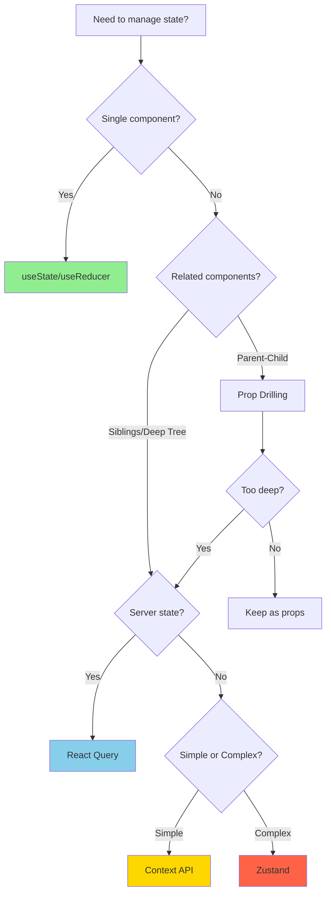

# React State Management

## Quick Reference

**Navigation**: [Stack Libraries](../README.md) > [TypeScript React](./README.md) > State Management

**Related Guides**:

- [Idioms](./ex-so-plwe-tsre__idioms.md) - useState and useReducer patterns
- [Hooks](./ex-so-plwe-tsre__hooks.md) - React Hooks guide
- [Component Architecture](./ex-so-plwe-tsre__component-architecture.md) - Component patterns
- [Performance](./ex-so-plwe-tsre__performance.md) - State optimization

## Overview

State management is central to React applications. This guide covers patterns for local state, shared state, and server state management, helping you choose the right tool for each use case.

**Target Audience**: Developers building React applications needing to manage complex state across components, particularly Islamic finance platforms with multi-step forms, real-time calculations, and data synchronization.

**React Version**: React 18.2+ with TypeScript 5+

## State Categories

### Local Component State

State used within a single component:

```typescript
export const ZakatCalculator: React.FC = () => {
  // Simple value
  const [amount, setAmount] = useState<number>(0);

  // Complex object
  const [assets, setAssets] = useState<Asset[]>([]);

  // Derived state (computed from other state)
  const totalWealth = assets.reduce((sum, asset) => sum + asset.value, 0);
  const zakatDue = totalWealth * 0.025;

  return (
    <div>
      <input
        type="number"
        value={amount}
        onChange={e => setAmount(Number(e.target.value))}
      />
      <p>Zakat due: {zakatDue}</p>
    </div>
  );
};
```

### Shared Component State

State shared between related components (prop drilling):

```typescript
// Parent component manages shared state
export const DonationFlow: React.FC = () => {
  const [donation, setDonation] = useState<Partial<Donation>>({});
  const [step, setStep] = useState<number>(1);

  const updateDonation = (updates: Partial<Donation>) => {
    setDonation(prev => ({ ...prev, ...updates }));
  };

  return (
    <div className="donation-flow">
      {step === 1 && (
        <CampaignSelection
          selectedCampaign={donation.campaignId}
          onSelect={campaignId => updateDonation({ campaignId })}
          onNext={() => setStep(2)}
        />
      )}

      {step === 2 && (
        <DonationAmount
          amount={donation.amount}
          onChange={amount => updateDonation({ amount })}
          onNext={() => setStep(3)}
          onBack={() => setStep(1)}
        />
      )}

      {step === 3 && (
        <DonorInformation
          donor={donation.donor}
          onChange={donor => updateDonation({ donor })}
          onSubmit={() => submitDonation(donation)}
          onBack={() => setStep(2)}
        />
      )}
    </div>
  );
};
```

### Application State

State needed across many unrelated components:

```typescript
// Use Context API or state management library
const AuthContext = React.createContext<AuthState | undefined>(undefined);

export const App: React.FC = () => {
  const [user, setUser] = useState<User | null>(null);

  return (
    <AuthContext.Provider value={{ user, setUser }}>
      <Router>
        <Routes />
      </Router>
    </AuthContext.Provider>
  );
};
```

### Server State

Data fetched from APIs (use React Query or similar):

```typescript
import { useQuery } from '@tanstack/react-query';

export const DonationsList: React.FC = () => {
  const { data, isLoading, error } = useQuery({
    queryKey: ['donations'],
    queryFn: () => fetch('/api/donations').then(res => res.json()),
  });

  if (isLoading) return <LoadingSpinner />;
  if (error) return <ErrorMessage error={error} />;

  return (
    <ul>
      {data.map(donation => (
        <li key={donation.id}>{donation.campaignName}</li>
      ))}
    </ul>
  );
};
```

## useState Patterns

### Functional Updates

Use functional updates when new state depends on previous state:

```typescript
export const AssetManager: React.FC = () => {
  const [assets, setAssets] = useState<Asset[]>([]);

  // ✅ Good - functional update
  const addAsset = (newAsset: Asset) => {
    setAssets(prev => [...prev, newAsset]);
  };

  // ❌ Bad - can cause stale closure issues
  const addAssetBad = (newAsset: Asset) => {
    setAssets([...assets, newAsset]);
  };

  return (
    <div>
      <button onClick={() => addAsset({ id: '1', value: 1000 })}>
        Add Asset
      </button>
    </div>
  );
};
```

### Object State Updates

Immutably update object state:

```typescript
interface DonationForm {
  campaignId: string;
  amount: number;
  donor: {
    name: string;
    email: string;
  };
  isRecurring: boolean;
}

export const DonationForm: React.FC = () => {
  const [form, setForm] = useState<DonationForm>({
    campaignId: '',
    amount: 0,
    donor: { name: '', email: '' },
    isRecurring: false,
  });

  // Update top-level field
  const updateAmount = (amount: number) => {
    setForm(prev => ({ ...prev, amount }));
  };

  // Update nested field
  const updateDonorName = (name: string) => {
    setForm(prev => ({
      ...prev,
      donor: { ...prev.donor, name },
    }));
  };

  return (
    <form>
      <input
        type="number"
        value={form.amount}
        onChange={e => updateAmount(Number(e.target.value))}
      />
      <input
        type="text"
        value={form.donor.name}
        onChange={e => updateDonorName(e.target.value)}
      />
    </form>
  );
};
```

### Array State Updates

Immutably update array state:

```typescript
export const TaskList: React.FC = () => {
  const [tasks, setTasks] = useState<Task[]>([]);

  // Add item
  const addTask = (task: Task) => {
    setTasks(prev => [...prev, task]);
  };

  // Remove item
  const removeTask = (taskId: string) => {
    setTasks(prev => prev.filter(task => task.id !== taskId));
  };

  // Update item
  const updateTask = (taskId: string, updates: Partial<Task>) => {
    setTasks(prev =>
      prev.map(task =>
        task.id === taskId ? { ...task, ...updates } : task
      )
    );
  };

  // Replace item
  const replaceTask = (taskId: string, newTask: Task) => {
    setTasks(prev =>
      prev.map(task => (task.id === taskId ? newTask : task))
    );
  };

  // Sort items
  const sortByDate = () => {
    setTasks(prev => [...prev].sort((a, b) => a.date.getTime() - b.date.getTime()));
  };

  return <div>{/* UI */}</div>;
};
```

## useReducer Pattern

Use `useReducer` for complex state logic:

```typescript
// State type
interface ZakatState {
  assets: Asset[];
  nisabRate: number;
  calculation: ZakatCalculation | null;
  loading: boolean;
  error: Error | null;
}

// Action types
type ZakatAction =
  | { type: 'ADD_ASSET'; payload: Asset }
  | { type: 'REMOVE_ASSET'; payload: string }
  | { type: 'UPDATE_ASSET'; payload: { id: string; updates: Partial<Asset> } }
  | { type: 'SET_NISAB_RATE'; payload: number }
  | { type: 'CALCULATE_SUCCESS'; payload: ZakatCalculation }
  | { type: 'CALCULATE_ERROR'; payload: Error }
  | { type: 'SET_LOADING'; payload: boolean };

// Reducer function
function zakatReducer(state: ZakatState, action: ZakatAction): ZakatState {
  switch (action.type) {
    case 'ADD_ASSET':
      return {
        ...state,
        assets: [...state.assets, action.payload],
      };

    case 'REMOVE_ASSET':
      return {
        ...state,
        assets: state.assets.filter(asset => asset.id !== action.payload),
      };

    case 'UPDATE_ASSET':
      return {
        ...state,
        assets: state.assets.map(asset =>
          asset.id === action.payload.id
            ? { ...asset, ...action.payload.updates }
            : asset
        ),
      };

    case 'SET_NISAB_RATE':
      return {
        ...state,
        nisabRate: action.payload,
      };

    case 'CALCULATE_SUCCESS':
      return {
        ...state,
        calculation: action.payload,
        loading: false,
        error: null,
      };

    case 'CALCULATE_ERROR':
      return {
        ...state,
        error: action.payload,
        loading: false,
      };

    case 'SET_LOADING':
      return {
        ...state,
        loading: action.payload,
      };

    default:
      return state;
  }
}

// Component using reducer
export const ZakatCalculator: React.FC = () => {
  const [state, dispatch] = useReducer(zakatReducer, {
    assets: [],
    nisabRate: 0,
    calculation: null,
    loading: false,
    error: null,
  });

  const addAsset = (asset: Asset) => {
    dispatch({ type: 'ADD_ASSET', payload: asset });
  };

  const removeAsset = (id: string) => {
    dispatch({ type: 'REMOVE_ASSET', payload: id });
  };

  const calculateZakat = async () => {
    dispatch({ type: 'SET_LOADING', payload: true });

    try {
      const calculation = await zakatApi.calculate(state.assets, state.nisabRate);
      dispatch({ type: 'CALCULATE_SUCCESS', payload: calculation });
    } catch (error) {
      dispatch({ type: 'CALCULATE_ERROR', payload: error as Error });
    }
  };

  return (
    <div>
      <AssetList
        assets={state.assets}
        onAdd={addAsset}
        onRemove={removeAsset}
      />
      <button onClick={calculateZakat} disabled={state.loading}>
        Calculate
      </button>
      {state.calculation && <ZakatDisplay calculation={state.calculation} />}
      {state.error && <ErrorMessage error={state.error} />}
    </div>
  );
};
```

## Context API

Share state across component tree without prop drilling:

### Basic Context Pattern

```typescript
// 1. Create context and types
interface AuthContextValue {
  user: User | null;
  login: (email: string, password: string) => Promise<void>;
  logout: () => Promise<void>;
  loading: boolean;
}

const AuthContext = React.createContext<AuthContextValue | undefined>(undefined);

// 2. Create hook for consuming context
export function useAuth() {
  const context = useContext(AuthContext);
  if (!context) {
    throw new Error('useAuth must be used within AuthProvider');
  }
  return context;
}

// 3. Create provider component
interface AuthProviderProps {
  children: React.ReactNode;
}

export const AuthProvider: React.FC<AuthProviderProps> = ({ children }) => {
  const [user, setUser] = useState<User | null>(null);
  const [loading, setLoading] = useState(true);

  // Initialize auth state
  useEffect(() => {
    const initAuth = async () => {
      try {
        const currentUser = await authApi.getCurrentUser();
        setUser(currentUser);
      } catch (error) {
        setUser(null);
      } finally {
        setLoading(false);
      }
    };

    initAuth();
  }, []);

  const login = useCallback(async (email: string, password: string) => {
    const user = await authApi.login(email, password);
    setUser(user);
  }, []);

  const logout = useCallback(async () => {
    await authApi.logout();
    setUser(null);
  }, []);

  const value: AuthContextValue = {
    user,
    login,
    logout,
    loading,
  };

  return <AuthContext.Provider value={value}>{children}</AuthContext.Provider>;
};

// 4. Use in components
export const Dashboard: React.FC = () => {
  const { user, logout } = useAuth();

  return (
    <div>
      <h1>Welcome, {user?.name}</h1>
      <button onClick={logout}>Logout</button>
    </div>
  );
};
```

### Context with Reducer

Combine Context with useReducer for complex state:

```typescript
// State and actions
interface DonationState {
  campaigns: Campaign[];
  currentDonation: Partial<Donation>;
  step: number;
  loading: boolean;
  error: Error | null;
}

type DonationAction =
  | { type: 'SET_CAMPAIGNS'; payload: Campaign[] }
  | { type: 'UPDATE_DONATION'; payload: Partial<Donation> }
  | { type: 'NEXT_STEP' }
  | { type: 'PREV_STEP' }
  | { type: 'SET_LOADING'; payload: boolean }
  | { type: 'SET_ERROR'; payload: Error };

// Reducer
function donationReducer(state: DonationState, action: DonationAction): DonationState {
  switch (action.type) {
    case 'SET_CAMPAIGNS':
      return { ...state, campaigns: action.payload };

    case 'UPDATE_DONATION':
      return {
        ...state,
        currentDonation: { ...state.currentDonation, ...action.payload },
      };

    case 'NEXT_STEP':
      return { ...state, step: state.step + 1 };

    case 'PREV_STEP':
      return { ...state, step: Math.max(1, state.step - 1) };

    case 'SET_LOADING':
      return { ...state, loading: action.payload };

    case 'SET_ERROR':
      return { ...state, error: action.payload, loading: false };

    default:
      return state;
  }
}

// Context
interface DonationContextValue {
  state: DonationState;
  dispatch: React.Dispatch<DonationAction>;
}

const DonationContext = React.createContext<DonationContextValue | undefined>(
  undefined
);

export function useDonation() {
  const context = useContext(DonationContext);
  if (!context) {
    throw new Error('useDonation must be used within DonationProvider');
  }
  return context;
}

// Provider
export const DonationProvider: React.FC<{ children: React.ReactNode }> = ({
  children,
}) => {
  const [state, dispatch] = useReducer(donationReducer, {
    campaigns: [],
    currentDonation: {},
    step: 1,
    loading: false,
    error: null,
  });

  // Fetch campaigns on mount
  useEffect(() => {
    const fetchCampaigns = async () => {
      dispatch({ type: 'SET_LOADING', payload: true });
      try {
        const campaigns = await donationApi.getCampaigns();
        dispatch({ type: 'SET_CAMPAIGNS', payload: campaigns });
      } catch (error) {
        dispatch({ type: 'SET_ERROR', payload: error as Error });
      }
    };

    fetchCampaigns();
  }, []);

  return (
    <DonationContext.Provider value={{ state, dispatch }}>
      {children}
    </DonationContext.Provider>
  );
};

// Usage
export const DonationFlow: React.FC = () => {
  const { state, dispatch } = useDonation();

  const nextStep = () => dispatch({ type: 'NEXT_STEP' });
  const prevStep = () => dispatch({ type: 'PREV_STEP' });

  return (
    <div>
      {state.step === 1 && <CampaignSelection campaigns={state.campaigns} />}
      {state.step === 2 && <DonationAmount />}
      {state.step === 3 && <Confirmation />}

      <button onClick={prevStep} disabled={state.step === 1}>
        Back
      </button>
      <button onClick={nextStep} disabled={state.step === 3}>
        Next
      </button>
    </div>
  );
};
```

### Context Performance Optimization

Split contexts to prevent unnecessary re-renders:

```typescript
// Split state and actions into separate contexts
interface AppState {
  theme: 'light' | 'dark';
  language: 'en' | 'ar';
  user: User | null;
}

interface AppActions {
  setTheme: (theme: 'light' | 'dark') => void;
  setLanguage: (lang: 'en' | 'ar') => void;
  setUser: (user: User | null) => void;
}

const AppStateContext = React.createContext<AppState | undefined>(undefined);
const AppActionsContext = React.createContext<AppActions | undefined>(undefined);

export function useAppState() {
  const context = useContext(AppStateContext);
  if (!context) throw new Error('useAppState must be used within AppProvider');
  return context;
}

export function useAppActions() {
  const context = useContext(AppActionsContext);
  if (!context) throw new Error('useAppActions must be used within AppProvider');
  return context;
}

export const AppProvider: React.FC<{ children: React.ReactNode }> = ({ children }) => {
  const [theme, setTheme] = useState<'light' | 'dark'>('light');
  const [language, setLanguage] = useState<'en' | 'ar'>('en');
  const [user, setUser] = useState<User | null>(null);

  // State rarely changes
  const state: AppState = { theme, language, user };

  // Actions never change (memoized)
  const actions: AppActions = useMemo(
    () => ({ setTheme, setLanguage, setUser }),
    []
  );

  return (
    <AppStateContext.Provider value={state}>
      <AppActionsContext.Provider value={actions}>
        {children}
      </AppActionsContext.Provider>
    </AppStateContext.Provider>
  );
};

// Components only re-render when their dependencies change
export const ThemeToggle: React.FC = () => {
  // Only subscribes to actions, not state
  const { setTheme } = useAppActions();

  return <button onClick={() => setTheme('dark')}>Toggle Theme</button>;
};

export const ThemeDisplay: React.FC = () => {
  // Only subscribes to state.theme
  const { theme } = useAppState();

  return <div>Current theme: {theme}</div>;
};
```

## Zustand (Recommended)

Lightweight state management with simple API:

### Basic Zustand Store

```typescript
import { create } from 'zustand';

interface AuthStore {
  user: User | null;
  isAuthenticated: boolean;
  login: (email: string, password: string) => Promise<void>;
  logout: () => Promise<void>;
  setUser: (user: User | null) => void;
}

export const useAuthStore = create<AuthStore>((set) => ({
  user: null,
  isAuthenticated: false,

  login: async (email, password) => {
    const user = await authApi.login(email, password);
    set({ user, isAuthenticated: true });
  },

  logout: async () => {
    await authApi.logout();
    set({ user: null, isAuthenticated: false });
  },

  setUser: (user) => set({ user, isAuthenticated: !!user }),
}));

// Usage
export const Dashboard: React.FC = () => {
  const { user, logout } = useAuthStore();

  return (
    <div>
      <h1>Welcome, {user?.name}</h1>
      <button onClick={logout}>Logout</button>
    </div>
  );
};

// Selective subscription (only re-renders when user changes)
export const UserProfile: React.FC = () => {
  const user = useAuthStore(state => state.user);

  return <div>{user?.name}</div>;
};
```

### Complex Zustand Store

```typescript
import { create } from 'zustand';
import { devtools, persist } from 'zustand/middleware';

interface ZakatStore {
  // State
  assets: Asset[];
  nisabRate: number;
  calculations: ZakatCalculation[];
  loading: boolean;
  error: Error | null;

  // Actions
  addAsset: (asset: Asset) => void;
  removeAsset: (id: string) => void;
  updateAsset: (id: string, updates: Partial<Asset>) => void;
  setNisabRate: (rate: number) => void;
  calculateZakat: () => Promise<void>;
  saveCalculation: (calculation: ZakatCalculation) => void;
  reset: () => void;
}

const initialState = {
  assets: [],
  nisabRate: 0,
  calculations: [],
  loading: false,
  error: null,
};

export const useZakatStore = create<ZakatStore>()(
  devtools(
    persist(
      (set, get) => ({
        ...initialState,

        addAsset: (asset) =>
          set((state) => ({
            assets: [...state.assets, asset],
          })),

        removeAsset: (id) =>
          set((state) => ({
            assets: state.assets.filter((a) => a.id !== id),
          })),

        updateAsset: (id, updates) =>
          set((state) => ({
            assets: state.assets.map((a) =>
              a.id === id ? { ...a, ...updates } : a
            ),
          })),

        setNisabRate: (rate) => set({ nisabRate: rate }),

        calculateZakat: async () => {
          set({ loading: true, error: null });

          try {
            const { assets, nisabRate } = get();
            const totalWealth = assets.reduce((sum, a) => sum + a.value, 0);
            const zakatAmount = totalWealth >= nisabRate ? totalWealth * 0.025 : 0;

            const calculation: ZakatCalculation = {
              id: crypto.randomUUID(),
              wealth: totalWealth,
              nisab: nisabRate,
              zakatAmount,
              isEligible: totalWealth >= nisabRate,
              calculatedAt: new Date(),
            };

            get().saveCalculation(calculation);
            set({ loading: false });
          } catch (error) {
            set({ error: error as Error, loading: false });
          }
        },

        saveCalculation: (calculation) =>
          set((state) => ({
            calculations: [...state.calculations, calculation],
          })),

        reset: () => set(initialState),
      }),
      {
        name: 'zakat-storage',
        partialize: (state) => ({
          assets: state.assets,
          nisabRate: state.nisabRate,
          calculations: state.calculations,
        }),
      }
    ),
    { name: 'ZakatStore' }
  )
);

// Usage with selectors
export const ZakatCalculator: React.FC = () => {
  const assets = useZakatStore(state => state.assets);
  const addAsset = useZakatStore(state => state.addAsset);
  const calculateZakat = useZakatStore(state => state.calculateZakat);
  const loading = useZakatStore(state => state.loading);

  return (
    <div>
      <AssetList assets={assets} onAdd={addAsset} />
      <button onClick={calculateZakat} disabled={loading}>
        Calculate
      </button>
    </div>
  );
};
```

### Zustand Store Slices

Split large stores into manageable slices:

```typescript
import { StateCreator } from "zustand";

// Asset slice
interface AssetSlice {
  assets: Asset[];
  addAsset: (asset: Asset) => void;
  removeAsset: (id: string) => void;
  updateAsset: (id: string, updates: Partial<Asset>) => void;
}

const createAssetSlice: StateCreator<AssetSlice> = (set) => ({
  assets: [],

  addAsset: (asset) => set((state) => ({ assets: [...state.assets, asset] })),

  removeAsset: (id) =>
    set((state) => ({
      assets: state.assets.filter((a) => a.id !== id),
    })),

  updateAsset: (id, updates) =>
    set((state) => ({
      assets: state.assets.map((a) => (a.id === id ? { ...a, ...updates } : a)),
    })),
});

// Calculation slice
interface CalculationSlice {
  calculations: ZakatCalculation[];
  currentCalculation: ZakatCalculation | null;
  calculate: (assets: Asset[], nisabRate: number) => void;
  saveCalculation: (calculation: ZakatCalculation) => void;
}

const createCalculationSlice: StateCreator<CalculationSlice> = (set) => ({
  calculations: [],
  currentCalculation: null,

  calculate: (assets, nisabRate) => {
    const totalWealth = assets.reduce((sum, a) => sum + a.value, 0);
    const zakatAmount = totalWealth >= nisabRate ? totalWealth * 0.025 : 0;

    const calculation: ZakatCalculation = {
      id: crypto.randomUUID(),
      wealth: totalWealth,
      nisab: nisabRate,
      zakatAmount,
      isEligible: totalWealth >= nisabRate,
      calculatedAt: new Date(),
    };

    set({ currentCalculation: calculation });
  },

  saveCalculation: (calculation) =>
    set((state) => ({
      calculations: [...state.calculations, calculation],
    })),
});

// Combined store
type ZakatStore = AssetSlice & CalculationSlice;

export const useZakatStore = create<ZakatStore>()((...a) => ({
  ...createAssetSlice(...a),
  ...createCalculationSlice(...a),
}));
```

## React Query (Server State)

Manage server state with caching, refetching, and synchronization:

### Basic Query

```typescript
import { useQuery, useMutation, useQueryClient } from '@tanstack/react-query';

// Fetch donations
export const DonationsList: React.FC = () => {
  const { data, isLoading, error, refetch } = useQuery({
    queryKey: ['donations'],
    queryFn: () => donationApi.getAll(),
    staleTime: 5 * 60 * 1000, // 5 minutes
  });

  if (isLoading) return <LoadingSpinner />;
  if (error) return <ErrorMessage error={error as Error} />;

  return (
    <div>
      <button onClick={() => refetch()}>Refresh</button>
      <ul>
        {data?.map(donation => (
          <li key={donation.id}>
            {donation.campaignName}: {donation.amount}
          </li>
        ))}
      </ul>
    </div>
  );
};
```

### Mutations with Optimistic Updates

```typescript
export const DonationForm: React.FC = () => {
  const queryClient = useQueryClient();

  const mutation = useMutation({
    mutationFn: (donation: NewDonation) => donationApi.create(donation),

    // Optimistic update
    onMutate: async (newDonation) => {
      // Cancel outgoing refetches
      await queryClient.cancelQueries({ queryKey: ['donations'] });

      // Snapshot previous value
      const previousDonations = queryClient.getQueryData(['donations']);

      // Optimistically update
      queryClient.setQueryData(['donations'], (old: Donation[] = []) => [
        ...old,
        { ...newDonation, id: 'temp-id' },
      ]);

      return { previousDonations };
    },

    // On error, rollback
    onError: (err, newDonation, context) => {
      queryClient.setQueryData(['donations'], context?.previousDonations);
    },

    // Always refetch after error or success
    onSettled: () => {
      queryClient.invalidateQueries({ queryKey: ['donations'] });
    },
  });

  const handleSubmit = (donation: NewDonation) => {
    mutation.mutate(donation);
  };

  return (
    <form onSubmit={(e) => {
      e.preventDefault();
      handleSubmit(/* form data */);
    }}>
      {/* Form fields */}
      <button type="submit" disabled={mutation.isPending}>
        {mutation.isPending ? 'Submitting...' : 'Submit'}
      </button>
      {mutation.isError && <p>Error: {mutation.error.message}</p>}
    </form>
  );
};
```

### Dependent Queries

```typescript
export const CampaignDetails: React.FC<{ campaignId: string }> = ({ campaignId }) => {
  // First query: fetch campaign
  const campaignQuery = useQuery({
    queryKey: ['campaign', campaignId],
    queryFn: () => campaignApi.getById(campaignId),
  });

  // Second query: depends on first
  const donationsQuery = useQuery({
    queryKey: ['donations', campaignId],
    queryFn: () => donationApi.getByCampaign(campaignId),
    enabled: !!campaignQuery.data, // Only run when campaign is loaded
  });

  if (campaignQuery.isLoading) return <LoadingSpinner />;
  if (campaignQuery.error) return <ErrorMessage error={campaignQuery.error} />;

  return (
    <div>
      <h1>{campaignQuery.data.name}</h1>

      {donationsQuery.isLoading && <p>Loading donations...</p>}
      {donationsQuery.data && (
        <DonationsList donations={donationsQuery.data} />
      )}
    </div>
  );
};
```

### Infinite Queries (Pagination)

```typescript
export const InfiniteDonationsList: React.FC = () => {
  const {
    data,
    fetchNextPage,
    hasNextPage,
    isFetchingNextPage,
  } = useInfiniteQuery({
    queryKey: ['donations', 'infinite'],
    queryFn: ({ pageParam = 0 }) =>
      donationApi.getAll({ page: pageParam, limit: 20 }),
    getNextPageParam: (lastPage, pages) =>
      lastPage.hasMore ? pages.length : undefined,
    initialPageParam: 0,
  });

  return (
    <div>
      {data?.pages.map((page, i) => (
        <React.Fragment key={i}>
          {page.donations.map(donation => (
            <DonationCard key={donation.id} donation={donation} />
          ))}
        </React.Fragment>
      ))}

      {hasNextPage && (
        <button onClick={() => fetchNextPage()} disabled={isFetchingNextPage}>
          {isFetchingNextPage ? 'Loading more...' : 'Load More'}
        </button>
      )}
    </div>
  );
};
```

## State Management Decision Tree



## Related Documentation

- **[Idioms](./ex-so-plwe-tsre__idioms.md)** - useState and useReducer patterns
- **[Hooks](./ex-so-plwe-tsre__hooks.md)** - React Hooks guide
- **[Component Architecture](./ex-so-plwe-tsre__component-architecture.md)** - Component patterns
- **[Performance](./ex-so-plwe-tsre__performance.md)** - State optimization
- **[Data Fetching](./ex-so-plwe-tsre__data-fetching.md)** - API integration patterns

---

**Last Updated**: 2026-01-25
