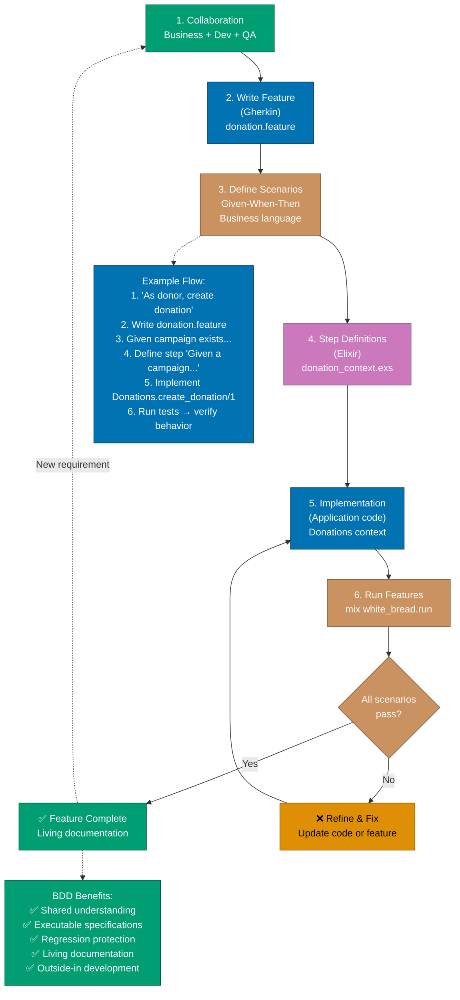
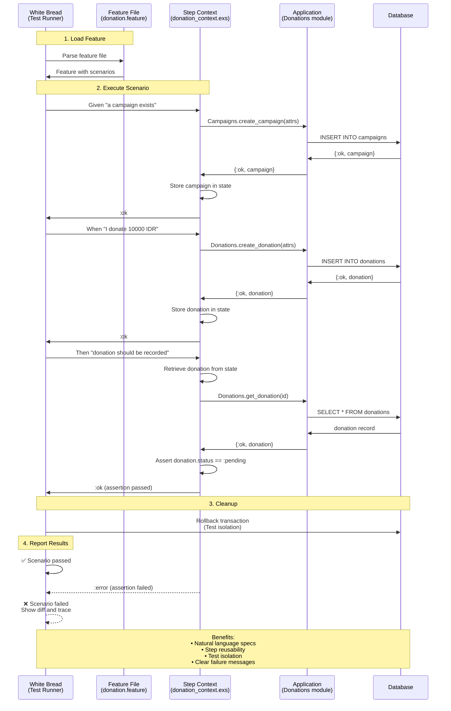

# Behaviour-Driven Development

Behaviour-Driven Development (BDD) in Elixir uses **White Bread** to write executable specifications in **Gherkin** (Given-When-Then). BDD complements TDD by focusing on business behavior and collaboration between developers, testers, and stakeholders, especially valuable for financial applications where requirements must be precisely defined.

**Quick Reference**:

- [Behaviour-Driven Development](#behaviour-driven-development)
  - [BDD Fundamentals](#bdd-fundamentals)
    - [What is BDD](#what-is-bdd)
    - [Gherkin Syntax](#gherkin-syntax)
    - [BDD vs TDD](#bdd-vs-tdd)
  - [White Bread Setup](#white-bread-setup)
    - [Installation](#installation)
    - [Configuration](#configuration)
  - [Writing Features](#writing-features)
    - [Feature Structure](#feature-structure)
    - [Scenarios](#scenarios)
    - [Scenario Outlines](#scenario-outlines)
  - [Step Definitions](#step-definitions)
    - [Given Steps](#given-steps)
    - [When Steps](#when-steps)
    - [Then Steps](#then-steps)
    - [Pattern Matching](#pattern-matching)
  - [Data Tables](#data-tables)
  - [Background Steps](#background-steps)
  - [Tags and Organization](#tags-and-organization)
  - [Financial Domain Examples](#financial-domain-examples)
  - [BDD Best Practices](#bdd-best-practices)
  - [BDD Anti-patterns](#bdd-anti-patterns)
    - [1. Implementation Leakage](#1-implementation-leakage)
    - [2. Overly Technical Language](#2-overly-technical-language)
    - [3. Too Many Steps](#3-too-many-steps)
  - [Integration with TDD](#integration-with-tdd)
  - [Related Topics](#related-topics)
  - [Sources](#sources)

## BDD Fundamentals

### What is BDD

BDD (Behaviour-Driven Development) is a software development process that:

1. **Focuses on behavior** - Describes what the system should do
2. **Uses natural language** - Gherkin syntax readable by non-developers
3. **Encourages collaboration** - Developers, testers, business stakeholders
4. **Provides living documentation** - Tests are executable specifications
5. **Drives design** - Features guide implementation

### Gherkin Syntax

Gherkin uses structured keywords:

```gherkin
Feature: Donation Processing
  As a donor
  I want to make donations to campaigns
  So that I can support causes I care about

  Scenario: Successful donation
    Given a campaign "Education Fund" with goal "1000000 IDR"
    And the campaign is active
    When I donate "10000 IDR" to "Education Fund"
    Then my donation should be recorded
    And the campaign total should increase by "10000 IDR"
    And I should receive a confirmation email

  Scenario: Donation to inactive campaign
    Given a campaign "Old Campaign" that is closed
    When I try to donate "10000 IDR" to "Old Campaign"
    Then I should see an error "Campaign is not active"
    And no donation should be recorded
```

### BDD vs TDD

| Aspect       | BDD                       | TDD                      |
| ------------ | ------------------------- | ------------------------ |
| **Focus**    | Business behavior         | Code correctness         |
| **Language** | Natural (Gherkin)         | Code (ExUnit)            |
| **Audience** | Stakeholders + developers | Developers               |
| **Level**    | Acceptance tests          | Unit + integration tests |
| **When**     | Before implementation     | During implementation    |
| **Purpose**  | Define requirements       | Verify implementation    |

**Use both**: BDD defines what to build, TDD ensures it works correctly.

The following diagram illustrates the complete BDD workflow, from feature definition through implementation to automated testing:



## White Bread Setup

### Installation

Add White Bread to your project:

```elixir
# mix.exs
defp deps do
  [
    {:white_bread, "~> 4.5", only: :test}
  ]
end
```

```bash
mix deps.get
```

### Configuration

Configure White Bread:

```elixir
# config/test.exs
config :white_bread,
  features_path: "test/features",
  run_options: [
    tags: ["~@wip"],  # Skip @wip tagged scenarios
    colors: [
      passed: :green,
      skipped: :yellow,
      failed: :red
    ]
  ]
```

Initialize White Bread:

```bash
# Generate feature directory structure
mix white_bread.init
# Creates:
# - test/features/
# - test/features/contexts/

# Run features
mix white_bread.run
```

## Writing Features

### Feature Structure

Organize features by domain:

```
test/
└── features/
    ├── donations/
    │   ├── create_donation.feature
    │   ├── process_payment.feature
    │   └── refund_donation.feature
    ├── campaigns/
    │   ├── create_campaign.feature
    │   └── campaign_goals.feature
    ├── zakat/
    │   └── calculate_zakat.feature
    └── contexts/
        ├── donation_context.exs
        ├── campaign_context.exs
        └── zakat_context.exs
```

The following diagram shows how White Bread executes Gherkin features by matching steps to Elixir implementations:



### Scenarios

Write clear scenarios:

```gherkin
# test/features/donations/create_donation.feature
Feature: Create Donation
  As a donor
  I want to create donations
  So that I can support campaigns

  Scenario: Create valid donation
    Given I am logged in as "john@example.com"
    And a campaign "Education Fund" exists with status "active"
    When I create a donation with:
      | campaign      | Education Fund |
      | amount        | 10000          |
      | currency      | IDR            |
      | payment_method| credit_card    |
    Then the donation should be created successfully
    And the donation status should be "pending"
    And I should be on the donation confirmation page

  Scenario: Create donation with invalid amount
    Given I am logged in as "john@example.com"
    And a campaign "Education Fund" exists
    When I create a donation with amount "-100 IDR"
    Then I should see an error "Amount must be positive"
    And no donation should be created

  Scenario: Create donation for inactive campaign
    Given I am logged in as "john@example.com"
    And a campaign "Old Campaign" exists with status "completed"
    When I try to create a donation for "Old Campaign"
    Then I should see an error "Campaign is not active"
    And no donation should be created
```

### Scenario Outlines

Use scenario outlines for multiple test cases:

```gherkin
# test/features/zakat/calculate_zakat.feature
Feature: Calculate Zakat
  As a Muslim
  I want to calculate Zakat on my wealth
  So that I can fulfill my religious obligation

  Scenario Outline: Calculate Zakat for different wealth amounts
    Given I have wealth of "<wealth>" in "<currency>"
    And the nisab threshold is "<nisab>" in "<currency>"
    When I calculate Zakat
    Then I should get "<zakat>" or see "<error>"

    Examples: Wealth above nisab
      | wealth     | nisab      | currency | zakat    | error |
      | 100000000  | 85000000   | IDR      | 2500000  |       |
      | 200000000  | 85000000   | IDR      | 5000000  |       |
      | 1000       | 500        | USD      | 25       |       |

    Examples: Wealth below nisab
      | wealth     | nisab      | currency | zakat    | error           |
      | 50000000   | 85000000   | IDR      |          | below nisab     |
      | 100        | 500        | USD      |          | below nisab     |

    Examples: Currency mismatch
      | wealth     | nisab      | currency | zakat    | error              |
      | 100000000  | 500        | IDR/USD  |          | currency mismatch  |
```

## Step Definitions

### Given Steps

Define preconditions:

```elixir
# test/features/contexts/donation_context.exs
defmodule FinancialPlatform.Features.DonationContext do
  use WhiteBread.Context

  alias FinancialPlatform.{Repo, Accounts, Campaigns}

  # State management
  defstruct [:current_user, :current_campaign, :current_donation, :last_error]

  def init(_) do
    # Cleanup database
    :ok = Ecto.Adapters.SQL.Sandbox.checkout(Repo)

    %__MODULE__{}
  end

  # Given steps (preconditions)
  given_ ~r/^I am logged in as "(?<email>[^"]+)"$/, fn state, %{email: email} ->
    user = Accounts.get_or_create_user(%{email: email})
    %{state | current_user: user}
  end

  given_ ~r/^a campaign "(?<name>[^"]+)" exists$/, fn state, %{name: name} ->
    campaign = Campaigns.create_campaign!(%{
      name: name,
      goal_amount: Decimal.new("1000000"),
      currency: "IDR",
      status: :active
    })

    %{state | current_campaign: campaign}
  end

  given_ ~r/^a campaign "(?<name>[^"]+)" exists with status "(?<status>[^"]+)"$/,
    fn state, %{name: name, status: status} ->
      campaign = Campaigns.create_campaign!(%{
        name: name,
        goal_amount: Decimal.new("1000000"),
        currency: "IDR",
        status: String.to_atom(status)
      })

      %{state | current_campaign: campaign}
    end

  given_ ~r/^a campaign "(?<name>[^"]+)" exists with goal "(?<goal>[^"]+)"$/,
    fn state, %{name: name, goal: goal} ->
      [amount, currency] = String.split(goal, " ")

      campaign = Campaigns.create_campaign!(%{
        name: name,
        goal_amount: Decimal.new(amount),
        currency: currency,
        status: :active
      })

      %{state | current_campaign: campaign}
    end

  given_ ~r/^the campaign is active$/, fn state ->
    campaign = %{state.current_campaign | status: :active}
    Campaigns.update_campaign(campaign)
    %{state | current_campaign: campaign}
  end
end
```

### When Steps

Define actions:

```elixir
# When steps (actions)
when_ ~r/^I donate "(?<amount>[^"]+)" to "(?<campaign>[^"]+)"$/,
  fn state, %{amount: amount, campaign: campaign_name} ->
    [amount_str, currency] = String.split(amount, " ")

    campaign = Campaigns.get_campaign_by_name(campaign_name)

    case Donations.create_donation(%{
           user_id: state.current_user.id,
           campaign_id: campaign.id,
           amount: Decimal.new(amount_str),
           currency: currency
         }) do
      {:ok, donation} ->
        %{state | current_donation: donation}

      {:error, changeset} ->
        %{state | last_error: changeset}
    end
  end

when_ ~r/^I try to donate "(?<amount>[^"]+)" to "(?<campaign>[^"]+)"$/,
  fn state, %{amount: amount, campaign: campaign_name} ->
    [amount_str, currency] = String.split(amount, " ")

    campaign = Campaigns.get_campaign_by_name(campaign_name)

    case Donations.create_donation(%{
           user_id: state.current_user.id,
           campaign_id: campaign.id,
           amount: Decimal.new(amount_str),
           currency: currency
         }) do
      {:ok, donation} ->
        %{state | current_donation: donation}

      {:error, error} ->
        %{state | last_error: error}
    end
  end

when_ ~r/^I create a donation with:$/, fn state, %{table_data: table} ->
  attrs =
    table
    |> Enum.map(fn [key, value] -> {String.to_atom(key), value} end)
    |> Map.new()
    |> Map.put(:user_id, state.current_user.id)
    |> Map.put(:campaign_id, state.current_campaign.id)

  case Donations.create_donation(attrs) do
    {:ok, donation} ->
      %{state | current_donation: donation}

    {:error, error} ->
      %{state | last_error: error}
  end
end

when_ ~r/^I calculate Zakat$/, fn state ->
  case ZakatCalculator.calculate(state.wealth, state.nisab) do
    {:ok, zakat} ->
      %{state | calculated_zakat: zakat}

    {:error, error} ->
      %{state | last_error: error}
  end
end
```

### Then Steps

Define expectations:

```elixir
# Then steps (expectations)
then_ ~r/^my donation should be recorded$/, fn state ->
  assert state.current_donation
  assert Donations.get_donation(state.current_donation.id)
  {:ok, state}
end

then_ ~r/^the campaign total should increase by "(?<amount>[^"]+)"$/,
  fn state, %{amount: amount} ->
    [amount_str, currency] = String.split(amount, " ")
    expected_increase = Decimal.new(amount_str)

    campaign = Campaigns.get_campaign!(state.current_campaign.id)
    actual_total = campaign.total_raised

    assert Decimal.equal?(actual_total, expected_increase)
    {:ok, state}
  end

then_ ~r/^I should receive a confirmation email$/, fn state ->
  # Check email was sent (using Bamboo or Swoosh)
  assert_email_sent(to: state.current_user.email, subject: "Donation Confirmation")
  {:ok, state}
end

then_ ~r/^I should see an error "(?<message>[^"]+)"$/, fn state, %{message: message} ->
  assert state.last_error
  assert error_message(state.last_error) =~ message
  {:ok, state}
end

then_ ~r/^no donation should be created$/, fn state ->
  refute state.current_donation
  {:ok, state}
end

then_ ~r/^the donation status should be "(?<status>[^"]+)"$/, fn state, %{status: status} ->
  assert to_string(state.current_donation.status) == status
  {:ok, state}
end

then_ ~r/^I should get "(?<zakat>[^"]+)" or see "(?<error>[^"]+)"$/,
  fn state, %{zakat: zakat, error: error} ->
    cond do
      zakat != "" ->
        assert state.calculated_zakat
        assert Decimal.to_string(state.calculated_zakat.amount) == zakat

      error != "" ->
        assert state.last_error
        assert to_string(state.last_error) =~ error

      true ->
        flunk("Either zakat or error must be specified")
    end

    {:ok, state}
  end

# Helper functions
defp error_message(%Ecto.Changeset{} = changeset) do
  Ecto.Changeset.traverse_errors(changeset, fn {msg, _} -> msg end)
  |> Enum.map_join(", ", fn {field, messages} ->
    "#{field}: #{Enum.join(messages, ", ")}"
  end)
end

defp error_message(error) when is_atom(error), do: to_string(error)
defp error_message(error) when is_binary(error), do: error
```

### Pattern Matching

Use pattern matching in step definitions:

```elixir
# Flexible amount parsing
when_ ~r/^I donate (?<amount>\d+) (?<currency>[A-Z]+)$/,
  fn state, %{amount: amount, currency: currency} ->
    Donations.create_donation(%{
      amount: Decimal.new(amount),
      currency: currency
    })
  end

# Optional parameters
given_ ~r/^a campaign(?: with goal "(?<goal>[^"]+)")?$/,
  fn state, %{goal: goal} ->
    attrs = %{name: "Default Campaign"}

    attrs =
      if goal do
        [amount, currency] = String.split(goal, " ")
        Map.merge(attrs, %{goal_amount: Decimal.new(amount), currency: currency})
      else
        Map.merge(attrs, %{goal_amount: Decimal.new("1000000"), currency: "IDR"})
      end

    campaign = Campaigns.create_campaign!(attrs)
    %{state | current_campaign: campaign}
  end
```

## Data Tables

Use data tables for structured data:

```gherkin
Scenario: Create donation with details
  Given I am logged in
  And a campaign "Education Fund" exists
  When I create a donation with:
    | campaign       | Education Fund |
    | amount         | 10000          |
    | currency       | IDR            |
    | donor_name     | John Doe       |
    | donor_email    | john@example.com |
    | payment_method | credit_card    |
  Then the donation should be created with all details
```

Process data tables in step definitions:

```elixir
when_ ~r/^I create a donation with:$/, fn state, %{table_data: table} ->
  # table is a list of lists: [["key", "value"], ...]
  attrs =
    table
    |> Enum.map(fn [key, value] ->
      {String.to_atom(key), parse_value(key, value)}
    end)
    |> Map.new()

  case Donations.create_donation(attrs) do
    {:ok, donation} -> %{state | current_donation: donation}
    {:error, error} -> %{state | last_error: error}
  end
end

defp parse_value("amount", value), do: Decimal.new(value)
defp parse_value("currency", value), do: value
defp parse_value(_key, value), do: value
```

Multiple rows for examples:

```gherkin
Scenario: Validate donation amounts
  Given I am logged in
  And a campaign "Test Campaign" exists
  Then the following donations should validate as:
    | amount | currency | valid | error_message        |
    | 10000  | IDR      | true  |                      |
    | -100   | IDR      | false | must be positive     |
    | 0      | IDR      | false | must be positive     |
    | 10000  | XXX      | false | invalid currency     |
```

```elixir
then_ ~r/^the following donations should validate as:$/, fn state, %{table_data: table} ->
  # Skip header row
  [_header | rows] = table

  Enum.each(rows, fn [amount, currency, valid, error_message] ->
    attrs = %{
      amount: Decimal.new(amount),
      currency: currency,
      campaign_id: state.current_campaign.id
    }

    result = Donations.validate_donation(attrs)

    case valid do
      "true" ->
        assert {:ok, _} = result

      "false" ->
        assert {:error, changeset} = result
        assert error_on(changeset) =~ error_message
    end
  end)

  {:ok, state}
end
```

## Background Steps

Use background for common setup:

```gherkin
Feature: Donation Management
  As a system administrator
  I want to manage donations
  So that I can oversee the donation process

  Background:
    Given I am logged in as an admin
    And the following campaigns exist:
      | name           | goal    | status |
      | Education      | 1000000 | active |
      | Healthcare     | 500000  | active |
      | Infrastructure | 2000000 | active |

  Scenario: List all donations
    Given the following donations exist:
      | campaign       | amount | status    |
      | Education      | 10000  | completed |
      | Healthcare     | 5000   | pending   |
    When I view the donations list
    Then I should see 2 donations

  Scenario: Filter donations by campaign
    Given the following donations exist:
      | campaign       | amount | status    |
      | Education      | 10000  | completed |
      | Healthcare     | 5000   | pending   |
    When I filter donations by "Education"
    Then I should see 1 donation
```

## Tags and Organization

Use tags to organize and control test execution:

```gherkin
@wip
Feature: New Feature in Progress
  # Tests under development

@slow
Scenario: Long-running operation
  # Slow test that can be skipped in CI

@integration @database
Scenario: Database integration
  # Requires database

@critical
Scenario: Critical business rule
  # Must always pass

@smoke
Scenario: Basic functionality check
  # Quick sanity check
```

Run tests by tag:

```bash
# Run all tests except @wip
mix white_bread.run --tags ~wip

# Run only @smoke tests
mix white_bread.run --tags smoke

# Run @critical or @integration tests
mix white_bread.run --tags "critical,integration"

# Run @integration but not @slow
mix white_bread.run --tags "integration,~slow"
```

## Financial Domain Examples

Complete BDD suite for financial platform:

```gherkin
# test/features/donations/donation_workflow.feature
@critical
Feature: Complete Donation Workflow
  As a donor
  I want to make a donation from start to finish
  So that I can support campaigns effectively

  Background:
    Given the following campaigns exist:
      | name          | goal    | currency | status |
      | Education     | 1000000 | IDR      | active |
      | Healthcare    | 500000  | IDR      | active |

  @smoke
  Scenario: Successful donation workflow
    Given I am on the campaigns page
    When I select campaign "Education"
    And I enter donation details:
      | amount         | 50000            |
      | donor_name     | John Doe         |
      | donor_email    | john@example.com |
      | payment_method | credit_card      |
    And I submit the donation
    Then I should see "Donation created successfully"
    And my donation should be in "pending" status
    When the payment is processed
    Then my donation status should change to "completed"
    And the campaign total should increase by 50000
    And I should receive a confirmation email

  Scenario: Donation with multiple payment attempts
    Given I am on the campaigns page
    When I create a donation for "Education" with amount "50000 IDR"
    And the payment fails with error "insufficient_funds"
    Then my donation should remain in "pending" status
    When I retry the payment with a different card
    And the payment succeeds
    Then my donation should be marked as "completed"

  @validation
  Scenario Outline: Donation validation
    Given I am creating a donation
    When I enter amount "<amount>" and currency "<currency>"
    Then I should see "<result>" with message "<message>"

    Examples:
      | amount | currency | result | message                 |
      | 1000   | IDR      | success|                         |
      | -100   | IDR      | error  | Amount must be positive |
      | 0      | IDR      | error  | Amount must be positive |
      | 1000   | XXX      | error  | Invalid currency        |
```

```elixir
# test/features/contexts/donation_workflow_context.exs
defmodule FinancialPlatform.Features.DonationWorkflowContext do
  use WhiteBread.Context

  import Phoenix.ConnTest
  import Phoenix.LiveViewTest

  alias FinancialPlatform.{Repo, Campaigns, Donations}

  defstruct [:conn, :live_view, :current_campaign, :current_donation, :last_response]

  def init(_) do
    :ok = Ecto.Adapters.SQL.Sandbox.checkout(Repo)
    conn = build_conn()
    %__MODULE__{conn: conn}
  end

  # Background steps
  given_ ~r/^the following campaigns exist:$/, fn state, %{table_data: table} ->
    [_header | rows] = table

    campaigns =
      Enum.map(rows, fn [name, goal, currency, status] ->
        Campaigns.create_campaign!(%{
          name: name,
          goal_amount: Decimal.new(goal),
          currency: currency,
          status: String.to_atom(status)
        })
      end)

    state
  end

  # Navigation
  given_ ~r/^I am on the campaigns page$/, fn state ->
    {:ok, view, _html} = live(state.conn, "/campaigns")
    %{state | live_view: view}
  end

  when_ ~r/^I select campaign "(?<name>[^"]+)"$/, fn state, %{name: name} ->
    campaign = Campaigns.get_campaign_by_name(name)
    {:ok, view, _html} = live(state.conn, "/campaigns/#{campaign.id}")
    %{state | live_view: view, current_campaign: campaign}
  end

  # Form interaction
  when_ ~r/^I enter donation details:$/, fn state, %{table_data: table} ->
    attrs =
      table
      |> Enum.map(fn [key, value] -> {key, value} end)
      |> Map.new()

    html =
      state.live_view
      |> form("#donation-form", donation: attrs)
      |> render_change()

    %{state | last_response: html}
  end

  when_ ~r/^I submit the donation$/, fn state ->
    html =
      state.live_view
      |> form("#donation-form")
      |> render_submit()

    %{state | last_response: html}
  end

  # Payment processing
  when_ ~r/^the payment is processed$/, fn state ->
    donation = Donations.get_donation(state.current_donation.id)
    {:ok, updated} = Donations.process_payment(donation)
    %{state | current_donation: updated}
  end

  when_ ~r/^the payment fails with error "(?<error>[^"]+)"$/,
    fn state, %{error: error} ->
      # Simulate payment failure
      %{state | last_error: error}
    end

  when_ ~r/^I retry the payment with a different card$/, fn state ->
    donation = Donations.get_donation(state.current_donation.id)
    {:ok, updated} = Donations.retry_payment(donation)
    %{state | current_donation: updated}
  end

  # Assertions
  then_ ~r/^I should see "(?<message>[^"]+)"$/, fn state, %{message: message} ->
    assert state.last_response =~ message
    {:ok, state}
  end

  then_ ~r/^my donation should be in "(?<status>[^"]+)" status$/,
    fn state, %{status: status} ->
      donation = Donations.get_donation(state.current_donation.id)
      assert to_string(donation.status) == status
      {:ok, state}
    end

  then_ ~r/^my donation status should change to "(?<status>[^"]+)"$/,
    fn state, %{status: status} ->
      donation = Donations.get_donation(state.current_donation.id)
      assert to_string(donation.status) == status
      {:ok, state}
    end
end
```

## BDD Best Practices

1. **Write scenarios before code** - BDD drives implementation
2. **Use business language** - Scenarios readable by stakeholders
3. **One scenario, one behavior** - Keep scenarios focused
4. **Use Given-When-Then** - Clear structure
5. **Avoid implementation details** - Focus on behavior, not how
6. **Reuse step definitions** - DRY principle
7. **Tag scenarios** - Organize by type, priority
8. **Keep steps simple** - Each step does one thing

## BDD Anti-patterns

### 1. Implementation Leakage

```gherkin
# ❌ BAD - exposes implementation
Scenario: Create donation
  Given I open the database connection
  And I insert a campaign record with id "123"
  When I call Donations.create_donation()
  Then the donations table should have one row

# ✅ GOOD - describes behavior
Scenario: Create donation
  Given a campaign "Education Fund" exists
  When I donate "10000 IDR" to "Education Fund"
  Then my donation should be recorded
```

### 2. Overly Technical Language

```gherkin
# ❌ BAD - technical jargon
Scenario: POST /api/donations
  Given I set Authorization header to JWT token
  When I POST JSON payload to /api/donations endpoint
  Then the HTTP response code should be 201

# ✅ GOOD - business language
Scenario: Create donation via API
  Given I am authenticated
  When I submit a donation request
  Then my donation should be accepted
```

### 3. Too Many Steps

```gherkin
# ❌ BAD - too detailed
Scenario: Create donation
  Given I am on the home page
  And I click "Campaigns"
  And I wait for the page to load
  And I click "Education Fund"
  And I wait for the campaign page
  And I scroll to donation form
  And I click amount field
  And I type "10000"
  # ... 20 more steps

# ✅ GOOD - focused on behavior
Scenario: Create donation
  Given I am viewing campaign "Education Fund"
  When I donate "10000 IDR"
  Then my donation should be created
```

## Integration with TDD

BDD and TDD work together:

```gherkin
# BDD Feature (acceptance test)
Feature: Zakat Calculation
  Scenario: Calculate Zakat on gold
    Given I have 100 grams of gold worth "100000000 IDR"
    And the nisab for gold is 85 grams
    When I calculate Zakat
    Then I should pay "2500000 IDR"
```

```elixir
# TDD unit test (implementation test)
defmodule ZakatCalculatorTest do
  use ExUnit.Case

  describe "calculate/2" do
    test "calculates 2.5% for wealth above nisab" do
      wealth = Money.new(100_000_000, :IDR)
      nisab = Money.new(85_000_000, :IDR)

      assert {:ok, zakat} = ZakatCalculator.calculate(wealth, nisab)
      assert Money.equal?(zakat, Money.new(2_500_000, :IDR))
    end

    test "returns error for wealth below nisab" do
      wealth = Money.new(50_000_000, :IDR)
      nisab = Money.new(85_000_000, :IDR)

      assert {:error, :below_nisab} = ZakatCalculator.calculate(wealth, nisab)
    end
  end
end
```

**Workflow**:

1. Write BDD feature (what to build)
2. Write TDD tests (how to build)
3. Implement code
4. BDD and TDD tests both pass

## BDD Checklist

### Feature File Quality

- [ ] Scenarios written in plain language (non-technical stakeholders can read)
- [ ] Given-When-Then structure followed consistently
- [ ] Scenarios focus on behavior, not implementation details
- [ ] Scenario Outlines with Examples used for multiple inputs
- [ ] Background section for common setup steps

### Scenario Structure

- [ ] Given: Context/preconditions clear and complete
- [ ] When: Single action described (not multiple actions)
- [ ] Then: Expected outcome specified clearly
- [ ] And: Used appropriately for additional steps
- [ ] Scenario names describe business value

### Step Definitions

- [ ] Step definitions are reusable across scenarios
- [ ] No business logic in steps (delegate to context modules)
- [ ] Steps follow Elixir idioms (pattern matching, pipelines)
- [ ] Error messages are descriptive and helpful
- [ ] Context struct used to share state within scenario

### Collaboration

- [ ] Scenarios reviewed by business stakeholders
- [ ] Ubiquitous language used consistently (domain terminology)
- [ ] Scenarios executable and automated (mix white_bread.run)
- [ ] Living documentation kept up to date
- [ ] Three Amigos conversation: BA, Dev, Tester

### White Bread Best Practices

- [ ] Feature files organized by domain (features/donations/, features/campaigns/)
- [ ] Step contexts modular and maintainable (features/contexts/)
- [ ] Tags used for organizing scenarios (@wip, @critical, @integration)
- [ ] Background steps minimized (only truly shared setup)
- [ ] Data tables parsed correctly in step definitions

### Financial Domain BDD

- [ ] Shariah compliance scenarios included (halal/haram validation)
- [ ] Zakat calculation scenarios with examples (nisab, rates, exemptions)
- [ ] QardHasan loan scenarios with Given-When-Then (interest-free validation)
- [ ] Audit trail scenarios verified (who, what, when)
- [ ] Currency scenarios tested (Money.t() with IDR, USD, EUR)

## Related Topics

- [Test-Driven Development](ex-so-stla-el__test-driven-development.md) - TDD with ExUnit
- [Domain-Driven Design](ex-so-stla-el__domain-driven-design.md) - DDD and BDD
- [Best Practices](ex-so-stla-el__best-practices.md) - Testing best practices
- [Web Services](ex-so-stla-el__web-services.md) - Testing Phoenix apps

## Sources

- [White Bread Documentation](https://hexdocs.pm/white_bread/)
- [Cucumber/Gherkin Documentation](https://cucumber.io/docs/gherkin/)
- [The Cucumber Book](https://pragprog.com/titles/hwcuc2/the-cucumber-book-second-edition/)
- [BDD in Action](https://www.manning.com/books/bdd-in-action)
- [Specification by Example](https://www.manning.com/books/specification-by-example)

---

**Last Updated**: 2026-01-23
**Elixir Version**: 1.12+ (baseline), 1.17+ (recommended), 1.19.0 (latest)
**Maintainers**: Platform Documentation Team
