# Elixir Idioms and Patterns

## Quick Reference

### Core Idioms

- [Pattern Matching](#pattern-matching) - Destructure data and control program flow
- [Pipe Operator](#pipe-operator) - Chain function calls for readable data transformations
- [Anonymous Functions](#anonymous-functions) - Create inline functions and use capture syntax
- [Guards](#guards) - Add constraints to function clauses and case expressions
- [Protocols](#protocols) - Achieve polymorphism without inheritance
- [with Construct](#with-construct-for-complex-pipelines) - Handle complex pipelines with early returns

### Pattern Categories

- **Data Transformation**: Pipe operator, comprehensions, pattern matching
- **Control Flow**: Case expressions, with construct, guards
- **Polymorphism**: Protocols, behaviours
- **Concurrency**: Enum vs Stream, lazy evaluation

### Financial Domain

- [Complete Zakat Calculation](#complete-zakat-calculation-module) - All idioms in one module
- [Donation Processing](#donation-processing-with-all-idioms) - Full pipeline example

### Additional Resources

- [Best Practices](./ex-so-prla-el__best-practices.md)
- [Functional Programming](./ex-so-prla-el__functional-programming.md)
- [Protocols and Behaviours](./ex-so-prla-el__protocols-and-behaviours.md)

## Overview

Elixir idioms are distinctive patterns that make code more readable, maintainable, and idiomatic. Understanding these patterns is essential for writing effective Elixir code that leverages the language's strengths: pattern matching for control flow, pipe operators for data transformation, and protocols for polymorphism.

This document covers the core idioms that distinguish Elixir from imperative and object-oriented languages, with all examples drawn from the financial domain (Zakat calculation, donation processing, Islamic finance operations).

**Key Idioms Covered**:

- **Pattern Matching**: Destructure data and control program flow
- **Pipe Operator**: Chain function calls for readable data transformations
- **Anonymous Functions**: Create inline functions and use capture syntax
- **Guards**: Add constraints to function clauses and case expressions
- **Protocols**: Achieve polymorphism without inheritance
- **with Construct**: Handle complex pipelines with early returns

## Pattern Matching

Pattern matching is Elixir's fundamental mechanism for destructuring data and controlling program flow. Unlike assignment in imperative languages, the `=` operator in Elixir performs pattern matching.

### Basic Pattern Matching

```elixir
# Simple matching
x = 1
1 = x  # Succeeds

# Tuple matching
{:ok, value} = {:ok, 42}
# value is now 42

# List matching
[head | tail] = [1, 2, 3, 4]
# head is 1, tail is [2, 3, 4]

# Map matching
%{amount: amount, currency: currency} = %{amount: 100, currency: :USD}
# amount is 100, currency is :USD
```

### Function Clause Pattern Matching

Pattern matching in function definitions enables elegant control flow.

The following diagram shows function clause pattern matching decision tree:


Pattern matching in function definitions enables elegant control flow:

```elixir
defmodule FinancialDomain.Zakat.Calculator do
  @moduledoc """
  Calculates Zakat obligations using pattern matching for different scenarios.
  """

  alias FinancialDomain.Money

  @type result :: {:ok, Money.t()} | {:error, String.t()}

  @doc """
  Calculates Zakat (2.5%) on wealth exceeding nisab threshold.
  """
  @spec calculate(Money.t(), Money.t()) :: result()

  # Negative wealth - no Zakat
  def calculate(%Money{amount: amount}, _nisab) when amount < 0 do
    {:error, "Wealth cannot be negative"}
  end

  # Wealth below nisab - no Zakat obligation
  def calculate(%Money{amount: wealth_amount} = wealth, %Money{amount: nisab_amount})
      when wealth_amount <= nisab_amount do
    {:ok, Money.new(0, wealth.currency)}
  end

  # Wealth above nisab - calculate 2.5% Zakat
  def calculate(%Money{} = wealth, %Money{amount: nisab_amount})
      when wealth.amount > nisab_amount do
    zakat_amount = Money.multiply(wealth, Decimal.new("0.025"))
    {:ok, zakat_amount}
  end

  # Currency mismatch
  def calculate(%Money{currency: c1}, %Money{currency: c2}) when c1 != c2 do
    {:error, "Currency mismatch: wealth and nisab must use same currency"}
  end
end
```

### Case Expressions with Pattern Matching

`case` expressions enable pattern matching on runtime values:

```elixir
defmodule FinancialDomain.Donations.Validator do
  @moduledoc """
  Validates donation amounts and determines processing strategy.
  """

  def validate_and_categorize(donation) do
    case donation do
      %{amount: amount, currency: currency} when amount > 10000 ->
        {:large_donation, :requires_approval, Money.new(amount, currency)}

      %{amount: amount, currency: currency} when amount > 1000 ->
        {:medium_donation, :auto_process, Money.new(amount, currency)}

      %{amount: amount, currency: currency} when amount > 0 ->
        {:small_donation, :auto_process, Money.new(amount, currency)}

      %{amount: amount} when amount <= 0 ->
        {:error, :invalid_amount}

      %{} ->
        {:error, :missing_required_fields}

      _ ->
        {:error, :invalid_donation_format}
    end
  end
end
```

### Pattern Matching in with Construct

The `with` construct combines pattern matching with early returns.

The following diagram illustrates with construct flow:

```mermaid
sequenceDiagram
    participant Code as with Statement
    participant Step1 as fetch_application
    participant Step2 as fetch_applicant
    participant Step3 as check_credit_score
    participant Step4 as calculate_approval
    participant Step5 as generate_terms
    participant Step6 as create_contract
    participant Success as Success Block
    participant Else as else Block

    Code->>Step1: fetch_application(id)
    alt {:ok, application}
        Step1-->>Code: {:ok, application}
        Code->>Step2: fetch_applicant(id)
        alt {:ok, applicant}
            Step2-->>Code: {:ok, applicant}
            Code->>Step3: check_credit_score()
            alt {:ok, score}
                Step3-->>Code: {:ok, score}
                Code->>Step4: calculate_approval()
                alt {:ok, amount}
                    Step4-->>Code: {:ok, amount}
                    Code->>Step5: generate_terms()
                    alt {:ok, terms}
                        Step5-->>Code: {:ok, terms}
                        Code->>Step6: create_contract()
                        Step6-->>Code: {:ok, contract}
                        Code->>Success: Execute success block
                        Success-->>Code: {:ok, contract}
                    else {:error, _}
                        Step5-->>Else: Short-circuit
                    end
                else {:error, _}
                    Step4-->>Else: Short-circuit
                end
            else {:error, _}
                Step3-->>Else: Short-circuit
            end
        else {:error, _}
            Step2-->>Else: Short-circuit
        end
    else {:error, _}
        Step1-->>Else: Short-circuit to else
    end

    Note over Code,Else: with stops at first error<br/>Else block handles any error

    style Code fill:#0173B2,stroke:#023B5A,color:#FFF
    style Success fill:#029E73,stroke:#01593F,color:#FFF
    style Else fill:#CC78BC,stroke:#8E5484,color:#FFF
```

The `with` construct combines pattern matching with early returns:

```elixir
defmodule FinancialDomain.Loans.Processor do
  @moduledoc """
  Processes Islamic finance loan applications using pattern matching.
  """

  def process_application(application_id) do
    with {:ok, application} <- fetch_application(application_id),
         {:ok, applicant} <- fetch_applicant(application.applicant_id),
         {:ok, credit_score} <- check_credit_score(applicant),
         {:ok, approved_amount} <- calculate_approval(application, credit_score),
         {:ok, terms} <- generate_terms(approved_amount, application.duration),
         {:ok, contract} <- create_contract(application, terms) do
      {:ok, contract}
    else
      {:error, :application_not_found} ->
        {:error, "Application not found"}

      {:error, :low_credit_score} ->
        {:error, "Credit score below minimum threshold"}

      {:error, reason} ->
        {:error, "Processing failed: #{inspect(reason)}"}
    end
  end

  # Helper functions would be implemented here
end
```

## Pipe Operator

The pipe operator `|>` takes the result of an expression and passes it as the first argument to the next function. This creates readable, left-to-right data transformations.

The following diagram illustrates pipe operator data flow:


### Basic Piping

```elixir
# Without pipe operator (nested calls)
result = format_report(
  calculate_totals(
    filter_donations(
      fetch_donations(start_date, end_date)
    )
  )
)

# With pipe operator (linear flow)
result =
  fetch_donations(start_date, end_date)
  |> filter_donations()
  |> calculate_totals()
  |> format_report()
```

### Financial Report Generation

```elixir
defmodule FinancialDomain.Reports.ZakatSummary do
  @moduledoc """
  Generates comprehensive Zakat payment summaries using pipe operator.
  """

  def generate_annual_summary(year, currency \\ :USD) do
    year
    |> fetch_zakat_payments()
    |> filter_by_currency(currency)
    |> group_by_month()
    |> calculate_monthly_totals()
    |> calculate_running_totals()
    |> add_statistics()
    |> format_as_report()
  end

  defp fetch_zakat_payments(year) do
    # Query database for payments in given year
    FinancialDomain.Repo.all(
      from p in FinancialDomain.Zakat.Payment,
      where: fragment("EXTRACT(YEAR FROM ?)", p.paid_at) == ^year,
      order_by: [asc: p.paid_at]
    )
  end

  defp filter_by_currency(payments, currency) do
    Enum.filter(payments, fn p -> p.amount.currency == currency end)
  end

  defp group_by_month(payments) do
    Enum.group_by(payments, fn p ->
      Date.beginning_of_month(p.paid_at)
    end)
  end

  defp calculate_monthly_totals(grouped_payments) do
    Enum.map(grouped_payments, fn {month, payments} ->
      total = Enum.reduce(payments, Money.new(0, :USD), fn p, acc ->
        Money.add(acc, p.amount)
      end)

      {month, total, length(payments)}
    end)
  end

  defp calculate_running_totals(monthly_data) do
    {result, _acc} = Enum.map_reduce(monthly_data, Money.new(0, :USD), fn {month, total, count}, acc ->
      running_total = Money.add(acc, total)
      {{month, total, count, running_total}, running_total}
    end)

    result
  end

  defp add_statistics(monthly_data) do
    total_amount = monthly_data
      |> Enum.map(fn {_month, amount, _count, _running} -> amount end)
      |> Enum.reduce(Money.new(0, :USD), &Money.add/2)

    total_transactions = monthly_data
      |> Enum.map(fn {_month, _amount, count, _running} -> count end)
      |> Enum.sum()

    %{
      monthly_data: monthly_data,
      total_amount: total_amount,
      total_transactions: total_transactions,
      average_transaction: Money.divide(total_amount, total_transactions)
    }
  end

  defp format_as_report(summary) do
    # Format as structured report
    %{
      title: "Annual Zakat Summary",
      period: "#{Date.utc_today().year}",
      summary: summary,
      generated_at: DateTime.utc_now()
    }
  end
end
```

### Donation Processing Pipeline

```elixir
defmodule FinancialDomain.Donations.Pipeline do
  @moduledoc """
  Processes donations through validation, storage, and notification pipeline.
  """

  def process(donation_params) do
    donation_params
    |> validate_donation()
    |> convert_currency()
    |> check_for_duplicates()
    |> apply_campaign_rules()
    |> calculate_fees()
    |> save_to_database()
    |> generate_receipt()
    |> notify_donor()
    |> notify_campaign_owner()
    |> broadcast_update()
  end

  defp validate_donation({:error, _} = error), do: error
  defp validate_donation(params) do
    with :ok <- validate_amount(params),
         :ok <- validate_donor_info(params),
         :ok <- validate_campaign(params) do
      {:ok, params}
    end
  end

  defp convert_currency({:error, _} = error), do: error
  defp convert_currency({:ok, params}) do
    # Currency conversion logic
    {:ok, Map.put(params, :converted_amount, params.amount)}
  end

  # Additional pipeline functions...
end
```

## Anonymous Functions

Anonymous functions (lambdas) are first-class values in Elixir. They can be assigned to variables, passed as arguments, and returned from functions.

### Basic Anonymous Functions

```elixir
# Long form
calculate_zakat = fn wealth, nisab ->
  if wealth > nisab do
    wealth * 0.025
  else
    0
  end
end

calculate_zakat.(10000, 5000)  # Returns 250

# Short form with capture operator &
calculate_fee = &(&1 * 0.02)
calculate_fee.(1000)  # Returns 20
```

### Financial Calculations with Anonymous Functions

```elixir
defmodule FinancialDomain.Calculations do
  @moduledoc """
  Common financial calculations using anonymous functions.
  """

  @doc """
  Applies a calculation function to a list of monetary amounts.
  """
  def apply_to_amounts(amounts, calculation_fn) do
    Enum.map(amounts, calculation_fn)
  end

  @doc """
  Calculates Zakat for multiple wealth values.
  """
  def batch_zakat_calculation(wealth_values, nisab) do
    calculate_zakat = fn wealth ->
      if Money.greater_than?(wealth, nisab) do
        Money.multiply(wealth, Decimal.new("0.025"))
      else
        Money.new(0, wealth.currency)
      end
    end

    Enum.map(wealth_values, calculate_zakat)
  end

  @doc """
  Filters donations above a threshold using anonymous function.
  """
  def filter_large_donations(donations, threshold) do
    Enum.filter(donations, fn donation ->
      Money.greater_than?(donation.amount, threshold)
    end)
  end

  @doc """
  Calculates compound interest (for non-Islamic finance comparison).

  Note: In Islamic finance, use profit-sharing instead.
  """
  def compound_interest(principal, rate, periods) do
    compound = fn p, r, n ->
      :math.pow(1 + r, n) * p
    end

    compound.(principal, rate, periods)
  end
end
```

### Capture Operator for Conciseness

```elixir
defmodule FinancialDomain.Transformations do
  @moduledoc """
  Data transformations using capture operator for concise code.
  """

  @doc """
  Extracts amounts from donation records.
  """
  def extract_amounts(donations) do
    # Long form
    Enum.map(donations, fn d -> d.amount end)

    # Short form with capture
    Enum.map(donations, &(&1.amount))
  end

  @doc """
  Filters paid donations.
  """
  def paid_only(donations) do
    # Long form
    Enum.filter(donations, fn d -> d.status == :paid end)

    # Short form with capture
    Enum.filter(donations, &(&1.status == :paid))
  end

  @doc """
  Sums donation amounts.
  """
  def sum_donations(donations) do
    donations
    |> Enum.map(&(&1.amount))
    |> Enum.reduce(Money.new(0, :USD), &Money.add/2)
  end

  @doc """
  Creates donation summary with multiple transformations.
  """
  def create_summary(donations) do
    %{
      total_count: length(donations),
      paid_count: donations |> Enum.count(&(&1.status == :paid)),
      pending_count: donations |> Enum.count(&(&1.status == :pending)),
      total_amount: donations |> Enum.map(&(&1.amount)) |> sum_amounts(),
      average_amount: donations |> calculate_average(&(&1.amount))
    }
  end

  defp sum_amounts(amounts) do
    Enum.reduce(amounts, Money.new(0, :USD), &Money.add/2)
  end

  defp calculate_average(items, extractor) do
    total = items |> Enum.map(extractor) |> sum_amounts()
    Money.divide(total, length(items))
  end
end
```

## Guards

Guards are expressions that provide additional constraints on function clauses and case expressions. They enable compile-time optimizations and make business rules explicit.

### Guard Usage Decision Flow

```mermaid
%% Color Palette: Blue #0173B2, Orange #DE8F05, Teal #029E73, Purple #CC78BC
%% All colors are color-blind friendly and meet WCAG AA contrast standards

graph TD
    A["Need to Constrain<br/>Function Clause?"]:::blue --> B{"Type Check<br/>Sufficient?"}:::orange

    B -->|"Yes"| C["✅ Use Built-in Guard<br/>(is_number, is_atom)"]:::teal
    B -->|"No"| D{"Simple<br/>Comparison?"}:::orange

    D -->|"Yes"| E["✅ Use Comparison<br/>(>, <, ==, in)"]:::teal
    D -->|"No"| F{"Custom<br/>Business Logic?"}:::orange

    F -->|"Yes"| G["✅ Use defguard<br/>(custom guard)"]:::purple
    F -->|"No"| H["Use Function Body<br/>(pattern match + logic)"]:::purple

    C --> I["Guard Best Practices"]:::teal
    E --> I
    G --> I

    I --> I1["• Compile-time optimization"]
    I --> I2["• Explicit constraints"]
    I --> I3["• Multiple clauses"]
    I --> I4["• Pure functions only"]

    Note["Guards must be pure:<br/>No side effects<br/>Limited functions<br/>Compile-time safe"]

    classDef blue fill:#0173B2,stroke:#000,color:#fff
    classDef orange fill:#DE8F05,stroke:#000,color:#000
    classDef teal fill:#029E73,stroke:#000,color:#fff
    classDef purple fill:#CC78BC,stroke:#000,color:#000
```



**Key Principles**:

- **Built-in guards**: Type checks, comparisons (fast, optimized)
- **defguard**: Custom business logic guards
- **Pure functions**: Guards cannot have side effects
- **Multiple clauses**: Guards enable elegant clause selection

### Built-in Guards

```elixir
defmodule FinancialDomain.Validation do
  @moduledoc """
  Validation functions using guards for business rules.
  """

  @doc """
  Validates donation amount using guards.
  """
  def validate_amount(amount) when is_number(amount) and amount > 0 do
    {:ok, amount}
  end

  def validate_amount(amount) when is_number(amount) and amount <= 0 do
    {:error, :amount_must_be_positive}
  end

  def validate_amount(_) do
    {:error, :amount_must_be_number}
  end

  @doc """
  Categorizes donations by size using guards.
  """
  def categorize_donation(amount) when amount >= 10000, do: :major_donor
  def categorize_donation(amount) when amount >= 1000, do: :regular_donor
  def categorize_donation(amount) when amount >= 100, do: :small_donor
  def categorize_donation(amount) when amount > 0, do: :micro_donor
  def categorize_donation(_), do: :invalid

  @doc """
  Validates Zakat eligibility using guards.
  """
  def eligible_for_zakat?(wealth, nisab) when is_number(wealth) and is_number(nisab) and wealth > nisab do
    true
  end

  def eligible_for_zakat?(_, _), do: false
end
```

### Custom Guard Functions

```elixir
defmodule FinancialDomain.Guards do
  @moduledoc """
  Custom guard functions for financial domain logic.

  Note: Only specific functions can be used in guards.
  Custom guards must be defined with defguard.
  """

  defguard is_valid_currency(currency)
    when currency in [:USD, :EUR, :GBP, :SAR, :AED, :MYR, :IDR]

  defguard is_nisab_threshold(amount)
    when is_number(amount) and amount >= 0

  defguard is_valid_zakat_rate(rate)
    when is_float(rate) and rate >= 0.0 and rate <= 0.1

  defguard is_positive_amount(amount)
    when is_number(amount) and amount > 0

  defguard is_business_day(datetime)
    when is_struct(datetime, DateTime) and
         not (DateTime.to_date(datetime).day_of_week in [6, 7])
end

defmodule FinancialDomain.Zakat.Advanced do
  @moduledoc """
  Advanced Zakat calculations using custom guards.
  """

  import FinancialDomain.Guards

  @doc """
  Calculates Zakat with custom validation guards.
  """
  def calculate(wealth, nisab, currency)
      when is_positive_amount(wealth) and
           is_nisab_threshold(nisab) and
           is_valid_currency(currency) do

    if wealth > nisab do
      {:ok, wealth * 0.025, currency}
    else
      {:ok, 0, currency}
    end
  end

  def calculate(_, _, currency) when not is_valid_currency(currency) do
    {:error, :invalid_currency}
  end

  def calculate(_, _, _) do
    {:error, :invalid_parameters}
  end
end
```

### Guards in Case Expressions

```elixir
defmodule FinancialDomain.Loans.Eligibility do
  @moduledoc """
  Determines loan eligibility using guards in case expressions.
  """

  def check_eligibility(applicant) do
    case applicant do
      %{credit_score: score, income: income, debts: debts}
      when score >= 700 and income > debts * 3 ->
        {:approved, :prime_rate}

      %{credit_score: score, income: income, debts: debts}
      when score >= 600 and income > debts * 2 ->
        {:approved, :standard_rate}

      %{credit_score: score, income: income}
      when score >= 500 and income > 50000 ->
        {:approved, :high_rate}

      %{credit_score: score} when score < 500 ->
        {:rejected, :low_credit_score}

      %{income: income, debts: debts} when income <= debts * 2 ->
        {:rejected, :insufficient_income}

      _ ->
        {:rejected, :incomplete_information}
    end
  end
end
```

## Protocols

Protocols enable polymorphism in Elixir without inheritance. They define a set of functions that can be implemented for any data type.

### Protocol Implementation Flow

```mermaid
%% Color Palette: Blue #0173B2, Orange #DE8F05, Teal #029E73, Purple #CC78BC
%% All colors are color-blind friendly and meet WCAG AA contrast standards

graph TD
    A["Need Polymorphic<br/>Behavior?"]:::blue --> B{"Multiple<br/>Data Types?"}:::orange

    B -->|"Yes"| C["✅ Define Protocol<br/>(defprotocol)"]:::teal
    B -->|"No"| D["Use Regular<br/>Functions"]:::purple

    C --> E["Protocol Definition"]:::teal
    E --> E1["Protocol: Printable<br/>Function: to_string(data)"]

    E1 --> F["Implementations"]:::purple

    F --> F1["✅ defimpl for Money"]
    F --> F2["✅ defimpl for Donation"]
    F --> F3["✅ defimpl for Transaction"]

    F1 & F2 & F3 --> G["Runtime Dispatch<br/>(type-based)"]:::orange

    G --> H["✅ Correct Implementation<br/>Called"]:::teal

    Note["Built-in Protocols:<br/>• String.Chars (to_string)<br/>• Enumerable (for)<br/>• Inspect (inspect)"]

    classDef blue fill:#0173B2,stroke:#000,color:#fff
    classDef orange fill:#DE8F05,stroke:#000,color:#000
    classDef teal fill:#029E73,stroke:#000,color:#fff
    classDef purple fill:#CC78BC,stroke:#000,color:#000
```



**Key Principles**:

- **Define once, implement many**: Protocol defines interface
- **Type-based dispatch**: Runtime selects correct implementation
- **No inheritance**: Protocols work with any data type
- **Extensible**: Add implementations for new types later

### String.Chars Protocol for Money

```elixir
defmodule FinancialDomain.Money do
  @moduledoc """
  Money data type with protocol implementations.
  """

  defstruct [:amount, :currency]

  @type t :: %__MODULE__{
    amount: Decimal.t(),
    currency: atom()
  }

  def new(amount, currency) when is_number(amount) do
    %__MODULE__{
      amount: Decimal.new(amount),
      currency: currency
    }
  end

  def new(%Decimal{} = amount, currency) do
    %__MODULE__{amount: amount, currency: currency}
  end
end

defimpl String.Chars, for: FinancialDomain.Money do
  def to_string(%{amount: amount, currency: currency}) do
    formatted_amount = Decimal.to_string(amount, :normal)
    "#{currency} #{formatted_amount}"
  end
end

# Usage
money = FinancialDomain.Money.new(1250.50, :USD)
IO.puts(money)  # Output: "USD 1250.50"
```

### Inspect Protocol for Debugging

```elixir
defmodule FinancialDomain.Donation do
  defstruct [:id, :amount, :donor_id, :campaign_id, :status, :created_at]

  @type t :: %__MODULE__{
    id: String.t(),
    amount: FinancialDomain.Money.t(),
    donor_id: String.t(),
    campaign_id: String.t(),
    status: atom(),
    created_at: DateTime.t()
  }
end

defimpl Inspect, for: FinancialDomain.Donation do
  import Inspect.Algebra

  def inspect(donation, opts) do
    doc = [
      "#Donation<",
      break(),
      "  id: ", to_doc(donation.id, opts),
      ",",
      break(),
      "  amount: ", to_doc(donation.amount, opts),
      ",",
      break(),
      "  status: ", to_doc(donation.status, opts),
      ",",
      break(),
      "  created: ", to_doc(donation.created_at, opts),
      break(),
      ">"
    ]

    concat(doc)
  end
end
```

### Custom Protocol for Financial Operations

```elixir
defprotocol FinancialDomain.Calculable do
  @moduledoc """
  Protocol for types that support financial calculations.
  """

  @doc """
  Calculates the monetary value of the implementing type.
  """
  @spec calculate_value(t()) :: FinancialDomain.Money.t()
  def calculate_value(calculable)

  @doc """
  Applies a discount to the value.
  """
  @spec apply_discount(t(), float()) :: t()
  def apply_discount(calculable, discount_rate)
end

defmodule FinancialDomain.Invoice do
  defstruct [:items, :tax_rate, :currency]

  def new(items, tax_rate, currency) do
    %__MODULE__{items: items, tax_rate: tax_rate, currency: currency}
  end
end

defimpl FinancialDomain.Calculable, for: FinancialDomain.Invoice do
  alias FinancialDomain.Money

  def calculate_value(invoice) do
    subtotal = Enum.reduce(invoice.items, Decimal.new(0), fn item, acc ->
      Decimal.add(acc, Decimal.mult(item.price, item.quantity))
    end)

    tax = Decimal.mult(subtotal, Decimal.from_float(invoice.tax_rate))
    total = Decimal.add(subtotal, tax)

    Money.new(total, invoice.currency)
  end

  def apply_discount(invoice, discount_rate) do
    updated_items = Enum.map(invoice.items, fn item ->
      discount_multiplier = Decimal.sub(Decimal.new(1), Decimal.from_float(discount_rate))
      discounted_price = Decimal.mult(item.price, discount_multiplier)
      %{item | price: discounted_price}
    end)

    %{invoice | items: updated_items}
  end
end

defmodule FinancialDomain.ZakatPayment do
  defstruct [:amount, :paid_at, :recipient]
end

defimpl FinancialDomain.Calculable, for: FinancialDomain.ZakatPayment do
  def calculate_value(payment) do
    payment.amount
  end

  def apply_discount(payment, _discount_rate) do
    # Zakat cannot be discounted - return unchanged
    payment
  end
end
```

## with Construct for Complex Pipelines

The `with` construct combines pattern matching with early returns, making complex pipelines more readable and maintainable.

### Basic with Construct

```elixir
defmodule FinancialDomain.Donations.Processor do
  @moduledoc """
  Processes donations with validation and error handling.
  """

  def process_donation(params) do
    with {:ok, validated} <- validate_params(params),
         {:ok, donor} <- fetch_donor(validated.donor_id),
         {:ok, campaign} <- fetch_campaign(validated.campaign_id),
         {:ok, converted} <- convert_currency(validated.amount, campaign.currency),
         {:ok, donation} <- create_donation(validated, converted),
         {:ok, receipt} <- generate_receipt(donation),
         :ok <- send_confirmation_email(donor, receipt) do
      {:ok, donation}
    else
      {:error, :invalid_params} = error ->
        error

      {:error, :donor_not_found} ->
        {:error, "Donor account not found"}

      {:error, :campaign_not_found} ->
        {:error, "Campaign no longer exists"}

      {:error, :currency_conversion_failed} = error ->
        error

      error ->
        {:error, "Unexpected error: #{inspect(error)}"}
    end
  end

  # Helper functions would be implemented here
end
```

### Complex Financial Workflow with with

```elixir
defmodule FinancialDomain.Zakat.DistributionWorkflow do
  @moduledoc """
  Orchestrates Zakat distribution to multiple recipients.
  """

  def distribute_zakat(zakat_pool_id, recipients) do
    with {:ok, pool} <- fetch_zakat_pool(zakat_pool_id),
         :ok <- verify_pool_balance(pool, recipients),
         {:ok, validated_recipients} <- validate_all_recipients(recipients),
         {:ok, allocations} <- calculate_allocations(pool.balance, validated_recipients),
         {:ok, transactions} <- execute_transfers(allocations),
         {:ok, updated_pool} <- update_pool_balance(pool, transactions),
         :ok <- log_distribution(updated_pool, transactions),
         :ok <- notify_recipients(transactions) do
      {:ok, %{
        pool: updated_pool,
        transactions: transactions,
        total_distributed: sum_transactions(transactions)
      }}
    else
      {:error, :pool_not_found} ->
        {:error, "Zakat pool not found"}

      {:error, :insufficient_balance} ->
        {:error, "Insufficient balance in pool for distribution"}

      {:error, {:invalid_recipient, recipient_id}} ->
        {:error, "Invalid recipient: #{recipient_id}"}

      {:error, {:transfer_failed, reason}} ->
        {:error, "Transfer failed: #{reason}"}

      error ->
        {:error, "Distribution failed: #{inspect(error)}"}
    end
  end

  # Helper functions
  defp fetch_zakat_pool(id), do: {:ok, %{id: id, balance: Money.new(50000, :USD)}}
  defp verify_pool_balance(_pool, _recipients), do: :ok
  defp validate_all_recipients(recipients), do: {:ok, recipients}
  defp calculate_allocations(_balance, recipients), do: {:ok, recipients}
  defp execute_transfers(allocations), do: {:ok, allocations}
  defp update_pool_balance(pool, _transactions), do: {:ok, pool}
  defp log_distribution(_pool, _transactions), do: :ok
  defp notify_recipients(_transactions), do: :ok
  defp sum_transactions(_transactions), do: Money.new(0, :USD)
end
```

## Financial Domain Integration

### Complete Zakat Calculation Module

```elixir
defmodule FinancialDomain.Zakat.Complete do
  @moduledoc """
  Complete Zakat calculation demonstrating all major idioms.
  """

  alias FinancialDomain.Money

  @type wealth_type :: :cash | :gold | :silver | :business | :investment
  @type calculation_result :: {:ok, Money.t()} | {:error, String.t()}

  @doc """
  Calculates Zakat on multiple wealth sources.
  """
  def calculate_total_zakat(wealth_sources, nisab) do
    with {:ok, validated_sources} <- validate_sources(wealth_sources),
         {:ok, total_wealth} <- sum_wealth(validated_sources),
         {:ok, net_wealth} <- subtract_debts(total_wealth, validated_sources),
         {:ok, zakat_amount} <- calculate_zakat_amount(net_wealth, nisab) do
      {:ok, %{
        total_wealth: total_wealth,
        net_wealth: net_wealth,
        zakat_amount: zakat_amount,
        sources_count: length(validated_sources)
      }}
    end
  end

  defp validate_sources(sources) do
    results = Enum.map(sources, &validate_source/1)

    case Enum.find(results, &match?({:error, _}, &1)) do
      nil -> {:ok, sources}
      error -> error
    end
  end

  defp validate_source(%{type: type, amount: amount})
    when type in [:cash, :gold, :silver, :business, :investment] and amount >= 0 do
    :ok
  end

  defp validate_source(_), do: {:error, :invalid_source}

  defp sum_wealth(sources) do
    total = sources
      |> Enum.map(& &1.amount)
      |> Enum.map(&Money.new(&1, :USD))
      |> Enum.reduce(Money.new(0, :USD), &Money.add/2)

    {:ok, total}
  end

  defp subtract_debts(wealth, sources) do
    total_debts = sources
      |> Enum.filter(&Map.has_key?(&1, :debts))
      |> Enum.map(& &1.debts)
      |> Enum.reduce(0, &Kernel.+/2)

    net = Money.subtract(wealth, Money.new(total_debts, :USD))
    {:ok, net}
  end

  defp calculate_zakat_amount(net_wealth, nisab) do
    if Money.greater_than?(net_wealth, nisab) do
      zakat = Money.multiply(net_wealth, Decimal.new("0.025"))
      {:ok, zakat}
    else
      {:ok, Money.new(0, net_wealth.currency)}
    end
  end
end
```

### Donation Processing with All Idioms

```elixir
defmodule FinancialDomain.Donations.Complete do
  @moduledoc """
  Complete donation processing demonstrating all major idioms.
  """

  alias FinancialDomain.{Money, Donation, Campaign, Donor}

  # Using guards for business rules
  defguard is_large_donation(amount) when amount >= 10000
  defguard is_valid_status(status) when status in [:pending, :processing, :completed, :failed]

  @doc """
  Processes a donation through complete pipeline.
  """
  def process(params) do
    params
    |> validate_and_parse()
    |> fetch_related_data()
    |> apply_business_rules()
    |> calculate_fees()
    |> create_donation_record()
    |> process_payment()
    |> generate_notifications()
    |> finalize()
  end

  # Pattern matching in function clauses
  defp validate_and_parse({:error, _} = error), do: error
  defp validate_and_parse(params) when is_map(params) do
    with {:ok, amount} <- parse_amount(params),
         {:ok, donor_id} <- parse_donor_id(params),
         {:ok, campaign_id} <- parse_campaign_id(params) do
      {:ok, %{amount: amount, donor_id: donor_id, campaign_id: campaign_id}}
    end
  end

  # Using with construct for complex operations
  defp fetch_related_data({:error, _} = error), do: error
  defp fetch_related_data({:ok, data}) do
    with {:ok, donor} <- fetch_donor(data.donor_id),
         {:ok, campaign} <- fetch_campaign(data.campaign_id) do
      {:ok, Map.merge(data, %{donor: donor, campaign: campaign})}
    end
  end

  # Pattern matching with case
  defp apply_business_rules({:error, _} = error), do: error
  defp apply_business_rules({:ok, data}) do
    case categorize_donation(data.amount) do
      :large when data.campaign.requires_approval ->
        {:ok, Map.put(data, :status, :pending_approval)}

      _category when data.donor.verified ->
        {:ok, Map.put(data, :status, :auto_approved)}

      _ ->
        {:ok, Map.put(data, :status, :requires_verification)}
    end
  end

  # Anonymous functions with Enum
  defp calculate_fees({:error, _} = error), do: error
  defp calculate_fees({:ok, data}) do
    fee_calculator = fn amount ->
      cond do
        Money.greater_than?(amount, Money.new(10000, :USD)) ->
          Money.multiply(amount, Decimal.new("0.02"))

        Money.greater_than?(amount, Money.new(1000, :USD)) ->
          Money.multiply(amount, Decimal.new("0.03"))

        true ->
          Money.multiply(amount, Decimal.new("0.05"))
      end
    end

    fee = fee_calculator.(data.amount)
    net_amount = Money.subtract(data.amount, fee)

    {:ok, Map.merge(data, %{fee: fee, net_amount: net_amount})}
  end

  # Protocol usage
  defp create_donation_record({:error, _} = error), do: error
  defp create_donation_record({:ok, data}) do
    donation = %Donation{
      amount: data.amount,
      fee: data.fee,
      net_amount: data.net_amount,
      donor_id: data.donor_id,
      campaign_id: data.campaign_id,
      status: data.status
    }

    # Using String.Chars protocol
    IO.puts("Creating donation: #{donation.amount}")

    {:ok, Map.put(data, :donation, donation)}
  end

  defp process_payment({:error, _} = error), do: error
  defp process_payment({:ok, data}), do: {:ok, data}

  defp generate_notifications({:error, _} = error), do: error
  defp generate_notifications({:ok, data}), do: {:ok, data}

  defp finalize({:error, _} = error), do: error
  defp finalize({:ok, data}), do: {:ok, data.donation}

  # Helper functions
  defp parse_amount(%{"amount" => amount}), do: {:ok, Money.new(amount, :USD)}
  defp parse_amount(_), do: {:error, :missing_amount}

  defp parse_donor_id(%{"donor_id" => id}), do: {:ok, id}
  defp parse_donor_id(_), do: {:error, :missing_donor_id}

  defp parse_campaign_id(%{"campaign_id" => id}), do: {:ok, id}
  defp parse_campaign_id(_), do: {:error, :missing_campaign_id}

  defp fetch_donor(id), do: {:ok, %Donor{id: id, verified: true}}
  defp fetch_campaign(id), do: {:ok, %Campaign{id: id, requires_approval: false}}

  defp categorize_donation(amount) when is_large_donation(amount), do: :large
  defp categorize_donation(_), do: :regular
end
```

## Enum vs Stream

The following diagram compares eager Enum processing vs lazy Stream processing:

```mermaid
graph TD
    subgraph Enum["Enum (Eager Evaluation)"]
        E1[1..1_000_000<br/>Range]
        E2[Enum.map +1<br/>All 1M processed ⏱️]
        E3[Enum.filter even<br/>All 500K processed ⏱️]
        E4[Enum.take 10<br/>10 items selected]
        E5[Result: 10 items<br/>Total: 1.5M operations ❌]

        E1 --> E2
        E2 --> E3
        E3 --> E4
        E4 --> E5
    end

    subgraph Stream["Stream (Lazy Evaluation)"]
        S1[1..1_000_000<br/>Range]
        S2[Stream.map +1<br/>No execution yet 💤]
        S3[Stream.filter even<br/>No execution yet 💤]
        S4[Enum.take 10<br/>Process only until 10 found]
        S5[Result: 10 items<br/>Total: ~20 operations ✅]

        S1 --> S2
        S2 --> S3
        S3 --> S4
        S4 --> S5
    end

    Note1[Enum:<br/>• Eager evaluation<br/>• Each step processes all data<br/>• High memory for large datasets]
    Note2[Stream:<br/>• Lazy evaluation<br/>• Process only what's needed<br/>• Efficient for large datasets]

    Enum -.-> Note1
    Stream -.-> Note2

    style E1 fill:#CA9161,stroke:#7D5A3D,color:#FFF
    style E2 fill:#CC78BC,stroke:#8E5484,color:#FFF
    style E3 fill:#CC78BC,stroke:#8E5484,color:#FFF
    style E4 fill:#DE8F05,stroke:#8A5903,color:#FFF
    style E5 fill:#CC78BC,stroke:#8E5484,color:#FFF

    style S1 fill:#CA9161,stroke:#7D5A3D,color:#FFF
    style S2 fill:#0173B2,stroke:#023B5A,color:#FFF
    style S3 fill:#0173B2,stroke:#023B5A,color:#FFF
    style S4 fill:#029E73,stroke:#01593F,color:#FFF
    style S5 fill:#029E73,stroke:#01593F,color:#FFF

    style Note1 fill:#CC78BC,stroke:#8E5484,color:#FFF
    style Note2 fill:#029E73,stroke:#01593F,color:#FFF
```



## Best Practices

- **Pattern Match Early**: Use pattern matching in function heads to handle different cases explicitly
- **Pipe for Readability**: Use the pipe operator for sequential transformations
- **Guards for Business Rules**: Express business rules as guards when possible
- **with for Error Handling**: Use `with` for operations that can fail at multiple steps
- **Protocols for Polymorphism**: Define protocols when multiple types need common behavior
- **Anonymous Functions**: Use capture operator `&` for concise transformations
- **Explicit is Better**: Make control flow and data transformations visible

## Common Mistakes

- **Over-nesting Functions**: Avoid deeply nested function calls; use pipe operator instead
- **Ignoring Pattern Match Failures**: Always handle all possible patterns or use `_` catch-all
- **Misusing Guards**: Don't put complex logic in guards; guards should be simple checks
- **Premature Protocol Creation**: Only create protocols when polymorphism is actually needed
- **with without else**: Always provide `else` clause in `with` for proper error handling

## Related Topics

- [Functional Programming](./ex-so-prla-el__functional-programming.md) - Pure functions and immutability
- [Error Handling](./ex-so-prla-el__error-handling.md) - Error handling patterns
- [Best Practices](./ex-so-prla-el__best-practices.md) - Elixir coding standards
- [Protocols and Behaviours](./ex-so-prla-el__protocols-and-behaviours.md) - Deep dive into protocols

## Sources

- [Elixir Getting Started - Pattern Matching](https://elixir-lang.org/getting-started/pattern-matching.html)
- [Elixir Getting Started - Pipe Operator](https://elixir-lang.org/getting-started/enumerables-and-streams.html#the-pipe-operator)
- [Elixir Protocols](https://elixir-lang.org/getting-started/protocols.html)
- [Elixir with Construct](https://hexdocs.pm/elixir/Kernel.SpecialForms.html#with/1)
- [Programming Elixir by Dave Thomas](https://pragprog.com/titles/elixir16/programming-elixir-1-6/)

---

**Last Updated**: 2026-01-23
**Elixir Version**: 1.12+ (baseline), 1.17+ (recommended), 1.19.0 (latest)
**Maintainers**: Platform Documentation Team
