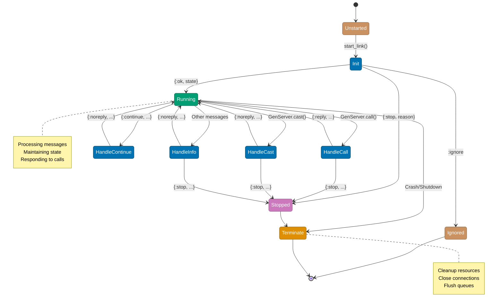

# OTP GenServer Patterns

## Overview

GenServer is a behavior module for implementing the server side of a client-server relationship. It provides a standard set of interface functions and manages state, synchronous and asynchronous calls, and process lifecycle.

**Key Benefits**:

- 🎯 **Standardized**: Common interface across all GenServers
- 🔄 **State Management**: Encapsulated mutable state
- 🔧 **Lifecycle Hooks**: init, terminate, handle_continue
- 🚀 **Performance**: Optimized message handling
- 🛡️ **Supervision**: Works seamlessly with supervisors

## Quick Reference

**Jump to**:

- [GenServer Fundamentals](#genserver-fundamentals)
- [State Management](#state-management)
- [Synchronous vs Asynchronous](#synchronous-vs-asynchronous)
- [Lifecycle Hooks](#lifecycle-hooks)
- [Testing GenServers](#testing-genservers)
- [Financial Domain Examples](#financial-domain-examples)

## GenServer Fundamentals

### Basic Structure

```elixir
defmodule CampaignServer do
  use GenServer

  # Client API

  def start_link(campaign_id) do
    GenServer.start_link(__MODULE__, campaign_id, name: via_tuple(campaign_id))
  end

  def get_campaign(campaign_id) do
    GenServer.call(via_tuple(campaign_id), :get_campaign)
  end

  def add_donation(campaign_id, donation) do
    GenServer.call(via_tuple(campaign_id), {:add_donation, donation})
  end

  def update_status(campaign_id, new_status) do
    GenServer.cast(via_tuple(campaign_id), {:update_status, new_status})
  end

  # Server Callbacks

  @impl true
  def init(campaign_id) do
    # Load campaign from database
    campaign = fetch_campaign(campaign_id)

    state = %{
      campaign_id: campaign_id,
      campaign: campaign,
      donation_count: 0,
      total_amount: Money.new(0, campaign.goal.currency)
    }

    {:ok, state}
  end

  @impl true
  def handle_call(:get_campaign, _from, state) do
    {:reply, state.campaign, state}
  end

  @impl true
  def handle_call({:add_donation, donation}, _from, state) do
    new_total = Money.add(state.total_amount, donation.amount)

    new_state = %{
      state |
      donation_count: state.donation_count + 1,
      total_amount: new_total,
      campaign: %{state.campaign | current: new_total}
    }

    {:reply, {:ok, new_state.campaign}, new_state}
  end

  @impl true
  def handle_cast({:update_status, new_status}, state) do
    updated_campaign = %{state.campaign | status: new_status}
    new_state = %{state | campaign: updated_campaign}

    {:noreply, new_state}
  end

  # Private Functions

  defp via_tuple(campaign_id) do
    {:via, Registry, {CampaignRegistry, campaign_id}}
  end

  defp fetch_campaign(id) do
    # Fetch from database
    Repo.get!(Campaign, id)
  end
end
```

### Callbacks Overview

The following diagram illustrates the complete GenServer lifecycle:



```elixir
# init/1 - Initialize state
@impl true
def init(args) do
  {:ok, initial_state}
  # or {:ok, initial_state, timeout}
  # or {:ok, initial_state, :hibernate}
  # or {:ok, initial_state, {:continue, term}}
  # or :ignore
  # or {:stop, reason}
end

# handle_call/3 - Synchronous request
@impl true
def handle_call(request, from, state) do
  {:reply, reply, new_state}
  # or {:reply, reply, new_state, timeout}
  # or {:noreply, new_state}
  # or {:stop, reason, reply, new_state}
  # or {:stop, reason, new_state}
end

# handle_cast/2 - Asynchronous request
@impl true
def handle_cast(request, state) do
  {:noreply, new_state}
  # or {:noreply, new_state, timeout}
  # or {:stop, reason, new_state}
end

# handle_info/2 - Other messages
@impl true
def handle_info(msg, state) do
  {:noreply, new_state}
  # or {:noreply, new_state, timeout}
  # or {:stop, reason, new_state}
end
```

The following diagram illustrates how GenServer processes messages from its mailbox:

```mermaid
graph LR
    Senders[Message Senders<br/>Multiple Clients]
    Mailbox[Process Mailbox<br/>FIFO Queue]
    GS[GenServer Process]

    Msg1[call: {:get, id}]
    Msg2[cast: {:update, data}]
    Msg3[info: :timeout]
    Msg4[cast: {:log, entry}]

    HC[handle_call]
    HCast[handle_cast]
    HInfo[handle_info]

    Senders --> Msg1
    Senders --> Msg2
    Senders --> Msg3
    Senders --> Msg4

    Msg1 --> Mailbox
    Msg2 --> Mailbox
    Msg3 --> Mailbox
    Msg4 --> Mailbox

    Mailbox --> GS
    GS --> HC
    GS --> HCast
    GS --> HInfo

    Note1[Messages processed<br/>one at a time<br/>in FIFO order]
    Mailbox -.-> Note1

    style Senders fill:#CA9161,stroke:#7D5A3D,color:#FFF
    style Mailbox fill:#DE8F05,stroke:#8A5903,color:#FFF
    style GS fill:#0173B2,stroke:#023B5A,color:#FFF
    style HC fill:#029E73,stroke:#01593F,color:#FFF
    style HCast fill:#029E73,stroke:#01593F,color:#FFF
    style HInfo fill:#029E73,stroke:#01593F,color:#FFF
    style Msg1 fill:#CA9161,stroke:#7D5A3D,color:#FFF
    style Msg2 fill:#CA9161,stroke:#7D5A3D,color:#FFF
    style Msg3 fill:#CA9161,stroke:#7D5A3D,color:#FFF
    style Msg4 fill:#CA9161,stroke:#7D5A3D,color:#FFF
    style Note1 fill:#0173B2,stroke:#023B5A,color:#FFF
```

```elixir

# terminate/2 - Cleanup
@impl true
def terminate(reason, state) do
  # Cleanup code
  :ok
end

# handle_continue/2 - Continue initialization
@impl true
def handle_continue(continue_arg, state) do
  {:noreply, new_state}
end
```

## State Management

The following diagram shows the immutable state update pattern in GenServer:

```mermaid
graph TD
    OldState[Old State<br/>donation_count: 5<br/>total: 100,000 IDR]
    HandleCall[handle_call<br/>{:add_donation, 20,000}]
    NewState[New State<br/>donation_count: 6<br/>total: 120,000 IDR]
    Reply[{:reply, :ok, new_state}]

    OldState --> HandleCall
    HandleCall --> NewState
    NewState --> Reply

    Note1[Immutable Update:<br/>Old state preserved<br/>New state created]
    HandleCall -.-> Note1

    style OldState fill:#CA9161,stroke:#7D5A3D,color:#FFF
    style HandleCall fill:#0173B2,stroke:#023B5A,color:#FFF
    style NewState fill:#029E73,stroke:#01593F,color:#FFF
    style Reply fill:#029E73,stroke:#01593F,color:#FFF
    style Note1 fill:#DE8F05,stroke:#8A5903,color:#FFF
```

### State Structure

```elixir
defmodule DonationProcessor do
  use GenServer

  # Complex state structure
  defmodule State do
    @enforce_keys [:campaign_id, :status]
    defstruct [
      :campaign_id,
      :status,
      pending_donations: [],
      processed_donations: [],
      total_amount: Money.new(0, :IDR),
      last_processed_at: nil,
      error_count: 0,
      config: %{}
    ]

    @type t :: %__MODULE__{
      campaign_id: String.t(),
      status: :idle | :processing | :paused,
      pending_donations: [Donation.t()],
      processed_donations: [Donation.t()],
      total_amount: Money.t(),
      last_processed_at: DateTime.t() | nil,
      error_count: non_neg_integer(),
      config: map()
    }
  end

  def init(campaign_id) do
    state = %State{
      campaign_id: campaign_id,
      status: :idle,
      config: load_config()
    }

    {:ok, state}
  end

  def handle_call({:add_donation, donation}, _from, %State{} = state) do
    new_pending = [donation | state.pending_donations]
    new_state = %{state | pending_donations: new_pending}

    {:reply, :ok, new_state}
  end

  defp load_config do
    %{
      batch_size: 100,
      retry_attempts: 3,
      timeout: 30_000
    }
  end
end
```

### State Updates

```elixir
defmodule ZakatCalculator do
  use GenServer

  def init(_) do
    state = %{
      calculations: [],
      total_zakat: Money.new(0, :IDR),
      calculation_count: 0
    }

    {:ok, state}
  end

  # Immutable state updates
  def handle_call({:calculate, wealth, nisab}, _from, state) do
    zakat = calculate_zakat(wealth, nisab)

    # Create new state with updated values
    new_state = %{
      state |
      calculations: [%{wealth: wealth, zakat: zakat} | state.calculations],
      total_zakat: Money.add(state.total_zakat, zakat),
      calculation_count: state.calculation_count + 1
    }

    {:reply, {:ok, zakat}, new_state}
  end

  # Reset state
  def handle_cast(:reset, state) do
    new_state = %{
      state |
      calculations: [],
      total_zakat: Money.new(0, :IDR),
      calculation_count: 0
    }

    {:noreply, new_state}
  end

  defp calculate_zakat(wealth, nisab) do
    if Money.compare(wealth, nisab) == :gt do
      Money.multiply(wealth, Decimal.new("0.025"))
    else
      Money.new(0, wealth.currency)
    end
  end
end
```

## Synchronous vs Asynchronous

### call vs cast

The following diagram shows the difference between synchronous call and asynchronous cast:

```mermaid
sequenceDiagram
    participant C1 as Client (call)
    participant GS1 as GenServer
    Note over C1,GS1: Synchronous Call (blocking)
    C1->>GS1: GenServer.call({:process, amount})
    Note over C1: Client WAITS ⏳
    GS1->>GS1: handle_call(...)<br/>Process payment
    GS1-->>C1: {:reply, {:ok, tx_id}, state}
    Note over C1: Client receives result ✅

    participant C2 as Client (cast)
    participant GS2 as GenServer
    Note over C2,GS2: Asynchronous Cast (non-blocking)
    C2->>GS2: GenServer.cast({:log, transaction})
    Note over C2: Client continues immediately ✅
    GS2->>GS2: handle_cast(...)<br/>Log transaction
    Note over GS2: No reply sent

    style C1 fill:#0173B2,stroke:#023B5A,color:#FFF
    style GS1 fill:#029E73,stroke:#01593F,color:#FFF
    style C2 fill:#0173B2,stroke:#023B5A,color:#FFF
    style GS2 fill:#029E73,stroke:#01593F,color:#FFF
```

```elixir
defmodule PaymentGateway do
  use GenServer

  # Synchronous - blocks until response
  def process_payment(gateway, amount) do
    # Waits for result
    GenServer.call(gateway, {:process, amount}, 30_000)  # 30s timeout
  end

  # Asynchronous - fire and forget
  def log_transaction(gateway, transaction) do
    # Returns immediately
    GenServer.cast(gateway, {:log, transaction})
  end

  # Synchronous handler - must reply
  def handle_call({:process, amount}, _from, state) do
    case charge_customer(amount) do
      {:ok, tx_id} ->
        new_state = update_state(state, tx_id, amount)
        {:reply, {:ok, tx_id}, new_state}

      {:error, reason} ->
        {:reply, {:error, reason}, state}
    end
  end

  # Asynchronous handler - no reply
  def handle_cast({:log, transaction}, state) do
    # Just update state, no response
    new_logs = [transaction | state.logs]
    {:noreply, %{state | logs: new_logs}}
  end

  defp charge_customer(amount) do
    # Simulate API call
    {:ok, UUID.uuid4()}
  end

  defp update_state(state, tx_id, amount) do
    %{state | last_transaction: tx_id, total: Money.add(state.total, amount)}
  end
end
```

### When to Use call vs cast

**Use GenServer.call when**:

- You need a response
- Operation must succeed before continuing
- You need confirmation
- Examples: database queries, payments, critical operations

**Use GenServer.cast when**:

- Fire-and-forget operations
- Logging, metrics, notifications
- Performance-critical paths
- Examples: audit logs, analytics, background updates

```elixir
defmodule CampaignManager do
  use GenServer

  # call - needs response
  def get_campaign_stats(manager, campaign_id) do
    GenServer.call(manager, {:get_stats, campaign_id})
  end

  # call - critical operation
  def create_campaign(manager, attrs) do
    GenServer.call(manager, {:create, attrs})
  end

  # cast - fire and forget
  def track_view(manager, campaign_id) do
    GenServer.cast(manager, {:track_view, campaign_id})
  end

  # cast - background task
  def schedule_reminder(manager, campaign_id) do
    GenServer.cast(manager, {:schedule_reminder, campaign_id})
  end
end
```

## Lifecycle Hooks

### init/1 - Initialization

```elixir
defmodule CampaignScheduler do
  use GenServer

  def init(config) do
    # Setup: load data, start timers, subscribe to events

    # Load campaigns
    campaigns = load_active_campaigns()

    # Subscribe to PubSub
    Phoenix.PubSub.subscribe(Financial.PubSub, "campaigns")

    # Schedule periodic work
    schedule_check()

    state = %{
      campaigns: campaigns,
      config: config,
      last_check: DateTime.utc_now()
    }

    {:ok, state}
  end

  defp schedule_check do
    # Send message to self after interval
    Process.send_after(self(), :check_campaigns, 60_000)  # 1 minute
  end
end
```

### handle_continue/2 - Deferred Initialization

The following diagram shows how handle_continue enables fast startup with deferred expensive operations:

```mermaid
sequenceDiagram
    participant Sup as Supervisor
    participant GS as GenServer
    participant DB as Database

    Sup->>GS: start_link(campaign_id)
    GS->>GS: init(campaign_id)
    Note over GS: Quick initialization<br/>state = %{status: :initializing}
    GS-->>Sup: {:ok, state, {:continue, :build_index}}
    Note over Sup: Startup completes quickly ✅
    Note over GS: Now handle deferred work
    GS->>GS: handle_continue(:build_index, state)
    GS->>DB: fetch_all_donations()
    DB-->>GS: [1000s of donations]
    GS->>GS: build_search_index()
    Note over GS: Expensive work complete<br/>state = %{status: :ready}
    GS-->>GS: {:noreply, new_state}

    style Sup fill:#0173B2,stroke:#023B5A,color:#FFF
    style GS fill:#029E73,stroke:#01593F,color:#FFF
    style DB fill:#CA9161,stroke:#7D5A3D,color:#FFF
```

```elixir
defmodule DonationIndexer do
  use GenServer

  def init(campaign_id) do
    # Quick initialization, defer expensive work
    state = %{
      campaign_id: campaign_id,
      index: nil,
      status: :initializing
    }

    # Continue with expensive operation
    {:ok, state, {:continue, :build_index}}
  end

  def handle_continue(:build_index, state) do
    # Expensive operation doesn't block init
    donations = fetch_all_donations(state.campaign_id)
    index = build_search_index(donations)

    new_state = %{
      state |
      index: index,
      status: :ready
    }

    {:noreply, new_state}
  end

  defp fetch_all_donations(campaign_id) do
    # Could take seconds for large campaigns
    Repo.all(from d in Donation, where: d.campaign_id == ^campaign_id)
  end

  defp build_search_index(donations) do
    # Build complex data structure
    Enum.reduce(donations, %{}, fn donation, acc ->
      # Index by donor, amount, date, etc.
      Map.put(acc, donation.id, donation)
    end)
  end
end
```

### terminate/2 - Cleanup

```elixir
defmodule PaymentProcessor do
  use GenServer

  def init(_) do
    # Open database connection
    {:ok, conn} = DatabasePool.checkout()

    state = %{
      connection: conn,
      pending_transactions: []
    }

    {:ok, state}
  end

  def terminate(reason, state) do
    # Cleanup resources
    Logger.info("PaymentProcessor terminating: #{inspect(reason)}")

    # Flush pending transactions
    flush_pending_transactions(state.pending_transactions)

    # Close connection
    DatabasePool.checkin(state.connection)

    # Cancel timers
    cancel_all_timers(state)

    :ok
  end

  defp flush_pending_transactions(transactions) do
    # Save to persistent storage
    Enum.each(transactions, &save_transaction/1)
  end

  defp cancel_all_timers(state) do
    # Cancel any pending timers
    Map.get(state, :timers, [])
    |> Enum.each(&Process.cancel_timer/1)
  end

  defp save_transaction(tx) do
    # Persist transaction
    Repo.insert!(tx)
  end
end
```

### handle_info/2 - Timers and Messages

```elixir
defmodule CampaignMonitor do
  use GenServer

  def init(campaign_id) do
    # Schedule periodic checks
    schedule_status_check()

    state = %{
      campaign_id: campaign_id,
      check_count: 0,
      alerts_sent: []
    }

    {:ok, state}
  end

  # Handle scheduled message
  def handle_info(:check_status, state) do
    # Perform check
    campaign = fetch_campaign(state.campaign_id)

    # Check milestones
    alerts = check_milestones(campaign, state)

    # Schedule next check
    schedule_status_check()

    new_state = %{
      state |
      check_count: state.check_count + 1,
      alerts_sent: alerts ++ state.alerts_sent
    }

    {:noreply, new_state}
  end

  # Handle PubSub messages
  def handle_info({:donation_received, donation}, state) do
    # Update internal state based on external event
    Logger.info("Donation received: #{inspect(donation)}")

    {:noreply, state}
  end

  defp schedule_status_check do
    Process.send_after(self(), :check_status, 300_000)  # 5 minutes
  end

  defp fetch_campaign(id) do
    Repo.get!(Campaign, id)
  end

  defp check_milestones(campaign, state) do
    # Check for milestones (25%, 50%, 75%, 100%)
    []
  end
end
```

## Testing GenServers

### Basic Testing

```elixir
defmodule CampaignServerTest do
  use ExUnit.Case, async: true

  alias CampaignServer

  setup do
    # Start GenServer for each test
    campaign = %Campaign{
      id: "test_campaign",
      name: "Test Campaign",
      goal: Money.new(1_000_000, :IDR),
      current: Money.new(0, :IDR),
      status: :active
    }

    {:ok, pid} = CampaignServer.start_link(campaign.id)

    %{pid: pid, campaign: campaign}
  end

  test "gets campaign", %{pid: pid} do
    campaign = CampaignServer.get_campaign("test_campaign")

    assert campaign.id == "test_campaign"
    assert campaign.status == :active
  end

  test "adds donation", %{pid: pid} do
    donation = %{
      amount: Money.new(50_000, :IDR),
      donor_id: "donor_123"
    }

    assert {:ok, updated_campaign} =
      CampaignServer.add_donation("test_campaign", donation)

    assert Money.equal?(updated_campaign.current, Money.new(50_000, :IDR))
  end

  test "updates status asynchronously", %{pid: pid} do
    :ok = CampaignServer.update_status("test_campaign", :completed)

    # Give cast time to process
    Process.sleep(10)

    campaign = CampaignServer.get_campaign("test_campaign")
    assert campaign.status == :completed
  end
end
```

### Testing with Mox

```elixir
# Define behaviour
defmodule PaymentGatewayBehaviour do
  @callback process_payment(Money.t()) :: {:ok, String.t()} | {:error, atom()}
end

# Implementation
defmodule PaymentGateway do
  use GenServer

  @behaviour PaymentGatewayBehaviour

  def start_link(opts) do
    GenServer.start_link(__MODULE__, opts, name: __MODULE__)
  end

  @impl PaymentGatewayBehaviour
  def process_payment(amount) do
    GenServer.call(__MODULE__, {:process, amount})
  end

  def init(opts) do
    {:ok, opts}
  end

  def handle_call({:process, amount}, _from, state) do
    # Real implementation
    {:reply, {:ok, UUID.uuid4()}, state}
  end
end

# Test with mock
defmodule PaymentGatewayTest do
  use ExUnit.Case, async: true

  import Mox

  # Define mock
  Mox.defmock(PaymentGatewayMock, for: PaymentGatewayBehaviour)

  setup :verify_on_exit!

  test "processes payment successfully" do
    amount = Money.new(50_000, :IDR)

    # Expect mock to be called
    expect(PaymentGatewayMock, :process_payment, fn ^amount ->
      {:ok, "tx_123"}
    end)

    # Call mock
    assert {:ok, "tx_123"} = PaymentGatewayMock.process_payment(amount)
  end
end
```

### Testing State Changes

```elixir
defmodule DonationProcessorTest do
  use ExUnit.Case, async: true

  test "processes batch of donations" do
    {:ok, pid} = DonationProcessor.start_link("campaign_123")

    # Add multiple donations
    donations = [
      %{amount: Money.new(10_000, :IDR), donor: "A"},
      %{amount: Money.new(20_000, :IDR), donor: "B"},
      %{amount: Money.new(30_000, :IDR), donor: "C"}
    ]

    Enum.each(donations, fn donation ->
      :ok = DonationProcessor.add_donation(pid, donation)
    end)

    # Process batch
    assert :ok = DonationProcessor.process_batch(pid)

    # Verify state
    stats = DonationProcessor.get_stats(pid)
    assert stats.processed_count == 3
    assert Money.equal?(stats.total_amount, Money.new(60_000, :IDR))
  end
end
```

## Financial Domain Examples

### Zakat Calculator GenServer

```elixir
defmodule Financial.ZakatCalculatorServer do
  @moduledoc """
  GenServer for managing zakat calculations with caching.
  """

  use GenServer

  # Client API

  def start_link(opts) do
    GenServer.start_link(__MODULE__, opts, name: __MODULE__)
  end

  @spec calculate(Money.t(), Money.t()) :: {:ok, Money.t()} | {:error, atom()}
  def calculate(wealth, nisab) do
    GenServer.call(__MODULE__, {:calculate, wealth, nisab})
  end

  @spec get_statistics() :: map()
  def get_statistics do
    GenServer.call(__MODULE__, :get_statistics)
  end

  @spec clear_cache() :: :ok
  def clear_cache do
    GenServer.cast(__MODULE__, :clear_cache)
  end

  # Server Callbacks

  @impl true
  def init(_opts) do
    state = %{
      calculations: [],
      cache: %{},
      total_calculated: Money.new(0, :IDR),
      count: 0,
      cache_hits: 0,
      cache_misses: 0
    }

    {:ok, state}
  end

  @impl true
  def handle_call({:calculate, wealth, nisab}, _from, state) do
    cache_key = {wealth.amount, wealth.currency, nisab.amount}

    case Map.get(state.cache, cache_key) do
      nil ->
        # Cache miss - calculate
        zakat = perform_calculation(wealth, nisab)

        new_state = %{
          state |
          calculations: [%{wealth: wealth, zakat: zakat, timestamp: DateTime.utc_now()} | state.calculations],
          cache: Map.put(state.cache, cache_key, zakat),
          total_calculated: Money.add(state.total_calculated, zakat),
          count: state.count + 1,
          cache_misses: state.cache_misses + 1
        }

        {:reply, {:ok, zakat}, new_state}

      cached_zakat ->
        # Cache hit
        new_state = %{state | cache_hits: state.cache_hits + 1}
        {:reply, {:ok, cached_zakat}, new_state}
    end
  end

  @impl true
  def handle_call(:get_statistics, _from, state) do
    stats = %{
      total_calculations: state.count,
      total_zakat: state.total_calculated,
      cache_hits: state.cache_hits,
      cache_misses: state.cache_misses,
      cache_hit_rate: calculate_hit_rate(state),
      cache_size: map_size(state.cache)
    }

    {:reply, stats, state}
  end

  @impl true
  def handle_cast(:clear_cache, state) do
    new_state = %{state | cache: %{}}
    {:noreply, new_state}
  end

  # Private Functions

  defp perform_calculation(wealth, nisab) do
    if Money.compare(wealth, nisab) == :gt do
      Money.multiply(wealth, Decimal.new("0.025"))
    else
      Money.new(0, wealth.currency)
    end
  end

  defp calculate_hit_rate(state) do
    total = state.cache_hits + state.cache_misses

    if total > 0 do
      Float.round(state.cache_hits / total * 100, 2)
    else
      0.0
    end
  end
end
```

### Donation Processor GenServer

```elixir
defmodule Financial.DonationProcessorServer do
  @moduledoc """
  GenServer for processing donations with batching and error handling.
  """

  use GenServer
  require Logger

  # Client API

  def start_link(campaign_id) do
    GenServer.start_link(__MODULE__, campaign_id, name: via_tuple(campaign_id))
  end

  def add_donation(campaign_id, donation) do
    GenServer.cast(via_tuple(campaign_id), {:add_donation, donation})
  end

  def process_batch(campaign_id) do
    GenServer.call(via_tuple(campaign_id), :process_batch)
  end

  def get_status(campaign_id) do
    GenServer.call(via_tuple(campaign_id), :get_status)
  end

  # Server Callbacks

  @impl true
  def init(campaign_id) do
    # Schedule periodic batch processing
    schedule_batch_processing()

    state = %{
      campaign_id: campaign_id,
      pending: [],
      processed: [],
      failed: [],
      total_amount: Money.new(0, :IDR),
      batch_size: 100,
      last_processed: nil
    }

    {:ok, state}
  end

  @impl true
  def handle_cast({:add_donation, donation}, state) do
    new_pending = [donation | state.pending]
    new_state = %{state | pending: new_pending}

    # Auto-process if batch size reached
    if length(new_pending) >= state.batch_size do
      {:noreply, process_donations(new_state)}
    else
      {:noreply, new_state}
    end
  end

  @impl true
  def handle_call(:process_batch, _from, state) do
    new_state = process_donations(state)
    {:reply, :ok, new_state}
  end

  @impl true
  def handle_call(:get_status, _from, state) do
    status = %{
      campaign_id: state.campaign_id,
      pending_count: length(state.pending),
      processed_count: length(state.processed),
      failed_count: length(state.failed),
      total_amount: state.total_amount,
      last_processed: state.last_processed
    }

    {:reply, status, state}
  end

  @impl true
  def handle_info(:process_batch, state) do
    new_state = if length(state.pending) > 0 do
      process_donations(state)
    else
      state
    end

    # Schedule next batch
    schedule_batch_processing()

    {:noreply, new_state}
  end

  # Private Functions

  defp via_tuple(campaign_id) do
    {:via, Registry, {Financial.Registry, {:donation_processor, campaign_id}}}
  end

  defp schedule_batch_processing do
    Process.send_after(self(), :process_batch, 30_000)  # 30 seconds
  end

  defp process_donations(state) do
    {processed, failed} =
      state.pending
      |> Enum.map(&process_donation/1)
      |> Enum.split_with(fn {status, _} -> status == :ok end)

    processed_donations = Enum.map(processed, fn {:ok, donation} -> donation end)
    failed_donations = Enum.map(failed, fn {:error, donation} -> donation end)

    total_added =
      processed_donations
      |> Enum.map(& &1.amount)
      |> Enum.reduce(Money.new(0, :IDR), &Money.add/2)

    %{
      state |
      pending: [],
      processed: processed_donations ++ state.processed,
      failed: failed_donations ++ state.failed,
      total_amount: Money.add(state.total_amount, total_added),
      last_processed: DateTime.utc_now()
    }
  end

  defp process_donation(donation) do
    # Validate and save donation
    case validate_donation(donation) do
      :ok ->
        case save_donation(donation) do
          {:ok, saved} -> {:ok, saved}
          {:error, _} -> {:error, donation}
        end

      {:error, _reason} ->
        {:error, donation}
    end
  end

  defp validate_donation(donation) do
    cond do
      not Money.positive?(donation.amount) -> {:error, :invalid_amount}
      true -> :ok
    end
  end

  defp save_donation(donation) do
    # Save to database
    {:ok, donation}
  end
end
```

## Best Practices

### 1. Always Use @impl

```elixir
defmodule MyServer do
  use GenServer

  # Good: Clear callback implementation
  @impl true
  def init(_), do: {:ok, %{}}

  @impl true
  def handle_call(:get, _from, state), do: {:reply, state, state}
end
```

### 2. Separate Client API from Server Callbacks

```elixir
defmodule CampaignServer do
  use GenServer

  # === Client API ===

  def start_link(campaign_id) do
    GenServer.start_link(__MODULE__, campaign_id)
  end

  def get_campaign(pid) do
    GenServer.call(pid, :get_campaign)
  end

  # === Server Callbacks ===

  @impl true
  def init(campaign_id) do
    {:ok, load_campaign(campaign_id)}
  end

  @impl true
  def handle_call(:get_campaign, _from, state) do
    {:reply, state, state}
  end
end
```

### 3. Handle Timeouts

```elixir
# Set reasonable timeouts
GenServer.call(pid, :slow_operation, 60_000)  # 60 seconds

# Handle timeout in server
def handle_call(:slow_operation, _from, state) do
  result = slow_external_api_call()
  {:reply, result, state, 30_000}  # Return with timeout
end
```

### 4. Use Named Processes Carefully

```elixir
# Good: Single instance
GenServer.start_link(Worker, [], name: Worker)

# Good: Registry for multiple instances
GenServer.start_link(Worker, id, name: {:via, Registry, {MyRegistry, id}})

# Avoid: Hardcoded names for dynamic processes
GenServer.start_link(Worker, id, name: String.to_atom("worker_#{id}"))  # Creates atoms!
```

### 5. Clean Up in terminate/2

```elixir
@impl true
def terminate(_reason, state) do
  # Close connections
  close_connections(state.connections)

  # Cancel timers
  cancel_timers(state.timers)

  # Flush pending work
  flush_queue(state.queue)

  :ok
end
```

## Performance Considerations

### Batch Operations

```elixir
# Bad: N GenServer calls
def process_donations(donations) do
  Enum.map(donations, fn donation ->
    DonationServer.process(donation)  # N round-trips
  end)
end

# Good: Single batched call
def process_donations(donations) do
  DonationServer.process_batch(donations)  # 1 round-trip
end
```

### State Size

```elixir
# Bad: Unbounded growth
def handle_cast({:log, entry}, state) do
  {:noreply, %{state | logs: [entry | state.logs]}}  # Grows forever!
end

# Good: Bounded history
def handle_cast({:log, entry}, state) do
  new_logs = [entry | state.logs] |> Enum.take(1000)  # Keep last 1000
  {:noreply, %{state | logs: new_logs}}
end
```

## Common Patterns

### Request-Reply with Timeout

```elixir
def handle_call({:external_api, params}, from, state) do
  # Spawn async task
  Task.start(fn ->
    result = ExternalAPI.call(params)
    GenServer.reply(from, result)
  end)

  {:noreply, state, 30_000}  # Timeout if no reply in 30s
end
```

### Delayed Initialization

```elixir
def init(config) do
  state = %{config: config, data: nil, status: :loading}
  {:ok, state, {:continue, :load_data}}
end

def handle_continue(:load_data, state) do
  data = load_expensive_data()
  {:noreply, %{state | data: data, status: :ready}}
end
```

## Resources

### Official Documentation

- [GenServer Behavior](https://hexdocs.pm/elixir/GenServer.html)
- [OTP Design Principles](https://www.erlang.org/doc/design_principles/des_princ.html)

### Related Documentation

- [Back to Elixir README](README.md)
- [Supervisor Patterns](ex-so-prla-el__otp-supervisor.md)
- [Application Patterns](ex-so-prla-el__otp-application.md)
- [Concurrency and Parallelism](ex-so-prla-el__concurrency-and-parallelism.md)

---

**Last Updated**: 2026-01-23
**Elixir Version**: 1.12+ (baseline), 1.17+ (recommended), 1.19.0 (latest)
**Maintainers**: Platform Documentation Team
