title: Go Anti-Patterns
description: Common mistakes and anti-patterns in Go - what to avoid and why
category: explanation
subcategory: prog-lang
tags:

- golang
- anti-patterns
- common-mistakes
- goroutine-leaks
- nil-pointers
- race-conditions
- resource-leaks
- bad-practices
- go-1.18
- go-1.21
- go-1.22
- go-1.23
- go-1.24
- go-1.25
  principles:
- explicit-over-implicit

---

# Go Anti-Patterns

## Quick Reference

### Critical Anti-Patterns

- [Error Handling Anti-Patterns](#error-handling-anti-patterns) - Ignoring errors, panic misuse, error wrapping
- [Financial Calculation Anti-Patterns](#financial-calculation-anti-patterns) - Float64 for money, precision errors
- [Goroutine Leaks](#goroutine-leaks) - Unbounded goroutines, blocking channels, missing contexts
- [Nil Pointer Dereferences](#nil-pointer-dereferences) - Unchecked nil, nil receivers, nil interfaces

### Concurrency & Resources

- [Race Conditions](#race-conditions) - Data races, unsynchronized access, map races
- [Resource Leaks](#resource-leaks) - Unclosed connections, defer misuse, context leaks
- [Concurrency Anti-Patterns](#concurrency-anti-patterns) - WaitGroup errors, channel misuse, mutex mistakes

### Design & Organization

- [Database Anti-Patterns](#database-anti-patterns) - Connection pools, N+1 queries, transactions
- [Interface Pollution Anti-Patterns](#interface-pollution-anti-patterns) - Over-abstraction, premature interfaces
- [API Design Anti-Patterns](#api-design-anti-patterns) - Poor interfaces, inconsistent naming
- [Code Organization Anti-Patterns](#code-organization-anti-patterns) - Package structure, circular imports

### Performance & Security

- [Performance Anti-Patterns](#performance-anti-patterns) - String concatenation, reflection abuse
- [Security Anti-Patterns](#security-anti-patterns) - SQL injection, cryptographic mistakes
- [Testing Anti-Patterns](#testing-anti-patterns) - Flaky tests, missing coverage, test dependencies

### Navigation

- [Summary](#summary) - Complete anti-patterns checklist
- [Additional Resources](#additional-resources) - Further reading and tools

## Overview

Anti-patterns are common solutions to recurring problems that are ineffective, counterproductive, or lead to bugs. Recognizing anti-patterns helps you avoid them and write better Go code.

### Why Learn Anti-Patterns?

```go
// ANTI-PATTERN: Many issues
func GetUser(id int) *Beneficiary {
    var beneficiary *Beneficiary
    beneficiary = db.QueryUser(id)  // What if this fails?
    return beneficiary               // Might return nil without indication
}

// CORRECT: Clear error handling
func GetUser(id int) (*Beneficiary, error) {
    beneficiary, err := db.QueryUser(id)
    if err != nil {
        return nil, fmt.Errorf("query beneficiary: %w", err)
    }
    return beneficiary, nil
}
```

**Learning anti-patterns helps you**:

1. **Avoid bugs** before they happen
2. **Review code** more effectively
3. **Understand trade-offs** of different approaches
4. **Write maintainable code** that others can work with
5. **Debug faster** by recognizing common issues

### Go Version Context

This guide covers Go 1.18-1.25, highlighting version-specific anti-patterns.

## Error Handling Anti-Patterns

### Error Handling Decision Flow

```mermaid
%% Color Palette: Blue #0173B2, Orange #DE8F05, Teal #029E73, Purple #CC78BC, Brown #CA9161
%% All colors are color-blind friendly and meet WCAG AA contrast standards

graph TD
    A["Function Returns<br/>(value, error)"]:::blue --> B{"err != nil?"}:::orange

    B -->|"No"| C["✅ Use Value<br/>Continue"]:::teal
    B -->|"Yes"| D{"Can<br/>Recover?"}:::orange

    D -->|"Yes"| E["Handle Error<br/>(retry, default)"]:::purple
    D -->|"No"| F{"Need<br/>Context?"}:::orange

    F -->|"Yes"| G["Wrap Error<br/>fmt.Errorf(%w)"]:::purple
    F -->|"No"| H["Return Error<br/>to Caller"]:::brown

    G --> I{"Log?"}:::orange
    H --> I

    I -->|"Yes"| J["Log with Context<br/>(level, details)"]:::teal
    I -->|"No"| K["Propagate"]:::teal

    Note["❌ NEVER:<br/>Ignore errors (_)<br/>panic for expected errors<br/>Generic error messages"]

    classDef blue fill:#0173B2,stroke:#000,color:#fff
    classDef orange fill:#DE8F05,stroke:#000,color:#000
    classDef teal fill:#029E73,stroke:#000,color:#fff
    classDef purple fill:#CC78BC,stroke:#000,color:#000
    classDef brown fill:#CA9161,stroke:#000,color:#000
```



**Key Principles**:

- **Always check**: `if err != nil` - no exceptions
- **Wrap with context**: Use `fmt.Errorf("operation: %w", err)` to add context
- **Never panic**: Return errors, don't panic (except init/startup failures)
- **errors.Is/As**: Use for sentinel and type checking

### Ignoring Errors

```go
// ANTI-PATTERN: Ignoring errors
func ProcessFile(path string) {
    data, _ := os.ReadFile(path)  // What if it fails?
    _ = ProcessData(data)          // What if processing fails?
    _ = SaveResult(data)           // What if save fails?
}

// CORRECT: Check all errors
func ProcessFile(path string) error {
    data, err := os.ReadFile(path)
    if err != nil {
        return fmt.Errorf("read file: %w", err)
    }

    if err := ProcessData(data); err != nil {
        return fmt.Errorf("process data: %w", err)
    }

    if err := SaveResult(data); err != nil {
        return fmt.Errorf("save result: %w", err)
    }

    return nil
}
```

**Why it's bad**: Silent failures lead to hard-to-debug issues. Users get no indication something went wrong.

**When to ignore errors**: Only when truly intentional and documented:

```go
// Acceptable: Ignoring close error when already handling another error
if err := processFile(f); err != nil {
    _ = f.Close()  // Ignore close error, already have failure
    return err
}
```

### Using Panic for Expected Errors

```go
// ANTI-PATTERN: Panic for expected errors
func ReadConfig(path string) *Config {
    data, err := os.ReadFile(path)
    if err != nil {
        panic(err)  // File might not exist!
    }

    var cfg Config
    if err := json.Unmarshal(data, &cfg); err != nil {
        panic(err)  // JSON might be malformed!
    }

    return &cfg
}

// CORRECT: Return errors
func ReadConfig(path string) (*Config, error) {
    data, err := os.ReadFile(path)
    if err != nil {
        return nil, fmt.Errorf("read config: %w", err)
    }

    var cfg Config
    if err := json.Unmarshal(data, &cfg); err != nil {
        return nil, fmt.Errorf("parse config: %w", err)
    }

    return &cfg, nil
}
```

**Why it's bad**: Panics crash programs. Use panic only for:

- Programmer errors (not runtime errors)
- Initialization failures (init() functions)
- Impossible situations

### Losing Error Context

```go
// ANTI-PATTERN: Losing context
func GetUser(id int) (*Beneficiary, error) {
    beneficiary, err := db.Query(id)
    if err != nil {
        return nil, errors.New("failed")  // What failed? Where?
    }
    return beneficiary, nil
}

// ANTI-PATTERN: Breaking error chain
func GetUser(id int) (*Beneficiary, error) {
    beneficiary, err := db.Query(id)
    if err != nil {
        return nil, fmt.Errorf("database error: %v", err)  // %v breaks chain!
    }
    return beneficiary, nil
}

// CORRECT: Preserve context and chain
func GetUser(id int) (*Beneficiary, error) {
    beneficiary, err := db.Query(id)
    if err != nil {
        return nil, fmt.Errorf("query beneficiary %d: %w", id, err)  // %w preserves chain
    }
    return beneficiary, nil
}
```

**Why it's bad**: Lost context makes debugging impossible. Can't identify which database call failed or why.

### Logging And Returning Error

```go
// ANTI-PATTERN: Both logging and returning
func ProcessData(data []byte) error {
    result, err := parse(data)
    if err != nil {
        log.Printf("parse error: %v", err)  // Logging...
        return err                           // ...and returning
    }
    return save(result)
}

// CORRECT: Either log or return
func ProcessData(data []byte) error {
    result, err := parse(data)
    if err != nil {
        return fmt.Errorf("parse data: %w", err)  // Just return
    }
    return save(result)
}

// Log at top level
func main() {
    if err := ProcessData(data); err != nil {
        log.Printf("process data failed: %v", err)  // Log once
    }
}
```

**Why it's bad**: Creates duplicate log entries, making logs noisy and hard to read.

### Not Using errors.Is() and errors.As()

```go
// ANTI-PATTERN: String comparison for errors (Go 1.13+)
func ProcessPayment(amount int64) error {
  err := validatePayment(amount)
  if err != nil && err.Error() == "insufficient balance" {  // Fragile!
    return errors.New("donation failed")
  }
  return err
}

// CORRECT: Use errors.Is() for sentinel errors
var ErrInsufficientBalance = errors.New("insufficient balance")

func ProcessPayment(amount int64) error {
  err := validatePayment(amount)
  if errors.Is(err, ErrInsufficientBalance) {  // Robust
    return fmt.Errorf("donation failed: %w", err)
  }
  return err
}

// ANTI-PATTERN: Type assertion without errors.As()
func HandleError(err error) {
  if e, ok := err.(*ValidationError); ok {  // Doesn't unwrap!
    fmt.Println(e.Field)
  }
}

// CORRECT: Use errors.As() to unwrap error chain
func HandleError(err error) {
  var validationErr *ValidationError
  if errors.As(err, &validationErr) {  // Unwraps chain
    fmt.Println(validationErr.Field)
  }
}
```

**Why it's bad**: String comparison breaks when error messages change. Type assertions don't unwrap error chains created with `%w`.

**Financial example - Zakat calculation validation**:

```go
// Define error types for Zakat validation
var (
  ErrNegativeAmount = errors.New("zakat amount cannot be negative")
  ErrBelowNisab    = errors.New("wealth below nisab")
)

type ValidationError struct {
  Field   string
  Message string
}

func (e *ValidationError) Error() string {
  return fmt.Sprintf("%s: %s", e.Field, e.Message)
}

// ANTI-PATTERN: String comparison
func ValidateZakat(wealth int64) error {
  err := checkNisab(wealth)
  if err != nil && err.Error() == "wealth below nisab" {
    return errors.New("cannot calculate zakat")  // Lost context!
  }
  return err
}

// CORRECT: Use errors.Is() and errors.As()
func ValidateZakat(wealth int64) error {
  if wealth < 0 {
    return ErrNegativeAmount
  }

  err := checkNisab(wealth)
  if errors.Is(err, ErrBelowNisab) {
    return fmt.Errorf("zakat not required: %w", err)  // Preserves chain
  }

  var validationErr *ValidationError
  if errors.As(err, &validationErr) {
    return fmt.Errorf("validation failed for %s: %w", validationErr.Field, err)
  }

  return err
}
```

### Swallowing Errors in Defer

```go
// ANTI-PATTERN: Defer ignoring errors
func ProcessTransaction(tx *sql.Tx) (err error) {
  defer tx.Rollback()  // Ignores error, might fail silently

  if err := updateAccount(); err != nil {
    return err
  }

  return tx.Commit()
}

// CORRECT: Handle defer errors appropriately
func ProcessTransaction(tx *sql.Tx) (err error) {
  defer func() {
    if err != nil {
      if rbErr := tx.Rollback(); rbErr != nil {
        // Log rollback failure, but preserve original error
        log.Printf("rollback failed: %v (original error: %v)", rbErr, err)
      }
    }
  }()

  if err = updateAccount(); err != nil {
    return fmt.Errorf("update donation_account: %w", err)
  }

  if err = tx.Commit(); err != nil {
    return fmt.Errorf("commit donation_transaction: %w", err)
  }

  return nil
}
```

**Why it's bad**: Rollback might fail (database connection lost), leaving donation_transaction in inconsistent state. You won't know why.

**Financial example - Donation processing**:

```go
// ANTI-PATTERN: Silent rollback failure
func ProcessDonation(donorID, amount int64) error {
  tx, err := db.Begin()
  if err != nil {
    return err
  }
  defer tx.Rollback()  // Might fail silently!

  if err := recordDonation(tx, donorID, amount); err != nil {
    return err  // Rollback error lost
  }

  return tx.Commit()
}

// CORRECT: Track and log rollback errors
func ProcessDonation(donorID, amount int64) (err error) {
  tx, err := db.Begin()
  if err != nil {
    return fmt.Errorf("begin donation_transaction: %w", err)
  }

  defer func() {
    if err != nil {
      if rbErr := tx.Rollback(); rbErr != nil {
        log.Printf("CRITICAL: rollback failed for donation (donor=%d, amount=%d): %v (original: %v)",
          donorID, amount, rbErr, err)
        // Could send alert to monitoring system
      }
    }
  }()

  if err = recordDonation(tx, donorID, amount); err != nil {
    return fmt.Errorf("record donation: %w", err)
  }

  if err = updateDonorTotal(tx, donorID, amount); err != nil {
    return fmt.Errorf("update donor total: %w", err)
  }

  if err = tx.Commit(); err != nil {
    return fmt.Errorf("commit donation: %w", err)
  }

  return nil
}
```

### Generic Error Messages Without Context

```go
// ANTI-PATTERN: Useless error messages
func TransferFunds(from, to int64, amount int64) error {
  if err := debitAccount(from, amount); err != nil {
    return errors.New("error")  // What error? Which donation_account?
  }

  if err := creditAccount(to, amount); err != nil {
    return errors.New("failed")  // Failed how?
  }

  return nil
}

// CORRECT: Specific, contextual errors
func TransferFunds(from, to int64, amount int64) error {
  if err := debitAccount(from, amount); err != nil {
    return fmt.Errorf("debit donation_account %d (amount=%d): %w", from, amount, err)
  }

  if err := creditAccount(to, amount); err != nil {
    return fmt.Errorf("credit donation_account %d (amount=%d): %w", to, amount, err)
  }

  return nil
}
```

**Why it's bad**: Generic errors make debugging impossible. "Error" tells you nothing about what went wrong or where.

## Financial Calculation Anti-Patterns

Financial calculations require absolute precision. Floating-point arithmetic introduces rounding errors that compound over time, leading to incorrect results. This section demonstrates why `float64` is unsuitable for money and shows correct approaches using integer arithmetic.

### Money Type Decision Flow

```mermaid
%% Color Palette: Blue #0173B2, Orange #DE8F05, Teal #029E73, Purple #CC78BC, Brown #CA9161
%% All colors are color-blind friendly and meet WCAG AA contrast standards

graph TD
    A["Need to Store<br/>Money?"]:::blue --> B{"Financial<br/>Calculations?"}:::orange

    B -->|"Yes"| C["✅ Use int64<br/>(smallest unit)"]:::teal
    B -->|"No"| D{"Display<br/>Only?"}:::orange

    D -->|"Yes"| E["Store as int64<br/>Format for display"]:::teal
    D -->|"No"| C

    C --> F["Money Best Practices"]:::teal
    F --> F1["• Store cents/smallest unit"]
    F --> F2["• Use custom Money type"]
    F --> F3["• Method receivers for ops"]
    F --> F4["• Rounding with big.Int"]

    G["❌ NEVER use float64"]:::brown
    H["Examples:<br/>float64 = imprecise<br/>string = no arithmetic<br/>Decimal pkg = slow"]:::purple

    Note["Golden Rule:<br/>If it's money,<br/>use int64 cents"]

    classDef blue fill:#0173B2,stroke:#000,color:#fff
    classDef orange fill:#DE8F05,stroke:#000,color:#000
    classDef teal fill:#029E73,stroke:#000,color:#fff
    classDef purple fill:#CC78BC,stroke:#000,color:#000
    classDef brown fill:#CA9161,stroke:#000,color:#000
```



**Type Guidelines**:

- **int64 cents**: All money values (USD: pennies, EUR: cents, JPY: yen)
- **big.Int**: For very large amounts or intermediate calculations
- **Never float64**: Precision errors accumulate
- **Never string**: Cannot perform arithmetic

**Example**: $100.25 → store as `int64(10025)` (cents)

### Using float64 for Money

```go
// ANTI-PATTERN: Float64 precision loss
type ZakatCalculator struct {
  wealthUSD float64  // WRONG!
}

func (z *ZakatCalculator) CalculateZakat() float64 {
  // 2.5% of wealth
  return z.wealthUSD * 0.025  // Precision loss!
}

func main() {
  calc := ZakatCalculator{wealthUSD: 10000.33}
  zakat := calc.CalculateZakat()
  fmt.Printf("Zakat: $%.2f\n", zakat)  // Prints: $250.01 (should be $250.00825)

  // Compounding error
  total := 0.1 + 0.025
  fmt.Println(total == 0.3)  // false! (0.30000000000000004)
}

// CORRECT: Use integer cents (int64)
type Money struct {
  cents int64  // Store as smallest unit (cents, fils, halalas)
}

func NewMoney(dollars int64, cents int64) Money {
  return Money{cents: dollars*100 + cents}
}

func (m Money) Dollars() int64 {
  return m.cents / 100
}

func (m Money) Cents() int64 {
  return m.cents % 100
}

func (m Money) String() string {
  return fmt.Sprintf("$%d.%02d", m.Dollars(), m.Cents())
}

type ZakatCalculator struct {
  wealth Money
}

func (z *ZakatCalculator) CalculateZakat() Money {
  // 2.5% = 25/1000
  zakatCents := (z.wealth.cents * 25) / 1000
  return Money{cents: zakatCents}
}

func main() {
  wealth := NewMoney(10000, 33)  // $10,000.33
  calc := ZakatCalculator{wealth: wealth}
  zakat := calc.CalculateZakat()
  fmt.Println(zakat)  // $250.00 (exact, no precision loss)
}
```

**Why it's bad**: Floating-point arithmetic is inherently imprecise due to binary representation. `0.1 + 0.025 != 0.3` in binary floating-point. Financial calculations accumulate these errors, leading to incorrect balances.

**Real-world impact**:

- Zakat of $10,000.33 should be $250.00825 (rounds to $250.01), but float64 might give $250.00 or $250.02
- Over 1000 transactions, errors compound to dollars of discrepancy
- Regulatory compliance requires exact decimal arithmetic

### Rounding Errors in Zakat Calculations

```go
// ANTI-PATTERN: Incorrect rounding
func CalculateZakatFloat(wealthUSD float64) float64 {
  zakat := wealthUSD * 0.025
  // Implicit rounding when printing
  return zakat  // 10000.33 * 0.025 = 250.00825 (binary approximation)
}

// Better but still wrong: Manual rounding with float64
func CalculateZakatRounded(wealthUSD float64) float64 {
  zakat := wealthUSD * 0.025
  return math.Round(zakat*100) / 100  // Still uses float64!
}

// CORRECT: Integer arithmetic with explicit rounding
type Money struct {
  cents int64
}

func (m Money) MultiplyAndRound(numerator, denominator int64) Money {
  // Calculate: (m.cents * numerator) / denominator with rounding
  result := (m.cents*numerator + denominator/2) / denominator
  return Money{cents: result}
}

func CalculateZakat(wealth Money) Money {
  // 2.5% = 25/1000
  return wealth.MultiplyAndRound(25, 1000)
}

func main() {
  // Example: $85,000.00 wealth
  wealth := Money{cents: 8500000}

  // Nisab: $5,000 (gold value)
  nisab := Money{cents: 500000}

  if wealth.cents >= nisab.cents {
    zakat := CalculateZakat(wealth)
    fmt.Printf("Wealth: %s\n", wealth)     // $85,000.00
    fmt.Printf("Zakat (2.5%%): %s\n", zakat)  // $2,125.00 (exact)
  }
}

// Advanced: Banker's rounding (round half to even)
func (m Money) MultiplyBankersRound(numerator, denominator int64) Money {
  quotient := (m.cents * numerator) / denominator
  remainder := (m.cents * numerator) % denominator

  if remainder*2 < denominator {
    return Money{cents: quotient}  // Round down
  } else if remainder*2 > denominator {
    return Money{cents: quotient + 1}  // Round up
  } else {
    // Exactly half: round to even
    if quotient%2 == 0 {
      return Money{cents: quotient}
    }
    return Money{cents: quotient + 1}
  }
}
```

**Why it's bad**: Financial regulations often specify exact rounding rules (half-up, half-even). Float64 rounding is unpredictable and non-compliant.

**Islamic finance context**:

- Zakat calculation must be exact for religious compliance
- Rounding errors can cause underpayment (spiritually harmful) or overpayment (financial loss)
- Different scholars may specify different rounding rules
- Integer arithmetic ensures reproducible, compliant calculations

### Currency Mismatch Errors

```go
// ANTI-PATTERN: No currency tracking
type DonationPayment struct {
  amount float64  // USD? SAR? IDR?
}

func ProcessPayment(p DonationPayment) {
  // Is this USD to SAR conversion correct?
  sarAmount := p.amount * 3.75  // Exchange rate hard-coded!
}

// CORRECT: Explicit currency tracking
type Currency string

const (
  USD Currency = "USD"
  SAR Currency = "SAR"  // Saudi Riyal
  IDR Currency = "IDR"  // Indonesian Rupiah
)

type Money struct {
  cents    int64
  currency Currency
}

func NewMoney(dollars, cents int64, currency Currency) Money {
  return Money{
    cents:    dollars*100 + cents,
    currency: currency,
  }
}

type ExchangeRate struct {
  from Currency
  to   Currency
  rate int64  // Rate in basis points (1/10000)
}

func (er ExchangeRate) Convert(m Money) (Money, error) {
  if m.currency != er.from {
    return Money{}, fmt.Errorf("currency mismatch: have %s, need %s", m.currency, er.from)
  }

  // Convert: (amount * rate) / 10000
  convertedCents := (m.cents * er.rate) / 10000
  return Money{cents: convertedCents, currency: er.to}, nil
}

func main() {
  // Donation in USD
  donation := NewMoney(100, 0, USD)  // $100.00 USD

  // Exchange rate: 1 USD = 3.75 SAR (37500 basis points)
  usdToSar := ExchangeRate{from: USD, to: SAR, rate: 37500}

  donationSAR, err := usdToSar.Convert(donation)
  if err != nil {
    log.Fatal(err)
  }

  fmt.Printf("Donation: %s %s\n", donation, donation.currency)        // $100.00 USD
  fmt.Printf("In SAR: %s %s\n", donationSAR, donationSAR.currency)    // $375.00 SAR

  // Compile-time safety: Can't mix currencies
  zakatUSD := NewMoney(50, 0, USD)
  zakatSAR := NewMoney(50, 0, SAR)

  // This would require explicit conversion (good!)
  // total := zakatUSD.cents + zakatSAR.cents  // Mixing currencies!
}

// Additional safety: Type-safe operations
func (m Money) Add(other Money) (Money, error) {
  if m.currency != other.currency {
    return Money{}, fmt.Errorf("cannot add %s and %s", m.currency, other.currency)
  }
  return Money{cents: m.cents + other.cents, currency: m.currency}, nil
}

func (m Money) Subtract(other Money) (Money, error) {
  if m.currency != other.currency {
    return Money{}, fmt.Errorf("cannot subtract %s from %s", other.currency, m.currency)
  }
  if m.cents < other.cents {
    return Money{}, errors.New("insufficient funds")
  }
  return Money{cents: m.cents - other.cents, currency: m.currency}, nil
}
```

**Why it's bad**: Currency mismatch causes catastrophic errors. Adding $100 USD and $100 SAR as if they're the same value loses ~$73 USD.

**Islamic finance example - Multi-currency donations**:

```go
type DonationCampaign struct {
  targetAmount Money
  donations    []Money
}

func (dc *DonationCampaign) AddDonation(donation Money) error {
  if donation.currency != dc.targetAmount.currency {
    return fmt.Errorf("donation currency %s does not match campaign currency %s",
      donation.currency, dc.targetAmount.currency)
  }
  dc.donations = append(dc.donations, donation)
  return nil
}

func (dc *DonationCampaign) TotalRaised() Money {
  total := Money{cents: 0, currency: dc.targetAmount.currency}
  for _, donation := range dc.donations {
    // Safe: all donations verified to match currency
    total.cents += donation.cents
  }
  return total
}

func main() {
  // Campaign target: $10,000 USD for mosque construction
  campaign := DonationCampaign{
    targetAmount: NewMoney(10000, 0, USD),
  }

  // Donations in USD
  campaign.AddDonation(NewMoney(100, 0, USD))   // OK
  campaign.AddDonation(NewMoney(250, 50, USD))  // OK

  // Try to add SAR donation (rejected)
  err := campaign.AddDonation(NewMoney(500, 0, SAR))
  if err != nil {
    fmt.Println(err)  // "donation currency SAR does not match campaign currency USD"
  }

  fmt.Printf("Target: %s\n", campaign.targetAmount)      // $10,000.00
  fmt.Printf("Raised: %s\n", campaign.TotalRaised())     // $350.50
}
```

### Time Zone Issues in Financial Transactions

```go
// ANTI-PATTERN: Using local time for financial records
type DonationTransaction struct {
  id        int64
  amount    Money
  timestamp time.Time  // Local time? UTC? Unclear!
}

func RecordTransaction(amount Money) DonationTransaction {
  return DonationTransaction{
    amount:    amount,
    timestamp: time.Now(),  // Uses local time zone!
  }
}

// Problems:
// 1. Daylight saving time changes
// 2. Different servers in different time zones
// 3. Ambiguous during DST transitions
// 4. Sorting transactions by time fails across time zones

// CORRECT: Always use UTC for financial records
type DonationTransaction struct {
  id        int64
  amount    Money
  timestamp time.Time  // Stored as UTC
}

func RecordTransaction(amount Money) DonationTransaction {
  return DonationTransaction{
    amount:    amount,
    timestamp: time.Now().UTC(),  // Explicit UTC
  }
}

func (t DonationTransaction) TimestampInZone(loc *time.Location) time.Time {
  return t.timestamp.In(loc)
}

func main() {
  // Record donation_transaction in UTC
  tx := RecordTransaction(NewMoney(100, 0, USD))
  fmt.Printf("DonationTransaction at: %s (UTC)\n", tx.timestamp.Format(time.RFC3339))

  // Display in local time zones
  jakarta, _ := time.LoadLocation("Asia/Jakarta")
  riyadh, _ := time.LoadLocation("Asia/Riyadh")

  fmt.Printf("Jakarta time: %s\n", tx.TimestampInZone(jakarta).Format(time.RFC3339))
  fmt.Printf("Riyadh time: %s\n", tx.TimestampInZone(riyadh).Format(time.RFC3339))
}

// Financial reporting: End of day cutoff
func GetDailyTransactions(date time.Time) []DonationTransaction {
  // ANTI-PATTERN: Using local midnight
  start := time.Date(date.Year(), date.Month(), date.Day(), 0, 0, 0, 0, time.Local)
  end := start.Add(24 * time.Hour)

  // Problem: Which day's transactions during DST change?
  // Problem: Different results depending on server location

  // CORRECT: Use UTC midnight
  startUTC := time.Date(date.Year(), date.Month(), date.Day(), 0, 0, 0, 0, time.UTC)
  endUTC := startUTC.Add(24 * time.Hour)

  return queryTransactions(startUTC, endUTC)
}

// Islamic finance: Zakat calculation year
func CalculateYearlyZakat(startDate time.Time) Money {
  // Lunar year: 354-355 days
  // ANTI-PATTERN: Using Gregorian calendar (365 days)
  endDate := startDate.AddDate(1, 0, 0)  // WRONG!

  // CORRECT: Use Hijri calendar library or 354-day period
  lunarYear := 354 * 24 * time.Hour
  endDate = startDate.Add(lunarYear)  // Correct for lunar calendar

  wealth := getWealthAtDate(endDate.UTC())
  return CalculateZakat(wealth)
}
```

**Why it's bad**: Time zone bugs in financial systems cause:

- Double-counting or missing transactions during DST changes
- Incorrect daily/monthly reports
- Audit failures
- Regulatory non-compliance

**Islamic finance context**:

- Zakat calculation requires tracking wealth over lunar year (354 days, not 365)
- Salat (prayer) times depend on solar position, not local time zones
- Multi-country operations need consistent donation_transaction timestamps
- DST transitions can cause ambiguous prayer times

### Complete Money Value Object Example

```go
// Production-ready Money type with all operations
package money

import (
  "errors"
  "fmt"
)

type Currency string

const (
  USD Currency = "USD"
  SAR Currency = "SAR"
  IDR Currency = "IDR"
)

type Money struct {
  cents    int64    // Smallest unit (cents, fils, halalas)
  currency Currency
}

func New(dollars, cents int64, currency Currency) Money {
  return Money{
    cents:    dollars*100 + cents,
    currency: currency,
  }
}

func FromCents(cents int64, currency Currency) Money {
  return Money{cents: cents, currency: currency}
}

func (m Money) Dollars() int64 {
  return m.cents / 100
}

func (m Money) Cents() int64 {
  return m.cents % 100
}

func (m Money) TotalCents() int64 {
  return m.cents
}

func (m Money) Currency() Currency {
  return m.currency
}

func (m Money) String() string {
  sign := ""
  cents := m.cents
  if cents < 0 {
    sign = "-"
    cents = -cents
  }
  return fmt.Sprintf("%s%s%d.%02d", sign, m.currency, cents/100, cents%100)
}

func (m Money) Add(other Money) (Money, error) {
  if m.currency != other.currency {
    return Money{}, fmt.Errorf("currency mismatch: %s + %s", m.currency, other.currency)
  }
  return Money{cents: m.cents + other.cents, currency: m.currency}, nil
}

func (m Money) Subtract(other Money) (Money, error) {
  if m.currency != other.currency {
    return Money{}, fmt.Errorf("currency mismatch: %s - %s", m.currency, other.currency)
  }
  return Money{cents: m.cents - other.cents, currency: m.currency}, nil
}

func (m Money) Multiply(factor int64) Money {
  return Money{cents: m.cents * factor, currency: m.currency}
}

func (m Money) Divide(divisor int64) (Money, error) {
  if divisor == 0 {
    return Money{}, errors.New("division by zero")
  }
  return Money{cents: m.cents / divisor, currency: m.currency}, nil
}

// Percentage calculation with rounding
func (m Money) Percentage(numerator, denominator int64) Money {
  // Calculate: (m.cents * numerator) / denominator with rounding
  result := (m.cents*numerator + denominator/2) / denominator
  return Money{cents: result, currency: m.currency}
}

func (m Money) IsZero() bool {
  return m.cents == 0
}

func (m Money) IsPositive() bool {
  return m.cents > 0
}

func (m Money) IsNegative() bool {
  return m.cents < 0
}

func (m Money) LessThan(other Money) (bool, error) {
  if m.currency != other.currency {
    return false, fmt.Errorf("currency mismatch: comparing %s with %s", m.currency, other.currency)
  }
  return m.cents < other.cents, nil
}

func (m Money) GreaterThan(other Money) (bool, error) {
  if m.currency != other.currency {
    return false, fmt.Errorf("currency mismatch: comparing %s with %s", m.currency, other.currency)
  }
  return m.cents > other.cents, nil
}

// Example usage in financial domain
func ExampleZakatPayment() {
  // Beneficiary has $85,000 in wealth
  wealth := New(85000, 0, USD)

  // Nisab (minimum wealth for Zakat obligation)
  nisab := New(5000, 0, USD)

  // Check if Zakat is obligatory
  obligatory, _ := wealth.GreaterThan(nisab)
  if !obligatory {
    fmt.Println("Wealth below nisab, Zakat not required")
    return
  }

  // Calculate Zakat: 2.5% of wealth
  zakat := wealth.Percentage(25, 1000)
  fmt.Printf("Wealth: %s\n", wealth)  // USD85000.00
  fmt.Printf("Zakat: %s\n", zakat)    // USD2125.00

  // Record donation
  remaining, _ := wealth.Subtract(zakat)
  fmt.Printf("Remaining wealth: %s\n", remaining)  // USD82875.00
}
```

**Why this approach is correct**:

1. **Exact arithmetic**: Integer operations are exact, no floating-point errors
2. **Type safety**: Currency mismatch caught at runtime (or compile-time with generics)
3. **Immutability**: All operations return new Money values, preventing accidental mutation
4. **Domain modeling**: Money type represents real-world financial constraints
5. **Testability**: Deterministic operations, easy to verify correctness

**Performance note**: Integer arithmetic is faster than floating-point on most architectures. Money operations are typically CPU-bound, making this more efficient than `float64`.

## Goroutine Leaks

Goroutine leaks occur when goroutines don't terminate, consuming memory and resources.

### 🔍 Goroutine Leak Detection Flow

```mermaid
%% Color Palette: Blue #0173B2, Orange #DE8F05, Teal #029E73, Purple #CC78BC, Brown #CA9161
%% All colors are color-blind friendly and meet WCAG AA contrast standards

graph TD
    A["Launch Goroutine"]:::blue --> B{"Has Exit<br/>Condition?"}:::orange
    B -->|"Yes<br/>#40;context/channel#41;"| C["Monitor Exit<br/>Signal"]:::teal
    B -->|"No"| D["🚨 LEAK RISK<br/>Goroutine Runs<br/>Forever"]:::brown

    C --> E{"Exit Signal<br/>Received?"}:::orange
    E -->|"Yes"| F["Cleanup<br/>Resources"]:::teal
    E -->|"No"| G["Continue<br/>Working"]:::purple
    G --> E
    F --> H["✅ Goroutine<br/>Terminates"]:::teal

    D --> I["Memory<br/>Accumulates"]:::brown
    I --> J["💥 OOM Crash<br/>Eventually"]:::brown

    classDef blue fill:#0173B2,stroke:#000000,color:#FFFFFF,stroke-width:2px
    classDef orange fill:#DE8F05,stroke:#000000,color:#000000,stroke-width:2px
    classDef teal fill:#029E73,stroke:#000000,color:#FFFFFF,stroke-width:2px
    classDef purple fill:#CC78BC,stroke:#000000,color:#000000,stroke-width:2px
    classDef brown fill:#CA9161,stroke:#000000,color:#000000,stroke-width:2px
```



**Detection Techniques**:

- **Runtime Profiling**: `runtime.NumGoroutine()` increasing over time
- **pprof Goroutine Profile**: `go tool pprof http://localhost:6060/debug/pprof/goroutine`
- **Leak Detection Tests**: Check goroutine count before/after operations
- **Context Cancellation**: Always pass `context.Context` for cancellable operations

### Blocking Forever on Channel

```go
// ANTI-PATTERN: Goroutine blocks forever
func Process() {
    ch := make(chan int)

    go func() {
        result := expensiveOperation()
        ch <- result  // Blocks forever if no receiver!
    }()

    // Forgot to receive from ch
}

// CORRECT: Always receive
func Process() int {
    ch := make(chan int)

    go func() {
        result := expensiveOperation()
        ch <- result
    }()

    return <-ch  // Receive result
}

// BETTER: Use buffered channel for fire-and-forget
func Process() {
    ch := make(chan int, 1)  // Buffered

    go func() {
        result := expensiveOperation()
        ch <- result  // Won't block even if no receiver
    }()

    // Can return immediately without receiving
}
```

**Why it's bad**: Goroutine never terminates, leaking memory. In long-running programs, this accumulates.

### No Context Cancellation

```go
// ANTI-PATTERN: No way to stop goroutine
func Monitor() {
    go func() {
        for {
            checkStatus()
            time.Sleep(time.Second)
            // No way to stop this loop!
        }
    }()
}

// CORRECT: Use context for cancellation
func Monitor(ctx context.Context) {
    go func() {
        ticker := time.NewTicker(time.Second)
        defer ticker.Stop()

        for {
            select {
            case <-ticker.C:
                checkStatus()
            case <-ctx.Done():
                return  // Clean exit
            }
        }
    }()
}

// Usage
ctx, cancel := context.WithCancel(context.Background())
defer cancel()

Monitor(ctx)
// When done, cancel() stops the goroutine
```

**Why it's bad**: Goroutine runs forever even after it's no longer needed.

### Forgetting to Wait

```go
// ANTI-PATTERN: Main exits before goroutines finish
func main() {
    go processItem(1)
    go processItem(2)
    go processItem(3)
    // Main exits immediately, goroutines killed!
}

// CORRECT: Wait for goroutines
func main() {
    var wg sync.WaitGroup

    for i := 1; i <= 3; i++ {
        wg.Add(1)
        go func(id int) {
            defer wg.Done()
            processItem(id)
        }(i)
    }

    wg.Wait()  // Wait for all to complete
}
```

**Why it's bad**: Goroutines are killed mid-execution when main exits, losing work or leaving inconsistent state.

### Goroutine Leaks in HTTP Handlers

```go
// ANTI-PATTERN: Leaking goroutines in HTTP handlers
func PaymentHandler(w http.ResponseWriter, r *http.Request) {
  ch := make(chan PaymentResult)

  go func() {
    // Long-running donation processing
    result := processPayment(r)
    ch <- result  // Blocks forever if handler times out!
  }()

  // If client disconnects, goroutine leaks
  result := <-ch
  json.NewEncoder(w).Encode(result)
}

// CORRECT: Use request context for cancellation
func PaymentHandler(w http.ResponseWriter, r *http.Request) {
  ch := make(chan PaymentResult, 1)  // Buffered to prevent leak

  go func() {
    result := processPaymentWithContext(r.Context())
    select {
    case ch <- result:
      // Result sent
    case <-r.Context().Done():
      // Request cancelled, cleanup
      cleanupPayment(result)
    }
  }()

  select {
  case result := <-ch:
    json.NewEncoder(w).Encode(result)
  case <-r.Context().Done():
    http.Error(w, "request cancelled", http.StatusRequestTimeout)
  }
}

// Better: Extract to service with context
type PaymentService struct{}

func (s *PaymentService) Process(ctx context.Context, req PaymentRequest) (*PaymentResult, error) {
  resultCh := make(chan PaymentResult, 1)
  errCh := make(chan error, 1)

  go func() {
    result, err := s.processInternal(ctx, req)
    if err != nil {
      errCh <- err
      return
    }
    resultCh <- result
  }()

  select {
  case result := <-resultCh:
    return &result, nil
  case err := <-errCh:
    return nil, err
  case <-ctx.Done():
    return nil, ctx.Err()
  }
}
```

**Why it's bad**: HTTP handlers with goroutines leak when:

- Client disconnects before response
- Request times out
- Server shuts down
- Each leak wastes memory until program restarts

**Financial example - DonationPayment processing**:

```go
// Production-ready donation handler
type PaymentHandler struct {
  processor *PaymentProcessor
  timeout   time.Duration
}

func (h *PaymentHandler) ServeHTTP(w http.ResponseWriter, r *http.Request) {
  ctx, cancel := context.WithTimeout(r.Context(), h.timeout)
  defer cancel()

  var req PaymentRequest
  if err := json.NewDecoder(r.Body).Decode(&req); err != nil {
    http.Error(w, "invalid request", http.StatusBadRequest)
    return
  }

  result, err := h.processor.ProcessPayment(ctx, req)
  if err != nil {
    if errors.Is(err, context.Canceled) {
      http.Error(w, "request cancelled", http.StatusRequestTimeout)
      return
    }
    if errors.Is(err, context.DeadlineExceeded) {
      http.Error(w, "donation timeout", http.StatusGatewayTimeout)
      return
    }
    http.Error(w, err.Error(), http.StatusInternalServerError)
    return
  }

  w.Header().Set("Content-Type", "application/json")
  json.NewEncoder(w).Encode(result)
}

// DonationPayment processor respects context
type PaymentProcessor struct {
  gateway PaymentGateway
}

func (p *PaymentProcessor) ProcessPayment(ctx context.Context, req PaymentRequest) (*PaymentResult, error) {
  // Validate donation
  if err := req.Validate(); err != nil {
    return nil, fmt.Errorf("validation: %w", err)
  }

  // Process with context (cancellable)
  result := make(chan *PaymentResult, 1)
  errCh := make(chan error, 1)

  go func() {
    r, err := p.gateway.Charge(ctx, req.Amount, req.Card)
    if err != nil {
      errCh <- err
      return
    }
    result <- r
  }()

  select {
  case r := <-result:
    return r, nil
  case err := <-errCh:
    return nil, err
  case <-ctx.Done():
    return nil, fmt.Errorf("donation cancelled: %w", ctx.Err())
  }
}
```

### Channel Deadlocks

#### 🔒 Channel Deadlock State Diagram

```mermaid
%% Color Palette: Blue #0173B2, Orange #DE8F05, Teal #029E73, Purple #CC78BC
%% All colors are color-blind friendly and meet WCAG AA contrast standards

stateDiagram-v2
    [*] --> UnbufferedChannel: Create ch = make#40;chan T#41;

    state UnbufferedChannel {
        [*] --> WaitingSender: Goroutine sends
        [*] --> WaitingReceiver: Goroutine receives

        WaitingSender --> Handshake: Receiver arrives
        WaitingReceiver --> Handshake: Sender arrives

        Handshake --> [*]: Data transferred

        WaitingSender --> Deadlock: No receiver ever
        WaitingReceiver --> Deadlock: No sender ever

        Deadlock --> Deadlock: ⚠️ Blocked Forever
    }

    state BufferedChannel {
        [*] --> BufferSpace: Create ch = make#40;chan T, N#41;

        BufferSpace --> Sending: Send without blocking
        Sending --> BufferSpace: Buffer not full

        BufferSpace --> FullBuffer: Buffer fills up
        FullBuffer --> WaitingSenderBuffered: Sender blocks

        BufferSpace --> Receiving: Receive without blocking
        Receiving --> BufferSpace: Buffer not empty

        WaitingSenderBuffered --> Sending: Space available
    }

    UnbufferedChannel --> [*]: Close channel
    BufferedChannel --> [*]: Close channel

    note right of Deadlock
        Detection: all goroutines<br/>asleep = runtime panic
    end note

    note right of BufferedChannel
        Prevents some deadlocks<br/>but not goroutine leaks
    end note
```



**Common Deadlock Patterns**:

1. **Unbuffered channel, no receiver**: `ch <- value` blocks forever
2. **Unbuffered channel, no sender**: `<-ch` blocks forever
3. **Circular wait**: G1 waits for G2, G2 waits for G1
4. **Forgotten close**: Range loop never exits

```go
// ANTI-PATTERN: Unbuffered channel deadlock
func SendNotification(userID int64, message string) {
  ch := make(chan string)  // Unbuffered

  go func() {
    ch <- message  // Blocks until receive
  }()

  // If this code path doesn't execute, goroutine deadlocks
  if userID > 0 {
    msg := <-ch
    sendEmail(msg)
  }
  // Goroutine still blocked on send!
}

// CORRECT: Buffered channel or guaranteed receive
func SendNotification(userID int64, message string) {
  ch := make(chan string, 1)  // Buffered

  go func() {
    ch <- message  // Never blocks
  }()

  if userID > 0 {
    msg := <-ch
    sendEmail(msg)
  }
  // Goroutine completes regardless
}

// Better: Always receive
func SendNotification(userID int64, message string) {
  ch := make(chan string)

  go func() {
    ch <- message
  }()

  msg := <-ch  // Always receive
  if userID > 0 {
    sendEmail(msg)
  }
}

// ANTI-PATTERN: Circular channel deadlock
func ProcessPipeline() {
  ch1 := make(chan int)
  ch2 := make(chan int)

  go func() {
    ch1 <- 1      // Blocks waiting for receive
    val := <-ch2  // Never reached!
    fmt.Println(val)
  }()

  go func() {
    ch2 <- 2      // Blocks waiting for receive
    val := <-ch1  // Never reached!
    fmt.Println(val)
  }()

  // Both goroutines deadlocked!
}

// CORRECT: Use buffered channels or proper ordering
func ProcessPipeline() {
  ch1 := make(chan int, 1)  // Buffered
  ch2 := make(chan int, 1)

  go func() {
    ch1 <- 1
    val := <-ch2
    fmt.Println(val)
  }()

  go func() {
    ch2 <- 2
    val := <-ch1
    fmt.Println(val)
  }()

  time.Sleep(time.Second)  // Allow completion
}
```

**Why it's bad**: Deadlocked goroutines never complete, leaking memory and goroutines.

**Financial example - Donation processing workers**:

```go
// ANTI-PATTERN: Deadlock-prone donation pipeline
func ProcessDonations(donations []Donation) {
  validCh := make(chan Donation)     // Unbuffered
  processedCh := make(chan Receipt)  // Unbuffered

  // Validator
  go func() {
    for _, d := range donations {
      if d.Amount.IsPositive() {
        validCh <- d  // Deadlock if processor not receiving!
      }
    }
    close(validCh)
  }()

  // Processor
  go func() {
    for d := range validCh {
      receipt := process(d)
      processedCh <- receipt  // Deadlock if main not receiving!
    }
    close(processedCh)
  }()

  // Main might not receive all
  for i := 0; i < 10; i++ {  // Only receives 10!
    <-processedCh
  }
}

// CORRECT: Properly coordinated pipeline
func ProcessDonations(donations []Donation) []Receipt {
  validCh := make(chan Donation, len(donations))
  processedCh := make(chan Receipt, len(donations))

  // Validator
  go func() {
    for _, d := range donations {
      if d.Amount.IsPositive() {
        validCh <- d
      }
    }
    close(validCh)
  }()

  // Processor
  go func() {
    for d := range validCh {
      receipt := process(d)
      processedCh <- receipt
    }
    close(processedCh)
  }()

  // Collect all receipts
  var receipts []Receipt
  for receipt := range processedCh {
    receipts = append(receipts, receipt)
  }

  return receipts
}
```

### WaitGroup Misuse

```go
// ANTI-PATTERN: WaitGroup counter goes negative
func ProcessPayments(payments []DonationPayment) {
  var wg sync.WaitGroup

  for _, p := range payments {
    wg.Done()  // WRONG! Counter goes negative
    go func(donation DonationPayment) {
      defer wg.Done()
      process(donation)
    }(p)
  }

  wg.Wait()  // Panic: negative WaitGroup counter
}

// ANTI-PATTERN: Done() called before Add()
func ProcessPayments(payments []DonationPayment) {
  var wg sync.WaitGroup

  for _, p := range payments {
    go func(donation DonationPayment) {
      wg.Add(1)   // Race! Add after goroutine started
      defer wg.Done()
      process(donation)
    }(p)
  }

  wg.Wait()  // Might return before all goroutines start!
}

// CORRECT: Add() before starting goroutine
func ProcessPayments(payments []DonationPayment) {
  var wg sync.WaitGroup

  for _, p := range payments {
    wg.Add(1)  // Before goroutine starts
    go func(donation DonationPayment) {
      defer wg.Done()
      process(donation)
    }(p)
  }

  wg.Wait()  // Waits for all
}

// ANTI-PATTERN: Forgetting Done() on error path
func ProcessPayments(payments []DonationPayment) {
  var wg sync.WaitGroup

  for _, p := range payments {
    wg.Add(1)
    go func(donation DonationPayment) {
      if err := validate(donation); err != nil {
        log.Println(err)
        return  // FORGOT wg.Done()! Leak!
      }
      defer wg.Done()  // Only called on success path
      process(donation)
    }(p)
  }

  wg.Wait()  // Hangs forever if any validation fails!
}

// CORRECT: Always call Done() with defer
func ProcessPayments(payments []DonationPayment) {
  var wg sync.WaitGroup

  for _, p := range payments {
    wg.Add(1)
    go func(donation DonationPayment) {
      defer wg.Done()  // First thing in goroutine!

      if err := validate(donation); err != nil {
        log.Println(err)
        return
      }

      process(donation)
    }(p)
  }

  wg.Wait()
}
```

**Why it's bad**: WaitGroup errors cause:

- Panic (negative counter)
- Hangs (missing Done())
- Race conditions (Add() after goroutine starts)

**Financial example - Batch donation processing**:

```go
type PaymentBatch struct {
  payments []DonationPayment
}

type PaymentResult struct {
  donation DonationPayment
  err     error
}

// Production-ready batch processor
func (b *PaymentBatch) Process(ctx context.Context) ([]PaymentResult, error) {
  results := make([]PaymentResult, len(b.payments))
  var wg sync.WaitGroup

  for i, donation := range b.payments {
    wg.Add(1)  // Before goroutine!

    go func(idx int, p DonationPayment) {
      defer wg.Done()  // First thing!

      // Check context before processing
      select {
      case <-ctx.Done():
        results[idx] = PaymentResult{donation: p, err: ctx.Err()}
        return
      default:
      }

      // Process donation
      err := processPayment(ctx, p)
      results[idx] = PaymentResult{donation: p, err: err}
    }(i, donation)
  }

  // Wait with context timeout
  done := make(chan struct{})
  go func() {
    wg.Wait()
    close(done)
  }()

  select {
  case <-done:
    return results, nil
  case <-ctx.Done():
    return results, fmt.Errorf("batch processing cancelled: %w", ctx.Err())
  }
}
```

### Ignored Context Cancellation

```go
// ANTI-PATTERN: Goroutine ignores context
func FetchUserData(ctx context.Context, userID int64) (*UserData, error) {
  dataCh := make(chan *UserData, 1)

  go func() {
    // Long operation ignoring context
    data := queryDatabase(userID)        // Might take minutes!
    dataCh <- data
  }()

  return <-dataCh, nil  // Context cancellation ignored!
}

// CORRECT: Respect context in goroutine
func FetchUserData(ctx context.Context, userID int64) (*UserData, error) {
  dataCh := make(chan *UserData, 1)
  errCh := make(chan error, 1)

  go func() {
    data, err := queryDatabaseWithContext(ctx, userID)
    if err != nil {
      errCh <- err
      return
    }
    dataCh <- data
  }()

  select {
  case data := <-dataCh:
    return data, nil
  case err := <-errCh:
    return nil, err
  case <-ctx.Done():
    return nil, ctx.Err()
  }
}

// Even better: Pass context to all operations
func FetchUserData(ctx context.Context, userID int64) (*UserData, error) {
  // Don't spawn goroutine unnecessarily
  return queryDatabaseWithContext(ctx, userID)
}
```

**Why it's bad**: Ignoring context means:

- Operations continue after timeout
- Resources wasted on cancelled requests
- Goroutines leak
- Can't cancel long-running operations

**Financial example - DonationPayment verification with timeout**:

```go
type PaymentVerifier struct {
  gateway PaymentGateway
  timeout time.Duration
}

func (v *PaymentVerifier) VerifyPayment(paymentID string) (*VerificationResult, error) {
  ctx, cancel := context.WithTimeout(context.Background(), v.timeout)
  defer cancel()

  return v.verifyWithContext(ctx, paymentID)
}

func (v *PaymentVerifier) verifyWithContext(ctx context.Context, paymentID string) (*VerificationResult, error) {
  resultCh := make(chan *VerificationResult, 1)
  errCh := make(chan error, 1)

  go func() {
    // Check context periodically in long operation
    result := &VerificationResult{PaymentID: paymentID}

    // Step 1: Check gateway status
    select {
    case <-ctx.Done():
      errCh <- ctx.Err()
      return
    default:
    }

    status, err := v.gateway.GetStatus(ctx, paymentID)
    if err != nil {
      errCh <- err
      return
    }
    result.Status = status

    // Step 2: Verify signature
    select {
    case <-ctx.Done():
      errCh <- ctx.Err()
      return
    default:
    }

    valid, err := v.gateway.VerifySignature(ctx, paymentID)
    if err != nil {
      errCh <- err
      return
    }
    result.SignatureValid = valid

    // Step 3: Check fraud score
    select {
    case <-ctx.Done():
      errCh <- ctx.Err()
      return
    default:
    }

    score, err := v.gateway.GetFraudScore(ctx, paymentID)
    if err != nil {
      errCh <- err
      return
    }
    result.FraudScore = score

    resultCh <- result
  }()

  select {
  case result := <-resultCh:
    return result, nil
  case err := <-errCh:
    return nil, err
  case <-ctx.Done():
    return nil, fmt.Errorf("verification timeout: %w", ctx.Err())
  }
}
```

## Nil Pointer Dereferences

### Not Checking for Nil

```go
// ANTI-PATTERN: Assuming non-nil
func ProcessUser(beneficiary *Beneficiary) {
    fmt.Println(beneficiary.Name)  // Panic if beneficiary is nil!
}

// CORRECT: Check for nil
func ProcessUser(beneficiary *Beneficiary) error {
    if beneficiary == nil {
        return errors.New("beneficiary is nil")
    }
    fmt.Println(beneficiary.Name)
    return nil
}

// BETTER: Use value type if possible
func ProcessUser(beneficiary Beneficiary) {
    fmt.Println(beneficiary.Name)  // Can't be nil
}
```

**Why it's bad**: Nil pointer dereference crashes your program. Always check or use value types.

### Returning Nil Interface

```go
// ANTI-PATTERN: Returning nil interface value
func GetUser(id int) error {
    var err *MyError  // nil *MyError
    // ... some logic ...
    return err  // Returns interface{} containing nil *MyError, not nil interface!
}

func main() {
    if err := GetUser(1); err != nil {  // True! Interface is not nil
        fmt.Println("Error!")  // Executes even though err is nil!
    }
}

// CORRECT: Return nil explicitly
func GetUser(id int) error {
    var err *MyError
    // ... some logic ...
    if err != nil {
        return err
    }
    return nil  // Explicitly return nil interface
}
```

**Why it's bad**: nil interface ≠ interface containing nil pointer. Confusing behavior causes bugs.

### Nil Map or Slice

```go
// ANTI-PATTERN: Using nil map
var m map[string]int  // nil map

m["key"] = 42  // Panic! Can't assign to nil map

// CORRECT: Initialize before use
m := make(map[string]int)
m["key"] = 42

// Nil slice is safe to read but not to write
var s []int  // nil slice
len(s)  // OK: 0
s[0]    // Panic! Index out of range

// But appending works
s = append(s, 1)  // OK, allocates if needed
```

**Why it's bad**: Nil maps panic on write. Nil slices panic on index access.

## Race Conditions

### Race Condition Visualization


**Race Detection**: Always run tests with `-race` flag:

```bash
go test -race ./...
go build -race
```

### Concurrent Map Access

```go
// ANTI-PATTERN: Concurrent reads and writes
var cache = make(map[string]string)

func Get(key string) string {
    return cache[key]  // Race!
}

func Set(key, value string) {
    cache[key] = value  // Race!
}

// CORRECT: Use sync.RWMutex
type Cache struct {
    mu   sync.RWMutex
    data map[string]string
}

func (c *Cache) Get(key string) string {
    c.mu.RLock()
    defer c.mu.RUnlock()
    return c.data[key]
}

func (c *Cache) Set(key, value string) {
    c.mu.Lock()
    defer c.mu.Unlock()
    c.data[key] = value
}

// ALTERNATIVE: Use sync.Map
var cache sync.Map

cache.Store("key", "value")
value, ok := cache.Load("key")
```

**Why it's bad**: Concurrent map access crashes with "concurrent map iteration and map write". Use race detector: `go test -race`

### Shared Variable Without Synchronization

```go
// ANTI-PATTERN: Shared counter without sync
var counter int

func Increment() {
    counter++  // Race!
}

// CORRECT: Use sync.Mutex
var (
    counter int
    mu      sync.Mutex
)

func Increment() {
    mu.Lock()
    defer mu.Unlock()
    counter++
}

// BETTER: Use sync/atomic
var counter int64

func Increment() {
    atomic.AddInt64(&counter, 1)
}
```

**Why it's bad**: Data race. Read and write operations aren't atomic, leading to lost updates.

### Loop Variable Capture (Pre-Go 1.22)

```go
// ANTI-PATTERN: Capturing loop variable (Go < 1.22)
for i := 0; i < 10; i++ {
    go func() {
        fmt.Println(i)  // All goroutines see final value (10)!
    }()
}

// CORRECT: Pass as parameter
for i := 0; i < 10; i++ {
    go func(id int) {
        fmt.Println(id)  // Each goroutine gets its own copy
    }(i)
}

// NOTE: Go 1.22+ fixes this automatically
// Each iteration creates new variable
```

**Why it's bad**: All goroutines reference same variable, seeing only final value.

## Resource Leaks

### Not Closing Resources

```go
// ANTI-PATTERN: Forgetting to close
func ReadFile(path string) ([]byte, error) {
    f, err := os.Open(path)
    if err != nil {
        return nil, err
    }
    return io.ReadAll(f)  // File never closed!
}

// CORRECT: Use defer
func ReadFile(path string) ([]byte, error) {
    f, err := os.Open(path)
    if err != nil {
        return nil, err
    }
    defer f.Close()  // Always closes

    return io.ReadAll(f)
}
```

**Why it's bad**: File descriptors are limited. Eventually, OS refuses to open more files.

### Defer in Loop

```go
// ANTI-PATTERN: Defer in loop accumulates
func ProcessFiles(paths []string) error {
    for _, path := range paths {
        f, err := os.Open(path)
        if err != nil {
            return err
        }
        defer f.Close()  // Defers accumulate!

        process(f)
    }
    return nil  // All files close here, not after each iteration
}

// CORRECT: Close in loop or extract function
func ProcessFiles(paths []string) error {
    for _, path := range paths {
        if err := processFile(path); err != nil {
            return err
        }
    }
    return nil
}

func processFile(path string) error {
    f, err := os.Open(path)
    if err != nil {
        return err
    }
    defer f.Close()  // Closes when function returns

    return process(f)
}
```

**Why it's bad**: Files stay open until function returns. With many files, you hit file descriptor limit.

### HTTP Response Body Not Closed

```go
// ANTI-PATTERN: Not closing response body
resp, err := http.Get(url)
if err != nil {
    return err
}
// Body never closed! Connection leak

// CORRECT: Always close body
resp, err := http.Get(url)
if err != nil {
    return err
}
defer resp.Body.Close()

// Must read body to completion for connection reuse
io.Copy(io.Discard, resp.Body)
```

**Why it's bad**: Connection pool exhaustion. Can't make new HTTP requests.

## Database Anti-Patterns

Database operations are critical in financial systems. These anti-patterns cause performance issues, data corruption, and security vulnerabilities.

### N+1 Query Problem

```go
// ANTI-PATTERN: N+1 queries
type DonationService struct {
  db *sql.DB
}

func (s *DonationService) GetDonationsWithDonors(campaignID int64) ([]DonationWithDonor, error) {
  // Query 1: Get all donations
  rows, err := s.db.Query("SELECT id, donor_id, amount FROM donations WHERE campaign_id = ?", campaignID)
  if err != nil {
    return nil, err
  }
  defer rows.Close()

  var results []DonationWithDonor
  for rows.Next() {
    var d DonationWithDonor
    if err := rows.Scan(&d.ID, &d.DonorID, &d.Amount); err != nil {
      return nil, err
    }

    // Query N: Get donor for each donation (N+1 problem!)
    err := s.db.QueryRow("SELECT name, email FROM donors WHERE id = ?", d.DonorID).
      Scan(&d.DonorName, &d.DonorEmail)
    if err != nil {
      return nil, err
    }

    results = append(results, d)
  }

  return results, rows.Err()
}

// CORRECT: Single join query
func (s *DonationService) GetDonationsWithDonors(campaignID int64) ([]DonationWithDonor, error) {
  query := `
    SELECT
      d.id, d.donor_id, d.amount,
      dn.name, dn.email
    FROM donations d
    INNER JOIN donors dn ON d.donor_id = dn.id
    WHERE d.campaign_id = ?
  `

  rows, err := s.db.Query(query, campaignID)
  if err != nil {
    return nil, err
  }
  defer rows.Close()

  var results []DonationWithDonor
  for rows.Next() {
    var d DonationWithDonor
    if err := rows.Scan(&d.ID, &d.DonorID, &d.Amount, &d.DonorName, &d.DonorEmail); err != nil {
      return nil, err
    }
    results = append(results, d)
  }

  return results, rows.Err()
}

// Alternative: Batch loading with IN clause
func (s *DonationService) GetDonationsWithDonorsBatch(campaignID int64) ([]DonationWithDonor, error) {
  // Query 1: Get all donations
  donations, err := s.getDonations(campaignID)
  if err != nil {
    return nil, err
  }

  // Extract unique donor IDs
  donorIDs := make([]int64, 0, len(donations))
  seen := make(map[int64]bool)
  for _, d := range donations {
    if !seen[d.DonorID] {
      donorIDs = append(donorIDs, d.DonorID)
      seen[d.DonorID] = true
    }
  }

  // Query 2: Get all donors in one query
  donors, err := s.getDonorsByIDs(donorIDs)
  if err != nil {
    return nil, err
  }

  // Build donor map
  donorMap := make(map[int64]Donor)
  for _, donor := range donors {
    donorMap[donor.ID] = donor
  }

  // Combine results
  var results []DonationWithDonor
  for _, d := range donations {
    donor := donorMap[d.DonorID]
    results = append(results, DonationWithDonor{
      ID:         d.ID,
      DonorID:    d.DonorID,
      Amount:     d.Amount,
      DonorName:  donor.Name,
      DonorEmail: donor.Email,
    })
  }

  return results, nil
}

func (s *DonationService) getDonorsByIDs(ids []int64) ([]Donor, error) {
  if len(ids) == 0 {
    return nil, nil
  }

  // Build IN clause with placeholders
  placeholders := make([]string, len(ids))
  args := make([]interface{}, len(ids))
  for i, id := range ids {
    placeholders[i] = "?"
    args[i] = id
  }

  query := fmt.Sprintf("SELECT id, name, email FROM donors WHERE id IN (%s)",
    strings.Join(placeholders, ","))

  rows, err := s.db.Query(query, args...)
  if err != nil {
    return nil, err
  }
  defer rows.Close()

  var donors []Donor
  for rows.Next() {
    var d Donor
    if err := rows.Scan(&d.ID, &d.Name, &d.Email); err != nil {
      return nil, err
    }
    donors = append(donors, d)
  }

  return donors, rows.Err()
}
```

**Why it's bad**: 100 donations = 101 database queries (1 for donations, 100 for donors). Massive performance impact.

**Performance comparison**:

- N+1 queries: 100 donations × 5ms per query = 500ms
- Single join: 1 query × 10ms = 10ms (50x faster!)
- Batch loading: 2 queries × 7ms = 14ms (35x faster)

### Missing Connection Pool Configuration

```go
// ANTI-PATTERN: Default connection pool settings
func NewDatabase(dsn string) (*sql.DB, error) {
  db, err := sql.Open("mysql", dsn)
  if err != nil {
    return nil, err
  }
  // Using defaults! (unlimited connections)
  return db, nil
}

// Under load:
// - Opens too many connections
// - Exhausts database connection limit
// - "too many connections" errors
// - Cascading failures

// CORRECT: Configure connection pool
func NewDatabase(dsn string) (*sql.DB, error) {
  db, err := sql.Open("mysql", dsn)
  if err != nil {
    return nil, err
  }

  // Configure pool based on database limits and expected load
  db.SetMaxOpenConns(25)                  // Max open connections
  db.SetMaxIdleConns(10)                  // Max idle connections
  db.SetConnMaxLifetime(5 * time.Minute)  // Max connection lifetime
  db.SetConnMaxIdleTime(2 * time.Minute)  // Max idle time

  // Verify connection
  ctx, cancel := context.WithTimeout(context.Background(), 3*time.Second)
  defer cancel()

  if err := db.PingContext(ctx); err != nil {
    db.Close()
    return nil, fmt.Errorf("ping database: %w", err)
  }

  return db, nil
}

// Financial system tuning example
func NewFinancialDB(dsn string) (*sql.DB, error) {
  db, err := sql.Open("postgres", dsn)
  if err != nil {
    return nil, err
  }

  // Conservative settings for financial transactions
  // Database has max_connections = 100
  // Multiple app instances: 100 / 4 instances = 25 per instance
  db.SetMaxOpenConns(20)                   // Leave headroom
  db.SetMaxIdleConns(5)                    // Few idle connections
  db.SetConnMaxLifetime(10 * time.Minute)  // Rotate connections
  db.SetConnMaxIdleTime(1 * time.Minute)   // Quick cleanup

  if err := db.Ping(); err != nil {
    db.Close()
    return nil, err
  }

  return db, nil
}
```

**Why it's bad**: Default pool settings (unlimited connections) cause:

- Database connection exhaustion
- Memory waste on app side
- Connection storms during traffic spikes
- Difficult to predict resource usage

**Production guidelines**:

- `MaxOpenConns`: Database limit / number of app instances
- `MaxIdleConns`: 25-50% of MaxOpenConns
- `ConnMaxLifetime`: 5-15 minutes (force connection rotation)
- `ConnMaxIdleTime`: 1-5 minutes (cleanup unused connections)

### SQL Injection

```go
// ANTI-PATTERN: String concatenation (SQL injection!)
func GetUserDonations(userID string) ([]Donation, error) {
  query := "SELECT * FROM donations WHERE user_id = " + userID
  // If userID = "1 OR 1=1", returns ALL donations!
  // If userID = "1; DROP TABLE donations; --", deletes table!

  rows, err := db.Query(query)
  // ... rest of code
}

// ANTI-PATTERN: fmt.Sprintf (still vulnerable!)
func GetUserDonations(userID string) ([]Donation, error) {
  query := fmt.Sprintf("SELECT * FROM donations WHERE user_id = %s", userID)
  // Same vulnerability!

  rows, err := db.Query(query)
  // ... rest of code
}

// CORRECT: Parameterized queries
func GetUserDonations(userID int64) ([]Donation, error) {
  query := "SELECT id, amount, created_at FROM donations WHERE user_id = ?"
  // Database driver escapes parameters properly

  rows, err := db.Query(query, userID)
  if err != nil {
    return nil, fmt.Errorf("query donations: %w", err)
  }
  defer rows.Close()

  var donations []Donation
  for rows.Next() {
    var d Donation
    if err := rows.Scan(&d.ID, &d.Amount, &d.CreatedAt); err != nil {
      return nil, fmt.Errorf("scan donation: %w", err)
    }
    donations = append(donations, d)
  }

  return donations, rows.Err()
}

// ANTI-PATTERN: Dynamic table/column names (can't be parameterized)
func GetDataDynamic(tableName, columnName string) error {
  // Can't use ? for table/column names!
  query := fmt.Sprintf("SELECT %s FROM %s", columnName, tableName)
  // SQL injection vulnerability

  _, err := db.Query(query)
  return err
}

// CORRECT: Whitelist allowed values
func GetDataDynamic(tableName, columnName string) error {
  // Whitelist table names
  allowedTables := map[string]bool{
    "donations": true,
    "users":     true,
    "campaigns": true,
  }

  if !allowedTables[tableName] {
    return fmt.Errorf("invalid table name: %s", tableName)
  }

  // Whitelist column names
  allowedColumns := map[string]bool{
    "id":         true,
    "amount":     true,
    "created_at": true,
  }

  if !allowedColumns[columnName] {
    return fmt.Errorf("invalid column name: %s", columnName)
  }

  // Safe to use in query now
  query := fmt.Sprintf("SELECT %s FROM %s", columnName, tableName)
  _, err := db.Query(query)
  return err
}
```

**Why it's bad**: SQL injection allows attackers to:

- Read sensitive data (donor credit cards, addresses)
- Modify financial records (change donation amounts)
- Delete entire tables
- Execute administrative commands

**Real-world impact**:

- 2008: Heartland DonationPayment Systems breach (130 million credit cards)
- 2013: Target breach (40 million credit cards) - started with SQL injection
- 2017: Equifax breach (147 million people) - SQL injection vulnerability

### DonationTransaction Leaks

```go
// ANTI-PATTERN: Not committing or rolling back
func TransferFunds(fromAccount, toAccount int64, amount Money) error {
  tx, err := db.Begin()
  if err != nil {
    return err
  }
  // Missing defer! DonationTransaction leaks if function returns early

  if err := debitAccount(tx, fromAccount, amount); err != nil {
    return err  // DonationTransaction not rolled back! Lock held!
  }

  if err := creditAccount(tx, toAccount, amount); err != nil {
    return err  // DonationTransaction not rolled back!
  }

  return tx.Commit()  // Only committed on success path
}

// CORRECT: Always commit or rollback
func TransferFunds(fromAccount, toAccount int64, amount Money) (err error) {
  tx, err := db.Begin()
  if err != nil {
    return fmt.Errorf("begin donation_transaction: %w", err)
  }

  defer func() {
    if err != nil {
      tx.Rollback()  // Rollback on error
    }
  }()

  if err = debitAccount(tx, fromAccount, amount); err != nil {
    return fmt.Errorf("debit donation_account: %w", err)
  }

  if err = creditAccount(tx, toAccount, amount); err != nil {
    return fmt.Errorf("credit donation_account: %w", err)
  }

  if err = tx.Commit(); err != nil {
    return fmt.Errorf("commit donation_transaction: %w", err)
  }

  return nil
}

// Production-ready donation_transaction wrapper
func WithTransaction(db *sql.DB, fn func(*sql.Tx) error) error {
  tx, err := db.Begin()
  if err != nil {
    return fmt.Errorf("begin donation_transaction: %w", err)
  }

  defer func() {
    if p := recover(); p != nil {
      tx.Rollback()
      panic(p)  // Re-throw panic
    }
  }()

  err = fn(tx)
  if err != nil {
    if rbErr := tx.Rollback(); rbErr != nil {
      return fmt.Errorf("rollback failed: %v (original error: %w)", rbErr, err)
    }
    return err
  }

  if err := tx.Commit(); err != nil {
    return fmt.Errorf("commit donation_transaction: %w", err)
  }

  return nil
}

// Usage
func TransferFunds(fromAccount, toAccount int64, amount Money) error {
  return WithTransaction(db, func(tx *sql.Tx) error {
    if err := debitAccount(tx, fromAccount, amount); err != nil {
      return err
    }
    return creditAccount(tx, toAccount, amount)
  })
}
```

**Why it's bad**: Leaked transactions:

- Hold database locks indefinitely
- Block other transactions
- Exhaust connection pool
- Cause deadlocks

### Not Using Prepared Statements

```go
// ANTI-PATTERN: Parsing query every time
func RecordDonations(donations []Donation) error {
  for _, d := range donations {
    // Query parsed 1000 times for 1000 donations!
    _, err := db.Exec(
      "INSERT INTO donations (user_id, amount, created_at) VALUES (?, ?, ?)",
      d.UserID, d.Amount, d.CreatedAt,
    )
    if err != nil {
      return err
    }
  }
  return nil
}

// CORRECT: Prepare statement once
func RecordDonations(donations []Donation) error {
  stmt, err := db.Prepare("INSERT INTO donations (user_id, amount, created_at) VALUES (?, ?, ?)")
  if err != nil {
    return fmt.Errorf("prepare statement: %w", err)
  }
  defer stmt.Close()

  for _, d := range donations {
    // Statement already parsed, just execute
    _, err := stmt.Exec(d.UserID, d.Amount, d.CreatedAt)
    if err != nil {
      return fmt.Errorf("insert donation: %w", err)
    }
  }

  return nil
}

// Even better: Batch insert with donation_transaction
func RecordDonations(donations []Donation) error {
  tx, err := db.Begin()
  if err != nil {
    return fmt.Errorf("begin donation_transaction: %w", err)
  }
  defer tx.Rollback()

  stmt, err := tx.Prepare("INSERT INTO donations (user_id, amount, created_at) VALUES (?, ?, ?)")
  if err != nil {
    return fmt.Errorf("prepare statement: %w", err)
  }
  defer stmt.Close()

  for _, d := range donations {
    _, err := stmt.Exec(d.UserID, d.Amount, d.CreatedAt)
    if err != nil {
      return fmt.Errorf("insert donation: %w", err)
    }
  }

  if err := tx.Commit(); err != nil {
    return fmt.Errorf("commit donation_transaction: %w", err)
  }

  return nil
}
```

**Why it's bad**: Reparsing queries wastes CPU:

- Database parses and plans query every time
- 10-50% performance penalty
- Higher database CPU usage
- Lower throughput

**Performance comparison** (1000 inserts):

- Without prepare: ~500ms (0.5ms per insert)
- With prepare: ~350ms (0.35ms per insert) - 30% faster
- With prepare + donation_transaction: ~50ms (0.05ms per insert) - 10x faster!

### Scanning Errors

```go
// ANTI-PATTERN: Ignoring scan errors
func GetDonation(id int64) (*Donation, error) {
  var d Donation
  err := db.QueryRow("SELECT id, user_id, amount FROM donations WHERE id = ?", id).
    Scan(&d.ID, &d.UserID)  // WRONG! Missing &d.Amount
  // Scan fails silently, d.Amount is zero value

  if err != nil {
    return nil, err
  }
  return &d, nil  // Returns donation with amount = 0!
}

// ANTI-PATTERN: Wrong scan target types
func GetDonation(id int64) (*Donation, error) {
  var d Donation
  var amountStr string  // Database has DECIMAL, reading as string

  err := db.QueryRow("SELECT id, user_id, amount FROM donations WHERE id = ?", id).
    Scan(&d.ID, &d.UserID, &amountStr)  // Works but error-prone

  if err != nil {
    return nil, err
  }

  // Manual conversion required (error-prone)
  amount, err := strconv.ParseFloat(amountStr, 64)
  if err != nil {
    return nil, err
  }
  d.Amount = amount

  return &d, nil
}

// CORRECT: Scan into correct types, check errors
func GetDonation(id int64) (*Donation, error) {
  var d Donation

  err := db.QueryRow("SELECT id, user_id, amount_cents, currency FROM donations WHERE id = ?", id).
    Scan(&d.ID, &d.UserID, &d.Amount.cents, &d.Amount.currency)

  if err == sql.ErrNoRows {
    return nil, fmt.Errorf("donation %d not found", id)
  }
  if err != nil {
    return nil, fmt.Errorf("query donation: %w", err)
  }

  return &d, nil
}

// ANTI-PATTERN: Not checking for NULL values
func GetUser(id int64) (*Beneficiary, error) {
  var u Beneficiary
  err := db.QueryRow("SELECT id, name, email FROM users WHERE id = ?", id).
    Scan(&u.ID, &u.Name, &u.Email)
  // Panic if email is NULL!

  return &u, err
}

// CORRECT: Use sql.NullString for nullable columns
func GetUser(id int64) (*Beneficiary, error) {
  var u Beneficiary
  var email sql.NullString

  err := db.QueryRow("SELECT id, name, email FROM users WHERE id = ?", id).
    Scan(&u.ID, &u.Name, &email)

  if err != nil {
    return nil, err
  }

  if email.Valid {
    u.Email = email.String
  }

  return &u, nil
}

// Better: Use pointer for optional fields
type Beneficiary struct {
  ID    int64
  Name  string
  Email *string  // nil if not set
}

func GetUser(id int64) (*Beneficiary, error) {
  var u Beneficiary
  var email sql.NullString

  err := db.QueryRow("SELECT id, name, email FROM users WHERE id = ?", id).
    Scan(&u.ID, &u.Name, &email)

  if err != nil {
    return nil, err
  }

  if email.Valid {
    u.Email = &email.String
  }

  return &u, nil
}
```

**Why it's bad**: Scan errors silently corrupt data:

- Missing fields get zero values
- NULL values cause panics
- Type mismatches lose precision
- Financial data corruption

**Financial system example**:

```go
type ZakatAccount struct {
  ID           int64
  UserID       int64
  WealthCents  int64
  Currency     Currency
  PaidDate     *time.Time  // Optional: nil if not paid yet
  PaymentProof *string     // Optional: nil if no proof
}

func GetZakatAccount(id int64) (*ZakatAccount, error) {
  var za ZakatAccount
  var paidDate sql.NullTime
  var paymentProof sql.NullString

  query := `
    SELECT id, user_id, wealth_cents, currency, paid_date, payment_proof
    FROM zakat_accounts
    WHERE id = ?
  `

  err := db.QueryRow(query, id).Scan(
    &za.ID,
    &za.UserID,
    &za.WealthCents,
    &za.Currency,
    &paidDate,
    &paymentProof,
  )

  if err == sql.ErrNoRows {
    return nil, fmt.Errorf("zakat donation_account %d not found", id)
  }
  if err != nil {
    return nil, fmt.Errorf("query zakat donation_account: %w", err)
  }

  // Handle nullable fields
  if paidDate.Valid {
    za.PaidDate = &paidDate.Time
  }
  if paymentProof.Valid {
    za.PaymentProof = &paymentProof.String
  }

  return &za, nil
}
```

## Interface Pollution Anti-Patterns

Creating too many small interfaces or over-abstracting leads to harder-to-understand code. Go's philosophy: "Accept interfaces, return concrete types."

### One-Method Interfaces Everywhere

```go
// ANTI-PATTERN: One-method interface for everything
type UserGetter interface {
  GetUser(id int64) (*Beneficiary, error)
}

type UserCreator interface {
  CreateUser(beneficiary *Beneficiary) error
}

type UserUpdater interface {
  UpdateUser(beneficiary *Beneficiary) error
}

type UserDeleter interface {
  DeleteUser(id int64) error
}

// Now you need to implement 4 interfaces for basic CRUD!
// Makes code verbose without real benefit

// CORRECT: Cohesive interface when needed
type UserRepository interface {
  Get(id int64) (*Beneficiary, error)
  Create(beneficiary *Beneficiary) error
  Update(beneficiary *Beneficiary) error
  Delete(id int64) error
}

// Better: No interface at all, use concrete type
type UserRepository struct {
  db *sql.DB
}

func (r *UserRepository) Get(id int64) (*Beneficiary, error) { /* ... */ }
func (r *UserRepository) Create(beneficiary *Beneficiary) error { /* ... */ }
func (r *UserRepository) Update(beneficiary *Beneficiary) error { /* ... */ }
func (r *UserRepository) Delete(id int64) error { /* ... */ }

// Only create interface when you have multiple implementations
// or need to mock for testing
```

**Why it's bad**: Premature abstraction:

- Interfaces without multiple implementations add no value
- Makes code harder to navigate (jump to interface, not implementation)
- False sense of flexibility
- Verbose without benefit

**When to use interfaces**:

1. **Multiple implementations exist** (database, in-memory, mock)
2. **Standard library patterns** (io.Reader, io.Writer, fmt.Stringer)
3. **Clear abstraction boundary** (donation gateways, notification providers)

### Over-Abstraction for Simple Operations

```go
// ANTI-PATTERN: Abstract everything
type Logger interface {
  Log(message string)
}

type StringFormatter interface {
  Format(s string) string
}

type NumberParser interface {
  Parse(s string) (int, error)
}

type DonationProcessor struct {
  logger    Logger
  formatter StringFormatter
  parser    NumberParser
}

// Now simple operations require 3 abstractions!

// CORRECT: Keep it simple
type DonationProcessor struct {
  logger *log.Logger  // Concrete type
}

func (p *DonationProcessor) Process(amountStr string) error {
  // Use standard library directly
  amount, err := strconv.Atoi(amountStr)
  if err != nil {
    return fmt.Errorf("parse amount: %w", err)
  }

  p.logger.Printf("Processing donation: $%d", amount)
  return p.recordDonation(amount)
}

// Only abstract what varies
type PaymentGateway interface {
  Charge(ctx context.Context, amount Money, card Card) (*PaymentResult, error)
  Refund(ctx context.Context, transactionID string) error
}

// Different implementations: Stripe, PayPal, Square
```

**Why it's bad**: Over-abstraction:

- Adds complexity without solving real problem
- Makes simple code hard to understand
- Harder to debug (multiple indirection layers)
- No benefit if only one implementation exists

**Rule of thumb**: Start with concrete types. Add interfaces when you have a second implementation or clear need.

### Interface Before Need

```go
// ANTI-PATTERN: Define interface before any use
package donation

// Defined but never used!
type PaymentValidator interface {
  ValidateCard(card Card) error
  ValidateAmount(amount Money) error
  ValidateMerchant(merchantID string) error
}

type PaymentProcessor struct {
  // Uses concrete type anyway
  validator *CardValidator
}

// Interface never referenced anywhere!

// CORRECT: Define interface at point of use (consumer-driven)
package donation

// No interface, just concrete implementation
type CardValidator struct {
  db *sql.DB
}

func (v *CardValidator) ValidateCard(card Card) error { /* ... */ }
func (v *CardValidator) ValidateAmount(amount Money) error { /* ... */ }

// Later, when testing donation processor...
package payment_test

// NOW define interface (consumer-driven)
type validator interface {
  ValidateCard(card Card) error
  ValidateAmount(amount Money) error
}

type PaymentProcessor struct {
  validator validator  // Interface at point of use
}

// Test with mock
type mockValidator struct{}

func (m *mockValidator) ValidateCard(card Card) error { return nil }
func (m *mockValidator) ValidateAmount(amount Money) error { return nil }

func TestPaymentProcessor(t *testing.T) {
  processor := PaymentProcessor{
    validator: &mockValidator{},  // Easy to test
  }
  // ... test code
}
```

**Why it's bad**: Interfaces defined too early:

- Creates unused abstractions
- Guesses future needs (often wrong)
- Makes refactoring harder (interface becomes API murabaha_contract)

**Go idiom**: Interfaces are defined by consumer, not provider. Provider exposes concrete type with methods. Consumer defines interface with only methods it needs.

### Correct Cohesive Interfaces

```go
// ANTI-PATTERN: Interface with unrelated methods
type DonationManager interface {
  // Donation operations
  CreateDonation(d *Donation) error
  GetDonation(id int64) (*Donation, error)

  // Campaign operations (unrelated!)
  CreateCampaign(c *Campaign) error
  GetCampaign(id int64) (*Campaign, error)

  // Email operations (even more unrelated!)
  SendThankYouEmail(donorID int64) error
  SendReceipt(donationID int64) error

  // Reporting (different concern)
  GenerateReport(month time.Month) (*Report, error)
}

// Implementing this requires implementing ALL methods
// Even if you only need donation operations!

// CORRECT: Cohesive, focused interfaces
type DonationRepository interface {
  Create(d *Donation) error
  Get(id int64) (*Donation, error)
  List(campaignID int64) ([]Donation, error)
}

type CampaignRepository interface {
  Create(c *Campaign) error
  Get(id int64) (*Campaign, error)
  Update(c *Campaign) error
}

type EmailSender interface {
  Send(to, subject, body string) error
}

type ReportGenerator interface {
  Generate(start, end time.Time) (*Report, error)
}

// Now services compose smaller interfaces
type DonationService struct {
  donations DonationRepository
  campaigns CampaignRepository
  email     EmailSender
}

func (s *DonationService) ProcessDonation(d *Donation) error {
  if err := s.donations.Create(d); err != nil {
    return err
  }

  campaign, err := s.campaigns.Get(d.CampaignID)
  if err != nil {
    return err
  }

  body := fmt.Sprintf("Thank you for donating to %s", campaign.Name)
  return s.email.Send(d.DonorEmail, "Thank You", body)
}
```

**Why it's bad**: Large unfocused interfaces:

- Hard to implement (all or nothing)
- Hard to test (must mock every method)
- Violates Interface Segregation Principle
- Couples unrelated concerns

**SOLID principle**: Interface Segregation - many specific interfaces better than one general interface.

### When to Use Interfaces vs Concrete Types

```go
// Use CONCRETE TYPE when:

// 1. Only one implementation
type ZakatCalculator struct {
  nisabThreshold Money
}

func (z *ZakatCalculator) Calculate(wealth Money) Money {
  if wealth.LessThan(z.nisabThreshold) {
    return Money{}
  }
  return wealth.Percentage(25, 1000)  // 2.5%
}

// 2. Struct with state
type DonationCache struct {
  mu    sync.RWMutex
  cache map[int64]*Donation
}

// 3. Public API (return concrete type)
func NewUserRepository(db *sql.DB) *UserRepository {
  return &UserRepository{db: db}
}

// Use INTERFACE when:

// 1. Multiple implementations exist
type PaymentGateway interface {
  Charge(ctx context.Context, amount Money) (*ChargeResult, error)
}

type StripeGateway struct { /* ... */ }
type PayPalGateway struct { /* ... */ }
type SquareGateway struct { /* ... */ }

// 2. Testing boundary
type PaymentProcessor struct {
  gateway PaymentGateway  // Easy to mock in tests
}

// 3. Standard library patterns (io.Reader, io.Writer)
type ReportGenerator struct {
  output io.Writer  // Can write to file, network, memory
}

// 4. Plugin architecture
type NotificationProvider interface {
  Send(ctx context.Context, message string) error
}

// Different providers: email, SMS, push, Slack
```

**Rule**: Accept interfaces (narrow what you need), return concrete types (give full implementation).

### Financial Example: PaymentProcessor Interface Design

```go
// ANTI-PATTERN: Overly abstract donation processor
type PaymentProcessor interface {
  ValidateCard(card Card) error
  ValidateAmount(amount Money) error
  ValidateMerchant(merchantID string) error
  EncryptCardData(card Card) ([]byte, error)
  DecryptCardData(data []byte) (*Card, error)
  Charge(ctx context.Context, amount Money, card Card) (*ChargeResult, error)
  Refund(ctx context.Context, transactionID string) error
  GetTransaction(id string) (*DonationTransaction, error)
  ListTransactions(merchantID string) ([]DonationTransaction, error)
  GenerateReport(start, end time.Time) (*Report, error)
  SendReceipt(email, transactionID string) error
  // 20 more methods...
}

// Impossible to implement!
// Testing requires mocking 30+ methods!

// CORRECT: Focused, cohesive interfaces
type PaymentGateway interface {
  Charge(ctx context.Context, amount Money, card Card) (*ChargeResult, error)
  Refund(ctx context.Context, transactionID string, amount Money) (*RefundResult, error)
}

type TransactionRepository interface {
  Get(id string) (*DonationTransaction, error)
  List(merchantID string, limit int) ([]DonationTransaction, error)
}

type PaymentValidator interface {
  ValidateCard(card Card) error
  ValidateAmount(amount Money) error
}

// Now service composes smaller interfaces
type PaymentService struct {
  gateway   PaymentGateway          // Interface (multiple gateways)
  txRepo    TransactionRepository   // Interface (database)
  validator PaymentValidator        // Interface (testing)
  encryptor *CardEncryptor          // Concrete (only one impl)
  logger    *log.Logger             // Concrete (standard library)
}

func (s *PaymentService) ProcessPayment(ctx context.Context, req PaymentRequest) (*PaymentResult, error) {
  // Validate
  if err := s.validator.ValidateCard(req.Card); err != nil {
    return nil, fmt.Errorf("invalid card: %w", err)
  }

  if err := s.validator.ValidateAmount(req.Amount); err != nil {
    return nil, fmt.Errorf("invalid amount: %w", err)
  }

  // Encrypt card data
  encryptedCard, err := s.encryptor.Encrypt(req.Card)
  if err != nil {
    return nil, fmt.Errorf("encrypt card: %w", err)
  }

  // Charge through gateway
  chargeResult, err := s.gateway.Charge(ctx, req.Amount, req.Card)
  if err != nil {
    return nil, fmt.Errorf("charge failed: %w", err)
  }

  // Store donation_transaction
  tx := &DonationTransaction{
    ID:            chargeResult.TransactionID,
    Amount:        req.Amount,
    EncryptedCard: encryptedCard,
    Status:        chargeResult.Status,
    CreatedAt:     time.Now().UTC(),
  }

  if err := s.txRepo.Save(tx); err != nil {
    // Charge succeeded but storage failed - log for reconciliation
    s.logger.Printf("CRITICAL: DonationTransaction %s not saved: %v", tx.ID, err)
    // Don't return error - donation succeeded
  }

  return &PaymentResult{
    TransactionID: chargeResult.TransactionID,
    Status:        chargeResult.Status,
  }, nil
}

// Easy to test with focused mocks
type mockGateway struct{}

func (m *mockGateway) Charge(ctx context.Context, amount Money, card Card) (*ChargeResult, error) {
  return &ChargeResult{
    TransactionID: "test-123",
    Status:        "success",
  }, nil
}

func (m *mockGateway) Refund(ctx context.Context, transactionID string, amount Money) (*RefundResult, error) {
  return &RefundResult{Status: "refunded"}, nil
}

type mockValidator struct{}

func (m *mockValidator) ValidateCard(card Card) error       { return nil }
func (m *mockValidator) ValidateAmount(amount Money) error  { return nil }

type mockTxRepo struct{}

func (m *mockTxRepo) Get(id string) (*DonationTransaction, error)                  { return nil, nil }
func (m *mockTxRepo) List(merchantID string, limit int) ([]DonationTransaction, error) { return nil, nil }
func (m *mockTxRepo) Save(tx *DonationTransaction) error                           { return nil }

func TestPaymentService(t *testing.T) {
  service := &PaymentService{
    gateway:   &mockGateway{},
    txRepo:    &mockTxRepo{},
    validator: &mockValidator{},
    encryptor: NewCardEncryptor(testKey),
    logger:    log.New(io.Discard, "", 0),
  }

  result, err := service.ProcessPayment(context.Background(), PaymentRequest{
    Amount: NewMoney(100, 0, USD),
    Card:   Card{Number: "4111111111111111"},
  })

  if err != nil {
    t.Fatalf("unexpected error: %v", err)
  }

  if result.Status != "success" {
    t.Errorf("expected success, got %s", result.Status)
  }
}
```

**Why this is correct**:

1. **Focused interfaces**: Each interface has clear, cohesive responsibility
2. **Easy testing**: Mock only what varies (gateway, repository, validator)
3. **Flexible**: Easy to swap donation gateways (Stripe → PayPal)
4. **Maintainable**: Changes to one interface don't affect others

## Concurrency Anti-Patterns

### Starting Too Many Goroutines

```go
// ANTI-PATTERN: Goroutine per item
func ProcessAll(items []Item) {
    for _, item := range items {
        go ProcessItem(item)  // 1 million items = 1 million goroutines!
    }
}

// CORRECT: Worker pool
func ProcessAll(items []Item) {
    const numWorkers = 10
    jobs := make(chan Item, len(items))
    var wg sync.WaitGroup

    // Start workers
    for i := 0; i < numWorkers; i++ {
        wg.Add(1)
        go func() {
            defer wg.Done()
            for item := range jobs {
                ProcessItem(item)
            }
        }()
    }

    // Send jobs
    for _, item := range items {
        jobs <- item
    }
    close(jobs)

    wg.Wait()
}
```

**Why it's bad**: Goroutines aren't free. Too many goroutines waste memory and thrash scheduler.

### Mixing Synchronous and Asynchronous

```go
// ANTI-PATTERN: Inconsistent API
func ProcessA() error {
    // Synchronous
    return doWork()
}

func ProcessB() error {
    // Asynchronous
    go doWork()
    return nil
}

// CORRECT: Consistent API
func ProcessA() error {
    return doWork()  // Both synchronous
}

func ProcessB() error {
    return doWork()
}

// Or both asynchronous with explicit goroutine at call site
go ProcessA()
go ProcessB()
```

**Why it's bad**: Inconsistent API confuses users. Hard to reason about control flow.

### Using Goroutines for Everything

```go
// ANTI-PATTERN: Unnecessary goroutine
func Add(a, b int) int {
    result := make(chan int)
    go func() {
        result <- a + b  // Overkill!
    }()
    return <-result
}

// CORRECT: Just do it
func Add(a, b int) int {
    return a + b  // Goroutines aren't magic
}
```

**Why it's bad**: Goroutines have overhead. Use them for I/O-bound or long-running operations, not simple calculations.

## API Design Anti-Patterns

### Returning Interfaces

```go
// ANTI-PATTERN: Returning interface
func GetConfig() Configurer {
    return &Config{}  // Hard to add methods to Configurer later
}

// CORRECT: Return concrete type
func GetConfig() *Config {
    return &Config{}  // Users can use as Configurer if they want
}

// Accept interfaces, return structs
```

**Why it's bad**: Forces all configs to implement interface. Can't add methods without breaking callers.

### Large Interfaces

```go
// ANTI-PATTERN: Kitchen sink interface
type DataStore interface {
    Create() error
    Read() error
    Update() error
    Delete() error
    List() error
    Search() error
    Count() error
    // ... 20 more methods
}

// CORRECT: Small, focused interfaces
type Reader interface {
    Read() error
}

type Writer interface {
    Write() error
}

type ReadWriter interface {
    Reader
    Writer
}
```

**Why it's bad**: Hard to implement, hard to test, violates Interface Segregation Principle.

### Context as Struct Field

```go
// ANTI-PATTERN: Context in struct
type Server struct {
    ctx context.Context  // Don't do this!
}

// CORRECT: Pass context as first parameter
type Server struct {
    // Other fields
}

func (s *Server) Process(ctx context.Context, data []byte) error {
    // Use ctx
}
```

**Why it's bad**: Context is per-request, not per-struct. Storing it leads to incorrect cancellation.

### 🎯 Pointer vs Value Receiver Decision Tree

```mermaid
%% Color Palette: Blue #0173B2, Orange #DE8F05, Teal #029E73, Purple #CC78BC, Brown #CA9161
%% All colors are color-blind friendly and meet WCAG AA contrast standards

graph TD
    A["Method on Type T"]:::blue --> B{"Does method<br/>modify receiver?"}:::orange

    B -->|"Yes"| C["✅ Use Pointer<br/>Receiver<br/>func #40;t *T#41;"]:::teal
    B -->|"No"| D{"Is T large<br/>#40;> 64 bytes#41;?"}:::orange

    D -->|"Yes"| E["✅ Use Pointer<br/>Receiver<br/>#40;avoid copying#41;"]:::teal
    D -->|"No"| F{"Does T contain<br/>pointer/slice/map?"}:::orange

    F -->|"Yes"| G["⚠️ Prefer Pointer<br/>#40;consistency#41;"]:::purple
    F -->|"No"| H{"Will T ever<br/>be modified?"}:::orange

    H -->|"Yes"| I["✅ Use Pointer<br/>#40;consistency across<br/>all methods#41;"]:::teal
    H -->|"No"| J["✅ Use Value<br/>Receiver<br/>func #40;t T#41;"]:::teal

    G --> K{"Other methods<br/>use pointer?"}:::orange
    K -->|"Yes"| L["✅ Use Pointer<br/>#40;consistency#41;"]:::teal
    K -->|"No"| M["⚠️ Either OK<br/>#40;prefer value#41;"]:::brown

    classDef blue fill:#0173B2,stroke:#000000,color:#FFFFFF,stroke-width:2px
    classDef orange fill:#DE8F05,stroke:#000000,color:#000000,stroke-width:2px
    classDef teal fill:#029E73,stroke:#000000,color:#FFFFFF,stroke-width:2px
    classDef purple fill:#CC78BC,stroke:#000000,color:#000000,stroke-width:2px
    classDef brown fill:#CA9161,stroke:#000000,color:#000000,stroke-width:2px
```



**Decision Guidelines**:

| **Scenario**                               | **Receiver Type** | **Reason**                          |
| ------------------------------------------ | ----------------- | ----------------------------------- |
| Method modifies receiver                   | Pointer `*T`      | Changes visible to caller           |
| Type is large struct (`>64` bytes)         | Pointer `*T`      | Avoid expensive copying             |
| Type implements `sync.Mutex` or interfaces | Pointer `*T`      | Mutexes must not be copied          |
| Consistency with other methods             | Match others      | Mix of pointer/value confuses users |
| Type is small value type (`int`, `bool`)   | Value `T`         | Efficient, immutable                |
| Method is read-only, type is small         | Value `T`         | Clear intent: no modifications      |

**Examples**:

```go
// Pointer receiver: Modifies state
type Counter struct {
  count int64
}

func (c *Counter) Increment() {  // Pointer: modifies
  c.count++
}

func (c *Counter) Value() int64 {  // Pointer: consistency
  return c.count
}

// Value receiver: Read-only, small type
type Point struct {
  X, Y int
}

func (p Point) Distance() float64 {  // Value: small, read-only
  return math.Sqrt(float64(p.X*p.X + p.Y*p.Y))
}
```

## Performance Anti-Patterns

### String Concatenation in Loop

```go
// ANTI-PATTERN: String concatenation
var result string
for i := 0; i < 1000; i++ {
    result += strconv.Itoa(i)  // Allocates new string each time
}

// CORRECT: Use strings.Builder
var builder strings.Builder
builder.Grow(1000 * 10)  // Pre-allocate
for i := 0; i < 1000; i++ {
    builder.WriteString(strconv.Itoa(i))
}
result := builder.String()
```

**Why it's bad**: Strings are immutable. Each concatenation creates new string, copying all previous data.

### Growing Slice Dynamically

```go
// ANTI-PATTERN: Dynamic growth
var result []int
for i := 0; i < 1000; i++ {
    result = append(result, i)  // May reallocate multiple times
}

// CORRECT: Pre-allocate
result := make([]int, 0, 1000)
for i := 0; i < 1000; i++ {
    result = append(result, i)  // No reallocation
}
```

**Why it's bad**: Slice grows by doubling. Multiple reallocations copy all data.

### Unnecessary []byte to string Conversion

```go
// ANTI-PATTERN: Converting back and forth
func ProcessBytes(data []byte) []byte {
    s := string(data)  // Allocation
    // Process string
    return []byte(s)   // Another allocation
}

// CORRECT: Work with []byte directly
func ProcessBytes(data []byte) []byte {
    // Process []byte directly
    return data
}
```

**Why it's bad**: Each conversion allocates and copies data.

## Testing Anti-Patterns

### Not Using Table-Driven Tests

```go
// ANTI-PATTERN: Repetitive tests
func TestAdd1(t *testing.T) {
    result := Add(2, 3)
    if result != 5 {
        t.Error("expected 5")
    }
}

func TestAdd2(t *testing.T) {
    result := Add(-1, -2)
    if result != -3 {
        t.Error("expected -3")
    }
}
// ... many more tests

// CORRECT: Table-driven
func TestAdd(t *testing.T) {
    tests := []struct {
        name string
        a, b int
        want int
    }{
        {"positive", 2, 3, 5},
        {"negative", -1, -2, -3},
        {"zero", 0, 0, 0},
    }

    for _, tt := range tests {
        t.Run(tt.name, func(t *testing.T) {
            got := Add(tt.a, tt.b)
            if got != tt.want {
                t.Errorf("got %d, want %d", got, tt.want)
            }
        })
    }
}
```

**Why it's bad**: Repetitive, hard to maintain, doesn't scale.

### Testing Implementation Instead of Behavior

```go
// ANTI-PATTERN: Testing internal implementation
func TestGetUser(t *testing.T) {
    service := NewService(repo)

    // Testing internal method calls
    if !service.wasValidateCalled {
        t.Error("validate not called")
    }
}

// CORRECT: Test behavior
func TestGetUser(t *testing.T) {
    service := NewService(repo)

    beneficiary, err := service.GetUser(1)
    if err != nil {
        t.Fatal(err)
    }

    if beneficiary.ID != 1 {
        t.Errorf("got beneficiary %d, want 1", beneficiary.ID)
    }
}
```

**Why it's bad**: Tests break when refactoring internal implementation. Test behavior, not implementation.

### Global State in Tests

```go
// ANTI-PATTERN: Global state
var db *sql.DB  // Shared across tests

func TestUserService(t *testing.T) {
    service := NewService(db)  // Uses global state
    // Test...
}

// CORRECT: Isolate test state
func TestUserService(t *testing.T) {
    db := setupTestDB(t)  // Each test gets own DB
    defer db.Close()

    service := NewService(db)
    // Test...
}
```

**Why it's bad**: Tests interfere with each other. Hard to run in parallel.

## Security Anti-Patterns

### SQL Injection

```go
// ANTI-PATTERN: String concatenation
query := "SELECT * FROM users WHERE id = " + userID
db.Query(query)  // SQL injection!

// CORRECT: Parameterized query
db.Query("SELECT * FROM users WHERE id = ?", userID)
```

**Why it's bad**: Attacker can inject malicious SQL. Critical security vulnerability.

### Using math/rand for Security

```go
// ANTI-PATTERN: Predictable random
import "math/rand"

token := make([]byte, 32)
rand.Read(token)  // Predictable!

// CORRECT: Cryptographic random
import "crypto/rand"

token := make([]byte, 32)
rand.Read(token)  // Cryptographically secure
```

**Why it's bad**: math/rand is predictable. Attacker can guess tokens.

### Hardcoded Secrets

```go
// ANTI-PATTERN: Hardcoded credentials
const (
    APIKey = "sk-abc123"
    DBPassword = "password123"
)

// CORRECT: Load from environment
apiKey := os.Getenv("API_KEY")
if apiKey == "" {
    log.Fatal("API_KEY not set")
}
```

**Why it's bad**: Secrets in code end up in version control. Anyone with access can see them.

## Code Organization Anti-Patterns

### God Object

```go
// ANTI-PATTERN: God object doing everything
type App struct {
    db          *sql.DB
    cache       *Cache
    logger      *Logger
    httpClient  *http.Client
    // ... 20 more fields
}

func (a *App) HandleRequest() {}
func (a *App) ProcessData() {}
func (a *App) SendEmail() {}
// ... 50 more methods

// CORRECT: Separate concerns
type UserService struct {
    repo Repository
    log  Logger
}

type EmailService struct {
    client *smtp.Client
    log    Logger
}
```

**Why it's bad**: Hard to test, hard to maintain, violates Single Responsibility Principle.

### Util Package

```go
// ANTI-PATTERN: Generic util package
package util

func StringToInt(s string) int
func IntToString(i int) string
func IsEmail(s string) bool
// ... unrelated functions

// CORRECT: Specific packages
package convert

func StringToInt(s string) int
func IntToString(i int) string

package validate

func IsEmail(s string) bool
```

**Why it's bad**: Util becomes dumping ground for unrelated functions. Hard to find and use.

### Circular Dependencies

```go
// ANTI-PATTERN: Circular imports
// package a
import "b"

// package b
import "a"  // Compilation error!

// CORRECT: Introduce interface or third package
// package a
type BInterface interface {
    DoSomething()
}

// package b implements BInterface
// No import of a

// package c coordinates both
import "a"
import "b"
```

**Why it's bad**: Go doesn't allow circular imports. Forces bad architecture.

## Summary

### Most Common Anti-Patterns

**Error Handling**:

1. **Ignoring errors**: Check all error returns
2. **Not using errors.Is/As**: Use error wrapping and unwrapping (Go 1.13+)
3. **Panic for expected errors**: Return errors, don't panic
4. **Logging and returning errors**: Do one or the other, not both
5. **Generic error messages**: Add context with fmt.Errorf

**Financial Calculations**:

1. **Using float64 for money**: Use integer cents (int64) for exact arithmetic
2. **Rounding errors**: Implement explicit rounding with integer math
3. **Currency mismatch**: Track currency with Money type, prevent mixing
4. **Time zone issues**: Use UTC for financial records, handle lunar calendar

**Concurrency**:

1. **Goroutine leaks**: Use context, buffered channels, proper cleanup
2. **Channel deadlocks**: Buffer channels or guarantee receive
3. **WaitGroup misuse**: Add() before goroutine, defer Done() immediately
4. **Ignored context**: Respect context cancellation in long operations
5. **Race conditions**: Use mutexes or channels for shared state

**Database**:

1. **N+1 queries**: Use joins or batch loading with IN clause
2. **No connection pooling**: Configure MaxOpenConns, MaxIdleConns, timeouts
3. **SQL injection**: Use parameterized queries, whitelist dynamic identifiers
4. **DonationTransaction leaks**: Always commit or rollback with defer
5. **Not using prepared statements**: Prepare once, execute many times
6. **Scanning errors**: Match scan targets to columns, handle NULLs

**Interface Design**:

1. **One-method interfaces everywhere**: Only abstract when multiple implementations exist
2. **Over-abstraction**: Start concrete, add interfaces when needed
3. **Interface before need**: Define at point of use (consumer-driven)
4. **Large unfocused interfaces**: Keep interfaces cohesive and focused

**Resources**:

1. **Resource leaks**: Use defer for cleanup
2. **Defer in loops**: Extract function or close explicitly

**Other Critical Issues**:

1. **Nil pointer dereference**: Check for nil, use value types when possible
2. **String concatenation in loop**: Use strings.Builder
3. **Not pre-allocating slices**: Use make with capacity
4. **Testing implementation**: Test behavior, not internal details

### Financial Domain Checklist

For Sharia-compliant financial systems:

- [ ] Money values use int64 cents (never float64)
- [ ] Currency type enforced, no mixing currencies
- [ ] All timestamps in UTC
- [ ] Zakat calculations use exact 2.5% (25/1000)
- [ ] Lunar year (354 days) for Zakat calculation period
- [ ] DonationTransaction logs immutable and auditable
- [ ] No interest calculations (Riba forbidden)
- [ ] Donation processing idempotent
- [ ] DonationPayment verification with fraud detection
- [ ] Database transactions for multi-step operations

### How to Avoid Anti-Patterns

1. **Run tools**:
   - `go vet` - Find common mistakes
   - `golangci-lint` - Run many linters (deadcode, errcheck, gosec, etc.)
   - `go test -race` - Detect race conditions
   - `staticcheck` - Advanced static analysis
2. **Code review**: Fresh eyes catch issues, enforce conventions
3. **Learn from examples**: Read standard library, study production code
4. **Test thoroughly**: Unit tests, integration tests, table-driven tests
5. **Profile**: Use pprof for CPU/memory profiling of real bottlenecks
6. **Document financial calculations**: Show formulas, cite Sharia sources

### Quick Checklist

Before committing:

**Errors**:

- [ ] All errors checked (no `_ =`)
- [ ] Error wrapping with `%w` verb
- [ ] errors.Is/As for sentinel/type errors
- [ ] No panic for business logic

**Concurrency**:

- [ ] No goroutine leaks
- [ ] Context used for cancellation
- [ ] WaitGroup Add before goroutine
- [ ] No race conditions (run with -race)

**Database**:

- [ ] Parameterized queries (no SQL injection)
- [ ] Connection pool configured
- [ ] Transactions committed/rolled back
- [ ] Prepared statements for bulk operations

**Resources**:

- [ ] All resources closed with defer
- [ ] HTTP response bodies closed
- [ ] No defer in loops

**Financial**:

- [ ] Money type used (not float64)
- [ ] Currency tracking enforced
- [ ] UTC timestamps
- [ ] Exact decimal arithmetic

**Code Quality**:

- [ ] Nil checks where needed
- [ ] Tests pass
- [ ] golangci-lint clean
- [ ] No hardcoded secrets
- [ ] Interfaces cohesive and focused

## Additional Resources

### Detection Tools

- [go vet](https://pkg.go.dev/cmd/vet) - Built-in analyzer
- [golangci-lint](https://golangci-lint.run/) - Meta-linter
- [staticcheck](https://staticcheck.io/) - Advanced analysis
- [race detector](https://go.dev/doc/articles/race_detector) - Find data races

### Learning Resources

- [Go Code Review Comments](https://github.com/golang/go/wiki/CodeReviewComments)
- [Effective Go](https://go.dev/doc/effective_go)
- [Common Mistakes](https://github.com/golang/go/wiki/CommonMistakes)
- [Go Anti-Patterns (Reddit)](https://www.reddit.com/r/golang/wiki/iamnotexperienced)

### Related Documentation

- [Best Practices](./ex-so-prla-go__best-practices.md) - What to do
- [Go Idioms](./ex-so-prla-go__idioms.md) - Idiomatic patterns
- [Error Handling](./ex-so-prla-go__error-handling.md) - Error patterns
- [Concurrency and Parallelism](./ex-so-prla-go__concurrency-and-parallelism.md) - Concurrency patterns

principles:

- explicit-over-implicit

---

**Navigation**: [← Back to Golang Overview](./README.md)

principles:

- explicit-over-implicit

---

**Last Updated**: 2026-01-23
**Go Version**: 1.21+ (baseline), 1.22+ (recommended), 1.23 (latest)
**Maintainers**: Platform Documentation Team
