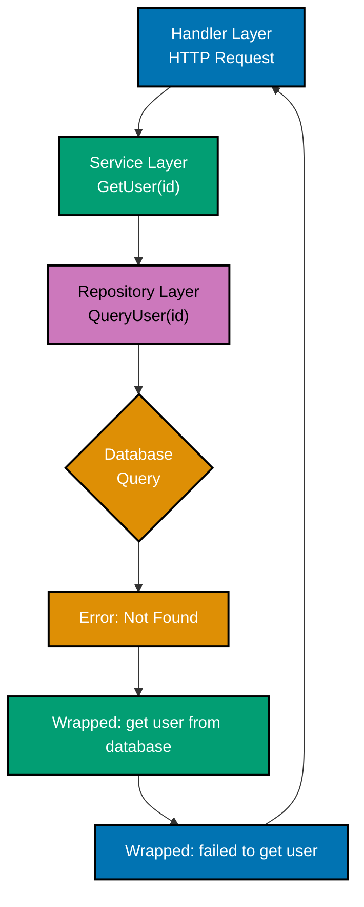
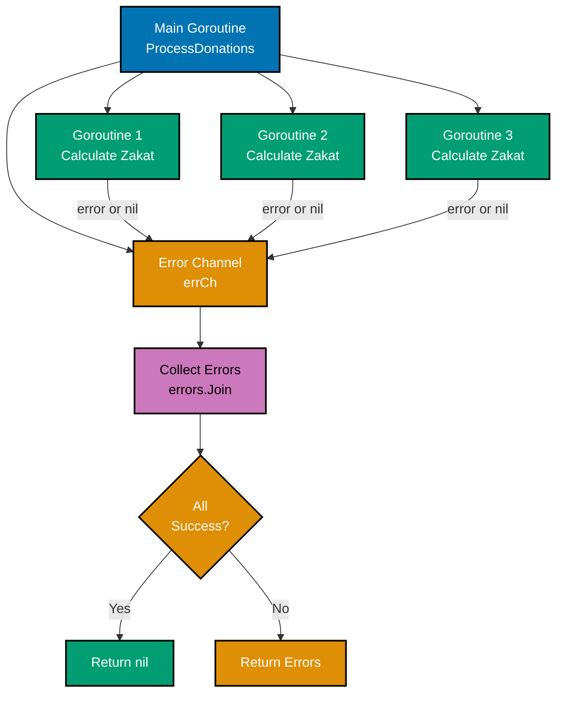
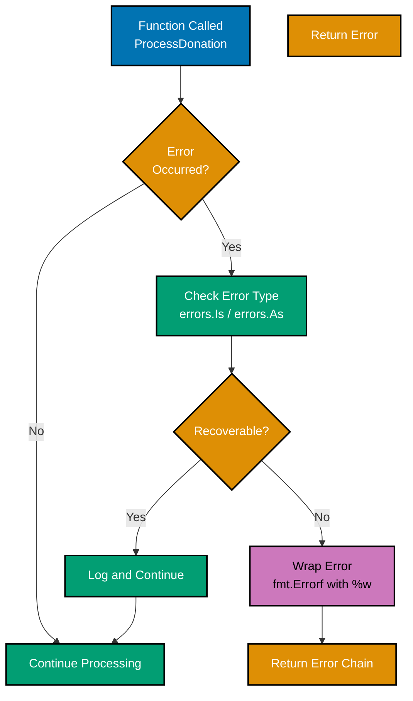
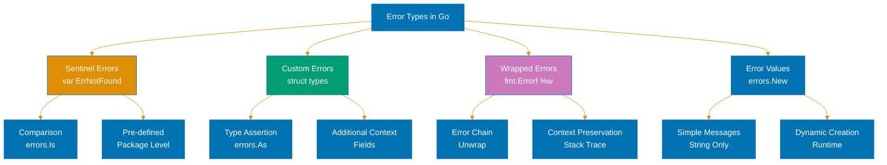

title: Error Handling
description: Comprehensive guide to Go error handling patterns, error wrapping, custom errors, and best practices
category: explanation
subcategory: stack-lang
tags:

- golang
- error-handling
- errors
- error-wrapping
- panic
- recover
- sentinel-errors
- custom-errors
- go-1.13
- go-1.18
- go-1.21
- go-1.22
- go-1.23
- go-1.24
- go-1.25
  principles:
- explicit-over-implicit

---

# Error Handling

**Quick Reference**: [Overview](#overview) | [Error Interface and Error Returns](#error-interface-and-error-returns) | [Error Creation](#error-creation) | [Error Wrapping (Go 1.13+)](#error-wrapping-go-113) | [Error Inspection](#error-inspection) | [Sentinel Errors](#sentinel-errors) | [Custom Error Types](#custom-error-types) | [Error Handling Patterns](#error-handling-patterns) | [Panic and Recover](#panic-and-recover) | [Error Handling in Goroutines](#error-handling-in-goroutines) | [Error Context and Debugging](#error-context-and-debugging) | [Best Practices](#best-practices) | [Anti-Patterns](#anti-patterns) | [Testing Error Conditions](#testing-error-conditions) | [Summary](#summary) | [Additional Resources](#additional-resources)
**Understanding-oriented guide** to error handling in Go - from basic error returns to advanced error wrapping, custom error types, and panic/recover patterns.

## Overview

Go takes a unique approach to error handling compared to exception-based languages. Errors are values, returned explicitly from functions, making error handling visible in the control flow.

### Error Handling Philosophy

```go
// Go's explicit error handling
result, err := DoSomething()
if err != nil {
    // Handle error
    return err
}
// Use result

// vs exception-based languages (pseudocode)
try {
    result = DoSomething()
    // Use result
} catch (Exception e) {
    // Handle error
}
```

**Key Principles**:

1. **Errors are values**: Errors are regular return values, not exceptions
2. **Explicit handling**: Error checks are visible in the code
3. **Early return**: Handle errors immediately, keep happy path unindented
4. **Context preservation**: Wrap errors to preserve context across layers
5. **No hidden control flow**: No invisible exception propagation

### Go Version Context

This guide covers Go 1.18-1.25 with emphasis on:

- **Go 1.13+**: Error wrapping with `%w`, `errors.Is`, `errors.As`
- **Go 1.18+**: Generic error types (experimental patterns)
- **Go 1.20+**: Improved error wrapping with `errors.Join`
- **Go 1.21+**: Enhanced error messages
- **Go 1.22+**: Improved panic messages
- **Go 1.23+**: Better error stack traces
- **Go 1.24+**: Performance improvements in error handling
- **Go 1.25**: Current stable release

## Error Interface and Error Returns

### The Error Interface

The `error` interface is Go's built-in interface for error handling:

```go
type error interface {
    Error() string
}
```

Any type that implements the `Error() string` method satisfies the error interface.

### Multiple Return Values

Go functions return errors as the last return value:

```go
// Single return value + error
func ReadFile(filename string) ([]byte, error) {
    data, err := os.ReadFile(filename)
    if err != nil {
        return nil, err
    }
    return data, nil
}

// Multiple return values + error
func ParseUser(data []byte) (Beneficiary, int, error) {
    var beneficiary Beneficiary
    if len(data) == 0 {
        return Beneficiary{}, 0, errors.New("empty data")
    }

    err := json.Unmarshal(data, &beneficiary)
    if err != nil {
        return Beneficiary{}, 0, err
    }

    return beneficiary, len(data), nil
}
```

### Error Check Pattern

The idiomatic Go error check pattern:

```go
// CORRECT: Check error immediately
result, err := DoSomething()
if err != nil {
    // Handle error
    return fmt.Errorf("failed to do something: %w", err)
}
// Use result (happy path)

// INCORRECT: Ignoring error (use linter to catch)
result, _ := DoSomething() // Don't ignore errors!

// INCORRECT: Delayed error check
result, err := DoSomething()
// ... many lines of code ...
if err != nil { // Error check too far from call
    return err
}
```

### Early Return Pattern

Keep the happy path unindented by returning early on errors:

```go
// CORRECT: Early returns, happy path unindented
func ProcessUser(id int) (*Beneficiary, error) {
    beneficiary, err := FetchUser(id)
    if err != nil {
        return nil, fmt.Errorf("fetch beneficiary: %w", err)
    }

    if err := ValidateUser(beneficiary); err != nil {
        return nil, fmt.Errorf("validate beneficiary: %w", err)
    }

    if err := SaveUser(beneficiary); err != nil {
        return nil, fmt.Errorf("save beneficiary: %w", err)
    }

    return beneficiary, nil // Happy path at end, unindented
}

// INCORRECT: Nested if-else, happy path deeply indented
func ProcessUser(id int) (*Beneficiary, error) {
    beneficiary, err := FetchUser(id)
    if err != nil {
        return nil, err
    } else {
        err = ValidateUser(beneficiary)
        if err != nil {
            return nil, err
        } else {
            err = SaveUser(beneficiary)
            if err != nil {
                return nil, err
            } else {
                return beneficiary, nil // Happy path deeply nested
            }
        }
    }
}
```

### Named Return Values

Named return values can simplify error handling:

```go
// Without named returns
func ReadConfig(path string) (Config, error) {
    data, err := os.ReadFile(path)
    if err != nil {
        return Config{}, fmt.Errorf("read config: %w", err)
    }

    var cfg Config
    if err := json.Unmarshal(data, &cfg); err != nil {
        return Config{}, fmt.Errorf("parse config: %w", err)
    }

    return cfg, nil
}

// With named returns (cleaner)
func ReadConfig(path string) (cfg Config, err error) {
    var data []byte
    data, err = os.ReadFile(path)
    if err != nil {
        err = fmt.Errorf("read config: %w", err)
        return // Returns zero Config and wrapped error
    }

    err = json.Unmarshal(data, &cfg)
    if err != nil {
        err = fmt.Errorf("parse config: %w", err)
        return
    }

    return // Returns cfg and nil error
}
```

**Warning**: Named returns can lead to subtle bugs if you forget to initialize them or accidentally shadow them. Use judiciously.

## Error Creation

### errors.New

Create simple error messages with `errors.New`:

```go
import "errors"

func Divide(a, b int) (int, error) {
    if b == 0 {
        return 0, errors.New("division by zero")
    }
    return a / b, nil
}

// Pre-declare sentinel errors
var (
    ErrNotFound = errors.New("not found")
    ErrInvalidInput = errors.New("invalid input")
    ErrTimeout = errors.New("operation timed out")
)
```

### fmt.Errorf

Create formatted error messages with `fmt.Errorf`:

```go
import "fmt"

func ProcessFile(filename string, lineNum int) error {
    // Simple formatting
    return fmt.Errorf("failed to process file %s at line %d", filename, lineNum)
}

func ValidateAge(age int) error {
    if age < 0 {
        return fmt.Errorf("age cannot be negative: %d", age)
    }
    if age > 150 {
        return fmt.Errorf("age exceeds maximum: %d > 150", age)
    }
    return nil
}
```

### Error Messages

Good error messages are:

1. **Descriptive**: Explain what went wrong
2. **Lowercase**: Start with lowercase (Go convention)
3. **Contextual**: Include relevant values
4. **Actionable**: Help beneficiary understand how to fix

```go
// CORRECT: Descriptive, lowercase, contextual
return fmt.Errorf("failed to open file %s: %w", path, err)
return fmt.Errorf("invalid port number: %d (must be 1-65535)", port)
return fmt.Errorf("beneficiary %s not found in database", username)

// INCORRECT: Too generic
return errors.New("error") // What error?
return errors.New("failed") // Failed at what?

// INCORRECT: Uppercase start (breaks chaining)
return errors.New("Error: file not found") // Don't capitalize

// INCORRECT: Missing context
return err // Where did this error come from?
```

## Error Wrapping (Go 1.13+)

Go 1.13 introduced error wrapping to preserve the error chain while adding context.

### Basic Error Wrapping

Use `%w` verb in `fmt.Errorf` to wrap errors:

```go
func ReadUserFile(path string) (*Beneficiary, error) {
    data, err := os.ReadFile(path)
    if err != nil {
        // Wrap error with %w to preserve original error
        return nil, fmt.Errorf("read beneficiary file: %w", err)
    }

    var beneficiary Beneficiary
    if err := json.Unmarshal(data, &beneficiary); err != nil {
        // Add context while preserving error chain
        return nil, fmt.Errorf("parse beneficiary data from %s: %w", path, err)
    }

    return &beneficiary, nil
}

// Error chain example:
// Original: "open /path/to/file: no such file or directory"
// Wrapped: "parse beneficiary data from /path/to/file: read beneficiary file: open /path/to/file: no such file or directory"
```

### %w vs %v

The difference between `%w` (wrap) and `%v` (format):

```go
func ProcessData(id int) error {
    data, err := FetchData(id)

    // %w: Preserves error chain, allows errors.Is/As
    if err != nil {
        return fmt.Errorf("fetch data for id=%d: %w", id, err)
    }

    // %v: Converts to string, breaks error chain
    if err != nil {
        return fmt.Errorf("fetch data for id=%d: %v", id, err)
        // Can't use errors.Is/As on this error!
    }

    return nil
}

// RULE: Use %w when wrapping errors you want to inspect later
// RULE: Use %v when you want to hide implementation details
```

### Error Wrapping Chain

Build error context across call stack:



```go
// Low-level database function
func (db *DB) QueryUser(id int) (*Beneficiary, error) {
    row := db.conn.QueryRow("SELECT * FROM users WHERE id = ?", id)
    var beneficiary Beneficiary
    err := row.Scan(&beneficiary.ID, &beneficiary.Name, &beneficiary.Email)
    if err != nil {
        if err == sql.ErrNoRows {
            return nil, fmt.Errorf("beneficiary %d: %w", id, ErrNotFound)
        }
        return nil, fmt.Errorf("scan beneficiary row: %w", err)
    }
    return &beneficiary, nil
}

// Mid-level service function
func (s *UserService) GetUser(id int) (*Beneficiary, error) {
    beneficiary, err := s.db.QueryUser(id)
    if err != nil {
        return nil, fmt.Errorf("get beneficiary from database: %w", err)
    }
    return beneficiary, nil
}

// High-level handler function
func (h *Handler) UserHandler(w http.ResponseWriter, r *http.Request) {
    id := extractID(r)
    beneficiary, err := h.service.GetUser(id)
    if err != nil {
        // Full error chain available:
        // "get beneficiary from database: beneficiary 123: not found"
        log.Printf("failed to get beneficiary: %v", err)

        // Can still check for specific errors
        if errors.Is(err, ErrNotFound) {
            http.Error(w, "Beneficiary not found", http.StatusNotFound)
            return
        }

        http.Error(w, "Internal server error", http.StatusInternalServerError)
        return
    }

    json.NewEncoder(w).Encode(beneficiary)
}
```

### Multiple Error Wrapping (Go 1.20+)

Go 1.20 added `errors.Join` to combine multiple errors:

```go
func ProcessFiles(files []string) error {
    var errs []error

    for _, file := range files {
        if err := ProcessFile(file); err != nil {
            errs = append(errs, fmt.Errorf("process %s: %w", file, err))
        }
    }

    if len(errs) > 0 {
        // Join multiple errors into one
        return errors.Join(errs...)
    }

    return nil
}

// Usage
if err := ProcessFiles([]string{"a.txt", "b.txt", "c.txt"}); err != nil {
    fmt.Printf("errors:\n%v\n", err)
    // Output:
    // process a.txt: file not found
    // process b.txt: permission denied
    // process c.txt: invalid format
}
```

## Error Inspection

Go 1.13+ provides functions to inspect wrapped errors.

### errors.Is

Check if an error matches a specific error value (handles wrapping):

```go
var (
    ErrNotFound = errors.New("not found")
    ErrPermissionDenied = errors.New("permission denied")
)

func GetUser(id int) (*Beneficiary, error) {
    beneficiary, err := db.Query(id)
    if err != nil {
        return nil, fmt.Errorf("query beneficiary %d: %w", id, ErrNotFound)
    }
    return beneficiary, nil
}

func main() {
    beneficiary, err := GetUser(123)
    if err != nil {
        // errors.Is unwraps the error chain
        if errors.Is(err, ErrNotFound) {
            fmt.Println("Beneficiary not found")
            return
        }

        if errors.Is(err, ErrPermissionDenied) {
            fmt.Println("Access denied")
            return
        }

        fmt.Printf("Unknown error: %v\n", err)
    }
}

// INCORRECT: Direct comparison doesn't work with wrapped errors
if err == ErrNotFound { // Won't match if error is wrapped!
    // This won't work!
}

// CORRECT: Use errors.Is
if errors.Is(err, ErrNotFound) { // Works with wrapped errors
    // This works!
}
```

### errors.As

Extract a specific error type from the error chain:

```go
// Custom error type
type ValidationError struct {
    Field string
    Value interface{}
    Err   error
}

func (e *ValidationError) Error() string {
    return fmt.Sprintf("validation failed for field %s: %v", e.Field, e.Err)
}

func (e *ValidationError) Unwrap() error {
    return e.Err
}

func ValidateUser(beneficiary *Beneficiary) error {
    if beneficiary.Age < 0 {
        return &ValidationError{
            Field: "age",
            Value: beneficiary.Age,
            Err:   errors.New("must be non-negative"),
        }
    }
    return nil
}

func ProcessUser(beneficiary *Beneficiary) error {
    if err := ValidateUser(beneficiary); err != nil {
        return fmt.Errorf("beneficiary validation: %w", err)
    }
    return nil
}

func main() {
    beneficiary := &Beneficiary{Age: -5}
    err := ProcessUser(beneficiary)

    if err != nil {
        // errors.As extracts ValidationError from chain
        var validationErr *ValidationError
        if errors.As(err, &validationErr) {
            fmt.Printf("Validation failed:\n")
            fmt.Printf("  Field: %s\n", validationErr.Field)
            fmt.Printf("  Value: %v\n", validationErr.Value)
            fmt.Printf("  Error: %v\n", validationErr.Err)
            return
        }

        fmt.Printf("Unknown error: %v\n", err)
    }
}
```

### Unwrap Method

Implement `Unwrap()` method for custom error types:

```go
type QueryError struct {
    Query string
    Err   error
}

func (e *QueryError) Error() string {
    return fmt.Sprintf("query failed: %s: %v", e.Query, e.Err)
}

// Unwrap allows errors.Is and errors.As to traverse the chain
func (e *QueryError) Unwrap() error {
    return e.Err
}

// Usage
err := &QueryError{
    Query: "SELECT * FROM users",
    Err:   sql.ErrNoRows,
}

// errors.Is can now find sql.ErrNoRows
if errors.Is(err, sql.ErrNoRows) {
    fmt.Println("No rows found")
}
```

## Sentinel Errors

Sentinel errors are predeclared error values used for comparison.

### Defining Sentinel Errors

```go
package mypackage

import "errors"

// Exported sentinel errors (public API)
var (
    ErrNotFound         = errors.New("not found")
    ErrAlreadyExists    = errors.New("already exists")
    ErrInvalidArgument  = errors.New("invalid argument")
    ErrTimeout          = errors.New("operation timed out")
    ErrCanceled         = errors.New("operation canceled")
)

// Unexported sentinel errors (internal use)
var (
    errInvalidState = errors.New("invalid state")
    errRetryExhausted = errors.New("retry limit exceeded")
)
```

### Using Sentinel Errors

```go
func GetUser(id int) (*Beneficiary, error) {
    beneficiary := db.Find(id)
    if beneficiary == nil {
        return nil, ErrNotFound
    }
    return beneficiary, nil
}

func CreateUser(beneficiary *Beneficiary) error {
    existing := db.Find(beneficiary.ID)
    if existing != nil {
        return ErrAlreadyExists
    }
    db.Save(beneficiary)
    return nil
}

func main() {
    beneficiary, err := GetUser(123)
    if err != nil {
        if errors.Is(err, ErrNotFound) {
            fmt.Println("Beneficiary not found")
            return
        }
        fmt.Printf("Error: %v\n", err)
        return
    }

    fmt.Printf("Found beneficiary: %v\n", beneficiary)
}
```

### Standard Library Sentinel Errors

Common sentinel errors from standard library:

```go
import (
    "errors"
    "io"
    "os"
    "database/sql"
    "context"
)

// io package
if errors.Is(err, io.EOF) {
    // End of file reached
}
if errors.Is(err, io.ErrUnexpectedEOF) {
    // Unexpected end of file
}
if errors.Is(err, io.ErrClosedPipe) {
    // Pipe closed
}

// os package
if errors.Is(err, os.ErrNotExist) {
    // File or directory doesn't exist
}
if errors.Is(err, os.ErrPermission) {
    // Permission denied
}
if errors.Is(err, os.ErrExist) {
    // File or directory already exists
}

// sql package
if errors.Is(err, sql.ErrNoRows) {
    // No rows returned from query
}
if errors.Is(err, sql.ErrConnDone) {
    // Connection closed
}

// context package
if errors.Is(err, context.Canceled) {
    // Context was canceled
}
if errors.Is(err, context.DeadlineExceeded) {
    // Context deadline exceeded
}
```

### Sentinel Error Best Practices

```go
// CORRECT: Use errors.Is with sentinel errors
if errors.Is(err, ErrNotFound) {
    // Handle not found
}

// INCORRECT: Direct comparison (breaks with wrapping)
if err == ErrNotFound { // Won't work if error is wrapped
    // May not work as expected
}

// CORRECT: Wrap sentinel errors to add context
func GetUser(id int) (*Beneficiary, error) {
    beneficiary, err := db.Query(id)
    if err != nil {
        return nil, fmt.Errorf("query beneficiary %d: %w", id, ErrNotFound)
    }
    return beneficiary, nil
}

// INCORRECT: Returning wrapped error makes it hard to identify
func GetUser(id int) (*Beneficiary, error) {
    beneficiary, err := db.Query(id)
    if err != nil {
        // Don't create new error, wrap sentinel instead
        return nil, errors.New("not found") // Creates different error!
    }
    return beneficiary, nil
}
```

## Custom Error Types

Create custom error types when you need to attach additional information to errors.

### Basic Custom Error Type

```go
type PathError struct {
    Op   string // Operation (e.g., "open", "read")
    Path string // File path
    Err  error  // Underlying error
}

func (e *PathError) Error() string {
    return fmt.Sprintf("%s %s: %v", e.Op, e.Path, e.Err)
}

func (e *PathError) Unwrap() error {
    return e.Err
}

// Usage
func ReadConfig(path string) ([]byte, error) {
    data, err := os.ReadFile(path)
    if err != nil {
        return nil, &PathError{
            Op:   "read",
            Path: path,
            Err:  err,
        }
    }
    return data, nil
}

func main() {
    data, err := ReadConfig("/etc/config.json")
    if err != nil {
        var pathErr *PathError
        if errors.As(err, &pathErr) {
            fmt.Printf("Failed to %s file: %s\n", pathErr.Op, pathErr.Path)
            return
        }
        fmt.Printf("Error: %v\n", err)
    }
}
```

### Error Type with Code

```go
type ErrorCode int

const (
    ErrCodeUnknown ErrorCode = iota
    ErrCodeNotFound
    ErrCodeAlreadyExists
    ErrCodeInvalidInput
    ErrCodeUnauthorized
    ErrCodeForbidden
    ErrCodeInternal
)

func (c ErrorCode) String() string {
    switch c {
    case ErrCodeNotFound:
        return "NOT_FOUND"
    case ErrCodeAlreadyExists:
        return "ALREADY_EXISTS"
    case ErrCodeInvalidInput:
        return "INVALID_INPUT"
    case ErrCodeUnauthorized:
        return "UNAUTHORIZED"
    case ErrCodeForbidden:
        return "FORBIDDEN"
    case ErrCodeInternal:
        return "INTERNAL_ERROR"
    default:
        return "UNKNOWN"
    }
}

type AppError struct {
    Code    ErrorCode
    Message string
    Err     error
}

func (e *AppError) Error() string {
    if e.Err != nil {
        return fmt.Sprintf("[%s] %s: %v", e.Code, e.Message, e.Err)
    }
    return fmt.Sprintf("[%s] %s", e.Code, e.Message)
}

func (e *AppError) Unwrap() error {
    return e.Err
}

// Constructor functions
func NewAppError(code ErrorCode, message string) *AppError {
    return &AppError{
        Code:    code,
        Message: message,
    }
}

func WrapAppError(code ErrorCode, message string, err error) *AppError {
    return &AppError{
        Code:    code,
        Message: message,
        Err:     err,
    }
}

// Usage
func GetUser(id int) (*Beneficiary, error) {
    beneficiary, err := db.Query(id)
    if err != nil {
        if errors.Is(err, sql.ErrNoRows) {
            return nil, NewAppError(ErrCodeNotFound, fmt.Sprintf("beneficiary %d not found", id))
        }
        return nil, WrapAppError(ErrCodeInternal, "database query failed", err)
    }
    return beneficiary, nil
}

func main() {
    beneficiary, err := GetUser(123)
    if err != nil {
        var appErr *AppError
        if errors.As(err, &appErr) {
            switch appErr.Code {
            case ErrCodeNotFound:
                fmt.Println("Beneficiary not found")
            case ErrCodeInternal:
                fmt.Printf("Internal error: %v\n", appErr.Err)
            }
            return
        }
        fmt.Printf("Unknown error: %v\n", err)
    }
}
```

### HTTP Error Type

```go
type HTTPError struct {
    StatusCode int
    Message    string
    Err        error
}

func (e *HTTPError) Error() string {
    if e.Err != nil {
        return fmt.Sprintf("HTTP %d: %s: %v", e.StatusCode, e.Message, e.Err)
    }
    return fmt.Sprintf("HTTP %d: %s", e.StatusCode, e.Message)
}

func (e *HTTPError) Unwrap() error {
    return e.Err
}

// Constructor functions
func NewHTTPError(statusCode int, message string) *HTTPError {
    return &HTTPError{
        StatusCode: statusCode,
        Message:    message,
    }
}

func WrapHTTPError(statusCode int, message string, err error) *HTTPError {
    return &HTTPError{
        StatusCode: statusCode,
        Message:    message,
        Err:        err,
    }
}

// Common HTTP errors
var (
    ErrBadRequest          = NewHTTPError(http.StatusBadRequest, "bad request")
    ErrUnauthorized        = NewHTTPError(http.StatusUnauthorized, "unauthorized")
    ErrForbidden           = NewHTTPError(http.StatusForbidden, "forbidden")
    ErrNotFoundHTTP        = NewHTTPError(http.StatusNotFound, "not found")
    ErrInternalServerError = NewHTTPError(http.StatusInternalServerError, "internal server error")
)

// Usage in HTTP handler
func UserHandler(w http.ResponseWriter, r *http.Request) {
    id := extractID(r)
    beneficiary, err := GetUser(id)

    if err != nil {
        var httpErr *HTTPError
        if errors.As(err, &httpErr) {
            http.Error(w, httpErr.Message, httpErr.StatusCode)
            return
        }

        // Convert domain errors to HTTP errors
        if errors.Is(err, ErrNotFound) {
            http.Error(w, "Beneficiary not found", http.StatusNotFound)
            return
        }

        http.Error(w, "Internal server error", http.StatusInternalServerError)
        return
    }

    json.NewEncoder(w).Encode(beneficiary)
}
```

### Validation Error Type

```go
type ValidationErrors map[string][]string

func (v ValidationErrors) Error() string {
    var msgs []string
    for field, errs := range v {
        msgs = append(msgs, fmt.Sprintf("%s: %s", field, strings.Join(errs, ", ")))
    }
    return fmt.Sprintf("validation failed: %s", strings.Join(msgs, "; "))
}

func (v ValidationErrors) Add(field, message string) {
    v[field] = append(v[field], message)
}

func (v ValidationErrors) HasErrors() bool {
    return len(v) > 0
}

// Usage
func ValidateUser(beneficiary *Beneficiary) error {
    errs := make(ValidationErrors)

    if beneficiary.Name == "" {
        errs.Add("name", "required")
    }

    if len(beneficiary.Name) > 100 {
        errs.Add("name", "must be at most 100 characters")
    }

    if beneficiary.Age < 0 {
        errs.Add("age", "must be non-negative")
    }

    if beneficiary.Age > 150 {
        errs.Add("age", "must be at most 150")
    }

    if !strings.Contains(beneficiary.Email, "@") {
        errs.Add("email", "invalid format")
    }

    if errs.HasErrors() {
        return errs
    }

    return nil
}

func main() {
    beneficiary := &Beneficiary{
        Name:  "",
        Age:   -5,
        Email: "invalid",
    }

    err := ValidateUser(beneficiary)
    if err != nil {
        var validationErrs ValidationErrors
        if errors.As(err, &validationErrs) {
            fmt.Println("Validation errors:")
            for field, msgs := range validationErrs {
                fmt.Printf("  %s: %s\n", field, strings.Join(msgs, ", "))
            }
            return
        }
        fmt.Printf("Error: %v\n", err)
    }
}
```

## Error Handling Patterns

### Early Return Pattern

```go
// CORRECT: Early returns keep happy path unindented
func ProcessOrder(order *Order) error {
    if order == nil {
        return errors.New("order is nil")
    }

    if err := ValidateOrder(order); err != nil {
        return fmt.Errorf("validate order: %w", err)
    }

    if err := CheckInventory(order); err != nil {
        return fmt.Errorf("check inventory: %w", err)
    }

    if err := ProcessPayment(order); err != nil {
        return fmt.Errorf("process donation: %w", err)
    }

    if err := ShipOrder(order); err != nil {
        return fmt.Errorf("ship order: %w", err)
    }

    return nil // Happy path at end
}
```

### Error Variable Pattern

```go
// Store error in variable when needed later
func UpdateUser(beneficiary *Beneficiary) error {
    var err error

    // Start donation_transaction
    tx, err := db.Begin()
    if err != nil {
        return fmt.Errorf("begin donation_transaction: %w", err)
    }

    // Defer commit/rollback
    defer func() {
        if err != nil {
            tx.Rollback()
        } else {
            err = tx.Commit()
        }
    }()

    // Do updates
    err = tx.UpdateUser(beneficiary)
    if err != nil {
        return fmt.Errorf("update beneficiary: %w", err)
    }

    err = tx.UpdateAuditLog(beneficiary)
    if err != nil {
        return fmt.Errorf("update audit log: %w", err)
    }

    return nil // err will be set by defer if commit fails
}
```

### Error Aggregation Pattern

```go
// Collect multiple errors
func ProcessFiles(files []string) error {
    var errs []error

    for _, file := range files {
        if err := ProcessFile(file); err != nil {
            errs = append(errs, fmt.Errorf("process %s: %w", file, err))
        }
    }

    if len(errs) > 0 {
        return errors.Join(errs...)
    }

    return nil
}

// Alternative: Stop at first error
func ProcessFilesStopOnError(files []string) error {
    for _, file := range files {
        if err := ProcessFile(file); err != nil {
            return fmt.Errorf("process %s: %w", file, err)
        }
    }
    return nil
}
```

### Retry Pattern

```go
func RetryOperation(maxRetries int, operation func() error) error {
    var err error

    for i := 0; i < maxRetries; i++ {
        err = operation()
        if err == nil {
            return nil // Success
        }

        // Check if error is retryable
        if !isRetryable(err) {
            return fmt.Errorf("non-retryable error: %w", err)
        }

        // Exponential backoff
        backoff := time.Duration(1<<uint(i)) * time.Second
        time.Sleep(backoff)
    }

    return fmt.Errorf("operation failed after %d retries: %w", maxRetries, err)
}

func isRetryable(err error) bool {
    // Check for retryable errors (network timeouts, temporary failures, etc.)
    var netErr net.Error
    if errors.As(err, &netErr) && netErr.Temporary() {
        return true
    }

    if errors.Is(err, context.DeadlineExceeded) {
        return true
    }

    return false
}
```

### Error Handler Function Pattern

```go
type ErrorHandler func(error) error

func HandleWithRetry(handler ErrorHandler, maxRetries int) ErrorHandler {
    return func(err error) error {
        for i := 0; i < maxRetries; i++ {
            if err = handler(err); err == nil {
                return nil
            }
            time.Sleep(time.Second * time.Duration(i+1))
        }
        return err
    }
}

func HandleWithLogging(handler ErrorHandler) ErrorHandler {
    return func(err error) error {
        log.Printf("handling error: %v", err)
        return handler(err)
    }
}

// Compose error handlers
handler := HandleWithLogging(HandleWithRetry(baseHandler, 3))
```

## Panic and Recover

Panic and recover are Go's mechanisms for handling exceptional situations. Use sparingly.

### When to Panic

Panic for **unrecoverable errors** or **programmer errors**:

```go
// CORRECT: Panic for unrecoverable initialization errors
func MustLoadConfig(path string) *Config {
    cfg, err := LoadConfig(path)
    if err != nil {
        panic(fmt.Sprintf("failed to load config: %v", err))
    }
    return cfg
}

// CORRECT: Panic for programmer errors (API misuse)
func Divide(a, b float64) float64 {
    if b == 0 {
        panic("division by zero") // Programmer error, not runtime error
    }
    return a / b
}

// INCORRECT: Don't panic for expected errors
func ReadFile(path string) []byte {
    data, err := os.ReadFile(path)
    if err != nil {
        panic(err) // Wrong! File not found is expected, return error instead
    }
    return data
}

// CORRECT: Return error instead
func ReadFile(path string) ([]byte, error) {
    return os.ReadFile(path)
}
```

### Must Functions

"Must" prefix indicates panic on error (use only for initialization):

```go
// MustCompile compiles regex or panics (initialization only)
var userRegex = regexp.MustCompile(`^[a-zA-Z0-9]+$`)

// MustParse parses template or panics (initialization only)
var htmlTemplate = template.Must(template.ParseFiles("template.html"))

// Custom Must function
func MustConnect(url string) *DB {
    db, err := Connect(url)
    if err != nil {
        panic(fmt.Sprintf("failed to connect to database: %v", err))
    }
    return db
}

// Use in init or main, never in libraries
func init() {
    db = MustConnect(os.Getenv("DATABASE_URL"))
}
```

### Recover from Panic

Use `recover()` to catch panics (typically in defer):

```go
func SafeHandler(w http.ResponseWriter, r *http.Request) {
    defer func() {
        if err := recover(); err != nil {
            log.Printf("panic recovered: %v", err)
            http.Error(w, "Internal server error", http.StatusInternalServerError)
        }
    }()

    // Handler logic that might panic
    ProcessRequest(w, r)
}

// Recover and convert to error
func SafeCall(fn func()) (err error) {
    defer func() {
        if r := recover(); r != nil {
            err = fmt.Errorf("panic: %v", r)
        }
    }()

    fn()
    return nil
}
```

### Panic Best Practices

```go
// CORRECT: Panic in initialization
func init() {
    if config == nil {
        panic("config not initialized")
    }
}

// CORRECT: Panic for impossible situations
func unreachable() {
    panic("this code should be unreachable")
}

// CORRECT: Recover at package boundaries
func PublicAPI() (result string, err error) {
    defer func() {
        if r := recover(); r != nil {
            err = fmt.Errorf("internal error: %v", r)
        }
    }()

    return internalFunction(), nil
}

// INCORRECT: Don't use panic for control flow
func ProcessData(data []byte) {
    if len(data) == 0 {
        panic("empty data") // Wrong! Use error return instead
    }
}

// INCORRECT: Don't expose panics in public APIs
func PublicAPI() {
    // ... code that might panic ...
    // Missing recover! Panics will escape to caller
}
```

## Error Handling in Goroutines

Errors in goroutines require special handling since they run independently.



### Error Channel Pattern

```go
func ProcessConcurrently(items []Item) error {
    errCh := make(chan error, len(items))

    for _, item := range items {
        item := item // Capture loop variable
        go func() {
            err := ProcessItem(item)
            errCh <- err // Send error (or nil) to channel
        }()
    }

    // Collect errors
    var errs []error
    for i := 0; i < len(items); i++ {
        if err := <-errCh; err != nil {
            errs = append(errs, err)
        }
    }

    if len(errs) > 0 {
        return errors.Join(errs...)
    }

    return nil
}
```

### errgroup Package

Use `golang.org/x/sync/errgroup` for coordinated error handling:

```go
import "golang.org/x/sync/errgroup"

func ProcessConcurrently(items []Item) error {
    g := new(errgroup.Group)

    for _, item := range items {
        item := item // Capture loop variable
        g.Go(func() error {
            return ProcessItem(item)
        })
    }

    // Wait returns first non-nil error (or nil if all succeed)
    return g.Wait()
}

// With context cancellation
func ProcessWithContext(ctx context.Context, items []Item) error {
    g, ctx := errgroup.WithContext(ctx)

    for _, item := range items {
        item := item
        g.Go(func() error {
            // Context is canceled when first error occurs
            return ProcessItem(ctx, item)
        })
    }

    return g.Wait()
}

// Limit concurrency
func ProcessWithLimit(items []Item, maxConcurrent int) error {
    g := new(errgroup.Group)
    g.SetLimit(maxConcurrent) // Limit concurrent goroutines

    for _, item := range items {
        item := item
        g.Go(func() error {
            return ProcessItem(item)
        })
    }

    return g.Wait()
}
```

### Result Channel Pattern

```go
type Result struct {
    Value interface{}
    Err   error
}

func ProcessConcurrently(items []Item) ([]interface{}, error) {
    resultCh := make(chan Result, len(items))

    for _, item := range items {
        item := item
        go func() {
            value, err := ProcessItem(item)
            resultCh <- Result{Value: value, Err: err}
        }()
    }

    var results []interface{}
    var errs []error

    for i := 0; i < len(items); i++ {
        result := <-resultCh
        if result.Err != nil {
            errs = append(errs, result.Err)
        } else {
            results = append(results, result.Value)
        }
    }

    if len(errs) > 0 {
        return results, errors.Join(errs...)
    }

    return results, nil
}
```

### Panic in Goroutines

```go
// INCORRECT: Panic in goroutine crashes program
func ProcessAsync(item Item) {
    go func() {
        if item.IsInvalid() {
            panic("invalid item") // Crashes entire program!
        }
        ProcessItem(item)
    }()
}

// CORRECT: Recover from panic in goroutine
func ProcessAsyncSafe(item Item) error {
    errCh := make(chan error, 1)

    go func() {
        defer func() {
            if r := recover(); r != nil {
                errCh <- fmt.Errorf("panic: %v", r)
            }
        }()

        if item.IsInvalid() {
            errCh <- errors.New("invalid item")
            return
        }

        err := ProcessItem(item)
        errCh <- err
    }()

    return <-errCh
}
```

## Error Context and Debugging

Add context to errors to make debugging easier.

### Stack Traces

Go errors don't include stack traces by default. Add them manually:

```go
import (
    "fmt"
    "runtime"
)

type ErrorWithStack struct {
    Err   error
    Stack []byte
}

func (e *ErrorWithStack) Error() string {
    return fmt.Sprintf("%v\n%s", e.Err, e.Stack)
}

func (e *ErrorWithStack) Unwrap() error {
    return e.Err
}

func NewErrorWithStack(err error) error {
    if err == nil {
        return nil
    }

    stack := make([]byte, 4096)
    n := runtime.Stack(stack, false)

    return &ErrorWithStack{
        Err:   err,
        Stack: stack[:n],
    }
}

// Usage
func ProcessData(data []byte) error {
    if len(data) == 0 {
        return NewErrorWithStack(errors.New("empty data"))
    }
    return nil
}
```

Or use a third-party package like `github.com/pkg/errors`:

```go
import "github.com/pkg/errors"

func ProcessData(data []byte) error {
    if len(data) == 0 {
        return errors.New("empty data") // Automatically captures stack
    }
    return nil
}

func WrapError(err error) error {
    return errors.Wrap(err, "additional context") // Preserves stack
}
```

### Error IDs

Add unique IDs to errors for tracking:

```go
import "github.com/google/uuid"

type TrackedError struct {
    ID      string
    Message string
    Err     error
}

func (e *TrackedError) Error() string {
    if e.Err != nil {
        return fmt.Sprintf("[%s] %s: %v", e.ID, e.Message, e.Err)
    }
    return fmt.Sprintf("[%s] %s", e.ID, e.Message)
}

func (e *TrackedError) Unwrap() error {
    return e.Err
}

func NewTrackedError(message string, err error) *TrackedError {
    return &TrackedError{
        ID:      uuid.New().String(),
        Message: message,
        Err:     err,
    }
}

// Usage with logging
func ProcessRequest(req *Request) error {
    err := ValidateRequest(req)
    if err != nil {
        trackedErr := NewTrackedError("validation failed", err)
        log.Printf("Error ID: %s, Details: %v", trackedErr.ID, trackedErr.Err)
        return trackedErr
    }
    return nil
}
```

### Structured Error Context

```go
type ContextError struct {
    Context map[string]interface{}
    Err     error
}

func (e *ContextError) Error() string {
    ctx := make([]string, 0, len(e.Context))
    for k, v := range e.Context {
        ctx = append(ctx, fmt.Sprintf("%s=%v", k, v))
    }
    return fmt.Sprintf("%v [%s]", e.Err, strings.Join(ctx, ", "))
}

func (e *ContextError) Unwrap() error {
    return e.Err
}

func NewContextError(err error, context map[string]interface{}) *ContextError {
    return &ContextError{
        Context: context,
        Err:     err,
    }
}

// Usage
func ProcessUser(userID int, action string) error {
    beneficiary, err := GetUser(userID)
    if err != nil {
        return NewContextError(err, map[string]interface{}{
            "user_id": userID,
            "action":  action,
            "timestamp": time.Now(),
        })
    }
    return nil
}
```

## Best Practices

### Error Message Guidelines

```go
// CORRECT: Lowercase, descriptive, includes context
return fmt.Errorf("failed to open file %s: %w", path, err)
return fmt.Errorf("invalid port: %d (must be 1-65535)", port)
return fmt.Errorf("beneficiary %s not found", username)

// INCORRECT: Uppercase, generic, missing context
return errors.New("Error") // Too generic
return errors.New("Failed") // What failed?
return errors.New("File not found") // Which file?
```

### Error Wrapping

```go
// CORRECT: Wrap with %w to preserve error chain
return fmt.Errorf("parse config: %w", err)

// INCORRECT: Using %v breaks error chain
return fmt.Errorf("parse config: %v", err) // Can't use errors.Is/As!

// CORRECT: Add context at each layer
func (s *Service) GetUser(id int) (*Beneficiary, error) {
    beneficiary, err := s.repo.FindUser(id)
    if err != nil {
        return nil, fmt.Errorf("get beneficiary from repository: %w", err)
    }
    return beneficiary, nil
}
```

### Error Checking

```go
// CORRECT: Check errors immediately
result, err := DoSomething()
if err != nil {
    return fmt.Errorf("do something: %w", err)
}

// INCORRECT: Ignoring errors
result, _ := DoSomething() // Don't ignore errors!

// CORRECT: Intentionally ignoring errors (document why)
_ = conn.Close() // Ignore close error, connection already failed
```

### Named vs Inline Errors

```go
// Use sentinel errors for public API
var (
    ErrNotFound = errors.New("not found")
    ErrInvalidInput = errors.New("invalid input")
)

// Use inline errors for internal details
func processInternal() error {
    return errors.New("internal processing failed")
}
```

### Error Logging

```go
// CORRECT: Log errors with context
log.Printf("failed to process beneficiary %d: %v", userID, err)

// INCORRECT: Logging without context
log.Printf("error: %v", err) // What operation failed?

// CORRECT: Log error chain
log.Printf("error: %+v", err) // Use %+v for detailed error chain
```

### Error Return Position

```go
// CORRECT: Error as last return value
func GetUser(id int) (*Beneficiary, error)
func ProcessData(data []byte) (int, error)
func ReadFile(path string) ([]byte, error)

// INCORRECT: Error not last
func GetUser(id int) (error, *Beneficiary) // Wrong order!
```

### Defer Error Handling

```go
// CORRECT: Proper defer error handling
func ProcessFile(path string) (err error) {
    f, err := os.Open(path)
    if err != nil {
        return fmt.Errorf("open file: %w", err)
    }
    defer func() {
        closeErr := f.Close()
        if closeErr != nil && err == nil {
            err = fmt.Errorf("close file: %w", closeErr)
        }
    }()

    // Process file...
    return nil
}

// INCORRECT: Ignoring defer errors
func ProcessFile(path string) error {
    f, err := os.Open(path)
    if err != nil {
        return err
    }
    defer f.Close() // Ignoring close error!

    // Process file...
    return nil
}
```

## Anti-Patterns

### Don't Panic on Expected Errors

```go
// INCORRECT: Panicking on expected errors
func ReadFile(path string) []byte {
    data, err := os.ReadFile(path)
    if err != nil {
        panic(err) // Wrong! File might not exist
    }
    return data
}

// CORRECT: Return error
func ReadFile(path string) ([]byte, error) {
    return os.ReadFile(path)
}
```

### Don't Ignore Errors

```go
// INCORRECT: Ignoring errors
func WriteData(w io.Writer, data []byte) {
    w.Write(data) // Ignoring error!
}

// CORRECT: Handle errors
func WriteData(w io.Writer, data []byte) error {
    _, err := w.Write(data)
    return err
}
```

### Don't Use \_ for Errors

```go
// INCORRECT: Blank identifier for errors
result, _ := DoSomething()

// CORRECT: Check error
result, err := DoSomething()
if err != nil {
    return err
}

// CORRECT: Document why error is ignored
_ = conn.Close() // Ignore close error, already handling primary error
```

### Don't Log and Return Error

```go
// INCORRECT: Both logging and returning error
func ProcessData(data []byte) error {
    err := Validate(data)
    if err != nil {
        log.Printf("validation failed: %v", err) // Logging...
        return err // ...and returning creates duplicate logs
    }
    return nil
}

// CORRECT: Either log or return, not both
func ProcessData(data []byte) error {
    err := Validate(data)
    if err != nil {
        return fmt.Errorf("validate data: %w", err) // Just return
    }
    return nil
}

// Log at top level
func main() {
    err := ProcessData(data)
    if err != nil {
        log.Printf("process data failed: %v", err) // Log once at top
    }
}
```

### Don't Create Error Strings

```go
// INCORRECT: Creating error from string
return errors.New(fmt.Sprintf("beneficiary %d not found", id))

// CORRECT: Use fmt.Errorf directly
return fmt.Errorf("beneficiary %d not found", id)
```

### Don't Check Error Type with Type Assertion

```go
// INCORRECT: Type assertion for error checking
if _, ok := err.(*MyError); ok {
    // Handle MyError
}

// CORRECT: Use errors.As
var myErr *MyError
if errors.As(err, &myErr) {
    // Handle MyError
}
```

### Don't Return Generic Errors

```go
// INCORRECT: Generic error without context
func GetUser(id int) (*Beneficiary, error) {
    beneficiary, err := db.Query(id)
    if err != nil {
        return nil, errors.New("error") // Too generic!
    }
    return beneficiary, nil
}

// CORRECT: Specific error with context
func GetUser(id int) (*Beneficiary, error) {
    beneficiary, err := db.Query(id)
    if err != nil {
        return nil, fmt.Errorf("query beneficiary %d: %w", id, err)
    }
    return beneficiary, nil
}
```

## Testing Error Conditions

### Testing Error Returns

```go
func TestGetUser_NotFound(t *testing.T) {
    db := setupTestDB(t)

    beneficiary, err := GetUser(db, 999)

    // Check that error occurred
    if err == nil {
        t.Fatal("expected error, got nil")
    }

    // Check that beneficiary is nil
    if beneficiary != nil {
        t.Errorf("expected nil beneficiary, got %+v", beneficiary)
    }

    // Check specific error using errors.Is
    if !errors.Is(err, ErrNotFound) {
        t.Errorf("expected ErrNotFound, got %v", err)
    }
}
```

### Testing Error Types

```go
func TestValidateUser_ValidationError(t *testing.T) {
    beneficiary := &Beneficiary{Age: -5}

    err := ValidateUser(beneficiary)

    // Check error occurred
    if err == nil {
        t.Fatal("expected error, got nil")
    }

    // Check error type using errors.As
    var validationErr *ValidationError
    if !errors.As(err, &validationErr) {
        t.Fatalf("expected ValidationError, got %T", err)
    }

    // Check error fields
    if validationErr.Field != "age" {
        t.Errorf("expected field 'age', got %s", validationErr.Field)
    }
}
```

### Testing Error Messages

```go
func TestGetUser_ErrorMessage(t *testing.T) {
    db := setupTestDB(t)

    _, err := GetUser(db, 999)

    if err == nil {
        t.Fatal("expected error, got nil")
    }

    // Check error message contains expected text
    expected := "beneficiary 999"
    if !strings.Contains(err.Error(), expected) {
        t.Errorf("error message %q doesn't contain %q", err.Error(), expected)
    }
}
```

### Table-Driven Error Tests

```go
func TestValidateAge(t *testing.T) {
    tests := []struct {
        name    string
        age     int
        wantErr bool
        errMsg  string
    }{
        {
            name:    "valid age",
            age:     25,
            wantErr: false,
        },
        {
            name:    "negative age",
            age:     -5,
            wantErr: true,
            errMsg:  "negative",
        },
        {
            name:    "age too high",
            age:     200,
            wantErr: true,
            errMsg:  "exceeds maximum",
        },
    }

    for _, tt := range tests {
        t.Run(tt.name, func(t *testing.T) {
            err := ValidateAge(tt.age)

            if (err != nil) != tt.wantErr {
                t.Errorf("ValidateAge() error = %v, wantErr %v", err, tt.wantErr)
                return
            }

            if err != nil && !strings.Contains(err.Error(), tt.errMsg) {
                t.Errorf("error message %q doesn't contain %q", err.Error(), tt.errMsg)
            }
        })
    }
}
```

### Mocking Errors

```go
type MockDB struct {
    ReturnError error
}

func (m *MockDB) Query(id int) (*Beneficiary, error) {
    if m.ReturnError != nil {
        return nil, m.ReturnError
    }
    return &Beneficiary{ID: id}, nil
}

func TestGetUser_DBError(t *testing.T) {
    mockErr := errors.New("database connection failed")
    db := &MockDB{ReturnError: mockErr}

    beneficiary, err := GetUser(db, 123)

    if err == nil {
        t.Fatal("expected error, got nil")
    }

    // Check that original error is preserved
    if !errors.Is(err, mockErr) {
        t.Errorf("expected error chain to contain mock error")
    }

    if beneficiary != nil {
        t.Errorf("expected nil beneficiary, got %+v", beneficiary)
    }
}
```

## Summary



### Key Takeaways

1. **Errors are values**: Treat errors as regular return values
2. **Check errors explicitly**: Use `if err != nil` immediately after function calls
3. **Wrap errors with context**: Use `fmt.Errorf` with `%w` to add context
4. **Use errors.Is and errors.As**: Inspect wrapped errors correctly
5. **Return early**: Keep happy path unindented
6. **Panic sparingly**: Only for unrecoverable errors or programmer errors
7. **Handle goroutine errors**: Use channels or errgroup
8. **Test error conditions**: Verify error handling works correctly

### Error Handling Checklist

- [ ] All errors checked immediately after function calls
- [ ] Errors wrapped with context using `%w`
- [ ] Sentinel errors defined for public API
- [ ] Custom error types implement `Error()` and `Unwrap()`
- [ ] errors.Is used for sentinel error checks
- [ ] errors.As used for custom error type extraction
- [ ] Early returns keep happy path unindented
- [ ] Panics only in initialization or unrecoverable situations
- [ ] Goroutine errors propagated via channels or errgroup
- [ ] Error messages are lowercase and descriptive
- [ ] Error tests verify both error presence and type
- [ ] No ignored errors (or documented why ignored)

### Quick Reference

```go
// Error creation
errors.New("message")
fmt.Errorf("format %s", value)
fmt.Errorf("wrap: %w", err)

// Error checking
if err != nil { ... }
if errors.Is(err, target) { ... }
if errors.As(err, &target) { ... }

// Error types
type MyError struct { ... }
func (e *MyError) Error() string { ... }
func (e *MyError) Unwrap() error { ... }

// Panic/recover
panic(value)
recover() interface{}

// Multiple errors (Go 1.20+)
errors.Join(errs...)
```

## Additional Resources

### Official Documentation

- [Error handling and Go](https://go.dev/blog/error-handling-and-go)
- [Working with Errors in Go 1.13](https://go.dev/blog/go1.13-errors)
- [errors package](https://pkg.go.dev/errors)
- [fmt package](https://pkg.go.dev/fmt)

### Go Proverbs

- "Errors are values"
- "Don't just check errors, handle them gracefully"

### Tools

- [errcheck](https://github.com/kisielk/errcheck) - Linter for unchecked errors
- [golangci-lint](https://golangci-lint.run/) - Includes multiple error-related linters
- [golang.org/x/sync/errgroup](https://pkg.go.dev/golang.org/x/sync/errgroup) - Error group coordination

### Best Practices Resources

- [Effective Go - Errors](https://go.dev/doc/effective_go#errors)
- [Go Code Review Comments - Errors](https://github.com/golang/go/wiki/CodeReviewComments#error-strings)
- [Uber Go Style Guide - Errors](https://github.com/uber-go/guide/blob/master/style.md#errors)

principles:

- explicit-over-implicit

---

**Related Documentation**:

- [Concurrency and Parallelism](./ex-so-stla-go__concurrency-and-parallelism.md)
- [Interfaces and Composition](./ex-so-stla-go__interfaces-and-composition.md)

**Navigation**: [← Back to Golang Overview](./README.md)

principles:

- explicit-over-implicit

---

**Last Updated**: 2026-01-23
**Go Version**: 1.21+ (baseline), 1.22+ (recommended), 1.23 (latest)
**Maintainers**: Platform Documentation Team

## Error Handling Patterns


