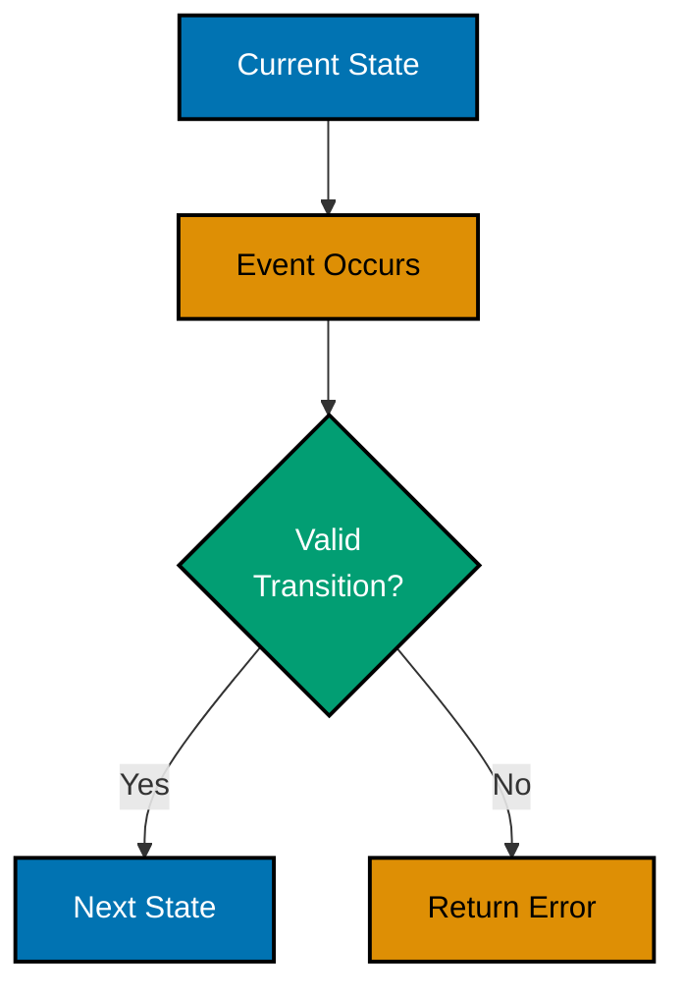
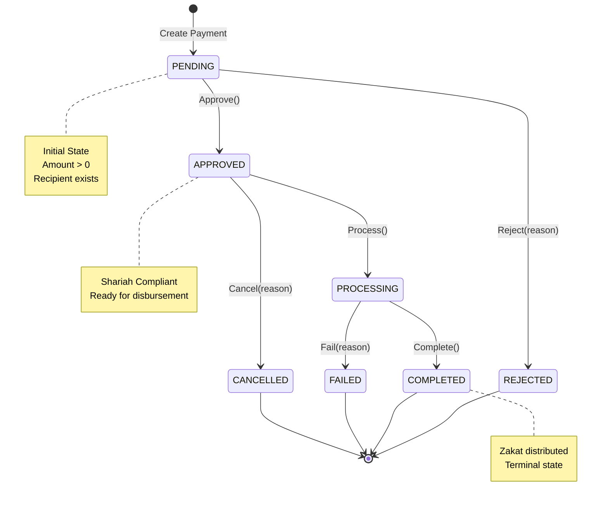
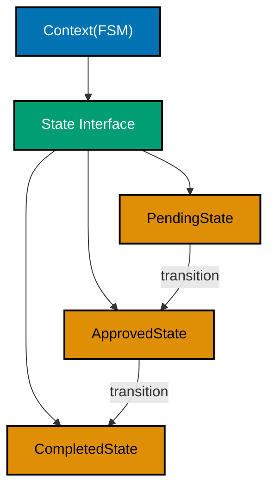
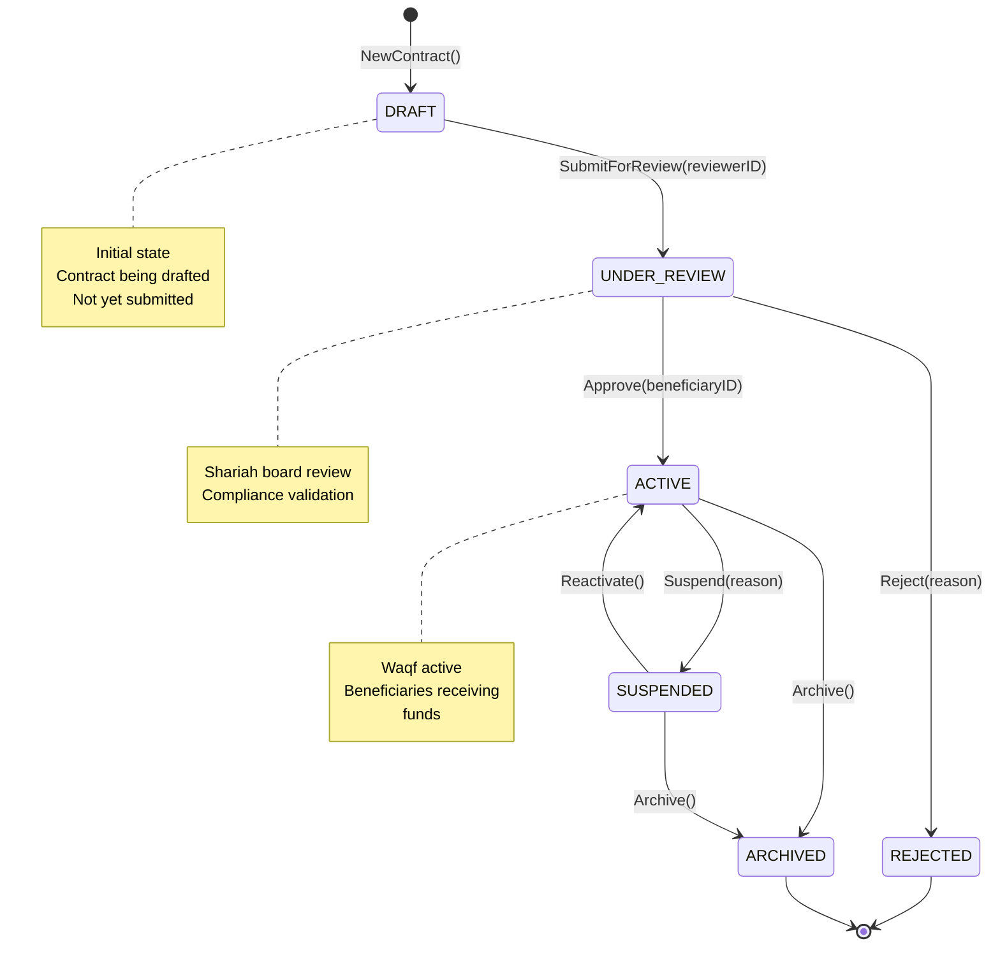
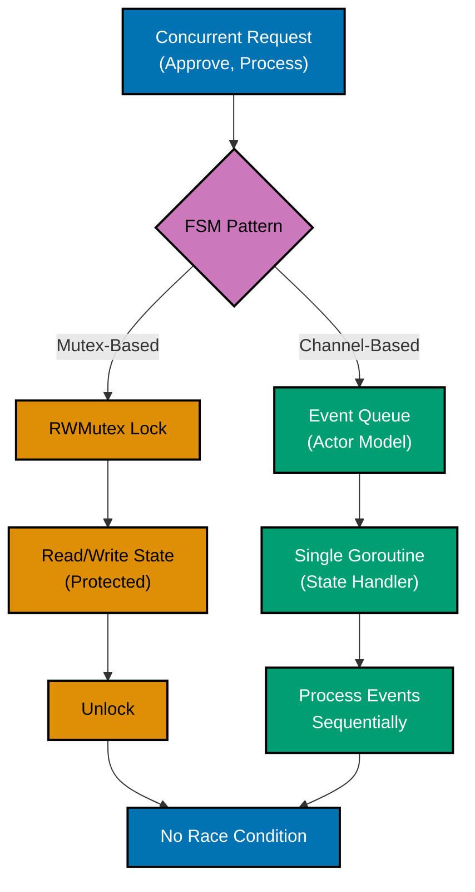
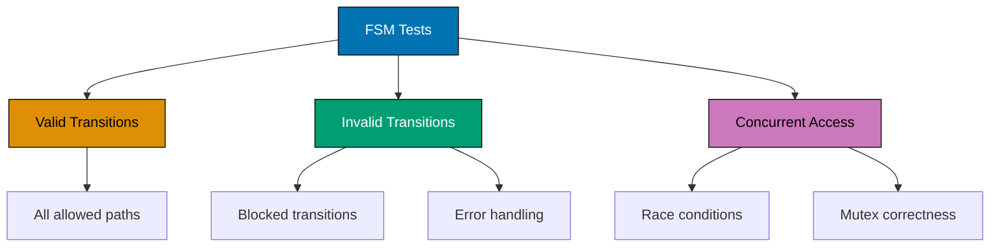
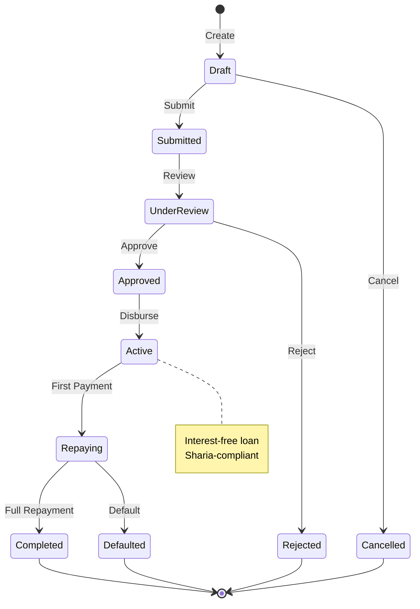
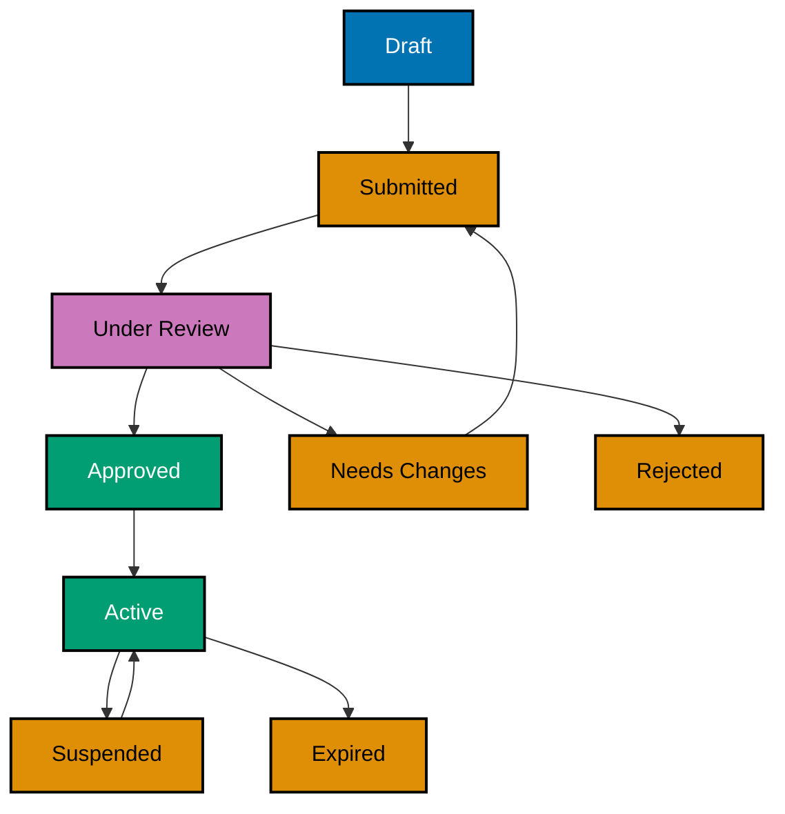

title: "Go Finite State Machines"
description: State machine patterns for managing state transitions in Go 1.18-1.25 using type safety, interfaces, and concurrency
category: explanation
subcategory: prog-lang
tags:

- golang
- finite-state-machine
- fsm
- state-pattern
- type-safety
- interfaces
- concurrency
- go-1.18
- go-1.21
- go-1.22
- go-1.23
- go-1.24
- go-1.25
  principles:
- explicit-over-implicit
- immutability

---

# Go Finite State Machines

**Quick Reference**: [Overview](#overview) | [FSM Fundamentals](#fsm-fundamentals) | [Type-Based FSM Pattern](#type-based-fsm-pattern) | [State Interface Pattern](#state-interface-pattern) | [Type Switch Pattern](#type-switch-pattern) | [Concurrency-Safe FSMs](#concurrency-safe-fsms) | [Testing State Machines](#testing-state-machines) | [Business Domain Examples](#business-domain-examples) | [Patterns and Anti-Patterns](#patterns-and-anti-patterns) | [Checklist: FSM Implementation](#checklist-fsm-implementation) | [Related Documentation](#related-documentation) | [Sources and Further Reading](#sources-and-further-reading)

## Overview

Finite State Machines (FSMs) are fundamental design patterns for managing complex state transitions in enterprise software. In Go, FSMs leverage the language's unique strengths - type safety through interfaces, explicit error handling, and goroutine-safe concurrency - to build robust, maintainable state management systems for financial and business-critical applications.

### Why FSMs Matter in Finance

Financial applications involve complex workflows with strict state transition rules:

- **Zakat DonationPayment Processing**: Donation transactions move through well-defined states (pending → verification → approved → distributed)
- **Murabaha QardHasan Lifecycle**: Islamic financing contracts follow specific approval and disbursement workflows
- **Waqf MurabahaContract Management**: Endowment contracts transition through draft → review → active → archived states
- **Compliance Workflows**: Shariah compliance checks require deterministic, auditable state tracking

### Key Benefits

1. **Deterministic Behavior**: Predictable state transitions prevent invalid states
2. **Type Safety**: Go's interface system provides compile-time guarantees
3. **Explicit Error Handling**: Every transition returns an error for invalid operations
4. **Concurrency Safety**: Mutex-based or channel-based FSMs prevent race conditions
5. **Testability**: State transitions are isolated and easy to unit test
6. **Audit Trail**: Every state change is explicitly modeled and trackable

### Go's Unique Challenges and Solutions

**Challenges Go faces compared to languages with enums:**

| Challenge           | Java/TypeScript Solution | Go Solution                   |
| ------------------- | ------------------------ | ----------------------------- |
| No enums            | Enum types               | Type aliases + const + iota   |
| State validation    | Compile-time enum checks | Runtime type switches         |
| Exhaustive matching | Switch on sealed types   | Type switch with default case |
| State behavior      | Enum methods             | Interface-based state pattern |

**Go's unique strengths for FSMs:**

- **Goroutine-safe FSMs**: Built-in concurrency primitives (mutexes, channels)
- **Channel-based actor model**: Natural fit for event-driven state machines
- **Zero-cost interfaces**: No virtual table overhead
- **Composition over inheritance**: State embedding without deep hierarchies

### Target Audience

This guide targets Go developers building enterprise financial systems. It assumes familiarity with Go 1.18+ features and focuses on practical FSM implementation patterns using modern Go idioms.

## Quick Reference

**Jump to:**

- [FSM Fundamentals](#fsm-fundamentals) - Core concepts and terminology
- [Type-Based FSM Pattern](#type-based-fsm-pattern) - Simple state machines with type aliases
- [State Interface Pattern](#state-interface-pattern) - OOP approach with state interfaces
- [Type Switch Pattern](#type-switch-pattern) - Modern approach inspired by sealed classes
- [Concurrency-Safe FSMs](#concurrency-safe-fsms) - Goroutine-safe implementations
- [Testing Strategies](#testing-state-machines) - Comprehensive testing approaches
- [Business Examples](#business-domain-examples) - DonationPayment, QardHasan, Waqf implementations

**Related Documentation:**

- [Interfaces and Composition](./ex-so-prla-go__interfaces-and-composition.md) - Interface patterns
- [Type Safety](./ex-so-prla-go__type-safety.md) - Type system guarantees
- [Best Practices](./ex-so-prla-go__best-practices.md) - Code quality standards
- [Concurrency and Parallelism](./ex-so-prla-go__concurrency-and-parallelism.md) - Goroutine safety

FSM patterns align with [software engineering principles](../../../../../governance/principles/software-engineering/README.md):

- **State immutability** embodies [Immutability Over Mutability](../../../../../governance/principles/software-engineering/immutability.md)
- **Explicit transitions** implement [Explicit Over Implicit](../../../../../governance/principles/software-engineering/explicit-over-implicit.md)
- **Type-safe states** provide compile-time safety through interfaces

## FSM Fundamentals

### Core Components

A finite state machine consists of:

1. **States**: Discrete conditions the system can be in
2. **Events**: Triggers that cause state transitions
3. **Transitions**: Rules defining valid state changes
4. **Initial State**: Starting point
5. **Final States**: Terminal states (optional)
6. **Guards**: Preconditions that must be true for transitions
7. **Actions**: Side effects during transitions (entry/exit actions)

### State Machine Properties

**Deterministic FSM**: Given current state and input, next state is always the same

- **Use case**: DonationPayment processing (consistent behavior required)
- **Example**: `PENDING` + `Approve()` → `APPROVED` (always)

**Non-Deterministic FSM**: Multiple possible next states for same input

- **Use case**: Manual review workflows (human decision involved)
- **Example**: `UNDER_REVIEW` + `Review()` → `APPROVED` or `REJECTED` (depends on reviewer)

### State Transition Diagram



### State Invariants

**Invariants** are conditions that must always be true in a given state:

- **PENDING donation**: Amount > 0, recipient exists
- **APPROVED qard_hasan**: All documents uploaded, risk score within limits
- **ACTIVE murabaha_contract**: Start date ≤ today ≤ end date

FSMs enforce invariants through:

1. **Entry guards**: Validate invariants when entering state
2. **Guard conditions**: Check preconditions before transition
3. **Exit actions**: Clean up resources when leaving state

## Type-Based FSM Pattern

### Overview

Type-based FSMs use Go's type alias + const pattern to create enum-like states with transition logic in methods. This is the simplest approach for straightforward workflows.

### Characteristics

- **Lightweight**: Minimal boilerplate
- **Type-safe**: States are distinct types
- **Centralized transitions**: Logic in one place
- **Go idiom**: Natural fit for Go's type system

### Example: DonationPayment Processing FSM

#### Payment State Transition Diagram



**Before (No FSM - Scattered Logic)**:

```go
package donation

import (
 "errors"
 "time"
)

// Bad: String-based state (no compile-time safety)
type DonationPayment struct {
 ID              string
 Amount          int64  // cents
 PayeeID         string
 Status          string  // Just a string!
 FailureReason   string
 LastTransitionAt time.Time
}

// No validation of current state
func (p *DonationPayment) Approve() {
 p.Status = "APPROVED"  // Could approve from any state (bug!)
 p.LastTransitionAt = time.Now()
}

func (p *DonationPayment) Process() {
 p.Status = "COMPLETED"  // Could process from any state (bug!)
 p.LastTransitionAt = time.Now()
}

func (p *DonationPayment) Fail(reason string) {
 p.Status = "FAILED"
 p.FailureReason = reason
 p.LastTransitionAt = time.Now()
}

// Service layer - validation logic scattered
type Service struct {
 repo Repository
}

func (s *Service) ApprovePayment(id string) error {
 donation, err := s.repo.Get(id)
 if err != nil {
  return err
 }

 // Manual state validation (error-prone, scattered)
 if donation.Status != "PENDING" {
  return errors.New("can only approve pending payments")
 }

 donation.Approve()
 return s.repo.Save(donation)
}

func (s *Service) ProcessPayment(id string) error {
 donation, err := s.repo.Get(id)
 if err != nil {
  return err
 }

 // More scattered validation
 if donation.Status != "APPROVED" {
  return errors.New("can only process approved payments")
 }

 donation.Process()
 return s.repo.Save(donation)
}
```

**After (Type-Based FSM)**:

```go
package donation

import (
 "errors"
 "fmt"
 "time"
)

// PaymentState is a type-safe state enum
type PaymentState int

const (
 StatePending PaymentState = iota
 StateApproved
 StateProcessing
 StateCompleted
 StateFailed
 StateRejected
 StateCancelled
)

// String implements fmt.Stringer for debugging
func (s PaymentState) String() string {
 return [...]string{
  "PENDING",
  "APPROVED",
  "PROCESSING",
  "COMPLETED",
  "FAILED",
  "REJECTED",
  "CANCELLED",
 }[s]
}

// IsTerminal returns true for terminal states
func (s PaymentState) IsTerminal() bool {
 return s == StateCompleted || s == StateFailed ||
  s == StateRejected || s == StateCancelled
}

// CanTransitionTo checks if transition is valid
func (s PaymentState) CanTransitionTo(target PaymentState) bool {
 validTransitions := map[PaymentState][]PaymentState{
  StatePending:    {StateApproved, StateRejected},
  StateApproved:   {StateProcessing, StateCancelled},
  StateProcessing: {StateCompleted, StateFailed},
  // Terminal states have no valid transitions
  StateCompleted:  {},
  StateFailed:     {},
  StateRejected:   {},
  StateCancelled:  {},
 }

 allowed := validTransitions[s]
 for _, allowedState := range allowed {
  if allowedState == target {
   return true
  }
 }
 return false
}

// DonationPayment entity uses type-safe state
type DonationPayment struct {
 ID              string
 Amount          int64  // cents
 PayeeID         string
 State           PaymentState
 FailureReason   string
 LastTransitionAt time.Time
}

// NewPayment creates donation in initial state
func NewPayment(id string, amount int64, payeeID string) (*DonationPayment, error) {
 if amount <= 0 {
  return nil, errors.New("amount must be positive")
 }
 if payeeID == "" {
  return nil, errors.New("payeeID cannot be empty")
 }

 return &DonationPayment{
  ID:              id,
  Amount:          amount,
  PayeeID:         payeeID,
  State:           StatePending,  // Initial state
  LastTransitionAt: time.Now(),
 }, nil
}

// Transition attempts state transition
func (p *DonationPayment) Transition(target PaymentState) error {
 if !p.State.CanTransitionTo(target) {
  return fmt.Errorf("invalid transition from %s to %s", p.State, target)
 }

 p.State = target
 p.LastTransitionAt = time.Now()
 return nil
}

// Approve transitions to APPROVED state
func (p *DonationPayment) Approve() error {
 return p.Transition(StateApproved)
}

// Reject transitions to REJECTED state
func (p *DonationPayment) Reject(reason string) error {
 if err := p.Transition(StateRejected); err != nil {
  return err
 }
 p.FailureReason = reason
 return nil
}

// Process transitions to PROCESSING state
func (p *DonationPayment) Process() error {
 return p.Transition(StateProcessing)
}

// Complete transitions to COMPLETED state
func (p *DonationPayment) Complete() error {
 return p.Transition(StateCompleted)
}

// Fail transitions to FAILED state
func (p *DonationPayment) Fail(reason string) error {
 if err := p.Transition(StateFailed); err != nil {
  return err
 }
 p.FailureReason = reason
 return nil
}

// Cancel transitions to CANCELLED state
func (p *DonationPayment) Cancel(reason string) error {
 if err := p.Transition(StateCancelled); err != nil {
  return err
 }
 p.FailureReason = reason
 return nil
}
```

### Advantages

**Compared to string-based states**:

- ✅ **Compile-time safety**: Cannot assign invalid state values
- ✅ **Autocomplete**: IDE can suggest valid states
- ✅ **Refactoring**: Rename state, all references update
- ✅ **Type checking**: Cannot compare different enum types

**Example of type safety**:

```go
// String-based (BAD) - typos compile but fail at runtime
if donation.Status == "APROVED" {  // Typo! Runtime bug
 // ...
}

// Type-based (GOOD) - typos caught at compile time
if donation.State == StateApproved {  // Compiler validates
 // ...
}
```

### Limitations

- ❌ **No rich state behavior**: States cannot have different methods
- ❌ **Centralized logic**: All transition logic in one place (can grow large)
- ❌ **Not extensible**: Cannot add state-specific data easily

**When to use**:

- ✅ Simple FSMs with 5-10 states
- ✅ Straightforward transition rules
- ✅ No state-specific behavior needed

**When to avoid**:

- ❌ Complex state-specific logic
- ❌ States need different data fields
- ❌ Need polymorphic behavior per state

## State Interface Pattern

### Overview

The State Pattern uses Go interfaces to create polymorphic state objects with state-specific behavior. This is the classic OOP approach adapted to Go's interface-based design.

### Characteristics

- **Polymorphic**: Each state implements same interface
- **Encapsulated**: State logic lives in state objects
- **Extensible**: Easy to add new states
- **Testable**: States can be tested independently

### State Pattern Structure



### Example: Murabaha QardHasan Lifecycle FSM

**Murabaha** is an Islamic financing structure where the bank purchases an asset and sells it to the donor at a marked-up price, payable in installments. The qard_hasan lifecycle has complex state-specific validation rules.

```go
package qard_hasan

import (
 "errors"
 "fmt"
 "time"
)

// State interface defines state-specific behavior
type LoanState interface {
 // State transition methods
 Submit() (LoanState, error)
 Approve() (LoanState, error)
 Reject(reason string) (LoanState, error)
 Disburse() (LoanState, error)
 Close() (LoanState, error)
 Default(reason string) (LoanState, error)

 // State query methods
 Name() string
 IsTerminal() bool
 CanSubmit() bool
 CanApprove() bool
 CanDisburse() bool

 // State-specific validation (enforces invariants)
 ValidateInvariants(qard_hasan *QardHasan) error
}

// QardHasan entity holds mutable state
type QardHasan struct {
 ID              string
 CustomerID      string
 AssetPrice      int64  // cents
 MarkupRate      float64
 TotalAmount     int64  // Asset price + markup
 State           LoanState
 SubmittedAt     *time.Time
 ApprovedAt      *time.Time
 DisbursedAt     *time.Time
 RejectionReason string
 DefaultReason   string
}

// NewLoan creates qard_hasan in draft state
func NewLoan(id, customerID string, assetPrice int64, markupRate float64) *QardHasan {
 markup := float64(assetPrice) * markupRate
 return &QardHasan{
  ID:          id,
  CustomerID:  customerID,
  AssetPrice:  assetPrice,
  MarkupRate:  markupRate,
  TotalAmount: assetPrice + int64(markup),
  State:       &DraftState{},  // Initial state
 }
}

// Transition executes state transition with validation
func (l *QardHasan) Transition(action func(LoanState) (LoanState, error)) error {
 newState, err := action(l.State)
 if err != nil {
  return err
 }

 // Validate invariants for new state
 if err := newState.ValidateInvariants(l); err != nil {
  return fmt.Errorf("invariant violation: %w", err)
 }

 l.State = newState
 return nil
}

// Submit delegates to current state
func (l *QardHasan) Submit() error {
 return l.Transition(func(s LoanState) (LoanState, error) {
  now := time.Now()
  l.SubmittedAt = &now
  return s.Submit()
 })
}

func (l *QardHasan) Approve() error {
 return l.Transition(func(s LoanState) (LoanState, error) {
  now := time.Now()
  l.ApprovedAt = &now
  return s.Approve()
 })
}

func (l *QardHasan) Reject(reason string) error {
 return l.Transition(func(s LoanState) (LoanState, error) {
  l.RejectionReason = reason
  return s.Reject(reason)
 })
}

func (l *QardHasan) Disburse() error {
 return l.Transition(func(s LoanState) (LoanState, error) {
  now := time.Now()
  l.DisbursedAt = &now
  return s.Disburse()
 })
}

func (l *QardHasan) Close() error {
 return l.Transition(func(s LoanState) (LoanState, error) {
  return s.Close()
 })
}

func (l *QardHasan) Default(reason string) error {
 return l.Transition(func(s LoanState) (LoanState, error) {
  l.DefaultReason = reason
  return s.Default(reason)
 })
}

// Base state with default implementations
type baseState struct{}

func (b *baseState) Submit() (LoanState, error) {
 return nil, errors.New("cannot submit from this state")
}

func (b *baseState) Approve() (LoanState, error) {
 return nil, errors.New("cannot approve from this state")
}

func (b *baseState) Reject(reason string) (LoanState, error) {
 return nil, errors.New("cannot reject from this state")
}

func (b *baseState) Disburse() (LoanState, error) {
 return nil, errors.New("cannot disburse from this state")
}

func (b *baseState) Close() (LoanState, error) {
 return nil, errors.New("cannot close from this state")
}

func (b *baseState) Default(reason string) (LoanState, error) {
 return nil, errors.New("cannot default from this state")
}

// DraftState - Initial state
type DraftState struct {
 baseState
}

func (d *DraftState) Name() string { return "DRAFT" }
func (d *DraftState) IsTerminal() bool { return false }
func (d *DraftState) CanSubmit() bool { return true }
func (d *DraftState) CanApprove() bool { return false }
func (d *DraftState) CanDisburse() bool { return false }

func (d *DraftState) Submit() (LoanState, error) {
 return &SubmittedState{}, nil
}

func (d *DraftState) ValidateInvariants(qard_hasan *QardHasan) error {
 if qard_hasan.AssetPrice <= 0 {
  return errors.New("asset price must be positive")
 }
 if qard_hasan.MarkupRate < 0 || qard_hasan.MarkupRate > 1 {
  return errors.New("markup rate must be between 0 and 1")
 }
 return nil
}

// SubmittedState - Under review
type SubmittedState struct {
 baseState
}

func (s *SubmittedState) Name() string { return "SUBMITTED" }
func (s *SubmittedState) IsTerminal() bool { return false }
func (s *SubmittedState) CanSubmit() bool { return false }
func (s *SubmittedState) CanApprove() bool { return true }
func (s *SubmittedState) CanDisburse() bool { return false }

func (s *SubmittedState) Approve() (LoanState, error) {
 return &ApprovedState{}, nil
}

func (s *SubmittedState) Reject(reason string) (LoanState, error) {
 return &RejectedState{}, nil
}

func (s *SubmittedState) ValidateInvariants(qard_hasan *QardHasan) error {
 if qard_hasan.SubmittedAt == nil {
  return errors.New("submitted qard_hasan must have submission timestamp")
 }
 return nil
}

// ApprovedState - Ready for disbursement
type ApprovedState struct {
 baseState
}

func (a *ApprovedState) Name() string { return "APPROVED" }
func (a *ApprovedState) IsTerminal() bool { return false }
func (a *ApprovedState) CanSubmit() bool { return false }
func (a *ApprovedState) CanApprove() bool { return false }
func (a *ApprovedState) CanDisburse() bool { return true }

func (a *ApprovedState) Disburse() (LoanState, error) {
 return &ActiveState{}, nil
}

func (a *ApprovedState) ValidateInvariants(qard_hasan *QardHasan) error {
 if qard_hasan.ApprovedAt == nil {
  return errors.New("approved qard_hasan must have approval timestamp")
 }
 return nil
}

// ActiveState - QardHasan disbursed, payments ongoing
type ActiveState struct {
 baseState
}

func (a *ActiveState) Name() string { return "ACTIVE" }
func (a *ActiveState) IsTerminal() bool { return false }
func (a *ActiveState) CanSubmit() bool { return false }
func (a *ActiveState) CanApprove() bool { return false }
func (a *ActiveState) CanDisburse() bool { return false }

func (a *ActiveState) Close() (LoanState, error) {
 return &ClosedState{}, nil
}

func (a *ActiveState) Default(reason string) (LoanState, error) {
 return &DefaultedState{}, nil
}

func (a *ActiveState) ValidateInvariants(qard_hasan *QardHasan) error {
 if qard_hasan.DisbursedAt == nil {
  return errors.New("active qard_hasan must have disbursement timestamp")
 }
 return nil
}

// Terminal states
type ClosedState struct {
 baseState
}

func (c *ClosedState) Name() string { return "CLOSED" }
func (c *ClosedState) IsTerminal() bool { return true }
func (c *ClosedState) CanSubmit() bool { return false }
func (c *ClosedState) CanApprove() bool { return false }
func (c *ClosedState) CanDisburse() bool { return false }
func (c *ClosedState) ValidateInvariants(qard_hasan *QardHasan) error { return nil }

type RejectedState struct {
 baseState
}

func (r *RejectedState) Name() string { return "REJECTED" }
func (r *RejectedState) IsTerminal() bool { return true }
func (r *RejectedState) CanSubmit() bool { return false }
func (r *RejectedState) CanApprove() bool { return false }
func (r *RejectedState) CanDisburse() bool { return false }

func (r *RejectedState) ValidateInvariants(qard_hasan *QardHasan) error {
 if qard_hasan.RejectionReason == "" {
  return errors.New("rejected qard_hasan must have rejection reason")
 }
 return nil
}

type DefaultedState struct {
 baseState
}

func (d *DefaultedState) Name() string { return "DEFAULTED" }
func (d *DefaultedState) IsTerminal() bool { return true }
func (d *DefaultedState) CanSubmit() bool { return false }
func (d *DefaultedState) CanApprove() bool { return false }
func (d *DefaultedState) CanDisburse() bool { return false }

func (d *DefaultedState) ValidateInvariants(qard_hasan *QardHasan) error {
 if qard_hasan.DefaultReason == "" {
  return errors.New("defaulted qard_hasan must have default reason")
 }
 return nil
}
```

### Usage Example

```go
func Example_LoanLifecycle() {
 // Create qard_hasan in DRAFT state
 qard_hasan := NewLoan("L001", "C123", 100000_00, 0.15)
 fmt.Println("Initial state:", qard_hasan.State.Name())

 // Submit for approval
 if err := qard_hasan.Submit(); err != nil {
  fmt.Println("Submit failed:", err)
  return
 }
 fmt.Println("After submit:", qard_hasan.State.Name())

 // Approve qard_hasan
 if err := qard_hasan.Approve(); err != nil {
  fmt.Println("Approve failed:", err)
  return
 }
 fmt.Println("After approve:", qard_hasan.State.Name())

 // Disburse funds
 if err := qard_hasan.Disburse(); err != nil {
  fmt.Println("Disburse failed:", err)
  return
 }
 fmt.Println("After disburse:", qard_hasan.State.Name())

 // Try invalid transition
 if err := qard_hasan.Submit(); err != nil {
  fmt.Println("Invalid transition:", err)
 }

 // Output:
 // Initial state: DRAFT
 // After submit: SUBMITTED
 // After approve: APPROVED
 // After disburse: ACTIVE
 // Invalid transition: cannot submit from this state
}
```

### Advantages of State Pattern

**Compared to type-based FSM**:

- ✅ **State-specific behavior**: Each state encapsulates its own logic
- ✅ **Open-closed principle**: Add new states without modifying existing code
- ✅ **Invariant validation**: States can enforce invariants specific to them
- ✅ **Testability**: Test each state in isolation

**Compared to enum-based (Java/TypeScript)**:

- ✅ **More idiomatic Go**: Uses interfaces instead of enum classes
- ✅ **No reflection**: Compile-time type safety without reflection

### Limitations

- ❌ **More boilerplate**: Need to implement interface for each state
- ❌ **Memory overhead**: Each state is an object (though lightweight in Go)
- ❌ **No exhaustive checking**: Cannot force handling all states (unlike sealed classes)

**When to use**:

- ✅ Complex state-specific behavior
- ✅ States need different validation rules
- ✅ Need polymorphic behavior per state
- ✅ 5-20 states with distinct logic

**When to avoid**:

- ❌ Simple FSMs (use type-based pattern)
- ❌ Hundreds of states (consider table-driven approach)

## Type Switch Pattern

### Overview

The Type Switch Pattern uses Go's type switch with interfaces to achieve exhaustive-like matching similar to sealed classes in modern languages. This pattern leverages Go 1.18+ features for cleaner state handling.

### Characteristics

- **Explicit state types**: Each state is a concrete type
- **Type switching**: Dispatch on concrete type
- **Compile-time safety**: Type system prevents invalid state assignments
- **Modern Go idiom**: Uses generics when beneficial

### Example: Waqf MurabahaContract State Management

#### Waqf Contract State Transition Diagram



**Waqf** (وقف) is an Islamic endowment where assets are donated for charitable purposes. Contracts transition through creation, review, activation, and archival phases.

```go
package waqf

import (
 "errors"
 "fmt"
 "time"
)

// State marker interface
type ContractState interface {
 isContractState()  // Unexported method makes this a sealed-like interface
 Name() string
 IsTerminal() bool
}

// Draft state - Initial creation
type DraftState struct {
 CreatedAt time.Time
}

func (d DraftState) isContractState() {}
func (d DraftState) Name() string { return "DRAFT" }
func (d DraftState) IsTerminal() bool { return false }

// UnderReview state - Shariah board reviewing
type UnderReviewState struct {
 SubmittedAt time.Time
 ReviewerID  string
}

func (u UnderReviewState) isContractState() {}
func (u UnderReviewState) Name() string { return "UNDER_REVIEW" }
func (u UnderReviewState) IsTerminal() bool { return false }

// Active state - MurabahaContract is active
type ActiveState struct {
 ApprovedAt    time.Time
 ActivatedAt   time.Time
 BeneficiaryID string
}

func (a ActiveState) isContractState() {}
func (a ActiveState) Name() string { return "ACTIVE" }
func (a ActiveState) IsTerminal() bool { return false }

// Suspended state - Temporarily inactive
type SuspendedState struct {
 SuspendedAt time.Time
 Reason      string
}

func (s SuspendedState) isContractState() {}
func (s SuspendedState) Name() string { return "SUSPENDED" }
func (s SuspendedState) IsTerminal() bool { return false }

// Archived state - Permanently closed
type ArchivedState struct {
 ArchivedAt time.Time
 FinalValue int64
}

func (a ArchivedState) isContractState() {}
func (a ArchivedState) Name() string { return "ARCHIVED" }
func (a ArchivedState) IsTerminal() bool { return true }

// Rejected state - Failed review
type RejectedState struct {
 RejectedAt time.Time
 Reason     string
}

func (r RejectedState) isContractState() {}
func (r RejectedState) Name() string { return "REJECTED" }
func (r RejectedState) IsTerminal() bool { return true }

// MurabahaContract entity
type MurabahaContract struct {
 ID             string
 DonorID        string
 AssetValue     int64
 BeneficiaryID  string
 State          ContractState
}

// NewContract creates murabaha_contract in DRAFT state
func NewContract(id, donorID string, assetValue int64) *MurabahaContract {
 return &MurabahaContract{
  ID:         id,
  DonorID:    donorID,
  AssetValue: assetValue,
  State:      DraftState{CreatedAt: time.Now()},
 }
}

// SubmitForReview transitions from DRAFT to UNDER_REVIEW
func (c *MurabahaContract) SubmitForReview(reviewerID string) error {
 switch state := c.State.(type) {
 case DraftState:
  c.State = UnderReviewState{
   SubmittedAt: time.Now(),
   ReviewerID:  reviewerID,
  }
  return nil

 case UnderReviewState:
  return errors.New("murabaha_contract already under review")

 case ActiveState:
  return errors.New("cannot submit active murabaha_contract for review")

 case SuspendedState:
  return errors.New("cannot submit suspended murabaha_contract for review")

 case ArchivedState:
  return errors.New("cannot submit archived murabaha_contract for review")

 case RejectedState:
  return errors.New("cannot submit rejected murabaha_contract for review")

 default:
  // This case should never happen if all states are handled
  return fmt.Errorf("unknown state type: %T", state)
 }
}

// Approve transitions from UNDER_REVIEW to ACTIVE
func (c *MurabahaContract) Approve(beneficiaryID string) error {
 switch state := c.State.(type) {
 case DraftState:
  return errors.New("must submit for review before approval")

 case UnderReviewState:
  c.State = ActiveState{
   ApprovedAt:    time.Now(),
   ActivatedAt:   time.Now(),
   BeneficiaryID: beneficiaryID,
  }
  c.BeneficiaryID = beneficiaryID
  return nil

 case ActiveState:
  return errors.New("murabaha_contract already active")

 case SuspendedState:
  return errors.New("cannot approve suspended murabaha_contract")

 case ArchivedState:
  return errors.New("cannot approve archived murabaha_contract")

 case RejectedState:
  return errors.New("cannot approve rejected murabaha_contract")

 default:
  return fmt.Errorf("unknown state type: %T", state)
 }
}

// Reject transitions from UNDER_REVIEW to REJECTED
func (c *MurabahaContract) Reject(reason string) error {
 switch state := c.State.(type) {
 case DraftState:
  return errors.New("must submit for review before rejection")

 case UnderReviewState:
  c.State = RejectedState{
   RejectedAt: time.Now(),
   Reason:     reason,
  }
  return nil

 case ActiveState:
  return errors.New("cannot reject active murabaha_contract")

 case SuspendedState:
  return errors.New("cannot reject suspended murabaha_contract")

 case ArchivedState:
  return errors.New("cannot reject archived murabaha_contract")

 case RejectedState:
  return errors.New("murabaha_contract already rejected")

 default:
  return fmt.Errorf("unknown state type: %T", state)
 }
}

// Suspend transitions from ACTIVE to SUSPENDED
func (c *MurabahaContract) Suspend(reason string) error {
 switch state := c.State.(type) {
 case DraftState:
  return errors.New("cannot suspend draft murabaha_contract")

 case UnderReviewState:
  return errors.New("cannot suspend murabaha_contract under review")

 case ActiveState:
  c.State = SuspendedState{
   SuspendedAt: time.Now(),
   Reason:      reason,
  }
  return nil

 case SuspendedState:
  return errors.New("murabaha_contract already suspended")

 case ArchivedState:
  return errors.New("cannot suspend archived murabaha_contract")

 case RejectedState:
  return errors.New("cannot suspend rejected murabaha_contract")

 default:
  return fmt.Errorf("unknown state type: %T", state)
 }
}

// Resume transitions from SUSPENDED to ACTIVE
func (c *MurabahaContract) Resume() error {
 switch state := c.State.(type) {
 case DraftState:
  return errors.New("cannot resume draft murabaha_contract")

 case UnderReviewState:
  return errors.New("cannot resume murabaha_contract under review")

 case ActiveState:
  return errors.New("murabaha_contract already active")

 case SuspendedState:
  // Restore previous active state data (would need to be preserved)
  c.State = ActiveState{
   ApprovedAt:    time.Now(),  // Simplified, would restore from history
   ActivatedAt:   time.Now(),
   BeneficiaryID: c.BeneficiaryID,
  }
  return nil

 case ArchivedState:
  return errors.New("cannot resume archived murabaha_contract")

 case RejectedState:
  return errors.New("cannot resume rejected murabaha_contract")

 default:
  return fmt.Errorf("unknown state type: %T", state)
 }
}

// Archive transitions from ACTIVE or SUSPENDED to ARCHIVED
func (c *MurabahaContract) Archive() error {
 switch state := c.State.(type) {
 case DraftState:
  return errors.New("cannot archive draft murabaha_contract")

 case UnderReviewState:
  return errors.New("cannot archive murabaha_contract under review")

 case ActiveState:
  c.State = ArchivedState{
   ArchivedAt: time.Now(),
   FinalValue: c.AssetValue,
  }
  return nil

 case SuspendedState:
  c.State = ArchivedState{
   ArchivedAt: time.Now(),
   FinalValue: c.AssetValue,
  }
  return nil

 case ArchivedState:
  return errors.New("murabaha_contract already archived")

 case RejectedState:
  return errors.New("cannot archive rejected murabaha_contract")

 default:
  return fmt.Errorf("unknown state type: %T", state)
 }
}

// GetStateData extracts state-specific data
func (c *MurabahaContract) GetStateData() interface{} {
 switch state := c.State.(type) {
 case DraftState:
  return map[string]interface{}{
   "created_at": state.CreatedAt,
  }

 case UnderReviewState:
  return map[string]interface{}{
   "submitted_at": state.SubmittedAt,
   "reviewer_id":  state.ReviewerID,
  }

 case ActiveState:
  return map[string]interface{}{
   "approved_at":    state.ApprovedAt,
   "activated_at":   state.ActivatedAt,
   "beneficiary_id": state.BeneficiaryID,
  }

 case SuspendedState:
  return map[string]interface{}{
   "suspended_at": state.SuspendedAt,
   "reason":       state.Reason,
  }

 case ArchivedState:
  return map[string]interface{}{
   "archived_at": state.ArchivedAt,
   "final_value": state.FinalValue,
  }

 case RejectedState:
  return map[string]interface{}{
   "rejected_at": state.RejectedAt,
   "reason":      state.Reason,
  }

 default:
  return nil
 }
}
```

### Usage Example

```go
func Example_WaqfContractLifecycle() {
 // Create murabaha_contract
 murabaha_contract := NewContract("W001", "D123", 500000_00)
 fmt.Println("Initial state:", murabaha_contract.State.Name())

 // Submit for review
 if err := murabaha_contract.SubmitForReview("R456"); err != nil {
  fmt.Println("Submit error:", err)
  return
 }
 fmt.Println("After submit:", murabaha_contract.State.Name())

 // Get state-specific data
 data := murabaha_contract.GetStateData()
 fmt.Printf("Review data: %+v\n", data)

 // Approve murabaha_contract
 if err := murabaha_contract.Approve("B789"); err != nil {
  fmt.Println("Approve error:", err)
  return
 }
 fmt.Println("After approve:", murabaha_contract.State.Name())

 // Suspend temporarily
 if err := murabaha_contract.Suspend("Annual maintenance"); err != nil {
  fmt.Println("Suspend error:", err)
  return
 }
 fmt.Println("After suspend:", murabaha_contract.State.Name())

 // Resume
 if err := murabaha_contract.Resume(); err != nil {
  fmt.Println("Resume error:", err)
  return
 }
 fmt.Println("After resume:", murabaha_contract.State.Name())

 // Archive
 if err := murabaha_contract.Archive(); err != nil {
  fmt.Println("Archive error:", err)
  return
 }
 fmt.Println("After archive:", murabaha_contract.State.Name())

 // Output:
 // Initial state: DRAFT
 // After submit: UNDER_REVIEW
 // Review data: map[reviewer_id:R456 submitted_at:2026-01-22 10:00:00]
 // After approve: ACTIVE
 // After suspend: SUSPENDED
 // After resume: ACTIVE
 // After archive: ARCHIVED
}
```

### Advantages

**Compared to State Interface Pattern**:

- ✅ **Type-safe state data**: Each state type carries its own fields
- ✅ **Less boilerplate**: No need for base state implementation
- ✅ **Clearer logic**: Type switch makes transitions explicit

**Compared to Enum-based languages**:

- ✅ **Rich state data**: States can have different fields (like Rust enums)
- ✅ **No reflection**: Type switching is compile-time safe
- ✅ **Pattern matching-like**: Type switch approximates sealed classes

### Pattern: Exhaustive Type Switch (Linting)

```go
// Use staticcheck or golangci-lint to catch missing cases
// Add this comment to ensure all states are handled
func processState(state ContractState) {
 switch s := state.(type) {
 case DraftState:
  // Handle draft
 case UnderReviewState:
  // Handle under review
 case ActiveState:
  // Handle active
 case SuspendedState:
  // Handle suspended
 case ArchivedState:
  // Handle archived
 case RejectedState:
  // Handle rejected
 default:
  // Linter can warn if this is reachable
  panic(fmt.Sprintf("unhandled state type: %T", s))
 }
}
```

### Limitations

- ❌ **No compile-time exhaustiveness**: Unlike sealed classes, compiler cannot enforce all cases
- ❌ **Runtime overhead**: Type switches have small runtime cost (negligible for most use cases)
- ❌ **Manual maintenance**: Must remember to update all type switches when adding states

**When to use**:

- ✅ States need different data fields
- ✅ Moderate complexity (5-15 states)
- ✅ Need state-specific logic
- ✅ Prefer explicit over polymorphic

**When to avoid**:

- ❌ Simple FSMs (use type-based pattern)
- ❌ Need strict exhaustiveness checking (Go doesn't provide this)

## Concurrency-Safe FSMs

### Concurrency Patterns for FSMs



### Overview

Go's goroutines make concurrency natural, but FSMs require synchronization to prevent race conditions. Go provides two main approaches: mutex-based and channel-based FSMs.

### Challenge: Race Conditions

```go
// UNSAFE: Race condition
type DonationPayment struct {
 state PaymentState
}

func (p *DonationPayment) Approve() error {
 // Two goroutines could both read PENDING, both write APPROVED
 if p.state != StatePending {
  return errors.New("can only approve pending payments")
 }
 p.state = StateApproved  // Race!
 return nil
}
```

### Pattern 1: Mutex-Based FSM

```go
package donation

import (
 "errors"
 "sync"
 "time"
)

// Thread-safe donation FSM
type SafePayment struct {
 mu              sync.RWMutex
 id              string
 amount          int64
 state           PaymentState
 lastTransitionAt time.Time
}

func NewSafePayment(id string, amount int64) *SafePayment {
 return &SafePayment{
  id:              id,
  amount:          amount,
  state:           StatePending,
  lastTransitionAt: time.Now(),
 }
}

// GetState safely reads current state
func (p *SafePayment) GetState() PaymentState {
 p.mu.RLock()
 defer p.mu.RUnlock()
 return p.state
}

// Approve safely transitions to APPROVED
func (p *SafePayment) Approve() error {
 p.mu.Lock()
 defer p.mu.Unlock()

 if !p.state.CanTransitionTo(StateApproved) {
  return errors.New("invalid transition to APPROVED")
 }

 p.state = StateApproved
 p.lastTransitionAt = time.Now()
 return nil
}

// Process safely transitions to PROCESSING
func (p *SafePayment) Process() error {
 p.mu.Lock()
 defer p.mu.Unlock()

 if !p.state.CanTransitionTo(StateProcessing) {
  return errors.New("invalid transition to PROCESSING")
 }

 p.state = StateProcessing
 p.lastTransitionAt = time.Now()
 return nil
}

// Complete safely transitions to COMPLETED
func (p *SafePayment) Complete() error {
 p.mu.Lock()
 defer p.mu.Unlock()

 if !p.state.CanTransitionTo(StateCompleted) {
  return errors.New("invalid transition to COMPLETED")
 }

 p.state = StateCompleted
 p.lastTransitionAt = time.Now()
 return nil
}
```

### Pattern 2: Channel-Based FSM (Actor Model)

```go
package donation

import (
 "context"
 "errors"
 "fmt"
 "time"
)

// Event types for channel-based FSM
type PaymentEvent interface {
 isPaymentEvent()
}

type ApproveEvent struct {
 ResponseChan chan error
}

func (ApproveEvent) isPaymentEvent() {}

type ProcessEvent struct {
 ResponseChan chan error
}

func (ProcessEvent) isPaymentEvent() {}

type CompleteEvent struct {
 ResponseChan chan error
}

func (CompleteEvent) isPaymentEvent() {}

type GetStateEvent struct {
 ResponseChan chan PaymentState
}

func (GetStateEvent) isPaymentEvent() {}

// Actor-based donation FSM
type ActorPayment struct {
 id       string
 amount   int64
 state    PaymentState
 eventCh  chan PaymentEvent
 stopCh   chan struct{}
}

func NewActorPayment(id string, amount int64) *ActorPayment {
 ap := &ActorPayment{
  id:      id,
  amount:  amount,
  state:   StatePending,
  eventCh: make(chan PaymentEvent, 10),
  stopCh:  make(chan struct{}),
 }

 go ap.run()
 return ap
}

// run processes events sequentially (no races!)
func (ap *ActorPayment) run() {
 for {
  select {
  case event := <-ap.eventCh:
   ap.handleEvent(event)

  case <-ap.stopCh:
   return
  }
 }
}

func (ap *ActorPayment) handleEvent(event PaymentEvent) {
 switch e := event.(type) {
 case ApproveEvent:
  e.ResponseChan <- ap.doApprove()

 case ProcessEvent:
  e.ResponseChan <- ap.doProcess()

 case CompleteEvent:
  e.ResponseChan <- ap.doComplete()

 case GetStateEvent:
  e.ResponseChan <- ap.state
 }
}

func (ap *ActorPayment) doApprove() error {
 if !ap.state.CanTransitionTo(StateApproved) {
  return errors.New("invalid transition to APPROVED")
 }
 ap.state = StateApproved
 return nil
}

func (ap *ActorPayment) doProcess() error {
 if !ap.state.CanTransitionTo(StateProcessing) {
  return errors.New("invalid transition to PROCESSING")
 }
 ap.state = StateProcessing
 return nil
}

func (ap *ActorPayment) doComplete() error {
 if !ap.state.CanTransitionTo(StateCompleted) {
  return errors.New("invalid transition to COMPLETED")
 }
 ap.state = StateCompleted
 return nil
}

// Public API sends events and waits for responses
func (ap *ActorPayment) Approve(ctx context.Context) error {
 respCh := make(chan error, 1)
 event := ApproveEvent{ResponseChan: respCh}

 select {
 case ap.eventCh <- event:
  select {
  case err := <-respCh:
   return err
  case <-ctx.Done():
   return ctx.Err()
  }

 case <-ctx.Done():
  return ctx.Err()
 }
}

func (ap *ActorPayment) Process(ctx context.Context) error {
 respCh := make(chan error, 1)
 event := ProcessEvent{ResponseChan: respCh}

 select {
 case ap.eventCh <- event:
  select {
  case err := <-respCh:
   return err
  case <-ctx.Done():
   return ctx.Err()
  }

 case <-ctx.Done():
  return ctx.Err()
 }
}

func (ap *ActorPayment) Complete(ctx context.Context) error {
 respCh := make(chan error, 1)
 event := CompleteEvent{ResponseChan: respCh}

 select {
 case ap.eventCh <- event:
  select {
  case err := <-respCh:
   return err
  case <-ctx.Done():
   return ctx.Err()
  }

 case <-ctx.Done():
  return ctx.Err()
 }
}

func (ap *ActorPayment) GetState(ctx context.Context) (PaymentState, error) {
 respCh := make(chan PaymentState, 1)
 event := GetStateEvent{ResponseChan: respCh}

 select {
 case ap.eventCh <- event:
  select {
  case state := <-respCh:
   return state, nil
  case <-ctx.Done():
   return 0, ctx.Err()
  }

 case <-ctx.Done():
  return 0, ctx.Err()
 }
}

func (ap *ActorPayment) Stop() {
 close(ap.stopCh)
}
```

### Usage: Concurrent Operations

```go
func Example_ConcurrentPaymentProcessing() {
 ctx := context.Background()

 // Mutex-based version
 donation := NewSafePayment("P001", 100_00)

 // Multiple goroutines can safely interact
 var wg sync.WaitGroup
 wg.Add(2)

 go func() {
  defer wg.Done()
  if err := donation.Approve(); err != nil {
   fmt.Println("Approve error:", err)
  }
 }()

 go func() {
  defer wg.Done()
  time.Sleep(10 * time.Millisecond)
  if err := donation.Process(); err != nil {
   fmt.Println("Process error:", err)
  }
 }()

 wg.Wait()

 // Actor-based version
 actorPayment := NewActorPayment("P002", 200_00)
 defer actorPayment.Stop()

 // Multiple goroutines send events
 wg.Add(3)

 go func() {
  defer wg.Done()
  if err := actorPayment.Approve(ctx); err != nil {
   fmt.Println("Actor approve error:", err)
  }
 }()

 go func() {
  defer wg.Done()
  time.Sleep(10 * time.Millisecond)
  if err := actorPayment.Process(ctx); err != nil {
   fmt.Println("Actor process error:", err)
  }
 }()

 go func() {
  defer wg.Done()
  time.Sleep(20 * time.Millisecond)
  state, err := actorPayment.GetState(ctx)
  if err != nil {
   fmt.Println("Get state error:", err)
  } else {
   fmt.Println("Current state:", state)
  }
 }()

 wg.Wait()
}
```

### Comparison: Mutex vs Channel-Based

| Aspect              | Mutex-Based         | Channel-Based (Actor)         |
| ------------------- | ------------------- | ----------------------------- |
| **Complexity**      | Low                 | Medium-High                   |
| **Performance**     | Fast (low overhead) | Slower (channel overhead)     |
| **Readability**     | Very clear          | Requires understanding actors |
| **Event ordering**  | No guarantees       | Sequential (ordered)          |
| **Backpressure**    | No built-in support | Channel buffering             |
| **Context support** | Easy to add         | Built-in via select           |
| **Use case**        | Most FSMs           | Event-driven systems          |

**When to use mutex-based**:

- ✅ Simple state mutations
- ✅ Low latency requirements
- ✅ Straightforward locking needs

**When to use channel-based**:

- ✅ Event-driven architecture
- ✅ Need event ordering guarantees
- ✅ Backpressure handling
- ✅ Integration with other actors

## Testing State Machines

### FSM Test Coverage Strategy



### Unit Testing Individual Transitions

```go
package payment_test

import (
 "testing"

 "yourapp/donation"
)

func TestPayment_StateTransitions(t *testing.T) {
 tests := []struct {
  name          string
  initialState  donation.PaymentState
  transition    func(*donation.DonationPayment) error
  expectedState donation.PaymentState
  expectError   bool
 }{
  {
   name:          "pending to approved",
   initialState:  donation.StatePending,
   transition:    func(p *donation.DonationPayment) error { return p.Approve() },
   expectedState: donation.StateApproved,
   expectError:   false,
  },
  {
   name:         "pending to processing (invalid)",
   initialState: donation.StatePending,
   transition:   func(p *donation.DonationPayment) error { return p.Process() },
   expectError:  true,
  },
  {
   name:          "approved to processing",
   initialState:  donation.StateApproved,
   transition:    func(p *donation.DonationPayment) error { return p.Process() },
   expectedState: donation.StateProcessing,
   expectError:   false,
  },
  {
   name:          "processing to completed",
   initialState:  donation.StateProcessing,
   transition:    func(p *donation.DonationPayment) error { return p.Complete() },
   expectedState: donation.StateCompleted,
   expectError:   false,
  },
 }

 for _, tt := range tests {
  t.Run(tt.name, func(t *testing.T) {
   // Setup donation in initial state
   p, err := donation.NewPayment("P001", 100_00, "payee123")
   if err != nil {
    t.Fatalf("Failed to create donation: %v", err)
   }

   // Force initial state (test helper)
   p.State = tt.initialState

   // Execute transition
   err = tt.transition(p)

   // Check error expectation
   if tt.expectError && err == nil {
    t.Errorf("Expected error but got none")
   }
   if !tt.expectError && err != nil {
    t.Errorf("Expected no error but got: %v", err)
   }

   // Check state if no error expected
   if !tt.expectError && p.State != tt.expectedState {
    t.Errorf("Expected state %v but got %v", tt.expectedState, p.State)
   }
  })
 }
}
```

### Testing Complete Workflows

```go
func TestPayment_SuccessfulWorkflow(t *testing.T) {
 // Create donation
 p, err := donation.NewPayment("P001", 100_00, "payee123")
 if err != nil {
  t.Fatalf("Failed to create donation: %v", err)
 }

 // Verify initial state
 if p.State != donation.StatePending {
  t.Errorf("Expected initial state PENDING, got %v", p.State)
 }

 // Approve
 if err := p.Approve(); err != nil {
  t.Fatalf("Approve failed: %v", err)
 }
 if p.State != donation.StateApproved {
  t.Errorf("Expected APPROVED after approval, got %v", p.State)
 }

 // Process
 if err := p.Process(); err != nil {
  t.Fatalf("Process failed: %v", err)
 }
 if p.State != donation.StateProcessing {
  t.Errorf("Expected PROCESSING after process, got %v", p.State)
 }

 // Complete
 if err := p.Complete(); err != nil {
  t.Fatalf("Complete failed: %v", err)
 }
 if p.State != donation.StateCompleted {
  t.Errorf("Expected COMPLETED after complete, got %v", p.State)
 }

 // Verify terminal state
 if !p.State.IsTerminal() {
  t.Error("Expected COMPLETED to be terminal state")
 }
}

func TestPayment_FailureWorkflow(t *testing.T) {
 p, err := donation.NewPayment("P002", 200_00, "payee456")
 if err != nil {
  t.Fatalf("Failed to create donation: %v", err)
 }

 // Approve
 if err := p.Approve(); err != nil {
  t.Fatalf("Approve failed: %v", err)
 }

 // Process
 if err := p.Process(); err != nil {
  t.Fatalf("Process failed: %v", err)
 }

 // Fail
 if err := p.Fail("DonationPayment gateway timeout"); err != nil {
  t.Fatalf("Fail transition failed: %v", err)
 }

 if p.State != donation.StateFailed {
  t.Errorf("Expected FAILED state, got %v", p.State)
 }

 if p.FailureReason != "DonationPayment gateway timeout" {
  t.Errorf("Expected failure reason to be set")
 }
}
```

### Testing Concurrency Safety

```go
func TestSafePayment_ConcurrentTransitions(t *testing.T) {
 donation := donation.NewSafePayment("P003", 300_00)

 // Launch 100 concurrent approvals
 var wg sync.WaitGroup
 successCount := atomic.Int32{}

 for i := 0; i < 100; i++ {
  wg.Add(1)
  go func() {
   defer wg.Done()
   if err := donation.Approve(); err == nil {
    successCount.Add(1)
   }
  }()
 }

 wg.Wait()

 // Only ONE approval should succeed
 if successCount.Load() != 1 {
  t.Errorf("Expected exactly 1 successful approval, got %d", successCount.Load())
 }

 // Final state should be APPROVED
 if donation.GetState() != donation.StateApproved {
  t.Errorf("Expected final state APPROVED, got %v", donation.GetState())
 }
}
```

### Property-Based Testing with gopter

```go
import (
 "testing"

 "github.com/leanovate/gopter"
 "github.com/leanovate/gopter/gen"
 "github.com/leanovate/gopter/prop"
)

func TestPayment_PropertyInvariants(t *testing.T) {
 parameters := gopter.DefaultTestParameters()
 properties := gopter.NewProperties(parameters)

 // Property: Terminal states cannot transition
 properties.Property("terminal states never transition", prop.ForAll(
  func(initialState donation.PaymentState) bool {
   if !initialState.IsTerminal() {
    return true  // Property doesn't apply
   }

   p := &donation.DonationPayment{State: initialState}

   // Try all transitions
   transitions := []func() error{
    p.Approve,
    p.Process,
    p.Complete,
    func() error { return p.Fail("test") },
   }

   for _, transition := range transitions {
    if transition() == nil {
     return false  // Terminal state transitioned!
    }
   }

   return true
  },
  gen.OneConstOf(
   donation.StateCompleted,
   donation.StateFailed,
   donation.StateRejected,
   donation.StateCancelled,
  ),
 ))

 // Property: Amount is always positive
 properties.Property("amount always positive", prop.ForAll(
  func(amount int64) bool {
   _, err := donation.NewPayment("P001", amount, "recipient")
   if amount <= 0 {
    return err != nil  // Should fail for non-positive
   }
   return err == nil  // Should succeed for positive
  },
  gen.Int64(),
 ))

 properties.TestingRun(t)
}
```

## Business Domain Examples

### Qard Hasan Loan Workflow



### Example 1: Zakat DonationPayment Processing

**Zakat** is mandatory charitable giving in Islam (2.5% of wealth annually). Payments go through verification, approval, and distribution phases.

```go
package zakat

import (
 "errors"
 "time"
)

type ZakatState int

const (
 StateInitiated ZakatState = iota
 StateVerifying
 StateVerified
 StateApproved
 StateDistributing
 StateDistributed
 StateRejected
)

func (z ZakatState) String() string {
 return [...]string{
  "INITIATED",
  "VERIFYING",
  "VERIFIED",
  "APPROVED",
  "DISTRIBUTING",
  "DISTRIBUTED",
  "REJECTED",
 }[z]
}

type ZakatPayment struct {
 ID                 string
 DonorID            string
 Amount             int64  // cents
 State              ZakatState
 VerifiedBy         string
 ApprovedBy         string
 DistributedTo      []string  // Beneficiary IDs
 VerificationDate   *time.Time
 ApprovalDate       *time.Time
 DistributionDate   *time.Time
 RejectionReason    string
}

func NewZakatPayment(id, donorID string, amount int64) (*ZakatPayment, error) {
 if amount <= 0 {
  return nil, errors.New("amount must be positive")
 }

 return &ZakatPayment{
  ID:      id,
  DonorID: donorID,
  Amount:  amount,
  State:   StateInitiated,
 }, nil
}

func (z *ZakatPayment) StartVerification() error {
 if z.State != StateInitiated {
  return errors.New("can only verify initiated payments")
 }
 z.State = StateVerifying
 return nil
}

func (z *ZakatPayment) CompleteVerification(verifierID string) error {
 if z.State != StateVerifying {
  return errors.New("donation not in verification")
 }

 now := time.Now()
 z.State = StateVerified
 z.VerifiedBy = verifierID
 z.VerificationDate = &now
 return nil
}

func (z *ZakatPayment) Approve(approverID string) error {
 if z.State != StateVerified {
  return errors.New("can only approve verified payments")
 }

 now := time.Now()
 z.State = StateApproved
 z.ApprovedBy = approverID
 z.ApprovalDate = &now
 return nil
}

func (z *ZakatPayment) StartDistribution() error {
 if z.State != StateApproved {
  return errors.New("can only distribute approved payments")
 }
 z.State = StateDistributing
 return nil
}

func (z *ZakatPayment) CompleteDistribution(beneficiaryIDs []string) error {
 if z.State != StateDistributing {
  return errors.New("donation not in distribution")
 }

 if len(beneficiaryIDs) == 0 {
  return errors.New("must have at least one beneficiary")
 }

 now := time.Now()
 z.State = StateDistributed
 z.DistributedTo = beneficiaryIDs
 z.DistributionDate = &now
 return nil
}

func (z *ZakatPayment) Reject(reason string) error {
 if z.State == StateDistributed || z.State == StateRejected {
  return errors.New("cannot reject terminal state")
 }

 z.State = StateRejected
 z.RejectionReason = reason
 return nil
}
```

### Example 2: Compliance Workflow State Machine



## Patterns and Anti-Patterns

### Entry and Exit Actions

```go
// Entry action: Execute logic when entering state
func (p *DonationPayment) enterProcessingState() {
 // Start background job
 go p.sendToGateway()

 // Log event
 log.Info("DonationPayment entered PROCESSING state", "payment_id", p.ID)
}

// Exit action: Cleanup when leaving state
func (p *DonationPayment) exitProcessingState() {
 // Cancel background job
 p.cancelGatewayRequest()

 // Log event
 log.Info("DonationPayment exited PROCESSING state", "payment_id", p.ID)
}

// Integrate into transition
func (p *DonationPayment) Process() error {
 if err := p.Transition(StateProcessing); err != nil {
  return err
 }

 p.enterProcessingState()
 return nil
}
```

### Guard Conditions

```go
// Guard: Precondition that must be true
func (p *DonationPayment) canApprove() error {
 if p.Amount <= 0 {
  return errors.New("amount must be positive")
 }
 if p.PayeeID == "" {
  return errors.New("recipient must be set")
 }
 // Shariah compliance check
 if !p.isShariahCompliant() {
  return errors.New("donation does not meet Shariah requirements")
 }
 return nil
}

func (p *DonationPayment) Approve() error {
 // Check guard before transition
 if err := p.canApprove(); err != nil {
  return fmt.Errorf("cannot approve: %w", err)
 }

 return p.Transition(StateApproved)
}
```

### Event-Driven State Machines

```go
type PaymentEvent interface {
 Apply(*DonationPayment) error
}

type ApprovedEvent struct {
 ApproverID string
 Timestamp  time.Time
}

func (e ApprovedEvent) Apply(p *DonationPayment) error {
 return p.Approve()
}

type ProcessedEvent struct {
 GatewayRef string
 Timestamp  time.Time
}

func (e ProcessedEvent) Apply(p *DonationPayment) error {
 return p.Process()
}

// Event sourcing: Rebuild state from events
func ReplayEvents(donation *DonationPayment, events []PaymentEvent) error {
 for _, event := range events {
  if err := event.Apply(donation); err != nil {
   return err
  }
 }
 return nil
}
```

### Anti-Pattern: String-Based States

❌ **Avoid**:

```go
// Bad: Magic strings
type DonationPayment struct {
 Status string  // "pending", "approved", "COMPLETED" - typo city!
}

if donation.Status == "APROVED" {  // Typo! Runtime bug
 // ...
}
```

✅ **Correct**:

```go
// Good: Type-safe enum
type PaymentState int

const (
 StatePending PaymentState = iota
 StateApproved
 StateCompleted
)

if donation.State == StateApproved {  // Compiler validates
 // ...
}
```

### Anti-Pattern: Scattered Validation

❌ **Avoid**:

```go
// Bad: Validation in service layer
func (s *Service) ApprovePayment(id string) error {
 donation := s.repo.Get(id)
 if donation.Status != "pending" {  // Scattered logic
  return errors.New("invalid state")
 }
 donation.Status = "approved"
 return s.repo.Save(donation)
}
```

✅ **Correct**:

```go
// Good: Validation in entity
func (p *DonationPayment) Approve() error {
 if !p.State.CanTransitionTo(StateApproved) {
  return errors.New("invalid transition")
 }
 p.State = StateApproved
 return nil
}
```

## Checklist: FSM Implementation

**Design**:

- [ ] States represent distinct system conditions
- [ ] Events are clearly defined triggers
- [ ] Transitions have explicit rules
- [ ] Initial state is unambiguous
- [ ] Terminal states identified

**Implementation**:

- [ ] Type-safe state representation (no strings)
- [ ] Explicit error handling for invalid transitions
- [ ] State invariants validated on entry
- [ ] Guard conditions checked before transitions
- [ ] Entry/exit actions for side effects

**Concurrency**:

- [ ] Mutex protection for shared state
- [ ] Or channel-based actor pattern
- [ ] No race conditions (verified with `go test -race`)
- [ ] Context support for cancellation

**Testing**:

- [ ] Unit tests for each valid transition
- [ ] Unit tests for invalid transitions
- [ ] Workflow tests for complete scenarios
- [ ] Concurrency tests (if applicable)
- [ ] Property-based tests for invariants

**Documentation**:

- [ ] State diagram in documentation
- [ ] Transition rules documented
- [ ] Business logic rationale explained
- [ ] Examples provided

## Related Documentation

**Go-Specific**:

- [Interfaces and Composition](./ex-so-prla-go__interfaces-and-composition.md) - Interface design patterns
- [Type Safety](./ex-so-prla-go__type-safety.md) - Type system guarantees
- [Best Practices](./ex-so-prla-go__best-practices.md) - Code quality standards
- [Concurrency and Parallelism](./ex-so-prla-go__concurrency-and-parallelism.md) - Goroutine-safe design
- [Error Handling](./ex-so-prla-go__error-handling.md) - Explicit error patterns

**Cross-Language**:

- [Java Finite State Machines](../java/ex-so-prla-ja__finite-state-machine.md) - Comparison with Java approach

**Principles**:

- [Immutability Over Mutability](../../../../../governance/principles/software-engineering/immutability.md)
- [Explicit Over Implicit](../../../../../governance/principles/software-engineering/explicit-over-implicit.md)

## Sources and Further Reading

**Authoritative Sources**:

1. **Go Wiki - Table Driven Tests**: <https://go.dev/wiki/TableDrivenTests> (2024)
2. **Effective Go**: <https://go.dev/doc/effective_go> (2024)
3. **Go Blog - Concurrency Patterns**: <https://go.dev/blog/context> (2023)

**Design Patterns**:

1. **State Pattern (Gang of Four)**: Design Patterns: Elements of Reusable Object-Oriented Software (1994)
2. **Actor Model**: Hewitt, Meijer, Szyperski - "The Actor Model" (2012)

**Islamic Finance Context**:

1. **AAOIFI Standards**: Accounting and Auditing Organization for Islamic Financial Institutions (2023)
2. **Murabaha MurabahaContract Requirements**: Islamic Development Bank Guidelines (2022)

principles:

- explicit-over-implicit
- immutability

---

**Last Updated**: 2026-01-23
**Go Version**: 1.21+ (baseline), 1.22+ (recommended), 1.23 (latest)
**Maintainers**: Platform Documentation Team
