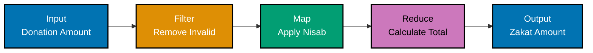
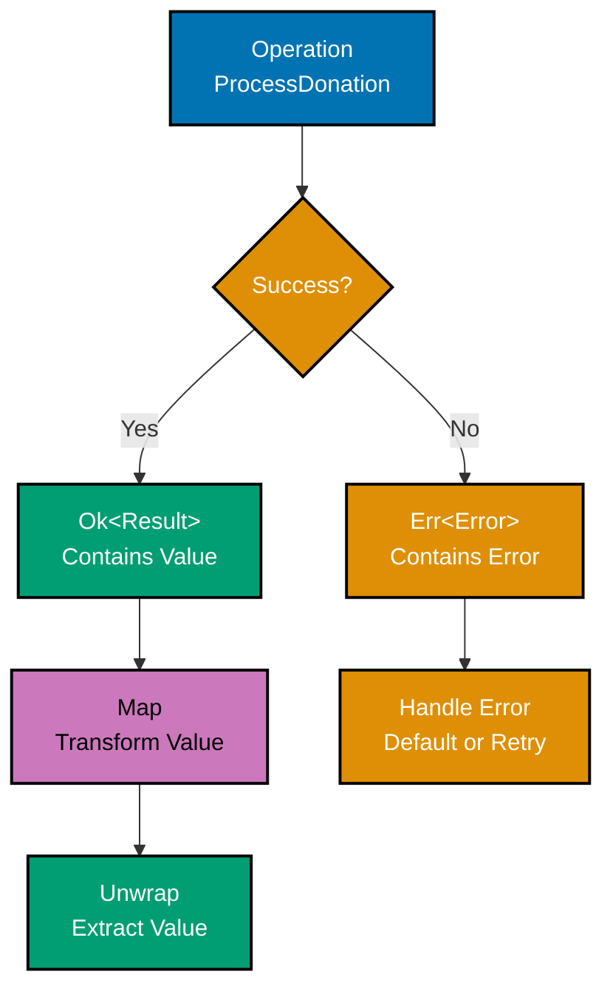
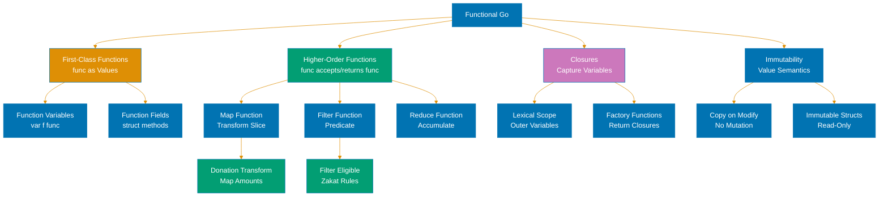
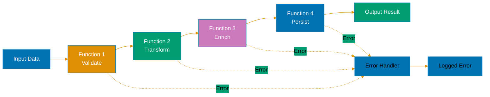

# Functional Programming in Go

**Quick Reference**: [Overview](#overview) | [Why Functional Programming in Go?](#why-functional-programming-in-go) | [Functional Programming Fundamentals](#functional-programming-fundamentals) | [Closures](#closures) | [Higher-Order Functions](#higher-order-functions) | [Function Composition](#function-composition) | [Functional Options Pattern](#functional-options-pattern) | [Currying and Partial Application](#currying-and-partial-application) | [Monadic Patterns (Limited)](#monadic-patterns-limited) | [Recursion](#recursion) | [Lazy Evaluation](#lazy-evaluation) | [Functional Programming with Generics](#functional-programming-with-generics) | [Best Practices](#best-practices) | [Common Pitfalls](#common-pitfalls) | [Related Documentation](#related-documentation) | [Further Reading](#further-reading)

## Overview

Functional Programming (FP) is a programming paradigm that treats computation as the evaluation of mathematical functions and avoids changing state and mutable data. While Go is primarily an imperative language with object-oriented features, it supports several functional programming concepts through first-class functions, closures, and higher-order functions.

Go's approach to functional programming is pragmatic rather than pure. It provides the tools for functional patterns where they make sense, while maintaining its core philosophy of simplicity and practicality. This document explores functional programming techniques in Go, their appropriate use cases, and how they integrate with idiomatic Go code.

## Why Functional Programming in Go?

**Benefits**:

- **Testability**: Pure functions are easy to test in isolation
- **Concurrency**: Immutable data eliminates race conditions
- **Composability**: Small functions can be combined to build complex behavior
- **Code reuse**: Higher-order functions enable generic operations

**Limitations in Go**:

- No built-in map/filter/reduce for slices (before generics)
- No tail call optimization
- No pattern matching (use type switches instead)
- Limited type inference compared to pure FP languages
- Imperative style often more idiomatic

## Functional Programming Fundamentals

### Pure Functions

Pure functions have two key properties:

1. **Deterministic**: Same inputs always produce same outputs
2. **No side effects**: Don't modify external state or perform I/O

```go
// Pure function - deterministic, no side effects
func Add(a, b int) int {
    return a + b
}

// Pure function - result depends only on inputs
func CalculateDiscount(price float64, percentage float64) float64 {
    return price * (1 - percentage/100)
}

// Impure function - depends on external state
var zakatRate = 0.08 // global state

func CalculateTotalImpure(price float64) float64 {
    return price * (1 + zakatRate) // depends on global variable
}

// Pure version - tax rate passed as parameter
func CalculateTotal(price float64, zakatRate float64) float64 {
    return price * (1 + zakatRate)
}

// Impure function - has side effects
func LogAndAdd(a, b int) int {
    fmt.Println("Adding:", a, b) // side effect: I/O
    return a + b
}
```

### Immutability

Immutability means data cannot be changed after creation. Go doesn't enforce immutability, but you can design for it.

```go
// Mutable approach (avoid in FP)
type Point struct {
    X, Y int
}

func (p *Point) Move(dx, dy int) {
    p.X += dx  // mutates existing point
    p.Y += dy
}

// Immutable approach (FP style)
type ImmutablePoint struct {
    X, Y int
}

func (p ImmutablePoint) Move(dx, dy int) ImmutablePoint {
    return ImmutablePoint{
        X: p.X + dx,  // returns new point
        Y: p.Y + dy,
    }
}

// Usage comparison
func Example() {
    // Mutable
    mutableP := &Point{X: 0, Y: 0}
    mutableP.Move(10, 20)
    // Original point is modified

    // Immutable
    immutableP := ImmutablePoint{X: 0, Y: 0}
    newP := immutableP.Move(10, 20)
    // Original point unchanged, new point created
    fmt.Println(immutableP) // {0 0}
    fmt.Println(newP)       // {10 20}
}
```

### First-Class Functions

In Go, functions are first-class citizens: they can be assigned to variables, passed as arguments, and returned from other functions.

```go
// Function as variable
var add func(int, int) int = func(a, b int) int {
    return a + b
}

// Function as parameter
func Apply(fn func(int, int) int, a, b int) int {
    return fn(a, b)
}

// Function as return value
func MakeAdder(x int) func(int) int {
    return func(y int) int {
        return x + y
    }
}

// Usage
func Example() {
    result := Apply(add, 5, 3) // 8

    add5 := MakeAdder(5)
    result = add5(10) // 15
}
```

## Closures

Closures are functions that reference variables from outside their body. The function "closes over" these variables.

### Basic Closures

```go
// Closure capturing variable
func Counter() func() int {
    count := 0
    return func() int {
        count++  // captures and modifies count
        return count
    }
}

func Example() {
    counter1 := Counter()
    fmt.Println(counter1()) // 1
    fmt.Println(counter1()) // 2
    fmt.Println(counter1()) // 3

    counter2 := Counter()
    fmt.Println(counter2()) // 1 (separate closure)
}
```

### Closure Use Cases

```go
// Configuration closure
func NewLogger(prefix string) func(string) {
    return func(message string) {
        fmt.Printf("[%s] %s\n", prefix, message)
    }
}

func Example() {
    errorLog := NewLogger("ERROR")
    infoLog := NewLogger("INFO")

    errorLog("Database connection failed")  // [ERROR] Database connection failed
    infoLog("Server started successfully")  // [INFO] Server started successfully
}

// Closure for deferred cleanup
func ProcessFile(filename string) error {
    file, err := os.Open(filename)
    if err != nil {
        return err
    }
    defer file.Close()  // closure captures file variable

    // Process file...
    return nil
}

// Closure for filtering
func MakePredicate(nisab int) func(int) bool {
    return func(value int) bool {
        return value > nisab
    }
}

func FilterInts(slice []int, predicate func(int) bool) []int {
    result := make([]int, 0)
    for _, v := range slice {
        if predicate(v) {
            result = append(result, v)
        }
    }
    return result
}

func Example() {
    numbers := []int{1, 5, 10, 15, 20}
    greaterThan10 := MakePredicate(10)
    filtered := FilterInts(numbers, greaterThan10) // [15, 20]
}
```

### Closure Gotchas

```go
// Common mistake: loop variable capture (Go 1.21 and earlier)
func MakeClosures() []func() int {
    funcs := make([]func() int, 3)
    for i := 0; i < 3; i++ {
        // In Go 1.21 and earlier, this captures the loop variable i
        // All closures reference the same variable
        funcs[i] = func() int {
            return i
        }
    }
    return funcs
}

func Example_Old() {
    funcs := MakeClosures()
    for _, fn := range funcs {
        fmt.Println(fn()) // Go 1.21-: prints 3, 3, 3
                          // Go 1.22+: prints 0, 1, 2
    }
}

// Fix for Go 1.21 and earlier: copy variable
func MakeClosuresSafe() []func() int {
    funcs := make([]func() int, 3)
    for i := 0; i < 3; i++ {
        i := i // Create new variable in loop scope
        funcs[i] = func() int {
            return i
        }
    }
    return funcs
}
```

## Higher-Order Functions

Higher-order functions take functions as arguments or return functions as results.

### Map Pattern

```go
// Map: transform each element
func Map[T, U any](slice []T, fn func(T) U) []U {
    result := make([]U, len(slice))
    for i, v := range slice {
        result[i] = fn(v)
    }
    return result
}

func Example() {
    numbers := []int{1, 2, 3, 4, 5}

    // Square each number
    squared := Map(numbers, func(n int) int {
        return n * n
    }) // [1, 4, 9, 16, 25]

    // Convert to strings
    strings := Map(numbers, func(n int) string {
        return fmt.Sprintf("Number: %d", n)
    })
}
```

### Filter Pattern

```go
// Filter: keep elements that match predicate
func Filter[T any](slice []T, predicate func(T) bool) []T {
    result := make([]T, 0)
    for _, v := range slice {
        if predicate(v) {
            result = append(result, v)
        }
    }
    return result
}

func Example() {
    numbers := []int{1, 2, 3, 4, 5, 6, 7, 8, 9, 10}

    // Keep only even numbers
    evens := Filter(numbers, func(n int) bool {
        return n%2 == 0
    }) // [2, 4, 6, 8, 10]

    // Keep numbers greater than 5
    greaterThan5 := Filter(numbers, func(n int) bool {
        return n > 5
    }) // [6, 7, 8, 9, 10]
}
```

### Reduce Pattern

```go
// Reduce: accumulate values into single result
func Reduce[T, U any](slice []T, initial U, fn func(U, T) U) U {
    result := initial
    for _, v := range slice {
        result = fn(result, v)
    }
    return result
}

func Example() {
    numbers := []int{1, 2, 3, 4, 5}

    // Sum all numbers
    sum := Reduce(numbers, 0, func(acc, n int) int {
        return acc + n
    }) // 15

    // Product of all numbers
    product := Reduce(numbers, 1, func(acc, n int) int {
        return acc * n
    }) // 120

    // Concatenate strings
    words := []string{"Hello", "functional", "world"}
    sentence := Reduce(words, "", func(acc, word string) string {
        if acc == "" {
            return word
        }
        return acc + " " + word
    }) // "Hello functional world"
}
```

### Combining Higher-Order Functions

```go
func Example() {
    numbers := []int{1, 2, 3, 4, 5, 6, 7, 8, 9, 10}

    // Sum of squares of even numbers
    result := Reduce(
        Map(
            Filter(numbers, func(n int) bool {
                return n%2 == 0  // keep evens
            }),
            func(n int) int {
                return n * n  // square each
            },
        ),
        0,
        func(acc, n int) int {
            return acc + n  // sum all
        },
    )
    fmt.Println(result) // 2^2 + 4^2 + 6^2 + 8^2 + 10^2 = 220
}
```

## Function Composition

Function composition combines simple functions to build more complex ones.



### Basic Composition

```go
// Compose two functions: f(g(x))
func Compose[A, B, C any](f func(B) C, g func(A) B) func(A) C {
    return func(x A) C {
        return f(g(x))
    }
}

func Example() {
    // Define simple functions
    double := func(x int) int { return x * 2 }
    addTen := func(x int) int { return x + 10 }

    // Compose: double then add ten
    doubleAndAddTen := Compose(addTen, double)
    result := doubleAndAddTen(5) // double(5) = 10, then 10+10 = 20
}
```

### Pipe Pattern

```go
// Pipe: chain multiple functions left-to-right
type Pipeline[T any] struct {
    value T
}

func Pipe[T any](value T) Pipeline[T] {
    return Pipeline[T]{value: value}
}

func (p Pipeline[T]) Then(fn func(T) T) Pipeline[T] {
    return Pipeline[T]{value: fn(p.value)}
}

func (p Pipeline[T]) Value() T {
    return p.value
}

func Example() {
    double := func(x int) int { return x * 2 }
    addTen := func(x int) int { return x + 10 }
    square := func(x int) int { return x * x }

    result := Pipe(5).
        Then(double).   // 10
        Then(addTen).   // 20
        Then(square).   // 400
        Value()

    fmt.Println(result) // 400
}
```

### Middleware Pattern


```go
type Handler func(http.ResponseWriter, *http.Request)

// Middleware wraps a handler with additional functionality
type Middleware func(Handler) Handler

// Compose middlewares
func ChainMiddleware(h Handler, middlewares ...Middleware) Handler {
    for i := len(middlewares) - 1; i >= 0; i-- {
        h = middlewares[i](h)
    }
    return h
}

// Example middlewares
func LoggingMiddleware(next Handler) Handler {
    return func(w http.ResponseWriter, r *http.Request) {
        fmt.Printf("Request: %s %s\n", r.Method, r.URL.Path)
        next(w, r)
    }
}

func AuthMiddleware(next Handler) Handler {
    return func(w http.ResponseWriter, r *http.Request) {
        token := r.Header.Get("Authorization")
        if token == "" {
            http.Error(w, "Unauthorized", http.StatusUnauthorized)
            return
        }
        next(w, r)
    }
}

func Example() {
    handler := func(w http.ResponseWriter, r *http.Request) {
        w.Write([]byte("Hello, World!"))
    }

    // Compose middlewares
    wrapped := ChainMiddleware(
        handler,
        LoggingMiddleware,
        AuthMiddleware,
    )

    http.HandleFunc("/", wrapped)
}
```

## Functional Options Pattern

The functional options pattern uses higher-order functions for configuration.

### Basic Options Pattern

```go
type Server struct {
    host    string
    port    int
    timeout time.Duration
}

// Option is a function that modifies Server
type Option func(*Server)

// Constructor with variadic options
func NewServer(opts ...Option) *Server {
    // Default values
    s := &Server{
        host:    "localhost",
        port:    8080,
        timeout: 30 * time.Second,
    }

    // Apply options
    for _, opt := range opts {
        opt(s)
    }

    return s
}

// Option constructors
func WithHost(host string) Option {
    return func(s *Server) {
        s.host = host
    }
}

func WithPort(port int) Option {
    return func(s *Server) {
        s.port = port
    }
}

func WithTimeout(timeout time.Duration) Option {
    return func(s *Server) {
        s.timeout = timeout
    }
}

// Usage
func Example() {
    // Default server
    server1 := NewServer()

    // Custom configuration
    server2 := NewServer(
        WithHost("example.com"),
        WithPort(9090),
        WithTimeout(60 * time.Second),
    )
}
```

### Options with Validation

```go
type Option func(*Server) error

func NewServer(opts ...Option) (*Server, error) {
    s := &Server{
        host:    "localhost",
        port:    8080,
        timeout: 30 * time.Second,
    }

    for _, opt := range opts {
        if err := opt(s); err != nil {
            return nil, err
        }
    }

    return s, nil
}

func WithPort(port int) Option {
    return func(s *Server) error {
        if port <= 0 || port > 65535 {
            return fmt.Errorf("invalid port: %d", port)
        }
        s.port = port
        return nil
    }
}

func WithTimeout(timeout time.Duration) Option {
    return func(s *Server) error {
        if timeout < 0 {
            return fmt.Errorf("timeout must be positive")
        }
        s.timeout = timeout
        return nil
    }
}
```

## Currying and Partial Application

### Currying

Currying transforms a function with multiple arguments into a chain of functions with single arguments.

```go
// Not curried: f(a, b, c)
func Add3(a, b, c int) int {
    return a + b + c
}

// Curried: f(a)(b)(c)
func Add3Curried(a int) func(int) func(int) int {
    return func(b int) func(int) int {
        return func(c int) int {
            return a + b + c
        }
    }
}

func Example() {
    // Direct call
    result1 := Add3(1, 2, 3) // 6

    // Curried call
    result2 := Add3Curried(1)(2)(3) // 6

    // Partial application
    add1 := Add3Curried(1)
    add1and2 := add1(2)
    result3 := add1and2(3) // 6
}
```

### Partial Application

```go
// Partial application: fix some arguments
func Multiply(a, b int) int {
    return a * b
}

// Create specialized version
func MakeMultiplier(factor int) func(int) int {
    return func(x int) int {
        return Multiply(factor, x)
    }
}

func Example() {
    double := MakeMultiplier(2)
    triple := MakeMultiplier(3)

    fmt.Println(double(5)) // 10
    fmt.Println(triple(5)) // 15
}

// Generic partial application
func Partial2[A, B, R any](fn func(A, B) R, a A) func(B) R {
    return func(b B) R {
        return fn(a, b)
    }
}

func Example_Generic() {
    add := func(a, b int) int { return a + b }
    add5 := Partial2(add, 5)

    fmt.Println(add5(10)) // 15
    fmt.Println(add5(20)) // 25
}
```

## Monadic Patterns (Limited)

Go doesn't have monads in the Haskell sense, but we can implement similar patterns.



### Option/Maybe Pattern

```go
// Option represents an optional value
type Option[T any] struct {
    value *T
}

// Some creates an Option with a value
func Some[T any](value T) Option[T] {
    return Option[T]{value: &value}
}

// None creates an empty Option
func None[T any]() Option[T] {
    return Option[T]{value: nil}
}

// IsSome checks if Option has a value
func (o Option[T]) IsSome() bool {
    return o.value != nil
}

// IsNone checks if Option is empty
func (o Option[T]) IsNone() bool {
    return o.value == nil
}

// Unwrap returns the value or panics
func (o Option[T]) Unwrap() T {
    if o.IsNone() {
        panic("called Unwrap on None")
    }
    return *o.value
}

// UnwrapOr returns the value or a default
func (o Option[T]) UnwrapOr(defaultValue T) T {
    if o.IsNone() {
        return defaultValue
    }
    return *o.value
}

// Map applies a function to the value if present
func (o Option[T]) Map(fn func(T) T) Option[T] {
    if o.IsNone() {
        return None[T]()
    }
    return Some(fn(*o.value))
}

// Example usage
func Divide(a, b float64) Option[float64] {
    if b == 0 {
        return None[float64]()
    }
    return Some(a / b)
}

func Example() {
    result1 := Divide(10, 2)
    if result1.IsSome() {
        fmt.Println(result1.Unwrap()) // 5
    }

    result2 := Divide(10, 0)
    fmt.Println(result2.UnwrapOr(0)) // 0 (default)

    // Chain operations
    result3 := Divide(100, 10).
        Map(func(x float64) float64 { return x * 2 }).  // 20
        Map(func(x float64) float64 { return x + 5 })   // 25

    fmt.Println(result3.Unwrap()) // 25
}
```

### Result/Either Pattern

```go
// Result represents a value or an error
type Result[T any] struct {
    value *T
    err   error
}

// Ok creates a successful Result
func Ok[T any](value T) Result[T] {
    return Result[T]{value: &value, err: nil}
}

// Err creates a failed Result
func Err[T any](err error) Result[T] {
    return Result[T]{value: nil, err: err}
}

// IsOk checks if Result is successful
func (r Result[T]) IsOk() bool {
    return r.err == nil
}

// IsErr checks if Result is an error
func (r Result[T]) IsErr() bool {
    return r.err != nil
}

// Unwrap returns the value or panics
func (r Result[T]) Unwrap() T {
    if r.IsErr() {
        panic(r.err)
    }
    return *r.value
}

// UnwrapOr returns the value or a default
func (r Result[T]) UnwrapOr(defaultValue T) T {
    if r.IsErr() {
        return defaultValue
    }
    return *r.value
}

// Map applies a function if Result is Ok
func (r Result[T]) Map(fn func(T) T) Result[T] {
    if r.IsErr() {
        return Err[T](r.err)
    }
    return Ok(fn(*r.value))
}

// MapErr transforms the error
func (r Result[T]) MapErr(fn func(error) error) Result[T] {
    if r.IsOk() {
        return r
    }
    return Err[T](fn(r.err))
}

// Example usage
func ParseInt(s string) Result[int] {
    value, err := strconv.Atoi(s)
    if err != nil {
        return Err[int](err)
    }
    return Ok(value)
}

func Example() {
    result1 := ParseInt("42")
    if result1.IsOk() {
        fmt.Println(result1.Unwrap()) // 42
    }

    result2 := ParseInt("invalid")
    fmt.Println(result2.UnwrapOr(0)) // 0 (default)

    // Chain operations
    result3 := ParseInt("10").
        Map(func(x int) int { return x * 2 }).  // 20
        Map(func(x int) int { return x + 5 })   // 25

    if result3.IsOk() {
        fmt.Println(result3.Unwrap()) // 25
    }
}
```

## Recursion

### Basic Recursion

```go
// Factorial using recursion
func Factorial(n int) int {
    if n <= 1 {
        return 1
    }
    return n * Factorial(n-1)
}

// Fibonacci using recursion
func Fibonacci(n int) int {
    if n <= 1 {
        return n
    }
    return Fibonacci(n-1) + Fibonacci(n-2)
}

// Binary search using recursion
func BinarySearch(arr []int, target, left, right int) int {
    if left > right {
        return -1 // not found
    }

    mid := left + (right-left)/2
    if arr[mid] == target {
        return mid
    } else if arr[mid] > target {
        return BinarySearch(arr, target, left, mid-1)
    } else {
        return BinarySearch(arr, target, mid+1, right)
    }
}
```

### Tail Recursion (Limited Support)

Go does not optimize tail calls, so tail-recursive functions can still overflow the stack.

```go
// Tail-recursive factorial (not optimized in Go)
func FactorialTail(n, acc int) int {
    if n <= 1 {
        return acc
    }
    return FactorialTail(n-1, n*acc) // tail call
}

// Iterative version (preferred in Go)
func FactorialIterative(n int) int {
    acc := 1
    for i := 2; i <= n; i++ {
        acc *= i
    }
    return acc
}
```

### Recursion with Memoization

```go
// Fibonacci with memoization
func FibonacciMemo() func(int) int {
    cache := make(map[int]int)

    var fib func(int) int
    fib = func(n int) int {
        if n <= 1 {
            return n
        }

        // Check cache
        if val, ok := cache[n]; ok {
            return val
        }

        // Calculate and cache
        result := fib(n-1) + fib(n-2)
        cache[n] = result
        return result
    }

    return fib
}

func Example() {
    fib := FibonacciMemo()
    fmt.Println(fib(50)) // Efficiently computes large Fibonacci numbers
}
```

## Lazy Evaluation

Go is eagerly evaluated, but we can simulate lazy evaluation using closures and channels.

### Lazy Values

```go
// Lazy value using closure
type Lazy[T any] struct {
    thunk  func() T
    cached *T
}

func NewLazy[T any](fn func() T) *Lazy[T] {
    return &Lazy[T]{thunk: fn}
}

func (l *Lazy[T]) Force() T {
    if l.cached == nil {
        value := l.thunk()
        l.cached = &value
    }
    return *l.cached
}

func Example() {
    // Expensive computation
    expensive := NewLazy(func() int {
        fmt.Println("Computing...")
        return 42
    })

    // Not computed yet
    fmt.Println("Lazy value created")

    // Computed on first access
    fmt.Println(expensive.Force()) // Prints "Computing..." then "42"

    // Cached on subsequent access
    fmt.Println(expensive.Force()) // Just prints "42"
}
```

### Lazy Sequences with Iterators (Go 1.23+)

```go
import "iter"

// Infinite sequence generator
func Integers() iter.Seq[int] {
    return func(yield func(int) bool) {
        for i := 0; ; i++ {
            if !yield(i) {
                return
            }
        }
    }
}

// Take first n elements
func Take[T any](seq iter.Seq[T], n int) iter.Seq[T] {
    return func(yield func(T) bool) {
        count := 0
        for v := range seq {
            if count >= n {
                return
            }
            if !yield(v) {
                return
            }
            count++
        }
    }
}

func Example() {
    // Take first 10 integers
    for i := range Take(Integers(), 10) {
        fmt.Println(i) // 0, 1, 2, ..., 9
    }
}
```

### Lazy Sequences with Channels

```go
// Generate infinite sequence
func Integers() <-chan int {
    ch := make(chan int)
    go func() {
        for i := 0; ; i++ {
            ch <- i
        }
    }()
    return ch
}

// Take first n elements
func Take[T any](ch <-chan T, n int) <-chan T {
    out := make(chan T)
    go func() {
        defer close(out)
        for i := 0; i < n; i++ {
            out <- <-ch
        }
    }()
    return out
}

func Example() {
    numbers := Take(Integers(), 10)
    for n := range numbers {
        fmt.Println(n) // 0, 1, 2, ..., 9
    }
}
```

## Functional Programming with Generics

Generics (Go 1.18+) enable type-safe functional programming patterns.

### Generic Higher-Order Functions

```go
// Map with generics
func Map[T, U any](slice []T, fn func(T) U) []U {
    result := make([]U, len(slice))
    for i, v := range slice {
        result[i] = fn(v)
    }
    return result
}

// Filter with generics
func Filter[T any](slice []T, predicate func(T) bool) []T {
    result := make([]T, 0)
    for _, v := range slice {
        if predicate(v) {
            result = append(result, v)
        }
    }
    return result
}

// Reduce with generics
func Reduce[T, U any](slice []T, initial U, fn func(U, T) U) U {
    result := initial
    for _, v := range slice {
        result = fn(result, v)
    }
    return result
}

func Example() {
    numbers := []int{1, 2, 3, 4, 5}

    // Map: int -> string
    strings := Map(numbers, func(n int) string {
        return fmt.Sprintf("num-%d", n)
    })

    // Filter: keep evens
    evens := Filter(numbers, func(n int) bool {
        return n%2 == 0
    })

    // Reduce: sum
    sum := Reduce(numbers, 0, func(acc, n int) int {
        return acc + n
    })
}
```

### Generic Functional Containers

```go
// Functor-like container
type Functor[T any] struct {
    value T
}

func NewFunctor[T any](value T) Functor[T] {
    return Functor[T]{value: value}
}

func (f Functor[T]) Map[U any](fn func(T) U) Functor[U] {
    return Functor[U]{value: fn(f.value)}
}

func (f Functor[T]) Value() T {
    return f.value
}

func Example() {
    result := NewFunctor(5).
        Map(func(x int) int { return x * 2 }).   // 10
        Map(func(x int) int { return x + 3 }).   // 13
        Map(func(x int) string { return fmt.Sprintf("Result: %d", x) })

    fmt.Println(result.Value()) // "Result: 13"
}
```

## Best Practices

### When to Use Functional Programming

**Use FP when**:

- Building reusable, composable operations (map, filter, reduce)
- Implementing configuration patterns (functional options)
- Creating middleware chains
- Working with immutable data structures
- Writing testable, pure functions
- Simplifying concurrent code (immutable data eliminates races)

**Avoid FP when**:

- Simple imperative code is clearer (for loops vs map/filter chains)
- Performance is critical (allocations from closures)
- Deep recursion (no tail call optimization)
- The team is unfamiliar with FP concepts

### Balancing FP and Idiomatic Go

```go
// Over-engineered FP (avoid)
result := Reduce(
    Map(
        Filter(numbers, isEven),
        square,
    ),
    0,
    add,
)

// Idiomatic Go (prefer)
sum := 0
for _, n := range numbers {
    if n%2 == 0 {
        sum += n * n
    }
}
```

### Performance Considerations

```go
// Functional style: multiple passes, allocations
func ProcessFunctional(numbers []int) int {
    return Reduce(
        Map(
            Filter(numbers, func(n int) bool { return n%2 == 0 }),
            func(n int) int { return n * n },
        ),
        0,
        func(acc, n int) int { return acc + n },
    )
}

// Imperative style: single pass, no allocations
func ProcessImperative(numbers []int) int {
    sum := 0
    for _, n := range numbers {
        if n%2 == 0 {
            sum += n * n
        }
    }
    return sum
}

// Benchmark results show imperative is faster for simple operations
```

### Guidelines

1. **Prefer simplicity**: Use FP when it simplifies code, not for its own sake
2. **Avoid deep nesting**: Limit function composition depth for readability
3. **Document higher-order functions**: Explain what the function parameter does
4. **Use generics judiciously**: Generic functions are powerful but can be hard to debug
5. **Consider performance**: Profile before optimizing, but be aware FP has overhead
6. **Test pure functions**: Pure functions are easy to test - take advantage
7. **Embrace Go idioms**: Don't force FP patterns that fight Go's design

## Common Pitfalls

### Over-Engineering with FP

```go
// Overly functional - hard to read
func ProcessData(data []Data) []Result {
    return Map(
        Filter(
            Map(data, Transform),
            Validate,
        ),
        Convert,
    )
}

// Clearer imperative version
func ProcessData(data []Data) []Result {
    var results []Result
    for _, d := range data {
        transformed := Transform(d)
        if Validate(transformed) {
            results = append(results, Convert(transformed))
        }
    }
    return results
}
```

### Closure Variable Capture

```go
// Wrong: captures loop variable (Go 1.21-)
for i := 0; i < 3; i++ {
    go func() {
        fmt.Println(i) // All print 3
    }()
}

// Correct: copy variable
for i := 0; i < 3; i++ {
    i := i // Create new variable
    go func() {
        fmt.Println(i) // Prints 0, 1, 2
    }()
}

// Note: Go 1.22+ fixes this automatically
```

### Performance Overhead

```go
// Closure allocation overhead
func CreateAdders(n int) []func(int) int {
    adders := make([]func(int) int, n)
    for i := 0; i < n; i++ {
        i := i
        adders[i] = func(x int) int {
            return x + i  // Closure captures i
        }
    }
    return adders // Each closure allocates memory
}

// More efficient: pass value directly
func Add(x, y int) int {
    return x + y
}
```

### Inappropriate Recursion

```go
// Stack overflow risk: deep recursion
func SumRecursive(nums []int) int {
    if len(nums) == 0 {
        return 0
    }
    return nums[0] + SumRecursive(nums[1:]) // Can overflow
}

// Better: use iteration
func SumIterative(nums []int) int {
    sum := 0
    for _, n := range nums {
        sum += n
    }
    return sum
}
```

## Related Documentation

- [Idioms](./ex-so-prla-go__idioms.md) - Go-specific patterns including functional options
- [Type Safety](./ex-so-prla-go__type-safety.md) - Generics enabling functional patterns
- [Best Practices](./ex-so-prla-go__best-practices.md) - When to use functional programming
- [Concurrency and Parallelism](./ex-so-prla-go__concurrency-and-parallelism.md) - Closures with goroutines

## Further Reading

- [Effective Go](https://go.dev/doc/effective_go) - Official Go programming guide
- [Go Proverbs](https://go-proverbs.github.io/) - Rob Pike's Go philosophy
- [Functional Options Pattern](https://dave.cheney.net/2014/10/17/functional-options-for-friendly-apis) - Dave Cheney
- [Go Generics Proposal](https://go.dev/blog/generics-proposal) - Type parameters design

---

**Last Updated**: 2026-01-23
**Go Version**: 1.21+ (baseline), 1.22+ (recommended), 1.23 (latest)
**Maintainers**: Platform Documentation Team

## Functional Patterns in Go



## Function Composition


