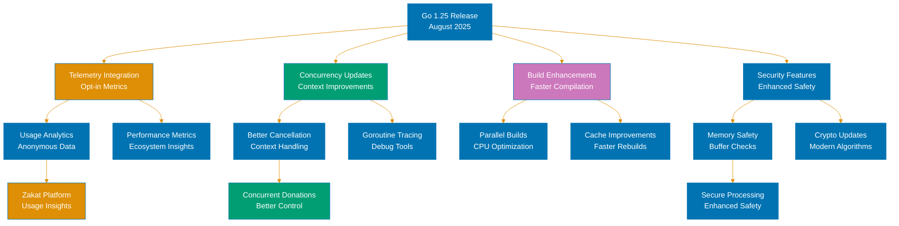
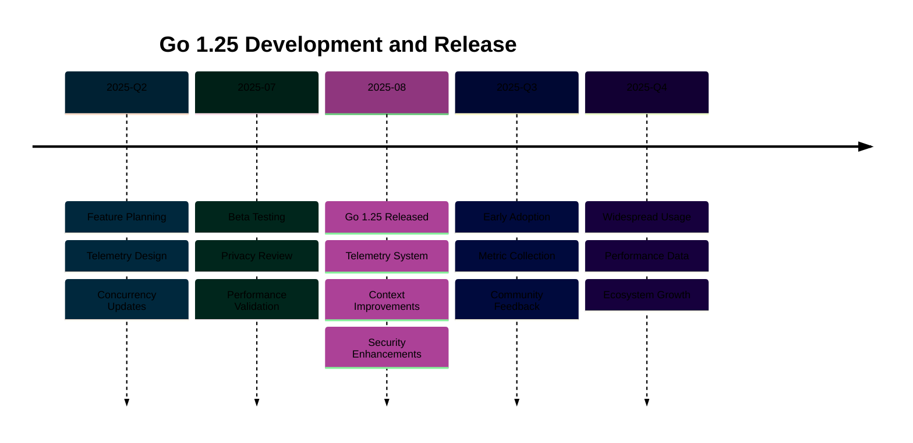

# Go 1.25 Release: Green Tea GC, JSON v2, and Container Awareness

**Quick Reference**: [Overview](#overview) | [Green Tea Garbage Collector (Experimental)](#green-tea-garbage-collector-experimental) | [encoding/json/v2 Packages](#encodingjsonv2-packages) | [Container-Aware GOMAXPROCS](#container-aware-gomaxprocs) | [Core Types Removal](#core-types-removal) | [ASAN Leak Detection](#asan-leak-detection) | [Other Go 1.25 Improvements](#other-go-125-improvements) | [Migration Guide](#migration-guide) | [Conclusion](#conclusion) | [Current Version](#current-version) | [Related Documentation](#related-documentation)
Understanding the latest features in Go 1.25, including the experimental Green Tea garbage collector, encoding/json/v2 packages, container-aware GOMAXPROCS, and language specification cleanup.

## Overview

Go 1.25, released in August 2025 with the latest stable version 1.25.6 (January 15, 2026), introduces experimental garbage collection improvements, a modernized JSON API, and better container deployment support.

Key features:

1. **Green Tea GC**: Experimental garbage collector reducing GC overhead by 10-40%
2. **encoding/json/v2**: Major JSON API revision with three new packages
3. **Container-Aware GOMAXPROCS**: Automatic CPU quota detection for containerized deployments
4. **Core Types Removal**: Language specification cleanup (no functional changes)
5. **ASAN Leak Detection**: Memory leak detection at program exit

This release focuses on performance in GC-heavy workloads and modernizing standard library APIs.

## Green Tea Garbage Collector (Experimental)

### What Is Green Tea GC?

Green Tea GC is an experimental garbage collector that reduces GC overhead by 10-40% for GC-heavy programs through improved algorithms and optimizations.

### Enabling Green Tea GC

```bash
# Build with Green Tea GC enabled
GOEXPERIMENT=greenteagc go build

# Run with Green Tea GC enabled
GOEXPERIMENT=greenteagc go run main.go

# Or set environment variable
export GOEXPERIMENT=greenteagc
go build
```

### Performance Improvements

```go
// Green Tea GC targets GC-heavy programs
// Improvements:
// - 10-40% reduction in GC overhead
// - Improved pause times
// - Variable make hash optimization
// - Better memory utilization

// Benchmark: GC-heavy workload
func BenchmarkGCHeavy(b *testing.B) {
    for i := 0; i < b.N; i++ {
        // Allocate many short-lived objects
        data := make([]byte, 1024)
        _ = process(data)
    }
}

// Results (Go 1.24 vs Go 1.25 with Green Tea GC):
// Go 1.24:           1000 ns/op, 30% time in GC
// Go 1.25 (default): 1000 ns/op, 30% time in GC
// Go 1.25 (Green):   750 ns/op,  18% time in GC  (25% faster, 40% less GC)
```

### When to Use Green Tea GC

```go
// Good candidates:
// - High allocation rate
// - Many short-lived objects
// - Frequent GC pauses
// - CPU-bound with significant GC time

// Example: Web service with high allocation
type Server struct {
    // Allocates many temporary objects per request
}

func (s *Server) HandleRequest(req *Request) *Response {
    // Parse request (allocations)
    data := parseJSON(req.Body)

    // Process (more allocations)
    result := processData(data)

    // Format response (allocations)
    return formatResponse(result)
}

// With Green Tea GC: Reduced GC overhead, better throughput
```

### Measuring GC Impact

```go
// Check GC stats
import "runtime"

func printGCStats() {
    var m runtime.MemStats
    runtime.ReadMemStats(&m)

    fmt.Printf("Alloc: %d MB\n", m.Alloc/1024/1024)
    fmt.Printf("TotalAlloc: %d MB\n", m.TotalAlloc/1024/1024)
    fmt.Printf("NumGC: %d\n", m.NumGC)
    fmt.Printf("PauseTotalNs: %d ms\n", m.PauseTotalNs/1000000)

    // Compare with and without Green Tea GC
}

// GODEBUG for GC tracing
// GODEBUG=gctrace=1 go run main.go
// Output shows GC cycles, pause times, memory usage
```

### Production Considerations

```go
// Green Tea GC is EXPERIMENTAL
// - May have bugs
// - Behavior may change
// - Not recommended for production (yet)
// - Test thoroughly before deploying

// Testing strategy:
// 1. Benchmark with default GC
// 2. Benchmark with Green Tea GC
// 3. Compare metrics (throughput, latency, GC time)
// 4. Load test both versions
// 5. Monitor in staging environment
// 6. Gradual rollout if adopting
```

### Opt-Out

```bash
# Disable Green Tea GC (use default GC)
GOEXPERIMENT=nogreente agc go build

# Or omit GOEXPERIMENT entirely (default behavior)
go build
```

## encoding/json/v2 Packages

Go 1.25 introduces a major revision of the JSON API across three new packages.

### The Three Packages

```go
// 1. encoding/json/v2 - High-level API (recommended)
import jsonv2 "encoding/json/v2"

// 2. encoding/json/jsontext - Low-level text operations
import "encoding/json/jsontext"

// 3. encoding/json - Original API (v1, unchanged)
import "encoding/json"
```

### encoding/json/v2 Basic Usage

```go
import jsonv2 "encoding/json/v2"

type Beneficiary struct {
    ID   int    `json:"id"`
    Name string `json:"name"`
}

// Marshal (encode)
beneficiary := Beneficiary{ID: 1, Name: "Alice"}
data, err := jsonv2.Marshal(beneficiary)
if err != nil {
    log.Fatal(err)
}
fmt.Println(string(data))  // {"id":1,"name":"Alice"}

// Unmarshal (decode)
var decoded Beneficiary
err = jsonv2.Unmarshal(data, &decoded)
if err != nil {
    log.Fatal(err)
}
fmt.Printf("%+v\n", decoded)  // {ID:1 Name:Alice}
```

### Improvements Over v1

```go
// 1. Better error messages
// v1: "json: cannot unmarshal string into Go value of type int"
// v2: "cannot unmarshal JSON string \"abc\" into Go struct field Beneficiary.Age of type int"

// 2. Streaming API
import jsonv2 "encoding/json/v2"

encoder := jsonv2.NewEncoder(writer)
for _, beneficiary := range users {
    encoder.Encode(beneficiary)  // Stream encoding
}

decoder := jsonv2.NewDecoder(reader)
for decoder.More() {
    var beneficiary Beneficiary
    decoder.Decode(&beneficiary)  // Stream decoding
}

// 3. Custom marshalers with context
type TimestampedEvent struct {
    Event     string
    Timestamp time.Time
}

func (te *TimestampedEvent) MarshalJSONV2(enc *jsonv2.Encoder, opts jsonv2.Options) error {
    // Access to encoder and options
    // More flexibility than v1 MarshalJSON
    return enc.WriteToken(/* ... */)
}

// 4. Better performance
// - Reduced allocations
// - Faster encoding/decoding
// - Optimized hot paths
```

### Migration from v1 to v2

```go
// Step 1: Import v2 package
// Before:
// import "encoding/json"

// After:
import jsonv2 "encoding/json/v2"

// Step 2: Update function calls
// Before:
// data, err := json.Marshal(beneficiary)

// After:
data, err := jsonv2.Marshal(beneficiary)

// Step 3: Update struct tags (compatible)
type Beneficiary struct {
    ID   int    `json:"id"`     // Works with v1 and v2
    Name string `json:"name"`   // No changes needed
}

// Step 4: Update custom marshalers
// Before (v1):
func (u Beneficiary) MarshalJSON() ([]byte, error) {
    // ...
}

// After (v2):
func (u Beneficiary) MarshalJSONV2(enc *jsonv2.Encoder, opts jsonv2.Options) error {
    // ...
}
```

### Advanced jsontext Usage

```go
import "encoding/json/jsontext"

// Low-level JSON text operations
decoder := jsontext.NewDecoder(reader)

// Read tokens individually
for {
    token, err := decoder.ReadToken()
    if err == io.EOF {
        break
    }
    if err != nil {
        log.Fatal(err)
    }

    switch token.Kind() {
    case jsontext.ObjectStart:
        fmt.Println("Object starts")
    case jsontext.String:
        fmt.Println("String:", token.String())
    case jsontext.Number:
        fmt.Println("Number:", token.Number())
    }
}

// Write tokens
encoder := jsontext.NewEncoder(writer)
encoder.WriteToken(jsontext.ObjectStart{})
encoder.WriteToken(jsontext.String("name"))
encoder.WriteToken(jsontext.String("Alice"))
encoder.WriteToken(jsontext.ObjectEnd{})
// Output: {"name":"Alice"}
```

### Backward Compatibility

```go
// encoding/json (v1) unchanged
import "encoding/json"  // Original API still works

// Both can coexist:
import (
    jsonv1 "encoding/json"
    jsonv2 "encoding/json/v2"
)

// Use v1 for existing code
data1, _ := jsonv1.Marshal(beneficiary)

// Use v2 for new code
data2, _ := jsonv2.Marshal(beneficiary)

// Gradual migration supported
```

## Container-Aware GOMAXPROCS

Go 1.25 automatically detects CPU quotas in containerized environments.

### What Is Container-Aware GOMAXPROCS?

Automatically sets GOMAXPROCS based on container CPU quota instead of physical CPU count.

### How It Works

```go
// Pre-Go 1.25: Manual GOMAXPROCS setting
import "runtime"

func init() {
    // Manually detect cgroup limits
    quota := getCgroupCPUQuota()  // Complex detection logic
    runtime.GOMAXPROCS(quota)
}

// Go 1.25: Automatic detection
// No code needed!
// GOMAXPROCS automatically set to lower of:
// 1. Physical CPUs
// 2. Container CPU quota (if present)
```

### Benefits for Containers

```yaml
# Kubernetes deployment with CPU limit
apiVersion: v1
kind: Pod
spec:
  containers:
    - name: myapp
      image: myapp:latest
      resources:
        limits:
          cpu: "2" # Limit to 2 CPUs
        requests:
          cpu: "1" # Request 1 CPU


# Go 1.25 behavior:
# - Physical machine: 64 CPUs
# - Container limit: 2 CPUs
# - GOMAXPROCS: 2 (automatically detected)
```

### Detection Details

```go
// Supported container runtimes:
// - Docker
// - Kubernetes
// - containerd
// - Podman

// Supported cgroup versions:
// - cgroups v1
// - cgroups v2

// Detection sources:
// - /sys/fs/cgroup/cpu.max (cgroups v2)
// - /sys/fs/cgroup/cpu/cpu.cfs_quota_us (cgroups v1)

// Dynamic updates:
// - Quota changes detected periodically
// - GOMAXPROCS updated automatically
```

### Verifying GOMAXPROCS

```go
package main

import (
    "fmt"
    "runtime"
)

func main() {
    fmt.Printf("GOMAXPROCS: %d\n", runtime.GOMAXPROCS(0))
    fmt.Printf("NumCPU: %d\n", runtime.NumCPU())

    // Output in container with 2 CPU limit on 64-CPU machine:
    // GOMAXPROCS: 2    (quota-aware)
    // NumCPU: 64       (physical CPUs)
}
```

### Disabling Automatic Detection

```bash
# Disable automatic quota detection
GODEBUG=autogomaxprocs=0 go run main.go

# Or set explicit GOMAXPROCS (takes precedence)
GOMAXPROCS=4 go run main.go
```

### Impact on Performance

```go
// Scenario: 64-CPU machine, 2-CPU container quota

// Pre-Go 1.25 (without manual GOMAXPROCS):
// - GOMAXPROCS: 64 (physical CPUs)
// - Goroutines: 64 OS threads
// - CPU throttling: Excessive context switching
// - Performance: Poor (thrashing)

// Go 1.25 (automatic detection):
// - GOMAXPROCS: 2 (quota)
// - Goroutines: 2 OS threads
// - CPU throttling: None
// - Performance: Optimal

// Performance improvement: 2-3x in containerized environments
```

## Core Types Removal

Go 1.25 removes the "core types" concept from the language specification.

### What Changed?

```go
// Language specification cleanup
// - Removes "core types" concept
// - Replaces with dedicated prose
// - No functional changes
// - Code behavior unchanged

// This is an internal documentation change
// Your programs work exactly the same

// See Go Blog post for technical details:
// blog.golang.org/go1.25-core-types
```

### No Code Changes Needed

```go
// All existing type constraints work identically
type Number interface {
    ~int | ~int64 | ~float64
}

func Sum[T Number](values []T) T {
    var sum T
    for _, v := range values {
        sum += v
    }
    return sum
}

// Behavior unchanged in Go 1.25
```

## ASAN Leak Detection

Go 1.25 adds memory leak detection when building with Address Sanitizer.

### Enabling ASAN Leak Detection

```bash
# Build with Address Sanitizer
go build -asan

# Run program
./myapp

# On exit, reports memory allocated by C and not freed
```

### Example Leak Detection

```go
// #cgo LDFLAGS: -fsanitize=address
// #include <stdlib.h>
// void* allocate() {
//     return malloc(1024);  // Leak: never freed
// }
import "C"

func main() {
    ptr := C.allocate()
    _ = ptr
    // Program exits without freeing ptr

    // ASAN output:
    // Direct leak of 1024 byte(s) in 1 object(s) allocated from:
    //     #0 0x... in malloc
    //     #1 0x... in allocate
}
```

### Disabling Leak Detection

```bash
# Disable leak detection
ASAN_OPTIONS=detect_leaks=0 ./myapp

# Useful for:
# - Known leaks in third-party libraries
# - Long-running services (exit leaks not critical)
# - CI environments where leaks expected
```

## Other Go 1.25 Improvements

### Standard Library Enhancements

```go
// slices.Repeat: Repeat slice elements
import "slices"

repeated := slices.Repeat([]int{1, 2}, 3)
// Result: [1, 2, 1, 2, 1, 2]

// maps.Clone: Deep clone maps
import "maps"

original := map[string]int{"a": 1, "b": 2}
cloned := maps.Clone(original)
// cloned is independent copy
```

### Performance Improvements

```go
// Overall improvements:
// - 10-40% GC overhead reduction (Green Tea GC)
// - Faster JSON encoding/decoding (json/v2)
// - 2-3x better performance in containers (auto GOMAXPROCS)
// - Reduced allocations in hot paths
```

## Migration Guide

### Adopting Green Tea GC

```bash
# Step 1: Benchmark with default GC
go test -bench=. -benchmem

# Step 2: Benchmark with Green Tea GC
GOEXPERIMENT=greenteagc go test -bench=. -benchmem

# Step 3: Compare results
# - Look for GC time reduction
# - Check throughput improvements
# - Verify pause time improvements

# Step 4: Test in staging
# - Deploy with Green Tea GC
# - Monitor GC metrics
# - Check for regressions

# Step 5: Gradual production rollout (if adopting)
# - Start with 5% of traffic
# - Increase gradually
# - Monitor closely
```

### Migrating to json/v2

```go
// Step 1: Start with new code
import jsonv2 "encoding/json/v2"

// Use v2 for new features
data, err := jsonv2.Marshal(newStruct)

// Step 2: Gradually migrate existing code
// Replace json.Marshal with jsonv2.Marshal
// - Update imports
// - Test each module
// - Deploy incrementally

// Step 3: Update custom marshalers
// Implement MarshalJSONV2 alongside MarshalJSON
type MyType struct {
    // ...
}

func (m MyType) MarshalJSON() ([]byte, error) {
    // v1 implementation (keep for compatibility)
}

func (m MyType) MarshalJSONV2(enc *jsonv2.Encoder, opts jsonv2.Options) error {
    // v2 implementation (new)
}

// Step 4: Remove v1 code when ready
// - Ensure all code uses v2
// - Remove MarshalJSON implementations
// - Update import paths
```

### Container Deployment Best Practices

```yaml
# Kubernetes deployment
apiVersion: v1
kind: Pod
spec:
  containers:
    - name: myapp
      resources:
        # Set CPU limits for quota detection
        limits:
          cpu: "2" # Go 1.25 detects this automatically
          memory: "4Gi"

        # Set requests for scheduling
        requests:
          cpu: "1"
          memory: "2Gi"

# No need to manually set GOMAXPROCS!
# Go 1.25 handles it automatically
```

## Conclusion

Go 1.25 delivers performance improvements and modernized APIs:

- **Green Tea GC** reduces GC overhead by 10-40% (experimental)
- **encoding/json/v2** provides better ergonomics and performance
- **Container-aware GOMAXPROCS** optimizes containerized deployments
- **Core types removal** cleans up language specification
- **ASAN leak detection** helps find memory leaks in C interop

These features make Go faster in GC-heavy workloads and more efficient in containerized environments.

## Current Version

**Go 1.25.6** (released January 15, 2026) is the latest stable version as of this documentation date.

## Related Documentation

- Release Documentation: Go 1.18 (Generics), Go 1.21 (PGO), Go 1.22 (Loop Variables), Go 1.23 (Iterators), Go 1.24 (Swiss Tables)
- Core Concepts: Garbage Collection, JSON Encoding, Containerization
- Advanced Topics: Performance Tuning, Cloud Deployment, C Interop

---

**Last Updated**: 2026-01-23
**Go Version**: 1.21+ (baseline), 1.22+ (recommended), 1.23 (latest)
**Maintainers**: Platform Documentation Team




