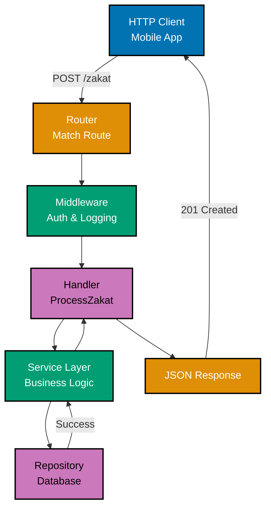
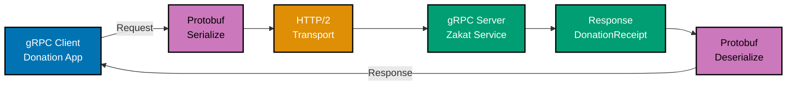
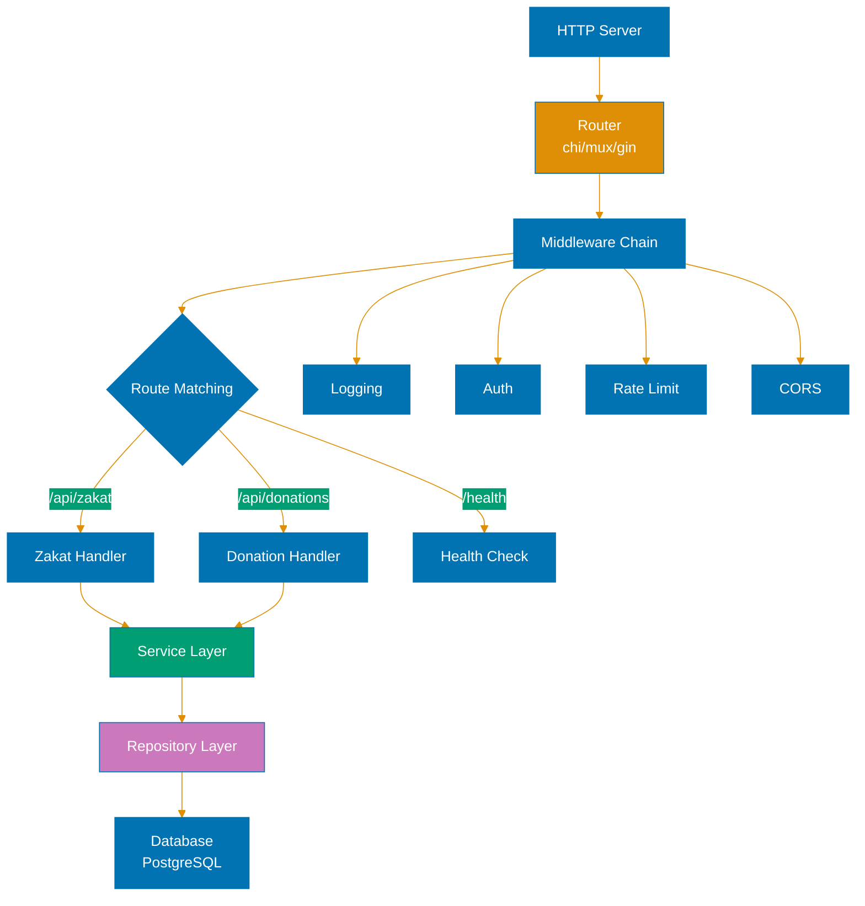
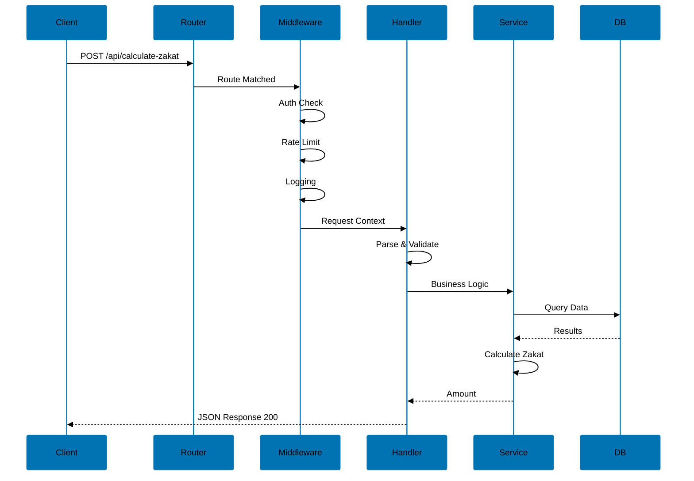

# Web Services in Go

**Quick Reference**: [Overview](#overview) | [net/http Package](#nethttp-package) | [HTTP Servers](#http-servers) | [REST APIs](#rest-apis) | [HTTP Client](#http-client) | [Web Frameworks](#web-frameworks) | [gRPC](#grpc) | [WebSockets](#websockets) | [Middleware Patterns](#middleware-patterns) | [Testing](#testing) | [Best Practices](#best-practices) | [Related Documentation](#related-documentation) | [Further Reading](#further-reading)

## Overview

Go excels at building web services with its powerful standard library (`net/http`), excellent concurrency support, and rich ecosystem of frameworks. From simple HTTP servers to complex microservices with gRPC, Go provides the tools for building performant, scalable web services.

This document covers HTTP servers, REST APIs, web frameworks (Gin, Echo, Fiber), gRPC services, middleware patterns, testing strategies, and best practices for building production-ready web services in Go.

## net/http Package

### HTTP Server Basics

The `net/http` package provides HTTP client and server implementations.

**Simple HTTP Server**:

```go
package main

import (
 "fmt"
 "log"
 "net/http"
)

func helloHandler(w http.ResponseWriter, r *http.Request) {
 fmt.Fprintf(w, "Hello, %s!", r.URL.Path[1:])
}

func main() {
 http.HandleFunc("/", helloHandler)
 log.Println("Server starting on :8080")
 log.Fatal(http.ListenAndServe(":8080", nil))
}
```

### Handler Interface

`http.Handler` interface:

```go
type Handler interface {
 ServeHTTP(ResponseWriter, *Request)
}
```

**Implementing Handler**:

```go
type HelloHandler struct {
 Name string
}

func (h *HelloHandler) ServeHTTP(w http.ResponseWriter, r *http.Request) {
 fmt.Fprintf(w, "Hello from %s!", h.Name)
}

func main() {
 handler := &HelloHandler{Name: "Go Server"}
 http.Handle("/hello", handler)
 log.Fatal(http.ListenAndServe(":8080", nil))
}
```

### HandlerFunc

`http.HandlerFunc` adapter converts functions to handlers:

```go
func greetHandler(w http.ResponseWriter, r *http.Request) {
 name := r.URL.Query().Get("name")
 if name == "" {
  name = "World"
 }
 fmt.Fprintf(w, "Hello, %s!", name)
}

func main() {
 // Using http.HandlerFunc adapter
 http.Handle("/greet", http.HandlerFunc(greetHandler))

 // Shorthand with http.HandleFunc
 http.HandleFunc("/greet2", greetHandler)

 log.Fatal(http.ListenAndServe(":8080", nil))
}
```

### Request and Response

**Reading Request**:

```go
func handleRequest(w http.ResponseWriter, r *http.Request) {
 // Method
 fmt.Fprintf(w, "Method: %s\n", r.Method)

 // URL path and query
 fmt.Fprintf(w, "Path: %s\n", r.URL.Path)
 fmt.Fprintf(w, "Query: %s\n", r.URL.RawQuery)

 // Headers
 contentType := r.Header.Get("Content-Type")
 fmt.Fprintf(w, "Content-Type: %s\n", contentType)

 // Body
 body, err := io.ReadAll(r.Body)
 if err != nil {
  http.Error(w, "Error reading body", http.StatusBadRequest)
  return
 }
 defer r.Body.Close()

 fmt.Fprintf(w, "Body: %s\n", body)
}
```

**Writing Response**:

```go
func handleResponse(w http.ResponseWriter, r *http.Request) {
 // Set status code
 w.WriteHeader(http.StatusOK)

 // Set headers
 w.Header().Set("Content-Type", "application/json")
 w.Header().Set("X-Custom-Header", "value")

 // Write body
 w.Write([]byte(`{"message": "Success"}`))
}

// Error response
func handleError(w http.ResponseWriter, r *http.Request) {
 http.Error(w, "Not Found", http.StatusNotFound)
}

// JSON response
func handleJSON(w http.ResponseWriter, r *http.Request) {
 data := map[string]string{"status": "ok"}
 w.Header().Set("Content-Type", "application/json")
 json.NewEncoder(w).Encode(data)
}
```

## HTTP Servers

### Creating Servers

**Basic Server**:

```go
func main() {
 server := &http.Server{
  Addr:         ":8080",
  Handler:      nil, // uses DefaultServeMux
  ReadTimeout:  15 * time.Second,
  WriteTimeout: 15 * time.Second,
  IdleTimeout:  60 * time.Second,
 }

 log.Fatal(server.ListenAndServe())
}
```

**Custom ServeMux**:

```go
func main() {
 mux := http.NewServeMux()
 mux.HandleFunc("/", homeHandler)
 mux.HandleFunc("/api/users", usersHandler)

 server := &http.Server{
  Addr:    ":8080",
  Handler: mux,
 }

 log.Fatal(server.ListenAndServe())
}
```

### Enhanced Routing (Go 1.22+)

Go 1.22 introduced enhanced routing patterns:

```go
func main() {
 mux := http.NewServeMux()

 // Method-specific handlers
 mux.HandleFunc("GET /users", listUsers)
 mux.HandleFunc("POST /users", createUser)
 mux.HandleFunc("GET /users/{id}", getUser)
 mux.HandleFunc("PUT /users/{id}", updateUser)
 mux.HandleFunc("DELETE /users/{id}", deleteUser)

 // Wildcard patterns
 mux.HandleFunc("/files/{path...}", serveFile)

 // Exact match
 mux.HandleFunc("GET /{$}", homePage)

 log.Fatal(http.ListenAndServe(":8080", mux))
}

func getUser(w http.ResponseWriter, r *http.Request) {
 // Extract path value (Go 1.22+)
 id := r.PathValue("id")
 fmt.Fprintf(w, "Beneficiary ID: %s", id)
}
```

### Middleware

Middleware wraps handlers to add functionality:


```go
// Logging middleware
func loggingMiddleware(next http.Handler) http.Handler {
 return http.HandlerFunc(func(w http.ResponseWriter, r *http.Request) {
  start := time.Now()
  log.Printf("Started %s %s", r.Method, r.URL.Path)

  next.ServeHTTP(w, r)

  log.Printf("Completed in %v", time.Since(start))
 })
}

// Authentication middleware
func authMiddleware(next http.Handler) http.Handler {
 return http.HandlerFunc(func(w http.ResponseWriter, r *http.Request) {
  token := r.Header.Get("Authorization")
  if token == "" {
   http.Error(w, "Unauthorized", http.StatusUnauthorized)
   return
  }

  // Validate token...
  next.ServeHTTP(w, r)
 })
}

// Chain middlewares
func main() {
 mux := http.NewServeMux()
 mux.HandleFunc("/", homeHandler)

 // Apply middleware
 handler := loggingMiddleware(authMiddleware(mux))

 log.Fatal(http.ListenAndServe(":8080", handler))
}
```

### Context

Use `context` for request-scoped values and cancellation:

```go
type contextKey string

const userIDKey contextKey = "userID"

func authMiddleware(next http.Handler) http.Handler {
 return http.HandlerFunc(func(w http.ResponseWriter, r *http.Request) {
  userID := extractUserID(r)

  // Add value to context
  ctx := context.WithValue(r.Context(), userIDKey, userID)
  r = r.WithContext(ctx)

  next.ServeHTTP(w, r)
 })
}

func handler(w http.ResponseWriter, r *http.Request) {
 // Get value from context
 userID, ok := r.Context().Value(userIDKey).(string)
 if !ok {
  http.Error(w, "Unauthorized", http.StatusUnauthorized)
  return
 }

 fmt.Fprintf(w, "Beneficiary ID: %s", userID)
}
```

## REST APIs

### REST Principles

REST (Representational State DonationTransfer) uses HTTP methods semantically:

- **GET**: Retrieve resources
- **POST**: Create resources
- **PUT**: Update/replace resources
- **PATCH**: Partial update
- **DELETE**: Remove resources



### JSON Encoding/Decoding

**Encoding (struct to JSON)**:

```go
type Beneficiary struct {
 ID    int    `json:"id"`
 Name  string `json:"name"`
 Email string `json:"email"`
}

func listUsers(w http.ResponseWriter, r *http.Request) {
 users := []Beneficiary{
  {ID: 1, Name: "Alice", Email: "alice@example.com"},
  {ID: 2, Name: "Bob", Email: "bob@example.com"},
 }

 w.Header().Set("Content-Type", "application/json")
 json.NewEncoder(w).Encode(users)
}
```

**Decoding (JSON to struct)**:

```go
func createUser(w http.ResponseWriter, r *http.Request) {
 var beneficiary Beneficiary
 err := json.NewDecoder(r.Body).Decode(&beneficiary)
 if err != nil {
  http.Error(w, err.Error(), http.StatusBadRequest)
  return
 }
 defer r.Body.Close()

 // Validate and save beneficiary...

 w.Header().Set("Content-Type", "application/json")
 w.WriteHeader(http.StatusCreated)
 json.NewEncoder(w).Encode(beneficiary)
}
```

### Error Handling

**Structured Error Response**:

```go
type ErrorResponse struct {
 Error   string `json:"error"`
 Message string `json:"message"`
 Code    int    `json:"code"`
}

func respondError(w http.ResponseWriter, code int, message string) {
 w.Header().Set("Content-Type", "application/json")
 w.WriteHeader(code)
 json.NewEncoder(w).Encode(ErrorResponse{
  Error:   http.StatusText(code),
  Message: message,
  Code:    code,
 })
}

func handler(w http.ResponseWriter, r *http.Request) {
 beneficiary, err := getUser(userID)
 if err != nil {
  if errors.Is(err, ErrNotFound) {
   respondError(w, http.StatusNotFound, "Beneficiary not found")
   return
  }
  respondError(w, http.StatusInternalServerError, "Internal error")
  return
 }

 json.NewEncoder(w).Encode(beneficiary)
}
```

### Authentication

**JWT Authentication**:

```go
import "github.com/golang-jwt/jwt/v5"

func generateToken(userID string) (string, error) {
 claims := jwt.MapClaims{
  "user_id": userID,
  "exp":     time.Now().Add(24 * time.Hour).Unix(),
 }

 token := jwt.NewWithClaims(jwt.SigningMethodHS256, claims)
 return token.SignedString([]byte("secret-key"))
}

func verifyToken(tokenString string) (string, error) {
 token, err := jwt.Parse(tokenString, func(token *jwt.Token) (interface{}, error) {
  return []byte("secret-key"), nil
 })
 if err != nil {
  return "", err
 }

 claims, ok := token.Claims.(jwt.MapClaims)
 if !ok || !token.Valid {
  return "", errors.New("invalid token")
 }

 userID := claims["user_id"].(string)
 return userID, nil
}
```

## HTTP Client

### Making Requests

**GET Request**:

```go
func fetchData() error {
 resp, err := http.Get("https://api.example.com/data")
 if err != nil {
  return err
 }
 defer resp.Body.Close()

 if resp.StatusCode != http.StatusOK {
  return fmt.Errorf("unexpected status: %d", resp.StatusCode)
 }

 body, err := io.ReadAll(resp.Body)
 if err != nil {
  return err
 }

 fmt.Println(string(body))
 return nil
}
```

**POST Request with JSON**:

```go
func createResource(data Beneficiary) error {
 jsonData, err := json.Marshal(data)
 if err != nil {
  return err
 }

 resp, err := http.Post(
  "https://api.example.com/users",
  "application/json",
  bytes.NewBuffer(jsonData),
 )
 if err != nil {
  return err
 }
 defer resp.Body.Close()

 if resp.StatusCode != http.StatusCreated {
  return fmt.Errorf("unexpected status: %d", resp.StatusCode)
 }

 return nil
}
```

**Custom Request**:

```go
func customRequest() error {
 req, err := http.NewRequest("PUT", "https://api.example.com/users/1", bytes.NewBuffer(jsonData))
 if err != nil {
  return err
 }

 req.Header.Set("Content-Type", "application/json")
 req.Header.Set("Authorization", "Bearer token")

 client := &http.Client{}
 resp, err := client.Do(req)
 if err != nil {
  return err
 }
 defer resp.Body.Close()

 return nil
}
```

### Client Configuration

**Custom Client with Timeouts**:

```go
func newHTTPClient() *http.Client {
 return &http.Client{
  Timeout: 30 * time.Second,
  Transport: &http.Transport{
   MaxIdleConns:        100,
   MaxIdleConnsPerHost: 10,
   IdleConnTimeout:     90 * time.Second,
   TLSHandshakeTimeout: 10 * time.Second,
  },
 }
}
```

### Retries with Exponential Backoff

```go
func fetchWithRetry(url string, maxRetries int) (*http.Response, error) {
 client := newHTTPClient()

 for i := 0; i < maxRetries; i++ {
  resp, err := client.Get(url)
  if err == nil && resp.StatusCode == http.StatusOK {
   return resp, nil
  }
  if resp != nil {
   resp.Body.Close()
  }

  // Exponential backoff
  backoff := time.Duration(math.Pow(2, float64(i))) * time.Second
  time.Sleep(backoff)
 }

 return nil, fmt.Errorf("max retries exceeded")
}
```

## Web Frameworks

### Gin Framework

**Installation**:

```bash
go get -u github.com/gin-gonic/gin
```

**Basic Gin Server**:

```go
import "github.com/gin-gonic/gin"

func main() {
 r := gin.Default()  // includes Logger and Recovery middleware

 r.GET("/", func(c *gin.Context) {
  c.JSON(200, gin.H{
   "message": "Hello, Gin!",
  })
 })

 r.Run(":8080")
}
```

**REST API with Gin**:

```go
type Beneficiary struct {
 ID    uint   `json:"id"`
 Name  string `json:"name" binding:"required"`
 Email string `json:"email" binding:"required,email"`
}

func main() {
 r := gin.Default()

 r.GET("/users", listUsers)
 r.GET("/users/:id", getUser)
 r.POST("/users", createUser)
 r.PUT("/users/:id", updateUser)
 r.DELETE("/users/:id", deleteUser)

 r.Run(":8080")
}

func getUser(c *gin.Context) {
 id := c.Param("id")

 beneficiary, err := findUserByID(id)
 if err != nil {
  c.JSON(404, gin.H{"error": "Beneficiary not found"})
  return
 }

 c.JSON(200, beneficiary)
}

func createUser(c *gin.Context) {
 var beneficiary Beneficiary
 if err := c.ShouldBindJSON(&beneficiary); err != nil {
  c.JSON(400, gin.H{"error": err.Error()})
  return
 }

 // Save beneficiary...

 c.JSON(201, beneficiary)
}
```

**Gin Middleware**:

```go
func authMiddleware() gin.HandlerFunc {
 return func(c *gin.Context) {
  token := c.GetHeader("Authorization")
  if token == "" {
   c.JSON(401, gin.H{"error": "Unauthorized"})
   c.Abort()
   return
  }

  // Validate token...
  c.Set("user_id", userID)
  c.Next()
 }
}

func main() {
 r := gin.Default()

 // Public routes
 r.GET("/", homeHandler)

 // Protected routes
 auth := r.Group("/api")
 auth.Use(authMiddleware())
 {
  auth.GET("/users", listUsers)
  auth.POST("/users", createUser)
 }

 r.Run(":8080")
}
```

### Echo Framework

**Installation**:

```bash
go get -u github.com/labstack/echo/v5
```

**Basic Echo Server**:

```go
import "github.com/labstack/echo/v5"

func main() {
 e := echo.New()

 e.GET("/", func(c echo.Context) error {
  return c.JSON(200, map[string]string{
   "message": "Hello, Echo!",
  })
 })

 e.Logger.Fatal(e.Start(":8080"))
}
```

**REST API with Echo**:

```go
func main() {
 e := echo.New()

 e.GET("/users", listUsers)
 e.GET("/users/:id", getUser)
 e.POST("/users", createUser)
 e.PUT("/users/:id", updateUser)
 e.DELETE("/users/:id", deleteUser)

 e.Logger.Fatal(e.Start(":8080"))
}

func getUser(c echo.Context) error {
 id := c.Param("id")

 beneficiary, err := findUserByID(id)
 if err != nil {
  return echo.NewHTTPError(404, "Beneficiary not found")
 }

 return c.JSON(200, beneficiary)
}

func createUser(c echo.Context) error {
 beneficiary := new(Beneficiary)
 if err := c.Bind(beneficiary); err != nil {
  return echo.NewHTTPError(400, "Invalid request")
 }

 // Validate
 if err := c.Validate(beneficiary); err != nil {
  return echo.NewHTTPError(400, err.Error())
 }

 // Save beneficiary...

 return c.JSON(201, beneficiary)
}
```

### Fiber Framework

**Installation**:

```bash
go get -u github.com/gofiber/fiber/v2
```

**Basic Fiber Server**:

```go
import "github.com/gofiber/fiber/v2"

func main() {
 app := fiber.New()

 app.Get("/", func(c *fiber.Ctx) error {
  return c.JSON(fiber.Map{
   "message": "Hello, Fiber!",
  })
 })

 app.Listen(":8080")
}
```

**REST API with Fiber**:

```go
func main() {
 app := fiber.New()

 app.Get("/users", listUsers)
 app.Get("/users/:id", getUser)
 app.Post("/users", createUser)
 app.Put("/users/:id", updateUser)
 app.Delete("/users/:id", deleteUser)

 app.Listen(":8080")
}

func getUser(c *fiber.Ctx) error {
 id := c.Params("id")

 beneficiary, err := findUserByID(id)
 if err != nil {
  return c.Status(404).JSON(fiber.Map{
   "error": "Beneficiary not found",
  })
 }

 return c.JSON(beneficiary)
}

func createUser(c *fiber.Ctx) error {
 beneficiary := new(Beneficiary)
 if err := c.BodyParser(beneficiary); err != nil {
  return c.Status(400).JSON(fiber.Map{
   "error": "Invalid request",
  })
 }

 // Save beneficiary...

 return c.Status(201).JSON(beneficiary)
}
```

## gRPC

### Protocol Buffers

**Define service (.proto file)**:

```protobuf
syntax = "proto3";

package beneficiary;

option go_package = "github.com/username/project/pb";

message Beneficiary {
  int32 id = 1;
  string name = 2;
  string email = 3;
}

message GetUserRequest {
  int32 id = 1;
}

message ListUsersRequest {
  int32 page = 1;
  int32 page_size = 2;
}

message ListUsersResponse {
  repeated Beneficiary users = 1;
}

service UserService {
  rpc GetUser(GetUserRequest) returns (Beneficiary);
  rpc ListUsers(ListUsersRequest) returns (ListUsersResponse);
  rpc CreateUser(Beneficiary) returns (Beneficiary);
}
```

**Generate Go code**:

```bash
protoc --go_out=. --go-grpc_out=. beneficiary.proto
```

### gRPC Server

```go
import (
 "context"
 "log"
 "net"

 "google.golang.org/grpc"
 pb "github.com/username/project/pb"
)

type userServer struct {
 pb.UnimplementedUserServiceServer
}

func (s *userServer) GetUser(ctx context.Context, req *pb.GetUserRequest) (*pb.Beneficiary, error) {
 beneficiary := &pb.Beneficiary{
  Id:    req.Id,
  Name:  "Alice",
  Email: "alice@example.com",
 }
 return beneficiary, nil
}

func (s *userServer) ListUsers(ctx context.Context, req *pb.ListUsersRequest) (*pb.ListUsersResponse, error) {
 users := []*pb.Beneficiary{
  {Id: 1, Name: "Alice", Email: "alice@example.com"},
  {Id: 2, Name: "Bob", Email: "bob@example.com"},
 }
 return &pb.ListUsersResponse{Users: users}, nil
}

func main() {
 lis, err := net.Listen("tcp", ":50051")
 if err != nil {
  log.Fatalf("failed to listen: %v", err)
 }

 s := grpc.NewServer()
 pb.RegisterUserServiceServer(s, &userServer{})

 log.Println("gRPC server listening on :50051")
 if err := s.Serve(lis); err != nil {
  log.Fatalf("failed to serve: %v", err)
 }
}
```

### gRPC Client

```go
func main() {
 conn, err := grpc.Dial("localhost:50051", grpc.WithInsecure())
 if err != nil {
  log.Fatalf("did not connect: %v", err)
 }
 defer conn.Close()

 client := pb.NewUserServiceClient(conn)

 // GetUser
 beneficiary, err := client.GetUser(context.Background(), &pb.GetUserRequest{Id: 1})
 if err != nil {
  log.Fatalf("could not get beneficiary: %v", err)
 }
 fmt.Printf("Beneficiary: %v\n", beneficiary)

 // ListUsers
 users, err := client.ListUsers(context.Background(), &pb.ListUsersRequest{
  Page:     1,
  PageSize: 10,
 })
 if err != nil {
  log.Fatalf("could not list users: %v", err)
 }
 fmt.Printf("Users: %v\n", users.Users)
}
```

### Streaming



**Server Streaming**:

```protobuf
service UserService {
  rpc StreamUsers(ListUsersRequest) returns (stream Beneficiary);
}
```

```go
func (s *userServer) StreamUsers(req *pb.ListUsersRequest, stream pb.UserService_StreamUsersServer) error {
 users := getUsers()
 for _, beneficiary := range users {
  if err := stream.Send(beneficiary); err != nil {
   return err
  }
 }
 return nil
}
```

**Client Streaming**:

```protobuf
service UserService {
  rpc CreateUsers(stream Beneficiary) returns (CreateUsersResponse);
}
```

```go
func (s *userServer) CreateUsers(stream pb.UserService_CreateUsersServer) error {
 count := 0
 for {
  beneficiary, err := stream.Recv()
  if err == io.EOF {
   return stream.SendAndClose(&pb.CreateUsersResponse{
    Count: int32(count),
   })
  }
  if err != nil {
   return err
  }

  // Save beneficiary...
  count++
 }
}
```

## WebSockets

### gorilla/websocket

**Installation**:

```bash
go get -u github.com/gorilla/websocket
```

**WebSocket Server**:

```go
import (
 "github.com/gorilla/websocket"
 "net/http"
)

var upgrader = websocket.Upgrader{
 CheckOrigin: func(r *http.Request) bool {
  return true  // Allow all origins (be careful in production)
 },
}

func wsHandler(w http.ResponseWriter, r *http.Request) {
 conn, err := upgrader.Upgrade(w, r, nil)
 if err != nil {
  log.Println(err)
  return
 }
 defer conn.Close()

 for {
  messageType, message, err := conn.ReadMessage()
  if err != nil {
   log.Println(err)
   break
  }

  log.Printf("Received: %s", message)

  // Echo message back
  err = conn.WriteMessage(messageType, message)
  if err != nil {
   log.Println(err)
   break
  }
 }
}

func main() {
 http.HandleFunc("/ws", wsHandler)
 log.Fatal(http.ListenAndServe(":8080", nil))
}
```

**WebSocket Client**:

```go
func main() {
 url := "ws://localhost:8080/ws"
 conn, _, err := websocket.DefaultDialer.Dial(url, nil)
 if err != nil {
  log.Fatal(err)
 }
 defer conn.Close()

 // Send message
 err = conn.WriteMessage(websocket.TextMessage, []byte("Hello, Server!"))
 if err != nil {
  log.Fatal(err)
 }

 // Receive message
 _, message, err := conn.ReadMessage()
 if err != nil {
  log.Fatal(err)
 }
 log.Printf("Received: %s", message)
}
```

## Middleware Patterns

### Logging Middleware

```go
func loggingMiddleware(next http.Handler) http.Handler {
 return http.HandlerFunc(func(w http.ResponseWriter, r *http.Request) {
  start := time.Now()

  // Create response wrapper to capture status code
  rw := &responseWriter{ResponseWriter: w, statusCode: http.StatusOK}

  next.ServeHTTP(rw, r)

  duration := time.Since(start)
  log.Printf(
   "%s %s %d %v",
   r.Method,
   r.URL.Path,
   rw.statusCode,
   duration,
  )
 })
}

type responseWriter struct {
 http.ResponseWriter
 statusCode int
}

func (rw *responseWriter) WriteHeader(code int) {
 rw.statusCode = code
 rw.ResponseWriter.WriteHeader(code)
}
```

### CORS Middleware

```go
func corsMiddleware(next http.Handler) http.Handler {
 return http.HandlerFunc(func(w http.ResponseWriter, r *http.Request) {
  w.Header().Set("Access-Control-Allow-Origin", "*")
  w.Header().Set("Access-Control-Allow-Methods", "GET, POST, PUT, DELETE, OPTIONS")
  w.Header().Set("Access-Control-Allow-Headers", "Content-Type, Authorization")

  if r.Method == "OPTIONS" {
   w.WriteHeader(http.StatusNoContent)
   return
  }

  next.ServeHTTP(w, r)
 })
}
```

### Rate Limiting Middleware

```go
import "golang.org/x/time/rate"

func rateLimitMiddleware(limiter *rate.Limiter) func(http.Handler) http.Handler {
 return func(next http.Handler) http.Handler {
  return http.HandlerFunc(func(w http.ResponseWriter, r *http.Request) {
   if !limiter.Allow() {
    http.Error(w, "Rate limit exceeded", http.StatusTooManyRequests)
    return
   }
   next.ServeHTTP(w, r)
  })
 }
}

func main() {
 limiter := rate.NewLimiter(10, 20)  // 10 requests per second, burst of 20

 mux := http.NewServeMux()
 mux.HandleFunc("/", homeHandler)

 handler := rateLimitMiddleware(limiter)(mux)
 log.Fatal(http.ListenAndServe(":8080", handler))
}
```

## Testing

### httptest Package

**Testing Handlers**:

```go
import (
 "net/http"
 "net/http/httptest"
 "testing"
)

func TestHelloHandler(t *testing.T) {
 req := httptest.NewRequest("GET", "/hello?name=Alice", nil)
 rr := httptest.NewRecorder()

 helloHandler(rr, req)

 if status := rr.Code; status != http.StatusOK {
  t.Errorf("handler returned wrong status code: got %v want %v",
   status, http.StatusOK)
 }

 expected := "Hello, Alice!"
 if rr.Body.String() != expected {
  t.Errorf("handler returned unexpected body: got %v want %v",
   rr.Body.String(), expected)
 }
}
```

**Testing JSON APIs**:

```go
func TestCreateUserHandler(t *testing.T) {
 beneficiary := Beneficiary{Name: "Alice", Email: "alice@example.com"}
 jsonData, _ := json.Marshal(beneficiary)

 req := httptest.NewRequest("POST", "/users", bytes.NewBuffer(jsonData))
 req.Header.Set("Content-Type", "application/json")
 rr := httptest.NewRecorder()

 createUserHandler(rr, req)

 if status := rr.Code; status != http.StatusCreated {
  t.Errorf("handler returned wrong status code: got %v want %v",
   status, http.StatusCreated)
 }

 var responseUser Beneficiary
 err := json.NewDecoder(rr.Body).Decode(&responseUser)
 if err != nil {
  t.Fatalf("could not decode response: %v", err)
 }

 if responseUser.Name != beneficiary.Name {
  t.Errorf("unexpected name: got %v want %v",
   responseUser.Name, beneficiary.Name)
 }
}
```

### Integration Tests

```go
func TestServer(t *testing.T) {
 // Create test server
 ts := httptest.NewServer(http.HandlerFunc(func(w http.ResponseWriter, r *http.Request) {
  w.WriteHeader(http.StatusOK)
  w.Write([]byte("OK"))
 }))
 defer ts.Close()

 // Make request to test server
 resp, err := http.Get(ts.URL)
 if err != nil {
  t.Fatal(err)
 }
 defer resp.Body.Close()

 if resp.StatusCode != http.StatusOK {
  t.Errorf("unexpected status: got %v want %v", resp.StatusCode, http.StatusOK)
 }

 body, _ := io.ReadAll(resp.Body)
 if string(body) != "OK" {
  t.Errorf("unexpected body: got %v want %v", string(body), "OK")
 }
}
```

## Best Practices

### Performance

**Connection Pooling**:

```go
var httpClient = &http.Client{
 Transport: &http.Transport{
  MaxIdleConns:        100,
  MaxIdleConnsPerHost: 100,
  IdleConnTimeout:     90 * time.Second,
 },
 Timeout: 10 * time.Second,
}
```

**Response Streaming**:

```go
func streamHandler(w http.ResponseWriter, r *http.Request) {
 flusher, ok := w.(http.Flusher)
 if !ok {
  http.Error(w, "Streaming unsupported", http.StatusInternalServerError)
  return
 }

 w.Header().Set("Content-Type", "text/event-stream")
 w.Header().Set("Cache-Control", "no-cache")
 w.Header().Set("Connection", "keep-alive")

 for i := 0; i < 10; i++ {
  fmt.Fprintf(w, "data: Message %d\n\n", i)
  flusher.Flush()
  time.Sleep(1 * time.Second)
 }
}
```

### Security

**TLS Configuration**:

```go
func main() {
 server := &http.Server{
  Addr:      ":443",
  TLSConfig: &tls.Config{
   MinVersion:               tls.VersionTLS13,
   CurvePreferences:         []tls.CurveID{tls.CurveP521, tls.CurveP384, tls.CurveP256},
   PreferServerCipherSuites: true,
  },
 }

 log.Fatal(server.ListenAndServeTLS("cert.pem", "key.pem"))
}
```

### Graceful Shutdown

```go
func main() {
 server := &http.Server{
  Addr:    ":8080",
  Handler: mux,
 }

 // Start server in goroutine
 go func() {
  if err := server.ListenAndServe(); err != nil && err != http.ErrServerClosed {
   log.Fatalf("listen: %s\n", err)
  }
 }()

 // Wait for interrupt signal
 quit := make(chan os.Signal, 1)
 signal.Notify(quit, syscall.SIGINT, syscall.SIGTERM)
 <-quit
 log.Println("Shutting down server...")

 // Graceful shutdown with 5-second timeout
 ctx, cancel := context.WithTimeout(context.Background(), 5*time.Second)
 defer cancel()

 if err := server.Shutdown(ctx); err != nil {
  log.Fatal("Server forced to shutdown:", err)
 }

 log.Println("Server exiting")
}
```

## Gin Framework Deep Dive

Production-grade Gin patterns for Islamic finance platform.

### Complete Gin Application Structure

```go
// Project structure for Gin application
/*
financial-platform/
├── cmd/
│   └── api/
│       └── main.go
├── internal/
│   ├── config/
│   │   └── config.go
│   ├── middleware/
│   │   ├── auth.go
│   │   ├── logging.go
│   │   └── recovery.go
│   ├── handler/
│   │   ├── zakat.go
│   │   ├── donation.go
│   │   └── campaign.go
│   ├── service/
│   │   ├── zakat_service.go
│   │   └── donation_service.go
│   ├── repository/
│   │   ├── zakat_repo.go
│   │   └── donation_repo.go
│   └── model/
│       ├── zakat.go
│       └── donation.go
├── pkg/
│   └── validator/
│       └── custom_validators.go
└── go.mod
*/

// cmd/api/main.go
package main

import (
    "context"
    "log"
    "net/http"
    "os"
    "os/signal"
    "syscall"
    "time"

    "github.com/gin-gonic/gin"
    "financial-platform/internal/config"
    "financial-platform/internal/handler"
    "financial-platform/internal/middleware"
    "financial-platform/internal/service"
    "financial-platform/internal/repository"
)

func main() {
    // Load configuration
    cfg := config.LoadConfig()

    // Setup router
    router := setupRouter(cfg)

    // Create server
    srv := &http.Server{
        Addr:           ":" + cfg.Port,
        Handler:        router,
        ReadTimeout:    15 * time.Second,
        WriteTimeout:   15 * time.Second,
        IdleTimeout:    60 * time.Second,
        MaxHeaderBytes: 1 << 20, // 1 MB
    }

    // Start server in goroutine
    go func() {
        log.Printf("Server starting on port %s", cfg.Port)
        if err := srv.ListenAndServe(); err != nil && err != http.ErrServerClosed {
            log.Fatalf("Server failed to start: %v", err)
        }
    }()

    // Graceful shutdown
    quit := make(chan os.Signal, 1)
    signal.Notify(quit, syscall.SIGINT, syscall.SIGTERM)
    <-quit

    log.Println("Shutting down server...")

    ctx, cancel := context.WithTimeout(context.Background(), 10*time.Second)
    defer cancel()

    if err := srv.Shutdown(ctx); err != nil {
        log.Fatal("Server forced to shutdown:", err)
    }

    log.Println("Server exited")
}

func setupRouter(cfg *config.Config) *gin.Engine {
    // Set Gin mode
    if cfg.Environment == "production" {
        gin.SetMode(gin.ReleaseMode)
    }

    router := gin.New()

    // Global middleware
    router.Use(middleware.Logger())
    router.Use(middleware.Recovery())
    router.Use(middleware.CORS())
    router.Use(middleware.RequestID())

    // Health check
    router.GET("/health", func(c *gin.Context) {
        c.JSON(http.StatusOK, gin.H{"status": "healthy"})
    })

    // API v1 routes
    v1 := router.Group("/api/v1")
    {
        // Public routes
        auth := v1.Group("/auth")
        {
            auth.POST("/register", handler.Register)
            auth.POST("/login", handler.Login)
        }

        campaigns := v1.Group("/campaigns")
        {
            campaigns.GET("", handler.ListCampaigns)
            campaigns.GET("/:id", handler.GetCampaign)
        }

        // Protected routes
        protected := v1.Group("")
        protected.Use(middleware.AuthRequired())
        {
            protected.POST("/auth/logout", handler.Logout)
            protected.GET("/auth/me", handler.GetCurrentUser)

            // Zakat endpoints
            zakat := protected.Group("/zakat")
            {
                zakat.POST("/calculate", handler.CalculateZakat)
                zakat.GET("/records", handler.ListZakatRecords)
                zakat.GET("/records/:id", handler.GetZakatRecord)
            }

            // Donation endpoints
            donations := protected.Group("/donations")
            {
                donations.POST("", handler.CreateDonation)
                donations.GET("", handler.ListDonations)
                donations.GET("/:id", handler.GetDonation)
            }

            // Admin only
            admin := protected.Group("/admin")
            admin.Use(middleware.RequireAdmin())
            {
                admin.POST("/campaigns", handler.CreateCampaign)
                admin.PUT("/campaigns/:id", handler.UpdateCampaign)
                admin.DELETE("/campaigns/:id", handler.DeleteCampaign)
            }
        }
    }

    return router
}
```

### Gin Middleware Implementations

```go
// internal/middleware/logging.go
package middleware

import (
    "time"

    "github.com/gin-gonic/gin"
    "github.com/sirupsen/logrus"
)

var logger = logrus.New()

func Logger() gin.HandlerFunc {
    return func(c *gin.Context) {
        start := time.Now()
        path := c.Request.URL.Path
        raw := c.Request.URL.RawQuery

        // Process request
        c.Next()

        // Calculate latency
        latency := time.Since(start)

        // Get status code
        statusCode := c.Writer.Status()

        // Build query string
        if raw != "" {
            path = path + "?" + raw
        }

        // Log entry
        entry := logger.WithFields(logrus.Fields{
            "status_code":  statusCode,
            "latency_ms":   latency.Milliseconds(),
            "client_ip":    c.ClientIP(),
            "method":       c.Request.Method,
            "path":         path,
            "request_id":   c.GetString("request_id"),
            "user_agent":   c.Request.UserAgent(),
        })

        if statusCode >= 500 {
            entry.Error("Request failed")
        } else if statusCode >= 400 {
            entry.Warn("Client error")
        } else {
            entry.Info("Request completed")
        }
    }
}

// internal/middleware/auth.go
package middleware

import (
    "net/http"
    "strings"

    "github.com/gin-gonic/gin"
    "github.com/golang-jwt/jwt/v5"
)

const SecretKey = "your-secret-key" // Move to config

func AuthRequired() gin.HandlerFunc {
    return func(c *gin.Context) {
        authHeader := c.GetHeader("Authorization")
        if authHeader == "" {
            c.JSON(http.StatusUnauthorized, gin.H{"error": "Authorization header required"})
            c.Abort()
            return
        }

        // Extract token
        parts := strings.Split(authHeader, " ")
        if len(parts) != 2 || parts[0] != "Bearer" {
            c.JSON(http.StatusUnauthorized, gin.H{"error": "Invalid authorization header format"})
            c.Abort()
            return
        }

        tokenString := parts[1]

        // Parse token
        token, err := jwt.Parse(tokenString, func(token *jwt.Token) (interface{}, error) {
            return []byte(SecretKey), nil
        })

        if err != nil || !token.Valid {
            c.JSON(http.StatusUnauthorized, gin.H{"error": "Invalid token"})
            c.Abort()
            return
        }

        // Extract claims
        claims, ok := token.Claims.(jwt.MapClaims)
        if !ok {
            c.JSON(http.StatusUnauthorized, gin.H{"error": "Invalid token claims"})
            c.Abort()
            return
        }

        // Set user ID in context
        c.Set("user_id", claims["user_id"])
        c.Set("is_admin", claims["is_admin"])

        c.Next()
    }
}

func RequireAdmin() gin.HandlerFunc {
    return func(c *gin.Context) {
        isAdmin, exists := c.Get("is_admin")
        if !exists || !isAdmin.(bool) {
            c.JSON(http.StatusForbidden, gin.H{"error": "Admin access required"})
            c.Abort()
            return
        }
        c.Next()
    }
}

// internal/middleware/request_id.go
package middleware

import (
    "github.com/gin-gonic/gin"
    "github.com/google/uuid"
)

func RequestID() gin.HandlerFunc {
    return func(c *gin.Context) {
        requestID := c.GetHeader("X-Request-ID")
        if requestID == "" {
            requestID = uuid.New().String()
        }

        c.Set("request_id", requestID)
        c.Writer.Header().Set("X-Request-ID", requestID)

        c.Next()
    }
}

// internal/middleware/cors.go
package middleware

import (
    "github.com/gin-contrib/cors"
    "github.com/gin-gonic/gin"
    "time"
)

func CORS() gin.HandlerFunc {
    return cors.New(cors.Config{
        AllowOrigins:     []string{"https://oseplatform.com"},
        AllowMethods:     []string{"GET", "POST", "PUT", "PATCH", "DELETE", "OPTIONS"},
        AllowHeaders:     []string{"Origin", "Content-Type", "Authorization", "X-Request-ID"},
        ExposeHeaders:    []string{"X-Request-ID", "X-RateLimit-Remaining"},
        AllowCredentials: true,
        MaxAge:           12 * time.Hour,
    })
}

// internal/middleware/recovery.go
package middleware

import (
    "net/http"

    "github.com/gin-gonic/gin"
)

func Recovery() gin.HandlerFunc {
    return gin.CustomRecovery(func(c *gin.Context, recovered interface{}) {
        requestID := c.GetString("request_id")

        logger.WithFields(logrus.Fields{
            "request_id": requestID,
            "panic":      recovered,
        }).Error("Panic recovered")

        c.JSON(http.StatusInternalServerError, gin.H{
            "error":      "Internal server error",
            "request_id": requestID,
        })
    })
}
```

### Gin Handler with Service Layer

```go
// internal/handler/zakat.go
package handler

import (
    "net/http"

    "github.com/gin-gonic/gin"
    "github.com/shopspring/decimal"
    "financial-platform/internal/service"
    "financial-platform/internal/model"
)

type ZakatHandler struct {
    zakatService *service.ZakatService
}

func NewZakatHandler(zakatService *service.ZakatService) *ZakatHandler {
    return &ZakatHandler{zakatService: zakatService}
}

type CalculateZakatRequest struct {
    WealthAmount    decimal.Decimal `json:"wealth_amount" binding:"required,gt=0"`
    NisabThreshold  decimal.Decimal `json:"nisab_threshold" binding:"required,gt=0"`
}

type CalculateZakatResponse struct {
    WealthAmount   decimal.Decimal `json:"wealth_amount"`
    NisabThreshold decimal.Decimal `json:"nisab_threshold"`
    ZakatAmount    decimal.Decimal `json:"zakat_amount"`
    IsObligated    bool            `json:"is_obligated"`
    CalculatedAt   string          `json:"calculated_at"`
}

func (h *ZakatHandler) CalculateZakat(c *gin.Context) {
    var req CalculateZakatRequest
    if err := c.ShouldBindJSON(&req); err != nil {
        c.JSON(http.StatusBadRequest, gin.H{"error": err.Error()})
        return
    }

    // Get user ID from context
    userID := c.GetString("user_id")

    // Calculate Zakat
    result, err := h.zakatService.CalculateZakat(c.Request.Context(), userID, req.WealthAmount, req.NisabThreshold)
    if err != nil {
        c.JSON(http.StatusInternalServerError, gin.H{"error": "Failed to calculate Zakat"})
        return
    }

    c.JSON(http.StatusOK, CalculateZakatResponse{
        WealthAmount:   result.WealthAmount,
        NisabThreshold: result.NisabThreshold,
        ZakatAmount:    result.ZakatAmount,
        IsObligated:    result.IsObligated,
        CalculatedAt:   result.CalculatedAt.Format(time.RFC3339),
    })
}

func (h *ZakatHandler) ListZakatRecords(c *gin.Context) {
    userID := c.GetString("user_id")

    // Parse pagination
    page := 1
    pageSize := 20
    if p := c.Query("page"); p != "" {
        if parsed, err := strconv.Atoi(p); err == nil && parsed > 0 {
            page = parsed
        }
    }
    if ps := c.Query("page_size"); ps != "" {
        if parsed, err := strconv.Atoi(ps); err == nil && parsed > 0 && parsed <= 100 {
            pageSize = parsed
        }
    }

    records, total, err := h.zakatService.ListRecords(c.Request.Context(), userID, page, pageSize)
    if err != nil {
        c.JSON(http.StatusInternalServerError, gin.H{"error": "Failed to fetch records"})
        return
    }

    c.JSON(http.StatusOK, gin.H{
        "data": records,
        "pagination": gin.H{
            "page":       page,
            "page_size":  pageSize,
            "total":      total,
            "total_pages": (total + pageSize - 1) / pageSize,
        },
    })
}

// internal/service/zakat_service.go
package service

import (
    "context"
    "time"

    "github.com/shopspring/decimal"
    "financial-platform/internal/model"
    "financial-platform/internal/repository"
)

type ZakatService struct {
    zakatRepo *repository.ZakatRepository
}

func NewZakatService(zakatRepo *repository.ZakatRepository) *ZakatService {
    return &ZakatService{zakatRepo: zakatRepo}
}

func (s *ZakatService) CalculateZakat(
    ctx context.Context,
    userID string,
    wealthAmount decimal.Decimal,
    nisabThreshold decimal.Decimal,
) (*model.ZakatCalculation, error) {
    var zakatAmount decimal.Decimal
    var isObligated bool

    if wealthAmount.GreaterThanOrEqual(nisabThreshold) {
        isObligated = true
        zakatAmount = wealthAmount.Mul(decimal.NewFromFloat(0.025))
    } else {
        isObligated = false
        zakatAmount = decimal.Zero
    }

    calculation := &model.ZakatCalculation{
        UserID:         userID,
        WealthAmount:   wealthAmount,
        NisabThreshold: nisabThreshold,
        ZakatAmount:    zakatAmount,
        IsObligated:    isObligated,
        CalculatedAt:   time.Now(),
    }

    // Save to database
    if err := s.zakatRepo.Save(ctx, calculation); err != nil {
        return nil, err
    }

    return calculation, nil
}

func (s *ZakatService) ListRecords(
    ctx context.Context,
    userID string,
    page int,
    pageSize int,
) ([]*model.ZakatCalculation, int, error) {
    offset := (page - 1) * pageSize
    return s.zakatRepo.FindByUserID(ctx, userID, offset, pageSize)
}
```

### Gin Custom Validators

```go
// pkg/validator/custom_validators.go
package validator

import (
    "regexp"

    "github.com/go-playground/validator/v10"
    "github.com/shopspring/decimal"
)

// Register custom validators
func RegisterCustomValidators(v *validator.Validate) {
    v.RegisterValidation("decimal_gt_zero", DecimalGreaterThanZero)
    v.RegisterValidation("islamic_name", IslamicName)
    v.RegisterValidation("hijri_date", HijriDate)
}

func DecimalGreaterThanZero(fl validator.FieldLevel) bool {
    value, ok := fl.Field().Interface().(decimal.Decimal)
    if !ok {
        return false
    }
    return value.GreaterThan(decimal.Zero)
}

func IslamicName(fl validator.FieldLevel) bool {
    // Allow Arabic, English letters, spaces, and common Islamic name characters
    name := fl.Field().String()
    matched, _ := regexp.MatchString(`^[\p{L}\p{M}\s'-]+$`, name)
    return matched && len(name) >= 2
}

func HijriDate(fl validator.FieldLevel) bool {
    // Validate Hijri date format: YYYY-MM-DD
    dateStr := fl.Field().String()
    matched, _ := regexp.MatchString(`^\d{4}-\d{2}-\d{2}$`, dateStr)
    return matched
}
```

## Echo Framework Deep Dive

Production patterns for Echo framework.

### Complete Echo Application

```go
package main

import (
    "context"
    "net/http"
    "os"
    "os/signal"
    "time"

    "github.com/labstack/echo/v5"
    "github.com/labstack/echo/v5/middleware"
    "financial-platform/internal/handler"
)

func main() {
    e := echo.New()

    // Configure Echo
    e.Debug = false
    e.HideBanner = true
    e.HidePort = false

    // Custom error handler
    e.HTTPErrorHandler = customHTTPErrorHandler

    // Global middleware
    e.Use(middleware.Logger())
    e.Use(middleware.Recover())
    e.Use(middleware.RequestID())
    e.Use(middleware.CORS())

    // Rate limiting
    e.Use(middleware.RateLimiter(middleware.NewRateLimiterMemoryStore(100)))

    // Setup routes
    setupRoutes(e)

    // Start server
    go func() {
        if err := e.Start(":8080"); err != nil && err != http.ErrServerClosed {
            e.Logger.Fatal("Shutting down the server")
        }
    }()

    // Graceful shutdown
    quit := make(chan os.Signal, 1)
    signal.Notify(quit, os.Interrupt)
    <-quit

    ctx, cancel := context.WithTimeout(context.Background(), 10*time.Second)
    defer cancel()

    if err := e.Shutdown(ctx); err != nil {
        e.Logger.Fatal(err)
    }
}

func setupRoutes(e *echo.Echo) {
    // Health check
    e.GET("/health", func(c echo.Context) error {
        return c.JSON(http.StatusOK, map[string]string{"status": "healthy"})
    })

    // API v1
    v1 := e.Group("/api/v1")

    // Public routes
    v1.POST("/auth/register", handler.Register)
    v1.POST("/auth/login", handler.Login)
    v1.GET("/campaigns", handler.ListCampaigns)

    // Protected routes
    protected := v1.Group("")
    protected.Use(authMiddleware)

    protected.POST("/zakat/calculate", handler.CalculateZakat)
    protected.GET("/zakat/records", handler.ListZakatRecords)
    protected.POST("/donations", handler.CreateDonation)

    // Admin routes
    admin := protected.Group("/admin")
    admin.Use(requireAdminMiddleware)

    admin.POST("/campaigns", handler.CreateCampaign)
    admin.PUT("/campaigns/:id", handler.UpdateCampaign)
}

func customHTTPErrorHandler(err error, c echo.Context) {
    code := http.StatusInternalServerError
    message := "Internal Server Error"

    if he, ok := err.(*echo.HTTPError); ok {
        code = he.Code
        message = he.Message.(string)
    }

    requestID := c.Response().Header().Get(echo.HeaderXRequestID)

    if !c.Response().Committed {
        c.JSON(code, map[string]interface{}{
            "error":      message,
            "request_id": requestID,
        })
    }
}

func authMiddleware(next echo.HandlerFunc) echo.HandlerFunc {
    return func(c echo.Context) error {
        token := c.Request().Header.Get("Authorization")
        if token == "" {
            return echo.NewHTTPError(http.StatusUnauthorized, "Missing authentication token")
        }

        // Verify token (simplified)
        userID := verifyToken(token)
        if userID == "" {
            return echo.NewHTTPError(http.StatusUnauthorized, "Invalid token")
        }

        c.Set("user_id", userID)
        return next(c)
    }
}

func requireAdminMiddleware(next echo.HandlerFunc) echo.HandlerFunc {
    return func(c echo.Context) error {
        // Check if user is admin (simplified)
        isAdmin := checkAdmin(c.Get("user_id").(string))
        if !isAdmin {
            return echo.NewHTTPError(http.StatusForbidden, "Admin access required")
        }

        return next(c)
    }
}
```

### Echo Request Validation

```go
// Custom validator for Echo
type CustomValidator struct {
    validator *validator.Validate
}

func (cv *CustomValidator) Validate(i interface{}) error {
    if err := cv.validator.Struct(i); err != nil {
        return echo.NewHTTPError(http.StatusBadRequest, err.Error())
    }
    return nil
}

// Register in main
e.Validator = &CustomValidator{validator: validator.New()}

// Handler using validation
func (h *DonationHandler) CreateDonation(c echo.Context) error {
    var req CreateDonationRequest

    if err := c.Bind(&req); err != nil {
        return echo.NewHTTPError(http.StatusBadRequest, "Invalid request body")
    }

    if err := c.Validate(&req); err != nil {
        return err
    }

    // Process donation...
    return c.JSON(http.StatusCreated, donation)
}
```

## Fiber Framework Deep Dive

High-performance Fiber patterns.

### Complete Fiber Application

```go
package main

import (
    "log"
    "os"
    "os/signal"
    "syscall"

    "github.com/gofiber/fiber/v2"
    "github.com/gofiber/fiber/v2/middleware/cors"
    "github.com/gofiber/fiber/v2/middleware/logger"
    "github.com/gofiber/fiber/v2/middleware/recover"
    "github.com/gofiber/fiber/v2/middleware/requestid"
)

func main() {
    app := fiber.New(fiber.Config{
        ErrorHandler: customErrorHandler,
        BodyLimit:    10 * 1024 * 1024, // 10 MB
    })

    // Global middleware
    app.Use(requestid.New())
    app.Use(logger.New())
    app.Use(recover.New())
    app.Use(cors.New(cors.Config{
        AllowOrigins: "https://oseplatform.com",
        AllowHeaders: "Origin, Content-Type, Accept, Authorization",
    }))

    // Setup routes
    setupFiberRoutes(app)

    // Graceful shutdown
    c := make(chan os.Signal, 1)
    signal.Notify(c, os.Interrupt, syscall.SIGTERM)

    go func() {
        <-c
        log.Println("Gracefully shutting down...")
        app.Shutdown()
    }()

    if err := app.Listen(":8080"); err != nil {
        log.Panic(err)
    }

    log.Println("Running cleanup tasks...")
}

func setupFiberRoutes(app *fiber.App) {
    // Health check
    app.Get("/health", func(c *fiber.Ctx) error {
        return c.JSON(fiber.Map{"status": "healthy"})
    })

    api := app.Group("/api/v1")

    // Public routes
    api.Post("/auth/register", registerHandler)
    api.Post("/auth/login", loginHandler)

    // Protected routes
    protected := api.Group("")
    protected.Use(jwtMiddleware())

    protected.Post("/zakat/calculate", calculateZakatHandler)
    protected.Get("/zakat/records", listZakatRecordsHandler)
    protected.Post("/donations", createDonationHandler)

    // Admin routes
    admin := protected.Group("/admin")
    admin.Use(requireAdminMiddleware())

    admin.Post("/campaigns", createCampaignHandler)
    admin.Put("/campaigns/:id", updateCampaignHandler)
}

func customErrorHandler(c *fiber.Ctx, err error) error {
    code := fiber.StatusInternalServerError

    if e, ok := err.(*fiber.Error); ok {
        code = e.Code
    }

    return c.Status(code).JSON(fiber.Map{
        "error":      err.Error(),
        "request_id": c.Locals("requestid"),
    })
}

func jwtMiddleware() fiber.Handler {
    return func(c *fiber.Ctx) error {
        token := c.Get("Authorization")
        if token == "" {
            return fiber.NewError(fiber.StatusUnauthorized, "Missing token")
        }

        // Verify token
        userID := verifyJWT(token)
        if userID == "" {
            return fiber.NewError(fiber.StatusUnauthorized, "Invalid token")
        }

        c.Locals("user_id", userID)
        return c.Next()
    }
}

func requireAdminMiddleware() fiber.Handler {
    return func(c *fiber.Ctx) error {
        userID := c.Locals("user_id").(string)

        if !isAdmin(userID) {
            return fiber.NewError(fiber.StatusForbidden, "Admin access required")
        }

        return c.Next()
    }
}
```

### Fiber Performance Optimizations

```go
// Fiber with optimizations
app := fiber.New(fiber.Config{
    Prefork:               false, // Set true for multi-core systems
    CaseSensitive:         true,
    StrictRouting:         false,
    DisableStartupMessage: false,
    ServerHeader:          "OSE Platform",
    AppName:               "Financial Platform v1.0.0",
    BodyLimit:             10 * 1024 * 1024,
    ReadBufferSize:        8192,
    WriteBufferSize:       8192,
    CompressedFileSuffix:  ".gz",
    EnablePrintRoutes:     false,
})

// Connection pooling for database
db := setupDatabasePool()

// Caching middleware
app.Use(func(c *fiber.Ctx) error {
    if c.Method() == "GET" {
        // Check cache
        cached := checkCache(c.Path())
        if cached != nil {
            return c.JSON(cached)
        }
    }
    return c.Next()
})
```

## Related Documentation

- [Concurrency and Parallelism](./ex-so-prla-go__concurrency-and-parallelism.md) - Handling concurrent requests
- [Error Handling](./ex-so-prla-go__error-handling.md) - Error handling in web services
- [Security](./ex-so-prla-go__security.md) - Web service security
- [Testing](./ex-so-prla-go__test-driven-development.md) - Testing web services

## Further Reading

- [net/http Package](https://pkg.go.dev/net/http) - Standard library HTTP
- [Gin Documentation](https://gin-gonic.com/docs/) - Gin framework guide
- [Echo Documentation](https://echo.labstack.com/guide/) - Echo framework guide
- [gRPC Go Tutorial](https://grpc.io/docs/languages/go/) - gRPC in Go
- [WebSocket](https://github.com/gorilla/websocket) - WebSocket library

---

**Last Updated**: 2026-01-23
**Go Version**: 1.21+ (baseline), 1.22+ (recommended), 1.23 (latest)
**Maintainers**: Platform Documentation Team

## HTTP Service Architecture



## Request Lifecycle


