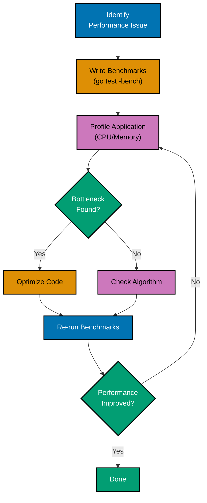
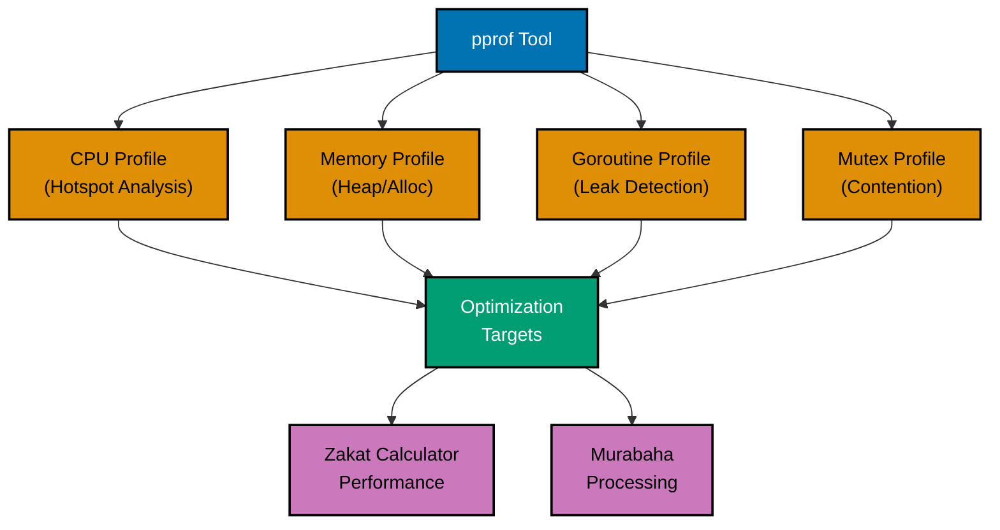
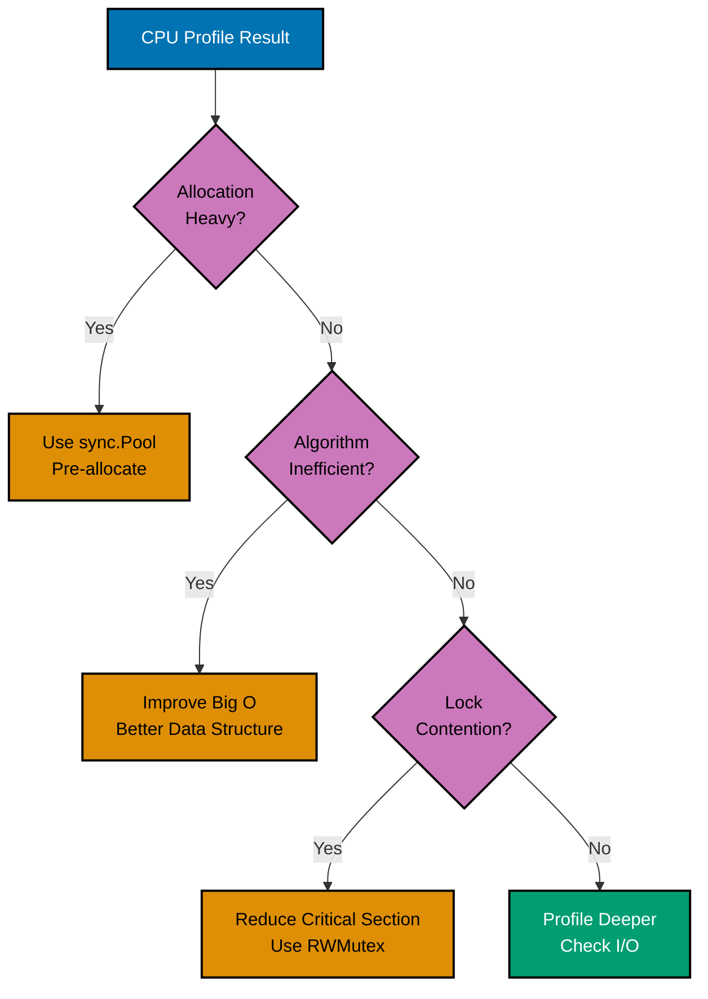
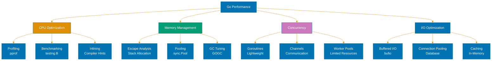
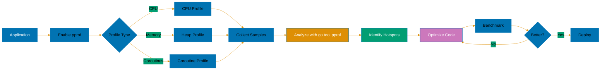

# Performance Optimization in Go

**Quick Reference**: [Overview](#overview) | [Performance Fundamentals](#performance-fundamentals) | [Benchmarking](#benchmarking) | [Profiling with pprof](#profiling-with-pprof) | [CPU Profiling](#cpu-profiling) | [Memory Profiling](#memory-profiling) | [Goroutine Profiling](#goroutine-profiling) | [Blocking Profiling](#blocking-profiling) | [Mutex Profiling](#mutex-profiling) | [Memory Optimization](#memory-optimization) | [Allocation Reduction](#allocation-reduction) | [Garbage Collection Tuning](#garbage-collection-tuning) | [Compiler Optimizations](#compiler-optimizations) | [Concurrency Performance](#concurrency-performance) | [Data Structure Performance](#data-structure-performance) | [String Operations](#string-operations) | [Performance Best Practices](#performance-best-practices) | [Common Performance Pitfalls](#common-performance-pitfalls) | [Conclusion](#conclusion)

## Overview

Go is designed for performance, offering excellent runtime efficiency while maintaining developer productivity. This document explores performance optimization techniques in Go, from profiling and benchmarking to memory management and garbage collection tuning.

**Audience**: Developers who want to write high-performance Go applications.

**Prerequisites**: Basic Go programming knowledge, familiarity with system performance concepts.

**Related Documentation**:

- [Concurrency and Parallelism](./ex-so-stla-go__concurrency-and-parallelism.md)
- [Best Practices](./ex-so-stla-go__best-practices.md)
- [Memory Management](./ex-so-stla-go__memory-management.md)

## Performance Fundamentals

### Understanding Performance Metrics

Key metrics for Go applications:

```go
package main

import (
    "fmt"
    "runtime"
    "time"
)

func main() {
    // CPU usage
    fmt.Printf("NumCPU: %d\n", runtime.NumCPU())
    fmt.Printf("GOMAXPROCS: %d\n", runtime.GOMAXPROCS(0))

    // Memory statistics
    var m runtime.MemStats
    runtime.ReadMemStats(&m)
    fmt.Printf("Alloc: %d MB\n", m.Alloc/1024/1024)
    fmt.Printf("TotalAlloc: %d MB\n", m.TotalAlloc/1024/1024)
    fmt.Printf("Sys: %d MB\n", m.Sys/1024/1024)
    fmt.Printf("NumGC: %d\n", m.NumGC)

    // Goroutines
    fmt.Printf("NumGoroutine: %d\n", runtime.NumGoroutine())

    // Timing operations
    start := time.Now()
    // ... operation ...
    duration := time.Since(start)
    fmt.Printf("Duration: %v\n", duration)
}
```

### Big O Complexity

Understanding algorithmic complexity:

```go
package main

import "fmt"

// O(1) - Constant time
func getFirst(slice []int) int {
    return slice[0]
}

// O(n) - Linear time
func sum(slice []int) int {
    total := 0
    for _, v := range slice {
        total += v
    }
    return total
}

// O(n²) - Quadratic time
func findDuplicates(slice []int) []int {
    var duplicates []int
    for i := 0; i < len(slice); i++ {
        for j := i + 1; j < len(slice); j++ {
            if slice[i] == slice[j] {
                duplicates = append(duplicates, slice[i])
            }
        }
    }
    return duplicates
}

// O(log n) - Logarithmic time
func binarySearch(sorted []int, target int) int {
    left, right := 0, len(sorted)-1
    for left <= right {
        mid := (left + right) / 2
        if sorted[mid] == target {
            return mid
        } else if sorted[mid] < target {
            left = mid + 1
        } else {
            right = mid - 1
        }
    }
    return -1
}

func main() {
    data := []int{1, 2, 3, 4, 5, 5, 6}
    fmt.Println(getFirst(data))
    fmt.Println(sum(data))
    fmt.Println(findDuplicates(data))
    fmt.Println(binarySearch(data, 4))
}
```

### Latency Numbers

Understanding system latencies:

```go
package main

import (
    "fmt"
    "time"
)

func demonstrateLatencies() {
    // L1 cache reference: ~0.5 ns
    // L2 cache reference: ~7 ns
    // Main memory reference: ~100 ns

    // Measure memory access
    data := make([]int, 1000000)
    start := time.Now()
    for i := range data {
        data[i] = i
    }
    fmt.Printf("Sequential memory access: %v\n", time.Since(start))

    // Network round trip (localhost): ~1 ms
    // Network round trip (same datacenter): ~5 ms
    // Network round trip (cross-country): ~50 ms

    // Disk operations
    // SSD sequential read: ~1 GB/s
    // SSD random read: ~200 MB/s
    // HDD sequential read: ~100 MB/s
    // HDD random read: ~1 MB/s
}
```

## Benchmarking

### Writing Benchmarks

Basic benchmark structure:

```go
package stringops

import (
    "strings"
    "testing"
)

// Function to benchmark
func Concat(strs []string) string {
    var result string
    for _, s := range strs {
        result += s
    }
    return result
}

func ConcatBuilder(strs []string) string {
    var builder strings.Builder
    for _, s := range strs {
        builder.WriteString(s)
    }
    return builder.String()
}

// Benchmark functions start with Benchmark
func BenchmarkConcat(b *testing.B) {
    strs := []string{"hello", "world", "foo", "bar"}

    // Reset timer to exclude setup
    b.ResetTimer()

    for i := 0; i < b.N; i++ {
        _ = Concat(strs)
    }
}

func BenchmarkConcatBuilder(b *testing.B) {
    strs := []string{"hello", "world", "foo", "bar"}
    b.ResetTimer()

    for i := 0; i < b.N; i++ {
        _ = ConcatBuilder(strs)
    }
}

// Run with: go test -bench=. -benchmem
```

### Benchmark Options

Using benchmark flags effectively:

```go
package main

import (
    "testing"
)

// Run specific benchmark
// go test -bench=BenchmarkFoo

// Run all benchmarks
// go test -bench=.

// Run with memory stats
// go test -bench=. -benchmem

// Run for specific time
// go test -bench=. -benchtime=10s

// Run with specific count
// go test -bench=. -count=5

// Run with CPU profiling
// go test -bench=. -cpuprofile=cpu.prof

// Run with memory profiling
// go test -bench=. -memprofile=mem.prof

func BenchmarkExample(b *testing.B) {
    // Benchmark code
    for i := 0; i < b.N; i++ {
        _ = i * 2
    }
}
```

### Sub-Benchmarks

Organizing related benchmarks:

```go
package main

import (
    "strings"
    "testing"
)

func BenchmarkStringOperations(b *testing.B) {
    data := []string{"hello", "world", "foo", "bar", "baz"}

    b.Run("Concat", func(b *testing.B) {
        for i := 0; i < b.N; i++ {
            var result string
            for _, s := range data {
                result += s
            }
        }
    })

    b.Run("Join", func(b *testing.B) {
        for i := 0; i < b.N; i++ {
            _ = strings.Join(data, "")
        }
    })

    b.Run("Builder", func(b *testing.B) {
        for i := 0; i < b.N; i++ {
            var builder strings.Builder
            for _, s := range data {
                builder.WriteString(s)
            }
            _ = builder.String()
        }
    })
}

// Output:
// BenchmarkStringOperations/Concat
// BenchmarkStringOperations/Join
// BenchmarkStringOperations/Builder
```

### Benchmark Memory Reporting

Analyzing memory allocations:

```go
package main

import (
    "testing"
)

func makeSlice() []int {
    return make([]int, 1000)
}

func makeSliceWithCapacity() []int {
    s := make([]int, 0, 1000)
    for i := 0; i < 1000; i++ {
        s = append(s, i)
    }
    return s
}

func BenchmarkMakeSlice(b *testing.B) {
    b.ReportAllocs()  // Report allocations per operation

    for i := 0; i < b.N; i++ {
        _ = makeSlice()
    }
}

func BenchmarkMakeSliceWithCapacity(b *testing.B) {
    b.ReportAllocs()

    for i := 0; i < b.N; i++ {
        _ = makeSliceWithCapacity()
    }
}

// Output shows:
// BenchmarkMakeSlice-8           500000   3000 ns/op   8192 B/op   1 allocs/op
// BenchmarkMakeSliceWithCapacity-8   1000000   1000 ns/op   8192 B/op   1 allocs/op
```

### Benchmark Setup and Cleanup

Managing benchmark state:

```go
package main

import (
    "database/sql"
    "testing"
)

func BenchmarkDatabaseQuery(b *testing.B) {
    // Setup: runs once
    db, err := sql.Open("postgres", "connection_string")
    if err != nil {
        b.Fatal(err)
    }
    defer db.Close()

    // Reset timer to exclude setup
    b.ResetTimer()

    // Benchmark loop
    for i := 0; i < b.N; i++ {
        // Stop timer for per-iteration setup
        b.StopTimer()
        // ... per-iteration setup ...
        b.StartTimer()

        // Actual operation to benchmark
        _, _ = db.Query("SELECT * FROM users")
    }

    // Cleanup happens via defer
}

func BenchmarkWithRunParallel(b *testing.B) {
    // Setup
    data := make([]int, 1000)
    for i := range data {
        data[i] = i
    }

    b.ResetTimer()

    // Run benchmark in parallel
    b.RunParallel(func(pb *testing.PB) {
        for pb.Next() {
            // Operation to benchmark
            sum := 0
            for _, v := range data {
                sum += v
            }
        }
    })
}
```

## Profiling with pprof

### Performance Profiling Workflow



### Enabling Profiling

Setting up pprof in your application:

```go
package main

import (
    "log"
    "net/http"
    _ "net/http/pprof"  // Import for side effects
    "time"
)

func main() {
    // Start profiling server
    go func() {
        log.Println("Profiling server on :6060")
        log.Println(http.ListenAndServe("localhost:6060", nil))
    }()

    // Your application code
    for {
        doWork()
        time.Sleep(100 * time.Millisecond)
    }
}

func doWork() {
    // Simulate work
    data := make([]byte, 1024*1024)
    for i := range data {
        data[i] = byte(i)
    }
}

// Access profiles:
// http://localhost:6060/debug/pprof/
// http://localhost:6060/debug/pprof/heap
// http://localhost:6060/debug/pprof/goroutine
// http://localhost:6060/debug/pprof/profile?seconds=30
```

### Programmatic Profiling

Creating profiles programmatically:

```go
package main

import (
    "log"
    "os"
    "runtime"
    "runtime/pprof"
    "time"
)

func main() {
    // CPU profiling
    cpuFile, err := os.Create("cpu.prof")
    if err != nil {
        log.Fatal(err)
    }
    defer cpuFile.Close()

    if err := pprof.StartCPUProfile(cpuFile); err != nil {
        log.Fatal(err)
    }
    defer pprof.StopCPUProfile()

    // Your application code
    doWork()

    // Memory profiling
    memFile, err := os.Create("mem.prof")
    if err != nil {
        log.Fatal(err)
    }
    defer memFile.Close()

    runtime.GC()  // Get up-to-date statistics
    if err := pprof.WriteHeapProfile(memFile); err != nil {
        log.Fatal(err)
    }

    // Goroutine profiling
    goroutineFile, err := os.Create("goroutine.prof")
    if err != nil {
        log.Fatal(err)
    }
    defer goroutineFile.Close()

    if err := pprof.Lookup("goroutine").WriteTo(goroutineFile, 0); err != nil {
        log.Fatal(err)
    }
}

func doWork() {
    for i := 0; i < 1000000; i++ {
        _ = fibonacci(20)
    }
}

func fibonacci(n int) int {
    if n <= 1 {
        return n
    }
    return fibonacci(n-1) + fibonacci(n-2)
}
```

### Analyzing Profiles

#### Profile Types and Tools



Using pprof tool:

```bash
# Analyze CPU profile
go tool pprof cpu.prof

# Interactive commands in pprof:
# top - show top functions by CPU time
# top10 - show top 10 functions
# list funcName - show source code with annotations
# web - open visualization in browser (requires graphviz)
# pdf - generate PDF visualization
# png - generate PNG visualization

# Analyze memory profile
go tool pprof mem.prof

# Compare profiles (before and after optimization)
go tool pprof -base=old.prof new.prof

# Web interface
go tool pprof -http=:8080 cpu.prof

# Fetch profile from running server
go tool pprof http://localhost:6060/debug/pprof/profile?seconds=30

# Memory profile from running server
go tool pprof http://localhost:6060/debug/pprof/heap
```

## CPU Profiling

### CPU Profile Example

Identifying CPU hotspots:

```go
package main

import (
    "log"
    "os"
    "runtime/pprof"
)

func main() {
    // Create CPU profile
    f, err := os.Create("cpu.prof")
    if err != nil {
        log.Fatal(err)
    }
    defer f.Close()

    if err := pprof.StartCPUProfile(f); err != nil {
        log.Fatal(err)
    }
    defer pprof.StopCPUProfile()

    // CPU-intensive operations
    result := processData()
    log.Printf("Result: %d\n", result)
}

func processData() int {
    sum := 0
    for i := 0; i < 10000000; i++ {
        sum += expensiveCalculation(i)
    }
    return sum
}

func expensiveCalculation(n int) int {
    // Simulate expensive operation
    result := 0
    for i := 0; i < 100; i++ {
        result += n * i
    }
    return result
}

// Analyze with:
// go tool pprof cpu.prof
// (pprof) top
// (pprof) list expensiveCalculation
```

### Optimizing Based on CPU Profile

#### Optimization Decision Tree



Before and after optimization:

```go
package main

// BEFORE: Inefficient
func sumSlowBefore(data []int) int {
    sum := 0
    for i := 0; i < len(data); i++ {
        sum += data[i]
    }
    return sum
}

// AFTER: Optimized (though difference is minimal in this simple case)
func sumOptimized(data []int) int {
    sum := 0
    // Range is slightly more efficient
    for _, v := range data {
        sum += v
    }
    return sum
}

// BEFORE: String concatenation in loop
func buildStringBefore(n int) string {
    result := ""
    for i := 0; i < n; i++ {
        result += "a"
    }
    return result
}

// AFTER: Use strings.Builder
import "strings"

func buildStringAfter(n int) string {
    var builder strings.Builder
    builder.Grow(n)  // Pre-allocate
    for i := 0; i < n; i++ {
        builder.WriteString("a")
    }
    return builder.String()
}

// BEFORE: Repeated map lookups
func processBefore(data map[string]int, keys []string) int {
    sum := 0
    for _, key := range keys {
        if _, ok := data[key]; ok {
            sum += data[key]  // Double lookup
        }
    }
    return sum
}

// AFTER: Single lookup
func processAfter(data map[string]int, keys []string) int {
    sum := 0
    for _, key := range keys {
        if val, ok := data[key]; ok {
            sum += val  // Single lookup
        }
    }
    return sum
}
```

## Memory Profiling

### Memory Profile Example

Tracking memory allocations:

```go
package main

import (
    "log"
    "os"
    "runtime"
    "runtime/pprof"
)

func main() {
    // Your application code
    data := generateData()
    log.Printf("Generated %d items\n", len(data))

    // Force GC to get accurate profile
    runtime.GC()

    // Create memory profile
    f, err := os.Create("mem.prof")
    if err != nil {
        log.Fatal(err)
    }
    defer f.Close()

    if err := pprof.WriteHeapProfile(f); err != nil {
        log.Fatal(err)
    }
}

func generateData() [][]byte {
    var data [][]byte
    for i := 0; i < 1000; i++ {
        // Each allocation visible in profile
        data = append(data, make([]byte, 1024*1024))
    }
    return data
}

// Analyze with:
// go tool pprof mem.prof
// (pprof) top
// (pprof) list generateData
// (pprof) web
```

### Memory Profile Types

Different memory profile views:

```go
package main

import (
    "runtime/pprof"
)

func analyzeMemoryProfiles() {
    // Heap profile (default)
    // Shows current live objects
    pprof.Lookup("heap")

    // Allocation profile
    // Shows all allocations since program start
    pprof.Lookup("allocs")

    // Stack trace that led to blocking on synchronization primitives
    pprof.Lookup("block")

    // Goroutine profile
    pprof.Lookup("goroutine")

    // Mutex contention profile
    pprof.Lookup("mutex")

    // Thread creation profile
    pprof.Lookup("threadcreate")
}

// View different samples:
// go tool pprof -alloc_space mem.prof  # Total allocations
// go tool pprof -alloc_objects mem.prof  # Number of allocations
// go tool pprof -inuse_space mem.prof  # Live objects (default)
// go tool pprof -inuse_objects mem.prof  # Live object count
```

### Reducing Allocations

Strategies to minimize allocations:

```go
package main

import (
    "fmt"
    "sync"
)

// BEFORE: Allocates on every call
func processItemBefore(item string) []byte {
    buffer := make([]byte, 1024)
    // ... use buffer ...
    return buffer
}

// AFTER: Use sync.Pool to reuse buffers
var bufferPool = sync.Pool{
    New: func() interface{} {
        return make([]byte, 1024)
    },
}

func processItemAfter(item string) []byte {
    buffer := bufferPool.Get().([]byte)
    defer bufferPool.Put(buffer)
    // ... use buffer ...
    return buffer
}

// BEFORE: Interface conversion allocates
func sumInterface(items []interface{}) int {
    sum := 0
    for _, item := range items {
        sum += item.(int)  // Allocation for interface boxing
    }
    return sum
}

// AFTER: Use concrete type
func sumConcrete(items []int) int {
    sum := 0
    for _, item := range items {
        sum += item  // No allocation
    }
    return sum
}

// BEFORE: Escape to heap
func createUser(name string) *Beneficiary {
    u := Beneficiary{Name: name}  // Escapes to heap
    return &u
}

// AFTER: Return value (stack allocation when possible)
func createUserValue(name string) Beneficiary {
    return Beneficiary{Name: name}  // Stack allocation
}

type Beneficiary struct {
    Name string
}

func main() {
    fmt.Println("Memory optimization examples")
}
```

## Goroutine Profiling

### Detecting Goroutine Leaks

Identifying leaked goroutines:

```go
package main

import (
    "fmt"
    "net/http"
    _ "net/http/pprof"
    "runtime"
    "time"
)

func main() {
    // Enable profiling
    go func() {
        http.ListenAndServe("localhost:6060", nil)
    }()

    // Leak goroutines
    for i := 0; i < 100; i++ {
        go leakyGoroutine()
    }

    // Monitor goroutine count
    ticker := time.NewTicker(time.Second)
    for range ticker.C {
        fmt.Printf("Goroutines: %d\n", runtime.NumGoroutine())
    }
}

// BAD: Goroutine never exits
func leakyGoroutine() {
    ch := make(chan int)
    <-ch  // Blocks forever
}

// GOOD: Goroutine with timeout
func goodGoroutine() {
    ch := make(chan int)
    select {
    case <-ch:
        return
    case <-time.After(time.Second):
        return  // Exit after timeout
    }
}

// View goroutines:
// curl http://localhost:6060/debug/pprof/goroutine?debug=2
// go tool pprof http://localhost:6060/debug/pprof/goroutine
```

### Goroutine Profile Analysis

Understanding goroutine states:

```go
package main

import (
    "context"
    "fmt"
    "runtime"
    "time"
)

func main() {
    ctx, cancel := context.WithCancel(context.Background())
    defer cancel()

    // Start workers
    for i := 0; i < 10; i++ {
        go worker(ctx, i)
    }

    // Monitor
    time.Sleep(5 * time.Second)
    fmt.Printf("Active goroutines: %d\n", runtime.NumGoroutine())

    // Cancel and wait
    cancel()
    time.Sleep(time.Second)
    fmt.Printf("After cancel: %d\n", runtime.NumGoroutine())
}

func worker(ctx context.Context, id int) {
    ticker := time.NewTicker(100 * time.Millisecond)
    defer ticker.Stop()

    for {
        select {
        case <-ticker.C:
            // Do work
        case <-ctx.Done():
            fmt.Printf("Worker %d exiting\n", id)
            return
        }
    }
}

// Goroutine states in profile:
// - Running: executing
// - Runnable: waiting for CPU
// - Waiting: blocked (channel, lock, syscall, etc.)
// - Syscall: in system call
// - Dead: exited
```

## Blocking Profiling

### Block Profile

Identifying synchronization bottlenecks:

```go
package main

import (
    "fmt"
    "log"
    "net/http"
    _ "net/http/pprof"
    "runtime"
    "sync"
    "time"
)

func main() {
    // Enable block profiling
    runtime.SetBlockProfileRate(1)  // Capture all blocking events

    // Start profiling server
    go func() {
        log.Println(http.ListenAndServe("localhost:6060", nil))
    }()

    // Create contention
    var mu sync.Mutex
    for i := 0; i < 10; i++ {
        go func() {
            for {
                mu.Lock()
                time.Sleep(10 * time.Millisecond)  // Hold lock
                mu.Unlock()
            }
        }()
    }

    time.Sleep(10 * time.Second)
}

// Access block profile:
// go tool pprof http://localhost:6060/debug/pprof/block
// (pprof) top
// (pprof) list
```

### Reducing Blocking

Optimizing synchronization:

```go
package main

import (
    "sync"
)

// BEFORE: High contention
type CounterBefore struct {
    mu    sync.Mutex
    value int
}

func (c *CounterBefore) Increment() {
    c.mu.Lock()
    c.value++
    c.mu.Unlock()
}

// AFTER: Use sync/atomic
import "sync/atomic"

type CounterAfter struct {
    value int64
}

func (c *CounterAfter) Increment() {
    atomic.AddInt64(&c.value, 1)  // Lock-free
}

// BEFORE: Single lock for read-heavy workload
type CacheBefore struct {
    mu   sync.Mutex
    data map[string]string
}

func (c *CacheBefore) Get(key string) string {
    c.mu.Lock()
    defer c.mu.Unlock()
    return c.data[key]
}

// AFTER: Use RWMutex for read-heavy workload
type CacheAfter struct {
    mu   sync.RWMutex
    data map[string]string
}

func (c *CacheAfter) Get(key string) string {
    c.mu.RLock()  // Multiple readers allowed
    defer c.mu.RUnlock()
    return c.data[key]
}

// BETTER: Use sync.Map for concurrent access
type CacheBest struct {
    data sync.Map
}

func (c *CacheBest) Get(key string) (string, bool) {
    val, ok := c.data.Load(key)
    if !ok {
        return "", false
    }
    return val.(string), true
}

func (c *CacheBest) Set(key, value string) {
    c.data.Store(key, value)
}
```

## Mutex Profiling

### Mutex Contention Profile

Detecting mutex contention:

```go
package main

import (
    "log"
    "net/http"
    _ "net/http/pprof"
    "runtime"
    "sync"
    "time"
)

func main() {
    // Enable mutex profiling
    runtime.SetMutexProfileFraction(1)  // Sample 1% of mutex contention

    // Start profiling server
    go func() {
        log.Println(http.ListenAndServe("localhost:6060", nil))
    }()

    // Create contention
    var mu sync.Mutex
    var counter int

    for i := 0; i < 100; i++ {
        go func() {
            for {
                mu.Lock()
                counter++
                time.Sleep(time.Millisecond)
                mu.Unlock()
            }
        }()
    }

    time.Sleep(10 * time.Second)
}

// Access mutex profile:
// go tool pprof http://localhost:6060/debug/pprof/mutex
```

### Reducing Mutex Contention

Strategies to minimize contention:

```go
package main

import (
    "hash/fnv"
    "sync"
    "sync/atomic"
)

// Strategy 1: Sharding
type ShardedMap struct {
    shards []*mapShard
}

type mapShard struct {
    mu   sync.RWMutex
    data map[string]string
}

func NewShardedMap(shardCount int) *ShardedMap {
    sm := &ShardedMap{
        shards: make([]*mapShard, shardCount),
    }
    for i := 0; i < shardCount; i++ {
        sm.shards[i] = &mapShard{
            data: make(map[string]string),
        }
    }
    return sm
}

func (sm *ShardedMap) getShard(key string) *mapShard {
    h := fnv.New32a()
    h.Write([]byte(key))
    return sm.shards[h.Sum32()%uint32(len(sm.shards))]
}

func (sm *ShardedMap) Set(key, value string) {
    shard := sm.getShard(key)
    shard.mu.Lock()
    shard.data[key] = value
    shard.mu.Unlock()
}

func (sm *ShardedMap) Get(key string) (string, bool) {
    shard := sm.getShard(key)
    shard.mu.RLock()
    defer shard.mu.RUnlock()
    val, ok := shard.data[key]
    return val, ok
}

// Strategy 2: Use atomic operations
type AtomicCounter struct {
    value int64
}

func (c *AtomicCounter) Add(delta int64) {
    atomic.AddInt64(&c.value, delta)
}

func (c *AtomicCounter) Get() int64 {
    return atomic.LoadInt64(&c.value)
}

// Strategy 3: Lock-free data structures
type LockFreeStack struct {
    head atomic.Value
}

type node struct {
    value interface{}
    next  *node
}

func (s *LockFreeStack) Push(value interface{}) {
    n := &node{value: value}
    for {
        old := s.head.Load()
        n.next = old.(*node)
        if s.head.CompareAndSwap(old, n) {
            return
        }
    }
}
```

## Memory Optimization

### Pre-allocation

Avoiding repeated allocations:

```go
package main

import "fmt"

// BAD: Growing slice repeatedly
func badSliceGrowth() []int {
    var slice []int
    for i := 0; i < 1000; i++ {
        slice = append(slice, i)  // May reallocate multiple times
    }
    return slice
}

// GOOD: Pre-allocate capacity
func goodSliceGrowth() []int {
    slice := make([]int, 0, 1000)  // Pre-allocate
    for i := 0; i < 1000; i++ {
        slice = append(slice, i)  // No reallocation
    }
    return slice
}

// BAD: Growing map repeatedly
func badMapGrowth() map[int]string {
    m := make(map[int]string)  // Default capacity
    for i := 0; i < 1000; i++ {
        m[i] = fmt.Sprintf("value%d", i)  // May rehash multiple times
    }
    return m
}

// GOOD: Pre-allocate map size
func goodMapGrowth() map[int]string {
    m := make(map[int]string, 1000)  // Pre-allocate
    for i := 0; i < 1000; i++ {
        m[i] = fmt.Sprintf("value%d", i)  // No rehashing
    }
    return m
}

func main() {
    goodSliceGrowth()
    goodMapGrowth()
}
```

### Object Pooling

Reusing objects with sync.Pool:

```go
package main

import (
    "bytes"
    "sync"
)

// Create pool for buffers
var bufferPool = sync.Pool{
    New: func() interface{} {
        return new(bytes.Buffer)
    },
}

func processData(data []byte) []byte {
    // Get buffer from pool
    buf := bufferPool.Get().(*bytes.Buffer)
    defer func() {
        buf.Reset()  // Clear buffer
        bufferPool.Put(buf)  // Return to pool
    }()

    // Use buffer
    buf.Write(data)
    buf.WriteString(" processed")

    return buf.Bytes()
}

// Pool for structs
type Request struct {
    ID   int
    Data []byte
}

var requestPool = sync.Pool{
    New: func() interface{} {
        return &Request{
            Data: make([]byte, 0, 1024),
        }
    },
}

func handleRequest(id int, data []byte) {
    req := requestPool.Get().(*Request)
    defer requestPool.Put(req)

    req.ID = id
    req.Data = append(req.Data[:0], data...)

    // Process request
}
```

### Stack vs Heap Allocation

Understanding escape analysis:

```go
package main

// Stack allocation (fast)
func stackAlloc() {
    x := 42  // Allocated on stack
    _ = x
}

// Heap allocation (slower, GC pressure)
func heapAlloc() *int {
    x := 42
    return &x  // Escapes to heap
}

// Escape analysis examples
func noEscape() {
    s := make([]int, 100)  // Stack allocation
    _ = s
}

func escapeViaReturn() []int {
    s := make([]int, 100)
    return s  // Escapes to heap
}

func escapeViaPointer() *[]int {
    s := make([]int, 100)
    return &s  // Escapes to heap
}

// Check escape analysis:
// go build -gcflags='-m' main.go
// Output shows:
// - "moved to heap" for heap allocations
// - Nothing for stack allocations
```

## Allocation Reduction

### Avoiding String Allocations

Efficient string operations:

```go
package main

import (
    "strings"
    "unsafe"
)

// BEFORE: Creates new strings
func concatBefore(a, b, c string) string {
    return a + b + c  // Multiple allocations
}

// AFTER: Use strings.Builder
func concatAfter(a, b, c string) string {
    var builder strings.Builder
    builder.Grow(len(a) + len(b) + len(c))
    builder.WriteString(a)
    builder.WriteString(b)
    builder.WriteString(c)
    return builder.String()
}

// Zero-copy string to []byte (unsafe, read-only)
func stringToBytes(s string) []byte {
    return unsafe.Slice(unsafe.StringData(s), len(s))
}

// Zero-copy []byte to string (unsafe, read-only)
func bytesToString(b []byte) string {
    return unsafe.String(unsafe.SliceData(b), len(b))
}

// BEFORE: Allocates intermediate strings
func splitAndProcessBefore(s string) int {
    parts := strings.Split(s, ",")
    count := 0
    for _, part := range parts {
        if len(part) > 0 {
            count++
        }
    }
    return count
}

// AFTER: Use strings.Count (no allocation)
func splitAndProcessAfter(s string) int {
    if len(s) == 0 {
        return 0
    }
    return strings.Count(s, ",") + 1
}
```

### Avoiding Interface Allocations

Reducing interface boxing:

```go
package main

import "fmt"

// BEFORE: Interface boxing allocates
func sumInterface(items ...interface{}) int {
    sum := 0
    for _, item := range items {
        sum += item.(int)  // Unboxing
    }
    return sum
}

// AFTER: Use concrete types
func sumConcrete(items ...int) int {
    sum := 0
    for _, item := range items {
        sum += item  // No boxing/unboxing
    }
    return sum
}

// BEFORE: fmt.Sprintf allocates
func formatBefore(name string, age int) string {
    return fmt.Sprintf("%s is %d years old", name, age)
}

// AFTER: Use strings.Builder for complex formatting
import "strings"

func formatAfter(name string, age int) string {
    var builder strings.Builder
    builder.Grow(len(name) + 20)  // Estimate
    builder.WriteString(name)
    builder.WriteString(" is ")
    builder.WriteString(fmt.Sprint(age))  // Still allocates for int conversion
    builder.WriteString(" years old")
    return builder.String()
}

// BEST: Use strconv for primitive types
import "strconv"

func formatBest(name string, age int) string {
    var builder strings.Builder
    builder.Grow(len(name) + 20)
    builder.WriteString(name)
    builder.WriteString(" is ")
    builder.WriteString(strconv.Itoa(age))  // No reflection
    builder.WriteString(" years old")
    return builder.String()
}
```

## Garbage Collection Tuning

### GC Metrics

Monitoring garbage collection:

```go
package main

import (
    "fmt"
    "runtime"
    "time"
)

func printGCStats() {
    var stats runtime.MemStats
    runtime.ReadMemStats(&stats)

    fmt.Printf("GC Statistics:\n")
    fmt.Printf("  Alloc: %d MB\n", stats.Alloc/1024/1024)
    fmt.Printf("  TotalAlloc: %d MB\n", stats.TotalAlloc/1024/1024)
    fmt.Printf("  Sys: %d MB\n", stats.Sys/1024/1024)
    fmt.Printf("  NumGC: %d\n", stats.NumGC)
    fmt.Printf("  PauseTotalNs: %d ms\n", stats.PauseTotalNs/1000000)
    fmt.Printf("  Last Pause: %d ms\n", stats.PauseNs[(stats.NumGC+255)%256]/1000000)

    // GC Percentage (default 100)
    // GOGC=100 means GC when heap doubles
    // GOGC=200 means GC when heap triples
    // GOGC=off disables GC
}

func monitorGC() {
    ticker := time.NewTicker(time.Second)
    for range ticker.C {
        printGCStats()
    }
}
```

### GC Tuning Options

Configuring garbage collection:

```go
package main

import (
    "fmt"
    "os"
    "runtime"
    "runtime/debug"
)

func configureGC() {
    // Set GC percentage (default 100)
    // Higher = less frequent GC, more memory usage
    // Lower = more frequent GC, less memory usage
    debug.SetGCPercent(200)  // GC when heap doubles to 200%

    // Disable GC (use with caution)
    debug.SetGCPercent(-1)

    // Set memory limit (Go 1.19+)
    // Helps prevent OOM
    debug.SetMemoryLimit(1024 * 1024 * 1024)  // 1 GB

    // Environment variable
    // GOGC=200 go run main.go
    // GOMEMLIMIT=1GiB go run main.go

    // Get current GC settings
    gcPercent := debug.SetGCPercent(-1)  // Get without changing
    debug.SetGCPercent(gcPercent)        // Restore
    fmt.Printf("GC Percent: %d\n", gcPercent)

    // Force GC manually (use sparingly)
    runtime.GC()
}

// Read environment variable
func readGCConfig() {
    gogc := os.Getenv("GOGC")
    fmt.Printf("GOGC: %s\n", gogc)

    memlimit := os.Getenv("GOMEMLIMIT")
    fmt.Printf("GOMEMLIMIT: %s\n", memlimit)
}
```

### Reducing GC Pressure

Strategies to minimize GC work:

```go
package main

import (
    "sync"
)

// Strategy 1: Object pooling
var objectPool = sync.Pool{
    New: func() interface{} {
        return &Object{}
    },
}

type Object struct {
    Data [1024]byte
}

func usePooling() {
    obj := objectPool.Get().(*Object)
    defer objectPool.Put(obj)
    // Use obj
}

// Strategy 2: Pre-allocation
func preAllocate() {
    // Pre-allocate large slices
    data := make([]int, 0, 100000)
    for i := 0; i < 100000; i++ {
        data = append(data, i)
    }
}

// Strategy 3: Reuse buffers
type BufferManager struct {
    pool sync.Pool
}

func NewBufferManager(size int) *BufferManager {
    return &BufferManager{
        pool: sync.Pool{
            New: func() interface{} {
                return make([]byte, size)
            },
        },
    }
}

func (bm *BufferManager) Get() []byte {
    return bm.pool.Get().([]byte)
}

func (bm *BufferManager) Put(buf []byte) {
    bm.pool.Put(buf)
}

// Strategy 4: Avoid pointer-heavy structures
type DataBefore struct {
    Values []*int  // Many pointers = GC overhead
}

type DataAfter struct {
    Values []int  // No pointers = less GC work
}
```

## Compiler Optimizations

### Inlining

Understanding function inlining:

```go
package main

// Small functions are inlined automatically
func add(a, b int) int {
    return a + b  // Likely inlined
}

// Large functions are not inlined
func complexCalculation(a, b, c, d, e, f, g, h int) int {
    // Many operations
    result := a + b*c - d/e + f*g - h
    result = result * result
    return result % 1000
    // Not inlined due to size
}

// Prevent inlining
//go:noinline
func noInline(x int) int {
    return x * 2
}

// Check inlining:
// go build -gcflags='-m' main.go
// Output shows:
// - "can inline add"
// - "inlining call to add"
```

### Bounds Check Elimination

Compiler eliminates unnecessary bounds checks:

```go
package main

func sumWithBoundsCheck(slice []int) int {
    sum := 0
    // Bounds check on every access
    for i := 0; i < len(slice); i++ {
        sum += slice[i]  // Bounds check here
    }
    return sum
}

func sumNoBoundsCheck(slice []int) int {
    sum := 0
    // Compiler eliminates bounds check
    for _, v := range slice {
        sum += v  // No bounds check needed
    }
    return sum
}

// Check bounds checks:
// go build -gcflags='-d=ssa/check_bce' main.go
```

### Loop Optimizations

Compiler optimizes loops:

```go
package main

// Loop unrolling
func unrolledSum(slice []int) int {
    sum := 0
    // Compiler may unroll small loops
    for i := 0; i < len(slice); i += 4 {
        if i+3 < len(slice) {
            sum += slice[i] + slice[i+1] + slice[i+2] + slice[i+3]
        } else {
            for j := i; j < len(slice); j++ {
                sum += slice[j]
            }
        }
    }
    return sum
}

// Dead code elimination
func deadCode(x int) int {
    y := x * 2  // Used
    z := x * 3  // Unused, eliminated
    _ = z
    return y
}
```

## Concurrency Performance

### Goroutine Creation Cost

Understanding goroutine overhead:

```go
package main

import (
    "fmt"
    "runtime"
    "sync"
    "time"
)

func measureGoroutineCost() {
    const n = 100000

    // Measure goroutine creation time
    start := time.Now()
    var wg sync.WaitGroup
    wg.Add(n)
    for i := 0; i < n; i++ {
        go func() {
            wg.Done()
        }()
    }
    wg.Wait()
    duration := time.Since(start)

    fmt.Printf("Created %d goroutines in %v\n", n, duration)
    fmt.Printf("Average: %v per goroutine\n", duration/n)

    // Memory per goroutine: ~2KB stack initially
    var m runtime.MemStats
    runtime.ReadMemStats(&m)
    fmt.Printf("Goroutines: %d\n", runtime.NumGoroutine())
    fmt.Printf("Alloc: %d MB\n", m.Alloc/1024/1024)
}
```

### Worker Pool Pattern

Limiting concurrency:

```go
package main

import (
    "fmt"
    "sync"
)

// Worker pool limits concurrent goroutines
func workerPool(jobs <-chan int, results chan<- int, workerCount int) {
    var wg sync.WaitGroup

    // Start workers
    for i := 0; i < workerCount; i++ {
        wg.Add(1)
        go func(id int) {
            defer wg.Done()
            for job := range jobs {
                // Process job
                result := job * 2
                results <- result
            }
        }(i)
    }

    // Wait for workers
    wg.Wait()
    close(results)
}

func useWorkerPool() {
    const jobCount = 1000
    const workerCount = 10

    jobs := make(chan int, jobCount)
    results := make(chan int, jobCount)

    // Start worker pool
    go workerPool(jobs, results, workerCount)

    // Send jobs
    for i := 0; i < jobCount; i++ {
        jobs <- i
    }
    close(jobs)

    // Collect results
    for result := range results {
        fmt.Println(result)
    }
}
```

### Semaphore Pattern

Rate limiting with semaphores:

```go
package main

import (
    "context"
    "fmt"
    "golang.org/x/sync/semaphore"
    "time"
)

func useSemaphore() {
    // Limit to 5 concurrent operations
    sem := semaphore.NewWeighted(5)
    ctx := context.Background()

    for i := 0; i < 20; i++ {
        // Acquire semaphore (blocks if limit reached)
        if err := sem.Acquire(ctx, 1); err != nil {
            fmt.Printf("Failed to acquire semaphore: %v\n", err)
            break
        }

        go func(id int) {
            defer sem.Release(1)

            // Do work
            fmt.Printf("Worker %d starting\n", id)
            time.Sleep(time.Second)
            fmt.Printf("Worker %d done\n", id)
        }(i)
    }

    // Wait for all to finish
    if err := sem.Acquire(ctx, 5); err != nil {
        fmt.Printf("Failed to acquire semaphore: %v\n", err)
    }
}
```

## Data Structure Performance

### Slice Performance

Optimizing slice operations:

```go
package main

// SLOW: Repeated append without capacity
func slowAppend() []int {
    var slice []int
    for i := 0; i < 100000; i++ {
        slice = append(slice, i)  // Reallocates ~17 times
    }
    return slice
}

// FAST: Pre-allocated capacity
func fastAppend() []int {
    slice := make([]int, 0, 100000)
    for i := 0; i < 100000; i++ {
        slice = append(slice, i)  // No reallocation
    }
    return slice
}

// SLOW: Inserting at beginning
func slowInsert(slice []int, value int) []int {
    return append([]int{value}, slice...)  // Copies entire slice
}

// FAST: Append and swap
func fastInsert(slice []int, value int) []int {
    slice = append(slice, value)
    copy(slice[1:], slice)
    slice[0] = value
    return slice
}

// SLOW: Removing from middle
func slowRemove(slice []int, index int) []int {
    return append(slice[:index], slice[index+1:]...)  // Preserves order
}

// FAST: Swap with last element
func fastRemove(slice []int, index int) []int {
    slice[index] = slice[len(slice)-1]
    return slice[:len(slice)-1]
}
```

### Map Performance

Optimizing map operations:

```go
package main

// SLOW: Growing map repeatedly
func slowMap() map[int]string {
    m := make(map[int]string)
    for i := 0; i < 100000; i++ {
        m[i] = "value"  // Rehashes ~14 times
    }
    return m
}

// FAST: Pre-sized map
func fastMap() map[int]string {
    m := make(map[int]string, 100000)
    for i := 0; i < 100000; i++ {
        m[i] = "value"  // No rehashing
    }
    return m
}

// SLOW: Checking existence then accessing
func slowMapAccess(m map[string]int, key string) int {
    if _, ok := m[key]; ok {
        return m[key]  // Double lookup
    }
    return 0
}

// FAST: Single lookup
func fastMapAccess(m map[string]int, key string) int {
    if val, ok := m[key]; ok {
        return val  // Single lookup
    }
    return 0
}
```

### Channel Performance

Understanding channel costs:

```go
package main

import (
    "sync"
)

// Unbuffered channels (synchronization point)
func unbufferedChannel() {
    ch := make(chan int)
    go func() {
        ch <- 42  // Blocks until receive
    }()
    <-ch
}

// Buffered channels (reduced blocking)
func bufferedChannel() {
    ch := make(chan int, 100)  // Buffer size 100
    for i := 0; i < 100; i++ {
        ch <- i  // No blocking until buffer full
    }
    close(ch)
    for range ch {
        // Process
    }
}

// Compare with sync.Mutex for simple synchronization
func useMutex() {
    var mu sync.Mutex
    var value int

    mu.Lock()
    value = 42
    mu.Unlock()

    mu.Lock()
    _ = value
    mu.Unlock()
}

// Channels are slower than mutexes for simple sync
// Use channels for communication, mutexes for protection
```

## String Operations

### String Building Performance

Efficient string concatenation:

```go
package main

import (
    "bytes"
    "strings"
)

// SLOWEST: String concatenation
func concatString(strs []string) string {
    result := ""
    for _, s := range strs {
        result += s  // O(n²) - copies entire string each time
    }
    return result
}

// MEDIUM: bytes.Buffer
func concatBuffer(strs []string) string {
    var buf bytes.Buffer
    for _, s := range strs {
        buf.WriteString(s)
    }
    return buf.String()
}

// FAST: strings.Builder
func concatBuilder(strs []string) string {
    var builder strings.Builder
    for _, s := range strs {
        builder.WriteString(s)
    }
    return builder.String()
}

// FASTEST: strings.Builder with pre-allocation
func concatBuilderPrealloc(strs []string) string {
    totalLen := 0
    for _, s := range strs {
        totalLen += len(s)
    }

    var builder strings.Builder
    builder.Grow(totalLen)  // Pre-allocate exact size
    for _, s := range strs {
        builder.WriteString(s)
    }
    return builder.String()
}

// For simple joins, use strings.Join
func concatJoin(strs []string) string {
    return strings.Join(strs, "")
}
```

### String Comparison Performance

Optimizing string comparisons:

```go
package main

import "strings"

// SLOW: Case-insensitive comparison
func slowCompareInsensitive(a, b string) bool {
    return strings.ToLower(a) == strings.ToLower(b)  // Allocates
}

// FAST: Case-insensitive without allocation
func fastCompareInsensitive(a, b string) bool {
    return strings.EqualFold(a, b)  // No allocation
}

// SLOW: Checking prefix
func slowHasPrefix(s, prefix string) bool {
    return len(s) >= len(prefix) && s[:len(prefix)] == prefix
}

// FAST: Use standard library
func fastHasPrefix(s, prefix string) bool {
    return strings.HasPrefix(s, prefix)  // Optimized
}
```

## Performance Best Practices

### Measurement First

Always measure before optimizing:

```go
package main

import (
    "fmt"
    "runtime"
    "time"
)

func measurePerformance(name string, fn func()) {
    // Capture initial state
    var m1 runtime.MemStats
    runtime.ReadMemStats(&m1)
    start := time.Now()

    // Run function
    fn()

    // Capture final state
    duration := time.Since(start)
    var m2 runtime.MemStats
    runtime.ReadMemStats(&m2)

    // Report results
    fmt.Printf("%s:\n", name)
    fmt.Printf("  Time: %v\n", duration)
    fmt.Printf("  Alloc: %d bytes\n", m2.TotalAlloc-m1.TotalAlloc)
    fmt.Printf("  Mallocs: %d\n", m2.Mallocs-m1.Mallocs)
}

func main() {
    measurePerformance("Version 1", func() {
        // Implementation 1
    })

    measurePerformance("Version 2", func() {
        // Implementation 2
    })
}
```

### Profile-Guided Optimization (PGO)

Using PGO in Go 1.21+:

```bash
# Step 1: Build with profiling
go build -o myapp main.go

# Step 2: Run and collect CPU profile
./myapp -cpuprofile=default.pgo

# Step 3: Rebuild with PGO
go build -pgo=default.pgo -o myapp main.go

# Go compiler uses profile to optimize hot paths
# - Better inlining decisions
# - Better devirtualization
# - Typically 2-14% performance improvement
```

### Use Appropriate Data Structures

Choose data structures wisely:

```go
package main

import (
    "container/heap"
    "container/list"
    "container/ring"
)

// Use slice for:
// - Sequential access
// - Known size
// - Index-based access
func useSlice() {
    data := make([]int, 0, 1000)
    data = append(data, 1, 2, 3)
}

// Use map for:
// - Key-value lookups
// - O(1) average access
// - Unique keys
func useMap() {
    m := make(map[string]int, 1000)
    m["key"] = 42
}

// Use linked list for:
// - Frequent insertions/deletions
// - Unknown size
// - No index access needed
func useLinkedList() {
    l := list.New()
    l.PushBack(1)
    l.PushFront(2)
}

// Use ring buffer for:
// - Fixed-size circular buffer
// - FIFO operations
func useRing() {
    r := ring.New(100)
    r.Value = 42
}

// Use heap for:
// - Priority queue
// - K smallest/largest elements
type IntHeap []int

func (h IntHeap) Len() int           { return len(h) }
func (h IntHeap) Less(i, j int) bool { return h[i] < h[j] }
func (h IntHeap) Swap(i, j int)      { h[i], h[j] = h[j], h[i] }
func (h *IntHeap) Push(x interface{}) { *h = append(*h, x.(int)) }
func (h *IntHeap) Pop() interface{} {
    old := *h
    n := len(old)
    x := old[n-1]
    *h = old[0 : n-1]
    return x
}

func useHeap() {
    h := &IntHeap{2, 1, 5}
    heap.Init(h)
    heap.Push(h, 3)
    heap.Pop(h)
}
```

### Avoid Premature Optimization

Focus on correctness first:

```go
package main

// Phase 1: Make it work (correctness)
func calculateSum(numbers []int) int {
    sum := 0
    for _, n := range numbers {
        sum += n
    }
    return sum
}

// Phase 2: Make it right (clean code)
func calculateSumClean(numbers []int) (int, error) {
    if numbers == nil {
        return 0, fmt.Errorf("nil slice")
    }

    sum := 0
    for _, n := range numbers {
        sum += n
    }
    return sum, nil
}

// Phase 3: Make it fast (only if needed)
import "fmt"

func calculateSumParallel(numbers []int) (int, error) {
    if numbers == nil {
        return 0, fmt.Errorf("nil slice")
    }

    // Only optimize if profiling shows it's needed
    // Parallel only helps for very large slices
    if len(numbers) < 10000 {
        return calculateSumClean(numbers)
    }

    // Parallel implementation
    // ... (only if profiling shows benefit)
    return calculateSumClean(numbers)
}
```

## Common Performance Pitfalls

### Pitfall: Unnecessary Copying

Avoiding large value copies:

```go
package main

type LargeStruct struct {
    Data [1024]int
}

// BAD: Copies large struct
func processStructBad(ls LargeStruct) {
    _ = ls.Data[0]
}

// GOOD: Use pointer
func processStructGood(ls *LargeStruct) {
    _ = ls.Data[0]
}

// BAD: Returns large struct by value
func createStructBad() LargeStruct {
    return LargeStruct{}  // Copies on return
}

// GOOD: Returns pointer
func createStructGood() *LargeStruct {
    return &LargeStruct{}
}
```

### Pitfall: defer in Loops

defer overhead in tight loops:

```go
package main

import (
    "os"
)

// BAD: defer in loop
func processBad(filenames []string) error {
    for _, name := range filenames {
        f, err := os.Open(name)
        if err != nil {
            return err
        }
        defer f.Close()  // Deferred until function returns, not loop iteration

        // Process file
    }
    return nil
}

// GOOD: Explicit close or use anonymous function
func processGood(filenames []string) error {
    for _, name := range filenames {
        if err := func() error {
            f, err := os.Open(name)
            if err != nil {
                return err
            }
            defer f.Close()  // Now deferred until anonymous function returns

            // Process file
            return nil
        }(); err != nil {
            return err
        }
    }
    return nil
}
```

### Pitfall: Inefficient String Concatenation

See String Operations section above.

### Pitfall: Not Pre-allocating Slices

See Memory Optimization section above.

### Pitfall: Using + for Path Joining

```go
package main

import (
    "path/filepath"
)

// BAD: String concatenation for paths
func pathBad(dir, file string) string {
    return dir + "/" + file  // Wrong on Windows
}

// GOOD: Use filepath.Join
func pathGood(dir, file string) string {
    return filepath.Join(dir, file)  // Cross-platform
}
```

### Pitfall: Inefficient Range Over Map

```go
package main

// BAD: Range allocates iterator
func rangeMapBad(m map[string]int) {
    for k := range m {
        _ = m[k]  // Another lookup
    }
}

// GOOD: Use both key and value
func rangeMapGood(m map[string]int) {
    for k, v := range m {
        _, _ = k, v  // Single lookup
    }
}
```

## Conclusion

Performance optimization in Go requires understanding:

1. **Measurement**: Always profile before optimizing
2. **Benchmarking**: Use testing.B for microbenchmarks
3. **Profiling**: Use pprof for CPU, memory, goroutine, blocking, and mutex profiling
4. **Memory**: Pre-allocate, use object pools, minimize allocations
5. **GC**: Tune GOGC and GOMEMLIMIT, reduce GC pressure
6. **Concurrency**: Use worker pools, limit goroutines, avoid contention
7. **Data Structures**: Choose appropriate structures, pre-size collections
8. **Compiler**: Leverage inlining, bounds check elimination, PGO

Key principles:

- Make it work, make it right, make it fast (in that order)
- Measure before and after optimization
- Focus on algorithmic improvements first
- Optimize hot paths identified by profiling
- Don't sacrifice readability for minor gains

**Next Steps**:

- Read [Concurrency and Parallelism](./ex-so-stla-go__concurrency-and-parallelism.md)
- Explore [Memory Management](./ex-so-stla-go__memory-management.md)
- Study [Best Practices](./ex-so-stla-go__best-practices.md)

---

**Last Updated**: 2026-01-23
**Go Version**: 1.21+ (baseline), 1.22+ (recommended), 1.23 (latest)
**Maintainers**: Platform Documentation Team

## Performance Optimization Strategy



## Profiling Workflow


