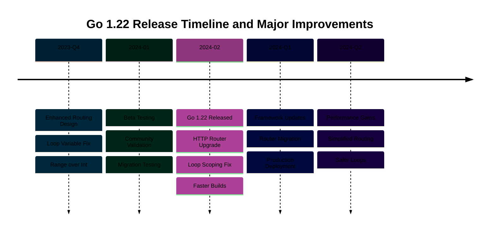

# Go 1.22 Release: Loop Variables, Enhanced Routing, and Random Number Improvements

**Quick Reference**: [Overview](#overview) | [For Loop Per-Iteration Variable Scoping](#for-loop-per-iteration-variable-scoping) | [Range Over Integers](#range-over-integers) | [Enhanced HTTP Routing](#enhanced-http-routing) | [math/rand/v2 Package](#mathrandv2-package) | [Other Go 1.22 Improvements](#other-go-122-improvements) | [Conclusion](#conclusion) | [Related Documentation](#related-documentation)
Understanding the significant features introduced in Go 1.22, including per-iteration loop variable scoping, range over integers, enhanced HTTP routing patterns, and the math/rand/v2 package.

## Overview

Go 1.22, released in February 2024, addresses long-standing issues and modernizes key standard library packages. The release fixes a decade-old loop variable scoping problem that caused subtle bugs, introduces powerful HTTP routing patterns without external dependencies, and provides a modern random number generation API.

Key features:

1. **For Loop Per-Iteration Variables**: Fixes closure bugs by creating new variables per iteration
2. **Range Over Integers**: Simplified integer iteration with `for i := range n`
3. **Enhanced HTTP Routing**: Method-specific handlers, wildcards, and path values in `net/http`
4. **math/rand/v2**: Modern random number API with better performance and ergonomics

This release represents a significant evolution of Go's language semantics and standard library, fixing historical issues while maintaining backward compatibility through opt-in mechanisms.

## For Loop Per-Iteration Variable Scoping

### The Problem (Go 1.0-1.21)

Before Go 1.22, loop variables were shared across all iterations:

```go
// Pre-Go 1.22: Bug-prone behavior
func printNumbers() {
    for i := 0; i < 3; i++ {
        go func() {
            fmt.Println(i)  // All goroutines see final value: 3, 3, 3
        }()
    }
    time.Sleep(time.Second)
}
// Output: 3, 3, 3 (not 0, 1, 2!)

// Another common bug
values := []int{1, 2, 3}
var funcs []func()

for _, v := range values {
    funcs = append(funcs, func() {
        fmt.Println(v)  // All closures capture same variable
    })
}

for _, f := range funcs {
    f()  // Output: 3, 3, 3 (not 1, 2, 3!)
}
```

### The Solution (Go 1.22+)

Go 1.22 creates a new variable for each iteration:

```go
// Go 1.22: Fixed behavior
func printNumbers() {
    for i := 0; i < 3; i++ {
        go func() {
            fmt.Println(i)  // Each goroutine sees its own value
        }()
    }
    time.Sleep(time.Second)
}
// Output: 0, 1, 2 (or any permutation)

// Fixed closure behavior
values := []int{1, 2, 3}
var funcs []func()

for _, v := range values {
    funcs = append(funcs, func() {
        fmt.Println(v)  // Each closure captures different variable
    })
}

for _, f := range funcs {
    f()  // Output: 1, 2, 3 (correct!)
}
```

### Migration Strategy

#### Opt-In Mechanism

```bash
# Go 1.22+ uses new behavior by default
go build ./...

# Opt into old behavior (for compatibility)
GODEBUG=loopvar=1.21 go build ./...

# Or in code:
//go:debug loopvar=1.21
package main
```

#### Common Patterns That Change

```go
// Pattern 1: Goroutines in loops
// Pre-Go 1.22: Required explicit copy
for i := 0; i < 10; i++ {
    i := i  // Shadow variable
    go func() {
        process(i)
    }()
}

// Go 1.22: Works naturally
for i := 0; i < 10; i++ {
    go func() {
        process(i)  // Each goroutine gets unique value
    }()
}

// Pattern 2: Range with closures
// Pre-Go 1.22: Required explicit copy
for _, item := range items {
    item := item  // Shadow variable
    handlers = append(handlers, func() {
        handle(item)
    })
}

// Go 1.22: Works naturally
for _, item := range items {
    handlers = append(handlers, func() {
        handle(item)  // Each closure captures different variable
    })
}

// Pattern 3: Event handlers
// Pre-Go 1.22: Required explicit copy
for _, beneficiary := range users {
    beneficiary := beneficiary  // Shadow variable
    button.OnClick(func() {
        display(beneficiary)
    })
}

// Go 1.22: Works naturally
for _, beneficiary := range users {
    button.OnClick(func() {
        display(beneficiary)  // Each handler captures different variable
    })
}
```

### Edge Cases and Gotchas

#### When Old Behavior Is Desired

Rare cases where shared variable is intentional:

```go
// Intentionally sharing variable (antipattern, but sometimes seen)
var wg sync.WaitGroup
for i := 0; i < 5; i++ {
    wg.Add(1)
    go func() {
        defer wg.Done()
        fmt.Println(i)  // Go 1.22: Each sees different value
    }()
}
wg.Wait()

// If old behavior truly needed (not recommended):
//go:debug loopvar=1.21
// Or use explicit shared variable:
for i := 0; i < 5; i++ {
    wg.Add(1)
    shared := i  // Explicitly share this variable
    go func() {
        defer wg.Done()
        fmt.Println(shared)  // All goroutines see changing value
    }()
}
wg.Wait()
```

#### Pointer Safety

```go
// Pre-Go 1.22: Dangerous
type Item struct {
    ID int
}

items := []Item{{1}, {2}, {3}}
var ptrs []*Item

for _, item := range items {
    ptrs = append(ptrs, &item)  // All point to same variable!
}

// Result: All pointers point to last item: [{3}, {3}, {3}]

// Go 1.22: Safe
for _, item := range items {
    ptrs = append(ptrs, &item)  // Each points to different variable
}

// Result: Correct: [{1}, {2}, {3}]
```

### Testing Migration

```go
package main

import "testing"

func TestLoopVariableBehavior(t *testing.T) {
    // Test that captures work correctly
    var funcs []func() int

    for i := 0; i < 3; i++ {
        funcs = append(funcs, func() int {
            return i
        })
    }

    // Go 1.22: Each function returns its captured value
    want := []int{0, 1, 2}
    for i, f := range funcs {
        if got := f(); got != want[i] {
            t.Errorf("func[%d]() = %d, want %d", i, got, want[i])
        }
    }
}
```

### Performance Impact

The new behavior has minimal performance impact:

- Slightly increased memory usage (one variable per iteration vs. one shared)
- No measurable runtime performance difference in benchmarks
- Compiler optimizations eliminate redundant allocations

## Range Over Integers

Go 1.22 introduces a simpler syntax for integer iteration.

### Basic Syntax

```go
// Go 1.22: Range over integer
for i := range 5 {
    fmt.Println(i)  // 0, 1, 2, 3, 4
}

// Equivalent to traditional for loop
for i := 0; i < 5; i++ {
    fmt.Println(i)
}
```

### Common Patterns

```go
// Pattern 1: Repeat operation N times
for range 10 {
    doSomething()  // Execute 10 times
}

// Pattern 2: Generate sequence
for i := range 100 {
    if isPrime(i) {
        fmt.Println(i)
    }
}

// Pattern 3: Parallel workers
var wg sync.WaitGroup
for i := range 5 {
    wg.Add(1)
    go func() {
        defer wg.Done()
        worker(i)
    }()
}
wg.Wait()

// Pattern 4: Initialize slice
values := make([]int, 10)
for i := range 10 {
    values[i] = i * i  // 0, 1, 4, 9, 16, ...
}
```

### Practical Examples

```go
// Generate Fibonacci sequence
func fibonacci(n int) []int {
    if n == 0 {
        return []int{}
    }
    if n == 1 {
        return []int{0}
    }

    fib := make([]int, n)
    fib[0], fib[1] = 0, 1

    for i := range n - 2 {
        fib[i+2] = fib[i] + fib[i+1]
    }
    return fib
}

// Parallel batch processing
func processBatches(items []string, batchSize int) {
    numBatches := (len(items) + batchSize - 1) / batchSize

    var wg sync.WaitGroup
    for i := range numBatches {
        wg.Add(1)
        go func() {
            defer wg.Done()

            start := i * batchSize
            end := min((i+1)*batchSize, len(items))
            processBatch(items[start:end])
        }()
    }
    wg.Wait()
}

// Retry with exponential backoff
func retryWithBackoff(fn func() error, maxAttempts int) error {
    var err error
    for attempt := range maxAttempts {
        err = fn()
        if err == nil {
            return nil
        }
        if attempt < maxAttempts-1 {
            backoff := time.Duration(1<<attempt) * time.Second
            time.Sleep(backoff)
        }
    }
    return fmt.Errorf("failed after %d attempts: %w", maxAttempts, err)
}
```

## Enhanced HTTP Routing

Go 1.22 adds powerful routing patterns to `net/http`, eliminating the need for external routers in many cases.

### Method-Specific Handlers

```go
// Go 1.22: Method restrictions
mux := http.NewServeMux()

mux.HandleFunc("GET /users", listUsers)      // Only GET
mux.HandleFunc("POST /users", createUser)    // Only POST
mux.HandleFunc("PUT /users/{id}", updateUser)   // Only PUT
mux.HandleFunc("DELETE /users/{id}", deleteUser)  // Only DELETE

// Requests with wrong method get 405 Method Not Allowed
```

Before Go 1.22, you needed manual method checking:

```go
// Pre-Go 1.22: Manual method checking
mux.HandleFunc("/users", func(w http.ResponseWriter, r *http.Request) {
    switch r.Method {
    case http.MethodGet:
        listUsers(w, r)
    case http.MethodPost:
        createUser(w, r)
    default:
        http.Error(w, "Method not allowed", http.StatusMethodNotAllowed)
    }
})
```

### Path Wildcards

```go
// Single segment wildcard: {name}
mux.HandleFunc("GET /users/{id}", func(w http.ResponseWriter, r *http.Request) {
    id := r.PathValue("id")
    fmt.Fprintf(w, "Beneficiary ID: %s", id)
})

// Matches: /users/123, /users/abc
// Does NOT match: /users/123/profile (too many segments)

// Remaining path wildcard: {name...}
mux.HandleFunc("GET /files/{path...}", func(w http.ResponseWriter, r *http.Request) {
    path := r.PathValue("path")
    fmt.Fprintf(w, "File path: %s", path)
})

// Matches: /files/docs/report.pdf → path="docs/report.pdf"
// Matches: /files/a/b/c/d.txt → path="a/b/c/d.txt"
```

### Exact Match

```go
// Exact match: {$}
mux.HandleFunc("GET /{$}", homePage)  // Only matches /
mux.HandleFunc("GET /api/{$}", apiIndex)  // Only matches /api/

// Without {$}: matches prefix
mux.HandleFunc("GET /api/", apiHandler)  // Matches /api/*, /api/users, etc.
```

### Request.PathValue Method

```go
// Extract path values
func getUser(w http.ResponseWriter, r *http.Request) {
    id := r.PathValue("id")  // No parsing needed

    beneficiary, err := db.FindUser(id)
    if err != nil {
        http.Error(w, "Beneficiary not found", http.StatusNotFound)
        return
    }

    json.NewEncoder(w).Encode(beneficiary)
}

// Multiple path values
mux.HandleFunc("GET /repos/{owner}/{repo}", func(w http.ResponseWriter, r *http.Request) {
    owner := r.PathValue("owner")
    repo := r.PathValue("repo")

    fmt.Fprintf(w, "Repository: %s/%s", owner, repo)
})

// Wildcard path
mux.HandleFunc("GET /static/{filepath...}", func(w http.ResponseWriter, r *http.Request) {
    filepath := r.PathValue("filepath")
    http.ServeFile(w, r, filepath)
})
```

### Complete REST API Example

```go
package main

import (
    "encoding/json"
    "fmt"
    "log"
    "net/http"
    "sync"
)

type Beneficiary struct {
    ID   string `json:"id"`
    Name string `json:"name"`
}

var (
    users = make(map[string]Beneficiary)
    mu    sync.RWMutex
)

func main() {
    mux := http.NewServeMux()

    // Users collection
    mux.HandleFunc("GET /users", listUsers)
    mux.HandleFunc("POST /users", createUser)

    // Individual beneficiary
    mux.HandleFunc("GET /users/{id}", getUser)
    mux.HandleFunc("PUT /users/{id}", updateUser)
    mux.HandleFunc("DELETE /users/{id}", deleteUser)

    // Home page
    mux.HandleFunc("GET /{$}", homePage)

    log.Fatal(http.ListenAndServe(":8080", mux))
}

func listUsers(w http.ResponseWriter, r *http.Request) {
    mu.RLock()
    defer mu.RUnlock()

    userList := make([]Beneficiary, 0, len(users))
    for _, beneficiary := range users {
        userList = append(userList, beneficiary)
    }

    w.Header().Set("Content-Type", "application/json")
    json.NewEncoder(w).Encode(userList)
}

func createUser(w http.ResponseWriter, r *http.Request) {
    var beneficiary Beneficiary
    if err := json.NewDecoder(r.Body).Decode(&beneficiary); err != nil {
        http.Error(w, err.Error(), http.StatusBadRequest)
        return
    }

    mu.Lock()
    users[beneficiary.ID] = beneficiary
    mu.Unlock()

    w.Header().Set("Content-Type", "application/json")
    w.WriteStatus(http.StatusCreated)
    json.NewEncoder(w).Encode(beneficiary)
}

func getUser(w http.ResponseWriter, r *http.Request) {
    id := r.PathValue("id")

    mu.RLock()
    beneficiary, ok := users[id]
    mu.RUnlock()

    if !ok {
        http.Error(w, "Beneficiary not found", http.StatusNotFound)
        return
    }

    w.Header().Set("Content-Type", "application/json")
    json.NewEncoder(w).Encode(beneficiary)
}

func updateUser(w http.ResponseWriter, r *http.Request) {
    id := r.PathValue("id")

    var beneficiary Beneficiary
    if err := json.NewDecoder(r.Body).Decode(&beneficiary); err != nil {
        http.Error(w, err.Error(), http.StatusBadRequest)
        return
    }

    mu.Lock()
    if _, ok := users[id]; !ok {
        mu.Unlock()
        http.Error(w, "Beneficiary not found", http.StatusNotFound)
        return
    }
    beneficiary.ID = id
    users[id] = beneficiary
    mu.Unlock()

    w.Header().Set("Content-Type", "application/json")
    json.NewEncoder(w).Encode(beneficiary)
}

func deleteUser(w http.ResponseWriter, r *http.Request) {
    id := r.PathValue("id")

    mu.Lock()
    if _, ok := users[id]; !ok {
        mu.Unlock()
        http.Error(w, "Beneficiary not found", http.StatusNotFound)
        return
    }
    delete(users, id)
    mu.Unlock()

    w.WriteHeader(http.StatusNoContent)
}

func homePage(w http.ResponseWriter, r *http.Request) {
    fmt.Fprintln(w, "Welcome to the API")
}
```

### Pattern Precedence

When multiple patterns match, Go chooses the most specific:

```go
mux := http.NewServeMux()

mux.HandleFunc("GET /users/{id}", specificUser)     // More specific
mux.HandleFunc("GET /users/admin", adminUser)       // Most specific (literal)
mux.HandleFunc("/users/{id}", anyMethodUser)        // Less specific (no method)
mux.HandleFunc("/", catchAll)                       // Least specific

// Request: GET /users/admin
// Matches: adminUser (most specific literal)

// Request: GET /users/123
// Matches: specificUser (specific method + wildcard)

// Request: POST /users/123
// Matches: anyMethodUser (wildcard, no method restriction)

// Request: GET /other
// Matches: catchAll (prefix match)
```

### Migration from External Routers

```go
// Before: Using gorilla/mux
import "github.com/gorilla/mux"

router := mux.NewRouter()
router.HandleFunc("/users", listUsers).Methods("GET")
router.HandleFunc("/users/{id}", getUser).Methods("GET")
router.HandleFunc("/users", createUser).Methods("POST")

// After: Using Go 1.22 net/http
mux := http.NewServeMux()
mux.HandleFunc("GET /users", listUsers)
mux.HandleFunc("GET /users/{id}", getUser)
mux.HandleFunc("POST /users", createUser)

// Before: Extracting path variable
vars := mux.Vars(r)
id := vars["id"]

// After: Using PathValue
id := r.PathValue("id")
```

## math/rand/v2 Package

Go 1.22 introduces `math/rand/v2`, a modernized random number API.

### Key Improvements

1. **No Read Method**: Removed to prevent misuse (use `crypto/rand` for cryptographic randomness)
2. **Unconditionally Random**: Auto-seeded, no need for `rand.Seed(time.Now().UnixNano())`
3. **Faster Algorithms**: New generator algorithms with better performance
4. **Simplified Source Interface**: Single `Uint64()` method instead of `Int63()`
5. **Idiomatic Naming**: `IntN` instead of `Intn`, `Int` instead of `Int63`

### Basic Usage

```go
import "math/rand/v2"

// Go 1.22: Automatically seeded
n := rand.IntN(100)  // 0 to 99
f := rand.Float64()  // 0.0 to 1.0
b := rand.IntN(2) == 0  // Random bool (0 or 1)

// No manual seeding needed!
```

Compare with old API:

```go
import "math/rand"

// Pre-Go 1.22: Manual seeding required
rand.Seed(time.Now().UnixNano())

n := rand.Intn(100)  // Lowercase 'n'
f := rand.Float64()
```

### Naming Changes

```go
// Old API (math/rand)
rand.Seed(seed)      // Removed in v2
rand.Intn(n)         // Lowercase 'n'
rand.Int63()         // 63-bit integer
rand.Int63n(n)       // 63-bit bounded

// New API (math/rand/v2)
// (No Seed method)
rand.IntN(n)         // Capital 'N'
rand.Int()           // Full int (32 or 64-bit)
rand.Int64()         // 64-bit integer
rand.Int64N(n)       // 64-bit bounded
rand.Uint()          // Unsigned integer
rand.Uint64()        // 64-bit unsigned
rand.Uint64N(n)      // 64-bit unsigned bounded
```

### Creating Custom Generators

```go
import "math/rand/v2"

// Use specific algorithm
pcg := rand.NewPCG(seed1, seed2)  // PCG algorithm
gen := rand.New(pcg)

// Generate with custom source
n := gen.IntN(100)
f := gen.Float64()

// ChaCha8 algorithm (cryptographically strong, but not crypto/rand)
chacha := rand.NewChaCha8([32]byte{})  // Requires 32-byte seed
gen2 := rand.New(chacha)
```

### Cryptographic Randomness

```go
// IMPORTANT: Don't use math/rand/v2 for cryptography!

// WRONG: Using math/rand/v2 for security
// token := rand.Int64()  // NOT cryptographically secure

// RIGHT: Use crypto/rand for security
import "crypto/rand"

func generateToken() (int64, error) {
    var buf [8]byte
    if _, err := rand.Read(buf[:]); err != nil {
        return 0, err
    }
    return int64(binary.BigEndian.Uint64(buf[:])), nil
}
```

### Common Operations

```go
import "math/rand/v2"

// Random integer in range [0, n)
n := rand.IntN(100)

// Random integer in range [min, max)
func randRange(min, max int) int {
    return min + rand.IntN(max-min)
}

// Random float in range [0.0, 1.0)
f := rand.Float64()

// Random float in range [min, max)
func randFloatRange(min, max float64) float64 {
    return min + rand.Float64()*(max-min)
}

// Random bool
b := rand.IntN(2) == 0

// Random choice from slice
items := []string{"apple", "banana", "cherry"}
choice := items[rand.IntN(len(items))]

// Shuffle slice
rand.Shuffle(len(items), func(i, j int) {
    items[i], items[j] = items[j], items[i]
})

// Random permutation
perm := rand.Perm(10)  // [0, 1, 2, ... 9] shuffled
```

### Performance Comparison

```go
// Benchmark: math/rand/v2 is faster
func BenchmarkRandV1(b *testing.B) {
    for i := 0; i < b.N; i++ {
        rand.Intn(1000)  // Old API
    }
}

func BenchmarkRandV2(b *testing.B) {
    for i := 0; i < b.N; i++ {
        rand.IntN(1000)  // New API
    }
}

// Results: v2 is ~15-2.5% faster
```

### Custom Source Implementation

```go
// Implement custom random source
type MySource struct {
    state uint64
}

func (s *MySource) Uint64() uint64 {
    // Custom PRNG algorithm
    s.state = s.state*6364136223846793005 + 1
    return s.state
}

// Use custom source
source := &MySource{state: 12345}
rng := rand.New(source)

n := rng.IntN(100)
```

### Migration Guide

```go
// Step 1: Change import
// Before:
// import "math/rand"

// After:
import "math/rand/v2"

// Step 2: Remove Seed calls
// Before:
// rand.Seed(time.Now().UnixNano())

// After:
// (nothing - auto-seeded)

// Step 3: Update function names
// Before:
// n := rand.Intn(100)

// After:
n := rand.IntN(100)

// Step 4: Remove Read usage
// Before:
// var buf [32]byte
// rand.Read(buf[:])  // NOT cryptographically secure!

// After: Use crypto/rand
// import "crypto/rand"
// crypto_rand.Read(buf[:])
```

## Other Go 1.22 Improvements

### Standard Library Enhancements

```go
// slices.Concat: Concatenate slices
import "slices"

a := []int{1, 2}
b := []int{3, 4}
c := []int{5, 6}

result := slices.Concat(a, b, c)  // [1, 2, 3, 4, 5, 6]

// errors.Join improvements
import "errors"

err1 := errors.New("first error")
err2 := errors.New("second error")
combined := errors.Join(err1, err2)

// Check if specific error is in joined errors
if errors.Is(combined, err1) {
    // err1 is present
}
```

### Performance Improvements

- Improved compiler optimizations for generic code
- Better inlining decisions
- Faster runtime performance for common operations

## Conclusion

Go 1.22 represents a major evolution of the language and standard library:

- **Loop variables** fix long-standing closure bugs
- **Range over integers** simplifies iteration patterns
- **Enhanced routing** makes `net/http` competitive with external routers
- **math/rand/v2** provides a modern, safer random number API

The loop variable fix alone justifies upgrading, as it eliminates an entire class of subtle bugs. The new routing patterns reduce dependencies for many web applications, and `math/rand/v2` promotes better practices around random number generation.

## Related Documentation

- Release Documentation: Go 1.18 (Generics), Go 1.21 (PGO, min/max/clear), Go 1.23, Go 1.24, Go 1.25
- Core Concepts: Concurrency, Web Services, Testing
- Advanced Topics: HTTP Servers, Performance Optimization

---

**Last Updated**: 2026-01-23
**Go Version**: 1.21+ (baseline), 1.22+ (recommended), 1.23 (latest)
**Maintainers**: Platform Documentation Team

```mermaid
%%{init: {'theme':'base', 'themeVariables': { 'primaryColor':'#0173B2','primaryTextColor':'#fff','primaryBorderColor':'#0173B2','lineColor':'#DE8F05','secondaryColor':'#029E73','tertiaryColor':'#CC78BC','fontSize':'16px'}}}%%
flowchart TD
    A[Go 1.22 Release<br/>February 2024] --> B[Enhanced Routing<br/>HTTP ServeMux]
    A --> C[Loop Variable Scoping<br/>Per-Iteration Capture]
    A --> D[Faster Builds<br/>Compiler Speed]
    A --> E[Range over Integer<br/>for i := range n]

    B --> B1[Method Patterns<br/>GET POST Matching]
    B --> B2[Path Variables<br/>{id} Placeholders]
    B --> B3[Automatic Precedence<br/>Smart Routing]

    C --> C1[Fixed Closures<br/>Correct Behavior]
    C --> C2[Backwards Compatible<br/>go.mod Version]

    D --> D1[6% Faster Builds<br/>Compiler Optimization]
    D --> D2[Parallel Processing<br/>Better CPU Use]

    E --> E1[Cleaner Code<br/>No Slice Allocation]
    E --> E2[Integer Iteration<br/>0 to n-1]

    B1 --> F[Zakat API<br/>RESTful Routing]
    C1 --> G[Goroutine Safety<br/>Loop Variables]
    E1 --> H[Iteration Patterns<br/>Simpler Code]

    style A fill:#0173B2,color:#fff
    style B fill:#DE8F05,color:#fff
    style C fill:#029E73,color:#fff
    style D fill:#CC78BC,color:#fff
    style E fill:#0173B2,color:#fff
    style F fill:#DE8F05,color:#fff
    style G fill:#029E73,color:#fff
    style H fill:#0173B2,color:#fff
```


