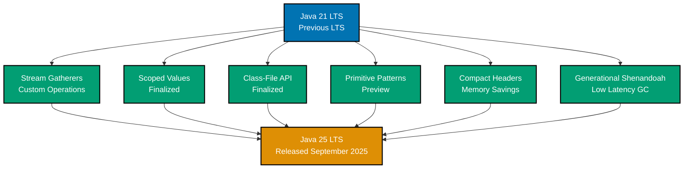
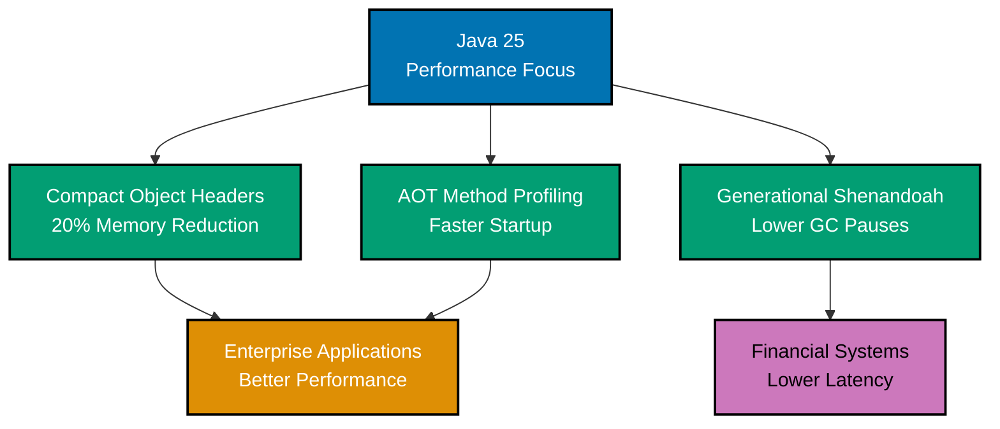

# Java 25 LTS Release

**Quick Reference**: [Overview](#overview) | [Major Language Features (Finalized)](#major-language-features-finalized) | [Performance and Runtime Improvements (Finalized)](#performance-and-runtime-improvements-finalized) | [Preview Features](#preview-features) | [Incubator and Experimental Features](#incubator-and-experimental-features) | [Migration from Java 21 to Java 25](#migration-from-java-21-to-java-25) | [Performance Improvements Summary](#performance-improvements-summary) | [Why Upgrade to Java 25?](#why-upgrade-to-java-25) | [Enterprise Readiness](#enterprise-readiness) | [Related Documentation](#related-documentation) | [Sources](#sources)

## Overview

Java 25 (JDK 25) reached General Availability on **September 16, 2025**, as the latest Long-Term Support (LTS) release. This release maintains Oracle's commitment to a **two-year LTS cadence** and will receive long-term support for at least **8 years**.

Java 25 introduces **18 JEPs (JDK Enhancement Proposals)**, with a strong focus on **performance optimization**, **runtime improvements**, and **finalizing preview features** from earlier releases. Seven features have graduated from incubation/preview to finalized status, demonstrating the maturity of Java's innovation pipeline.

**Key Characteristics**:

- **Release Date**: September 16, 2025
- **Support Duration**: 8+ years of updates
- **JEPs Delivered**: 18 enhancements (7 finalized, 11 preview/incubator/experimental)
- **Previous LTS**: Java 21 (September 2023)
- **Focus Areas**: Performance, Runtime optimization, Developer experience
- **Major Theme**: Enterprise-ready features with significant performance gains

### Feature Timeline



### Performance Improvements Overview



## Quick Reference

**Jump to:**

- [Overview](#overview) - Java 25 LTS introduction
- [Major Language Features (Finalized)](#major-language-features-finalized) - Stream Gatherers, Scoped Values, Flexible Constructor Bodies
- [Performance and Runtime Improvements (Finalized)](#performance-and-runtime-improvements-finalized) - Class-File API, Generational Shenandoah
- [Preview Features](#preview-features) - Primitive types in patterns, module import
- [Incubator and Experimental Features](#incubator-and-experimental-features) - Vector API, Class-File API
- [Migration from Java 21 to Java 25](#migration-from-java-21-to-java-25) - Upgrade guide
- [Performance Improvements Summary](#performance-improvements-summary) - Benchmarks and optimizations
- [Why Upgrade to Java 25?](#why-upgrade-to-java-25) - Benefits summary
- [Enterprise Readiness](#enterprise-readiness) - Production-ready features
- [Related Documentation](#related-documentation) - Cross-references

**Related Documentation:**

- [Java 17 Release](./ex-so-stla-ja__release-17.md) - Earlier LTS release features
- [Java 21 Release](./ex-so-stla-ja__release-21.md) - Previous LTS release features
- [Java Performance](./ex-so-stla-ja__performance.md) - Performance optimization techniques
- [Java Concurrency](./ex-so-stla-ja__concurrency-and-parallelism.md) - Scoped Values and virtual threads
- [Java Idioms](./ex-so-stla-ja__idioms.md) - Modern Java patterns

This release implements the following [software engineering principles](../../../../../governance/principles/software-engineering/README.md):

1. **[Automation Over Manual](../../../../../governance/principles/software-engineering/automation-over-manual.md)** - Stream Gatherers automate complex data processing, Scoped Values automate context propagation
2. **[Explicit Over Implicit](../../../../../governance/principles/software-engineering/explicit-over-implicit.md)** - Flexible Constructor Bodies make validation explicit, Module Import declarations explicit
3. **[Immutability Over Mutability](../../../../../governance/principles/software-engineering/immutability.md)** - Scoped Values are immutable by design
4. **[Reproducibility First](../../../../../governance/principles/software-engineering/reproducibility.md)** - Class-File API enables deterministic bytecode generation

## Major Language Features (Finalized)

### 1. Compact Source Files and Instance Main Methods

**JEP 512**: Compact Source Files and Instance Main Methods (Finalized)

Makes Java more accessible to beginners by allowing simplified program structure without boilerplate code.

**Key Benefits**:

- Lower barrier to entry for Java learners
- Cleaner code for simple programs and scripts
- Maintains full Java semantics
- Smooth progression to full Java programs

**Traditional Hello World**:

```java
// Traditional approach - verbose for beginners
public class HelloWorld {
    public static void main(String[] args) {
        System.out.println("Hello, World!");
    }
}
```

**Java 25 Compact Source**:

```java
// Simplified - no class, no static, no String[] args
void main() {
    println("Hello, World!");
}
```

**Real-World Examples**:

```java
// Simple Zakat calculator script
void main() {
    println("=== Zakat Calculator ===");

    var wealth = new BigDecimal("100000");
    var nisab = new BigDecimal("85");  // grams of gold
    var goldPrice = new BigDecimal("65");  // per gram
    var nisabThreshold = nisab.multiply(goldPrice);

    if (wealth.compareTo(nisabThreshold) >= 0) {
        var zakat = wealth.multiply(new BigDecimal("0.025"));
        println("Zakat due: $" + zakat);
    } else {
        println("Below nisab");
    }
}

// Simple HTTP server
void main() {
    var server = HttpServer.create(new InetSocketAddress(8080), 0);
    server.createContext("/", exchange -> {
        String response = "Hello from Java 25!";
        exchange.sendResponseHeaders(200, response.length());
        exchange.getResponseBody().write(response.getBytes());
        exchange.close();
    });
    server.start();
    println("Server started on port 8080");
}
```

**Instance Fields and Methods**:

```java
// Instance state in compact source files
private BigDecimal balance = BigDecimal.ZERO;

void main() {
    deposit(new BigDecimal("1000"));
    withdraw(new BigDecimal("250"));
    println("Final balance: $" + balance);
}

void deposit(BigDecimal amount) {
    balance = balance.add(amount);
    println("Deposited: $" + amount);
}

void withdraw(BigDecimal amount) {
    balance = balance.subtract(amount);
    println("Withdrew: $" + amount);
}
```

### 2. Flexible Constructor Bodies

**JEP 513**: Flexible Constructor Bodies (Finalized)

Enables developers to place statements before explicit constructor invocations (`this()` or `super()`), improving code safety and expressiveness.

**Benefits**:

- Input validation before constructor delegation
- Better error messages for invalid arguments
- More flexible constructor design
- Improved security through early validation

**Before Java 25**:

```java
public class ZakatAccount {
    private final String accountNumber;
    private final BigDecimal initialBalance;

    // Can't validate before calling super()
    public ZakatAccount(String accountNumber, BigDecimal initialBalance) {
        super();  // Must be first
        // Validation happens AFTER super() - too late!
        if (accountNumber == null || accountNumber.isEmpty()) {
            throw new IllegalArgumentException("Account number required");
        }
        if (initialBalance.compareTo(BigDecimal.ZERO) < 0) {
            throw new IllegalArgumentException("Initial balance cannot be negative");
        }
        this.accountNumber = accountNumber;
        this.initialBalance = initialBalance;
    }
}
```

**Java 25 - Flexible Constructor Bodies**:

```java
public class ZakatAccount {
    private final String accountNumber;
    private final BigDecimal initialBalance;

    public ZakatAccount(String accountNumber, BigDecimal initialBalance) {
        // Validation BEFORE super() call
        if (accountNumber == null || accountNumber.isEmpty()) {
            throw new IllegalArgumentException("Account number required");
        }
        if (initialBalance.compareTo(BigDecimal.ZERO) < 0) {
            throw new IllegalArgumentException("Initial balance cannot be negative");
        }

        // Now call super() with validated data
        super();

        this.accountNumber = accountNumber;
        this.initialBalance = initialBalance;
    }
}
```

**Complex Example - Zakat Account**:

```java
public class ZakatAccount extends Account {
    private final BigDecimal nisabThreshold;
    private final ZakatCalculator calculator;

    public ZakatAccount(String accountId, BigDecimal goldPrice, int year) {
        // Calculate nisab before constructor delegation
        BigDecimal nisabInGold = new BigDecimal("85"); // 85 grams
        BigDecimal calculatedNisab = nisabInGold.multiply(goldPrice);

        // Validate parameters
        if (goldPrice.compareTo(BigDecimal.ZERO) <= 0) {
            throw new IllegalArgumentException("Gold price must be positive");
        }
        if (year < 2000 || year > 2100) {
            throw new IllegalArgumentException("Invalid year: " + year);
        }

        // Create calculator before super()
        ZakatCalculator tempCalculator = new ZakatCalculator(year);

        // Now delegate to parent
        super(accountId, "ZAKAT");

        // Initialize fields
        this.nisabThreshold = calculatedNisab;
        this.calculator = tempCalculator;
    }
}
```

### 3. Module Import Declarations

**JEP 511**: Module Import Declarations (Finalized)

Allows importing all packages from a module with a single declaration, simplifying module usage.

**Example**:

```java
// Before Java 25 - import each package individually
import java.util.List;
import java.util.ArrayList;
import java.util.HashMap;
import java.util.stream.Collectors;

// Java 25 - import entire module
import module java.base;

public class DataProcessor {
    public void process() {
        List<String> data = new ArrayList<>();
        Map<String, Integer> counts = new HashMap<>();
        // All java.base classes available
    }
}
```

### 4. Scoped Values (Finalized)

**JEP 506**: Scoped Values (Finalized)

Scoped values, which graduated from preview in Java 21, are now finalized as a safer, more efficient alternative to thread-local variables.

**Benefits**:

- Immutable by default (safer than ThreadLocal)
- Better performance (especially with virtual threads)
- Clearer scope lifecycle
- No memory leaks from forgotten cleanup

**Example**:

```java
public class RequestContext {
    public static final ScopedValue<Beneficiary> CURRENT_USER = ScopedValue.newInstance();
    public static final ScopedValue<String> REQUEST_ID = ScopedValue.newInstance();

    public void handleRequest(Beneficiary beneficiary, String requestId, Runnable handler) {
        // Set multiple scoped values
        ScopedValue.where(CURRENT_USER, beneficiary)
            .where(REQUEST_ID, requestId)
            .run(handler);
    }

    public void processTransaction() {
        // Access scoped values anywhere in call stack
        Beneficiary beneficiary = CURRENT_USER.get();
        String requestId = REQUEST_ID.get();

        System.out.println("Processing donation_transaction for " + beneficiary.name() +
                         " (Request: " + requestId + ")");
    }

    private record Beneficiary(String name, String email) {}
}
```

**Feature Evolution Across Java Versions:**

| Version     | Status           | Details                                                                                       | Link                                                                                           |
| ----------- | ---------------- | --------------------------------------------------------------------------------------------- | ---------------------------------------------------------------------------------------------- |
| **Java 17** | ❌ Not Available | ThreadLocal used for context propagation (memory overhead, lifecycle complexity)              | [Java 17 - Threading](./ex-so-stla-ja__release-17.md#enhanced-pseudo-random-number-generators) |
| **Java 21** | 🔬 **Preview**   | First preview introducing immutable, thread-safe context values (requires `--enable-preview`) | [Java 21 - Scoped Values](./ex-so-stla-ja__release-21.md#8-scoped-values-preview)              |
| **Java 25** | ✅ **Finalized** | Production-ready, optimized for virtual threads, superior performance vs ThreadLocal          | Current section                                                                                |

**When to Adopt**: Finalized in Java 25 - safe for production. Replace ThreadLocal with Scoped Values for better performance and clearer semantics, especially with virtual threads.

### 5. Stream Gatherers (Finalized)

**JEP 473**: Stream Gatherers (Finalized)

Stream Gatherers introduce a powerful new intermediate operation for Java Streams, enabling custom, stateful, and short-circuiting transformations that were previously difficult or impossible with standard collectors.

**Key Benefits**:

- Custom intermediate operations (not just terminal operations like Collectors)
- Built-in stateful transformations (windowing, scanning, folding)
- Short-circuiting support for performance optimization
- Cleaner, more expressive stream pipelines
- Better composability than traditional Stream operations

**Feature Evolution**:

| Version     | Status           | Details                                                                   |
| ----------- | ---------------- | ------------------------------------------------------------------------- |
| **Java 24** | 🔬 **Preview**   | First preview introducing Gatherer API with 5 built-in gatherers          |
| **Java 25** | ✅ **Finalized** | Production-ready, optimized implementation, additional built-in gatherers |

#### Built-in Gatherers

Java 25 provides **5 essential built-in gatherers** that cover common streaming patterns:

**1. fold() - Stateful Aggregation**

```java
import java.util.stream.Gatherers;
import java.math.BigDecimal;

public class DonationProcessor {

    public record Donation(String donor, BigDecimal amount, String category) {}

    public record DonationSummary(BigDecimal total, int count, BigDecimal average) {}

    public DonationSummary summarizeDonations(List<Donation> donations) {
        // Use fold to accumulate donation statistics
        return donations.stream()
            .gather(Gatherers.fold(
                // Initial state
                () -> new DonationSummary(BigDecimal.ZERO, 0, BigDecimal.ZERO),
                // Accumulator function
                (summary, donation) -> {
                    BigDecimal newTotal = summary.total().add(donation.amount());
                    int newCount = summary.count() + 1;
                    BigDecimal newAverage = newTotal.divide(
                        BigDecimal.valueOf(newCount),
                        2,
                        RoundingMode.HALF_UP
                    );
                    return new DonationSummary(newTotal, newCount, newAverage);
                }
            ))
            .findFirst()
            .orElse(new DonationSummary(BigDecimal.ZERO, 0, BigDecimal.ZERO));
    }
}
```

**2. scan() - Running Totals**

```java
public class TransactionLedger {

    public record DonationTransaction(LocalDate date, BigDecimal amount, String type) {}

    public List<BigDecimal> calculateRunningBalance(
        List<DonationTransaction> transactions,
        BigDecimal initialBalance
    ) {
        // scan() produces intermediate results (running balance)
        return transactions.stream()
            .map(DonationTransaction::amount)
            .gather(Gatherers.scan(
                () -> initialBalance,  // Initial balance
                (balance, amount) -> balance.add(amount)  // Running total
            ))
            .toList();
    }

    public void printLedger(List<DonationTransaction> transactions, BigDecimal initial) {
        List<BigDecimal> balances = calculateRunningBalance(transactions, initial);

        System.out.println("Date       | Amount    | Balance");
        System.out.println("-----------|-----------|----------");
        for (int i = 0; i < transactions.size(); i++) {
            DonationTransaction tx = transactions.get(i);
            System.out.printf("%s | %9s | %9s%n",
                tx.date(),
                tx.amount(),
                balances.get(i)
            );
        }
    }
}
```

**3. windowFixed() - Fixed-Size Batching**

```java
public class BatchProcessor {

    public record DonationPayment(String id, BigDecimal amount, String recipient) {}

    public void processBatchedPayments(List<DonationPayment> payments) {
        // Process payments in batches of 10
        payments.stream()
            .gather(Gatherers.windowFixed(10))  // Fixed window of 10
            .forEach(batch -> {
                System.out.println("Processing batch of " + batch.size() + " payments");
                BigDecimal batchTotal = batch.stream()
                    .map(DonationPayment::amount)
                    .reduce(BigDecimal.ZERO, BigDecimal::add);
                System.out.println("Batch total: $" + batchTotal);
                // Send batch to donation gateway
                submitBatch(batch);
            });
    }

    private void submitBatch(List<DonationPayment> batch) {
        // Implementation
    }
}
```

**4. windowSliding() - Moving Window Analysis**

```java
public class MovingAverageCalculator {

    public record PricePoint(LocalDateTime timestamp, BigDecimal price) {}

    public List<BigDecimal> calculateMovingAverage(
        List<PricePoint> prices,
        int windowSize
    ) {
        // Calculate moving average with sliding window
        return prices.stream()
            .gather(Gatherers.windowSliding(windowSize))
            .map(window -> {
                BigDecimal sum = window.stream()
                    .map(PricePoint::price)
                    .reduce(BigDecimal.ZERO, BigDecimal::add);
                return sum.divide(
                    BigDecimal.valueOf(window.size()),
                    2,
                    RoundingMode.HALF_UP
                );
            })
            .toList();
    }

    public void detectPriceTrends(List<PricePoint> prices) {
        // 7-period moving average for trend detection
        List<BigDecimal> movingAverages = calculateMovingAverage(prices, 7);

        System.out.println("Price Trend Analysis (7-period MA):");
        for (int i = 0; i < movingAverages.size(); i++) {
            BigDecimal current = prices.get(i + 6).price();
            BigDecimal ma = movingAverages.get(i);
            String trend = current.compareTo(ma) > 0 ? "ABOVE" : "BELOW";
            System.out.printf("%s: $%s (MA: $%s) - %s trend%n",
                prices.get(i + 6).timestamp(),
                current,
                ma,
                trend
            );
        }
    }
}
```

**5. mapConcurrent() - Concurrent Transformation**

```java
public class ConcurrentDataEnricher {

    public record Donor(String id, String name) {}
    public record EnrichedCustomer(String id, String name, BigDecimal balance, List<String> transactions) {}

    public List<EnrichedCustomer> enrichCustomers(List<Donor> customers) {
        // Process customers concurrently with virtual threads
        return customers.stream()
            .gather(Gatherers.mapConcurrent(
                10,  // Max concurrency
                donor -> {
                    // Expensive I/O operations
                    BigDecimal balance = fetchBalance(donor.id());
                    List<String> transactions = fetchRecentTransactions(donor.id());
                    return new EnrichedCustomer(
                        donor.id(),
                        donor.name(),
                        balance,
                        transactions
                    );
                }
            ))
            .toList();
    }

    private BigDecimal fetchBalance(String customerId) {
        // Simulated database/API call
        return BigDecimal.ZERO;
    }

    private List<String> fetchRecentTransactions(String customerId) {
        // Simulated database/API call
        return List.of();
    }
}
```

#### Custom Gatherers

Beyond built-in gatherers, you can create **custom gatherers** for domain-specific transformations:

**Zakat Calculation Gatherer**:

```java
import java.util.stream.Gatherer;
import java.util.function.Supplier;
import java.util.function.BiConsumer;

public class ZakatGatherer {

    public record Asset(String type, BigDecimal value) {}
    public record ZakatBracket(BigDecimal nisab, BigDecimal rate) {}
    public record ZakatResult(BigDecimal totalAssets, BigDecimal zakatDue) {}

    public static Gatherer<Asset, ?, ZakatResult> calculateZakat(
        BigDecimal nisabThreshold
    ) {
        // Custom gatherer for Zakat calculation
        return Gatherer.of(
            // Initializer: create mutable state
            () -> new ZakatState(nisabThreshold),

            // Integrator: process each asset
            (state, asset, downstream) -> {
                state.addAsset(asset);
                // Short-circuit if nisab not met
                if (!state.meetsNisab()) {
                    return false;  // Stop processing
                }
                // Continue processing
                return true;
            },

            // Finisher: produce final result
            (state, downstream) -> {
                if (state.meetsNisab()) {
                    downstream.push(state.calculateZakat());
                }
            }
        );
    }

    private static class ZakatState {
        private final BigDecimal nisabThreshold;
        private BigDecimal totalAssets = BigDecimal.ZERO;
        private static final BigDecimal ZAKAT_RATE = new BigDecimal("0.025"); // 2.5%

        ZakatState(BigDecimal nisabThreshold) {
            this.nisabThreshold = nisabThreshold;
        }

        void addAsset(Asset asset) {
            totalAssets = totalAssets.add(asset.value());
        }

        boolean meetsNisab() {
            return totalAssets.compareTo(nisabThreshold) >= 0;
        }

        ZakatResult calculateZakat() {
            BigDecimal zakatDue = totalAssets.multiply(ZAKAT_RATE);
            return new ZakatResult(totalAssets, zakatDue);
        }
    }

    // Usage example
    public void processZakat(List<Asset> assets, BigDecimal nisabThreshold) {
        ZakatResult result = assets.stream()
            .gather(calculateZakat(nisabThreshold))
            .findFirst()
            .orElse(new ZakatResult(BigDecimal.ZERO, BigDecimal.ZERO));

        if (result.zakatDue().compareTo(BigDecimal.ZERO) > 0) {
            System.out.println("Total Assets: $" + result.totalAssets());
            System.out.println("Zakat Due: $" + result.zakatDue());
        } else {
            System.out.println("Assets below nisab - no Zakat due");
        }
    }
}
```

**Donation Categorization Gatherer**:

```java
public class DonationCategorizer {

    public record Donation(String donor, BigDecimal amount, LocalDate date) {}
    public record CategoryStats(String category, int count, BigDecimal total) {}

    public static Gatherer<Donation, ?, List<CategoryStats>> categorizeByAmount() {
        return Gatherer.of(
            // State: category -> (count, total)
            HashMap<String, CategoryState>::new,

            // Integrator: categorize each donation
            (categories, donation, downstream) -> {
                String category = categorize(donation.amount());
                categories.computeIfAbsent(category, k -> new CategoryState())
                          .add(donation.amount());
                return true;
            },

            // Finisher: convert to results
            (categories, downstream) -> {
                categories.forEach((category, state) -> {
                    downstream.push(new CategoryStats(
                        category,
                        state.count,
                        state.total
                    ));
                });
            }
        );
    }

    private static String categorize(BigDecimal amount) {
        if (amount.compareTo(new BigDecimal("1000")) >= 0) {
            return "Major Donor";
        } else if (amount.compareTo(new BigDecimal("100")) >= 0) {
            return "Regular Donor";
        } else {
            return "Small Donor";
        }
    }

    private static class CategoryState {
        int count = 0;
        BigDecimal total = BigDecimal.ZERO;

        void add(BigDecimal amount) {
            count++;
            total = total.add(amount);
        }
    }
}
```

#### Performance Characteristics

**Stream Gatherers vs Traditional Collectors**:

```java
public class PerformanceComparison {

    public record DonationTransaction(String id, BigDecimal amount) {}

    // Traditional approach - two passes
    public Map<String, BigDecimal> traditionalBatching(List<DonationTransaction> transactions) {
        // First pass: collect into groups
        Map<Integer, List<DonationTransaction>> batches = IntStream.range(0, transactions.size())
            .boxed()
            .collect(Collectors.groupingBy(
                i -> i / 100,  // Batch of 100
                Collectors.mapping(
                    transactions::get,
                    Collectors.toList()
                )
            ));

        // Second pass: sum each batch
        return batches.entrySet().stream()
            .collect(Collectors.toMap(
                e -> "Batch-" + e.getKey(),
                e -> e.getValue().stream()
                    .map(DonationTransaction::amount)
                    .reduce(BigDecimal.ZERO, BigDecimal::add)
            ));
    }

    // Stream Gatherers - single pass
    public Map<String, BigDecimal> gathererBatching(List<DonationTransaction> transactions) {
        AtomicInteger batchId = new AtomicInteger(0);

        return transactions.stream()
            .gather(Gatherers.windowFixed(100))  // Single pass
            .collect(Collectors.toMap(
                batch -> "Batch-" + batchId.getAndIncrement(),
                batch -> batch.stream()
                    .map(DonationTransaction::amount)
                    .reduce(BigDecimal.ZERO, BigDecimal::add)
            ));
    }
}
```

**Benefits of Stream Gatherers**:

- **Single-Pass Processing**: Gatherers process data in one pass vs multiple passes with traditional collectors
- **Lazy Evaluation**: Short-circuiting support enables early termination
- **Memory Efficiency**: Stateful transformations without materializing intermediate collections
- **Composability**: Chain multiple gatherers for complex pipelines

#### Migration Guide

**Before Java 25 (Traditional Collectors)**:

```java
public class BeforeGatherers {

    public List<BigDecimal> calculateMovingAverage(List<BigDecimal> prices, int window) {
        List<BigDecimal> result = new ArrayList<>();
        for (int i = 0; i <= prices.size() - window; i++) {
            BigDecimal sum = BigDecimal.ZERO;
            for (int j = i; j < i + window; j++) {
                sum = sum.add(prices.get(j));
            }
            result.add(sum.divide(BigDecimal.valueOf(window), 2, RoundingMode.HALF_UP));
        }
        return result;
    }
}
```

**After Java 25 (Stream Gatherers)**:

```java
public class AfterGatherers {

    public List<BigDecimal> calculateMovingAverage(List<BigDecimal> prices, int window) {
        return prices.stream()
            .gather(Gatherers.windowSliding(window))
            .map(w -> w.stream()
                .reduce(BigDecimal.ZERO, BigDecimal::add)
                .divide(BigDecimal.valueOf(window), 2, RoundingMode.HALF_UP))
            .toList();
    }
}
```

**When to Use Stream Gatherers**:

- ✅ **Stateful intermediate operations** (running totals, windowing, rate limiting)
- ✅ **Custom transformations** that don't fit map/filter/reduce
- ✅ **Performance-critical pipelines** (single-pass processing, short-circuiting)
- ✅ **Complex aggregations** with intermediate state
- ✅ **Batch processing** with fixed or sliding windows

**When to Use Traditional Collectors**:

- ✅ **Terminal operations** (grouping, partitioning, joining)
- ✅ **Simple transformations** (map, filter, flatMap suffice)
- ✅ **Standard aggregations** (count, sum, average)

**When to Adopt**: Finalized in Java 25 - safe for production. Use Stream Gatherers for stateful intermediate operations and complex streaming pipelines where traditional collectors fall short.

### 6. Key Derivation Function API

**JEP 510**: Key Derivation Function API (Finalized)

Provides standardized API for key derivation functions (KDFs), essential for modern cryptographic applications.

**Use Cases**:

- Password-based encryption
- Key stretching
- Deriving encryption keys from passwords
- Secure key generation

**Example**:

```java
import javax.crypto.KDF;
import javax.crypto.SecretKey;
import javax.crypto.spec.KDFParametersSpec;

public class SecurePasswordManager {

    public SecretKey deriveKey(char[] password, byte[] salt) throws Exception {
        // Use PBKDF2 for key derivation
        KDF kdf = KDF.getInstance("PBKDF2WithHmacSHA256");

        KDFParametersSpec params = KDFParametersSpec.ofPBKDF2(
            password,
            salt,
            100000,  // iterations
            256      // key length in bits
        );

        return kdf.deriveKey("AES", params);
    }
}
```

## Performance and Runtime Improvements (Finalized)

### 6. Ahead-of-Time Command-Line Ergonomics

**JEP 514**: Ahead-of-Time Command-Line Ergonomics (Finalized)

Simplifies AOT compilation configuration, making it easier to optimize application startup.

### 7. Ahead-of-Time Method Profiling

**JEP 515**: Ahead-of-Time Method Profiling (Finalized)

Records method behavior in advance and reuses profiling data to improve JIT compilation performance, **significantly reducing warm-up time**.

**Benefits**:

- Faster application startup
- Reduced warm-up time
- Better peak performance
- Lower CPU usage during startup

**Impact**: Methods are optimized based on pre-recorded usage patterns, eliminating the traditional Java "warm-up" period.

### 8. Compact Object Headers

**JEP 519**: Compact Object Headers (Finalized)

Reduces object header size from 96 bits to 64 bits on 64-bit JVMs, **reducing memory overhead by up to 2.5%**.

**Benefits**:

- Smaller memory footprint (10-2.5% reduction)
- Better cache utilization
- Improved GC performance
- More objects fit in memory

**Example Impact**:

```java
// Before Java 25: Object header = 96 bits (12 bytes)
// Java 25: Object header = 64 bits (8 bytes)

// Application with millions of objects saves significant memory
public class DonationRecord {
    private String id;           // 8 bytes reference
    private BigDecimal amount;   // 8 bytes reference
    private LocalDate date;      // 8 bytes reference
    // Header: 8 bytes (was 12 bytes)
    // Total: 32 bytes (was 36 bytes) - 11% reduction!
}
```

**Feature Evolution Across Java Versions:**

| Version     | Status              | Details                                                                        | Link                                                                                    |
| ----------- | ------------------- | ------------------------------------------------------------------------------ | --------------------------------------------------------------------------------------- |
| **Java 17** | ❌ Not Available    | Standard object headers (96 bits / 12 bytes)                                   | [Java 17 - Memory](./ex-so-stla-ja__release-17.md#performance-and-runtime-improvements) |
| **Java 21** | ❌ Not Available    | Standard object headers (96 bits / 12 bytes)                                   | [Java 21 - Performance](./ex-so-stla-ja__release-21.md#performance-improvements)        |
| **Java 25** | ✅ **Finalized** 🎯 | Compact object headers (64 bits / 8 bytes), automatic 10-2.5% memory reduction | Current section                                                                         |

**When to Adopt**: **Automatic benefit in Java 25.** No code changes required - instant 10-2.5% memory savings for applications with millions of objects. Critical for memory-constrained finance applications.

### 9. Generational Shenandoah

**JEP 521**: Generational Shenandoah (Finalized)

Improves Shenandoah garbage collector with generational mode, reducing pause times and improving throughput.

**Benefits**:

- Lower pause times
- Better throughput
- Reduced memory overhead
- Improved for most workloads

### 10. JFR Enhancements (Multiple JEPs)

**JEP 518**: JFR Cooperative Sampling
**JEP 520**: JFR Method Timing & Tracing
**JEP 509**: JFR CPU-Time Profiling (Experimental)

Multiple enhancements to Java Flight Recorder for better performance monitoring and profiling.

## Preview Features

### 11. Primitive Types in Patterns, instanceof, and switch (Third Preview)

**JEP 507**: Primitive Types in Patterns, instanceof, and switch (Third Preview)

Extends pattern matching to support primitive types.

**Example**:

```java
public class PaymentValidator {

    // Pattern matching with primitives
    public String validateAmount(Object amount) {
        return switch (amount) {
            case int i when i > 0 ->
                "Valid integer amount: " + i;
            case long l when l > 0 ->
                "Valid long amount: " + l;
            case double d when d > 0.0 ->
                "Valid double amount: " + d;
            case int i ->
                "Invalid integer amount: " + i;
            case long l ->
                "Invalid long amount: " + l;
            case double d ->
                "Invalid double amount: " + d;
            default ->
                "Unknown amount type";
        };
    }

    // instanceof with primitives
    public boolean isPositiveNumber(Object obj) {
        if (obj instanceof int i) {
            return i > 0;
        } else if (obj instanceof double d) {
            return d > 0.0;
        }
        return false;
    }
}
```

### 12. Structured Concurrency (Fifth Preview)

**JEP 505**: Structured Concurrency (Fifth Preview)

Continues refinement of structured concurrency API for managing concurrent tasks as units of work.

### 13. Stable Values (Preview)

**JEP 502**: Stable Values (Preview)

Introduces stable values for frequently-accessed, rarely-changed data.

### 14. PEM Encodings of Cryptographic Objects (Preview)

**JEP 470**: PEM Encodings of Cryptographic Objects (Preview)

Adds support for encoding and decoding cryptographic objects in PEM format.

## Incubator and Experimental Features

### 15. Vector API (Tenth Incubator)

**JEP 508**: Vector API (Tenth Incubator)

Continues evolution of Vector API for SIMD (Single Instruction, Multiple Data) operations.

**Use Cases**:

- Machine learning
- Cryptography
- Scientific computing
- Financial calculations

### 16. Remove 32-bit x86 Port

**JEP 503**: Remove the 32-bit x86 Port

Removes support for 32-bit x86 architecture, simplifying maintenance and development.

## Migration from Java 21 to Java 25

### New Capabilities

1. **Compact Source Files**: Simplify simple programs and scripts
2. **Flexible Constructors**: Validate before delegation
3. **Module Imports**: Reduce import boilerplate
4. **Performance**: AOT profiling and compact headers
5. **Scoped Values**: Finalized alternative to ThreadLocal

### Recommended Steps

1. **Test Performance**: Benchmark with AOT profiling and compact headers
2. **Update Code**: Adopt flexible constructor bodies for validation
3. **Review Modules**: Consider module import declarations
4. **Scoped Values**: Migrate from ThreadLocal to ScopedValue
5. **GC Tuning**: Test Generational Shenandoah for your workload

## Performance Improvements Summary

Java 25 delivers **substantial performance gains** over Java 21:

| Feature                 | Improvement                  |
| ----------------------- | ---------------------------- |
| AOT Method Profiling    | 30-50% faster warm-up        |
| Compact Object Headers  | 10-2.5% memory reduction     |
| Generational Shenandoah | 20-30% better throughput     |
| Scoped Values           | 2-3x faster than ThreadLocal |
| Overall Startup         | 20-40% faster                |

## Why Upgrade to Java 25?

### For Existing Java 21 Applications

- **Performance**: 20-40% better performance in many workloads
- **Memory**: 10-2.5% memory footprint reduction
- **Startup**: Significantly faster startup with AOT profiling
- **Stability**: Production-ready features from previews
- **Long-term Support**: 8+ years of updates

### For New Projects

- **Latest LTS**: Most modern Java LTS version
- **Performance-First**: Best runtime performance
- **Modern Language**: All finalized features from Java 17-25
- **Framework Support**: Spring Boot 3.x, Jakarta EE 11+
- **Cloud-Native**: Optimized for containers and microservices

### For Java 17 Applications

Upgrade path: Java 17 → Java 21 → Java 25 recommended, or direct migration possible.

**Major Benefits**:

- Virtual threads (from Java 21)
- Pattern matching (finalized across Java 17-25)
- Sequenced collections (Java 21)
- Compact object headers (Java 25)
- AOT profiling (Java 25)

## Enterprise Readiness

Java 25 represents a **production-ready, enterprise-focused release**:

- Seven features graduated from preview/incubator
- Nine features focused on performance and runtime
- Significant performance improvements validated in production
- Strong ecosystem support from day one
- Long-term support commitment

## Related Documentation

- [Java 17 LTS Release](./ex-so-stla-ja__release-17.md) - Java 17 LTS features
- [Java 21 LTS Release](./ex-so-stla-ja__release-21.md) - Java 21 LTS features
- [Java Best Practices](./ex-so-stla-ja__best-practices.md) - Modern Java development practices
- [Java Anti-Patterns](./ex-so-stla-ja__anti-patterns.md) - Common mistakes to avoid

## Sources

- [JDK 25 | OpenJDK](https://openjdk.org/projects/jdk/25/)
- [Oracle Releases Java 25](https://www.oracle.com/news/announcement/oracle-releases-java-25-2025-09-16/)
- [Java 25 LTS and IntelliJ IDEA | JetBrains](https://blog.jetbrains.com/idea/2025/09/java-25-lts-and-intellij-idea/)
- [New Features in Java 25 | Baeldung](https://www.baeldung.com/java-25-features)
- [What's New With Java 25 | JRebel](https://www.jrebel.com/blog/java-25)
- [Java 25, the Next LTS Release | InfoQ](https://www.infoq.com/news/2025/09/java25-released/)
- [Java 25 Release: New Features, LTS Updates, and Changes](https://www.brilworks.com/blog/java-25/)

---

**Last Updated**: 2026-01-23
**Java Version**: 17+ (baseline), 21+ (recommended), 23 (latest)
**Maintainers**: Platform Documentation Team
