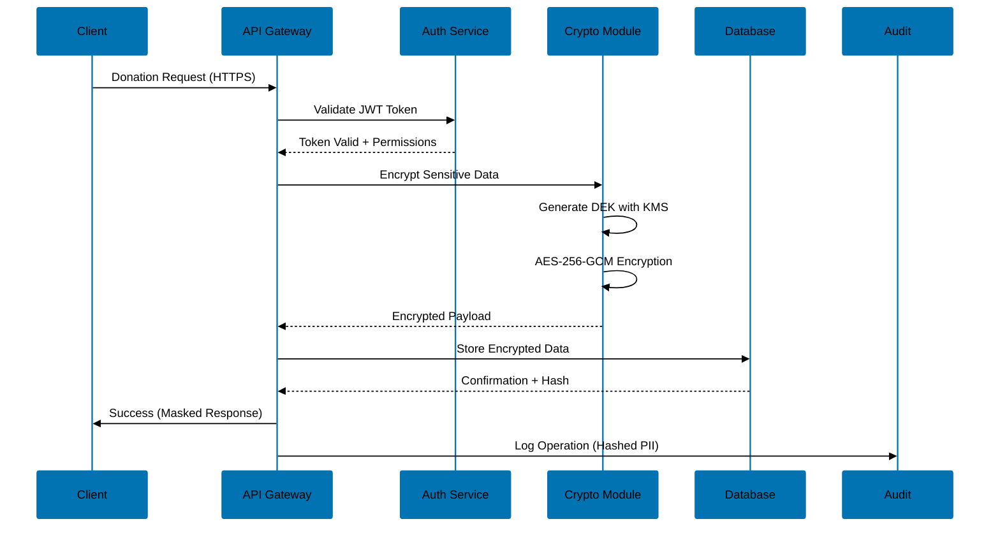

# Java Security: Comprehensive Guide to Secure Application Development

**Quick Reference**: [Introduction](#introduction) | [Input Validation](#input-validation) | [Injection Prevention](#injection-prevention) | [Authentication & Authorization](#authentication--authorization) | [Cryptography](#cryptography) | [Secure Coding Practices](#secure-coding-practices) | [Dependency Management](#dependency-management) | [Audit Logging](#audit-logging) | [Modern Java Security Features](#modern-java-security-features) | [Security Checklist](#security-checklist) | [Performance vs Security Trade-offs](#performance-vs-security-trade-offs) | [Related Principles](#related-principles) | [Sources](#sources)

## Quick Reference

**Jump to:**

- [Input Validation](#input-validation) - Protecting against malicious input
- [Injection Prevention](#injection-prevention) - SQL, XSS, command injection
- [Authentication & Authorization](#authentication--authorization) - Identity management
- [Cryptography](#cryptography) - Encryption and secure data handling
- [Secure Coding Practices](#secure-coding-practices) - OWASP Top 10
- [Dependency Management](#dependency-management) - Supply chain security
- [Audit Logging](#audit-logging) - Financial compliance and tracking
- [Modern Java Security Features](#modern-java-security-features) - Java 17-25 innovations

**Related Documentation:**

- [Java Idioms](./ex-so-stla-ja__idioms.md) - Secure coding patterns
- [Best Practices](./ex-so-stla-ja__best-practices.md) - General development guidelines
- [Anti-Patterns](./ex-so-stla-ja__anti-patterns.md) - Security anti-patterns
- [Performance](./ex-so-stla-ja__performance.md) - Security vs performance trade-offs

**Version Navigation:**

← [Java 17](./ex-so-stla-ja__release-17.md) | [Java 21](./ex-so-stla-ja__release-21.md) | [Java 25](./ex-so-stla-ja__release-25.md) →

---

## Introduction

Security is not an afterthought—it's a fundamental requirement in enterprise Java applications, especially those handling sensitive financial data like Zakat calculations, donation processing, qard_hasan agreements, and zakat compliance. This comprehensive guide covers modern Java security best practices aligned with OWASP guidelines and updated for Java 17-25 LTS releases.

**Why Security Matters in Finance:**

- **Data Protection**: Safeguard donor information, beneficiary records, and financial transactions
- **Regulatory Compliance**: Meet legal requirements for audit trails and data privacy (GDPR, PCI-DSS)
- **Trust Preservation**: Maintain stakeholder confidence through robust security measures
- **Financial Integrity**: Prevent fraud, tampering, and unauthorized access to sensitive operations

**Core Security Principles:**

1. **Defense in Depth**: Multiple security layers (validation, authentication, encryption, logging)
2. **Principle of Least Privilege**: Grant minimum necessary permissions
3. **Secure by Default**: Start with restrictive settings, relax when needed
4. **Fail Securely**: Handle errors without exposing sensitive information
5. **Never Trust Input**: Validate and sanitize all data from external sources

**Defense in Depth Architecture:**

```mermaid
%% Color Palette: Blue #0173B2, Orange #DE8F05, Teal #029E73, Purple #CC78BC
%% All colors are color-blind friendly and meet WCAG AA contrast standards

graph TB
    subgraph Layer1["🌐 Layer 1: Perimeter Defense"]
        Firewall[Firewall/WAF]:::orange
        RateLimit[Rate Limiting]:::orange
    end

    subgraph Layer2["🔐 Layer 2: Authentication & Authorization"]
        Auth[Authentication JWT]:::blue
        AuthZ[Authorization RBAC]:::blue
    end

    subgraph Layer3["✅ Layer 3: Input Validation"]
        Validate[Input Validation]:::teal
        Sanitize[Data Sanitization]:::teal
    end

    subgraph Layer4["🛡️ Layer 4: Application Security"]
        Encrypt[Encryption at Rest]:::purple
        Secure[Secure Coding]:::purple
        ParamQuery[Parameterized Queries]:::purple
    end

    subgraph Layer5["📊 Layer 5: Monitoring & Logging"]
        Audit[Audit Logging]:::orange
        Monitor[Security Monitoring]:::orange
        Alert[Intrusion Detection]:::orange
    end

    Firewall --> Auth
    RateLimit --> Auth
    Auth --> Validate
    AuthZ --> Sanitize
    Validate --> Encrypt
    Sanitize --> Secure
    Encrypt --> Audit
    Secure --> Monitor
    ParamQuery --> Alert

    note1[Multiple layers ensure<br/>that if one fails,<br/>others still protect]:::teal

    note1 -.-> Layer3

    classDef blue fill:#0173B2,stroke:#000000,color:#FFFFFF,stroke-width:2px
    classDef orange fill:#DE8F05,stroke:#000000,color:#000000,stroke-width:2px
    classDef teal fill:#029E73,stroke:#000000,color:#FFFFFF,stroke-width:2px
    classDef purple fill:#CC78BC,stroke:#000000,color:#FFFFFF,stroke-width:2px
```



---

## Input Validation

Input validation is the cornerstone of application security. By verifying every input from users, APIs, or third-party systems, developers ensure only trusted data enters the application, preventing most injection attacks in the OWASP Top 10.

### Validation Strategy

**Allowlist Approach (Recommended)**

Define what is permitted rather than blocking known attacks. This provides stronger protection against novel attack vectors.

```java
// WRONG: Blocklist approach - easily bypassed
public class DonationValidator {
    private static final Pattern BLOCKED = Pattern.compile("[<>'\";]");

    public boolean isValidAmount(String amount) {
        return !BLOCKED.matcher(amount).find(); // Weak!
    }
}

// CORRECT: Allowlist approach - only permit valid formats
public class SecureDonationValidator {
    private static final Pattern VALID_AMOUNT =
        Pattern.compile("^\\d{1,10}(\\.\\d{1,2})?$");

    public boolean isValidAmount(String amount) {
        if (amount == null || amount.isBlank()) {
            return false;
        }
        // Only allow: digits, optional decimal with 2 places
        return VALID_AMOUNT.matcher(amount).matches();
    }
}
```

**Testing Input Validation:**

```java
@Test
void shouldRejectInvalidDonationAmounts() {
    var validator = new SecureDonationValidator();

    // Valid amounts
    assertTrue(validator.isValidAmount("100.00"));
    assertTrue(validator.isValidAmount("1234567890"));
    assertTrue(validator.isValidAmount("0.01"));

    // Invalid amounts - injection attempts
    assertFalse(validator.isValidAmount("100'; DROP TABLE donations--"));
    assertFalse(validator.isValidAmount("<script>alert('xss')</script>"));
    assertFalse(validator.isValidAmount("100.001")); // Too many decimals
    assertFalse(validator.isValidAmount("-50.00")); // Negative (handle separately)
    assertFalse(validator.isValidAmount("")); // Empty
    assertFalse(validator.isValidAmount(null)); // Null
}
```

### Finance Domain Validation

**Monetary Amount Validation:**

```java
public record MoneyValidator() {
    private static final BigDecimal MAX_AMOUNT =
        new BigDecimal("999999999.99"); // $999M limit
    private static final BigDecimal MIN_AMOUNT = BigDecimal.ZERO;

    public ValidationResult validate(String input) {
        // Step 1: Format validation
        if (input == null || input.isBlank()) {
            return ValidationResult.error("Amount cannot be blank");
        }

        // Step 2: Pattern matching (allowlist)
        if (!input.matches("^\\d{1,10}(\\.\\d{1,2})?$")) {
            return ValidationResult.error("Invalid amount format");
        }

        // Step 3: Parse safely
        BigDecimal amount;
        try {
            amount = new BigDecimal(input);
        } catch (NumberFormatException e) {
            return ValidationResult.error("Cannot parse amount");
        }

        // Step 4: Range validation
        if (amount.compareTo(MIN_AMOUNT) < 0) {
            return ValidationResult.error("Amount cannot be negative");
        }
        if (amount.compareTo(MAX_AMOUNT) > 0) {
            return ValidationResult.error("Amount exceeds maximum");
        }

        return ValidationResult.success(amount);
    }
}

public record ValidationResult<T>(boolean valid, String error, T value) {
    public static <T> ValidationResult<T> success(T value) {
        return new ValidationResult<>(true, null, value);
    }

    public static <T> ValidationResult<T> error(String message) {
        return new ValidationResult<>(false, message, null);
    }
}
```

**Tax Identification Number (TIN) Validation:**

```java
public class ZakatIdValidator {
    // Country-specific patterns (example: US EIN format)
    private static final Pattern US_EIN = Pattern.compile("^\\d{2}-\\d{7}$");
    private static final Pattern GENERIC_TIN = Pattern.compile("^[A-Z0-9]{5,15}$");

    public ValidationResult<String> validate(String zakatId, String country) {
        if (zakatId == null || zakatId.isBlank()) {
            return ValidationResult.error("Tax ID cannot be blank");
        }

        // Country-specific validation
        Pattern pattern = switch (country) {
            case "US" -> US_EIN;
            case "UK", "CA", "AU" -> GENERIC_TIN;
            default -> GENERIC_TIN;
        };

        if (!pattern.matcher(zakatId).matches()) {
            return ValidationResult.error("Invalid Tax ID format for " + country);
        }

        return ValidationResult.success(zakatId);
    }
}
```

**Testing Tax ID Validation:**

```java
@Test
void shouldValidateCountrySpecificTaxIds() {
    var validator = new ZakatIdValidator();

    // Valid US EIN
    var result = validator.validate("12-3456789", "US");
    assertTrue(result.valid());
    assertEquals("12-3456789", result.value());

    // Invalid format
    result = validator.validate("123456789", "US"); // Missing dash
    assertFalse(result.valid());

    // SQL injection attempt
    result = validator.validate("12-3456789'; DROP TABLE taxes--", "US");
    assertFalse(result.valid());
}
```

### Length and Size Limits

Enforce maximum input lengths to prevent:

- Buffer overflow attacks
- Denial-of-service through memory exhaustion
- CRLF injection in logs

```java
public record InputSizeValidator() {
    private static final int MAX_NAME_LENGTH = 100;
    private static final int MAX_DESCRIPTION_LENGTH = 5000;
    private static final int MAX_EMAIL_LENGTH = 255;

    public ValidationResult<String> validateDonorName(String name) {
        if (name == null || name.isBlank()) {
            return ValidationResult.error("Name cannot be blank");
        }

        // Trim and check length
        String trimmed = name.trim();
        if (trimmed.length() > MAX_NAME_LENGTH) {
            return ValidationResult.error(
                "Name exceeds maximum length of " + MAX_NAME_LENGTH
            );
        }

        // Allowlist: letters, spaces, hyphens, apostrophes
        if (!trimmed.matches("^[a-zA-Z\\s'-]+$")) {
            return ValidationResult.error("Name contains invalid characters");
        }

        return ValidationResult.success(trimmed);
    }

    public ValidationResult<String> validateCampaignDescription(String desc) {
        if (desc == null || desc.isBlank()) {
            return ValidationResult.error("Description cannot be blank");
        }

        String trimmed = desc.trim();
        if (trimmed.length() > MAX_DESCRIPTION_LENGTH) {
            return ValidationResult.error(
                "Description exceeds " + MAX_DESCRIPTION_LENGTH + " characters"
            );
        }

        // Allow most characters but prevent control characters
        if (trimmed.chars().anyMatch(Character::isISOControl)) {
            return ValidationResult.error("Description contains control characters");
        }

        return ValidationResult.success(trimmed);
    }
}
```

### Validation at System Boundaries

Validate inputs at the earliest point where they enter your system—typically at the controller/API layer.

```java
@RestController
@RequestMapping("/api/donations")
public class DonationController {
    private final DonationService donationService;
    private final MoneyValidator moneyValidator;
    private final InputSizeValidator sizeValidator;

    @PostMapping
    public ResponseEntity<DonationResponse> createDonation(
            @RequestBody DonationRequest request) {

        // Validate amount
        var amountResult = moneyValidator.validate(request.amount());
        if (!amountResult.valid()) {
            return ResponseEntity.badRequest()
                .body(new DonationResponse(null, amountResult.error()));
        }

        // Validate donor name
        var nameResult = sizeValidator.validateDonorName(request.donorName());
        if (!nameResult.valid()) {
            return ResponseEntity.badRequest()
                .body(new DonationResponse(null, nameResult.error()));
        }

        // Proceed with validated data
        var donation = donationService.create(
            amountResult.value(),
            nameResult.value(),
            request.purpose()
        );

        return ResponseEntity.ok(new DonationResponse(donation.id(), null));
    }
}
```

---

## Injection Prevention

Injection vulnerabilities allow attackers to inject malicious code into queries, commands, or scripts. The OWASP Top 10 consistently ranks injection attacks as critical threats.

### SQL Injection Prevention

**Problem: String Concatenation**

Building SQL queries through string concatenation allows attackers to manipulate query logic.

```java
// WRONG: SQL Injection vulnerability
public class DonationRepositoryInsecure {
    private final DataSource dataSource;

    public List<Donation> findByDonor(String donorName) throws SQLException {
        String query = "SELECT * FROM donations WHERE donor_name = '"
            + donorName + "'"; // VULNERABLE!

        try (Connection conn = dataSource.getConnection();
             Statement stmt = conn.createStatement();
             ResultSet rs = stmt.executeQuery(query)) {
            // Process results...
        }
    }
}

// Attack: donorName = "' OR '1'='1"
// Result: SELECT * FROM donations WHERE donor_name = '' OR '1'='1'
// Impact: Returns ALL donations, bypassing access control
```

**Solution: Prepared Statements**

Use parameterized queries to separate SQL logic from data.

```java
// CORRECT: SQL Injection protected
public class DonationRepositorySecure {
    private final DataSource dataSource;

    public List<Donation> findByDonor(String donorName) throws SQLException {
        String query = "SELECT * FROM donations WHERE donor_name = ?";

        try (Connection conn = dataSource.getConnection();
             PreparedStatement pStmt = conn.prepareStatement(query)) {

            pStmt.setString(1, donorName); // Safely parameterized

            try (ResultSet rs = pStmt.executeQuery()) {
                return mapResultsToDonations(rs);
            }
        }
    }

    public BigDecimal calculateTotalByPurpose(String purpose,
                                               LocalDate startDate,
                                               LocalDate endDate)
            throws SQLException {
        String query = """
            SELECT SUM(amount) as total
            FROM donations
            WHERE purpose = ?
              AND donation_date BETWEEN ? AND ?
            """;

        try (Connection conn = dataSource.getConnection();
             PreparedStatement pStmt = conn.prepareStatement(query)) {

            pStmt.setString(1, purpose);
            pStmt.setDate(2, Date.valueOf(startDate));
            pStmt.setDate(3, Date.valueOf(endDate));

            try (ResultSet rs = pStmt.executeQuery()) {
                return rs.next()
                    ? rs.getBigDecimal("total")
                    : BigDecimal.ZERO;
            }
        }
    }
}
```

**Testing SQL Injection Protection:**

```java
@Test
void shouldPreventSqlInjectionInDonorQuery() throws SQLException {
    var repository = new DonationRepositorySecure(dataSource);

    // Attempt SQL injection
    String maliciousInput = "' OR '1'='1";
    List<Donation> results = repository.findByDonor(maliciousInput);

    // Should return 0 results (no donor with that exact name)
    // NOT all donations
    assertTrue(results.isEmpty());
}

@Test
void shouldSafelyHandleSpecialCharacters() throws SQLException {
    var repository = new DonationRepositorySecure(dataSource);

    // Insert donor with special characters
    String donorName = "O'Brien & Associates";
    // ... insert test data ...

    // Should retrieve correctly without injection
    List<Donation> results = repository.findByDonor(donorName);
    assertFalse(results.isEmpty());
    assertEquals(donorName, results.get(0).donorName());
}
```

### JPA/Hibernate Injection Prevention

**Named Parameter Queries:**

```java
@Repository
public interface ZakatAccountRepository extends JpaRepository<ZakatAccount, Long> {

    // CORRECT: Named parameters prevent JPQL injection
    @Query("SELECT z FROM ZakatAccount z WHERE z.accountHolder = :holder " +
           "AND z.balance >= :nisab")
    List<ZakatAccount> findEligibleAccounts(
        @Param("holder") String holder,
        @Param("nisab") BigDecimal nisab
    );

    // WRONG: String concatenation in JPQL
    // @Query("SELECT z FROM ZakatAccount z WHERE z.accountHolder = '"
    //        + holder + "'") // VULNERABLE!
}
```

**Criteria API (Type-Safe Queries):**

```java
@Service
public class ZakatQueryService {
    private final EntityManager entityManager;

    public List<ZakatAccount> findAccountsByCriteria(
            String accountHolder,
            BigDecimal minBalance,
            LocalDate haulDate) {

        CriteriaBuilder cb = entityManager.getCriteriaBuilder();
        CriteriaQuery<ZakatAccount> query = cb.createQuery(ZakatAccount.class);
        Root<ZakatAccount> donation_account = query.from(ZakatAccount.class);

        List<Predicate> predicates = new ArrayList<>();

        if (accountHolder != null) {
            predicates.add(cb.equal(donation_account.get("accountHolder"), accountHolder));
        }

        if (minBalance != null) {
            predicates.add(cb.greaterThanOrEqualTo(
                donation_account.get("balance"), minBalance));
        }

        if (haulDate != null) {
            predicates.add(cb.lessThanOrEqualTo(
                donation_account.get("haulStartDate"), haulDate));
        }

        query.where(predicates.toArray(new Predicate[0]));

        return entityManager.createQuery(query).getResultList();
    }
}
```

### NoSQL Injection Prevention

NoSQL databases (MongoDB, Cassandra) have different injection vectors but require similar protection.

```java
// WRONG: String-based query construction (MongoDB)
public class DonationMongoRepositoryInsecure {
    private final MongoCollection<Document> donations;

    public List<Document> findByPurpose(String purpose) {
        // VULNERABLE: Special characters can manipulate query
        String jsonQuery = "{\"purpose\": \"" + purpose + "\"}";
        Document query = Document.parse(jsonQuery);

        return donations.find(query).into(new ArrayList<>());
    }
}

// Attack: purpose = "\", \"$gt\": \"\""
// Result: {"purpose": "", "$gt": ""}
// Impact: Returns all documents

// CORRECT: Use query builders
public class DonationMongoRepositorySecure {
    private final MongoCollection<Document> donations;

    public List<Document> findByPurpose(String purpose) {
        // Type-safe query builder
        Bson query = Filters.eq("purpose", purpose);

        return donations.find(query).into(new ArrayList<>());
    }

    public List<Document> findByAmountRange(BigDecimal min, BigDecimal max) {
        Bson query = Filters.and(
            Filters.gte("amount", min.doubleValue()),
            Filters.lte("amount", max.doubleValue())
        );

        return donations.find(query).into(new ArrayList<>());
    }
}
```

### Cross-Site Scripting (XSS) Prevention

XSS attacks inject malicious scripts into web pages viewed by other users. Critical in donation campaign descriptions or beneficiary profiles.

**Output Encoding:**

```java
import org.owasp.encoder.Encode;

public class CampaignViewController {

    // WRONG: Directly outputting beneficiary content
    public String renderCampaignDescription(String description) {
        return "<div class='description'>" + description + "</div>";
        // If description contains: <script>alert('xss')</script>
        // Browser executes the script!
    }

    // CORRECT: Encode for HTML context
    public String renderCampaignDescriptionSafe(String description) {
        String encoded = Encode.forHtml(description);
        return "<div class='description'>" + encoded + "</div>";
        // <script> becomes &lt;script&gt; - displayed as text, not executed
    }

    // For JavaScript context
    public String renderInlineScript(String donorName) {
        String encoded = Encode.forJavaScript(donorName);
        return "var donorName = '" + encoded + "';";
    }

    // For URL context
    public String createDonationLink(String campaignId) {
        String encoded = Encode.forUriComponent(campaignId);
        return "/donate?campaign=" + encoded;
    }
}
```

**HTML Sanitization (for Rich Text):**

```java
import org.owasp.html.PolicyFactory;
import org.owasp.html.Sanitizers;

public class RichTextSanitizer {
    // Allow basic formatting but strip dangerous elements
    private static final PolicyFactory POLICY = Sanitizers.FORMATTING
        .and(Sanitizers.LINKS)
        .and(Sanitizers.BLOCKS);

    public String sanitizeCampaignDescription(String richHtml) {
        if (richHtml == null) {
            return "";
        }

        // Removes <script>, <iframe>, event handlers, etc.
        return POLICY.sanitize(richHtml);
    }
}
```

**Testing XSS Protection:**

```java
@Test
void shouldPreventXssInCampaignDescription() {
    var sanitizer = new RichTextSanitizer();

    String malicious = "<p>Donate now!</p><script>alert('xss')</script>";
    String sanitized = sanitizer.sanitizeCampaignDescription(malicious);

    // Script tag should be removed
    assertFalse(sanitized.contains("<script>"));
    assertFalse(sanitized.contains("alert"));

    // Safe content preserved
    assertTrue(sanitized.contains("Donate now!"));
}

@Test
void shouldAllowSafeFormattingTags() {
    var sanitizer = new RichTextSanitizer();

    String safe = "<p>This campaign supports <strong>orphans</strong> " +
                  "and <em>widows</em>.</p>";
    String sanitized = sanitizer.sanitizeCampaignDescription(safe);

    assertTrue(sanitized.contains("<p>"));
    assertTrue(sanitized.contains("<strong>"));
    assertTrue(sanitized.contains("<em>"));
}
```

### Log Injection Prevention

Attackers inject newlines (CRLF) to forge log entries or inject malicious content into log files.

```java
import org.slf4j.Logger;
import org.slf4j.LoggerFactory;
import com.fasterxml.jackson.databind.ObjectMapper;

public class SecureLogger {
    private static final Logger logger = LoggerFactory.getLogger(SecureLogger.class);
    private static final ObjectMapper objectMapper = new ObjectMapper();

    // WRONG: Plain text logging with beneficiary input
    public void logDonationWrong(String donorName, BigDecimal amount) {
        logger.info("Donation received from: " + donorName + ", amount: " + amount);
        // Attack: donorName = "John\n[ADMIN] Beneficiary promoted to admin: hacker"
        // Creates fake log entry!
    }

    // CORRECT: Parameterized logging (SLF4J sanitizes)
    public void logDonation(String donorName, BigDecimal amount) {
        logger.info("Donation received from: {}, amount: {}", donorName, amount);
        // SLF4J replaces newlines with spaces
    }

    // BEST: Structured logging (JSON)
    public void logDonationStructured(Donation donation) {
        try {
            String json = objectMapper.writeValueAsString(Map.of(
                "event", "donation_received",
                "donorName", donation.donorName(),
                "amount", donation.amount(),
                "timestamp", Instant.now()
            ));
            logger.info(json);
            // Output: {"event":"donation_received","donorName":"John",...}
            // No CRLF injection possible
        } catch (Exception e) {
            logger.error("Failed to log donation", e);
        }
    }
}
```

### Command Injection Prevention

Executing OS commands with beneficiary input is extremely dangerous.

```java
// WRONG: Command injection vulnerability
public class ReportGeneratorInsecure {
    public void generatePdfReport(String filename) throws IOException {
        // VULNERABLE: Beneficiary controls command execution
        String command = "wkhtmltopdf report.html " + filename + ".pdf";
        Runtime.getRuntime().exec(command);
        // Attack: filename = "output; rm -rf /"
        // Executes: wkhtmltopdf report.html output; rm -rf /.pdf
    }
}

// BETTER: Use Java APIs instead of OS commands
public class ReportGeneratorSecure {
    public void generatePdfReport(String filename) throws IOException {
        // Validate filename first
        if (!filename.matches("^[a-zA-Z0-9_-]+$")) {
            throw new IllegalArgumentException("Invalid filename");
        }

        // Use Java library (e.g., Apache PDFBox, iText)
        Path outputPath = Paths.get("reports", filename + ".pdf");
        // Generate PDF using library...
    }
}

// BEST: Avoid OS commands entirely
public class NetworkCheckSecure {
    // WRONG: exec("ping " + host)

    // CORRECT: Use Java API
    public boolean isHostReachable(String host, int timeoutMs)
            throws IOException {
        InetAddress address = InetAddress.getByName(host);
        return address.isReachable(timeoutMs);
    }
}
```

---

## Authentication & Authorization

Authentication verifies identity ("Who are you?"), while authorization determines permissions ("What can you do?"). Both are critical for protecting financial operations.

### Authentication Fundamentals

**Password Hashing:**

Never store passwords in plaintext. Use cryptographically strong one-way hashing with salt.

```java
import org.springframework.security.crypto.bcrypt.BCryptPasswordEncoder;
import org.springframework.security.crypto.password.PasswordEncoder;

public class UserAuthenticationService {
    private final PasswordEncoder passwordEncoder = new BCryptPasswordEncoder(12);
    // Cost factor 12 = 2^12 iterations (tunable based on performance)

    // Registration: Hash password before storage
    public Beneficiary registerUser(String username, String plainPassword) {
        // Validate password strength first
        if (!isStrongPassword(plainPassword)) {
            throw new IllegalArgumentException(
                "Password must be 12+ characters with mixed case, digits, symbols"
            );
        }

        String hashedPassword = passwordEncoder.encode(plainPassword);
        // hashedPassword format: $2a$12$[salt][hash]
        // Salt is automatically included

        return new Beneficiary(username, hashedPassword);
    }

    // Login: Verify password
    public boolean authenticateUser(String username, String plainPassword) {
        Beneficiary beneficiary = findUserByUsername(username);
        if (beneficiary == null) {
            // Prevent timing attacks: hash anyway
            passwordEncoder.encode(plainPassword);
            return false;
        }

        return passwordEncoder.matches(plainPassword, beneficiary.hashedPassword());
    }

    private boolean isStrongPassword(String password) {
        return password != null
            && password.length() >= 12
            && password.matches(".*[a-z].*") // Lowercase
            && password.matches(".*[A-Z].*") // Uppercase
            && password.matches(".*\\d.*")   // Digit
            && password.matches(".*[!@#$%^&*()].*"); // Symbol
    }
}
```

**Testing Password Security:**

```java
@Test
void shouldHashPasswordsWithUniqueSalts() {
    var authService = new UserAuthenticationService();

    String password = "SecureP@ssw0rd123";

    // Hash same password twice
    Beneficiary user1 = authService.registerUser("user1", password);
    Beneficiary user2 = authService.registerUser("user2", password);

    // Hashes should differ (unique salts)
    assertNotEquals(user1.hashedPassword(), user2.hashedPassword());
}

@Test
void shouldRejectWeakPasswords() {
    var authService = new UserAuthenticationService();

    assertThrows(IllegalArgumentException.class, () ->
        authService.registerUser("beneficiary", "password") // Too weak
    );

    assertThrows(IllegalArgumentException.class, () ->
        authService.registerUser("beneficiary", "12345678") // Only digits
    );
}

@Test
void shouldAuthenticateValidCredentials() {
    var authService = new UserAuthenticationService();

    String password = "ValidP@ssw0rd123";
    authService.registerUser("donor", password);

    assertTrue(authService.authenticateUser("donor", password));
    assertFalse(authService.authenticateUser("donor", "WrongPassword"));
}
```

### Multi-Factor Authentication (MFA)

Add second authentication factor for high-value financial operations.

```java
import com.google.common.io.BaseEncoding;
import de.taimos.totp.TOTP;
import org.apache.commons.codec.digest.DigestUtils;

public class MfaService {
    private static final int CODE_DIGITS = 6;
    private static final int VALID_WINDOW_SECONDS = 30;

    // Generate TOTP secret for beneficiary
    public String generateSecret() {
        byte[] buffer = new byte[20];
        new SecureRandom().nextBytes(buffer);
        return BaseEncoding.base32().encode(buffer);
    }

    // Verify TOTP code
    public boolean verifyCode(String secret, String userCode) {
        if (userCode == null || !userCode.matches("^\\d{6}$")) {
            return false;
        }

        // Generate expected code from secret
        String expectedCode = generateCurrentCode(secret);

        // Constant-time comparison to prevent timing attacks
        return MessageDigest.isEqual(
            userCode.getBytes(),
            expectedCode.getBytes()
        );
    }

    private String generateCurrentCode(String secret) {
        byte[] key = BaseEncoding.base32().decode(secret);
        long timeIndex = System.currentTimeMillis() / 1000 / VALID_WINDOW_SECONDS;
        String code = TOTP.getOTP(key, timeIndex, CODE_DIGITS);
        return code;
    }
}
```

**High-Value DonationTransaction Protection:**

```java
@Service
public class ZakatDistributionService {
    private final MfaService mfaService;
    private final ZakatAccountRepository accountRepository;

    // Require MFA for distributions over nisab
    public void distributeZakat(
            Long accountId,
            BigDecimal amount,
            String beneficiary,
            String mfaCode) {

        ZakatAccount donation_account = accountRepository.findById(accountId)
            .orElseThrow(() -> new IllegalArgumentException("Account not found"));

        // MFA required for amounts over $10,000
        if (amount.compareTo(new BigDecimal("10000")) > 0) {
            if (!mfaService.verifyCode(donation_account.mfaSecret(), mfaCode)) {
                throw new SecurityException("Invalid MFA code");
            }
        }

        // Proceed with distribution...
    }
}
```

### Authorization with Role-Based Access Control (RBAC)

Define roles and permissions for financial operations.

```java
public enum Role {
    DONOR,           // Can make donations
    BENEFICIARY,     // Can receive distributions
    TREASURER,       // Can approve large transactions
    AUDITOR,         // Read-only access to all records
    ADMINISTRATOR    // Full access
}

public enum Permission {
    DONATE,
    WITHDRAW,
    APPROVE_LARGE_TRANSACTION,
    VIEW_AUDIT_LOGS,
    MANAGE_USERS
}

@Service
public class AuthorizationService {
    private static final Map<Role, Set<Permission>> ROLE_PERMISSIONS = Map.of(
        Role.DONOR, Set.of(Permission.DONATE),
        Role.BENEFICIARY, Set.of(Permission.WITHDRAW),
        Role.TREASURER, Set.of(
            Permission.DONATE,
            Permission.APPROVE_LARGE_TRANSACTION,
            Permission.VIEW_AUDIT_LOGS
        ),
        Role.AUDITOR, Set.of(Permission.VIEW_AUDIT_LOGS),
        Role.ADMINISTRATOR, Set.of(
            Permission.DONATE,
            Permission.WITHDRAW,
            Permission.APPROVE_LARGE_TRANSACTION,
            Permission.VIEW_AUDIT_LOGS,
            Permission.MANAGE_USERS
        )
    );

    public boolean hasPermission(Beneficiary beneficiary, Permission permission) {
        Set<Permission> permissions = ROLE_PERMISSIONS.get(beneficiary.role());
        return permissions != null && permissions.contains(permission);
    }

    public void requirePermission(Beneficiary beneficiary, Permission permission) {
        if (!hasPermission(beneficiary, permission)) {
            throw new SecurityException(
                "Beneficiary " + beneficiary.username() + " lacks permission: " + permission
            );
        }
    }
}
```

**Testing Authorization:**

```java
@Test
void shouldEnforceRoleBasedPermissions() {
    var authzService = new AuthorizationService();

    Beneficiary donor = new Beneficiary("john", "...", Role.DONOR);
    Beneficiary treasurer = new Beneficiary("jane", "...", Role.TREASURER);

    // Donor can donate but not approve
    assertTrue(authzService.hasPermission(donor, Permission.DONATE));
    assertFalse(authzService.hasPermission(donor, Permission.APPROVE_LARGE_TRANSACTION));

    // Treasurer can both donate and approve
    assertTrue(authzService.hasPermission(treasurer, Permission.DONATE));
    assertTrue(authzService.hasPermission(treasurer, Permission.APPROVE_LARGE_TRANSACTION));
}

@Test
void shouldThrowExceptionForUnauthorizedAccess() {
    var authzService = new AuthorizationService();
    Beneficiary donor = new Beneficiary("john", "...", Role.DONOR);

    assertThrows(SecurityException.class, () ->
        authzService.requirePermission(donor, Permission.MANAGE_USERS)
    );
}
```

### Spring Security Integration

```java
@Configuration
@EnableWebSecurity
public class SecurityConfig {

    @Bean
    public SecurityFilterChain filterChain(HttpSecurity http) throws Exception {
        http
            .authorizeHttpRequests(authz -> authz
                .requestMatchers("/api/public/**").permitAll()
                .requestMatchers("/api/donations/**").hasAnyRole("DONOR", "TREASURER", "ADMINISTRATOR")
                .requestMatchers("/api/distributions/**").hasAnyRole("TREASURER", "ADMINISTRATOR")
                .requestMatchers("/api/audit/**").hasAnyRole("AUDITOR", "TREASURER", "ADMINISTRATOR")
                .requestMatchers("/api/admin/**").hasRole("ADMINISTRATOR")
                .anyRequest().authenticated()
            )
            .formLogin(form -> form
                .loginPage("/login")
                .permitAll()
            )
            .logout(logout -> logout
                .logoutSuccessUrl("/")
                .invalidateHttpSession(true)
                .deleteCookies("JSESSIONID")
            )
            .sessionManagement(session -> session
                .sessionCreationPolicy(SessionCreationPolicy.IF_REQUIRED)
                .maximumSessions(1)
                .maxSessionsPreventsLogin(true)
            )
            .csrf(csrf -> csrf
                .csrfTokenRepository(CookieCsrfTokenRepository.withHttpOnlyFalse())
            );

        return http.build();
    }

    @Bean
    public PasswordEncoder passwordEncoder() {
        return new BCryptPasswordEncoder(12);
    }
}
```

---

## Cryptography

Cryptography protects sensitive financial data through encryption, ensuring confidentiality and integrity.

**Golden Rule: Never Write Custom Cryptographic Code**

Use established, well-audited libraries:

- **Google Tink**: Recommended for most use cases
- **Bouncy Castle**: Advanced cryptographic operations
- **Java Cryptography Architecture (JCA)**: Built-in, but easy to misuse

### Symmetric Encryption (Data at Rest)

Encrypt sensitive data before storing in databases (e.g., donor donation methods, beneficiary bank accounts).

```java
import com.google.crypto.tink.Aead;
import com.google.crypto.tink.KeysetHandle;
import com.google.crypto.tink.aead.AeadConfig;
import com.google.crypto.tink.aead.AeadKeyTemplates;

public class DataEncryptionService {
    private final Aead aead;

    public DataEncryptionService(KeysetHandle keysetHandle) throws GeneralSecurityException {
        AeadConfig.register();
        this.aead = keysetHandle.getPrimitive(Aead.class);
    }

    // Initialize with new key
    public static DataEncryptionService create() throws GeneralSecurityException {
        KeysetHandle keysetHandle = KeysetHandle.generateNew(
            AeadKeyTemplates.AES256_GCM // AES-256 with GCM mode
        );
        return new DataEncryptionService(keysetHandle);
    }

    // Encrypt bank donation_account number
    public byte[] encryptBankAccount(String accountNumber)
            throws GeneralSecurityException {
        byte[] plaintext = accountNumber.getBytes(StandardCharsets.UTF_8);

        // Associated data (authenticated but not encrypted)
        byte[] associatedData = "bank_account".getBytes(StandardCharsets.UTF_8);

        return aead.encrypt(plaintext, associatedData);
    }

    // Decrypt bank donation_account number
    public String decryptBankAccount(byte[] ciphertext)
            throws GeneralSecurityException {
        byte[] associatedData = "bank_account".getBytes(StandardCharsets.UTF_8);
        byte[] plaintext = aead.decrypt(ciphertext, associatedData);

        return new String(plaintext, StandardCharsets.UTF_8);
    }
}
```

**Testing Encryption:**

```java
@Test
void shouldEncryptAndDecryptBankAccount() throws GeneralSecurityException {
    var encryptionService = DataEncryptionService.create();

    String originalAccount = "1234567890";

    // Encrypt
    byte[] encrypted = encryptionService.encryptBankAccount(originalAccount);

    // Ciphertext should differ from plaintext
    assertFalse(Arrays.equals(
        originalAccount.getBytes(),
        encrypted
    ));

    // Decrypt
    String decrypted = encryptionService.decryptBankAccount(encrypted);

    // Should match original
    assertEquals(originalAccount, decrypted);
}

@Test
void shouldProduceDifferentCiphertextsForSameInput()
        throws GeneralSecurityException {
    var encryptionService = DataEncryptionService.create();

    String donation_account = "1234567890";

    // Encrypt twice
    byte[] ciphertext1 = encryptionService.encryptBankAccount(donation_account);
    byte[] ciphertext2 = encryptionService.encryptBankAccount(donation_account);

    // Should differ due to random nonce
    assertFalse(Arrays.equals(ciphertext1, ciphertext2));

    // Both should decrypt correctly
    assertEquals(donation_account, encryptionService.decryptBankAccount(ciphertext1));
    assertEquals(donation_account, encryptionService.decryptBankAccount(ciphertext2));
}

@Test
void shouldFailDecryptionWithWrongAssociatedData()
        throws GeneralSecurityException {
    var encryptionService = DataEncryptionService.create();

    String donation_account = "1234567890";
    byte[] encrypted = encryptionService.encryptBankAccount(donation_account);

    // Tamper with encrypted data
    encrypted[0] ^= 1;

    // Decryption should fail (authenticated encryption)
    assertThrows(GeneralSecurityException.class, () ->
        encryptionService.decryptBankAccount(encrypted)
    );
}
```

### Asymmetric Encryption (Data in Transit)

Use hybrid encryption: exchange keys with asymmetric crypto, encrypt data with symmetric crypto.

```java
import com.google.crypto.tink.HybridDecrypt;
import com.google.crypto.tink.HybridEncrypt;
import com.google.crypto.tink.KeysetHandle;
import com.google.crypto.tink.hybrid.HybridConfig;
import com.google.crypto.tink.hybrid.HybridKeyTemplates;

public class SecureMessageService {
    private final HybridEncrypt encryptor;
    private final HybridDecrypt decryptor;

    public SecureMessageService() throws GeneralSecurityException {
        HybridConfig.register();

        // Generate key pair
        KeysetHandle privateKeysetHandle = KeysetHandle.generateNew(
            HybridKeyTemplates.ECIES_P256_HKDF_HMAC_SHA256_AES128_GCM
        );
        KeysetHandle publicKeysetHandle = privateKeysetHandle.getPublicKeysetHandle();

        this.encryptor = publicKeysetHandle.getPrimitive(HybridEncrypt.class);
        this.decryptor = privateKeysetHandle.getPrimitive(HybridDecrypt.class);
    }

    // Sender: Encrypt message with recipient's public key
    public byte[] encryptMessage(String message, String context)
            throws GeneralSecurityException {
        byte[] plaintext = message.getBytes(StandardCharsets.UTF_8);
        byte[] contextInfo = context.getBytes(StandardCharsets.UTF_8);

        return encryptor.encrypt(plaintext, contextInfo);
    }

    // Recipient: Decrypt with private key
    public String decryptMessage(byte[] ciphertext, String context)
            throws GeneralSecurityException {
        byte[] contextInfo = context.getBytes(StandardCharsets.UTF_8);
        byte[] plaintext = decryptor.decrypt(ciphertext, contextInfo);

        return new String(plaintext, StandardCharsets.UTF_8);
    }
}
```

### Secure Key Management

**Never hardcode keys in source code.** Use secure key management solutions:

- **Cloud Key Management**: AWS KMS, Google Cloud KMS, Azure Key Vault
- **Hardware Security Modules (HSM)**: For high-security requirements
- **Environment Variables**: Minimum for development (NOT production)

```java
public class KeyManagementService {
    // WRONG: Hardcoded key
    // private static final String KEY = "my-secret-key-123"; // NEVER DO THIS!

    // CORRECT: Load from secure source
    public KeysetHandle loadEncryptionKey() throws Exception {
        // Option 1: Cloud KMS (production)
        // String keyUri = "gcp-kms://projects/PROJECT/locations/LOCATION/...";
        // return KeysetHandle.read(...);

        // Option 2: Encrypted file (with KMS-protected DEK)
        Path keyFile = Paths.get(System.getenv("KEY_FILE_PATH"));

        // Option 3: Environment variable (development only)
        String keyMaterial = System.getenv("ENCRYPTION_KEY");
        if (keyMaterial == null) {
            throw new IllegalStateException("ENCRYPTION_KEY not configured");
        }

        // Load key...
        return null; // Placeholder
    }
}
```

### Hashing for Integrity

Use cryptographic hashing to verify data integrity (e.g., detecting tampering in audit logs).

```java
import java.security.MessageDigest;
import java.util.HexFormat;

public class IntegrityService {

    // Hash audit log entry
    public String hashAuditEntry(AuditEntry entry) throws NoSuchAlgorithmException {
        MessageDigest digest = MessageDigest.getInstance("SHA-256");

        String data = entry.timestamp() + "|" +
                      entry.userId() + "|" +
                      entry.action() + "|" +
                      entry.resource();

        byte[] hashBytes = digest.digest(data.getBytes(StandardCharsets.UTF_8));

        return HexFormat.of().formatHex(hashBytes);
    }

    // Verify audit entry hasn't been tampered
    public boolean verifyAuditEntry(AuditEntry entry, String expectedHash)
            throws NoSuchAlgorithmException {
        String actualHash = hashAuditEntry(entry);

        // Constant-time comparison
        return MessageDigest.isEqual(
            actualHash.getBytes(),
            expectedHash.getBytes()
        );
    }
}
```

**Modern Java Cryptography (Java 17-25):**

Java 17+ includes improved cryptographic support:

- **EdDSA (Ed25519)**: Modern signature algorithm (Java 15+)
- **ChaCha20-Poly1305**: Modern AEAD cipher (Java 11+)
- **Enhanced Security Manager**: Deprecated in Java 17, removed in Java 25

---

## Secure Coding Practices

Beyond specific vulnerabilities, adopt secure coding habits throughout development.

### Principle of Least Privilege

Grant minimum necessary permissions to code, users, and services.

```java
// WRONG: Over-privileged database beneficiary
// Database beneficiary has DROP, CREATE, ALTER permissions
// Application only needs SELECT, INSERT, UPDATE

// CORRECT: Minimal database permissions
// Create app-specific database beneficiary:
// GRANT SELECT, INSERT, UPDATE ON donations TO donation_app_user;
// GRANT SELECT ON zakat_accounts TO donation_app_user;
// NO DROP, CREATE, ALTER permissions

@Configuration
public class DataSourceConfig {
    @Bean
    public DataSource dataSource() {
        HikariConfig config = new HikariConfig();
        config.setJdbcUrl(env.getProperty("db.url"));
        config.setUsername(env.getProperty("db.beneficiary")); // Limited permissions
        config.setPassword(env.getProperty("db.password"));

        // Read-only connection for reports
        config.setReadOnly(true); // If this is a reporting service

        return new HikariDataSource(config);
    }
}
```

### Secure Error Handling

Never expose sensitive information in error messages.

```java
@RestControllerAdvice
public class GlobalExceptionHandler {
    private static final Logger logger = LoggerFactory.getLogger(GlobalExceptionHandler.class);

    // WRONG: Expose internal details
    // @ExceptionHandler(SQLException.class)
    // public ResponseEntity<ErrorResponse> handleSqlException(SQLException e) {
    //     return ResponseEntity.status(500)
    //         .body(new ErrorResponse(e.getMessage())); // Reveals DB structure!
    // }

    // CORRECT: Generic error message, detailed logging
    @ExceptionHandler(SQLException.class)
    public ResponseEntity<ErrorResponse> handleSqlException(SQLException e,
                                                             HttpServletRequest request) {
        // Log full details (server-side only)
        logger.error("Database error processing request: {} {}",
            request.getMethod(), request.getRequestURI(), e);

        // Return generic message to client
        return ResponseEntity.status(500)
            .body(new ErrorResponse(
                "An error occurred processing your request. " +
                "Please contact support with reference ID: " + generateRefId()
            ));
    }

    @ExceptionHandler(IllegalArgumentException.class)
    public ResponseEntity<ErrorResponse> handleValidationError(
            IllegalArgumentException e) {
        // Validation errors can be shown (no sensitive data)
        return ResponseEntity.badRequest()
            .body(new ErrorResponse(e.getMessage()));
    }

    private String generateRefId() {
        return UUID.randomUUID().toString();
    }
}
```

### Secure Resource Management

Always close resources properly to prevent leaks and DoS attacks.

```java
// WRONG: Resource leak
public List<Donation> loadDonationsWrong(String filePath) throws IOException {
    BufferedReader reader = new BufferedReader(new FileReader(filePath));
    // If exception occurs, reader never closes!
    return reader.lines()
        .map(this::parseDonation)
        .collect(Collectors.toList());
}

// CORRECT: Try-with-resources (auto-close)
public List<Donation> loadDonations(String filePath) throws IOException {
    try (BufferedReader reader = new BufferedReader(new FileReader(filePath))) {
        return reader.lines()
            .map(this::parseDonation)
            .collect(Collectors.toList());
    }
    // reader.close() called automatically, even if exception occurs
}

// CORRECT: Multiple resources
public void transferDonationData(Path source, Path target) throws IOException {
    try (InputStream in = Files.newInputStream(source);
         OutputStream out = Files.newOutputStream(target)) {
        in.transferTo(out);
    }
    // Both streams closed automatically in reverse order
}
```

### Immutable Objects for Thread Safety

Use records and immutable collections to prevent concurrent modification vulnerabilities.

```java
// Immutable donation record (Java 17+)
public record Donation(
    Long id,
    String donorName,
    BigDecimal amount,
    String purpose,
    Instant timestamp
) {
    // Defensive copy for mutable parameters
    public Donation {
        donorName = Objects.requireNonNull(donorName, "Donor name required");
        amount = Objects.requireNonNull(amount, "Amount required");

        if (amount.compareTo(BigDecimal.ZERO) <= 0) {
            throw new IllegalArgumentException("Amount must be positive");
        }
    }
}

// Thread-safe shared cache
public class DonationCache {
    // Immutable map (changes create new map)
    private volatile Map<Long, Donation> cache = Map.of();

    public void updateCache(List<Donation> donations) {
        // Build new immutable map
        Map<Long, Donation> newCache = donations.stream()
            .collect(Collectors.toUnmodifiableMap(
                Donation::id,
                d -> d
            ));

        // Atomic replacement
        this.cache = newCache;
        // No locks needed for readers!
    }

    public Optional<Donation> get(Long id) {
        return Optional.ofNullable(cache.get(id));
    }
}
```

---

## Dependency Management

Third-party libraries introduce security risks through known vulnerabilities. Maintain secure supply chain practices.

### Vulnerability Scanning

Use tools to detect CVEs in dependencies:

- **OWASP Dependency-Check**
- **Snyk**
- **GitHub Dependabot**
- **Sonatype Nexus Lifecycle**

**Maven Configuration:**

```xml
<build>
    <plugins>
        <plugin>
            <groupId>org.owasp</groupId>
            <artifactId>dependency-check-maven</artifactId>
            <version>12.2.0</version>
            <executions>
                <execution>
                    <goals>
                        <goal>check</goal>
                    </goals>
                </execution>
            </executions>
            <configuration>
                <failBuildOnCVSS>7</failBuildOnCVSS> <!-- Fail on HIGH severity -->
            </configuration>
        </plugin>
    </plugins>
</build>
```

### Keep Dependencies Updated

Regularly update to latest secure versions.

```bash
# Maven: Check for updates
mvn versions:display-dependency-updates
```

### Minimal Dependencies

Every dependency increases attack surface. Use only necessary libraries.

```java
// WRONG: Import entire library for one function
// import org.apache.commons.lang3.*; // 100+ classes for one string util!

// CORRECT: Use built-in Java APIs when possible
public class StringUtils {
    public static boolean isBlank(String str) {
        return str == null || str.isBlank(); // Java 11+
    }

    public static String capitalize(String str) {
        if (str == null || str.isEmpty()) {
            return str;
        }
        return str.substring(0, 1).toUpperCase() + str.substring(1);
    }
}
```

### Verify Artifact Integrity

Use checksums and signatures to verify downloads.

```xml
<!-- Maven: Use HTTPS for repositories -->
<repositories>
    <repository>
        <id>central</id>
        <url>https://repo.maven.apache.org/maven2</url>
    </repository>
</repositories>
```

---

## Audit Logging

Comprehensive audit trails are critical for financial applications to:

- Detect security breaches
- Investigate suspicious activity
- Comply with regulations (SOX, GDPR, PCI-DSS)
- Support forensic analysis

### What to Log

**Security Events:**

- Authentication attempts (success/failure)
- Authorization failures
- Privilege escalations
- Data access (especially sensitive financial data)
- Configuration changes
- High-value transactions

**Avoid Logging:**

- Passwords (even hashed)
- Credit card numbers (PCI-DSS violation)
- Social security numbers
- Full authentication tokens

### Structured Audit Logging

```java
public record AuditEntry(
    Instant timestamp,
    String eventId,
    String userId,
    String action,
    String resource,
    String outcome,
    String ipAddress,
    Map<String, String> metadata
) {
    public AuditEntry {
        timestamp = Objects.requireNonNullElse(timestamp, Instant.now());
        eventId = Objects.requireNonNull(eventId);
        userId = Objects.requireNonNull(userId);
        action = Objects.requireNonNull(action);
        outcome = Objects.requireNonNull(outcome);
    }
}

@Service
public class AuditService {
    private static final Logger auditLogger =
        LoggerFactory.getLogger("AUDIT");
    private final ObjectMapper objectMapper = new ObjectMapper();

    public void logDonationCreated(Beneficiary beneficiary, Donation donation, String ipAddress) {
        var entry = new AuditEntry(
            Instant.now(),
            "DONATION_CREATED",
            beneficiary.username(),
            "CREATE",
            "Donation:" + donation.id(),
            "SUCCESS",
            ipAddress,
            Map.of(
                "amount", donation.amount().toString(),
                "purpose", donation.purpose()
            )
        );

        writeAuditLog(entry);
    }

    public void logUnauthorizedAccess(Beneficiary beneficiary, String resource, String ipAddress) {
        var entry = new AuditEntry(
            Instant.now(),
            "UNAUTHORIZED_ACCESS",
            beneficiary.username(),
            "ACCESS",
            resource,
            "FAILURE",
            ipAddress,
            Map.of(
                "reason", "Insufficient permissions"
            )
        );

        writeAuditLog(entry);
    }

    public void logHighValueTransaction(
            Beneficiary beneficiary,
            String transactionType,
            BigDecimal amount,
            String ipAddress) {
        var entry = new AuditEntry(
            Instant.now(),
            "HIGH_VALUE_TRANSACTION",
            beneficiary.username(),
            transactionType,
            "DonationTransaction",
            "SUCCESS",
            ipAddress,
            Map.of(
                "amount", amount.toString(),
                "nisab", "10000.00"
            )
        );

        writeAuditLog(entry);
    }

    private void writeAuditLog(AuditEntry entry) {
        try {
            String json = objectMapper.writeValueAsString(entry);
            auditLogger.info(json);
        } catch (JsonProcessingException e) {
            auditLogger.error("Failed to write audit log", e);
        }
    }
}
```

**Log Output (JSON):**

```json
{
  "timestamp": "2026-01-21T10:30:45.123Z",
  "eventId": "DONATION_CREATED",
  "userId": "john.doe",
  "action": "CREATE",
  "resource": "Donation:12345",
  "outcome": "SUCCESS",
  "ipAddress": "192.168.1.100",
  "metadata": {
    "amount": "500.00",
    "purpose": "Orphan support"
  }
}
```

### Tamper-Evident Logging

Prevent attackers from modifying logs to cover tracks.

```java
@Service
public class SecureAuditService {
    private final AuditRepository auditRepository;
    private final IntegrityService integrityService;

    public void logEvent(AuditEntry entry) throws NoSuchAlgorithmException {
        // Hash entry for integrity
        String hash = integrityService.hashAuditEntry(entry);

        // Store entry with hash
        AuditRecord record = new AuditRecord(
            entry,
            hash,
            Instant.now()
        );

        auditRepository.save(record);
    }

    public boolean verifyLogIntegrity(Long recordId)
            throws NoSuchAlgorithmException {
        AuditRecord record = auditRepository.findById(recordId)
            .orElseThrow();

        return integrityService.verifyAuditEntry(
            record.entry(),
            record.hash()
        );
    }

    // Detect tampering across log sequence
    public List<Long> findTamperedRecords(LocalDate date)
            throws NoSuchAlgorithmException {
        List<AuditRecord> records = auditRepository.findByDate(date);
        List<Long> tampered = new ArrayList<>();

        for (AuditRecord record : records) {
            if (!verifyLogIntegrity(record.id())) {
                tampered.add(record.id());
            }
        }

        return tampered;
    }
}
```

### Log Retention and Protection

**Storage Requirements:**

- **Retention Period**: 7 years for financial records (regulatory requirement)
- **Access Control**: Restrict to auditors and administrators
- **Immutability**: Use append-only storage (e.g., AWS S3 Object Lock)
- **Encryption**: Encrypt logs at rest

```java
@Configuration
public class AuditLogConfig {

    @Bean
    public Appender<ILoggingEvent> secureAuditAppender() {
        RollingFileAppender<ILoggingEvent> appender = new RollingFileAppender<>();

        // Daily rotation
        TimeBasedRollingPolicy<ILoggingEvent> policy =
            new TimeBasedRollingPolicy<>();
        policy.setFileNamePattern("logs/audit-%d{yyyy-MM-dd}.log");
        policy.setMaxHistory(2555); // 7 years

        appender.setRollingPolicy(policy);

        // JSON formatter
        LogstashEncoder encoder = new LogstashEncoder();
        appender.setEncoder(encoder);

        // Immediate flush (no buffering)
        appender.setImmediateFlush(true);

        return appender;
    }
}
```

---

## Modern Java Security Features

Java 17-25 introduces security improvements and deprecations.

### Sealed Classes for Type Safety (Java 17)

Restrict inheritance to prevent unauthorized subclasses.

```java
// Define allowed donation_transaction types
public sealed interface DonationTransaction
    permits Donation, Withdrawal, DonationTransfer {

    BigDecimal amount();
    Instant timestamp();
}

public record Donation(
    BigDecimal amount,
    String donor,
    String purpose,
    Instant timestamp
) implements DonationTransaction {}

public record Withdrawal(
    BigDecimal amount,
    String beneficiary,
    String reason,
    Instant timestamp
) implements DonationTransaction {}

public record DonationTransfer(
    BigDecimal amount,
    String from,
    String to,
    Instant timestamp
) implements DonationTransaction {}

// Compiler ensures exhaustive handling
public class TransactionValidator {
    public boolean validate(DonationTransaction tx) {
        return switch (tx) {
            case Donation d -> validateDonation(d);
            case Withdrawal w -> validateWithdrawal(w);
            case DonationTransfer t -> validateTransfer(t);
            // No default needed - compiler checks exhaustiveness
        };
    }
}
```

### Pattern Matching for Security Checks (Java 21)

```java
public class PermissionChecker {

    public void checkTransactionPermission(Beneficiary beneficiary, DonationTransaction tx) {
        // Pattern matching with type test
        switch (tx) {
            case Donation d when d.amount().compareTo(new BigDecimal("10000")) > 0 ->
                requireRole(beneficiary, Role.TREASURER);
            case Donation d ->
                requireRole(beneficiary, Role.DONOR);
            case Withdrawal w ->
                requireRole(beneficiary, Role.TREASURER);
            case DonationTransfer t ->
                requireRole(beneficiary, Role.ADMINISTRATOR);
        };
    }

    private void requireRole(Beneficiary beneficiary, Role required) {
        if (beneficiary.role() != required) {
            throw new SecurityException("Requires role: " + required);
        }
    }
}
```

### Virtual Threads for Secure API Calls (Java 21)

Virtual threads improve scalability for I/O-bound security operations (authentication, encryption).

```java
@Service
public class SecureApiService {

    // Virtual thread executor
    private final ExecutorService executor =
        Executors.newVirtualThreadPerTaskExecutor();

    // Parallel security checks (I/O-bound)
    public CompletableFuture<ValidationResult> validateTransaction(
            DonationTransaction tx) {

        return CompletableFuture.supplyAsync(() -> {
            // Step 1: Validate beneficiary permissions (DB query)
            boolean authorized = checkAuthorization(tx);
            if (!authorized) {
                return ValidationResult.error("Unauthorized");
            }

            // Step 2: Check fraud detection API (HTTP call)
            boolean fraudulent = checkFraudDetection(tx);
            if (fraudulent) {
                return ValidationResult.error("Flagged as fraudulent");
            }

            // Step 3: Verify compliance rules (DB queries)
            boolean compliant = checkCompliance(tx);
            if (!compliant) {
                return ValidationResult.error("Compliance violation");
            }

            return ValidationResult.success(tx);
        }, executor);
    }
}
```

### Security Manager Removal (Java 17-25)

**Deprecated in Java 17, removed in Java 25.**

The Security Manager is no longer the recommended approach for sandboxing. Use alternatives:

- **Containers**: Docker, Kubernetes for process isolation
- **JVM sandboxing**: GraalVM native-image with limited system access
- **Operating system controls**: SELinux, AppArmor

```java
// DEPRECATED: Security Manager (Java 17)
// System.setSecurityManager(new SecurityManager()); // Don't use

// MODERN: Container-based isolation
// Run application in restricted container with minimal permissions
```

### Enhanced Cryptographic Algorithms

Java 17-25 adds modern algorithms:

```java
// EdDSA (Ed25519) signatures - faster and more secure than RSA
import java.security.*;

public class ModernSignatureService {

    public KeyPair generateEdDsaKeyPair() throws NoSuchAlgorithmException {
        KeyPairGenerator keyGen = KeyPairGenerator.getInstance("Ed25519");
        return keyGen.generateKeyPair();
    }

    public byte[] signTransaction(DonationTransaction tx, PrivateKey privateKey)
            throws Exception {
        Signature signature = Signature.getInstance("Ed25519");
        signature.initSign(privateKey);

        String data = serializeTransaction(tx);
        signature.update(data.getBytes(StandardCharsets.UTF_8));

        return signature.sign();
    }

    public boolean verifySignature(
            DonationTransaction tx,
            byte[] signatureBytes,
            PublicKey publicKey) throws Exception {
        Signature signature = Signature.getInstance("Ed25519");
        signature.initVerify(publicKey);

        String data = serializeTransaction(tx);
        signature.update(data.getBytes(StandardCharsets.UTF_8));

        return signature.verify(signatureBytes);
    }
}
```

---

## Security Checklist

Use this checklist for code reviews and security audits:

### Input Validation

- [ ] All beneficiary inputs validated with allowlist approach
- [ ] Monetary amounts validated with proper format and range checks
- [ ] Length limits enforced on all text inputs
- [ ] Special characters handled safely (no injection vectors)

### Injection Prevention

- [ ] SQL queries use prepared statements (never string concatenation)
- [ ] JPA/Hibernate queries use named parameters
- [ ] NoSQL queries use query builders
- [ ] Output encoding applied for HTML, JavaScript, URL contexts
- [ ] Log injection prevented with parameterized or structured logging
- [ ] No OS command execution with beneficiary input

### Authentication & Authorization

- [ ] Passwords hashed with bcrypt/Argon2 (cost factor ≥12)
- [ ] MFA implemented for high-value operations
- [ ] Role-based access control enforced
- [ ] Session management configured securely (timeouts, single session)
- [ ] CSRF protection enabled

### Cryptography

- [ ] No custom cryptographic implementations
- [ ] Established libraries used (Google Tink, Bouncy Castle)
- [ ] AES-256-GCM for symmetric encryption
- [ ] Hybrid encryption for data in transit
- [ ] Keys managed securely (KMS, HSM, never hardcoded)
- [ ] Modern algorithms (Ed25519, ChaCha20-Poly1305)

### Secure Coding

- [ ] Principle of least privilege applied
- [ ] Error messages don't expose sensitive information
- [ ] Resources closed properly (try-with-resources)
- [ ] Immutable objects used for thread safety
- [ ] No sensitive data in logs

### Dependency Management

- [ ] Vulnerability scanning enabled (OWASP Dependency-Check)
- [ ] Dependencies updated regularly
- [ ] Minimal dependency footprint
- [ ] HTTPS used for all artifact repositories

### Audit Logging

- [ ] Security events logged (authentication, authorization, data access)
- [ ] Structured logging (JSON) implemented
- [ ] Sensitive data excluded from logs
- [ ] Log integrity protected (hashing)
- [ ] 7-year retention for financial records
- [ ] Access control on log files

### Modern Java Features

- [ ] Sealed classes for type safety
- [ ] Pattern matching for security checks
- [ ] Records for immutable data
- [ ] Virtual threads for scalable I/O operations
- [ ] Security Manager not used (deprecated)

---

## Performance vs Security Trade-offs

Security measures impact performance. Balance based on risk assessment.

### Hashing Cost Factor

```java
// Faster but less secure
PasswordEncoder weak = new BCryptPasswordEncoder(10); // 2^10 iterations

// Slower but more secure (recommended)
PasswordEncoder strong = new BCryptPasswordEncoder(12); // 2^12 iterations

// Very slow but maximum security
PasswordEncoder maximum = new BCryptPasswordEncoder(15); // 2^15 iterations
```

**Guidance:**

- **Beneficiary-facing authentication**: Cost 12 (acceptable delay: ~300ms)
- **API authentication (high frequency)**: Cost 10 with rate limiting
- **Administrative accounts**: Cost 15 (delay acceptable for infrequent logins)

### Encryption Performance

```java
@Test
void measureEncryptionPerformance() throws Exception {
    var encryptionService = DataEncryptionService.create();

    String testData = "1234567890";
    int iterations = 10_000;

    long start = System.nanoTime();

    for (int i = 0; i < iterations; i++) {
        byte[] encrypted = encryptionService.encryptBankAccount(testData);
        String decrypted = encryptionService.decryptBankAccount(encrypted);
    }

    long end = System.nanoTime();
    long totalMs = (end - start) / 1_000_000;

    System.out.printf("10,000 encrypt+decrypt operations: %d ms%n", totalMs);
    System.out.printf("Average per operation: %.2f ms%n", totalMs / 10_000.0);
}
```

**Typical Results (AES-256-GCM):**

- **Encrypt+Decrypt**: ~0.01ms per operation
- **Impact**: Negligible for normal workloads (<10,000 ops/sec)

### Audit Logging Overhead

```java
// Synchronous logging (blocks application)
public void logEventSync(AuditEntry entry) {
    auditLogger.info(toJson(entry)); // Blocks until written
}

// Asynchronous logging (non-blocking)
public void logEventAsync(AuditEntry entry) {
    CompletableFuture.runAsync(() ->
        auditLogger.info(toJson(entry))
    );
    // Returns immediately
}
```

**Guidance:**

- **Low-frequency events**: Synchronous acceptable
- **High-frequency events**: Asynchronous with bounded queue
- **Critical events**: Synchronous to guarantee persistence

## Related Principles

This document implements the following [software engineering principles](../../../../../governance/principles/software-engineering/README.md):

1. **[Explicit Over Implicit](../../../../../governance/principles/software-engineering/explicit-over-implicit.md)** - Input validation with explicit allowlists, explicit authorization checks, explicit cryptographic algorithm selection
2. **[Automation Over Manual](../../../../../governance/principles/software-engineering/automation-over-manual.md)** - Automated security scanning (SAST/DAST), dependency vulnerability checking, automated certificate rotation
3. **[Reproducibility First](../../../../../governance/principles/software-engineering/reproducibility.md)** - Consistent security policies across environments, reproducible builds, deterministic cryptographic operations

### Principle-to-Feature Mapping

| Security Feature                  | Automation | Explicit     | Immutability | Pure Functions | Reproducibility |
| --------------------------------- | ---------- | ------------ | ------------ | -------------- | --------------- |
| Input Validation (Allowlist)      | -          | ✅ Primary   | -            | -              | -               |
| Parameterized Queries             | -          | ✅ Primary   | -            | -              | -               |
| JWT Token Validation              | -          | ✅ Primary   | -            | -              | ✅ Secondary    |
| Cryptographic Algorithm Selection | -          | ✅ Primary   | -            | -              | ✅ Primary      |
| Security Scanning (SAST/DAST)     | ✅ Primary | -            | -            | -              | -               |
| Dependency Vulnerability Checking | ✅ Primary | -            | -            | -              | ✅ Secondary    |
| Automated Secret Rotation         | ✅ Primary | -            | -            | -              | ✅ Secondary    |
| Audit Logging                     | ✅ Primary | ✅ Secondary | -            | -              | ✅ Primary      |
| Rate Limiting (Resilience4j)      | ✅ Primary | -            | -            | -              | ✅ Secondary    |
| Reproducible Security Policies    | -          | ✅ Secondary | -            | -              | ✅ Primary      |

**Legend:**

- ✅ Primary: Core demonstration of principle
- ✅ Secondary: Supporting demonstration
- `-`: Not directly related

---

## Sources

This documentation is based on authoritative sources and up-to-date (2026) security best practices:

### Primary Sources

- [Java Security Best Practices 2026](https://www.ksolves.com/blog/java/java-security-best-practices-building-secure-applications)
- [Java Security - OWASP Cheat Sheet Series](https://cheatsheetseries.owasp.org/cheatsheets/Java_Security_Cheat_Sheet.html)
- [OWASP Secure Coding Practices - Quick Reference Guide](https://owasp.org/www-project-secure-coding-practices-quick-reference-guide/stable-en/02-checklist/05-checklist)
- [Mastering API Security in Java: OWASP Best Practices](https://javapro.io/2025/11/12/mastering-api-security-in-java-owasp-best-practices/)
- [Using the Java Cryptographic Extensions - OWASP](https://owasp.org/www-community/Using_the_Java_Cryptographic_Extensions)

### Additional References

- [Java Security: Protecting Your Applications](https://dev.to/adityabhuyan/java-security-protecting-your-applications-with-secure-coding-cryptography-access-control-26ej)
- [12 Security Best Practices in Java Development](https://vmsoftwarehouse.com/12-security-best-practices-in-java-development)
- [Secure Coding Practices: Spring Boot Application Security](https://medium.com/@erickzanetti/secure-coding-practices-protecting-your-spring-boot-application-against-vulnerabilities-7bf90967270d)
- [9 Best Practices for Secure Coding in 2026](https://www.securityjourney.com/post/best-practices-for-secure-coding)
- [Secure Coding: Top 7 Best Practices, Risks & Future Trends](https://www.oligo.security/academy/secure-coding-top-7-best-practices-risks-and-future-trends)

---

- **Last Updated**: 2026-01-21
- **Java Versions**: 17 LTS, 21 LTS, 25 LTS
- **Compliance**: OWASP Top 10 2021, PCI-DSS 4.0, GDPR

---

**Last Updated**: 2026-01-23
**Java Version**: 17+ (baseline), 21+ (recommended), 23 (latest)
**Maintainers**: Platform Documentation Team

## Security Architecture Patterns

```mermaid
%%{init: {'theme':'base', 'themeVariables': { 'primaryColor':'#0173B2','primaryTextColor':'#fff','primaryBorderColor':'#0173B2','lineColor':'#DE8F05','secondaryColor':'#029E73','tertiaryColor':'#CC78BC','fontSize':'16px'}}}%%
flowchart TD
    A[Zakat Platform Security] --> B[Authentication Layer]
    A --> C[Authorization Layer]
    A --> D[Data Protection]
    A --> E[Audit Trail]

    B --> B1[JWT Tokens<br/>HMAC-SHA256]
    B --> B2[OAuth 2.0<br/>PKCE Flow]
    B --> B3[MFA Support<br/>TOTP]

    C --> C1[RBAC Model<br/>Role-Based Access]
    C --> C2[Permission Checks<br/>Fine-Grained]
    C --> C3[Resource Policies<br/>Attribute-Based]

    D --> D1[AES-256-GCM<br/>Data Encryption]
    D --> D2[TLS 1.3<br/>Transport Security]
    D --> D3[Key Rotation<br/>HSM Integration]

    E --> E1[Tamper-Proof Logs<br/>Append-Only]
    E --> E2[Compliance Reports<br/>Audit Trail]
    E --> E3[Anomaly Detection<br/>ML-Based]

    style A fill:#0173B2,color:#fff
    style B fill:#DE8F05,color:#fff
    style C fill:#029E73,color:#fff
    style D fill:#CC78BC,color:#fff
    style E fill:#0173B2,color:#fff
```



## Cryptographic Operations Flow


