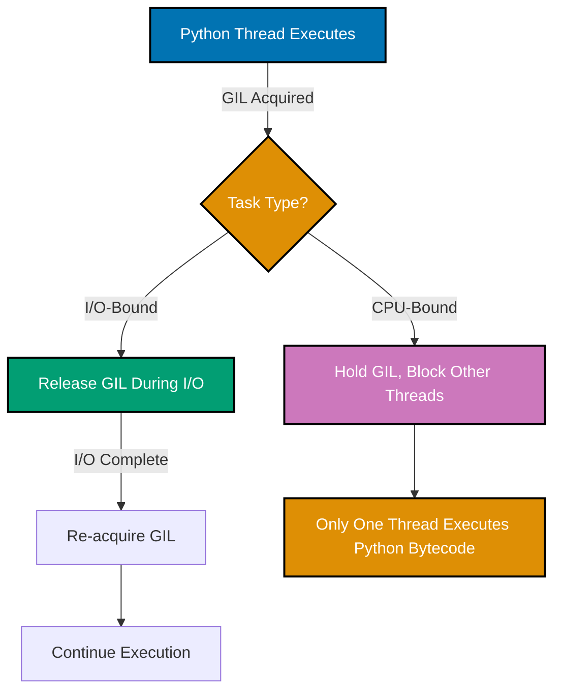
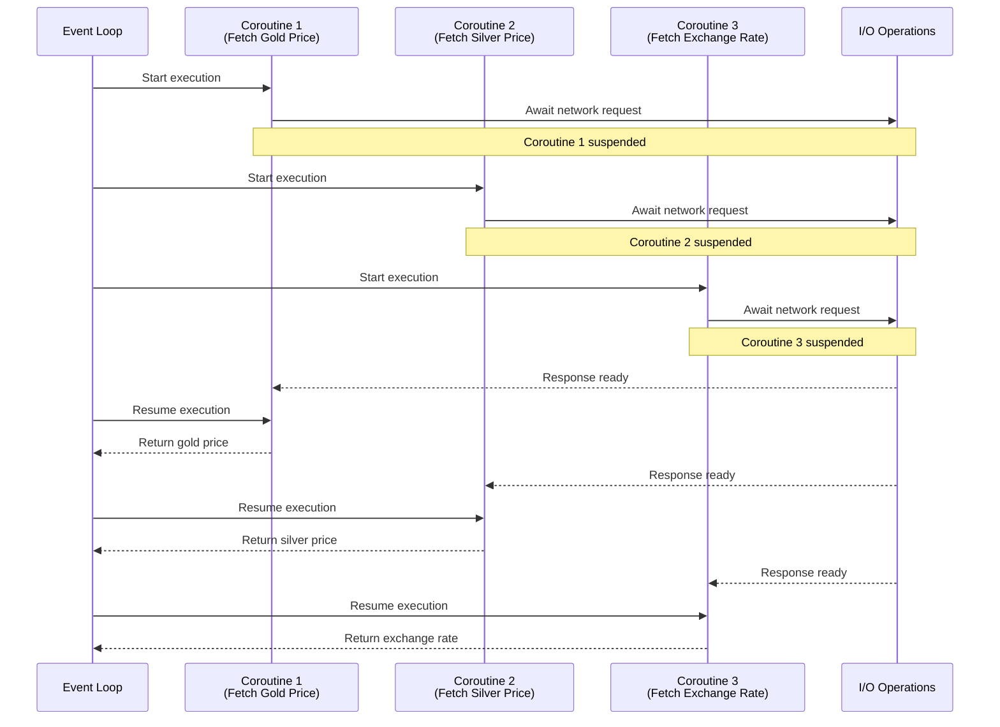
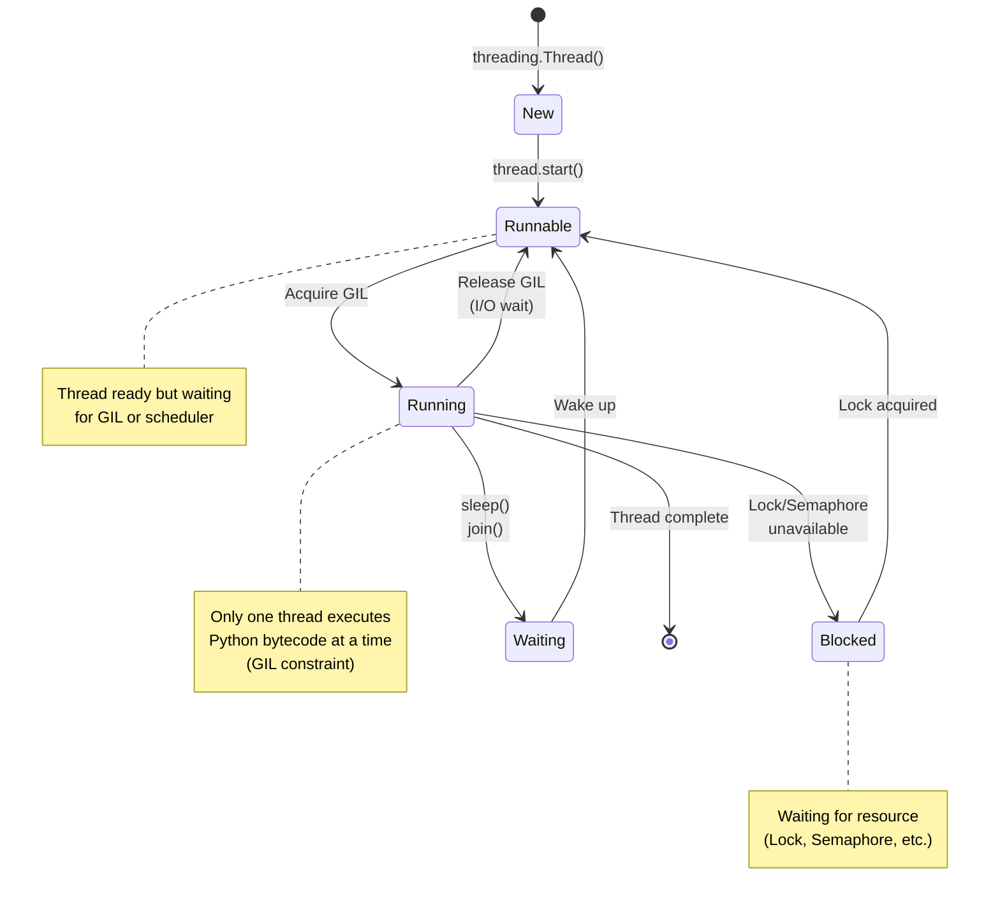
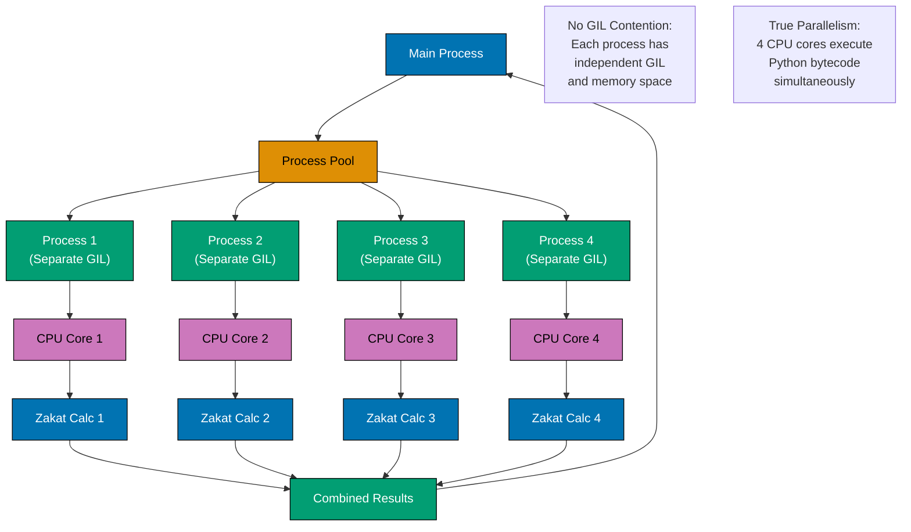
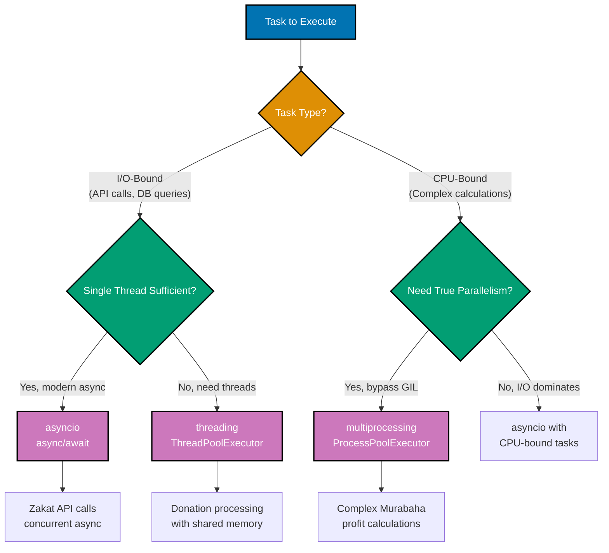
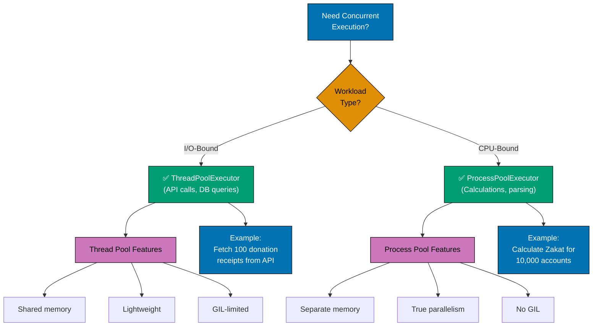
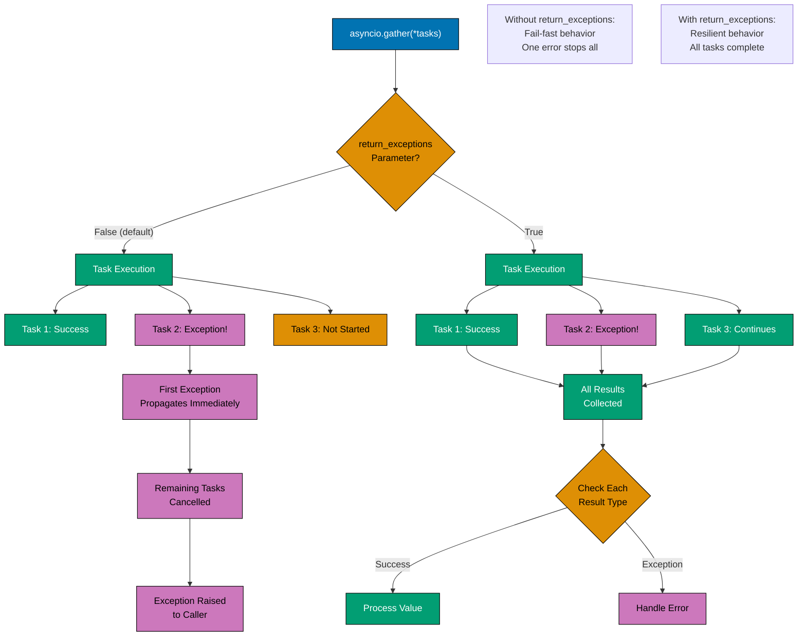

# Python Concurrency and Parallelism

**Quick Reference**: [Overview](#overview) | [asyncio](#asyncio-async-await) | [threading](#threading-module) | [multiprocessing](#multiprocessing-module) | [GIL](#gil-global-interpreter-lock) | [concurrent.futures](#concurrentfutures) | [Async Context Managers](#async-context-managers) | [Error Handling](#error-handling-in-async) | [References](#references)

## Overview

Concurrency and parallelism enable Python applications to handle multiple operations simultaneously. For the OSE Platform processing Zakat calculations, API requests, and financial transactions, understanding async patterns and GIL implications is critical for performance.

### Concurrency vs Parallelism

**Concurrency**: Multiple tasks making progress (interleaved execution).

**Parallelism**: Multiple tasks executing simultaneously (true parallel execution).

### Python Concurrency Models

**asyncio**: Single-threaded cooperative multitasking (I/O-bound).

**threading**: Multi-threaded execution (I/O-bound, GIL-limited).

**multiprocessing**: Multi-process execution (CPU-bound, no GIL).

## asyncio (async/await)

asyncio provides asynchronous I/O using async/await syntax.

### GIL Behavior and Concurrency Models



**Why this matters**: The GIL #40;Global Interpreter Lock#41; allows only one thread to execute Python bytecode at a time. Threading benefits I/O-bound tasks #40;GIL released during I/O#41; but not CPU-bound tasks.

### Basic async/await

```python
# GOOD: Async function with await
import asyncio
from decimal import Decimal
from typing import List


async def fetch_gold_price_async() -> Decimal:
    """Fetch gold price asynchronously."""
    await asyncio.sleep(0.1)  # Simulate API call
    return Decimal("60.00")


async def calculate_nisab_async() -> Decimal:
    """Calculate nisab threshold async."""
    gold_price = await fetch_gold_price_async()
    GOLD_NISAB_GRAMS = 85
    return gold_price * GOLD_NISAB_GRAMS


# Usage: Run async function
nisab = asyncio.run(calculate_nisab_async())
print(f"Nisab: ${nisab}")
```

**Why this matters**: `async`/`await` enables non-blocking I/O. Single thread handles many concurrent operations. Ideal for I/O-bound tasks.

### Concurrent async operations

```python
# GOOD: Run multiple async operations concurrently
import asyncio
from decimal import Decimal


async def fetch_gold_price() -> Decimal:
    """Fetch gold price (simulated)."""
    await asyncio.sleep(0.2)
    return Decimal("60.00")


async def fetch_silver_price() -> Decimal:
    """Fetch silver price (simulated)."""
    await asyncio.sleep(0.2)
    return Decimal("0.75")


async def fetch_exchange_rate(currency: str) -> Decimal:
    """Fetch exchange rate (simulated)."""
    await asyncio.sleep(0.1)
    return Decimal("1.0") if currency == "USD" else Decimal("0.85")


async def calculate_all_nisab_values() -> dict:
    """Calculate all nisab values concurrently."""
    # Gather runs tasks concurrently
    gold_price, silver_price, exchange_rate = await asyncio.gather(
        fetch_gold_price(),
        fetch_silver_price(),
        fetch_exchange_rate("USD"),
    )

    return {
        "gold_nisab": gold_price * 85,
        "silver_nisab": silver_price * 595,
        "exchange_rate": exchange_rate,
    }


# Usage
result = asyncio.run(calculate_all_nisab_values())
print(result)
```

**Why this matters**: `asyncio.gather()` runs multiple coroutines concurrently. Single thread, non-blocking. Dramatically faster than sequential execution for I/O.

### asyncio Event Loop Execution



**Why this matters**: asyncio event loop switches between coroutines during I/O wait. Single-threaded cooperative multitasking. All three API calls execute concurrently without threads.

## threading Module

Threading enables concurrent execution with shared memory (GIL-limited).

### Thread Lifecycle and GIL Interaction



**Key Principles**:

- **New**: Thread object created but not started
- **Runnable**: Ready to run, waiting for GIL
- **Running**: Actively executing Python bytecode (holds GIL)
- **Blocked**: Waiting for lock/semaphore (still holds GIL unless I/O)
- **Waiting**: sleep() or join() (releases GIL during I/O)
- **GIL Impact**: Only one thread runs Python bytecode at a time

**Islamic Finance Example**:

```python
import threading
from decimal import Decimal
from typing import List

# Multiple threads processing Zakat calculations
# Thread 1: Processes gold holdings
# Thread 2: Processes cash holdings
# Thread 3: Processes investment holdings

# GIL ensures thread-safe execution but limits CPU parallelism
# Good for I/O-bound tasks (API calls, DB queries)
# Not ideal for CPU-bound calculations (use multiprocessing)
```

### Basic Threading

```python
# GOOD: Threading for I/O-bound tasks
import threading
from decimal import Decimal
from typing import List
import time


def calculate_zakat_batch(
    wealth_items: List[Decimal],
    results: List[Decimal],
    index: int,
) -> None:
    """Calculate Zakat for batch (thread worker)."""
    time.sleep(0.1)  # Simulate I/O
    zakat_total = sum(item * Decimal("0.025") for item in wealth_items)
    results[index] = zakat_total


# Usage: Process batches in parallel threads
wealth_data = [
    [Decimal("100000"), Decimal("150000")],
    [Decimal("200000"), Decimal("250000")],
    [Decimal("300000"), Decimal("350000")],
]

results = [Decimal("0")] * len(wealth_data)
threads = []

for i, batch in enumerate(wealth_data):
    thread = threading.Thread(
        target=calculate_zakat_batch,
        args=(batch, results, i),
    )
    threads.append(thread)
    thread.start()

# Wait for all threads
for thread in threads:
    thread.join()

print(f"Total Zakat: ${sum(results)}")
```

**Why this matters**: Threading useful for I/O-bound tasks despite GIL. Shared memory simplifies data sharing. Lighter weight than multiprocessing.

## multiprocessing Module

Multiprocessing bypasses GIL with separate processes.

### Process Architecture and True Parallelism



**Key Principles**:

- **Separate Memory**: Each process has independent memory space
- **No GIL Contention**: Each process has its own GIL
- **True Parallelism**: Multiple CPU cores execute simultaneously
- **Communication Overhead**: Inter-process communication via pickling
- **Higher Memory**: Each process loads full Python interpreter

**When to Use multiprocessing**:

- ✅ CPU-bound tasks (complex calculations, data processing)
- ✅ Need to bypass GIL limitations
- ✅ Have multiple CPU cores available
- ❌ I/O-bound tasks (use asyncio or threading instead)
- ❌ Tight memory constraints (use threading instead)

### Basic Multiprocessing

```python
# GOOD: Multiprocessing for CPU-bound tasks
from multiprocessing import Pool
from decimal import Decimal
from typing import List


def calculate_complex_zakat(wealth_amount: Decimal) -> Decimal:
    """CPU-intensive Zakat calculation."""
    # Simulate complex calculation
    result = wealth_amount
    for _ in range(1000000):
        result = result * Decimal("1.0000001")
    return result * Decimal("0.025")


# Usage: Process in parallel (CPU cores)
wealth_amounts = [Decimal("100000")] * 8

with Pool(processes=4) as pool:
    results = pool.map(calculate_complex_zakat, wealth_amounts)

print(f"Results: {results}")
```

**Why this matters**: Multiprocessing achieves true parallelism. No GIL limitations. Ideal for CPU-bound calculations.

## GIL (Global Interpreter Lock)

The GIL prevents multiple threads from executing Python bytecode simultaneously.

### GIL Implications

```python
# GIL-limited: CPU-bound threading (slow)
import threading
from decimal import Decimal


def cpu_intensive_zakat(wealth: Decimal) -> Decimal:
    """CPU-intensive calculation (GIL-limited)."""
    result = wealth
    for _ in range(10000000):
        result = result * Decimal("1.0000001")
    return result * Decimal("0.025")


# Threading provides no speedup for CPU-bound
# (GIL prevents parallel CPU execution)


# GIL-bypassed: I/O-bound threading (fast)
import time


def io_intensive_zakat(wealth: Decimal) -> Decimal:
    """I/O-intensive calculation (GIL-released during I/O)."""
    time.sleep(1)  # GIL released during sleep
    return wealth * Decimal("0.025")


# Threading speeds up I/O-bound tasks
# (threads wait concurrently, not sequentially)
```

**Python 3.14+ Free-Threaded Mode**: Experimental no-GIL mode via `--disable-gil` flag (PEP 703). Enables true parallel threading for CPU-bound tasks.

### Concurrency Model Decision Tree



**Decision guide**:

- **asyncio**: I/O-bound tasks, modern async APIs, highest concurrency
- **threading**: I/O-bound tasks needing shared memory, compatibility with sync libraries
- **multiprocessing**: CPU-bound tasks requiring true parallelism, bypasses GIL

## concurrent.futures

High-level interface for threading and multiprocessing.

### Executor Selection Guide



**Key Principles**:

- **ThreadPoolExecutor**: Use for I/O-bound tasks (network, disk, database)
  - Lightweight, shared memory, automatic thread management
  - Limited by GIL for CPU operations
  - Lower memory overhead than processes

- **ProcessPoolExecutor**: Use for CPU-bound tasks (calculations, parsing, encoding)
  - True parallelism, bypasses GIL, independent memory
  - Higher memory overhead, slower startup
  - Communication via pickling (serialization cost)

**Islamic Finance Examples**:

```python
# I/O-Bound: Use ThreadPoolExecutor
from concurrent.futures import ThreadPoolExecutor

# Fetch 100 donation receipts concurrently
with ThreadPoolExecutor(max_workers=10) as executor:
    receipts = executor.map(fetch_receipt_from_api, donation_ids)

# CPU-Bound: Use ProcessPoolExecutor
from concurrent.futures import ProcessPoolExecutor

# Calculate Zakat for 10,000 accounts in parallel
with ProcessPoolExecutor(max_workers=4) as executor:
    zakat_amounts = executor.map(calculate_zakat_complex, account_data)
```

### ThreadPoolExecutor

```python
# GOOD: ThreadPoolExecutor for I/O-bound
from concurrent.futures import ThreadPoolExecutor
from decimal import Decimal
import time


def fetch_campaign_data(campaign_id: str) -> dict:
    """Fetch campaign data (I/O-bound)."""
    time.sleep(0.1)  # Simulate network I/O
    return {
        "id": campaign_id,
        "total": Decimal("50000"),
    }


# Usage: Concurrent I/O with thread pool
campaign_ids = [f"CAMP-{i:03d}" for i in range(10)]

with ThreadPoolExecutor(max_workers=5) as executor:
    results = list(executor.map(fetch_campaign_data, campaign_ids))

print(f"Fetched {len(results)} campaigns")
```

**Why this matters**: ThreadPoolExecutor simplifies concurrent I/O. Automatic thread management. Context manager ensures cleanup.

### ProcessPoolExecutor

```python
# GOOD: ProcessPoolExecutor for CPU-bound
from concurrent.futures import ProcessPoolExecutor
from decimal import Decimal


def complex_calculation(wealth: Decimal) -> Decimal:
    """CPU-intensive calculation."""
    result = wealth
    for _ in range(5000000):
        result = result * Decimal("1.0000001")
    return result


# Usage: Parallel CPU processing
wealth_data = [Decimal("100000")] * 8

with ProcessPoolExecutor(max_workers=4) as executor:
    results = list(executor.map(complex_calculation, wealth_data))

print(f"Processed {len(results)} items")
```

**Why this matters**: ProcessPoolExecutor bypasses GIL. True parallel CPU execution. Simple API matches ThreadPoolExecutor.

## Async Context Managers

Async context managers support async setup/teardown.

### Async Resource Lifecycle

```mermaid
%% Color Palette: Blue #0173B2, Orange #DE8F05, Teal #029E73, Purple #CC78BC
%% All colors are color-blind friendly and meet WCAG AA contrast standards

sequenceDiagram
    participant Code as Application Code
    participant ACM as Async Context Manager
    participant Res as Resource<br/>(DB, File, Connection)

    Code->>ACM: async with get_resource() as res
    activate ACM

    ACM->>Res: await __aenter__()
    activate Res
    Res-->>Res: Async setup<br/>(connect, open)
    Res-->>ACM: Return resource
    ACM-->>Code: Yield resource
    deactivate ACM

    Note over Code,Res: Code uses resource asynchronously

    Code->>Code: await res.execute()
    Code->>Code: await res.query()

    alt Normal Completion
        Code->>ACM: Exit context
        activate ACM
        ACM->>Res: await __aexit__(None, None, None)
        Res-->>Res: Async cleanup<br/>(disconnect, close)
        deactivate Res
        Res-->>ACM: Cleanup complete
        ACM-->>Code: Context exited
        deactivate ACM
    else Exception Raised
        Code->>ACM: Exit context with exception
        activate ACM
        ACM->>Res: await __aexit__(exc_type, exc_val, tb)
        Res-->>Res: Async cleanup<br/>(even on error)
        deactivate Res
        Res-->>ACM: Cleanup complete
        ACM-->>Code: Exception propagated
        deactivate ACM
    end
```

**Key Principles**:

- **`__aenter__`**: Async setup method (connect, open, allocate)
- **`__aexit__`**: Async cleanup method (disconnect, close, release)
- **Guaranteed Cleanup**: `__aexit__` called even if exception raised
- **Exception Handling**: Can suppress or re-raise exceptions
- **Use `async with`**: Automatically calls `__aenter__` and `__aexit__`

**Islamic Finance Example**:

```python
import asyncio
from contextlib import asynccontextmanager

@asynccontextmanager
async def zakat_calculation_session():
    """Manage Zakat calculation session resources."""
    # Setup: Connect to gold price API, database
    print("Opening Zakat calculation session...")
    await asyncio.sleep(0.1)  # Async setup

    try:
        yield "session_handle"  # Provide resource to caller
    finally:
        # Cleanup: Close connections (runs even on exception)
        print("Closing Zakat calculation session...")
        await asyncio.sleep(0.1)  # Async cleanup

# Usage: Guaranteed cleanup
async with zakat_calculation_session() as session:
    # Use session for calculations
    await calculate_zakat_async()
```

### Defining Async Context Managers

```python
# GOOD: Async context manager for database
from contextlib import asynccontextmanager
from typing import AsyncIterator


class AsyncDatabase:
    """Async database connection."""

    async def connect(self) -> None:
        """Establish connection."""
        print("Connecting to database...")
        await asyncio.sleep(0.1)

    async def disconnect(self) -> None:
        """Close connection."""
        print("Disconnecting from database...")
        await asyncio.sleep(0.1)

    async def execute(self, query: str) -> List[dict]:
        """Execute query."""
        await asyncio.sleep(0.05)
        return [{"result": "data"}]


@asynccontextmanager
async def get_db_connection() -> AsyncIterator[AsyncDatabase]:
    """Async context manager for database."""
    db = AsyncDatabase()
    await db.connect()
    try:
        yield db
    finally:
        await db.disconnect()


# Usage
async def fetch_zakat_records():
    """Fetch records with async context manager."""
    async with get_db_connection() as db:
        records = await db.execute("SELECT * FROM zakat_records")
        return records


records = asyncio.run(fetch_zakat_records())
```

**Why this matters**: Async context managers ensure cleanup in async code. `async with` for async resources. Prevent resource leaks.

## Error Handling in Async

Handle exceptions in async code properly.

### Async Error Propagation Flow



**Key Principles**:

- **Default behavior (`return_exceptions=False`)**: Fail-fast
  - First exception immediately propagates to caller
  - Remaining tasks cancelled
  - Caller must handle exception with try/except

- **Resilient behavior (`return_exceptions=True`)**: Continue execution
  - All tasks run to completion
  - Exceptions returned as results (not raised)
  - Caller checks each result type (value or exception)

**Islamic Finance Example**:

```python
import asyncio
from decimal import Decimal

# Fail-fast: One error stops all
results = await asyncio.gather(
    calculate_gold_zakat(accounts[0]),
    calculate_silver_zakat(accounts[1]),  # Raises exception
    calculate_cash_zakat(accounts[2]),    # Not started
)
# Exception propagated, accounts[2] not processed

# Resilient: All complete, handle errors individually
results = await asyncio.gather(
    calculate_gold_zakat(accounts[0]),
    calculate_silver_zakat(accounts[1]),  # Returns exception
    calculate_cash_zakat(accounts[2]),    # Completes successfully
    return_exceptions=True
)
for i, result in enumerate(results):
    if isinstance(result, Exception):
        log_error(f"Account {i} failed: {result}")
    else:
        process_zakat(result)
```

### Async Exception Handling

```python
# GOOD: Handle exceptions in async tasks
import asyncio
from decimal import Decimal


async def risky_calculation(wealth: Decimal) -> Decimal:
    """Calculation that might fail."""
    await asyncio.sleep(0.1)
    if wealth < 0:
        raise ValueError("Wealth cannot be negative")
    return wealth * Decimal("0.025")


async def process_with_error_handling():
    """Process multiple calculations with error handling."""
    wealth_values = [Decimal("100000"), Decimal("-5000"), Decimal("200000")]

    tasks = [risky_calculation(w) for w in wealth_values]
    results = await asyncio.gather(*tasks, return_exceptions=True)

    for i, result in enumerate(results):
        if isinstance(result, Exception):
            print(f"Error calculating wealth[{i}]: {result}")
        else:
            print(f"Zakat for wealth[{i}]: ${result}")


asyncio.run(process_with_error_handling())
```

**Why this matters**: `return_exceptions=True` prevents one failure from stopping all tasks. Individual error handling per task. Resilient concurrent processing.

## Advanced asyncio Patterns

Real-world async patterns for production systems.

### AsyncIO Event Loop Deep Dive

Understanding the event loop internals helps optimize async code.

```python
# GOOD: Event loop management and task scheduling
import asyncio
from decimal import Decimal
from typing import List, Dict
import logging

logger = logging.getLogger(__name__)


async def fetch_gold_price() -> Decimal:
    """Fetch gold price (simulated external API)."""
    await asyncio.sleep(0.1)  # Simulate network I/O
    return Decimal("60.50")


async def fetch_silver_price() -> Decimal:
    """Fetch silver price (simulated external API)."""
    await asyncio.sleep(0.15)  # Simulate network I/O
    return Decimal("0.76")


async def fetch_currency_rate(currency: str) -> Decimal:
    """Fetch currency exchange rate."""
    await asyncio.sleep(0.05)
    rates = {"USD": Decimal("1.0"), "EUR": Decimal("0.92"), "GBP": Decimal("0.79")}
    return rates.get(currency, Decimal("1.0"))


class ZakatPriceService:
    """Service to fetch and cache Zakat-related prices."""

    def __init__(self):
        self._loop = None
        self._price_cache: Dict[str, Decimal] = {}
        self._cache_task = None

    async def start(self):
        """Start the service and cache updater."""
        self._loop = asyncio.get_running_loop()

        # Schedule periodic cache updates
        self._cache_task = asyncio.create_task(self._update_cache_periodically())

        # Initial cache population
        await self._update_cache()

    async def stop(self):
        """Stop the service and cleanup."""
        if self._cache_task:
            self._cache_task.cancel()
            try:
                await self._cache_task
            except asyncio.CancelledError:
                logger.info("Cache updater cancelled")

    async def _update_cache(self):
        """Update price cache with latest values."""
        gold, silver, usd_rate = await asyncio.gather(
            fetch_gold_price(),
            fetch_silver_price(),
            fetch_currency_rate("USD"),
        )

        self._price_cache["gold"] = gold
        self._price_cache["silver"] = silver
        self._price_cache["usd_rate"] = usd_rate

        logger.info(f"Price cache updated: {self._price_cache}")

    async def _update_cache_periodically(self):
        """Background task to update cache every 5 minutes."""
        while True:
            try:
                await asyncio.sleep(300)  # 5 minutes
                await self._update_cache()
            except asyncio.CancelledError:
                break
            except Exception as e:
                logger.error(f"Cache update failed: {e}")

    async def get_nisab_threshold(self, metal: str = "gold") -> Decimal:
        """Get current nisab threshold based on metal price."""
        if metal == "gold":
            price = self._price_cache.get("gold", Decimal("60.00"))
            return price * Decimal("85")  # 85 grams of gold
        else:
            price = self._price_cache.get("silver", Decimal("0.75"))
            return price * Decimal("595")  # 595 grams of silver


# Usage: Service lifecycle management
async def main():
    service = ZakatPriceService()

    try:
        await service.start()

        # Use service
        nisab_gold = await service.get_nisab_threshold("gold")
        nisab_silver = await service.get_nisab_threshold("silver")

        print(f"Gold nisab: ${nisab_gold}")
        print(f"Silver nisab: ${nisab_silver}")

        # Keep running for demonstration
        await asyncio.sleep(10)

    finally:
        await service.stop()


# Run with proper event loop handling
if __name__ == "__main__":
    asyncio.run(main())
```

**Why this matters**: Event loop lifecycle management enables background tasks. Periodic cache updates improve performance. Graceful shutdown prevents resource leaks.

### Task Groups and Structured Concurrency

Python 3.11+ provides `TaskGroup` for structured concurrency.

```python
# GOOD: Structured concurrency with TaskGroup (Python 3.11+)
import asyncio
from decimal import Decimal
from typing import List, Dict


async def calculate_zakat_for_user(user_id: str, wealth: Decimal) -> Dict:
    """Calculate Zakat for single user."""
    await asyncio.sleep(0.1)  # Simulate processing

    nisab = Decimal("5000")
    if wealth >= nisab:
        zakat_amount = wealth * Decimal("0.025")
        return {
            "user_id": user_id,
            "wealth": wealth,
            "zakat_amount": zakat_amount,
            "obligated": True
        }
    else:
        return {
            "user_id": user_id,
            "wealth": wealth,
            "zakat_amount": Decimal("0"),
            "obligated": False
        }


async def process_zakat_batch(users: List[tuple]) -> List[Dict]:
    """Process Zakat calculations for batch of users using TaskGroup."""
    results = []

    async with asyncio.TaskGroup() as tg:
        # Create tasks for all users
        tasks = []
        for user_id, wealth in users:
            task = tg.create_task(calculate_zakat_for_user(user_id, wealth))
            tasks.append(task)

    # TaskGroup ensures all tasks complete (or all cancelled on error)
    # Collect results after TaskGroup exits
    results = [task.result() for task in tasks]

    return results


async def main():
    users = [
        ("USER-001", Decimal("100000")),
        ("USER-002", Decimal("3000")),    # Below nisab
        ("USER-003", Decimal("250000")),
        ("USER-004", Decimal("75000")),
        ("USER-005", Decimal("4500")),    # Below nisab
    ]

    results = await process_zakat_batch(users)

    # Print results
    for result in results:
        status = "OBLIGATED" if result["obligated"] else "NOT OBLIGATED"
        print(f"{result['user_id']}: ${result['wealth']} → ${result['zakat_amount']} ({status})")


asyncio.run(main())
```

**Why this matters**: `TaskGroup` provides structured concurrency (all-or-nothing semantics). If one task raises exception, all tasks cancelled. Simpler error handling than `gather()`.

### Async Timeouts and Cancellation

Robust timeout handling prevents hanging operations.

```python
# GOOD: Timeout handling and task cancellation
import asyncio
from decimal import Decimal
from typing import Optional


class TimeoutError(Exception):
    """Custom timeout exception."""
    pass


async def fetch_price_from_api(api_url: str) -> Decimal:
    """Fetch price from external API (may be slow)."""
    # Simulate slow API
    await asyncio.sleep(2.5)
    return Decimal("60.00")


async def fetch_price_with_timeout(
    api_url: str,
    timeout_seconds: float = 2.0
) -> Optional[Decimal]:
    """Fetch price with timeout protection."""
    try:
        # Wait for task with timeout
        price = await asyncio.wait_for(
            fetch_price_from_api(api_url),
            timeout=timeout_seconds
        )
        return price

    except asyncio.TimeoutError:
        print(f"API request timed out after {timeout_seconds}s")
        return None

    except Exception as e:
        print(f"API request failed: {e}")
        return None


async def fetch_price_with_fallback(primary_api: str, fallback_api: str) -> Decimal:
    """Fetch price with fallback to secondary API."""
    # Try primary API first
    price = await fetch_price_with_timeout(primary_api, timeout_seconds=1.5)

    if price is not None:
        return price

    # Fallback to secondary API
    print("Primary API failed, trying fallback...")
    price = await fetch_price_with_timeout(fallback_api, timeout_seconds=1.5)

    if price is not None:
        return price

    # Use default if both fail
    print("Both APIs failed, using default price")
    return Decimal("60.00")


async def main():
    price = await fetch_price_with_fallback(
        primary_api="https://api.metals.live/v1/gold",
        fallback_api="https://api.alternative.com/gold"
    )

    print(f"Final price: ${price}")


asyncio.run(main())
```

**Why this matters**: Timeouts prevent indefinite hangs. Fallback mechanisms improve reliability. Graceful degradation ensures service availability.

### Async Queue-Based Task Processing

Producer-consumer pattern with async queues.

```python
# GOOD: Async queue for task processing
import asyncio
from decimal import Decimal
from typing import Dict, List
import random


class DonationProcessor:
    """Process donations asynchronously using queue."""

    def __init__(self, num_workers: int = 3):
        self.queue: asyncio.Queue = asyncio.Queue()
        self.num_workers = num_workers
        self.processed_count = 0

    async def process_donation(self, donation: Dict) -> Dict:
        """Process single donation (simulated)."""
        # Simulate processing time
        await asyncio.sleep(random.uniform(0.1, 0.3))

        # Add processing timestamp
        donation["processed_at"] = asyncio.get_running_loop().time()
        donation["status"] = "processed"

        return donation

    async def worker(self, worker_id: int):
        """Worker coroutine to process donations from queue."""
        print(f"Worker {worker_id} started")

        while True:
            # Get donation from queue (blocks until available)
            donation = await self.queue.get()

            try:
                # Process donation
                result = await self.process_donation(donation)
                print(f"Worker {worker_id} processed donation {result['id']}")
                self.processed_count += 1

            except Exception as e:
                print(f"Worker {worker_id} error: {e}")

            finally:
                # Mark task as done
                self.queue.task_done()

    async def add_donation(self, donation: Dict):
        """Add donation to processing queue."""
        await self.queue.put(donation)

    async def process_all(self, donations: List[Dict]):
        """Process all donations with worker pool."""
        # Start workers
        workers = [
            asyncio.create_task(self.worker(i))
            for i in range(self.num_workers)
        ]

        # Add all donations to queue
        for donation in donations:
            await self.add_donation(donation)

        # Wait for all donations to be processed
        await self.queue.join()

        # Cancel workers
        for worker in workers:
            worker.cancel()

        # Wait for workers to finish cancellation
        await asyncio.gather(*workers, return_exceptions=True)

        print(f"Processed {self.processed_count} donations")


async def main():
    # Create test donations
    donations = [
        {"id": f"DON-{i:04d}", "amount": Decimal("100"), "status": "pending"}
        for i in range(20)
    ]

    # Process donations
    processor = DonationProcessor(num_workers=5)
    await processor.process_all(donations)


asyncio.run(main())
```

**Why this matters**: Queue-based processing enables controlled concurrency. Worker pool pattern scales processing. Backpressure prevents memory exhaustion.

### Async Semaphores and Rate Limiting

Control concurrent access to limited resources.

```python
# GOOD: Semaphore for rate limiting and resource control
import asyncio
from decimal import Decimal
from typing import List
import time


class APIClient:
    """API client with rate limiting."""

    def __init__(self, max_concurrent: int = 5, requests_per_second: float = 10):
        self.semaphore = asyncio.Semaphore(max_concurrent)
        self.min_interval = 1.0 / requests_per_second
        self.last_request_time = 0
        self.request_count = 0

    async def _wait_for_rate_limit(self):
        """Wait to respect rate limit."""
        current_time = time.time()
        time_since_last = current_time - self.last_request_time

        if time_since_last < self.min_interval:
            wait_time = self.min_interval - time_since_last
            await asyncio.sleep(wait_time)

        self.last_request_time = time.time()

    async def fetch_campaign_data(self, campaign_id: str) -> Dict:
        """Fetch campaign data with rate limiting."""
        async with self.semaphore:  # Limit concurrent requests
            await self._wait_for_rate_limit()  # Respect rate limit

            # Simulate API call
            await asyncio.sleep(0.1)
            self.request_count += 1

            return {
                "campaign_id": campaign_id,
                "total": Decimal("50000"),
                "donors": 125,
            }


async def fetch_all_campaigns(campaign_ids: List[str]) -> List[Dict]:
    """Fetch all campaign data respecting rate limits."""
    client = APIClient(max_concurrent=5, requests_per_second=10)

    # Create tasks for all campaigns
    tasks = [
        client.fetch_campaign_data(campaign_id)
        for campaign_id in campaign_ids
    ]

    # Run all tasks concurrently (semaphore limits actual concurrency)
    results = await asyncio.gather(*tasks)

    print(f"Made {client.request_count} API requests")
    return results


async def main():
    campaign_ids = [f"CAMP-{i:03d}" for i in range(50)]

    start = time.time()
    results = await fetch_all_campaigns(campaign_ids)
    elapsed = time.time() - start

    print(f"Fetched {len(results)} campaigns in {elapsed:.2f}s")
    print(f"Rate: {len(results)/elapsed:.2f} campaigns/second")


asyncio.run(main())
```

**Why this matters**: Semaphores limit concurrent operations. Rate limiting prevents API throttling. Resource control prevents overwhelming external services.

## GIL Profiling and Performance Analysis

Understanding GIL impact through measurement.

### Profiling GIL Contention

```python
# GOOD: Measure GIL contention with threading
import threading
import time
from decimal import Decimal
from typing import List


def cpu_intensive_zakat(wealth: Decimal, iterations: int = 1000000) -> Decimal:
    """CPU-intensive Zakat calculation to demonstrate GIL impact."""
    result = wealth
    for _ in range(iterations):
        result = result * Decimal("1.0000001")
    return result * Decimal("0.025")


def benchmark_sequential(wealth_amounts: List[Decimal]) -> float:
    """Benchmark sequential processing."""
    start = time.perf_counter()

    results = []
    for wealth in wealth_amounts:
        zakat = cpu_intensive_zakat(wealth)
        results.append(zakat)

    elapsed = time.perf_counter() - start
    return elapsed


def benchmark_threading(wealth_amounts: List[Decimal]) -> float:
    """Benchmark multi-threaded processing (GIL-limited)."""
    start = time.perf_counter()

    results = [None] * len(wealth_amounts)
    threads = []

    def worker(index: int, wealth: Decimal):
        results[index] = cpu_intensive_zakat(wealth)

    for i, wealth in enumerate(wealth_amounts):
        thread = threading.Thread(target=worker, args=(i, wealth))
        threads.append(thread)
        thread.start()

    for thread in threads:
        thread.join()

    elapsed = time.perf_counter() - start
    return elapsed


def benchmark_multiprocessing(wealth_amounts: List[Decimal]) -> float:
    """Benchmark multi-process processing (no GIL)."""
    from multiprocessing import Pool

    start = time.perf_counter()

    with Pool(processes=4) as pool:
        results = pool.map(cpu_intensive_zakat, wealth_amounts)

    elapsed = time.perf_counter() - start
    return elapsed


# Run benchmarks
wealth_amounts = [Decimal("100000")] * 8

print("Benchmarking GIL impact on CPU-bound tasks:\n")

seq_time = benchmark_sequential(wealth_amounts)
print(f"Sequential:      {seq_time:.4f}s (baseline)")

thread_time = benchmark_threading(wealth_amounts)
speedup_thread = seq_time / thread_time
print(f"Threading:       {thread_time:.4f}s ({speedup_thread:.2f}x speedup) [GIL-limited]")

mp_time = benchmark_multiprocessing(wealth_amounts)
speedup_mp = seq_time / mp_time
print(f"Multiprocessing: {mp_time:.4f}s ({speedup_mp:.2f}x speedup) [No GIL]")

print(f"\nConclusion: Threading provides {speedup_thread:.2f}x speedup (GIL overhead)")
print(f"Multiprocessing provides {speedup_mp:.2f}x speedup (true parallelism)")
```

**Why this matters**: Benchmarking reveals GIL impact. Threading ineffective for CPU-bound tasks. Multiprocessing achieves true parallelism.

### GIL-Free Python 3.13+ (Experimental)

```python
# GOOD: Free-threaded mode (Python 3.13+)
"""
Run with: python3.13t -X gil=0 script.py

Free-threaded mode disables GIL for true parallel threading.
"""
import threading
import time
from decimal import Decimal
from typing import List


def cpu_intensive_calculation(wealth: Decimal) -> Decimal:
    """CPU-intensive calculation."""
    result = wealth
    for _ in range(5000000):
        result = result * Decimal("1.0000001")
    return result * Decimal("0.025")


def benchmark_free_threaded(wealth_amounts: List[Decimal]) -> float:
    """Benchmark with GIL disabled (Python 3.13+)."""
    import sys

    # Check if GIL is disabled
    if hasattr(sys, "_is_gil_enabled"):
        print(f"GIL enabled: {sys._is_gil_enabled()}")

    start = time.perf_counter()

    results = [None] * len(wealth_amounts)
    threads = []

    def worker(index: int, wealth: Decimal):
        results[index] = cpu_intensive_calculation(wealth)

    # Create threads
    for i, wealth in enumerate(wealth_amounts):
        thread = threading.Thread(target=worker, args=(i, wealth))
        threads.append(thread)
        thread.start()

    # Wait for completion
    for thread in threads:
        thread.join()

    elapsed = time.perf_counter() - start
    return elapsed


# Usage (Python 3.13+)
wealth_amounts = [Decimal("100000")] * 4
elapsed = benchmark_free_threaded(wealth_amounts)
print(f"Free-threaded execution: {elapsed:.4f}s")
```

**Why this matters**: Python 3.13+ experimental GIL-free mode enables true parallel threading. Backward compatibility maintained. Future of Python concurrency.

## References

### Official Documentation

- [asyncio Documentation](https://docs.python.org/3/library/asyncio.html)
- [threading Module](https://docs.python.org/3/library/threading.html)
- [multiprocessing Module](https://docs.python.org/3/library/multiprocessing.html)
- [concurrent.futures](https://docs.python.org/3/library/concurrent.futures.html)
- [PEP 703 - No-GIL Mode](https://peps.python.org/pep-0703/)

### Related Documentation

- [Web Services](./ex-so-prla-py__web-services.md) - FastAPI async patterns
- [Performance](./ex-so-prla-py__performance.md) - Optimization strategies
- [Error Handling](./ex-so-prla-py__error-handling.md) - Exception patterns

---

**Last Updated**: 2025-01-23
**Python Version**: 3.11+ (baseline), 3.12+ (stable maintenance), 3.14.x (latest stable with free-threaded mode)
**Maintainers**: OSE Platform Documentation Team
