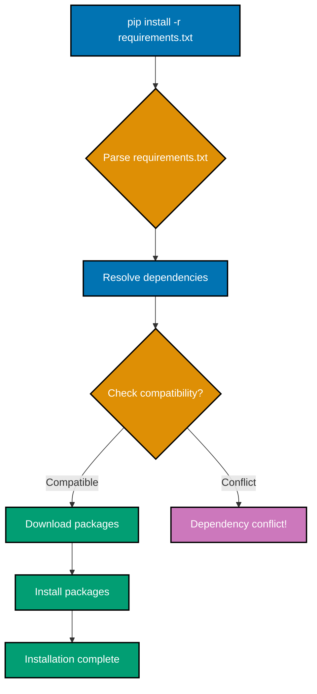
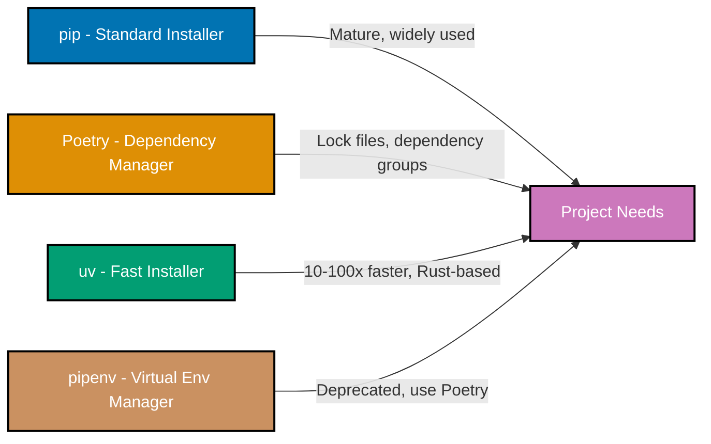
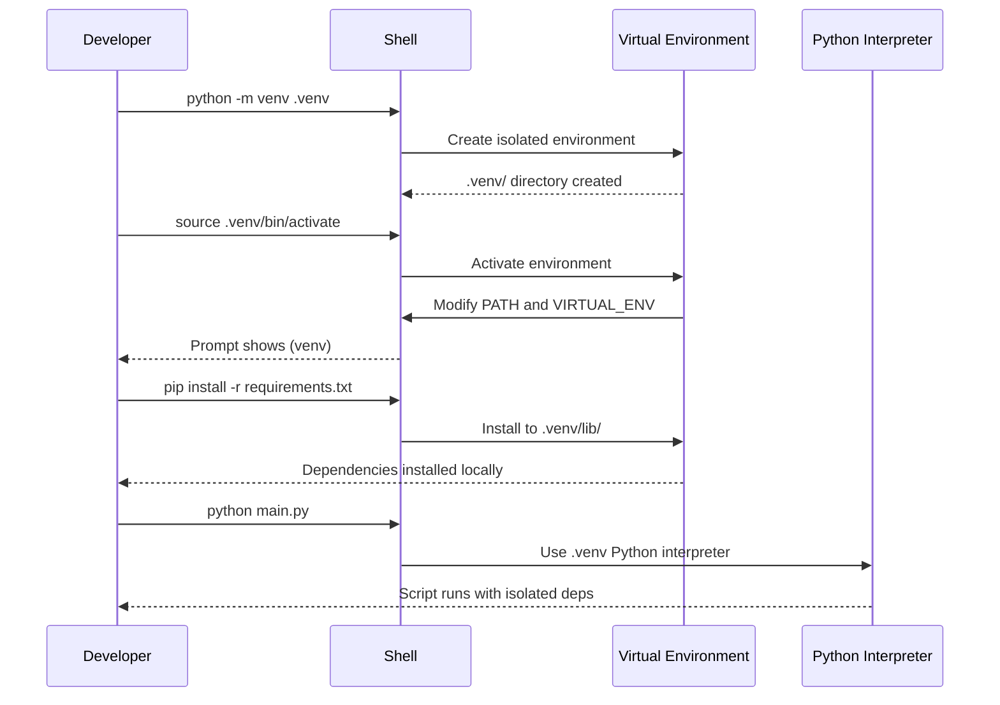
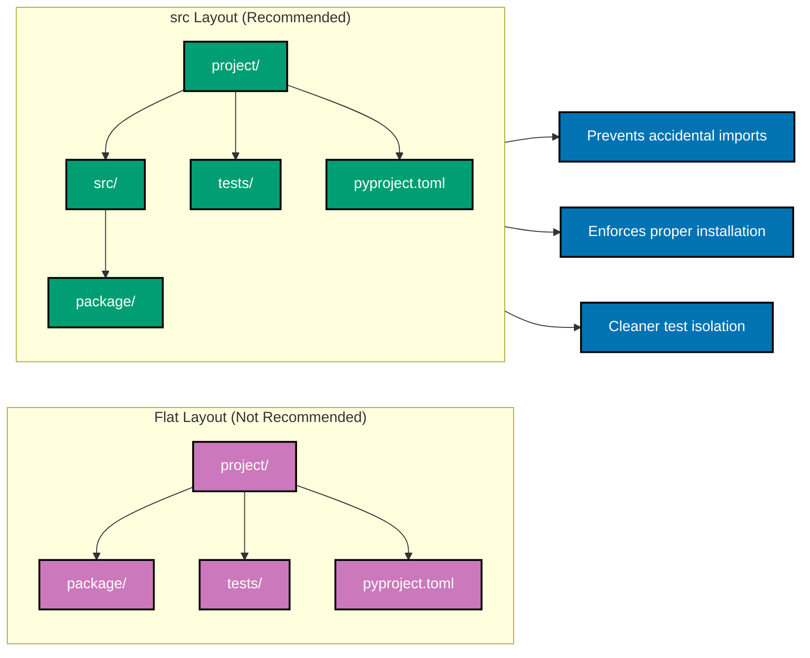
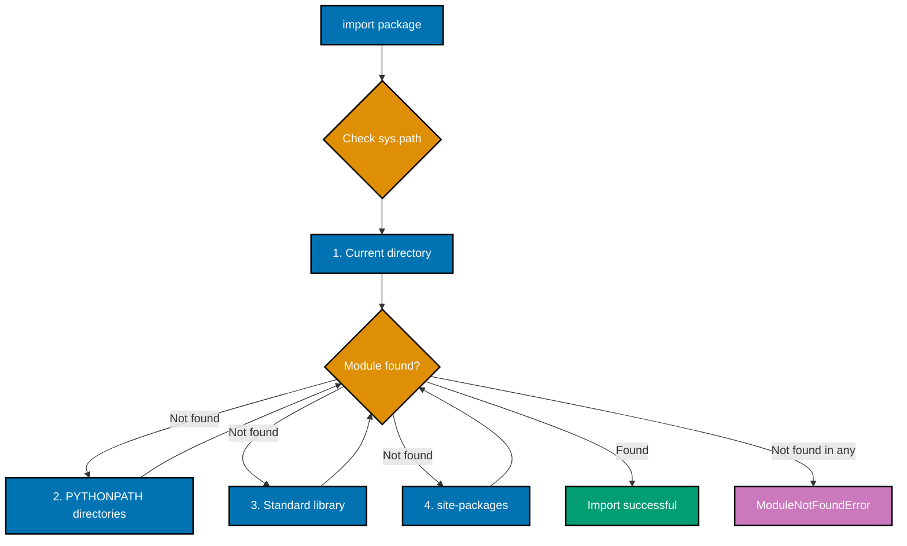
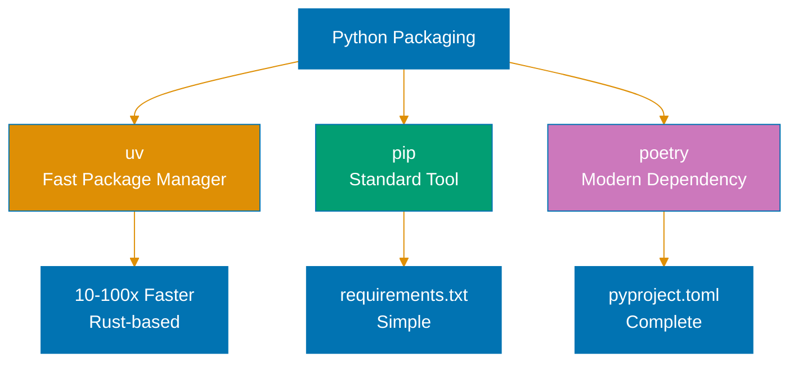

# Python Modules and Dependencies

**Quick Reference**: [Overview](#overview) | [pip Basics](#pip-basics) | [Poetry](#poetry) | [uv](#uv-fast-installer) | [pyproject.toml](#pyprojecttoml) | [Virtual Environments](#virtual-environments) | [Dependency Locking](#dependency-locking) | [Package Structure](#package-structure) | [Import System](#import-system) | [References](#references)

## Overview

Python dependency management ensures reproducible environments and explicit package versioning. For OSE Platform financial applications, locked dependencies prevent unexpected behavior from library updates.

## pip Basics

pip is Python's standard package installer.

### Installing Packages

```bash
# Install package
pip install pydantic

# Install specific version
pip install pydantic==2.10.0

# Install with version constraints
pip install "pydantic>=2.10,<3.0"

# Install from requirements.txt
pip install -r requirements.txt

# Install development dependencies
pip install -e ".[dev]"
```

### requirements.txt

```txt
# requirements.txt - Production dependencies
pydantic==2.10.0
fastapi==0.115.0
httpx==0.28.0
python-decimal>=2.3.0

# Development dependencies in separate file
# requirements-dev.txt
pytest==8.3.0
mypy==1.13.0
ruff==0.8.0
```

**Why this matters**: requirements.txt locks exact versions. Reproducible environments across deployments. Separate dev dependencies from production.

### 📊 Dependency Resolution Flow

This diagram shows how pip resolves and installs dependencies from requirements.txt:



## Poetry

Poetry provides modern dependency management with lock files.

### Poetry Configuration

```toml
# pyproject.toml
[tool.poetry]
name = "ose-zakat-service"
version = "1.0.0"
description = "Zakat calculation service"
authors = ["OSE Team"]

[tool.poetry.dependencies]
python = "^3.11"
pydantic = "^2.10.0"
fastapi = "^0.115.0"
httpx = "^0.28.0"

[tool.poetry.group.dev.dependencies]
pytest = "^8.3.0"
mypy = "^1.13.0"
ruff = "^0.8.0"
```

### Poetry Commands

```bash
# Initialize new project
poetry init

# Add dependency
poetry add pydantic

# Add dev dependency
poetry add --group dev pytest

# Install all dependencies
poetry install

# Update dependencies
poetry update

# Run command in virtual environment
poetry run python main.py

# Export to requirements.txt
poetry export -f requirements.txt --output requirements.txt
```

**Why this matters**: Poetry manages dependencies and virtual environments. Lock file ensures exact versions. Separate dependency groups (dev, test, docs).

### 📊 Package Manager Comparison

This diagram compares different Python package management tools:



## uv (Fast Installer)

uv is a modern, fast Python package installer written in Rust.

### Using uv

```bash
# Install uv
curl -LsSf https://astral.sh/uv/install.sh | sh

# Install packages (much faster than pip)
uv pip install pydantic fastapi

# Install from requirements.txt
uv pip install -r requirements.txt

# Create virtual environment
uv venv

# Sync exact dependencies
uv pip sync requirements.txt
```

**Why this matters**: uv significantly faster than pip (10-100x). Compatible with pip commands. Drop-in replacement for CI/CD speedup.

## pyproject.toml

pyproject.toml (PEP 621) is the standard for Python project metadata.

### Complete pyproject.toml

```toml
# pyproject.toml - Modern Python configuration
[build-system]
requires = ["hatchling"]
build-backend = "hatchling.build"

[project]
name = "ose-zakat-service"
version = "1.0.0"
description = "Zakat calculation service for OSE Platform"
readme = "README.md"
requires-python = ">=3.11"
authors = [
    {name = "OSE Team", email = "team@oseplatform.com"},
]
classifiers = [
    "Development Status :: 4 - Beta",
    "Intended Audience :: Financial and Insurance Industry",
    "Programming Language :: Python :: 3.11",
    "Programming Language :: Python :: 3.12",
    "Programming Language :: Python :: 3.14",
]
dependencies = [
    "pydantic>=2.10.0,<3.0",
    "fastapi>=0.115.0,<1.0",
    "httpx>=0.28.0,<1.0",
]

[project.optional-dependencies]
dev = [
    "pytest>=8.3.0",
    "mypy>=1.13.0",
    "ruff>=0.8.0",
]
test = [
    "pytest>=8.3.0",
    "pytest-cov>=4.1.0",
    "hypothesis>=6.119.0",
]

[tool.ruff]
line-length = 88
target-version = "py311"

[tool.mypy]
python_version = "3.11"
strict = true

[tool.pytest.ini_options]
testpaths = ["tests"]
python_files = "test_*.py"
```

**Why this matters**: Single configuration file for all tools. Standard format (PEP 621). Tool-specific configuration sections.

## Virtual Environments

Virtual environments isolate project dependencies.

### Creating Virtual Environments

```bash
# Create venv
python -m venv .venv

# Activate (Linux/Mac)
source .venv/bin/activate

# Activate (Windows)
.venv\Scripts\activate

# Install dependencies
pip install -r requirements.txt

# Deactivate
deactivate
```

### pyproject.toml with venv

```python
# Usage in code
import sys
from pathlib import Path

# Check if running in virtual environment
in_venv = sys.prefix != sys.base_prefix

if not in_venv:
    print("Warning: Not running in virtual environment")
```

**Why this matters**: Virtual environments prevent dependency conflicts. Project isolation. Reproducible development environments.

### 📊 Virtual Environment Activation Sequence

This sequence diagram shows the virtual environment creation and activation process:



## Dependency Locking

Lock files ensure exact dependency versions.

### Poetry Lock File

```bash
# Generate poetry.lock
poetry lock

# Install from lock file
poetry install

# Update single dependency
poetry update pydantic
```

### pip-tools

```bash
# Install pip-tools
pip install pip-tools

# Generate requirements.txt from pyproject.toml
pip-compile pyproject.toml

# Generate dev requirements
pip-compile --extra dev -o requirements-dev.txt pyproject.toml

# Sync environment with requirements
pip-sync requirements.txt requirements-dev.txt
```

**Why this matters**: Lock files freeze transitive dependencies. Reproducible builds. Prevent surprise updates.

## Package Structure

Organize Python packages for maintainability.

### Standard Package Layout

```
ose-zakat-service/
├── pyproject.toml
├── README.md
├── .gitignore
├── src/
│   └── ose_zakat/
│       ├── __init__.py
│       ├── domain/
│       │   ├── __init__.py
│       │   ├── models.py
│       │   └── calculators.py
│       ├── application/
│       │   ├── __init__.py
│       │   └── services.py
│       └── infrastructure/
│           ├── __init__.py
│           └── api.py
└── tests/
    ├── __init__.py
    ├── test_models.py
    └── test_calculators.py
```

### Package **init**.py

```python
# src/ose_zakat/__init__.py
"""OSE Zakat calculation service."""

from .domain.models import ZakatCalculation
from .domain.calculators import StandardZakatCalculator

__version__ = "1.0.0"
__all__ = ["ZakatCalculation", "StandardZakatCalculator"]
```

**Why this matters**: src layout prevents import issues. **init**.py defines public API. Clear separation of concerns (domain/application/infrastructure).

### 📊 Package Structure Comparison

This diagram compares flat layout vs src layout for Python packages:



## Import System

Python's import system with absolute and relative imports.

### Absolute Imports

```python
# GOOD: Absolute imports (explicit)
from ose_zakat.domain.models import ZakatCalculation
from ose_zakat.domain.calculators import StandardZakatCalculator
from decimal import Decimal


def calculate_zakat() -> Decimal:
    """Use absolute imports."""
    calc = StandardZakatCalculator()
    return calc.calculate(Decimal("100000"))
```

### Relative Imports

```python
# GOOD: Relative imports within package
# File: ose_zakat/application/services.py

from ..domain.models import ZakatCalculation  # Up one level
from ..domain.calculators import StandardZakatCalculator
from .utils import format_currency  # Same level


class ZakatService:
    """Service using relative imports."""

    def __init__(self):
        self.calculator = StandardZakatCalculator()
```

**Why this matters**: Absolute imports clearer for external usage. Relative imports useful within packages. Avoid circular imports.

### 📊 Import Resolution Order

This diagram shows Python's sys.path lookup order for module imports:



## References

### Official Documentation

- [pip Documentation](https://pip.pypa.io/)
- [Poetry Documentation](https://python-poetry.org/)
- [uv Documentation](https://github.com/astral-sh/uv)
- [PEP 621 - pyproject.toml](https://peps.python.org/pep-0621/)
- [Python Packaging Guide](https://packaging.python.org/)

### Related Documentation

- [Best Practices](./ex-so-prla-py__best-practices.md) - Project organization
- [Linting and Formatting](./ex-so-prla-py__linting-and-formatting.md) - Tool configuration

---

**Last Updated**: 2025-01-23
**Python Version**: 3.11+ (baseline), 3.12+ (stable maintenance), 3.14.x (latest stable)
**Maintainers**: OSE Platform Documentation Team

## Python Package Management


