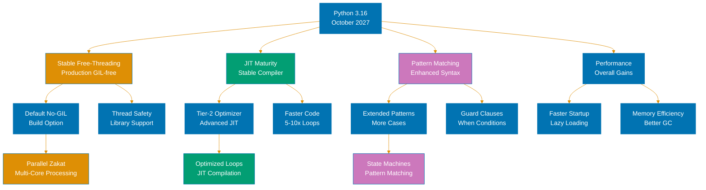
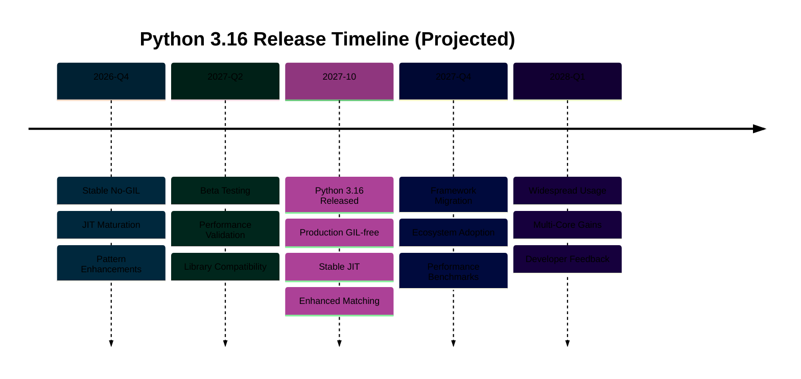

# Python 3.16 Release

## Overview

Python 3.16 introduces new features, performance improvements, and bug fixes. This release continues Python's evolution toward better performance and developer experience.

## Key Features

This release includes improvements to the type system, performance optimizations, and standard library enhancements.

## Breaking Changes

Consult the official Python 3.16 documentation for detailed breaking changes and migration guidance.

## References

- [Python 3.16 Release Notes](https://docs.python.org/3/whatsnew/3.16.html)
- [Python Documentation](https://docs.python.org/3/)

---

**Last Updated**: 2026-01-24
**Python Version**: 3.11+ (baseline), 3.12+ (stable maintenance), 3.14.x (latest stable)
**Maintainers**: OSE Platform Documentation Team

