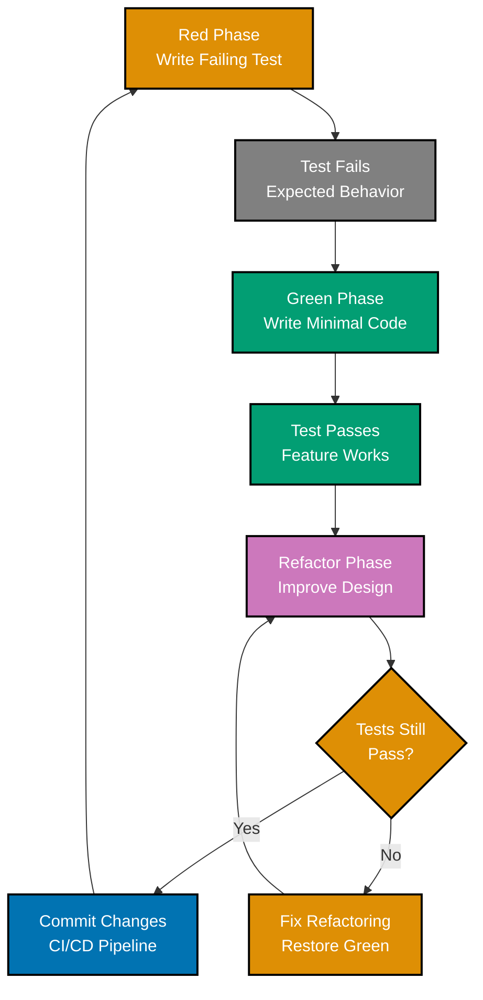
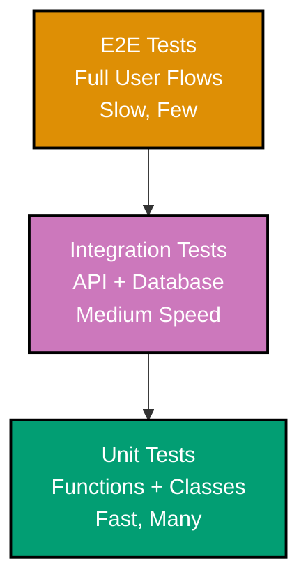
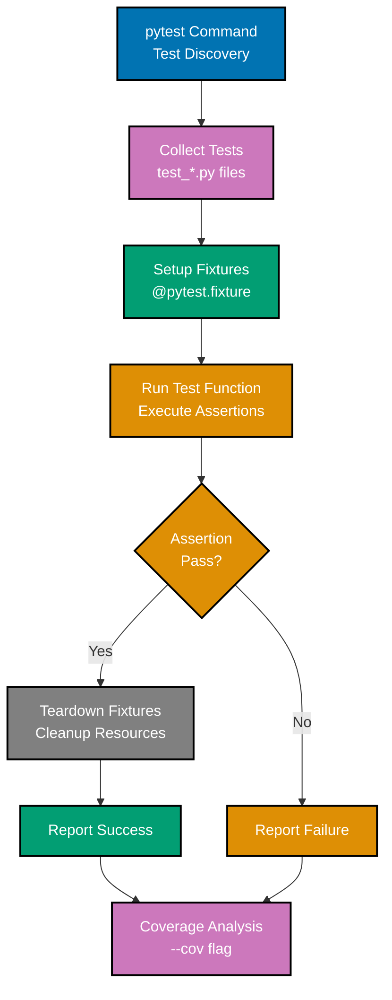
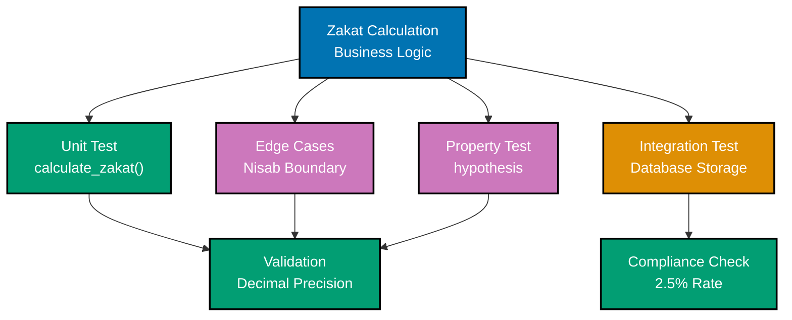

# Test-Driven Development in Python

**Quick Reference**: [Overview](#overview) | [TDD Workflow](#tdd-workflow) | [pytest Basics](#pytest-basics) | [Test Fixtures](#test-fixtures) | [Parameterized Tests](#parameterized-tests) | [Property-Based Testing](#property-based-testing-hypothesis) | [Mock Objects](#mock-objects) | [Test Organization](#test-organization) | [Financial Domain TDD](#financial-domain-tdd-examples) | [References](#references)

## Overview

Test-Driven Development (TDD) writes tests before implementation, ensuring code meets requirements and remains testable. For financial applications handling Zakat calculations and Islamic finance operations, TDD prevents calculation errors and validates business rules.

### TDD Benefits for Financial Domain

**Correctness**: Tests verify calculations against known values.

**Regression Prevention**: Tests catch breaking changes immediately.

**Design Feedback**: Test-first reveals design issues early.

**Documentation**: Tests document expected behavior.

**Confidence**: Comprehensive tests enable safe refactoring.

## TDD Workflow

Red-Green-Refactor cycle.

### TDD Red-Green-Refactor



### Test Pyramid



### pytest Execution Flow



### Financial Domain Testing



### TDD Cycle

```python
# 1. RED: Write failing test
def test_calculate_zakat_for_qualifying_wealth():
    """Test Zakat calculation for wealth exceeding nisab."""
    from decimal import Decimal
    from zakat_calculator import calculate_zakat

    wealth = Decimal("100000.00")
    nisab = Decimal("85000.00")

    result = calculate_zakat(wealth, nisab)

    assert result == Decimal("2500.00")  # FAILS: Function doesn't exist yet


# 2. GREEN: Write minimal implementation
def calculate_zakat(wealth: Decimal, nisab: Decimal) -> Decimal:
    """Calculate Zakat (2.5% if wealth >= nisab)."""
    if wealth >= nisab:
        return wealth * Decimal("0.025")
    return Decimal("0")


# 3. REFACTOR: Improve while keeping tests green
def calculate_zakat(wealth: Decimal, nisab: Decimal) -> Decimal:
    """Calculate Zakat obligation with validation."""
    if wealth < 0 or nisab < 0:
        raise ValueError("Amounts must be non-negative")

    if wealth >= nisab:
        return wealth * Decimal("0.025")
    return Decimal("0")
```

**Why this matters**: Red phase ensures test can fail. Green phase proves test passes. Refactor phase improves design safely.

## pytest Basics

pytest is Python's most popular testing framework.

### Basic Test Structure

```python
# test_zakat_calculator.py
import pytest
from decimal import Decimal
from zakat_calculator import ZakatCalculator


def test_zakat_calculation_for_qualifying_wealth():
    """Test standard Zakat calculation."""
    calculator = ZakatCalculator()

    result = calculator.calculate(Decimal("100000.00"), Decimal("85000.00"))

    assert result == Decimal("2500.00")


def test_zakat_calculation_below_nisab():
    """Test Zakat is zero when wealth below nisab."""
    calculator = ZakatCalculator()

    result = calculator.calculate(Decimal("50000.00"), Decimal("85000.00"))

    assert result == Decimal("0")


def test_zakat_calculation_with_negative_wealth_raises_error():
    """Test validation for negative wealth."""
    calculator = ZakatCalculator()

    with pytest.raises(ValueError, match="non-negative"):
        calculator.calculate(Decimal("-1000.00"), Decimal("85000.00"))
```

### Running pytest

```bash
# Run all tests
pytest

# Run specific test file
pytest test_zakat_calculator.py

# Run specific test
pytest test_zakat_calculator.py::test_zakat_calculation_for_qualifying_wealth

# Run with coverage
pytest --cov=src --cov-report=html

# Run with verbose output
pytest -v

# Run only failed tests
pytest --lf
```

**Why this matters**: pytest discovers tests automatically. Clear assertion failures. Rich plugin ecosystem. Coverage reports identify untested code.

## Test Fixtures

Fixtures provide reusable test setup.

### Defining Fixtures

```python
# test_donation_campaign.py
import pytest
from decimal import Decimal
from datetime import date
from donation_campaign import DonationCampaign, Money


@pytest.fixture
def sample_campaign():
    """Fixture providing test campaign."""
    return DonationCampaign(
        id="CAMP-001",
        name="Test Campaign",
        target_amount=Money(amount=Decimal("100000"), currency="USD"),
        current_amount=Money(amount=Decimal("0"), currency="USD"),
        start_date=date(2025, 1, 1),
    )


def test_campaign_starts_with_zero_donations(sample_campaign):
    """Test campaign initialization."""
    assert sample_campaign.current_amount.amount == Decimal("0")


def test_add_donation_increases_total(sample_campaign):
    """Test donation recording."""
    sample_campaign.add_donation(
        "DONOR-001",
        Money(amount=Decimal("5000"), currency="USD")
    )

    assert sample_campaign.current_amount.amount == Decimal("5000")


@pytest.fixture
def campaign_with_donations(sample_campaign):
    """Fixture with pre-loaded donations."""
    sample_campaign.add_donation(
        "DONOR-001",
        Money(amount=Decimal("50000"), currency="USD")
    )
    return sample_campaign


def test_campaign_target_met(campaign_with_donations):
    """Test target detection."""
    campaign_with_donations.add_donation(
        "DONOR-002",
        Money(amount=Decimal("50000"), currency="USD")
    )

    assert campaign_with_donations.is_target_met()
```

**Why this matters**: Fixtures eliminate test setup duplication. Composable test data. Automatic cleanup with yield fixtures.

## Parameterized Tests

Test multiple inputs without duplication.

### Using pytest.mark.parametrize

```python
# test_zakat_rates.py
import pytest
from decimal import Decimal
from zakat_calculator import calculate_zakat


@pytest.mark.parametrize(
    "wealth,nisab,expected_zakat",
    [
        (Decimal("100000"), Decimal("85000"), Decimal("2500")),
        (Decimal("85000"), Decimal("85000"), Decimal("2125")),
        (Decimal("200000"), Decimal("85000"), Decimal("5000")),
        (Decimal("84999"), Decimal("85000"), Decimal("0")),
        (Decimal("0"), Decimal("85000"), Decimal("0")),
    ],
)
def test_zakat_calculation_multiple_scenarios(wealth, nisab, expected_zakat):
    """Test Zakat calculation across scenarios."""
    result = calculate_zakat(wealth, nisab)
    assert result == expected_zakat


@pytest.mark.parametrize(
    "invalid_amount",
    [
        Decimal("-1000"),
        Decimal("-0.01"),
    ],
)
def test_negative_amounts_rejected(invalid_amount):
    """Test negative amount validation."""
    with pytest.raises(ValueError):
        calculate_zakat(invalid_amount, Decimal("85000"))
```

**Why this matters**: Parameterized tests cover multiple cases concisely. Each parameter set runs as separate test. Clear test matrix documentation.

## Property-Based Testing (hypothesis)

hypothesis generates test cases automatically.

### Using hypothesis

```python
# test_zakat_properties.py
from hypothesis import given, strategies as st
from decimal import Decimal
from zakat_calculator import calculate_zakat


@given(
    wealth=st.decimals(min_value=Decimal("0"), max_value=Decimal("1000000"), places=2),
    nisab=st.decimals(min_value=Decimal("1"), max_value=Decimal("100000"), places=2),
)
def test_zakat_always_less_than_wealth(wealth, nisab):
    """Property: Zakat amount always less than or equal to wealth."""
    zakat = calculate_zakat(wealth, nisab)
    assert zakat <= wealth


@given(
    wealth=st.decimals(min_value=Decimal("85000"), max_value=Decimal("1000000"), places=2),
)
def test_zakat_is_exactly_2_5_percent_when_qualifying(wealth):
    """Property: Zakat is exactly 2.5% for qualifying wealth."""
    nisab = Decimal("85000")
    zakat = calculate_zakat(wealth, nisab)

    expected = wealth * Decimal("0.025")
    assert zakat == expected


@given(
    wealth1=st.decimals(min_value=Decimal("85000"), max_value=Decimal("500000"), places=2),
    wealth2=st.decimals(min_value=Decimal("85000"), max_value=Decimal("500000"), places=2),
)
def test_zakat_sum_property(wealth1, wealth2):
    """Property: Zakat(A + B) = Zakat(A) + Zakat(B) for qualifying amounts."""
    nisab = Decimal("85000")

    combined_zakat = calculate_zakat(wealth1 + wealth2, nisab)
    individual_sum = calculate_zakat(wealth1, nisab) + calculate_zakat(wealth2, nisab)

    assert combined_zakat == individual_sum
```

**Why this matters**: hypothesis finds edge cases developers miss. Property-based testing validates invariants. Powerful for financial calculations.

## Mock Objects

Mock external dependencies for unit testing.

### Using unittest.mock

```python
# test_zakat_service.py
from unittest.mock import Mock, patch
import pytest
from decimal import Decimal
from zakat_service import ZakatService


def test_zakat_service_fetches_nisab_from_api():
    """Test service fetches nisab from external API."""
    # Mock the API client
    mock_api_client = Mock()
    mock_api_client.fetch_nisab.return_value = Decimal("85000")

    service = ZakatService(api_client=mock_api_client)
    result = service.calculate_zakat_with_current_nisab(Decimal("100000"))

    # Verify API was called
    mock_api_client.fetch_nisab.assert_called_once()
    assert result == Decimal("2500")


@patch('zakat_service.requests.get')
def test_zakat_service_handles_api_failure(mock_get):
    """Test service handles API failures gracefully."""
    # Simulate API failure
    mock_get.side_effect = Exception("API unavailable")

    service = ZakatService()

    with pytest.raises(Exception, match="API unavailable"):
        service.fetch_current_nisab()
```

**Why this matters**: Mocks isolate unit under test. Fast tests without external dependencies. Verify interactions with collaborators.

## Test Organization

Structure tests for maintainability.

### Test Directory Structure

```
tests/
├── __init__.py
├── conftest.py                 # Shared fixtures
├── unit/
│   ├── __init__.py
│   ├── test_zakat_calculator.py
│   ├── test_donation_campaign.py
│   └── test_murabaha_contract.py
├── integration/
│   ├── __init__.py
│   ├── test_zakat_service.py
│   └── test_campaign_repository.py
└── e2e/
    ├── __init__.py
    └── test_donation_workflow.py
```

### Shared Fixtures (conftest.py)

```python
# tests/conftest.py
import pytest
from decimal import Decimal
from datetime import date


@pytest.fixture
def standard_nisab():
    """Standard nisab threshold for tests."""
    return Decimal("85000.00")


@pytest.fixture
def sample_wealth_amounts():
    """Sample wealth amounts for testing."""
    return [
        Decimal("50000.00"),
        Decimal("100000.00"),
        Decimal("150000.00"),
    ]


@pytest.fixture(scope="session")
def test_database():
    """Session-scoped database fixture."""
    db = create_test_database()
    yield db
    cleanup_test_database(db)
```

**Why this matters**: Organized tests easier to navigate. conftest.py shares fixtures across modules. Separation of unit/integration/e2e tests.

## Financial Domain TDD Examples

### TDD for Murabaha Contract

```python
# test_murabaha_contract.py
import pytest
from decimal import Decimal
from murabaha import MurabahaContract, Money


class TestMurabahaContract:
    """Test suite for Murabaha contract calculations."""

    def test_profit_amount_calculation(self):
        """Test profit calculation (cost * margin)."""
        contract = MurabahaContract(
            contract_id="MB-001",
            asset_cost=Money(Decimal("200000"), "USD"),
            profit_margin_rate=Decimal("0.15"),
        )

        assert contract.profit_amount == Money(Decimal("30000"), "USD")

    def test_total_selling_price(self):
        """Test total price (cost + profit)."""
        contract = MurabahaContract(
            contract_id="MB-001",
            asset_cost=Money(Decimal("200000"), "USD"),
            profit_margin_rate=Decimal("0.15"),
        )

        assert contract.total_selling_price == Money(Decimal("230000"), "USD")

    def test_financing_amount_after_down_payment(self):
        """Test financing calculation (total - down payment)."""
        contract = MurabahaContract(
            contract_id="MB-001",
            asset_cost=Money(Decimal("200000"), "USD"),
            profit_margin_rate=Decimal("0.15"),
            down_payment=Money(Decimal("50000"), "USD"),
        )

        assert contract.financing_amount == Money(Decimal("180000"), "USD")

    @pytest.mark.parametrize("invalid_margin", [
        Decimal("-0.1"),
        Decimal("1.5"),
    ])
    def test_invalid_profit_margin_rejected(self, invalid_margin):
        """Test profit margin validation."""
        with pytest.raises(ValueError):
            MurabahaContract(
                contract_id="MB-001",
                asset_cost=Money(Decimal("200000"), "USD"),
                profit_margin_rate=invalid_margin,
            )
```

**Why this matters**: TDD ensures Murabaha calculations correct. Tests document Islamic finance rules. Validation prevents invalid contracts.

## TDD Checklist

### Red Phase (Write Failing Test)

- [ ] Test written before implementation
- [ ] Test fails for the right reason (expected error message)
- [ ] Test is focused and tests one behavior
- [ ] Test has clear, descriptive name
- [ ] Assertions are specific and meaningful

### Green Phase (Make Test Pass)

- [ ] Simplest implementation that makes test pass
- [ ] No premature optimization
- [ ] All tests still passing
- [ ] Code follows Python idioms (PEP 8)
- [ ] Type hints added where appropriate

### Refactor Phase

- [ ] Code is clean and maintainable
- [ ] No duplication (DRY principle)
- [ ] All tests still passing after refactoring
- [ ] Test coverage maintained or improved
- [ ] Docstrings added for public functions

### Test Quality

- [ ] Tests are independent (no shared state)
- [ ] Tests are repeatable (deterministic, no randomness)
- [ ] Tests are fast (< 100ms for unit tests)
- [ ] Test setup/teardown properly managed (pytest fixtures)
- [ ] Mock/stub external dependencies appropriately

### pytest Best Practices

- [ ] Using pytest fixtures for reusable test data
- [ ] Parameterized tests for multiple input scenarios
- [ ] Appropriate use of pytest.raises for exception testing
- [ ] Using conftest.py for shared fixtures
- [ ] Clear assertion failure messages

### Financial Domain Testing

- [ ] Zakat calculations tested with edge cases (nisab threshold, exact boundary)
- [ ] Decimal precision tested (no floating point errors, using Decimal type)
- [ ] Murabaha contract validation tested (profit margins, down payments)
- [ ] Audit trail creation verified in tests
- [ ] Currency handling tested (no mixing currencies without conversion)

## References

### Official Documentation

- [pytest Documentation](https://docs.pytest.org/)
- [unittest Documentation](https://docs.python.org/3/library/unittest.html)
- [hypothesis Documentation](https://hypothesis.readthedocs.io/)
- [unittest.mock](https://docs.python.org/3/library/unittest.mock.html)

### Related Documentation

- [Behaviour-Driven Development](./ex-so-prla-py__behaviour-driven-development.md) - BDD with Gherkin
- [Best Practices](./ex-so-prla-py__best-practices.md) - Testing standards
- [Domain-Driven Design](./ex-so-prla-py__domain-driven-design.md) - Testing aggregates

### Books

- "Test Driven Development" by Kent Beck
- "Python Testing with pytest" by Brian Okken

---

**Last Updated**: 2025-01-23
**Python Version**: 3.11+ (baseline), 3.12+ (stable maintenance), 3.14.x (latest stable)
**Maintainers**: OSE Platform Documentation Team
