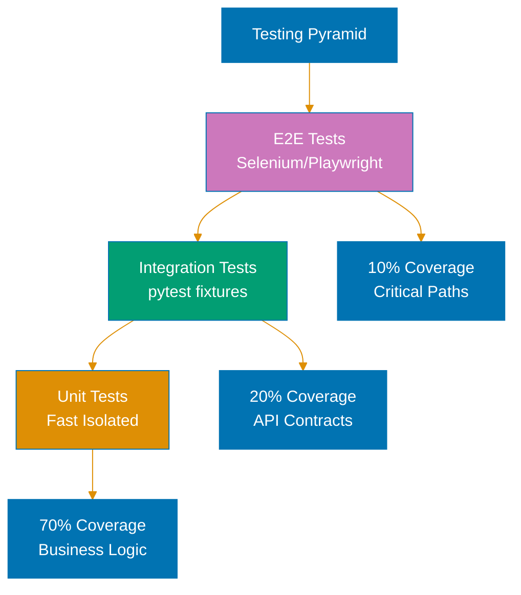

## Python Testing Pyramid

```mermaid
%%{init: {'theme':'base', 'themeVariables': { 'primaryColor':'#0173B2','primaryTextColor':'#fff','primaryBorderColor':'#0173B2','lineColor':'#DE8F05','secondaryColor':'#029E73','tertiaryColor':'#CC78BC','fontSize':'16px'}}}%%
flowchart TD
    A[Testing Pyramid] --> B[E2E Tests<br/>Selenium/Playwright]
    B --> C[Integration Tests<br/>pytest fixtures]
    C --> D[Unit Tests<br/>Fast Isolated]

    D --> E[70% Coverage<br/>Business Logic]
    C --> F[20% Coverage<br/>API Contracts]
    B --> G[10% Coverage<br/>Critical Paths]

    style A fill:#0173B2,color:#fff
    style B fill:#CC78BC,color:#fff
    style C fill:#029E73,color:#fff
    style D fill:#DE8F05,color:#fff
```
