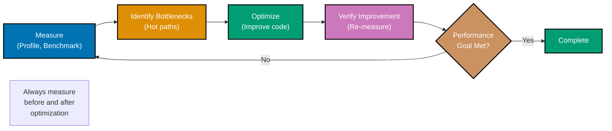
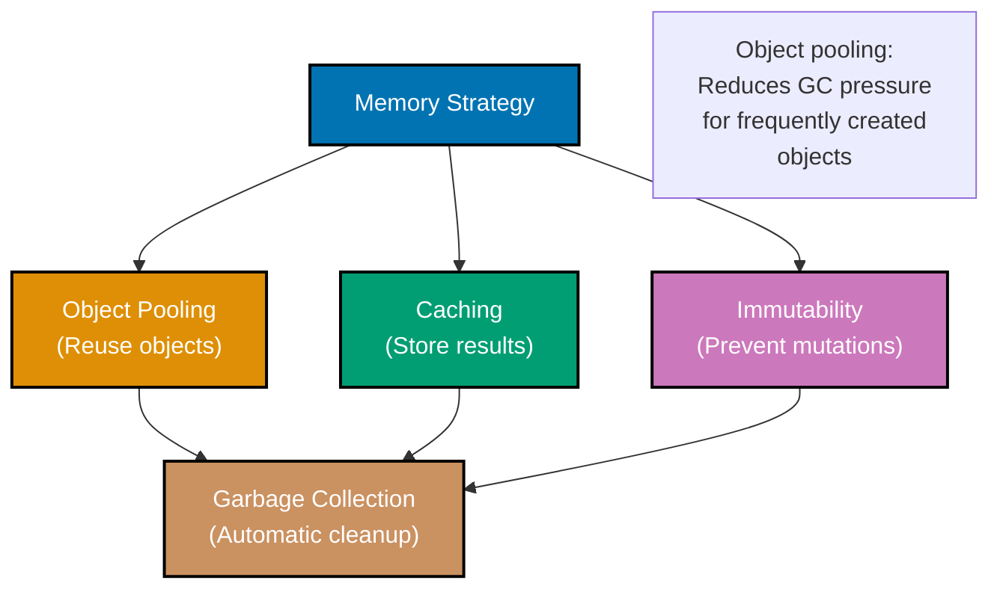
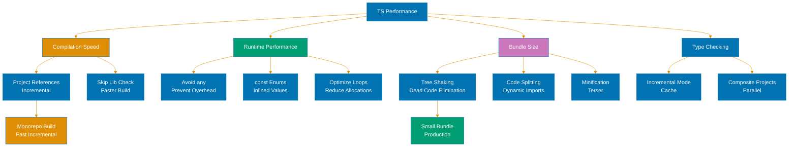

# TypeScript Performance

**Quick Reference**: [Overview](#overview) | [Profiling](#profiling) | [Algorithm Optimization](#algorithm-optimization) | [Data Structures](#data-structures) | [Caching](#caching) | [Database Optimization](#database-optimization) | [Async Optimization](#asynchronous-optimization) | [Bundle Optimization](#bundle-optimization) | [Benchmarking](#benchmarking) | [Related Documentation](#related-documentation)

## Overview

Performance is critical for financial applications processing donations, calculating Zakat, and handling transactions. This guide covers profiling, optimization techniques, and performance patterns in TypeScript.

### Performance Principles

- **Measure First**: Profile before optimizing
- **Algorithmic Complexity**: O(n) vs O(n²) matters more than micro-optimizations
- **Early Returns**: Fail fast, avoid unnecessary work
- **Lazy Evaluation**: Compute only when needed
- **Caching**: Store expensive computations
- **Batch Operations**: Process in bulk when possible

### Optimization Pipeline



## Profiling

### Node.js Profiler

```typescript
// Start profiling
import { performance, PerformanceObserver } from "perf_hooks";

const obs = new PerformanceObserver((items) => {
  console.log(items.getEntries());
  performance.clearMarks();
});

obs.observe({ entryTypes: ["measure"] });

// Mark performance points
performance.mark("start-zakat-calculation");

// ... expensive operation ...
calculateZakat(donations);

performance.mark("end-zakat-calculation");
performance.measure("zakat-calculation", "start-zakat-calculation", "end-zakat-calculation");
```

### Chrome DevTools CPU Profiler

```typescript
// Run with --inspect flag
// node --inspect app.ts

// Or programmatically
import inspector from "inspector";

const session = new inspector.Session();
session.connect();

// Start profiling
session.post("Profiler.enable", () => {
  session.post("Profiler.start", () => {
    // Run expensive code
    processAllDonations();

    // Stop profiling
    session.post("Profiler.stop", (err, { profile }) => {
      // Save profile
      require("fs").writeFileSync("profile.cpuprofile", JSON.stringify(profile));
      session.disconnect();
    });
  });
});
```

### Function-Level Profiling

```typescript
function profileFunction<T extends any[], R>(name: string, fn: (...args: T) => R): (...args: T) => R {
  return (...args: T): R => {
    const start = performance.now();
    const result = fn(...args);
    const end = performance.now();

    console.log(`${name} took ${(end - start).toFixed(2)}ms`);
    return result;
  };
}

// Usage
const calculateZakatProfiled = profileFunction("calculateZakat", calculateZakat);

const result = calculateZakatProfiled(donations);
```

### Async Function Profiling

```typescript
function profileAsync<T extends any[], R>(name: string, fn: (...args: T) => Promise<R>): (...args: T) => Promise<R> {
  return async (...args: T): Promise<R> => {
    const start = performance.now();
    const result = await fn(...args);
    const end = performance.now();

    console.log(`${name} took ${(end - start).toFixed(2)}ms`);
    return result;
  };
}

// Usage
const fetchDonationsProfiled = profileAsync("fetchDonations", fetchDonations);

const donations = await fetchDonationsProfiled();
```

## Algorithm Optimization

### Time Complexity

```typescript
// ❌ SLOW: O(n²) - nested loops
function findDuplicateDonations(donations: Donation[]): Donation[] {
  const duplicates: Donation[] = [];

  for (let i = 0; i < donations.length; i++) {
    for (let j = i + 1; j < donations.length; j++) {
      if (donations[i].donorId === donations[j].donorId) {
        duplicates.push(donations[j]);
      }
    }
  }

  return duplicates;
}

// ✅ FAST: O(n) - using Set
function findDuplicateDonationsFast(donations: Donation[]): Donation[] {
  const seen = new Set<string>();
  const duplicates: Donation[] = [];

  for (const donation of donations) {
    if (seen.has(donation.donorId)) {
      duplicates.push(donation);
    } else {
      seen.add(donation.donorId);
    }
  }

  return duplicates;
}
```

### Early Returns

```typescript
// ✅ FAST: Early return optimization
function isZakatApplicable(wealth: number, nisabThreshold: number): boolean {
  // Early return for simple cases
  if (wealth <= 0) return false;
  if (wealth < nisabThreshold) return false;

  // More expensive checks only if needed
  const hasBeenHeld = checkHoldingPeriod();
  if (!hasBeenHeld) return false;

  return true;
}

// ✅ FAST: Short-circuit evaluation
function validateDonation(donation: Donation): boolean {
  return (
    donation.amount > 0 &&
    isValidCurrency(donation.currency) &&
    isValidCategory(donation.category) &&
    isValidDonorId(donation.donorId)
  );
  // Stops at first false condition
}
```

### Lazy Evaluation

```typescript
// ✅ FAST: Lazy calculation
class DonationStats {
  private _total: number | null = null;
  private _average: number | null = null;

  constructor(private donations: Donation[]) {}

  // Calculate only when accessed
  get total(): number {
    if (this._total === null) {
      this._total = this.donations.reduce((sum, d) => sum + d.amount, 0);
    }
    return this._total;
  }

  get average(): number {
    if (this._average === null) {
      this._average = this.total / this.donations.length;
    }
    return this._average;
  }
}
```

## Data Structures

### Memory Management Strategies



### Array vs Set vs Map

```typescript
// ❌ SLOW: Array lookup O(n)
const donorIds: string[] = [];

function hasDonor(id: string): boolean {
  return donorIds.includes(id); // O(n)
}

// ✅ FAST: Set lookup O(1)
const donorIdsSet = new Set<string>();

function hasDonorFast(id: string): boolean {
  return donorIdsSet.has(id); // O(1)
}

// ✅ FAST: Map for key-value O(1)
const donationsByDonor = new Map<string, Donation[]>();

function getDonorDonations(donorId: string): Donation[] {
  return donationsByDonor.get(donorId) || []; // O(1)
}
```

### Object Pooling

```typescript
// ✅ FAST: Reuse objects to reduce GC pressure
class MoneyPool {
  private pool: Money[] = [];

  acquire(amount: number, currency: string): Money {
    let money = this.pool.pop();

    if (!money) {
      money = { amount: 0, currency: "" };
    }

    money.amount = amount;
    money.currency = currency;

    return money;
  }

  release(money: Money): void {
    this.pool.push(money);
  }
}

const moneyPool = new MoneyPool();

// Use
const money = moneyPool.acquire(1000, "USD");
// ... use money ...
moneyPool.release(money);
```

### Typed Arrays for Numbers

```typescript
// ✅ FAST: Typed arrays for numeric data
const donationAmounts = new Float64Array(10000);

for (let i = 0; i < 10000; i++) {
  donationAmounts[i] = Math.random() * 10000;
}

// Much faster than Array<number> for numerical operations
function calculateTotal(amounts: Float64Array): number {
  let sum = 0;
  for (let i = 0; i < amounts.length; i++) {
    sum += amounts[i];
  }
  return sum;
}
```

## Caching

### Lazy Loading Pattern

```mermaid
%% Color Palette: Blue #0173B2, Orange #DE8F05, Teal #029E73, Purple #CC78BC, Brown #CA9161
sequenceDiagram
    participant App
    participant Loader
    participant Module

    App->>Loader: Request heavy module
    activate Loader
    Note over Loader: Check if loaded

    alt Already loaded
        Loader-->>App: Return cached module
    else Not loaded
        Loader->>Module: import#40;'./heavy'#41;
        activate Module
        Module-->>Loader: Module loaded
        deactivate Module
        Loader->>Loader: Cache module
        Loader-->>App: Return module
    end
    deactivate Loader

    Note over App: Only load when needed<br/>Cache after first load

    classDef blue fill:#0173B2,stroke:#000000,color:#FFFFFF,stroke-width:2px
    classDef orange fill:#DE8F05,stroke:#000000,color:#FFFFFF,stroke-width:2px
    classDef teal fill:#029E73,stroke:#000000,color:#FFFFFF,stroke-width:2px
```

### Memoization

```typescript
// ✅ FAST: Memoize expensive calculations
function memoize<T extends any[], R>(fn: (...args: T) => R): (...args: T) => R {
  const cache = new Map<string, R>();

  return (...args: T): R => {
    const key = JSON.stringify(args);

    if (cache.has(key)) {
      return cache.get(key)!;
    }

    const result = fn(...args);
    cache.set(key, result);
    return result;
  };
}

// Expensive Zakat calculation
const calculateZakat = (wealth: number, nisab: number): number => {
  // Complex calculation
  if (wealth < nisab) return 0;
  return wealth * 0.025;
};

const calculateZakatMemoized = memoize(calculateZakat);

// First call: calculates
calculateZakatMemoized(100000, 3000); // Calculated

// Second call with same args: cached
calculateZakatMemoized(100000, 3000); // From cache
```

### LRU Cache

```typescript
class LRUCache<K, V> {
  private cache = new Map<K, V>();

  constructor(private maxSize: number) {}

  get(key: K): V | undefined {
    const value = this.cache.get(key);

    if (value !== undefined) {
      // Move to end (most recently used)
      this.cache.delete(key);
      this.cache.set(key, value);
    }

    return value;
  }

  set(key: K, value: V): void {
    if (this.cache.has(key)) {
      this.cache.delete(key);
    } else if (this.cache.size >= this.maxSize) {
      // Remove least recently used (first item)
      const firstKey = this.cache.keys().next().value;
      this.cache.delete(firstKey);
    }

    this.cache.set(key, value);
  }
}

// Usage
const donationCache = new LRUCache<string, Donation>(1000);

async function getDonation(id: string): Promise<Donation> {
  const cached = donationCache.get(id);
  if (cached) return cached;

  const donation = await fetchDonationFromDB(id);
  donationCache.set(id, donation);
  return donation;
}
```

### Redis Caching

```typescript
import { createClient } from "redis";

const redis = createClient({
  url: process.env.REDIS_URL,
});

await redis.connect();

// Cache with TTL
async function getCachedDonationStats(donorId: string): Promise<DonationStats | null> {
  const key = `donor:${donorId}:stats`;

  // Try cache
  const cached = await redis.get(key);
  if (cached) {
    return JSON.parse(cached);
  }

  // Calculate
  const stats = await calculateDonorStats(donorId);

  // Cache for 1 hour
  await redis.setEx(key, 3600, JSON.stringify(stats));

  return stats;
}

// Invalidate cache
async function invalidateDonorCache(donorId: string): Promise<void> {
  await redis.del(`donor:${donorId}:stats`);
}
```

## Database Optimization

### Query Optimization

```typescript
import { PrismaClient } from "@prisma/client";

const prisma = new PrismaClient();

// ❌ SLOW: N+1 query problem
async function getDonationsWithDonorsSlow(): Promise<any[]> {
  const donations = await prisma.donation.findMany();

  const result = [];
  for (const donation of donations) {
    const donor = await prisma.donor.findUnique({
      where: { id: donation.donorId },
    });
    result.push({ donation, donor });
  }

  return result;
}

// ✅ FAST: Use include to join
async function getDonationsWithDonorsFast(): Promise<any[]> {
  return prisma.donation.findMany({
    include: {
      donor: true,
    },
  });
}
```

### Pagination

```typescript
// ✅ FAST: Cursor-based pagination
async function getDonationsPaginated(cursor?: string, limit: number = 100) {
  return prisma.donation.findMany({
    take: limit,
    skip: cursor ? 1 : 0,
    cursor: cursor ? { id: cursor } : undefined,
    orderBy: { createdAt: "desc" },
  });
}

// ✅ FAST: Offset pagination with total count cache
let totalDonationsCache: number | null = null;
let cacheExpiry: number | null = null;

async function getTotalDonations(): Promise<number> {
  const now = Date.now();

  if (totalDonationsCache && cacheExpiry && now < cacheExpiry) {
    return totalDonationsCache;
  }

  totalDonationsCache = await prisma.donation.count();
  cacheExpiry = now + 60000; // Cache for 1 minute

  return totalDonationsCache;
}
```

### Batch Operations

```typescript
// ❌ SLOW: Individual inserts
async function createDonationsSlow(donations: DonationInput[]): Promise<void> {
  for (const donation of donations) {
    await prisma.donation.create({ data: donation });
  }
}

// ✅ FAST: Batch insert
async function createDonationsFast(donations: DonationInput[]): Promise<void> {
  await prisma.donation.createMany({
    data: donations,
    skipDuplicates: true,
  });
}
```

### Indexing

```typescript
// Prisma schema with indexes
model Donation {
  id        String   @id @default(cuid())
  donorId   String
  amount    Float
  currency  String
  category  String
  createdAt DateTime @default(now())

  // Indexes for performance
  @@index([donorId])
  @@index([category])
  @@index([createdAt])
  @@index([donorId, createdAt])
}

// Queries that use indexes
const recentDonations = await prisma.donation.findMany({
  where: {
    donorId: "DNR-123",
    createdAt: {
      gte: lastMonth,
    },
  },
  orderBy: {
    createdAt: "desc",
  },
});
```

## Asynchronous Optimization

### Parallel Execution

```typescript
// ❌ SLOW: Sequential
async function getDashboardDataSlow() {
  const donations = await fetchDonations();
  const donors = await fetchDonors();
  const campaigns = await fetchCampaigns();
  const stats = await calculateStats();

  return { donations, donors, campaigns, stats };
}

// ✅ FAST: Parallel
async function getDashboardDataFast() {
  const [donations, donors, campaigns, stats] = await Promise.all([
    fetchDonations(),
    fetchDonors(),
    fetchCampaigns(),
    calculateStats(),
  ]);

  return { donations, donors, campaigns, stats };
}
```

### Promise.allSettled for Non-Critical Operations

```typescript
// ✅ FAST: Don't fail fast for optional operations
async function processDonation(donation: Donation) {
  // Critical operations (must succeed)
  await saveDonationToDatabase(donation);

  // Optional operations (can fail)
  const [emailResult, smsResult, analyticsResult] = await Promise.allSettled([
    sendEmailReceipt(donation),
    sendSMSConfirmation(donation),
    trackAnalyticsEvent(donation),
  ]);

  // Log failures but continue
  if (emailResult.status === "rejected") {
    console.error("Email failed:", emailResult.reason);
  }
}
```

### Batching with Debounce

```typescript
// ✅ FAST: Batch database writes
class DonationBatcher {
  private queue: Donation[] = [];
  private timeout: NodeJS.Timeout | null = null;

  async add(donation: Donation): Promise<void> {
    this.queue.push(donation);

    if (this.timeout) {
      clearTimeout(this.timeout);
    }

    this.timeout = setTimeout(() => this.flush(), 100);

    // Also flush if batch is large
    if (this.queue.length >= 100) {
      await this.flush();
    }
  }

  private async flush(): Promise<void> {
    if (this.queue.length === 0) return;

    const batch = [...this.queue];
    this.queue = [];

    await prisma.donation.createMany({
      data: batch,
    });
  }
}

const batcher = new DonationBatcher();

// Usage
for (const donation of donations) {
  await batcher.add(donation);
}
```

## Bundle Optimization

### Tree Shaking

```typescript
// ✅ GOOD: Import only what you need
import { map, filter } from "lodash-es";

// ❌ BAD: Imports entire library
import _ from "lodash";
```

### Code Splitting

```typescript
// ✅ GOOD: Lazy load heavy modules
async function generatePDFReceipt(donation: Donation) {
  const PDFDocument = await import("pdfkit");
  const doc = new PDFDocument.default();
  // ... generate PDF ...
}

// React code splitting
const HeavyComponent = React.lazy(() => import("./HeavyComponent"));

function App() {
  return (
    <React.Suspense fallback={<div>Loading...</div>}>
      <HeavyComponent />
    </React.Suspense>
  );
}
```

### Dynamic Imports

```typescript
// ✅ GOOD: Load modules on demand
async function calculateComplexZakat(data: ZakatInput) {
  if (data.includesAgricultural) {
    const { calculateAgriculturalZakat } = await import("./agricultural");
    return calculateAgriculturalZakat(data);
  }

  // Default calculation
  return data.wealth * 0.025;
}
```

## Benchmarking

### Simple Benchmark

```typescript
function benchmark(name: string, fn: () => void, iterations: number = 1000) {
  const start = performance.now();

  for (let i = 0; i < iterations; i++) {
    fn();
  }

  const end = performance.now();
  const total = end - start;
  const average = total / iterations;

  console.log(`${name}:`);
  console.log(`  Total: ${total.toFixed(2)}ms`);
  console.log(`  Average: ${average.toFixed(4)}ms`);
  console.log(`  Ops/sec: ${(1000 / average).toFixed(0)}`);
}

// Usage
benchmark(
  "Array.includes",
  () => {
    [1, 2, 3, 4, 5].includes(3);
  },
  1000000,
);

benchmark(
  "Set.has",
  () => {
    new Set([1, 2, 3, 4, 5]).has(3);
  },
  1000000,
);
```

### Tinybench

```typescript
import { Bench } from "tinybench";

const bench = new Bench();

const donations = generateDonations(10000);

bench
  .add("find with filter", () => {
    donations.filter((d) => d.category === "zakat");
  })
  .add("find with for loop", () => {
    const result = [];
    for (const d of donations) {
      if (d.category === "zakat") {
        result.push(d);
      }
    }
  });

await bench.run();

console.table(bench.table());
```

### Load Testing with Autocannon

```typescript
import autocannon from "autocannon";

async function loadTest() {
  const result = await autocannon({
    url: "http://localhost:3000/api/donations",
    connections: 100,
    duration: 10,
    pipelining: 1,
    method: "POST",
    headers: {
      "content-type": "application/json",
    },
    body: JSON.stringify({
      donorId: "DNR-1234567890",
      amount: 1000,
      currency: "USD",
      category: "zakat",
    }),
  });

  console.log("Requests/sec:", result.requests.average);
  console.log("Latency (ms):", result.latency.mean);
  console.log("Errors:", result.errors);
}

loadTest();
```

## Performance Monitoring

### Application Performance Monitoring

```typescript
import * as Sentry from "@sentry/node";

Sentry.init({
  dsn: process.env.SENTRY_DSN,
  tracesSampleRate: 0.1,
  profilesSampleRate: 0.1,
});

// Trace slow operations
const transaction = Sentry.startTransaction({
  name: "Process Donation",
});

try {
  await processDonation(donation);
} finally {
  transaction.finish();
}

// Custom metrics
Sentry.metrics.increment("donation.created", 1, {
  tags: { category: donation.category },
});
```

### Custom Metrics

```typescript
class Metrics {
  private counters = new Map<string, number>();
  private timings: Array<{ name: string; duration: number }> = [];

  increment(name: string, value: number = 1): void {
    const current = this.counters.get(name) || 0;
    this.counters.set(name, current + value);
  }

  timing(name: string, duration: number): void {
    this.timings.push({ name, duration });
  }

  report(): void {
    console.log("=== Metrics Report ===");
    console.log("Counters:", Object.fromEntries(this.counters));

    // Group timings by name
    const grouped = new Map<string, number[]>();
    for (const { name, duration } of this.timings) {
      if (!grouped.has(name)) {
        grouped.set(name, []);
      }
      grouped.get(name)!.push(duration);
    }

    console.log("Timings:");
    for (const [name, durations] of grouped) {
      const avg = durations.reduce((a, b) => a + b, 0) / durations.length;
      const max = Math.max(...durations);
      const min = Math.min(...durations);

      console.log(`  ${name}:`);
      console.log(`    Count: ${durations.length}`);
      console.log(`    Average: ${avg.toFixed(2)}ms`);
      console.log(`    Min: ${min.toFixed(2)}ms`);
      console.log(`    Max: ${max.toFixed(2)}ms`);
    }
  }
}

const metrics = new Metrics();

// Usage
async function processDonation(donation: Donation) {
  const start = performance.now();

  await saveDonation(donation);

  const end = performance.now();
  metrics.timing("donation.process", end - start);
  metrics.increment("donation.created");
}

// Report every minute
setInterval(() => {
  metrics.report();
}, 60000);
```

## Related Documentation

- **[TypeScript Best Practices](./ex-so-prla-ts__best-practices.md)** - Coding standards
- **[TypeScript Memory Management](./ex-so-prla-ts__memory-management.md)** - Memory optimization
- **[TypeScript Concurrency](./ex-so-prla-ts__concurrency-and-parallelism.md)** - Async patterns

---

**Last Updated**: 2025-01-23
**TypeScript Version**: 5.0+ (baseline), 5.4+ (milestone), 5.6+ (stable), 5.9.3+ (latest stable)
**Maintainers**: OSE Documentation Team

## Performance Optimization


