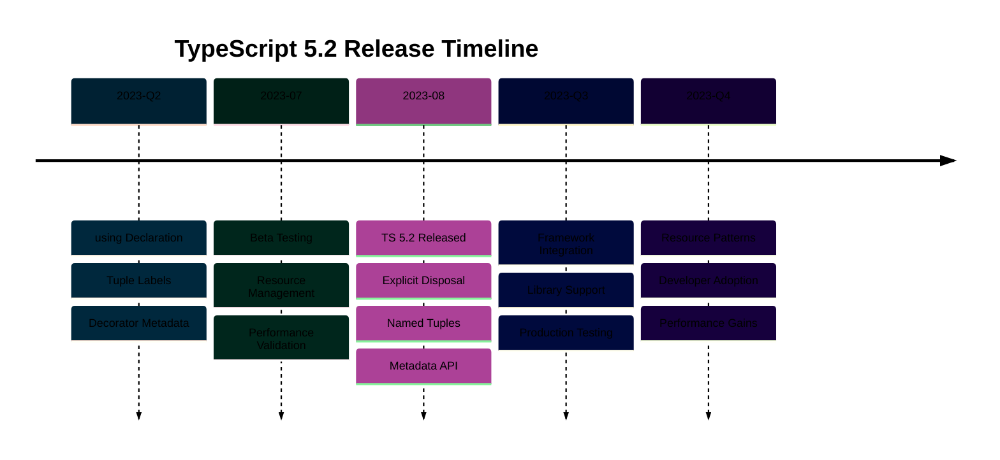

# TypeScript 5.2 Release

## Overview

TypeScript 5.2 introduces new features, type system enhancements, and performance improvements. This release continues TypeScript's evolution toward better type safety and developer productivity.

## Key Features

This release includes improvements to the type system, compiler performance, and editor tooling.

## Breaking Changes

Consult the official TypeScript 5.2 documentation for detailed breaking changes and migration guidance.

## References

- [TypeScript 5.2 Release Notes](https://www.typescriptlang.org/docs/handbook/release-notes/typescript-5.2.html)
- [TypeScript Documentation](https://www.typescriptlang.org/docs/)

---

**Last Updated**: 2026-01-24
**TypeScript Version**: 5.0+ (baseline), 5.7+ (stable maintenance), 5.9.x (latest stable)
**Maintainers**: OSE Platform Documentation Team

```mermaid
%%{init: {'theme':'base', 'themeVariables': { 'primaryColor':'#0173B2','primaryTextColor':'#fff','primaryBorderColor':'#0173B2','lineColor':'#DE8F05','secondaryColor':'#029E73','tertiaryColor':'#CC78BC','fontSize':'16px'}}}%%
flowchart TD
    A[TypeScript 5.2<br/>August 2023] --> B[using Declarations<br/>Explicit Resource Management]
    A --> C[Tuple Labels<br/>Named Elements]
    A --> D[Type-Only Imports<br/>Optimization]
    A --> E[Decorator Metadata<br/>Reflection API]

    B --> B1[Auto Disposal<br/>RAII Pattern]
    B --> B2[Symbol.dispose<br/>Resource Cleanup]

    C --> C1[Named Positions<br/>[x: number, y: number]]
    C --> C2[Better Documentation<br/>Self-Describing]

    D --> D1[Faster Builds<br/>Skip Emit]
    D --> D2[Better Tree Shaking<br/>Smaller Bundles]

    E --> E1[Runtime Metadata<br/>Decorator Info]
    E --> E2[Reflection Support<br/>Framework Integration]

    B1 --> F[Database Connection<br/>Auto Cleanup]
    C1 --> G[Coordinate Types<br/>Clear Labels]
    E1 --> H[DI Framework<br/>Metadata Reflection]

    style A fill:#0173B2,color:#fff
    style B fill:#DE8F05,color:#fff
    style C fill:#029E73,color:#fff
    style D fill:#CC78BC,color:#fff
    style E fill:#0173B2,color:#fff
    style F fill:#DE8F05,color:#fff
    style G fill:#029E73,color:#fff
    style H fill:#0173B2,color:#fff
```


