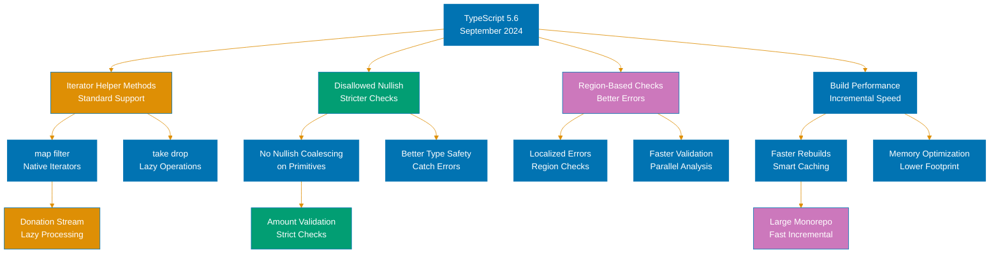
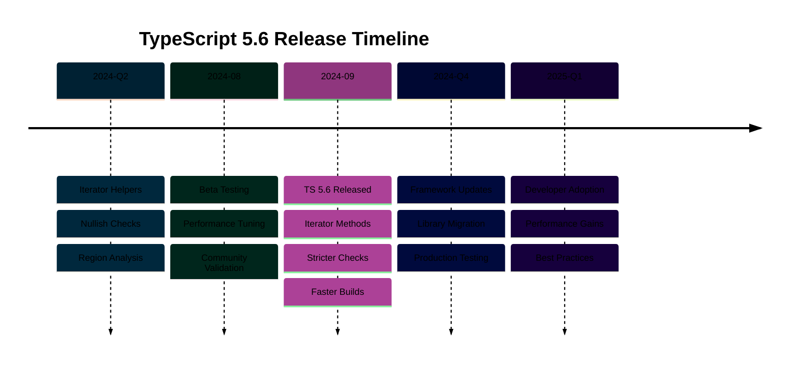

# TypeScript 5.6 Release

**Quick Reference**: [Overview](#-overview) | [Iterator Helpers](#-iterator-helper-methods) | [Nullish Checks](#-nullish-and-truthy-checks) | [Disallowed Checks](#-disallowed-nullish-and-truthy-checks) | [Intl APIs](#-region-priority-resolution-in-intl-apis) | [Other Features](#-other-features) | [Breaking Changes](#-breaking-changes) | [Migration Guide](#-migration-guide) | [Related Documentation](#-related-documentation)

## 📋 Overview

TypeScript 5.6, released in September 2024, introduces support for ES2024 iterator helper methods, enhanced type narrowing for truthiness and nullish checks, and improved type checking for Intl APIs. This release focuses on improving type safety and developer ergonomics while aligning with modern ECMAScript standards.

### Key Features

1. **Iterator Helper Methods**: Native support for ES2024 iterator helpers (map, filter, take, etc.)
2. **Improved Truthiness Narrowing**: Better type narrowing for truthiness checks
3. **Disallowed Nullish Checks**: Stricter checking for nonsensical comparisons
4. **Region-Priority in Intl APIs**: Better typing for international formatting APIs
5. **Performance Improvements**: Faster compilation and better memory usage

### Why TypeScript 5.6 Matters

- **Standards Alignment**: Implements ES2024 iterator helpers with full type safety
- **Better Type Safety**: Catches more nonsensical comparisons at compile time
- **International Support**: Improved typing for Intl APIs with region priorities
- **Developer Experience**: More intuitive type narrowing in conditional checks
- **Future-Ready**: Prepares codebases for upcoming ECMAScript standards

**Official Source**: [TypeScript 5.6 Release Notes](https://devblogs.microsoft.com/typescript/announcing-typescript-5-6/)

## 🔄 Iterator Helper Methods

### What Are Iterator Helper Methods?

Iterator helper methods are new ES2024 features that provide functional programming utilities for working with iterators. TypeScript 5.6 adds full type support for these methods, enabling type-safe operations on any iterable.

### Supported Iterator Methods

TypeScript 5.6 supports all ES2024 iterator helpers:

- **`map()`** - Transform each value
- **`filter()`** - Select values matching condition
- **`take()`** - Get first N values
- **`drop()`** - Skip first N values
- **`flatMap()`** - Map and flatten
- **`reduce()`** - Reduce to single value
- **`forEach()`** - Execute function for each value
- **`some()`** - Check if any value matches
- **`every()`** - Check if all values match
- **`find()`** - Find first matching value
- **`toArray()`** - Convert iterator to array

### Basic Iterator Usage

**Example 1: Basic map and filter**

```typescript
// Create an iterator from an array
const numbers = [1, 2, 3, 4, 5, 6, 7, 8, 9, 10];

// Use iterator helpers for functional transformations
const result = numbers
  .values()
  .filter((x) => x % 2 === 0) // [2, 4, 6, 8, 10]
  .map((x) => x * 2) // [4, 8, 12, 16, 20]
  .take(3) // [4, 8, 12]
  .toArray();

console.log(result); // [4, 8, 12]
```

**Example 2: Islamic calendar dates**

```typescript
interface IslamicDate {
  hijriYear: number;
  month: string;
  day: number;
}

const hijriCalendar: IslamicDate[] = [
  { hijriYear: 1446, month: "Muharram", day: 1 },
  { hijriYear: 1446, month: "Muharram", day: 10 }, // Ashura
  { hijriYear: 1446, month: "Safar", day: 1 },
  { hijriYear: 1446, month: "Rabi' al-Awwal", day: 12 }, // Mawlid
  { hijriYear: 1446, month: "Ramadan", day: 1 },
  { hijriYear: 1446, month: "Ramadan", day: 27 }, // Laylat al-Qadr
  { hijriYear: 1446, month: "Shawwal", day: 1 }, // Eid al-Fitr
];

// Find significant dates in Ramadan
const ramadanDates = hijriCalendar
  .values()
  .filter((date) => date.month === "Ramadan")
  .map((date) => `${date.month} ${date.day}, ${date.hijriYear} AH`)
  .toArray();

console.log(ramadanDates);
// ["Ramadan 1, 1446 AH", "Ramadan 27, 1446 AH"]
```

### Advanced Iterator Operations

**Example 3: Zakat calculation with take/drop**

```typescript
interface Transaction {
  id: string;
  amount: number;
  date: Date;
  type: "income" | "expense";
}

const transactions: Transaction[] = [
  { id: "T1", amount: 5000, date: new Date("2025-01-01"), type: "income" },
  { id: "T2", amount: 1000, date: new Date("2025-01-05"), type: "expense" },
  { id: "T3", amount: 10000, date: new Date("2025-01-10"), type: "income" },
  { id: "T4", amount: 2000, date: new Date("2025-01-15"), type: "expense" },
  { id: "T5", amount: 8000, date: new Date("2025-01-20"), type: "income" },
  { id: "T6", amount: 500, date: new Date("2025-01-25"), type: "expense" },
];

// Calculate total income for Zakat (skip first transaction, take first 5)
const zakatableIncome = transactions
  .values()
  .drop(1) // Skip the first transaction
  .take(5) // Consider only next 5 transactions
  .filter((tx) => tx.type === "income")
  .map((tx) => tx.amount)
  .reduce((total, amount) => total + amount, 0);

const zakatAmount = zakatableIncome * 0.025; // 2.5% Zakat rate

console.log(`Zakatable Income: $${zakatableIncome}`); // $18000
console.log(`Zakat Amount: $${zakatAmount}`); // $450
```

**Example 4: Donation campaign analysis**

```typescript
interface Donation {
  donor: string;
  amount: number;
  campaign: string;
  verified: boolean;
}

const donations: Donation[] = [
  { donor: "Ali", amount: 100, campaign: "Education", verified: true },
  { donor: "Fatima", amount: 250, campaign: "Healthcare", verified: true },
  { donor: "Omar", amount: 50, campaign: "Education", verified: false },
  { donor: "Aisha", amount: 500, campaign: "Education", verified: true },
  { donor: "Hassan", amount: 300, campaign: "Healthcare", verified: true },
  { donor: "Maryam", amount: 75, campaign: "Education", verified: true },
];

// Find top 3 verified education donations
const topEducationDonations = donations
  .values()
  .filter((d) => d.campaign === "Education" && d.verified)
  .map((d) => ({ donor: d.donor, amount: d.amount }))
  .toArray()
  .sort((a, b) => b.amount - a.amount)
  .slice(0, 3);

console.log(topEducationDonations);
// [
//   { donor: "Aisha", amount: 500 },
//   { donor: "Ali", amount: 100 },
//   { donor: "Maryam", amount: 75 }
// ]
```

**Example 5: Complex flatMap example**

```typescript
interface MurabahaContract {
  contractId: string;
  installments: {
    month: number;
    principalAmount: number;
    profitAmount: number;
  }[];
}

const contracts: MurabahaContract[] = [
  {
    contractId: "M001",
    installments: [
      { month: 1, principalAmount: 1000, profitAmount: 50 },
      { month: 2, principalAmount: 1000, profitAmount: 45 },
    ],
  },
  {
    contractId: "M002",
    installments: [
      { month: 1, principalAmount: 2000, profitAmount: 100 },
      { month: 2, principalAmount: 2000, profitAmount: 90 },
    ],
  },
];

// Calculate total monthly payments across all contracts
const monthlyPayments = contracts
  .values()
  .flatMap((contract) =>
    contract.installments.values().map((installment) => ({
      contractId: contract.contractId,
      month: installment.month,
      total: installment.principalAmount + installment.profitAmount,
    })),
  )
  .toArray();

console.log(monthlyPayments);
// [
//   { contractId: "M001", month: 1, total: 1050 },
//   { contractId: "M001", month: 2, total: 1045 },
//   { contractId: "M002", month: 1, total: 2100 },
//   { contractId: "M002", month: 2, total: 2090 }
// ]
```

**Example 6: Using some() and every()**

```typescript
interface WaqfProperty {
  id: string;
  value: number;
  verified: boolean;
  compliant: boolean;
}

const waqfProperties: WaqfProperty[] = [
  { id: "W1", value: 100000, verified: true, compliant: true },
  { id: "W2", value: 250000, verified: true, compliant: true },
  { id: "W3", value: 75000, verified: false, compliant: true },
  { id: "W4", value: 500000, verified: true, compliant: true },
];

// Check if all properties are Sharia-compliant
const allCompliant = waqfProperties.values().every((prop) => prop.compliant);
console.log(`All properties compliant: ${allCompliant}`); // true

// Check if any property needs verification
const needsVerification = waqfProperties.values().some((prop) => !prop.verified);
console.log(`Needs verification: ${needsVerification}`); // true

// Find first unverified property
const unverified = waqfProperties.values().find((prop) => !prop.verified);
console.log(`First unverified: ${unverified?.id}`); // "W3"
```

### Iterator Chaining Benefits

**Type safety throughout the chain**:

```typescript
interface ZakatRecord {
  year: number;
  wealth: number;
  nisab: number;
  paid: boolean;
}

const zakatRecords: ZakatRecord[] = [
  { year: 2023, wealth: 10000, nisab: 5000, paid: true },
  { year: 2024, wealth: 15000, nisab: 5500, paid: false },
  { year: 2025, wealth: 20000, nisab: 6000, paid: false },
];

// TypeScript infers types throughout the chain
const unpaidZakat = zakatRecords
  .values()
  .filter((record) => !record.paid && record.wealth >= record.nisab)
  // Type here: Iterator<ZakatRecord>
  .map((record) => ({
    year: record.year,
    amount: (record.wealth - record.nisab) * 0.025,
  }))
  // Type here: Iterator<{ year: number; amount: number }>
  .toArray();
// Type here: { year: number; amount: number }[]

console.log(unpaidZakat);
// [
//   { year: 2024, amount: 237.5 },
//   { year: 2025, amount: 350 }
// ]
```

### Performance Considerations

Iterator helpers are lazy and create iterators, not arrays:

```typescript
// Efficient: No intermediate arrays created
const efficientResult = largeDataset
  .values()
  .filter(predicate)
  .map(transform)
  .take(10) // Stops after 10 items
  .toArray();

// Less efficient: Creates intermediate arrays
const inefficientResult = largeDataset
  .filter(predicate) // Array created
  .map(transform) // Another array created
  .slice(0, 10); // Final array created
```

### Real-World Use Cases

**Use Case 1: Processing large transaction logs**

```typescript
interface TransactionLog {
  timestamp: Date;
  type: "zakat" | "donation" | "qardHasan";
  amount: number;
  verified: boolean;
}

function processRecentVerifiedZakat(logs: TransactionLog[]): number {
  return logs
    .values()
    .filter((log) => log.type === "zakat" && log.verified)
    .take(100) // Only process recent 100 transactions
    .map((log) => log.amount)
    .reduce((sum, amount) => sum + amount, 0);
}
```

**Use Case 2: Generating financial reports**

```typescript
interface MonthlyReport {
  month: string;
  income: number;
  expenses: number;
}

function generateQuarterlyReport(reports: MonthlyReport[]): string[] {
  return reports
    .values()
    .take(3) // Only first quarter
    .map((report) => {
      const profit = report.income - report.expenses;
      return `${report.month}: ${profit >= 0 ? "Profit" : "Loss"} $${Math.abs(profit)}`;
    })
    .toArray();
}
```

## ✅ Nullish and Truthy Checks

### Improved Type Narrowing

TypeScript 5.6 improves type narrowing for truthiness and nullish checks, making it easier to work with potentially null or undefined values.

### Truthiness Narrowing

**Before TypeScript 5.6**:

```typescript
function processValue(value: string | null | undefined) {
  if (value) {
    // Before: Type was still 'string | null | undefined'
    // Had to use explicit checks or assertions
    console.log(value.toUpperCase());
  }
}
```

**TypeScript 5.6 Improvement**:

```typescript
function processValue(value: string | null | undefined) {
  if (value) {
    // TS 5.6: Type correctly narrowed to 'string'
    console.log(value.toUpperCase()); // No error!
  }
}
```

### Nullish Coalescing Narrowing

**Example 1: Basic nullish coalescing**

```typescript
interface DonationConfig {
  minimumAmount?: number;
  currency?: string;
}

function getMinimumDonation(config: DonationConfig): number {
  // TS 5.6: Better narrowing with ?? operator
  const minimum = config.minimumAmount ?? 10;
  // Type of 'minimum' is correctly inferred as 'number'

  return minimum;
}
```

**Example 2: Nested nullish checks**

```typescript
interface MurabahaTerms {
  profitRate?: number;
  duration?: number;
}

interface MurabahaContract {
  terms?: MurabahaTerms;
}

function calculateProfit(contract: MurabahaContract, principal: number): number {
  const profitRate = contract.terms?.profitRate ?? 0.05;
  const duration = contract.terms?.duration ?? 12;

  // Both types correctly narrowed to number
  return principal * profitRate * (duration / 12);
}

const contract: MurabahaContract = { terms: { profitRate: 0.07 } };
console.log(calculateProfit(contract, 10000)); // 700
```

### Logical AND Narrowing

**Example 3: Combining truthiness checks**

```typescript
interface Donor {
  name: string;
  email?: string;
  verified?: boolean;
}

function canReceiveReceipt(donor: Donor): boolean {
  // TS 5.6: Improved narrowing with && operator
  if (donor.email && donor.verified) {
    // Both 'email' and 'verified' correctly narrowed
    sendReceipt(donor.email); // email is 'string', not 'string | undefined'
    return true;
  }
  return false;
}

function sendReceipt(email: string): void {
  console.log(`Sending receipt to ${email}`);
}
```

### Optional Chaining Improvements

**Example 4: Complex optional chaining**

```typescript
interface Transaction {
  metadata?: {
    donor?: {
      contact?: {
        email?: string;
      };
    };
  };
}

function getContactEmail(transaction: Transaction): string {
  // TS 5.6: Better type inference with optional chaining
  const email = transaction.metadata?.donor?.contact?.email ?? "no-email@example.com";
  // Type correctly inferred as 'string'

  return email.toLowerCase(); // Safe to use string methods
}
```

### Practical Examples

**Example 5: Zakat eligibility checking**

```typescript
interface WealthRecord {
  totalWealth?: number;
  debts?: number;
  nisabThreshold?: number;
}

function calculateZakatableWealth(record: WealthRecord): number {
  const totalWealth = record.totalWealth ?? 0;
  const debts = record.debts ?? 0;
  const nisab = record.nisabThreshold ?? 5000;

  const netWealth = totalWealth - debts;

  if (netWealth >= nisab) {
    // All types properly narrowed
    return netWealth * 0.025;
  }

  return 0;
}

const wealth: WealthRecord = { totalWealth: 20000, debts: 5000 };
console.log(calculateZakatableWealth(wealth)); // 375
```

**Example 6: Default configuration handling**

```typescript
interface AppConfig {
  features?: {
    zakatCalculator?: boolean;
    donationPortal?: boolean;
    waqfManagement?: boolean;
  };
}

function isFeatureEnabled(config: AppConfig, feature: keyof NonNullable<AppConfig["features"]>): boolean {
  const features = config.features ?? {};
  const enabled = features[feature] ?? false;

  // Type correctly narrowed to boolean
  return enabled;
}

const config: AppConfig = {
  features: { zakatCalculator: true },
};

console.log(isFeatureEnabled(config, "zakatCalculator")); // true
console.log(isFeatureEnabled(config, "donationPortal")); // false
```

## ⚠️ Disallowed Nullish and Truthy Checks

### What TypeScript 5.6 Now Warns About

TypeScript 5.6 adds errors for nonsensical truthiness and nullish comparisons that always evaluate to true or false.

### Disallowed Nullish Checks

**Example 1: Comparing objects to null/undefined**

```typescript
interface Donation {
  amount: number;
  donor: string;
}

// ❌ ERROR in TS 5.6: Donation object is never null
function validateDonation(donation: Donation) {
  if (donation === null) {
    // Error: This comparison appears to be unintentional because
    // the type 'Donation' can never be 'null'
    console.log("Invalid donation");
  }
}

// ✅ CORRECT: Check for null/undefined in the type
function validateDonation2(donation: Donation | null) {
  if (donation === null) {
    // OK: Type allows null
    console.log("Invalid donation");
    return;
  }

  // donation is now narrowed to Donation
  console.log(`Processing donation: ${donation.amount}`);
}
```

**Example 2: Checking required properties**

```typescript
interface ZakatRecord {
  wealth: number; // Required, not optional
  year: number;
}

function processZakat(record: ZakatRecord) {
  // ❌ ERROR in TS 5.6: wealth is always defined
  if (record.wealth === undefined) {
    // Error: This comparison is always 'false'
    console.log("Wealth not provided");
  }

  // ✅ CORRECT: Check if property is optional
  if (record.wealth < 0) {
    // OK: Meaningful check
    console.log("Invalid wealth value");
  }
}
```

### Disallowed Truthy Checks

**Example 3: Always-truthy objects**

```typescript
interface WaqfProperty {
  id: string;
  value: number;
}

function checkProperty(property: WaqfProperty) {
  // ❌ ERROR in TS 5.6: Object is always truthy
  if (property) {
    // Error: This condition will always return 'true' since
    // this object is always defined
    console.log("Property exists");
  }

  // ✅ CORRECT: Check specific property values
  if (property.value > 0) {
    // OK: Meaningful check
    console.log("Property has positive value");
  }
}
```

**Example 4: Non-nullable primitives**

```typescript
interface Transaction {
  amount: number; // Non-nullable
  type: string; // Non-nullable
}

function processTransaction(tx: Transaction) {
  // ❌ ERROR in TS 5.6: amount is always defined
  if (!tx.amount) {
    // Error: This check is meaningless for non-nullable number
    console.log("No amount");
  }

  // ✅ CORRECT: Check for zero or negative
  if (tx.amount <= 0) {
    // OK: Checks actual value
    console.log("Invalid amount");
    return;
  }

  console.log(`Processing ${tx.amount}`);
}
```

### How to Fix Disallowed Checks

**Solution 1: Update type definitions**

```typescript
// Before: Non-nullable causing errors
interface OldDonation {
  donor: string;
  amount: number;
}

function oldValidate(donation: OldDonation) {
  if (!donation.donor) {
    // Error in TS 5.6
  }
}

// After: Make properties optional if they can be missing
interface NewDonation {
  donor?: string;
  amount?: number;
}

function newValidate(donation: NewDonation) {
  if (!donation.donor) {
    // OK: donor is optional
    console.log("Donor name required");
    return;
  }

  // donor is now narrowed to string
  console.log(`Donor: ${donation.donor}`);
}
```

**Solution 2: Use meaningful checks**

```typescript
interface MurabahaContract {
  principal: number;
  profitRate: number;
}

// ❌ BAD: Checking object for truthiness
function badValidation(contract: MurabahaContract) {
  if (contract) {
    // Always true!
    processContract(contract);
  }
}

// ✅ GOOD: Check actual values
function goodValidation(contract: MurabahaContract) {
  if (contract.principal > 0 && contract.profitRate > 0) {
    // Meaningful validation
    processContract(contract);
  } else {
    console.log("Invalid contract terms");
  }
}

function processContract(contract: MurabahaContract) {
  console.log(`Principal: ${contract.principal}, Rate: ${contract.profitRate}`);
}
```

**Solution 3: Use type guards for null/undefined**

```typescript
interface Donor {
  id: string;
  name: string;
  email?: string; // Optional
}

// Type guard for optional email
function hasEmail(donor: Donor): donor is Donor & { email: string } {
  return donor.email !== undefined && donor.email !== "";
}

function sendThankYou(donor: Donor) {
  if (hasEmail(donor)) {
    // email is narrowed to string
    console.log(`Sending thank you to ${donor.email}`);
  } else {
    console.log("No email available");
  }
}
```

### Common Pitfalls

**Pitfall 1: Empty string vs undefined**

```typescript
interface Feedback {
  comment: string; // Non-nullable, can be empty string
}

function processFeedback(feedback: Feedback) {
  // ❌ ERROR: comment is never undefined
  if (feedback.comment === undefined) {
    console.log("No comment");
  }

  // ✅ CORRECT: Check for empty string
  if (feedback.comment === "" || feedback.comment.trim() === "") {
    console.log("Empty comment");
    return;
  }

  console.log(`Comment: ${feedback.comment}`);
}
```

**Pitfall 2: Zero vs undefined**

```typescript
interface Payment {
  amount: number; // Non-nullable, can be zero
}

function processPayment(payment: Payment) {
  // ❌ ERROR: amount is never undefined
  if (payment.amount === undefined) {
    console.log("No amount");
  }

  // ✅ CORRECT: Check for zero separately if needed
  if (payment.amount === 0) {
    console.log("Zero payment");
    return;
  }

  if (payment.amount < 0) {
    console.log("Negative payment");
    return;
  }

  console.log(`Processing payment: ${payment.amount}`);
}
```

## 🌍 Region-Priority Resolution in Intl APIs

### What Is Region-Priority Resolution?

TypeScript 5.6 adds better typing for the Intl API's new region-priority feature, allowing developers to specify regional preferences for date/time formatting.

### Basic Intl API Support

**Example 1: Basic date formatting with regions**

```typescript
// TypeScript 5.6 provides better typing for Intl options
const dateFormatter = new Intl.DateTimeFormat("ar-SA", {
  calendar: "islamic-umalqura",
  numberingSystem: "arab",
});

const hijriDate = dateFormatter.format(new Date("2025-01-24"));
console.log(hijriDate); // Formatted in Islamic calendar
```

**Example 2: Number formatting for currency**

```typescript
interface ZakatPayment {
  amount: number;
  currency: string;
  region: string;
}

function formatZakatAmount(payment: ZakatPayment): string {
  // TS 5.6: Better typing for Intl.NumberFormat options
  const formatter = new Intl.NumberFormat(payment.region, {
    style: "currency",
    currency: payment.currency,
    minimumFractionDigits: 2,
  });

  return formatter.format(payment.amount);
}

const payment: ZakatPayment = {
  amount: 2500,
  currency: "SAR",
  region: "ar-SA",
};

console.log(formatZakatAmount(payment)); // "٢٬٥٠٠٫٠٠ ر.س.‏"
```

### Islamic Calendar Integration

**Example 3: Hijri date formatting**

```typescript
interface IslamicDateOptions {
  locale: string;
  calendar: "islamic" | "islamic-umalqura" | "islamic-civil" | "islamic-tbla";
  numberingSystem?: "arab" | "latn";
}

function formatIslamicDate(date: Date, options: IslamicDateOptions): string {
  const formatter = new Intl.DateTimeFormat(options.locale, {
    calendar: options.calendar,
    numberingSystem: options.numberingSystem,
    year: "numeric",
    month: "long",
    day: "numeric",
  });

  return formatter.format(date);
}

const ramadanStart = new Date("2025-03-01");

console.log(
  formatIslamicDate(ramadanStart, {
    locale: "ar-SA",
    calendar: "islamic-umalqura",
    numberingSystem: "arab",
  }),
);
// "١ رمضان ١٤٤٦ هـ"

console.log(
  formatIslamicDate(ramadanStart, {
    locale: "en-US",
    calendar: "islamic-umalqura",
    numberingSystem: "latn",
  }),
);
// "Ramadan 1, 1446 AH"
```

**Example 4: Prayer time formatting**

```typescript
interface PrayerTime {
  name: string;
  time: Date;
}

function formatPrayerSchedule(prayers: PrayerTime[], locale: string): string[] {
  const timeFormatter = new Intl.DateTimeFormat(locale, {
    hour: "2-digit",
    minute: "2-digit",
    hour12: false,
  });

  return prayers.map((prayer) => `${prayer.name}: ${timeFormatter.format(prayer.time)}`);
}

const prayerTimes: PrayerTime[] = [
  { name: "Fajr", time: new Date("2025-01-24T05:30:00") },
  { name: "Dhuhr", time: new Date("2025-01-24T12:15:00") },
  { name: "Asr", time: new Date("2025-01-24T15:45:00") },
  { name: "Maghrib", time: new Date("2025-01-24T18:05:00") },
  { name: "Isha", time: new Date("2025-01-24T19:30:00") },
];

console.log(formatPrayerSchedule(prayerTimes, "ar-SA"));
// ["Fajr: ٠٥:٣٠", "Dhuhr: ١٢:١٥", ...]
```

### Multi-Region Support

**Example 5: International donation receipts**

```typescript
interface DonationReceipt {
  donorName: string;
  amount: number;
  currency: string;
  date: Date;
  locale: string;
}

function generateReceipt(receipt: DonationReceipt): string {
  const currencyFormatter = new Intl.NumberFormat(receipt.locale, {
    style: "currency",
    currency: receipt.currency,
  });

  const dateFormatter = new Intl.DateTimeFormat(receipt.locale, {
    year: "numeric",
    month: "long",
    day: "numeric",
  });

  return `
    Donation Receipt
    ----------------
    Donor: ${receipt.donorName}
    Amount: ${currencyFormatter.format(receipt.amount)}
    Date: ${dateFormatter.format(receipt.date)}
  `;
}

// Saudi donor
console.log(
  generateReceipt({
    donorName: "Ali Ahmed",
    amount: 1000,
    currency: "SAR",
    date: new Date("2025-01-24"),
    locale: "ar-SA",
  }),
);

// US donor
console.log(
  generateReceipt({
    donorName: "John Smith",
    amount: 500,
    currency: "USD",
    date: new Date("2025-01-24"),
    locale: "en-US",
  }),
);
```

## 🆕 Other Features

### Improved Error Messages

TypeScript 5.6 provides clearer, more actionable error messages:

```typescript
interface Transaction {
  amount: number;
}

function process(tx: Transaction) {
  // TS 5.6: Better error message
  console.log(tx.amont); // Did you mean 'amount'?
  // Error: Property 'amont' does not exist on type 'Transaction'.
  // Did you mean 'amount'?
}
```

### Better JSDoc Support

Enhanced JSDoc parsing for better type inference:

```typescript
/**
 * Calculate Zakat on wealth
 * @param {number} wealth - Total zakatable wealth
 * @param {number} [nisab=5000] - Nisab threshold
 * @returns {number} Zakat amount (2.5% of wealth above nisab)
 */
function calculateZakat(wealth: number, nisab = 5000): number {
  if (wealth < nisab) return 0;
  return (wealth - nisab) * 0.025;
}
```

### Compiler Performance

- **Faster type checking** for large codebases
- **Reduced memory usage** during compilation
- **Better incremental builds** with project references

### Editor Improvements

- **Smarter autocomplete** for nullish coalescing
- **Better refactoring** for iterator methods
- **Improved rename** across optional chains

## 💥 Breaking Changes

### 1. Stricter Nullish Checks

Code that performed nonsensical comparisons now produces errors:

```typescript
interface Donation {
  amount: number;
}

// Before: Accepted (incorrectly)
function validate(donation: Donation) {
  if (donation === null) {
    // No error in TS 5.5
    return false;
  }
  return true;
}

// TS 5.6: Error
// This comparison appears to be unintentional
```

**Fix**: Update type to include null if needed:

```typescript
function validate(donation: Donation | null) {
  if (donation === null) {
    // OK now
    return false;
  }
  return true;
}
```

### 2. Truthiness Check Errors

Always-true/false conditions now error:

```typescript
interface Config {
  timeout: number;
}

// Before: Accepted
function check(config: Config) {
  if (!config.timeout) {
    // No error in TS 5.5
  }
}

// TS 5.6: Error if timeout is non-nullable
```

**Fix**: Use meaningful value checks:

```typescript
function check(config: Config) {
  if (config.timeout <= 0) {
    // OK: Checks actual value
  }
}
```

### 3. Intl API Type Changes

More precise types for Intl options:

```typescript
// Before: Any string accepted
const formatter = new Intl.DateTimeFormat("en", {
  calendar: "invalid-calendar", // Accepted in TS 5.5
});

// TS 5.6: Error
// Type '"invalid-calendar"' is not assignable to type ...
```

**Fix**: Use valid calendar types:

```typescript
const formatter = new Intl.DateTimeFormat("en", {
  calendar: "islamic-umalqura", // OK: Valid calendar
});
```

### 4. Iterator Method Types

Iterator methods return iterators, not arrays:

```typescript
const numbers = [1, 2, 3];

// Before: Type might be inferred as array
const result = numbers.values().map((x) => x * 2);
// Type: IterableIterator<number> in TS 5.6

// Need explicit toArray() for array type
const arrayResult = numbers
  .values()
  .map((x) => x * 2)
  .toArray();
// Type: number[]
```

## 🚀 Migration Guide

### Step 1: Update TypeScript Version

```bash
# npm
npm install -D typescript@5.6

# yarn
yarn add -D typescript@5.6

# pnpm
pnpm add -D typescript@5.6
```

### Step 2: Review `tsconfig.json`

Recommended configuration for TypeScript 5.6:

```json
{
  "compilerOptions": {
    "target": "ES2024",
    "module": "ESNext",
    "lib": ["ES2024", "DOM"],
    "moduleResolution": "bundler",
    "strict": true,
    "skipLibCheck": true,
    "esModuleInterop": true,
    "resolveJsonModule": true,
    "isolatedModules": true,
    "incremental": true,
    "noUncheckedIndexedAccess": true
  }
}
```

### Step 3: Fix Nullish Check Errors

**Before (TS 5.5)**:

```typescript
interface Donation {
  amount: number;
  donor: string;
}

function validate(donation: Donation) {
  if (donation === null) {
    // Accepted in TS 5.5
    return false;
  }
  if (!donation.amount) {
    // Accepted in TS 5.5
    return false;
  }
  return true;
}
```

**After (TS 5.6)**:

```typescript
interface Donation {
  amount: number;
  donor: string;
}

// Option 1: Add null to type if actually possible
function validate(donation: Donation | null): boolean {
  if (donation === null) {
    // OK: Type allows null
    return false;
  }
  if (donation.amount <= 0) {
    // OK: Meaningful check
    return false;
  }
  return true;
}

// Option 2: Remove nonsensical checks
function validateSimple(donation: Donation): boolean {
  return donation.amount > 0 && donation.donor !== "";
}
```

### Step 4: Update Iterator Usage

**Before (TS 5.5)**:

```typescript
function processTransactions(transactions: Transaction[]): number {
  const totals = transactions.filter((tx) => tx.verified).map((tx) => tx.amount);

  return totals.reduce((sum, amt) => sum + amt, 0);
}
```

**After (TS 5.6 - Using iterator helpers)**:

```typescript
function processTransactions(transactions: Transaction[]): number {
  return transactions
    .values()
    .filter((tx) => tx.verified)
    .map((tx) => tx.amount)
    .reduce((sum, amt) => sum + amt, 0);
}
```

### Step 5: Fix Intl API Usage

**Before (TS 5.5)**:

```typescript
const formatter = new Intl.DateTimeFormat("ar", {
  calendar: "islamic", // Generic type
});
```

**After (TS 5.6)**:

```typescript
const formatter = new Intl.DateTimeFormat("ar-SA", {
  calendar: "islamic-umalqura", // Specific calendar type
  numberingSystem: "arab", // Better typing
});
```

### Step 6: Test Thoroughly

```bash
# Run type checking
npx tsc --noEmit

# Run tests
npm test

# Check for runtime errors
npm run dev
```

### Common Migration Pitfalls

**Pitfall 1: Missing null/undefined in types**

```typescript
// Wrong: Type doesn't allow null but code checks for it
interface Config {
  timeout: number;
}

function check(config: Config) {
  if (config === null) {
    // Error!
  }
}

// Right: Add null to type
function check(config: Config | null) {
  if (config === null) {
    // OK
  }
}
```

**Pitfall 2: Checking non-nullable for undefined**

```typescript
// Wrong: amount is never undefined
interface Payment {
  amount: number;
}

function process(payment: Payment) {
  if (payment.amount === undefined) {
    // Error!
  }
}

// Right: Check for invalid values
function process(payment: Payment) {
  if (payment.amount <= 0) {
    // OK
  }
}
```

**Pitfall 3: Forgetting toArray() with iterators**

```typescript
// Wrong: Returns iterator, not array
function getEvenNumbers(numbers: number[]) {
  return numbers.values().filter((n) => n % 2 === 0);
  // Type: IterableIterator<number>
}

// Right: Convert to array
function getEvenNumbers(numbers: number[]) {
  return numbers
    .values()
    .filter((n) => n % 2 === 0)
    .toArray();
  // Type: number[]
}
```

### Migration Checklist

- [ ] Update TypeScript to 5.6
- [ ] Review and update `tsconfig.json` with ES2024 support
- [ ] Fix nullish comparison errors (add null/undefined to types or remove checks)
- [ ] Fix truthiness check errors (use meaningful value checks)
- [ ] Update Intl API usage with proper calendar types
- [ ] Consider using iterator helpers for data processing
- [ ] Add `.toArray()` where array type is needed from iterators
- [ ] Test all type guards and narrowing logic
- [ ] Run full test suite
- [ ] Update CI/CD with TS 5.6
- [ ] Document breaking changes for team

### Gradual Migration Strategy

**Phase 1: Update dependencies**

```bash
npm install -D typescript@5.6
```

**Phase 2: Enable ES2024 lib**

```json
{
  "compilerOptions": {
    "lib": ["ES2024", "DOM"]
  }
}
```

**Phase 3: Fix errors module by module**

Focus on:

1. Nullish comparison errors
2. Truthiness check errors
3. Intl API type issues

**Phase 4: Adopt new features**

- Use iterator helpers for data processing
- Leverage improved type narrowing
- Use region-priority Intl formatting

**Phase 5: Full type safety**

```json
{
  "compilerOptions": {
    "strict": true,
    "noUncheckedIndexedAccess": true
  }
}
```

## 📚 Related Documentation

**TypeScript Documentation**:

- **[TypeScript Best Practices](./ex-so-prla-ts__best-practices.md)** - Coding standards
- **[TypeScript 5.0 Release](./ex-so-prla-ts__release-5.0.md)** - Previous major release features
- **[TypeScript Documentation](./README.md)** - Complete guide

**Official Resources**:

- [TypeScript 5.6 Release Notes](https://devblogs.microsoft.com/typescript/announcing-typescript-5-6/) - Official announcement
- [ES2024 Iterator Helpers](https://github.com/tc39/proposal-iterator-helpers) - ECMAScript proposal
- [Intl API Documentation](https://developer.mozilla.org/en-US/docs/Web/JavaScript/Reference/Global_Objects/Intl) - MDN reference

**Migration Guides**:

- [Breaking Changes in TS 5.6](https://github.com/microsoft/TypeScript/wiki/Breaking-Changes#typescript-56) - Official breaking changes
- [TypeScript 5.5 to 5.6 Migration](https://github.com/microsoft/TypeScript/wiki/API-Breaking-Changes) - API changes

---

**Last Updated**: 2026-01-24
**TypeScript Version**: 5.6
**Maintainers**: OSE Documentation Team




