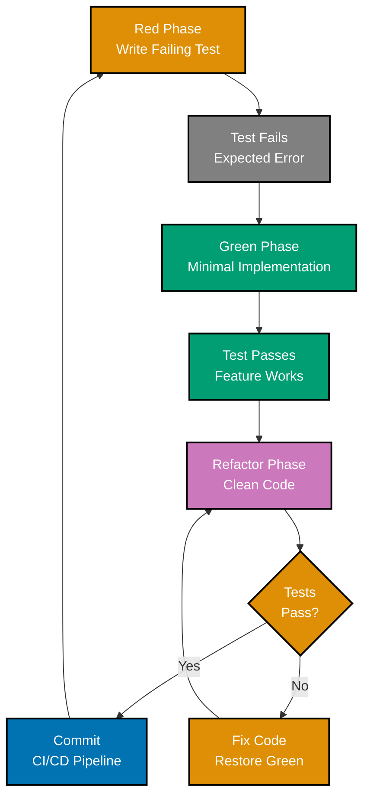
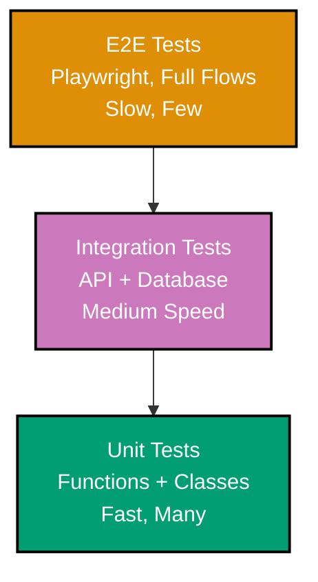
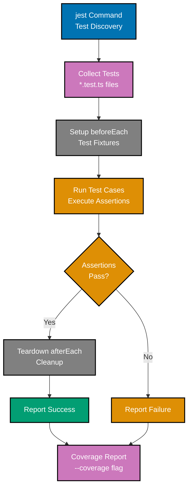
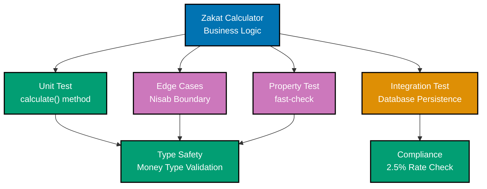

# TypeScript Test-Driven Development

**Quick Reference**: [Overview](#overview) | [Jest](#jest-30x) | [Vitest](#vitest-4x) | [Unit Testing](#unit-testing-patterns) | [Integration Testing](#integration-testing) | [Property-Based Testing](#property-based-testing) | [Mocking](#mocking-strategies) | [Coverage](#test-coverage) | [Related Documentation](#related-documentation)

## Overview

Test-Driven Development (TDD) follows Red-Green-Refactor cycle: write failing test, make it pass, refactor code. TypeScript's type system enhances TDD by catching errors at compile time.

### TDD Principles

- **Red-Green-Refactor**: Fail → Pass → Improve
- **Test First**: Write test before implementation
- **Small Steps**: One test at a time
- **Fast Feedback**: Tests run quickly
- **High Coverage**: Aim for >80% code coverage

### TDD Red-Green-Refactor



### Test Pyramid



### Jest Execution Flow



### Financial Domain Testing



## Jest 30.x

### Setup

```typescript
// jest.config.ts
import type { Config } from "jest";

const config: Config = {
  preset: "ts-jest",
  testEnvironment: "node",
  roots: ["<rootDir>/src"],
  testMatch: ["**/__tests__/**/*.ts", "**/*.test.ts", "**/*.spec.ts"],
  collectCoverageFrom: ["src/**/*.ts", "!src/**/*.d.ts", "!src/**/*.test.ts"],
  coverageThreshold: {
    global: {
      branches: 80,
      functions: 80,
      lines: 80,
      statements: 80,
    },
  },
};

export default config;
```

### Basic Tests

```typescript
// zakat-calculator.test.ts
import { ZakatCalculator } from "./zakat-calculator";

describe("ZakatCalculator", () => {
  let calculator: ZakatCalculator;

  beforeEach(() => {
    calculator = new ZakatCalculator();
  });

  describe("calculate", () => {
    it("calculates 2.5% for wealth above nisab", () => {
      const result = calculator.calculate({
        wealth: 100000,
        nisab: 3000,
      });

      expect(result).toBe(2500);
    });

    it("returns zero for wealth below nisab", () => {
      const result = calculator.calculate({
        wealth: 2000,
        nisab: 3000,
      });

      expect(result).toBe(0);
    });

    it("returns zero for negative wealth", () => {
      const result = calculator.calculate({
        wealth: -1000,
        nisab: 3000,
      });

      expect(result).toBe(0);
    });

    it("handles exact nisab threshold", () => {
      const result = calculator.calculate({
        wealth: 3000,
        nisab: 3000,
      });

      expect(result).toBe(75);
    });
  });
});

// Implementation
export class ZakatCalculator {
  calculate(params: { wealth: number; nisab: number }): number {
    if (params.wealth < params.nisab || params.wealth <= 0) {
      return 0;
    }
    return params.wealth * 0.025;
  }
}
```

### Async Testing

```typescript
import { DonationService } from "./donation-service";

describe("DonationService", () => {
  let service: DonationService;

  beforeEach(() => {
    service = new DonationService();
  });

  it("creates donation successfully", async () => {
    const donation = await service.create({
      donorId: "DNR-1234567890",
      amount: 1000,
      currency: "USD",
      category: "zakat",
    });

    expect(donation).toHaveProperty("donationId");
    expect(donation.amount).toBe(1000);
    expect(donation.status).toBe("pending");
  });

  it("rejects invalid donation", async () => {
    await expect(
      service.create({
        donorId: "INVALID",
        amount: -100,
        currency: "USD",
        category: "zakat",
      }),
    ).rejects.toThrow("Invalid donation data");
  });
});
```

## Vitest 4.x

### Setup

```typescript
// vitest.config.ts
import { defineConfig } from "vitest/config";

export default defineConfig({
  test: {
    globals: true,
    environment: "node",
    coverage: {
      provider: "v8",
      reporter: ["text", "json", "html"],
      exclude: ["**/*.test.ts", "**/*.spec.ts", "**/node_modules/**"],
      thresholds: {
        lines: 80,
        functions: 80,
        branches: 80,
        statements: 80,
      },
    },
  },
});
```

### Basic Tests with Vitest

```typescript
// donation.test.ts
import { describe, it, expect, beforeEach } from "vitest";
import { Donation } from "./donation";

describe("Donation", () => {
  let donation: Donation;

  beforeEach(() => {
    donation = Donation.create({
      donationId: "DON-123",
      donorId: "DNR-456",
      amount: 1000,
      currency: "USD",
      category: "zakat",
    });
  });

  it("creates valid donation", () => {
    expect(donation.donationId).toBe("DON-123");
    expect(donation.amount).toBe(1000);
    expect(donation.status).toBe("pending");
  });

  it("processes donation", () => {
    donation.process();
    expect(donation.status).toBe("completed");
    expect(donation.processedAt).toBeInstanceOf(Date);
  });

  it("prevents double processing", () => {
    donation.process();
    expect(() => donation.process()).toThrow("Donation already processed");
  });
});
```

## Unit Testing Patterns

### Testing Value Objects

```typescript
import { Money } from "./money";

describe("Money", () => {
  describe("create", () => {
    it("creates valid money", () => {
      const result = Money.create(1000, "USD");

      expect(result.ok).toBe(true);
      if (result.ok) {
        expect(result.value.amount).toBe(1000);
        expect(result.value.currency).toBe("USD");
      }
    });

    it("rejects negative amount", () => {
      const result = Money.create(-100, "USD");

      expect(result.ok).toBe(false);
      if (!result.ok) {
        expect(result.error.message).toContain("negative");
      }
    });

    it("rejects invalid currency", () => {
      const result = Money.create(1000, "XYZ");

      expect(result.ok).toBe(false);
      if (!result.ok) {
        expect(result.error.message).toContain("Invalid currency");
      }
    });
  });

  describe("add", () => {
    it("adds money with same currency", () => {
      const a = Money.create(100, "USD").value;
      const b = Money.create(200, "USD").value;

      const result = a.add(b);

      expect(result.ok).toBe(true);
      if (result.ok) {
        expect(result.value.amount).toBe(300);
      }
    });

    it("rejects different currencies", () => {
      const a = Money.create(100, "USD").value;
      const b = Money.create(200, "EUR").value;

      const result = a.add(b);

      expect(result.ok).toBe(false);
    });
  });

  describe("equals", () => {
    it("compares money correctly", () => {
      const a = Money.create(100, "USD").value;
      const b = Money.create(100, "USD").value;
      const c = Money.create(200, "USD").value;

      expect(a.equals(b)).toBe(true);
      expect(a.equals(c)).toBe(false);
    });
  });
});
```

### Testing Entities

```typescript
import { Donor } from "./donor";

describe("Donor", () => {
  it("creates donor with valid data", () => {
    const result = Donor.create({
      donorId: "DNR-1234567890",
      name: "Ahmad Ibrahim",
      email: EmailAddress.create("ahmad@example.com").value,
    });

    expect(result.ok).toBe(true);
  });

  it("records donation", () => {
    const donor = Donor.create(validData).value;
    const donation = Money.create(1000, "USD").value;

    const result = donor.recordDonation(donation);

    expect(result.ok).toBe(true);
    expect(donor.totalDonated.amount).toBe(1000);
  });

  it("accumulates multiple donations", () => {
    const donor = Donor.create(validData).value;

    donor.recordDonation(Money.create(1000, "USD").value);
    donor.recordDonation(Money.create(500, "USD").value);

    expect(donor.totalDonated.amount).toBe(1500);
  });
});
```

## Integration Testing

### Database Integration

```typescript
import { PrismaClient } from "@prisma/client";
import { DonationRepository } from "./donation-repository";

describe("DonationRepository Integration", () => {
  let prisma: PrismaClient;
  let repository: DonationRepository;

  beforeAll(async () => {
    prisma = new PrismaClient();
    repository = new DonationRepository(prisma);
  });

  afterAll(async () => {
    await prisma.$disconnect();
  });

  beforeEach(async () => {
    await prisma.donation.deleteMany({});
  });

  it("saves and retrieves donation", async () => {
    const donation = createTestDonation();

    await repository.save(donation);
    const retrieved = await repository.findById(donation.id);

    expect(retrieved).toBeDefined();
    expect(retrieved!.id).toBe(donation.id);
    expect(retrieved!.amount).toBe(donation.amount);
  });

  it("finds donations by donor", async () => {
    const donorId = "DNR-1234567890";

    await repository.save(createTestDonation({ donorId }));
    await repository.save(createTestDonation({ donorId }));

    const donations = await repository.findByDonor(donorId);

    expect(donations).toHaveLength(2);
  });
});
```

### API Integration Testing

```typescript
import request from "supertest";
import { app } from "./app";

describe("Donation API", () => {
  describe("POST /api/donations", () => {
    it("creates donation with valid data", async () => {
      const response = await request(app)
        .post("/api/donations")
        .send({
          donorId: "DNR-1234567890",
          amount: 1000,
          currency: "USD",
          category: "zakat",
        })
        .expect(201);

      expect(response.body).toHaveProperty("donationId");
      expect(response.body.amount).toBe(1000);
    });

    it("rejects invalid data", async () => {
      await request(app)
        .post("/api/donations")
        .send({
          donorId: "INVALID",
          amount: -100,
          currency: "USD",
          category: "zakat",
        })
        .expect(400);
    });

    it("requires authentication", async () => {
      await request(app)
        .post("/api/donations")
        .send({
          donorId: "DNR-1234567890",
          amount: 1000,
          currency: "USD",
          category: "zakat",
        })
        .expect(401);
    });
  });

  describe("GET /api/donations/:id", () => {
    it("returns existing donation", async () => {
      const created = await createTestDonation();

      const response = await request(app).get(`/api/donations/${created.id}`).expect(200);

      expect(response.body.donationId).toBe(created.id);
    });

    it("returns 404 for non-existent donation", async () => {
      await request(app).get("/api/donations/DON-999").expect(404);
    });
  });
});
```

## Property-Based Testing

### With fast-check

```typescript
import * as fc from "fast-check";
import { Money } from "./money";

describe("Money properties", () => {
  it("adding zero returns same value", () => {
    fc.assert(
      fc.property(fc.integer({ min: 1, max: 1000000 }), fc.constantFrom("USD", "EUR", "SAR"), (amount, currency) => {
        const money = Money.create(amount, currency).value;
        const zero = Money.create(0, currency).value;
        const result = money.add(zero).value;

        expect(result.equals(money)).toBe(true);
      }),
    );
  });

  it("addition is commutative", () => {
    fc.assert(
      fc.property(
        fc.integer({ min: 1, max: 100000 }),
        fc.integer({ min: 1, max: 100000 }),
        fc.constantFrom("USD", "EUR", "SAR"),
        (a, b, currency) => {
          const moneyA = Money.create(a, currency).value;
          const moneyB = Money.create(b, currency).value;

          const ab = moneyA.add(moneyB).value;
          const ba = moneyB.add(moneyA).value;

          expect(ab.equals(ba)).toBe(true);
        },
      ),
    );
  });

  it("multiplication is distributive", () => {
    fc.assert(
      fc.property(
        fc.integer({ min: 1, max: 10000 }),
        fc.integer({ min: 1, max: 10000 }),
        fc.integer({ min: 2, max: 10 }),
        fc.constantFrom("USD", "EUR", "SAR"),
        (a, b, factor, currency) => {
          const moneyA = Money.create(a, currency).value;
          const moneyB = Money.create(b, currency).value;

          const sum = moneyA.add(moneyB).value;
          const multipliedSum = sum.multiply(factor).value;

          const multipliedA = moneyA.multiply(factor).value;
          const multipliedB = moneyB.multiply(factor).value;
          const sumOfMultiplied = multipliedA.add(multipliedB).value;

          expect(Math.abs(multipliedSum.amount - sumOfMultiplied.amount)).toBeLessThan(0.01);
        },
      ),
    );
  });
});
```

## Mocking Strategies

### Mock External Services

```typescript
import { DonationService } from "./donation-service";
import { EmailService } from "./email-service";

describe("DonationService with mocks", () => {
  it("sends email after creating donation", async () => {
    const mockEmailService = {
      send: jest.fn().mockResolvedValue(true),
    } as unknown as EmailService;

    const service = new DonationService(mockEmailService);

    await service.create({
      donorId: "DNR-1234567890",
      amount: 1000,
      currency: "USD",
      category: "zakat",
    });

    expect(mockEmailService.send).toHaveBeenCalledWith(
      expect.objectContaining({
        to: expect.any(String),
        subject: "Donation Confirmation",
      }),
    );
  });
});
```

### Spy on Methods

```typescript
import { DonationAnalytics } from "./analytics";

describe("DonationAnalytics", () => {
  it("tracks donation creation", () => {
    const analytics = new DonationAnalytics();
    const trackSpy = jest.spyOn(analytics, "track");

    analytics.recordDonation({
      donationId: "DON-123",
      amount: 1000,
      category: "zakat",
    });

    expect(trackSpy).toHaveBeenCalledWith("donation_created", {
      donationId: "DON-123",
      amount: 1000,
      category: "zakat",
    });
  });
});
```

## Test Coverage

### Running Coverage

```bash
# Jest
npm test -- --coverage

# Vitest
npx vitest --coverage
```

### Coverage Configuration

```typescript
// vitest.config.ts
export default defineConfig({
  test: {
    coverage: {
      provider: "v8",
      reporter: ["text", "json", "html", "lcov"],
      exclude: ["**/*.test.ts", "**/*.spec.ts", "**/node_modules/**", "**/dist/**", "**/*.config.ts"],
      thresholds: {
        lines: 80,
        functions: 80,
        branches: 80,
        statements: 80,
      },
      all: true,
    },
  },
});
```

## TDD Checklist

### Red Phase (Write Failing Test)

- [ ] Test written before implementation
- [ ] Test fails for the right reason (expected error message)
- [ ] Test is focused and tests one behavior
- [ ] Test has clear, descriptive name (describe/it blocks)
- [ ] Assertions use appropriate matchers (toBe, toEqual, toThrow)

### Green Phase (Make Test Pass)

- [ ] Simplest implementation that makes test pass
- [ ] No premature optimization
- [ ] All tests still passing (npm test)
- [ ] Code follows TypeScript idioms (type safety, readonly)
- [ ] Type definitions complete and accurate

### Refactor Phase

- [ ] Code is clean and maintainable
- [ ] No duplication (DRY principle)
- [ ] All tests still passing after refactoring
- [ ] Test coverage maintained or improved (--coverage)
- [ ] JSDoc comments added for public APIs

### Test Quality

- [ ] Tests are independent (no shared mutable state)
- [ ] Tests are repeatable (deterministic, no randomness)
- [ ] Tests are fast (< 100ms for unit tests)
- [ ] Test setup/teardown properly managed (beforeEach/afterEach)
- [ ] Mock/stub dependencies using jest.fn() or vitest mocks

### Jest/Vitest Best Practices

- [ ] describe blocks group related tests logically
- [ ] beforeEach used for test setup
- [ ] Async tests use async/await (not callbacks)
- [ ] Proper matchers for async code (resolves, rejects)
- [ ] Snapshot tests only for appropriate use cases

### Financial Domain Testing

- [ ] Zakat calculations tested with edge cases (nisab threshold, exact boundary)
- [ ] Decimal precision tested (no floating point errors, use Money type)
- [ ] Murabaha contract validation tested (profit margins, down payments)
- [ ] Audit trail creation verified in tests
- [ ] Currency handling tested (Money.create with currency validation)

## Related Documentation

- **[TypeScript Best Practices](./ex-so-prla-ts__best-practices.md)** - Coding standards
- **[TypeScript BDD](./ex-so-prla-ts__behaviour-driven-development.md)** - BDD patterns

---

**Last Updated**: 2025-01-23
**TypeScript Version**: 5.0+ (baseline), 5.4+ (milestone), 5.6+ (stable), 5.9.3+ (latest stable)
**Testing Frameworks**: Jest 30.2.0, Vitest 4.0.18, fast-check 3.x
**Maintainers**: OSE Documentation Team
