# TypeScript Idioms

## Quick Reference

### Core Idioms by Category

**Type Narrowing**:

- [typeof Guards](#typeof-type-guard) - Primitive type checking
- [instanceof Guards](#instanceof-type-guard) - Class instance checks
- [in Guards](#in-type-guard) - Property existence
- [Custom Guards](#custom-type-guards) - Complex validation
- [Type Predicates](#type-predicates) - User-defined narrowing

**Type Transformation**:

- [Utility Types](#utility-types) - Built-in transformations
- [Conditional Types](#conditional-types) - Type-level logic
- [Mapped Types](#mapped-types) - Property transformations
- [Template Literals](#template-literal-types) - String manipulation

**Type Safety**:

- [Discriminated Unions](#discriminated-unions) - Tagged unions
- [Branded Types](#branded-types) - Nominal typing
- [Const Assertions](#const-assertions) - Literal types
- [Index Signatures](#index-signatures) - Dynamic properties

**Pattern Matching**:

- [Exhaustive Checks](#basic-discriminated-unions) - Complete case coverage
- [Nested Unions](#nested-discriminated-unions) - Complex state

### Essential Utility Types

**Property Transformation**:

- `Partial<T>` - Make all optional
- `Required<T>` - Make all required
- `Readonly<T>` - Make all readonly
- `Pick<T, K>` - Select properties
- `Omit<T, K>` - Exclude properties

**Type Manipulation**:

- `Record<K, T>` - Key-value mapping
- `Exclude<T, U>` - Remove from union
- `Extract<T, U>` - Select from union
- `NonNullable<T>` - Remove null/undefined
- `ReturnType<T>` - Extract return type
- `Parameters<T>` - Extract parameters

### Advanced Patterns

**Branded Types**:

```typescript
type Brand<T, B> = T & { __brand: B };
type UserId = Brand<string, "UserId">;
```

**Discriminated Unions**:

```typescript
type Result = { status: "success"; data: T } | { status: "error"; error: string };
```

**Const Assertions**:

```typescript
const RATES = { CASH: 0.025 } as const;
type Rate = (typeof RATES)[keyof typeof RATES];
```

### TypeScript Version Context

- 🟢 **TypeScript 5.0+** (baseline): Decorators, const parameters
- 🔵 **TypeScript 5.4+** (milestone): NoInfer, closure narrowing
- 🟡 **TypeScript 5.6+** (stable): Iterator helpers
- 🔴 **TypeScript 5.9+** (latest): Path rewriting

### Idiomatic TypeScript Checklist

- [ ] Use type guards for runtime narrowing
- [ ] Leverage utility types over manual definitions
- [ ] Create discriminated unions for state modeling
- [ ] Brand primitive types to prevent confusion
- [ ] Use const assertions for literal types
- [ ] Prefer type predicates for complex checks
- [ ] Model impossible states as unrepresentable

### Related Documentation

- [Best Practices](ex-so-prla-ty__best-practices.md)
- [Type Safety](ex-so-prla-ty__type-safety.md)
- [Interfaces and Types](ex-so-prla-ty__interfaces-and-types.md)
- [Anti-Patterns](ex-so-prla-ty__anti-patterns.md)

## Overview

Idiomatic TypeScript code leverages the language's type system to maximum effect while remaining readable and maintainable. This document covers TypeScript-specific patterns that distinguish proficient TypeScript from "JavaScript with types".

### What Makes Code Idiomatic?

Idiomatic TypeScript code:

1. **Uses the type system fully** - Leverages advanced types, not just basic annotations
2. **Fails at compile time** - Catches errors during development, not at runtime
3. **Self-documents** - Types serve as inline documentation
4. **Enables tooling** - IDE autocomplete and refactoring work perfectly
5. **Prevents bugs** - Makes invalid states unrepresentable

### Common TypeScript Patterns Catalog


### TypeScript Version Context

This document assumes TypeScript 5.0+ as the baseline. Version-specific features are marked:

- 🟢 **TypeScript 5.0+** (baseline): Decorators, const type parameters
- 🔵 **TypeScript 5.4+** (milestone): NoInfer utility type, closure narrowing
- 🟡 **TypeScript 5.6+** (stable): Iterator helpers, strict checks
- 🔴 **TypeScript 5.9+** (latest): Path rewriting, relative type checks

## Type Guards and Narrowing

Type guards allow TypeScript to narrow types at runtime, providing type safety for dynamic data.

### Type Guard Selection Flow

```mermaid
%% Color Palette: Blue #0173B2, Orange #DE8F05, Teal #029E73, Purple #CC78BC
%% All colors are color-blind friendly and meet WCAG AA contrast standards

graph TD
    A["Need Runtime<br/>Type Check?"]:::blue --> B{"Type of<br/>Value?"}:::orange

    B -->|"Primitive"| C["✅ Use typeof<br/>(string, number, boolean)"]:::teal
    B -->|"Class Instance"| D["✅ Use instanceof<br/>(Money, Date, Error)"]:::teal
    B -->|"Object Shape"| E{"Has Discriminant<br/>Property?"}:::orange

    E -->|"Yes"| F["✅ Check Discriminant<br/>(obj.kind === 'success')"]:::purple
    E -->|"No"| G["✅ Use 'in' operator<br/>('amount' in obj)"]:::purple

    C --> H["Type Narrowing"]:::teal
    D --> H
    F --> H
    G --> H

    H --> H1["TypeScript narrows type"]
    H --> H2["Autocomplete works"]
    H --> H3["Type-safe operations"]

    Note["Custom Guards:<br/>Function returning<br/>'value is Type'"]

    classDef blue fill:#0173B2,stroke:#000,color:#fff
    classDef orange fill:#DE8F05,stroke:#000,color:#000
    classDef teal fill:#029E73,stroke:#000,color:#fff
    classDef purple fill:#CC78BC,stroke:#000,color:#000
```



**Key Principles**:

- **typeof**: Primitives (string, number, boolean, symbol, undefined)
- **instanceof**: Class instances (Money, Error, custom classes)
- **Discriminated unions**: Tagged objects (`{ kind: 'success', value: T }`)
- **in operator**: Property existence checks

### typeof Type Guard

Use `typeof` for primitive type checking.

```typescript
function processValue(value: string | number): string {
  if (typeof value === "string") {
    return value.toUpperCase(); // TypeScript knows value is string
  }
  return value.toFixed(2); // TypeScript knows value is number
}

// Financial example: Amount validation
function formatAmount(amount: string | number): string {
  if (typeof amount === "number") {
    return `$${amount.toFixed(2)}`;
  }
  // Parse string to number
  const parsed = parseFloat(amount);
  if (isNaN(parsed)) {
    throw new Error("Invalid amount");
  }
  return `$${parsed.toFixed(2)}`;
}
```

### instanceof Type Guard

Use `instanceof` for class instance checks.

```typescript
class Money {
  constructor(
    public readonly amount: number,
    public readonly currency: string,
  ) {}
}

class ZakatCalculation {
  constructor(
    public readonly wealth: Money,
    public readonly zakatAmount: Money,
  ) {}
}

function formatFinancialItem(item: Money | ZakatCalculation): string {
  if (item instanceof Money) {
    return `${item.currency} ${item.amount}`;
  }
  // TypeScript knows item is ZakatCalculation
  return `Zakat: ${item.zakatAmount.currency} ${item.zakatAmount.amount}`;
}
```

### in Type Guard

Use `in` operator to check for property existence.

```typescript
interface Donation {
  donorId: string;
  amount: number;
}

interface RecurringDonation extends Donation {
  frequency: "monthly" | "quarterly" | "yearly";
  startDate: Date;
}

function processDonation(donation: Donation | RecurringDonation): void {
  console.log(`Processing donation from ${donation.donorId}`);

  if ("frequency" in donation) {
    // TypeScript knows donation is RecurringDonation
    console.log(`Recurring: ${donation.frequency}`);
    console.log(`Start date: ${donation.startDate}`);
  }
}
```

### Custom Type Guards

Create custom type predicates for complex checks.

```typescript
interface Money {
  readonly amount: number;
  readonly currency: string;
}

// Custom type guard
function isMoney(value: unknown): value is Money {
  return (
    typeof value === "object" &&
    value !== null &&
    "amount" in value &&
    typeof value.amount === "number" &&
    "currency" in value &&
    typeof value.currency === "string"
  );
}

// Usage
function processPayment(payment: unknown): void {
  if (!isMoney(payment)) {
    throw new Error("Invalid payment object");
  }

  // TypeScript knows payment is Money
  console.log(`Amount: ${payment.currency} ${payment.amount}`);
}
```

### Truthiness Narrowing

TypeScript narrows based on truthiness checks.

```typescript
function getUpperCase(value: string | null | undefined): string {
  if (value) {
    // TypeScript knows value is string (truthy)
    return value.toUpperCase();
  }
  return "";
}

// Financial example
function formatZakatAmount(amount?: Money): string {
  if (!amount) {
    return "N/A";
  }
  // TypeScript knows amount is defined
  return `${amount.currency} ${amount.amount.toFixed(2)}`;
}
```

### Equality Narrowing

TypeScript narrows on equality checks.

```typescript
type PaymentStatus = "pending" | "completed" | "failed";

interface Payment {
  status: PaymentStatus;
  amount: Money;
}

function processPayment(payment: Payment): void {
  if (payment.status === "completed") {
    // TypeScript narrows status to "completed"
    console.log("Payment completed");
  } else if (payment.status === "failed") {
    // TypeScript narrows status to "failed"
    console.log("Payment failed");
  } else {
    // TypeScript narrows status to "pending"
    console.log("Payment pending");
  }
}
```

## Utility Types

TypeScript provides built-in utility types for common transformations.

### Utility Type Selection Guide

```mermaid
%% Color Palette: Blue #0173B2, Orange #DE8F05, Teal #029E73, Purple #CC78BC
%% All colors are color-blind friendly and meet WCAG AA contrast standards

graph TD
    A["Transform<br/>Type?"]:::blue --> B{"What<br/>Change?"}:::orange

    B -->|"Make optional"| C["✅ Partial<T><br/>(all props optional)"]:::teal
    B -->|"Make required"| D["✅ Required<T><br/>(remove optional)"]:::teal
    B -->|"Make readonly"| E["✅ Readonly<T><br/>(immutable)"]:::teal
    B -->|"Extract properties"| F["✅ Pick<T, K><br/>(select fields)"]:::purple
    B -->|"Remove properties"| G["✅ Omit<T, K><br/>(exclude fields)"]:::purple
    B -->|"Extract type"| H["✅ Extract<T, U><br/>(filter union)"]:::purple

    C --> I["Common Uses"]:::teal
    D --> I
    E --> I
    F --> I
    G --> I
    H --> I

    I --> I1["• API updates (Partial)"]
    I --> I2["• Immutability (Readonly)"]
    I --> I3["• Subset types (Pick/Omit)"]
    I --> I4["• Union filtering (Extract)"]

    Note["Combine utilities:<br/>Partial<Pick<T, K>>"]

    classDef blue fill:#0173B2,stroke:#000,color:#fff
    classDef orange fill:#DE8F05,stroke:#000,color:#000
    classDef teal fill:#029E73,stroke:#000,color:#fff
    classDef purple fill:#CC78BC,stroke:#000,color:#000
```



**Common Utility Types**:

- **Partial<T>**: All properties optional (updates, patches)
- **Required<T>**: All properties required (validation)
- **Readonly<T>**: All properties readonly (immutability)
- **Pick<T, K>**: Select specific properties (projection)
- **Omit<T, K>**: Exclude properties (filtering)
- **Extract<T, U>**: Extract from union (type narrowing)

### Partial<T>

Makes all properties optional.

```typescript
interface ZakatRecord {
  recordId: string;
  calculatedAt: Date;
  wealth: Money;
  zakatAmount: Money;
  paid: boolean;
}

// Create partial record for updates
function updateZakatRecord(id: string, updates: Partial<ZakatRecord>): ZakatRecord {
  const existing = getZakatRecord(id);
  return { ...existing, ...updates };
}

// Usage
updateZakatRecord("Z123", {
  paid: true, // Only update paid status
});
```

### Required<T>

Makes all properties required.

```typescript
interface DonationInput {
  donorId?: string;
  amount?: number;
  message?: string;
}

// Ensure all fields are provided
function createDonation(donation: Required<DonationInput>): void {
  // All properties are guaranteed to exist
  console.log(`Donor: ${donation.donorId}`);
  console.log(`Amount: ${donation.amount}`);
  console.log(`Message: ${donation.message}`);
}
```

### Readonly<T>

Makes all properties readonly.

```typescript
interface MurabahaContract {
  contractId: string;
  costPrice: Money;
  profitMargin: Money;
  totalPrice: Money;
}

// Immutable contract
function createImmutableContract(contract: MurabahaContract): Readonly<MurabahaContract> {
  return Object.freeze(contract);
}

const contract = createImmutableContract({
  contractId: "MC-001",
  costPrice: { amount: 100000, currency: "USD" },
  profitMargin: { amount: 15000, currency: "USD" },
  totalPrice: { amount: 115000, currency: "USD" },
});

// contract.costPrice = ...; // Error: Cannot assign to 'costPrice'
```

### Pick<T, K>

Creates a type by picking specific properties from T.

```typescript
interface Donation {
  donationId: string;
  donorId: string;
  amount: Money;
  category: string;
  message: string;
  createdAt: Date;
  updatedAt: Date;
}

// Create type with only public fields
type PublicDonation = Pick<Donation, "donationId" | "amount" | "category" | "message">;

function getPublicDonation(donation: Donation): PublicDonation {
  return {
    donationId: donation.donationId,
    amount: donation.amount,
    category: donation.category,
    message: donation.message,
  };
}
```

### Omit<T, K>

Creates a type by omitting specific properties from T.

```typescript
interface User {
  userId: string;
  email: string;
  passwordHash: string;
  role: string;
  createdAt: Date;
}

// Create type without sensitive fields
type SafeUser = Omit<User, "passwordHash">;

function getSafeUser(user: User): SafeUser {
  const { passwordHash, ...safe } = user;
  return safe;
}
```

### Record<K, T>

Creates an object type with keys of type K and values of type T.

```typescript
// Zakat rates by category
type ZakatCategory = "cash" | "gold" | "silver" | "agriculture";
type ZakatRates = Record<ZakatCategory, number>;

const zakatRates: ZakatRates = {
  cash: 0.025,
  gold: 0.025,
  silver: 0.025,
  agriculture: 0.1,
};

function getZakatRate(category: ZakatCategory): number {
  return zakatRates[category];
}
```

### Exclude<T, U>

Excludes types from a union.

```typescript
type PaymentMethod = "cash" | "card" | "bank_transfer" | "crypto";

// Remove crypto from allowed methods
type TraditionalPayment = Exclude<PaymentMethod, "crypto">;

function processTraditionalPayment(method: TraditionalPayment): void {
  // method can be "cash" | "card" | "bank_transfer"
  console.log(`Processing ${method} payment`);
}
```

### Extract<T, U>

Extracts types from a union.

```typescript
type DonationCategory = "zakat" | "sadaqah" | "waqf" | "general";
type ReligiousCategory = Extract<DonationCategory, "zakat" | "sadaqah" | "waqf">;

function processReligiousDonation(category: ReligiousCategory): void {
  // category can only be "zakat" | "sadaqah" | "waqf"
  console.log(`Processing ${category} donation`);
}
```

### NonNullable<T>

Removes null and undefined from a type.

```typescript
type MaybeString = string | null | undefined;
type DefiniteString = NonNullable<MaybeString>; // string

function processDefiniteValue(value: NonNullable<string | null>): void {
  // value is guaranteed to be string
  console.log(value.toUpperCase());
}
```

### ReturnType<T>

Extracts the return type of a function.

```typescript
function calculateZakat(wealth: Money): Money {
  return {
    amount: wealth.amount * 0.025,
    currency: wealth.currency,
  };
}

type ZakatResult = ReturnType<typeof calculateZakat>; // Money

function formatZakatResult(result: ZakatResult): string {
  return `${result.currency} ${result.amount.toFixed(2)}`;
}
```

### Parameters<T>

Extracts function parameter types as a tuple.

```typescript
function createDonation(donorId: string, amount: Money, category: string): Donation {
  // Implementation
  return {} as Donation;
}

type DonationParams = Parameters<typeof createDonation>;
// [string, Money, string]

function logDonationParams(params: DonationParams): void {
  const [donorId, amount, category] = params;
  console.log(`Donor: ${donorId}, Amount: ${amount.amount}, Category: ${category}`);
}
```

## Conditional Types

Conditional types enable type-level logic based on conditions.

### Basic Conditional Types

```typescript
// If T extends U, return X, otherwise Y
type IsString<T> = T extends string ? "yes" : "no";

type A = IsString<string>; // "yes"
type B = IsString<number>; // "no"

// Financial example: Extract currency type
type ExtractCurrency<T> = T extends { currency: infer C } ? C : never;

interface Money {
  amount: number;
  currency: string;
}

type Currency = ExtractCurrency<Money>; // string
```

### Distributive Conditional Types

Conditional types distribute over unions.

```typescript
type ToArray<T> = T extends any ? T[] : never;

type StringOrNumberArray = ToArray<string | number>;
// string[] | number[]

// Financial example: Payment method arrays
type PaymentMethod = "cash" | "card" | "bank_transfer";
type PaymentMethodArrays = ToArray<PaymentMethod>;
// "cash"[] | "card"[] | "bank_transfer"[]
```

### Builder Pattern Flow


### infer Keyword

Use `infer` to extract types from conditional types.

```typescript
// Extract return type
type GetReturnType<T> = T extends (...args: any[]) => infer R ? R : never;

function getZakat(wealth: Money): Money {
  return { amount: wealth.amount * 0.025, currency: wealth.currency };
}

type ZakatReturnType = GetReturnType<typeof getZakat>; // Money

// Extract array element type
type UnwrapArray<T> = T extends (infer U)[] ? U : T;

type DonationArray = Donation[];
type SingleDonation = UnwrapArray<DonationArray>; // Donation
```

### Conditional Type Constraints

Combine conditionals with constraints.

```typescript
// Only extract if T has a 'currency' property
type ExtractCurrency<T> = T extends { currency: infer C } ? (C extends string ? C : never) : never;

interface Money {
  amount: number;
  currency: string;
}

interface InvalidMoney {
  amount: number;
  currency: number; // Not a string
}

type ValidCurrency = ExtractCurrency<Money>; // string
type InvalidCurrency = ExtractCurrency<InvalidMoney>; // never
```

## Template Literal Types

Template literal types enable string manipulation at the type level.

### Basic Template Literals

```typescript
type EventName = "click" | "focus" | "blur";
type EventHandler = `on${Capitalize<EventName>}`;
// "onClick" | "onFocus" | "onBlur"

// Financial example: Transaction event types
type TransactionType = "donation" | "zakat" | "murabaha";
type TransactionEvent = `${TransactionType}Created` | `${TransactionType}Updated`;
// "donationCreated" | "zakatCreated" | "murabahaCreated" | "donationUpdated" | ...
```

### String Manipulation Types

```typescript
// Built-in utility types for string manipulation
type UppercaseEvent = Uppercase<"donation">; // "DONATION"
type LowercaseEvent = Lowercase<"DONATION">; // "donation"
type CapitalizedEvent = Capitalize<"donation">; // "Donation"
type UncapitalizedEvent = Uncapitalize<"Donation">; // "donation"

// Financial example: Currency codes
type Currency = "usd" | "eur" | "gbp";
type UppercaseCurrency = Uppercase<Currency>;
// "USD" | "EUR" | "GBP"

function formatCurrency(amount: number, currency: UppercaseCurrency): string {
  return `${currency} ${amount.toFixed(2)}`;
}
```

### Pattern Matching with Template Literals

```typescript
// Extract parts of a pattern
type ExtractId<T> = T extends `${string}-${infer ID}` ? ID : never;

type DonationId = "DON-12345";
type Id = ExtractId<DonationId>; // "12345"

// Financial example: Extract transaction type from ID
type TransactionId = "DON-001" | "ZAK-002" | "MUR-003";
type TransactionType<T> = T extends `${infer Type}-${string}` ? Type : never;

type DonationType = TransactionType<"DON-001">; // "DON"
type ZakatType = TransactionType<"ZAK-002">; // "ZAK"
```

## Mapped Types

Mapped types transform all properties of an object type.

### Mapped Type Selection Guide

```mermaid
%% Color Palette: Blue #0173B2, Orange #DE8F05, Teal #029E73, Purple #CC78BC
%% All colors are color-blind friendly and meet WCAG AA contrast standards

graph TD
    A["Need to Transform<br/>Object Type?"]:::blue --> B{"What<br/>Transformation?"}:::orange

    B -->|"Property Modifiers"| C{"Add or Remove<br/>Modifiers?"}:::orange
    B -->|"Key Changes"| D{"Rename or<br/>Filter Keys?"}:::orange

    C -->|"Make Optional"| E["✅ Partial<T><br/>or [P in keyof T]?"]:::teal
    C -->|"Make Required"| F["✅ Required<T><br/>or [P in keyof T]-?"]:::teal
    C -->|"Make Readonly"| G["✅ Readonly<T><br/>or readonly [P in keyof T]"]:::teal
    C -->|"Remove Readonly"| H["✅ -readonly [P in keyof T]"]:::purple

    D -->|"Rename Keys"| I["✅ Key Remapping<br/>[P as NewKey]"]:::purple
    D -->|"Filter Keys"| J["✅ Conditional Mapping<br/>[P as Condition ? P : never]"]:::purple

    E --> K["Transformed Type"]:::teal
    F --> K
    G --> K
    H --> K
    I --> K
    J --> K

    K --> K1["All properties affected"]
    K --> K2["Type-safe transformation"]
    K --> K3["Compiler enforced"]

    Note["Built-in Utilities:<br/>Partial, Required,<br/>Readonly, Pick, Omit<br/>cover common cases"]

    classDef blue fill:#0173B2,stroke:#000,color:#fff
    classDef orange fill:#DE8F05,stroke:#000,color:#000
    classDef teal fill:#029E73,stroke:#000,color:#fff
    classDef purple fill:#CC78BC,stroke:#000,color:#000
```



**Key Principles**:

- **Built-in utilities first**: Use `Partial<T>`, `Required<T>`, `Readonly<T>` for common cases
- **Mapping modifiers**: Use `+` and `-` to explicitly add/remove `?` and `readonly`
- **Key remapping**: Use `as` clause to rename or transform keys (TypeScript 4.1+)
- **Conditional mapping**: Filter properties by type or other conditions

**Common Patterns**:

```typescript
// Islamic Finance Example: Contract transformation
interface MurbahaContract {
  readonly contractId: string;
  amount?: Money;
  installments?: number;
}

// Make all required and mutable for internal processing
type MutableContract = {
  -readonly [P in keyof MurbahaContract]-?: MurbahaContract[P];
};
// Result: { contractId: string; amount: Money; installments: number; }

// Add getter prefix to all keys
type ContractGetters = {
  [P in keyof MurbahaContract as `get${Capitalize<string & P>}`]: () => MurbahaContract[P];
};
// Result: { getContractId: () => string; getAmount: () => Money | undefined; ... }

// Filter only Money properties
type MoneyProperties = {
  [P in keyof MurbahaContract as MurbahaContract[P] extends Money ? P : never]: MurbahaContract[P];
};
// Result: { amount?: Money; }
```

### Basic Mapped Types

```typescript
// Make all properties optional
type Optional<T> = {
  [P in keyof T]?: T[P];
};

// Make all properties readonly
type Immutable<T> = {
  readonly [P in keyof T]: T[P];
};

// Financial example: Mutable and immutable contract
interface Contract {
  contractId: string;
  amount: Money;
  status: string;
}

type ImmutableContract = Immutable<Contract>;
type PartialContract = Optional<Contract>;
```

### Mapping Modifiers

Use `+` and `-` to add or remove modifiers.

```typescript
// Remove readonly
type Mutable<T> = {
  -readonly [P in keyof T]: T[P];
};

// Remove optional
type Required<T> = {
  [P in keyof T]-?: T[P];
};

// Financial example
interface PartialDonation {
  readonly donationId?: string;
  readonly amount?: Money;
}

type MutableDonation = Mutable<PartialDonation>;
// { donationId?: string; amount?: Money; }

type CompleteDonation = Required<PartialDonation>;
// { readonly donationId: string; readonly amount: Money; }
```

### Key Remapping

Remap keys during mapping (TypeScript 4.1+).

```typescript
// Prefix all keys with "get"
type Getters<T> = {
  [P in keyof T as `get${Capitalize<string & P>}`]: () => T[P];
};

interface Donation {
  donorId: string;
  amount: number;
}

type DonationGetters = Getters<Donation>;
// {
//   getDonorId: () => string;
//   getAmount: () => number;
// }
```

### Filtering Properties

Filter properties based on their type.

```typescript
// Extract only string properties
type StringProperties<T> = {
  [P in keyof T as T[P] extends string ? P : never]: T[P];
};

interface Donation {
  donationId: string;
  donorId: string;
  amount: number;
  category: string;
  createdAt: Date;
}

type DonationStrings = StringProperties<Donation>;
// {
//   donationId: string;
//   donorId: string;
//   category: string;
// }
```

## Type Predicates

Type predicates are custom type guards that provide type narrowing.

### Basic Type Predicates

```typescript
interface Money {
  amount: number;
  currency: string;
}

function isMoney(value: unknown): value is Money {
  return (
    typeof value === "object" &&
    value !== null &&
    "amount" in value &&
    typeof value.amount === "number" &&
    "currency" in value &&
    typeof value.currency === "string"
  );
}

// Usage
function processMoney(value: unknown): void {
  if (isMoney(value)) {
    // TypeScript knows value is Money
    console.log(`${value.currency} ${value.amount}`);
  }
}
```

### Discriminated Union Predicates

```typescript
interface SuccessResult {
  success: true;
  data: Money;
}

interface ErrorResult {
  success: false;
  error: string;
}

type Result = SuccessResult | ErrorResult;

function isSuccess(result: Result): result is SuccessResult {
  return result.success === true;
}

function isError(result: Result): result is ErrorResult {
  return result.success === false;
}

// Usage
function handleResult(result: Result): void {
  if (isSuccess(result)) {
    console.log("Success:", result.data);
  } else {
    console.log("Error:", result.error);
  }
}
```

### Array Element Predicates

```typescript
interface Donation {
  donationId: string;
  amount: Money;
}

function isDonation(value: unknown): value is Donation {
  return (
    typeof value === "object" &&
    value !== null &&
    "donationId" in value &&
    typeof value.donationId === "string" &&
    "amount" in value &&
    isMoney(value.amount)
  );
}

// Filter array with type predicate
function filterDonations(values: unknown[]): Donation[] {
  return values.filter(isDonation);
}
```

## Discriminated Unions

Discriminated unions (tagged unions) provide type-safe state modeling.

### Decorator Pattern Structure


### Basic Discriminated Unions

```typescript
interface PendingPayment {
  status: "pending";
  submittedAt: Date;
}

interface ProcessingPayment {
  status: "processing";
  processedBy: string;
  startedAt: Date;
}

interface CompletedPayment {
  status: "completed";
  completedAt: Date;
  transactionId: string;
}

interface FailedPayment {
  status: "failed";
  error: string;
  failedAt: Date;
}

type Payment = PendingPayment | ProcessingPayment | CompletedPayment | FailedPayment;

// Type-safe exhaustive check
function handlePayment(payment: Payment): void {
  switch (payment.status) {
    case "pending":
      console.log("Submitted at:", payment.submittedAt);
      break;
    case "processing":
      console.log("Processing by:", payment.processedBy);
      break;
    case "completed":
      console.log("Transaction ID:", payment.transactionId);
      break;
    case "failed":
      console.log("Error:", payment.error);
      break;
    default:
      // Exhaustive check - TypeScript ensures all cases handled
      const _exhaustive: never = payment;
      throw new Error(`Unhandled payment status: ${_exhaustive}`);
  }
}
```

### Nested Discriminated Unions

```typescript
interface ZakatDonation {
  type: "zakat";
  category: "cash" | "gold" | "silver";
  nisabMet: boolean;
}

interface SadaqahDonation {
  type: "sadaqah";
  voluntary: true;
}

interface WaqfDonation {
  type: "waqf";
  perpetual: true;
  beneficiaries: string[];
}

type Donation = (ZakatDonation | SadaqahDonation | WaqfDonation) & {
  donationId: string;
  amount: Money;
};

function processDonation(donation: Donation): void {
  console.log(`Processing ${donation.type} donation`);

  if (donation.type === "zakat") {
    console.log("Nisab met:", donation.nisabMet);
    console.log("Category:", donation.category);
  } else if (donation.type === "waqf") {
    console.log("Beneficiaries:", donation.beneficiaries.join(", "));
  }
}
```

## Branded Types

Branded types (nominal typing) prevent primitive obsession and type confusion.

### Basic Branded Types

```typescript
type Brand<T, B> = T & { __brand: B };

type DonationId = Brand<string, "DonationId">;
type DonorId = Brand<string, "DonorId">;
type TransactionId = Brand<string, "TransactionId">;

function createDonationId(value: string): DonationId {
  if (!/^DON-\d{6}$/.test(value)) {
    throw new Error("Invalid donation ID format");
  }
  return value as DonationId;
}

function createDonorId(value: string): DonorId {
  if (!/^DNR-\d{6}$/.test(value)) {
    throw new Error("Invalid donor ID format");
  }
  return value as DonorId;
}

// Type-safe functions
function getDonation(id: DonationId): Donation {
  // Implementation
  return {} as Donation;
}

function getDonor(id: DonorId): Donor {
  // Implementation
  return {} as Donor;
}

// Usage - type-safe!
const donationId = createDonationId("DON-123456");
const donorId = createDonorId("DNR-789012");

getDonation(donationId); // ✓ Correct
// getDonation(donorId); // ✗ Type error!
```

### Numeric Branded Types

```typescript
type PositiveNumber = Brand<number, "Positive">;
type Percentage = Brand<number, "Percentage">;

function createPositiveNumber(value: number): PositiveNumber {
  if (value <= 0) {
    throw new Error("Number must be positive");
  }
  return value as PositiveNumber;
}

function createPercentage(value: number): Percentage {
  if (value < 0 || value > 100) {
    throw new Error("Percentage must be between 0 and 100");
  }
  return value as Percentage;
}

// Financial example
function calculateProfit(costPrice: PositiveNumber, marginPercent: Percentage): PositiveNumber {
  const margin = (costPrice * marginPercent) / 100;
  return createPositiveNumber(costPrice + margin);
}
```

## Const Assertions

Const assertions (`as const`) create literal types instead of widened types.

### Basic Const Assertions

```typescript
// Without as const - widened to string
const currency1 = "USD"; // Type: string

// With as const - literal type
const currency2 = "USD" as const; // Type: "USD"

// Financial example: Zakat rates
const ZAKAT_RATES = {
  CASH: 0.025,
  GOLD: 0.025,
  SILVER: 0.025,
  AGRICULTURE: 0.1,
} as const;

type ZakatCategory = keyof typeof ZAKAT_RATES;
// "CASH" | "GOLD" | "SILVER" | "AGRICULTURE"

function getZakatRate(category: ZakatCategory): number {
  return ZAKAT_RATES[category];
}
```

### Array Const Assertions

```typescript
// Without as const
const paymentMethods1 = ["cash", "card", "bank_transfer"];
// Type: string[]

// With as const
const paymentMethods2 = ["cash", "card", "bank_transfer"] as const;
// Type: readonly ["cash", "card", "bank_transfer"]

type PaymentMethod = (typeof paymentMethods2)[number];
// "cash" | "card" | "bank_transfer"
```

### Object Const Assertions

```typescript
const donationCategories = {
  ZAKAT: "zakat",
  SADAQAH: "sadaqah",
  WAQF: "waqf",
} as const;

type DonationCategory = (typeof donationCategories)[keyof typeof donationCategories];
// "zakat" | "sadaqah" | "waqf"

function processDonation(category: DonationCategory): void {
  console.log(`Processing ${category} donation`);
}
```

## Index Signatures

Index signatures define types for dynamic property access.

### Basic Index Signatures

```typescript
interface StringDictionary {
  [key: string]: string;
}

const currencies: StringDictionary = {
  USD: "United States Dollar",
  EUR: "Euro",
  GBP: "British Pound",
};

// Financial example: Exchange rates
interface ExchangeRates {
  [currency: string]: number;
}

const rates: ExchangeRates = {
  USD: 1.0,
  EUR: 0.85,
  GBP: 0.73,
};
```

### Combining Index Signatures with Properties

```typescript
interface DonationStats {
  total: number; // Known property
  [category: string]: number; // Dynamic properties
}

const stats: DonationStats = {
  total: 10000,
  zakat: 6000,
  sadaqah: 3000,
  waqf: 1000,
};
```

### Record Type Alternative

Use `Record` for better type safety.

```typescript
// Instead of index signature
interface RatesWithIndex {
  [currency: string]: number;
}

// Use Record
type Rates = Record<string, number>;

// Or with specific keys
type Currency = "USD" | "EUR" | "GBP";
type ExchangeRates = Record<Currency, number>;

const rates: ExchangeRates = {
  USD: 1.0,
  EUR: 0.85,
  GBP: 0.73,
};
```

## Intersection and Union Types

Combine types with `&` (intersection) and `|` (union).

### Intersection Types

Combine multiple types into one.

```typescript
interface Timestamped {
  createdAt: Date;
  updatedAt: Date;
}

interface Identifiable {
  id: string;
}

interface Donation {
  donorId: string;
  amount: Money;
  category: string;
}

// Combine with intersection
type TimestampedDonation = Donation & Timestamped & Identifiable;

const donation: TimestampedDonation = {
  id: "DON-001",
  donorId: "DNR-123",
  amount: { amount: 1000, currency: "USD" },
  category: "zakat",
  createdAt: new Date(),
  updatedAt: new Date(),
};
```

### Union Types

Create a type that can be one of several types.

```typescript
type PaymentMethod = "cash" | "card" | "bank_transfer";

function processPayment(method: PaymentMethod): void {
  console.log(`Processing ${method} payment`);
}

// Financial example: Money or deferred payment
type Payment = Money | { type: "deferred"; dueDate: Date };

function handlePayment(payment: Payment): void {
  if ("type" in payment && payment.type === "deferred") {
    console.log("Deferred payment due:", payment.dueDate);
  } else {
    console.log("Immediate payment:", payment.amount);
  }
}
```

## Related Documentation

### TypeScript Core

- **[TypeScript Best Practices](ex-so-prla-ty__best-practices.md)** - Coding standards
- **[TypeScript Type Safety](ex-so-prla-ty__type-safety.md)** - Advanced type system
- **[TypeScript Interfaces and Types](ex-so-prla-ty__interfaces-and-types.md)** - Type definitions
- **[TypeScript Anti-Patterns](ex-so-prla-ty__anti-patterns.md)** - Mistakes to avoid

### Development Practices

- **[Functional Programming](../../../../../governance/development/pattern/functional-programming.md)** - FP principles
- **[Explicit Over Implicit](../../../../../governance/principles/software-engineering/explicit-over-implicit.md)** - Clear configuration

---

**Last Updated**: 2025-01-23
**TypeScript Version**: 5.0+ (baseline), 5.4+ (milestone), 5.6+ (stable), 5.9.3+ (latest stable)
**Maintainers**: OSE Documentation Team

## TypeScript Idioms


