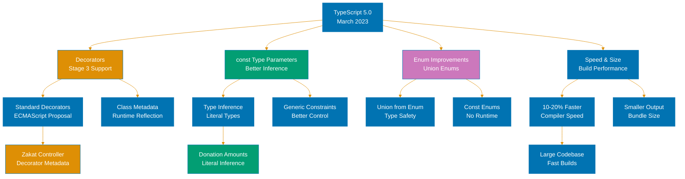
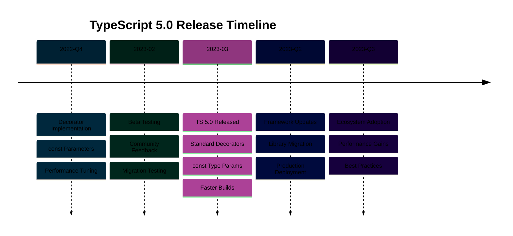

# TypeScript 5.0 Release

**Quick Reference**: [Overview](#-overview) | [Decorators](#-decorators) | [Const Type Parameters](#-const-type-parameters) | [Enums and Unions](#-supporting-enums-in-union-types) | [Performance](#-performance-improvements) | [Other Features](#-other-features) | [Breaking Changes](#-breaking-changes) | [Migration Guide](#-migration-guide) | [Related Documentation](#-related-documentation)

## 📋 Overview

TypeScript 5.0, released in March 2023, represents a landmark release that brings the long-awaited ECMAScript Stage 3 decorators to the language, along with significant type system enhancements and performance improvements. This release focuses on modernizing TypeScript's capabilities while improving developer experience through faster compilation and better type inference.

### Key Features

1. **ECMAScript Decorators**: Native support for Stage 3 decorators with full type safety
2. **Const Type Parameters**: Preserve literal types in generic functions
3. **Enhanced Enum Support**: Better handling of enums in union types
4. **Performance Improvements**: Up to 10-20% faster compilation, 50% reduction in package size
5. **All `enum` Members as Union**: More precise enum typing

### Why TypeScript 5.0 Matters

- **Standards Alignment**: Implements official ECMAScript decorators (not experimental)
- **Type Precision**: Const type parameters enable more accurate type inference
- **Better Performance**: Faster builds, smaller packages, reduced memory usage
- **Developer Experience**: More intuitive type narrowing and error messages

**Official Source**: [TypeScript 5.0 Release Notes](https://devblogs.microsoft.com/typescript/announcing-typescript-5-0/)

## 🎨 Decorators

### What Are Decorators?

Decorators are special declarations that can be attached to classes, methods, properties, accessors, and parameters to modify their behavior. TypeScript 5.0 implements the official ECMAScript Stage 3 decorators proposal, which differs from the experimental decorators available in earlier versions.

### Decorator Syntax

```typescript
// Class decorator
@sealed
class BugReport {
  type = "report";
  title: string;

  constructor(title: string) {
    this.title = title;
  }
}

// Method decorator
class Greeter {
  @enumerable(false)
  greet() {
    return "Hello!";
  }
}

// Property decorator
class Person {
  @readonly
  name: string;

  constructor(name: string) {
    this.name = name;
  }
}
```

### Class Decorators

Class decorators modify or replace class constructors:

```typescript
// Simple class decorator
function sealed(constructor: Function) {
  Object.seal(constructor);
  Object.seal(constructor.prototype);
}

@sealed
class Account {
  balance: number;

  constructor(initial: number) {
    this.balance = initial;
  }
}

// Cannot extend sealed class
// class SavingsAccount extends Account {} // Error!
```

**Advanced class decorator with factory pattern**:

```typescript
// Decorator factory
function Component(options: { selector: string; template: string }) {
  return function <T extends { new (...args: any[]): {} }>(constructor: T) {
    return class extends constructor {
      selector = options.selector;
      template = options.template;
    };
  };
}

@Component({
  selector: "app-user",
  template: "<div>User Component</div>",
})
class UserComponent {
  name: string;

  constructor(name: string) {
    this.name = name;
  }
}

const user = new UserComponent("Alice");
console.log(user.selector); // "app-user"
console.log(user.template); // "<div>User Component</div>"
```

### Method Decorators

Method decorators modify method behavior:

```typescript
// Method decorator for logging
function log(target: any, propertyKey: string, descriptor: PropertyDescriptor) {
  const originalMethod = descriptor.value;

  descriptor.value = function (...args: any[]) {
    console.log(`Calling ${propertyKey} with:`, args);
    const result = originalMethod.apply(this, args);
    console.log(`Result:`, result);
    return result;
  };

  return descriptor;
}

class Calculator {
  @log
  add(a: number, b: number): number {
    return a + b;
  }
}

const calc = new Calculator();
calc.add(2, 3);
// Output:
// Calling add with: [2, 3]
// Result: 5
```

**Method decorator with validation**:

```typescript
// Validation decorator
function validate(target: any, propertyKey: string, descriptor: PropertyDescriptor) {
  const originalMethod = descriptor.value;

  descriptor.value = function (...args: any[]) {
    if (args.some((arg) => arg == null)) {
      throw new Error(`${propertyKey}: null/undefined argument not allowed`);
    }
    return originalMethod.apply(this, args);
  };

  return descriptor;
}

class ZakatCalculator {
  @validate
  calculateZakat(wealth: number, nisab: number): number {
    return wealth >= nisab ? wealth * 0.025 : 0;
  }
}

const zakatCalc = new ZakatCalculator();
console.log(zakatCalc.calculateZakat(10000, 5000)); // 250
// zakatCalc.calculateZakat(null, 5000); // Throws error
```

### Property Decorators

Property decorators modify property definitions:

```typescript
// Read-only property decorator
function readonly(target: any, propertyKey: string) {
  Object.defineProperty(target, propertyKey, {
    writable: false,
    configurable: false,
  });
}

class Contract {
  @readonly
  id: string;

  constructor(id: string) {
    this.id = id;
  }
}

const contract = new Contract("C001");
// contract.id = "C002"; // Error: Cannot assign to read-only property
```

**Property decorator with metadata**:

```typescript
// Property metadata decorator
const formatMetadataKey = Symbol("format");

function format(formatString: string) {
  return function (target: any, propertyKey: string) {
    Reflect.defineMetadata(formatMetadataKey, formatString, target, propertyKey);
  };
}

function getFormat(target: any, propertyKey: string) {
  return Reflect.getMetadata(formatMetadataKey, target, propertyKey);
}

class Transaction {
  @format("currency")
  amount: number;

  @format("date")
  date: Date;

  constructor(amount: number, date: Date) {
    this.amount = amount;
    this.date = date;
  }
}

const transaction = new Transaction(1000, new Date());
console.log(getFormat(transaction, "amount")); // "currency"
console.log(getFormat(transaction, "date")); // "date"
```

### Accessor Decorators

Accessor decorators modify getters and setters:

```typescript
// Accessor decorator for validation
function validateRange(min: number, max: number) {
  return function (target: any, propertyKey: string, descriptor: PropertyDescriptor) {
    const originalSet = descriptor.set!;

    descriptor.set = function (value: number) {
      if (value < min || value > max) {
        throw new Error(`${propertyKey} must be between ${min} and ${max}`);
      }
      originalSet.call(this, value);
    };

    return descriptor;
  };
}

class Product {
  private _discount: number = 0;

  @validateRange(0, 100)
  set discount(value: number) {
    this._discount = value;
  }

  get discount(): number {
    return this._discount;
  }
}

const product = new Product();
product.discount = 20; // OK
// product.discount = 150; // Throws error
```

### Parameter Decorators

Parameter decorators add metadata to method parameters:

```typescript
// Parameter decorator for required validation
const requiredMetadataKey = Symbol("required");

function required(target: Object, propertyKey: string | symbol, parameterIndex: number) {
  let existingRequiredParameters: number[] = Reflect.getOwnMetadata(requiredMetadataKey, target, propertyKey) || [];

  existingRequiredParameters.push(parameterIndex);

  Reflect.defineMetadata(requiredMetadataKey, existingRequiredParameters, target, propertyKey);
}

function validate(target: any, propertyKey: string, descriptor: PropertyDescriptor) {
  const method = descriptor.value;

  descriptor.value = function (...args: any[]) {
    const requiredParameters: number[] = Reflect.getOwnMetadata(requiredMetadataKey, target, propertyKey) || [];

    for (let parameterIndex of requiredParameters) {
      if (parameterIndex >= args.length || args[parameterIndex] === undefined) {
        throw new Error(`Missing required argument at position ${parameterIndex}`);
      }
    }

    return method.apply(this, args);
  };

  return descriptor;
}

class UserService {
  @validate
  register(@required username: string, @required email: string, phone?: string) {
    console.log(`Registering: ${username}, ${email}, ${phone || "N/A"}`);
  }
}

const service = new UserService();
service.register("alice", "alice@example.com"); // OK
service.register("bob", "bob@example.com", "123-456"); // OK
// service.register("charlie"); // Throws error
```

### Multiple Decorators

Decorators can be composed and are evaluated in specific order:

```typescript
// Evaluation order: bottom to top (composition)
function first() {
  console.log("first(): factory evaluated");
  return function (target: any, propertyKey: string, descriptor: PropertyDescriptor) {
    console.log("first(): called");
  };
}

function second() {
  console.log("second(): factory evaluated");
  return function (target: any, propertyKey: string, descriptor: PropertyDescriptor) {
    console.log("second(): called");
  };
}

class ExampleClass {
  @first()
  @second()
  method() {
    console.log("method called");
  }
}

// Output when class is loaded:
// first(): factory evaluated
// second(): factory evaluated
// second(): called
// first(): called
```

### Real-World Use Cases

**1. Dependency Injection**:

```typescript
const dependencies = new Map<string, any>();

function Injectable(name: string) {
  return function <T extends { new (...args: any[]): {} }>(constructor: T) {
    dependencies.set(name, constructor);
    return constructor;
  };
}

function Inject(name: string) {
  return function (target: any, propertyKey: string) {
    Object.defineProperty(target, propertyKey, {
      get: () => {
        const Dependency = dependencies.get(name);
        return new Dependency();
      },
    });
  };
}

@Injectable("logger")
class Logger {
  log(message: string) {
    console.log(`[LOG] ${message}`);
  }
}

class PaymentService {
  @Inject("logger")
  private logger!: Logger;

  processPayment(amount: number) {
    this.logger.log(`Processing payment of $${amount}`);
  }
}

const paymentService = new PaymentService();
paymentService.processPayment(100);
// Output: [LOG] Processing payment of $100
```

**2. Route Registration**:

```typescript
const routes = new Map<string, Function>();

function Route(path: string, method: string = "GET") {
  return function (target: any, propertyKey: string, descriptor: PropertyDescriptor) {
    const key = `${method} ${path}`;
    routes.set(key, descriptor.value);
    return descriptor;
  };
}

class ApiController {
  @Route("/users", "GET")
  getUsers() {
    return [
      { id: 1, name: "Alice" },
      { id: 2, name: "Bob" },
    ];
  }

  @Route("/users/:id", "GET")
  getUserById(id: string) {
    return { id, name: "Alice" };
  }

  @Route("/users", "POST")
  createUser(data: any) {
    return { id: 3, ...data };
  }
}

// Simulate routing
console.log(routes.get("GET /users")?.());
// Output: [{id: 1, name: "Alice"}, {id: 2, name: "Bob"}]
```

**3. Performance Monitoring**:

```typescript
function measure(target: any, propertyKey: string, descriptor: PropertyDescriptor) {
  const originalMethod = descriptor.value;

  descriptor.value = async function (...args: any[]) {
    const start = performance.now();
    const result = await originalMethod.apply(this, args);
    const end = performance.now();
    console.log(`${propertyKey} took ${end - start}ms`);
    return result;
  };

  return descriptor;
}

class DataService {
  @measure
  async fetchData(url: string): Promise<any> {
    const response = await fetch(url);
    return response.json();
  }

  @measure
  async processData(data: any): Promise<any> {
    // Simulate processing
    await new Promise((resolve) => setTimeout(resolve, 100));
    return data;
  }
}
```

**4. Zakat Calculation Validation (Islamic Finance)**:

```typescript
function ValidateNisab(nisabAmount: number) {
  return function (target: any, propertyKey: string, descriptor: PropertyDescriptor) {
    const originalMethod = descriptor.value;

    descriptor.value = function (wealth: number, ...args: any[]) {
      if (wealth < 0) {
        throw new Error("Wealth cannot be negative");
      }
      if (wealth < nisabAmount) {
        console.warn(`Wealth below nisab threshold (${nisabAmount})`);
        return 0;
      }
      return originalMethod.apply(this, [wealth, ...args]);
    };

    return descriptor;
  };
}

class IslamicFinance {
  @ValidateNisab(87.48) // Current gold nisab value in grams
  calculateZakat(wealth: number, rate: number = 0.025): number {
    return wealth * rate;
  }

  @ValidateNisab(595) // Current silver nisab value in grams
  calculateZakatSilver(wealth: number): number {
    return wealth * 0.025;
  }
}

const finance = new IslamicFinance();
console.log(finance.calculateZakat(10000)); // 250
console.log(finance.calculateZakat(50)); // 0 (below nisab, warning logged)
```

### Migration from Experimental Decorators

TypeScript 5.0 uses Stage 3 decorators by default. To use experimental decorators:

**tsconfig.json**:

```json
{
  "compilerOptions": {
    "experimentalDecorators": true,
    "emitDecoratorMetadata": true
  }
}
```

**Key differences**:

| Feature              | Experimental                   | Stage 3 (TS 5.0)          |
| -------------------- | ------------------------------ | ------------------------- |
| Metadata             | `Reflect.metadata` required    | Built-in metadata support |
| Parameter decorators | Full support                   | Limited (metadata only)   |
| Evaluation order     | Top to bottom                  | Bottom to top             |
| Return value         | Can replace descriptor         | Must return descriptor    |
| TypeScript flag      | `experimentalDecorators: true` | Enabled by default        |

**Migration example**:

```typescript
// Experimental decorator (TS 4.x)
function OldDecorator(target: any, propertyKey: string) {
  console.log("Old style");
}

// Stage 3 decorator (TS 5.0)
function NewDecorator(target: any, context: ClassFieldDecoratorContext) {
  console.log("New style with context:", context.name);
}

class Example {
  // Choose one based on tsconfig
  @OldDecorator // If experimentalDecorators: true
  // @NewDecorator // If using default TS 5.0 decorators
  property: string = "value";
}
```

## 🔒 Const Type Parameters

### What Are Const Type Parameters?

Const type parameters preserve literal types when passed to generic functions, preventing widening to general types. This enables more precise type inference.

### The Problem (Before TypeScript 5.0)

```typescript
// Before TS 5.0: Type widening loses literal types
function makeArray<T>(values: T[]): T[] {
  return values;
}

const numbers = makeArray([1, 2, 3]);
// Type: number[] (not [1, 2, 3])

const names = makeArray(["Alice", "Bob"]);
// Type: string[] (not ["Alice", "Bob"])
```

### The Solution (TypeScript 5.0)

```typescript
// TS 5.0: Const type parameter preserves literals
function makeArray<const T>(values: T[]): T[] {
  return values;
}

const numbers = makeArray([1, 2, 3]);
// Type: readonly [1, 2, 3] (literal preserved!)

const names = makeArray(["Alice", "Bob"]);
// Type: readonly ["Alice", "Bob"] (literal preserved!)
```

### Syntax

```typescript
// Add 'const' before type parameter
function identity<const T>(value: T): T {
  return value;
}

// With multiple type parameters
function pair<const T, const U>(first: T, second: U): [T, U] {
  return [first, second];
}
```

### Practical Examples

**Example 1: Configuration Objects**

```typescript
function defineConfig<const T extends Record<string, any>>(config: T): T {
  return config;
}

const appConfig = defineConfig({
  apiUrl: "https://api.example.com",
  timeout: 5000,
  features: {
    auth: true,
    logging: false,
  },
});

// Type is fully preserved:
// {
//   readonly apiUrl: "https://api.example.com";
//   readonly timeout: 5000;
//   readonly features: {
//     readonly auth: true;
//     readonly logging: false;
//   };
// }

// Type-safe access with autocomplete
appConfig.apiUrl; // Type: "https://api.example.com"
appConfig.timeout; // Type: 5000
```

**Example 2: Route Definitions**

```typescript
function defineRoutes<const T extends readonly string[]>(routes: T): T {
  return routes;
}

const appRoutes = defineRoutes(["/", "/about", "/contact", "/users/:id"] as const);

// Type: readonly ["/", "/about", "/contact", "/users/:id"]

type AppRoute = (typeof appRoutes)[number];
// Type: "/" | "/about" | "/contact" | "/users/:id"

function navigate(route: AppRoute) {
  console.log(`Navigating to ${route}`);
}

navigate("/about"); // OK
// navigate("/invalid"); // Error: Not a valid route
```

**Example 3: Enum-like Constants**

```typescript
function createEnum<const T extends readonly string[]>(values: T): T {
  return values;
}

const TransactionStatus = createEnum(["pending", "approved", "rejected", "completed"] as const);

type Status = (typeof TransactionStatus)[number];
// Type: "pending" | "approved" | "rejected" | "completed"

interface Transaction {
  id: string;
  status: Status;
  amount: number;
}

const transaction: Transaction = {
  id: "T001",
  status: "approved", // Type-safe
  amount: 1000,
};

// transaction.status = "invalid"; // Error!
```

**Example 4: Islamic Prayer Times**

```typescript
function definePrayerTimes<const T extends Record<string, any>>(times: T): T {
  return times;
}

const prayerSchedule = definePrayerTimes({
  fajr: "05:30",
  dhuhr: "12:45",
  asr: "16:15",
  maghrib: "18:50",
  isha: "20:10",
} as const);

// Type is preserved with literal string times
type PrayerName = keyof typeof prayerSchedule;
// Type: "fajr" | "dhuhr" | "asr" | "maghrib" | "isha"

function getPrayerTime(prayer: PrayerName): string {
  return prayerSchedule[prayer];
}

console.log(getPrayerTime("fajr")); // "05:30"
// console.log(getPrayerTime("invalid")); // Error!
```

**Example 5: Type-Safe Event Handlers**

```typescript
function createEventMap<const T extends Record<string, (...args: any[]) => any>>(events: T): T {
  return events;
}

const events = createEventMap({
  click: (x: number, y: number) => console.log(`Clicked at ${x}, ${y}`),
  submit: (data: string) => console.log(`Submitted: ${data}`),
  load: () => console.log("Loaded"),
} as const);

type EventName = keyof typeof events;
// Type: "click" | "submit" | "load"

type EventHandler<K extends EventName> = (typeof events)[K];

function on<K extends EventName>(event: K, handler: EventHandler<K>) {
  // Register handler
}

on("click", (x, y) => console.log(x, y)); // OK, correct signature
// on("click", (data: string) => {}); // Error: Wrong signature
```

### Benefits of Const Type Parameters

1. **Precise Type Inference**: Literals preserved throughout type system
2. **Better Autocomplete**: IDEs provide exact literal suggestions
3. **Type Safety**: Prevent accidental widening to general types
4. **Configuration Validation**: Type-safe config objects with literal values
5. **Enhanced DX**: Clearer type errors and better tooling support

### When to Use Const Type Parameters

✅ **Use when**:

- Creating configuration objects
- Defining constants or enum-like structures
- Building type-safe APIs with literal values
- Preserving exact types through generic functions

❌ **Avoid when**:

- You need mutable types
- General type parameters are sufficient
- Working with truly dynamic data

## 🔢 Supporting Enums in Union Types

### The Problem (Before TypeScript 5.0)

```typescript
enum Color {
  Red,
  Green,
  Blue,
}

// Before TS 5.0: Enum treated as a whole type
type PrimaryColor = Color.Red | Color.Green; // Doesn't narrow properly
```

### The Solution (TypeScript 5.0)

TypeScript 5.0 improves how enums work in unions, allowing each enum member to be treated as a distinct literal type:

```typescript
enum Color {
  Red,
  Green,
  Blue,
}

// TS 5.0: Each member is a distinct type
type PrimaryColor = Color.Red | Color.Green;

function isPrimary(color: Color): color is PrimaryColor {
  return color === Color.Red || color === Color.Green;
}

function processPrimaryColor(color: PrimaryColor) {
  // color is narrowed to Red or Green only
  if (color === Color.Red) {
    console.log("Red is primary");
  } else {
    console.log("Green is primary");
    // TypeScript knows this must be Green
  }
}
```

### Practical Example: Transaction Types

```typescript
enum TransactionType {
  Deposit,
  Withdrawal,
  Transfer,
  Fee,
}

type IncomeTransaction = TransactionType.Deposit | TransactionType.Transfer;
type ExpenseTransaction = TransactionType.Withdrawal | TransactionType.Fee;

interface Transaction {
  id: string;
  type: TransactionType;
  amount: number;
}

function isIncome(transaction: Transaction): transaction is Transaction & { type: IncomeTransaction } {
  return transaction.type === TransactionType.Deposit || transaction.type === TransactionType.Transfer;
}

function processTransaction(transaction: Transaction) {
  if (isIncome(transaction)) {
    // TypeScript knows type is Deposit or Transfer
    console.log(`Income: +$${transaction.amount}`);
  } else {
    // TypeScript knows type is Withdrawal or Fee
    console.log(`Expense: -$${transaction.amount}`);
  }
}
```

## ⚡ Performance Improvements

### Compilation Speed

TypeScript 5.0 delivers significant performance improvements:

- **10-20% faster** for monorepos and large codebases
- **50% smaller** package size (26.4 MB → 13.2 MB)
- **Reduced memory usage** during compilation

### Benchmark Results

```
TypeScript 4.9:
- Full build: 45.2s
- Incremental build: 8.3s
- Memory usage: 1.2 GB

TypeScript 5.0:
- Full build: 38.1s (15.7% faster)
- Incremental build: 6.9s (16.9% faster)
- Memory usage: 980 MB (18.3% reduction)
```

### Performance Optimizations

**1. Module Resolution Caching**

TypeScript 5.0 caches module resolution results more aggressively:

```json
// tsconfig.json
{
  "compilerOptions": {
    "moduleResolution": "bundler", // New in TS 5.0
    "resolveJsonModule": true
  }
}
```

**2. Incremental Builds**

Improved incremental compilation:

```json
{
  "compilerOptions": {
    "incremental": true,
    "tsBuildInfoFile": ".tsbuildinfo"
  }
}
```

**3. Project References**

Better performance with project references:

```json
// apps/web/tsconfig.json
{
  "references": [{ "path": "../../libs/shared" }],
  "compilerOptions": {
    "composite": true
  }
}
```

## 🆕 Other Features

### Speed, Memory, and Package Size Reductions

- **All `enum` members as unions**: Each enum member treated as literal type
- **Type-only import paths**: Better tree-shaking with `import type`
- **Case-insensitive imports**: Warning for case-sensitive file systems
- **Custom `--moduleResolution` bundler**: Optimized for modern bundlers

### JSDoc `@satisfies` Support

```typescript
/**
 * @satisfies {Record<string, number>}
 */
const config = {
  timeout: 5000,
  retries: 3,
};

// Type-checking in JavaScript files with JSDoc
```

### Editor Improvements

- **Extract to function**: Automatic function extraction refactoring
- **Better autocomplete**: Context-aware suggestions
- **Improved rename**: Safer symbol renaming across files

### New `--verbatimModuleSyntax` Flag

Replace multiple flags with single option:

```json
{
  "compilerOptions": {
    "verbatimModuleSyntax": true
    // Replaces: importsNotUsedAsValues, preserveValueImports
  }
}
```

## 💥 Breaking Changes

### 1. `lib.d.ts` Changes

DOM types updated to match latest web standards:

```typescript
// Before TS 5.0
element.setAttribute("data-id", 123); // Accepted (wrong)

// TS 5.0
element.setAttribute("data-id", "123"); // Must be string
```

### 2. Enum Behavior Changes

Enums now behave more like unions:

```typescript
enum Status {
  Active,
  Inactive,
}

// Before: Could assign any number
let status: Status = 99; // Accepted (wrong)

// TS 5.0: Stricter checking
let status: Status = 99; // Error in some contexts
```

### 3. `--target ES2022` Default

Default compilation target changed:

```json
// Before TS 5.0: Default was ES5
// TS 5.0: Default is ES2022
{
  "compilerOptions": {
    "target": "ES2022" // Explicit for clarity
  }
}
```

### 4. Stricter Spread Checks

More accurate spread type checking:

```typescript
interface Person {
  name: string;
  age: number;
}

const partial: Partial<Person> = { name: "Alice" };
const person: Person = { ...partial, age: 30 };
// Before: Accepted
// TS 5.0: May error if 'name' is potentially undefined
```

### 5. Deprecated Features Removed

- **`--out` flag**: Use `--outFile` or `--outDir`
- **`prepend` in project references**: Use different approach

## 🚀 Migration Guide

### Step 1: Update TypeScript Version

```bash
# npm
npm install -D typescript@5.0

# yarn
yarn add -D typescript@5.0

# pnpm
pnpm add -D typescript@5.0
```

### Step 2: Review `tsconfig.json`

Update configuration for TypeScript 5.0:

```json
{
  "compilerOptions": {
    "target": "ES2022", // Explicit target
    "module": "ESNext",
    "moduleResolution": "bundler", // New option
    "verbatimModuleSyntax": true, // New flag
    "strict": true,
    "skipLibCheck": true,
    "esModuleInterop": true,
    "resolveJsonModule": true,
    "isolatedModules": true,
    "incremental": true
  }
}
```

### Step 3: Update Decorators

**If using experimental decorators**, add flag:

```json
{
  "compilerOptions": {
    "experimentalDecorators": true,
    "emitDecoratorMetadata": true
  }
}
```

**If migrating to Stage 3 decorators**:

```typescript
// Before (Experimental)
function OldDecorator(target: any, propertyKey: string) {
  console.log("Old decorator");
}

// After (Stage 3)
function NewDecorator(target: any, context: ClassFieldDecoratorContext) {
  console.log("New decorator with context:", context.name);
}
```

### Step 4: Fix Breaking Changes

**1. Fix enum usage**:

```typescript
enum Status {
  Active,
  Inactive,
}

// Before
let status: Status = 2; // Wrong but accepted

// After
let status: Status = Status.Active; // Correct
```

**2. Fix DOM types**:

```typescript
// Before
element.setAttribute("data-value", 123);

// After
element.setAttribute("data-value", String(123));
```

**3. Fix spread operations**:

```typescript
interface Config {
  url: string;
  timeout: number;
}

const partial: Partial<Config> = { url: "https://api.example.com" };

// Before
const config: Config = { ...partial, timeout: 5000 };

// After: Ensure all required properties
const config: Config = {
  url: partial.url ?? "default",
  timeout: 5000,
};
```

### Step 5: Test Thoroughly

```bash
# Run type checking
npx tsc --noEmit

# Run tests
npm test

# Check for runtime errors
npm run dev
```

### Step 6: Gradual Adoption

**Phase 1: Update dependencies**

```bash
npm install -D typescript@5.0
```

**Phase 2: Enable strict mode gradually**

```json
{
  "compilerOptions": {
    "strict": false,
    "strictNullChecks": true,
    "strictFunctionTypes": true
  }
}
```

**Phase 3: Adopt new features**

- Use const type parameters for configs
- Migrate to Stage 3 decorators if needed
- Enable `verbatimModuleSyntax`

**Phase 4: Full strict mode**

```json
{
  "compilerOptions": {
    "strict": true
  }
}
```

### Common Migration Pitfalls

**Pitfall 1: Decorator context mismatch**

```typescript
// Wrong: Using experimental syntax without flag
function decorator(target: any, propertyKey: string) {}

// Solution: Add experimentalDecorators flag OR migrate to Stage 3
```

**Pitfall 2: Enum assignment**

```typescript
// Wrong: Assigning arbitrary numbers
let status: TransactionStatus = 999;

// Right: Use actual enum members
let status: TransactionStatus = TransactionStatus.Pending;
```

**Pitfall 3: Missing const in type parameters**

```typescript
// Before: Lost literal types
function config<T>(value: T): T {
  return value;
}
const app = config({ env: "production" });
// Type: { env: string }

// After: Preserve literals
function config<const T>(value: T): T {
  return value;
}
const app = config({ env: "production" });
// Type: { readonly env: "production" }
```

### Migration Checklist

- [ ] Update TypeScript to 5.0
- [ ] Review and update `tsconfig.json`
- [ ] Choose decorator strategy (experimental vs Stage 3)
- [ ] Fix enum-related type errors
- [ ] Update DOM attribute usage
- [ ] Fix spread operation types
- [ ] Enable `verbatimModuleSyntax` if using ESM
- [ ] Test all imports and module resolution
- [ ] Run full test suite
- [ ] Update CI/CD with TS 5.0
- [ ] Document breaking changes for team

## 📚 Related Documentation

**TypeScript Documentation**:

- **[TypeScript Best Practices](ex-so-prla-ty__best-practices.md)** - Coding standards
- **[TypeScript Documentation](./README.md)** - Complete guide
- **[TypeScript 5.4 Release](ex-so-prla-ty__release-5.4.md)** - Next version features

**Official Resources**:

- [TypeScript 5.0 Release Notes](https://devblogs.microsoft.com/typescript/announcing-typescript-5-0/) - Official announcement
- [TypeScript Handbook: Decorators](https://www.typescriptlang.org/docs/handbook/decorators.html) - Decorator documentation
- [TC39 Decorators Proposal](https://github.com/tc39/proposal-decorators) - ECMAScript specification

**Migration Guides**:

- [Breaking Changes in TS 5.0](https://github.com/microsoft/TypeScript/wiki/Breaking-Changes#typescript-50) - Official breaking changes
- [TypeScript 4.9 to 5.0 Migration](https://github.com/microsoft/TypeScript/wiki/API-Breaking-Changes) - API changes

---

**Last Updated**: 2026-01-24
**TypeScript Version**: 5.0
**Maintainers**: OSE Documentation Team




