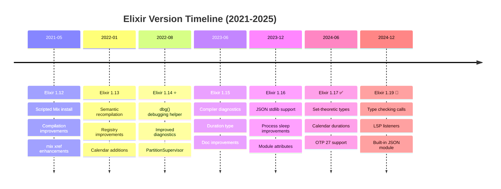

# Elixir Programming Language Documentation

**Quick Reference**: [Overview](#overview) | [Principles](#software-engineering-principles) | [Documentation Structure](#documentation-structure) | [Version Strategy](#elixir-version-strategy) | [Learning Path](#learning-path) | [Tools & Ecosystem](#tools-and-ecosystem) | [Resources](#resources-and-references)

## Overview

Elixir is a dynamic, functional programming language designed for building scalable and maintainable applications. Built on the Erlang Virtual Machine (BEAM), Elixir leverages decades of Erlang's proven concurrency model and fault-tolerance capabilities while providing modern syntax, powerful metaprogramming features, and excellent tooling.

**Why Elixir for Open Sharia Enterprise:**

- **Massive Concurrency**: BEAM VM's lightweight processes enable millions of concurrent connections, ideal for donation processing and Zakat calculation services
- **Fault Tolerance**: Supervision trees and "let it crash" philosophy ensure system resilience for critical financial operations
- **Real-time Capabilities**: Phoenix LiveView provides real-time updates for donation campaigns and financial dashboards without complex JavaScript
- **Functional Paradigm**: Immutable data and pure functions reduce bugs in financial calculations where correctness is paramount
- **Excellent Tooling**: Mix build tool, ExUnit testing framework, and built-in documentation make development productive

**Current Ecosystem Status (as of January 2025)**:

- **Elixir**: 1.19.0+ (type checking of calls, built-in JSON, ExUnit improvements)
- **Erlang/OTP**: 27.2+ (json module, process labels, performance improvements)
- **Phoenix**: 1.7.x (verified routes, Tailwind support, LiveView streams)
- **Ecto**: 3.12.x (database toolkit with query composition)

## Software Engineering Principles

The Open Sharia Enterprise platform follows five core software engineering principles. Elixir's design naturally supports these principles:

### 1. Documentation First

Elixir treats documentation as a first-class citizen:

```elixir
defmodule FinancialDomain.Zakat.Calculator do
  @moduledoc """
  Calculates Zakat obligations based on wealth and nisab threshold.

  Zakat is mandatory charity in Islam, calculated at 2.5% of wealth
  exceeding the nisab (minimum threshold).
  """

  @doc """
  Calculates Zakat on given wealth.

  ## Examples

      iex> Calculator.calculate(Money.new(10000, :USD), Money.new(5000, :USD))
      {:ok, %Money{amount: Decimal.new("250.00"), currency: :USD}}

  """
  @spec calculate(Money.t(), Money.t()) :: {:ok, Money.t()} | {:error, String.t()}
  def calculate(wealth, nisab) do
    # Implementation
  end
end
```

### 2. Accessibility First

Elixir encourages clear, readable code:

- Pattern matching makes business rules explicit
- Pipe operator creates linear, readable data transformations
- Function naming follows snake_case convention for consistency
- Error tuples `{:ok, result}` | `{:error, reason}` make error states visible

### 3. Simplicity Over Complexity

Elixir's functional approach promotes simplicity:

- No inheritance hierarchies or complex object graphs
- Data transformations through pure functions
- Explicit state management with GenServer
- Composition over configuration

### 4. Explicit Over Implicit

Elixir favors explicitness:

- Pattern matching makes control flow visible
- No hidden state or side effects in pure functions
- Supervision strategies explicitly defined
- Configuration via config/runtime.exs visible and traceable

### 5. Automation Over Manual

Elixir provides excellent automation tools:

- Mix automates project creation, dependency management, testing
- ExUnit enables test-driven development with doctests
- Dialyzer performs static type analysis
- Credo enforces code quality standards

## Documentation Structure

This directory contains comprehensive Elixir documentation organized by topic:

### Core Topics (17 files)

**Fundamentals**:

- [Idioms](./ex-so-stla-el__idioms.md) - Pattern matching, pipe operator, guards, protocols
- [Best Practices](./ex-so-stla-el__best-practices.md) - Naming conventions, OTP patterns, supervision design
- [Anti-Patterns](./ex-so-stla-el__anti-patterns.md) - Common mistakes, process leaks, misuse of macros

**Concurrency & Error Handling**:

- [Concurrency and Parallelism](./ex-so-stla-el__concurrency-and-parallelism.md) - Processes, message passing, Task module
- [Error Handling](./ex-so-stla-el__error-handling.md) - Let it crash philosophy, supervision trees

**Type System & Functional Programming**:

- [Type Safety](./ex-so-stla-el__type-safety.md) - Typespecs, Dialyzer, pattern matching as type guard
- [Functional Programming](./ex-so-stla-el__functional-programming.md) - Immutability, pure functions, recursion, Enum/Stream
- [Protocols and Behaviours](./ex-so-stla-el__protocols-and-behaviours.md) - Polymorphism, protocol implementation, behaviour contracts

**Domain-Driven Design**:

- [Domain-Driven Design](./ex-so-stla-el__domain-driven-design.md) - DDD without classes, Ecto schemas as aggregates, bounded contexts

**Quality & Performance**:

- [Security](./ex-so-stla-el__security.md) - Input validation, XSS prevention, SQL injection protection
- [Performance](./ex-so-stla-el__performance.md) - BEAM VM optimization, profiling, benchmarking, ETS tables
- [Memory Management](./ex-so-stla-el__memory-management.md) - BEAM VM garbage collection, process heaps, memory profiling
- [Linting and Formatting](./ex-so-stla-el__linting-and-formatting.md) - mix format, Credo, Dialyzer integration

**Development & Testing**:

- [Dependencies](./ex-so-stla-el__dependencies.md) - Mix project management, Hex packages, umbrella projects
- [Web Services](./ex-so-stla-el__web-services.md) - Phoenix framework, REST APIs, GraphQL, LiveView
- [Test-Driven Development](./ex-so-stla-el__test-driven-development.md) - ExUnit, doctests, property-based testing
- [Behaviour-Driven Development](./ex-so-stla-el__behaviour-driven-development.md) - White Bread for Gherkin, acceptance testing

### Release Documentation (5-7 files)

Version-specific features and migration guides:

- [Elixir 1.12](./ex-so-stla-el__release-1.12.md) - Scripted mix install, improved mix xref, compilation improvements
- [Elixir 1.13](./ex-so-stla-el__release-1.13.md) - Semantic recompilation, Registry improvements, Calendar additions
- [Elixir 1.14](./ex-so-stla-el__release-1.14.md) - dbg/2 debugging helper, improved diagnostics, PartitionSupervisor
- [Elixir 1.15](./ex-so-stla-el__release-1.15.md) - Compiler diagnostics, Duration type, documentation improvements
- [Elixir 1.16](./ex-so-stla-el__release-1.16.md) - JSON support in standard library, process sleep improvements
- [Elixir 1.17](./ex-so-stla-el__release-1.17.md) - Set-theoretic types, calendar durations, OTP 27 support
- [Elixir 1.19](./ex-so-stla-el__release-1.19.md) - Type checking of calls, LSP listeners, built-in JSON module

### OTP Patterns (3 files)

Elixir-specific OTP design patterns:

- [OTP GenServer](./ex-so-stla-el__otp-genserver.md) - State management patterns, handle_call/cast/info, lifecycle
- [OTP Supervisor](./ex-so-stla-el__otp-supervisor.md) - Supervision strategies, restart policies, fault tolerance
- [OTP Application](./ex-so-stla-el__otp-application.md) - Application structure, supervision trees, umbrella projects

### DDD Templates (7 templates)

Production-ready templates adapted for Elixir's functional paradigm:

- [Entity Template](./templates/entity-template.md) - Ecto schemas with identity and changesets
- [Value Object Template](./templates/value-object-template.md) - Elixir structs with validation and protocols
- [Aggregate Template](./templates/aggregate-template.md) - Bounded contexts with Ecto and consistency boundaries
- [Domain Event Template](./templates/domain-event-template.md) - Event sourcing patterns with GenServer/GenStage
- [Repository Template](./templates/repository-template.md) - Ecto Repo abstraction with query patterns
- [Service Layer Template](./templates/service-layer-template.md) - Business logic orchestration with context modules
- [Build Configuration Template](./templates/build-configuration-template.md) - Mix.exs, config/, releases, Docker, CI/CD

See [templates/README.md](./templates/README.md) for template overview and usage guide.

## Elixir Version Strategy



**Platform Strategy**: Elixir 1.12+ (baseline) → Elixir 1.17+ (recommended) → Elixir 1.19 (latest)

### Current Baseline: Elixir 1.12+ (Minimum Required)

**Platform Standard**: Elixir 1.12 is the minimum required version for all Elixir projects.

**Rationale**:

- Scripted Mix installation improvements
- Enhanced compilation performance
- Improved mix xref for dependency analysis
- Foundation for modern Elixir patterns (2021-2026)

### Recommended Version: Elixir 1.17+ (Production Target)

**Migration Path**: Projects are encouraged to use Elixir 1.17+ for enhanced features:

- Set-theoretic types for additional compile-time warnings
- Duration data type for calendar operations
- Enhanced Dialyzer integration
- Erlang/OTP 27 features (JSON module, process labels)

### Current Stable: Elixir 1.19 (Latest)

**Released**: December 2024 as the latest stable version

**Major Features**:

- Type checking of function calls
- Language Server Protocol (LSP) improvements
- Built-in JSON encoding/decoding
- ExUnit parameterized test modules

**Version Selection Guide**:

- **Platform services**: Use Elixir 1.17+ for production applications
- **Libraries**: Support Elixir 1.12+ for broader compatibility
- **Experiments**: Use Elixir 1.19+ to explore latest features

**Compatibility Note**: Elixir maintains excellent backward compatibility. Code written for Elixir 1.12 runs on 1.19 without modifications in most cases.

## Learning Path

### Recommended Reading Order

**For Developers New to Elixir** (start here):

1. [Idioms](./ex-so-stla-el__idioms.md) - Learn Elixir's distinctive patterns
2. [Functional Programming](./ex-so-stla-el__functional-programming.md) - Understand the functional paradigm
3. [Best Practices](./ex-so-stla-el__best-practices.md) - Follow community conventions
4. [Error Handling](./ex-so-stla-el__error-handling.md) - Embrace "let it crash" philosophy
5. [Concurrency and Parallelism](./ex-so-stla-el__concurrency-and-parallelism.md) - Understand process-based concurrency

**For Developers Building OTP Applications**:

1. [OTP GenServer](./ex-so-stla-el__otp-genserver.md) - Master stateful processes
2. [OTP Supervisor](./ex-so-stla-el__otp-supervisor.md) - Design supervision trees
3. [OTP Application](./ex-so-stla-el__otp-application.md) - Structure complete applications
4. [Memory Management](./ex-so-stla-el__memory-management.md) - Optimize BEAM VM usage

**For Developers Applying Domain-Driven Design**:

1. [Domain-Driven Design](./ex-so-stla-el__domain-driven-design.md) - Adapt DDD to functional paradigm
2. [Entity Template](./templates/entity-template.md) - Model entities with Ecto
3. [Value Object Template](./templates/value-object-template.md) - Create immutable value objects
4. [Aggregate Template](./templates/aggregate-template.md) - Define consistency boundaries
5. [Repository Template](./templates/repository-template.md) - Abstract data access
6. [Service Layer Template](./templates/service-layer-template.md) - Orchestrate domain logic

**For Developers Building Web Services**:

1. [Web Services](./ex-so-stla-el__web-services.md) - Phoenix framework overview
2. [Security](./ex-so-stla-el__security.md) - Secure Phoenix applications
3. [Performance](./ex-so-stla-el__performance.md) - Optimize web applications
4. [Domain-Driven Design](./ex-so-stla-el__domain-driven-design.md) - Structure business logic

**For Developers Ensuring Quality**:

1. [Test-Driven Development](./ex-so-stla-el__test-driven-development.md) - Write tests first
2. [Behaviour-Driven Development](./ex-so-stla-el__behaviour-driven-development.md) - Acceptance testing
3. [Type Safety](./ex-so-stla-el__type-safety.md) - Add typespecs and run Dialyzer
4. [Linting and Formatting](./ex-so-stla-el__linting-and-formatting.md) - Enforce code quality

### Learning by Example

Each documentation file includes complete, runnable examples using the financial domain:

**Zakat Calculation GenServer**:

```elixir
defmodule FinancialDomain.Zakat.CalculatorServer do
  use GenServer

  # Client API
  def start_link(nisab_threshold) do
    GenServer.start_link(__MODULE__, nisab_threshold, name: __MODULE__)
  end

  def calculate_zakat(wealth) do
    GenServer.call(__MODULE__, {:calculate, wealth})
  end

  # Server Callbacks
  @impl true
  def init(nisab_threshold) do
    {:ok, %{nisab: nisab_threshold, calculations_count: 0}}
  end

  @impl true
  def handle_call({:calculate, wealth}, _from, state) do
    result = if Money.greater_than?(wealth, state.nisab) do
      {:ok, Money.multiply(wealth, Decimal.new("0.025"))}
    else
      {:ok, Money.new(0, wealth.currency)}
    end

    new_state = %{state | calculations_count: state.calculations_count + 1}
    {:reply, result, new_state}
  end
end
```

**Donation Context Module (Phoenix Context)**:

```elixir
defmodule FinancialDomain.Donations do
  @moduledoc """
  Bounded context for donation processing.

  Follows Phoenix context pattern for organizing domain logic.
  """

  import Ecto.Query
  alias FinancialDomain.Repo
  alias FinancialDomain.Donations.{Donation, Campaign}

  @doc """
  Creates a donation with validation.
  """
  def create_donation(attrs) do
    %Donation{}
    |> Donation.changeset(attrs)
    |> Repo.insert()
    |> case do
      {:ok, donation} ->
        broadcast_donation_created(donation)
        {:ok, donation}
      error ->
        error
    end
  end

  @doc """
  Lists active campaigns with preloaded donations.
  """
  def list_active_campaigns do
    Campaign
    |> where([c], c.status == :active)
    |> preload(:donations)
    |> Repo.all()
  end

  defp broadcast_donation_created(donation) do
    Phoenix.PubSub.broadcast(
      FinancialDomain.PubSub,
      "donations",
      {:donation_created, donation}
    )
  end
end
```

## Code Examples from Platform

### Pattern Matching for Business Rules

```elixir
defmodule FinancialDomain.Eligibility do
  @doc """
  Determines Zakat eligibility based on wealth and debts.
  """
  def check_eligibility(wealth, debts, nisab) do
    net_wealth = Money.subtract(wealth, debts)

    case {Money.greater_than?(net_wealth, nisab), Money.positive?(net_wealth)} do
      {true, true} ->
        {:eligible, net_wealth}
      {false, true} ->
        {:below_nisab, net_wealth}
      {_, false} ->
        {:ineligible, :negative_wealth}
    end
  end
end
```

### Pipe Operator for Data Transformation

```elixir
defmodule FinancialDomain.Reports.DonationSummary do
  @doc """
  Generates donation summary report.
  """
  def generate(start_date, end_date) do
    start_date
    |> fetch_donations(end_date)
    |> group_by_campaign()
    |> calculate_totals()
    |> sort_by_amount()
    |> format_report()
  end
end
```

### Supervision Tree for Financial Services

```elixir
defmodule FinancialDomain.Application do
  use Application

  @impl true
  def start(_type, _args) do
    children = [
      # Ecto Repository
      FinancialDomain.Repo,

      # PubSub for real-time updates
      {Phoenix.PubSub, name: FinancialDomain.PubSub},

      # Zakat Calculator GenServer
      {FinancialDomain.Zakat.CalculatorServer, nisab_threshold()},

      # Donation Processor
      {FinancialDomain.Donations.Processor, []},

      # Web Endpoint
      FinancialDomainWeb.Endpoint
    ]

    opts = [strategy: :one_for_one, name: FinancialDomain.Supervisor]
    Supervisor.start_link(children, opts)
  end

  defp nisab_threshold do
    Money.new(5000, :USD)  # Simplified example
  end
end
```

## Elixir in the Platform

### Primary Use Cases

**Real-Time Web Applications**:

- Phoenix LiveView for donation dashboards
- WebSocket-based Zakat calculation services
- Live campaign progress tracking
- Real-time financial analytics

**Concurrent Financial Processing**:

- Parallel Zakat calculations for multiple donors
- Distributed Murabaha contract processing
- Event-driven Waqf property management
- High-throughput payment processing

**Fault-Tolerant Services**:

- Resilient donation processing pipelines
- Self-healing financial transaction systems
- Supervised calculation workers
- Automatic recovery from failures

**Event Sourcing and CQRS**:

- Audit trail for Islamic finance transactions
- Event-driven Zakat payment workflows
- CQRS for donation campaign management
- Projections for financial reporting

### Phoenix Framework Ecosystem

**Phoenix Framework 1.7** (Web Framework):

```elixir
# Router
defmodule FinancialWeb.Router do
  use FinancialWeb, :router

  pipeline :api do
    plug :accepts, ["json"]
  end

  scope "/api", FinancialWeb do
    pipe_through :api

    post "/zakat/calculate", ZakatController, :calculate
    resources "/campaigns", CampaignController, only: [:index, :show, :create]
  end
end

# Controller
defmodule FinancialWeb.ZakatController do
  use FinancialWeb, :controller

  alias Financial.Zakat

  def calculate(conn, %{"wealth" => wealth, "nisab" => nisab}) do
    case Zakat.calculate(Decimal.new(wealth), Decimal.new(nisab)) do
      {:ok, result} ->
        json(conn, %{
          wealth: result.wealth,
          nisab: result.nisab,
          zakat: result.zakat,
          eligible: result.eligible
        })

      {:error, reason} ->
        conn
        |> put_status(:bad_request)
        |> json(%{error: reason})
    end
  end
end
```

**Phoenix LiveView** (Real-Time UI):

```elixir
defmodule FinancialWeb.DonationLive do
  use FinancialWeb, :live_view

  alias Financial.Donations

  def mount(_params, _session, socket) do
    if connected?(socket) do
      Phoenix.PubSub.subscribe(Financial.PubSub, "donations")
    end

    campaigns = Donations.list_active_campaigns()
    {:ok, assign(socket, campaigns: campaigns, total_raised: calculate_total(campaigns))}
  end

  def handle_info({:donation_created, donation}, socket) do
    campaigns = Donations.list_active_campaigns()
    {:noreply, assign(socket, campaigns: campaigns, total_raised: calculate_total(campaigns))}
  end

  def render(assigns) do
    ~H"""
    <div>
      <h1>Active Campaigns</h1>
      <p>Total Raised: <%= @total_raised %></p>

      <%= for campaign <- @campaigns do %>
        <div>
          <h2><%= campaign.name %></h2>
          <p>Goal: <%= campaign.goal %></p>
          <p>Progress: <%= campaign.current_amount %></p>
        </div>
      <% end %>
    </div>
    """
  end

  defp calculate_total(campaigns) do
    Enum.reduce(campaigns, Decimal.new(0), fn campaign, acc ->
      Decimal.add(acc, campaign.current_amount)
    end)
  end
end
```

**Phoenix Channels** (WebSocket Communication):

```elixir
defmodule FinancialWeb.ZakatChannel do
  use FinancialWeb, :channel

  alias Financial.Zakat

  def join("zakat:lobby", _payload, socket) do
    {:ok, socket}
  end

  def handle_in("calculate", %{"wealth" => wealth, "nisab" => nisab}, socket) do
    case Zakat.calculate(Decimal.new(wealth), Decimal.new(nisab)) do
      {:ok, result} ->
        {:reply, {:ok, %{zakat: result.zakat, eligible: result.eligible}}, socket}

      {:error, reason} ->
        {:reply, {:error, %{message: reason}}, socket}
    end
  end
end
```

### Ecto Database Toolkit

**Ecto Schemas** (Data Structures):

```elixir
defmodule Financial.Donations.Campaign do
  use Ecto.Schema
  import Ecto.Changeset

  schema "campaigns" do
    field :name, :string
    field :description, :string
    field :goal, :decimal
    field :current_amount, :decimal, default: Decimal.new(0)
    field :start_date, :date
    field :end_date, :date
    field :status, Ecto.Enum, values: [:draft, :active, :completed, :cancelled]

    has_many :donations, Financial.Donations.Donation

    timestamps()
  end

  def changeset(campaign, attrs) do
    campaign
    |> cast(attrs, [:name, :description, :goal, :start_date, :end_date, :status])
    |> validate_required([:name, :goal, :start_date, :status])
    |> validate_number(:goal, greater_than: 0)
    |> validate_dates()
  end

  defp validate_dates(changeset) do
    start_date = get_field(changeset, :start_date)
    end_date = get_field(changeset, :end_date)

    if start_date && end_date && Date.compare(start_date, end_date) == :gt do
      add_error(changeset, :end_date, "must be after start date")
    else
      changeset
    end
  end
end
```

**Ecto Queries** (Database Queries):

```elixir
defmodule Financial.Donations do
  import Ecto.Query
  alias Financial.Repo
  alias Financial.Donations.{Campaign, Donation}

  def list_active_campaigns do
    Campaign
    |> where([c], c.status == :active)
    |> where([c], c.start_date <= ^Date.utc_today())
    |> where([c], c.end_date >= ^Date.utc_today())
    |> preload(:donations)
    |> Repo.all()
  end

  def create_donation(attrs) do
    %Donation{}
    |> Donation.changeset(attrs)
    |> Repo.insert()
    |> case do
      {:ok, donation} ->
        update_campaign_amount(donation.campaign_id, donation.amount)
        broadcast_donation_created(donation)
        {:ok, donation}

      error ->
        error
    end
  end

  defp update_campaign_amount(campaign_id, amount) do
    Campaign
    |> where([c], c.id == ^campaign_id)
    |> Repo.update_all(inc: [current_amount: amount])
  end

  defp broadcast_donation_created(donation) do
    Phoenix.PubSub.broadcast(
      Financial.PubSub,
      "donations",
      {:donation_created, donation}
    )
  end
end
```

**Ecto Migrations** (Schema Versioning):

```elixir
defmodule Financial.Repo.Migrations.CreateCampaigns do
  use Ecto.Migration

  def change do
    create table(:campaigns) do
      add :name, :string, null: false
      add :description, :text
      add :goal, :decimal, precision: 19, scale: 2, null: false
      add :current_amount, :decimal, precision: 19, scale: 2, default: 0
      add :start_date, :date, null: false
      add :end_date, :date
      add :status, :string, null: false

      timestamps()
    end

    create index(:campaigns, [:status])
    create index(:campaigns, [:start_date, :end_date])
  end
end
```

### Real-World OSE Platform Examples

**Example 1: Murabaha Contract GenServer**:

```elixir
defmodule Financial.Murabaha.ContractServer do
  use GenServer
  require Logger

  alias Financial.Murabaha.Contract

  # Client API
  def start_link(contract_id) do
    GenServer.start_link(__MODULE__, contract_id, name: via_tuple(contract_id))
  end

  def create_contract(contract_id, attrs) do
    GenServer.call(via_tuple(contract_id), {:create, attrs})
  end

  def make_payment(contract_id, payment) do
    GenServer.call(via_tuple(contract_id), {:payment, payment})
  end

  def get_contract(contract_id) do
    GenServer.call(via_tuple(contract_id), :get)
  end

  # Server Callbacks
  @impl true
  def init(contract_id) do
    Logger.info("Starting Murabaha contract server for #{contract_id}")
    {:ok, %{contract_id: contract_id, contract: nil, payments: []}}
  end

  @impl true
  def handle_call({:create, attrs}, _from, state) do
    case Contract.create(attrs) do
      {:ok, contract} ->
        new_state = %{state | contract: contract}
        {:reply, {:ok, contract}, new_state}

      {:error, reason} ->
        {:reply, {:error, reason}, state}
    end
  end

  @impl true
  def handle_call({:payment, payment}, _from, state) do
    case Contract.apply_payment(state.contract, payment) do
      {:ok, updated_contract} ->
        new_state = %{
          state |
          contract: updated_contract,
          payments: [payment | state.payments]
        }
        {:reply, {:ok, updated_contract}, new_state}

      {:error, reason} ->
        {:reply, {:error, reason}, state}
    end
  end

  @impl true
  def handle_call(:get, _from, state) do
    {:reply, {:ok, state.contract}, state}
  end

  defp via_tuple(contract_id) do
    {:via, Registry, {Financial.MurabahaRegistry, contract_id}}
  end
end
```

**Example 2: Waqf Property Supervision Tree**:

```elixir
defmodule Financial.Waqf.Application do
  use Application

  def start(_type, _args) do
    children = [
      # Ecto Repository
      Financial.Repo,

      # PubSub for real-time updates
      {Phoenix.PubSub, name: Financial.PubSub},

      # Registry for Waqf properties
      {Registry, keys: :unique, name: Financial.WaqfRegistry},

      # Dynamic Supervisor for Waqf property processes
      {DynamicSupervisor, name: Financial.Waqf.PropertySupervisor, strategy: :one_for_one},

      # Waqf Manager GenServer
      Financial.Waqf.Manager,

      # Web Endpoint
      FinancialWeb.Endpoint
    ]

    opts = [strategy: :one_for_one, name: Financial.Supervisor]
    Supervisor.start_link(children, opts)
  end
end
```

**Example 3: Concurrent Zakat Processing with Task.async_stream**:

```elixir
defmodule Financial.Zakat.BatchProcessor do
  alias Financial.Zakat

  def process_batch(zakat_requests) do
    zakat_requests
    |> Task.async_stream(
      &calculate_zakat/1,
      max_concurrency: System.schedulers_online(),
      timeout: 10_000
    )
    |> Enum.reduce({[], []}, fn
      {:ok, {:ok, result}}, {successes, failures} ->
        {[result | successes], failures}

      {:ok, {:error, reason}}, {successes, failures} ->
        {successes, [reason | failures]}

      {:exit, reason}, {successes, failures} ->
        {successes, [{:timeout, reason} | failures]}
    end)
    |> then(fn {successes, failures} ->
      %{
        successful: Enum.reverse(successes),
        failed: Enum.reverse(failures),
        total: length(zakat_requests)
      }
    end)
  end

  defp calculate_zakat(%{user_id: user_id, wealth: wealth, nisab: nisab}) do
    case Zakat.calculate(wealth, nisab) do
      {:ok, result} ->
        {:ok, Map.put(result, :user_id, user_id)}

      error ->
        error
    end
  end
end
```

## OTP Philosophy

The Open Telecom Platform (OTP) provides a set of libraries, design principles, and behaviors for building robust, fault-tolerant systems. Understanding OTP philosophy is critical for Elixir development in financial applications.

### Let It Crash Philosophy

**OTP Principle**: Don't write defensive code for every edge case. Let processes crash and supervisors restart them.

**OSE Platform Interpretation**: In Islamic finance, incorrect calculations are worse than service interruptions. Let it crash enables fast failure detection and automatic recovery without persisting bad state.

**Example**:

```elixir
# PASS: Let it crash - fail fast on invalid input
defmodule Financial.Zakat.Calculator do
  def calculate(wealth, nisab) when is_struct(wealth, Decimal) and is_struct(nisab, Decimal) do
    if Decimal.compare(wealth, nisab) in [:gt, :eq] do
      Decimal.mult(wealth, Decimal.new("0.025"))
    else
      Decimal.new(0)
    end
  end

  # Pattern match failure causes crash -> supervisor restarts process
end

# FAIL: Defensive programming - hides errors
defmodule Financial.Zakat.DefensiveCalculator do
  def calculate(wealth, nisab) do
    try do
      # Complex defensive checks
      if is_nil(wealth) or is_nil(nisab) do
        {:error, "Missing arguments"}
      else
        # Calculation
      end
    rescue
      e -> {:error, e}
    end
  end
end
```

### Supervision Trees for Fault Tolerance

**OTP Principle**: Structure applications as supervision trees where supervisors manage worker processes.

**OSE Platform Interpretation**: Financial services must be resilient. Supervision trees ensure isolated failures don't crash the entire system.

**Example**:

```elixir
# PASS: Supervision tree for Zakat service
defmodule Financial.Zakat.Supervisor do
  use Supervisor

  def start_link(opts) do
    Supervisor.start_link(__MODULE__, opts, name: __MODULE__)
  end

  @impl true
  def init(_opts) do
    children = [
      # GenServer for Zakat calculations (restarts on crash)
      {Financial.Zakat.CalculatorServer, nisab_threshold: Decimal.new("5000")},

      # Task.Supervisor for concurrent batch processing
      {Task.Supervisor, name: Financial.Zakat.TaskSupervisor},

      # Registry for user-specific calculation processes
      {Registry, keys: :unique, name: Financial.ZakatRegistry}
    ]

    Supervisor.init(children, strategy: :one_for_one)
  end
end

# Worker crashes -> Supervisor restarts only the failed worker
# Other workers continue processing donations
```

### GenServer Patterns for State Management

**OTP Principle**: GenServer provides a generic server pattern for stateful processes.

**OSE Platform Interpretation**: GenServer encapsulates Murabaha contract state, ensuring thread-safe operations and message-passing concurrency.

**Example**:

```elixir
# PASS: GenServer for stateful Murabaha contract
defmodule Financial.Murabaha.ContractServer do
  use GenServer

  # Client API
  def start_link(contract_id) do
    GenServer.start_link(__MODULE__, contract_id, name: via_tuple(contract_id))
  end

  def make_payment(contract_id, amount) do
    GenServer.call(via_tuple(contract_id), {:payment, amount})
  end

  # Server Callbacks
  @impl true
  def init(contract_id) do
    contract = load_contract_from_db(contract_id)
    {:ok, %{contract: contract, remaining_balance: contract.financing_amount}}
  end

  @impl true
  def handle_call({:payment, amount}, _from, state) do
    new_balance = Decimal.sub(state.remaining_balance, amount)

    if Decimal.compare(new_balance, Decimal.new(0)) in [:lt] do
      {:reply, {:error, :overpayment}, state}
    else
      new_state = %{state | remaining_balance: new_balance}
      persist_payment(state.contract.id, amount)
      {:reply, {:ok, new_balance}, new_state}
    end
  end

  defp via_tuple(contract_id) do
    {:via, Registry, {Financial.MurabahaRegistry, contract_id}}
  end

  defp load_contract_from_db(contract_id), do: # Database query
  defp persist_payment(contract_id, amount), do: # Database update
end
```

### Process Isolation and Message Passing

**OTP Principle**: Processes are isolated with separate memory. They communicate via message passing, not shared state.

**OSE Platform Interpretation**: In financial calculations, process isolation prevents data corruption. Each Zakat calculation runs in isolation, ensuring one donor's calculation doesn't affect another's.

**Example**:

```elixir
# PASS: Isolated concurrent calculations
defmodule Financial.Zakat.ConcurrentCalculator do
  def calculate_for_multiple_donors(donors) do
    donors
    |> Enum.map(fn donor ->
      Task.async(fn ->
        # Each calculation in isolated process
        calculate_zakat_isolated(donor)
      end)
    end)
    |> Enum.map(&Task.await/1)
  end

  defp calculate_zakat_isolated(donor) do
    # No shared state -> thread-safe by design
    Zakat.calculate(donor.wealth, donor.nisab)
  end
end

# FAIL: Shared state with mutexes (not idiomatic Elixir)
defmodule Financial.Zakat.SharedStateCalculator do
  def calculate_with_shared_cache(donor) do
    # Anti-pattern: shared mutable cache requiring locks
    :ets.insert(:cache, {donor.id, result})
  end
end
```

## Tools and Ecosystem

### Core Tools

**Mix** - Build tool and task runner:

```bash
mix new financial_domain          # Create new project
mix deps.get                      # Fetch dependencies
mix compile                       # Compile project
mix test                          # Run tests
mix format                        # Format code
mix dialyzer                      # Run static analysis
```

**Hex** - Package manager:

```elixir
# mix.exs
defp deps do
  [
    {:phoenix, "~> 1.7"},
    {:ecto_sql, "~> 3.12"},
    {:decimal, "~> 2.1"},        # For financial calculations
    {:jason, "~> 1.4"},          # JSON encoding/decoding
    {:credo, "~> 1.7", only: [:dev, :test], runtime: false}
  ]
end
```

**IEx** - Interactive Elixir shell:

```bash
iex -S mix                        # Start with project loaded
iex> h Enum.map                   # View documentation
iex> recompile()                  # Recompile after changes
iex> :observer.start()            # Launch process observer
```

### asdf Version Manager (Recommended)

**asdf** enables pinning Elixir and Erlang versions for reproducibility:

```bash
# Install asdf
git clone https://github.com/asdf-vm/asdf.git ~/.asdf

# Install plugins
asdf plugin add erlang
asdf plugin add elixir

# Install versions
asdf install erlang 27.2
asdf install elixir 1.19.0-otp-27

# Set local versions for project
asdf local erlang 27.2
asdf local elixir 1.19.0-otp-27
```

**`.tool-versions` file** (committed to repository):

```
erlang 27.2
elixir 1.19.0-otp-27
```

**Benefits**:

- **Team Consistency**: All developers use same Erlang/Elixir versions
- **Automatic Switching**: asdf switches versions when entering project directory
- **CI/CD Alignment**: Use same versions in continuous integration
- **Reproducible Builds**: Deterministic build environment

### Phoenix Framework

Phoenix provides web framework capabilities:

- **Controllers**: Handle HTTP requests with pattern matching
- **LiveView**: Real-time UI without JavaScript complexity
- **Channels**: WebSocket communication for real-time features
- **Contexts**: Organize domain logic following DDD principles
- **Ecto**: Database wrapper with query composition

### Ecto Database Toolkit

Ecto provides database interaction:

- **Schemas**: Define data structures mapped to tables
- **Changesets**: Validate and transform data
- **Queries**: Compose database queries with Elixir expressions
- **Migrations**: Version control for database schema
- **Repo**: Database repository abstraction

### Testing Tools

**ExUnit** - Built-in testing framework:

```elixir
defmodule FinancialDomain.ZakatTest do
  use ExUnit.Case, async: true
  doctest FinancialDomain.Zakat

  describe "calculate/2" do
    test "calculates 2.5% for wealth above nisab" do
      wealth = Money.new(10000, :USD)
      nisab = Money.new(5000, :USD)

      assert {:ok, %Money{amount: amount}} = Zakat.calculate(wealth, nisab)
      assert Decimal.equal?(amount, Decimal.new("250.00"))
    end
  end
end
```

**StreamData** - Property-based testing:

```elixir
property "zakat is always 2.5% of wealth above nisab" do
  check all wealth_amount <- positive_integer(),
            nisab_amount <- positive_integer(),
            wealth_amount > nisab_amount do

    wealth = Money.new(wealth_amount, :USD)
    nisab = Money.new(nisab_amount, :USD)

    {:ok, zakat} = Zakat.calculate(wealth, nisab)
    expected = Money.multiply(wealth, Decimal.new("0.025"))

    assert Money.equal?(zakat, expected)
  end
end
```

### Code Quality Tools

**Credo** - Static code analysis:

```bash
mix credo                         # Run all checks
mix credo --strict                # Strict mode
mix credo suggest                 # Get improvement suggestions
```

**Dialyzer** - Static type analysis:

```bash
mix dialyzer                      # Run type analysis
mix dialyzer --format dialyxir    # Formatted output
```

**mix format** - Code formatter:

```bash
mix format                        # Format all files
mix format --check-formatted      # Check without formatting
```

## Integration with Other Documentation

### Cross-Language Comparisons

Compare Elixir approaches with other platform languages:

- **Java**: See [Java Documentation](../java/README.md) for OOP-based DDD patterns
- **Golang**: See [Golang Documentation](../golang/README.md) for concurrent programming with goroutines vs. BEAM processes

### External Resources

- **Official Elixir**: [elixir-lang.org](https://elixir-lang.org/)
- **Phoenix Framework**: [phoenixframework.org](https://phoenixframework.org/)
- **Ecto**: [hexdocs.pm/ecto](https://hexdocs.pm/ecto/)
- **Hex Packages**: [hex.pm](https://hex.pm/)

## Resources and References

### Official Documentation

- [Elixir Getting Started Guide](https://elixir-lang.org/getting-started/introduction.html)
- [Elixir Documentation](https://hexdocs.pm/elixir/)
- [Phoenix Guides](https://hexdocs.pm/phoenix/overview.html)
- [Ecto Documentation](https://hexdocs.pm/ecto/Ecto.html)
- [Erlang/OTP Documentation](https://www.erlang.org/doc/)

### Community Resources

- [Elixir Forum](https://elixirforum.com/) - Community discussions and support
- [Elixir Slack](https://elixir-slackin.herokuapp.com/) - Real-time chat
- [Elixir Radar](http://plataformatec.com.br/elixir-radar) - Weekly newsletter
- [Thinking Elixir Podcast](https://thinkingelixir.com/the-podcast/) - Podcasts on Elixir topics

### Books

- **Programming Elixir ≥ 1.6** by Dave Thomas - Comprehensive language guide
- **Designing Elixir Systems with OTP** by James Edward Gray II and Bruce Tate - OTP patterns and design
- **Programming Phoenix ≥ 1.4** by Chris McCord, Bruce Tate, and José Valim - Phoenix framework deep dive
- **Concurrent Data Processing in Elixir** by Svilen Gospodinov - Advanced concurrency patterns

### Blog Posts and Articles

- [AppSignal Elixir Alchemy](https://blog.appsignal.com/category/elixir-alchemy.html) - Performance and best practices
- [Dashbit Blog](https://dashbit.co/blog) - José Valim's team (Elixir creator)
- [Plataformatec Blog](http://blog.plataformatec.com.br/tag/elixir/) - Historical Elixir articles

### Conference Talks

- **ElixirConf** - Annual Elixir conference ([elixirconf.com](https://elixirconf.com/))
- **Code BEAM** - BEAM VM conference ([codesync.global/conferences/code-beam](https://codesync.global/conferences/code-beam))
- **ElixirConf EU** - European Elixir conference

### Financial Domain Specific

- **Decimal Library**: [hexdocs.pm/decimal](https://hexdocs.pm/decimal/) - Arbitrary precision decimal arithmetic for financial calculations
- **Money Library**: [hexdocs.pm/money](https://hexdocs.pm/money/) - Money data type and currency handling
- **Ex_Money**: [hexdocs.pm/ex_money](https://hexdocs.pm/ex_money/) - Money with localization support

## Related Documentation

- [Software Stack Overview](../README.md) - All supported programming languages
- [Java Documentation](../java/README.md) - JVM-based enterprise applications
- [Golang Documentation](../golang/README.md) - Systems programming and microservices

### Nx for Numerical Computing

**Nx** provides numerical computing capabilities for Elixir:

```elixir
# Install Nx
{:nx, "~> 0.9"}

# Use for financial calculations
defmodule Financial.Analytics.ZakatTrends do
  import Nx.Defn

  defn calculate_trends(wealth_history) do
    # Tensor operations for trend analysis
    moving_avg = Nx.window_mean(wealth_history, window_shape: {5})
    growth_rate = Nx.diff(wealth_history) / wealth_history[0..-1//1]

    {moving_avg, growth_rate}
  end
end
```

**Use cases for OSE Platform**:

- Statistical analysis of Zakat payments over time
- Predictive analytics for donation campaigns
- Machine learning for fraud detection
- Financial forecasting

### Broadway for Data Pipelines

**Broadway** provides concurrent data processing pipelines:

```elixir
# Install Broadway
{:broadway, "~> 1.1"}

defmodule Financial.Donations.Pipeline do
  use Broadway

  def start_link(_opts) do
    Broadway.start_link(__MODULE__,
      name: __MODULE__,
      producer: [
        module: {BroadwayRabbitMQ.Producer, queue: "donations"}
      ],
      processors: [
        default: [concurrency: 10]
      ],
      batchers: [
        database: [
          concurrency: 5,
          batch_size: 100,
          batch_timeout: 1000
        ]
      ]
    )
  end

  @impl true
  def handle_message(_processor, message, _context) do
    # Process individual donation
    message
    |> Message.update_data(&validate_donation/1)
  end

  @impl true
  def handle_batch(:database, messages, _batch_info, _context) do
    # Bulk insert validated donations
    donations = Enum.map(messages, & &1.data)
    Repo.insert_all(Donation, donations)
    messages
  end

  defp validate_donation(donation) do
    # Validation logic
    donation
  end
end
```

**Use cases for OSE Platform**:

- High-throughput donation processing
- Real-time Zakat calculation queues
- Event sourcing for financial transactions
- Integration with message brokers (RabbitMQ, Kafka)

---

**Last Updated**: 2026-01-24
**Elixir Version**: 1.12+ (baseline), 1.17+ (recommended), 1.19.0 (latest)
**Maintainers**: Platform Documentation Team
