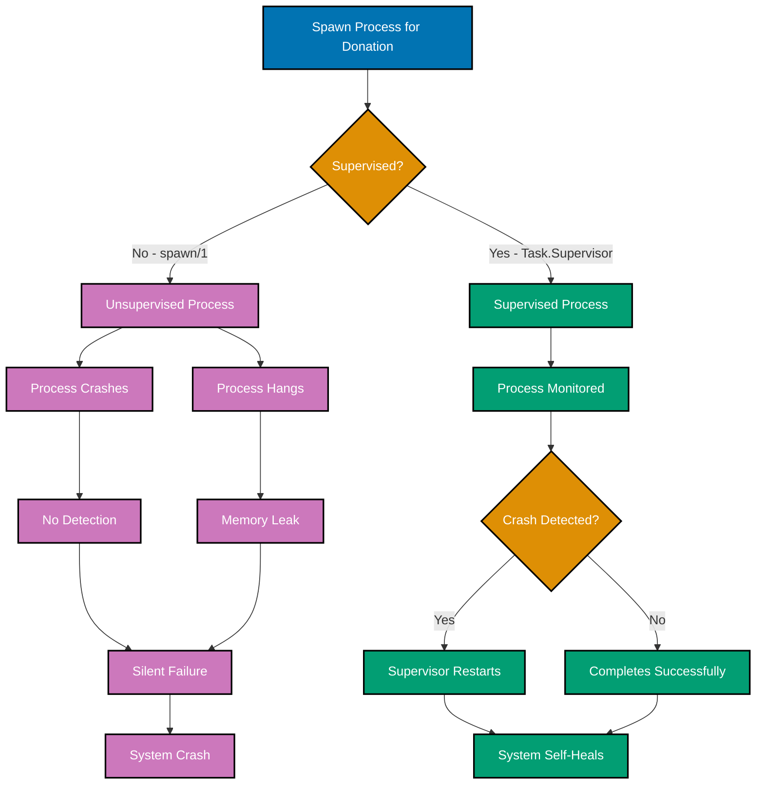
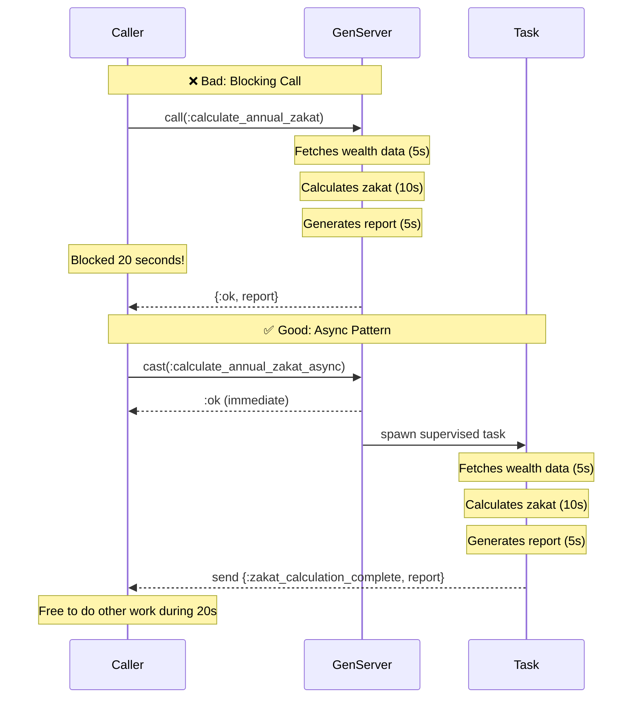
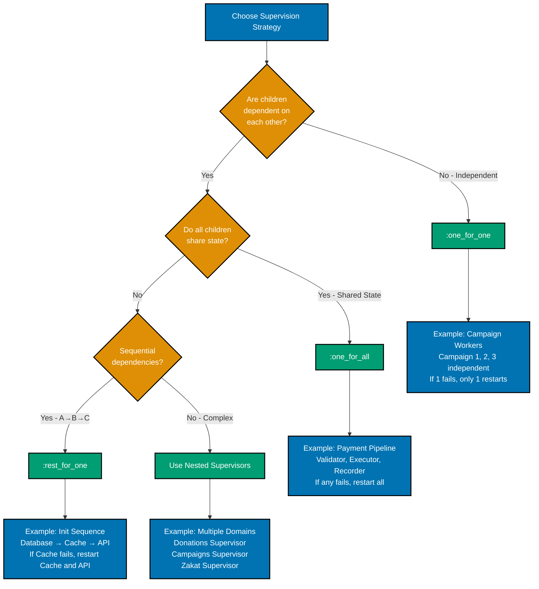
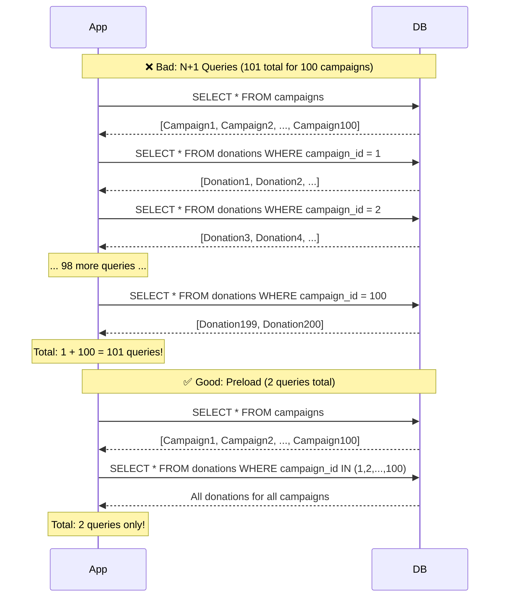
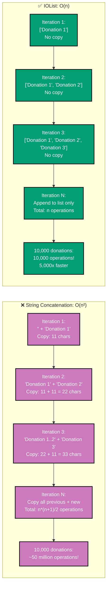

# Elixir Anti-Patterns and Common Mistakes

## Quick Reference

### Core Anti-Pattern Categories

- [Process Anti-Patterns](#process-anti-patterns) - Process leaks, blocking calls, message overflow
- [GenServer Misuse](#genserver-misuse) - Stateless GenServers, god objects, database queries
- [Supervision Errors](#supervision-errors) - No supervision, wrong strategy, restart frequency
- [Performance Pitfalls](#performance-pitfalls) - N+1 queries, unnecessary spawning, string concatenation
- [Ecto Common Mistakes](#ecto-common-mistakes) - Missing transactions, loading tables, bypassing changesets
- [Testing Anti-Patterns](#testing-anti-patterns) - Testing implementation, shared state, missing error cases

### Navigation

- [Anti-Patterns Summary](#anti-patterns-summary) - Complete checklist
- [Related Topics](#related-topics) - Best practices and OTP guides

## Overview

Anti-patterns are common solutions to recurring problems that appear beneficial but ultimately lead to negative consequences. Recognizing and avoiding these patterns is crucial for building maintainable Elixir applications.

This document covers common Elixir anti-patterns with focus on:

- **Process Management**: Avoiding process leaks and resource exhaustion
- **GenServer Patterns**: Proper use of GenServers
- **Supervision**: Common supervision mistakes
- **Performance**: Avoiding unnecessary overhead
- **Ecto**: Database interaction pitfalls
- **Testing**: Test code quality issues
- **Code Organization**: Structural problems

All examples use the financial domain context.

## Process Anti-Patterns

### Process Leaks

**Problem**: Creating processes without supervision that never terminate.

```elixir
# ❌ Bad - Process leak
defmodule FinancialDomain.Donations.BadProcessor do
  def process_donation_async(donation_id) do
    # Spawns unsupervised process
    spawn(fn ->
      donation = fetch_donation(donation_id)
      process_payment(donation)
      send_receipt(donation)
    end)

    :ok
  end

  # If process crashes, no one knows
  # If process hangs, it stays forever
  # No supervision, no recovery
end

# ✅ Good - Use Task with supervisor
defmodule FinancialDomain.Donations.Processor do
  def process_donation_async(donation_id) do
    # Task.Supervisor provides supervision
    Task.Supervisor.async_nolink(
      FinancialDomain.TaskSupervisor,
      fn ->
        donation = fetch_donation(donation_id)
        process_payment(donation)
        send_receipt(donation)
      end
    )

    :ok
  end

  # Supervised process
  # Crashes are logged
  # Resources cleaned up
end
```

**Why It's Bad**:

- Unsupervised processes can leak memory
- Crashes go unnoticed
- No monitoring or recovery
- Difficult to debug production issues

**Solution**: Always use supervised processes (Task.Supervisor, DynamicSupervisor, Registry).



### Blocking GenServer Calls

**Problem**: Synchronous GenServer calls that block for long periods.

```elixir
# ❌ Bad - Blocking call for slow operation
defmodule FinancialDomain.Zakat.BadCalculatorServer do
  use GenServer

  def calculate_annual_zakat(user_id) do
    # This blocks caller until complete
    GenServer.call(__MODULE__, {:calculate_annual, user_id}, :timer.minutes(5))
  end

  @impl true
  def handle_call({:calculate_annual, user_id}, _from, state) do
    # Slow operation blocks GenServer
    wealth_data = fetch_all_wealth_data(user_id)  # Database queries
    calculations = perform_complex_calculations(wealth_data)  # Heavy computation
    report = generate_detailed_report(calculations)  # File I/O

    {:reply, {:ok, report}, state}
  end

  # GenServer can only handle one call at a time
  # All other calls wait
end

# ✅ Good - Async processing with GenServer coordination
defmodule FinancialDomain.Zakat.CalculatorServer do
  use GenServer

  def calculate_annual_zakat_async(user_id) do
    GenServer.cast(__MODULE__, {:calculate_annual, user_id, self()})
    :ok
  end

  @impl true
  def handle_cast({:calculate_annual, user_id, caller}, state) do
    # Spawn supervised task for slow work
    Task.Supervisor.start_child(FinancialDomain.TaskSupervisor, fn ->
      wealth_data = fetch_all_wealth_data(user_id)
      calculations = perform_complex_calculations(wealth_data)
      report = generate_detailed_report(calculations)

      # Send result to caller
      send(caller, {:zakat_calculation_complete, report})

      # Optionally notify GenServer
      GenServer.cast(__MODULE__, {:calculation_complete, user_id, report})
    end)

    {:noreply, state}
  end

  @impl true
  def handle_cast({:calculation_complete, user_id, report}, state) do
    # Update state, broadcast events, etc.
    {:noreply, Map.put(state, user_id, report)}
  end
end
```

**Why It's Bad**:

- Blocks GenServer preventing it from handling other requests
- Can cause timeouts in calling processes
- Reduces system responsiveness
- Doesn't leverage BEAM's concurrency

**Solution**: Use `cast` with Task.Supervisor for slow operations, or use dedicated worker processes.



### Message Inbox Overflow

**Problem**: Sending messages faster than process can handle them.

```elixir
# ❌ Bad - No backpressure
defmodule FinancialDomain.Notifications.BadMailer do
  use GenServer

  def send_receipt(user_id, donation_id) do
    # Just cast and forget
    GenServer.cast(__MODULE__, {:send_receipt, user_id, donation_id})
  end

  @impl true
  def handle_cast({:send_receipt, user_id, donation_id}, state) do
    # Slow external API call
    ExternalMailService.send_email(...)

    {:noreply, state}
  end

  # If 1000 donations/sec but can only send 10 emails/sec,
  # inbox grows unbounded -> memory exhaustion
end

# ✅ Good - Rate limiting with backpressure
defmodule FinancialDomain.Notifications.Mailer do
  use GenServer

  def send_receipt(user_id, donation_id) do
    # Synchronous call with timeout
    # Caller waits if queue is full (backpressure)
    GenServer.call(__MODULE__, {:send_receipt, user_id, donation_id}, :timer.seconds(10))
  end

  @impl true
  def init(_opts) do
    {:ok, %{queue_size: 0, max_queue_size: 100}}
  end

  @impl true
  def handle_call({:send_receipt, user_id, donation_id}, _from, state) do
    if state.queue_size >= state.max_queue_size do
      {:reply, {:error, :queue_full}, state}
    else
      # Process in background but track queue size
      Task.Supervisor.start_child(FinancialDomain.TaskSupervisor, fn ->
        ExternalMailService.send_email(...)
        GenServer.cast(__MODULE__, :decrement_queue)
      end)

      {:reply, :ok, %{state | queue_size: state.queue_size + 1}}
    end
  end

  @impl true
  def handle_cast(:decrement_queue, state) do
    {:noreply, %{state | queue_size: max(0, state.queue_size - 1)}}
  end
end

# Even better - Use GenStage or Broadway for proper backpressure
```

**Why It's Bad**:

- Unbounded message queues lead to memory exhaustion
- No feedback to producers about system capacity
- System appears healthy until it crashes
- Difficult to recover once overwhelmed

**Solution**: Implement backpressure with call timeouts, queue size limits, or use GenStage/Broadway.

```mermaid
%% Color Palette: Blue #0173B2, Orange #DE8F05, Teal #029E73, Purple #CC78BC
%% All colors are color-blind friendly and meet WCAG AA contrast standards
graph TD
    subgraph Bad["❌ No Backpressure"]
        P1[Producer: 1000 receipts/sec] --> Q1[GenServer Mailbox]
        Q1 --> C1[Consumer: 10 emails/sec]
        Q1 --> M1[Mailbox grows unbounded]
        M1 --> OOM1[Out of Memory]
        OOM1 --> CRASH1[System Crash]
    end

    subgraph Good["✅ With Backpressure"]
        P2[Producer: 1000 receipts/sec] --> L2{Queue Full?}
        L2 -->|Yes| BP[Backpressure: Caller waits]
        L2 -->|No| Q2[GenServer Queue: Max 100]
        Q2 --> C2[Consumer: 10 emails/sec]
        BP -.->|Queue drains| L2
        C2 --> S2[Stable Memory Usage]
    end

    style P1 fill:#0173B2,stroke:#000000,color:#FFFFFF,stroke-width:2px
    style Q1 fill:#CC78BC,stroke:#000000,color:#FFFFFF,stroke-width:2px
    style C1 fill:#0173B2,stroke:#000000,color:#FFFFFF,stroke-width:2px
    style M1 fill:#CC78BC,stroke:#000000,color:#FFFFFF,stroke-width:2px
    style OOM1 fill:#CC78BC,stroke:#000000,color:#FFFFFF,stroke-width:2px
    style CRASH1 fill:#CC78BC,stroke:#000000,color:#FFFFFF,stroke-width:2px
    style P2 fill:#0173B2,stroke:#000000,color:#FFFFFF,stroke-width:2px
    style L2 fill:#DE8F05,stroke:#000000,color:#FFFFFF,stroke-width:2px
    style BP fill:#DE8F05,stroke:#000000,color:#FFFFFF,stroke-width:2px
    style Q2 fill:#029E73,stroke:#000000,color:#FFFFFF,stroke-width:2px
    style C2 fill:#0173B2,stroke:#000000,color:#FFFFFF,stroke-width:2px
    style S2 fill:#029E73,stroke:#000000,color:#FFFFFF,stroke-width:2px
```



## GenServer Misuse

### Stateless GenServer

**Problem**: Using GenServer when state isn't needed.

```elixir
# ❌ Bad - GenServer for stateless operations
defmodule FinancialDomain.Zakat.BadCalculator do
  use GenServer

  def calculate(wealth, nisab) do
    GenServer.call(__MODULE__, {:calculate, wealth, nisab})
  end

  @impl true
  def handle_call({:calculate, wealth, nisab}, _from, state) do
    result = if wealth > nisab do
      wealth * 0.025
    else
      0
    end

    {:reply, result, state}
  end

  # State is never used!
  # GenServer overhead for no benefit
  # Serializes concurrent requests unnecessarily
end

# ✅ Good - Plain module for stateless calculations
defmodule FinancialDomain.Zakat.Calculator do
  @doc """
  Calculates Zakat (2.5%) on wealth exceeding nisab.

  No state needed - pure calculation.
  Naturally concurrent - multiple processes can call simultaneously.
  """
  def calculate(wealth, nisab) when wealth > nisab do
    wealth * 0.025
  end

  def calculate(_wealth, _nisab), do: 0
end
```

**Why It's Bad**:

- Unnecessary process overhead
- Serializes concurrent requests
- Adds complexity without benefit
- Harder to test than pure functions

**Solution**: Use plain modules for stateless operations. Reserve GenServer for actual state management.

### God GenServer

**Problem**: Single GenServer handling too many responsibilities.

```elixir
# ❌ Bad - God GenServer doing everything
defmodule FinancialDomain.BadDonationServer do
  use GenServer

  @impl true
  def handle_call({:validate_donation, donation}, _from, state) do
    # Validation logic
  end

  @impl true
  def handle_call({:process_payment, donation}, _from, state) do
    # Payment processing
  end

  @impl true
  def handle_call({:send_receipt, donation}, _from, state) do
    # Email sending
  end

  @impl true
  def handle_call({:update_campaign_stats, campaign_id}, _from, state) do
    # Statistics aggregation
  end

  @impl true
  def handle_call({:check_fraud, donation}, _from, state) do
    # Fraud detection
  end

  # Single point of failure
  # Can't scale different concerns independently
  # Violates single responsibility principle
end

# ✅ Good - Separate GenServers for different concerns
defmodule FinancialDomain.Donations.ValidationServer do
  use GenServer
  # Handles only validation state (rules, cached data)
end

defmodule FinancialDomain.Donations.PaymentProcessor do
  use GenServer
  # Handles payment processing state (pending payments, retries)
end

defmodule FinancialDomain.Campaigns.StatsAggregator do
  use GenServer
  # Handles campaign statistics (counters, summaries)
end

# Each can be supervised, scaled, and deployed independently
```

**Why It's Bad**:

- Single point of failure
- Can't scale concerns independently
- Violates single responsibility principle
- Difficult to test and maintain
- State becomes complex and unwieldy

**Solution**: Split into multiple GenServers, each with a single, clear responsibility.

### Synchronous Database Calls in GenServer

**Problem**: Blocking GenServer with synchronous database queries.

```elixir
# ❌ Bad - Database queries in GenServer callbacks
defmodule FinancialDomain.Donations.BadTracker do
  use GenServer

  @impl true
  def handle_call({:get_donation_stats, campaign_id}, _from, state) do
    # Blocking database query in GenServer
    stats = Repo.one(
      from d in Donation,
      where: d.campaign_id == ^campaign_id,
      select: %{
        total: sum(d.amount),
        count: count(d.id)
      }
    )

    {:reply, stats, state}
  end

  # GenServer blocks on database
  # Other requests must wait
  # Database slowness affects entire GenServer
end

# ✅ Good - Separate database access from GenServer
defmodule FinancialDomain.Donations.Tracker do
  use GenServer

  # GenServer manages cached state
  @impl true
  def handle_call({:get_cached_stats, campaign_id}, _from, state) do
    stats = Map.get(state.stats_cache, campaign_id)
    {:reply, stats, state}
  end

  # Database queries happen outside GenServer
  @impl true
  def handle_cast({:update_cache, campaign_id, stats}, state) do
    updated_cache = Map.put(state.stats_cache, campaign_id, stats)
    {:noreply, %{state | stats_cache: updated_cache}}
  end

  # Periodic refresh in separate process
  @impl true
  def handle_info(:refresh_cache, state) do
    # Spawn task for database work
    Task.Supervisor.start_child(FinancialDomain.TaskSupervisor, fn ->
      stats = FinancialDomain.Donations.calculate_stats()
      GenServer.cast(__MODULE__, {:update_cache, :all, stats})
    end)

    schedule_refresh()
    {:noreply, state}
  end

  defp schedule_refresh do
    Process.send_after(self(), :refresh_cache, :timer.minutes(5))
  end
end
```

**Why It's Bad**:

- Database latency blocks GenServer
- Can't handle concurrent requests efficiently
- Database timeouts affect GenServer availability
- Violates separation of concerns

**Solution**: Cache data in GenServer, query database in separate processes.

## Supervision Errors

### No Supervision

**Problem**: Critical processes running without supervision.

```elixir
# ❌ Bad - No supervision
defmodule FinancialDomain.Application do
  use Application

  @impl true
  def start(_type, _args) do
    # Start process directly without supervision
    {:ok, _pid} = FinancialDomain.Zakat.RateCache.start_link([])

    # Returns non-supervisor pid
    {:ok, self()}
  end

  # If RateCache crashes, it's gone forever
  # Application continues running but broken
end

# ✅ Good - Proper supervision
defmodule FinancialDomain.Application do
  use Application

  @impl true
  def start(_type, _args) do
    children = [
      FinancialDomain.Repo,
      {Phoenix.PubSub, name: FinancialDomain.PubSub},
      FinancialDomain.Zakat.RateCache,
      FinancialDomainWeb.Endpoint
    ]

    opts = [strategy: :one_for_one, name: FinancialDomain.Supervisor]
    Supervisor.start_link(children, opts)
  end

  # If RateCache crashes, supervisor restarts it
  # System self-heals
end
```

**Why It's Bad**:

- No automatic recovery from crashes
- Orphaned processes
- Cascading failures
- Manual intervention required

**Solution**: Always use supervision for long-lived processes.

### Wrong Supervision Strategy

**Problem**: Using inappropriate supervision strategy for process relationships.

```elixir
# ❌ Bad - :one_for_all when children are independent
defmodule FinancialDomain.Campaigns.BadSupervisor do
  use Supervisor

  @impl true
  def init(_init_arg) do
    children = [
      {CampaignWorker, campaign_id: 1},
      {CampaignWorker, campaign_id: 2},
      {CampaignWorker, campaign_id: 3}
    ]

    # If campaign 1 fails, campaigns 2 and 3 are also restarted!
    # They're independent - no reason to restart them
    Supervisor.init(children, strategy: :one_for_all)
  end
end

# ✅ Good - :one_for_one for independent children
defmodule FinancialDomain.Campaigns.Supervisor do
  use Supervisor

  @impl true
  def init(_init_arg) do
    children = [
      {CampaignWorker, campaign_id: 1},
      {CampaignWorker, campaign_id: 2},
      {CampaignWorker, campaign_id: 3}
    ]

    # Each campaign is independent
    # If one crashes, only that one restarts
    Supervisor.init(children, strategy: :one_for_one)
  end
end

# ❌ Bad - :one_for_one when children ARE dependent
defmodule FinancialDomain.Payment.BadProcessor do
  use Supervisor

  @impl true
  def init(_init_arg) do
    children = [
      PaymentValidator,    # Validates payments
      PaymentExecutor,     # Executes validated payments
      PaymentRecorder      # Records executed payments in DB
    ]

    # These depend on each other!
    # If Validator crashes, Executor has invalid data
    Supervisor.init(children, strategy: :one_for_one)
  end
end

# ✅ Good - :one_for_all for dependent children
defmodule FinancialDomain.Payment.Processor do
  use Supervisor

  @impl true
  def init(_init_arg) do
    children = [
      PaymentValidator,
      PaymentExecutor,
      PaymentRecorder
    ]

    # If any crashes, restart all to ensure consistency
    Supervisor.init(children, strategy: :one_for_all)
  end
end
```

**Strategy Selection**:

- **:one_for_one**: Independent children (most common)
- **:one_for_all**: Dependent children that share state
- **:rest_for_one**: Sequential dependencies (A depends on B, B on C)



### Excessive Restart Frequency

**Problem**: Fast-failing process causing supervisor to give up.

```elixir
# ❌ Bad - Process that crashes immediately
defmodule FinancialDomain.External.BadAPIClient do
  use GenServer

  @impl true
  def init(_opts) do
    # Fails immediately if API unavailable
    case connect_to_api() do
      {:ok, conn} -> {:ok, %{conn: conn}}
      {:error, reason} -> {:stop, reason}
    end
  end

  defp connect_to_api do
    # External API is down
    {:error, :connection_refused}
  end

  # Supervisor default: 3 restarts in 5 seconds
  # This process fails instantly
  # After 3 attempts in ~0 seconds, supervisor gives up
  # Process stays dead
end

# ✅ Good - Retry with backoff
defmodule FinancialDomain.External.APIClient do
  use GenServer

  @impl true
  def init(opts) do
    # Start successfully, schedule connection attempt
    Process.send_after(self(), :connect, 0)
    {:ok, %{conn: nil, retry_count: 0, max_retries: 10}}
  end

  @impl true
  def handle_info(:connect, state) do
    case connect_to_api() do
      {:ok, conn} ->
        {:noreply, %{state | conn: conn, retry_count: 0}}

      {:error, _reason} when state.retry_count < state.max_retries ->
        # Exponential backoff
        delay = :math.pow(2, state.retry_count) * 1000
        Process.send_after(self(), :connect, round(delay))
        {:noreply, %{state | retry_count: state.retry_count + 1}}

      {:error, reason} ->
        # After max retries, stop
        {:stop, {:connection_failed, reason}, state}
    end
  end

  defp connect_to_api do
    {:error, :connection_refused}
  end
end
```

**Why It's Bad**:

- Supervisor gives up after restart intensity exceeded
- No recovery once supervisor stops trying
- Wastes resources on rapid failing

**Solution**: Use exponential backoff, delayed initialization, or circuit breakers.

## Performance Pitfalls

### N+1 Query Problem

**Problem**: Loading associations in a loop instead of preloading.

```elixir
# ❌ Bad - N+1 queries
defmodule FinancialDomain.Reports.BadGenerator do
  def generate_campaign_report do
    campaigns = Repo.all(Campaign)  # 1 query

    Enum.map(campaigns, fn campaign ->
      # N queries (one per campaign)
      donations = Repo.all(
        from d in Donation,
        where: d.campaign_id == ^campaign.id
      )

      %{
        campaign: campaign,
        donations: donations,
        total: sum_donations(donations)
      }
    end)

    # If 100 campaigns: 101 queries total!
  end
end

# ✅ Good - Single query with preload
defmodule FinancialDomain.Reports.Generator do
  def generate_campaign_report do
    # 1 or 2 queries total (depending on preload strategy)
    campaigns =
      Campaign
      |> preload(:donations)
      |> Repo.all()

    Enum.map(campaigns, fn campaign ->
      %{
        campaign: campaign,
        donations: campaign.donations,  # Already loaded
        total: sum_donations(campaign.donations)
      }
    end)
  end
end
```

**Why It's Bad**:

- Exponentially slower as data grows
- Database connection pool exhaustion
- High database load
- Poor user experience

**Solution**: Use Ecto preloads, joins, or aggregations.



### Unnecessary Process Spawning

**Problem**: Creating processes for operations that don't need concurrency.

```elixir
# ❌ Bad - Spawning for simple operations
defmodule FinancialDomain.Calculations.Bad do
  def calculate_totals(donations) do
    # Spawning task for each donation - overhead!
    tasks = Enum.map(donations, fn donation ->
      Task.async(fn ->
        calculate_fee(donation.amount)
      end)
    end)

    Task.await_many(tasks)
  end

  defp calculate_fee(amount) do
    # Simple calculation - doesn't benefit from concurrency
    amount * 0.025
  end

  # Overhead of spawning 1000 tasks >> benefit
  # Context switching, message passing, task management
end

# ✅ Good - Simple sequential processing
defmodule FinancialDomain.Calculations do
  def calculate_totals(donations) do
    # Fast sequential processing for simple calculations
    Enum.map(donations, fn donation ->
      calculate_fee(donation.amount)
    end)
  end

  defp calculate_fee(amount) do
    amount * 0.025
  end
end

# ✅ Good - Task.async_stream for I/O-bound work
defmodule FinancialDomain.Verification do
  def verify_donors(donors) do
    # Concurrent for I/O-bound operations
    donors
    |> Task.async_stream(
      &verify_with_external_api/1,
      max_concurrency: 10,
      timeout: :timer.seconds(30)
    )
    |> Enum.to_list()
  end

  defp verify_with_external_api(donor) do
    # External API call - benefits from concurrency
    ExternalAPI.verify(donor)
  end
end
```

**When to Use Concurrency**:

- I/O-bound operations (database, API calls, file access)
- Independent long-running operations
- Operations with significant compute time

**When NOT to Use Concurrency**:

- Simple calculations
- Operations that need ordered results
- When overhead exceeds benefit

### String Concatenation in Loops

**Problem**: Using `<>` for string building in loops.

```elixir
# ❌ Bad - String concatenation in reduce
defmodule FinancialDomain.Reports.BadFormatter do
  def format_donations(donations) do
    Enum.reduce(donations, "", fn donation, acc ->
      # Creates new string each iteration
      acc <> "Donation: #{donation.id}, Amount: #{donation.amount}\n"
    end)
  end

  # For 10,000 donations, creates 10,000 intermediate strings
  # Each concatenation copies previous string
  # O(n²) complexity
end

# ✅ Good - IOList for efficient string building
defmodule FinancialDomain.Reports.Formatter do
  def format_donations(donations) do
    donations
    |> Enum.map(fn donation ->
      ["Donation: ", to_string(donation.id), ", Amount: ", to_string(donation.amount), "\n"]
    end)
    |> IO.iodata_to_binary()
  end

  # OR even simpler
  def format_donations_simple(donations) do
    Enum.map_join(donations, "\n", fn donation ->
      "Donation: #{donation.id}, Amount: #{donation.amount}"
    end)
  end
end
```

**Why It's Bad**:

- Quadratic time complexity
- Excessive memory allocation
- Garbage collector pressure
- Poor performance for large datasets

**Solution**: Use IOLists, `Enum.map_join/3`, or `IO.iodata_to_binary/1`.



## Ecto Common Mistakes

### Forgetting Transactions

**Problem**: Multiple database operations without atomicity.

```elixir
# ❌ Bad - No transaction
defmodule FinancialDomain.Zakat.BadDistributor do
  def distribute_zakat(pool_id, recipients) do
    pool = Repo.get!(ZakatPool, pool_id)

    # Multiple operations - any can fail
    Enum.each(recipients, fn recipient ->
      transfer = %Transfer{
        from_pool_id: pool.id,
        to_recipient_id: recipient.id,
        amount: recipient.allocation
      }
      Repo.insert!(transfer)  # Might succeed

      updated_pool = Ecto.Changeset.change(pool,
        balance: pool.balance - recipient.allocation
      )
      Repo.update!(updated_pool)  # Might fail

      # If this fails, previous operations already committed!
      Notifications.send_to_recipient(recipient)
    end)

    # Partial distribution = inconsistent state
  end
end

# ✅ Good - Use transaction
defmodule FinancialDomain.Zakat.Distributor do
  def distribute_zakat(pool_id, recipients) do
    Repo.transaction(fn ->
      pool = Repo.get!(ZakatPool, pool_id)

      Enum.each(recipients, fn recipient ->
        transfer = %Transfer{
          from_pool_id: pool.id,
          to_recipient_id: recipient.id,
          amount: recipient.allocation
        }
        Repo.insert!(transfer)

        updated_pool = Ecto.Changeset.change(pool,
          balance: pool.balance - recipient.allocation
        )
        Repo.update!(updated_pool)
      end)

      # All or nothing - consistent state guaranteed
      :ok
    end)

    # Send notifications AFTER successful transaction
    Enum.each(recipients, &Notifications.send_to_recipient/1)
  end
end
```

**Why It's Bad**:

- Partial updates lead to inconsistent state
- No rollback on errors
- Data integrity violations
- Difficult to recover

**Solution**: Use `Repo.transaction/2` for related operations.

### Loading Entire Tables

**Problem**: Using `Repo.all` without limits or pagination.

```elixir
# ❌ Bad - Load all donations
defmodule FinancialDomain.Reports.BadAnalyzer do
  def analyze_donations do
    # Loads ALL donations into memory
    donations = Repo.all(Donation)

    # With 1 million donations = OOM crash
    Enum.map(donations, &analyze_single_donation/1)
  end
end

# ✅ Good - Stream or paginate
defmodule FinancialDomain.Reports.Analyzer do
  def analyze_donations do
    # Process in chunks
    Repo.transaction(fn ->
      Donation
      |> Repo.stream()
      |> Stream.chunk_every(1000)
      |> Enum.each(fn batch ->
        Enum.each(batch, &analyze_single_donation/1)
      end)
    end)
  end

  # OR with pagination
  def analyze_donations_paginated(page_size \\ 100) do
    analyze_page(0, page_size)
  end

  defp analyze_page(offset, page_size) do
    donations =
      Donation
      |> limit(^page_size)
      |> offset(^offset)
      |> Repo.all()

    case donations do
      [] ->
        :done

      batch ->
        Enum.each(batch, &analyze_single_donation/1)
        analyze_page(offset + page_size, page_size)
    end
  end
end
```

**Why It's Bad**:

- Out of memory errors
- Long garbage collection pauses
- Slow initial query
- Poor user experience

**Solution**: Use `Repo.stream/2`, pagination, or chunk processing.

### Bypassing Changesets

**Problem**: Direct struct updates without validation.

```elixir
# ❌ Bad - No validation
defmodule FinancialDomain.Donations.BadService do
  def create_donation(params) do
    donation = %Donation{
      amount: params["amount"],
      currency: params["currency"],
      donor_email: params["donor_email"]
    }

    Repo.insert(donation)
    # No validation!
    # Negative amounts? Invalid emails? Accepted!
  end
end

# ✅ Good - Always use changesets
defmodule FinancialDomain.Donations.Service do
  def create_donation(params) do
    %Donation{}
    |> Donation.changeset(params)
    |> Repo.insert()

    # Changeset validates:
    # - Required fields
    # - Amount > 0
    # - Valid email format
    # - Currency in allowed list
  end
end
```

**Why It's Bad**:

- Invalid data enters database
- Business rules not enforced
- Difficult to debug data issues
- Security vulnerabilities

**Solution**: Always use changesets for validation and casting.

## Testing Anti-Patterns

### Testing Implementation Details

**Problem**: Tests coupled to implementation rather than behavior.

```elixir
# ❌ Bad - Tests internal implementation
defmodule FinancialDomain.Zakat.CalculatorTest do
  test "calls calculate_internal with correct params" do
    # Testing internal function
    assert Calculator.calculate_internal(10000, 5000) == 250
  end

  test "uses Decimal.mult for calculation" do
    # Testing library usage
    wealth = Money.new(10000, :USD)
    nisab = Money.new(5000, :USD)

    # Mocking Decimal
    expect(Decimal, :mult, fn _, _ -> Decimal.new(250) end)

    Calculator.calculate(wealth, nisab)
  end
end

# ✅ Good - Tests public behavior
defmodule FinancialDomain.Zakat.CalculatorTest do
  describe "calculate/2" do
    test "calculates 2.5% zakat for wealth above nisab" do
      wealth = Money.new(10000, :USD)
      nisab = Money.new(5000, :USD)

      assert {:ok, zakat} = Calculator.calculate(wealth, nisab)
      assert Money.equal?(zakat, Money.new(250, :USD))
    end

    test "returns zero for wealth below nisab" do
      wealth = Money.new(3000, :USD)
      nisab = Money.new(5000, :USD)

      assert {:ok, zakat} = Calculator.calculate(wealth, nisab)
      assert Money.equal?(zakat, Money.new(0, :USD))
    end
  end
end
```

**Why It's Bad**:

- Tests break when implementation changes (even if behavior is correct)
- Doesn't test what users care about
- Difficult to refactor
- False confidence

**Solution**: Test public API and observable behavior.

### Shared State Between Tests

**Problem**: Tests that depend on shared mutable state.

```elixir
# ❌ Bad - Shared module attribute
defmodule FinancialDomain.Donations.BadServiceTest do
  use ExUnit.Case

  # Shared state - tests can interfere
  @shared_campaign %{id: 1, name: "Test Campaign"}

  test "creates donation" do
    donation = Service.create_donation(%{campaign_id: @shared_campaign.id})
    assert donation.campaign_id == 1
  end

  test "updates campaign stats" do
    # Modifies shared campaign
    Service.update_campaign_stats(@shared_campaign)
    # Other tests might see modified state!
  end
end

# ✅ Good - Setup with isolated state
defmodule FinancialDomain.Donations.ServiceTest do
  use ExUnit.Case, async: true  # Can run in parallel

  setup do
    # Fresh state for each test
    campaign = %{id: Enum.random(1..10000), name: "Test Campaign"}
    {:ok, campaign: campaign}
  end

  test "creates donation", %{campaign: campaign} do
    donation = Service.create_donation(%{campaign_id: campaign.id})
    assert donation.campaign_id == campaign.id
  end

  test "updates campaign stats", %{campaign: campaign} do
    Service.update_campaign_stats(campaign)
    # Isolated - doesn't affect other tests
  end
end
```

**Why It's Bad**:

- Tests interfere with each other
- Can't run in parallel
- Flaky tests
- Hard to debug failures

**Solution**: Use `setup` for test isolation, enable `async: true`.

### Not Testing Error Cases

**Problem**: Only testing happy path.

```elixir
# ❌ Bad - Only happy path
defmodule FinancialDomain.Donations.ProcessorTest do
  test "processes donation" do
    donation = %{amount: 100, currency: "USD"}
    assert {:ok, _result} = Processor.process(donation)
  end
end

# ✅ Good - Test error cases too
defmodule FinancialDomain.Donations.ProcessorTest do
  describe "process/1" do
    test "processes valid donation" do
      donation = %{amount: 100, currency: "USD", donor_email: "test@example.com"}
      assert {:ok, _result} = Processor.process(donation)
    end

    test "returns error for negative amount" do
      donation = %{amount: -100, currency: "USD", donor_email: "test@example.com"}
      assert {:error, :invalid_amount} = Processor.process(donation)
    end

    test "returns error for invalid currency" do
      donation = %{amount: 100, currency: "XYZ", donor_email: "test@example.com"}
      assert {:error, :invalid_currency} = Processor.process(donation)
    end

    test "returns error for missing email" do
      donation = %{amount: 100, currency: "USD"}
      assert {:error, :missing_email} = Processor.process(donation)
    end

    test "handles database connection failure" do
      # Test error recovery
    end
  end
end
```

**Why It's Bad**:

- Production bugs in error paths
- Poor error handling
- No confidence in edge cases
- Surprises in production

**Solution**: Test error cases, edge cases, and boundary conditions.

## Anti-Patterns Summary

### Process Management

- ❌ Unsupervised processes (use Task.Supervisor, DynamicSupervisor)
- ❌ Blocking GenServer calls (use cast + Task for slow work)
- ❌ Message inbox overflow (implement backpressure)

### GenServer Usage

- ❌ GenServer for stateless operations (use plain modules)
- ❌ God GenServer (split into focused GenServers)
- ❌ Database queries in GenServer (separate concerns)

### Supervision

- ❌ No supervision (always supervise long-lived processes)
- ❌ Wrong strategy (match strategy to dependencies)
- ❌ Fast-failing with no backoff (use exponential backoff)

### Performance

- ❌ N+1 queries (use preloads)
- ❌ Unnecessary spawning (only for I/O-bound work)
- ❌ String concatenation loops (use IOLists)

### Ecto

- ❌ No transactions (use for related operations)
- ❌ Loading entire tables (use streams or pagination)
- ❌ Bypassing changesets (always validate)

### Testing

- ❌ Testing implementation (test behavior)
- ❌ Shared state (isolate tests)
- ❌ Only happy path (test errors too)

## Related Topics

- [Best Practices](./ex-so-stla-el__best-practices.md) - What to do instead
- [OTP GenServer](./ex-so-stla-el__otp-genserver.md) - Proper GenServer patterns
- [OTP Supervisor](./ex-so-stla-el__otp-supervisor.md) - Supervision strategies
- [Performance](./ex-so-stla-el__performance.md) - Optimization techniques
- [Test-Driven Development](./ex-so-stla-el__test-driven-development.md) - Testing best practices

## Sources

- [Elixir Anti-Patterns](https://hexdocs.pm/elixir/library-guidelines.html)
- [Common Pitfalls](https://elixirforum.com/t/common-elixir-anti-patterns/12345)
- [Programming Elixir by Dave Thomas](https://pragprog.com/titles/elixir16/programming-elixir-1-6/)
- [Designing for Scalability with Erlang/OTP](https://www.oreilly.com/library/view/designing-for-scalability/9781449361556/)

---

**Last Updated**: 2026-01-23
**Elixir Version**: 1.12+ (baseline), 1.17+ (recommended), 1.18.0 (latest)
**Maintainers**: Platform Documentation Team
