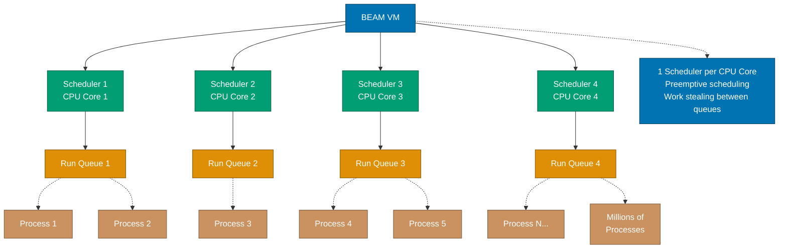
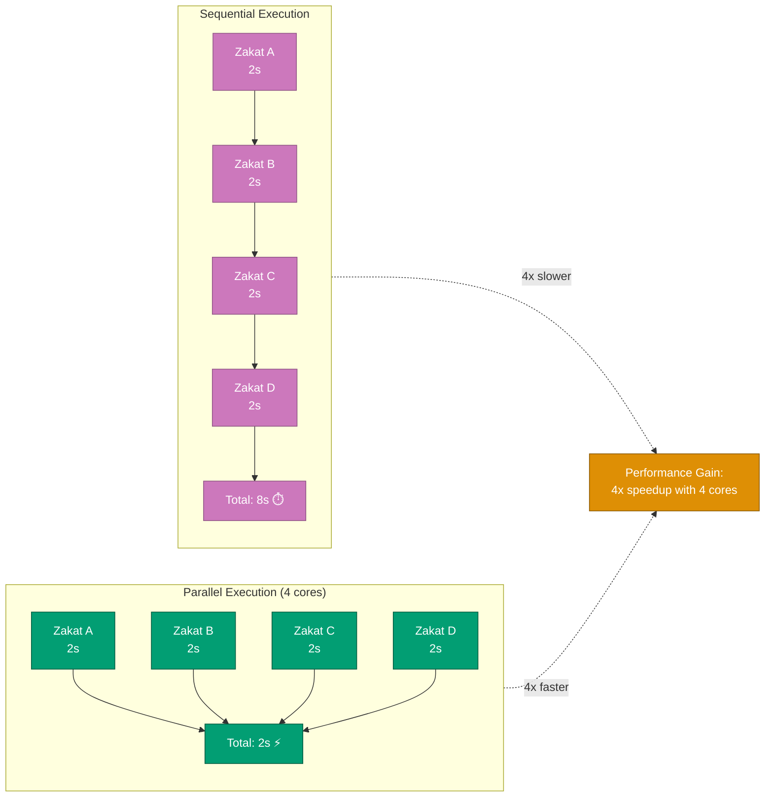

# Elixir Concurrency and Parallelism

**Quick Reference**: [Overview](#overview) | [Processes](#processes) | [Message Passing](#message-passing) | [Task Module](#task-module) | [GenServer](#genserver-for-state) | [Concurrent Patterns](#concurrent-patterns) | [Financial Examples](#financial-domain-integration)

## Overview

Concurrency and parallelism are fundamental to Elixir's design. The BEAM VM's actor model enables millions of lightweight processes running concurrently, making Elixir ideal for building highly concurrent systems.

**Key Concepts**:

- **Process**: Lightweight, isolated unit of concurrency (not OS processes)
- **Message Passing**: Communication mechanism between processes
- **Task**: High-level abstraction for concurrent work
- **GenServer**: Stateful concurrent processes
- **Concurrent Patterns**: Producer-consumer, pub-sub, worker pools

**Concurrency vs Parallelism**:

- **Concurrency**: Multiple tasks making progress (may run on single core)
- **Parallelism**: Multiple tasks executing simultaneously (requires multiple cores)

All examples use financial domain context (Zakat calculation, donation processing, transaction handling).

## Processes

Elixir follows the Actor Model for concurrency. The following diagram illustrates how processes communicate via message passing:

```mermaid
sequenceDiagram
    participant A as Process A<br/>Zakat Calculator
    participant B as Process B<br/>Donation Processor
    participant C as Process C<br/>Receipt Generator

    Note over A,C: Actor Model: Isolated processes<br/>communicate via messages

    A->>B: send({:calculate_zakat, 100_000, 85_000})
    Note over B: Receive & process message
    B->>B: Calculate zakat = 2,500
    B->>C: send({:generate_receipt, 2_500})
    Note over C: Receive & process message
    C->>C: Generate receipt PDF
    C->>A: send({:receipt_ready, "receipt.pdf"})
    Note over A: Receive result

    Note over A,C: Each process has isolated state<br/>No shared memory

    style A fill:#0173B2,stroke:#023B5A,color:#FFF
    style B fill:#029E73,stroke:#01593F,color:#FFF
    style C fill:#DE8F05,stroke:#8A5903,color:#FFF
```

### Creating Processes

Processes are created with `spawn/1`, `spawn_link/1`, or higher-level abstractions.

```elixir
defmodule FinancialDomain.Examples.BasicProcesses do
  @moduledoc """
  Basic process creation and management examples.
  """

  @doc """
  Spawns an independent process.
  """
  def spawn_calculation do
    # spawn/1 returns PID
    pid = spawn(fn ->
      result = calculate_zakat(10000, 5000)
      IO.puts("Zakat calculated: #{result}")
    end)

    IO.puts("Spawned process: #{inspect(pid)}")
    pid
  end

  @doc """
  Spawns linked process (crashes propagate).
  """
  def spawn_linked_calculation do
    # spawn_link/1 links caller and spawned process
    pid = spawn_link(fn ->
      result = calculate_zakat(10000, 5000)
      IO.puts("Zakat calculated: #{result}")
    end)

    # If spawned process crashes, this process crashes too
    pid
  end

  @doc """
  Spawns monitored process (notifies on exit).
  """
  def spawn_monitored_calculation do
    # spawn_monitor/1 sets up monitoring
    {pid, ref} = spawn_monitor(fn ->
      result = calculate_zakat(10000, 5000)
      IO.puts("Zakat calculated: #{result}")
    end)

    # Receive exit notification
    receive do
      {:DOWN, ^ref, :process, ^pid, reason} ->
        IO.puts("Process exited: #{inspect(reason)}")
    after
      5000 ->
        IO.puts("Timeout waiting for process")
    end
  end

  defp calculate_zakat(wealth, nisab) when wealth > nisab do
    wealth * 0.025
  end

  defp calculate_zakat(_, _), do: 0
end
```

The following diagram compares different process spawning patterns:

```mermaid
graph TD
    subgraph spawn["spawn/1 - Independent Process"]
        P1[Parent Process]
        C1[Child Process]
        P1 -.->|spawns| C1
        Note1[Child crash doesn't<br/>affect parent ✅]
        C1 -.-> Note1
    end

    subgraph spawn_link["spawn_link/1 - Linked Process"]
        P2[Parent Process]
        C2[Child Process]
        P2 ===|bidirectional link| C2
        Note2[Either crash<br/>affects both ❌]
        C2 -.-> Note2
    end

    subgraph spawn_monitor["spawn_monitor/1 - Monitored Process"]
        P3[Parent Process]
        C3[Child Process]
        P3 -.->|monitors| C3
        C3 -.->|DOWN message on exit| P3
        Note3[Parent receives<br/>notification ℹ️]
        C3 -.-> Note3
    end

    style P1 fill:#029E73,stroke:#01593F,color:#FFF
    style C1 fill:#0173B2,stroke:#023B5A,color:#FFF
    style P2 fill:#029E73,stroke:#01593F,color:#FFF
    style C2 fill:#CC78BC,stroke:#8E5484,color:#FFF
    style P3 fill:#029E73,stroke:#01593F,color:#FFF
    style C3 fill:#0173B2,stroke:#023B5A,color:#FFF
    style Note1 fill:#029E73,stroke:#01593F,color:#FFF
    style Note2 fill:#CC78BC,stroke:#8E5484,color:#FFF
    style Note3 fill:#DE8F05,stroke:#8A5903,color:#FFF
```



The following diagram shows the BEAM scheduler architecture that enables millions of concurrent processes:



### Process Lifecycle

```elixir
defmodule FinancialDomain.Donations.AsyncProcessor do
  @moduledoc """
  Demonstrates process lifecycle and cleanup.
  """

  @doc """
  Processes donation in separate process with cleanup.
  """
  def process_async(donation_id) do
    parent = self()

    spawn_link(fn ->
      try do
        # Setup
        donation = fetch_donation(donation_id)
        payment_gateway = connect_to_gateway()

        # Process
        result = process_payment(donation, payment_gateway)

        # Send result back
        send(parent, {:donation_processed, donation_id, result})
      rescue
        error ->
          send(parent, {:donation_error, donation_id, error})
      after
        # Cleanup happens regardless of success/failure
        disconnect_from_gateway()
        release_resources()
      end
    end)
  end

  defp fetch_donation(_id), do: %{amount: 100, currency: "USD"}
  defp connect_to_gateway, do: :gateway_connection
  defp process_payment(_donation, _gateway), do: {:ok, "receipt_123"}
  defp disconnect_from_gateway, do: :ok
  defp release_resources, do: :ok
end
```

### Process Information

```elixir
defmodule FinancialDomain.Monitoring.ProcessInspector do
  @moduledoc """
  Inspects running processes for monitoring and debugging.
  """

  @doc """
  Gets information about current process.
  """
  def inspect_self do
    %{
      pid: self(),
      registered_name: Process.info(self(), :registered_name),
      message_queue_len: Process.info(self(), :message_queue_len),
      memory: Process.info(self(), :memory),
      heap_size: Process.info(self(), :heap_size),
      stack_size: Process.info(self(), :stack_size),
      reductions: Process.info(self(), :reductions),
      current_function: Process.info(self(), :current_function),
      links: Process.info(self(), :links),
      monitors: Process.info(self(), :monitors)
    }
  end

  @doc """
  Lists all processes with memory usage.
  """
  def list_processes_by_memory do
    Process.list()
    |> Enum.map(fn pid ->
      {:memory, memory} = Process.info(pid, :memory)
      {pid, memory}
    end)
    |> Enum.sort_by(fn {_pid, memory} -> memory end, :desc)
    |> Enum.take(10)
  end

  @doc """
  Finds processes by registered name pattern.
  """
  def find_donation_workers do
    Process.registered()
    |> Enum.filter(fn name ->
      name
      |> Atom.to_string()
      |> String.contains?("DonationWorker")
    end)
    |> Enum.map(fn name ->
      pid = Process.whereis(name)
      info = Process.info(pid)
      {name, pid, info}
    end)
  end
end
```

## Message Passing

The following diagram illustrates common message passing patterns in Elixir:

```mermaid
graph TD
    subgraph RequestReply["Request-Reply Pattern"]
        Client1[Client]
        Server1[Server]
        Client1 -->|1. send request| Server1
        Server1 -->|2. send reply| Client1
    end

    subgraph PubSub["Publish-Subscribe Pattern"]
        Publisher[Publisher]
        Broker[PubSub Broker]
        Sub1[Subscriber 1]
        Sub2[Subscriber 2]
        Sub3[Subscriber 3]
        Publisher -->|publish event| Broker
        Broker -.->|broadcast| Sub1
        Broker -.->|broadcast| Sub2
        Broker -.->|broadcast| Sub3
    end

    subgraph ProducerConsumer["Producer-Consumer Pattern"]
        Producer[Producer]
        Queue[Work Queue]
        Cons1[Consumer 1]
        Cons2[Consumer 2]
        Producer -->|enqueue work| Queue
        Queue -.->|dequeue| Cons1
        Queue -.->|dequeue| Cons2
    end

    subgraph WorkerPool["Worker Pool Pattern"]
        Dispatcher[Dispatcher]
        W1[Worker 1]
        W2[Worker 2]
        W3[Worker 3]
        W4[Worker N...]
        Dispatcher -.->|assign task| W1
        Dispatcher -.->|assign task| W2
        Dispatcher -.->|assign task| W3
        Dispatcher -.->|assign task| W4
    end

    style Client1 fill:#0173B2,stroke:#023B5A,color:#FFF
    style Server1 fill:#029E73,stroke:#01593F,color:#FFF
    style Publisher fill:#0173B2,stroke:#023B5A,color:#FFF
    style Broker fill:#DE8F05,stroke:#8A5903,color:#FFF
    style Sub1 fill:#029E73,stroke:#01593F,color:#FFF
    style Sub2 fill:#029E73,stroke:#01593F,color:#FFF
    style Sub3 fill:#029E73,stroke:#01593F,color:#FFF
    style Producer fill:#0173B2,stroke:#023B5A,color:#FFF
    style Queue fill:#DE8F05,stroke:#8A5903,color:#FFF
    style Cons1 fill:#029E73,stroke:#01593F,color:#FFF
    style Cons2 fill:#029E73,stroke:#01593F,color:#FFF
    style Dispatcher fill:#0173B2,stroke:#023B5A,color:#FFF
    style W1 fill:#029E73,stroke:#01593F,color:#FFF
    style W2 fill:#029E73,stroke:#01593F,color:#FFF
    style W3 fill:#029E73,stroke:#01593F,color:#FFF
    style W4 fill:#029E73,stroke:#01593F,color:#FFF
```



### Basic Message Passing

```elixir
defmodule FinancialDomain.Messaging.Basic do
  @moduledoc """
  Basic message passing patterns.
  """

  @doc """
  Simple send and receive.
  """
  def calculate_and_notify(wealth, nisab) do
    parent = self()

    spawn(fn ->
      result = calculate_zakat(wealth, nisab)
      send(parent, {:zakat_result, result})
    end)

    receive do
      {:zakat_result, amount} ->
        {:ok, amount}
    after
      5000 ->
        {:error, :timeout}
    end
  end

  @doc """
  Multiple message handling.
  """
  def process_messages do
    receive do
      {:donation, amount} ->
        handle_donation(amount)
        process_messages()  # Recurse to handle next message

      {:zakat, wealth, nisab} ->
        handle_zakat(wealth, nisab)
        process_messages()

      {:stop} ->
        :ok  # Stop recursion

      unknown ->
        IO.puts("Unknown message: #{inspect(unknown)}")
        process_messages()
    end
  end

  @doc """
  Selective receive with pattern matching.
  """
  def wait_for_specific_donation(expected_id) do
    receive do
      {:donation, ^expected_id, amount} ->
        # Only matches donations with expected_id
        {:ok, amount}

      {:donation, other_id, _amount} ->
        # Ignore donations with different IDs
        IO.puts("Ignoring donation #{other_id}")
        wait_for_specific_donation(expected_id)
    after
      10_000 ->
        {:error, :timeout}
    end
  end

  defp calculate_zakat(wealth, nisab) when wealth > nisab, do: wealth * 0.025
  defp calculate_zakat(_, _), do: 0

  defp handle_donation(amount), do: IO.puts("Handling donation: #{amount}")
  defp handle_zakat(wealth, nisab), do: IO.puts("Handling zakat: #{calculate_zakat(wealth, nisab)}")
end
```

### Request-Reply Pattern

```elixir
defmodule FinancialDomain.ZakatServer do
  @moduledoc """
  Server process implementing request-reply pattern.
  """

  @doc """
  Starts the server.
  """
  def start_link do
    pid = spawn_link(__MODULE__, :loop, [%{requests: 0}])
    Process.register(pid, __MODULE__)
    {:ok, pid}
  end

  @doc """
  Calculates Zakat (synchronous call).
  """
  def calculate(wealth, nisab) do
    send(__MODULE__, {:calculate, self(), wealth, nisab})

    receive do
      {:zakat_result, result} ->
        result
    after
      5000 ->
        {:error, :timeout}
    end
  end

  @doc """
  Gets server statistics.
  """
  def get_stats do
    send(__MODULE__, {:get_stats, self()})

    receive do
      {:stats, stats} ->
        stats
    after
      5000 ->
        {:error, :timeout}
    end
  end

  @doc """
  Server loop (runs in server process).
  """
  def loop(state) do
    receive do
      {:calculate, from, wealth, nisab} ->
        result = if wealth > nisab do
          {:ok, wealth * 0.025}
        else
          {:ok, 0}
        end

        send(from, {:zakat_result, result})
        loop(%{state | requests: state.requests + 1})

      {:get_stats, from} ->
        send(from, {:stats, state})
        loop(state)

      {:stop} ->
        :ok  # Exit loop

      _ ->
        loop(state)
    end
  end
end
```

### Pub-Sub Pattern

```elixir
defmodule FinancialDomain.Notifications.PubSub do
  @moduledoc """
  Simple pub-sub implementation with processes.
  """

  @doc """
  Starts the pub-sub broker.
  """
  def start_link do
    pid = spawn_link(__MODULE__, :broker_loop, [%{subscribers: []}])
    Process.register(pid, __MODULE__)
    {:ok, pid}
  end

  @doc """
  Subscribes to donation notifications.
  """
  def subscribe do
    send(__MODULE__, {:subscribe, self()})
    :ok
  end

  @doc """
  Publishes donation event.
  """
  def publish_donation(donation) do
    send(__MODULE__, {:publish, :donation_created, donation})
    :ok
  end

  @doc """
  Broker loop managing subscriptions and publications.
  """
  def broker_loop(state) do
    receive do
      {:subscribe, pid} ->
        # Monitor subscriber to remove on crash
        Process.monitor(pid)
        broker_loop(%{state | subscribers: [pid | state.subscribers]})

      {:publish, event, data} ->
        # Broadcast to all subscribers
        Enum.each(state.subscribers, fn pid ->
          send(pid, {event, data})
        end)
        broker_loop(state)

      {:DOWN, _ref, :process, pid, _reason} ->
        # Remove crashed subscriber
        updated_subscribers = List.delete(state.subscribers, pid)
        broker_loop(%{state | subscribers: updated_subscribers})
    end
  end
end

# Usage example
defmodule FinancialDomain.Notifications.Listener do
  def start_listening do
    FinancialDomain.Notifications.PubSub.subscribe()
    listen_loop()
  end

  defp listen_loop do
    receive do
      {:donation_created, donation} ->
        IO.puts("New donation: #{inspect(donation)}")
        listen_loop()

      other ->
        IO.puts("Other message: #{inspect(other)}")
        listen_loop()
    end
  end
end
```

## Task Module

The following diagram shows how Task.async enables concurrent execution for Zakat calculations:

```mermaid
sequenceDiagram
    participant Main as Main Process
    participant T1 as Task 1<br/>Calculate Zakat A
    participant T2 as Task 2<br/>Calculate Zakat B
    participant T3 as Task 3<br/>Calculate Zakat C
    participant T4 as Task 4<br/>Calculate Zakat D

    Note over Main: Start all tasks concurrently
    Main->>T1: Task.async(fn -> calculate_zakat_a() end)
    Main->>T2: Task.async(fn -> calculate_zakat_b() end)
    Main->>T3: Task.async(fn -> calculate_zakat_c() end)
    Main->>T4: Task.async(fn -> calculate_zakat_d() end)

    Note over T1,T4: All tasks execute in parallel

    par Execute Concurrently
        T1->>T1: Calculate<br/>(2s)
    and
        T2->>T2: Calculate<br/>(2s)
    and
        T3->>T3: Calculate<br/>(2s)
    and
        T4->>T4: Calculate<br/>(2s)
    end

    T1-->>Main: Task.await() → result_a
    T2-->>Main: Task.await() → result_b
    T3-->>Main: Task.await() → result_c
    T4-->>Main: Task.await() → result_d

    Note over Main: Total time: ~2s<br/>(vs 8s sequential)

    style Main fill:#0173B2,stroke:#023B5A,color:#FFF
    style T1 fill:#029E73,stroke:#01593F,color:#FFF
    style T2 fill:#029E73,stroke:#01593F,color:#FFF
    style T3 fill:#029E73,stroke:#01593F,color:#FFF
    style T4 fill:#029E73,stroke:#01593F,color:#FFF
```

The following diagram compares parallel vs sequential execution performance:



### One-off Async Work

```elixir
defmodule FinancialDomain.Reports.AsyncGenerator do
  @moduledoc """
  Generates reports asynchronously using Task.
  """

  @doc """
  Generates multiple reports concurrently.
  """
  def generate_all_reports(year, month) do
    # Start all tasks concurrently
    zakat_task = Task.async(fn -> generate_zakat_report(year, month) end)
    donation_task = Task.async(fn -> generate_donation_report(year, month) end)
    campaign_task = Task.async(fn -> generate_campaign_report(year, month) end)
    summary_task = Task.async(fn -> generate_summary_report(year, month) end)

    # Wait for all results
    zakat_report = Task.await(zakat_task, :timer.minutes(5))
    donation_report = Task.await(donation_task, :timer.minutes(5))
    campaign_report = Task.await(campaign_task, :timer.minutes(5))
    summary_report = Task.await(summary_task, :timer.minutes(5))

    # Combine results
    %{
      zakat: zakat_report,
      donations: donation_report,
      campaigns: campaign_report,
      summary: summary_report
    }
  end

  @doc """
  Alternative: await multiple tasks at once.
  """
  def generate_all_reports_v2(year, month) do
    tasks = [
      Task.async(fn -> generate_zakat_report(year, month) end),
      Task.async(fn -> generate_donation_report(year, month) end),
      Task.async(fn -> generate_campaign_report(year, month) end),
      Task.async(fn -> generate_summary_report(year, month) end)
    ]

    # Wait for all tasks with single call
    [zakat, donations, campaigns, summary] = Task.await_many(tasks, :timer.minutes(5))

    %{
      zakat: zakat,
      donations: donations,
      campaigns: campaigns,
      summary: summary
    }
  end

  defp generate_zakat_report(_year, _month), do: %{type: :zakat, total: 50000}
  defp generate_donation_report(_year, _month), do: %{type: :donation, total: 100000}
  defp generate_campaign_report(_year, _month), do: %{type: :campaign, count: 25}
  defp generate_summary_report(_year, _month), do: %{type: :summary, revenue: 150000}
end
```

### Task.async_stream

```elixir
defmodule FinancialDomain.Verification.BatchProcessor do
  @moduledoc """
  Processes batches of items concurrently with controlled concurrency.
  """

  @doc """
  Verifies multiple donations concurrently with limited concurrency.
  """
  def verify_donations(donations) do
    donations
    |> Task.async_stream(
      &verify_single_donation/1,
      max_concurrency: 10,          # Max 10 concurrent verifications
      timeout: :timer.seconds(30),   # 30s timeout per donation
      on_timeout: :kill_task         # Kill slow tasks
    )
    |> Enum.map(fn
      {:ok, result} -> result
      {:exit, reason} -> {:error, reason}
    end)
  end

  @doc """
  Processes transactions with ordered results.
  """
  def process_transactions(transactions) do
    results =
      transactions
      |> Task.async_stream(
        &process_transaction/1,
        max_concurrency: 5,
        ordered: true  # Maintain input order
      )
      |> Enum.to_list()

    # Results in same order as input
    results
  end

  @doc """
  External API calls with retry logic.
  """
  def fetch_exchange_rates(currencies) do
    currencies
    |> Task.async_stream(
      &fetch_rate_with_retry/1,
      max_concurrency: 3,
      timeout: :timer.seconds(10)
    )
    |> Enum.reduce(%{}, fn
      {:ok, {currency, rate}}, acc ->
        Map.put(acc, currency, rate)

      {:exit, _reason}, acc ->
        acc  # Skip failed fetches
    end)
  end

  defp verify_single_donation(donation) do
    # Simulate external verification
    :timer.sleep(100)

    if donation.amount > 0 do
      {:ok, donation}
    else
      {:error, :invalid_amount}
    end
  end

  defp process_transaction(transaction) do
    # Simulate processing
    :timer.sleep(50)
    {:processed, transaction.id}
  end

  defp fetch_rate_with_retry(currency, attempts \\ 3) do
    case fetch_exchange_rate(currency) do
      {:ok, rate} ->
        {currency, rate}

      {:error, _reason} when attempts > 1 ->
        :timer.sleep(1000)
        fetch_rate_with_retry(currency, attempts - 1)

      {:error, reason} ->
        {:error, {currency, reason}}
    end
  end

  defp fetch_exchange_rate(currency) do
    # Simulate API call
    {:ok, :rand.uniform() * 1.5}
  end
end
```

### Task.Supervisor

```elixir
defmodule FinancialDomain.Workers.TaskManager do
  @moduledoc """
  Manages supervised tasks for donation processing.
  """

  @doc """
  Starts a supervised task.
  """
  def process_donation_supervised(donation_id) do
    Task.Supervisor.async_nolink(
      FinancialDomain.TaskSupervisor,
      fn -> process_donation(donation_id) end
    )
  end

  @doc """
  Starts multiple supervised tasks.
  """
  def process_donations_batch(donation_ids) do
    tasks =
      Enum.map(donation_ids, fn id ->
        Task.Supervisor.async_nolink(
          FinancialDomain.TaskSupervisor,
          fn -> process_donation(id) end
        )
      end)

    # Collect results with timeout
    tasks
    |> Task.yield_many(:timer.seconds(30))
    |> Enum.map(fn {task, result} ->
      case result do
        {:ok, value} ->
          value

        nil ->
          # Task didn't complete in time
          Task.shutdown(task, :brutal_kill)
          {:error, :timeout}
      end
    end)
  end

  @doc """
  Fire-and-forget supervised tasks.
  """
  def send_receipts_async(donation_ids) do
    Enum.each(donation_ids, fn id ->
      Task.Supervisor.start_child(
        FinancialDomain.TaskSupervisor,
        fn -> send_receipt(id) end
      )
    end)

    :ok
  end

  defp process_donation(id) do
    # Simulate processing
    :timer.sleep(1000)
    {:ok, id}
  end

  defp send_receipt(id) do
    # Simulate sending email
    :timer.sleep(500)
    {:ok, id}
  end
end
```

## GenServer for State

### Stateful Concurrent Process

```elixir
defmodule FinancialDomain.Campaigns.StatsAggregator do
  @moduledoc """
  Aggregates campaign statistics concurrently.
  """
  use GenServer

  # Client API

  def start_link(_opts) do
    GenServer.start_link(__MODULE__, :ok, name: __MODULE__)
  end

  @doc """
  Records a donation (async).
  """
  def record_donation(campaign_id, amount) do
    GenServer.cast(__MODULE__, {:donation, campaign_id, amount})
  end

  @doc """
  Gets current stats (sync).
  """
  def get_stats(campaign_id) do
    GenServer.call(__MODULE__, {:get_stats, campaign_id})
  end

  @doc """
  Gets all stats (sync).
  """
  def get_all_stats do
    GenServer.call(__MODULE__, :get_all_stats)
  end

  # Server Callbacks

  @impl true
  def init(:ok) do
    {:ok, %{}}
  end

  @impl true
  def handle_cast({:donation, campaign_id, amount}, state) do
    updated_stats = Map.update(
      state,
      campaign_id,
      %{count: 1, total: amount},
      fn stats ->
        %{
          count: stats.count + 1,
          total: stats.total + amount
        }
      end
    )

    {:noreply, updated_stats}
  end

  @impl true
  def handle_call({:get_stats, campaign_id}, _from, state) do
    stats = Map.get(state, campaign_id, %{count: 0, total: 0})
    {:reply, stats, state}
  end

  @impl true
  def handle_call(:get_all_stats, _from, state) do
    {:reply, state, state}
  end
end
```

## Concurrent Patterns

### Producer-Consumer

```elixir
defmodule FinancialDomain.Processing.ProducerConsumer do
  @moduledoc """
  Producer-consumer pattern for donation processing.
  """

  @doc """
  Producer: generates work items.
  """
  def producer(consumer_pid, donation_ids) do
    Enum.each(donation_ids, fn id ->
      send(consumer_pid, {:process, id})
      :timer.sleep(10)  # Simulate rate limiting
    end)

    send(consumer_pid, :done)
  end

  @doc """
  Consumer: processes work items.
  """
  def consumer do
    consumer_loop(0)
  end

  defp consumer_loop(processed_count) do
    receive do
      {:process, id} ->
        process_donation(id)
        consumer_loop(processed_count + 1)

      :done ->
        IO.puts("Processed #{processed_count} donations")
        :ok
    end
  end

  @doc """
  Usage: start producer and consumer.
  """
  def start(donation_ids) do
    consumer_pid = spawn(__MODULE__, :consumer, [])
    producer_pid = spawn(__MODULE__, :producer, [consumer_pid, donation_ids])

    {producer_pid, consumer_pid}
  end

  defp process_donation(id) do
    :timer.sleep(100)
    IO.puts("Processed donation #{id}")
  end
end
```

### Worker Pool

```elixir
defmodule FinancialDomain.Processing.WorkerPool do
  @moduledoc """
  Simple worker pool for concurrent processing.
  """

  @doc """
  Processes items using a pool of workers.
  """
  def process_with_pool(items, pool_size \\ 5) do
    # Start workers
    workers = Enum.map(1..pool_size, fn _ ->
      spawn_link(fn -> worker_loop() end)
    end)

    # Distribute work
    items
    |> Enum.with_index()
    |> Enum.each(fn {item, index} ->
      worker = Enum.at(workers, rem(index, pool_size))
      send(worker, {:process, self(), item})
    end)

    # Collect results
    Enum.map(items, fn _ ->
      receive do
        {:result, result} -> result
      after
        :timer.seconds(30) -> {:error, :timeout}
      end
    end)
  end

  defp worker_loop do
    receive do
      {:process, from, item} ->
        result = process_item(item)
        send(from, {:result, result})
        worker_loop()
    end
  end

  defp process_item(item) do
    :timer.sleep(100)
    {:processed, item}
  end
end
```

## Financial Domain Integration

### Concurrent Zakat Distribution

```elixir
defmodule FinancialDomain.Zakat.ConcurrentDistributor do
  @moduledoc """
  Distributes Zakat to multiple recipients concurrently.
  """

  @doc """
  Distributes Zakat to all recipients in parallel.
  """
  def distribute(pool_amount, recipients) do
    # Calculate allocations
    allocations = calculate_allocations(pool_amount, recipients)

    # Process transfers concurrently
    results =
      allocations
      |> Task.async_stream(
        fn {recipient, amount} ->
          transfer_zakat(recipient, amount)
        end,
        max_concurrency: 10,
        timeout: :timer.seconds(30)
      )
      |> Enum.to_list()

    # Aggregate results
    successful = Enum.count(results, &match?({:ok, {:ok, _}}, &1))
    failed = Enum.count(results, &match?({:ok, {:error, _}}, &1))

    %{
      total_recipients: length(recipients),
      successful: successful,
      failed: failed,
      results: results
    }
  end

  defp calculate_allocations(pool_amount, recipients) do
    per_recipient = div(pool_amount, length(recipients))

    Enum.map(recipients, fn recipient ->
      {recipient, per_recipient}
    end)
  end

  defp transfer_zakat(recipient, amount) do
    # Simulate transfer
    :timer.sleep(100)
    {:ok, %{recipient: recipient, amount: amount, status: :transferred}}
  end
end
```

### Real-time Donation Processing

```elixir
defmodule FinancialDomain.Donations.RealtimeProcessor do
  @moduledoc """
  Processes donations in real-time with concurrent validation and payment.
  """
  use GenServer

  # Client API

  def start_link(_opts) do
    GenServer.start_link(__MODULE__, :ok, name: __MODULE__)
  end

  def process_donation(donation) do
    GenServer.call(__MODULE__, {:process, donation}, :timer.seconds(30))
  end

  # Server Callbacks

  @impl true
  def init(:ok) do
    {:ok, %{processing: %{}}}
  end

  @impl true
  def handle_call({:process, donation}, from, state) do
    # Start concurrent validation and processing
    task = Task.Supervisor.async_nolink(FinancialDomain.TaskSupervisor, fn ->
      # Run validations concurrently
      validation_tasks = [
        Task.async(fn -> validate_amount(donation) end),
        Task.async(fn -> validate_campaign(donation) end),
        Task.async(fn -> check_fraud(donation) end),
        Task.async(fn -> verify_donor(donation) end)
      ]

      # Wait for all validations
      validation_results = Task.await_many(validation_tasks)

      # Check if all validations passed
      if Enum.all?(validation_results, &match?({:ok, _}, &1)) do
        # Process payment
        process_payment(donation)
      else
        {:error, :validation_failed}
      end
    end)

    # Track processing task
    ref = Process.monitor(task.pid)
    updated_state = put_in(state.processing[ref], {task, from})

    {:noreply, updated_state}
  end

  @impl true
  def handle_info({:DOWN, ref, :process, _pid, _reason}, state) do
    case Map.get(state.processing, ref) do
      {task, from} ->
        result = Task.await(task, 0)
        GenServer.reply(from, result)
        {:noreply, %{state | processing: Map.delete(state.processing, ref)}}

      nil ->
        {:noreply, state}
    end
  end

  @impl true
  def handle_info({ref, result}, state) when is_reference(ref) do
    # Task completed successfully
    Process.demonitor(ref, [:flush])
    {:noreply, state}
  end

  # Private Functions

  defp validate_amount(%{amount: amount}) when amount > 0, do: {:ok, :valid}
  defp validate_amount(_), do: {:error, :invalid_amount}

  defp validate_campaign(_donation) do
    :timer.sleep(50)
    {:ok, :valid}
  end

  defp check_fraud(_donation) do
    :timer.sleep(100)
    {:ok, :not_fraud}
  end

  defp verify_donor(_donation) do
    :timer.sleep(75)
    {:ok, :verified}
  end

  defp process_payment(_donation) do
    :timer.sleep(200)
    {:ok, %{status: :completed, receipt_id: "REC123"}}
  end
end
```

## Best Practices

- **Use Supervised Processes**: Always supervise long-lived processes
- **Avoid Shared State**: Use message passing, not shared memory
- **Handle Timeouts**: Always specify timeouts for async operations
- **Control Concurrency**: Use `max_concurrency` to prevent resource exhaustion
- **Monitor Process Health**: Use Process.monitor for critical processes
- **Choose Right Tool**: Task for one-off work, GenServer for state
- **Test Concurrency**: Write tests for concurrent behavior
- **Profile Performance**: Use :observer to identify bottlenecks

## Common Mistakes

- ❌ Creating processes without supervision
- ❌ Blocking GenServer with slow operations
- ❌ No timeout on `receive` or `Task.await`
- ❌ Using processes for everything (overhead!)
- ❌ Ignoring process mailbox size
- ❌ Not handling process crashes
- ❌ Shared mutable state between processes
- ❌ No backpressure in producer-consumer

## Related Topics

- [Error Handling](./ex-so-stla-el__error-handling.md) - "Let it crash" philosophy
- [OTP GenServer](./ex-so-stla-el__otp-genserver.md) - Stateful concurrent processes
- [OTP Supervisor](./ex-so-stla-el__otp-supervisor.md) - Process supervision
- [Anti-Patterns](./ex-so-stla-el__anti-patterns.md) - Common concurrency mistakes
- [Performance](./ex-so-stla-el__performance.md) - Optimizing concurrent systems

## Sources

- [Elixir Getting Started - Processes](https://elixir-lang.org/getting-started/processes.html)
- [Task Module Documentation](https://hexdocs.pm/elixir/Task.html)
- [Concurrent Data Processing in Elixir](https://pragprog.com/titles/sgdpelixir/concurrent-data-processing-in-elixir/)
- [The Little Elixir & OTP Guidebook](https://www.manning.com/books/the-little-elixir-and-otp-guidebook)

---

**Last Updated**: 2026-01-23
**Elixir Version**: 1.12+ (baseline), 1.17+ (recommended), 1.19.0 (latest)
**Maintainers**: Platform Documentation Team
