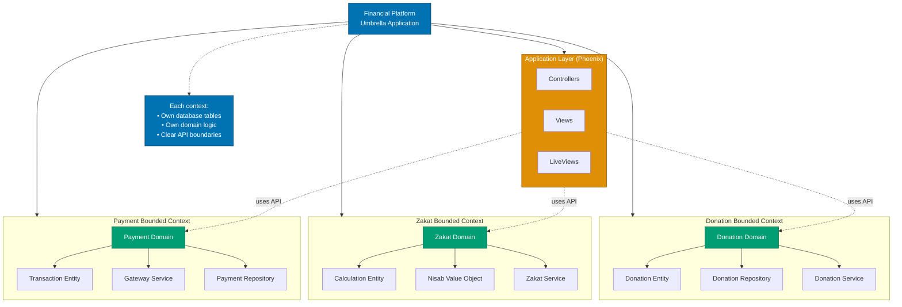
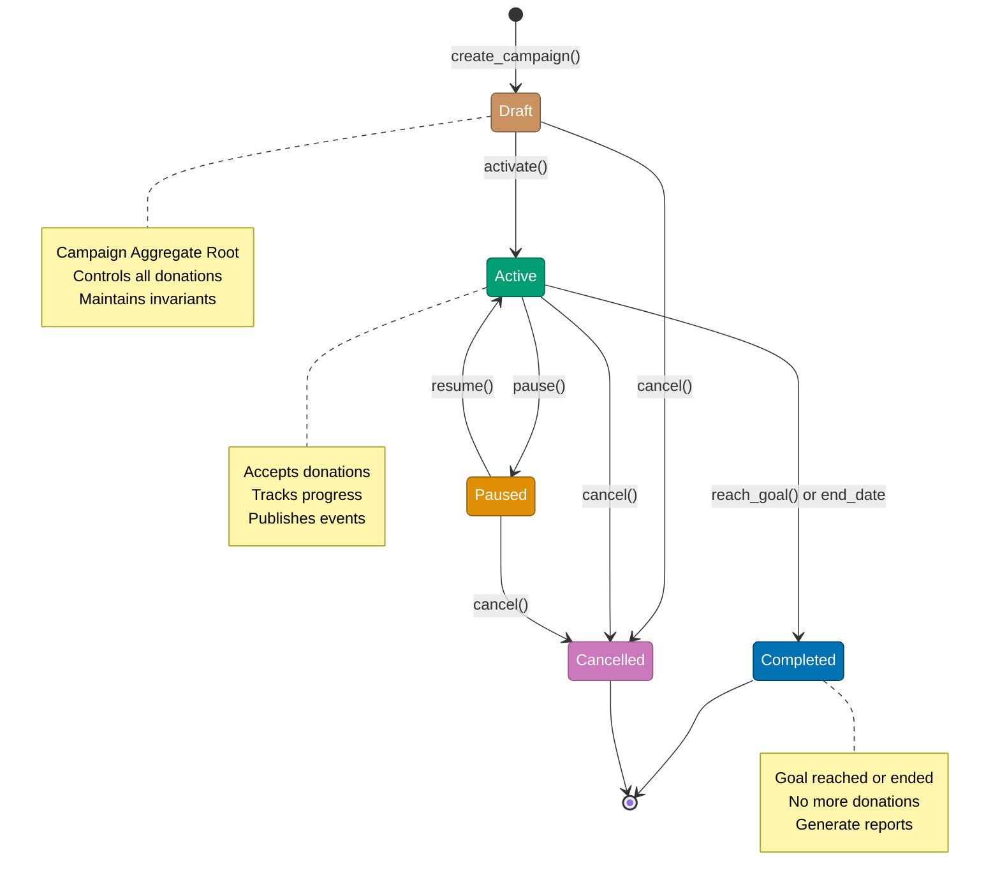
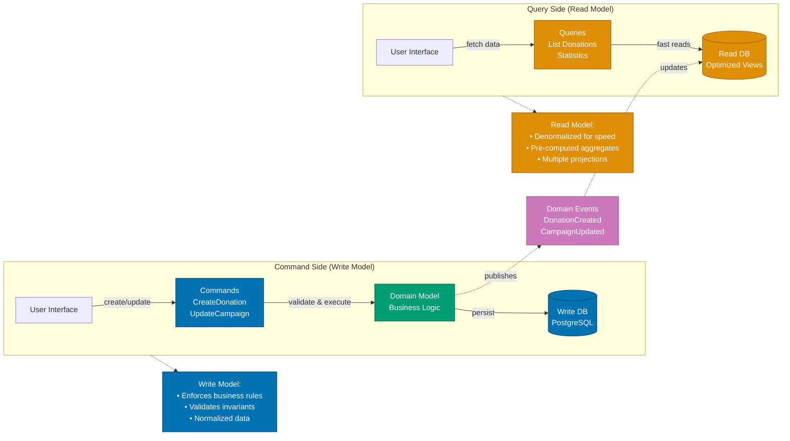

# Domain-Driven Design

Domain-Driven Design (DDD) in Elixir leverages functional programming and OTP to create maintainable, scalable systems aligned with business domains. Unlike object-oriented DDD, Elixir uses **data transformation pipelines**, **bounded contexts through umbrella apps**, and **processes for domain events** to implement DDD tactical and strategic patterns.

**Quick Reference**:

- [DDD in Functional Programming](#ddd-in-functional-programming)
  - [Key Differences from OO](#key-differences-from-oo)
  - [Functional DDD Principles](#functional-ddd-principles)
- [Strategic Design](#strategic-design)
  - [Bounded Contexts](#bounded-contexts)
  - [Context Mapping](#context-mapping)
  - [Ubiquitous Language](#ubiquitous-language)
- [Tactical Design](#tactical-design)
  - [Entities with Structs](#entities-with-structs)
  - [Value Objects](#value-objects)
  - [Aggregates with Ecto](#aggregates-with-ecto)
  - [Domain Services](#domain-services)
  - [Repositories](#repositories)
- [Domain Events](#domain-events)
  - [Event Publishing](#event-publishing)
  - [Event Handling](#event-handling)
  - [Event Sourcing](#event-sourcing)
- [Phoenix Contexts](#phoenix-contexts)
  - [Context Design](#context-design)
  - [API Boundaries](#api-boundaries)
  - [Cross-Context Communication](#cross-context-communication)
- [Umbrella Apps for DDD](#umbrella-apps-for-ddd)
- [Financial Domain Examples](#financial-domain-examples)
- [DDD Best Practices](#ddd-best-practices)
- [DDD Anti-patterns](#ddd-anti-patterns)
- [Testing DDD Applications](#testing-ddd-applications)
- [Related Topics](#related-topics)
- [Sources](#sources)

## DDD in Functional Programming

### Key Differences from OO

Elixir's functional approach changes how we implement DDD patterns:

| Pattern             | OO Approach                        | Elixir Approach                 |
| ------------------- | ---------------------------------- | ------------------------------- |
| **Entity**          | Class with identity, mutable state | Struct with ID, immutable       |
| **Value Object**    | Immutable class                    | Struct (all structs immutable)  |
| **Aggregate**       | Object graph with root             | Ecto schema with associations   |
| **Domain Service**  | Stateful service object            | Pure function module            |
| **Repository**      | ORM with active record             | Ecto Repo with queries          |
| **Domain Events**   | Observer pattern                   | PubSub, GenServer, GenStage     |
| **Bounded Context** | Package/namespace                  | Umbrella app or Phoenix context |

### Functional DDD Principles

1. **Immutability by default** - Data structures never change
2. **Transformation pipelines** - Data flows through pure functions
3. **Explicit state** - State passed as function arguments
4. **Processes for behavior** - GenServers for stateful domain logic
5. **Pattern matching for rules** - Domain rules as function clauses

```elixir
# OO style (Java/C#)
# class Donation {
#   void approve() { this.status = Status.APPROVED; }
# }

# Functional style (Elixir)
defmodule FinancialDomain.Donation do
  defstruct [:id, :amount, :status, :donor_id, :campaign_id]

  def approve(%__MODULE__{status: :pending} = donation) do
    %{donation | status: :approved}
  end

  def approve(%__MODULE__{status: status}) do
    {:error, "Cannot approve donation with status: #{status}"}
  end
end
```

## Strategic Design

### Bounded Contexts

**Bounded Contexts** define clear boundaries between different parts of the domain:

```elixir
# Financial Platform with multiple bounded contexts

# Context 1: Donation Management
defmodule DonationContext do
  @moduledoc """
  Bounded context for donation lifecycle management.
  Owns: Donations, Donors, Campaigns
  """

  alias DonationContext.{Donation, Donor, Campaign}

  def create_donation(attrs) do
    # Domain logic specific to donations
  end

  def approve_donation(donation_id) do
    # Domain rules for approval
  end
end

# Context 2: Zakat Calculation
defmodule ZakatContext do
  @moduledoc """
  Bounded context for Zakat calculations.
  Owns: ZakatCalculations, Nisab, WealthTypes
  """

  alias ZakatContext.{Calculation, Nisab, WealthType}

  def calculate_zakat(wealth, wealth_type) do
    # Domain logic specific to Zakat
  end

  def get_current_nisab(wealth_type) do
    # Domain rules for nisab
  end
end

# Context 3: Payment Processing
defmodule PaymentContext do
  @moduledoc """
  Bounded context for payment gateway integration.
  Owns: Payments, Gateways, Transactions
  """

  alias PaymentContext.{Payment, Gateway, Transaction}

  def process_payment(donation_id, payment_method) do
    # Domain logic for payments
  end

  def refund_payment(payment_id) do
    # Domain rules for refunds
  end
end
```

Implement contexts as **umbrella apps** for strong boundaries:

```
financial_platform/
├── apps/
│   ├── donation_context/      # Bounded context
│   ├── zakat_context/         # Bounded context
│   ├── payment_context/       # Bounded context
│   └── financial_web/         # Application layer
└── mix.exs
```

The following diagram illustrates the bounded context architecture:



### Context Mapping

Define relationships between bounded contexts.

The following diagram shows common context mapping patterns:

```mermaid
graph TD
    subgraph SharedKernel["Shared Kernel Pattern"]
        SK1[Donation Context]
        SK2[Zakat Context]
        SKTypes[Shared Types:<br/>Money, DonorId]
        SK1 -.->|shares| SKTypes
        SK2 -.->|shares| SKTypes
    end

    subgraph ACL["Anti-Corruption Layer (ACL)"]
        ACL1[Donation Context]
        ACLLayer[Translation Layer<br/>PaymentACL]
        ACL2[Payment Context<br/>External]
        ACL1 -->|translates via| ACLLayer
        ACLLayer -->|protects from| ACL2
    end

    subgraph PublishedLang["Published Language"]
        PL1[Donation Context]
        PLEvents[Domain Events<br/>JSON API]
        PL2[Analytics Context]
        PL3[Notification Context]
        PL1 -->|publishes| PLEvents
        PLEvents -.->|consumes| PL2
        PLEvents -.->|consumes| PL3
    end

    subgraph CustomerSupplier["Customer-Supplier"]
        CS1[Campaign Context<br/>Upstream]
        CSAPI[Well-defined API]
        CS2[Donation Context<br/>Downstream]
        CS1 -->|provides| CSAPI
        CSAPI -->|serves| CS2
    end

    style SK1 fill:#029E73,stroke:#01593F,color:#FFF
    style SK2 fill:#029E73,stroke:#01593F,color:#FFF
    style SKTypes fill:#0173B2,stroke:#023B5A,color:#FFF
    style ACL1 fill:#029E73,stroke:#01593F,color:#FFF
    style ACLLayer fill:#DE8F05,stroke:#8A5903,color:#FFF
    style ACL2 fill:#CC78BC,stroke:#8E5484,color:#FFF
    style PL1 fill:#029E73,stroke:#01593F,color:#FFF
    style PLEvents fill:#0173B2,stroke:#023B5A,color:#FFF
    style PL2 fill:#CA9161,stroke:#7D5A3D,color:#FFF
    style PL3 fill:#CA9161,stroke:#7D5A3D,color:#FFF
    style CS1 fill:#029E73,stroke:#01593F,color:#FFF
    style CSAPI fill:#0173B2,stroke:#023B5A,color:#FFF
    style CS2 fill:#029E73,stroke:#01593F,color:#FFF
```



```elixir
# Shared Kernel - types shared between contexts
defmodule SharedKernel do
  defmodule Money do
    @enforce_keys [:amount, :currency]
    defstruct [:amount, :currency]

    @type t :: %__MODULE__{
            amount: Decimal.t(),
            currency: atom()
          }
  end

  defmodule DonorId do
    @type t :: String.t()
  end
end

# Anti-Corruption Layer (ACL) - translate between contexts
defmodule DonationContext.PaymentACL do
  @moduledoc """
  Translates between Donation and Payment contexts.
  Prevents Payment domain concepts from leaking into Donation domain.
  """

  def to_payment_request(donation) do
    # Translate donation to payment domain model
    %PaymentContext.PaymentRequest{
      amount: donation.amount,
      reference_id: donation.id,
      payer_id: donation.donor_id,
      description: "Donation for campaign #{donation.campaign_id}"
    }
  end

  def from_payment_result(payment_result, donation) do
    # Translate payment result back to donation domain
    case payment_result.status do
      :succeeded -> {:ok, mark_as_paid(donation, payment_result)}
      :failed -> {:error, :payment_failed}
    end
  end

  defp mark_as_paid(donation, payment_result) do
    %{donation | status: :paid, payment_id: payment_result.id}
  end
end

# Usage in Donation Context
defmodule DonationContext do
  alias DonationContext.PaymentACL

  def process_donation_payment(donation) do
    # Stay in donation domain language
    with payment_request <- PaymentACL.to_payment_request(donation),
         {:ok, payment_result} <- PaymentContext.process_payment(payment_request),
         {:ok, updated_donation} <- PaymentACL.from_payment_result(payment_result, donation) do
      {:ok, updated_donation}
    end
  end
end
```

### Ubiquitous Language

Use domain terms consistently across code, tests, and documentation:

```elixir
# ❌ Technical language
defmodule FinancialApp.CRUD do
  def insert_record(table, data), do: Repo.insert(table, data)
  def update_record(table, id, data), do: Repo.update(table, id, data)
end

# ✅ Ubiquitous language
defmodule DonationContext do
  @moduledoc """
  Domain terms:
  - Donor: Person making a donation
  - Campaign: Fundraising initiative
  - Pledge: Commitment to donate
  - Fulfillment: Actual payment of pledge
  - Distribution: Allocating funds to beneficiaries
  """

  def pledge_donation(donor_id, campaign_id, amount) do
    # Domain language in function names
  end

  def fulfill_pledge(pledge_id, payment_method) do
    # Domain language in function names
  end

  def distribute_funds(campaign_id, beneficiaries) do
    # Domain language in function names
  end
end
```

## Tactical Design

### Entities with Structs

Entities have identity and lifecycle:

```elixir
defmodule DonationContext.Donor do
  @moduledoc """
  Entity: Donor
  Identity: donor_id
  Lifecycle: registration -> verification -> active -> inactive
  """

  @enforce_keys [:id, :name, :email]
  defstruct [
    :id,
    :name,
    :email,
    :phone,
    :status,
    :registered_at,
    :verified_at,
    donations: []
  ]

  @type t :: %__MODULE__{
          id: String.t(),
          name: String.t(),
          email: String.t(),
          phone: String.t() | nil,
          status: :pending | :verified | :active | :inactive,
          registered_at: DateTime.t(),
          verified_at: DateTime.t() | nil,
          donations: [DonationContext.Donation.t()]
        }

  # Entity behavior - state transitions
  def verify(%__MODULE__{status: :pending} = donor) do
    {:ok, %{donor | status: :verified, verified_at: DateTime.utc_now()}}
  end

  def verify(%__MODULE__{status: status}) do
    {:error, "Cannot verify donor with status: #{status}"}
  end

  def deactivate(%__MODULE__{status: :active} = donor) do
    {:ok, %{donor | status: :inactive}}
  end

  def deactivate(%__MODULE__{status: status}) do
    {:error, "Cannot deactivate donor with status: #{status}"}
  end

  # Entity invariants
  def validate(%__MODULE__{} = donor) do
    with :ok <- validate_email(donor.email),
         :ok <- validate_name(donor.name) do
      {:ok, donor}
    end
  end

  defp validate_email(email) when is_binary(email) and byte_size(email) > 5 do
    if String.contains?(email, "@"), do: :ok, else: {:error, :invalid_email}
  end

  defp validate_email(_), do: {:error, :invalid_email}

  defp validate_name(name) when is_binary(name) and byte_size(name) > 2, do: :ok
  defp validate_name(_), do: {:error, :invalid_name}
end
```

### Value Objects

Value Objects have no identity, defined by their attributes:

```elixir
defmodule DonationContext.Money do
  @moduledoc """
  Value Object: Money
  No identity - two Money instances with same amount/currency are equal
  Immutable - operations return new instance
  """

  @enforce_keys [:amount, :currency]
  defstruct [:amount, :currency]

  @type t :: %__MODULE__{
          amount: Decimal.t(),
          currency: atom()
        }

  def new(amount, currency) when is_number(amount) do
    new(Decimal.new(amount), currency)
  end

  def new(%Decimal{} = amount, currency) when is_atom(currency) do
    %__MODULE__{amount: amount, currency: currency}
  end

  # Value object operations return new instances
  def add(%__MODULE__{currency: curr} = m1, %__MODULE__{currency: curr} = m2) do
    %__MODULE__{
      amount: Decimal.add(m1.amount, m2.amount),
      currency: curr
    }
  end

  def add(%__MODULE__{}, %__MODULE__{}), do: {:error, :currency_mismatch}

  def multiply(%__MODULE__{} = money, multiplier) do
    %__MODULE__{
      amount: Decimal.mult(money.amount, Decimal.new(multiplier)),
      currency: money.currency
    }
  end

  # Equality based on attributes, not identity
  def equal?(%__MODULE__{amount: a1, currency: c1}, %__MODULE__{amount: a2, currency: c2}) do
    Decimal.equal?(a1, a2) and c1 == c2
  end
end

defmodule DonationContext.Address do
  @moduledoc """
  Value Object: Address
  """

  @enforce_keys [:street, :city, :country]
  defstruct [:street, :city, :state, :postal_code, :country]

  @type t :: %__MODULE__{
          street: String.t(),
          city: String.t(),
          state: String.t() | nil,
          postal_code: String.t() | nil,
          country: String.t()
        }

  def format(%__MODULE__{} = address) do
    """
    #{address.street}
    #{address.city}#{if address.state, do: ", #{address.state}", else: ""}
    #{if address.postal_code, do: "#{address.postal_code} ", else: ""}#{address.country}
    """
  end
end
```

### Aggregates with Ecto

Aggregates are consistency boundaries with an aggregate root.

The following diagram shows the aggregate lifecycle with Ecto:



Aggregates are consistency boundaries with an aggregate root:

```elixir
defmodule DonationContext.Campaign do
  @moduledoc """
  Aggregate Root: Campaign
  Maintains consistency of campaign and its donations
  All access to donations must go through campaign
  """

  use Ecto.Schema
  import Ecto.Changeset

  schema "campaigns" do
    field :name, :string
    field :goal_amount, :decimal
    field :currency, :string
    field :start_date, :date
    field :end_date, :date
    field :status, Ecto.Enum, values: [:draft, :active, :paused, :completed, :cancelled]

    # Aggregate boundary - campaign owns donations
    has_many :donations, DonationContext.Donation

    # Derived state
    field :total_raised, :decimal, virtual: true
    field :donor_count, :integer, virtual: true

    timestamps()
  end

  # Aggregate root controls access to children
  def create_changeset(campaign \\ %__MODULE__{}, attrs) do
    campaign
    |> cast(attrs, [:name, :goal_amount, :currency, :start_date, :end_date])
    |> validate_required([:name, :goal_amount, :currency, :start_date, :end_date])
    |> validate_number(:goal_amount, greater_than: 0)
    |> validate_campaign_dates()
    |> put_change(:status, :draft)
  end

  # Domain logic enforced by aggregate
  def activate_changeset(%__MODULE__{status: :draft} = campaign) do
    change(campaign, status: :active)
  end

  def activate_changeset(%__MODULE__{status: status}) do
    add_error(change(%__MODULE__{}), :status, "Cannot activate campaign with status: #{status}")
  end

  # Invariants enforced by aggregate
  defp validate_campaign_dates(changeset) do
    start_date = get_field(changeset, :start_date)
    end_date = get_field(changeset, :end_date)

    if start_date && end_date && Date.compare(start_date, end_date) == :gt do
      add_error(changeset, :end_date, "must be after start date")
    else
      changeset
    end
  end
end

defmodule DonationContext.Donation do
  @moduledoc """
  Entity within Campaign aggregate.
  Cannot exist without campaign (aggregate root).
  """

  use Ecto.Schema
  import Ecto.Changeset

  schema "donations" do
    field :amount, :decimal
    field :currency, :string
    field :status, Ecto.Enum, values: [:pending, :completed, :failed, :refunded]
    field :donor_name, :string
    field :donor_email, :string
    field :payment_method, :string
    field :transaction_id, :string

    # Belongs to aggregate root
    belongs_to :campaign, DonationContext.Campaign

    timestamps()
  end

  # Factory function - validates aggregate relationship
  def create_changeset(campaign, attrs) do
    %__MODULE__{}
    |> cast(attrs, [:amount, :currency, :donor_name, :donor_email, :payment_method])
    |> validate_required([:amount, :currency, :donor_name, :donor_email])
    |> validate_number(:amount, greater_than: 0)
    |> put_assoc(:campaign, campaign)
    |> validate_campaign_active()
  end

  defp validate_campaign_active(changeset) do
    case get_field(changeset, :campaign) do
      %{status: :active} -> changeset
      %{status: status} -> add_error(changeset, :campaign, "Campaign must be active (current: #{status})")
      nil -> add_error(changeset, :campaign, "Campaign is required")
    end
  end
end

# Repository - loads aggregate with children
defmodule DonationContext.CampaignRepository do
  import Ecto.Query
  alias DonationContext.{Repo, Campaign, Donation}

  def get_with_donations(campaign_id) do
    Campaign
    |> where([c], c.id == ^campaign_id)
    |> preload(:donations)
    |> Repo.one()
  end

  def get_with_stats(campaign_id) do
    campaign = get_with_donations(campaign_id)

    if campaign do
      # Calculate derived state
      total_raised = calculate_total_raised(campaign.donations)
      donor_count = count_unique_donors(campaign.donations)

      %{campaign | total_raised: total_raised, donor_count: donor_count}
    end
  end

  defp calculate_total_raised(donations) do
    donations
    |> Enum.filter(&(&1.status == :completed))
    |> Enum.map(& &1.amount)
    |> Enum.reduce(Decimal.new(0), &Decimal.add/2)
  end

  defp count_unique_donors(donations) do
    donations
    |> Enum.map(& &1.donor_email)
    |> Enum.uniq()
    |> length()
  end
end
```

### Domain Services

Domain Services implement domain logic that doesn't belong to a single entity:

```elixir
defmodule ZakatContext.ZakatCalculator do
  @moduledoc """
  Domain Service: Zakat Calculation
  Stateless service implementing complex domain logic
  """

  alias ZakatContext.{Nisab, WealthType}
  alias SharedKernel.Money

  @zakat_rate Decimal.new("0.025")  # 2.5%

  @doc """
  Calculates Zakat based on wealth type and current nisab.
  Domain logic: Different wealth types have different nisab values.
  """
  def calculate(wealth, wealth_type) do
    with {:ok, nisab} <- Nisab.get_current(wealth_type),
         :ok <- validate_currency_match(wealth, nisab),
         :ok <- validate_above_nisab(wealth, nisab) do
      zakat_amount = Money.multiply(wealth, @zakat_rate)
      {:ok, zakat_amount}
    end
  end

  defp validate_currency_match(%Money{currency: c1}, %Money{currency: c2}) when c1 == c2 do
    :ok
  end

  defp validate_currency_match(_, _), do: {:error, :currency_mismatch}

  defp validate_above_nisab(wealth, nisab) do
    if Decimal.compare(wealth.amount, nisab.amount) == :gt do
      :ok
    else
      {:error, :below_nisab}
    end
  end
end

defmodule DonationContext.DonationAllocationService do
  @moduledoc """
  Domain Service: Allocate donations to multiple causes
  Complex logic coordinating multiple entities
  """

  alias DonationContext.{Donation, AllocationRule}
  alias SharedKernel.Money

  def allocate(donation, allocation_rules) do
    total_percentage = Enum.sum(Enum.map(allocation_rules, & &1.percentage))

    if total_percentage != 100 do
      {:error, :invalid_allocation_total}
    else
      allocations = Enum.map(allocation_rules, fn rule ->
        amount = calculate_allocation(donation.amount, rule.percentage)
        %{cause: rule.cause, amount: amount}
      end)

      {:ok, allocations}
    end
  end

  defp calculate_allocation(%Money{} = total, percentage) do
    multiplier = Decimal.div(Decimal.new(percentage), Decimal.new(100))
    Money.multiply(total, multiplier)
  end
end
```

### Repositories

Repositories provide collection-like interface to aggregates:

```elixir
defmodule DonationContext.DonorRepository do
  @moduledoc """
  Repository: Donor aggregate persistence
  """

  import Ecto.Query
  alias DonationContext.{Repo, Donor}

  @doc "Get donor by ID with all donations"
  def get(donor_id) do
    Donor
    |> where([d], d.id == ^donor_id)
    |> preload(:donations)
    |> Repo.one()
  end

  @doc "Find donors by email"
  def find_by_email(email) do
    Donor
    |> where([d], d.email == ^email)
    |> Repo.one()
  end

  @doc "Get active donors who donated in date range"
  def active_donors_in_period(start_date, end_date) do
    Donor
    |> join(:inner, [d], don in assoc(d, :donations))
    |> where([d, don], d.status == :active)
    |> where([d, don], don.inserted_at >= ^start_date and don.inserted_at <= ^end_date)
    |> distinct(true)
    |> Repo.all()
  end

  @doc "Save donor (insert or update)"
  def save(%Donor{id: nil} = donor) do
    Repo.insert(donor)
  end

  def save(%Donor{} = donor) do
    Repo.update(donor)
  end

  @doc "Delete donor"
  def delete(%Donor{} = donor) do
    Repo.delete(donor)
  end
end
```

## Domain Events

The following diagram illustrates event-driven communication between bounded contexts:

```mermaid
sequenceDiagram
    participant Don as Donation Context
    participant PubSub as Event Bus<br/>(Phoenix.PubSub)
    participant Not as Notification Context
    participant Ana as Analytics Context
    participant Camp as Campaign Context

    Don->>Don: process_donation(donation)
    Don->>Don: validate & persist
    Don->>PubSub: publish(DonationReceived event)

    Note over PubSub: Broadcast to subscribers

    PubSub-->>Not: DonationReceived
    PubSub-->>Ana: DonationReceived
    PubSub-->>Camp: DonationReceived

    par Process in parallel
        Not->>Not: send_receipt(donor)
        Not->>Not: send_thank_you_email
    and
        Ana->>Ana: record_metric(donation)
        Ana->>Ana: update_dashboard
    and
        Camp->>Camp: update_campaign_total
        Camp->>Camp: check_goal_reached
    end

    Note over Don,Camp: Loose coupling via events<br/>Each context reacts independently

    style Don fill:#029E73,stroke:#01593F,color:#FFF
    style PubSub fill:#0173B2,stroke:#023B5A,color:#FFF
    style Not fill:#DE8F05,stroke:#8A5903,color:#FFF
    style Ana fill:#DE8F05,stroke:#8A5903,color:#FFF
    style Camp fill:#DE8F05,stroke:#8A5903,color:#FFF
```

### Event Publishing

Publish domain events when significant business events occur:

```elixir
defmodule DonationContext.Events do
  @moduledoc """
  Domain events for Donation Context
  """

  defmodule DonationReceived do
    @enforce_keys [:donation_id, :donor_id, :campaign_id, :amount, :occurred_at]
    defstruct [:donation_id, :donor_id, :campaign_id, :amount, :occurred_at, metadata: %{}]

    @type t :: %__MODULE__{
            donation_id: String.t(),
            donor_id: String.t(),
            campaign_id: String.t(),
            amount: Money.t(),
            occurred_at: DateTime.t(),
            metadata: map()
          }
  end

  defmodule DonationCompleted do
    @enforce_keys [:donation_id, :payment_id, :occurred_at]
    defstruct [:donation_id, :payment_id, :occurred_at, metadata: %{}]
  end

  defmodule CampaignGoalReached do
    @enforce_keys [:campaign_id, :goal_amount, :total_raised, :occurred_at]
    defstruct [:campaign_id, :goal_amount, :total_raised, :occurred_at, metadata: %{}]
  end
end

defmodule DonationContext.EventPublisher do
  @moduledoc """
  Publishes domain events using Phoenix.PubSub
  """

  alias Phoenix.PubSub

  @pubsub FinancialPlatform.PubSub

  def publish(%module{} = event) do
    topic = event_topic(module)
    PubSub.broadcast(@pubsub, topic, {:domain_event, event})
  end

  defp event_topic(module) do
    module
    |> Module.split()
    |> List.last()
    |> Macro.underscore()
  end
end

# Usage in domain logic
defmodule DonationContext do
  alias DonationContext.{Donation, Events, EventPublisher}

  def receive_donation(attrs) do
    with {:ok, donation} <- create_donation(attrs),
         :ok <- publish_donation_received_event(donation) do
      {:ok, donation}
    end
  end

  defp publish_donation_received_event(donation) do
    event = %Events.DonationReceived{
      donation_id: donation.id,
      donor_id: donation.donor_id,
      campaign_id: donation.campaign_id,
      amount: donation.amount,
      occurred_at: DateTime.utc_now()
    }

    EventPublisher.publish(event)
    :ok
  end

  defp create_donation(_attrs), do: {:ok, %Donation{}}
end
```

### Event Handling

Subscribe to domain events in other contexts:

```elixir
defmodule NotificationContext.DonationEventHandler do
  @moduledoc """
  Handles donation events to send notifications
  """

  use GenServer
  alias Phoenix.PubSub
  alias DonationContext.Events

  def start_link(opts) do
    GenServer.start_link(__MODULE__, opts, name: __MODULE__)
  end

  def init(_opts) do
    # Subscribe to donation events
    PubSub.subscribe(FinancialPlatform.PubSub, "donation_received")
    PubSub.subscribe(FinancialPlatform.PubSub, "campaign_goal_reached")

    {:ok, %{}}
  end

  def handle_info({:domain_event, %Events.DonationReceived{} = event}, state) do
    # Handle donation received
    NotificationContext.send_donation_receipt(event.donor_id, event.donation_id)
    {:noreply, state}
  end

  def handle_info({:domain_event, %Events.CampaignGoalReached{} = event}, state) do
    # Handle goal reached
    NotificationContext.send_goal_celebration(event.campaign_id)
    {:noreply, state}
  end
end
```

### Event Sourcing

Store domain events as source of truth:

```elixir
defmodule DonationContext.EventStore do
  use Ecto.Schema
  import Ecto.Changeset

  schema "domain_events" do
    field :event_type, :string
    field :event_data, :map
    field :aggregate_id, :string
    field :aggregate_type, :string
    field :version, :integer
    field :occurred_at, :utc_datetime

    timestamps(updated_at: false)
  end

  def changeset(event \\ %__MODULE__{}, attrs) do
    event
    |> cast(attrs, [:event_type, :event_data, :aggregate_id, :aggregate_type, :version, :occurred_at])
    |> validate_required([:event_type, :event_data, :aggregate_id, :aggregate_type])
  end
end

defmodule DonationContext.CampaignEventHandler do
  @moduledoc """
  Rebuild campaign state from events (event sourcing)
  """

  alias DonationContext.{Campaign, EventStore, Repo}

  def rebuild_campaign_from_events(campaign_id) do
    events = load_events(campaign_id)
    Enum.reduce(events, %Campaign{id: campaign_id}, &apply_event/2)
  end

  defp load_events(campaign_id) do
    EventStore
    |> where([e], e.aggregate_id == ^campaign_id and e.aggregate_type == "campaign")
    |> order_by([e], e.version)
    |> Repo.all()
  end

  defp apply_event(%{event_type: "campaign_created", event_data: data}, _campaign) do
    struct(Campaign, data)
  end

  defp apply_event(%{event_type: "donation_received", event_data: data}, campaign) do
    # Update campaign state based on event
    %{campaign | total_raised: Decimal.add(campaign.total_raised, data["amount"])}
  end

  defp apply_event(%{event_type: "campaign_activated"}, campaign) do
    %{campaign | status: :active}
  end

  defp apply_event(_, campaign), do: campaign
end
```

## Phoenix Contexts

### Context Design

Phoenix Contexts implement bounded contexts:

```elixir
# Context module as API boundary
defmodule DonationContext do
  @moduledoc """
  Donation Management Context
  Public API for donation-related operations
  """

  alias DonationContext.{Donation, Donor, Campaign}
  alias DonationContext.{DonationRepository, CampaignRepository}

  # Public API - clear boundary
  @doc "Create a new donation for a campaign"
  def create_donation(campaign_id, attrs) do
    with {:ok, campaign} <- get_active_campaign(campaign_id),
         {:ok, donation} <- build_donation(campaign, attrs),
         {:ok, saved_donation} <- DonationRepository.save(donation) do
      publish_donation_created(saved_donation)
      {:ok, saved_donation}
    end
  end

  @doc "List all donations for a campaign"
  def list_campaign_donations(campaign_id) do
    DonationRepository.list_by_campaign(campaign_id)
  end

  @doc "Get donation statistics for a campaign"
  def campaign_statistics(campaign_id) do
    CampaignRepository.get_with_stats(campaign_id)
  end

  # Private functions - implementation details
  defp get_active_campaign(campaign_id) do
    case CampaignRepository.get(campaign_id) do
      %Campaign{status: :active} = campaign -> {:ok, campaign}
      %Campaign{status: status} -> {:error, "Campaign is #{status}"}
      nil -> {:error, :campaign_not_found}
    end
  end

  defp build_donation(campaign, attrs) do
    # Domain logic
    {:ok, %Donation{}}
  end

  defp publish_donation_created(_donation), do: :ok
end
```

### API Boundaries

Contexts expose clean APIs and hide implementation:

```elixir
# ❌ BAD - exposing Ecto implementation
defmodule DonationContext do
  def get_donation_changeset(donation_id) do
    Donation
    |> Repo.get(donation_id)
    |> Donation.changeset(%{})  # Exposing Ecto changeset
  end
end

# ✅ GOOD - domain-oriented API
defmodule DonationContext do
  @type donation :: %Donation{}
  @type donation_attrs :: map()

  @doc "Get donation by ID"
  @spec get_donation(String.t()) :: {:ok, donation()} | {:error, :not_found}
  def get_donation(donation_id) do
    case DonationRepository.get(donation_id) do
      nil -> {:error, :not_found}
      donation -> {:ok, donation}
    end
  end

  @doc "Update donation attributes"
  @spec update_donation(String.t(), donation_attrs()) ::
          {:ok, donation()} | {:error, Ecto.Changeset.t()}
  def update_donation(donation_id, attrs) do
    with {:ok, donation} <- get_donation(donation_id),
         {:ok, updated} <- DonationRepository.update(donation, attrs) do
      {:ok, updated}
    end
  end
end
```

### Cross-Context Communication

Communicate between contexts using events or public APIs:

```elixir
# ✅ GOOD - Event-driven communication
defmodule DonationContext do
  def complete_donation(donation_id) do
    with {:ok, donation} <- get_donation(donation_id),
         {:ok, completed} <- mark_completed(donation) do
      # Publish event for other contexts
      publish_event(%DonationCompleted{
        donation_id: completed.id,
        amount: completed.amount,
        occurred_at: DateTime.utc_now()
      })

      {:ok, completed}
    end
  end
end

defmodule AnalyticsContext.DonationHandler do
  # Subscribe to events
  def handle_info({:domain_event, %DonationCompleted{} = event}, state) do
    AnalyticsContext.record_donation_metric(event)
    {:noreply, state}
  end
end

# ✅ GOOD - Direct API call (synchronous)
defmodule PaymentContext do
  def process_donation_payment(donation_id) do
    # Get donation info via public API
    with {:ok, donation} <- DonationContext.get_donation(donation_id),
         {:ok, payment} <- create_payment_for_donation(donation),
         {:ok, result} <- process_payment(payment) do
      # Notify donation context via public API
      DonationContext.mark_donation_paid(donation_id, payment.id)
      {:ok, result}
    end
  end
end

# ❌ BAD - Direct database access across contexts
defmodule PaymentContext do
  def process_donation_payment(donation_id) do
    # DON'T access other context's tables directly
    donation = Repo.get(DonationContext.Donation, donation_id)  # ❌ BAD
    # ...
  end
end
```

## Umbrella Apps for DDD

Structure umbrella app for DDD:

```
financial_platform/
├── apps/
│   ├── donation_context/        # Bounded Context 1
│   │   ├── lib/
│   │   │   ├── donation_context.ex          # Public API
│   │   │   └── donation_context/
│   │   │       ├── donation.ex              # Entity
│   │   │       ├── campaign.ex              # Aggregate Root
│   │   │       ├── repositories/
│   │   │       ├── services/
│   │   │       └── events/
│   │   ├── test/
│   │   └── mix.exs
│   │
│   ├── zakat_context/           # Bounded Context 2
│   │   ├── lib/
│   │   │   ├── zakat_context.ex
│   │   │   └── zakat_context/
│   │   │       ├── calculation.ex
│   │   │       ├── nisab.ex
│   │   │       └── services/
│   │   └── mix.exs
│   │
│   ├── shared_kernel/           # Shared types
│   │   ├── lib/
│   │   │   └── shared_kernel/
│   │   │       ├── money.ex
│   │   │       └── types.ex
│   │   └── mix.exs
│   │
│   └── financial_web/           # Application Layer
│       ├── lib/
│       │   └── financial_web/
│       │       ├── controllers/
│       │       ├── live/
│       │       └── views/
│       └── mix.exs
│
├── config/
└── mix.exs
```

Dependencies between apps:

```elixir
# apps/financial_web/mix.exs
defp deps do
  [
    # Depend on domain contexts
    {:donation_context, in_umbrella: true},
    {:zakat_context, in_umbrella: true},
    {:shared_kernel, in_umbrella: true},

    # Web dependencies
    {:phoenix, "~> 1.7.0"}
  ]
end

# apps/donation_context/mix.exs
defp deps do
  [
    # Depend on shared kernel
    {:shared_kernel, in_umbrella: true},

    # Don't depend on other contexts or web
    {:ecto_sql, "~> 3.12"}
  ]
end
```

## Financial Domain Examples

Complete DDD example:

```elixir
# See examples in previous sections, including:
# - Campaign aggregate with donations
# - Money value object
# - Zakat calculation service
# - Donation event handling
# - Context boundaries with ACL
```

### Command and Query Segregation (CQRS)

The following diagram illustrates the CQRS (Command Query Responsibility Segregation) pattern:



**Implementation Example**:

```elixir
defmodule DonationContext.Commands do
@moduledoc """
Write operations (commands) for donation context
"""

alias DonationContext.{Donation, DonationRepository}

defmodule CreateDonation do
@enforce_keys [:campaign_id, :amount, :donor_email]
defstruct [:campaign_id, :amount, :donor_email, :donor_name, :payment_method]
end

def handle(%CreateDonation{} = command) do
with :ok <- validate_command(command),
{:ok, donation} <- build_donation(command),
{:ok, saved} <- DonationRepository.save(donation) do
publish_event(:donation_created, saved)
{:ok, saved}
end
end

defp validate_command(\_command), do: :ok
defp build_donation(\_command), do: {:ok, %Donation{}}
defp publish_event(\_type, \_data), do: :ok
end

defmodule DonationContext.Queries do
@moduledoc """
Read operations (queries) for donation context
"""

import Ecto.Query
alias DonationContext.{Donation, Repo}

def list_campaign_donations(campaign_id) do
Donation
|> where([d], d.campaign_id == ^campaign_id)
|> order_by([d], desc: d.inserted_at)
|> Repo.all()
end

def donation_statistics(campaign_id) do
Donation
|> where([d], d.campaign_id == ^campaign_id and d.status == :completed)
|> select([d], %{
total: sum(d.amount),
count: count(d.id),
average: avg(d.amount)
})
|> Repo.one()
end
end

```

## DDD Best Practices

1. **Use ubiquitous language** - Code reflects business terminology
2. **Strong aggregate boundaries** - Clear consistency rules
3. **Context independence** - Contexts don't share database tables
4. **Event-driven integration** - Decouple contexts with events
5. **Pure domain logic** - Keep infrastructure out of domain
6. **Test domain logic** - Unit test without database
7. **Repository pattern** - Abstract persistence
8. **Value objects for concepts** - Money, Address, etc.

## DDD Anti-patterns

### 1. Anemic Domain Model

```elixir
# ❌ BAD - No domain logic, just data
defmodule Donation do
  defstruct [:id, :amount, :status]
end

defmodule DonationService do
  def approve_donation(donation) do
    %{donation | status: :approved}  # Business logic in service
  end
end

# ✅ GOOD - Rich domain model
defmodule Donation do
  defstruct [:id, :amount, :status]

  def approve(%__MODULE__{status: :pending} = donation) do
    # Business rules in domain entity
    %{donation | status: :approved}
  end

  def approve(%__MODULE__{status: status}) do
    {:error, "Cannot approve donation with status #{status}"}
  end
end
```

### 2. Leaky Abstractions

```elixir
# ❌ BAD - exposing Ecto changesets
defmodule DonationContext do
  def create_donation_changeset(attrs) do
    Donation.changeset(%Donation{}, attrs)  # Leaking Ecto
  end
end

# ✅ GOOD - domain-focused API
defmodule DonationContext do
  def create_donation(attrs) do
    # Hide Ecto implementation
    case build_and_save_donation(attrs) do
      {:ok, donation} -> {:ok, donation}
      {:error, changeset} -> {:error, format_errors(changeset)}
    end
  end

  defp build_and_save_donation(_attrs), do: {:ok, %Donation{}}
  defp format_errors(_changeset), do: %{}
end
```

## Testing DDD Applications

```elixir
defmodule DonationContextTest do
  use ExUnit.Case, async: true

  # Test domain logic without database
  describe "Donation entity" do
    test "approve/1 approves pending donation" do
      donation = %Donation{id: "1", status: :pending, amount: 10000}

      assert {:ok, approved} = Donation.approve(donation)
      assert approved.status == :approved
    end

    test "approve/1 rejects non-pending donation" do
      donation = %Donation{id: "1", status: :completed, amount: 10000}

      assert {:error, _reason} = Donation.approve(donation)
    end
  end

  # Test services
  describe "ZakatCalculator service" do
    test "calculates zakat for wealth above nisab" do
      wealth = Money.new(100_000_000, :IDR)
      nisab = Money.new(85_000_000, :IDR)

      assert {:ok, zakat} = ZakatCalculator.calculate(wealth, :gold)
      assert Money.equal?(zakat, Money.new(2_500_000, :IDR))
    end
  end
end
```

## Related Topics

- [Protocols and Behaviours](ex-so-stla-el__protocols-and-behaviours.md) - Polymorphism in DDD
- [Functional Programming](ex-so-stla-el__functional-programming.md) - FP approach to DDD
- [Web Services](ex-so-stla-el__web-services.md) - Phoenix contexts for DDD
- [Dependencies](ex-so-stla-el__dependencies.md) - Umbrella apps for bounded contexts
- [Testing](ex-so-stla-el__test-driven-development.md) - Testing DDD applications

## Sources

- [Domain-Driven Design - Eric Evans](https://www.domainlanguage.com/ddd/)
- [Implementing Domain-Driven Design - Vaughn Vernon](https://vaughnvernon.com/)
- [Phoenix Contexts](https://hexdocs.pm/phoenix/contexts.html)
- [DDD in Elixir - Ben Marx](https://blog.carbonfive.com/domain-driven-design-in-elixir/)
- [Functional and Reactive Domain Modeling - Debasish Ghosh](https://www.manning.com/books/functional-and-reactive-domain-modeling)

---

**Last Updated**: 2026-01-23
**Elixir Version**: 1.12+ (baseline), 1.17+ (recommended), 1.18.0 (latest)
**Maintainers**: Platform Documentation Team
