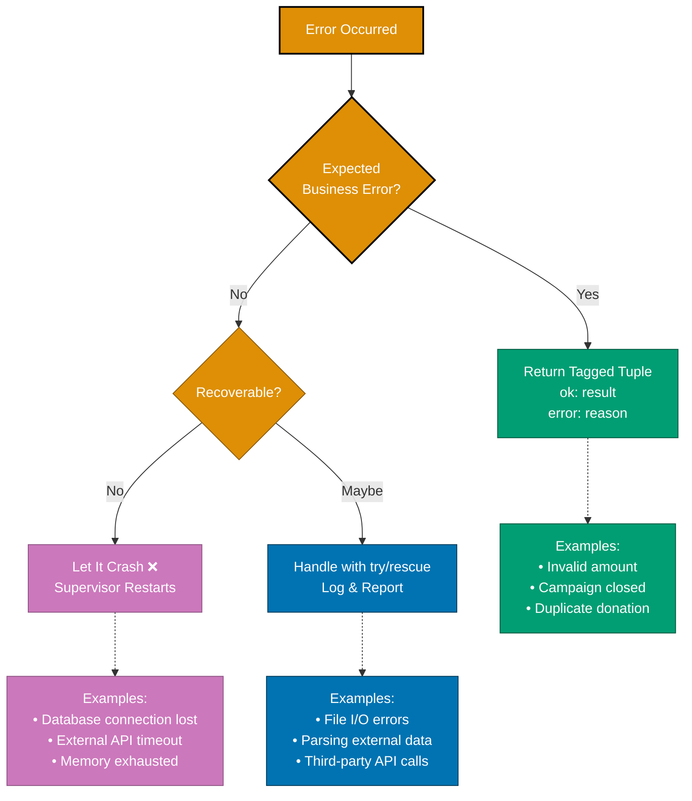
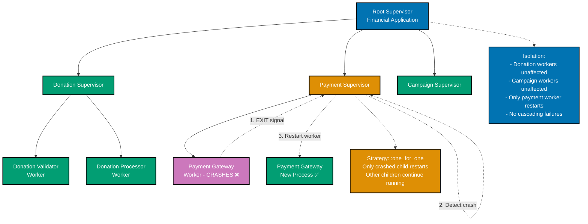
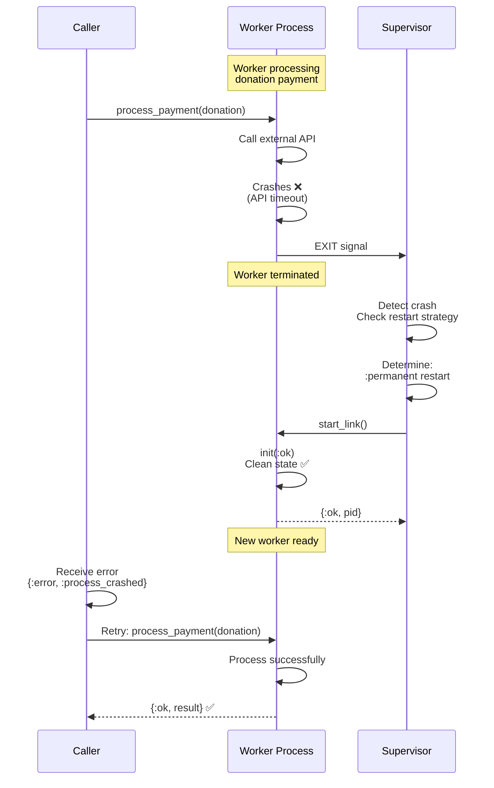
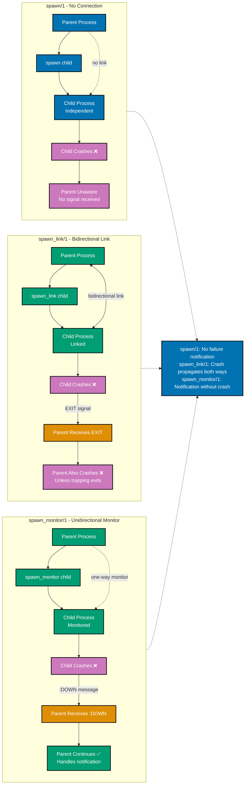

# Elixir Error Handling

**Quick Reference**: [Overview](#overview) | [Let It Crash](#let-it-crash-philosophy) | [Supervision Trees](#supervision-trees) | [Pattern Matching](#pattern-matching-for-errors) | [with Construct](#with-construct) | [try/rescue](#tryrescue) | [Financial Examples](#financial-domain-integration)

## Overview

Elixir's approach to error handling is fundamentally different from traditional exception-based error handling. The core philosophy is "let it crash" - isolate errors in processes, let them fail, and rely on supervisors to restart them in a known-good state.

**Key Concepts**:

- **Let It Crash**: Don't try to handle every possible error; let processes fail and restart
- **Supervision Trees**: Hierarchical structure for monitoring and restarting processes
- **Pattern Matching**: Use tagged tuples `{:ok, result}` | `{:error, reason}` for expected errors
- **with Construct**: Handle complex pipelines with multiple failure points
- **try/rescue**: Reserve for truly exceptional circumstances

All examples use financial domain context (Zakat calculation, donation processing, payment handling).

## Let It Crash Philosophy

### The Traditional Approach (Defensive Programming)

```elixir
# ❌ Traditional defensive approach - trying to handle everything
defmodule FinancialDomain.Traditional.DonationProcessor do
  def process_donation(donation_id) do
    try do
      # Check if database is available
      if database_available?() do
        # Check if donation exists
        case fetch_donation(donation_id) do
          nil ->
            log_error("Donation not found")
            {:error, :not_found}

          donation ->
            # Check if donor exists
            case fetch_donor(donation.donor_id) do
              nil ->
                log_error("Donor not found")
                {:error, :donor_not_found}

              donor ->
                # Check if campaign is active
                case fetch_campaign(donation.campaign_id) do
                  nil ->
                    log_error("Campaign not found")
                    {:error, :campaign_not_found}

                  campaign ->
                    if campaign.active do
                      # Try to process payment
                      try do
                        process_payment(donation)
                      rescue
                        error ->
                          log_error("Payment failed: #{inspect(error)}")
                          {:error, :payment_failed}
                      end
                    else
                      log_error("Campaign inactive")
                      {:error, :campaign_inactive}
                    end
                end
            end
        end
      else
        log_error("Database unavailable")
        {:error, :database_unavailable}
      end
    rescue
      error ->
        log_error("Unexpected error: #{inspect(error)}")
        {:error, :unexpected}
    end
  end

  # Defensive code becomes deeply nested and hard to maintain
end
```

### The Elixir Way (Let It Crash)

```elixir
# ✅ Elixir approach - let it crash for unexpected errors
defmodule FinancialDomain.Elixir.DonationProcessor do
  @moduledoc """
  Processes donations with proper error handling.

  Expected errors (business logic) return tagged tuples.
  Unexpected errors (bugs, infrastructure) crash and restart.
  """

  @doc """
  Processes a donation.
  Returns {:ok, result} for success, {:error, reason} for business errors.
  Crashes on unexpected errors (database connection, etc.).
  """
  def process_donation(donation_id) do
    with {:ok, donation} <- fetch_donation(donation_id),
         {:ok, donor} <- fetch_donor(donation.donor_id),
         {:ok, campaign} <- fetch_campaign(donation.campaign_id),
         :ok <- validate_campaign_active(campaign),
         {:ok, result} <- process_payment(donation) do
      {:ok, result}
    else
      {:error, :not_found} ->
        {:error, :donation_not_found}

      {:error, :donor_not_found} ->
        {:error, :invalid_donor}

      {:error, :campaign_not_found} ->
        {:error, :invalid_campaign}

      {:error, :campaign_inactive} ->
        {:error, :campaign_closed}

      {:error, :payment_failed} = error ->
        error
    end
  end

  # If database connection fails, process crashes
  # Supervisor restarts it in clean state
  # No need to handle infrastructure failures explicitly
end
```

**Why "Let It Crash"?**

- **Simplifies Code**: Don't write defensive code for every possible failure
- **Known-Good State**: Restart gives clean slate, no corrupted state
- **Isolation**: One process crashing doesn't affect others
- **Debugging**: Crash reports show exact failure point
- **Self-Healing**: Supervision automatically recovers from failures

The following diagram illustrates the "Let It Crash" philosophy:


The following diagram shows the error handling decision tree:



## Supervision Trees

### Error Propagation in Supervision Tree

The following diagram shows how errors propagate through a supervision tree:



### Basic Supervisor

```elixir
defmodule FinancialDomain.Donations.Supervisor do
  @moduledoc """
  Supervises donation processing components.
  """
  use Supervisor

  def start_link(init_arg) do
    Supervisor.start_link(__MODULE__, init_arg, name: __MODULE__)
  end

  @impl true
  def init(_init_arg) do
    children = [
      # Worker processes
      FinancialDomain.Donations.Validator,
      FinancialDomain.Donations.PaymentProcessor,
      FinancialDomain.Donations.NotificationService,

      # Cache process
      {FinancialDomain.Donations.CampaignCache, []},

      # Worker pool
      {DynamicSupervisor, name: FinancialDomain.Donations.WorkerSupervisor, strategy: :one_for_one}
    ]

    # If any child crashes, only that child restarts
    Supervisor.init(children, strategy: :one_for_one)
  end
end
```

### Handling Worker Crashes

The following diagram shows the supervision recovery flow:



```elixir
defmodule FinancialDomain.Donations.PaymentProcessor do
  @moduledoc """
  Processes payments with automatic recovery on crash.
  """
  use GenServer

  def start_link(_opts) do
    GenServer.start_link(__MODULE__, :ok, name: __MODULE__)
  end

  def process_payment(donation) do
    GenServer.call(__MODULE__, {:process, donation})
  end

  @impl true
  def init(:ok) do
    # Initialize with clean state
    {:ok, %{processed: 0, failed: 0}}
  end

  @impl true
  def handle_call({:process, donation}, _from, state) do
    # Process payment - may crash
    result = dangerous_payment_operation(donation)

    # If we get here, payment succeeded
    updated_state = %{state | processed: state.processed + 1}
    {:reply, {:ok, result}, updated_state}
  end

  defp dangerous_payment_operation(donation) do
    # Call external payment API
    # May raise if API is down
    # May timeout
    # May return malformed data

    # If any of above happens, process crashes
    # Supervisor restarts it
    # Caller receives error and can retry

    ExternalPaymentAPI.charge(donation.amount, donation.payment_method)
  end

  # Supervisor configuration
  def child_spec(opts) do
    %{
      id: __MODULE__,
      start: {__MODULE__, :start_link, [opts]},
      restart: :permanent,  # Always restart
      shutdown: 5000,       # Graceful shutdown timeout
      type: :worker
    }
  end
end
```

### Circuit Breaker Pattern

The following diagram shows the circuit breaker state machine:


```elixir
defmodule FinancialDomain.ExternalServices.CircuitBreaker do
  @moduledoc """
  Circuit breaker for external service calls.

  States:
  - :closed - Service healthy, requests pass through
  - :open - Service failing, reject requests immediately
  - :half_open - Testing if service recovered
  """
  use GenServer

  defstruct [
    :service_name,
    :state,
    :failure_count,
    :failure_threshold,
    :timeout,
    :last_failure_time
  ]

  # Client API

  def start_link(opts) do
    service_name = Keyword.fetch!(opts, :service_name)
    GenServer.start_link(__MODULE__, opts, name: via_tuple(service_name))
  end

  def call(service_name, function) do
    GenServer.call(via_tuple(service_name), {:call, function})
  end

  # Server Callbacks

  @impl true
  def init(opts) do
    state = %__MODULE__{
      service_name: Keyword.fetch!(opts, :service_name),
      state: :closed,
      failure_count: 0,
      failure_threshold: Keyword.get(opts, :failure_threshold, 5),
      timeout: Keyword.get(opts, :timeout, :timer.seconds(60)),
      last_failure_time: nil
    }

    {:ok, state}
  end

  @impl true
  def handle_call({:call, function}, _from, %{state: :open} = state) do
    # Circuit open - check if we should try again
    if should_attempt_reset?(state) do
      # Try half-open state
      attempt_call(function, %{state | state: :half_open})
    else
      # Still open - reject immediately
      {:reply, {:error, :circuit_open}, state}
    end
  end

  @impl true
  def handle_call({:call, function}, _from, state) do
    # Circuit closed or half-open - attempt call
    attempt_call(function, state)
  end

  # Private Functions

  defp attempt_call(function, state) do
    try do
      result = function.()

      # Success - reset failure count
      updated_state = %{
        state |
        state: :closed,
        failure_count: 0,
        last_failure_time: nil
      }

      {:reply, {:ok, result}, updated_state}
    catch
      _kind, _reason ->
        # Failure - increment count
        updated_failure_count = state.failure_count + 1

        updated_state = %{
          state |
          failure_count: updated_failure_count,
          last_failure_time: System.system_time(:second)
        }

        # Open circuit if threshold exceeded
        if updated_failure_count >= state.failure_threshold do
          {:reply, {:error, :circuit_opened}, %{updated_state | state: :open}}
        else
          {:reply, {:error, :call_failed}, updated_state}
        end
    end
  end

  defp should_attempt_reset?(state) do
    current_time = System.system_time(:second)
    time_since_failure = current_time - state.last_failure_time
    time_since_failure >= div(state.timeout, 1000)
  end

  defp via_tuple(service_name) do
    {:via, Registry, {FinancialDomain.Registry, {__MODULE__, service_name}}}
  end
end

# Usage
defmodule FinancialDomain.PaymentGateway do
  def charge_with_circuit_breaker(amount) do
    CircuitBreaker.call(:payment_gateway, fn ->
      ExternalPaymentAPI.charge(amount)
    end)
  end
end
```

### Process Linking and Monitoring

The following diagram shows the differences between process linking and monitoring:



## Pattern Matching for Errors

### Tagged Tuple Convention

```elixir
defmodule FinancialDomain.Zakat.Calculator do
  @moduledoc """
  Returns tagged tuples for all outcomes.
  """

  @doc """
  Calculates Zakat amount.

  Returns:
  - {:ok, amount} - Successful calculation
  - {:error, :negative_wealth} - Wealth is negative
  - {:error, :currency_mismatch} - Different currencies
  """
  def calculate(wealth, nisab) do
    cond do
      wealth.amount < 0 ->
        {:error, :negative_wealth}

      wealth.currency != nisab.currency ->
        {:error, :currency_mismatch}

      Money.greater_than?(wealth, nisab) ->
        zakat = Money.multiply(wealth, Decimal.new("0.025"))
        {:ok, zakat}

      true ->
        {:ok, Money.new(0, wealth.currency)}
    end
  end

  @doc """
  Calculate with raised exception on error.
  Use sparingly - only when caller expects success.
  """
  def calculate!(wealth, nisab) do
    case calculate(wealth, nisab) do
      {:ok, amount} -> amount
      {:error, reason} -> raise "Zakat calculation failed: #{reason}"
    end
  end
end
```

### Matching in Function Clauses

```elixir
defmodule FinancialDomain.Donations.Handler do
  @moduledoc """
  Handles donation processing results with pattern matching.
  """

  def handle_donation_result({:ok, donation}) do
    # Success path
    send_receipt(donation)
    broadcast_donation_created(donation)
    update_campaign_stats(donation)
    {:ok, donation}
  end

  def handle_donation_result({:error, :invalid_amount}) do
    # Specific error - provide helpful message
    {:error, "Donation amount must be greater than zero"}
  end

  def handle_donation_result({:error, :campaign_not_found}) do
    {:error, "The campaign you're trying to donate to doesn't exist"}
  end

  def handle_donation_result({:error, :campaign_closed}) do
    {:error, "This campaign is no longer accepting donations"}
  end

  def handle_donation_result({:error, :payment_failed}) do
    # Payment failures might be retryable
    {:error, :retryable}
  end

  def handle_donation_result({:error, reason}) do
    # Catch-all for unexpected errors
    {:error, "Unexpected error: #{inspect(reason)}"}
  end

  defp send_receipt(_donation), do: :ok
  defp broadcast_donation_created(_donation), do: :ok
  defp update_campaign_stats(_donation), do: :ok
end
```

### Case Expressions

```elixir
defmodule FinancialDomain.Loans.Processor do
  @moduledoc """
  Processes loan applications with case expressions.
  """

  def process_application(application_id) do
    case fetch_application(application_id) do
      {:ok, application} ->
        process_credit_check(application)

      {:error, :not_found} ->
        {:error, "Application not found"}

      {:error, reason} ->
        {:error, "Failed to fetch application: #{inspect(reason)}"}
    end
  end

  defp process_credit_check(application) do
    case check_credit_score(application.applicant_id) do
      {:ok, score} when score >= 700 ->
        approve_application(application, :prime_rate)

      {:ok, score} when score >= 600 ->
        approve_application(application, :standard_rate)

      {:ok, score} when score < 600 ->
        {:error, "Credit score too low: #{score}"}

      {:error, :service_unavailable} ->
        # Retryable error
        {:error, :retry_later}

      {:error, reason} ->
        {:error, "Credit check failed: #{inspect(reason)}"}
    end
  end

  defp fetch_application(_id), do: {:ok, %{applicant_id: 1}}
  defp check_credit_score(_id), do: {:ok, 750}
  defp approve_application(_app, _rate), do: {:ok, :approved}
end
```

## with Construct

### with Construct Flow

The following diagram shows how the `with` construct handles sequential pattern matching with short-circuit on first error:

```mermaid
%% Color Palette: Blue #0173B2, Orange #DE8F05, Teal #029E73, Purple #CC78BC
%% All colors are color-blind friendly and meet WCAG AA contrast standards
flowchart TD
    START[with construct begins] --> STEP1{Step 1:<br/>validate_params}

    STEP1 -->|{:ok, params}| STEP2{Step 2:<br/>get_or_create_donor}
    STEP1 -->|{:error, reason}| ELSE[else block]

    STEP2 -->|{:ok, donor}| STEP3{Step 3:<br/>fetch_active_campaign}
    STEP2 -->|{:error, reason}| ELSE

    STEP3 -->|{:ok, campaign}| STEP4{Step 4:<br/>insert_donation}
    STEP3 -->|{:error, reason}| ELSE

    STEP4 -->|{:ok, donation}| STEP5{Step 5:<br/>process_payment}
    STEP4 -->|{:error, reason}| ELSE

    STEP5 -->|{:ok, result}| STEP6{Step 6:<br/>send_confirmation}
    STEP5 -->|{:error, reason}| ELSE

    STEP6 -->|:ok| SUCCESS[do block:<br/>Return {:ok, donation}]
    STEP6 -->|{:error, reason}| ELSE

    ELSE --> MATCH{Pattern match<br/>error reason}
    MATCH -->|:invalid_amount| E1[Return custom error:<br/>'Amount must be positive']
    MATCH -->|:invalid_email| E2[Return custom error:<br/>'Invalid email address']
    MATCH -->|:campaign_closed| E3[Return custom error:<br/>'Campaign closed']
    MATCH -->|other| E4[Return generic error]

    SUCCESS --> END[Final result]
    E1 --> END
    E2 --> END
    E3 --> END
    E4 --> END

    Note1[Short-circuit:<br/>First error stops pipeline<br/>Jumps directly to else block<br/>No partial execution]

    START -.-> Note1

    style START fill:#0173B2,stroke:#000000,color:#FFFFFF,stroke-width:2px
    style STEP1 fill:#0173B2,stroke:#000000,color:#FFFFFF,stroke-width:2px
    style STEP2 fill:#0173B2,stroke:#000000,color:#FFFFFF,stroke-width:2px
    style STEP3 fill:#0173B2,stroke:#000000,color:#FFFFFF,stroke-width:2px
    style STEP4 fill:#0173B2,stroke:#000000,color:#FFFFFF,stroke-width:2px
    style STEP5 fill:#0173B2,stroke:#000000,color:#FFFFFF,stroke-width:2px
    style STEP6 fill:#0173B2,stroke:#000000,color:#FFFFFF,stroke-width:2px
    style SUCCESS fill:#029E73,stroke:#000000,color:#FFFFFF,stroke-width:2px
    style ELSE fill:#DE8F05,stroke:#000000,color:#FFFFFF,stroke-width:2px
    style MATCH fill:#DE8F05,stroke:#000000,color:#FFFFFF,stroke-width:2px
    style E1 fill:#CC78BC,stroke:#000000,color:#FFFFFF,stroke-width:2px
    style E2 fill:#CC78BC,stroke:#000000,color:#FFFFFF,stroke-width:2px
    style E3 fill:#CC78BC,stroke:#000000,color:#FFFFFF,stroke-width:2px
    style E4 fill:#CC78BC,stroke:#000000,color:#FFFFFF,stroke-width:2px
    style END fill:#0173B2,stroke:#000000,color:#FFFFFF,stroke-width:2px
    style Note1 fill:#CC78BC,stroke:#000000,color:#FFFFFF,stroke-width:2px
```

### Basic with Usage

```elixir
defmodule FinancialDomain.Donations.Creator do
  @moduledoc """
  Creates donations with validation pipeline using 'with'.
  """

  def create_donation(params) do
    with {:ok, validated_params} <- validate_params(params),
         {:ok, donor} <- get_or_create_donor(validated_params),
         {:ok, campaign} <- fetch_active_campaign(validated_params),
         {:ok, donation} <- insert_donation(validated_params, donor, campaign),
         {:ok, payment_result} <- process_payment(donation),
         :ok <- send_confirmation(donor, donation) do
      {:ok, donation}
    else
      {:error, :invalid_amount} ->
        {:error, "Donation amount must be positive"}

      {:error, :invalid_email} ->
        {:error, "Please provide a valid email address"}

      {:error, :campaign_not_found} ->
        {:error, "Campaign does not exist"}

      {:error, :campaign_closed} ->
        {:error, "This campaign is no longer accepting donations"}

      {:error, :payment_failed} = error ->
        # Keep original error for payment failures
        error

      {:error, reason} ->
        # Catch-all for unexpected errors
        {:error, "Donation creation failed: #{inspect(reason)}"}
    end
  end

  defp validate_params(%{"amount" => amount, "email" => email, "campaign_id" => _})
       when is_number(amount) and amount > 0 do
    if String.contains?(email, "@") do
      {:ok, %{amount: amount, email: email}}
    else
      {:error, :invalid_email}
    end
  end

  defp validate_params(_), do: {:error, :invalid_amount}

  defp get_or_create_donor(_params), do: {:ok, %{id: 1}}
  defp fetch_active_campaign(_params), do: {:ok, %{id: 1, active: true}}
  defp insert_donation(_params, _donor, _campaign), do: {:ok, %{id: 1}}
  defp process_payment(_donation), do: {:ok, :processed}
  defp send_confirmation(_donor, _donation), do: :ok
end
```

### Complex Pipeline with with

```elixir
defmodule FinancialDomain.Zakat.DistributionService do
  @moduledoc """
  Distributes Zakat with complex validation and processing.
  """

  def distribute_zakat(pool_id, recipient_ids) do
    with {:ok, pool} <- fetch_zakat_pool(pool_id),
         :ok <- validate_pool_balance(pool),
         {:ok, recipients} <- fetch_and_validate_recipients(recipient_ids),
         {:ok, allocations} <- calculate_allocations(pool, recipients),
         :ok <- validate_allocations(allocations, pool.balance),
         {:ok, transactions} <- execute_transfers(allocations),
         {:ok, updated_pool} <- update_pool_balance(pool, transactions),
         :ok <- record_distribution(updated_pool, transactions),
         :ok <- notify_recipients(recipients, transactions) do
      {:ok, %{
        pool: updated_pool,
        transactions: transactions,
        recipients: length(recipients)
      }}
    else
      {:error, :pool_not_found} ->
        {:error, "Zakat pool not found"}

      {:error, :insufficient_balance} ->
        {:error, "Insufficient balance in pool"}

      {:error, {:invalid_recipient, id}} ->
        {:error, "Invalid recipient: #{id}"}

      {:error, :allocation_exceeds_balance} ->
        {:error, "Allocation amounts exceed pool balance"}

      {:error, {:transfer_failed, reason}} ->
        {:error, "Transfer failed: #{inspect(reason)}"}

      {:error, reason} ->
        {:error, "Distribution failed: #{inspect(reason)}"}
    end
  end

  defp fetch_zakat_pool(id) do
    # Fetch from database - may crash if DB down
    {:ok, %{id: id, balance: 50000}}
  end

  defp validate_pool_balance(%{balance: balance}) when balance > 0, do: :ok
  defp validate_pool_balance(_), do: {:error, :insufficient_balance}

  defp fetch_and_validate_recipients(ids) do
    {:ok, Enum.map(ids, fn id -> %{id: id, verified: true} end)}
  end

  defp calculate_allocations(pool, recipients) do
    per_recipient = div(pool.balance, length(recipients))
    allocations = Enum.map(recipients, fn r -> {r, per_recipient} end)
    {:ok, allocations}
  end

  defp validate_allocations(allocations, balance) do
    total = Enum.reduce(allocations, 0, fn {_r, amount}, acc -> acc + amount end)
    if total <= balance, do: :ok, else: {:error, :allocation_exceeds_balance}
  end

  defp execute_transfers(allocations) do
    transactions = Enum.map(allocations, fn {recipient, amount} ->
      %{recipient_id: recipient.id, amount: amount, status: :completed}
    end)
    {:ok, transactions}
  end

  defp update_pool_balance(pool, transactions) do
    total_distributed = Enum.reduce(transactions, 0, fn t, acc -> acc + t.amount end)
    {:ok, %{pool | balance: pool.balance - total_distributed}}
  end

  defp record_distribution(_pool, _transactions), do: :ok
  defp notify_recipients(_recipients, _transactions), do: :ok
end
```

## try/rescue

### When to Use try/rescue

```elixir
defmodule FinancialDomain.Reports.Generator do
  @moduledoc """
  Generates financial reports with selective error recovery.
  """

  @doc """
  Generates report with fallback for non-critical failures.
  """
  def generate_comprehensive_report(year, month) do
    # Critical data - let it crash if unavailable
    donations = fetch_donations(year, month)
    zakat_payments = fetch_zakat_payments(year, month)

    # Optional data - recover gracefully
    exchange_rates = fetch_exchange_rates_safely()
    campaign_stats = fetch_campaign_stats_safely()

    compile_report(donations, zakat_payments, exchange_rates, campaign_stats)
  end

  defp fetch_donations(_year, _month) do
    # Let it crash if database unavailable
    # Supervisor will restart, database should be working again
    Repo.all(Donation)
  end

  defp fetch_exchange_rates_safely do
    try do
      # External API call - may fail
      ExternalAPI.get_exchange_rates()
    rescue
      # API down or timeout - use cached/default rates
      _error ->
        IO.warn("Failed to fetch live exchange rates, using cached rates")
        get_cached_exchange_rates()
    end
  end

  defp fetch_campaign_stats_safely do
    try do
      calculate_campaign_stats()
    catch
      # Catch arithmetic errors, etc.
      :error, :badarith ->
        IO.warn("Error calculating campaign stats, using empty stats")
        %{}
    end
  end

  defp get_cached_exchange_rates, do: %{USD: 1.0, EUR: 1.1, GBP: 1.3}
  defp calculate_campaign_stats, do: %{}
  defp compile_report(_d, _z, _e, _c), do: %{type: :report}
end
```

### Cleanup with try/after

```elixir
defmodule FinancialDomain.Exports.FileGenerator do
  @moduledoc """
  Generates export files with guaranteed cleanup.
  """

  def generate_csv_export(data) do
    file_path = "/tmp/export_#{System.system_time()}.csv"

    try do
      # Open file
      {:ok, file} = File.open(file_path, [:write])

      # Write data - may raise
      write_csv_data(file, data)

      # Close and return path
      File.close(file)
      {:ok, file_path}
    rescue
      error ->
        # Error occurred
        {:error, error}
    after
      # Cleanup always runs
      cleanup_temp_files()
    end
  end

  defp write_csv_data(file, data) do
    Enum.each(data, fn row ->
      IO.write(file, format_csv_row(row))
    end)
  end

  defp format_csv_row(row), do: "#{row}\n"
  defp cleanup_temp_files, do: :ok
end
```

## Financial Domain Integration

### Robust Payment Processing

```elixir
defmodule FinancialDomain.Payments.RobustProcessor do
  @moduledoc """
  Robust payment processing with comprehensive error handling.
  """

  def process_payment(donation, opts \\ []) do
    max_retries = Keyword.get(opts, :max_retries, 3)
    process_with_retries(donation, max_retries)
  end

  defp process_with_retries(donation, retries_left) do
    with {:ok, validated} <- validate_payment(donation),
         {:ok, auth_result} <- authorize_payment(validated),
         {:ok, capture_result} <- capture_payment(auth_result),
         {:ok, receipt} <- generate_receipt(capture_result),
         :ok <- save_transaction(receipt) do
      {:ok, receipt}
    else
      {:error, :validation_failed} = error ->
        # Don't retry validation errors
        error

      {:error, :insufficient_funds} = error ->
        # Don't retry insufficient funds
        error

      {:error, :invalid_card} = error ->
        # Don't retry invalid card
        error

      {:error, :gateway_timeout} when retries_left > 0 ->
        # Retry on timeout
        IO.warn("Payment gateway timeout, retrying (#{retries_left} attempts left)")
        :timer.sleep(1000)
        process_with_retries(donation, retries_left - 1)

      {:error, :gateway_error} when retries_left > 0 ->
        # Retry on gateway error
        IO.warn("Gateway error, retrying (#{retries_left} attempts left)")
        :timer.sleep(2000)
        process_with_retries(donation, retries_left - 1)

      {:error, reason} = error ->
        # No more retries or non-retryable error
        IO.error("Payment failed: #{inspect(reason)}")
        error
    end
  end

  defp validate_payment(%{amount: amount}) when amount > 0, do: {:ok, :validated}
  defp validate_payment(_), do: {:error, :validation_failed}

  defp authorize_payment(_donation) do
    # Simulate payment gateway call
    case :rand.uniform(10) do
      n when n <= 7 -> {:ok, :authorized}
      8 -> {:error, :gateway_timeout}
      _ -> {:error, :insufficient_funds}
    end
  end

  defp capture_payment(_auth), do: {:ok, :captured}
  defp generate_receipt(_capture), do: {:ok, %{id: "REC123"}}
  defp save_transaction(_receipt), do: :ok
end
```

### Idempotent Operations

```elixir
defmodule FinancialDomain.Donations.IdempotentCreator do
  @moduledoc """
  Creates donations idempotently to handle retries safely.
  """

  def create_donation(idempotency_key, params) do
    with {:ok, :new} <- check_idempotency(idempotency_key),
         {:ok, donation} <- do_create_donation(params),
         :ok <- store_idempotency_result(idempotency_key, donation) do
      {:ok, donation}
    else
      {:ok, :duplicate, existing_donation} ->
        # Already processed - return existing
        {:ok, existing_donation}

      {:error, reason} = error ->
        # Creation failed - client can retry with same key
        error
    end
  end

  defp check_idempotency(key) do
    case Repo.get_by(IdempotencyKey, key: key) do
      nil ->
        {:ok, :new}

      %{donation_id: donation_id} ->
        donation = Repo.get!(Donation, donation_id)
        {:ok, :duplicate, donation}
    end
  end

  defp do_create_donation(params) do
    %Donation{}
    |> Donation.changeset(params)
    |> Repo.insert()
  end

  defp store_idempotency_result(key, donation) do
    %IdempotencyKey{key: key, donation_id: donation.id}
    |> Repo.insert()

    :ok
  end
end
```

### Transaction Rollback

```elixir
defmodule FinancialDomain.Transfers.AtomicTransfer do
  @moduledoc """
  Performs atomic transfers between accounts with rollback.
  """

  def transfer(from_account_id, to_account_id, amount) do
    Repo.transaction(fn ->
      with {:ok, from_account} <- fetch_and_lock_account(from_account_id),
           {:ok, to_account} <- fetch_and_lock_account(to_account_id),
           :ok <- validate_sufficient_balance(from_account, amount),
           {:ok, _} <- debit_account(from_account, amount),
           {:ok, _} <- credit_account(to_account, amount),
           {:ok, transfer_record} <- record_transfer(from_account_id, to_account_id, amount) do
        transfer_record
      else
        {:error, :insufficient_balance} ->
          # Rollback happens automatically
          Repo.rollback(:insufficient_balance)

        {:error, reason} ->
          Repo.rollback(reason)
      end
    end)
  end

  defp fetch_and_lock_account(id) do
    # SELECT FOR UPDATE - locks row
    case Repo.get(Account, id, lock: "FOR UPDATE") do
      nil -> {:error, :account_not_found}
      account -> {:ok, account}
    end
  end

  defp validate_sufficient_balance(account, amount) do
    if Decimal.compare(account.balance, amount) in [:gt, :eq] do
      :ok
    else
      {:error, :insufficient_balance}
    end
  end

  defp debit_account(account, amount) do
    account
    |> Ecto.Changeset.change(balance: Decimal.sub(account.balance, amount))
    |> Repo.update()
  end

  defp credit_account(account, amount) do
    account
    |> Ecto.Changeset.change(balance: Decimal.add(account.balance, amount))
    |> Repo.update()
  end

  defp record_transfer(from_id, to_id, amount) do
    %Transfer{from_account_id: from_id, to_account_id: to_id, amount: amount}
    |> Repo.insert()
  end
end
```

## Best Practices

- **Use Supervision**: Always supervise processes that can crash
- **Tagged Tuples**: Use `{:ok, result}` | `{:error, reason}` for expected errors
- **Let it Crash**: Don't try to handle every possible error
- **with for Pipelines**: Use `with` for operations with multiple failure points
- **Minimize try/rescue**: Reserve for truly exceptional circumstances
- **Idempotent Operations**: Make operations safe to retry
- **Transaction Boundaries**: Use Ecto transactions for related database operations
- **Error Context**: Provide helpful error messages for business errors
- **Monitor & Alert**: Log crashes and set up monitoring

## Common Mistakes

- ❌ Catching all errors with try/rescue
- ❌ Not using supervision for processes
- ❌ Inconsistent error return formats
- ❌ Handling infrastructure errors explicitly
- ❌ No retry logic for transient failures
- ❌ Not using transactions for related operations
- ❌ Swallowing errors without logging
- ❌ Using exceptions for control flow

## Related Topics

- [Concurrency and Parallelism](./ex-so-stla-el__concurrency-and-parallelism.md) - Process-based concurrency
- [OTP Supervisor](./ex-so-stla-el__otp-supervisor.md) - Supervision patterns
- [Best Practices](./ex-so-stla-el__best-practices.md) - Error handling conventions
- [Anti-Patterns](./ex-so-stla-el__anti-patterns.md) - Common error handling mistakes

## Sources

- [Elixir Getting Started - Processes](https://elixir-lang.org/getting-started/processes.html)
- [Erlang's "Let it Crash" Philosophy](https://ferd.ca/the-zen-of-erlang.html)
- [Designing for Scalability with Erlang/OTP](https://www.oreilly.com/library/view/designing-for-scalability/9781449361556/)
- [Learn You Some Erlang - Errors and Exceptions](https://learnyousomeerlang.com/errors-and-exceptions)

---

**Last Updated**: 2026-01-23
**Elixir Version**: 1.12+ (baseline), 1.17+ (recommended), 1.18.0 (latest)
**Maintainers**: Platform Documentation Team
