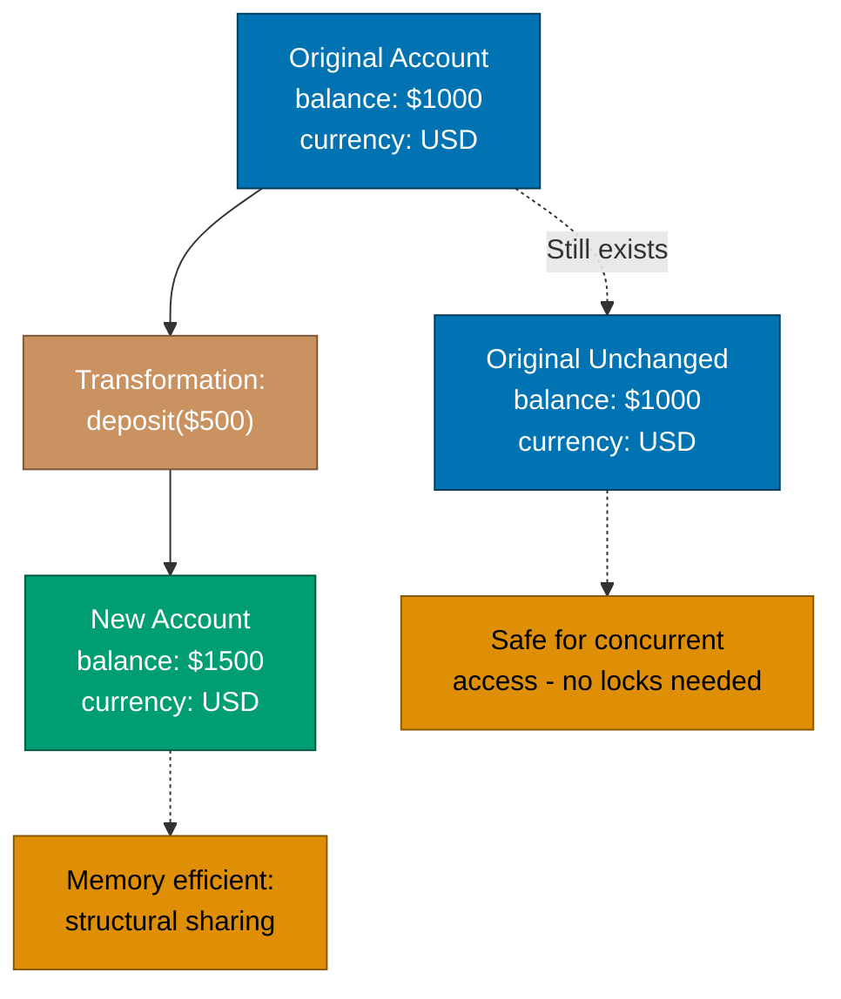
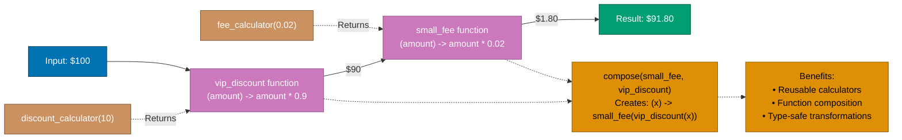

# Elixir Functional Programming

**Quick Reference**: [Overview](#overview) | [Immutability](#immutability) | [Pure Functions](#pure-functions) | [Recursion](#recursion-and-tail-call-optimization) | [Higher-Order Functions](#higher-order-functions) | [Enum & Stream](#enum-and-stream) | [Pipe Operator](#pipe-operator-composition) | [Financial Examples](#financial-domain-integration)

## Overview

Elixir is a functional programming language built on immutable data structures and pure functions. Understanding functional paradigms is essential for writing effective Elixir code.

**Core Functional Concepts**:

- **Immutability**: Data structures cannot be modified after creation
- **Pure Functions**: Same input always produces same output, no side effects
- **First-Class Functions**: Functions are values that can be passed around
- **Recursion**: Primary mechanism for iteration
- **Higher-Order Functions**: Functions that take or return functions
- **Lazy Evaluation**: Stream module for efficient data processing

All examples use financial domain context (Zakat calculations, donation processing, transaction handling).

## Immutability

### Immutable Data Structures

```elixir
defmodule FinancialDomain.Examples.Immutability do
  @moduledoc """
  Demonstrates immutability in Elixir.
  """

  def demonstrate_list_immutability do
    # Original list
    donations = [100, 200, 300]

    # "Adding" to list creates new list
    updated_donations = [50 | donations]

    # Original list unchanged
    IO.puts("Original: #{inspect(donations)}")        # [100, 200, 300]
    IO.puts("Updated: #{inspect(updated_donations)}") # [50, 100, 200, 300]

    {donations, updated_donations}
  end

  def demonstrate_map_immutability do
    # Original map
    account = %{balance: 1000, currency: :USD}

    # "Updating" map creates new map
    updated_account = Map.put(account, :balance, 1500)

    # Original map unchanged
    IO.puts("Original: #{inspect(account)}")        # %{balance: 1000, currency: :USD}
    IO.puts("Updated: #{inspect(updated_account)}") # %{balance: 1500, currency: :USD}

    {account, updated_account}
  end

  def demonstrate_struct_immutability do
    # Original struct
    money = %FinancialDomain.Money{amount: Decimal.new(100), currency: :USD}

    # "Updating" struct creates new struct
    updated_money = %{money | amount: Decimal.new(150)}

    # Original struct unchanged
    IO.puts("Original: #{inspect(money)}")        # %Money{amount: 100, currency: :USD}
    IO.puts("Updated: #{inspect(updated_money)}") # %Money{amount: 150, currency: :USD}

    {money, updated_money}
  end
end
```

The following diagram illustrates how immutability works in Elixir - transformations create new data structures while preserving the original:



### Benefits of Immutability

```elixir
defmodule FinancialDomain.Transactions.History do
  @moduledoc """
  Transaction history benefits from immutability.
  """

  def record_transaction(history, transaction) do
    # Safe to share history - it can't be modified
    # New history contains new transaction
    [transaction | history]
  end

  def concurrent_recording(history) do
    # Multiple processes can safely read history
    # Each creates its own version when adding
    tasks = for i <- 1..5 do
      Task.async(fn ->
        record_transaction(history, %{id: i, amount: i * 100})
      end)
    end

    # Each task has its own version
    Task.await_many(tasks)

    # Original history unchanged
    history
  end

  def demonstrate_sharing do
    initial_history = []

    # Process A adds transaction
    history_a = record_transaction(initial_history, %{id: 1, amount: 100})

    # Process B adds different transaction to initial history
    history_b = record_transaction(initial_history, %{id: 2, amount: 200})

    # Both histories are valid, no conflict
    %{
      initial: initial_history,  # []
      history_a: history_a,       # [%{id: 1, amount: 100}]
      history_b: history_b        # [%{id: 2, amount: 200}]
    }
  end
end
```

## Pure Functions

### Definition and Benefits

```elixir
defmodule FinancialDomain.Zakat.PureCalculations do
  @moduledoc """
  Pure functions for Zakat calculations.

  Pure function characteristics:
  - Same input always produces same output
  - No side effects (no I/O, no state mutation)
  - No dependence on external state
  """

  # ✅ Pure function - deterministic, no side effects
  def calculate_zakat(wealth, nisab) when wealth > nisab do
    wealth * 0.025
  end

  def calculate_zakat(_wealth, _nisab), do: 0

  # ✅ Pure function - only depends on inputs
  def calculate_nisab_gold(gold_price_per_gram) do
    gold_price_per_gram * 85  # 85 grams of gold
  end

  # ✅ Pure function - referential transparency
  def apply_zakat_rate(amount) do
    Decimal.mult(amount, Decimal.new("0.025"))
  end

  # ❌ Not pure - depends on current time
  def calculate_zakat_impure(wealth, nisab) do
    if DateTime.utc_now().hour >= 12 do
      calculate_zakat(wealth, nisab)
    else
      0
    end
  end

  # ❌ Not pure - has side effect (IO)
  def calculate_with_logging(wealth, nisab) do
    result = calculate_zakat(wealth, nisab)
    IO.puts("Calculated zakat: #{result}")
    result
  end

  # ✅ Pure - extracted side effect
  def calculate_pure(wealth, nisab) do
    {calculate_zakat(wealth, nisab), "Calculated zakat"}
  end
end
```

### Testing Pure Functions

```elixir
defmodule FinancialDomain.Zakat.PureCalculationsTest do
  use ExUnit.Case, async: true  # Can run in parallel!

  alias FinancialDomain.Zakat.PureCalculations

  describe "calculate_zakat/2" do
    test "returns 2.5% for wealth above nisab" do
      # Pure function - same input always gives same output
      assert PureCalculations.calculate_zakat(10000, 5000) == 250
      assert PureCalculations.calculate_zakat(10000, 5000) == 250  # Always same
      assert PureCalculations.calculate_zakat(10000, 5000) == 250  # No surprises
    end

    test "returns 0 for wealth below nisab" do
      assert PureCalculations.calculate_zakat(3000, 5000) == 0
    end
  end

  # Pure functions enable property-based testing
  property "zakat is always 2.5% of wealth above nisab" do
    check all wealth <- positive_integer(),
              nisab <- positive_integer(),
              wealth > nisab do
      result = PureCalculations.calculate_zakat(wealth, nisab)
      assert result == wealth * 0.025
    end
  end
end
```

## Recursion and Tail Call Optimization

### Basic Recursion

```elixir
defmodule FinancialDomain.Calculations.Recursive do
  @moduledoc """
  Recursive functions for financial calculations.
  """

  @doc """
  Sums a list of donations recursively.
  """
  def sum_donations([]), do: 0
  def sum_donations([head | tail]) do
    head + sum_donations(tail)
  end

  @doc """
  Tail-recursive version (optimized).
  """
  def sum_donations_tail(donations), do: sum_donations_tail(donations, 0)

  defp sum_donations_tail([], acc), do: acc
  defp sum_donations_tail([head | tail], acc) do
    sum_donations_tail(tail, acc + head)
  end

  @doc """
  Calculates compound return over periods (recursion).
  """
  def compound_return(principal, rate, 0), do: principal
  def compound_return(principal, rate, periods) do
    compound_return(principal * (1 + rate), rate, periods - 1)
  end

  @doc """
  Filters donations above threshold.
  """
  def filter_large_donations([], _threshold), do: []
  def filter_large_donations([head | tail], threshold) do
    if head >= threshold do
      [head | filter_large_donations(tail, threshold)]
    else
      filter_large_donations(tail, threshold)
    end
  end
end
```

### Tail Call Optimization

```elixir
defmodule FinancialDomain.Processing.TailOptimized do
  @moduledoc """
  Demonstrates tail call optimization.
  """

  # ❌ Not tail-recursive - builds stack
  def factorial_non_tail(0), do: 1
  def factorial_non_tail(n) do
    n * factorial_non_tail(n - 1)
    # Multiplication happens AFTER recursive call
    # Stack frame must be kept
  end

  # ✅ Tail-recursive - constant stack space
  def factorial_tail(n), do: factorial_tail(n, 1)

  defp factorial_tail(0, acc), do: acc
  defp factorial_tail(n, acc) do
    factorial_tail(n - 1, n * acc)
    # Last operation is recursive call
    # Stack frame can be reused
  end

  # ❌ Not tail-recursive - builds list after recursion
  def process_donations_non_tail([]), do: []
  def process_donations_non_tail([donation | rest]) do
    processed = process_single(donation)
    [processed | process_donations_non_tail(rest)]
    # List cons happens AFTER recursive call
  end

  # ✅ Tail-recursive with accumulator
  def process_donations_tail(donations), do: process_donations_tail(donations, [])

  defp process_donations_tail([], acc), do: Enum.reverse(acc)
  defp process_donations_tail([donation | rest], acc) do
    processed = process_single(donation)
    process_donations_tail(rest, [processed | acc])
  end

  defp process_single(donation), do: donation * 0.95  # Apply fee
end
```

The following diagram compares head recursion (builds stack) versus tail recursion (constant stack space):

```mermaid
graph TD
    subgraph HeadRecursion["Head Recursion (Non-Optimized)"]
        H1["sum([100, 200, 300])"]
        H2["100 + sum([200, 300])"]
        H3["100 + (200 + sum([300]))"]
        H4["100 + (200 + (300 + sum([])))"]
        H5["100 + (200 + (300 + 0))"]
        H6["100 + (200 + 300)"]
        H7["100 + 500"]
        H8["600"]

        H1 --> H2
        H2 --> H3
        H3 --> H4
        H4 --> H5
        H5 --> H6
        H6 --> H7
        H7 --> H8

        StackH["Stack grows:<br/>O(n) memory"]
        H4 -.-> StackH
    end

    subgraph TailRecursion["Tail Recursion (Optimized)"]
        T1["sum_tail([100, 200, 300], 0)"]
        T2["sum_tail([200, 300], 100)"]
        T3["sum_tail([300], 300)"]
        T4["sum_tail([], 600)"]
        T5["600"]

        T1 --> T2
        T2 --> T3
        T3 --> T4
        T4 --> T5

        StackT["Constant stack:<br/>O(1) memory<br/>Frame reused"]
        T3 -.-> StackT
    end

    %% Comparison
    Comparison["Tail call optimization:<br/>Last operation is recursive call<br/>Stack frame can be reused"]
    TailRecursion -.-> Comparison

    %% Styling
    style H1 fill:#0173B2,stroke:#023B5A,color:#FFF
    style H8 fill:#029E73,stroke:#01593F,color:#FFF
    style StackH fill:#CC78BC,stroke:#8B5A8A,color:#FFF

    style T1 fill:#0173B2,stroke:#023B5A,color:#FFF
    style T5 fill:#029E73,stroke:#01593F,color:#FFF
    style StackT fill:#029E73,stroke:#01593F,color:#FFF

    style Comparison fill:#DE8F05,stroke:#8A5903,color:#000
```



## Higher-Order Functions

### Functions as Parameters

```elixir
defmodule FinancialDomain.Reporting.HigherOrder do
  @moduledoc """
  Higher-order functions for flexible reporting.
  """

  @doc """
  Processes donations with custom function.
  """
  def process_each(donations, processor_fn) do
    Enum.map(donations, processor_fn)
  end

  @doc """
  Filters donations with custom predicate.
  """
  def filter_donations(donations, predicate_fn) do
    Enum.filter(donations, predicate_fn)
  end

  @doc """
  Applies transformation pipeline.
  """
  def transform(data, transformations) when is_list(transformations) do
    Enum.reduce(transformations, data, fn transform_fn, acc ->
      transform_fn.(acc)
    end)
  end

  @doc """
  Example usage of higher-order functions.
  """
  def generate_report(donations) do
    donations
    |> filter_donations(&(&1.amount > 100))           # Filter large
    |> process_each(&apply_currency_conversion/1)     # Convert currency
    |> process_each(&calculate_tax/1)                 # Calculate tax
    |> Enum.reduce(0, &sum_amounts/2)                # Sum totals
  end

  defp apply_currency_conversion(donation), do: donation
  defp calculate_tax(donation), do: donation
  defp sum_amounts(donation, acc), do: donation.amount + acc
end
```

### Functions as Return Values

```elixir
defmodule FinancialDomain.Calculators.Factory do
  @moduledoc """
  Creates calculator functions dynamically.
  """

  @doc """
  Returns a function that calculates fees for given rate.
  """
  def fee_calculator(rate) do
    fn amount -> amount * rate end
  end

  @doc """
  Returns a function that applies discount.
  """
  def discount_calculator(discount_percentage) do
    fn amount -> amount * (1 - discount_percentage / 100) end
  end

  @doc """
  Composes multiple calculators.
  """
  def compose(f, g) do
    fn x -> f.(g.(x)) end
  end

  @doc """
  Example usage.
  """
  def example do
    # Create specialized calculators
    small_fee = fee_calculator(0.02)    # 2% fee
    large_fee = fee_calculator(0.05)    # 5% fee
    vip_discount = discount_calculator(10)  # 10% discount

    # Use them
    small_donation_fee = small_fee.(100)        # 2.00
    large_donation_fee = large_fee.(100)        # 5.00
    discounted = vip_discount.(100)             # 90.00

    # Compose: apply discount then fee
    vip_with_fee = compose(small_fee, vip_discount)
    final_amount = vip_with_fee.(100)           # (100 * 0.9) * 1.02 = 91.80

    {small_donation_fee, large_donation_fee, discounted, final_amount}
  end
end
```

The following diagram shows how higher-order functions compose together, passing functions as values and creating specialized calculators:



## Enum and Stream

### Enum Module (Eager Evaluation)

```elixir
defmodule FinancialDomain.Analysis.EnumExamples do
  @moduledoc """
  Using Enum module for data transformations.
  """

  def analyze_donations(donations) do
    %{
      total: Enum.sum(donations),
      count: Enum.count(donations),
      average: Enum.sum(donations) / Enum.count(donations),
      max: Enum.max(donations),
      min: Enum.min(donations),
      large_donations: Enum.filter(donations, &(&1 > 1000)),
      sorted: Enum.sort(donations, :desc)
    }
  end

  def group_by_range(donations) do
    Enum.group_by(donations, fn donation ->
      cond do
        donation >= 10000 -> :major
        donation >= 1000 -> :significant
        donation >= 100 -> :regular
        true -> :small
      end
    end)
  end

  def calculate_percentiles(donations) do
    sorted = Enum.sort(donations)
    count = Enum.count(sorted)

    %{
      p25: Enum.at(sorted, div(count, 4)),
      p50: Enum.at(sorted, div(count, 2)),
      p75: Enum.at(sorted, div(count * 3, 4)),
      p90: Enum.at(sorted, div(count * 9, 10))
    }
  end

  def find_top_donors(donations, n) do
    donations
    |> Enum.sort(:desc)
    |> Enum.take(n)
  end

  def chunk_by_date(transactions) do
    transactions
    |> Enum.chunk_by(fn t -> t.date end)
    |> Enum.map(fn chunk ->
      date = hd(chunk).date
      total = Enum.reduce(chunk, 0, fn t, acc -> t.amount + acc end)
      {date, total, length(chunk)}
    end)
  end
end
```

### Stream Module (Lazy Evaluation)

```elixir
defmodule FinancialDomain.Processing.StreamExamples do
  @moduledoc """
  Using Stream module for efficient processing.
  """

  @doc """
  Processes large dataset lazily.
  """
  def process_large_dataset(file_path) do
    file_path
    |> File.stream!()                           # Lazy file reading
    |> Stream.map(&String.trim/1)              # Lazy transformation
    |> Stream.map(&parse_transaction/1)        # Lazy parsing
    |> Stream.filter(&valid_transaction?/1)    # Lazy filtering
    |> Stream.map(&calculate_fee/1)            # Lazy calculation
    |> Enum.to_list()                          # Evaluate here
  end

  @doc """
  Infinite stream of transaction IDs.
  """
  def generate_transaction_ids do
    Stream.iterate(1, &(&1 + 1))
    |> Stream.map(fn n -> "TXN-#{String.pad_leading(to_string(n), 8, "0")}" end)
  end

  @doc """
  Takes first N transaction IDs.
  """
  def get_transaction_ids(n) do
    generate_transaction_ids()
    |> Enum.take(n)
  end

  @doc """
  Processes in chunks lazily.
  """
  def process_in_batches(items, batch_size) do
    items
    |> Stream.chunk_every(batch_size)
    |> Stream.each(&process_batch/1)
    |> Stream.run()
  end

  # Enum vs Stream comparison
  def compare_enum_vs_stream(n) do
    # Enum - processes entire list at each step
    enum_result =
      1..n
      |> Enum.map(&(&1 * 2))                   # Creates full list
      |> Enum.filter(&(&1 > 100))              # Creates another list
      |> Enum.take(10)                         # Takes from that list

    # Stream - processes only what's needed
    stream_result =
      1..n
      |> Stream.map(&(&1 * 2))                 # No list yet
      |> Stream.filter(&(&1 > 100))            # Still no list
      |> Enum.take(10)                         # Processes only until 10 found

    # Stream is more memory efficient!
    {enum_result, stream_result}
  end

  defp parse_transaction(line), do: %{amount: 100, line: line}
  defp valid_transaction?(%{amount: a}), do: a > 0
  defp calculate_fee(%{amount: a} = txn), do: Map.put(txn, :fee, a * 0.02)
  defp process_batch(_batch), do: :ok
end
```

## Pipe Operator Composition

### Readable Data Transformations

```elixir
defmodule FinancialDomain.Reports.PipelineExample do
  @moduledoc """
  Demonstrates pipe operator for composing transformations.
  """

  def generate_monthly_summary(year, month) do
    {year, month}
    |> fetch_transactions()
    |> filter_valid_transactions()
    |> group_by_category()
    |> calculate_category_totals()
    |> add_percentages()
    |> sort_by_amount()
    |> format_for_display()
  end

  def process_donation_batch(donations) do
    donations
    |> validate_all()
    |> convert_currencies()
    |> apply_fees()
    |> update_campaigns()
    |> generate_receipts()
    |> send_notifications()
  end

  def calculate_portfolio_value(holdings) do
    holdings
    |> fetch_current_prices()
    |> calculate_individual_values()
    |> sum_total_value()
    |> apply_currency_conversion()
    |> format_as_money()
  end

  # Each function in pipeline takes previous result
  defp fetch_transactions({year, month}), do: []
  defp filter_valid_transactions(txns), do: txns
  defp group_by_category(txns), do: %{}
  defp calculate_category_totals(groups), do: groups
  defp add_percentages(totals), do: totals
  defp sort_by_amount(data), do: data
  defp format_for_display(data), do: data

  defp validate_all(donations), do: donations
  defp convert_currencies(donations), do: donations
  defp apply_fees(donations), do: donations
  defp update_campaigns(donations), do: donations
  defp generate_receipts(donations), do: donations
  defp send_notifications(donations), do: donations

  defp fetch_current_prices(holdings), do: holdings
  defp calculate_individual_values(holdings), do: holdings
  defp sum_total_value(values), do: 0
  defp apply_currency_conversion(value), do: value
  defp format_as_money(value), do: "$#{value}"
end
```

## Financial Domain Integration

### Complete Functional Example

```elixir
defmodule FinancialDomain.Zakat.FunctionalCalculator do
  @moduledoc """
  Complete Zakat calculator using functional programming principles.
  """

  alias FinancialDomain.Money

  # Pure functions
  @spec calculate(Money.t(), Money.t()) :: {:ok, Money.t()} | {:error, atom()}
  def calculate(%Money{} = wealth, %Money{} = nisab) do
    with :ok <- validate_positive(wealth),
         :ok <- validate_same_currency(wealth, nisab),
         {:ok, net_wealth} <- apply_debts(wealth, []),
         {:ok, zakat} <- compute_zakat(net_wealth, nisab) do
      {:ok, zakat}
    end
  end

  # Pure validation
  defp validate_positive(%Money{amount: amount}) do
    if Decimal.positive?(amount), do: :ok, else: {:error, :negative_amount}
  end

  # Pure validation
  defp validate_same_currency(%Money{currency: c1}, %Money{currency: c2}) do
    if c1 == c2, do: :ok, else: {:error, :currency_mismatch}
  end

  # Pure calculation
  defp apply_debts(wealth, debts) do
    total_debts = Enum.reduce(debts, Money.new(0, wealth.currency), &Money.add/2)
    {:ok, Money.subtract(wealth, total_debts)}
  end

  # Pure calculation
  defp compute_zakat(net_wealth, nisab) do
    if Money.greater_than?(net_wealth, nisab) do
      zakat = Money.multiply(net_wealth, Decimal.new("0.025"))
      {:ok, zakat}
    else
      {:ok, Money.new(0, net_wealth.currency)}
    end
  end

  # Higher-order function for batch processing
  def calculate_batch(wealth_records, nisab) do
    wealth_records
    |> Stream.map(&calculate(&1, nisab))
    |> Stream.filter(&match?({:ok, _}, &1))
    |> Enum.to_list()
  end

  # Function composition
  def create_calculator(nisab) do
    fn wealth -> calculate(wealth, nisab) end
  end
end
```

## Best Practices

- **Favor Immutability**: Embrace immutable data structures
- **Write Pure Functions**: Minimize side effects
- **Use Tail Recursion**: Optimize recursive functions
- **Leverage Enum**: For small-to-medium datasets
- **Use Stream**: For large datasets or infinite sequences
- **Pipe Transformations**: Create readable data pipelines
- **Higher-Order Functions**: Abstract common patterns
- **Pattern Match**: Destructure data in function heads
- **Small Functions**: Each does one thing well

## Common Mistakes

- ❌ Trying to mutate data structures
- ❌ Non-tail-recursive functions for large inputs
- ❌ Using Enum for huge datasets (use Stream)
- ❌ Complex functions with many responsibilities
- ❌ Ignoring function composition opportunities
- ❌ Side effects in "pure" functions
- ❌ Not using pipe operator for transformations
- ❌ Reimplementing Enum/Stream functions

## Related Topics

- [Idioms](./ex-so-stla-el__idioms.md) - Pipe operator, pattern matching
- [Best Practices](./ex-so-stla-el__best-practices.md) - Functional conventions
- [Performance](./ex-so-stla-el__performance.md) - Optimization techniques
- [Type Safety](./ex-so-stla-el__type-safety.md) - Function specifications

## Sources

- [Elixir Getting Started - Recursion](https://elixir-lang.org/getting-started/recursion.html)
- [Enum Module Documentation](https://hexdocs.pm/elixir/Enum.html)
- [Stream Module Documentation](https://hexdocs.pm/elixir/Stream.html)
- [Programming Elixir by Dave Thomas](https://pragprog.com/titles/elixir16/programming-elixir-1-6/)

---

**Last Updated**: 2025-01-23
**Elixir Version**: 1.18.0+
