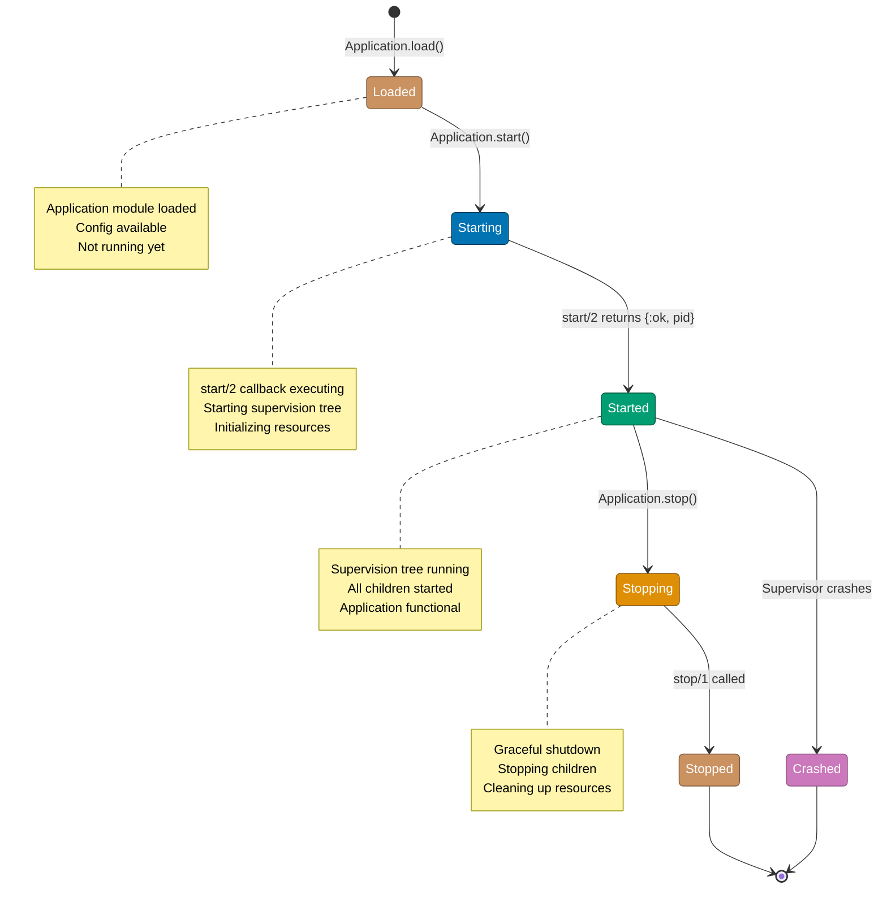
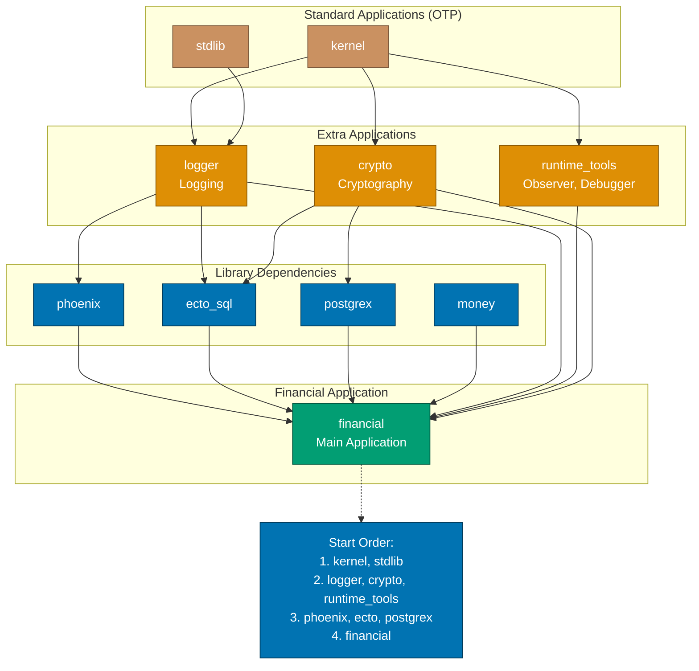

# OTP Application Patterns

**Category**: OTP Patterns
**Elixir Version**: 1.18.0+
**Related**: [GenServer Patterns](ex-so-stla-el__otp-genserver.md), [Supervisor Patterns](ex-so-stla-el__otp-supervisor.md)

## Overview

Applications are the fundamental unit of code organization in Elixir/OTP. An application groups related modules, provides configuration, manages dependencies, and typically starts a supervision tree for runtime processes.

**Key Benefits**:

- 📦 **Modularity**: Self-contained units of functionality
- 🔄 **Lifecycle**: Controlled start/stop behavior
- ⚙️ **Configuration**: Environment-based configuration
- 📚 **Dependencies**: Explicit dependency management
- 🎯 **Packaging**: Deployable as releases

## Quick Reference

**Jump to**:

- [Application Structure](#application-structure)
- [Starting Applications](#starting-applications)
- [Umbrella Projects](#umbrella-projects)
- [GenStage and Flow](#genstage-and-flow)
- [Broadway](#broadway)
- [Financial Domain Examples](#financial-domain-examples)

## Application Structure

### Basic Application

```elixir
# mix.exs
defmodule Financial.MixProject do
  use Mix.Project

  def project do
    [
      app: :financial,
      version: "1.0.0",
      elixir: "~> 1.17",
      start_permanent: Mix.env() == :prod,
      deps: deps()
    ]
  end

  def application do
    [
      mod: {Financial.Application, []},
      extra_applications: [:logger, :runtime_tools]
    ]
  end

  defp deps do
    [
      {:phoenix, "~> 1.7.0"},
      {:ecto_sql, "~> 3.12"},
      {:money, "~> 1.12"},
      {:decimal, "~> 2.1"}
    ]
  end
end
```

### Application Callback

The following diagram shows the complete application supervision tree:

```mermaid
graph TD
    App[Financial.Application<br/>Root Supervisor]

    Repo[Financial.Repo<br/>Database Connection]
    PubSub[Phoenix.PubSub<br/>Message Bus]
    Registry[Registry<br/>Process Registry]

    CampSup[CampaignSupervisor]
    PaySup[PaymentSupervisor]
    DonSup[DonationSupervisor]

    CampW1[Campaign Workers]
    CampW2[Campaign Cache]
    PayW1[Payment Gateway]
    PayW2[Payment Processors]
    DonW1[Donation Validators]
    DonW2[Donation Processors]

    Oban[Oban<br/>Background Jobs]
    Endpoint[FinancialWeb.Endpoint<br/>Phoenix HTTP Server]

    App --> Repo
    App --> PubSub
    App --> Registry
    App --> CampSup
    App --> PaySup
    App --> DonSup
    App --> Oban
    App --> Endpoint

    CampSup -.-> CampW1
    CampSup -.-> CampW2
    PaySup -.-> PayW1
    PaySup -.-> PayW2
    DonSup -.-> DonW1
    DonSup -.-> DonW2

    style App fill:#0173B2,stroke:#023B5A,color:#FFF
    style Repo fill:#029E73,stroke:#01593F,color:#FFF
    style PubSub fill:#029E73,stroke:#01593F,color:#FFF
    style Registry fill:#029E73,stroke:#01593F,color:#FFF
    style CampSup fill:#0173B2,stroke:#023B5A,color:#FFF
    style PaySup fill:#0173B2,stroke:#023B5A,color:#FFF
    style DonSup fill:#0173B2,stroke:#023B5A,color:#FFF
    style Oban fill:#DE8F05,stroke:#8A5903,color:#FFF
    style Endpoint fill:#029E73,stroke:#01593F,color:#FFF
    style CampW1 fill:#CA9161,stroke:#7D5A3D,color:#FFF
    style CampW2 fill:#CA9161,stroke:#7D5A3D,color:#FFF
    style PayW1 fill:#CA9161,stroke:#7D5A3D,color:#FFF
    style PayW2 fill:#CA9161,stroke:#7D5A3D,color:#FFF
    style DonW1 fill:#CA9161,stroke:#7D5A3D,color:#FFF
    style DonW2 fill:#CA9161,stroke:#7D5A3D,color:#FFF
```



```elixir
# lib/financial/application.ex
defmodule Financial.Application do
  @moduledoc """
  The Financial Application.
  """

  use Application

  @impl true
  def start(_type, _args) do
    children = [
      # Database
      Financial.Repo,

      # PubSub
      {Phoenix.PubSub, name: Financial.PubSub},

      # Registries
      {Registry, keys: :unique, name: Financial.Registry},

      # Supervisors
      Financial.CampaignSupervisor,
      Financial.PaymentSupervisor,
      Financial.DonationSupervisor,

      # Background jobs
      {Oban, Application.fetch_env!(:financial, Oban)},

      # Web endpoint (start last)
      FinancialWeb.Endpoint
    ]

    opts = [strategy: :one_for_one, name: Financial.Supervisor]
    Supervisor.start_link(children, opts)
  end

  @impl true
  def stop(_state) do
    # Cleanup when application stops
    :ok
  end

  # Tell Phoenix to update the endpoint configuration
  # whenever the application is updated.
  @impl true
  def config_change(changed, _new, removed) do
    FinancialWeb.Endpoint.config_change(changed, removed)
    :ok
  end
end
```

### Directory Structure

```
financial/
├── config/
│   ├── config.exs         # Compile-time config
│   ├── dev.exs           # Development config
│   ├── test.exs          # Test config
│   ├── prod.exs          # Production config
│   └── runtime.exs       # Runtime config
├── lib/
│   ├── financial/
│   │   ├── application.ex          # Application callback
│   │   ├── repo.ex                 # Ecto repository
│   │   ├── campaign/               # Campaign context
│   │   │   ├── campaign.ex
│   │   │   └── campaign_supervisor.ex
│   │   ├── donation/               # Donation context
│   │   │   ├── donation.ex
│   │   │   └── donation_supervisor.ex
│   │   └── payment/                # Payment context
│   │       ├── payment.ex
│   │       └── payment_supervisor.ex
│   └── financial_web/
│       ├── controllers/
│       ├── views/
│       └── endpoint.ex
├── test/
├── priv/
└── mix.exs
```

## Starting Applications

The following diagram shows the application lifecycle states:



### Application Start Types

```elixir
# Permanent (default): Never stops, if it stops the VM stops
{:ok, _} = Application.ensure_all_started(:financial, :permanent)

# Temporary: Can stop without stopping the VM
{:ok, _} = Application.ensure_all_started(:financial, :temporary)

# Transient: Can stop normally, abnormal stops crash VM
{:ok, _} = Application.ensure_all_started(:financial, :transient)
```

### Conditional Starting

```elixir
defmodule Financial.Application do
  use Application

  def start(_type, _args) do
    children = base_children() ++ environment_children()

    opts = [strategy: :one_for_one, name: Financial.Supervisor]
    Supervisor.start_link(children, opts)
  end

  defp base_children do
    [
      Financial.Repo,
      {Phoenix.PubSub, name: Financial.PubSub}
    ]
  end

  defp environment_children do
    case Mix.env() do
      :test ->
        # No endpoint in tests
        []

      :dev ->
        [
          # Development-only tools
          Financial.DevTools,
          FinancialWeb.Endpoint
        ]

      :prod ->
        [
          # Production monitoring
          Financial.Telemetry,
          Financial.ErrorReporter,
          FinancialWeb.Endpoint
        ]
    end
  end
end
```

### Application Dependencies

The following diagram shows application dependency order:



```elixir
# mix.exs
def application do
  [
    mod: {Financial.Application, []},
    extra_applications: [
      :logger,         # Logging
      :runtime_tools,  # Observer, debugger
      :os_mon,        # System monitoring
      :crypto         # Cryptography
    ]
  ]
end

# Application starts in dependency order
# 1. :logger
# 2. :runtime_tools
# 3. :crypto
# 4. :financial (this app)
```

## Umbrella Projects

### Structure

```
financial_umbrella/
├── apps/
│   ├── financial/              # Core business logic
│   │   ├── lib/
│   │   ├── test/
│   │   └── mix.exs
│   ├── financial_web/          # Web interface
│   │   ├── lib/
│   │   ├── test/
│   │   └── mix.exs
│   ├── financial_worker/       # Background workers
│   │   ├── lib/
│   │   ├── test/
│   │   └── mix.exs
│   └── financial_api/          # API service
│       ├── lib/
│       ├── test/
│       └── mix.exs
├── config/
│   ├── config.exs
│   ├── dev.exs
│   ├── test.exs
│   └── prod.exs
└── mix.exs
```

### Umbrella Root mix.exs

```elixir
# mix.exs (umbrella root)
defmodule FinancialUmbrella.MixProject do
  use Mix.Project

  def project do
    [
      apps_path: "apps",
      version: "1.0.0",
      start_permanent: Mix.env() == :prod,
      deps: deps(),
      aliases: aliases()
    ]
  end

  defp deps do
    []
  end

  defp aliases do
    [
      setup: ["cmd mix setup"],
      test: ["cmd mix test"]
    ]
  end
end
```

### Core Application

```elixir
# apps/financial/mix.exs
defmodule Financial.MixProject do
  use Mix.Project

  def project do
    [
      app: :financial,
      version: "1.0.0",
      build_path: "../../_build",
      config_path: "../../config/config.exs",
      deps_path: "../../deps",
      lockfile: "../../mix.lock",
      elixir: "~> 1.17",
      start_permanent: Mix.env() == :prod,
      deps: deps()
    ]
  end

  def application do
    [
      mod: {Financial.Application, []},
      extra_applications: [:logger]
    ]
  end

  defp deps do
    [
      {:ecto_sql, "~> 3.12"},
      {:postgrex, "~> 0.18"},
      {:money, "~> 1.12"}
    ]
  end
end

# apps/financial/lib/financial/application.ex
defmodule Financial.Application do
  use Application

  def start(_type, _args) do
    children = [
      Financial.Repo,
      {Registry, keys: :unique, name: Financial.Registry},
      Financial.CampaignSupervisor,
      Financial.DonationSupervisor
    ]

    Supervisor.start_link(children, strategy: :one_for_one)
  end
end
```

### Web Application

```elixir
# apps/financial_web/mix.exs
defmodule FinancialWeb.MixProject do
  use Mix.Project

  def project do
    [
      app: :financial_web,
      version: "1.0.0",
      build_path: "../../_build",
      config_path: "../../config/config.exs",
      deps_path: "../../deps",
      lockfile: "../../mix.lock",
      elixir: "~> 1.17",
      start_permanent: Mix.env() == :prod,
      deps: deps()
    ]
  end

  def application do
    [
      mod: {FinancialWeb.Application, []},
      extra_applications: [:logger]
    ]
  end

  defp deps do
    [
      {:financial, in_umbrella: true},  # Depend on core app
      {:phoenix, "~> 1.7.0"},
      {:phoenix_html, "~> 4.0"},
      {:phoenix_live_view, "~> 1.0"},
      {:jason, "~> 1.4"}
    ]
  end
end

# apps/financial_web/lib/financial_web/application.ex
defmodule FinancialWeb.Application do
  use Application

  def start(_type, _args) do
    children = [
      {Phoenix.PubSub, name: FinancialWeb.PubSub},
      FinancialWeb.Endpoint
    ]

    Supervisor.start_link(children, strategy: :one_for_one)
  end
end
```

### Cross-App Communication

```elixir
# Core app exposes public API
defmodule Financial.Campaigns do
  def create_campaign(attrs) do
    # Business logic
    {:ok, campaign}
  end

  def list_campaigns do
    # Query campaigns
    []
  end
end

# Web app calls core API
defmodule FinancialWeb.CampaignController do
  use FinancialWeb, :controller

  def index(conn, _params) do
    # Call core app
    campaigns = Financial.Campaigns.list_campaigns()
    render(conn, "index.html", campaigns: campaigns)
  end

  def create(conn, %{"campaign" => campaign_params}) do
    # Call core app
    case Financial.Campaigns.create_campaign(campaign_params) do
      {:ok, campaign} ->
        redirect(conn, to: "/campaigns/#{campaign.id}")

      {:error, changeset} ->
        render(conn, "new.html", changeset: changeset)
    end
  end
end
```

## GenStage and Flow

### GenStage Producer-Consumer

```elixir
# Producer: Generates events
defmodule DonationProducer do
  use GenStage

  def start_link(_) do
    GenStage.start_link(__MODULE__, 0, name: __MODULE__)
  end

  def init(counter) do
    {:producer, counter}
  end

  def handle_demand(demand, counter) when demand > 0 do
    # Generate events
    events = Enum.to_list(counter..(counter + demand - 1))
    {:noreply, events, counter + demand}
  end
end

# Consumer: Processes events
defmodule DonationConsumer do
  use GenStage

  def start_link(_) do
    GenStage.start_link(__MODULE__, :ok, name: __MODULE__)
  end

  def init(:ok) do
    {:consumer, :ok, subscribe_to: [DonationProducer]}
  end

  def handle_events(events, _from, state) do
    Enum.each(events, fn donation_id ->
      process_donation(donation_id)
    end)

    {:noreply, [], state}
  end

  defp process_donation(id) do
    IO.puts("Processing donation #{id}")
  end
end

# Start supervision tree
children = [
  DonationProducer,
  DonationConsumer
]

Supervisor.start_link(children, strategy: :one_for_one)
```

### Flow for Data Pipelines

```elixir
defmodule Financial.DonationAnalyzer do
  @moduledoc """
  Parallel donation analysis using Flow.
  """

  alias Experimental.Flow

  def analyze_donations(campaign_id) do
    # Load all donations
    donations = Financial.Donations.list_by_campaign(campaign_id)

    # Process in parallel
    donations
    |> Flow.from_enumerable(stages: 4)  # 4 parallel stages
    |> Flow.partition(key: {:elem, 1})  # Partition by donor
    |> Flow.reduce(fn -> %{} end, fn donation, acc ->
      donor_id = donation.donor_id

      donor_total = Map.get(acc, donor_id, Money.new(0, :IDR))
      new_total = Money.add(donor_total, donation.amount)

      Map.put(acc, donor_id, new_total)
    end)
    |> Flow.emit(:state)
    |> Enum.to_list()
    |> List.first()
  end

  def calculate_statistics(donations) do
    donations
    |> Flow.from_enumerable(stages: 8)
    |> Flow.map(fn donation ->
      %{
        amount: donation.amount,
        timestamp: donation.timestamp,
        hour: donation.timestamp.hour
      }
    end)
    |> Flow.partition(key: {:key, :hour})
    |> Flow.group_by(& &1.hour)
    |> Flow.map(fn {hour, donations_in_hour} ->
      total = donations_in_hour
              |> Enum.map(& &1.amount)
              |> Enum.reduce(Money.new(0, :IDR), &Money.add/2)

      {hour, %{count: length(donations_in_hour), total: total}}
    end)
    |> Enum.to_list()
    |> Enum.sort()
  end
end
```

## Broadway

### Basic Broadway Pipeline

```elixir
defmodule Financial.DonationPipeline do
  @moduledoc """
  Broadway pipeline for processing donations from queue.
  """

  use Broadway

  def start_link(_opts) do
    Broadway.start_link(__MODULE__,
      name: __MODULE__,
      producer: [
        module: {BroadwayRabbitMQ.Producer,
          queue: "donations",
          connection: [
            host: "localhost",
            username: "guest",
            password: "guest"
          ],
          qos: [
            prefetch_count: 50
          ]
        },
        concurrency: 1
      ],
      processors: [
        default: [
          concurrency: 10
        ]
      ],
      batchers: [
        default: [
          batch_size: 100,
          batch_timeout: 2000,
          concurrency: 5
        ]
      ]
    )
  end

  @impl true
  def handle_message(_processor, message, _context) do
    # Decode message
    donation = decode_donation(message.data)

    # Validate
    case validate_donation(donation) do
      :ok ->
        Message.put_data(message, donation)

      {:error, reason} ->
        Message.failed(message, reason)
    end
  end

  @impl true
  def handle_batch(_batcher, messages, _batch_info, _context) do
    # Process batch of donations
    donations = Enum.map(messages, & &1.data)

    case insert_donations_batch(donations) do
      {:ok, _results} ->
        messages

      {:error, reason} ->
        Enum.map(messages, &Message.failed(&1, reason))
    end
  end

  defp decode_donation(data) do
    Jason.decode!(data)
  end

  defp validate_donation(donation) do
    if donation["amount"] > 0, do: :ok, else: {:error, :invalid_amount}
  end

  defp insert_donations_batch(donations) do
    Financial.Repo.insert_all(Financial.Donation, donations)
    {:ok, donations}
  end
end
```

### Broadway with SQS

```elixir
defmodule Financial.PaymentProcessor do
  use Broadway

  alias Broadway.Message

  def start_link(_opts) do
    Broadway.start_link(__MODULE__,
      name: __MODULE__,
      producer: [
        module: {BroadwaySQS.Producer,
          queue_name: "financial-payments",
          config: [
            access_key_id: System.get_env("AWS_ACCESS_KEY_ID"),
            secret_access_key: System.get_env("AWS_SECRET_ACCESS_KEY"),
            region: "us-east-1"
          ]
        },
        concurrency: 2
      ],
      processors: [
        default: [
          concurrency: 20,
          max_demand: 10
        ]
      ],
      batchers: [
        database: [
          batch_size: 50,
          batch_timeout: 5000,
          concurrency: 10
        ],
        notifications: [
          batch_size: 100,
          batch_timeout: 2000,
          concurrency: 5
        ]
      ]
    )
  end

  @impl true
  def handle_message(_processor, message, _context) do
    payment = decode_payment(message.data)

    # Route to different batchers
    case process_payment(payment) do
      {:ok, processed} ->
        message
        |> Message.put_data(processed)
        |> Message.put_batcher(:database)

      {:error, :notify} ->
        message
        |> Message.put_batcher(:notifications)

      {:error, reason} ->
        Message.failed(message, reason)
    end
  end

  @impl true
  def handle_batch(:database, messages, _batch_info, _context) do
    payments = Enum.map(messages, & &1.data)
    save_payments(payments)
    messages
  end

  @impl true
  def handle_batch(:notifications, messages, _batch_info, _context) do
    messages
    |> Enum.map(& &1.data)
    |> send_failure_notifications()

    messages
  end

  defp decode_payment(data), do: Jason.decode!(data)
  defp process_payment(payment), do: {:ok, payment}
  defp save_payments(payments), do: :ok
  defp send_failure_notifications(payments), do: :ok
end
```

## Financial Domain Examples

### Complete Financial Platform Application

```elixir
defmodule Financial.Application do
  @moduledoc """
  Complete financial platform with all subsystems.
  """

  use Application

  @impl true
  def start(_type, _args) do
    children = [
      # Core infrastructure
      Financial.Repo,
      {Phoenix.PubSub, name: Financial.PubSub},
      {Registry, keys: :unique, name: Financial.Registry},

      # Telemetry and monitoring
      Financial.Telemetry,

      # Campaign subsystem
      Financial.CampaignSupervisor,

      # Donation subsystem
      Financial.DonationSupervisor,

      # Payment subsystem
      Financial.PaymentSupervisor,

      # Background jobs
      {Oban, Application.fetch_env!(:financial, Oban)},

      # Data pipelines (Broadway)
      Financial.DonationPipeline,
      Financial.PaymentProcessor,

      # Web interface
      FinancialWeb.Endpoint
    ]

    opts = [strategy: :one_for_one, name: Financial.Supervisor]
    Supervisor.start_link(children, opts)
  end

  @impl true
  def config_change(changed, _new, removed) do
    FinancialWeb.Endpoint.config_change(changed, removed)
    :ok
  end
end

defmodule Financial.CampaignSupervisor do
  use Supervisor

  def start_link(opts) do
    Supervisor.start_link(__MODULE__, opts, name: __MODULE__)
  end

  @impl true
  def init(_opts) do
    children = [
      {Registry, keys: :unique, name: CampaignRegistry},
      {DynamicSupervisor, name: CampaignWorkerSupervisor, strategy: :one_for_one},
      CampaignManager,
      CampaignMonitor
    ]

    Supervisor.init(children, strategy: :one_for_one)
  end
end

defmodule Financial.DonationSupervisor do
  use Supervisor

  def start_link(opts) do
    Supervisor.start_link(__MODULE__, opts, name: __MODULE__)
  end

  @impl true
  def init(_opts) do
    children = [
      {Registry, keys: :unique, name: DonationRegistry},
      {PartitionSupervisor,
       child_spec: DonationWorker,
       name: DonationPartitionSupervisor,
       partitions: System.schedulers_online() * 2},
      DonationAnalyzer
    ]

    Supervisor.init(children, strategy: :one_for_one)
  end
end

defmodule Financial.PaymentSupervisor do
  use Supervisor

  def start_link(opts) do
    Supervisor.start_link(__MODULE__, opts, name: __MODULE__)
  end

  @impl true
  def init(_opts) do
    children = [
      {Registry, keys: :unique, name: PaymentRegistry},
      PaymentGateway,
      PaymentReconciliation,
      {DynamicSupervisor, name: PaymentProcessorSupervisor, strategy: :one_for_one}
    ]

    Supervisor.init(children, strategy: :one_for_one)
  end
end
```

### Umbrella Project for Financial Platform

```
financial_umbrella/
├── apps/
│   ├── financial_core/         # Core domain logic
│   │   ├── lib/
│   │   │   ├── financial_core/
│   │   │   │   ├── application.ex
│   │   │   │   ├── repo.ex
│   │   │   │   ├── campaigns.ex
│   │   │   │   ├── donations.ex
│   │   │   │   └── payments.ex
│   │   │   └── financial_core.ex
│   │   └── mix.exs
│   ├── financial_web/          # Web interface (Phoenix)
│   │   ├── lib/
│   │   │   ├── financial_web/
│   │   │   │   ├── controllers/
│   │   │   │   ├── live/
│   │   │   │   ├── views/
│   │   │   │   └── endpoint.ex
│   │   │   └── financial_web.ex
│   │   └── mix.exs
│   ├── financial_api/          # REST API
│   │   ├── lib/
│   │   │   ├── financial_api/
│   │   │   │   ├── controllers/
│   │   │   │   ├── views/
│   │   │   │   └── endpoint.ex
│   │   │   └── financial_api.ex
│   │   └── mix.exs
│   ├── financial_worker/       # Background jobs
│   │   ├── lib/
│   │   │   ├── financial_worker/
│   │   │   │   ├── application.ex
│   │   │   │   └── workers/
│   │   │   └── financial_worker.ex
│   │   └── mix.exs
│   └── financial_analytics/    # Analytics pipeline
│       ├── lib/
│       │   ├── financial_analytics/
│       │   │   ├── application.ex
│       │   │   └── pipelines/
│       │   └── financial_analytics.ex
│       └── mix.exs
└── mix.exs
```

### Broadway-Based Event Processing

```elixir
defmodule Financial.EventProcessor do
  @moduledoc """
  Processes financial events using Broadway.
  """

  use Broadway

  alias Broadway.Message

  def start_link(_opts) do
    Broadway.start_link(__MODULE__,
      name: __MODULE__,
      producer: [
        module: {OffBroadway.Kafka.Producer,
          hosts: ["localhost:9092"],
          group_id: "financial-events",
          topics: ["donations", "payments", "campaigns"]
        },
        concurrency: 4
      ],
      processors: [
        default: [
          concurrency: 20
        ]
      ],
      batchers: [
        donations: [batch_size: 100, batch_timeout: 1000],
        payments: [batch_size: 50, batch_timeout: 2000],
        campaigns: [batch_size: 20, batch_timeout: 5000]
      ]
    )
  end

  @impl true
  def handle_message(_processor, message, _context) do
    event = decode_event(message.data)

    # Route to appropriate batcher
    batcher = determine_batcher(event)

    message
    |> Message.put_data(event)
    |> Message.put_batcher(batcher)
  end

  @impl true
  def handle_batch(:donations, messages, _batch_info, _context) do
    donations = Enum.map(messages, & &1.data)
    process_donations_batch(donations)
    messages
  end

  @impl true
  def handle_batch(:payments, messages, _batch_info, _context) do
    payments = Enum.map(messages, & &1.data)
    process_payments_batch(payments)
    messages
  end

  @impl true
  def handle_batch(:campaigns, messages, _batch_info, _context) do
    campaigns = Enum.map(messages, & &1.data)
    process_campaigns_batch(campaigns)
    messages
  end

  defp decode_event(data), do: Jason.decode!(data)
  defp determine_batcher(event), do: String.to_atom(event["type"])
  defp process_donations_batch(donations), do: :ok
  defp process_payments_batch(payments), do: :ok
  defp process_campaigns_batch(campaigns), do: :ok
end
```

## Best Practices

### 1. Start Critical Services First

```elixir
children = [
  Financial.Repo,              # Database first
  {Phoenix.PubSub, []},        # PubSub second
  {Registry, []},              # Registry third
  BusinessWorkers,             # Workers after infrastructure
  FinancialWeb.Endpoint       # Web last
]
```

### 2. Use Configuration

```elixir
# config/runtime.exs
import Config

if config_env() == :prod do
  config :financial, Financial.Repo,
    url: System.get_env("DATABASE_URL"),
    pool_size: String.to_integer(System.get_env("POOL_SIZE") || "10")
end

# lib/financial/application.ex
pool_size = Application.fetch_env!(:financial, Financial.Repo)[:pool_size]
```

### 3. Handle Configuration Changes

```elixir
@impl true
def config_change(changed, _new, removed) do
  # Reload endpoint config
  FinancialWeb.Endpoint.config_change(changed, removed)
  :ok
end
```

### 4. Structure Umbrella Dependencies

```elixir
# Core app: No dependencies on other apps
{:ecto_sql, "~> 3.12"}

# Web app: Depends on core
{:financial_core, in_umbrella: true}
{:phoenix, "~> 1.7"}

# Worker app: Depends on core
{:financial_core, in_umbrella: true}
{:oban, "~> 2.15"}
```

## Performance Considerations

### Start Time Optimization

```elixir
# Bad: Sequential start
def init(_) do
  repo = start_repo()
  cache = start_cache(repo)
  workers = start_workers(cache)
  # Total: sum of all start times
end

# Good: Concurrent start
def init(_) do
  children = [
    Financial.Repo,
    Financial.Cache,
    Financial.Workers
  ]
  # Total: max of all start times
  Supervisor.init(children, strategy: :one_for_one)
end
```

### Broadway Tuning

```elixir
# Tune concurrency based on workload
Broadway.start_link(__MODULE__,
  processors: [
    default: [
      concurrency: System.schedulers_online() * 2
    ]
  ],
  batchers: [
    default: [
      batch_size: 100,        # Larger batches = fewer DB calls
      batch_timeout: 1000,    # Max wait time
      concurrency: 10         # Parallel batch processing
    ]
  ]
)
```

## Common Patterns

### Application with Feature Flags

```elixir
defmodule Financial.Application do
  use Application

  def start(_type, _args) do
    children = base_children() ++ optional_children()
    Supervisor.start_link(children, strategy: :one_for_one)
  end

  defp base_children do
    [Financial.Repo, Financial.Core]
  end

  defp optional_children do
    []
    |> maybe_add_analytics()
    |> maybe_add_notifications()
  end

  defp maybe_add_analytics(children) do
    if Application.get_env(:financial, :enable_analytics, false) do
      [Financial.Analytics | children]
    else
      children
    end
  end

  defp maybe_add_notifications(children) do
    if Application.get_env(:financial, :enable_notifications, false) do
      [Financial.NotificationService | children]
    else
      children
    end
  end
end
```

## Resources

### Official Documentation

- [Application Behavior](https://hexdocs.pm/elixir/Application.html)
- [GenStage](https://hexdocs.pm/gen_stage)
- [Flow](https://hexdocs.pm/flow)
- [Broadway](https://hexdocs.pm/broadway)
- [Mix Task Docs](https://hexdocs.pm/mix)

### Related Documentation

- [Back to Elixir README](README.md)
- [GenServer Patterns](ex-so-stla-el__otp-genserver.md)
- [Supervisor Patterns](ex-so-stla-el__otp-supervisor.md)
- [Concurrency and Parallelism](ex-so-stla-el__concurrency-and-parallelism.md)

---

**Last Updated**: 2025-01-23
**Elixir Version**: 1.18.0+
**OTP Version**: 24+
