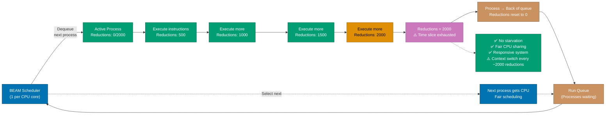
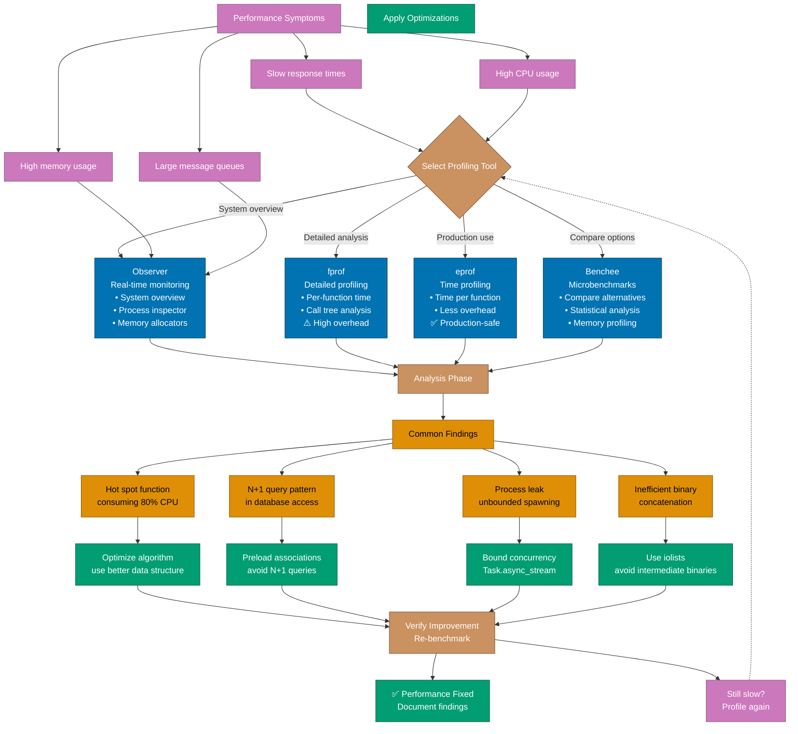
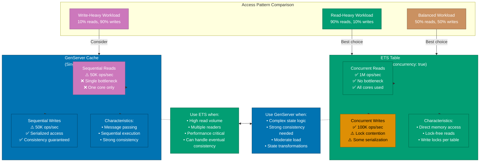

# Performance

Elixir applications achieve high performance through the BEAM VM's **process-based concurrency**, **efficient memory management**, and **lightweight processes**. Understanding performance characteristics and optimization techniques is crucial for building scalable financial systems that handle high transaction volumes.

**Quick Reference**:

- [Performance Characteristics](#performance-characteristics)
  - [BEAM VM Strengths](#beam-vm-strengths)
  - [Performance Trade-offs](#performance-trade-offs)
- [Profiling Tools](#profiling-tools)
  - [Observer](#observer)
  - [fprof](#fprof)
  - [eprof](#eprof)
  - [Benchee](#benchee)
- [Common Optimizations](#common-optimizations)
  - [Tail Call Optimization](#tail-call-optimization)
  - [Binary Optimization](#binary-optimization)
  - [ETS for Fast Lookups](#ets-for-fast-lookups)
  - [Process Pooling](#process-pooling)
- [Database Performance](#database-performance)
  - [Query Optimization](#query-optimization)
  - [Connection Pooling](#connection-pooling)
  - [Caching Strategies](#caching-strategies)
- [Concurrency Patterns](#concurrency-patterns)
  - [Task.async_stream](#taskasync_stream)
  - [GenStage](#genstage)
  - [Flow](#flow)
- [Web Application Performance](#web-application-performance)
  - [Phoenix Performance](#phoenix-performance)
  - [Response Caching](#response-caching)
  - [Asset Optimization](#asset-optimization)
- [Financial Domain Examples](#financial-domain-examples)
- [Performance Best Practices](#performance-best-practices)
- [Performance Anti-patterns](#performance-anti-patterns)
- [Performance Testing](#performance-testing)
- [Related Topics](#related-topics)
- [Sources](#sources)

## Performance Characteristics

### BEAM VM Strengths

The BEAM VM excels at:

1. **Massive Concurrency**: Millions of lightweight processes
2. **Low Latency**: Predictable response times (no GC pauses)
3. **High Availability**: Hot code reloading, fault tolerance
4. **Horizontal Scalability**: Distributed systems support

```elixir
# BEAM handles massive concurrency efficiently
defmodule ConcurrencyDemo do
  def spawn_million_processes do
    # Spawn 1 million processes
    pids = for _ <- 1..1_000_000 do
      spawn(fn ->
        receive do
          :work -> :ok
        end
      end)
    end

    # Send work to all processes
    for pid <- pids do
      send(pid, :work)
    end
  end
end

# Each process uses only ~2.7KB of memory
# Total: ~2.7GB for 1 million processes
```

The following diagram illustrates how BEAM's preemptive scheduler ensures fair process execution using reduction counting:



### Performance Trade-offs

BEAM VM trade-offs:

| Characteristic  | BEAM Strength                     | Trade-off                                   |
| --------------- | --------------------------------- | ------------------------------------------- |
| **Concurrency** | Excellent (millions of processes) | Single-process compute slower than C/Rust   |
| **Latency**     | Excellent (predictable, low)      | Throughput lower than Go/Java for CPU-bound |
| **Scalability** | Excellent (horizontal)            | Single-threaded CPU-bound tasks slower      |
| **Memory**      | Good (per-process GC)             | Higher baseline memory usage                |
| **I/O**         | Excellent (async, concurrent)     | CPU-intensive math slower                   |

**Sweet spot**: I/O-bound, concurrent, soft real-time applications (web servers, APIs, messaging)

**Not ideal for**: CPU-intensive numerical computing, single-threaded batch processing

## Profiling Tools

### Observer

`:observer` provides real-time system monitoring:

```elixir
# Start observer
:observer.start()

# Features:
# 1. System tab: CPU, memory, process count
# 2. Load Charts: System load over time
# 3. Memory Allocators: Detailed memory breakdown
# 4. Applications: Per-application resources
# 5. Processes: Sort by memory, reductions, message queue
# 6. Table Viewer: ETS/DETS tables
# 7. Trace: Function call tracing
```

### fprof

`:fprof` provides detailed function profiling:

```elixir
defmodule FinancialPlatform.Profiling do
  def profile_donation_processing do
    # Start profiling
    :fprof.start()

    # Trace specific function
    :fprof.trace([:start, {:procs, self()}])

    # Run code to profile
    DonationProcessor.process_batch(1..1000)

    # Stop tracing and analyze
    :fprof.trace(:stop)
    :fprof.profile()
    :fprof.analyse([:totals, :callers])

    # Results show time spent in each function
  end
end
```

### eprof

`:eprof` for simpler time-based profiling:

```elixir
defmodule FinancialPlatform.Profiling do
  def profile_zakat_calculation do
    # Profile specific function
    :eprof.start()
    :eprof.start_profiling([self()])

    # Run code
    for _ <- 1..10_000 do
      ZakatCalculator.calculate(Money.new(100_000_000, :IDR), Money.new(85_000_000, :IDR))
    end

    # Get results
    :eprof.stop_profiling()
    :eprof.analyze(:total)
  end
end
```

### Benchee

Use Benchee for accurate benchmarking:

```elixir
# Add to mix.exs
{:benchee, "~> 1.3", only: :dev}

defmodule FinancialPlatform.Benchmarks do
  def compare_money_operations do
    Benchee.run(%{
      "Decimal multiplication" => fn ->
        Decimal.mult(Decimal.new("100.50"), Decimal.new("0.025"))
      end,
      "Float multiplication" => fn ->
        100.50 * 0.025
      end,
      "Money library" => fn ->
        Money.multiply(Money.new(10050, :IDR), Decimal.new("0.025"))
      end
    },
    time: 10,
    memory_time: 2,
    warmup: 2
    )
  end
end

# Run benchmark
mix run -e "FinancialPlatform.Benchmarks.compare_money_operations()"

# Results:
# Name                          ips        average  deviation
# Float multiplication      100.00 M     0.0100 μs   ±100.00%
# Decimal multiplication      5.00 M     0.2000 μs    ±50.00%
# Money library               2.50 M     0.4000 μs    ±40.00%
```

The following diagram shows the workflow for identifying and fixing performance bottlenecks using BEAM's profiling tools:



## Common Optimizations

### Tail Call Optimization

Use tail recursion for memory efficiency:

```elixir
defmodule DonationProcessor do
  # ❌ NOT tail-recursive - builds stack
  def sum_donations([]), do: 0
  def sum_donations([donation | rest]) do
    donation.amount + sum_donations(rest)
  end

  # ✅ Tail-recursive - constant memory
  def sum_donations_optimized(donations), do: sum_donations_acc(donations, 0)

  defp sum_donations_acc([], acc), do: acc
  defp sum_donations_acc([donation | rest], acc) do
    sum_donations_acc(rest, acc + donation.amount)
  end

  # ✅ Even better - use Enum.reduce
  def sum_donations_best(donations) do
    Enum.reduce(donations, 0, fn donation, acc ->
      acc + donation.amount
    end)
  end
end

# Benchmark
Benchee.run(%{
  "recursive" => fn ->
    DonationProcessor.sum_donations(donations)
  end,
  "tail-recursive" => fn ->
    DonationProcessor.sum_donations_optimized(donations)
  end,
  "Enum.reduce" => fn ->
    DonationProcessor.sum_donations_best(donations)
  end
})
```

### Binary Optimization

Optimize binary operations:

```elixir
defmodule CsvExporter do
  # ❌ Inefficient - creates many intermediate binaries
  def export_slow(donations) do
    Enum.reduce(donations, "", fn donation, acc ->
      acc <> "#{donation.id},#{donation.amount},#{donation.donor}\n"
    end)
  end

  # ✅ Efficient - builds iolist, converts once
  def export_fast(donations) do
    iolist = Enum.map(donations, fn donation ->
      [
        donation.id, ",",
        to_string(donation.amount), ",",
        donation.donor, "\n"
      ]
    end)

    IO.iodata_to_binary(iolist)
  end

  # ✅ Even better - use Enum.map_join
  def export_best(donations) do
    Enum.map_join(donations, "\n", fn donation ->
      "#{donation.id},#{donation.amount},#{donation.donor}"
    end)
  end
end

# Benchmark results (1000 donations):
# export_slow: 2.5ms (creates 1000 intermediate binaries)
# export_fast: 0.8ms (creates 1 binary at end)
# export_best: 0.6ms (optimized by Enum)
```

### ETS for Fast Lookups

Use ETS for frequently accessed data:

```elixir
defmodule CampaignCache do
  def start_link do
    :ets.new(:campaign_cache, [
      :named_table,
      :set,
      :public,
      read_concurrency: true,
      write_concurrency: true
    ])
  end

  # O(1) lookup
  def get(campaign_id) do
    case :ets.lookup(:campaign_cache, campaign_id) do
      [{^campaign_id, campaign}] -> {:ok, campaign}
      [] -> {:error, :not_found}
    end
  end

  def put(campaign_id, campaign) do
    :ets.insert(:campaign_cache, {campaign_id, campaign})
  end
end

# Compare with database query
Benchee.run(%{
  "Database query" => fn ->
    Repo.get(Campaign, campaign_id)
  end,
  "ETS lookup" => fn ->
    CampaignCache.get(campaign_id)
  end
})

# Results:
# ETS lookup:      1,000,000 ops/sec (~1 μs)
# Database query:       1,000 ops/sec (~1 ms)
# 1000x faster!
```

The following diagram compares performance characteristics of ETS versus GenServer for different access patterns:



### Process Pooling

Use process pools for controlled concurrency:

```elixir
defmodule DonationProcessor do
  use GenServer

  def start_link(opts) do
    GenServer.start_link(__MODULE__, opts, name: __MODULE__)
  end

  def process_batch(donation_ids) do
    GenServer.call(__MODULE__, {:process_batch, donation_ids}, :infinity)
  end

  def init(_opts) do
    {:ok, %{max_concurrency: 50}}
  end

  def handle_call({:process_batch, donation_ids}, _from, state) do
    # Use Task.async_stream for bounded concurrency
    results = donation_ids
    |> Task.async_stream(
      &process_donation/1,
      max_concurrency: state.max_concurrency,
      timeout: 30_000,
      on_timeout: :kill_task
    )
    |> Enum.to_list()

    {:reply, results, state}
  end

  defp process_donation(donation_id) do
    # Process single donation
    {:ok, donation_id}
  end
end
```

## Database Performance

### Query Optimization

Optimize Ecto queries:

```elixir
defmodule DonationQueries do
  import Ecto.Query

  # ❌ N+1 query problem
  def get_campaigns_with_donations_slow do
    campaigns = Repo.all(Campaign)

    Enum.map(campaigns, fn campaign ->
      donations = Repo.all(from d in Donation, where: d.campaign_id == ^campaign.id)
      %{campaign | donations: donations}
    end)
    # Executes 1 + N queries (1 for campaigns, N for donations)
  end

  # ✅ Use preload - 2 queries total
  def get_campaigns_with_donations_fast do
    Campaign
    |> preload(:donations)
    |> Repo.all()
    # Executes 2 queries total
  end

  # ✅ Use join for filtering - 1 query
  def campaigns_with_large_donations(min_amount) do
    Campaign
    |> join(:inner, [c], d in assoc(c, :donations))
    |> where([c, d], d.amount >= ^min_amount)
    |> distinct(true)
    |> Repo.all()
    # Executes 1 query with JOIN
  end

  # ✅ Use select for specific fields
  def donation_summary(campaign_id) do
    Donation
    |> where([d], d.campaign_id == ^campaign_id)
    |> select([d], %{
      total: sum(d.amount),
      count: count(d.id),
      average: avg(d.amount)
    })
    |> Repo.one()
    # Only fetches aggregated data, not full rows
  end

  # ✅ Use indexes for common queries
  # In migration:
  # create index(:donations, [:campaign_id, :status])
  # create index(:donations, [:donor_id])
  # create index(:donations, [:inserted_at])

  def recent_donations(campaign_id, limit) do
    Donation
    |> where([d], d.campaign_id == ^campaign_id)
    |> order_by([d], desc: d.inserted_at)
    |> limit(^limit)
    |> Repo.all()
    # Uses index on (campaign_id, inserted_at)
  end
end
```

### Connection Pooling

Configure Ecto connection pool:

```elixir
# config/config.exs
config :financial_platform, FinancialPlatform.Repo,
  pool_size: 20,  # Number of connections
  queue_target: 5000,  # Acceptable wait time (ms)
  queue_interval: 1000,  # Measurement interval (ms)
  timeout: 15_000,  # Query timeout (ms)
  connect_timeout: 5_000,  # Connection timeout (ms)
  pool_overflow: 10  # Additional connections under load

# Monitor pool
Repo.checkout(fn ->
  # Your queries here
end)
```

### Caching Strategies

Implement multi-level caching:

```elixir
defmodule CampaignService do
  @cache_ttl :timer.minutes(5)

  # Level 1: Process dictionary (process-local)
  defp get_from_process_cache(key) do
    Process.get(key)
  end

  defp put_in_process_cache(key, value) do
    Process.put(key, value)
  end

  # Level 2: ETS (shared, fast)
  defp get_from_ets(key) do
    case :ets.lookup(:campaign_cache, key) do
      [{^key, value, expires_at}] ->
        if System.monotonic_time(:millisecond) < expires_at do
          {:ok, value}
        else
          :ets.delete(:campaign_cache, key)
          {:error, :expired}
        end

      [] ->
        {:error, :not_found}
    end
  end

  defp put_in_ets(key, value) do
    expires_at = System.monotonic_time(:millisecond) + @cache_ttl
    :ets.insert(:campaign_cache, {key, value, expires_at})
  end

  # Level 3: Database (source of truth)
  defp get_from_database(campaign_id) do
    Repo.get(Campaign, campaign_id)
  end

  # Public API with caching
  def get_campaign(campaign_id) do
    key = {:campaign, campaign_id}

    # Try process cache first
    case get_from_process_cache(key) do
      nil ->
        # Try ETS cache
        case get_from_ets(key) do
          {:ok, campaign} ->
            put_in_process_cache(key, campaign)
            campaign

          {:error, _} ->
            # Fetch from database
            campaign = get_from_database(campaign_id)
            put_in_ets(key, campaign)
            put_in_process_cache(key, campaign)
            campaign
        end

      campaign ->
        campaign
    end
  end

  # Invalidate cache on update
  def update_campaign(campaign_id, attrs) do
    with {:ok, campaign} <- do_update(campaign_id, attrs) do
      invalidate_cache({:campaign, campaign_id})
      {:ok, campaign}
    end
  end

  defp invalidate_cache(key) do
    Process.delete(key)
    :ets.delete(:campaign_cache, key)
  end

  defp do_update(campaign_id, attrs) do
    Campaign
    |> Repo.get(campaign_id)
    |> Campaign.changeset(attrs)
    |> Repo.update()
  end
end
```

## Concurrency Patterns

### Task.async_stream

Use `Task.async_stream` for bounded concurrency:

```elixir
defmodule DonationVerifier do
  def verify_batch(donation_ids) do
    donation_ids
    |> Task.async_stream(
      &verify_donation/1,
      max_concurrency: 50,  # Control resource usage
      timeout: 30_000,
      on_timeout: :kill_task,
      ordered: false  # Don't wait for slow tasks
    )
    |> Enum.reduce(%{success: 0, failed: 0}, fn
      {:ok, :verified}, acc ->
        %{acc | success: acc.success + 1}

      {:ok, {:error, _reason}}, acc ->
        %{acc | failed: acc.failed + 1}

      {:exit, _reason}, acc ->
        %{acc | failed: acc.failed + 1}
    end)
  end

  defp verify_donation(donation_id) do
    # Verify donation (could be slow)
    :timer.sleep(:rand.uniform(1000))
    :verified
  end
end

# Benchmark
Benchee.run(%{
  "Sequential (no concurrency)" => fn ->
    Enum.map(donation_ids, &verify_donation/1)
  end,
  "Task.async_stream (50 workers)" => fn ->
    DonationVerifier.verify_batch(donation_ids)
  end
})

# Results (1000 donations, 100ms each):
# Sequential: ~100 seconds
# Concurrent:  ~2 seconds (50x faster!)
```

### GenStage

Use GenStage for backpressure-aware pipelines:

```elixir
# Add to mix.exs
{:gen_stage, "~> 1.2"}

defmodule DonationProducer do
  use GenStage

  def start_link(initial) do
    GenStage.start_link(__MODULE__, initial, name: __MODULE__)
  end

  def init(initial) do
    {:producer, %{queue: initial, demand: 0}}
  end

  def handle_demand(demand, state) do
    # Emit events based on demand
    {events, remaining} = Enum.split(state.queue, demand)
    {:noreply, events, %{state | queue: remaining, demand: demand}}
  end
end

defmodule DonationProcessor do
  use GenStage

  def start_link do
    GenStage.start_link(__MODULE__, :ok, name: __MODULE__)
  end

  def init(:ok) do
    {:producer_consumer, :ok}
  end

  def handle_events(donations, _from, state) do
    processed = Enum.map(donations, &process_donation/1)
    {:noreply, processed, state}
  end

  defp process_donation(donation) do
    # Heavy processing
    donation
  end
end

defmodule DonationConsumer do
  use GenStage

  def start_link do
    GenStage.start_link(__MODULE__, :ok, name: __MODULE__)
  end

  def init(:ok) do
    {:consumer, :ok}
  end

  def handle_events(donations, _from, state) do
    # Save to database
    Enum.each(donations, &save_donation/1)
    {:noreply, [], state}
  end

  defp save_donation(_donation), do: :ok
end

# Start pipeline
{:ok, producer} = DonationProducer.start_link(donations)
{:ok, processor} = DonationProcessor.start_link()
{:ok, consumer} = DonationConsumer.start_link()

# Connect stages
GenStage.sync_subscribe(processor, to: producer, max_demand: 100)
GenStage.sync_subscribe(consumer, to: processor, max_demand: 50)
```

### Flow

Use Flow for parallel data processing:

```elixir
# Add to mix.exs
{:flow, "~> 1.2"}

defmodule DonationAnalytics do
  def analyze_donations(donations) do
    donations
    |> Flow.from_enumerable()
    |> Flow.partition()
    |> Flow.map(&enrich_donation/1)
    |> Flow.filter(&(&1.amount > 10_000))
    |> Flow.group_by(&(&1.campaign_id))
    |> Flow.map(fn {campaign_id, donations} ->
      {campaign_id, calculate_stats(donations)}
    end)
    |> Enum.to_list()
  end

  defp enrich_donation(donation) do
    # Add computed fields
    %{donation | zakat_eligible: donation.amount > nisab()}
  end

  defp calculate_stats(donations) do
    %{
      total: Enum.sum(Enum.map(donations, & &1.amount)),
      count: length(donations),
      average: Enum.sum(Enum.map(donations, & &1.amount)) / length(donations)
    }
  end

  defp nisab, do: 85_000_000
end
```

## Web Application Performance

### Phoenix Performance

Optimize Phoenix applications:

```elixir
# 1. Use LiveView for reduced payload
defmodule FinancialWeb.DonationLive do
  use Phoenix.LiveView

  def mount(_params, _session, socket) do
    {:ok, assign(socket, donations: load_donations())}
  end

  # Only sends diffs over websocket
  def handle_event("approve", %{"id" => id}, socket) do
    approve_donation(id)
    {:noreply, update(socket, :donations, &reload_donations/1)}
  end

  defp load_donations, do: []
  defp reload_donations(_), do: []
  defp approve_donation(_id), do: :ok
end

# 2. Use Plug caching
defmodule FinancialWeb.CachePlug do
  import Plug.Conn

  def init(opts), do: opts

  def call(conn, _opts) do
    case get_from_cache(conn.request_path) do
      {:ok, cached_body} ->
        conn
        |> put_resp_header("x-cache", "HIT")
        |> send_resp(200, cached_body)
        |> halt()

      :error ->
        register_before_send(conn, &cache_response/1)
    end
  end

  defp cache_response(conn) do
    if cacheable?(conn) do
      put_in_cache(conn.request_path, conn.resp_body)
    end
    conn
  end

  defp cacheable?(%{status: 200, method: "GET"}), do: true
  defp cacheable?(_), do: false

  defp get_from_cache(_path), do: :error
  defp put_in_cache(_path, _body), do: :ok
end

# 3. Enable HTTP/2
# config/prod.exs
config :financial_platform, FinancialWeb.Endpoint,
  http: [port: 4000, protocol_options: [max_connections: 10_000]],
  https: [
    port: 4001,
    cipher_suite: :strong,
    protocol_options: [max_connections: 10_000],
    transport_options: [num_acceptors: 100]
  ]
```

### Response Caching

Cache expensive responses:

```elixir
defmodule FinancialWeb.CampaignController do
  use FinancialWeb, :controller

  plug :cache_response when action in [:index, :show]

  def index(conn, _params) do
    campaigns = Campaigns.list_campaigns()
    json(conn, campaigns)
  end

  def show(conn, %{"id" => id}) do
    campaign = Campaigns.get_campaign(id)
    json(conn, campaign)
  end

  defp cache_response(conn, _opts) do
    cache_key = "#{conn.request_path}?#{conn.query_string}"

    case Cachex.get(:response_cache, cache_key) do
      {:ok, nil} ->
        conn
        |> register_before_send(fn conn ->
          if conn.status == 200 do
            Cachex.put(:response_cache, cache_key, conn.resp_body, ttl: :timer.minutes(5))
          end
          conn
        end)

      {:ok, cached_body} ->
        conn
        |> put_resp_header("x-cache", "HIT")
        |> send_resp(200, cached_body)
        |> halt()
    end
  end
end
```

### Asset Optimization

Optimize static assets:

```bash
# In assets/package.json
{
  "scripts": {
    "deploy": "webpack --mode production"
  }
}

# Compress assets with gzip/brotli
# In config/prod.exs
config :financial_platform, FinancialWeb.Endpoint,
  http: [compress: true]

# Use CDN for static assets
# In endpoint.ex
plug Plug.Static,
  at: "/",
  from: :financial_platform,
  gzip: true,
  only: ~w(css fonts images js favicon.ico robots.txt)
```

## Financial Domain Examples

Complete performance optimization example:

```elixir
defmodule FinancialPlatform.BatchProcessor do
  @moduledoc """
  High-performance batch processor for financial transactions.

  Features:
  - Bounded concurrency (50 workers)
  - ETS caching for campaign data
  - Streaming for large datasets
  - Connection pooling
  - Progress tracking
  """

  use GenServer

  def start_link(opts) do
    GenServer.start_link(__MODULE__, opts, name: __MODULE__)
  end

  def process_donations(donation_ids) do
    GenServer.call(__MODULE__, {:process, donation_ids}, :infinity)
  end

  def init(_opts) do
    # Create ETS cache
    :ets.new(:campaign_cache, [:named_table, :set, :public, read_concurrency: true])

    {:ok, %{max_workers: 50, processed: 0, failed: 0}}
  end

  def handle_call({:process, donation_ids}, _from, state) do
    start_time = System.monotonic_time(:millisecond)

    results = donation_ids
    |> Stream.chunk_every(100)
    |> Stream.flat_map(fn chunk ->
      process_chunk(chunk, state.max_workers)
    end)
    |> Enum.reduce(%{success: 0, failed: 0}, &count_results/2)

    duration = System.monotonic_time(:millisecond) - start_time

    Logger.info("Processed #{length(donation_ids)} donations in #{duration}ms")

    {:reply, results, state}
  end

  defp process_chunk(donation_ids, max_workers) do
    donation_ids
    |> Task.async_stream(
      &process_donation/1,
      max_concurrency: max_workers,
      timeout: 30_000,
      on_timeout: :kill_task
    )
    |> Enum.to_list()
  end

  defp process_donation(donation_id) do
    with {:ok, donation} <- fetch_donation(donation_id),
         {:ok, campaign} <- get_campaign_cached(donation.campaign_id),
         :ok <- validate_donation(donation, campaign),
         {:ok, processed} <- process_payment(donation) do
      {:ok, processed}
    end
  end

  defp get_campaign_cached(campaign_id) do
    case :ets.lookup(:campaign_cache, campaign_id) do
      [{^campaign_id, campaign}] ->
        {:ok, campaign}

      [] ->
        campaign = Repo.get(Campaign, campaign_id)
        :ets.insert(:campaign_cache, {campaign_id, campaign})
        {:ok, campaign}
    end
  end

  defp count_results({:ok, _}, acc), do: %{acc | success: acc.success + 1}
  defp count_results(_, acc), do: %{acc | failed: acc.failed + 1}

  defp fetch_donation(_id), do: {:ok, %{}}
  defp validate_donation(_donation, _campaign), do: :ok
  defp process_payment(_donation), do: {:ok, %{}}
end
```

## Performance Best Practices

1. **Profile before optimizing** - Use `:observer`, `:fprof`, Benchee
2. **Use tail recursion** - For recursive functions
3. **Leverage concurrency** - Use `Task.async_stream`, GenStage, Flow
4. **Cache strategically** - ETS, Cachex, process dictionary
5. **Optimize database** - Use indexes, preload, avoid N+1
6. **Stream large data** - Don't load everything into memory
7. **Use iolists** - For binary building
8. **Monitor in production** - Telemetry, metrics

## Performance Anti-patterns

### 1. N+1 Queries

```elixir
# ❌ BAD
campaigns = Repo.all(Campaign)
Enum.map(campaigns, fn c ->
  Repo.all(from d in Donation, where: d.campaign_id == ^c.id)
end)

# ✅ GOOD
Repo.all(from c in Campaign, preload: :donations)
```

### 2. Unnecessary List Traversals

```elixir
# ❌ BAD - 3 traversals
list
|> Enum.map(&transform/1)
|> Enum.filter(&valid?/1)
|> Enum.map(&final/1)

# ✅ GOOD - 1 traversal
list
|> Enum.reduce([], fn item, acc ->
  transformed = transform(item)
  if valid?(transformed) do
    [final(transformed) | acc]
  else
    acc
  end
end)
|> Enum.reverse()

# ✅ EVEN BETTER - use Stream for lazy evaluation
list
|> Stream.map(&transform/1)
|> Stream.filter(&valid?/1)
|> Stream.map(&final/1)
|> Enum.to_list()
```

### 3. Process Leaks

```elixir
# ❌ BAD - unbounded process creation
Enum.each(donations, fn d ->
  spawn(fn -> process_donation(d) end)
end)

# ✅ GOOD - bounded concurrency
Task.async_stream(donations, &process_donation/1, max_concurrency: 50)
|> Stream.run()
```

## Performance Testing

```elixir
defmodule FinancialPlatform.PerformanceTest do
  use ExUnit.Case

  @tag :performance
  test "batch processing performance" do
    donation_ids = Enum.to_list(1..10_000)

    {time, _result} = :timer.tc(fn ->
      BatchProcessor.process_donations(donation_ids)
    end)

    # Should process 10k donations in under 30 seconds
    assert time < 30_000_000  # microseconds
  end

  @tag :performance
  test "campaign cache performance" do
    campaign_id = "camp_123"
    CampaignService.get_campaign(campaign_id)  # Warm up

    {time, _} = :timer.tc(fn ->
      for _ <- 1..1000 do
        CampaignService.get_campaign(campaign_id)
      end
    end)

    # 1000 cached reads should be under 10ms
    assert time < 10_000  # microseconds
  end
end
```

## Related Topics

- [Memory Management](ex-so-stla-el__memory-management.md) - Memory optimization
- [Concurrency and Parallelism](ex-so-stla-el__concurrency-and-parallelism.md) - Concurrent patterns
- [Web Services](ex-so-stla-el__web-services.md) - Phoenix performance
- [Testing](ex-so-stla-el__test-driven-development.md) - Performance testing

## Sources

- [Erlang Efficiency Guide](http://erlang.org/doc/efficiency_guide/)
- [Phoenix Performance](https://hexdocs.pm/phoenix/deployment.html#performance)
- [Benchee Documentation](https://hexdocs.pm/benchee/)
- [GenStage Documentation](https://hexdocs.pm/gen_stage/)
- [Flow Documentation](https://hexdocs.pm/flow/)
- [Ecto Performance Tips](https://hexdocs.pm/ecto/Ecto.html#module-performance-tips)

---

**Last Updated**: 2026-01-23
**Elixir Version**: 1.12+ (baseline), 1.17+ (recommended), 1.18.0 (latest)
**Maintainers**: Platform Documentation Team
