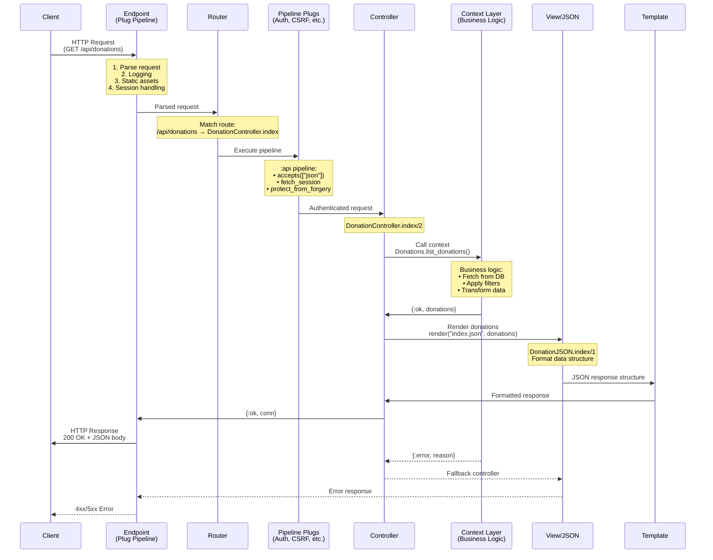
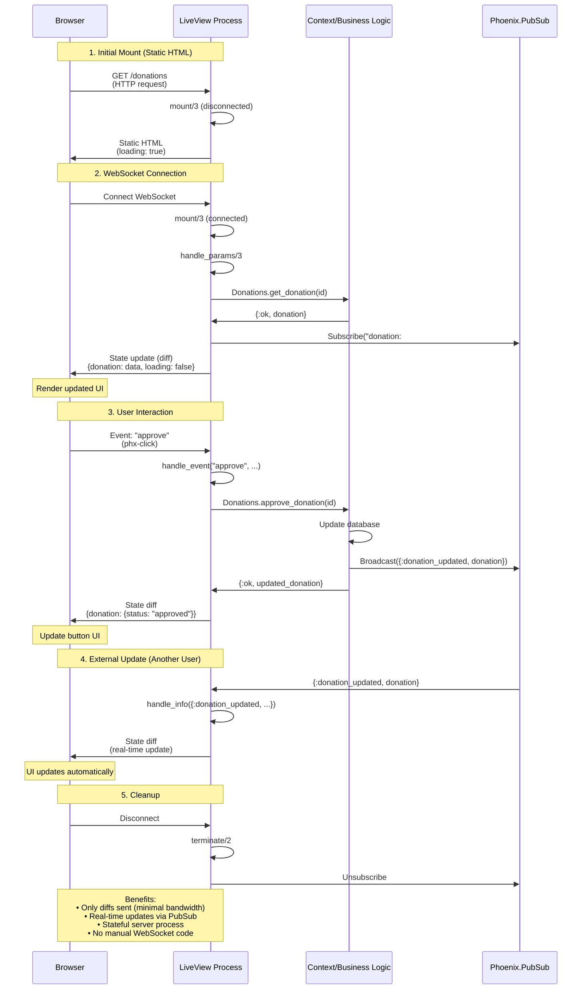
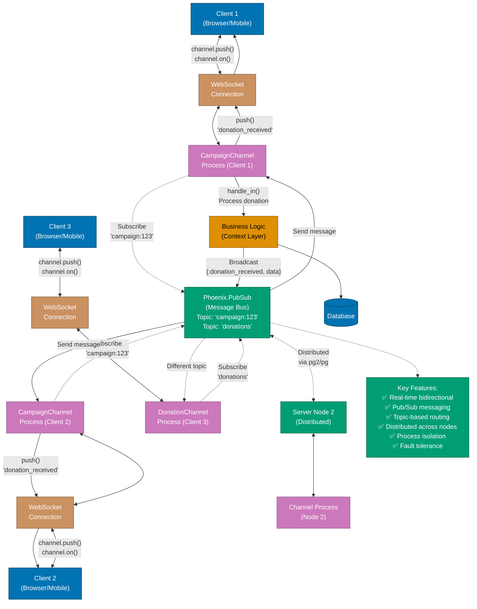

# Web Services

**Phoenix Framework** is Elixir's premier web framework for building high-performance, scalable web applications. It provides traditional **REST APIs**, modern **LiveView** for real-time interactivity, **GraphQL** integration, and comprehensive tooling for authentication, authorization, and deployment.

**Quick Reference**:

- [Phoenix Framework](#phoenix-framework)
  - [Installation and Setup](#installation-and-setup)
  - [Project Structure](#project-structure)
  - [Request Lifecycle](#request-lifecycle)
- [REST APIs](#rest-apis)
  - [Controllers](#controllers)
  - [Views and Templates](#views-and-templates)
  - [JSON APIs](#json-apis)
  - [Error Handling](#error-handling)
- [Phoenix LiveView](#phoenix-liveview)
  - [Real-Time Interactivity](#real-time-interactivity)
  - [LiveView Lifecycle](#liveview-lifecycle)
  - [Forms and Events](#forms-and-events)
  - [LiveComponents](#livecomponents)
- [GraphQL with Absinthe](#graphql-with-absinthe)
  - [Schema Definition](#schema-definition)
  - [Resolvers](#resolvers)
  - [Authentication](#authentication)
- [Channels and WebSockets](#channels-and-websockets)
  - [Channel Basics](#channel-basics)
  - [Presence Tracking](#presence-tracking)
- [Authentication and Authorization](#authentication-and-authorization)
  - [Session-Based Auth](#session-based-auth)
  - [Token-Based Auth](#token-based-auth)
  - [Authorization Policies](#authorization-policies)
- [API Versioning](#api-versioning)
- [Testing Web Applications](#testing-web-applications)
- [Financial Domain Examples](#financial-domain-examples)
- [Web Services Best Practices](#web-services-best-practices)
- [Related Topics](#related-topics)
- [Sources](#sources)

## Phoenix Framework

### Installation and Setup

Install Phoenix and create a new project:

```bash
# Install Phoenix
mix archive.install hex phx_new

# Create new project with database
mix phx.new financial_platform --database postgres

# Create API-only project
mix phx.new financial_api --no-html --no-assets

# Create LiveView project
mix phx.new financial_live --live

# Setup database
cd financial_platform
mix ecto.create
mix ecto.migrate

# Start server
mix phx.server
# Visit http://localhost:4000
```

### Project Structure

Phoenix project organization:

```
financial_platform/
├── _build/              # Compiled artifacts
├── assets/              # Frontend assets
│   ├── css/
│   ├── js/
│   └── static/
├── config/              # Configuration
│   ├── config.exs
│   ├── dev.exs
│   ├── test.exs
│   ├── prod.exs
│   └── runtime.exs
├── lib/
│   ├── financial_platform/          # Business logic (contexts)
│   │   ├── accounts.ex
│   │   ├── donations.ex
│   │   ├── campaigns.ex
│   │   └── repo.ex
│   ├── financial_platform.ex
│   └── financial_platform_web/      # Web interface
│       ├── controllers/
│       ├── live/                    # LiveView
│       ├── views/
│       ├── templates/
│       ├── channels/
│       ├── endpoint.ex
│       ├── router.ex
│       └── telemetry.ex
├── priv/
│   ├── repo/migrations/
│   ├── repo/seeds.exs
│   └── static/
├── test/
│   ├── financial_platform/
│   ├── financial_platform_web/
│   └── support/
└── mix.exs
```

### Request Lifecycle

The following diagram illustrates the complete Phoenix request lifecycle, from client request to server response:



## REST APIs

### Controllers

Phoenix controllers handle HTTP requests:

```elixir
defmodule FinancialWeb.DonationController do
  use FinancialWeb, :controller

  alias FinancialPlatform.Donations
  alias FinancialPlatform.Donations.Donation

  action_fallback FinancialWeb.FallbackController

  # GET /api/donations
  def index(conn, params) do
    page = Map.get(params, "page", "1") |> String.to_integer()
    per_page = Map.get(params, "per_page", "20") |> String.to_integer()

    donations = Donations.list_donations(page: page, per_page: per_page)

    conn
    |> put_status(:ok)
    |> render("index.json", donations: donations)
  end

  # GET /api/donations/:id
  def show(conn, %{"id" => id}) do
    with {:ok, donation} <- Donations.get_donation(id) do
      render(conn, "show.json", donation: donation)
    end
  end

  # POST /api/donations
  def create(conn, %{"donation" => donation_params}) do
    with {:ok, donation} <- Donations.create_donation(donation_params) do
      conn
      |> put_status(:created)
      |> put_resp_header("location", ~p"/api/donations/#{donation}")
      |> render("show.json", donation: donation)
    end
  end

  # PUT/PATCH /api/donations/:id
  def update(conn, %{"id" => id, "donation" => donation_params}) do
    with {:ok, donation} <- Donations.get_donation(id),
         {:ok, updated} <- Donations.update_donation(donation, donation_params) do
      render(conn, "show.json", donation: updated)
    end
  end

  # DELETE /api/donations/:id
  def delete(conn, %{"id" => id}) do
    with {:ok, donation} <- Donations.get_donation(id),
         {:ok, _} <- Donations.delete_donation(donation) do
      send_resp(conn, :no_content, "")
    end
  end
end

# Fallback controller for error handling
defmodule FinancialWeb.FallbackController do
  use Phoenix.Controller

  def call(conn, {:error, :not_found}) do
    conn
    |> put_status(:not_found)
    |> put_view(json: FinancialWeb.ErrorJSON)
    |> render(:"404")
  end

  def call(conn, {:error, %Ecto.Changeset{} = changeset}) do
    conn
    |> put_status(:unprocessable_entity)
    |> put_view(json: FinancialWeb.ChangesetJSON)
    |> render("error.json", changeset: changeset)
  end

  def call(conn, {:error, :unauthorized}) do
    conn
    |> put_status(:unauthorized)
    |> put_view(json: FinancialWeb.ErrorJSON)
    |> render(:"401")
  end
end
```

### Views and Templates

Phoenix views render responses:

```elixir
defmodule FinancialWeb.DonationJSON do
  alias FinancialPlatform.Donations.Donation

  def index(%{donations: donations}) do
    %{data: for(donation <- donations, do: data(donation))}
  end

  def show(%{donation: donation}) do
    %{data: data(donation)}
  end

  defp data(%Donation{} = donation) do
    %{
      id: donation.id,
      amount: %{
        value: Decimal.to_string(donation.amount),
        currency: donation.currency
      },
      donor: %{
        name: donation.donor_name,
        email: donation.donor_email
      },
      campaign_id: donation.campaign_id,
      status: donation.status,
      inserted_at: donation.inserted_at,
      updated_at: donation.updated_at
    }
  end
end

# Changeset error formatting
defmodule FinancialWeb.ChangesetJSON do
  def error(%{changeset: changeset}) do
    %{errors: Ecto.Changeset.traverse_errors(changeset, &translate_error/1)}
  end

  defp translate_error({msg, opts}) do
    Enum.reduce(opts, msg, fn {key, value}, acc ->
      String.replace(acc, "%{#{key}}", to_string(value))
    end)
  end
end
```

### JSON APIs

Router configuration for JSON APIs:

```elixir
defmodule FinancialWeb.Router do
  use FinancialWeb, :router

  pipeline :api do
    plug :accepts, ["json"]
    plug :fetch_session
    plug :protect_from_forgery
    plug :put_secure_browser_headers
  end

  pipeline :api_auth do
    plug FinancialWeb.Auth.Pipeline
  end

  scope "/api", FinancialWeb do
    pipe_through :api

    # Public endpoints
    post "/auth/login", AuthController, :login
    post "/auth/register", AuthController, :register

    resources "/campaigns", CampaignController, only: [:index, :show]
  end

  scope "/api", FinancialWeb do
    pipe_through [:api, :api_auth]

    # Authenticated endpoints
    post "/auth/logout", AuthController, :logout
    get "/auth/me", AuthController, :me

    resources "/donations", DonationController
    resources "/campaigns", CampaignController, except: [:index, :show]

    # Nested resources
    resources "/campaigns", CampaignController do
      resources "/donations", CampaignDonationController, only: [:index, :create]
    end
  end
end
```

### Error Handling

Comprehensive error handling:

```elixir
defmodule FinancialWeb.ErrorJSON do
  def render("404.json", _assigns) do
    %{error: %{code: 404, message: "Not Found"}}
  end

  def render("401.json", _assigns) do
    %{error: %{code: 401, message: "Unauthorized"}}
  end

  def render("403.json", _assigns) do
    %{error: %{code: 403, message: "Forbidden"}}
  end

  def render("422.json", %{errors: errors}) do
    %{error: %{code: 422, message: "Validation failed", errors: errors}}
  end

  def render("500.json", _assigns) do
    %{error: %{code: 500, message: "Internal Server Error"}}
  end
end

# Custom exceptions
defmodule FinancialPlatform.DonationError do
  defexception [:message, :code]

  def exception(opts) do
    message = Keyword.fetch!(opts, :message)
    code = Keyword.get(opts, :code, :donation_error)
    %__MODULE__{message: message, code: code}
  end
end

# Handle in controller
defmodule FinancialWeb.DonationController do
  def approve(conn, %{"id" => id}) do
    case Donations.approve_donation(id) do
      {:ok, donation} ->
        render(conn, "show.json", donation: donation)

      {:error, %FinancialPlatform.DonationError{} = error} ->
        conn
        |> put_status(:unprocessable_entity)
        |> json(%{error: %{message: error.message, code: error.code}})
    end
  end
end
```

The following diagram shows how Plug pipelines process requests sequentially, with each plug transforming the connection:

```mermaid
graph LR
    %% Initial request
    Request["HTTP Request"]

    %% Endpoint plugs
    Logger["Plug: Logger<br/>Log request details"]
    Static["Plug: Static<br/>Serve static assets"]
    Session["Plug: Session<br/>Load session data"]
    Parser["Plug: RequestID<br/>Add request ID"]

    %% Router
    Router["Router<br/>Match route"]

    %% Pipeline plugs
    Accepts["Plug: Accepts<br/>Content negotiation<br/>['json']"]
    FetchSession["Plug: FetchSession<br/>Read session from cookie"]
    CSRF["Plug: CSRF<br/>Validate token"]
    Auth["Plug: RequireAuth<br/>Verify authentication"]

    %% Controller
    Controller["Controller Action<br/>Business logic"]

    %% Response
    Response["HTTP Response"]

    %% Flow
    Request --> Logger
    Logger --> Static
    Static --> Session
    Session --> Parser
    Parser --> Router

    Router -->|":api pipeline"| Accepts
    Accepts --> FetchSession
    FetchSession --> CSRF
    CSRF --> Auth

    Auth -->|"Authorized"| Controller
    Controller --> Response

    %% Halt conditions
    StaticHalt["Static file found<br/>→ halt()"]
    AuthHalt["Not authenticated<br/>→ halt()"]

    Static -.->|"Asset found"| StaticHalt
    Auth -.->|"No user"| AuthHalt

    StaticHalt -.-> Response
    AuthHalt -.-> Response

    %% Notes
    Note1["Each plug receives conn<br/>and returns conn"]
    Note2["halt() stops pipeline<br/>and returns response"]

    Controller -.-> Note1
    AuthHalt -.-> Note2

    %% Styling
    style Request fill:#0173B2,stroke:#023B5A,color:#FFF
    style Logger fill:#CA9161,stroke:#7A5739,color:#FFF
    style Static fill:#CA9161,stroke:#7A5739,color:#FFF
    style Session fill:#CA9161,stroke:#7A5739,color:#FFF
    style Parser fill:#CA9161,stroke:#7A5739,color:#FFF

    style Router fill:#029E73,stroke:#01593F,color:#FFF

    style Accepts fill:#CC78BC,stroke:#8B5A8A,color:#FFF
    style FetchSession fill:#CC78BC,stroke:#8B5A8A,color:#FFF
    style CSRF fill:#CC78BC,stroke:#8B5A8A,color:#FFF
    style Auth fill:#CC78BC,stroke:#8B5A8A,color:#FFF

    style Controller fill:#0173B2,stroke:#023B5A,color:#FFF
    style Response fill:#029E73,stroke:#01593F,color:#FFF

    style StaticHalt fill:#DE8F05,stroke:#8A5903,color:#000
    style AuthHalt fill:#DE8F05,stroke:#8A5903,color:#000

    style Note1 fill:#029E73,stroke:#01593F,color:#FFF
    style Note2 fill:#DE8F05,stroke:#8A5903,color:#000
```



## Phoenix LiveView

### Real-Time Interactivity

LiveView provides real-time UI without JavaScript:

```elixir
defmodule FinancialWeb.CampaignLive.Index do
  use FinancialWeb, :live_view

  alias FinancialPlatform.Campaigns

  @impl true
  def mount(_params, _session, socket) do
    if connected?(socket) do
      # Subscribe to updates when connected
      Phoenix.PubSub.subscribe(FinancialPlatform.PubSub, "campaigns")
    end

    {:ok, assign(socket, campaigns: load_campaigns(), form: to_form(%{}))}
  end

  @impl true
  def render(assigns) do
    ~H"""
    <div class="campaigns">
      <h1>Active Campaigns</h1>

      <.table id="campaigns" rows={@campaigns}>
        <:col :let={campaign} label="Name"><%= campaign.name %></:col>
        <:col :let={campaign} label="Goal">
          <%= format_money(campaign.goal_amount, campaign.currency) %>
        </:col>
        <:col :let={campaign} label="Raised">
          <%= format_money(campaign.total_raised, campaign.currency) %>
        </:col>
        <:col :let={campaign} label="Progress">
          <div class="progress-bar">
            <div class="progress-fill" style={"width: #{campaign.progress}%"}></div>
          </div>
          <%= campaign.progress %>%
        </:col>
        <:col :let={campaign} label="Actions">
          <.link navigate={~p"/campaigns/#{campaign}"}>View</.link>
          <.link phx-click="donate" phx-value-id={campaign.id}>Donate</.link>
        </:col>
      </.table>

      <.live_component
        module={FinancialWeb.CampaignLive.FormComponent}
        id={:new}
        title="Create Campaign"
        action={:new}
        campaign={%Campaign{}}
      />
    </div>
    """
  end

  @impl true
  def handle_event("donate", %{"id" => campaign_id}, socket) do
    {:noreply, push_navigate(socket, to: ~p"/donations/new?campaign_id=#{campaign_id}")}
  end

  @impl true
  def handle_info({:campaign_updated, campaign}, socket) do
    # Update when campaign changes (from PubSub)
    campaigns = Enum.map(socket.assigns.campaigns, fn c ->
      if c.id == campaign.id, do: campaign, else: c
    end)

    {:noreply, assign(socket, campaigns: campaigns)}
  end

  defp load_campaigns do
    Campaigns.list_active_campaigns()
  end

  defp format_money(amount, currency) do
    Money.to_string(Money.new(amount, currency))
  end
end
```

### LiveView Lifecycle

LiveView lifecycle hooks:

```elixir
defmodule FinancialWeb.DonationLive.Show do
  use FinancialWeb, :live_view

  # 1. mount/3 - Initial setup (runs twice: static + connected)
  @impl true
  def mount(_params, _session, socket) do
    {:ok, assign(socket, donation: nil, loading: true)}
  end

  # 2. handle_params/3 - Handle URL parameters
  @impl true
  def handle_params(%{"id" => id}, _url, socket) do
    donation = Donations.get_donation!(id)

    if connected?(socket) do
      # Subscribe to donation updates
      Phoenix.PubSub.subscribe(FinancialPlatform.PubSub, "donation:#{id}")
    end

    {:noreply, assign(socket, donation: donation, loading: false)}
  end

  # 3. render/1 - Render template
  @impl true
  def render(assigns) do
    ~H"""
    <div :if={@loading}>Loading...</div>

    <div :if={!@loading} class="donation-details">
      <h2>Donation <%= @donation.id %></h2>
      <p>Amount: <%= format_money(@donation.amount, @donation.currency) %></p>
      <p>Status: <%= @donation.status %></p>

      <button
        :if={@donation.status == :pending}
        phx-click="approve"
        phx-disable-with="Approving..."
      >
        Approve
      </button>
    </div>
    """
  end

  # 4. handle_event/3 - Handle user events
  @impl true
  def handle_event("approve", _params, socket) do
    case Donations.approve_donation(socket.assigns.donation) do
      {:ok, updated} ->
        {:noreply, assign(socket, donation: updated)}

      {:error, _reason} ->
        {:noreply, put_flash(socket, :error, "Failed to approve donation")}
    end
  end

  # 5. handle_info/2 - Handle process messages
  @impl true
  def handle_info({:donation_updated, donation}, socket) do
    {:noreply, assign(socket, donation: donation)}
  end

  # 6. terminate/2 - Cleanup
  @impl true
  def terminate(_reason, socket) do
    if socket.assigns.donation do
      Phoenix.PubSub.unsubscribe(
        FinancialPlatform.PubSub,
        "donation:#{socket.assigns.donation.id}"
      )
    end

    :ok
  end

  defp format_money(amount, currency) do
    Money.to_string(Money.new(amount, currency))
  end
end
```

The following diagram illustrates how LiveView maintains state synchronization between client and server over WebSocket:



### Forms and Events

LiveView forms with validation:

```elixir
defmodule FinancialWeb.DonationLive.New do
  use FinancialWeb, :live_view

  alias FinancialPlatform.Donations
  alias FinancialPlatform.Donations.Donation

  @impl true
  def mount(_params, _session, socket) do
    changeset = Donations.change_donation(%Donation{})

    {:ok,
     assign(socket,
       form: to_form(changeset),
       campaigns: load_campaigns()
     )}
  end

  @impl true
  def render(assigns) do
    ~H"""
    <div class="donation-form">
      <h2>Make a Donation</h2>

      <.form
        for={@form}
        phx-change="validate"
        phx-submit="save"
      >
        <.input
          field={@form[:campaign_id]}
          type="select"
          label="Campaign"
          options={@campaigns}
          prompt="Select a campaign"
        />

        <.input
          field={@form[:amount]}
          type="number"
          label="Amount"
          step="0.01"
          min="1"
        />

        <.input
          field={@form[:currency]}
          type="select"
          label="Currency"
          options={["IDR", "USD", "EUR"]}
        />

        <.input field={@form[:donor_name]} type="text" label="Your Name" />
        <.input field={@form[:donor_email]} type="email" label="Your Email" />

        <.input
          field={@form[:payment_method]}
          type="select"
          label="Payment Method"
          options={["Credit Card", "Bank Transfer", "E-Wallet"]}
        />

        <.button type="submit" phx-disable-with="Processing...">
          Donate
        </.button>
      </.form>
    </div>
    """
  end

  @impl true
  def handle_event("validate", %{"donation" => donation_params}, socket) do
    changeset =
      %Donation{}
      |> Donations.change_donation(donation_params)
      |> Map.put(:action, :validate)

    {:noreply, assign(socket, form: to_form(changeset))}
  end

  @impl true
  def handle_event("save", %{"donation" => donation_params}, socket) do
    case Donations.create_donation(donation_params) do
      {:ok, donation} ->
        {:noreply,
         socket
         |> put_flash(:info, "Donation created successfully!")
         |> push_navigate(to: ~p"/donations/#{donation}")}

      {:error, changeset} ->
        {:noreply, assign(socket, form: to_form(changeset))}
    end
  end

  defp load_campaigns do
    Campaigns.list_active_campaigns()
    |> Enum.map(&{&1.name, &1.id})
  end
end
```

### LiveComponents

Reusable LiveComponents:

```elixir
defmodule FinancialWeb.CampaignLive.StatsComponent do
  use FinancialWeb, :live_component

  @impl true
  def render(assigns) do
    ~H"""
    <div id={@id} class="campaign-stats">
      <div class="stat">
        <span class="label">Total Raised</span>
        <span class="value"><%= format_money(@campaign.total_raised, @campaign.currency) %></span>
      </div>

      <div class="stat">
        <span class="label">Goal</span>
        <span class="value"><%= format_money(@campaign.goal_amount, @campaign.currency) %></span>
      </div>

      <div class="stat">
        <span class="label">Donors</span>
        <span class="value"><%= @campaign.donor_count %></span>
      </div>

      <div class="stat">
        <span class="label">Days Remaining</span>
        <span class="value"><%= days_remaining(@campaign.end_date) %></span>
      </div>
    </div>
    """
  end

  @impl true
  def update(assigns, socket) do
    {:ok, assign(socket, assigns)}
  end

  defp format_money(amount, currency) do
    Money.to_string(Money.new(amount, currency))
  end

  defp days_remaining(end_date) do
    Date.diff(end_date, Date.utc_today())
  end
end

# Use in parent LiveView
defmodule FinancialWeb.CampaignLive.Show do
  use FinancialWeb, :live_view

  def render(assigns) do
    ~H"""
    <div class="campaign-details">
      <h1><%= @campaign.name %></h1>

      <.live_component
        module={FinancialWeb.CampaignLive.StatsComponent}
        id={"stats-#{@campaign.id}"}
        campaign={@campaign}
      />

      <!-- Other content -->
    </div>
    """
  end
end
```

## GraphQL with Absinthe

### Schema Definition

Define GraphQL schema with Absinthe:

```elixir
# Add to mix.exs
{:absinthe, "~> 1.7"},
{:absinthe_plug, "~> 1.5"}

defmodule FinancialWeb.Schema do
  use Absinthe.Schema

  import_types FinancialWeb.Schema.DonationTypes
  import_types FinancialWeb.Schema.CampaignTypes

  query do
    # Campaigns
    field :campaigns, list_of(:campaign) do
      arg :status, :string
      resolve &FinancialWeb.Resolvers.Campaigns.list_campaigns/3
    end

    field :campaign, :campaign do
      arg :id, non_null(:id)
      resolve &FinancialWeb.Resolvers.Campaigns.get_campaign/3
    end

    # Donations
    field :donations, list_of(:donation) do
      arg :campaign_id, :id
      arg :status, :string
      resolve &FinancialWeb.Resolvers.Donations.list_donations/3
    end

    field :donation, :donation do
      arg :id, non_null(:id)
      resolve &FinancialWeb.Resolvers.Donations.get_donation/3
    end
  end

  mutation do
    # Create donation
    field :create_donation, :donation do
      arg :campaign_id, non_null(:id)
      arg :amount, non_null(:decimal)
      arg :currency, non_null(:string)
      arg :donor_name, non_null(:string)
      arg :donor_email, non_null(:string)

      resolve &FinancialWeb.Resolvers.Donations.create_donation/3
    end

    # Approve donation
    field :approve_donation, :donation do
      arg :id, non_null(:id)
      resolve &FinancialWeb.Resolvers.Donations.approve_donation/3
    end
  end

  subscription do
    # Subscribe to campaign updates
    field :campaign_updated, :campaign do
      arg :campaign_id, non_null(:id)

      config fn args, _ ->
        {:ok, topic: "campaign:#{args.campaign_id}"}
      end

      trigger :update_campaign, topic: fn campaign ->
        "campaign:#{campaign.id}"
      end
    end
  end
end

# Type definitions
defmodule FinancialWeb.Schema.DonationTypes do
  use Absinthe.Schema.Notation

  object :donation do
    field :id, non_null(:id)
    field :amount, non_null(:decimal)
    field :currency, non_null(:string)
    field :donor_name, non_null(:string)
    field :donor_email, non_null(:string)
    field :status, non_null(:string)
    field :campaign, :campaign, resolve: &FinancialWeb.Resolvers.Donations.campaign/3
    field :inserted_at, non_null(:datetime)
  end
end
```

### Resolvers

Implement GraphQL resolvers:

```elixir
defmodule FinancialWeb.Resolvers.Donations do
  alias FinancialPlatform.Donations

  def list_donations(_parent, args, _resolution) do
    {:ok, Donations.list_donations(args)}
  end

  def get_donation(_parent, %{id: id}, _resolution) do
    case Donations.get_donation(id) do
      nil -> {:error, "Donation not found"}
      donation -> {:ok, donation}
    end
  end

  def create_donation(_parent, args, %{context: %{current_user: user}}) do
    args
    |> Map.put(:user_id, user.id)
    |> Donations.create_donation()
  end

  def create_donation(_parent, _args, _resolution) do
    {:error, "Unauthorized"}
  end

  def approve_donation(_parent, %{id: id}, %{context: %{current_user: user}}) do
    with :ok <- authorize_approval(user),
         {:ok, donation} <- Donations.get_donation(id),
         {:ok, approved} <- Donations.approve_donation(donation) do
      {:ok, approved}
    end
  end

  def campaign(%{campaign_id: campaign_id}, _args, _resolution) do
    {:ok, Campaigns.get_campaign(campaign_id)}
  end

  defp authorize_approval(%{role: role}) when role in [:admin, :finance_manager] do
    :ok
  end

  defp authorize_approval(_), do: {:error, "Insufficient permissions"}
end

# Router configuration
defmodule FinancialWeb.Router do
  use FinancialWeb, :router

  scope "/api" do
    pipe_through :api

    forward "/graphql", Absinthe.Plug,
      schema: FinancialWeb.Schema

    forward "/graphiql", Absinthe.Plug.GraphiQL,
      schema: FinancialWeb.Schema,
      interface: :playground
  end
end
```

### Authentication

Add authentication to GraphQL:

```elixir
defmodule FinancialWeb.Context do
  @behaviour Plug

  import Plug.Conn

  def init(opts), do: opts

  def call(conn, _) do
    context = build_context(conn)
    Absinthe.Plug.put_options(conn, context: context)
  end

  defp build_context(conn) do
    with ["Bearer " <> token] <- get_req_header(conn, "authorization"),
         {:ok, user} <- authenticate_token(token) do
      %{current_user: user}
    else
      _ -> %{}
    end
  end

  defp authenticate_token(token) do
    case Guardian.decode_and_verify(token) do
      {:ok, claims} -> Guardian.resource_from_claims(claims)
      _ -> :error
    end
  end
end

# Apply to GraphQL endpoint
forward "/graphql", Absinthe.Plug,
  schema: FinancialWeb.Schema,
  before: [FinancialWeb.Context]
```

## Channels and WebSockets

### Channel Basics

Phoenix Channels for real-time communication:

```elixir
defmodule FinancialWeb.CampaignChannel do
  use Phoenix.Channel

  def join("campaign:" <> campaign_id, _params, socket) do
    # Authorization check
    if authorized?(socket, campaign_id) do
      send(self(), :after_join)
      {:ok, assign(socket, :campaign_id, campaign_id)}
    else
      {:error, %{reason: "unauthorized"}}
    end
  end

  def handle_info(:after_join, socket) do
    # Send initial data after join
    campaign = Campaigns.get_campaign!(socket.assigns.campaign_id)
    push(socket, "campaign_data", %{campaign: campaign})
    {:noreply, socket}
  end

  # Incoming: client sends donation
  def handle_in("new_donation", %{"amount" => amount}, socket) do
    case Donations.create_donation(%{
           campaign_id: socket.assigns.campaign_id,
           amount: amount
         }) do
      {:ok, donation} ->
        # Broadcast to all subscribers
        broadcast!(socket, "donation_received", %{donation: donation})
        {:reply, {:ok, %{donation: donation}}, socket}

      {:error, changeset} ->
        {:reply, {:error, %{errors: format_errors(changeset)}}, socket}
    end
  end

  # Handle external events
  def handle_info({:campaign_updated, campaign}, socket) do
    push(socket, "campaign_updated", %{campaign: campaign})
    {:noreply, socket}
  end

  defp authorized?(_socket, _campaign_id) do
    # Authorization logic
    true
  end

  defp format_errors(changeset) do
    Ecto.Changeset.traverse_errors(changeset, fn {msg, _opts} -> msg end)
  end
end

# Socket configuration
defmodule FinancialWeb.UserSocket do
  use Phoenix.Socket

  channel "campaign:*", FinancialWeb.CampaignChannel
  channel "donations", FinancialWeb.DonationChannel

  @impl true
  def connect(%{"token" => token}, socket, _connect_info) do
    case Guardian.decode_and_verify(token) do
      {:ok, claims} ->
        {:ok, user} = Guardian.resource_from_claims(claims)
        {:ok, assign(socket, :current_user, user)}

      _ ->
        :error
    end
  end

  def connect(_params, _socket, _connect_info) do
    :error
  end

  @impl true
  def id(socket), do: "user_socket:#{socket.assigns.current_user.id}"
end

# Client-side JavaScript
# assets/js/socket.js
import {Socket} from "phoenix"

let socket = new Socket("/socket", {params: {token: userToken}})
socket.connect()

let channel = socket.channel("campaign:123", {})
channel.join()
  .receive("ok", resp => { console.log("Joined successfully", resp) })
  .receive("error", resp => { console.log("Unable to join", resp) })

channel.on("donation_received", payload => {
  console.log("New donation:", payload.donation)
  updateUI(payload.donation)
})

channel.push("new_donation", {amount: 50000})
  .receive("ok", payload => console.log("Donation created:", payload))
  .receive("error", payload => console.log("Error:", payload))
```

### Presence Tracking

Track online users with Phoenix Presence:

```elixir
defmodule FinancialWeb.Presence do
  use Phoenix.Presence,
    otp_app: :financial_platform,
    pubsub_server: FinancialPlatform.PubSub
end

defmodule FinancialWeb.CampaignChannel do
  use Phoenix.Channel

  alias FinancialWeb.Presence

  def join("campaign:" <> campaign_id, _params, socket) do
    send(self(), :after_join)
    {:ok, assign(socket, :campaign_id, campaign_id)}
  end

  def handle_info(:after_join, socket) do
    # Track user presence
    {:ok, _} = Presence.track(socket, socket.assigns.current_user.id, %{
      online_at: System.system_time(:second),
      name: socket.assigns.current_user.name
    })

    # Send presence list to user
    push(socket, "presence_state", Presence.list(socket))

    {:noreply, socket}
  end
end

# Client-side JavaScript
import {Presence} from "phoenix"

let presences = {}

channel.on("presence_state", state => {
  presences = Presence.syncState(presences, state)
  renderOnlineUsers(presences)
})

channel.on("presence_diff", diff => {
  presences = Presence.syncDiff(presences, diff)
  renderOnlineUsers(presences)
})

function renderOnlineUsers(presences) {
  let users = Presence.list(presences, (id, {metas}) => {
    return {id, name: metas[0].name}
  })
  console.log("Online users:", users)
}
```

The following diagram shows how Phoenix Channels use PubSub for real-time messaging across multiple clients and nodes:



## Authentication and Authorization

### Session-Based Auth

Session-based authentication:

```elixir
defmodule FinancialWeb.AuthController do
  use FinancialWeb, :controller

  alias FinancialPlatform.Accounts

  def login(conn, %{"user" => %{"email" => email, "password" => password}}) do
    case Accounts.authenticate(email, password) do
      {:ok, user} ->
        conn
        |> put_flash(:info, "Welcome back!")
        |> put_session(:user_id, user.id)
        |> configure_session(renew: true)  # Prevent session fixation
        |> redirect(to: ~p"/dashboard")

      {:error, :invalid_credentials} ->
        conn
        |> put_flash(:error, "Invalid email or password")
        |> redirect(to: ~p"/login")
    end
  end

  def logout(conn, _params) do
    conn
    |> configure_session(drop: true)
    |> redirect(to: ~p"/")
  end
end

# Authentication plug
defmodule FinancialWeb.Plugs.RequireAuth do
  import Plug.Conn
  import Phoenix.Controller

  def init(opts), do: opts

  def call(conn, _opts) do
    case get_session(conn, :user_id) do
      nil ->
        conn
        |> put_flash(:error, "You must be logged in")
        |> redirect(to: ~p"/login")
        |> halt()

      user_id ->
        user = Accounts.get_user!(user_id)
        assign(conn, :current_user, user)
    end
  end
end

# In router
pipeline :auth do
  plug FinancialWeb.Plugs.RequireAuth
end

scope "/dashboard", FinancialWeb do
  pipe_through [:browser, :auth]

  get "/", DashboardController, :index
end
```

### Token-Based Auth

JWT token authentication:

```elixir
# See Security section for complete Guardian implementation
defmodule FinancialWeb.API.AuthController do
  use FinancialWeb, :controller

  def login(conn, %{"email" => email, "password" => password}) do
    case Accounts.authenticate(email, password) do
      {:ok, user} ->
        {:ok, token, _claims} = Guardian.encode_and_sign(user, %{}, ttl: {1, :hour})
        {:ok, refresh_token, _claims} = Guardian.encode_and_sign(
          user,
          %{},
          token_type: "refresh",
          ttl: {30, :day}
        )

        json(conn, %{
          token: token,
          refresh_token: refresh_token,
          user: %{id: user.id, email: user.email}
        })

      {:error, :invalid_credentials} ->
        conn
        |> put_status(:unauthorized)
        |> json(%{error: "Invalid credentials"})
    end
  end

  def refresh(conn, %{"refresh_token" => refresh_token}) do
    case Guardian.exchange(refresh_token, "refresh", "access") do
      {:ok, _old, {new_token, _new_claims}} ->
        json(conn, %{token: new_token})

      {:error, _reason} ->
        conn
        |> put_status(:unauthorized)
        |> json(%{error: "Invalid refresh token"})
    end
  end
end
```

### Authorization Policies

Policy-based authorization:

```elixir
# See Security section for complete Bodyguard implementation
```

## API Versioning

Multiple API versioning strategies:

```elixir
# Strategy 1: URL path versioning
defmodule FinancialWeb.Router do
  scope "/api/v1", FinancialWeb.V1, as: :v1 do
    pipe_through :api
    resources "/donations", DonationController
  end

  scope "/api/v2", FinancialWeb.V2, as: :v2 do
    pipe_through :api
    resources "/donations", DonationController
  end
end

# Strategy 2: Header-based versioning
defmodule FinancialWeb.APIVersion do
  import Plug.Conn

  def init(opts), do: opts

  def call(conn, _opts) do
    version = get_req_header(conn, "accept") |> parse_version()
    assign(conn, :api_version, version)
  end

  defp parse_version(["application/vnd.financial.v2+json" | _]), do: :v2
  defp parse_version(_), do: :v1
end

# Strategy 3: Query parameter versioning
# GET /api/donations?version=2
```

## Testing Web Applications

```elixir
# Controller tests
defmodule FinancialWeb.DonationControllerTest do
  use FinancialWeb.ConnCase

  describe "GET /api/donations" do
    test "lists all donations", %{conn: conn} do
      donation = insert(:donation)

      conn = get(conn, ~p"/api/donations")

      assert json_response(conn, 200)["data"] == [
               %{
                 "id" => donation.id,
                 "amount" => %{"value" => "10000", "currency" => "IDR"}
               }
             ]
    end
  end

  describe "POST /api/donations" do
    test "creates donation with valid params", %{conn: conn} do
      params = %{
        "donation" => %{
          "campaign_id" => "camp_123",
          "amount" => "10000",
          "currency" => "IDR",
          "donor_name" => "John Doe",
          "donor_email" => "john@example.com"
        }
      }

      conn = post(conn, ~p"/api/donations", params)

      assert %{"id" => id} = json_response(conn, 201)["data"]
      assert Donations.get_donation(id)
    end
  end
end

# LiveView tests
defmodule FinancialWeb.CampaignLive.IndexTest do
  use FinancialWeb.ConnCase

  import Phoenix.LiveViewTest

  test "displays campaigns", %{conn: conn} do
    campaign = insert(:campaign)

    {:ok, _view, html} = live(conn, ~p"/campaigns")

    assert html =~ campaign.name
  end

  test "creates campaign", %{conn: conn} do
    {:ok, view, _html} = live(conn, ~p"/campaigns")

    assert view
           |> form("#campaign-form", campaign: %{name: "New Campaign"})
           |> render_submit()

    assert_redirect(view, ~p"/campaigns/#{campaign_id}")
  end
end

# Channel tests
defmodule FinancialWeb.CampaignChannelTest do
  use FinancialWeb.ChannelCase

  test "joins campaign channel" do
    {:ok, _, socket} = subscribe_and_join(socket("user:123"), "campaign:123", %{})

    assert_push "campaign_data", %{campaign: _campaign}
  end

  test "broadcasts donation received" do
    {:ok, _, socket} = subscribe_and_join(socket("user:123"), "campaign:123", %{})

    push(socket, "new_donation", %{"amount" => 10000})

    assert_broadcast "donation_received", %{donation: _donation}
  end
end
```

## Financial Domain Examples

All previous examples demonstrate financial domain patterns.

## Web Services Best Practices

1. **Use Phoenix contexts** - Organize business logic
2. **Validate inputs** - Use Ecto changesets
3. **Handle errors** - Use fallback controllers
4. **Authenticate requests** - Use Guardian or Pow
5. **Authorize actions** - Use Bodyguard policies
6. **Version APIs** - Use URL path versioning
7. **Test thoroughly** - Controllers, LiveViews, Channels
8. **Document APIs** - Use OpenAPI/Swagger or GraphQL schema

## Related Topics

- [Security](ex-so-stla-el__security.md) - Authentication, authorization
- [Testing](ex-so-stla-el__test-driven-development.md) - Testing Phoenix apps
- [Performance](ex-so-stla-el__performance.md) - Phoenix performance
- [Domain-Driven Design](ex-so-stla-el__domain-driven-design.md) - Phoenix contexts

## Sources

- [Phoenix Framework](https://www.phoenixframework.org/)
- [Phoenix LiveView](https://hexdocs.pm/phoenix_live_view/)
- [Absinthe GraphQL](https://hexdocs.pm/absinthe/)
- [Phoenix Channels](https://hexdocs.pm/phoenix/channels.html)
- [Phoenix Presence](https://hexdocs.pm/phoenix/Phoenix.Presence.html)
- [Guardian Authentication](https://hexdocs.pm/guardian/)

---

**Last Updated**: 2026-01-23
**Elixir Version**: 1.12+ (baseline), 1.17+ (recommended), 1.18.0 (latest)
**Maintainers**: Platform Documentation Team
