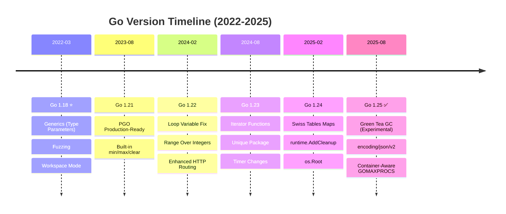
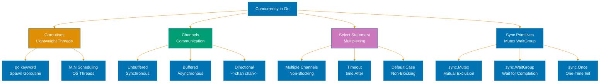
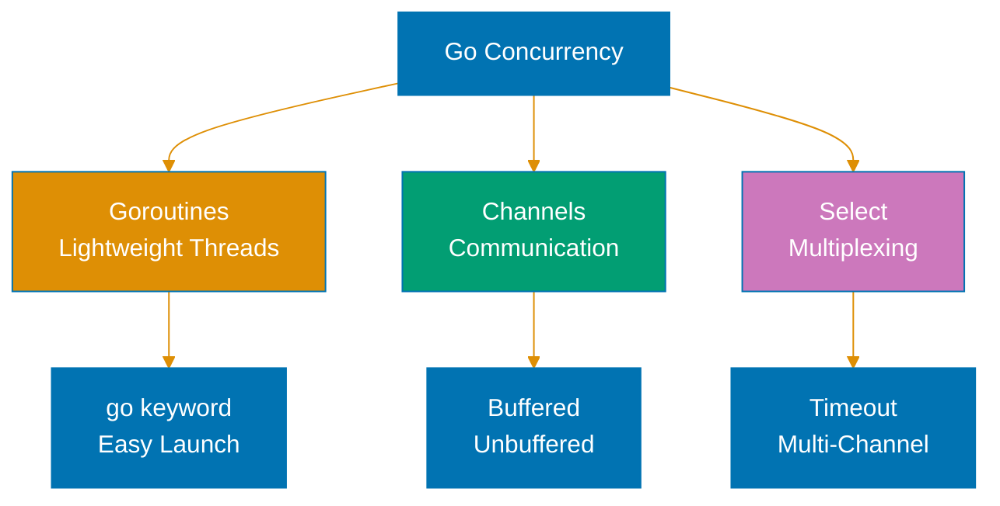

# Golang

**Understanding-oriented documentation** for modern Go development in the open-sharia-enterprise platform.

## Overview

Go is used for high-performance services, CLI tools, and concurrent systems in the platform. This documentation covers modern Go (1.18+) with emphasis on:

- Goroutines and channels for concurrent programming
- Interfaces and composition over inheritance
- Generics for type-safe abstractions
- Error handling patterns with explicit error returns
- Web services with standard library and modern frameworks

## Coding Standards

**This documentation is the authoritative reference** for Go coding standards in the open-sharia-enterprise platform.

All Go code MUST follow the standards documented here:

1. **[Idioms](./ex-so-stla-go__idioms.md)** - Go-specific patterns and conventions
2. **[Best Practices](./ex-so-stla-go__best-practices.md)** - Clean code standards
3. **[Anti-Patterns](./ex-so-stla-go__anti-patterns.md)** - Common mistakes to avoid

**For Agents**: Reference this documentation when writing Go code. The `swe-programming-golang` skill provides quick access to these standards.

### Quick Standards Reference

- **Naming Conventions**: See [Best Practices - Code Organization](./ex-so-stla-go__best-practices.md#code-organization)
- **Error Handling**: See [Error Handling](./ex-so-stla-go__error-handling.md)
- **Type Safety**: See [Type Safety](./ex-so-stla-go__type-safety.md)
- **Testing Standards**: See [Test-Driven Development](./ex-so-stla-go__test-driven-development.md)
- **Security Practices**: See [Security](./ex-so-stla-go__security.md)

**Related**: [Functional Programming](../../../../../governance/development/pattern/functional-programming.md) - Cross-language FP principles

## Software Engineering Principles

Go development in this platform follows the five software engineering principles from [governance/principles/software-engineering/](../../../../../governance/principles/software-engineering/README.md):

1. **[Automation Over Manual](../../../../../governance/principles/software-engineering/automation-over-manual.md)** - Go automates through code generation (protoc, mockgen), testing, linting, and formatting
2. **[Explicit Over Implicit](../../../../../governance/principles/software-engineering/explicit-over-implicit.md)** - Go enforces through explicit error handling, no hidden control flow, clear imports
3. **[Immutability Over Mutability](../../../../../governance/principles/software-engineering/immutability.md)** - Go encourages immutable patterns through value receivers, const correctness, and functional approaches
4. **[Pure Functions Over Side Effects](../../../../../governance/principles/software-engineering/pure-functions.md)** - Go supports through first-class functions, closures, and functional core architecture
5. **[Reproducibility First](../../../../../governance/principles/software-engineering/reproducibility.md)** - Go enables through go.mod versioning, module checksums (go.sum), and reproducible builds

**See Also**: [Functional Programming](./ex-so-stla-go__functional-programming.md) for pure functions patterns, [Best Practices](./ex-so-stla-go__best-practices.md) for explicit coding standards.

## Quick Reference

**Jump to:**

- [Overview](#overview) - Go in the platform
- [Software Engineering Principles](#software-engineering-principles) - Five core principles
- [Go Version Strategy](#go-version-strategy) - Go 1.18/1.21/1.25 releases
- [Documentation Structure](#documentation-structure) - Guide to documentation files
- [Go in the Platform](#go-in-the-platform) - Platform integration
- [Learning Path](#learning-path) - Recommended reading order
- [Code Examples from Platform](#code-examples-from-platform) - Real implementations
- [Integration with Other Documentation](#integration-with-other-documentation) - Cross-references
- [Tools and Ecosystem](#tools-and-ecosystem) - Build tools, frameworks
- [Resources and References](#resources-and-references) - External resources
- [Related Documentation](#related-documentation) - Cross-references

**Core Documentation:**

- [Best Practices](./ex-so-stla-go__best-practices.md) - Modern Go coding standards (2025-2026)
- [Idioms](./ex-so-stla-go__idioms.md) - Go-specific patterns (interfaces, embedding, error handling)
- [Anti-Patterns](./ex-so-stla-go__anti-patterns.md) - Common mistakes to avoid (expanded with financial domain patterns)
- [Concurrency and Parallelism](./ex-so-stla-go__concurrency-and-parallelism.md) - Goroutines, channels, sync package
- [Interfaces and Composition](./ex-so-stla-go__interfaces-and-composition.md) - Interface design, composition over inheritance
- [Error Handling](./ex-so-stla-go__error-handling.md) - Error patterns, wrapping, custom errors
- [Type Safety](./ex-so-stla-go__type-safety.md) - Type system, interfaces, generics
- [Functional Programming](./ex-so-stla-go__functional-programming.md) - FP patterns in Go
- [Finite State Machine](./ex-so-stla-go__finite-state-machine.md) - FSM patterns for enterprise state management
- [Domain-Driven Design](./ex-so-stla-go__domain-driven-design.md) - DDD patterns in Go
- [Performance](./ex-so-stla-go__performance.md) - Profiling, optimization, memory management
- [Security](./ex-so-stla-go__security.md) - Secure coding practices
- [Memory Management](./ex-so-stla-go__memory-management.md) - GC, pointers, escape analysis
- [Modules and Dependencies](./ex-so-stla-go__modules-and-dependencies.md) - Go modules, dependency management
- [Web Services](./ex-so-stla-go__web-services.md) - HTTP servers, REST APIs, gRPC
- [Linting and Formatting](./ex-so-stla-go__linting-and-formatting.md) - golangci-lint, gofmt, staticcheck
- [Test-Driven Development](./ex-so-stla-go__test-driven-development.md) - TDD with testing package, testify
- [Behaviour-Driven Development](./ex-so-stla-go__behaviour-driven-development.md) - BDD with Godog (Gherkin for Go)

**DDD Templates:**

- [Templates](./templates/README.md) - DDD templates (Entity, Value Object, Aggregate, Domain Event, Repository, Service Layer, Build Configuration)

## Go Version Strategy



**Platform Strategy**: Go 1.18+ (baseline) → Go 1.21+ (recommended) → Go 1.25 (current stable)

### Current Baseline: Go 1.18+ (Generics Era)

**Platform Standard**: Go 1.18 is the minimum required version for all Go projects in the platform.

**Rationale**:

- Generics (type parameters) for type-safe abstractions
- Built-in fuzzing for security-critical code
- Workspace mode for multi-module development
- Foundation for modern Go patterns (2022-2026)

### Recommended Version: Go 1.21+ (PGO Ready)

**Migration Path**: Projects are encouraged to use Go 1.21+ for enhanced features:

- Profile-guided optimization (PGO) for 2-7% performance improvement
- Built-in min/max/clear functions
- Improved type inference for generics
- Go toolchain management

### Current Stable: Go 1.25 (Latest)

**Released**: August 12, 2025 (version 1.25.6 as of January 15, 2026)

**Major Features**:

- Green Tea GC (experimental, 10-40% GC overhead reduction)
- encoding/json/v2 packages (major revision)
- Container-aware GOMAXPROCS (CPU quota detection)
- Core types removal (language spec cleanup)

**Development Features**:

- Improved build performance
- Enhanced standard library APIs
- Better container integration

## Documentation Structure

### [Go Idioms](./ex-so-stla-go__idioms.md)

Language-specific patterns and conventions for writing idiomatic Go code.

**Covers**:

- Interfaces and implicit implementation
- Struct embedding for composition
- Error handling with explicit returns
- Defer for resource cleanup
- First-class functions and closures
- Goroutines and channels for concurrency
- Functional options pattern
- Type switches and assertions

### [Go Best Practices](./ex-so-stla-go__best-practices.md)

Proven approaches for writing clean, maintainable Go code based on 2025-2026 standards.

**Covers**:

- Code organization and package structure
- Naming conventions (gofmt, Effective Go)
- Error handling best practices
- Testing strategies (table-driven tests)
- Dependency management with Go modules
- Performance optimization techniques
- Security practices
- Modern framework usage (Gin, Echo, Fiber)

### [Go Anti-Patterns](./ex-so-stla-go__anti-patterns.md)

Common mistakes, pitfalls, and problematic patterns to avoid in Go development.

**Covers**:

- Goroutine leaks and race conditions
- Nil pointer dereferences
- Improper error handling
- Performance pitfalls (unnecessary allocations)
- Over-engineering and premature abstraction
- Misuse of interfaces and generics
- Legacy patterns from Go 1.17 and earlier

### Release Documentation

Comprehensive guides to major Go releases since generics, documenting important features and changes:

#### Go 1.18 Release

Released March 15, 2022. Minimum required version for the platform.

**Major Features**:

- Generics (type parameters, constraints, instantiation)
- Fuzzing built into testing package
- Workspace mode for multi-module development
- Performance improvements (comparable generic code)

#### Go 1.21 Release

Released August 8, 2023. Recommended target version.

**Major Features**:

- Profile-guided optimization (PGO) production-ready
- Built-in min/max/clear functions
- Improved type inference for generics
- Go toolchain management
- Performance: 2-7% improvement with PGO

#### Go 1.22 Release

Released February 6, 2024. Important language fix.

**Major Features**:

- For loop per-iteration variable scoping (fixes closure bugs)
- Range over integers (for i := range n)
- Enhanced HTTP routing patterns (method handlers, wildcards)
- math/rand/v2 package
- 6% build speed improvement

#### Go 1.23 Release

Released August 13, 2024. New iteration paradigm.

**Major Features**:

- Iterator functions (range over func)
- iter package (Seq, Seq2 types)
- unique package for canonicalization
- Timer behavior changes (unbuffered channels, GC-eligible)
- Generic type aliases preview

#### Go 1.24 Release

Released February 11, 2025. Performance improvements.

**Major Features**:

- Swiss Tables map implementation (2-3% overall CPU improvement)
- runtime.AddCleanup (finalizer replacement)
- os.Root (isolated filesystem operations)
- Generic type aliases finalized
- Runtime-internal mutex improvements

#### Go 1.25 Release

Released August 12, 2025. Current stable version (1.25.6 as of January 15, 2026).

**Major Features**:

- Green Tea GC (experimental, 10-40% GC overhead reduction)
- encoding/json/v2 packages (major API revision)
- Container-aware GOMAXPROCS (CPU quota detection)
- Core types removal (language spec cleanup)
- Leak detection with ASAN

### Specialized Topics

Deep-dive documentation on critical Go development areas:

#### [Go Concurrency and Parallelism](./ex-so-stla-go__concurrency-and-parallelism.md)

Comprehensive guide to concurrent programming with goroutines and channels.

**Covers**:

- Goroutines (lightweight threads, M:N scheduling)
- Channels (typed, buffered/unbuffered, select statements)
- Sync package (WaitGroup, Mutex, RWMutex, Once, Pool)
- Context for cancellation and timeouts
- Common patterns (producer-consumer, fan-out/fan-in, pipelines)
- Race condition detection (go run -race)
- Deadlock prevention
- Structured concurrency patterns

#### [Go Interfaces and Composition](./ex-so-stla-go__interfaces-and-composition.md)

Comprehensive guide to interface design and composition patterns in Go.

**Covers**:

- Interface basics (implicit implementation, empty interface)
- Composition over inheritance (struct embedding)
- Interface segregation principle
- Type assertions and type switches
- Common interfaces (io.Reader, io.Writer, error)
- Generic interfaces (Go 1.18+)
- Testing with interfaces and mocks
- Best practices for interface design

#### [Go Error Handling](./ex-so-stla-go__error-handling.md)

Comprehensive guide to error handling patterns in Go.

**Covers**:

- Error interface and error returns
- Error wrapping with fmt.Errorf and %w
- errors.Is and errors.As for error checking
- Sentinel errors and custom error types
- Panic and recover (when to use)
- Error handling in goroutines
- Best practices for error messages
- Domain-specific error types

#### [Go Type Safety](./ex-so-stla-go__type-safety.md)

Comprehensive guide to achieving type safety with Go's type system and generics.

**Covers**:

- Type system fundamentals
- Interfaces for polymorphism
- Generics (type parameters, constraints, comparable)
- Type assertions and type switches
- Compile-time guarantees
- Common generic patterns
- Type-safe builders and phantom types
- Static analysis with staticcheck

#### [Go Performance](./ex-so-stla-go__performance.md)

Comprehensive guide to profiling, optimization, and memory management in Go.

**Covers**:

- Profiling with pprof (CPU, memory, goroutine, block)
- Benchmarking with testing package
- Memory optimization (escape analysis, pooling)
- GC tuning (GOGC, GOMEMLIMIT)
- CPU optimization (algorithm selection, inlining)
- I/O optimization (buffering, connection pooling)
- Caching strategies
- Profile-guided optimization (PGO)

#### [Go Security](./ex-so-stla-go__security.md)

Comprehensive guide to building secure Go applications aligned with OWASP guidelines.

**Covers**:

- Input validation and sanitization
- Injection prevention (SQL, command, XSS)
- Authentication and authorization patterns
- Cryptography (crypto package, golang.org/x/crypto)
- Secure coding practices
- Dependency vulnerability scanning
- Audit logging for compliance
- Common security pitfalls in Go

#### [Go Memory Management](./ex-so-stla-go__memory-management.md)

Comprehensive guide to memory management, garbage collection, and pointers in Go.

**Covers**:

- Garbage collector fundamentals
- Pointer semantics and value semantics
- Escape analysis (heap vs stack allocation)
- Memory profiling with pprof
- Avoiding unnecessary allocations
- sync.Pool for object reuse
- GC tuning parameters
- Memory leaks and detection

#### [Go Modules and Dependencies](./ex-so-stla-go__modules-and-dependencies.md)

Comprehensive guide to Go modules and dependency management.

**Covers**:

- Go modules basics (go.mod, go.sum)
- Semantic versioning and version selection
- Module maintenance (tidy, vendor, download)
- Private modules and authentication
- Replace directives for local development
- Dependency upgrades and security
- Module proxies and checksums
- Workspace mode for multi-module projects

#### [Go Web Services](./ex-so-stla-go__web-services.md)

Comprehensive guide to building HTTP services, REST APIs, and gRPC services in Go.

**Covers**:

- net/http package and HTTP servers
- Enhanced routing (Go 1.22+ patterns)
- REST API design and implementation
- Middleware patterns
- gRPC and protocol buffers
- Web frameworks (Gin, Echo, Fiber)
- Authentication and authorization
- Testing HTTP services

#### [Go Linting and Formatting](./ex-so-stla-go__linting-and-formatting.md)

Comprehensive guide to code quality tools and automation in Go.

**Covers**:

- gofmt for consistent formatting
- golangci-lint (v2.8.0) for comprehensive linting
- staticcheck for static analysis
- go vet for correctness checking
- Custom linters and configuration
- CI/CD integration
- Pre-commit hooks
- IDE integration

#### [Go Test-Driven Development](./ex-so-stla-go__test-driven-development.md)

Comprehensive guide to TDD practices with Go's testing package and testify.

**Covers**:

- Red-Green-Refactor cycle in Go
- testing package fundamentals
- Table-driven tests pattern
- Subtests and parallel testing
- testify for assertions and mocks
- Testing with interfaces
- Fuzzing (Go 1.18+)
- Integration testing with TestContainers

#### [Go Behaviour-Driven Development](./ex-so-stla-go__behaviour-driven-development.md)

Comprehensive guide to BDD with Godog and Gherkin scenarios.

**Covers**:

- BDD core concepts (discovery, formulation, automation)
- Gherkin syntax in Go context
- Godog for BDD testing
- Step definitions in Go
- Data tables and parameter types
- BDD patterns and anti-patterns
- Collaboration with Three Amigos
- BDD vs TDD in Go

#### [Go Domain-Driven Design](./ex-so-stla-go__domain-driven-design.md)

Comprehensive guide to implementing DDD tactical patterns without classes.

**Covers**:

- Value objects with structs
- Entities with identity
- Aggregates and consistency boundaries
- Domain events in Go
- Repositories with interfaces
- Domain services
- Functional domain models
- DDD without inheritance

#### [Go Functional Programming](./ex-so-stla-go__functional-programming.md)

Comprehensive guide to functional programming patterns in Go.

**Covers**:

- First-class functions and closures
- Higher-order functions
- Pure functions and immutability
- Function composition
- Functional options pattern
- Map/Filter/Reduce patterns
- Limitations compared to pure FP languages
- Functional core, imperative shell

#### [Go Finite State Machine](./ex-so-stla-go__finite-state-machine.md)

Comprehensive guide to FSM patterns for enterprise state management in Go.

**Covers**:

- FSM fundamentals (states, transitions, events)
- Type-based FSM pattern (type aliases + const)
- State interface pattern (Go's state design pattern)
- Type switch pattern (approximates sealed classes)
- Concurrency-safe FSMs (mutex-based, channel-based actor model)
- Testing FSMs (table-driven, concurrent safety)
- Patterns and anti-patterns (entry/exit actions, guards)
- Real-world examples (Zakat payment processing, Murabaha loans, Waqf contracts)
- Financial domain: Payment workflows, loan lifecycle management, compliance state tracking

### DDD Templates

Production-ready templates for Domain-Driven Design patterns in Go:

**See**: [Templates README](./templates/README.md) for complete documentation

**Available Templates**:

- **[Entity Template](./templates/entity-template.md)** - Identity-based objects with lifecycle management
- **[Value Object Template](./templates/value-object-template.md)** - Immutable value types with validation
- **[Aggregate Template](./templates/aggregate-template.md)** - Consistency boundaries with domain events
- **[Domain Event Template](./templates/domain-event-template.md)** - Event sourcing and event-driven patterns
- **[Repository Template](./templates/repository-template.md)** - Persistence abstraction with business queries
- **[Service Layer Template](./templates/service-layer-template.md)** - Application services orchestrating domain logic
- **[Build Configuration Template](./templates/build-configuration-template.md)** - Makefile, go.mod, golangci-lint, Docker, CI/CD

## Go in the Platform

### Primary Use Cases

**CLI Tools**:

- ayokoding-cli for content automation
- rhino-cli for repository management
- Administrative and deployment tools
- Code generation and scaffolding

**High-Performance Services**:

- Real-time data processing
- WebSocket servers
- API gateways and proxies
- Microservices with low latency requirements

**Concurrent Systems**:

- Job schedulers and background workers
- Data pipelines with parallel processing
- Event streaming and processing
- Distributed systems coordination

### Framework Stack

**Standard Library** (Primary):

- net/http for HTTP servers (Go 1.22+ enhanced routing)
- database/sql for database access
- encoding/json for JSON processing (encoding/json/v2 in Go 1.25+)
- crypto for cryptography
- testing for unit and integration tests

**Web Frameworks**:

- Gin v1.11.0 (popular, fast, JSON validation)
- Echo v5.0.0 (high-performance, extensible)
- Fiber v2.52.10 (Express-inspired, fasthttp)

**gRPC Stack**:

- grpc-go for gRPC services
- protobuf for service definitions
- connect-go for gRPC-compatible framework

**Testing Frameworks**:

- testing (standard library) with table-driven tests
- testify for assertions and mocking
- gomock for interface mocking
- Godog for BDD scenarios
- TestContainers for integration testing

### Architectural Patterns

**Hexagonal Architecture** (Ports and Adapters):

- Domain core in pure Go functions
- Application services with business logic
- Infrastructure adapters for persistence, messaging
- HTTP handlers as primary adapters

**Functional Core, Imperative Shell**:

- Pure functions for domain logic
- Side effects isolated at boundaries
- Immutable data structures where possible
- Testable business logic

**Microservices Patterns**:

- Independent deployable services
- gRPC for service-to-service communication
- REST APIs for external interfaces
- Event-driven with message queues

## Learning Path

### 1. Start with Idioms

Read [Go Idioms](./ex-so-stla-go__idioms.md) to understand Go-specific patterns:

- Interfaces and implicit implementation
- Error handling with explicit returns
- Defer for cleanup
- Goroutines and channels basics

### 2. Master Concurrency

Read [Concurrency and Parallelism](./ex-so-stla-go__concurrency-and-parallelism.md) for concurrent programming:

- Goroutines vs threads
- Channels for communication
- Select statements
- Common concurrency patterns

### 3. Apply Best Practices

Read [Go Best Practices](./ex-so-stla-go__best-practices.md) to write clean code:

- Effective Go conventions
- Package organization
- Testing with table-driven tests
- Error handling patterns

### 4. Avoid Anti-Patterns

Read [Go Anti-Patterns](./ex-so-stla-go__anti-patterns.md) to prevent common mistakes:

- Goroutine leaks
- Race conditions
- Nil pointer dereferences
- Over-abstraction with interfaces

### 5. Integrate with DDD

Read complementary documentation:

- [Domain-Driven Design](../../architecture/domain-driven-design-ddd/README.md)
- [Test-Driven Development](../../development/test-driven-development-tdd/README.md)
- [Functional Programming](../../../../../governance/development/pattern/functional-programming.md)

## Code Examples from Platform

### Domain Model Example

```go
// Value object with validation
type TaxID struct {
    value string
}

func NewTaxID(value string) (TaxID, error) {
    if !regexp.MustCompile(`TX-\d{10}`).MatchString(value) {
        return TaxID{}, fmt.Errorf("invalid tax ID format: %s", value)
    }
    return TaxID{value: value}, nil
}

func (t TaxID) String() string {
    return t.value
}

// Interface for different tax types
type TaxCalculation interface {
    CalculateTax() (Money, error)
    MeetsThreshold() bool
    FiscalYearEnd() time.Time
}

// Concrete implementation
type IncomeTax struct {
    taxID       TaxID
    income      Money
    threshold   Money
    fiscalYear  time.Time
}

func (i *IncomeTax) CalculateTax() (Money, error) {
    if !i.MeetsThreshold() {
        return NewMoney(0, i.income.Currency()), nil
    }
    // Tax calculation logic
    return calculateIncomeTax(i.income, i.threshold)
}

func (i *IncomeTax) MeetsThreshold() bool {
    return i.income.GreaterThan(i.threshold)
}

func (i *IncomeTax) FiscalYearEnd() time.Time {
    return i.fiscalYear
}
```

### Service Layer Example

```go
// Service with dependency injection
type TaxService struct {
    repo            TaxRepository
    eventPublisher  EventPublisher
    logger          *slog.Logger
}

func NewTaxService(
    repo TaxRepository,
    eventPublisher EventPublisher,
    logger *slog.Logger,
) *TaxService {
    return &TaxService{
        repo:           repo,
        eventPublisher: eventPublisher,
        logger:         logger,
    }
}

// Calculate with functional core pattern
func (s *TaxService) Calculate(ctx context.Context, req TaxRequest) (TaxResult, error) {
    // Functional core: pure domain logic
    calculation, err := NewIncomeTax(
        req.TaxID,
        req.Income,
        req.Threshold,
        req.FiscalYearEnd,
    )
    if err != nil {
        return TaxResult{}, fmt.Errorf("create calculation: %w", err)
    }

    // Validate business rules
    if err := validateTaxCalculation(calculation); err != nil {
        return TaxResult{}, fmt.Errorf("validation failed: %w", err)
    }

    // Imperative shell: side effects
    tax, err := calculation.CalculateTax()
    if err != nil {
        return TaxResult{}, fmt.Errorf("calculate tax: %w", err)
    }

    if err := s.repo.Save(ctx, calculation); err != nil {
        return TaxResult{}, fmt.Errorf("save calculation: %w", err)
    }

    event := TaxCalculatedEvent{
        TaxID:     req.TaxID,
        Amount:    tax,
        Timestamp: time.Now(),
    }
    if err := s.eventPublisher.Publish(ctx, event); err != nil {
        s.logger.Error("failed to publish event", "error", err)
        // Don't fail the operation if event publishing fails
    }

    return TaxResult{
        TaxID:  req.TaxID,
        Amount: tax,
    }, nil
}
```

### Concurrent Processing Example

```go
// Process transactions concurrently with worker pool
func ProcessTransactions(ctx context.Context, transactions []Transaction) ([]Result, error) {
    const numWorkers = 10
    results := make([]Result, len(transactions))

    // Create channels
    jobs := make(chan jobRequest, len(transactions))
    resultsChan := make(chan jobResult, len(transactions))

    // Start workers
    var wg sync.WaitGroup
    for i := 0; i < numWorkers; i++ {
        wg.Add(1)
        go worker(ctx, &wg, jobs, resultsChan)
    }

    // Send jobs
    for i, tx := range transactions {
        jobs <- jobRequest{index: i, transaction: tx}
    }
    close(jobs)

    // Wait for workers and close results channel
    go func() {
        wg.Wait()
        close(resultsChan)
    }()

    // Collect results
    for jobRes := range resultsChan {
        if jobRes.err != nil {
            return nil, fmt.Errorf("job %d failed: %w", jobRes.index, jobRes.err)
        }
        results[jobRes.index] = jobRes.result
    }

    return results, nil
}

func worker(ctx context.Context, wg *sync.WaitGroup, jobs <-chan jobRequest, results chan<- jobResult) {
    defer wg.Done()

    for job := range jobs {
        select {
        case <-ctx.Done():
            results <- jobResult{index: job.index, err: ctx.Err()}
            return
        default:
            result, err := processTransaction(job.transaction)
            results <- jobResult{
                index:  job.index,
                result: result,
                err:    err,
            }
        }
    }
}
```

## Integration with Other Documentation

### Development Practices

- **[Test-Driven Development](../../development/test-driven-development-tdd/README.md)** - TDD with Go testing package
- **[Behavior-Driven Development](../../development/behavior-driven-development-bdd/README.md)** - BDD with Godog
- **[Functional Programming](../../../../../governance/development/pattern/functional-programming.md)** - FP principles in Go

### Architecture

- **[Domain-Driven Design](../../architecture/domain-driven-design-ddd/README.md)** - DDD tactical patterns in Go
- **[C4 Architecture Model](../../architecture/c4-architecture-model/README.md)** - System documentation

### Code Quality

- **[Code Quality Standards](../../../../../governance/development/quality/code.md)** - Quality requirements
- **[Commit Messages](../../../../../governance/development/workflow/commit-messages.md)** - Conventional Commits
- **[Implementation Workflow](../../../../../governance/development/workflow/implementation.md)** - Development process

## Tools and Ecosystem

### Build Tools

**Go Toolchain** (Primary):

- go build for compilation
- go test for testing
- go mod for dependency management
- go fmt for formatting
- go vet for correctness checking

**Task Runners**:

- make for build automation
- Task (Taskfile) for modern task running
- Nx for monorepo management

### Code Quality

**golangci-lint v2.8.0**: Comprehensive linter aggregator
**staticcheck**: Advanced static analysis
**gosec**: Security scanning
**gocyclo**: Cyclomatic complexity checker

### Development Environment

**VS Code**: Primary editor with Go extension
**GoLand**: JetBrains Go IDE
**Vim/Neovim**: With gopls language server

### Reproducible Go Development

**Version Management**:

- Recommended: go.mod for Go version (go 1.25.6)
- Alternative: [MISE](https://mise.jdx.dev/), [Asdf](https://asdf-vm.com/)
- Create .tool-versions to pin Go version

**Example .tool-versions**:

```
golang 1.25.6
```

**Build Reproducibility**:

- **go.mod** specifies Go version and dependencies
- **go.sum** contains cryptographic checksums
- **Module proxies** (proxy.golang.org) ensure availability
- **Vendor directory** for offline builds

**Setup Script**:

```bash
#!/bin/bash
# setup-go.sh

# Install Go if not present (using mise)
if ! command -v go &> /dev/null; then
    mise install golang
fi

# Download dependencies
go mod download

# Verify checksums
go mod verify

# Build project
go build ./...
```

**Docker Development Container** (Optional):

```dockerfile
FROM golang:1.25.6-alpine
WORKDIR /app
COPY go.mod go.sum ./
RUN go mod download
COPY . .
RUN go build -o app ./cmd/app
```

**See**: [Reproducibility First principle](../../../../../governance/principles/software-engineering/reproducibility.md)

### Build Automation

**Code Generation**:

- protoc for protocol buffers
- mockgen for interface mocks
- stringer for enum strings
- go generate for custom generation

**Testing Automation**:

- testing package for unit tests
- testify for assertions and mocks
- Godog for BDD scenarios
- TestContainers for integration tests

**Linting Automation**:

- golangci-lint for comprehensive linting
- Pre-commit hooks with golangci-lint
- CI/CD integration
- IDE integration with gopls

**See**: [Automation Over Manual principle](../../../../../governance/principles/software-engineering/automation-over-manual.md)

## Resources and References

### Official Documentation

- [Go Language Specification](https://go.dev/ref/spec)
- [Go Standard Library Documentation](https://pkg.go.dev/std)
- [Effective Go](https://go.dev/doc/effective_go)
- [Go Blog](https://go.dev/blog)

### Style Guides

- [Effective Go](https://go.dev/doc/effective_go) - Official idioms
- [Go Code Review Comments](https://github.com/golang/go/wiki/CodeReviewComments) - Common patterns
- [Uber Go Style Guide](https://github.com/uber-go/guide/blob/master/style.md) - Industry best practices

### Modern Go Resources

- [Go Release Notes](https://go.dev/doc/devel/release) - Official release history
- [Go Wiki](https://github.com/golang/go/wiki) - Community documentation
- [Awesome Go](https://github.com/avelino/awesome-go) - Curated Go packages

### Go Proverbs

Essential Go philosophy from Rob Pike:

- "Don't communicate by sharing memory, share memory by communicating"
- "Concurrency is not parallelism"
- "Channels orchestrate; mutexes serialize"
- "The bigger the interface, the weaker the abstraction"
- "Make the zero value useful"
- "interface{} says nothing"
- "Gofmt's style is no one's favorite, yet gofmt is everyone's favorite"
- "A little copying is better than a little dependency"
- "Syscall must always be guarded with build tags"
- "Cgo must always be guarded with build tags"
- "Cgo is not Go"
- "With the unsafe package there are no guarantees"
- "Clear is better than clever"
- "Reflection is never clear"
- "Errors are values"
- "Don't just check errors, handle them gracefully"
- "Design the architecture, name the components, document the details"
- "Documentation is for users"

## Related Documentation

### Core Go Documentation

- **[Go Idioms](./ex-so-stla-go__idioms.md)** - Go-specific patterns and conventions
- **[Go Best Practices](./ex-so-stla-go__best-practices.md)** - Clean code guidelines
- **[Go Anti-Patterns](./ex-so-stla-go__anti-patterns.md)** - Common mistakes to avoid

### Specialized Topics

- **[Go Concurrency and Parallelism](./ex-so-stla-go__concurrency-and-parallelism.md)** - Goroutines, channels, sync
- **[Go Interfaces and Composition](./ex-so-stla-go__interfaces-and-composition.md)** - Interface design, embedding
- **[Go Error Handling](./ex-so-stla-go__error-handling.md)** - Error patterns, wrapping, custom errors
- **[Go Type Safety](./ex-so-stla-go__type-safety.md)** - Type system, generics, type assertions
- **[Go Finite State Machine](./ex-so-stla-go__finite-state-machine.md)** - FSM patterns, concurrent state machines, financial workflows
- **[Go Performance](./ex-so-stla-go__performance.md)** - Profiling, optimization, GC tuning
- **[Go Security](./ex-so-stla-go__security.md)** - Secure coding, cryptography, OWASP
- **[Go Memory Management](./ex-so-stla-go__memory-management.md)** - GC, pointers, escape analysis
- **[Go Modules and Dependencies](./ex-so-stla-go__modules-and-dependencies.md)** - Module management
- **[Go Web Services](./ex-so-stla-go__web-services.md)** - HTTP, REST, gRPC
- **[Go Linting and Formatting](./ex-so-stla-go__linting-and-formatting.md)** - golangci-lint, gofmt
- **[Go Functional Programming](./ex-so-stla-go__functional-programming.md)** - FP patterns in Go
- **[Go Domain-Driven Design](./ex-so-stla-go__domain-driven-design.md)** - DDD without classes
- **[Go Test-Driven Development](./ex-so-stla-go__test-driven-development.md)** - TDD with testing package
- **[Go Behaviour-Driven Development](./ex-so-stla-go__behaviour-driven-development.md)** - BDD with Godog

### DDD Templates

- **[Templates README](./templates/README.md)** - Complete DDD templates guide
- **[Entity Template](./templates/entity-template.md)** - Identity-based objects
- **[Value Object Template](./templates/value-object-template.md)** - Immutable values
- **[Aggregate Template](./templates/aggregate-template.md)** - Consistency boundaries
- **[Domain Event Template](./templates/domain-event-template.md)** - Event sourcing patterns
- **[Repository Template](./templates/repository-template.md)** - Persistence abstraction
- **[Service Layer Template](./templates/service-layer-template.md)** - Application orchestration
- **[Build Configuration Template](./templates/build-configuration-template.md)** - Complete build setup

### Platform Documentation

- **[Tech Stack Languages Index](../README.md)** - Parent language documentation
- **[Software Design Index](../../README.md)** - Software documentation root
- **[Explanation Documentation Index](../../../README.md)** - All conceptual docs
- **[Monorepo Structure](../../../../reference/re__monorepo-structure.md)** - Project organization

---

**Last Updated**: 2026-01-23
**Go Version**: 1.21+ (baseline), 1.23+ (recommended), 1.25.6 (latest)
**Maintainers**: Platform Documentation Team

## Go Concurrency Model



## Go Concurrency Model


