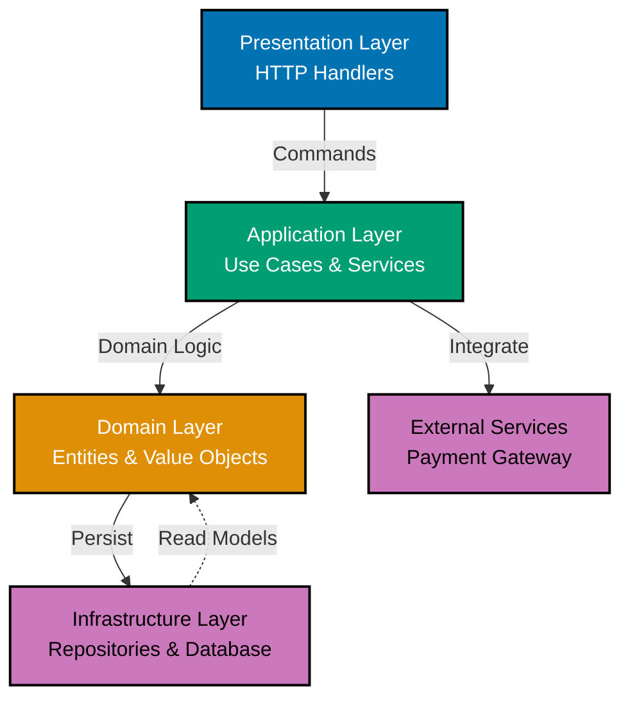
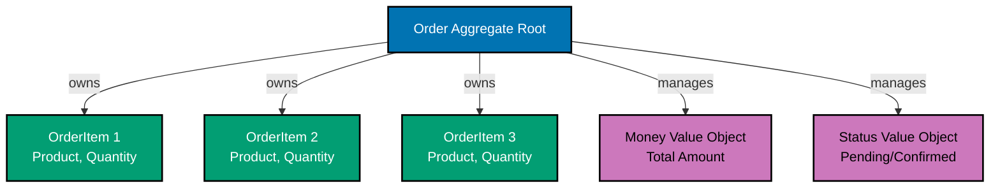
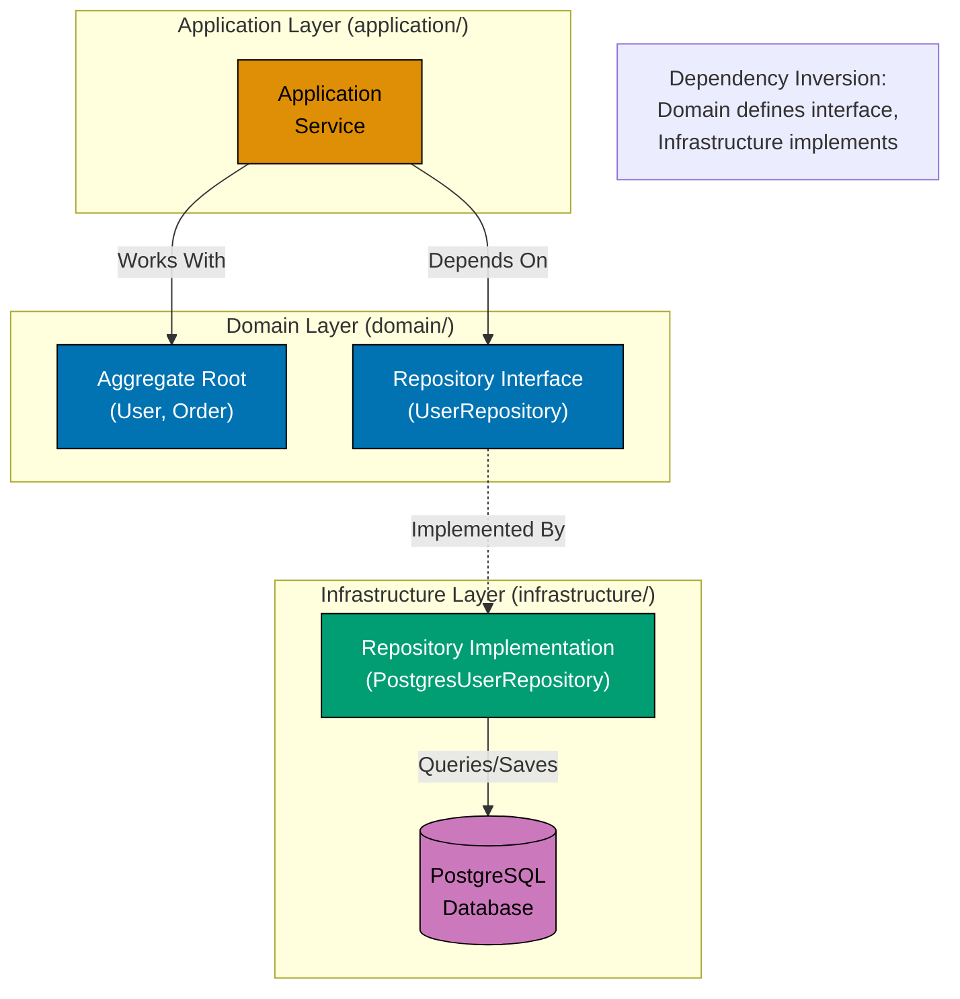
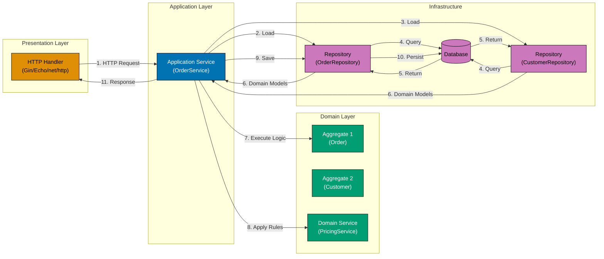
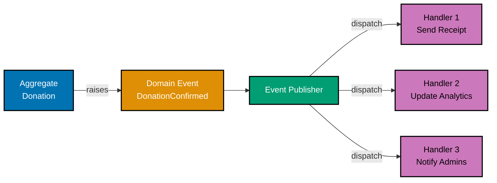

# Domain-Driven Design (DDD) in Go

**Quick Reference**: [Overview](#overview) | [DDD Fundamentals](#ddd-fundamentals) | [Value Objects](#value-objects) | [Entities](#entities) | [Aggregates](#aggregates) | [Repositories](#repositories) | [Domain Services](#domain-services) | [Application Services](#application-services) | [Domain Events](#domain-events) | [Factories](#factories) | [Specifications](#specifications) | [Ubiquitous Language](#ubiquitous-language) | [DDD Best Practices in Go](#ddd-best-practices-in-go) | [Conclusion](#conclusion)

## Overview

Domain-Driven Design is a software design approach that focuses on modeling software based on the business domain. This document explores DDD tactical patterns in Go, including entities, value objects, aggregates, repositories, and services without relying on class-based inheritance.

**Audience**: Developers applying Domain-Driven Design patterns in Go.

**Prerequisites**: Understanding of Go structs and interfaces, basic DDD concepts.

**Related Documentation**:

- [Best Practices](./ex-so-stla-go__best-practices.md)
- [Interfaces and Composition](./ex-so-stla-go__interfaces-and-composition.md)

## DDD Fundamentals

### Core Concepts

DDD building blocks in Go:



```go
// Value Object: Immutable, identified by attributes
type Money struct {
    amount   float64
    currency string
}

// Entity: Mutable, identified by ID
type Order struct {
    id        OrderID
    donor  Donor
    items     []OrderItem
    total     Money
    createdAt time.Time
}

// Aggregate: Consistency boundary
type Account struct {
    id           AccountID
    owner        UserID
    balance      Money
    transactions []DonationTransaction // Aggregate root manages children
}

// Repository: Persistence abstraction
type OrderRepository interface {
    Save(order *Order) error
    FindByID(id OrderID) (*Order, error)
}

// Domain Service: Business logic not belonging to entity
type PricingService struct{}

func (s *PricingService) CalculateDiscount(order *Order) Money {
    // Complex pricing logic
    return Money{}
}
```

## Value Objects

### Implementing Value Objects

Immutable value objects:

```go
package domain

import (
    "errors"
    "fmt"
)

// Email value object
type Email struct {
    value string
}

// Constructor with validation
func NewEmail(value string) (Email, error) {
    if !isValidEmail(value) {
        return Email{}, errors.New("invalid email format")
    }
    return Email{value: value}, nil
}

// Getter (no setter - immutable)
func (e Email) String() string {
    return e.value
}

// Value equality
func (e Email) Equals(other Email) bool {
    return e.value == other.value
}

// Money value object
type Money struct {
    amount   int64  // Store as cents
    currency string
}

func NewMoney(amount float64, currency string) (Money, error) {
    if currency == "" {
        return Money{}, errors.New("currency required")
    }
    return Money{
        amount:   int64(amount * 100), // Convert to cents
        currency: currency,
    }, nil
}

func (m Money) Amount() float64 {
    return float64(m.amount) / 100
}

func (m Money) Currency() string {
    return m.currency
}

// Value object operations return new instances
func (m Money) Add(other Money) (Money, error) {
    if m.currency != other.currency {
        return Money{}, errors.New("currency mismatch")
    }
    return Money{
        amount:   m.amount + other.amount,
        currency: m.currency,
    }, nil
}

func (m Money) Multiply(factor float64) Money {
    return Money{
        amount:   int64(float64(m.amount) * factor),
        currency: m.currency,
    }
}

func (m Money) Equals(other Money) bool {
    return m.amount == other.amount && m.currency == other.currency
}

func isValidEmail(email string) bool {
    // Email validation logic
    return true
}
```

### Complex Value Objects

Value objects with behavior:

```go
package domain

import (
    "errors"
    "time"
)

// DateRange value object
type DateRange struct {
    start time.Time
    end   time.Time
}

func NewDateRange(start, end time.Time) (DateRange, error) {
    if end.Before(start) {
        return DateRange{}, errors.New("end date must be after start date")
    }
    return DateRange{start: start, end: end}, nil
}

func (dr DateRange) Start() time.Time {
    return dr.start
}

func (dr DateRange) End() time.Time {
    return dr.end
}

func (dr DateRange) Contains(date time.Time) bool {
    return (date.Equal(dr.start) || date.After(dr.start)) &&
        (date.Equal(dr.end) || date.Before(dr.end))
}

func (dr DateRange) Overlaps(other DateRange) bool {
    return dr.Contains(other.start) || dr.Contains(other.end) ||
        other.Contains(dr.start) || other.Contains(dr.end)
}

func (dr DateRange) Duration() time.Duration {
    return dr.end.Sub(dr.start)
}

// Address value object
type Address struct {
    street     string
    city       string
    state      string
    zipCode    string
    country    string
}

func NewAddress(street, city, state, zipCode, country string) (Address, error) {
    if street == "" || city == "" || country == "" {
        return Address{}, errors.New("required fields missing")
    }

    return Address{
        street:  street,
        city:    city,
        state:   state,
        zipCode: zipCode,
        country: country,
    }, nil
}

func (a Address) FullAddress() string {
    return fmt.Sprintf("%s, %s, %s %s, %s",
        a.street, a.city, a.state, a.zipCode, a.country)
}

func (a Address) Equals(other Address) bool {
    return a.street == other.street &&
        a.city == other.city &&
        a.state == other.state &&
        a.zipCode == other.zipCode &&
        a.country == other.country
}
```

## Entities

### Entity Implementation

Entities with identity:

```go
package domain

import (
    "time"

    "github.com/google/uuid"
)

// Entity ID types
type UserID struct {
    value string
}

func NewUserID() UserID {
    return UserID{value: uuid.New().String()}
}

func ParseUserID(value string) (UserID, error) {
    if value == "" {
        return UserID{}, errors.New("invalid beneficiary ID")
    }
    return UserID{value: value}, nil
}

func (id UserID) String() string {
    return id.value
}

func (id UserID) Equals(other UserID) bool {
    return id.value == other.value
}

// Beneficiary entity
type Beneficiary struct {
    id        UserID
    email     Email
    name      string
    createdAt time.Time
    updatedAt time.Time
}

func NewUser(email Email, name string) *Beneficiary {
    return &Beneficiary{
        id:        NewUserID(),
        email:     email,
        name:      name,
        createdAt: time.Now(),
        updatedAt: time.Now(),
    }
}

// Identity
func (u *Beneficiary) ID() UserID {
    return u.id
}

// Entity equality based on ID
func (u *Beneficiary) Equals(other *Beneficiary) bool {
    return u.id.Equals(other.id)
}

// Behavior
func (u *Beneficiary) UpdateEmail(email Email) {
    u.email = email
    u.updatedAt = time.Now()
}

func (u *Beneficiary) UpdateName(name string) {
    u.name = name
    u.updatedAt = time.Now()
}

// Getters
func (u *Beneficiary) Email() Email {
    return u.email
}

func (u *Beneficiary) Name() string {
    return u.name
}
```

## Aggregates

### Aggregate Root

Maintaining consistency boundary:



```go
package domain

import (
    "errors"
    "time"
)

// Order aggregate root
type Order struct {
    id        OrderID
    customerID CustomerID
    items     []OrderItem
    status    OrderStatus
    total     Money
    createdAt time.Time
}

type OrderID struct {
    value string
}

type OrderItem struct {
    productID ProductID
    quantity  int
    price     Money
}

type OrderStatus string

const (
    OrderStatusPending   OrderStatus = "pending"
    OrderStatusConfirmed OrderStatus = "confirmed"
    OrderStatusShipped   OrderStatus = "shipped"
    OrderStatusDelivered OrderStatus = "delivered"
    OrderStatusCancelled OrderStatus = "cancelled"
)

// Factory method
func NewOrder(customerID CustomerID) *Order {
    return &Order{
        id:         NewOrderID(),
        customerID: customerID,
        items:      []OrderItem{},
        status:     OrderStatusPending,
        total:      Money{},
        createdAt:  time.Now(),
    }
}

// Aggregate root controls all modifications
func (o *Order) AddItem(productID ProductID, quantity int, price Money) error {
    if quantity <= 0 {
        return errors.New("quantity must be positive")
    }

    // Check if item already exists
    for i, item := range o.items {
        if item.productID.Equals(productID) {
            o.items[i].quantity += quantity
            o.recalculateTotal()
            return nil
        }
    }

    // Add new item
    o.items = append(o.items, OrderItem{
        productID: productID,
        quantity:  quantity,
        price:     price,
    })

    o.recalculateTotal()
    return nil
}

func (o *Order) RemoveItem(productID ProductID) error {
    for i, item := range o.items {
        if item.productID.Equals(productID) {
            o.items = append(o.items[:i], o.items[i+1:]...)
            o.recalculateTotal()
            return nil
        }
    }
    return errors.New("item not found")
}

// Business logic
func (o *Order) Confirm() error {
    if o.status != OrderStatusPending {
        return errors.New("can only confirm pending orders")
    }

    if len(o.items) == 0 {
        return errors.New("cannot confirm empty order")
    }

    o.status = OrderStatusConfirmed
    return nil
}

func (o *Order) Ship() error {
    if o.status != OrderStatusConfirmed {
        return errors.New("can only ship confirmed orders")
    }

    o.status = OrderStatusShipped
    return nil
}

func (o *Order) Cancel() error {
    if o.status == OrderStatusShipped || o.status == OrderStatusDelivered {
        return errors.New("cannot cancel shipped or delivered orders")
    }

    o.status = OrderStatusCancelled
    return nil
}

// Internal consistency
func (o *Order) recalculateTotal() {
    total := Money{currency: "USD"}
    for _, item := range o.items {
        itemTotal := item.price.Multiply(float64(item.quantity))
        total, _ = total.Add(itemTotal)
    }
    o.total = total
}

// Getters
func (o *Order) ID() OrderID {
    return o.id
}

func (o *Order) Total() Money {
    return o.total
}

func (o *Order) Status() OrderStatus {
    return o.status
}

func (o *Order) Items() []OrderItem {
    // Return copy to protect invariants
    items := make([]OrderItem, len(o.items))
    copy(items, o.items)
    return items
}
```

## Repositories

### Repository Interface

#### Repository Pattern Architecture



**Key Points**:

- **Interface in domain**: Domain layer defines repository contract
- **Implementation in infrastructure**: Persistence details isolated
- **Dependency inversion**: High-level (domain) doesn't depend on low-level (database)
- **One repository per aggregate**: UserRepository, OrderRepository

Persistence abstraction:

```go
package domain

import "context"

// Repository interface in domain layer
type UserRepository interface {
    Save(ctx context.Context, beneficiary *Beneficiary) error
    FindByID(ctx context.Context, id UserID) (*Beneficiary, error)
    FindByEmail(ctx context.Context, email Email) (*Beneficiary, error)
    Delete(ctx context.Context, id UserID) error
}

type OrderRepository interface {
    Save(ctx context.Context, order *Order) error
    FindByID(ctx context.Context, id OrderID) (*Order, error)
    FindByCustomerID(ctx context.Context, customerID CustomerID) ([]*Order, error)
    Delete(ctx context.Context, id OrderID) error
}

// Repository implementation in infrastructure layer
type PostgresUserRepository struct {
    db *sql.DB
}

func NewPostgresUserRepository(db *sql.DB) *PostgresUserRepository {
    return &PostgresUserRepository{db: db}
}

func (r *PostgresUserRepository) Save(ctx context.Context, beneficiary *Beneficiary) error {
    query := `
        INSERT INTO users (id, email, name, created_at, updated_at)
        VALUES ($1, $2, $3, $4, $5)
        ON CONFLICT (id) DO UPDATE SET
            email = $2,
            name = $3,
            updated_at = $5
    `

    _, err := r.db.ExecContext(ctx, query,
        beneficiary.ID().String(),
        beneficiary.Email().String(),
        beneficiary.Name(),
        beneficiary.createdAt,
        beneficiary.updatedAt,
    )

    return err
}

func (r *PostgresUserRepository) FindByID(ctx context.Context, id UserID) (*Beneficiary, error) {
    query := `
        SELECT id, email, name, created_at, updated_at
        FROM users
        WHERE id = $1
    `

    var (
        idStr     string
        emailStr  string
        name      string
        createdAt time.Time
        updatedAt time.Time
    )

    err := r.db.QueryRowContext(ctx, query, id.String()).Scan(
        &idStr, &emailStr, &name, &createdAt, &updatedAt,
    )

    if err == sql.ErrNoRows {
        return nil, errors.New("beneficiary not found")
    }

    if err != nil {
        return nil, err
    }

    userID, _ := ParseUserID(idStr)
    email, _ := NewEmail(emailStr)

    beneficiary := &Beneficiary{
        id:        userID,
        email:     email,
        name:      name,
        createdAt: createdAt,
        updatedAt: updatedAt,
    }

    return beneficiary, nil
}
```

## Domain Services

### Service Implementation

Business logic across entities:

```go
package domain

import (
    "context"
    "errors"
)

// TransferService coordinates money transfer between accounts
type TransferService struct {
    accountRepo AccountRepository
}

func NewTransferService(accountRepo AccountRepository) *TransferService {
    return &TransferService{
        accountRepo: accountRepo,
    }
}

func (s *TransferService) DonationTransfer(
    ctx context.Context,
    fromAccountID, toAccountID AccountID,
    amount Money,
) error {
    // Load both accounts
    fromAccount, err := s.accountRepo.FindByID(ctx, fromAccountID)
    if err != nil {
        return err
    }

    toAccount, err := s.accountRepo.FindByID(ctx, toAccountID)
    if err != nil {
        return err
    }

    // Perform transfer
    if err := fromAccount.Withdraw(amount); err != nil {
        return err
    }

    if err := toAccount.Deposit(amount); err != nil {
        // Rollback
        fromAccount.Deposit(amount)
        return err
    }

    // Save both accounts
    if err := s.accountRepo.Save(ctx, fromAccount); err != nil {
        return err
    }

    if err := s.accountRepo.Save(ctx, toAccount); err != nil {
        // Compensate
        fromAccount.Deposit(amount)
        s.accountRepo.Save(ctx, fromAccount)
        return err
    }

    return nil
}

// PricingService calculates prices based on complex rules
type PricingService struct {
    rules []PricingRule
}

type PricingRule interface {
    Apply(order *Order) (Money, error)
}

func NewPricingService(rules []PricingRule) *PricingService {
    return &PricingService{rules: rules}
}

func (s *PricingService) CalculatePrice(order *Order) (Money, error) {
    price := order.Total()

    for _, rule := range s.rules {
        adjustedPrice, err := rule.Apply(order)
        if err != nil {
            return Money{}, err
        }
        price = adjustedPrice
    }

    return price, nil
}
```

## Application Services

### Use Case Implementation

#### Application Service Flow



**Flow Steps**:

1. **HTTP handler receives request**: Presentation layer validates input
2. **Service loads aggregates**: Repository fetches from database
3. **Execute domain logic**: Aggregates enforce invariants
4. **Apply domain services**: Complex calculations isolated
5. **Save changes**: Repository persists state
6. **Return response**: Handler formats HTTP response

Orchestrating domain logic:

```go
package application

import (
    "context"
    "myapp/domain"
)

// CreateOrderUseCase orchestrates order creation
type CreateOrderUseCase struct {
    orderRepo    domain.OrderRepository
    productRepo  domain.ProductRepository
    pricingService *domain.PricingService
}

func NewCreateOrderUseCase(
    orderRepo domain.OrderRepository,
    productRepo domain.ProductRepository,
    pricingService *domain.PricingService,
) *CreateOrderUseCase {
    return &CreateOrderUseCase{
        orderRepo:      orderRepo,
        productRepo:    productRepo,
        pricingService: pricingService,
    }
}

type CreateOrderCommand struct {
    CustomerID domain.CustomerID
    Items      []CreateOrderItem
}

type CreateOrderItem struct {
    ProductID domain.ProductID
    Quantity  int
}

func (uc *CreateOrderUseCase) Execute(
    ctx context.Context,
    cmd CreateOrderCommand,
) (*domain.Order, error) {
    // Create order aggregate
    order := domain.NewOrder(cmd.CustomerID)

    // Add items
    for _, item := range cmd.Items {
        product, err := uc.productRepo.FindByID(ctx, item.ProductID)
        if err != nil {
            return nil, err
        }

        if err := order.AddItem(item.ProductID, item.Quantity, product.Price()); err != nil {
            return nil, err
        }
    }

    // Apply pricing rules
    price, err := uc.pricingService.CalculatePrice(order)
    if err != nil {
        return nil, err
    }

    // Confirm order
    if err := order.Confirm(); err != nil {
        return nil, err
    }

    // Persist
    if err := uc.orderRepo.Save(ctx, order); err != nil {
        return nil, err
    }

    return order, nil
}
```

## Domain Events

### Event-Driven Design

Publishing domain events:



```go
package domain

import (
    "time"
)

// Domain event interface
type DomainEvent interface {
    OccurredAt() time.Time
    EventType() string
}

// OrderConfirmed event
type OrderConfirmed struct {
    orderID   OrderID
    occurredAt time.Time
}

func NewOrderConfirmed(orderID OrderID) OrderConfirmed {
    return OrderConfirmed{
        orderID:    orderID,
        occurredAt: time.Now(),
    }
}

func (e OrderConfirmed) OccurredAt() time.Time {
    return e.occurredAt
}

func (e OrderConfirmed) EventType() string {
    return "OrderConfirmed"
}

func (e OrderConfirmed) OrderID() OrderID {
    return e.orderID
}

// Event publisher
type EventPublisher interface {
    Publish(event DomainEvent) error
}

// Modified Order aggregate to publish events
type OrderWithEvents struct {
    *Order
    events []DomainEvent
}

func (o *OrderWithEvents) Confirm() error {
    if err := o.Order.Confirm(); err != nil {
        return err
    }

    // Publish domain event
    event := NewOrderConfirmed(o.ID())
    o.events = append(o.events, event)

    return nil
}

func (o *OrderWithEvents) Events() []DomainEvent {
    return o.events
}

func (o *OrderWithEvents) ClearEvents() {
    o.events = []DomainEvent{}
}
```

## Factories

### Complex Object Creation

Factory patterns in Go:

```go
package domain

import "errors"

// OrderFactory creates orders with validation
type OrderFactory struct {
    productRepo domain.ProductRepository
}

func NewOrderFactory(productRepo domain.ProductRepository) *OrderFactory {
    return &OrderFactory{productRepo: productRepo}
}

func (f *OrderFactory) CreateOrder(
    ctx context.Context,
    customerID CustomerID,
    items []OrderItem,
) (*Order, error) {
    if len(items) == 0 {
        return nil, errors.New("order must have at least one item")
    }

    order := NewOrder(customerID)

    // Validate and add items
    for _, item := range items {
        product, err := f.productRepo.FindByID(ctx, item.productID)
        if err != nil {
            return nil, err
        }

        if !product.IsAvailable() {
            return nil, errors.New("product not available")
        }

        if err := order.AddItem(item.productID, item.quantity, product.Price()); err != nil {
            return nil, err
        }
    }

    return order, nil
}
```

## Specifications

### Specification Pattern

Reusable business rules:

```go
package domain

// Specification interface
type Specification interface {
    IsSatisfiedBy(candidate interface{}) bool
}

// CustomerEligibleForDiscount specification
type CustomerEligibleForDiscount struct {
    minimumOrders int
}

func NewCustomerEligibleForDiscount(minimumOrders int) *CustomerEligibleForDiscount {
    return &CustomerEligibleForDiscount{
        minimumOrders: minimumOrders,
    }
}

func (s *CustomerEligibleForDiscount) IsSatisfiedBy(candidate interface{}) bool {
    donor, ok := candidate.(*Donor)
    if !ok {
        return false
    }

    return donor.TotalOrders() >= s.minimumOrders
}

// Composite specifications
type AndSpecification struct {
    specs []Specification
}

func (s *AndSpecification) IsSatisfiedBy(candidate interface{}) bool {
    for _, spec := range s.specs {
        if !spec.IsSatisfiedBy(candidate) {
            return false
        }
    }
    return true
}

type OrSpecification struct {
    specs []Specification
}

func (s *OrSpecification) IsSatisfiedBy(candidate interface{}) bool {
    for _, spec := range s.specs {
        if spec.IsSatisfiedBy(candidate) {
            return true
        }
    }
    return false
}

// Usage
func applyDiscount(donor *Donor, order *Order) error {
    eligibleSpec := NewCustomerEligibleForDiscount(5)

    if eligibleSpec.IsSatisfiedBy(donor) {
        // Apply discount
    }

    return nil
}
```

## Ubiquitous Language

### Type-Safe Domain Language

Using Go types for ubiquitous language:

```go
package domain

// Domain concepts as types
type ProductName struct {
    value string
}

type ProductDescription struct {
    value string
}

type SKU struct {
    value string
}

type Quantity struct {
    value int
}

// Product aggregate using ubiquitous language
type Product struct {
    id          ProductID
    name        ProductName
    description ProductDescription
    sku         SKU
    price       Money
    stock       Quantity
}

// Methods use domain language
func (p *Product) IsInStock() bool {
    return p.stock.value > 0
}

func (p *Product) Reserve(qty Quantity) error {
    if p.stock.value < qty.value {
        return errors.New("insufficient stock")
    }

    p.stock.value -= qty.value
    return nil
}

func (p *Product) Restock(qty Quantity) {
    p.stock.value += qty.value
}
```

## DDD Best Practices in Go

### Keep Aggregates Small

Focus on consistency boundaries:

```go
// GOOD: Small focused aggregate
type Order struct {
    id     OrderID
    items  []OrderItem
    status OrderStatus
}

// BAD: Large aggregate with too many responsibilities
type OrderBad struct {
    id              OrderID
    items           []OrderItem
    status          OrderStatus
    donor        Donor        // Should be reference
    shippingAddress Address
    billingAddress  Address
    payments        []DonationPayment       // Should be separate aggregate
    shipments       []Shipment      // Should be separate aggregate
    invoices        []Invoice       // Should be separate aggregate
}
```

### Use Interfaces for Dependencies

Dependency inversion:

```go
// Domain layer defines interfaces
type UserRepository interface {
    Save(ctx context.Context, beneficiary *Beneficiary) error
    FindByID(ctx context.Context, id UserID) (*Beneficiary, error)
}

// Infrastructure layer implements
type PostgresUserRepository struct {
    db *sql.DB
}

func (r *PostgresUserRepository) Save(ctx context.Context, beneficiary *Beneficiary) error {
    // Implementation
    return nil
}
```

### Encapsulate Invariants

Protect aggregate consistency:

```go
type ZakatAccount struct {
    id      AccountID
    balance Money
}

// Private fields, public methods enforce invariants
func (a *ZakatAccount) Withdraw(amount Money) error {
    newBalance, err := a.balance.Subtract(amount)
    if err != nil {
        return err
    }

    if newBalance.Amount() < 0 {
        return errors.New("insufficient funds")
    }

    a.balance = newBalance
    return nil
}
```

## Conclusion

Domain-Driven Design in Go emphasizes:

1. **Value Objects**: Immutable, equality by attributes
2. **Entities**: Mutable, equality by ID
3. **Aggregates**: Consistency boundaries
4. **Repositories**: Persistence abstraction
5. **Domain Services**: Cross-entity business logic
6. **Application Services**: Use case orchestration
7. **Domain Events**: Communicate state changes
8. **Factories**: Complex object creation
9. **Specifications**: Reusable business rules
10. **Ubiquitous Language**: Type-safe domain concepts

**DDD in Go Benefits**:

- Clear separation of concerns
- Testable business logic
- Maintainable domain model
- Explicit business rules
- Type safety without classes

**Next Steps**:

- Identify bounded contexts
- Model domain entities and value objects
- Define aggregate boundaries
- Implement repositories
- Use domain events for decoupling

**Related Documentation**:

- Read [Best Practices](./ex-so-stla-go__best-practices.md)
- Explore [Interfaces and Composition](./ex-so-stla-go__interfaces-and-composition.md)

---

**Last Updated**: 2026-01-23
**Go Version**: 1.21+ (baseline), 1.22+ (recommended), 1.23 (latest)
**Maintainers**: Platform Documentation Team
