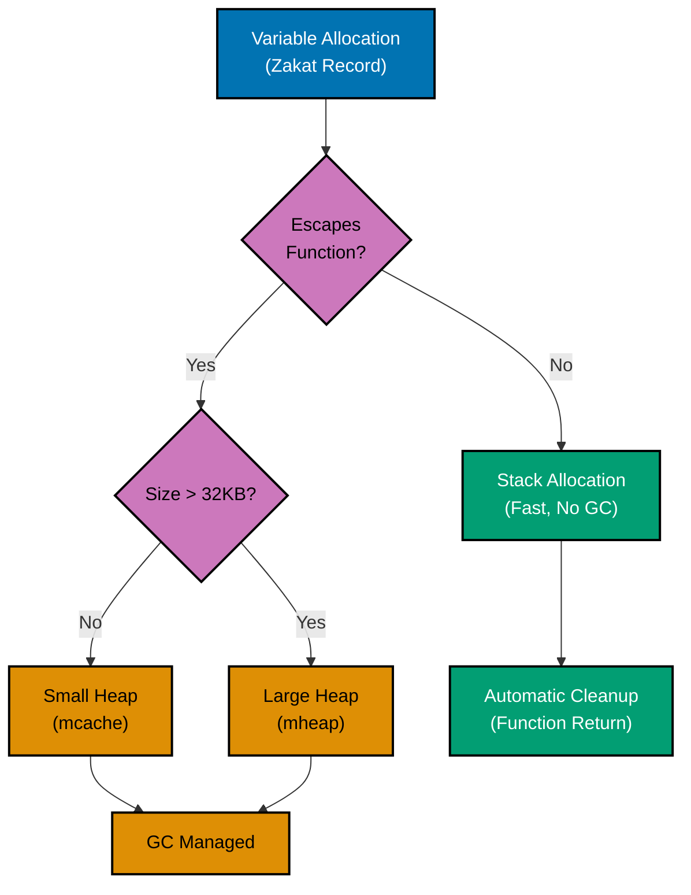
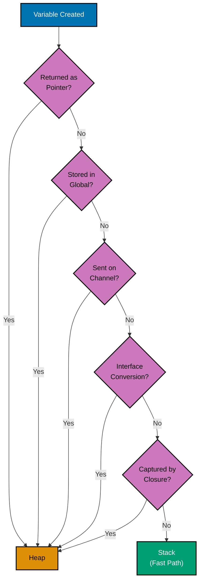
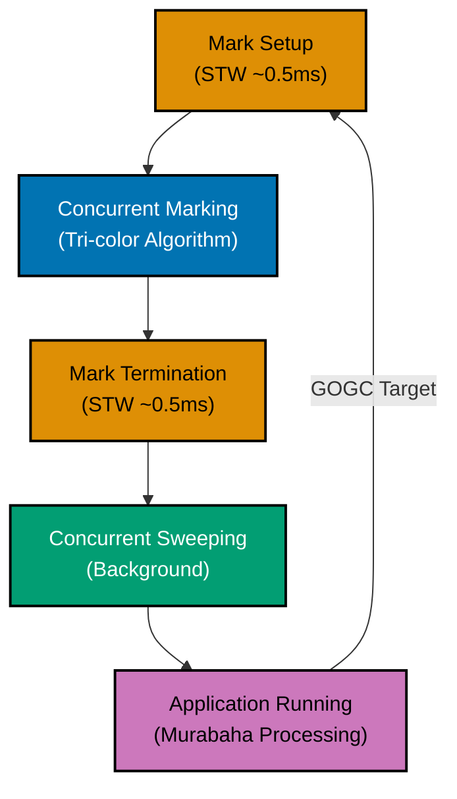

# Memory Management in Go

**Quick Reference**: [Overview](#overview) | [Memory Management Fundamentals](#memory-management-fundamentals) | [Go Memory Model](#go-memory-model) | [Pointers](#pointers) | [Escape Analysis](#escape-analysis) | [Garbage Collection](#garbage-collection) | [Memory Allocation Patterns](#memory-allocation-patterns) | [Memory Profiling](#memory-profiling) | [Memory Optimization Techniques](#memory-optimization-techniques) | [Unsafe Package](#unsafe-package) | [Memory Safety](#memory-safety) | [Best Practices](#best-practices) | [Common Pitfalls](#common-pitfalls) | [Related Documentation](#related-documentation) | [Further Reading](#further-reading)

## Overview

Memory management in Go is primarily automatic through garbage collection, but understanding how memory works is essential for writing efficient, scalable applications. Go provides a balance between automatic memory management (garbage collection) and performance through careful language design and runtime optimization.

This document explores Go's memory management system, including the garbage collector, escape analysis, memory profiling, optimization techniques, and best practices for writing memory-efficient Go code.

## Memory Management Fundamentals

### Stack vs Heap

#### Memory Allocation Decision Flow



Go manages memory in two primary areas:

**Stack**:

- Fast allocation/deallocation (push/pop operations)
- LIFO (Last In, First Out) structure
- Per-goroutine, fixed size (default 2KB, can grow to ~1GB)
- Automatically managed (no GC overhead)
- Used for function local variables, parameters, return values

**Heap**:

- Slower allocation/deallocation
- Garbage collector manages cleanup
- Shared across all goroutines
- Used for dynamically sized data, data that escapes function scope
- Subject to GC pauses

```go
func StackAllocation() {
    x := 42 // Allocated on stack (local variable, doesn't escape)
    fmt.Println(x)
    // x automatically deallocated when function returns
}

func HeapAllocation() *int {
    x := 42
    return &x // x escapes to heap (returned pointer)
    // x remains in memory, cleaned up by GC
}
```

### Memory Allocation

Go runtime allocates memory using size classes to reduce fragmentation:

- **Small objects** (≤32KB): Allocated from per-thread caches (mcache)
- **Large objects** (>32KB): Allocated directly from heap

```go
// Small allocation (stack or small heap allocation)
x := 10

// Large allocation (heap)
largeSlice := make([]byte, 1<<20) // 1MB slice
```

## Go Memory Model

### Memory Layout

```go
type Example struct {
    a bool   // 1 byte
    // 7 bytes padding for alignment
    b int64  // 8 bytes
    c int32  // 4 bytes
    // 4 bytes padding for alignment
}

// Size: 24 bytes (not 13 bytes due to padding)
```

Viewing struct size:

```go
import "unsafe"

fmt.Println(unsafe.Sizeof(Example{})) // 24
```

### Value vs Pointer Semantics

```go
// Value semantics - copies entire struct
type Point struct {
    X, Y float64
}

func MoveValue(p Point, dx, dy float64) Point {
    p.X += dx // modifies copy
    p.Y += dy
    return p
}

// Pointer semantics - modifies original
func MovePointer(p *Point, dx, dy float64) {
    p.X += dx // modifies original
    p.Y += dy
}

func Example() {
    p1 := Point{X: 0, Y: 0}
    p2 := MoveValue(p1, 10, 20)
    fmt.Println(p1) // {0 0} - unchanged
    fmt.Println(p2) // {10 20} - new value

    p3 := Point{X: 0, Y: 0}
    MovePointer(&p3, 10, 20)
    fmt.Println(p3) // {10 20} - modified
}
```

### Struct Memory Alignment

Fields are aligned to their natural boundaries for CPU efficiency:

```go
// Poor alignment - 24 bytes
type BadLayout struct {
    a bool   // 1 byte
    b int64  // 8 bytes (7 bytes padding before)
    c bool   // 1 byte
    // 7 bytes padding at end
}

// Good alignment - 16 bytes
type GoodLayout struct {
    b int64  // 8 bytes
    a bool   // 1 byte
    c bool   // 1 byte
    // 6 bytes padding at end
}

fmt.Println(unsafe.Sizeof(BadLayout{}))  // 24
fmt.Println(unsafe.Sizeof(GoodLayout{})) // 16
```

## Pointers

### Pointer Basics

```go
// Create pointer
x := 42
ptr := &x // ptr holds address of x

// Dereference pointer
value := *ptr // value = 42

// Modify through pointer
*ptr = 100
fmt.Println(x) // 100

// Pointer to struct
type Person struct {
    Name string
    Age  int
}

p := &Person{Name: "Alice", Age: 30}
p.Age = 31 // Automatic dereferencing

// new() allocates and returns pointer to zero value
ptr2 := new(int) // ptr2 = &0
```

### No Pointer Arithmetic

Unlike C, Go doesn't allow pointer arithmetic for safety:

```go
arr := [3]int{1, 2, 3}
ptr := &arr[0]

// ptr + 1 // Compile error: invalid operation

// Use slices instead for sequential access
slice := arr[:]
fmt.Println(slice[1]) // 2
```

### Nil Pointers

```go
var ptr *int // nil pointer

// Dereferencing nil pointer causes panic
// *ptr = 42 // panic: runtime error: invalid memory address

// Always check for nil
if ptr != nil {
    *ptr = 42
}

// Safe pointer initialization
ptr = new(int)
*ptr = 42 // safe now
```

## Escape Analysis

#### Escape Analysis Decision Tree



Escape analysis determines whether a variable can be allocated on the stack or must be allocated on the heap.

### What is Escape Analysis?

The compiler analyzes variable lifetimes to decide allocation location:

- **Stack allocation**: Variable doesn't outlive function (faster)
- **Heap allocation**: Variable escapes function scope (slower, GC overhead)

```go
// Stack allocation - x doesn't escape
func StackExample() int {
    x := 42
    return x // returns value, not address
}

// Heap allocation - x escapes via pointer
func HeapExample() *int {
    x := 42
    return &x // x escapes to heap
}

// Heap allocation - x escapes via closure
func ClosureExample() func() int {
    x := 42
    return func() int {
        return x // closure captures x, x escapes to heap
    }
}
```

### Viewing Escape Analysis

```bash
# View escape analysis decisions
go build -gcflags='-m' main.go

# More verbose output
go build -gcflags='-m -m' main.go
```

Example output:

```
./main.go:5:9: &x escapes to heap
./main.go:4:2: moved to heap: x
```

### Optimizing for Stack Allocation

```go
// Heap allocation - interface causes escape
func PrintInterface(v interface{}) {
    fmt.Println(v)
}

func Example1() {
    x := 42
    PrintInterface(x) // x escapes to heap (interface conversion)
}

// Stack allocation - concrete type
func PrintInt(x int) {
    fmt.Println(x)
}

func Example2() {
    x := 42
    PrintInt(x) // x stays on stack
}
```

### Common Escape Scenarios

**1. Returning Pointers**:

```go
func EscapeReturn() *int {
    x := 42
    return &x // x escapes
}
```

**2. Storing in Global**:

```go
var global *int

func EscapeGlobal() {
    x := 42
    global = &x // x escapes
}
```

**3. Sending on Channel**:

```go
func EscapeChannel(ch chan *int) {
    x := 42
    ch <- &x // x escapes
}
```

**4. Interface Conversion**:

```go
func EscapeInterface() interface{} {
    x := 42
    return x // x escapes (boxed in interface)
}
```

**5. Slice/Map Storage**:

```go
func EscapeSlice() []*int {
    x := 42
    return []*int{&x} // x escapes
}
```

## Garbage Collection

Go uses a concurrent, tri-color mark-and-sweep garbage collector.

### GC Algorithm

#### GC Cycle Phases



**Phases**:

1. **Mark Setup** (Stop-The-World): Prepare for marking
2. **Marking** (Concurrent): Mark reachable objects
3. **Mark Termination** (Stop-The-World): Finalize marking
4. **Sweeping** (Concurrent): Reclaim unreachable objects

### GC Tuning

**GOGC** - GC target percentage (default: 100):

```bash
# Trigger GC when heap grows 100% beyond live objects
GOGC=100 ./myapp

# More aggressive GC (heap grows 50% before GC)
GOGC=50 ./myapp

# Less aggressive GC (heap grows 200% before GC)
GOGC=200 ./myapp

# Disable GC (not recommended for production)
GOGC=off ./myapp
```

**GOMEMLIMIT** - Memory limit (Go 1.19+):

```bash
# Limit heap memory to 1GB
GOMEMLIMIT=1GiB ./myapp

# Soft limit - GC becomes more aggressive near limit
GOMEMLIMIT=2GiB ./myapp
```

```go
import "runtime/debug"

// Set memory limit programmatically (Go 1.19+)
debug.SetMemoryLimit(1 << 30) // 1GB

// Read current limit
limit := debug.SetMemoryLimit(-1)
```

### GC Metrics

```go
import "runtime"

func PrintGCStats() {
    var m runtime.MemStats
    runtime.ReadMemStats(&m)

    fmt.Printf("Alloc = %v MiB", bToMb(m.Alloc))
    fmt.Printf("\tTotalAlloc = %v MiB", bToMb(m.TotalAlloc))
    fmt.Printf("\tSys = %v MiB", bToMb(m.Sys))
    fmt.Printf("\tNumGC = %v\n", m.NumGC)
    fmt.Printf("GC Pause = %v ms\n", float64(m.PauseNs[(m.NumGC+255)%256])/1e6)
}

func bToMb(b uint64) uint64 {
    return b / 1024 / 1024
}
```

### Triggering GC Manually

```go
import "runtime"

// Trigger GC explicitly (rarely needed)
runtime.GC()

// Free OS memory (returns memory to OS)
debug.FreeOSMemory()
```

### Green Tea GC (Go 1.25, Experimental)

Go 1.25 introduces Green Tea GC as experimental feature:

```bash
# Enable Green Tea GC
GOEXPERIMENT=greenteagc go build main.go

# Or at runtime
GOEXPERIMENT=greenteagc ./myapp
```

Benefits:

- 10-40% reduction in GC overhead for GC-heavy programs
- Improved pause times
- Variable make hash optimization

## Memory Allocation Patterns

### Pre-allocation

```go
// Poor - multiple allocations as slice grows
func BuildSliceBad() []int {
    var result []int
    for i := 0; i < 1000; i++ {
        result = append(result, i) // multiple reallocations
    }
    return result
}

// Good - single allocation with known capacity
func BuildSliceGood() []int {
    result := make([]int, 0, 1000) // pre-allocate capacity
    for i := 0; i < 1000; i++ {
        result = append(result, i) // no reallocation
    }
    return result
}

// Maps also benefit from pre-allocation
func BuildMapGood() map[int]string {
    result := make(map[int]string, 1000) // pre-size
    for i := 0; i < 1000; i++ {
        result[i] = fmt.Sprintf("value%d", i)
    }
    return result
}
```

### Object Pooling (sync.Pool)

```go
import "sync"

// Pool for expensive-to-create objects
var bufferPool = sync.Pool{
    New: func() interface{} {
        return new(bytes.Buffer)
    },
}

func ProcessData(data []byte) string {
    // Get buffer from pool
    buf := bufferPool.Get().(*bytes.Buffer)
    defer func() {
        buf.Reset()           // clear buffer
        bufferPool.Put(buf)   // return to pool
    }()

    // Use buffer
    buf.Write(data)
    return buf.String()
}
```

Real-world example with http.Response:

```go
var responsePool = sync.Pool{
    New: func() interface{} {
        return &Response{
            Header: make(http.Header),
        }
    },
}

func HandleRequest(w http.ResponseWriter, r *http.Request) {
    resp := responsePool.Get().(*Response)
    defer responsePool.Put(resp)

    // Use response...
}
```

### Reducing Allocations

```go
// Poor - multiple string allocations
func ConcatBad(strs []string) string {
    result := ""
    for _, s := range strs {
        result += s // new allocation each iteration
    }
    return result
}

// Good - single allocation with strings.Builder
func ConcatGood(strs []string) string {
    var builder strings.Builder
    for _, s := range strs {
        builder.WriteString(s) // grows capacity efficiently
    }
    return builder.String()
}

// Better - pre-allocate capacity
func ConcatBetter(strs []string) string {
    totalLen := 0
    for _, s := range strs {
        totalLen += len(s)
    }

    var builder strings.Builder
    builder.Grow(totalLen) // pre-allocate
    for _, s := range strs {
        builder.WriteString(s)
    }
    return builder.String()
}
```

### Memory Reuse

```go
// Reuse slice backing array
func ProcessBatch(data []byte) {
    const batchSize = 1024
    buf := make([]byte, batchSize)

    for len(data) > 0 {
        n := batchSize
        if len(data) < batchSize {
            n = len(data)
        }

        // Reuse buf for each batch
        batch := buf[:n]
        copy(batch, data[:n])

        // Process batch...

        data = data[n:]
    }
}
```

## Memory Profiling

### Using pprof for Memory Profiling

```go
import (
    "net/http"
    _ "net/http/pprof"
    "runtime"
)

func main() {
    // Enable HTTP pprof endpoint
    go func() {
        http.ListenAndServe("localhost:6060", nil)
    }()

    // Your application code...
}
```

Collect and analyze memory profile:

```bash
# Heap profile (allocated and in-use memory)
go tool pprof http://localhost:6060/debug/pprof/heap

# Allocation profile (all allocations, not just live)
go tool pprof http://localhost:6060/debug/pprof/allocs

# Save profile to file
curl http://localhost:6060/debug/pprof/heap > heap.prof

# Analyze profile
go tool pprof heap.prof
```

### Programmatic Profiling

```go
import (
    "os"
    "runtime/pprof"
)

func ProfileMemory() {
    f, err := os.Create("mem.prof")
    if err != nil {
        panic(err)
    }
    defer f.Close()

    // Write heap profile
    runtime.GC() // get up-to-date statistics
    if err := pprof.WriteHeapProfile(f); err != nil {
        panic(err)
    }
}
```

### Analyzing Memory Profiles

```bash
# Interactive mode
go tool pprof mem.prof

# Commands in pprof:
# top10 - show top 10 memory consumers
# list FunctionName - show source code with allocations
# web - open visualization in browser (requires graphviz)
# pdf - generate PDF report
```

### Memory Leak Detection

```go
import "runtime"

func DetectLeak() {
    var m1, m2 runtime.MemStats

    // Baseline
    runtime.ReadMemStats(&m1)

    // Run workload
    for i := 0; i < 1000; i++ {
        DoWork()
    }

    // Force GC and check memory
    runtime.GC()
    runtime.ReadMemStats(&m2)

    // Compare allocations
    delta := m2.Alloc - m1.Alloc
    if delta > nisab {
        fmt.Printf("Potential leak: %d bytes retained\n", delta)
    }
}
```

## Memory Optimization Techniques

### Reducing Allocations

**1. Use value receivers when possible**:

```go
// Heap allocation - pointer receiver
type Counter struct {
    count int
}

func (c *Counter) Increment() {
    c.count++
}

// Stack allocation - value receiver (if Counter doesn't escape)
type Counter struct {
    count int
}

func (c Counter) Increment() Counter {
    c.count++
    return c
}
```

**2. Avoid unnecessary interface conversions**:

```go
// Causes allocation
func PrintAny(v interface{}) {
    fmt.Println(v) // v is boxed on heap
}

// No allocation
func PrintInt(v int) {
    fmt.Println(v) // v stays on stack
}
```

**3. Reuse byte slices**:

```go
// Poor - new allocation each time
func ReadDataBad(r io.Reader) ([]byte, error) {
    buf := make([]byte, 4096)
    return buf, nil
}

// Good - reuse buffer
type Reader struct {
    buf []byte
}

func NewReader() *Reader {
    return &Reader{buf: make([]byte, 4096)}
}

func (r *Reader) ReadData(reader io.Reader) ([]byte, error) {
    n, err := reader.Read(r.buf)
    return r.buf[:n], err
}
```

### Stack vs Heap Allocation

```go
// Optimize for stack allocation
func ProcessDataStack(size int) {
    // Small fixed-size array on stack
    var buf [256]byte

    // Use buf...
}

// Heap allocation required for dynamic size
func ProcessDataHeap(size int) {
    // Dynamic slice on heap
    buf := make([]byte, size)

    // Use buf...
}
```

### Efficient Data Structures

**Use arrays instead of slices for fixed-size data**:

```go
// Heap allocation
func UseSlice() {
    s := make([]int, 100)
    // ...
}

// Stack allocation (if doesn't escape)
func UseArray() {
    var a [100]int
    // ...
}
```

**Use struct instead of map for known fields**:

```go
// Heap allocation, slower access
func UseMap() {
    m := map[string]int{
        "x": 1,
        "y": 2,
        "z": 3,
    }
}

// Stack allocation (if doesn't escape), faster access
func UseStruct() {
    s := struct {
        X, Y, Z int
    }{X: 1, Y: 2, Z: 3}
}
```

### String Interning

```go
import "sync"

// String interning to reduce memory usage
type StringIntern struct {
    mu      sync.RWMutex
    strings map[string]string
}

func NewStringIntern() *StringIntern {
    return &StringIntern{
        strings: make(map[string]string),
    }
}

func (si *StringIntern) Intern(s string) string {
    si.mu.RLock()
    interned, ok := si.strings[s]
    si.mu.RUnlock()

    if ok {
        return interned // return existing string
    }

    si.mu.Lock()
    defer si.mu.Unlock()

    // Double-check after acquiring write lock
    if interned, ok := si.strings[s]; ok {
        return interned
    }

    si.strings[s] = s
    return s
}

// Go 1.23+ unique package for interning
import "unique"

func InternString(s string) unique.Handle[string] {
    return unique.Make(s) // returns canonical reference
}
```

## Unsafe Package

The `unsafe` package bypasses Go's type safety for performance-critical code.

### unsafe.Pointer

```go
import "unsafe"

// Convert pointer types
func PointerCast() {
    var x int32 = 42
    ptr := unsafe.Pointer(&x)

    // Cast to different pointer type
    floatPtr := (*float32)(ptr)
    fmt.Println(*floatPtr) // Bit pattern of 42 as float32
}

// Access struct field by offset
func FieldAccess() {
    type Point struct {
        X, Y int
    }

    p := Point{X: 10, Y: 20}
    ptr := unsafe.Pointer(&p)

    // Get Y field offset
    yOffset := unsafe.Offsetof(p.Y)

    // Access Y through pointer arithmetic
    yPtr := (*int)(unsafe.Add(ptr, yOffset))
    fmt.Println(*yPtr) // 20
}
```

### When to Use unsafe

**Valid use cases**:

- Interfacing with C code (cgo)
- Low-level system programming
- Performance-critical code with proven bottlenecks
- Implementing certain data structures (e.g., custom allocators)

**Avoid unsafe for**:

- General application code
- Premature optimization
- Type conversions (use proper casting instead)
- Any case where safe alternative exists

### Risks and Safety Concerns

```go
// DANGEROUS - undefined behavior
func DangerousCode() {
    x := 42
    ptr := unsafe.Pointer(&x)

    // Incorrect: accessing beyond memory bounds
    badPtr := (*[10]int)(ptr) // x is single int, not array
    // badPtr[5] = 100 // undefined behavior, likely crash
}

// SAFE - proper bounds checking
func SafeCode() {
    arr := [10]int{1, 2, 3, 4, 5, 6, 7, 8, 9, 10}
    ptr := unsafe.Pointer(&arr)
    arrPtr := (*[10]int)(ptr)
    arrPtr[5] = 100 // safe
}
```

## Memory Safety

### Preventing Memory Leaks

**1. Close resources properly**:

```go
func ReadFile(filename string) error {
    file, err := os.Open(filename)
    if err != nil {
        return err
    }
    defer file.Close() // ensures file is closed

    // Read file...
    return nil
}
```

**2. Cancel contexts**:

```go
func ProcessWithTimeout() {
    ctx, cancel := context.WithTimeout(context.Background(), 5*time.Second)
    defer cancel() // prevents goroutine leak

    // Use ctx...
}
```

**3. Stop timers**:

```go
func UseTimer() {
    timer := time.NewTimer(5 * time.Second)
    defer timer.Stop() // prevents timer leak

    select {
    case <-timer.C:
        fmt.Println("Timer expired")
    case <-done:
        return
    }
}
```

### Goroutine Leaks

```go
// Leak - goroutine waits forever
func LeakyGoroutine() {
    ch := make(chan int)
    go func() {
        val := <-ch // blocks forever if nothing sent
        fmt.Println(val)
    }()
    // ch never receives value, goroutine leaks
}

// Fixed - use context for cancellation
func FixedGoroutine() {
    ctx, cancel := context.WithCancel(context.Background())
    defer cancel()

    ch := make(chan int)
    go func() {
        select {
        case val := <-ch:
            fmt.Println(val)
        case <-ctx.Done():
            return // goroutine exits when context cancelled
        }
    }()
}
```

### Resource Cleanup

```go
// Resource management pattern
type Resource struct {
    // ...
}

func (r *Resource) Close() error {
    // Cleanup logic
    return nil
}

func UseResource() error {
    r, err := NewResource()
    if err != nil {
        return err
    }
    defer r.Close() // ensures cleanup

    // Use resource...
    return nil
}
```

## Best Practices

### When to Optimize Memory

**Optimize when**:

- Profiling shows memory as bottleneck
- Application has high memory usage
- Frequent GC pauses impact performance
- Memory limits are constraining (containers)

**Don't optimize when**:

- No measured performance problem
- Code clarity suffers significantly
- Optimization complexity outweighs benefits

### Measuring Before Optimizing

```go
import "testing"

func BenchmarkMemory(b *testing.B) {
    b.ReportAllocs() // report allocations

    b.ResetTimer()
    for i := 0; i < b.N; i++ {
        // Code to benchmark
        _ = BuildSlice()
    }
}
```

Run benchmark:

```bash
go test -bench=. -benchmem
```

Output shows allocations per operation:

```
BenchmarkMemory-8   1000000   1234 ns/op   256 B/op   3 allocs/op
```

### Memory-Efficient Patterns

**1. Use value types when appropriate**:

```go
// Good - small value types
type Point struct {
    X, Y float64
}

// Pass by value for small structs
func Distance(a, b Point) float64 {
    dx := a.X - b.X
    dy := a.Y - b.Y
    return math.Sqrt(dx*dx + dy*dy)
}
```

**2. Avoid unnecessary copying**:

```go
// Poor - copies large struct
func ProcessBad(data LargeStruct) {
    // ...
}

// Good - passes pointer
func ProcessGood(data *LargeStruct) {
    // ...
}
```

**3. Pre-allocate collections**:

```go
// Know size in advance
items := make([]Item, 0, 1000)

// Don't know size - grow geometrically
var items []Item
for _, data := range source {
    items = append(items, process(data))
}
```

### Trade-offs

**Memory vs Speed**:

```go
// Fast but more memory - cache results
type Calculator struct {
    cache map[int]int
}

func (c *Calculator) Fibonacci(n int) int {
    if val, ok := c.cache[n]; ok {
        return val
    }
    // Calculate and cache...
}

// Slow but less memory - recalculate
func Fibonacci(n int) int {
    if n <= 1 {
        return n
    }
    return Fibonacci(n-1) + Fibonacci(n-2)
}
```

## Common Pitfalls

### Memory Leaks

**1. Unclosed resources**:

```go
// Leak - file not closed
func ReadFileLeaky(filename string) ([]byte, error) {
    file, err := os.Open(filename)
    if err != nil {
        return nil, err
    }
    // Missing: defer file.Close()

    return io.ReadAll(file)
}
```

**2. Goroutine leaks**:

```go
// Leak - goroutine waits forever
func ProcessLeaky() {
    ch := make(chan Result)
    go func() {
        result := compute()
        ch <- result // blocks if no receiver
    }()
    // Function returns without receiving from ch
}
```

**3. Timer/Ticker leaks**:

```go
// Leak - timer not stopped
func PeriodicTaskLeaky() {
    ticker := time.NewTicker(1 * time.Second)
    // Missing: defer ticker.Stop()

    for range ticker.C {
        doWork()
    }
}
```

### Excessive Allocations

```go
// Poor - allocates in loop
func SumBad(numbers []int) int {
    sum := 0
    for _, n := range numbers {
        s := fmt.Sprintf("%d", n) // unnecessary allocation
        sum += len(s)
    }
    return sum
}

// Good - avoid unnecessary allocations
func SumGood(numbers []int) int {
    sum := 0
    for _, n := range numbers {
        digits := 0
        temp := n
        if temp == 0 {
            digits = 1
        } else {
            for temp > 0 {
                digits++
                temp /= 10
            }
        }
        sum += digits
    }
    return sum
}
```

### Large Object Copying

```go
// Poor - copies large struct
type LargeData struct {
    Buffer [1024 * 1024]byte
}

func ProcessBad(data LargeData) {
    // Copies 1MB struct
}

// Good - use pointer
func ProcessGood(data *LargeData) {
    // Only copies pointer (8 bytes)
}
```

### Slice Gotchas

**Slice memory retention**:

```go
// Leak - retains original backing array
func GetHeaderBad(data []byte) []byte {
    header := data[:10] // shares backing array with data
    return header       // entire data array retained
}

// Fixed - copy to new slice
func GetHeaderGood(data []byte) []byte {
    header := make([]byte, 10)
    copy(header, data[:10]) // independent backing array
    return header           // original data can be GC'd
}
```

**Slice capacity growth**:

```go
// Inefficient - grows slice multiple times
func BuildBad() []int {
    var slice []int
    for i := 0; i < 1000000; i++ {
        slice = append(slice, i) // multiple reallocations
    }
    return slice
}

// Efficient - single allocation
func BuildGood() []int {
    slice := make([]int, 0, 1000000)
    for i := 0; i < 1000000; i++ {
        slice = append(slice, i) // no reallocation
    }
    return slice
}
```

## Related Documentation

- [Performance](./ex-so-stla-go__performance.md) - Performance optimization including memory profiling
- [Best Practices](./ex-so-stla-go__best-practices.md) - General best practices including memory efficiency
- [Concurrency and Parallelism](./ex-so-stla-go__concurrency-and-parallelism.md) - Goroutine memory considerations
- [Anti-Patterns](./ex-so-stla-go__anti-patterns.md) - Common memory-related mistakes

## Further Reading

- [Go Memory Model](https://go.dev/ref/mem) - Official specification
- [Garbage Collection Guide](https://go.dev/doc/gc-guide) - Official GC documentation
- [Go 1.19 Memory Limit](https://go.dev/doc/go1.19#:~:text=runtime) - GOMEMLIMIT introduction
- [Go 1.25 Green Tea GC](https://go.dev/doc/go1.25#runtime) - Experimental GC improvements
- [A Guide to the Go Garbage Collector](https://tip.golang.org/doc/gc-guide) - Deep dive into GC

---

**Last Updated**: 2026-01-23
**Go Version**: 1.21+ (baseline), 1.22+ (recommended), 1.23 (latest)
**Maintainers**: Platform Documentation Team
