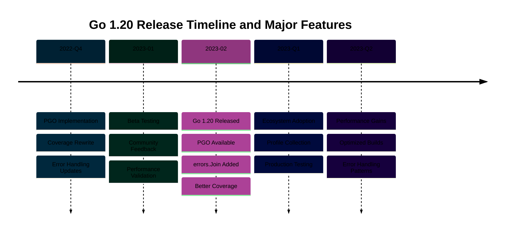

# Go 1.20 Release

## Overview

Go 1.20 introduces new features, performance improvements, and tooling enhancements. This release continues Go's evolution toward better performance and developer experience.

```mermaid
%%{init: {'theme':'base', 'themeVariables': { 'primaryColor':'#0173B2','primaryTextColor':'#fff','primaryBorderColor':'#0173B2','lineColor':'#DE8F05','secondaryColor':'#029E73','tertiaryColor':'#CC78BC','fontSize':'16px'}}}%%
flowchart TD
    A[Go 1.20 Release<br/>February 2023] --> B[PGO Support<br/>Profile-Guided Optimization]
    A --> C[Coverage Improvements<br/>Better Testing]
    A --> D[Error Wrapping<br/>Enhanced Errors]
    A --> E[Slice to Array<br/>Conversions]

    B --> B1[Build Optimization<br/>Production Profiles]
    B --> B2[Performance Gains<br/>5-15% Faster]

    C --> C1[Coverage for Tests<br/>Detailed Reports]
    C --> C2[Integration Testing<br/>Better Metrics]

    D --> D1[errors.Join<br/>Multiple Errors]
    D --> D2[Structured Wrapping<br/>Better Debugging]

    E --> E1[Zero-Copy Conversion<br/>[]byte to [N]byte]
    E --> E2[Type Safety<br/>Compile-Time Checks]

    B1 --> F[Zakat Platform<br/>Optimized Builds]
    D1 --> G[Donation Service<br/>Better Error Handling]
    E1 --> H[Hash Functions<br/>Efficient Conversions]

    style A fill:#0173B2,color:#fff
    style B fill:#DE8F05,color:#fff
    style C fill:#029E73,color:#fff
    style D fill:#CC78BC,color:#fff
    style E fill:#0173B2,color:#fff
    style F fill:#DE8F05,color:#fff
    style G fill:#CC78BC,color:#fff
    style H fill:#0173B2,color:#fff
```

## Key Features

This release includes improvements to the compiler, runtime, and standard library.



## Breaking Changes

Consult the official Go 1.20 documentation for detailed breaking changes and migration guidance.

## References

- [Go 1.20 Release Notes](https://go.dev/doc/go1.20)
- [Go Documentation](https://go.dev/doc/)

---

**Last Updated**: 2026-01-24
**Go Version**: 1.18+ (baseline), 1.23+ (stable maintenance), 1.25.x (latest stable)
**Maintainers**: OSE Platform Documentation Team
