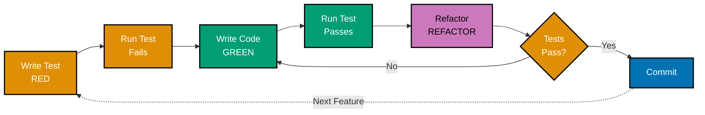
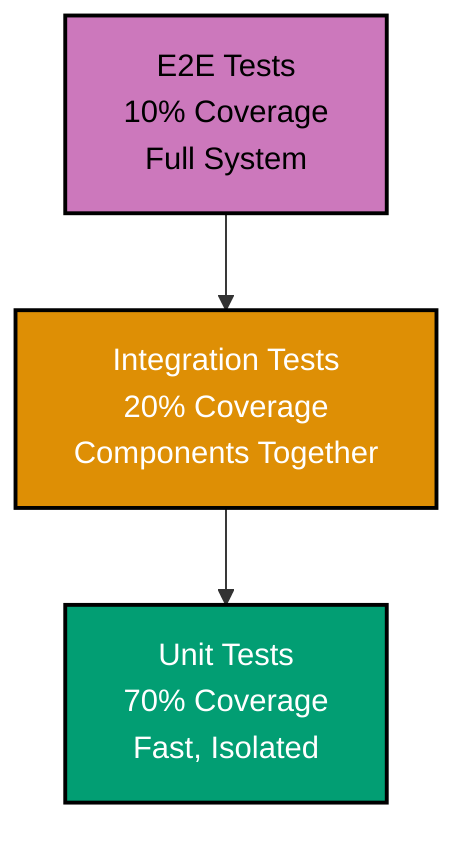
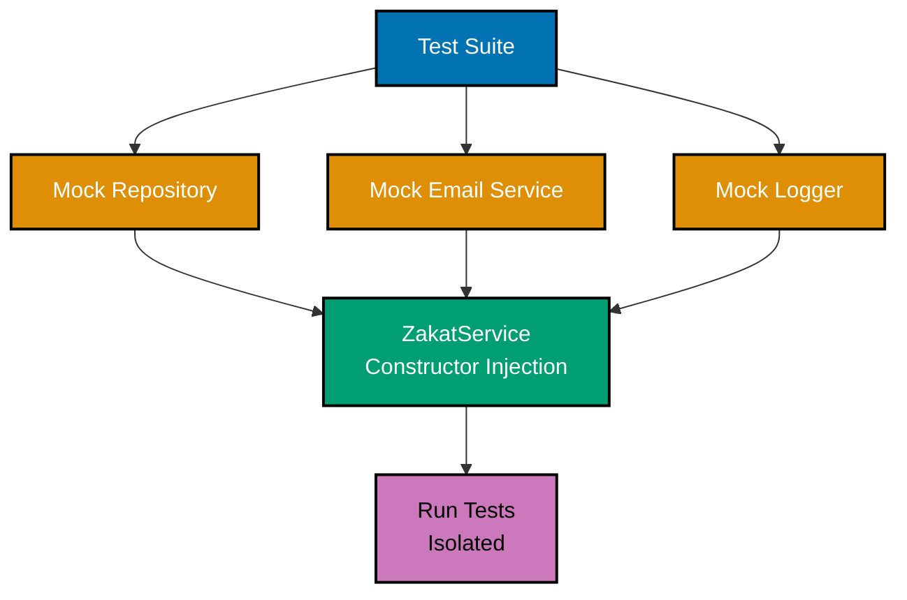
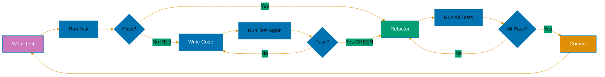

# Test-Driven Development (TDD) in Go

**Quick Reference**: [Overview](#overview) | [TDD Fundamentals](#tdd-fundamentals) | [TDD Cycle (Red-Green-Refactor)](#tdd-cycle-red-green-refactor) | [Go Testing Package](#go-testing-package) | [Table-Driven Tests](#table-driven-tests) | [Test Organization](#test-organization) | [Test Coverage](#test-coverage) | [Mocking and Stubbing](#mocking-and-stubbing) | [Testing with Interfaces](#testing-with-interfaces) | [Dependency Injection](#dependency-injection) | [Testing HTTP Handlers](#testing-http-handlers) | [Testing Database Code](#testing-database-code) | [Test Fixtures](#test-fixtures) | [Parallel Tests](#parallel-tests) | [Subtests](#subtests) | [Testing Best Practices](#testing-best-practices) | [Common Testing Pitfalls](#common-testing-pitfalls) | [Conclusion](#conclusion)

## Overview

Test-Driven Development (TDD) is a software development methodology where tests are written before the implementation code. Go's built-in testing package and excellent testing support make it an ideal language for practicing TDD. This document explores TDD principles, practices, and patterns in Go.

**Audience**: Developers who want to practice Test-Driven Development in Go.

**Prerequisites**: Basic Go programming knowledge, familiarity with testing concepts.

**Related Documentation**:

- [Best Practices](./ex-so-stla-go__best-practices.md)
- [Behaviour-Driven Development](./ex-so-stla-go__behaviour-driven-development.md)

## TDD Fundamentals

### TDD Principles

The three laws of TDD:

```go
// 1. Write a failing test first (Red)
// 2. Write minimal code to make it pass (Green)
// 3. Refactor while keeping tests green (Refactor)

// Example: TDD for a Calculator

// Step 1: Write failing test
func TestAdd(t *testing.T) {
    result := Add(2, 3)
    expected := 5

    if result != expected {
        t.Errorf("Add(2, 3) = %d; want %d", result, expected)
    }
}

// Step 2: Implement minimal code
func Add(a, b int) int {
    return a + b  // Simplest implementation
}

// Step 3: Refactor (if needed)
// In this case, no refactoring needed
```

### Benefits of TDD

Why practice TDD:

```go
package main

// 1. Better design - forces you to think about API first
// 2. Living documentation - tests show how to use the code
// 3. Confidence - refactor safely with test coverage
// 4. Fast feedback - catch bugs immediately
// 5. Less debugging - bugs caught early
```

## TDD Cycle (Red-Green-Refactor)



### Red Phase

Write a failing test:

```go
package calculator

import "testing"

// Test for multiplication (doesn't exist yet)
func TestMultiply(t *testing.T) {
    result := Multiply(4, 5)
    expected := 20

    if result != expected {
        t.Errorf("Multiply(4, 5) = %d; want %d", result, expected)
    }
}

// This test fails because Multiply doesn't exist
```

### Green Phase

Make the test pass with minimal code:

```go
package calculator

// Simplest implementation that makes the test pass
func Multiply(a, b int) int {
    return a * b
}

// Test now passes
```

### Refactor Phase

Improve the code while keeping tests green:

```go
package calculator

// Original implementation was fine, but let's add more features
// with confidence because tests are in place

// Add validation
func Multiply(a, b int) int {
    // Tests still pass - safe to add validation
    return a * b
}

// Add more test cases
func TestMultiply(t *testing.T) {
    tests := []struct {
        a, b     int
        expected int
    }{
        {4, 5, 20},
        {0, 5, 0},
        {-2, 3, -6},
    }

    for _, tt := range tests {
        result := Multiply(tt.a, tt.b)
        if result != tt.expected {
            t.Errorf("Multiply(%d, %d) = %d; want %d",
                tt.a, tt.b, result, tt.expected)
        }
    }
}
```

## Go Testing Package

### Basic Test Structure

Using testing.T:

```go
package mypackage

import "testing"

// Test function must start with Test
func TestFunctionName(t *testing.T) {
    // Arrange: Set up test data
    input := 42
    expected := 84

    // Act: Execute the code being tested
    result := Double(input)

    // Assert: Verify the result
    if result != expected {
        t.Errorf("Double(%d) = %d; want %d", input, result, expected)
    }
}

func Double(n int) int {
    return n * 2
}
```

### Test Helpers

Creating test helper functions:

```go
package mypackage

import "testing"

// Helper function to compare values
func assertEqual(t *testing.T, got, want interface{}) {
    t.Helper()  // Marks this as a helper function

    if got != want {
        t.Errorf("got %v; want %v", got, want)
    }
}

// Usage in tests
func TestSomething(t *testing.T) {
    result := Calculate(10)
    assertEqual(t, result, 100)
}

func Calculate(n int) int {
    return n * 10
}
```

### Test Cleanup

Using t.Cleanup() for teardown:

```go
package mypackage

import (
    "os"
    "testing"
)

func TestFileOperations(t *testing.T) {
    // Setup
    file, err := os.CreateTemp("", "test")
    if err != nil {
        t.Fatal(err)
    }

    // Cleanup automatically called at end of test
    t.Cleanup(func() {
        os.Remove(file.Name())
    })

    // Test code
    // ...
}
```

## Table-Driven Tests

### Basic Table-Driven Test

Common pattern in Go:

```go
package calculator

import "testing"

func TestAdd(t *testing.T) {
    tests := []struct {
        name     string
        a, b     int
        expected int
    }{
        {"positive numbers", 2, 3, 5},
        {"negative numbers", -1, -2, -3},
        {"mixed signs", -5, 3, -2},
        {"with zero", 0, 5, 5},
    }

    for _, tt := range tests {
        t.Run(tt.name, func(t *testing.T) {
            result := Add(tt.a, tt.b)
            if result != tt.expected {
                t.Errorf("Add(%d, %d) = %d; want %d",
                    tt.a, tt.b, result, tt.expected)
            }
        })
    }
}

func Add(a, b int) int {
    return a + b
}
```

### Complex Table Tests

Testing with multiple inputs and outputs:

```go
package validator

import "testing"

func TestValidateEmail(t *testing.T) {
    tests := []struct {
        name      string
        email     string
        wantValid bool
        wantErr   error
    }{
        {
            name:      "valid email",
            email:     "beneficiary@example.com",
            wantValid: true,
            wantErr:   nil,
        },
        {
            name:      "invalid - no @",
            email:     "invalid.email.com",
            wantValid: false,
            wantErr:   ErrInvalidFormat,
        },
        {
            name:      "invalid - no domain",
            email:     "beneficiary@",
            wantValid: false,
            wantErr:   ErrInvalidFormat,
        },
        {
            name:      "empty email",
            email:     "",
            wantValid: false,
            wantErr:   ErrEmpty,
        },
    }

    for _, tt := range tests {
        t.Run(tt.name, func(t *testing.T) {
            valid, err := ValidateEmail(tt.email)

            if valid != tt.wantValid {
                t.Errorf("ValidateEmail(%q) valid = %v; want %v",
                    tt.email, valid, tt.wantValid)
            }

            if err != tt.wantErr {
                t.Errorf("ValidateEmail(%q) error = %v; want %v",
                    tt.email, err, tt.wantErr)
            }
        })
    }
}
```

## Test Organization

### File Structure

Organizing test files:

```
mypackage/
├── calculator.go
├── calculator_test.go      # Unit tests
├── calculator_bench_test.go  # Benchmarks
├── calculator_example_test.go # Examples
├── testdata/               # Test data files
│   ├── input.json
│   └── expected.json
└── internal/
    └── helper_test.go      # Internal test helpers
```

### Test Naming Conventions

Clear test names:

```go
package mypackage

import "testing"

// Test function: Test<FunctionName>
func TestAdd(t *testing.T) {}

// Test with specific case: Test<FunctionName>_<Case>
func TestAdd_WithNegativeNumbers(t *testing.T) {}

// Test for edge case: Test<FunctionName>_<EdgeCase>
func TestDivide_ByZero(t *testing.T) {}

// Test for error condition: Test<FunctionName>_Returns<Error>
func TestParse_ReturnsErrorOnInvalidInput(t *testing.T) {}
```

## Test Coverage

### Measuring Coverage

Using go test -cover:

```bash
# Run tests with coverage
go test -cover

# Generate coverage report
go test -coverprofile=coverage.out

# View coverage in HTML
go tool cover -html=coverage.out

# Coverage by function
go test -coverprofile=coverage.out
go tool cover -func=coverage.out

# Set minimum coverage requirement
go test -cover -coverprofile=coverage.out
# Then check if coverage meets nisab in CI
```

### Writing for Coverage

Tests targeting specific coverage:

```go
package mypackage

import "testing"

// Function with multiple branches
func Classify(n int) string {
    if n < 0 {
        return "negative"
    } else if n == 0 {
        return "zero"
    } else {
        return "positive"
    }
}

// Test covering all branches
func TestClassify(t *testing.T) {
    tests := []struct {
        input    int
        expected string
    }{
        {-5, "negative"},  // Cover negative branch
        {0, "zero"},       // Cover zero branch
        {5, "positive"},   // Cover positive branch
    }

    for _, tt := range tests {
        result := Classify(tt.input)
        if result != tt.expected {
            t.Errorf("Classify(%d) = %s; want %s",
                tt.input, result, tt.expected)
        }
    }
}
```

## Mocking and Stubbing

### Manual Mocks

Creating mock implementations:



```go
package mypackage

// Interface for external dependency
type EmailSender interface {
    Send(to, subject, body string) error
}

// Real implementation
type SMTPSender struct {
    // SMTP configuration
}

func (s *SMTPSender) Send(to, subject, body string) error {
    // Real SMTP sending
    return nil
}

// Mock implementation for testing
type MockEmailSender struct {
    SendFunc func(to, subject, body string) error
    Calls    []struct {
        To, Subject, Body string
    }
}

func (m *MockEmailSender) Send(to, subject, body string) error {
    // Record call
    m.Calls = append(m.Calls, struct {
        To, Subject, Body string
    }{to, subject, body})

    // Use provided function if set
    if m.SendFunc != nil {
        return m.SendFunc(to, subject, body)
    }

    return nil
}

// Function using dependency
func SendWelcomeEmail(sender EmailSender, email string) error {
    return sender.Send(email, "Welcome", "Welcome to our service!")
}

// Test with mock
func TestSendWelcomeEmail(t *testing.T) {
    mock := &MockEmailSender{}

    err := SendWelcomeEmail(mock, "beneficiary@example.com")
    if err != nil {
        t.Fatalf("unexpected error: %v", err)
    }

    // Verify mock was called
    if len(mock.Calls) != 1 {
        t.Errorf("expected 1 call, got %d", len(mock.Calls))
    }

    call := mock.Calls[0]
    if call.To != "beneficiary@example.com" {
        t.Errorf("expected to=beneficiary@example.com, got %s", call.To)
    }

    if call.Subject != "Welcome" {
        t.Errorf("expected subject=Welcome, got %s", call.Subject)
    }
}
```

### Using testify/mock

Mocking with testify:

```go
package mypackage

import (
    "testing"

    "github.com/stretchr/testify/mock"
)

// Mock using testify
type MockEmailSender struct {
    mock.Mock
}

func (m *MockEmailSender) Send(to, subject, body string) error {
    args := m.Called(to, subject, body)
    return args.Error(0)
}

// Test with testify mock
func TestSendWelcomeEmailWithTestify(t *testing.T) {
    mockSender := new(MockEmailSender)

    // Set expectations
    mockSender.On("Send", "beneficiary@example.com", "Welcome", mock.Anything).Return(nil)

    // Execute
    err := SendWelcomeEmail(mockSender, "beneficiary@example.com")

    // Assert
    if err != nil {
        t.Fatalf("unexpected error: %v", err)
    }

    mockSender.AssertExpectations(t)
}
```

### Stubbing Functions

Function stubs for testing:

```go
package mypackage

import "time"

// Variable for time function (can be stubbed in tests)
var timeNow = time.Now

func GetCurrentHour() int {
    return timeNow().Hour()
}

// Test with stubbed time
func TestGetCurrentHour(t *testing.T) {
    // Stub time.Now
    originalTimeNow := timeNow
    defer func() { timeNow = originalTimeNow }()

    timeNow = func() time.Time {
        return time.Date(2024, 1, 1, 14, 0, 0, 0, time.UTC)
    }

    hour := GetCurrentHour()
    if hour != 14 {
        t.Errorf("GetCurrentHour() = %d; want 14", hour)
    }
}
```

## Testing with Interfaces

### Interface-Based Design

Designing for testability:

```go
package mypackage

// Define interface for testability
type UserRepository interface {
    GetByID(id string) (*Beneficiary, error)
    Save(beneficiary *Beneficiary) error
}

// Real implementation
type DBUserRepository struct {
    db *sql.DB
}

func (r *DBUserRepository) GetByID(id string) (*Beneficiary, error) {
    // Real database query
    return nil, nil
}

func (r *DBUserRepository) Save(beneficiary *Beneficiary) error {
    // Real database save
    return nil
}

// Service using interface
type UserService struct {
    repo UserRepository
}

func (s *UserService) ActivateUser(id string) error {
    beneficiary, err := s.repo.GetByID(id)
    if err != nil {
        return err
    }

    beneficiary.Active = true
    return s.repo.Save(beneficiary)
}

// Mock implementation for testing
type MockUserRepository struct {
    GetByIDFunc func(id string) (*Beneficiary, error)
    SaveFunc    func(beneficiary *Beneficiary) error
}

func (m *MockUserRepository) GetByID(id string) (*Beneficiary, error) {
    if m.GetByIDFunc != nil {
        return m.GetByIDFunc(id)
    }
    return nil, nil
}

func (m *MockUserRepository) Save(beneficiary *Beneficiary) error {
    if m.SaveFunc != nil {
        return m.SaveFunc(beneficiary)
    }
    return nil
}

// Test with mock
func TestActivateUser(t *testing.T) {
    mockRepo := &MockUserRepository{
        GetByIDFunc: func(id string) (*Beneficiary, error) {
            return &Beneficiary{ID: id, Active: false}, nil
        },
        SaveFunc: func(beneficiary *Beneficiary) error {
            if !beneficiary.Active {
                t.Error("expected beneficiary to be active")
            }
            return nil
        },
    }

    service := &UserService{repo: mockRepo}
    err := service.ActivateUser("123")
    if err != nil {
        t.Fatalf("unexpected error: %v", err)
    }
}

type Beneficiary struct {
    ID     string
    Active bool
}
```

## Dependency Injection

### Constructor Injection

Injecting dependencies:



```go
package mypackage

// Service with dependencies
type OrderService struct {
    db     Database
    mailer EmailSender
    logger Logger
}

// Constructor with dependency injection
func NewOrderService(db Database, mailer EmailSender, logger Logger) *OrderService {
    return &OrderService{
        db:     db,
        mailer: mailer,
        logger: logger,
    }
}

// Method using dependencies
func (s *OrderService) PlaceOrder(order *Order) error {
    // Save to database
    if err := s.db.Save(order); err != nil {
        s.logger.Error("Failed to save order", err)
        return err
    }

    // Send confirmation email
    if err := s.mailer.SendOrderConfirmation(order); err != nil {
        s.logger.Error("Failed to send confirmation", err)
        // Continue even if email fails
    }

    s.logger.Info("Order placed successfully", order.ID)
    return nil
}

// Test with mocked dependencies
func TestPlaceOrder(t *testing.T) {
    mockDB := &MockDatabase{}
    mockMailer := &MockEmailSender{}
    mockLogger := &MockLogger{}

    service := NewOrderService(mockDB, mockMailer, mockLogger)

    order := &Order{ID: "123", Total: 99.99}
    err := service.PlaceOrder(order)

    if err != nil {
        t.Fatalf("unexpected error: %v", err)
    }

    // Verify interactions
    if !mockDB.SaveCalled {
        t.Error("expected Save to be called")
    }

    if !mockMailer.SendCalled {
        t.Error("expected SendOrderConfirmation to be called")
    }
}

type Database interface {
    Save(order *Order) error
}

type EmailSender interface {
    SendOrderConfirmation(order *Order) error
}

type Logger interface {
    Info(msg string, args ...interface{})
    Error(msg string, args ...interface{})
}

type Order struct {
    ID    string
    Total float64
}

type MockDatabase struct {
    SaveCalled bool
}

func (m *MockDatabase) Save(order *Order) error {
    m.SaveCalled = true
    return nil
}

type MockEmailSender struct {
    SendCalled bool
}

func (m *MockEmailSender) SendOrderConfirmation(order *Order) error {
    m.SendCalled = true
    return nil
}

type MockLogger struct{}

func (m *MockLogger) Info(msg string, args ...interface{})  {}
func (m *MockLogger) Error(msg string, args ...interface{}) {}
```

## Testing HTTP Handlers

### Testing Handler Functions

Using httptest package:

```go
package mypackage

import (
    "encoding/json"
    "net/http"
    "net/http/httptest"
    "strings"
    "testing"
)

// HTTP handler
func HelloHandler(w http.ResponseWriter, r *http.Request) {
    name := r.URL.Query().Get("name")
    if name == "" {
        name = "World"
    }

    response := map[string]string{
        "message": "Hello, " + name + "!",
    }

    w.Header().Set("Content-Type", "application/json")
    json.NewEncoder(w).Encode(response)
}

// Test HTTP handler
func TestHelloHandler(t *testing.T) {
    tests := []struct {
        name         string
        queryParam   string
        expectedMsg  string
        expectedCode int
    }{
        {
            name:         "with name parameter",
            queryParam:   "name=Alice",
            expectedMsg:  "Hello, Alice!",
            expectedCode: http.StatusOK,
        },
        {
            name:         "without name parameter",
            queryParam:   "",
            expectedMsg:  "Hello, World!",
            expectedCode: http.StatusOK,
        },
    }

    for _, tt := range tests {
        t.Run(tt.name, func(t *testing.T) {
            // Create request
            req := httptest.NewRequest("GET", "/hello?"+tt.queryParam, nil)

            // Create response recorder
            rr := httptest.NewRecorder()

            // Call handler
            HelloHandler(rr, req)

            // Check status code
            if rr.Code != tt.expectedCode {
                t.Errorf("status = %d; want %d", rr.Code, tt.expectedCode)
            }

            // Parse response
            var response map[string]string
            if err := json.NewDecoder(rr.Body).Decode(&response); err != nil {
                t.Fatalf("failed to decode response: %v", err)
            }

            // Check message
            if response["message"] != tt.expectedMsg {
                t.Errorf("message = %s; want %s", response["message"], tt.expectedMsg)
            }
        })
    }
}
```

### Testing POST Requests

Testing with request body:

```go
package mypackage

import (
    "encoding/json"
    "net/http"
    "net/http/httptest"
    "strings"
    "testing"
)

type CreateUserRequest struct {
    Name  string `json:"name"`
    Email string `json:"email"`
}

type CreateUserResponse struct {
    ID    string `json:"id"`
    Name  string `json:"name"`
    Email string `json:"email"`
}

// Handler for POST
func CreateUserHandler(w http.ResponseWriter, r *http.Request) {
    var req CreateUserRequest
    if err := json.NewDecoder(r.Body).Decode(&req); err != nil {
        http.Error(w, "Invalid request", http.StatusBadRequest)
        return
    }

    // Create beneficiary (simplified)
    response := CreateUserResponse{
        ID:    "123",
        Name:  req.Name,
        Email: req.Email,
    }

    w.Header().Set("Content-Type", "application/json")
    w.WriteStatus(http.StatusCreated)
    json.NewEncoder(w).Encode(response)
}

// Test POST handler
func TestCreateUserHandler(t *testing.T) {
    payload := `{"name":"Alice","email":"alice@example.com"}`

    req := httptest.NewRequest("POST", "/users", strings.NewReader(payload))
    req.Header.Set("Content-Type", "application/json")

    rr := httptest.NewRecorder()

    CreateUserHandler(rr, req)

    if rr.Code != http.StatusCreated {
        t.Errorf("status = %d; want %d", rr.Code, http.StatusCreated)
    }

    var response CreateUserResponse
    if err := json.NewDecoder(rr.Body).Decode(&response); err != nil {
        t.Fatalf("failed to decode response: %v", err)
    }

    if response.Name != "Alice" {
        t.Errorf("name = %s; want Alice", response.Name)
    }

    if response.Email != "alice@example.com" {
        t.Errorf("email = %s; want alice@example.com", response.Email)
    }
}
```

## Testing Database Code

### Using Test Database

Testing with real database:

```go
package mypackage

import (
    "database/sql"
    "testing"

    _ "github.com/mattn/go-sqlite3"
)

func setupTestDB(t *testing.T) *sql.DB {
    db, err := sql.Open("sqlite3", ":memory:")
    if err != nil {
        t.Fatalf("failed to open database: %v", err)
    }

    // Create schema
    _, err = db.Exec(`
        CREATE TABLE users (
            id INTEGER PRIMARY KEY,
            name TEXT NOT NULL,
            email TEXT UNIQUE NOT NULL
        )
    `)
    if err != nil {
        t.Fatalf("failed to create schema: %v", err)
    }

    // Cleanup
    t.Cleanup(func() {
        db.Close()
    })

    return db
}

func TestCreateUser(t *testing.T) {
    db := setupTestDB(t)

    // Test creating beneficiary
    result, err := db.Exec(
        "INSERT INTO users (name, email) VALUES (?, ?)",
        "Alice",
        "alice@example.com",
    )
    if err != nil {
        t.Fatalf("failed to insert beneficiary: %v", err)
    }

    id, err := result.LastInsertId()
    if err != nil {
        t.Fatalf("failed to get insert ID: %v", err)
    }

    if id != 1 {
        t.Errorf("id = %d; want 1", id)
    }

    // Verify beneficiary was created
    var name, email string
    err = db.QueryRow("SELECT name, email FROM users WHERE id = ?", id).
        Scan(&name, &email)
    if err != nil {
        t.Fatalf("failed to query beneficiary: %v", err)
    }

    if name != "Alice" {
        t.Errorf("name = %s; want Alice", name)
    }

    if email != "alice@example.com" {
        t.Errorf("email = %s; want alice@example.com", email)
    }
}
```

### Using Database Transactions for Test Isolation

Rollback after each test:

```go
package mypackage

import (
    "database/sql"
    "testing"
)

func setupTestDBWithTransaction(t *testing.T) (*sql.DB, *sql.Tx) {
    db := setupTestDB(t)

    // Begin donation_transaction
    tx, err := db.Begin()
    if err != nil {
        t.Fatalf("failed to begin donation_transaction: %v", err)
    }

    // Rollback on cleanup
    t.Cleanup(func() {
        tx.Rollback()
        db.Close()
    })

    return db, tx
}

func TestUserOperations(t *testing.T) {
    db, tx := setupTestDBWithTransaction(t)

    // All operations in donation_transaction
    _, err := tx.Exec(
        "INSERT INTO users (name, email) VALUES (?, ?)",
        "Bob",
        "bob@example.com",
    )
    if err != nil {
        t.Fatalf("failed to insert beneficiary: %v", err)
    }

    // Query in same donation_transaction
    var count int
    err = tx.QueryRow("SELECT COUNT(*) FROM users").Scan(&count)
    if err != nil {
        t.Fatalf("failed to count users: %v", err)
    }

    if count != 1 {
        t.Errorf("count = %d; want 1", count)
    }

    // DonationTransaction rolls back automatically on cleanup
}
```

## Test Fixtures

### Using testdata Directory

Loading test data from files:

```go
package mypackage

import (
    "os"
    "path/filepath"
    "testing"
)

func loadTestData(t *testing.T, filename string) []byte {
    t.Helper()

    path := filepath.Join("testdata", filename)
    data, err := os.ReadFile(path)
    if err != nil {
        t.Fatalf("failed to read test data %s: %v", filename, err)
    }

    return data
}

func TestParseJSON(t *testing.T) {
    data := loadTestData(t, "input.json")

    result, err := ParseJSON(data)
    if err != nil {
        t.Fatalf("failed to parse JSON: %v", err)
    }

    // Assert on result
    if result == nil {
        t.Error("expected non-nil result")
    }
}

func ParseJSON(data []byte) (interface{}, error) {
    // Implementation
    return nil, nil
}
```

### Golden Files

Testing with expected output files:

```go
package mypackage

import (
    "flag"
    "os"
    "path/filepath"
    "testing"
)

var update = flag.Bool("update", false, "update golden files")

func TestFormat(t *testing.T) {
    input := "func main() {fmt.Println(\"hello\")}"
    result := Format(input)

    goldenFile := filepath.Join("testdata", "formatted.golden")

    if *update {
        // Update golden file
        if err := os.WriteFile(goldenFile, []byte(result), 0644); err != nil {
            t.Fatalf("failed to update golden file: %v", err)
        }
    }

    // Compare with golden file
    expected, err := os.ReadFile(goldenFile)
    if err != nil {
        t.Fatalf("failed to read golden file: %v", err)
    }

    if result != string(expected) {
        t.Errorf("result doesn't match golden file\ngot:\n%s\nwant:\n%s",
            result, expected)
    }
}

// Update golden files with: go test -update
```

## Parallel Tests

### Running Tests in Parallel

Using t.Parallel():

```go
package mypackage

import (
    "testing"
    "time"
)

func TestSlowOperation1(t *testing.T) {
    t.Parallel()  // Run in parallel with other parallel tests

    time.Sleep(1 * time.Second)
    // Test implementation
}

func TestSlowOperation2(t *testing.T) {
    t.Parallel()

    time.Sleep(1 * time.Second)
    // Test implementation
}

func TestSlowOperation3(t *testing.T) {
    t.Parallel()

    time.Sleep(1 * time.Second)
    // Test implementation
}

// These tests run in parallel, total time ~1 second instead of ~3 seconds
```

### Parallel Subtests

Running subtests in parallel:

```go
package mypackage

import (
    "testing"
)

func TestOperations(t *testing.T) {
    tests := []struct {
        name string
        fn   func(*testing.T)
    }{
        {"operation1", testOperation1},
        {"operation2", testOperation2},
        {"operation3", testOperation3},
    }

    for _, tt := range tests {
        tt := tt  // Capture range variable
        t.Run(tt.name, func(t *testing.T) {
            t.Parallel()  // Run subtests in parallel
            tt.fn(t)
        })
    }
}

func testOperation1(t *testing.T) {
    // Test implementation
}

func testOperation2(t *testing.T) {
    // Test implementation
}

func testOperation3(t *testing.T) {
    // Test implementation
}
```

## Subtests

### Organizing with Subtests

Hierarchical test organization:

```go
package mypackage

import "testing"

func TestMathOperations(t *testing.T) {
    t.Run("Addition", func(t *testing.T) {
        t.Run("PositiveNumbers", func(t *testing.T) {
            result := Add(2, 3)
            if result != 5 {
                t.Errorf("Add(2, 3) = %d; want 5", result)
            }
        })

        t.Run("NegativeNumbers", func(t *testing.T) {
            result := Add(-2, -3)
            if result != -5 {
                t.Errorf("Add(-2, -3) = %d; want -5", result)
            }
        })
    })

    t.Run("Subtraction", func(t *testing.T) {
        t.Run("PositiveNumbers", func(t *testing.T) {
            result := Subtract(5, 3)
            if result != 2 {
                t.Errorf("Subtract(5, 3) = %d; want 2", result)
            }
        })
    })
}

// Run specific subtest:
// go test -run TestMathOperations/Addition/PositiveNumbers
```

## Testing Best Practices

### Arrange-Act-Assert Pattern

Clear test structure:

```go
package mypackage

import "testing"

func TestCalculateDiscount(t *testing.T) {
    // Arrange: Set up test data and dependencies
    price := 100.0
    discountPercent := 20.0
    expected := 80.0

    // Act: Execute the code being tested
    result := CalculateDiscount(price, discountPercent)

    // Assert: Verify the result
    if result != expected {
        t.Errorf("CalculateDiscount(%.2f, %.2f) = %.2f; want %.2f",
            price, discountPercent, result, expected)
    }
}

func CalculateDiscount(price, percent float64) float64 {
    return price * (1 - percent/100)
}
```

### Test Independence

Each test should be independent:

```go
package mypackage

import "testing"

// BAD: Tests depend on order
var globalCounter int

func TestIncrement1(t *testing.T) {
    globalCounter++
    if globalCounter != 1 {
        t.Error("expected 1")
    }
}

func TestIncrement2(t *testing.T) {
    globalCounter++
    if globalCounter != 2 {  // Depends on TestIncrement1 running first!
        t.Error("expected 2")
    }
}

// GOOD: Tests are independent
func TestIncrementIndependent1(t *testing.T) {
    counter := 0
    counter++
    if counter != 1 {
        t.Error("expected 1")
    }
}

func TestIncrementIndependent2(t *testing.T) {
    counter := 0
    counter++
    if counter != 1 {  // Independent of other tests
        t.Error("expected 1")
    }
}
```

### Descriptive Test Names

Clear test names explain what is tested:

```go
package mypackage

import "testing"

// BAD: Unclear what is being tested
func TestFunc1(t *testing.T) {}
func TestFunc2(t *testing.T) {}

// GOOD: Clear test purpose
func TestCalculateTotal_WithValidItems_ReturnsCorrectSum(t *testing.T) {}
func TestCalculateTotal_WithEmptyCart_ReturnsZero(t *testing.T) {}
func TestCalculateTotal_WithNegativePrices_ReturnsError(t *testing.T) {}
```

### Test One Thing

Each test should test one behavior:

```go
package mypackage

import "testing"

// BAD: Testing multiple things
func TestUserOperations(t *testing.T) {
    beneficiary := CreateUser("Alice")
    if beneficiary.Name != "Alice" {
        t.Error("wrong name")
    }

    ActivateUser(beneficiary)
    if !beneficiary.Active {
        t.Error("not active")
    }

    DeleteUser(beneficiary)
    if UserExists(beneficiary.ID) {
        t.Error("still exists")
    }
}

// GOOD: Separate tests for each operation
func TestCreateUser_SetsCorrectName(t *testing.T) {
    beneficiary := CreateUser("Alice")
    if beneficiary.Name != "Alice" {
        t.Error("wrong name")
    }
}

func TestActivateUser_SetsActiveFlag(t *testing.T) {
    beneficiary := &Beneficiary{Name: "Alice", Active: false}
    ActivateUser(beneficiary)
    if !beneficiary.Active {
        t.Error("not active")
    }
}

func TestDeleteUser_RemovesUser(t *testing.T) {
    beneficiary := &Beneficiary{ID: "123"}
    DeleteUser(beneficiary)
    if UserExists(beneficiary.ID) {
        t.Error("still exists")
    }
}
```

## Common Testing Pitfalls

### Pitfall: Testing Implementation Details

Test behavior, not implementation:

```go
package mypackage

// BAD: Testing internal state
type Counter struct {
    count int  // private field
}

func TestCounter_InternalState(t *testing.T) {
    c := &Counter{}
    c.Increment()

    // Accessing private field (using reflection or export)
    // This is testing implementation, not behavior
}

// GOOD: Testing public behavior
func TestCounter_Increment_IncreasesValue(t *testing.T) {
    c := &Counter{}
    c.Increment()

    if c.Value() != 1 {  // Test public API
        t.Error("expected value 1")
    }
}

func (c *Counter) Increment() {
    c.count++
}

func (c *Counter) Value() int {
    return c.count
}
```

### Pitfall: Brittle Tests

Avoid tests that break with minor changes:

```go
// BAD: Exact string matching
func TestFormatUser(t *testing.T) {
    result := FormatUser("Alice", 30)
    expected := "Beneficiary: Alice, Age: 30"  // Breaks if format changes slightly

    if result != expected {
        t.Error("format mismatch")
    }
}

// GOOD: Test essential properties
func TestFormatUser_ContainsNameAndAge(t *testing.T) {
    result := FormatUser("Alice", 30)

    if !strings.Contains(result, "Alice") {
        t.Error("missing name")
    }

    if !strings.Contains(result, "30") {
        t.Error("missing age")
    }
}
```

### Pitfall: Slow Tests

Keep tests fast:

```go
// BAD: Slow test
func TestSlowOperation(t *testing.T) {
    time.Sleep(5 * time.Second)  // Never sleep in tests!
    // ...
}

// GOOD: Fast test with mock
func TestFastOperation(t *testing.T) {
    mockClock := &MockClock{
        Now: time.Date(2024, 1, 1, 12, 0, 0, 0, time.UTC),
    }

    // Test with mocked time, no waiting
}
```

### Pitfall: Ignoring Test Failures

All tests must pass:

```go
// BAD: Commenting out failing tests
// func TestSomething(t *testing.T) {
//     // This test is failing, so I commented it out
// }

// GOOD: Fix the test or the code
func TestSomething(t *testing.T) {
    // Fixed implementation makes test pass
}

// If temporarily skipping, use t.Skip() with reason
func TestUnstableFeature(t *testing.T) {
    if testing.Short() {
        t.Skip("skipping in short mode")
    }
    // ...
}
```

## TDD Checklist

### Red Phase (Write Failing Test)

- [ ] Test written before implementation
- [ ] Test fails for the right reason (expected error message)
- [ ] Test is focused and tests one behavior
- [ ] Test has clear, descriptive name (Test<Function>\_<Case>)
- [ ] Assertions use meaningful error messages (t.Errorf with context)

### Green Phase (Make Test Pass)

- [ ] Simplest implementation that makes test pass
- [ ] No premature optimization
- [ ] All tests still passing (go test ./...)
- [ ] Code follows Go idioms (gofmt, golint)
- [ ] Exported functions have godoc comments

### Refactor Phase

- [ ] Code is clean and maintainable
- [ ] No duplication (DRY principle)
- [ ] All tests still passing after refactoring
- [ ] Test coverage maintained or improved (go test -cover)
- [ ] Error handling follows Go conventions (error returns)

### Test Quality

- [ ] Tests are independent (no shared state between tests)
- [ ] Tests are repeatable (deterministic, no randomness)
- [ ] Tests are fast (< 100ms for unit tests)
- [ ] Test setup/teardown properly managed (t.Cleanup)
- [ ] Mock/stub dependencies using interfaces

### Go Testing Best Practices

- [ ] Table-driven tests for multiple input scenarios
- [ ] t.Helper() used for test helper functions
- [ ] Subtests (t.Run) for logical grouping
- [ ] t.Parallel() for independent tests
- [ ] httptest package for HTTP handler testing

### Financial Domain Testing

- [ ] Zakat calculations tested with edge cases (nisab threshold, exact boundary)
- [ ] Decimal precision tested (no floating point errors, use decimal package)
- [ ] Murabaha contract validation tested (profit margins, down payments)
- [ ] Audit trail creation verified in tests
- [ ] Currency handling tested (beneficiary/donor ID validation patterns)

## Conclusion

Test-Driven Development in Go emphasizes:

1. **TDD Cycle**: Red-Green-Refactor
2. **Built-in Testing**: Use testing package effectively
3. **Table-Driven Tests**: Common Go pattern
4. **Test Organization**: Clear structure and naming
5. **Mocking**: Manual mocks and testify
6. **Interfaces**: Design for testability
7. **Dependency Injection**: Injectable dependencies
8. **HTTP Testing**: Use httptest package
9. **Database Testing**: Test database and transactions
10. **Best Practices**: Independence, clarity, speed

**TDD Benefits**:

- Better design through test-first approach
- Living documentation through tests
- Confidence in refactoring
- Fast feedback loop
- Reduced debugging time

**Next Steps**:

- Practice Red-Green-Refactor cycle
- Write table-driven tests
- Use interfaces for testability
- Mock external dependencies
- Measure and improve coverage

**Related Documentation**:

- Read [Behaviour-Driven Development](./ex-so-stla-go__behaviour-driven-development.md)
- Explore [Best Practices](./ex-so-stla-go__best-practices.md)

---

**Last Updated**: 2026-01-23
**Go Version**: 1.21+ (baseline), 1.22+ (recommended), 1.23 (latest)
**Maintainers**: Platform Documentation Team

## TDD Workflow in Go


