# Java

**Understanding-oriented documentation** for modern Java development in the open-sharia-enterprise platform.

## Overview

Java is a primary language for backend services, domain-driven design implementations, and enterprise features in the platform. This documentation covers modern Java (17+) with emphasis on:

- Records and pattern matching
- Virtual threads and structured concurrency
- Functional programming with streams
- Immutability and type safety
- Modern frameworks (Spring Boot 4, Jakarta EE 11)

## Coding Standards

**This documentation is the authoritative reference** for Java coding standards in the open-sharia-enterprise platform.

All Java code MUST follow the standards documented here:

1. **[Idioms](./ex-so-stla-ja__idioms.md)** - Java-specific patterns and conventions
2. **[Best Practices](./ex-so-stla-ja__best-practices.md)** - Clean code standards
3. **[Anti-Patterns](./ex-so-stla-ja__anti-patterns.md)** - Common mistakes to avoid

**For Agents**: Reference this documentation when writing Java code. The `repo-coding-java` skill provides quick access to these standards.

### Quick Standards Reference

- **Naming Conventions**: See [Best Practices - Code Organization](./ex-so-stla-ja__best-practices.md#code-organization)
- **Error Handling**: See [Error Handling](./ex-so-stla-ja__error-handling.md)
- **Type Safety**: See [Type Safety](./ex-so-stla-ja__type-safety.md)
- **Testing Standards**: See [Test-Driven Development](./ex-so-stla-ja__test-driven-development.md)
- **Security Practices**: See [Security](./ex-so-stla-ja__security.md)

**Related**: [Functional Programming](../../../../../governance/development/pattern/functional-programming.md) - Cross-language FP principles

## Software Engineering Principles

Java development in this platform follows the five software engineering principles from [governance/principles/software-engineering/](../../../../../governance/principles/software-engineering/README.md):

1. **[Automation Over Manual](../../../../../governance/principles/software-engineering/automation-over-manual.md)** - Java automates through records, try-with-resources, static analysis, and build tools
2. **[Explicit Over Implicit](../../../../../governance/principles/software-engineering/explicit-over-implicit.md)** - Java enforces through sealed types, explicit configuration, module system
3. **[Immutability Over Mutability](../../../../../governance/principles/software-engineering/immutability.md)** - Java provides records, final fields, immutable collections for thread-safe code
4. **[Pure Functions Over Side Effects](../../../../../governance/principles/software-engineering/pure-functions.md)** - Java supports through functional interfaces, streams, and functional core architecture
5. **[Reproducibility First](../../../../../governance/principles/software-engineering/reproducibility.md)** - Java enables through version pinning, Maven wrapper, dependency management

**See Also**: [Functional Programming](./ex-so-stla-ja__functional-programming.md) for pure functions and immutability patterns, [Best Practices](./ex-so-stla-ja__best-practices.md) for explicit coding standards.

## Quick Reference

**Jump to:**

- [Overview](#overview) - Java in the platform
- [Software Engineering Principles](#software-engineering-principles) - Five core principles
- [Java Version Strategy](#java-version-strategy) - Java 17/21/25 LTS releases
- [Documentation Structure](#documentation-structure) - Guide to documentation files
- [Java in the Platform](#java-in-the-platform) - Platform integration
- [Learning Path](#learning-path) - Recommended reading order
- [Code Examples from Platform](#code-examples-from-platform) - Real implementations
- [Integration with Other Documentation](#integration-with-other-documentation) - Cross-references
- [Tools and Ecosystem](#tools-and-ecosystem) - Build tools, frameworks
- [Resources and References](#resources-and-references) - External resources
- [Related Documentation](#related-documentation) - Cross-references

**Core Documentation:**

- [Best Practices](./ex-so-stla-ja__best-practices.md) - Modern Java coding standards
- [Idioms](./ex-so-stla-ja__idioms.md) - Modern Java patterns (records, sealed classes, pattern matching)
- [Error Handling](./ex-so-stla-ja__error-handling.md) - Exception handling and resilience
- [Type Safety](./ex-so-stla-ja__type-safety.md) - Sealed types and compile-time safety
- [Functional Programming](./ex-so-stla-ja__functional-programming.md) - Pure functions and immutability
- [Concurrency](./ex-so-stla-ja__concurrency-and-parallelism.md) - Virtual threads and structured concurrency
- [Interfaces and Polymorphism](./ex-so-stla-ja__interfaces-and-polymorphism.md) - Interface design and explicit polymorphism
- [Memory Management](./ex-so-stla-ja__memory-management.md) - JVM internals and GC tuning
- [Modules and Dependencies](./ex-so-stla-ja__modules-and-dependencies.md) - JPMS and Maven/Gradle
- [Web Services](./ex-so-stla-ja__web-services.md) - REST, GraphQL, gRPC, and API security
- [Domain-Driven Design](./ex-so-stla-ja__domain-driven-design.md) - DDD patterns in Java
- [Security](./ex-so-stla-ja__security.md) - Secure coding practices
- [Performance](./ex-so-stla-ja__performance.md) - Optimization techniques
- [Anti-Patterns](./ex-so-stla-ja__anti-patterns.md) - Common mistakes to avoid
- [Test-Driven Development](./ex-so-stla-ja__test-driven-development.md) - TDD with JUnit 5
- [Behaviour-Driven Development](./ex-so-stla-ja__behaviour-driven-development.md) - BDD with Cucumber

**Release Documentation:**

- [Java 17 LTS](./ex-so-stla-ja__release-17.md) - Sealed classes, pattern matching
- [Java 21 LTS](./ex-so-stla-ja__release-21.md) - Virtual threads, structured concurrency
- [Java 25 LTS](./ex-so-stla-ja__release-25.md) - Stream Gatherers, Scoped Values

## Java Version Strategy

```mermaid
timeline
    title Java LTS Version Timeline (2018-2025)
    2018 : Java 11 LTS
         : Var keyword
         : HTTP Client API
    2021 : Java 17 LTS ⭐
         : Records
         : Sealed Classes
         : Pattern Matching (Preview)
    2023 : Java 21 LTS ✅
         : Virtual Threads
         : Sequenced Collections
         : Record Patterns
    2025 : Java 25 LTS 🚀
         : Stream Gatherers
         : Scoped Values
         : Flexible Constructor Bodies
```



**Platform Strategy**: Java 17+ (baseline) → Java 21+ (target) → Java 25 (latest)

### Current Baseline: Java 17+ (LTS)

**Platform Standard**: Java 17 is the minimum required version for all Java projects in the platform.

**Rationale**:

- Long-term support (LTS) release
- Modern language features (sealed classes, pattern matching foundations, records)
- Framework requirement (Spring Boot 3+, Jakarta EE 10+, Maven 3.9+)
- Industry standard as of 2025-2026

### Target Version: Java 21+ (LTS)

**Migration Path**: Projects are encouraged to migrate to Java 21 for enhanced features:

- Virtual threads (Project Loom)
- Scoped values
- Pattern matching for switch (finalized)
- Sequenced collections
- Record patterns

### Latest: Java 25 (LTS)

**Released**: September 2025 as the latest LTS version

**Finalized Features**:

- Stream gatherers (finalized in JDK 24)
- Compact source files
- Instance main methods
- Flexible constructor bodies
- Scoped values

**Preview Features**:

- Pattern matching for primitive types

## Documentation Structure

### [Java Idioms](./ex-so-stla-ja__idioms.md)

Language-specific patterns and conventions for writing idiomatic Java code.

**Covers**:

- Records and immutable data structures
- Pattern matching (switch, instanceof)
- Optional for null safety
- Stream API for collections
- Virtual threads and structured concurrency
- Try-with-resources for resource management
- Text blocks for multi-line strings
- Sealed classes for domain modeling

### [Java Best Practices](./ex-so-stla-ja__best-practices.md)

Proven approaches for writing clean, maintainable Java code based on 2025-2026 standards.

**Covers**:

- Code organization and structure
- Naming conventions and clarity
- Error handling and exceptions
- Testing strategies
- Dependency management
- Performance optimization
- Security practices
- Modern framework usage

### [Java Anti-Patterns](./ex-so-stla-ja__anti-patterns.md)

Common mistakes, pitfalls, and problematic patterns to avoid in Java development.

**Covers**:

- Thread safety issues
- Resource management mistakes
- Performance pitfalls
- Security vulnerabilities
- Over-engineering and complexity
- Misuse of frameworks and libraries
- Legacy patterns that are now obsolete

### Documentation Organization


### Release Documentation

Comprehensive guides to major Java LTS releases, documenting important features and changes:

#### [Java 17 LTS Release](./ex-so-stla-ja__release-17.md)

Released September 2021. Minimum required version for the platform.

**Major Features**:

- Sealed classes and interfaces (finalized)
- Pattern matching for switch (preview)
- Strict floating-point semantics
- Enhanced pseudo-random number generators
- macOS/AArch64 support (Apple Silicon)

#### [Java 21 LTS Release](./ex-so-stla-ja__release-21.md)

Released September 2023. Recommended target version.

**Major Features**:

- Virtual threads (finalized) - revolutionary concurrency model
- Record patterns (finalized)
- Pattern matching for switch (finalized)
- Sequenced collections
- String templates (preview)
- Scoped values (preview)
- Structured concurrency (preview)

#### [Java 25 LTS Release](./ex-so-stla-ja__release-25.md)

Released September 2025. Latest LTS version with focus on performance.

**Major Features**:

- Compact source files and instance main methods (finalized)
- Flexible constructor bodies (finalized)
- Scoped values (finalized)
- Module import declarations (finalized)
- Ahead-of-time method profiling (finalized)
- Compact object headers (20% memory reduction)
- Primitive types in patterns (preview)
- Generational Shenandoah GC

### Specialized Topics

Deep-dive documentation on critical Java development areas:

#### [Java Security](./ex-so-stla-ja__security.md)

Comprehensive guide to building secure Java applications aligned with OWASP guidelines.

**Covers**:

- Input validation and sanitization (allowlist approach)
- Injection prevention (SQL, XSS, command injection)
- Authentication and authorization (RBAC, MFA)
- Cryptography (AES-GCM, hybrid encryption, key management)
- Secure coding practices (error handling, resource management)
- Dependency management (vulnerability scanning)
- Audit logging (financial compliance)
- Modern Java security features (sealed classes, pattern matching)

#### [Java Performance](./ex-so-stla-ja__performance.md)

Comprehensive guide to JVM tuning, optimization, and performance engineering.

**Covers**:

- JVM architecture and memory management
- Garbage collection tuning (G1GC, ZGC, Shenandoah)
- Memory optimization (object allocation, compact headers)
- CPU optimization (JIT compilation, AOT profiling)
- I/O optimization (database queries, connection pooling)
- Caching strategies (Caffeine, Redis)
- Profiling tools (JFR, async-profiler, JMH)
- Modern Java performance features (virtual threads impact, generational GC)

#### [Java Concurrency and Parallelism](./ex-so-stla-ja__concurrency-and-parallelism.md)

Comprehensive guide to concurrent and parallel programming in modern Java.

**Covers**:

- Virtual threads (lightweight concurrency, Java 21+)
- Structured concurrency (hierarchical task management, Java 21+ preview)
- Thread safety (immutability, volatile, synchronization)
- Synchronization mechanisms (ReentrantLock, ReadWriteLock, semaphores)
- Concurrent collections (ConcurrentHashMap, BlockingQueue)
- Atomic operations (AtomicInteger, LongAdder)
- Parallel streams and Fork/Join framework
- Common concurrency problems (deadlocks, race conditions)
- Modern patterns (Scoped Values, CompletableFuture)

#### [Java Type Safety](./ex-so-stla-ja__type-safety.md)

Comprehensive guide to achieving type safety and minimizing runtime errors in Java.

**Covers**:

- Null safety with JSpecify and NullAway (compile-time null checking)
- Static analysis with Checker Framework (tainting, units, regex checkers)
- Error Prone for bug prevention (Google's static analyzer)
- Sealed classes for exhaustive handling
- Optional for null-safe APIs
- Pattern matching for type-safe decomposition
- Records and immutability for compile-time guarantees
- Phantom types and type-safe builders

#### [Java Functional Programming](./ex-so-stla-ja__functional-programming.md)

Comprehensive guide to functional programming patterns and practices in Java.

**Covers**:

- Pure functions and referential transparency
- Immutability with records and persistent data structures
- Vavr library (immutable collections, monads, pattern matching)
- Streams API for declarative collection processing
- Function composition and higher-order functions
- Monads (Optional, CompletableFuture, Vavr Try/Either)
- Functional core, imperative shell architecture
- Property-based testing for functional code

#### [Java Domain-Driven Design](./ex-so-stla-ja__domain-driven-design.md)

Comprehensive guide to implementing DDD tactical patterns with Java frameworks.

**Covers**:

- Value objects with records (Money, Email, immutable domain primitives)
- Entities with identity and lifecycle
- Aggregates and consistency boundaries
- Domain events for significant occurrences
- Repositories for persistence abstraction
- Domain services for cross-aggregate logic
- Axon Framework for CQRS and event sourcing
- Spring Boot integration for DDD applications

#### [Java Test-Driven Development](./ex-so-stla-ja__test-driven-development.md)

Comprehensive guide to TDD practices with JUnit 5, Mockito, and AssertJ.

**Covers**:

- Red-Green-Refactor cycle and TDD workflow
- JUnit 5 fundamentals (tests, assertions, parameterized tests)
- AssertJ for fluent assertions
- Mockito for test doubles and mocking
- Testing strategies (unit, integration, E2E)
- TestContainers for database testing
- Testing domain models (value objects, entities, aggregates)
- TDD best practices and patterns

#### [Java Behavior-Driven Development](./ex-so-stla-ja__behaviour-driven-development.md)

Comprehensive guide to BDD with Cucumber, Gherkin, and collaborative testing.

**Covers**:

- BDD core concepts (discovery, formulation, automation)
- Gherkin syntax (Given-When-Then, scenarios, scenario outlines)
- Cucumber JVM for Java BDD
- Step definitions connecting Gherkin to code
- Data tables and parameter types for domain objects
- BDD patterns and anti-patterns
- Three Amigos and Example Mapping collaboration
- BDD vs TDD complementary practices

#### [Java Interfaces and Polymorphism](./ex-so-stla-ja__interfaces-and-polymorphism.md)

Comprehensive guide to Java's explicit interface system and polymorphism patterns.

**Covers**:

- Interface design principles (ISP, focused interfaces)
- Modern interface features (default methods, static methods, private helpers)
- Sealed interfaces for exhaustive pattern matching (Java 17+)
- Polymorphism patterns (Strategy, DI, functional interfaces)
- Composition over inheritance with interfaces
- Marker interfaces and modern alternatives
- Testing with interfaces (Mockito, contract testing)
- Performance considerations (interface dispatch, sealed optimizations)
- Financial examples: PaymentProcessor, ZakatCalculator, TaxStrategy

#### [Java Memory Management and JVM Internals](./ex-so-stla-ja__memory-management.md)

Comprehensive guide to JVM memory architecture, garbage collection, and optimization.

**Covers**:

- JVM memory regions (heap, stack, metaspace, direct buffers)
- Object allocation (TLAB, Eden space, promotion, escape analysis)
- GC algorithms (G1GC, ZGC, Shenandoah, Generational ZGC)
- GC tuning for financial workloads
- Memory leak detection and prevention
- Memory optimization (object pooling, compact headers Java 25)
- Profiling tools (JFR, jmap, VisualVM, async-profiler)
- Best practices for hot path optimization
- Financial examples: Zakat calculation batches, transaction processing

#### [Java Modules and Dependency Management](./ex-so-stla-ja__modules-and-dependencies.md)

Comprehensive guide to Java Platform Module System (JPMS) and dependency management.

**Covers**:

- JPMS module system (module-info.java, exports/requires)
- Maven dependency management (POM, scopes, BOMs, version conflicts)
- Gradle alternative (build.gradle, version catalogs)
- Reproducible builds (Maven Wrapper, Enforcer Plugin, .sdkmanrc)
- Multi-module projects (parent POM, reactor order)
- Private repositories (Nexus, Artifactory)
- Security scanning (OWASP Dependency-Check, Snyk, Dependabot)
- Best practices (minimal dependency trees, avoid version ranges)
- Financial examples: Tax calculation modules, payment gateway dependencies

#### [Java Web Services and APIs](./ex-so-stla-ja__web-services.md)

Comprehensive guide to building web services and APIs with Java's rich ecosystem.

**Covers**:

- RESTful APIs with Spring Boot (@RestController, validation, exception handling)
- JAX-RS with Jakarta EE (@Path, CDI integration)
- GraphQL services (schema, resolvers, DataLoader, N+1 prevention)
- gRPC services (Protobuf, streaming types)
- API security (JWT, OAuth2, RBAC, CORS, rate limiting, OWASP API Top 10)
- API documentation (OpenAPI/Swagger, SpringDoc)
- API versioning strategies (URI, header, content negotiation)
- Testing web services (MockMvc, RestAssured, Pact, JMeter)
- Best practices (RESTful design, idempotency, pagination, HATEOAS)
- Financial examples: Donation APIs, ZakatPayment endpoints, MurabahaLoan services

## Java in the Platform

### Primary Use Cases

**Backend Services**:

- RESTful APIs for business operations
- GraphQL endpoints for complex queries
- gRPC services for internal communication
- Event-driven microservices

**Domain-Driven Design**:

- Aggregates for business domains
- Value Objects for Money, thresholds
- Domain Events for business process tracking
- Repositories and specifications

**Business Logic**:

- Compliant calculation engines
- Complex validation rules
- Financial transaction processing
- Compliance and audit trail

### Framework Stack

**Spring Boot 4** (Primary Framework):

- Spring Web for REST APIs
- Spring Data JPA for persistence
- Spring Security for authentication/authorization
- Spring AI for AI/ML integration

**Jakarta EE 11** (Enterprise Features):

- CDI for dependency injection
- JPA for object-relational mapping
- Bean Validation for constraints
- Jakarta RESTful Web Services

**Testing Frameworks**:

- JUnit 5 for unit testing
- Mockito for test doubles
- TestContainers for integration testing
- Cucumber JVM for BDD scenarios

### Architectural Patterns

**Hexagonal Architecture** (Ports and Adapters):

- Domain core in pure Java
- Application services orchestrating use cases
- Infrastructure adapters for persistence, messaging
- REST/GraphQL adapters for external interface

**Event Sourcing** (Selected Domains):

- Event store for audit trail
- Projections for read models
- CQRS for command/query separation

**Functional Core, Imperative Shell**:

- Pure functions for domain logic
- Side effects isolated at boundaries
- Immutable domain models
- Functional programming principles

## Learning Path

### 1. Start with Idioms

Read [Java Idioms](./ex-so-stla-ja__idioms.md) to understand modern Java patterns:

- Records for data classes
- Pattern matching for type checks
- Optional for null safety
- Streams for collection processing

### 2. Apply Best Practices

Read [Java Best Practices](./ex-so-stla-ja__best-practices.md) to write clean code:

- Keep methods and classes focused (10-20 lines per method)
- Name with intention and clarity
- Test comprehensively with JUnit 5
- Use immutability and final fields

### 3. Avoid Anti-Patterns

Read [Java Anti-Patterns](./ex-so-stla-ja__anti-patterns.md) to prevent common mistakes:

- Thread safety issues (SimpleDateFormat, shared state)
- Resource leaks (unclosed streams, connections)
- Performance pitfalls (StringBuffer in local variables)
- Over-engineering (excessive abstraction)

### 4. Integrate with DDD

Read complementary documentation:

- [Domain-Driven Design](../../architecture/domain-driven-design-ddd/README.md)
- [TDD with Java](../../development/test-driven-development-tdd/ex-so-de-tedrdeve__11-tdd-and-functional-programming.md)
- [Functional Programming](../../../../../governance/development/pattern/functional-programming.md)

## Code Examples from Platform

### Domain Model Example

```java
// Using records for immutable value objects (see Domain-Driven Design for full Money example)
public record TaxId(String value) {
    public TaxId {
        if (value == null || !value.matches("TX-\\d{10}")) {
            throw new IllegalArgumentException("Invalid tax ID format");
        }
    }
}

// Aggregate root with business rules
public sealed interface TaxCalculation permits IncomeTax, SalesTax, PropertyTax {
    Money calculateTax();
    boolean meetsThreshold();
    LocalDate fiscalYearEnd();
}

// Pattern matching for different tax types
public Money processTax(TaxCalculation calculation) {
    return switch (calculation) {
        case IncomeTax income -> income.calculateTax();
        case SalesTax sales -> sales.calculateTax();
        case PropertyTax property -> property.calculateTax();
    };
}
```

### Service Layer Example

```java
@Service
@Transactional
public class TaxService {
    private final TaxRepository repository;
    private final DomainEventPublisher eventPublisher;

    public TaxService(TaxRepository repository, DomainEventPublisher eventPublisher) {
        this.repository = repository;
        this.eventPublisher = eventPublisher;
    }

    public TaxCalculationResult calculate(TaxRequest request) {
        // Functional core: pure domain logic
        var calculation = TaxCalculation.create(
            request.income(),
            request.threshold(),
            request.fiscalYearEnd()
        );

        // Validate business rules
        var validation = calculation.validate();
        if (validation.hasErrors()) {
            throw new ValidationException(validation.errors());
        }

        // Imperative shell: side effects
        var savedCalculation = repository.save(calculation);
        eventPublisher.publish(new TaxCalculatedEvent(savedCalculation.id()));

        return TaxCalculationResult.from(savedCalculation);
    }
}
```

## Integration with Other Documentation

### Development Practices

- **[Test-Driven Development](../../development/test-driven-development-tdd/README.md)** - TDD with JUnit 5
- **[Behavior-Driven Development](../../development/behavior-driven-development-bdd/README.md)** - BDD with Cucumber JVM
- **[Functional Programming](../../../../../governance/development/pattern/functional-programming.md)** - FP principles in Java

### Architecture

- **[Domain-Driven Design](../../architecture/domain-driven-design-ddd/README.md)** - DDD tactical patterns in Java
- **[C4 Architecture Model](../../architecture/c4-architecture-model/README.md)** - System documentation

### Code Quality

- **[Code Quality Standards](../../../../../governance/development/quality/code.md)** - Quality requirements
- **[Commit Messages](../../../../../governance/development/workflow/commit-messages.md)** - Conventional Commits
- **[Implementation Workflow](../../../../../governance/development/workflow/implementation.md)** - Development process

## Java in the Platform

### Primary Use Cases

**Backend Services**:

- RESTful APIs for business operations
- GraphQL endpoints for complex queries
- gRPC services for internal communication
- Event-driven microservices

**Domain-Driven Design**:

- Aggregates for business domains
- Value Objects for Money, thresholds
- Domain Events for business process tracking
- Repositories and specifications

**Business Logic**:

- Sharia-compliant calculation engines
- Complex validation rules
- Financial transaction processing
- Compliance and audit trail

### Spring Boot Ecosystem

**Spring Boot 4** (Primary Framework):

**Spring Web**:

```java
@RestController
@RequestMapping("/api/zakat")
public class ZakatController {
    private final ZakatService zakatService;

    public ZakatController(ZakatService zakatService) {
        this.zakatService = zakatService;
    }

    @PostMapping("/calculate")
    public ResponseEntity<ZakatResponse> calculate(@Valid @RequestBody ZakatRequest request) {
        var result = zakatService.calculate(request);
        return ResponseEntity.ok(result);
    }
}
```

**Spring Data JPA**:

```java
public interface ZakatRepository extends JpaRepository<ZakatCalculation, Long> {
    List<ZakatCalculation> findByUserIdAndCalculationDateBetween(
        String userId,
        LocalDate startDate,
        LocalDate endDate
    );
}
```

**Spring Security**:

```java
@Configuration
@EnableWebSecurity
public class SecurityConfig {
    @Bean
    public SecurityFilterChain filterChain(HttpSecurity http) throws Exception {
        http
            .authorizeHttpRequests(auth -> auth
                .requestMatchers("/api/public/**").permitAll()
                .requestMatchers("/api/zakat/**").hasRole("USER")
                .anyRequest().authenticated()
            )
            .oauth2ResourceServer(oauth2 -> oauth2.jwt(Customizer.withDefaults()));
        return http.build();
    }
}
```

**Spring AI** (AI/ML Integration):

```java
@Service
public class ZakatAdvisorService {
    private final ChatClient chatClient;

    public ZakatAdvisorService(ChatClient.Builder chatClientBuilder) {
        this.chatClient = chatClientBuilder.build();
    }

    public String getZakatAdvice(ZakatCalculation calculation) {
        return chatClient.prompt()
            .user(String.format(
                "Provide Sharia-compliant advice for Zakat calculation. Wealth: %s, Zakat: %s",
                calculation.getWealth(),
                calculation.getZakat()
            ))
            .call()
            .content();
    }
}
```

### Micronaut for Microservices

**Micronaut** (Cloud-Native Framework):

```java
@Controller("/api/zakat")
public class ZakatController {
    private final ZakatService zakatService;

    public ZakatController(ZakatService zakatService) {
        this.zakatService = zakatService;
    }

    @Post("/calculate")
    public ZakatResponse calculate(@Valid @Body ZakatRequest request) {
        return zakatService.calculate(request);
    }
}
```

**Benefits**:

- Fast startup time (milliseconds vs seconds)
- Low memory footprint
- Ahead-of-time compilation with GraalVM
- Reactive programming support

### Quarkus for Cloud-Native

**Quarkus** (Kubernetes-Native Framework):

```java
@Path("/api/zakat")
public class ZakatResource {
    @Inject
    ZakatService zakatService;

    @POST
    @Path("/calculate")
    @Consumes(MediaType.APPLICATION_JSON)
    @Produces(MediaType.APPLICATION_JSON)
    public ZakatResponse calculate(@Valid ZakatRequest request) {
        return zakatService.calculate(request);
    }
}
```

**Benefits**:

- Optimized for containers
- Native compilation with GraalVM
- Hot reload during development
- Unified imperative and reactive programming

### Testing Frameworks

**JUnit 5** (Jupiter):

```java
class ZakatServiceTest {
    private ZakatService zakatService;

    @BeforeEach
    void setUp() {
        zakatService = new ZakatService(new InMemoryZakatRepository());
    }

    @Test
    void calculate_aboveNisab_returns2Point5Percent() {
        // Given
        var wealth = Money.of(10000, "USD");
        var nisab = Money.of(5000, "USD");
        var request = new ZakatRequest(wealth, nisab);

        // When
        var result = zakatService.calculate(request);

        // Then
        assertThat(result.zakat()).isEqualTo(Money.of(250, "USD"));
        assertThat(result.eligible()).isTrue();
    }

    @ParameterizedTest
    @CsvSource({
        "10000, 5000, 250",
        "5000, 5000, 125",
        "3000, 5000, 0"
    })
    void calculate_variousScenarios(BigDecimal wealth, BigDecimal nisab, BigDecimal expected) {
        var request = new ZakatRequest(Money.of(wealth, "USD"), Money.of(nisab, "USD"));
        var result = zakatService.calculate(request);
        assertThat(result.zakat().getAmount()).isEqualByComparingTo(expected);
    }
}
```

**Mockito** (Mocking):

```java
@ExtendWith(MockitoExtension.class)
class ZakatServiceTest {
    @Mock
    private ZakatRepository zakatRepository;

    @InjectMocks
    private ZakatService zakatService;

    @Test
    void calculate_savesToRepository() {
        var request = new ZakatRequest(Money.of(10000, "USD"), Money.of(5000, "USD"));

        zakatService.calculate(request);

        verify(zakatRepository, times(1)).save(any(ZakatCalculation.class));
    }
}
```

**TestContainers** (Integration Testing):

```java
@Testcontainers
class ZakatRepositoryTest {
    @Container
    static PostgreSQLContainer<?> postgres = new PostgreSQLContainer<>("postgres:16")
        .withDatabaseName("zakat_test")
        .withUsername("test")
        .withPassword("test");

    @Test
    void findByUserId_returnsCalculations() {
        // Given
        var userId = "user-123";
        var calculation = new ZakatCalculation(userId, Money.of(10000, "USD"), Money.of(5000, "USD"));
        repository.save(calculation);

        // When
        var results = repository.findByUserId(userId);

        // Then
        assertThat(results).hasSize(1);
        assertThat(results.get(0).getUserId()).isEqualTo(userId);
    }
}
```

### Real-World OSE Platform Examples

**Example 1: Murabaha Contract Service**:

```java
@Service
@Transactional
public class MurabahaContractService {
    private final MurabahaRepository repository;
    private final DomainEventPublisher eventPublisher;
    private final Logger logger = LoggerFactory.getLogger(MurabahaContractService.class);

    public MurabahaContractService(
        MurabahaRepository repository,
        DomainEventPublisher eventPublisher
    ) {
        this.repository = repository;
        this.eventPublisher = eventPublisher;
    }

    public MurabahaContractResult createContract(CreateMurabahaRequest request) {
        // Functional core: pure domain logic
        var contract = MurabahaContract.create(
            request.assetCost(),
            request.profitMarginRate(),
            request.downPayment(),
            request.paymentSchedule()
        );

        // Validate business rules
        var validation = contract.validate();
        if (validation.hasErrors()) {
            throw new ValidationException(validation.errors());
        }

        // Imperative shell: side effects
        var savedContract = repository.save(contract);
        eventPublisher.publish(new MurabahaContractCreatedEvent(savedContract.id()));

        logger.info("Created Murabaha contract: {}", savedContract.id());

        return MurabahaContractResult.from(savedContract);
    }
}
```

**Example 2: Waqf Property Management**:

```java
// Value Object with validation
public record PropertyId(String value) {
    public PropertyId {
        if (value == null || !value.matches("PROP-\\d{6}")) {
            throw new IllegalArgumentException("Invalid property ID format");
        }
    }
}

// Aggregate root
public class WaqfProperty {
    private final PropertyId id;
    private final String name;
    private final Money purchasePrice;
    private final List<RentalIncome> rentalIncomes;

    private WaqfProperty(
        PropertyId id,
        String name,
        Money purchasePrice,
        List<RentalIncome> rentalIncomes
    ) {
        this.id = id;
        this.name = name;
        this.purchasePrice = purchasePrice;
        this.rentalIncomes = List.copyOf(rentalIncomes);
    }

    public static WaqfProperty create(PropertyId id, String name, Money purchasePrice) {
        return new WaqfProperty(id, name, purchasePrice, List.of());
    }

    public Money calculateTotalIncome() {
        return rentalIncomes.stream()
            .map(RentalIncome::amount)
            .reduce(Money.ZERO, Money::add);
    }

    public WaqfProperty addRentalIncome(RentalIncome income) {
        var updatedIncomes = new ArrayList<>(this.rentalIncomes);
        updatedIncomes.add(income);
        return new WaqfProperty(this.id, this.name, this.purchasePrice, updatedIncomes);
    }
}
```

**Example 3: Zakat Calculation with Virtual Threads**:

```java
@Service
public class ZakatBatchService {
    private final ZakatService zakatService;
    private final ExecutorService virtualExecutor;

    public ZakatBatchService(ZakatService zakatService) {
        this.zakatService = zakatService;
        this.virtualExecutor = Executors.newVirtualThreadPerTaskExecutor();
    }

    public List<ZakatResult> calculateBatch(List<ZakatRequest> requests) throws InterruptedException {
        var futures = requests.stream()
            .map(request -> CompletableFuture.supplyAsync(
                () -> zakatService.calculate(request),
                virtualExecutor
            ))
            .toList();

        return futures.stream()
            .map(CompletableFuture::join)
            .toList();
    }
}
```

## Java Proverbs

Essential Java philosophy and best practices from "Effective Java" by Joshua Bloch, adapted for OSE Platform:

### Favor Composition Over Inheritance

**Java Principle**: Composition provides more flexibility than inheritance.

**OSE Platform Interpretation**: In Islamic finance, composition models real-world relationships better than inheritance. A MurabahaContract "has a" PaymentSchedule, not "is a" PaymentSchedule.

**Example**:

```java
// PASS: Composition - flexible and testable
public class MurabahaContract {
    private final PaymentSchedule schedule;
    private final ProfitCalculator calculator;

    public MurabahaContract(PaymentSchedule schedule, ProfitCalculator calculator) {
        this.schedule = schedule;
        this.calculator = calculator;
    }

    public Money calculateTotalProfit() {
        return calculator.calculate(schedule.getTotalAmount());
    }
}

// FAIL: Inheritance - rigid coupling
public class MurabahaContract extends PaymentSchedule {
    // Inherits payment schedule implementation
    // Cannot easily swap or test independently
}
```

### Use Builder Pattern for Complex Objects

**Java Principle**: Builder pattern for objects with many parameters.

**OSE Platform Interpretation**: Financial contracts have many optional parameters. Builders ensure immutability and validate invariants.

**Example**:

```java
// PASS: Builder pattern for complex contracts
public class MurabahaContract {
    private final String contractId;
    private final Money assetCost;
    private final BigDecimal profitRate;
    private final Money downPayment;
    private final PaymentSchedule schedule;

    private MurabahaContract(Builder builder) {
        this.contractId = builder.contractId;
        this.assetCost = builder.assetCost;
        this.profitRate = builder.profitRate;
        this.downPayment = builder.downPayment;
        this.schedule = builder.schedule;
    }

    public static class Builder {
        private String contractId;
        private Money assetCost;
        private BigDecimal profitRate;
        private Money downPayment = Money.ZERO;
        private PaymentSchedule schedule;

        public Builder contractId(String contractId) {
            this.contractId = contractId;
            return this;
        }

        public Builder assetCost(Money assetCost) {
            this.assetCost = assetCost;
            return this;
        }

        public Builder profitRate(BigDecimal profitRate) {
            this.profitRate = profitRate;
            return this;
        }

        public Builder downPayment(Money downPayment) {
            this.downPayment = downPayment;
            return this;
        }

        public Builder schedule(PaymentSchedule schedule) {
            this.schedule = schedule;
            return this;
        }

        public MurabahaContract build() {
            validateInvariants();
            return new MurabahaContract(this);
        }

        private void validateInvariants() {
            if (assetCost == null) throw new IllegalStateException("Asset cost required");
            if (profitRate == null) throw new IllegalStateException("Profit rate required");
            if (downPayment.isGreaterThan(assetCost)) {
                throw new IllegalStateException("Down payment exceeds asset cost");
            }
        }
    }
}

// Usage
var contract = new MurabahaContract.Builder()
    .contractId("MB-2026-001")
    .assetCost(Money.of(200000, "USD"))
    .profitRate(new BigDecimal("0.15"))
    .downPayment(Money.of(50000, "USD"))
    .build();
```

### Use Enums for Type Safety

**Java Principle**: Enums are type-safe constants with behavior.

**OSE Platform Interpretation**: Payment statuses, contract states, and calculation types benefit from enum safety.

**Example**:

```java
// PASS: Type-safe enum with behavior
public enum PaymentStatus {
    PENDING {
        @Override
        public boolean canTransitionTo(PaymentStatus status) {
            return status == PROCESSING || status == CANCELLED;
        }
    },
    PROCESSING {
        @Override
        public boolean canTransitionTo(PaymentStatus status) {
            return status == COMPLETED || status == FAILED;
        }
    },
    COMPLETED {
        @Override
        public boolean canTransitionTo(PaymentStatus status) {
            return false; // Terminal state
        }
    },
    FAILED {
        @Override
        public boolean canTransitionTo(PaymentStatus status) {
            return status == PENDING; // Can retry
        }
    },
    CANCELLED {
        @Override
        public boolean canTransitionTo(PaymentStatus status) {
            return false; // Terminal state
        }
    };

    public abstract boolean canTransitionTo(PaymentStatus status);
}

// Usage with validation
public void transitionStatus(PaymentStatus newStatus) {
    if (!this.status.canTransitionTo(newStatus)) {
        throw new IllegalStateException(
            String.format("Cannot transition from %s to %s", this.status, newStatus)
        );
    }
    this.status = newStatus;
}

// FAIL: String constants - no type safety
public static final String STATUS_PENDING = "PENDING";
public static final String STATUS_PROCESSING = "PROCESSING";
// Prone to typos and invalid transitions
```

### Minimize Mutability

**Java Principle**: Immutable classes are simpler, safer, and thread-safe.

**OSE Platform Interpretation**: Financial calculations must be reproducible. Immutable value objects ensure calculations can be audited and verified.

**Example**:

```java
// PASS: Immutable Money value object
public final class Money {
    private final BigDecimal amount;
    private final String currency;

    private Money(BigDecimal amount, String currency) {
        this.amount = amount;
        this.currency = currency;
    }

    public static Money of(BigDecimal amount, String currency) {
        return new Money(amount, currency);
    }

    public Money add(Money other) {
        if (!this.currency.equals(other.currency)) {
            throw new IllegalArgumentException("Currency mismatch");
        }
        return new Money(this.amount.add(other.amount), this.currency);
    }

    public Money multiply(BigDecimal multiplier) {
        return new Money(this.amount.multiply(multiplier), this.currency);
    }

    public BigDecimal getAmount() {
        return amount;
    }

    public String getCurrency() {
        return currency;
    }
}

// FAIL: Mutable Money - race conditions and audit issues
public class MutableMoney {
    private BigDecimal amount; // Can be changed
    private String currency; // Can be changed

    public void setAmount(BigDecimal amount) {
        this.amount = amount; // Breaks immutability
    }
}
```

## Tools and Ecosystem

### JDK Version Managers

**SDKMAN!** (Recommended):

```bash
# Install SDKMAN!
curl -s "https://get.sdkman.io" | bash

# Install Java
sdk install java 21.0.1-tem

# Switch versions
sdk use java 21.0.1-tem

# Create .sdkmanrc for project
echo "java=21.0.1-tem" > .sdkmanrc
```

**asdf**:

```bash
# Install asdf plugin
asdf plugin add java

# Install Java
asdf install java temurin-21.0.1+12

# Set local version
asdf local java temurin-21.0.1+12
```

**jenv**:

```bash
# Install jenv
brew install jenv

# Add Java version
jenv add /Library/Java/JavaVirtualMachines/temurin-21.jdk/Contents/Home

# Set local version
jenv local 21.0
```

### GraalVM Native Image

**GraalVM** enables ahead-of-time compilation for fast startup and low memory:

```bash
# Install GraalVM with SDKMAN!
sdk install java 21.0.1-graalce

# Build native image
./mvnw -Pnative native:compile

# Result: Fast startup (milliseconds), low memory footprint
```

**Benefits for OSE Platform**:

- Zakat calculation CLI tools with instant startup
- Microservices with minimal container footprint
- Serverless functions with sub-second cold start

### Build Tools

**Maven 3.9+** (Primary):

- POM XML for build configuration
- Dependency management and version control
- Plugin-based extensibility

**Maven 4** (Future):

- Enhanced performance and build caching
- Improved dependency resolution

**Gradle 8.x** (Alternative):

- Kotlin DSL for type-safe builds
- Incremental compilation
- Build caching and performance

### Code Quality Tools

**Checkstyle**: Validates coding standards
**SpotBugs**: Static analysis for bug detection
**JaCoCo**: Code coverage measurement
**SonarQube**: Continuous code quality inspection
**Error Prone**: Google's compile-time bug checker
**NullAway**: Uber's null safety checker

### Modern Java Tools

**jbang**: Run Java code as scripts

```bash
# Create executable Java script
///usr/bin/env jbang "$0" "$@" ; exit $?

//DEPS com.google.guava:guava:32.1.3-jre
public class ZakatCalculator {
    public static void main(String[] args) {
        var wealth = new BigDecimal(args[0]);
        var nisab = new BigDecimal("5000");
        var zakat = wealth.compareTo(nisab) >= 0
            ? wealth.multiply(new BigDecimal("0.025"))
            : BigDecimal.ZERO;
        System.out.println("Zakat: " + zakat);
    }
}
```

**Benefits**: Rapid prototyping, scripting, education

### Development Environment

**IntelliJ IDEA**: Primary IDE with excellent Java support
**Eclipse**: Alternative IDE with strong plugin ecosystem
**VS Code**: Lightweight option with Java Extension Pack
**NetBeans**: Apache-maintained IDE for Java development

### Reproducible Java Development

**Version Management**:

- Recommended: [SDKMAN!](https://sdkman.io/) for automatic Java version switching
- Alternative: [jEnv](https://www.jenv.be/), [MISE](https://mise.jdx.dev/), [Asdf](https://asdf-vm.com/)
- Create `.sdkmanrc` or `.tool-versions` to pin Java version

**Example .sdkmanrc**:

```bash
java=21.0.1-tem
maven=3.9.12
```

**Build Reproducibility**:

- **Maven Wrapper** (`mvnw`) pins Maven version - committed to git
- **Dependency Management** (`<dependencyManagement>` section) pins dependency versions
- **Maven Enforcer Plugin** enforces version consistency and prevents SNAPSHOT dependencies

**Setup Script**:

```bash
#!/bin/bash
# setup-java.sh

# Install SDKMAN! if not present
if ! command -v sdk &> /dev/null; then
    curl -s "https://get.sdkman.io" | bash
fi

# Use versions from .sdkmanrc
sdk env install

# Install dependencies and build
./mvnw clean install
```

**Docker Development Container** (Optional):

```dockerfile
FROM eclipse-temurin:21-jdk
WORKDIR /app
COPY . .
RUN ./mvnw clean install
```

**See**: [Reproducibility First principle](../../../../../governance/principles/software-engineering/reproducibility.md)

### Build Automation

**Maven Plugins** (Automation Over Manual):

- [Spotless Maven Plugin](https://github.com/diffplug/spotless/tree/main/plugin-maven) - Code formatting automation
- [Error Prone](https://errorprone.info/) - Compile-time bug detection (via maven-compiler-plugin)
- [NullAway](https://github.com/uber/NullAway) - Null safety automation (via annotation processor)
- [JaCoCo Maven Plugin](https://www.jacoco.org/jacoco/trunk/doc/maven.html) - Code coverage reporting
- [Maven Checkstyle Plugin](https://maven.apache.org/plugins/maven-checkstyle-plugin/) - Style checking automation

**Code Generation**:

- Records (Java 17+) - Auto-generate getters, equals, hashCode, toString
- Lombok - Annotation-based code generation (consider records first)
- JPA Metamodel Generator - Type-safe JPA queries
- Annotation Processing - Custom code generation

**Testing Automation**:

- JUnit 5 - Automated unit testing
- TestContainers - Automated integration testing with Docker
- Mockito - Automated mock creation
- Property-based testing (jqwik) - Automated test case generation

**See**: [Automation Over Manual principle](../../../../../governance/principles/software-engineering/automation-over-manual.md)

## Resources and References

### Official Documentation

- [Java Language Specification](https://docs.oracle.com/javase/specs/)
- [Java API Documentation](https://docs.oracle.com/en/java/javase/21/docs/api/)
- [OpenJDK Documentation](https://openjdk.org/)

### Style Guides

- [Google Java Style Guide](https://google.github.io/styleguide/javaguide.html)
- [Oracle Code Conventions](https://www.oracle.com/java/technologies/javase/codeconventions-programmingpractices.html)

### Modern Java Resources

- [InfoQ Java Trends Report 2025](https://www.infoq.com/articles/java-trends-report-2025/)
- [JetBrains Java Best Practices](https://blog.jetbrains.com/idea/2024/02/java-best-practices/)
- [Java Annotated Monthly](https://blog.jetbrains.com/idea/tag/java-annotated/)

## Related Documentation

### Core Java Documentation

- **[Java Idioms](./ex-so-stla-ja__idioms.md)** - Modern Java patterns and conventions
- **[Java Best Practices](./ex-so-stla-ja__best-practices.md)** - Clean code guidelines
- **[Java Anti-Patterns](./ex-so-stla-ja__anti-patterns.md)** - Common mistakes to avoid

### Java Release Documentation

- **[Java 17 LTS Release](./ex-so-stla-ja__release-17.md)** - Baseline version features
- **[Java 21 LTS Release](./ex-so-stla-ja__release-21.md)** - Recommended version features
- **[Java 25 LTS Release](./ex-so-stla-ja__release-25.md)** - Latest LTS features

### Specialized Topics

- **[Java Security](./ex-so-stla-ja__security.md)** - Secure application development
- **[Java Performance](./ex-so-stla-ja__performance.md)** - JVM tuning and optimization
- **[Java Concurrency and Parallelism](./ex-so-stla-ja__concurrency-and-parallelism.md)** - Concurrent programming
- **[Java Interfaces and Polymorphism](./ex-so-stla-ja__interfaces-and-polymorphism.md)** - Interface design, sealed interfaces, polymorphism patterns
- **[Java Memory Management](./ex-so-stla-ja__memory-management.md)** - JVM internals, GC algorithms, memory optimization
- **[Java Modules and Dependencies](./ex-so-stla-ja__modules-and-dependencies.md)** - JPMS, Maven, Gradle, reproducible builds
- **[Java Web Services](./ex-so-stla-ja__web-services.md)** - REST, GraphQL, gRPC, API security
- **[Java Type Safety](./ex-so-stla-ja__type-safety.md)** - Null safety, static analysis, compile-time guarantees
- **[Java Functional Programming](./ex-so-stla-ja__functional-programming.md)** - Pure functions, immutability, Vavr, monads
- **[Java Domain-Driven Design](./ex-so-stla-ja__domain-driven-design.md)** - DDD tactical patterns, Axon, Spring Boot
- **[Java Test-Driven Development](./ex-so-stla-ja__test-driven-development.md)** - TDD with JUnit 5, Mockito, AssertJ
- **[Java Behavior-Driven Development](./ex-so-stla-ja__behaviour-driven-development.md)** - BDD with Cucumber, Gherkin

### Platform Documentation

- **[Tech Stack Languages Index](../README.md)** - Parent language documentation
- **[Software Design Index](../../README.md)** - Software documentation root
- **[Explanation Documentation Index](../../../README.md)** - All conceptual docs
- **[Monorepo Structure](../../../../reference/re__monorepo-structure.md)** - Project organization

---

**Last Updated**: 2026-01-24
**Java Version**: 17+ (baseline), 21+ (recommended), 25 (latest LTS)
**Maintainers**: Platform Documentation Team

## Java Ecosystem Overview


## Java Version Evolution


