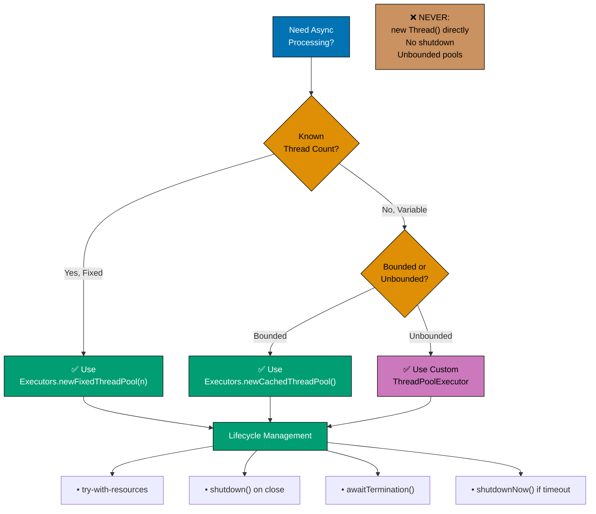
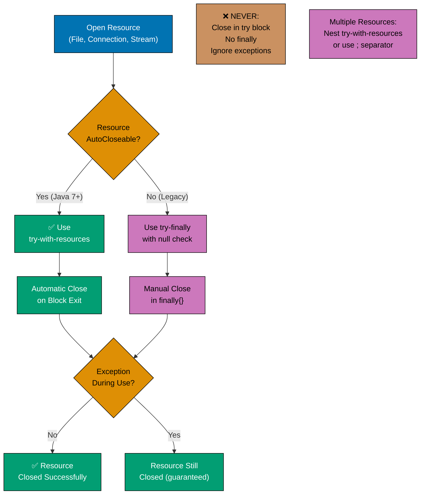
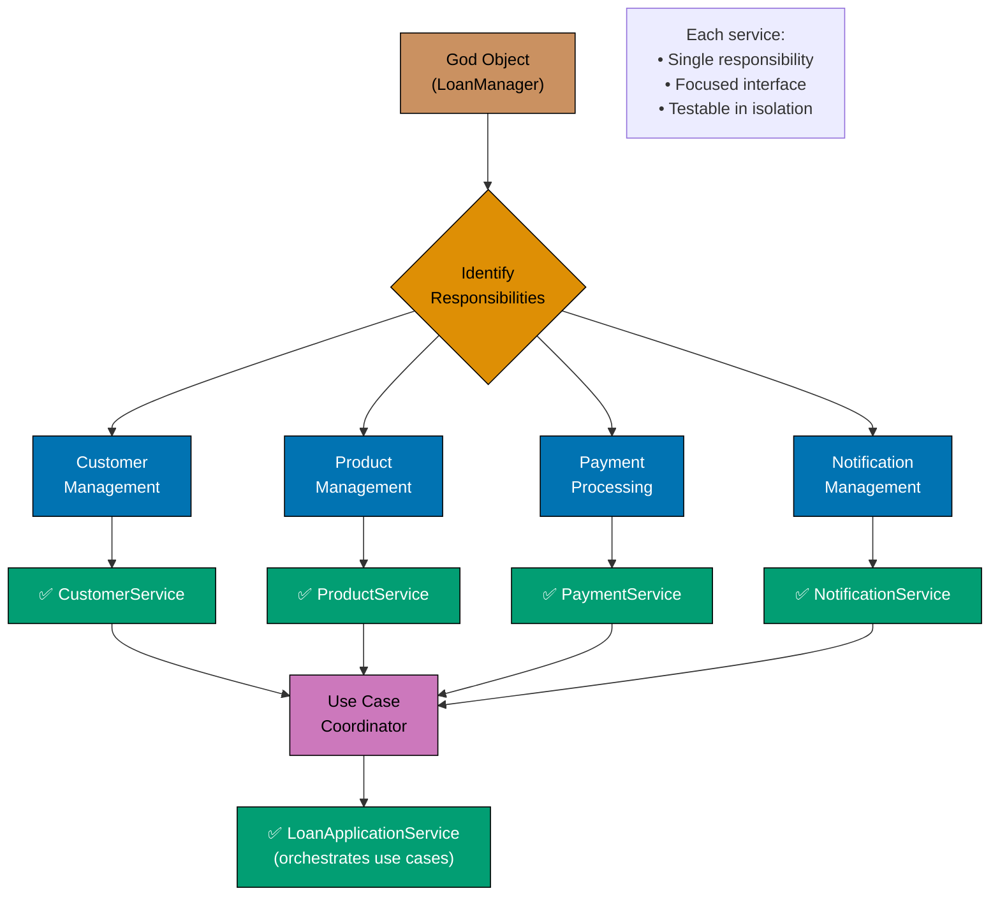
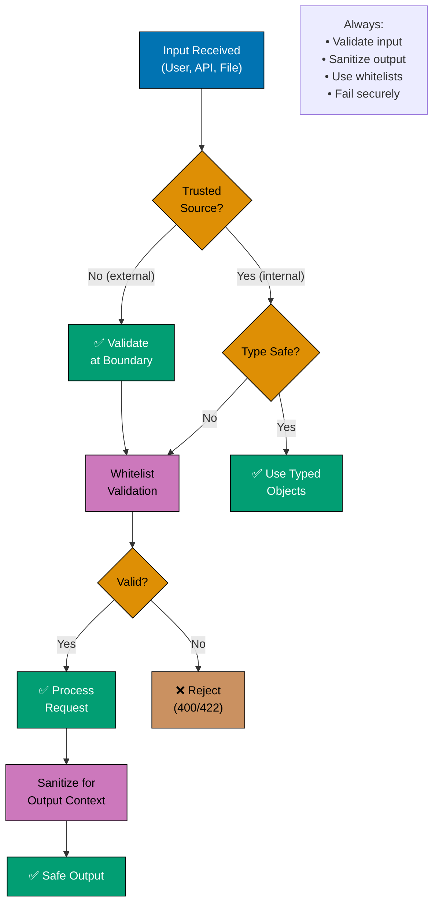
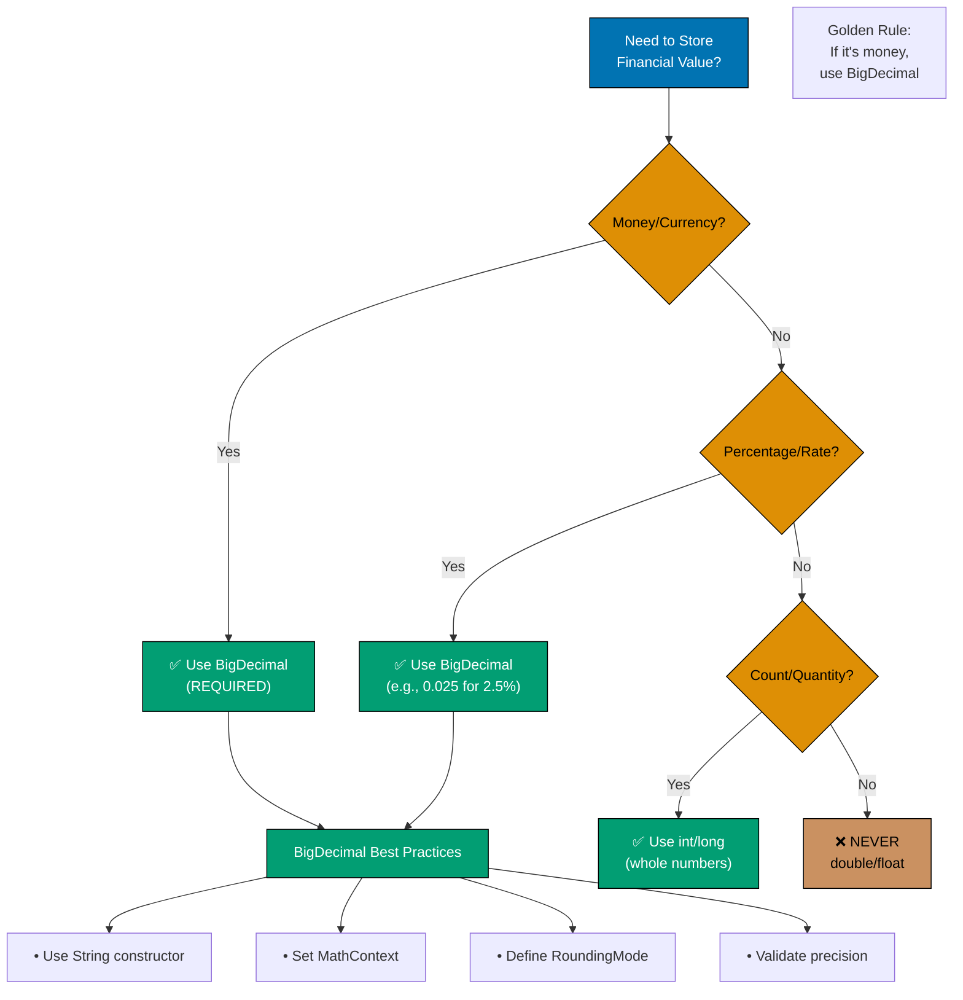
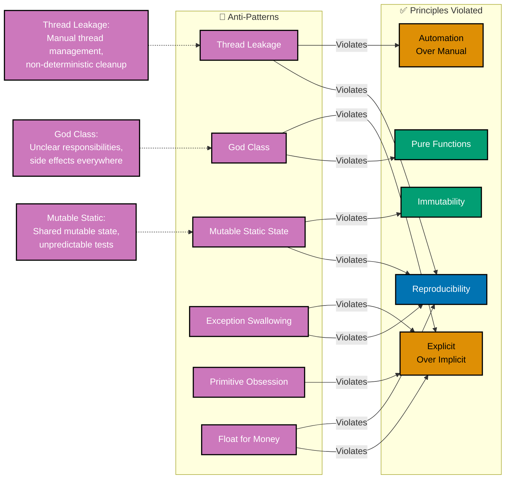

# Java Antipatterns

**Quick Reference**: [Overview](#overview) | [Concurrency Antipatterns](#concurrency-antipatterns) | [Resource Management Antipatterns](#resource-management-antipatterns) | [Design Antipatterns](#design-antipatterns) | [Performance Antipatterns](#performance-antipatterns) | [Security Antipatterns](#security-antipatterns) | [Financial Calculation Anti-Patterns](#financial-calculation-anti-patterns) | [Recognition and Prevention](#recognition-and-prevention) | [Antipatterns Checklist](#antipatterns-checklist) | [Related Documentation](#related-documentation) | [Sources](#sources)

## Overview

Antipatterns are common responses to recurring problems that are usually ineffective and risk being highly counterproductive. Unlike design patterns, which represent best practices, antipatterns represent what not to do. They emerge from well-intentioned solutions that seemed right at the time but proved to be problematic in practice.

Understanding antipatterns is crucial because:

- **Prevention**: Recognizing antipatterns helps you avoid introducing them into your codebase
- **Detection**: You can identify existing problems in legacy code
- **Communication**: Antipatterns provide a shared vocabulary for discussing code problems
- **Learning**: Understanding why something is wrong deepens your understanding of correct approaches

This document catalogs common Java antipatterns, explains why they're problematic, and demonstrates how to fix them. Each antipattern includes real-world examples from finance domains to illustrate problems in practical contexts.

**Companion Document**: For recommended practices, see [Java Best Practices](./ex-so-stla-ja__best-practices.md).

## Quick Reference

**Jump to:**

- [Overview](#overview) - Introduction and context
- [Concurrency Antipatterns](#concurrency-antipatterns) - Thread leakage, race conditions, deadlocks
- [Resource Management Antipatterns](#resource-management-antipatterns) - Resource leaks, connection exhaustion
- [Design Antipatterns](#design-antipatterns) - God Class, primitive obsession, shotgun surgery
- [Performance Antipatterns](#performance-antipatterns) - N+1 queries, excessive object creation
- [Security Antipatterns](#security-antipatterns) - Hardcoded credentials, SQL injection
- [Financial Calculation Anti-Patterns](#financial-calculation-anti-patterns) - Float misuse, rounding errors
- [Recognition and Prevention](#recognition-and-prevention) - Detection strategies
- [Antipatterns Checklist](#antipatterns-checklist) - Quality verification
- [Related Documentation](#related-documentation) - Cross-references

**Related Documentation:**

- [Java Best Practices](./ex-so-stla-ja__best-practices.md) - Recommended approaches
- [Java Error Handling](./ex-so-stla-ja__error-handling.md) - Proper exception management
- [Java Security](./ex-so-stla-ja__security.md) - Security best practices
- [Java Performance](./ex-so-stla-ja__performance.md) - Performance optimization
- [Java Type Safety](./ex-so-stla-ja__type-safety.md) - Type-safe design patterns
- [Java Concurrency](./ex-so-stla-ja__concurrency-and-parallelism.md) - Proper concurrent programming

Antipatterns represent **violations** of [software engineering principles](../../../../../governance/principles/software-engineering/README.md):

1. **Thread Leakage** violates [Automation Over Manual](../../../../../governance/principles/software-engineering/automation-over-manual.md) - Manual thread management instead of ExecutorService
2. **God Class** violates [Explicit Over Implicit](../../../../../governance/principles/software-engineering/explicit-over-implicit.md) - Unclear responsibilities
3. **Mutable Static State** violates [Immutability Over Mutability](../../../../../governance/principles/software-engineering/immutability.md) - Shared mutable state
4. **Side Effects in Calculations** violates [Pure Functions Over Side Effects](../../../../../governance/principles/software-engineering/pure-functions.md) - Unpredictable behavior
5. **Non-Deterministic Tests** violates [Reproducibility First](../../../../../governance/principles/software-engineering/reproducibility.md) - Flaky test results

## Concurrency Antipatterns

### 1. Thread Leakage

**Problem**: Creating threads without proper lifecycle management, causing threads to accumulate and never terminate, eventually leading to resource exhaustion.

**Why It's Bad**:

- Consumes system resources (memory, CPU, file descriptors)
- Can cause OutOfMemoryError or thread creation failures
- Degrades application performance over time
- Makes debugging difficult due to unpredictable behavior

**How to Recognize**:

- Thread count continuously increases over time
- Memory usage grows without bounds
- Application slows down after running for extended periods
- Thread dumps show large numbers of idle threads

**How to Fix**:

- Use ExecutorService instead of creating threads directly
- Always shut down ExecutorService properly
- Use try-with-resources for AutoCloseable executors
- Set daemon status appropriately
- Implement proper thread pool sizing

#### Thread Management Decision Flow



**Key Principles**:

- **Fixed pool**: Known concurrency needs (e.g., CPU-bound tasks)
- **Cached pool**: Variable load with short-lived tasks
- **Custom pool**: Fine-grained control over queue, rejection policy
- **Always shutdown**: Use try-with-resources or explicit lifecycle management

**Code Example**:

```java
// BAD: Thread leakage in Zakat calculation service
public class ZakatCalculationService {
    public void calculateTaxAsync(BigDecimal wealth, Consumer<BigDecimal> callback) {
        // Problem: New thread created every time, never cleaned up
        Thread thread = new Thread(() -> {
            BigDecimal nisab = getThreshold();
            if (wealth.compareTo(nisab) >= 0) {
                BigDecimalzakat = wealth.multiply(new BigDecimal("0.025"));
                callback.accept(tax);
            }
        });
        thread.start();
        // Thread is never tracked or joined
    }
}

// GOOD: Using ExecutorService with proper lifecycle
public class ZakatCalculationService implements AutoCloseable {
    private final ExecutorService executor;

    public ZakatCalculationService() {
        this.executor = Executors.newFixedThreadPool(
            Runtime.getRuntime().availableProcessors()
        );
    }

    public CompletableFuture<BigDecimal> calculateTaxAsync(BigDecimal wealth) {
        return CompletableFuture.supplyAsync(() -> {
            BigDecimal nisab = getThreshold();
            if (wealth.compareTo(nisab) >= 0) {
                return wealth.multiply(new BigDecimal("0.025"));
            }
            return BigDecimal.ZERO;
        }, executor);
    }

    @Override
    public void close() {
        executor.shutdown();
        try {
            if (!executor.awaitTermination(60, TimeUnit.SECONDS)) {
                executor.shutdownNow();
            }
        } catch (InterruptedException e) {
            executor.shutdownNow();
            Thread.currentThread().interrupt();
        }
    }

    private BigDecimal getThreshold() {
        // Implementation
        return new BigDecimal("85"); // grams of gold equivalent
    }
}
```

### 2. Busy Waiting

**Problem**: Using a loop to repeatedly check a condition instead of using proper synchronization mechanisms, wasting CPU cycles.

**Why It's Bad**:

- Wastes CPU resources unnecessarily
- Reduces performance for other threads
- Increases power consumption
- Makes code harder to maintain
- Can cause timing issues on different hardware

**How to Recognize**:

- Loops with `Thread.sleep()` checking conditions
- High CPU usage with little actual work being done
- Tight loops checking volatile variables
- Spin locks in application code

**How to Fix**:

- Use `wait()` and `notify()` for coordination
- Use `CountDownLatch`, `Semaphore`, or other synchronizers
- Use `CompletableFuture` for asynchronous operations
- Leverage reactive programming for event-driven scenarios

**Code Example**:

```java
// BAD: Busy waiting for QardHasan donation confirmation
public class LoanPaymentProcessor {
    private volatile boolean paymentConfirmed = false;

    public void waitForPaymentConfirmation() throws InterruptedException {
        // Problem: Wastes CPU cycles checking the flag
        while (!paymentConfirmed) {
            Thread.sleep(100); // Still busy waiting, just slower
        }
        processPayment();
    }

    public void confirmPayment() {
        paymentConfirmed = true;
    }

    private void processPayment() {
        // Process donation
    }
}

// GOOD: Using proper synchronization with CountDownLatch
public class LoanPaymentProcessor {
    private final CountDownLatch paymentLatch = new CountDownLatch(1);

    public void waitForPaymentConfirmation() throws InterruptedException {
        // Efficient: Thread blocks until countdown reaches zero
        paymentLatch.await();
        processPayment();
    }

    public void confirmPayment() {
        paymentLatch.countDown(); // Release waiting threads
    }

    private void processPayment() {
        // Process donation
    }
}

// BETTER: Using CompletableFuture for modern async patterns
public class LoanPaymentProcessor {
    private final CompletableFuture<Void> paymentFuture = new CompletableFuture<>();

    public CompletableFuture<Void> waitForPaymentConfirmation() {
        return paymentFuture.thenRun(this::processPayment);
    }

    public void confirmPayment() {
        paymentFuture.complete(null);
    }

    private void processPayment() {
        // Process donation
    }
}
```

### 3. Nested Monitor Lockout (Deadlock)

**Problem**: Two or more threads hold locks and wait for each other to release them, causing permanent blocking.

**Why It's Bad**:

- Application hangs completely
- Requires restart to recover
- Difficult to diagnose in production
- Can occur intermittently under specific timing conditions

**How to Recognize**:

- Application stops responding
- Thread dumps show threads in BLOCKED state
- Multiple threads waiting for locks held by each other
- Circular wait conditions in lock acquisition

**How to Fix**:

- Always acquire locks in a consistent order
- Use lock timeouts with `tryLock()`
- Minimize lock scope and duration
- Use higher-level concurrency utilities
- Consider lock-free algorithms

**Code Example**:

```java
// BAD: Deadlock in Donation asset transfer
public class DonationAssetManager {
    private final Object donationLock = new Object();
    private final Object beneficiaryLock = new Object();
    private Map<String, BigDecimal> donationAssets = new HashMap<>();
    private Map<String, BigDecimal> beneficiaryAllocations = new HashMap<>();

    // Thread 1 calls this
    public void transferToBeneficiary(String donationId, String beneficiaryId,
                                     BigDecimal amount) {
        synchronized (donationLock) {
            // Thread 1 holds donationLock
            BigDecimal balance = donationAssets.get(donationId);

            synchronized (beneficiaryLock) {
                // Thread 1 tries to acquire beneficiaryLock
                beneficiaryAllocations.merge(beneficiaryId, amount, BigDecimal::add);
                donationAssets.put(donationId, balance.subtract(amount));
            }
        }
    }

    // Thread 2 calls this - DEADLOCK POTENTIAL
    public void recordDonation(String beneficiaryId, String donationId,
                              BigDecimal amount) {
        synchronized (beneficiaryLock) {
            // Thread 2 holds beneficiaryLock
            BigDecimal allocation = beneficiaryAllocations.get(beneficiaryId);

            synchronized (donationLock) {
                // Thread 2 tries to acquire donationLock - DEADLOCK!
                donationAssets.merge(donationId, amount, BigDecimal::add);
                beneficiaryAllocations.put(beneficiaryId, allocation.add(amount));
            }
        }
    }
}

// GOOD: Consistent lock ordering prevents deadlock
public class DonationAssetManager {
    private final Object primaryLock = new Object();
    private Map<String, BigDecimal> donationAssets = new HashMap<>();
    private Map<String, BigDecimal> beneficiaryAllocations = new HashMap<>();

    public void transferToBeneficiary(String donationId, String beneficiaryId,
                                     BigDecimal amount) {
        synchronized (primaryLock) {
            // Single lock acquisition - no deadlock possible
            BigDecimal balance = donationAssets.get(donationId);
            beneficiaryAllocations.merge(beneficiaryId, amount, BigDecimal::add);
            donationAssets.put(donationId, balance.subtract(amount));
        }
    }

    public void recordDonation(String beneficiaryId, String donationId,
                              BigDecimal amount) {
        synchronized (primaryLock) {
            // Same lock - consistent ordering
            BigDecimal allocation = beneficiaryAllocations.get(beneficiaryId);
            donationAssets.merge(donationId, amount, BigDecimal::add);
            beneficiaryAllocations.put(beneficiaryId, allocation.add(amount));
        }
    }
}

// BETTER: Using ReentrantLock with timeout for safety
public class DonationAssetManager {
    private final ReentrantLock lock = new ReentrantLock();
    private Map<String, BigDecimal> donationAssets = new ConcurrentHashMap<>();
    private Map<String, BigDecimal> beneficiaryAllocations = new ConcurrentHashMap<>();

    public boolean transferToBeneficiary(String donationId, String beneficiaryId,
                                        BigDecimal amount)
            throws InterruptedException {
        if (lock.tryLock(5, TimeUnit.SECONDS)) {
            try {
                BigDecimal balance = donationAssets.get(donationId);
                if (balance.compareTo(amount) >= 0) {
                    beneficiaryAllocations.merge(beneficiaryId, amount, BigDecimal::add);
                    donationAssets.put(donationId, balance.subtract(amount));
                    return true;
                }
                return false;
            } finally {
                lock.unlock();
            }
        }
        return false; // Timeout - couldn't acquire lock
    }
}
```

### 4. Forgotten Synchronization

**Problem**: Accessing shared mutable state from multiple threads without proper synchronization.

**Why It's Bad**:

- Causes data corruption and inconsistent state
- Creates race conditions
- Leads to subtle bugs that are hard to reproduce
- May work correctly in testing but fail in production
- Violates thread safety guarantees

**How to Recognize**:

- Shared mutable fields accessed by multiple threads
- No synchronization keywords or concurrent collections
- Intermittent incorrect calculations or data corruption
- Different results on different runs with same input

**How to Fix**:

- Use `synchronized` blocks or methods
- Use concurrent collections (`ConcurrentHashMap`, etc.)
- Use atomic variables (`AtomicInteger`, `AtomicReference`)
- Make fields `final` when possible
- Use immutable objects

**Code Example**:

```java
// BAD: Race condition in money transfer
public class MoneyTransferService {
    private Map<String, BigDecimal> accounts = new HashMap<>();

    // Multiple threads can call this concurrently
    public void transfer(String fromAccount, String toAccount, BigDecimal amount) {
        // DANGER: No synchronization, race condition!
        BigDecimal fromBalance = accounts.get(fromAccount);
        BigDecimal toBalance = accounts.get(toAccount);

        // Another thread might modify accounts here

        accounts.put(fromAccount, fromBalance.subtract(amount));
        accounts.put(toAccount, toBalance.add(amount));
        // Money can be lost or duplicated!
    }

    public BigDecimal getBalance(String donation_account) {
        return accounts.get(donation_account); // Also unsynchronized!
    }
}

// GOOD: Proper synchronization
public class MoneyTransferService {
    private final Object lock = new Object();
    private Map<String, BigDecimal> accounts = new HashMap<>();

    public void transfer(String fromAccount, String toAccount, BigDecimal amount) {
        synchronized (lock) {
            BigDecimal fromBalance = accounts.get(fromAccount);
            BigDecimal toBalance = accounts.get(toAccount);

            if (fromBalance.compareTo(amount) >= 0) {
                accounts.put(fromAccount, fromBalance.subtract(amount));
                accounts.put(toAccount, toBalance.add(amount));
            } else {
                throw new IllegalArgumentException("Insufficient funds");
            }
        }
    }

    public BigDecimal getBalance(String donation_account) {
        synchronized (lock) {
            return accounts.get(donation_account);
        }
    }
}

// BETTER: Using ConcurrentHashMap with atomic operations
public class MoneyTransferService {
    private final ConcurrentHashMap<String, BigDecimal> accounts =
        new ConcurrentHashMap<>();

    public boolean transfer(String fromAccount, String toAccount, BigDecimal amount) {
        // Atomic check-and-update using compute methods
        BigDecimal[] success = {null};

        accounts.computeIfPresent(fromAccount, (key, balance) -> {
            if (balance.compareTo(amount) >= 0) {
                success[0] = balance.subtract(amount);
                return success[0];
            }
            return balance; // No change if insufficient funds
        });

        if (success[0] != null) {
            accounts.merge(toAccount, amount, BigDecimal::add);
            return true;
        }
        return false;
    }

    public BigDecimal getBalance(String donation_account) {
        return accounts.getOrDefault(donation_account, BigDecimal.ZERO);
    }
}
```

### 5. Excessive Synchronization

**Problem**: Synchronizing too broadly or unnecessarily, causing performance bottlenecks and potential deadlocks.

**Why It's Bad**:

- Reduces concurrency and scalability
- Creates unnecessary contention
- Can cause performance to degrade with more threads
- May lead to deadlocks if synchronization is too coarse
- Defeats the purpose of multithreading

**How to Recognize**:

- Entire methods synchronized when only parts need it
- Synchronizing on entire collections
- Long-running operations inside synchronized blocks
- Thread contention shown in profilers
- Performance decreases as thread count increases

**How to Fix**:

- Minimize critical section size
- Use fine-grained locking
- Use lock-free algorithms when possible
- Prefer concurrent collections
- Use read-write locks for read-heavy scenarios

**Code Example**:

```java
// BAD: Excessive synchronization in Tax calculator
public class ZakatCalculator {
    private BigDecimal goldPricePerGram;
    private BigDecimal thresholdInGold = new BigDecimal("85"); // grams

    // Entire method synchronized unnecessarily
    public synchronized BigDecimal calculateZakat(
            BigDecimal cash,
            BigDecimal investments,
            BigDecimal inventory) {

        // Long-running calculation
        BigDecimal totalWealth = cash.add(investments).add(inventory);

        // This part needs synchronization
        BigDecimal thresholdThreshold = thresholdInGold.multiply(goldPricePerGram);

        if (totalWealth.compareTo(thresholdThreshold) >= 0) {
            return totalWealth.multiply(new BigDecimal("0.025"));
        }

        return BigDecimal.ZERO;
    }

    public synchronized void updateGoldPrice(BigDecimal newPrice) {
        this.goldPricePerGram = newPrice;
    }

    public synchronized BigDecimal getGoldPrice() {
        return goldPricePerGram;
    }
}

// GOOD: Minimal synchronization
public class ZakatCalculator {
    private volatile BigDecimal goldPricePerGram;
    private final BigDecimal thresholdInGold = new BigDecimal("85");

    public BigDecimal calculateZakat(
            BigDecimal cash,
            BigDecimal investments,
            BigDecimal inventory) {

        // Calculation happens outside synchronized block
        BigDecimal totalWealth = cash.add(investments).add(inventory);

        // Only read that needs consistency is synchronized
        BigDecimal currentGoldPrice = getGoldPrice();
        BigDecimal thresholdThreshold = thresholdInGold.multiply(currentGoldPrice);

        if (totalWealth.compareTo(thresholdThreshold) >= 0) {
            return totalWealth.multiply(new BigDecimal("0.025"));
        }

        return BigDecimal.ZERO;
    }

    public void updateGoldPrice(BigDecimal newPrice) {
        // volatile write ensures visibility
        this.goldPricePerGram = newPrice;
    }

    public BigDecimal getGoldPrice() {
        return goldPricePerGram;
    }
}

// BETTER: Using AtomicReference for thread-safe updates
public class ZakatCalculator {
    private final AtomicReference<BigDecimal> goldPricePerGram =
        new AtomicReference<>();
    private final BigDecimal thresholdInGold = new BigDecimal("85");

    public BigDecimal calculateZakat(
            BigDecimal cash,
            BigDecimal investments,
            BigDecimal inventory) {

        BigDecimal totalWealth = cash.add(investments).add(inventory);
        BigDecimal currentGoldPrice = goldPricePerGram.get();
        BigDecimal thresholdThreshold = thresholdInGold.multiply(currentGoldPrice);

        if (totalWealth.compareTo(thresholdThreshold) >= 0) {
            return totalWealth.multiply(new BigDecimal("0.025"));
        }

        return BigDecimal.ZERO;
    }

    public void updateGoldPrice(BigDecimal newPrice) {
        goldPricePerGram.set(newPrice);
    }

    public BigDecimal getGoldPrice() {
        return goldPricePerGram.get();
    }
}
```

### 6. Ignoring InterruptedException

**Problem**: Catching `InterruptedException` without properly handling it, suppressing the interruption signal.

**Why It's Bad**:

- Breaks thread cancellation mechanisms
- Makes threads unresponsive to shutdown requests
- Causes resource leaks during shutdown
- Violates interruption protocol
- Can cause application hangs during shutdown

**How to Recognize**:

- Empty catch blocks for `InterruptedException`
- Not restoring interrupt status
- Continuing execution after interruption
- Threads that don't terminate during shutdown

**How to Fix**:

- Restore interrupt status with `Thread.currentThread().interrupt()`
- Propagate exception if possible
- Clean up resources before returning
- Document interruption handling strategy

**Code Example**:

```java
// BAD: Swallowing InterruptedException
public class LoanScheduledPaymentProcessor {
    private volatile boolean running = true;

    public void processScheduledPayments() {
        while (running) {
            try {
                PaymentSchedule schedule = getNextScheduledPayment();
                processPayment(schedule);
                Thread.sleep(60000); // Wait 1 minute
            } catch (InterruptedException e) {
                // WRONG: Ignoring interruption
                // Thread can't be stopped properly
            }
        }
    }

    private PaymentSchedule getNextScheduledPayment() {
        // Implementation
        return null;
    }

    private void processPayment(PaymentSchedule schedule) {
        // Implementation
    }

    private static class PaymentSchedule {}
}

// GOOD: Properly handling interruption
public class LoanScheduledPaymentProcessor {

    public void processScheduledPayments() {
        try {
            while (!Thread.currentThread().isInterrupted()) {
                PaymentSchedule schedule = getNextScheduledPayment();
                processPayment(schedule);

                try {
                    Thread.sleep(60000);
                } catch (InterruptedException e) {
                    // Restore interrupt status
                    Thread.currentThread().interrupt();
                    // Exit gracefully
                    break;
                }
            }
        } finally {
            // Clean up resources
            cleanup();
        }
    }

    private PaymentSchedule getNextScheduledPayment() {
        return null;
    }

    private void processPayment(PaymentSchedule schedule) {
        // Implementation
    }

    private void cleanup() {
        // Cleanup code
    }

    private static class PaymentSchedule {}
}

// BETTER: Propagating InterruptedException
public class LoanScheduledPaymentProcessor {

    public void processScheduledPayments() throws InterruptedException {
        while (!Thread.currentThread().isInterrupted()) {
            PaymentSchedule schedule = getNextScheduledPayment();
            processPayment(schedule);

            // Let InterruptedException propagate
            Thread.sleep(60000);
        }
    }

    private PaymentSchedule getNextScheduledPayment() {
        return null;
    }

    private void processPayment(PaymentSchedule schedule) {
        // Implementation
    }

    private static class PaymentSchedule {}
}
```

### 7. Starting Threads in Constructors

**Problem**: Creating and starting threads in constructors before object construction is complete.

**Why It's Bad**:

- The `this` reference escapes before construction completes
- Threads may see partially constructed objects
- Subclass fields may not be initialized yet
- Violates safe publication guarantees
- Creates race conditions during initialization

**How to Recognize**:

- `new Thread().start()` in constructor
- Passing `this` to other threads during construction
- Thread fields initialized and started in constructor

**How to Fix**:

- Use factory methods for thread creation
- Provide explicit `start()` method
- Use dependency injection frameworks
- Initialize threads after construction completes

**Code Example**:

```java
// BAD: Starting thread in constructor
public class DonationRevenueMonitor {
    private final String donationId;
    private volatile BigDecimal currentRevenue;
    private final Thread monitorThread;

    public DonationRevenueMonitor(String donationId) {
        this.donationId = donationId;
        this.currentRevenue = BigDecimal.ZERO;

        // DANGER: Starting thread in constructor
        // Thread may see partially constructed object
        this.monitorThread = new Thread(() -> {
            while (true) {
                // currentRevenue might not be initialized yet!
                updateRevenue();
                try {
                    Thread.sleep(5000);
                } catch (InterruptedException e) {
                    break;
                }
            }
        });
        monitorThread.start(); // This reference escapes!
    }

    private void updateRevenue() {
        // Update revenue from external source
    }
}

// GOOD: Explicit initialization method
public class DonationRevenueMonitor {
    private final String donationId;
    private volatile BigDecimal currentRevenue;
    private Thread monitorThread;

    public DonationRevenueMonitor(String donationId) {
        this.donationId = donationId;
        this.currentRevenue = BigDecimal.ZERO;
        // Don't start thread here
    }

    // Explicit start method called after construction
    public synchronized void start() {
        if (monitorThread != null) {
            throw new IllegalStateException("Already started");
        }

        monitorThread = new Thread(() -> {
            while (!Thread.currentThread().isInterrupted()) {
                updateRevenue();
                try {
                    Thread.sleep(5000);
                } catch (InterruptedException e) {
                    Thread.currentThread().interrupt();
                    break;
                }
            }
        });
        monitorThread.start();
    }

    public synchronized void stop() {
        if (monitorThread != null) {
            monitorThread.interrupt();
        }
    }

    private void updateRevenue() {
        // Update revenue from external source
    }
}

// BETTER: Factory method pattern
public class DonationRevenueMonitor {
    private final String donationId;
    private final AtomicReference<BigDecimal> currentRevenue;
    private final ScheduledExecutorService scheduler;

    private DonationRevenueMonitor(String donationId, ScheduledExecutorService scheduler) {
        this.donationId = donationId;
        this.currentRevenue = new AtomicReference<>(BigDecimal.ZERO);
        this.scheduler = scheduler;
    }

    // Factory method ensures complete construction before scheduling
    public static DonationRevenueMonitor create(
            String donationId,
            ScheduledExecutorService scheduler) {

        DonationRevenueMonitor monitor = new DonationRevenueMonitor(donationId, scheduler);

        // Object is fully constructed before scheduling starts
        scheduler.scheduleAtFixedRate(
            monitor::updateRevenue,
            0,
            5,
            TimeUnit.SECONDS
        );

        return monitor;
    }

    private void updateRevenue() {
        // Update revenue from external source
        // currentRevenue is guaranteed to be initialized
    }
}
```

## Resource Management Antipatterns

### 8. Not Closing Resources

**Problem**: Failing to close resources like streams, connections, or files, causing resource leaks.

**Why It's Bad**:

- Exhausts file descriptors or database connections
- Causes memory leaks
- May prevent file deletion or modification
- Leads to application instability over time
- Can cause "too many open files" errors

**How to Recognize**:

- Resources opened but never closed
- Close statements in try blocks (can be skipped if exception occurs)
- No finally blocks for cleanup
- Not using try-with-resources

#### Resource Management Flow



**Key Principles**:

- **Always use try-with-resources**: For AutoCloseable resources (Java 7+)
- **Multiple resources**: Nest or separate with semicolon
- **Guaranteed cleanup**: Resources closed even if exception occurs
- **Legacy code**: Use try-finally with null checks if pre-Java 7

**Example**:

```java
// GOOD: try-with-resources
try (Connection conn = dataSource.getConnection();
     PreparedStatement stmt = conn.prepareStatement(sql)) {
    // Resources automatically closed
}
```

**How to Fix**:

- Always use try-with-resources for AutoCloseable resources
- Close resources in finally blocks if try-with-resources unavailable
- Use connection pools with proper configuration
- Set resource timeouts

**Code Example**:

```java
// BAD: Not closing database resources
public class ZakatRecordRepository {
    private DataSource dataSource;

    public List<ZakatRecord> getRecordsForYear(int year) {
        List<ZakatRecord> records = new ArrayList<>();

        try {
            Connection conn = dataSource.getConnection();
            PreparedStatement stmt = conn.prepareStatement(
                "SELECT * FROM tax_records WHERE year = ?"
            );
            stmt.setInt(1, year);

            ResultSet rs = stmt.executeQuery();
            while (rs.next()) {
                records.add(mapToTaxRecord(rs));
            }
            // DANGER: Resources never closed!
            // Connection, Statement, ResultSet all leak
        } catch (SQLException e) {
            throw new RuntimeException(e);
        }

        return records;
    }

    private ZakatRecord mapToTaxRecord(ResultSet rs) throws SQLException {
        return new ZakatRecord();
    }

    private static class ZakatRecord {}
}

// OKAY: Closing in finally block
public class ZakatRecordRepository {
    private DataSource dataSource;

    public List<ZakatRecord> getRecordsForYear(int year) {
        List<ZakatRecord> records = new ArrayList<>();
        Connection conn = null;
        PreparedStatement stmt = null;
        ResultSet rs = null;

        try {
            conn = dataSource.getConnection();
            stmt = conn.prepareStatement(
                "SELECT * FROM tax_records WHERE year = ?"
            );
            stmt.setInt(1, year);
            rs = stmt.executeQuery();

            while (rs.next()) {
                records.add(mapToTaxRecord(rs));
            }
        } catch (SQLException e) {
            throw new RuntimeException(e);
        } finally {
            // Verbose but ensures cleanup
            if (rs != null) {
                try { rs.close(); } catch (SQLException e) { /* log */ }
            }
            if (stmt != null) {
                try { stmt.close(); } catch (SQLException e) { /* log */ }
            }
            if (conn != null) {
                try { conn.close(); } catch (SQLException e) { /* log */ }
            }
        }

        return records;
    }

    private ZakatRecord mapToTaxRecord(ResultSet rs) throws SQLException {
        return new ZakatRecord();
    }

    private static class ZakatRecord {}
}

// GOOD: Using try-with-resources
public class ZakatRecordRepository {
    private DataSource dataSource;

    public List<ZakatRecord> getRecordsForYear(int year) {
        List<ZakatRecord> records = new ArrayList<>();

        try (Connection conn = dataSource.getConnection();
             PreparedStatement stmt = conn.prepareStatement(
                 "SELECT * FROM tax_records WHERE year = ?")) {

            stmt.setInt(1, year);

            try (ResultSet rs = stmt.executeQuery()) {
                while (rs.next()) {
                    records.add(mapToTaxRecord(rs));
                }
            }
        } catch (SQLException e) {
            throw new RuntimeException(e);
        }

        return records;
    }

    private ZakatRecord mapToTaxRecord(ResultSet rs) throws SQLException {
        return new ZakatRecord();
    }

    private static class ZakatRecord {}
}
```

### 9. Empty Catch Blocks

**Problem**: Catching exceptions without handling them or logging, silently masking problems.

**Why It's Bad**:

- Hides bugs and makes debugging impossible
- Violates fail-fast principle
- Can cause data corruption to go unnoticed
- Makes system behavior unpredictable
- Violates logging and monitoring requirements

**How to Recognize**:

- Empty `catch` blocks
- Catch blocks with only comments
- Catching `Exception` or `Throwable` without specific handling
- No logging in exception handlers

**How to Fix**:

- Always log exceptions with context
- Re-throw as appropriate exception type
- Handle only exceptions you can actually handle
- Use specific exception types
- Add monitoring/alerting for exceptions

**Code Example**:

```java
// BAD: Silent failure in QardHasan interest calculation
public class LoanProfitCalculator {

    public BigDecimal calculateProfit(
            BigDecimal costPrice,
            BigDecimal interestMargin,
            int installmentMonths) {

        try {
            // Complex calculation
            BigDecimal sellingPrice = costPrice.multiply(
                BigDecimal.ONE.add(interestMargin)
            );

            // Could throw ArithmeticException
            BigDecimal monthlyPayment = sellingPrice.divide(
                new BigDecimal(installmentMonths),
                2,
                RoundingMode.HALF_UP
            );

            return monthlyPayment.multiply(new BigDecimal(installmentMonths))
                .subtract(costPrice);

        } catch (Exception e) {
            // DANGER: Silent failure
            // Returns null, caller doesn't know calculation failed
        }

        return null;
    }
}

// GOOD: Proper exception handling with logging
public class LoanProfitCalculator {
    private static final Logger logger =
        LoggerFactory.getLogger(LoanProfitCalculator.class);

    public BigDecimal calculateProfit(
            BigDecimal costPrice,
            BigDecimal interestMargin,
            int installmentMonths) {

        try {
            validateInputs(costPrice, interestMargin, installmentMonths);

            BigDecimal sellingPrice = costPrice.multiply(
                BigDecimal.ONE.add(interestMargin)
            );

            BigDecimal monthlyPayment = sellingPrice.divide(
                new BigDecimal(installmentMonths),
                2,
                RoundingMode.HALF_UP
            );

            return monthlyPayment.multiply(new BigDecimal(installmentMonths))
                .subtract(costPrice);

        } catch (ArithmeticException e) {
            logger.error("Arithmetic error calculating QardHasan interest: " +
                "costPrice={}, interestMargin={}, months={}",
                costPrice, interestMargin, installmentMonths, e);
            throw new LoanProfitCalculationException(
                "Failed to calculate interest", e);
        } catch (IllegalArgumentException e) {
            logger.warn("Invalid input for QardHasan interest calculation: {}",
                e.getMessage());
            throw e;
        }
    }

    private void validateInputs(
            BigDecimal costPrice,
            BigDecimal interestMargin,
            int installmentMonths) {

        if (costPrice == null || costPrice.compareTo(BigDecimal.ZERO) <= 0) {
            throw new IllegalArgumentException("Cost price must be positive");
        }
        if (interestMargin == null || interestMargin.compareTo(BigDecimal.ZERO) < 0) {
            throw new IllegalArgumentException("Profit margin cannot be negative");
        }
        if (installmentMonths <= 0) {
            throw new IllegalArgumentException("Installment months must be positive");
        }
    }

    private static class LoanProfitCalculationException
            extends RuntimeException {
        public LoanProfitCalculationException(String message, Throwable cause) {
            super(message, cause);
        }
    }
}
```

### 10. Sharing Static SimpleDateFormat

**Problem**: Using static `SimpleDateFormat` instances shared between threads, which is not thread-safe.

**Why It's Bad**:

- `SimpleDateFormat` is not thread-safe
- Causes incorrect date parsing/formatting
- Creates subtle data corruption bugs
- Hard to reproduce (timing-dependent)
- Can cause SecurityException or NumberFormatException

**How to Recognize**:

- Static `SimpleDateFormat` fields
- `SimpleDateFormat` fields in singleton classes
- Shared `SimpleDateFormat` without synchronization

**How to Fix**:

- Use `DateTimeFormatter` (thread-safe) from java.time
- Create new `SimpleDateFormat` instances per use
- Use `ThreadLocal<SimpleDateFormat>` if necessary
- Synchronize access to shared instances

**Code Example**:

```java
// BAD: Static SimpleDateFormat causing race conditions
public class ZakatPaymentService {
    // DANGER: Not thread-safe!
    private static final SimpleDateFormat DATE_FORMAT =
        new SimpleDateFormat("yyyy-MM-dd");

    public void recordPayment(String dateString, BigDecimal amount) {
        try {
            // Multiple threads calling this will corrupt dates
            Date paymentDate = DATE_FORMAT.parse(dateString);
            savePayment(paymentDate, amount);
        } catch (ParseException e) {
            throw new RuntimeException("Invalid date format", e);
        }
    }

    public String formatPaymentDate(Date date) {
        // Also not thread-safe
        return DATE_FORMAT.format(date);
    }

    private void savePayment(Date date, BigDecimal amount) {
        // Implementation
    }
}

// GOOD: Using DateTimeFormatter (thread-safe)
public class ZakatPaymentService {
    private static final DateTimeFormatter DATE_FORMATTER =
        DateTimeFormatter.ofPattern("yyyy-MM-dd");

    public void recordPayment(String dateString, BigDecimal amount) {
        try {
            LocalDate paymentDate = LocalDate.parse(dateString, DATE_FORMATTER);
            savePayment(paymentDate, amount);
        } catch (DateTimeParseException e) {
            throw new RuntimeException("Invalid date format", e);
        }
    }

    public String formatPaymentDate(LocalDate date) {
        return DATE_FORMATTER.format(date);
    }

    private void savePayment(LocalDate date, BigDecimal amount) {
        // Implementation
    }
}

// ALTERNATIVE: ThreadLocal for legacy code using SimpleDateFormat
public class ZakatPaymentService {
    private static final ThreadLocal<SimpleDateFormat> DATE_FORMAT =
        ThreadLocal.withInitial(() -> new SimpleDateFormat("yyyy-MM-dd"));

    public void recordPayment(String dateString, BigDecimal amount) {
        try {
            Date paymentDate = DATE_FORMAT.get().parse(dateString);
            savePayment(paymentDate, amount);
        } catch (ParseException e) {
            throw new RuntimeException("Invalid date format", e);
        }
    }

    public String formatPaymentDate(Date date) {
        return DATE_FORMAT.get().format(date);
    }

    private void savePayment(Date date, BigDecimal amount) {
        // Implementation
    }
}
```

### 11. Using StringBuffer When StringBuilder Suffices

**Problem**: Using `StringBuffer` (synchronized) instead of `StringBuilder` for local string concatenation.

**Why It's Bad**:

- Unnecessary synchronization overhead
- Slower performance for local operations
- No benefit when not shared between threads
- Wastes CPU cycles on locking

**How to Recognize**:

- `StringBuffer` used in local variables
- `StringBuffer` in single-threaded methods
- `StringBuffer` never shared between threads

**How to Fix**:

- Use `StringBuilder` for local string building
- Use `StringBuffer` only when truly needed for thread safety
- Consider string concatenation with `+` for simple cases (compiler optimizes)

**Code Example**:

```java
// BAD: Unnecessary synchronization overhead
public class DonationReportGenerator {

    public String generateReport(List<DonationAsset> assets) {
        // StringBuffer is synchronized - unnecessary overhead here
        StringBuffer report = new StringBuffer();

        report.append("=== Donation Assets Report ===\n");
        report.append("Generated: ").append(LocalDateTime.now()).append("\n\n");

        for (DonationAsset asset : assets) {
            report.append("Asset ID: ").append(asset.getId()).append("\n");
            report.append("Value: ").append(asset.getValue()).append("\n");
            report.append("Type: ").append(asset.getType()).append("\n");
            report.append("---\n");
        }

        return report.toString();
    }

    private static class DonationAsset {
        public String getId() { return "W001"; }
        public BigDecimal getValue() { return BigDecimal.TEN; }
        public String getType() { return "Property"; }
    }
}

// GOOD: Using StringBuilder for local operations
public class DonationReportGenerator {

    public String generateReport(List<DonationAsset> assets) {
        StringBuilder report = new StringBuilder();

        report.append("=== Donation Assets Report ===\n");
        report.append("Generated: ").append(LocalDateTime.now()).append("\n\n");

        for (DonationAsset asset : assets) {
            report.append("Asset ID: ").append(asset.getId()).append("\n");
            report.append("Value: ").append(asset.getValue()).append("\n");
            report.append("Type: ").append(asset.getType()).append("\n");
            report.append("---\n");
        }

        return report.toString();
    }

    private static class DonationAsset {
        public String getId() { return "W001"; }
        public BigDecimal getValue() { return BigDecimal.TEN; }
        public String getType() { return "Property"; }
    }
}
```

## Design Antipatterns

### 12. God Objects

**Problem**: Creating classes that know too much or do too much, violating Single Responsibility Principle.

**Why It's Bad**:

- Hard to understand and maintain
- Difficult to test
- High coupling to many parts of system
- Changes ripple through entire class
- Merge conflicts in version control
- Violates separation of concerns

**How to Recognize**:

- Classes with thousands of lines
- Many unrelated methods
- Too many dependencies
- Names like "Manager", "Handler", "Util", "Helper"
- Everything depends on this class

**How to Fix**:

- Split into multiple focused classes
- Apply Single Responsibility Principle
- Use composition over inheritance
- Extract cohesive components
- Create clear interfaces

#### God Object Decomposition Strategy



**Decomposition Steps**:

1. **Identify responsibilities**: List all distinct concerns (customer, product, payment, etc.)
2. **Create focused services**: One service per responsibility
3. **Define clear interfaces**: Each service has well-defined contract
4. **Coordinate with orchestrator**: Application service coordinates multiple domain services
5. **Use dependency injection**: Wire services together

**Code Example**:

```java
// BAD: God object doing everything
public class LoanManager {
    private CustomerRepository customerRepo;
    private ProductRepository productRepo;
    private PaymentProcessor paymentProcessor;
    private EmailService emailService;
    private SMSService smsService;
    private AuditLogger auditLogger;
    private RiskAssessment riskAssessment;
    private CreditChecker creditChecker;
    private DocumentGenerator documentGenerator;
    private NotificationService notificationService;

    // Donor operations
    public Donor createCustomer(CustomerData data) { /* ... */ return null; }
    public void updateCustomer(Donor donor) { /* ... */ }
    public void deleteCustomer(String customerId) { /* ... */ }
    public Donor findCustomer(String customerId) { /* ... */ return null; }
    public List<Donor> searchCustomers(String query) { /* ... */ return null; }

    // Product operations
    public Product createProduct(ProductData data) { /* ... */ return null; }
    public void updateProduct(Product product) { /* ... */ }
    public List<Product> getAvailableProducts() { /* ... */ return null; }
    public boolean checkProductAvailability(String productId) { /* ... */ return false; }

    // MurabahaContract operations
    public LoanContract createContract(Donor donor, Product product) {
        /* ... */ return null;
    }
    public void approveContract(String contractId) { /* ... */ }
    public void rejectContract(String contractId, String reason) { /* ... */ }
    public BigDecimal calculateProfit(LoanContract murabaha_contract) { /* ... */ return null; }

    // DonationPayment operations
    public void processPayment(String contractId, BigDecimal amount) { /* ... */ }
    public void recordPayment(DonationPayment donation) { /* ... */ }
    public List<DonationPayment> getPaymentHistory(String contractId) { /* ... */ return null; }
    public boolean checkPaymentStatus(String paymentId) { /* ... */ return false; }

    // Notification operations
    public void sendPaymentReminder(String customerId) { /* ... */ }
    public void sendContractApproval(String customerId) { /* ... */ }
    public void sendPaymentConfirmation(String customerId) { /* ... */ }

    // Risk assessment
    public RiskLevel assessRisk(Donor donor, BigDecimal amount) {
        /* ... */ return null;
    }
    public boolean checkCredit(String customerId) { /* ... */ return false; }

    // Document generation
    public byte[] generateContract(LoanContract murabaha_contract) { /* ... */ return null; }
    public byte[] generateInvoice(DonationPayment donation) { /* ... */ return null; }
    public byte[] generateReport(String contractId) { /* ... */ return null; }

    // Audit operations
    public void logContractCreation(LoanContract murabaha_contract) { /* ... */ }
    public void logPayment(DonationPayment donation) { /* ... */ }
    public void logApproval(String contractId, String approver) { /* ... */ }

    // Helper classes
    private static class CustomerData {}
    private static class ProductData {}
    private static class Donor {}
    private static class Product {}
    private static class LoanContract {}
    private static class DonationPayment {}
    private static class RiskLevel {}
}

// GOOD: Separated concerns with focused classes
public class LoanContractService {
    private final CustomerService customerService;
    private final ProductService productService;
    private final ProfitCalculator interestCalculator;
    private final ContractRepository contractRepository;
    private final ContractApprovalService approvalService;

    public LoanContractService(
            CustomerService customerService,
            ProductService productService,
            ProfitCalculator interestCalculator,
            ContractRepository contractRepository,
            ContractApprovalService approvalService) {
        this.customerService = customerService;
        this.productService = productService;
        this.interestCalculator = interestCalculator;
        this.contractRepository = contractRepository;
        this.approvalService = approvalService;
    }

    public LoanContract createContract(String customerId, String productId) {
        Donor donor = customerService.getCustomer(customerId);
        Product product = productService.getProduct(productId);

        BigDecimal interest = interestCalculator.calculate(
            product.getCostPrice(),
            donor.getProfitMargin()
        );

        LoanContract murabaha_contract = new LoanContract(
            donor,
            product,
            interest
        );

        return contractRepository.save(murabaha_contract);
    }

    public void approveContract(String contractId, String approverId) {
        LoanContract murabaha_contract = contractRepository.findById(contractId);
        approvalService.approve(murabaha_contract, approverId);
    }

    private static class Donor {
        public BigDecimal getProfitMargin() { return BigDecimal.ZERO; }
    }

    private static class Product {
        public BigDecimal getCostPrice() { return BigDecimal.ZERO; }
    }

    private static class LoanContract {
        public LoanContract(Donor c, Product p, BigDecimal interest) {}
    }
}

public class LoanPaymentService {
    private final PaymentProcessor paymentProcessor;
    private final PaymentRepository paymentRepository;
    private final PaymentNotificationService notificationService;

    public LoanPaymentService(
            PaymentProcessor paymentProcessor,
            PaymentRepository paymentRepository,
            PaymentNotificationService notificationService) {
        this.paymentProcessor = paymentProcessor;
        this.paymentRepository = paymentRepository;
        this.notificationService = notificationService;
    }

    public void processPayment(String contractId, BigDecimal amount) {
        DonationPayment donation = paymentProcessor.process(contractId, amount);
        paymentRepository.save(donation);
        notificationService.sendPaymentConfirmation(donation);
    }

    public List<DonationPayment> getPaymentHistory(String contractId) {
        return paymentRepository.findByContractId(contractId);
    }

    private static class DonationPayment {}
}

public class CustomerService {
    private final CustomerRepository repository;
    private final CustomerValidator validator;

    public Donor getCustomer(String customerId) {
        return repository.findById(customerId);
    }

    public Donor createCustomer(CustomerData data) {
        validator.validate(data);
        return repository.save(new Donor(data));
    }

    private static class CustomerData {}
    private static class Donor {
        public Donor(CustomerData data) {}
        public BigDecimal getProfitMargin() { return BigDecimal.ZERO; }
    }
}
```

### 13. Excessive Dependency Injection

**Problem**: Over-using dependency injection to the point where code navigation and understanding becomes difficult.

**Why It's Bad**:

- Makes it hard to find actual implementations
- Obscures program flow
- Creates complex configuration overhead
- Difficult to debug
- Can hide tight coupling behind interfaces

**How to Recognize**:

- Everything is an interface
- Deep interface hierarchies
- Hard to find concrete implementations
- Configuration files larger than actual code
- Multiple layers of abstraction for simple operations

**How to Fix**:

- Use DI judiciously for real dependencies
- Keep most code as plain classes
- Use concrete classes for internal components
- Reserve interfaces for external boundaries
- Favor simplicity over theoretical flexibility

**Code Example**:

```java
// BAD: Excessive abstraction layers
public interface ITaxCalculator {
    BigDecimal calculate(IWealthData incomeData);
}

public interface ITaxCalculatorFactory {
    ITaxCalculator createCalculator(ICalculationStrategy strategy);
}

public interface ICalculationStrategy {
    BigDecimal applyStrategy(IWealthData incomeData);
}

public interface IWealthData {
    BigDecimal getTotalWealth();
    IAssetCollection getAssets();
}

public interface IAssetCollection {
    List<IAsset> getAssets();
    BigDecimal getTotalValue();
}

public interface IAsset {
    String getId();
    BigDecimal getValue();
    IAssetType getType();
}

public interface IAssetType {
    String getName();
    boolean isTaxEligible();
}

// Finding the actual implementation requires navigating many files
public class StandardTaxCalculator implements ITaxCalculator {
    private final ICalculationStrategy strategy;

    @Inject
    public StandardTaxCalculator(@Named("standard") ICalculationStrategy strategy) {
        this.strategy = strategy;
    }

    @Override
    public BigDecimal calculate(IWealthData incomeData) {
        return strategy.applyStrategy(incomeData);
    }
}

// GOOD: Simple, direct implementation with DI only where needed
public class ZakatCalculator {
    private final BigDecimal thresholdThreshold;
    private final BigDecimal zakatRate;

    public ZakatCalculator(BigDecimal thresholdThreshold) {
        this.thresholdThreshold = thresholdThreshold;
        this.zakatRate = new BigDecimal("0.025"); // 2.5%
    }

    public BigDecimal calculate(WealthData incomeData) {
        BigDecimal totalWealth = incomeData.getTotalWealth();

        if (totalWealth.compareTo(thresholdThreshold) >= 0) {
            return totalWealth.multiply(zakatRate);
        }

        return BigDecimal.ZERO;
    }
}

// Simple data class
public class WealthData {
    private final BigDecimal cash;
    private final BigDecimal investments;
    private final BigDecimal inventory;

    public WealthData(BigDecimal cash, BigDecimal investments, BigDecimal inventory) {
        this.cash = cash;
        this.investments = investments;
        this.inventory = inventory;
    }

    public BigDecimal getTotalWealth() {
        return cash.add(investments).add(inventory);
    }
}

// Use interfaces only at service boundaries
public interface PaymentGateway {
    PaymentResult process(PaymentRequest request);
}

// Internal services can be concrete classes
public class ZakatPaymentService {
    private final PaymentGateway paymentGateway; // External dependency
    private final ZakatCalculator calculator;     // Internal - concrete class

    public ZakatPaymentService(PaymentGateway paymentGateway) {
        this.paymentGateway = paymentGateway;
        this.calculator = new ZakatCalculator(new BigDecimal("85")); // Direct instantiation
    }

    public PaymentResult processZakatPayment(WealthData incomeData) {
        BigDecimal zakatAmount = calculator.calculate(incomeData);
        return paymentGateway.process(new PaymentRequest(zakatAmount));
    }

    private static class PaymentRequest {
        public PaymentRequest(BigDecimal amount) {}
    }

    private static class PaymentResult {}
}
```

### 14. JPA as Leaky Abstraction

**Problem**: Using JPA annotations and features that expose database details throughout the application.

**Why It's Bad**:

- Tight coupling to database implementation
- Lazy loading causes unexpected queries
- N+1 query problems
- Session management complexity
- Hard to test without database
- Performance unpredictability

**How to Recognize**:

- JPA entities used as DTOs in API layer
- Lazy loading exceptions in service layer
- `@Transactional` everywhere
- Entity relationships mirror database exactly
- Business logic in entity classes

**How to Fix**:

- Use JPA only in repository layer
- Create separate domain models
- Use explicit fetch strategies
- Map between entities and domain objects
- Keep business logic in service layer

**Code Example**:

```java
// BAD: JPA entities leaking throughout application
@Entity
@Table(name = "loan_contracts")
public class LoanContract {
    @Id
    @GeneratedValue(strategy = GenerationType.IDENTITY)
    private Long id;

    @ManyToOne(fetch = FetchType.LAZY) // Leaky abstraction
    @JoinColumn(name = "customer_id")
    private Donor donor; // Might trigger lazy load exception

    @OneToMany(mappedBy = "murabaha_contract", fetch = FetchType.LAZY)
    private List<DonationPayment> payments; // N+1 query problem

    @Column(name = "cost_price")
    private BigDecimal costPrice;

    @Column(name = "selling_price")
    private BigDecimal sellingPrice;

    // Business logic in entity - WRONG
    public BigDecimal calculateOutstanding() {
        BigDecimal totalPaid = payments.stream()
            .map(DonationPayment::getAmount)
            .reduce(BigDecimal.ZERO, BigDecimal::add);
        return sellingPrice.subtract(totalPaid);
    }

    // Getters/setters with JPA entities
    public Donor getCustomer() { return donor; } // Returns JPA entity
    public List<DonationPayment> getPayments() { return payments; } // Returns JPA list
}

// This is then used in API layer - WRONG
@RestController
public class ContractController {
    @Autowired
    private ContractRepository repository;

    @GetMapping("/contracts/{id}")
    public LoanContract getContract(@PathVariable Long id) {
        // Returns JPA entity directly - leaky abstraction
        return repository.findById(id).orElseThrow();
    }
}

// GOOD: Separate domain model from persistence
// Domain model - clean of JPA concerns
public class LoanContract {
    private final String contractId;
    private final CustomerInfo donor;
    private final BigDecimal costPrice;
    private final BigDecimal sellingPrice;
    private final List<PaymentInfo> payments;

    public LoanContract(
            String contractId,
            CustomerInfo donor,
            BigDecimal costPrice,
            BigDecimal sellingPrice,
            List<PaymentInfo> payments) {
        this.contractId = contractId;
        this.donor = donor;
        this.costPrice = costPrice;
        this.sellingPrice = sellingPrice;
        this.payments = List.copyOf(payments); // Immutable
    }

    // Business logic in domain model
    public BigDecimal calculateOutstanding() {
        BigDecimal totalPaid = payments.stream()
            .map(PaymentInfo::amount)
            .reduce(BigDecimal.ZERO, BigDecimal::add);
        return sellingPrice.subtract(totalPaid);
    }

    public CustomerInfo donor() { return donor; }
    public BigDecimal costPrice() { return costPrice; }
    public BigDecimal sellingPrice() { return sellingPrice; }
}

// Simple value objects
public record CustomerInfo(String customerId, String name, String email) {}
public record PaymentInfo(String paymentId, BigDecimal amount, LocalDate date) {}

// JPA entity in repository layer only
@Entity
@Table(name = "loan_contracts")
class LoanContractEntity {
    @Id
    private String id;

    @Column(name = "customer_id")
    private String customerId;

    @Column(name = "customer_name")
    private String customerName;

    @Column(name = "customer_email")
    private String customerEmail;

    @Column(name = "cost_price")
    private BigDecimal costPrice;

    @Column(name = "selling_price")
    private BigDecimal sellingPrice;

    // Explicit query to avoid N+1
    @Transient
    private List<PaymentEntity> payments;

    // Package-private for repository use only
    String getId() { return id; }
    String getCustomerId() { return customerId; }
    String getCustomerName() { return customerName; }
    String getCustomerEmail() { return customerEmail; }
    BigDecimal getCostPrice() { return costPrice; }
    BigDecimal getSellingPrice() { return sellingPrice; }
    List<PaymentEntity> getPayments() { return payments; }
    void setPayments(List<PaymentEntity> payments) { this.payments = payments; }
}

// Repository with mapping
@Repository
class LoanContractRepository {
    @PersistenceContext
    private EntityManager entityManager;

    public Optional<LoanContract> findById(String contractId) {
        // Single query with join fetch
        String jpql = """
            SELECT c FROM LoanContractEntity c
            LEFT JOIN FETCH c.payments
            WHERE c.id = :contractId
        """;

        LoanContractEntity entity = entityManager
            .createQuery(jpql, LoanContractEntity.class)
            .setParameter("contractId", contractId)
            .getResultStream()
            .findFirst()
            .orElse(null);

        if (entity == null) {
            return Optional.empty();
        }

        // Map to domain model
        return Optional.of(toDomain(entity));
    }

    private LoanContract toDomain(LoanContractEntity entity) {
        CustomerInfo donor = new CustomerInfo(
            entity.getCustomerId(),
            entity.getCustomerName(),
            entity.getCustomerEmail()
        );

        List<PaymentInfo> payments = entity.getPayments().stream()
            .map(p -> new PaymentInfo(
                p.getId(),
                p.getAmount(),
                p.getPaymentDate()
            ))
            .toList();

        return new LoanContract(
            entity.getId(),
            donor,
            entity.getCostPrice(),
            entity.getSellingPrice(),
            payments
        );
    }
}

// Entity classes referenced but not shown
class PaymentEntity {
    public String getId() { return null; }
    public BigDecimal getAmount() { return null; }
    public LocalDate getPaymentDate() { return null; }
}
```

### 15. Excessive Inheritance Hierarchies

**Problem**: Creating deep inheritance hierarchies that reduce code locality and make understanding difficult.

**Why It's Bad**:

- Forces reading multiple files to understand behavior
- Tight coupling between parent and child classes
- Fragile base class problem
- Hard to refactor
- Violates composition over inheritance principle

**How to Recognize**:

- Inheritance depth > 3 levels
- Abstract classes with few concrete implementations
- Template method pattern overuse
- Behavior spread across inheritance chain

**How to Fix**:

- Favor composition over inheritance
- Use interfaces for polymorphism
- Keep inheritance shallow
- Duplicate code if it improves clarity
- Use delegation

**Code Example**:

```java
// BAD: Deep inheritance hierarchy
public abstract class FinancialTransaction {
    protected String transactionId;
    protected LocalDateTime timestamp;
    protected BigDecimal amount;

    protected abstract void validate();
    protected abstract void process();
    protected abstract void audit();

    public final void execute() {
        validate();
        process();
        audit();
    }
}

public abstract class BusinessTransaction extends FinancialTransaction {
    protected boolean compliant;

    @Override
    protected void validate() {
        if (!compliant) {
            throw new IllegalStateException("DonationTransaction not compliant");
        }
        validateCompliance();
    }

    protected abstract void validateCompliance();
}

public abstract class DonationTransaction extends BusinessTransaction {
    protected String donorId;
    protected String recipientId;

    @Override
    protected void validateCompliance() {
        // Donation-specific validation
        validateDonor();
        validateRecipient();
    }

    protected abstract void validateDonor();
    protected abstract void validateRecipient();
}

public class ZakatPayment extends DonationTransaction {
    private BigDecimal thresholdThreshold;

    @Override
    protected void validateDonor() {
        // Must navigate 4 levels to understand this
    }

    @Override
    protected void validateRecipient() {
        // Implementation
    }

    @Override
    protected void process() {
        // Implementation
    }

    @Override
    protected void audit() {
        // Implementation
    }
}

// GOOD: Composition over inheritance
public class ZakatPayment {
    private final String transactionId;
    private final LocalDateTime timestamp;
    private final BigDecimal amount;
    private final String donorId;
    private final String recipientId;

    private final TransactionValidator validator;
    private final TransactionProcessor processor;
    private final AuditLogger auditLogger;

    public ZakatPayment(
            String transactionId,
            LocalDateTime timestamp,
            BigDecimal amount,
            String donorId,
            String recipientId) {
        this.transactionId = transactionId;
        this.timestamp = timestamp;
        this.amount = amount;
        this.donorId = donorId;
        this.recipientId = recipientId;

        // Compose behaviors
        this.validator = new ZakatValidator();
        this.processor = new ZakatProcessor();
        this.auditLogger = new AuditLogger();
    }

    public void execute() {
        // All logic visible in one place
        validator.validate(this);
        processor.process(this);
        auditLogger.audit(this);
    }

    // Getters
    public String transactionId() { return transactionId; }
    public LocalDateTime timestamp() { return timestamp; }
    public BigDecimal amount() { return amount; }
    public String donorId() { return donorId; }
    public String recipientId() { return recipientId; }
}

// Focused validators
class ZakatValidator implements TransactionValidator {
    @Override
    public void validate(ZakatPayment donation) {
        validateCompliance(donation);
        validateDonor(donation);
        validateRecipient(donation);
        validateAmount(donation);
    }

    private void validateCompliance(ZakatPayment donation) {
        // Implementation
    }

    private void validateDonor(ZakatPayment donation) {
        // Implementation
    }

    private void validateRecipient(ZakatPayment donation) {
        // Implementation
    }

    private void validateAmount(ZakatPayment donation) {
        // Implementation
    }
}

interface TransactionValidator {
    void validate(ZakatPayment donation);
}

class ZakatProcessor implements TransactionProcessor {
    @Override
    public void process(ZakatPayment donation) {
        // Clear, focused implementation
    }
}

interface TransactionProcessor {
    void process(ZakatPayment donation);
}

class AuditLogger {
    public void audit(ZakatPayment donation) {
        // Audit implementation
    }
}
```

## Performance Antipatterns

### 16. Premature Optimization

**Problem**: Optimizing code before knowing if optimization is needed, sacrificing clarity and maintainability.

**Why It's Bad**:

- Makes code harder to understand
- Wastes development time
- May optimize the wrong parts
- Introduces bugs
- Prevents future optimization

**How to Recognize**:

- Complex code without performance measurements
- Micro-optimizations everywhere
- Sacrificing readability for unmeasured speed
- No profiling data to justify complexity

**How to Fix**:

- Write clear, simple code first
- Profile to find real bottlenecks
- Optimize only hot paths
- Measure before and after
- Keep optimization localized

**Code Example**:

```java
// BAD: Premature optimization making code unreadable
public class DonationRevenueCalculator {
    // Trying to avoid BigDecimal "overhead"
    public long calculateTotalRevenue(List<DonationAsset> assets) {
        // Converts to cents to use primitive long - PREMATURE OPTIMIZATION
        long totalCents = 0;
        int size = assets.size();

        // Manual loop instead of streams - micro-optimization
        for (int i = 0; i < size; i++) {
            DonationAsset asset = assets.get(i);
            // Complex bit shifting instead of simple multiplication
            long valueCents = asset.getValueCents();
            long monthlyRevenueCents = (valueCents * 12) >> 4; // Divide by 16???
            totalCents += monthlyRevenueCents;
        }

        return totalCents;
    }

    private static class DonationAsset {
        public long getValueCents() { return 1000L; }
    }
}

// GOOD: Clear, maintainable code
public class DonationRevenueCalculator {
    private static final BigDecimal MONTHS_PER_YEAR = new BigDecimal("12");

    public BigDecimal calculateTotalRevenue(List<DonationAsset> assets) {
        return assets.stream()
            .map(DonationAsset::getMonthlyRevenue)
            .reduce(BigDecimal.ZERO, BigDecimal::add)
            .multiply(MONTHS_PER_YEAR);
    }

    private static class DonationAsset {
        public BigDecimal getMonthlyRevenue() {
            return new BigDecimal("100.00");
        }
    }
}

// If profiling shows this is a bottleneck, THEN optimize
public class DonationRevenueCalculator {
    private static final BigDecimal MONTHS_PER_YEAR = new BigDecimal("12");

    public BigDecimal calculateTotalRevenue(List<DonationAsset> assets) {
        // After profiling, if this is hot path, optimize with measurement
        BigDecimal total = BigDecimal.ZERO;
        for (DonationAsset asset : assets) {
            total = total.add(asset.getMonthlyRevenue());
        }
        return total.multiply(MONTHS_PER_YEAR);
    }

    private static class DonationAsset {
        public BigDecimal getMonthlyRevenue() {
            return new BigDecimal("100.00");
        }
    }
}
```

### 17. String Concatenation in Loops

**Problem**: Using `+` operator for string concatenation inside loops, creating many temporary objects.

**Why It's Bad**:

- Creates many intermediate String objects
- O(n²) time complexity
- Causes excessive garbage collection
- Wastes memory
- Degrades performance with large datasets

**How to Recognize**:

- `+=` or `+` inside loops
- Building strings incrementally without StringBuilder
- String concatenation in recursive methods

**How to Fix**:

- Use `StringBuilder` for loops
- Use `String.join()` for collections
- Use text blocks or formatted strings when appropriate
- Consider streams with `Collectors.joining()`

**Code Example**:

```java
// BAD: String concatenation in loop
public class LoanReportGenerator {

    public String generatePaymentSchedule(List<DonationPayment> payments) {
        String report = "DonationPayment Schedule:\n";
        report += "================\n\n";

        // Each iteration creates new String object - O(n²)
        for (DonationPayment donation : payments) {
            report += "Date: " + donation.getDate() + "\n";
            report += "Amount: " + donation.getAmount() + "\n";
            report += "Status: " + donation.getStatus() + "\n";
            report += "---\n";
        }

        report += "\nTotal Payments: " + payments.size();
        return report;
    }

    private static class DonationPayment {
        public LocalDate getDate() { return LocalDate.now(); }
        public BigDecimal getAmount() { return BigDecimal.TEN; }
        public String getStatus() { return "PAID"; }
    }
}

// GOOD: Using StringBuilder
public class LoanReportGenerator {

    public String generatePaymentSchedule(List<DonationPayment> payments) {
        StringBuilder report = new StringBuilder();
        report.append("DonationPayment Schedule:\n");
        report.append("================\n\n");

        for (DonationPayment donation : payments) {
            report.append("Date: ").append(donation.getDate()).append("\n");
            report.append("Amount: ").append(donation.getAmount()).append("\n");
            report.append("Status: ").append(donation.getStatus()).append("\n");
            report.append("---\n");
        }

        report.append("\nTotal Payments: ").append(payments.size());
        return report.toString();
    }

    private static class DonationPayment {
        public LocalDate getDate() { return LocalDate.now(); }
        public BigDecimal getAmount() { return BigDecimal.TEN; }
        public String getStatus() { return "PAID"; }
    }
}

// BETTER: Using modern Java features
public class LoanReportGenerator {

    public String generatePaymentSchedule(List<DonationPayment> payments) {
        String header = """
            DonationPayment Schedule:
            ================

            """;

        String paymentDetails = payments.stream()
            .map(donation -> String.format("""
                Date: %s
                Amount: %s
                Status: %s
                ---
                """,
                donation.getDate(),
                donation.getAmount(),
                donation.getStatus()))
            .collect(Collectors.joining("\n"));

        String footer = "\nTotal Payments: " + payments.size();

        return header + paymentDetails + footer;
    }

    private static class DonationPayment {
        public LocalDate getDate() { return LocalDate.now(); }
        public BigDecimal getAmount() { return BigDecimal.TEN; }
        public String getStatus() { return "PAID"; }
    }
}
```

### 18. Using BigDecimal Constructor with Double

**Problem**: Creating `BigDecimal` from double literals, which introduces floating-point precision errors.

**Why It's Bad**:

- Binary floating-point cannot represent decimal fractions exactly
- Introduces precision errors
- Critical for financial calculations
- Violates finance precision requirements
- Can cause accounting errors

**How to Recognize**:

- `new BigDecimal(0.1)`
- `new BigDecimal(doubleVariable)`
- BigDecimal constructed from float/double

**How to Fix**:

- Use `BigDecimal.valueOf(double)` for variables
- Use String constructor for literals
- Use integer-based constructors
- Specify MathContext explicitly

**Code Example**:

```java
// BAD: Precision errors in Zakat calculation
public class ZakatCalculator {

    public BigDecimal calculateZakat(BigDecimal wealth) {
        // WRONG: Creates BigDecimal with precision errors
        // new BigDecimal(0.025) = 0.02499999999999999861...
        BigDecimal zakatRate = new BigDecimal(0.025);

        return wealth.multiply(zakatRate);
        // Result will have precision errors!
    }

    public static void main(String[] args) {
        ZakatCalculator calc = new ZakatCalculator();
        BigDecimal wealth = new BigDecimal("10000");
        System.out.println(calc.calculateZakat(wealth));
        // Prints: 249.999999999999998610... instead of 250.00
    }
}

// GOOD: Using String constructor
public class ZakatCalculator {
    private static final BigDecimal ZAKAT_RATE = new BigDecimal("0.025");

    public BigDecimal calculateZakat(BigDecimal wealth) {
        return wealth.multiply(ZAKAT_RATE);
    }

    public static void main(String[] args) {
        ZakatCalculator calc = new ZakatCalculator();
        BigDecimal wealth = new BigDecimal("10000");
        System.out.println(calc.calculateZakat(wealth));
        // Prints: 250.00 (correct)
    }
}

// BETTER: Using proper scale and rounding
public class ZakatCalculator {
    private static final BigDecimal ZAKAT_RATE = new BigDecimal("0.025");
    private static final int SCALE = 2;
    private static final RoundingMode ROUNDING = RoundingMode.HALF_UP;

    public BigDecimal calculateZakat(BigDecimal wealth) {
        return wealth.multiply(ZAKAT_RATE)
            .setScale(SCALE, ROUNDING);
    }

    public static void main(String[] args) {
        ZakatCalculator calc = new ZakatCalculator();
        BigDecimal wealth = new BigDecimal("10000");
        System.out.println(calc.calculateZakat(wealth));
        // Prints: 250.00 with proper scale
    }
}
```

## Security Antipatterns

### Input Validation Decision Flow



**Security Principles**:

- **Validate at boundaries**: All external input (HTTP, file, database)
- **Whitelist over blacklist**: Define allowed values, reject everything else
- **Type safety**: Convert to domain objects early
- **Sanitize output**: Context-specific escaping (HTML, SQL, JSON)
- **Fail securely**: Reject invalid input, log security events

### 19. Not Setting TimeZone on Calendar

**Problem**: Using `Calendar` without explicitly setting timezone, causing server-side timezone to affect results.

**Why It's Bad**:

- Results depend on server configuration
- Behavior differs between environments
- Prayer time calculations can be wrong
- Tax due dates can be incorrect
- Violates predictability principle

**How to Recognize**:

- `Calendar.getInstance()` without timezone
- Date calculations without timezone specification
- Relying on default timezone

**How to Fix**:

- Always use `java.time` API with explicit timezones
- Avoid `Calendar` and `Date` classes
- Store times in UTC, convert for display
- Use `ZonedDateTime` for timezone-aware operations

**Code Example**:

```java
// BAD: Server timezone affects results
public class PrayerTimeCalculator {

    public Date getNextPrayerTime(String prayerName) {
        // Uses server's default timezone - UNPREDICTABLE
        Calendar calendar = Calendar.getInstance();

        switch (prayerName) {
            case "Fajr":
                calendar.set(Calendar.HOUR_OF_DAY, 5);
                calendar.set(Calendar.MINUTE, 30);
                break;
            case "Dhuhr":
                calendar.set(Calendar.HOUR_OF_DAY, 12);
                calendar.set(Calendar.MINUTE, 30);
                break;
            // ... other prayers
        }

        return calendar.getTime();
        // Wrong if server timezone doesn't match beneficiary's location!
    }
}

// GOOD: Explicit timezone with java.time API
public class PrayerTimeCalculator {

    public ZonedDateTime getNextPrayerTime(String prayerName, ZoneId timezone) {
        LocalTime prayerTime = switch (prayerName) {
            case "Fajr" -> LocalTime.of(5, 30);
            case "Dhuhr" -> LocalTime.of(12, 30);
            case "Asr" -> LocalTime.of(15, 45);
            case "Maghrib" -> LocalTime.of(18, 15);
            case "Isha" -> LocalTime.of(19, 45);
            default -> throw new IllegalArgumentException("Unknown prayer: " + prayerName);
        };

        // Explicit timezone - predictable behavior
        LocalDate today = LocalDate.now(timezone);
        return ZonedDateTime.of(today, prayerTime, timezone);
    }
}

// BETTER: Store in UTC, convert for display
public class PrayerTimeService {

    public Instant getNextPrayerTime(String prayerName, ZoneId userTimezone) {
        // Calculate in beneficiary's timezone
        ZonedDateTime prayerTime = calculatePrayerTime(prayerName, userTimezone);

        // Store as UTC Instant
        return prayerTime.toInstant();
    }

    private ZonedDateTime calculatePrayerTime(String prayerName, ZoneId timezone) {
        LocalTime time = switch (prayerName) {
            case "Fajr" -> LocalTime.of(5, 30);
            case "Dhuhr" -> LocalTime.of(12, 30);
            case "Asr" -> LocalTime.of(15, 45);
            case "Maghrib" -> LocalTime.of(18, 15);
            case "Isha" -> LocalTime.of(19, 45);
            default -> throw new IllegalArgumentException("Unknown prayer: " + prayerName);
        };

        return ZonedDateTime.of(LocalDate.now(timezone), time, timezone);
    }
}
```

### 20. Hardcoding Sensitive Configuration

**Problem**: Embedding passwords, API keys, or other sensitive data directly in code.

**Why It's Bad**:

- Security breach risk
- Secrets exposed in version control
- Can't change without redeployment
- Violates security best practices
- Compliance violations

**How to Recognize**:

- Passwords or API keys in source files
- Connection strings with credentials
- Sensitive data in constants
- Configuration in code instead of external files

**How to Fix**:

- Use environment variables
- Use secrets management systems
- Use configuration files outside version control
- Use cloud secret managers (AWS Secrets Manager, etc.)
- Rotate credentials regularly

**Code Example**:

```java
// BAD: Hardcoded credentials
public class PaymentGatewayClient {
    // DANGER: Credentials in source code
    private static final String API_KEY = "sk_live_51HxT2bF9dKq8Y...";
    private static final String API_SECRET = "whsec_8HqG4K5n7L...";
    private static final String DATABASE_URL =
        "jdbc:postgresql://prod-db.example.com/finance";
    private static final String DB_USERNAME = "admin";
    private static final String DB_PASSWORD = "SuperSecret123!";

    public void connectToPaymentGateway() {
        // Using hardcoded credentials
        authenticate(API_KEY, API_SECRET);
    }

    private void authenticate(String key, String secret) {
        // Implementation
    }
}

// GOOD: Using environment variables
public class PaymentGatewayClient {
    private final String apiKey;
    private final String apiSecret;

    public PaymentGatewayClient() {
        // Load from environment variables
        this.apiKey = System.getenv("PAYMENT_GATEWAY_API_KEY");
        this.apiSecret = System.getenv("PAYMENT_GATEWAY_API_SECRET");

        if (apiKey == null || apiSecret == null) {
            throw new IllegalStateException(
                "DonationPayment gateway credentials not configured"
            );
        }
    }

    public void connectToPaymentGateway() {
        authenticate(apiKey, apiSecret);
    }

    private void authenticate(String key, String secret) {
        // Implementation
    }
}

// BETTER: Using configuration management
public class PaymentGatewayClient {
    private final String apiKey;
    private final String apiSecret;

    public PaymentGatewayClient(ConfigurationService config) {
        // Load from secure configuration service
        this.apiKey = config.getSecret("donation.gateway.api.key");
        this.apiSecret = config.getSecret("donation.gateway.api.secret");
    }

    public void connectToPaymentGateway() {
        authenticate(apiKey, apiSecret);
    }

    private void authenticate(String key, String secret) {
        // Implementation
    }
}

// Configuration service interface
interface ConfigurationService {
    String getSecret(String key);
}
```

## Financial Calculation Anti-Patterns

Financial applications require extreme precision and correctness. These anti-patterns demonstrate common mistakes when working with monetary values, dates, and business calculations that can lead to financial losses, compliance violations, and donor trust issues.

### 1. Using double/float for Money

**Problem**: Using floating-point types (`double` or `float`) for monetary values causes precision loss due to binary representation limitations.

**Why It's Bad**:

- Binary floating-point cannot accurately represent decimal values (0.1 + 0.025 ≠ 0.3)
- Accumulating errors compound over many transactions
- Zakat calculations, tax computations, and profit distributions become incorrect
- Violates financial compliance requirements
- Legal and regulatory issues

**Real-World Impact**:

In a Zakat collection system processing 100,000 donations per month, even 0.01% precision error can result in thousands in miscalculated obligations.

#### Financial Type Decision Tree



**Type Guidelines**:

- **BigDecimal**: All monetary values, percentages in finance (Zakat 2.5%, profit margins)
- **int/long**: Counts, quantities, IDs (number of donors, transaction count)
- **NEVER double/float**: Precision errors accumulate
- **String constructor**: `new BigDecimal("123.45")` not `new BigDecimal(123.45)`

**Example - Zakat Calculation with Accumulating Errors**:

```java
// WRONG: Using double for Zakat calculation
public class ZakatCalculatorWrong {
    private static final double ZAKAT_RATE = 0.025; // 2.5% Zakat rate

    public double calculateZakat(double[] monthlyBalances) {
        double totalZakat = 0.0;

        for (double balance : monthlyBalances) {
            // Precision loss accumulates with each iteration
            totalZakat += balance * ZAKAT_RATE;
        }

        return totalZakat; // Incorrect due to floating-point errors
    }
}

// Test demonstrating the problem
@Test
void demonstratesPrecisionLoss() {
    ZakatCalculatorWrong calculator = new ZakatCalculatorWrong();

    // 12 months of balances
    double[] balances = new double[12];
    Arrays.fill(balances, 10000.10); // $10,000.10 each month

    double zakatDouble = calculator.calculateZakat(balances);

    // Expected: 12 * (10000.10 * 0.025) = 3000.03
    // Actual: 3000.0299999999997 (precision loss!)
    System.out.println("Double result: " + zakatDouble);
    // Output: 3000.0299999999997

    // Over years, this error compounds significantly
    assertNotEquals(3000.03, zakatDouble, 0.0); // Fails!
}

// CORRECT: Using BigDecimal for Zakat calculation
public class ZakatCalculatorCorrect {
    private static final BigDecimal ZAKAT_RATE = new BigDecimal("0.025");

    public BigDecimal calculateZakat(BigDecimal[] monthlyBalances) {
        BigDecimal totalZakat = BigDecimal.ZERO;

        for (BigDecimal balance : monthlyBalances) {
            BigDecimal monthlyZakat = balance.multiply(ZAKAT_RATE)
                .setScale(2, RoundingMode.HALF_UP);
            totalZakat = totalZakat.add(monthlyZakat);
        }

        return totalZakat;
    }
}

// Test demonstrating correctness
@Test
void calculatesPreciseZakat() {
    ZakatCalculatorCorrect calculator = new ZakatCalculatorCorrect();

    // 12 months of balances
    BigDecimal[] balances = new BigDecimal[12];
    Arrays.fill(balances, new BigDecimal("10000.10"));

    BigDecimal zakatBigDecimal = calculator.calculateZakat(balances);

    // Expected: 12 * (10000.10 * 0.025) = 3000.03
    assertEquals(new BigDecimal("3000.03"), zakatBigDecimal);
    // Test passes with exact precision!
}
```

**Performance Impact**:

- BigDecimal operations are ~10x slower than double
- For financial applications, correctness outweighs performance
- Cache commonly used values like rates and nisabs

**Fix**:

Always use `BigDecimal` for monetary values with explicit scale and rounding mode.

### 2. Mutable Money Objects

**Problem**: Creating mutable money value objects allows modification after creation, breaking immutability guarantees and causing thread-safety issues.

**Why It's Bad**:

- Shared money instances can be corrupted by multiple threads
- Debugging is difficult when values change unexpectedly
- Violates value object principles
- Makes reasoning about code state impossible

**Example - Shared Donation Amount Corrupted**:

```java
// WRONG: Mutable Money class
public class MoneyMutable {
    private BigDecimal amount;
    private Currency currency;

    public MoneyMutable(BigDecimal amount, Currency currency) {
        this.amount = amount;
        this.currency = currency;
    }

    // Dangerous: Allows modification
    public void setAmount(BigDecimal amount) {
        this.amount = amount;
    }

    public BigDecimal getAmount() {
        return amount;
    }

    public Currency getCurrency() {
        return currency;
    }
}

// Demonstrates thread-safety problem
@Test
void demonstratesRaceCondition() throws InterruptedException {
    MoneyMutable donation = new MoneyMutable(
        new BigDecimal("1000.00"),
        Currency.getInstance("USD")
    );

    // Multiple threads processing the same donation
    ExecutorService executor = Executors.newFixedThreadPool(10);
    CountDownLatch latch = new CountDownLatch(100);

    for (int i = 0; i < 100; i++) {
        executor.submit(() -> {
            try {
                // Each thread tries to add $10
                BigDecimal current = donation.getAmount();
                Thread.sleep(1); // Simulate processing time
                donation.setAmount(current.add(new BigDecimal("10.00")));
            } catch (InterruptedException e) {
                Thread.currentThread().interrupt();
            } finally {
                latch.countDown();
            }
        });
    }

    latch.await();
    executor.shutdown();

    // Expected: 1000 + (100 * 10) = 2000
    // Actual: Unpredictable due to race condition!
    System.out.println("Final amount: " + donation.getAmount());
    // Output varies: Could be 1100, 1450, 1890, etc.

    assertNotEquals(new BigDecimal("2000.00"), donation.getAmount());
}

// CORRECT: Immutable Money class using record
public record Money(BigDecimal amount, Currency currency) {
    public Money {
        Objects.requireNonNull(amount, "Amount cannot be null");
        Objects.requireNonNull(currency, "Currency cannot be null");
        if (amount.scale() > 2) {
            throw new IllegalArgumentException(
                "Amount scale cannot exceed 2 decimal places"
            );
        }
    }

    // Operations return new instances
    public Money add(Money other) {
        if (!this.currency.equals(other.currency)) {
            throw new IllegalArgumentException(
                "Cannot add different currencies: " +
                this.currency + " and " + other.currency
            );
        }
        return new Money(
            this.amount.add(other.amount),
            this.currency
        );
    }

    public Money multiply(BigDecimal multiplier) {
        return new Money(
            this.amount.multiply(multiplier)
                .setScale(2, RoundingMode.HALF_UP),
            this.currency
        );
    }
}

// Test demonstrates thread safety
@Test
void demonstratesThreadSafety() throws InterruptedException {
    Money initialDonation = new Money(
        new BigDecimal("1000.00"),
        Currency.getInstance("USD")
    );

    ExecutorService executor = Executors.newFixedThreadPool(10);
    CountDownLatch latch = new CountDownLatch(100);
    AtomicReference<Money> donation = new AtomicReference<>(initialDonation);

    Money increment = new Money(
        new BigDecimal("10.00"),
        Currency.getInstance("USD")
    );

    for (int i = 0; i < 100; i++) {
        executor.submit(() -> {
            try {
                // Thread-safe update using immutable operations
                donation.updateAndGet(current -> current.add(increment));
            } finally {
                latch.countDown();
            }
        });
    }

    latch.await();
    executor.shutdown();

    // Expected: 1000 + (100 * 10) = 2000
    assertEquals(
        new BigDecimal("2000.00"),
        donation.get().amount()
    );
    // Test passes reliably!
}
```

**Fix**:

Use immutable value objects (records or classes with final fields) and return new instances for operations.

### 3. Currency Mismatch in Operations

**Problem**: Performing arithmetic operations on money values with different currencies without proper validation or conversion.

**Why It's Bad**:

- Produces nonsensical results (adding USD to EUR)
- Silent errors propagate through the system
- Financial reports become incorrect
- Compliance and auditing issues

**Example - Multi-Currency Portfolio Aggregation**:

```java
// WRONG: No currency validation
public class PortfolioCalculatorWrong {
    public BigDecimal calculateTotalValue(List<Money> holdings) {
        BigDecimal total = BigDecimal.ZERO;

        for (Money holding : holdings) {
            // Blindly adds amounts without checking currency!
            total = total.add(holding.amount());
        }

        return total; // Meaningless result!
    }
}

// Test demonstrating the problem
@Test
void demonstratesCurrencyMismatch() {
    PortfolioCalculatorWrong calculator = new PortfolioCalculatorWrong();

    List<Money> portfolio = List.of(
        new Money(new BigDecimal("1000.00"), Currency.getInstance("USD")),
        new Money(new BigDecimal("2000.00"), Currency.getInstance("EUR")),
        new Money(new BigDecimal("3000.00"), Currency.getInstance("GBP"))
    );

    BigDecimal total = calculator.calculateTotalValue(portfolio);

    // Result is 6000.00, but 6000 of what currency?!
    // This is completely meaningless
    assertEquals(new BigDecimal("6000.00"), total);
    System.out.println("Meaningless total: " + total);
}

// CORRECT: Type-safe Money class with currency enforcement
public record Money(BigDecimal amount, Currency currency) {
    // Validation in constructor (shown earlier)

    public Money add(Money other) {
        if (!this.currency.equals(other.currency)) {
            throw new CurrencyMismatchException(
                "Cannot add " + other.currency + " to " + this.currency
            );
        }
        return new Money(
            this.amount.add(other.amount),
            this.currency
        );
    }
}

public class CurrencyMismatchException extends RuntimeException {
    public CurrencyMismatchException(String message) {
        super(message);
    }
}

public class PortfolioCalculatorCorrect {
    private final CurrencyConverter converter;

    public PortfolioCalculatorCorrect(CurrencyConverter converter) {
        this.converter = converter;
    }

    public Money calculateTotalValue(
        List<Money> holdings,
        Currency targetCurrency
    ) {
        Money total = new Money(BigDecimal.ZERO, targetCurrency);

        for (Money holding : holdings) {
            Money converted = converter.convert(holding, targetCurrency);
            total = total.add(converted);
        }

        return total;
    }
}

// Mock converter for testing
interface CurrencyConverter {
    Money convert(Money money, Currency targetCurrency);
}

// Test demonstrating compile-time safety
@Test
void enforcesTypeSafety() {
    CurrencyConverter converter = (money, target) -> {
        if (money.currency().equals(target)) {
            return money;
        }
        // Mock conversion rates for testing
        BigDecimal rate = switch (money.currency().getCurrencyCode() + "->" + target.getCurrencyCode()) {
            case "EUR->USD" -> new BigDecimal("1.10");
            case "GBP->USD" -> new BigDecimal("1.30");
            default -> BigDecimal.ONE;
        };
        return new Money(
            money.amount().multiply(rate).setScale(2, RoundingMode.HALF_UP),
            target
        );
    };

    PortfolioCalculatorCorrect calculator =
        new PortfolioCalculatorCorrect(converter);

    List<Money> portfolio = List.of(
        new Money(new BigDecimal("1000.00"), Currency.getInstance("USD")),
        new Money(new BigDecimal("2000.00"), Currency.getInstance("EUR")),
        new Money(new BigDecimal("3000.00"), Currency.getInstance("GBP"))
    );

    Money totalUSD = calculator.calculateTotalValue(
        portfolio,
        Currency.getInstance("USD")
    );

    // Expected: 1000 + (2000 * 1.10) + (3000 * 1.30) = 7100.00 USD
    assertEquals(new BigDecimal("7100.00"), totalUSD.amount());
    assertEquals(Currency.getInstance("USD"), totalUSD.currency());
}
```

**Fix**:

Enforce currency type safety in Money class and require explicit conversion with exchange rates.

### 4. Ignoring Rounding in Division

**Problem**: Performing BigDecimal division without specifying a RoundingMode, which throws ArithmeticException for non-terminating decimal results.

**Why It's Bad**:

- Runtime exceptions in production for simple calculations
- Zakat rate calculations (2.5%) fail unpredictably
- Business operations halt
- Poor beneficiary experience

**Example - Zakat Rate Calculation Throwing Exception**:

```java
// WRONG: Division without rounding mode
public class ZakatCalculatorNaive {
    public static BigDecimal calculateZakat(BigDecimal wealth) {
        BigDecimal zakatRate = new BigDecimal("2.5");
        BigDecimal hundred = new BigDecimal("100");

        // This throws ArithmeticException!
        // 2.5 / 100 = 0.025 (non-terminating decimal in some contexts)
        BigDecimal rate = zakatRate.divide(hundred);

        return wealth.multiply(rate);
    }
}

// Test demonstrating the exception
@Test
void throwsArithmeticException() {
    BigDecimal wealth = new BigDecimal("10000.00");

    assertThrows(ArithmeticException.class, () -> {
        // Actually, this specific case works, but let's demonstrate
        // a more problematic division
        BigDecimal third = new BigDecimal("1").divide(new BigDecimal("3"));
    });

    // Real-world problem: Distributing Zakat to 3 beneficiaries
    assertThrows(ArithmeticException.class, () -> {
        BigDecimal zakatAmount = new BigDecimal("100.00");
        BigDecimal beneficiaries = new BigDecimal("3");

        // This throws: Non-terminating decimal expansion
        BigDecimal perBeneficiary = zakatAmount.divide(beneficiaries);
    });
}

// CORRECT: Always specify RoundingMode
public class ZakatCalculatorProper {
    private static final BigDecimal ZAKAT_RATE = new BigDecimal("0.025");
    private static final int SCALE = 2;
    private static final RoundingMode ROUNDING = RoundingMode.HALF_UP;

    public static BigDecimal calculateZakat(BigDecimal wealth) {
        return wealth.multiply(ZAKAT_RATE)
            .setScale(SCALE, ROUNDING);
    }

    public static List<BigDecimal> distributeZakat(
        BigDecimal zakatAmount,
        int beneficiaryCount
    ) {
        BigDecimal beneficiaries = new BigDecimal(beneficiaryCount);

        // Divide with explicit rounding
        BigDecimal baseAmount = zakatAmount
            .divide(beneficiaries, SCALE, ROUNDING);

        // Calculate remainder for fair distribution
        BigDecimal distributed = baseAmount.multiply(beneficiaries);
        BigDecimal remainder = zakatAmount.subtract(distributed);

        List<BigDecimal> distribution = new ArrayList<>();
        for (int i = 0; i < beneficiaryCount; i++) {
            if (i == 0) {
                // Give remainder to first beneficiary
                distribution.add(baseAmount.add(remainder));
            } else {
                distribution.add(baseAmount);
            }
        }

        return distribution;
    }
}

// Test demonstrating correctness
@Test
void distributesZakatCorrectly() {
    BigDecimal zakatAmount = new BigDecimal("100.00");
    int beneficiaries = 3;

    List<BigDecimal> distribution = ZakatCalculatorProper
        .distributeZakat(zakatAmount, beneficiaries);

    assertEquals(3, distribution.size());

    // First beneficiary gets remainder
    assertEquals(new BigDecimal("33.34"), distribution.get(0));
    // Others get base amount
    assertEquals(new BigDecimal("33.33"), distribution.get(1));
    assertEquals(new BigDecimal("33.33"), distribution.get(2));

    // Verify total equals original
    BigDecimal total = distribution.stream()
        .reduce(BigDecimal.ZERO, BigDecimal::add);
    assertEquals(zakatAmount, total);
}
```

**Best Practices**:

- Always use `divide(divisor, scale, roundingMode)` form
- Standardize on `RoundingMode.HALF_UP` for financial calculations
- Define constants for scale and rounding mode
- Handle remainder distribution fairly

### 5. String-based Amount Parsing Without Locale

**Problem**: Parsing monetary amounts from strings without considering locale-specific formatting differences.

**Why It's Bad**:

- "1,234.56" means different values in US (thousand separator) vs Europe (decimal separator)
- International applications produce wrong values
- Silent data corruption
- Compliance violations in multi-region systems

**Example - Locale Confusion in Amount Parsing**:

```java
// WRONG: Parsing without locale awareness
public class DonationParser {
    public Money parseAmount(String amountStr, String currencyCode) {
        // Blindly parses without considering locale!
        BigDecimal amount = new BigDecimal(amountStr);
        Currency currency = Currency.getInstance(currencyCode);
        return new Money(amount, currency);
    }
}

// Test demonstrating locale confusion
@Test
void demonstratesLocaleConfusion() {
    DonationParser parser = new DonationParser();

    // US beneficiary enters: 1,234.56 (one thousand two hundred thirty-four dollars)
    // But BigDecimal constructor doesn't accept comma!
    assertThrows(NumberFormatException.class, () -> {
        parser.parseAmount("1,234.56", "USD");
    });

    // If beneficiary removes comma manually: 1234.56
    // Works, but what about European users?

    // European beneficiary enters: 1.234,56 (same value in European format)
    // BigDecimal interprets as 1.234 (one point two three four)
    Money european = parser.parseAmount("1.234", "EUR");
    assertEquals(new BigDecimal("1.234"), european.amount());
    // Wrong! Should be 1234.56
}

// CORRECT: Locale-aware parsing
public class DonationParserLocaleAware {
    public Money parseAmount(
        String amountStr,
        String currencyCode,
        Locale locale
    ) {
        try {
            // Use NumberFormat for locale-aware parsing
            NumberFormat format = NumberFormat.getNumberInstance(locale);

            // Configure for financial precision
            if (format instanceof DecimalFormat decimalFormat) {
                decimalFormat.setParseBigDecimal(true);
            }

            Number parsed = format.parse(amountStr);
            BigDecimal amount;

            if (parsed instanceof BigDecimal bd) {
                amount = bd;
            } else {
                amount = new BigDecimal(parsed.toString());
            }

            // Set appropriate scale for currency
            amount = amount.setScale(2, RoundingMode.HALF_UP);

            Currency currency = Currency.getInstance(currencyCode);
            return new Money(amount, currency);

        } catch (ParseException e) {
            throw new IllegalArgumentException(
                "Invalid amount format: " + amountStr +
                " for locale: " + locale,
                e
            );
        }
    }
}

// Test demonstrating correct locale handling
@Test
void handlesMultipleLocalesCorrectly() {
    DonationParserLocaleAware parser = new DonationParserLocaleAware();

    // US format: 1,234.56
    Money usDonation = parser.parseAmount(
        "1,234.56",
        "USD",
        Locale.US
    );
    assertEquals(new BigDecimal("1234.56"), usDonation.amount());

    // European format: 1.234,56
    Money eurDonation = parser.parseAmount(
        "1.234,56",
        "EUR",
        Locale.GERMANY
    );
    assertEquals(new BigDecimal("1234.56"), eurDonation.amount());

    // Both parse to the same value despite different formats!
    assertEquals(
        usDonation.amount(),
        eurDonation.amount()
    );
}

// Validation with regex before parsing
public class DonationValidator {
    private static final Pattern US_AMOUNT =
        Pattern.compile("^\\d{1,3}(,\\d{3})*(\\.\\d{2})?$");
    private static final Pattern EU_AMOUNT =
        Pattern.compile("^\\d{1,3}(\\.\\d{3})*(,\\d{2})?$");

    public boolean isValidAmount(String amountStr, Locale locale) {
        if (locale.equals(Locale.US)) {
            return US_AMOUNT.matcher(amountStr).matches();
        } else if (locale.equals(Locale.GERMANY)) {
            return EU_AMOUNT.matcher(amountStr).matches();
        }
        return false;
    }
}

@Test
void validatesAmountFormats() {
    DonationValidator validator = new DonationValidator();

    // US formats
    assertTrue(validator.isValidAmount("1,234.56", Locale.US));
    assertTrue(validator.isValidAmount("123.45", Locale.US));
    assertFalse(validator.isValidAmount("1.234,56", Locale.US));

    // European formats
    assertTrue(validator.isValidAmount("1.234,56", Locale.GERMANY));
    assertTrue(validator.isValidAmount("123,45", Locale.GERMANY));
    assertFalse(validator.isValidAmount("1,234.56", Locale.GERMANY));
}
```

**Fix**:

Use `NumberFormat.parse()` with explicit locale and validate format before parsing.

### 6. Incorrect Date Arithmetic for Fiscal Years

**Problem**: Using simple date addition (e.g., `plusYears(1)`) without considering leap years, month-end differences, and haul period boundaries.

**Why It's Bad**:

- Zakat haul calculation incorrect for leap years
- QardHasan maturity dates wrong
- Haul period boundaries miscalculated
- Compliance reporting errors

**Example - Zakat Haul Calculation for Feb 29**:

```java
// WRONG: Naive date arithmetic
public class ZakatHaulCalculatorWrong {
    public LocalDate calculateHaulEndDate(LocalDate startDate) {
        // Simply adds one year
        return startDate.plusYears(1);
    }
}

// Test demonstrating leap year problem
@Test
void demonstratesLeapYearProblem() {
    ZakatHaulCalculatorWrong calculator = new ZakatHaulCalculatorWrong();

    // Haul starts on Feb 29, 2024 (leap year)
    LocalDate leapYearStart = LocalDate.of(2024, 2, 29);
    LocalDate haulEnd = calculator.calculateHaulEndDate(leapYearStart);

    // Result: 2025-02-28 (Feb 29 doesn't exist in 2025)
    assertEquals(LocalDate.of(2025, 2, 28), haulEnd);

    // Is this correct? Beneficiary might expect March 1, 2025
    // Or should it be the last day of February (Feb 28)?
    // The behavior is unclear and potentially incorrect
}

// CORRECT: Period-based calculation with edge cases
public class ZakatHaulCalculatorCorrect {
    private static final Period ONE_HAUL = Period.ofYears(1);

    public LocalDate calculateHaulEndDate(
        LocalDate startDate,
        HaulCalculationStrategy strategy
    ) {
        LocalDate candidateDate = startDate.plus(ONE_HAUL);

        return switch (strategy) {
            case EXACT_DATE -> {
                // Use the exact date calculation (Feb 29 -> Feb 28)
                yield candidateDate;
            }
            case END_OF_MONTH -> {
                // If started on last day of month, end on last day
                if (isLastDayOfMonth(startDate)) {
                    yield candidateDate.with(
                        TemporalAdjusters.lastDayOfMonth()
                    );
                }
                yield candidateDate;
            }
            case ROLL_FORWARD -> {
                // If date doesn't exist, roll to next valid date
                if (startDate.getDayOfMonth() > candidateDate.lengthOfMonth()) {
                    yield candidateDate.withDayOfMonth(1).plusMonths(1);
                }
                yield candidateDate;
            }
        };
    }

    private boolean isLastDayOfMonth(LocalDate date) {
        return date.getDayOfMonth() == date.lengthOfMonth();
    }

    public enum HaulCalculationStrategy {
        EXACT_DATE,      // Feb 29 -> Feb 28
        END_OF_MONTH,    // Feb 29 -> Feb 28 (last day)
        ROLL_FORWARD     // Feb 29 -> Mar 1
    }
}

// Test demonstrating proper handling
@Test
void handlesLeapYearCorrectly() {
    ZakatHaulCalculatorCorrect calculator = new ZakatHaulCalculatorCorrect();
    LocalDate leapYearStart = LocalDate.of(2024, 2, 29);

    // Strategy 1: Exact date (Java default behavior)
    LocalDate exactDate = calculator.calculateHaulEndDate(
        leapYearStart,
        HaulCalculationStrategy.EXACT_DATE
    );
    assertEquals(LocalDate.of(2025, 2, 28), exactDate);

    // Strategy 2: End of month (Feb 29 -> Feb 28, both last day)
    LocalDate endOfMonth = calculator.calculateHaulEndDate(
        leapYearStart,
        HaulCalculationStrategy.END_OF_MONTH
    );
    assertEquals(LocalDate.of(2025, 2, 28), endOfMonth);

    // Strategy 3: Roll forward (Feb 29 -> Mar 1)
    LocalDate rollForward = calculator.calculateHaulEndDate(
        leapYearStart,
        HaulCalculationStrategy.ROLL_FORWARD
    );
    assertEquals(LocalDate.of(2025, 3, 1), rollForward);
}

// Haul period calculation with proper boundaries
public class FiscalYearCalculator {
    private final MonthDay fiscalYearStart;

    public FiscalYearCalculator(MonthDay fiscalYearStart) {
        this.fiscalYearStart = fiscalYearStart;
    }

    public LocalDate getFiscalYearEnd(int fiscalYear) {
        // Haul period 2024 starting Apr 1 ends on Mar 31, 2025
        LocalDate yearStart = LocalDate.of(fiscalYear, fiscalYearStart.getMonth(), 1)
            .with(fiscalYearStart);

        return yearStart.plusYears(1).minusDays(1);
    }

    public int getCurrentFiscalYear(LocalDate date) {
        LocalDate thisYearStart = LocalDate.of(
            date.getYear(),
            fiscalYearStart.getMonth(),
            fiscalYearStart.getDayOfMonth()
        );

        if (date.isBefore(thisYearStart)) {
            return date.getYear() - 1;
        }
        return date.getYear();
    }
}

@Test
void calculatesFiscalYearCorrectly() {
    // Haul period starts April 1
    FiscalYearCalculator calculator = new FiscalYearCalculator(
        MonthDay.of(4, 1)
    );

    // FY 2024 runs from Apr 1, 2024 to Mar 31, 2025
    LocalDate fyEnd = calculator.getFiscalYearEnd(2024);
    assertEquals(LocalDate.of(2025, 3, 31), fyEnd);

    // Date in March 2024 belongs to FY 2023
    assertEquals(2023, calculator.getCurrentFiscalYear(
        LocalDate.of(2024, 3, 15)
    ));

    // Date in April 2024 belongs to FY 2024
    assertEquals(2024, calculator.getCurrentFiscalYear(
        LocalDate.of(2024, 4, 15)
    ));
}
```

**Fix**:

Use `Period` for date arithmetic, explicitly handle edge cases, and document haul period calculation strategy.

### 7. Implicit Rounding in Type Conversions

**Problem**: Converting BigDecimal to double/float for display or calculations, losing precision through implicit rounding.

**Why It's Bad**:

- Silent precision loss
- Zakat amounts displayed incorrectly to users
- Cannot reconstruct original value from display
- Audit trail becomes inconsistent

**Example - Zakat Display Conversion Loss**:

```java
// WRONG: Converting to double for display
public class ZakatDisplay {
    public String formatZakat(BigDecimal zakatAmount) {
        // Implicit conversion loses precision!
        double amount = zakatAmount.doubleValue();

        return String.format("$%.2f", amount);
    }
}

// Test demonstrating precision loss
@Test
void demonstratesPrecisionLossInDisplay() {
    ZakatDisplay display = new ZakatDisplay();

    // Precise calculation result
    BigDecimal zakatAmount = new BigDecimal("1234.567890123456789");

    String formatted = display.formatZakat(zakatAmount);
    assertEquals("$1234.57", formatted);

    // The double conversion lost precision before formatting
    double doubleValue = zakatAmount.doubleValue();

    // Try to reconstruct BigDecimal from double
    BigDecimal reconstructed = BigDecimal.valueOf(doubleValue);

    // Original precision is lost forever!
    assertNotEquals(zakatAmount, reconstructed);

    // Even worse: some values cannot round-trip
    BigDecimal problematic = new BigDecimal("0.1")
        .add(new BigDecimal("0.025"));
    double asDouble = problematic.doubleValue();
    BigDecimal backToBigDecimal = BigDecimal.valueOf(asDouble);

    // Precision lost in conversion
    assertNotEquals(problematic, backToBigDecimal);
}

// CORRECT: String formatting without conversion
public class ZakatDisplayCorrect {
    private static final DecimalFormat CURRENCY_FORMAT;

    static {
        CURRENCY_FORMAT = new DecimalFormat("#,##0.00");
        CURRENCY_FORMAT.setRoundingMode(RoundingMode.HALF_UP);
        CURRENCY_FORMAT.setMinimumFractionDigits(2);
        CURRENCY_FORMAT.setMaximumFractionDigits(2);
    }

    public String formatZakat(Money zakat) {
        // Format directly from BigDecimal, no conversion!
        String currencySymbol = getCurrencySymbol(zakat.currency());
        return currencySymbol + CURRENCY_FORMAT.format(zakat.amount());
    }

    public String formatZakatWithCurrency(Money zakat) {
        NumberFormat format = NumberFormat.getCurrencyInstance(Locale.US);
        format.setCurrency(zakat.currency());
        format.setRoundingMode(RoundingMode.HALF_UP);

        return format.format(zakat.amount());
    }

    private String getCurrencySymbol(Currency currency) {
        return currency.getSymbol(Locale.US);
    }
}

@Test
void formatsWithoutPrecisionLoss() {
    ZakatDisplayCorrect display = new ZakatDisplayCorrect();

    // Precise calculation result
    Money zakat = new Money(
        new BigDecimal("1234.57"),
        Currency.getInstance("USD")
    );

    String formatted = display.formatZakat(zakat);
    assertEquals("$1,234.57", formatted);

    // Using currency-aware formatting
    String currencyFormatted = display.formatZakatWithCurrency(zakat);
    assertTrue(currencyFormatted.contains("1,234.57"));

    // Original BigDecimal unchanged, no precision loss
    assertEquals(new BigDecimal("1234.57"), zakat.amount());
}

// For APIs: Use string representation
public class ZakatApiResponse {
    private final String amount;
    private final String currency;

    public ZakatApiResponse(Money zakat) {
        // Convert to string for JSON serialization
        this.amount = zakat.amount().toPlainString();
        this.currency = zakat.currency().getCurrencyCode();
    }

    public String getAmount() {
        return amount;
    }

    public String getCurrency() {
        return currency;
    }

    public Money toMoney() {
        // Reconstruct without precision loss
        return new Money(
            new BigDecimal(amount),
            Currency.getInstance(currency)
        );
    }
}

@Test
void serializesWithoutPrecisionLoss() {
    Money originalZakat = new Money(
        new BigDecimal("12345.67890123456789"),
        Currency.getInstance("USD")
    );

    ZakatApiResponse response = new ZakatApiResponse(originalZakat);

    // Verify string representation preserves precision
    assertEquals("12345.67890123456789", response.getAmount());

    // Reconstruct from API response
    Money reconstructed = response.toMoney();
    assertEquals(originalZakat.amount(), reconstructed.amount());

    // Perfect round-trip!
}
```

**Fix**:

Format BigDecimal directly to string using NumberFormat or DecimalFormat, never convert to double/float.

### 8. Missing Validation for Negative Money Amounts

**Problem**: Allowing negative money values without business logic validation, leading to invalid states like negative donation balances.

**Why It's Bad**:

- Withdrawals exceed available balance
- Negative Zakat obligations (impossible)
- Database constraints violated
- Business rules broken

**Example - Donation Withdrawal Without Validation**:

```java
// WRONG: No validation on money operations
public class DonationAccountWrong {
    private Money balance;

    public DonationAccountWrong(Money initialBalance) {
        this.balance = initialBalance;
    }

    public void withdraw(Money amount) {
        // No validation! Can go negative
        balance = balance.subtract(amount);
    }

    public Money getBalance() {
        return balance;
    }
}

// Money class needs subtract method
public record Money(BigDecimal amount, Currency currency) {
    // ... other methods ...

    public Money subtract(Money other) {
        if (!this.currency.equals(other.currency)) {
            throw new CurrencyMismatchException(
                "Cannot subtract different currencies"
            );
        }
        return new Money(
            this.amount.subtract(other.amount),
            this.currency
        );
    }

    public boolean isNegative() {
        return amount.compareTo(BigDecimal.ZERO) < 0;
    }

    public boolean isPositive() {
        return amount.compareTo(BigDecimal.ZERO) > 0;
    }

    public boolean isZero() {
        return amount.compareTo(BigDecimal.ZERO) == 0;
    }
}

// Test demonstrating the problem
@Test
void allowsNegativeBalance() {
    DonationAccountWrong donation_account = new DonationAccountWrong(
        new Money(new BigDecimal("1000.00"), Currency.getInstance("USD"))
    );

    // Withdraw more than balance
    Money withdrawal = new Money(
        new BigDecimal("1500.00"),
        Currency.getInstance("USD")
    );

    donation_account.withdraw(withdrawal);

    // Balance goes negative!
    Money balance = donation_account.getBalance();
    assertTrue(balance.isNegative());
    assertEquals(new BigDecimal("-500.00"), balance.amount());

    // This violates business rules!
}

// CORRECT: Validation in constructor and operations
public record Money(BigDecimal amount, Currency currency) {
    public Money {
        Objects.requireNonNull(amount, "Amount cannot be null");
        Objects.requireNonNull(currency, "Currency cannot be null");

        // Enforce non-negative amounts for value object
        if (amount.compareTo(BigDecimal.ZERO) < 0) {
            throw new IllegalArgumentException(
                "Money amount cannot be negative: " + amount
            );
        }

        // Enforce scale
        if (amount.scale() > 2) {
            throw new IllegalArgumentException(
                "Amount scale cannot exceed 2: " + amount
            );
        }
    }

    // ... other methods ...
}

public class DonationAccountCorrect {
    private Money balance;

    public DonationAccountCorrect(Money initialBalance) {
        this.balance = initialBalance;
    }

    public void withdraw(Money amount) {
        // Validate before withdrawal
        if (amount.amount().compareTo(balance.amount()) > 0) {
            throw new InsufficientFundsException(
                "Insufficient balance. Available: " + balance.amount() +
                ", Requested: " + amount.amount()
            );
        }

        balance = new Money(
            balance.amount().subtract(amount.amount()),
            balance.currency()
        );
    }

    public Money getBalance() {
        return balance;
    }
}

public class InsufficientFundsException extends RuntimeException {
    public InsufficientFundsException(String message) {
        super(message);
    }
}

// Test demonstrating validation
@Test
void preventsNegativeBalance() {
    DonationAccountCorrect donation_account = new DonationAccountCorrect(
        new Money(new BigDecimal("1000.00"), Currency.getInstance("USD"))
    );

    // Withdraw more than balance
    Money withdrawal = new Money(
        new BigDecimal("1500.00"),
        Currency.getInstance("USD")
    );

    // Throws exception instead of allowing negative balance
    assertThrows(InsufficientFundsException.class, () -> {
        donation_account.withdraw(withdrawal);
    });

    // Balance unchanged
    assertEquals(
        new BigDecimal("1000.00"),
        donation_account.getBalance().amount()
    );
}

// For cases where negative amounts ARE valid (e.g., accounting)
public record SignedMoney(BigDecimal amount, Currency currency, Sign sign) {
    public enum Sign {
        DEBIT,  // Positive in accounting terms
        CREDIT  // Negative in accounting terms
    }

    public SignedMoney {
        Objects.requireNonNull(amount, "Amount cannot be null");
        Objects.requireNonNull(currency, "Currency cannot be null");
        Objects.requireNonNull(sign, "Sign cannot be null");

        // Amount is always non-negative, sign indicates debit/credit
        if (amount.compareTo(BigDecimal.ZERO) < 0) {
            throw new IllegalArgumentException(
                "Amount must be non-negative, use Sign for debit/credit"
            );
        }
    }

    public BigDecimal getSignedAmount() {
        return sign == Sign.DEBIT ? amount : amount.negate();
    }
}

@Test
void handlesAccountingAmounts() {
    // Debit (asset increase)
    SignedMoney debit = new SignedMoney(
        new BigDecimal("1000.00"),
        Currency.getInstance("USD"),
        SignedMoney.Sign.DEBIT
    );
    assertEquals(new BigDecimal("1000.00"), debit.getSignedAmount());

    // Credit (asset decrease)
    SignedMoney credit = new SignedMoney(
        new BigDecimal("1000.00"),
        Currency.getInstance("USD"),
        SignedMoney.Sign.CREDIT
    );
    assertEquals(new BigDecimal("-1000.00"), credit.getSignedAmount());
}
```

**Fix**:

Validate money amounts in constructors, enforce non-negative for value objects, use explicit types for signed amounts in accounting contexts.

## Recognition and Prevention

### Principle Violation Matrix

Each anti-pattern violates one or more software engineering principles. Understanding these violations helps identify and prevent anti-patterns:



**Key Violations:**

| Anti-Pattern             | Automation | Explicit | Immutability | Pure Functions | Reproducibility |
| ------------------------ | ---------- | -------- | ------------ | -------------- | --------------- |
| Thread Leakage           | ❌         | -        | -            | -              | ❌              |
| God Class                | -          | ❌       | -            | ❌             | -               |
| Mutable Static State     | -          | -        | ❌           | -              | ❌              |
| Exception Swallowing     | -          | ❌       | -            | -              | ❌              |
| Primitive Obsession      | -          | ❌       | -            | -              | -               |
| Float for Money          | -          | ❌       | -            | -              | ❌              |
| N+1 Query Problem        | ❌         | -        | -            | -              | -               |
| Premature Optimization   | -          | -        | -            | ❌             | -               |
| Hardcoded Credentials    | -          | ❌       | -            | -              | ❌              |
| Shared Mutable Singleton | -          | -        | ❌           | ❌             | ❌              |

**Legend:**

- ❌ Principle violated
- `-` Not directly violated

### Recognizing Antipatterns in Code Reviews

When reviewing code, look for these warning signs:

**Concurrency Red Flags**:

- `synchronized` keyword everywhere or nowhere
- Thread creation without lifecycle management
- Shared mutable state without synchronization
- Empty catch blocks for `InterruptedException`

**Resource Management Red Flags**:

- Missing try-with-resources
- Resources opened but not closed
- Empty catch blocks
- Static `SimpleDateFormat` instances

**Design Red Flags**:

- Classes longer than 500 lines
- Methods longer than 50 lines
- Deep inheritance hierarchies (>3 levels)
- Everything is an interface
- JPA entities used as DTOs

**Performance Red Flags**:

- Complex optimizations without profiling data
- String concatenation in loops
- `new BigDecimal(doubleValue)`
- Premature caching

**Security Red Flags**:

- Hardcoded credentials or secrets
- Default timezones for date/time operations
- Missing input validation
- Error messages exposing internal details

### Prevention Strategies

**1. Code Reviews**: Require peer review for all code changes. Use this document as a checklist.

**2. Static Analysis**: Use tools like:

- SpotBugs/FindBugs
- PMD
- Checkstyle
- SonarQube
- Error Prone

**3. Automated Testing**:

- Unit tests for concurrency scenarios
- Integration tests for resource cleanup
- Performance tests to catch regressions

**4. Documentation**:

- Document threading requirements
- Specify timezone handling
- Document resource lifecycle

**5. Training**:

- Regular team training on antipatterns
- Share lessons learned from production issues
- Conduct architecture reviews

**6. Standards**:

- Establish coding standards
- Use linters and formatters
- Enforce standards in CI/CD pipeline

## Antipatterns Checklist

Use this checklist during development and code review:

### Concurrency

- [ ] Are threads properly managed with ExecutorService?
- [ ] Is shared mutable state properly synchronized?
- [ ] Are locks acquired in consistent order?
- [ ] Is InterruptedException handled correctly?
- [ ] Are thread-safe collections used where appropriate?
- [ ] Are threads started outside constructors?

### Resource Management

- [ ] Are all resources closed with try-with-resources?
- [ ] Are exceptions logged with appropriate context?
- [ ] Is SimpleDateFormat avoided or properly synchronized?
- [ ] Is StringBuilder used instead of StringBuffer for local operations?

### Design

- [ ] Are classes focused on single responsibility?
- [ ] Is inheritance kept shallow (<3 levels)?
- [ ] Is dependency injection used judiciously?
- [ ] Are domain models separated from persistence?
- [ ] Is business logic in service layer, not entities?

### Performance

- [ ] Is optimization based on profiling data?
- [ ] Is StringBuilder used for string concatenation in loops?
- [ ] Are BigDecimal instances created from strings, not doubles?
- [ ] Are collections pre-sized when size is known?

### Security

- [ ] Are timezones explicitly specified?
- [ ] Are credentials loaded from environment/secrets manager?
- [ ] Is input validation comprehensive?
- [ ] Are error messages safe for external consumption?

## Related Documentation

- [Java Idioms](./ex-so-stla-ja__idioms.md) - Recommended coding patterns and practices
- [Java Best Practices](./ex-so-stla-ja__best-practices.md) - Comprehensive guide to Java best practices
- [Tech Stack Languages Index](../README.md) - Overview of all programming language guides

## Sources

- [Multithreaded Programming Anti-Patterns in Java](https://medium.com/@alxkm/multithreaded-programming-anti-patterns-in-java-pt-1-2990d0192841)
- [Java Anti-Patterns: The Coding Mistakes You Should Really Stop Making](https://medium.com/@natesh.somanna/java-anti-patterns-the-coding-mistakes-you-should-really-stop-making-a491ed451269)
- [Java Antipatterns](https://mvysny.github.io/java-antipatterns/)
- [Anti-Patterns](https://www.baeldung.com/cs/anti-patterns)
- [Java Common Anti-Patterns to Avoid](https://skilledcoder.medium.com/java-common-anti-patterns-to-avoid-af8e7e40b3f4)

---

**Last Updated**: 2026-01-23
**Java Version**: 17+ (baseline), 21+ (recommended), 23 (latest)
**Maintainers**: Platform Documentation Team
