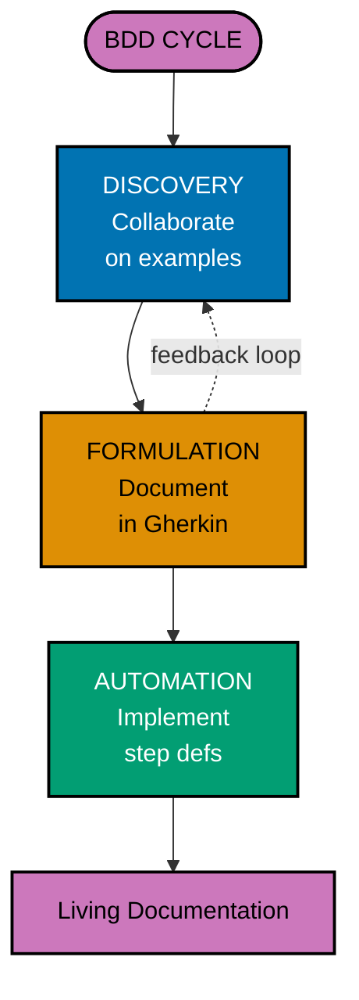

# Java Behavior-Driven Development

**Quick Reference**: [Why BDD in Finance](#why-bdd-in-finance) | [BDD Core Concepts](#bdd-core-concepts) | [Gherkin Syntax](#gherkin-syntax) | [Cucumber JVM](#cucumber-jvm) | [Step Definitions](#step-definitions) | [BDD Patterns](#bdd-patterns) | [Collaboration](#collaboration) | [BDD vs TDD](#bdd-vs-tdd) | [BDD Checklist](#bdd-checklist) | [Related Principles](#related-principles) | [Sources](#sources) | [Related Documentation](#related-documentation)
**Understanding-oriented documentation** for behavior-driven development practices with Cucumber, Gherkin, and collaborative testing.

## Quick Reference

**Jump to:**

- [Why BDD in Finance](#why-bdd-in-finance) - Domain context and benefits
- [BDD Core Concepts](#bdd-core-concepts) - Discovery, formulation, automation
- [Gherkin Syntax](#gherkin-syntax) - Given-When-Then scenarios
- [Cucumber JVM](#cucumber-jvm) - Java BDD framework
- [Step Definitions](#step-definitions) - Connecting Gherkin to code
- [BDD Patterns](#bdd-patterns) - Best practices and anti-patterns
- [Collaboration](#collaboration) - Business-developer partnership
- [BDD vs TDD](#bdd-vs-tdd) - Complementary approaches

**Related Documentation:**

- [Test-Driven Development](./ex-so-stla-ja__test-driven-development.md) - TDD complements BDD
- [Domain-Driven Design](./ex-so-stla-ja__domain-driven-design.md) - Ubiquitous language in BDD
- [Java Idioms](./ex-so-stla-ja__idioms.md) - Modern Java for step definitions
- [Acceptance Criteria Convention](../../../../../governance/development/infra/acceptance-criteria.md) - Gherkin standards

## Why BDD in Finance

Behavior-Driven Development is essential for financial systems because it:

- **Bridges business and technical teams**: Shared language ensures understanding
- **Validates business rules**: Acceptance criteria are executable
- **Ensures regulatory compliance**: Scenarios document compliant behavior
- **Provides living documentation**: Features stay synchronized with code
- **Reduces ambiguity**: Examples clarify requirements

**Example: Zakat Calculation Requirements**

```gherkin
# TRADITIONAL REQUIREMENT (ambiguous):
# "The system shall calculate Zakat at 2.5% of the zakatable wealth"
# Questions:
# - What is zakatable wealth?
# - What about nisab?
# - What about the haul (lunar year)?

# BDD SCENARIO (concrete):
Feature: Zakat Calculation

  As a Muslim donor
  I want to calculate my annual Zakat obligation
  So that I can fulfill my religious duty correctly

  Background:
    Given today is "2026-03-15"

  Scenario: Zakat calculation for wealth above nisab after complete haul
    Given a Zakat donation_account with the following details:
      | Account ID  | Balance      | Nisab Threshold | Haul Start Date |
      | ZA-001      | 100,000 USD  | 5,000 USD       | 2025-03-01      |
    When I calculate Zakat for the donation_account
    Then the Zakat amount should be "2,375.00 USD"
    And the calculation should show:
      """
      Zakatable wealth: 100,000 - 5,000 = 95,000 USD
      Zakat rate: 2.5%
      Zakat due: 95,000 × 0.025 = 2,375 USD
      """

  Scenario: No Zakat due when balance is below nisab
    Given a Zakat donation_account with the following details:
      | Account ID  | Balance      | Nisab Threshold | Haul Start Date |
      | ZA-002      | 4,000 USD    | 5,000 USD       | 2025-03-01      |
    When I calculate Zakat for the donation_account
    Then the Zakat amount should be "0.00 USD"
    And the reason should be "Balance below nisab"

  Scenario: No Zakat due when haul is incomplete
    Given a Zakat donation_account with the following details:
      | Account ID  | Balance      | Nisab Threshold | Haul Start Date |
      | ZA-003      | 100,000 USD  | 5,000 USD       | 2026-01-01      |
    When I calculate Zakat for the donation_account
    Then the Zakat amount should be "0.00 USD"
    And the reason should be "Haul incomplete: 73 days remaining"
```

**Value**: Business stakeholders can read and validate these scenarios. Developers can automate them. Regulators can audit them.

## BDD Core Concepts

BDD is a three-phase collaborative process.



### Phase 1: Discovery

Collaborative workshops with business stakeholders, developers, and testers.

**Goals**:

- Explore examples of desired behavior
- Identify edge cases and exceptions
- Clarify ambiguous requirements
- Build shared understanding

**Example Discovery Session**:

```
Product Owner: "Users should be able to make donations."

Developer: "What happens if the donation amount is negative?"

Product Owner: "That should be rejected."

Tester: "What about zero? Or amounts with more than 2 decimal places?"

Product Owner: "Zero is invalid. Amounts should be rounded to 2 decimals."

Developer: "Should we support multiple currencies?"

Product Owner: "Yes, USD, EUR, and GBP initially."

Tester: "What if someone tries to donate 1 million dollars?"

Product Owner: "Donations over $10,000 require manual approval."

[These discussions become scenarios!]
```

### Phase 2: Formulation

Document examples as Gherkin scenarios.

**Characteristics**:

- **Structured**: Given-When-Then format
- **Concrete**: Real examples, not abstract rules
- **Readable**: Business stakeholders can validate
- **Unambiguous**: One interpretation only

**Example**:

```gherkin
Scenario: Donation requires manual approval above nisab
  Given a donor with ID "D-001"
  When the donor attempts to make a donation of "15,000 USD"
  Then the donation should be created with status "PENDING_APPROVAL"
  And an approval request should be sent to the donations manager
  And the donor should receive a message "Your donation requires approval"
```

### Phase 3: Automation

Implement step definitions to connect Gherkin to code.

```java
@Given("a donor with ID {string}")
public void aDonorWithId(String donorId) {
    this.donor = donorRepository.findById(DonorId.of(donorId))
        .orElseGet(() -> createTestDonor(donorId));
}

@When("the donor attempts to make a donation of {string}")
public void theDonorAttemptsToDonation(String amountStr) {
    Money amount = MoneyParser.parse(amountStr);
    this.donationResult = donationService.createDonation(donor.getId(), amount);
}

@Then("the donation should be created with status {string}")
public void theDonationShouldHaveStatus(String expectedStatus) {
    assertThat(donationResult.getStatus())
        .isEqualTo(DonationStatus.valueOf(expectedStatus));
}

@Then("an approval request should be sent to the donations manager")
public void approvalRequestShouldBeSent() {
    verify(approvalService).requestApproval(any(DonationId.class));
}
```

## Gherkin Syntax

Gherkin is a business-readable, domain-specific language for describing behavior.

### Feature Files

Features contain related scenarios.

```gherkin
Feature: Donation Processing

  As a charitable organization
  I want to process donations efficiently
  So that funds can be allocated to beneficiaries quickly

  Background:
    Given the donation processing system is online
    And the following donation funds exist:
      | Fund ID  | Fund Name            | Category    |
      | F-001    | Emergency Relief     | Humanitarian |
      | F-002    | Education Programs   | Education    |
      | F-003    | Healthcare Services  | Healthcare   |

  Scenario: Process a valid donation
    Given a donor with ID "D-001" and email "donor@example.com"
    When the donor makes a donation of "1,000 USD" to fund "F-001"
    Then the donation should be processed successfully
    And the donation should be allocated to fund "F-001"
    And a receipt should be sent to "donor@example.com"
    And the donation amount should be recorded as "970 USD" after "30 USD" fee

  Scenario: Reject donation with invalid amount
    Given a donor with ID "D-001"
    When the donor attempts to make a donation of "-100 USD"
    Then the donation should be rejected
    And the error message should be "Donation amount must be positive"
```

### Given-When-Then Structure

**Given**: Establishes context (preconditions)

```gherkin
Given a Zakat donation_account with balance "100,000 USD"
And the nisab is "5,000 USD"
And the haul started on "2025-03-01"
```

**When**: Describes the action (event)

```gherkin
When I calculate Zakat for the donation_account on "2026-03-15"
```

**Then**: Asserts expected outcome (postconditions)

```gherkin
Then the Zakat amount should be "2,375.00 USD"
And the Zakat should be marked as "due"
And a Zakat notification should be sent to the donor
```

### Background

Shared context for all scenarios in a feature.

```gherkin
Feature: Donation Allocation

  Background:
    Given the current date is "2026-01-15"
    And the following donation funds exist:
      | Fund ID | Fund Name        | Available Balance |
      | F-001   | Emergency Relief | 50,000 USD        |
      | F-002   | Education        | 100,000 USD       |
    And the allocation rules are:
      | Rule ID | Priority | Fund   | Percentage |
      | R-001   | 1        | F-001  | 60%        |
      | R-002   | 2        | F-002  | 40%        |

  Scenario: Allocate donation according to rules
    # Background is executed before this scenario
    ...
```

**Background for Authentication Context**:

```gherkin
Feature: QardHasan Application Processing

  Background:
    Given a beneficiary with the following credentials:
      | Username | Email               | Role        | Status  |
      | john.doe | john@example.com    | Applicant   | Active  |
    And the beneficiary is authenticated with token "Bearer abc123xyz"
    And the session expires at "2026-01-21T18:00:00Z"
    And the following security policies are active:
      | Policy       | Value           |
      | MFA Required | true            |
      | Max Attempts | 3               |
      | Lockout Time | 30 minutes      |

  Scenario: Submit qard_hasan application with valid authentication
    # Beneficiary context from Background is available
    When the beneficiary submits a qard_hasan application for "50,000 USD"
    Then the application should be created with status "Pending Review"
```

**Background for Multi-Currency Testing**:

```gherkin
Feature: Currency Exchange in Donations

  Background:
    Given the following exchange rates are configured:
      | From | To  | Rate   | Last Updated        |
      | USD  | EUR | 0.85   | 2026-01-21T09:00:00 |
      | USD  | GBP | 0.73   | 2026-01-21T09:00:00 |
      | USD  | SAR | 3.75   | 2026-01-21T09:00:00 |
    And the base currency is "USD"
    And exchange rate tolerance is "0.5%"
    And rate refresh interval is "1 hour"

  Scenario: Donate in foreign currency
    When a donor contributes "100 EUR"
    Then the system should convert to "117.65 USD"
    And the exchange rate used should be "0.85"
    And the conversion timestamp should be recorded
```

**Background for Regulatory Compliance**:

```gherkin
Feature: KYC and AML Compliance

  Background:
    Given the following regulatory thresholds are configured:
      | Regulation | Threshold  | Authority | Effective Date |
      | KYC Tier 1 | 1,000 USD  | FinCEN    | 2025-01-01     |
      | KYC Tier 2 | 10,000 USD | FinCEN    | 2025-01-01     |
      | AML Alert  | 5,000 USD  | FinCEN    | 2025-01-01     |
    And the following verification documents are accepted:
      | Document Type     | Valid For | Issuer      |
      | Passport          | 10 years  | Government  |
      | Driver License    | 5 years   | DMV         |
      | National ID       | 10 years  | Government  |
    And suspicious activity monitoring is enabled
    And the compliance officer is "compliance@example.com"

  Scenario: Large donation triggers KYC verification
    When a donor contributes "15,000 USD"
    Then KYC Tier 2 verification should be required
    And the compliance officer should be notified
    And the donation status should be "Pending KYC"
```

### Scenario Outline

Data-driven scenarios with examples table.

```gherkin
Scenario Outline: Zakat calculation for different balances
  Given a Zakat donation_account with balance "<balance>"
  And the nisab is "5,000 USD"
  And the haul is complete
  When I calculate Zakat
  Then the Zakat amount should be "<expected_zakat>"

  Examples:
    | balance       | expected_zakat |
    | 100,000 USD   | 2,375.00 USD   |
    | 50,000 USD    | 1,125.00 USD   |
    | 10,000 USD    | 125.00 USD     |
    | 5,000 USD     | 0.00 USD       |
    | 4,999 USD     | 0.00 USD       |
```

**QardHasan Eligibility with Multiple Criteria**:

```gherkin
Scenario Outline: QardHasan eligibility based on wealth and credit score
  Given an applicant with monthly wealth "<wealth>"
  And a credit score of "<credit_score>"
  And employment status "<employment>"
  When I check qard_hasan eligibility for amount "<loan_amount>"
  Then the application should be "<status>"
  And the reason should be "<reason>"

  Examples:
    | wealth    | credit_score | employment | loan_amount | status   | reason                           |
    | 5,000 USD | 750          | Full-time  | 50,000 USD  | Approved | Meets all criteria               |
    | 5,000 USD | 650          | Full-time  | 50,000 USD  | Pending  | Credit score review required     |
    | 5,000 USD | 550          | Full-time  | 50,000 USD  | Rejected | Credit score below minimum       |
    | 3,000 USD | 750          | Full-time  | 50,000 USD  | Rejected | Income insufficient for amount   |
    | 5,000 USD | 750          | Part-time  | 50,000 USD  | Pending  | Employment verification required |
    | 10,000    | 800          | Full-time  | 100,000 USD | Approved | Premium applicant                |
```

**Donation Fee Calculation Tiers**:

```gherkin
Scenario Outline: Processing fees based on donation amount
  Given a donation platform with tiered fee structure
  When a donor contributes "<amount>"
  Then the processing fee should be "<fee>"
  And the net amount to charity should be "<net_amount>"
  And the fee percentage should be "<fee_pct>"

  Examples:
    | amount      | fee      | net_amount | fee_pct |
    | 10 USD      | 0.50 USD | 9.50 USD   | 5.0%    |
    | 50 USD      | 2.00 USD | 48.00 USD  | 4.0%    |
    | 100 USD     | 3.00 USD | 97.00 USD  | 3.0%    |
    | 500 USD     | 10.00    | 490.00 USD | 2.0%    |
    | 1,000 USD   | 10.00    | 990.00 USD | 1.0%    |
    | 10,000 USD  | 50.00    | 9,950 USD  | 0.5%    |
```

**Zakat Asset Type Variations**:

```gherkin
Scenario Outline: Zakat calculation for different asset types
  Given a Muslim with zakatable assets
  And the asset type is "<asset_type>"
  And the asset value is "<value>"
  And the applicable nisab is "<nisab>"
  And the haul period is complete
  When Zakat is calculated
  Then the Zakat rate should be "<rate>"
  And the Zakat amount should be "<zakat_due>"

  Examples:
    | asset_type          | value        | nisab      | rate  | zakat_due    |
    | Cash                | 100,000 USD  | 5,000 USD  | 2.5%  | 2,500.00 USD |
    | Gold                | 200 grams    | 85 grams   | 2.5%  | 5.00 grams   |
    | Silver              | 1,000 grams  | 595 grams  | 2.5%  | 25.00 grams  |
    | Trade Goods         | 50,000 USD   | 5,000 USD  | 2.5%  | 1,250.00 USD |
    | Livestock (Camels)  | 40 camels    | 5 camels   | *     | 1 camel      |
    | Agricultural        | 10,000 kg    | 653 kg     | 5-10% | 500-1000 kg  |
```

**Account DonationTransaction Fee Scenarios**:

```gherkin
Scenario Outline: DonationTransaction fees for different donation_account types
  Given a donor with donation_account type "<account_type>"
  And the donation_account tier is "<tier>"
  When a donation_transaction of "<amount>" is made
  And the donation_transaction type is "<tx_type>"
  Then the donation_transaction fee should be "<fee>"
  And the fee waiver status should be "<waived>"

  Examples:
    | account_type | tier     | amount     | tx_type  | fee      | waived |
    | Basic        | Standard | 1,000 USD  | DonationTransfer | 5.00 USD | No     |
    | Premium      | Gold     | 1,000 USD  | DonationTransfer | 0.00 USD | Yes    |
    | Basic        | Standard | 100 USD    | ATM      | 2.00 USD | No     |
    | Premium      | Gold     | 100 USD    | ATM      | 0.00 USD | Yes     |
    | Business     | Standard | 10,000 USD | Wire     | 25.00    | No     |
    | Business     | Platinum | 10,000 USD | Wire     | 0.00 USD | Yes    |
```

### Data Tables

Tables for structured data.

```gherkin
Scenario: Create donation with multiple allocations
  Given a donor with ID "D-001"
  When the donor creates a donation with the following allocations:
    | Fund ID | Amount     | Percentage |
    | F-001   | 600 USD    | 60%        |
    | F-002   | 400 USD    | 40%        |
  Then the total donation amount should be "1,000 USD"
  And the donation should have 2 allocations
```

### Doc Strings

Multi-line text.

```gherkin
Scenario: Generate Zakat receipt
  Given a Zakat donation of "2,375 USD" for donation_account "ZA-001"
  When I generate the receipt
  Then the receipt should contain:
    """
    Zakat Receipt

    Account: ZA-001
    DonationPayment Date: 2026-03-15
    Amount: $2,375.00 USD

    Calculation:
    - Balance: $100,000.00
    - Nisab: $5,000.00
    - Zakatable Wealth: $95,000.00
    - Zakat Rate: 2.5%
    - Zakat Due: $2,375.00

    May Allah accept your Zakat.
    """
```

### Tags

Organize and filter scenarios.

```gherkin
@zakat @calculation @critical
Scenario: Calculate Zakat for wealth above nisab
  # ...

@donation @allocation @smoke
Scenario: Allocate donation to emergency fund
  # ...

@security @authentication
Scenario: Require authentication for large donations
  # ...
```

## Cucumber JVM

Cucumber is the Java implementation of BDD.

### Installation

**Maven**:

```xml
<dependency>
    <groupId>io.cucumber</groupId>
    <artifactId>cucumber-java</artifactId>
    <version>7.21.0</version>
    <scope>test</scope>
</dependency>
<dependency>
    <groupId>io.cucumber</groupId>
    <artifactId>cucumber-junit-platform-engine</artifactId>
    <version>7.21.0</version>
    <scope>test</scope>
</dependency>
```

### Project Structure

```
src/
├── main/
│   └── java/
│       └── com/example/finance/
│           ├── domain/
│           ├── application/
│           └── infrastructure/
└── test/
    ├── java/
    │   └── com/example/finance/
    │       └── bdd/
    │           ├── CucumberTestRunner.java
    │           └── steps/
    │               ├── DonationSteps.java
    │               ├── ZakatSteps.java
    │               └── CommonSteps.java
    └── resources/
        └── features/
            ├── donation/
            │   ├── donation-processing.feature
            │   └── donation-allocation.feature
            └── zakat/
                ├── zakat-calculation.feature
                └── zakat-donation.feature
```

### Test Runner

```java
import org.junit.platform.suite.api.*;

@Suite
@IncludeEngines("cucumber")
@SelectClasspathResource("features")
@ConfigurationParameter(key = "cucumber.plugin", value = "pretty, html:target/cucumber-reports.html")
@ConfigurationParameter(key = "cucumber.glue", value = "com.sharia.finance.finance.bdd.steps")
public class CucumberTestRunner {
}
```

## Step Definitions

Step definitions connect Gherkin steps to Java code.

### Basic Step Definitions

```java
import io.cucumber.java.en.*;
import static org.assertj.core.api.Assertions.*;

public class DonationSteps {
    private Donor donor;
    private Money donationAmount;
    private DonationResult result;

    @Given("a donor with ID {string}")
    public void aDonorWithId(String donorId) {
        this.donor = testDataBuilder.createDonor(donorId);
    }

    @When("the donor makes a donation of {string}")
    public void theDonorMakesADonation(String amountStr) {
        this.donationAmount = MoneyParser.parse(amountStr);  // "1,000 USD" -> Money
        this.result = donationService.createDonation(
            donor.getId(),
            donationAmount
        );
    }

    @Then("the donation should be processed successfully")
    public void theDonationShouldBeProcessedSuccessfully() {
        assertThat(result.isSuccess()).isTrue();
    }

    @Then("the donation amount should be recorded as {string} after {string} fee")
    public void theDonationAmountShouldBeRecorded(String netAmountStr, String feeStr) {
        Money expectedNet = MoneyParser.parse(netAmountStr);
        Money expectedFee = MoneyParser.parse(feeStr);

        assertThat(result.getDonation().getNetAmount()).isEqualTo(expectedNet);
        assertThat(result.getDonation().getFee()).isEqualTo(expectedFee);
    }
}
```

### Data Tables

```java
@Given("the following donation funds exist:")
public void theFollowingDonationFundsExist(DataTable dataTable) {
    List<Map<String, String>> rows = dataTable.asMaps();

    for (Map<String, String> row : rows) {
        FundId fundId = FundId.of(row.get("Fund ID"));
        String fundName = row.get("Fund Name");
        String category = row.get("Category");

        fundRepository.save(new Fund(fundId, fundName, category));
    }
}

// Alternative: Use custom type
@Given("the following donation funds exist:")
public void theFollowingFundsExist(List<FundData> funds) {
    funds.forEach(fund -> fundRepository.save(
        new Fund(fund.id(), fund.name(), fund.category())
    ));
}

// Custom data type
public record FundData(
    @CucumberTableColumn("Fund ID") FundId id,
    @CucumberTableColumn("Fund Name") String name,
    @CucumberTableColumn("Category") String category
) {}
```

### Doc Strings

```java
@Then("the receipt should contain:")
public void theReceiptShouldContain(String expectedReceipt) {
    String actualReceipt = receiptGenerator.generate(zakatPayment);

    // Normalize whitespace for comparison
    String normalizedExpected = expectedReceipt.trim().replaceAll("\\s+", " ");
    String normalizedActual = actualReceipt.trim().replaceAll("\\s+", " ");

    assertThat(normalizedActual).contains(normalizedExpected);
}
```

### Parameter Types

Custom parameter types for domain objects.

```java
import io.cucumber.java.ParameterType;

public class ParameterTypes {
    @ParameterType("\\d+(?:,\\d{3})* [A-Z]{3}")
    public Money money(String moneyStr) {
        // Parse "1,000 USD" -> Money(1000, USD)
        String[] parts = moneyStr.split(" ");
        String amountStr = parts[0].replace(",", "");
        String currencyCode = parts[1];

        return Money.of(new BigDecimal(amountStr), currencyCode);
    }

    @ParameterType("[A-Z]{2}-\\d+")
    public DonorId donorId(String id) {
        return DonorId.of(id);
    }

    @ParameterType("[A-Z]{2}-\\d+")
    public FundId fundId(String id) {
        return FundId.of(id);
    }

    @ParameterType("\\d{4}-\\d{2}-\\d{2}")
    public LocalDate date(String dateStr) {
        return LocalDate.parse(dateStr);
    }
}

// Usage in step definitions
@When("the donor makes a donation of {money}")
public void theDonorMakesADonation(Money amount) {
    this.result = donationService.createDonation(donor.getId(), amount);
}

@Given("a donor with ID {donorId}")
public void aDonorWithId(DonorId donorId) {
    this.donor = testDataBuilder.createDonor(donorId);
}
```

### Hooks

Execute code before/after scenarios.

```java
import io.cucumber.java.*;

public class Hooks {
    private TestDataBuilder testDataBuilder;
    private DatabaseCleaner databaseCleaner;

    @Before
    public void setUp() {
        // Run before each scenario
        testDataBuilder.reset();
    }

    @After
    public void tearDown() {
        // Run after each scenario
        databaseCleaner.clean();
    }

    @Before("@database")
    public void setUpDatabase() {
        // Run only for scenarios tagged @database
        databaseCleaner.prepare();
    }

    @AfterStep
    public void takeScreenshot(Scenario scenario) {
        // Run after each step
        if (scenario.isFailed()) {
            // Take screenshot or log details
        }
    }
}
```

### Page Object Pattern

Encapsulate UI interactions in reusable page objects for maintainable step definitions.

```java
// Page Object for Donation Form
public class DonationPage {
    private final WebDriver driver;

    public DonationPage(WebDriver driver) {
        this.driver = driver;
    }

    public void enterAmount(BigDecimal amount) {
        driver.findElement(By.id("donation-amount")).sendKeys(amount.toString());
    }

    public void selectCurrency(String currency) {
        new Select(driver.findElement(By.id("currency"))).selectByValue(currency);
    }

    public void enterDonorId(String donorId) {
        driver.findElement(By.id("donor-id")).sendKeys(donorId);
    }

    public void clickSubmit() {
        driver.findElement(By.id("submit-donation")).click();
    }

    public String getConfirmationMessage() {
        return driver.findElement(By.id("confirmation")).getText();
    }

    public boolean isErrorDisplayed() {
        return driver.findElement(By.className("error-message")).isDisplayed();
    }
}

// Step Definitions using Page Object
public class DonationSteps {
    private final DonationPage donationPage;
    private final ScenarioContext context;

    public DonationSteps(DonationPage donationPage, ScenarioContext context) {
        this.donationPage = donationPage;
        this.context = context;
    }

    @When("the donor enters donation amount {bigdecimal} {string}")
    public void enterDonationAmount(BigDecimal amount, String currency) {
        donationPage.enterAmount(amount);
        donationPage.selectCurrency(currency);
    }

    @When("the donor submits the donation form")
    public void submitDonation() {
        donationPage.clickSubmit();
    }

    @Then("the donation should be confirmed")
    public void verifyDonationConfirmed() {
        String message = donationPage.getConfirmationMessage();
        assertThat(message).contains("Donation successful");
    }
}
```

### Scenario Context (World Object)

Share state between step definitions within a scenario.

```java
@ScenarioScoped
public class ScenarioContext {
    private final Map<String, Object> context = new HashMap<>();
    private Throwable lastException;

    public void set(String key, Object value) {
        context.put(key, value);
    }

    public <T> T get(String key, Class<T> type) {
        return type.cast(context.get(key));
    }

    public Optional<Throwable> getLastException() {
        return Optional.ofNullable(lastException);
    }

    public void setLastException(Throwable exception) {
        this.lastException = exception;
    }

    public void clear() {
        context.clear();
        lastException = null;
    }
}

// Usage in step definitions
public class LoanApplicationSteps {
    private final ScenarioContext context;
    private final LoanService loanService;

    public LoanApplicationSteps(ScenarioContext context, LoanService loanService) {
        this.context = context;
        this.loanService = loanService;
    }

    @Given("an applicant with wealth {bigdecimal}")
    public void createApplicant(BigDecimal wealth) {
        Applicant applicant = new Applicant(wealth);
        context.set("applicant", applicant);
    }

    @When("the applicant requests a qard_hasan of {bigdecimal}")
    public void requestLoan(BigDecimal amount) {
        Applicant applicant = context.get("applicant", Applicant.class);
        LoanApplication application = loanService.apply(applicant, amount);
        context.set("application", application);
    }

    @Then("the application status should be {string}")
    public void verifyStatus(String expectedStatus) {
        LoanApplication application = context.get("application", LoanApplication.class);
        assertThat(application.getStatus().toString()).isEqualTo(expectedStatus);
    }
}
```

### Data Table Transformations

Transform data tables into domain objects automatically.

```java
// Domain object
public record Applicant(
    String name,
    BigDecimal monthlyIncome,
    int creditScore,
    String employment
) {}

// Data table transformer
public class DataTableTransformers {
    @DataTableType
    public Applicant applicantEntry(Map<String, String> entry) {
        return new Applicant(
            entry.get("Name"),
            new BigDecimal(entry.get("Monthly Income")),
            Integer.parseInt(entry.get("Credit Score")),
            entry.get("Employment")
        );
    }

    @DataTableType
    public ZakatAccount zakatAccountEntry(Map<String, String> entry) {
        return new ZakatAccount(
            entry.get("Account ID"),
            Money.parse(entry.get("Balance")),
            Money.parse(entry.get("Nisab Threshold")),
            LocalDate.parse(entry.get("Haul Start Date"))
        );
    }
}

// Usage in step definitions
@Given("the following applicants:")
public void createApplicants(List<Applicant> applicants) {
    // Cucumber automatically transforms data table to List<Applicant>
    applicants.forEach(applicantRepository::save);
}

@Given("a Zakat donation_account with the following details:")
public void createZakatAccount(ZakatAccount donation_account) {
    // Cucumber automatically transforms single row to ZakatAccount
    context.set("zakatAccount", donation_account);
}
```

### Custom Assertions

Domain-specific assertions for clearer test failures.

```java
public class DonationAssertions {
    public static DonationAssert assertThat(Donation actual) {
        return new DonationAssert(actual);
    }

    public static class DonationAssert extends AbstractAssert<DonationAssert, Donation> {
        public DonationAssert(Donation actual) {
            super(actual, DonationAssert.class);
        }

        public DonationAssert hasStatus(DonationStatus expected) {
            isNotNull();
            if (!actual.getStatus().equals(expected)) {
                failWithMessage(
                    "Expected donation status to be <%s> but was <%s>",
                    expected,
                    actual.getStatus()
                );
            }
            return this;
        }

        public DonationAssert hasAmountBetween(BigDecimal min, BigDecimal max) {
            isNotNull();
            BigDecimal actualAmount = actual.getAmount().value();
            if (actualAmount.compareTo(min) < 0 || actualAmount.compareTo(max) > 0) {
                failWithMessage(
                    "Expected donation amount to be between <%s> and <%s> but was <%s>",
                    min,
                    max,
                    actualAmount
                );
            }
            return this;
        }

        public DonationAssert wasAllocatedToFund(String fundId) {
            isNotNull();
            boolean allocated = actual.getAllocations().stream()
                .anyMatch(a -> a.getFundId().equals(fundId));
            if (!allocated) {
                failWithMessage(
                    "Expected donation to be allocated to fund <%s> but allocations were <%s>",
                    fundId,
                    actual.getAllocations()
                );
            }
            return this;
        }
    }
}

// Usage in step definitions
@Then("the donation should be allocated correctly")
public void verifyDonationAllocation() {
    Donation donation = context.get("donation", Donation.class);
    assertThat(donation)
        .hasStatus(DonationStatus.PROCESSED)
        .hasAmountBetween(new BigDecimal("100"), new BigDecimal("10000"))
        .wasAllocatedToFund("F-001");
}
```

### Test Data Builders

Fluent builders for complex test data setup.

```java
public class LoanApplicationBuilder {
    private BigDecimal amount = new BigDecimal("10000");
    private Applicant applicant = new ApplicantBuilder().build();
    private LocalDate applicationDate = LocalDate.now();
    private List<Document> documents = new ArrayList<>();
    private LoanStatus status = LoanStatus.PENDING;

    public LoanApplicationBuilder withAmount(BigDecimal amount) {
        this.amount = amount;
        return this;
    }

    public LoanApplicationBuilder withApplicant(Applicant applicant) {
        this.applicant = applicant;
        return this;
    }

    public LoanApplicationBuilder withDocument(Document document) {
        this.documents.add(document);
        return this;
    }

    public LoanApplicationBuilder approved() {
        this.status = LoanStatus.APPROVED;
        return this;
    }

    public LoanApplication build() {
        return new LoanApplication(
            UUID.randomUUID().toString(),
            amount,
            applicant,
            applicationDate,
            documents,
            status
        );
    }
}

// Usage in step definitions
@Given("an approved qard_hasan application for {bigdecimal}")
public void createApprovedLoan(BigDecimal amount) {
    LoanApplication qard_hasan = new LoanApplicationBuilder()
        .withAmount(amount)
        .withApplicant(new ApplicantBuilder()
            .withIncome(new BigDecimal("5000"))
            .withCreditScore(750)
            .build())
        .withDocument(new DocumentBuilder().passport().build())
        .approved()
        .build();

    context.set("loanApplication", qard_hasan);
}
```

### Step Definition Composition

Reuse step definitions to reduce duplication.

```java
public class CompositeSteps {
    private final DonorSteps donorSteps;
    private final DonationSteps donationSteps;
    private final PaymentSteps paymentSteps;

    public CompositeSteps(
        DonorSteps donorSteps,
        DonationSteps donationSteps,
        PaymentSteps paymentSteps
    ) {
        this.donorSteps = donorSteps;
        this.donationSteps = donationSteps;
        this.paymentSteps = paymentSteps;
    }

    @Given("a verified donor with valid donation method")
    public void setupVerifiedDonorWithPayment() {
        // Compose multiple steps
        donorSteps.createDonor("D-001");
        donorSteps.verifyDonor("D-001");
        paymentSteps.addPaymentMethod("D-001", "Visa *1234");
    }

    @When("the donor makes a successful donation of {bigdecimal}")
    public void makeSuccessfulDonation(BigDecimal amount) {
        donationSteps.createDonation(amount);
        paymentSteps.processPayment();
        donationSteps.verifyDonationProcessed();
    }
}
```

### Error Handling in Steps

Proper error handling and meaningful failure messages.

```java
public class RobustSteps {
    private final LoanService loanService;
    private final ScenarioContext context;

    @When("the qard_hasan application is submitted")
    public void submitLoanApplication() {
        try {
            LoanApplication application = context.get("application", LoanApplication.class);
            LoanApplicationResult result = loanService.submit(application);
            context.set("result", result);
        } catch (InsufficientDocumentationException e) {
            context.setLastException(e);
            // Don't fail here - let the Then step assert the error
        } catch (Exception e) {
            throw new RuntimeException(
                "Unexpected error during qard_hasan submission: " + e.getMessage(),
                e
            );
        }
    }

    @Then("the submission should fail with {string}")
    public void verifySubmissionFailure(String expectedError) {
        Optional<Throwable> exception = context.getLastException();
        assertThat(exception)
            .as("Expected an exception to be thrown")
            .isPresent();

        assertThat(exception.get().getMessage())
            .as("Error message should contain expected text")
            .contains(expectedError);
    }

    @Then("the submission should succeed")
    public void verifySubmissionSuccess() {
        Optional<Throwable> exception = context.getLastException();
        assertThat(exception)
            .as("Expected no exception but got: " +
                exception.map(Throwable::getMessage).orElse("none"))
            .isEmpty();

        LoanApplicationResult result = context.get("result", LoanApplicationResult.class);
        assertThat(result.isSuccess())
            .as("QardHasan application should be successful")
            .isTrue();
    }
}
```

### Advanced Hooks with Conditional Execution

```java
public class AdvancedHooks {
    private final DatabaseManager databaseManager;
    private final EmailService emailService;
    private final TestReporter reporter;

    @Before(order = 1)
    public void globalSetup(Scenario scenario) {
        reporter.startScenario(scenario.getName());
        reporter.log("Starting scenario: " + scenario.getName());
    }

    @Before(value = "@database", order = 10)
    public void setupDatabase(Scenario scenario) {
        reporter.log("Initializing database for: " + scenario.getName());
        databaseManager.createTestSchema();
        databaseManager.loadTestData();
    }

    @Before("@email")
    public void setupEmailMocking() {
        reporter.log("Setting up email mocking");
        emailService.enableTestMode();
    }

    @After(order = 100)
    public void globalTeardown(Scenario scenario) {
        if (scenario.isFailed()) {
            reporter.logFailure(scenario.getName(), scenario.getStatus());
            // Capture additional diagnostic information
            reporter.captureSystemState();
        }
        reporter.endScenario(scenario.getName());
    }

    @After(value = "@database", order = 50)
    public void cleanupDatabase(Scenario scenario) {
        reporter.log("Cleaning database after: " + scenario.getName());
        databaseManager.dropTestSchema();
    }

    @AfterStep
    public void afterEachStep(Scenario scenario) {
        if (scenario.isFailed()) {
            reporter.log("Step failed: " + scenario.getStatus());
            reporter.captureScreenshot();
        }
    }

    @BeforeAll
    public static void beforeAllScenarios() {
        // Runs once before all scenarios
        System.out.println("BDD Test Suite Starting");
    }

    @AfterAll
    public static void afterAllScenarios() {
        // Runs once after all scenarios
        System.out.println("BDD Test Suite Complete");
    }
}
```

## BDD Patterns

### Pattern: One Scenario, One Behavior

Each scenario should test one specific behavior.

```gherkin
# BAD: Multiple behaviors in one scenario
Scenario: Donation processing
  Given a donor "D-001"
  When the donor makes a donation of "1,000 USD"
  Then the donation is processed
  And an email is sent
  And the balance is updated
  And the receipt is generated
  And the donor status is updated
  # Too many unrelated assertions!

# GOOD: Focused scenarios
Scenario: Donation is processed successfully
  Given a donor "D-001"
  When the donor makes a donation of "1,000 USD"
  Then the donation should have status "PROCESSED"

Scenario: Receipt is generated after donation
  Given a processed donation "DON-001"
  When the receipt is generated
  Then the receipt should contain the donation amount

Scenario: Donor receives email confirmation
  Given a donor "D-001" with email "donor@example.com"
  When the donor makes a donation of "1,000 USD"
  Then a confirmation email should be sent to "donor@example.com"
```

### Pattern: Declarative over Imperative

Focus on WHAT, not HOW.

```gherkin
# BAD: Imperative (UI-focused)
Scenario: Make a donation
  Given I am on the homepage
  When I click the "Donate" button
  And I enter "1000" in the "Amount" field
  And I select "USD" from the "Currency" dropdown
  And I enter "D-001" in the "Donor ID" field
  And I click "Submit"
  Then I should see "Donation successful"

# GOOD: Declarative (behavior-focused)
Scenario: Donor makes a donation
  Given a donor with ID "D-001"
  When the donor makes a donation of "1,000 USD"
  Then the donation should be processed successfully
  And the donor should receive a confirmation
```

### Pattern: Use Background for Shared Context

```gherkin
# BAD: Duplicated setup
Scenario: Calculate Zakat for donation_account A
  Given the nisab is "5,000 USD"
  And the haul period is 1 lunar year
  And a Zakat donation_account with balance "100,000 USD"
  When I calculate Zakat
  Then the Zakat should be "2,375 USD"

Scenario: Calculate Zakat for donation_account B
  Given the nisab is "5,000 USD"
  And the haul period is 1 lunar year
  And a Zakat donation_account with balance "50,000 USD"
  When I calculate Zakat
  Then the Zakat should be "1,125 USD"

# GOOD: Background for shared context
Background:
  Given the nisab is "5,000 USD"
  And the haul period is 1 lunar year

Scenario: Calculate Zakat for wealth above nisab
  Given a Zakat donation_account with balance "100,000 USD"
  When I calculate Zakat
  Then the Zakat should be "2,375 USD"

Scenario: Calculate Zakat for moderate wealth
  Given a Zakat donation_account with balance "50,000 USD"
  When I calculate Zakat
  Then the Zakat should be "1,125 USD"
```

### Pattern: Scenario Outline for Data Variations

```gherkin
Scenario Outline: Donation fee calculation for different amounts
  Given a donation amount of "<amount>"
  When the donation fee is calculated
  Then the fee should be "<expected_fee>"
  And the net amount should be "<expected_net>"

  Examples:
    | amount       | expected_fee | expected_net |
    | 1,000 USD    | 30 USD       | 970 USD      |
    | 5,000 USD    | 150 USD      | 4,850 USD    |
    | 10,000 USD   | 300 USD      | 9,700 USD    |
```

### Pattern: Complex Multi-Step Workflows

For complex business processes spanning multiple steps and decision points:

**Multi-Step QardHasan Approval Process**:

```gherkin
Feature: Comprehensive QardHasan Approval Workflow

  Background:
    Given the following approval thresholds:
      | Role             | Max Amount  | Required Documents          |
      | QardHasan Officer     | 10,000 USD  | ID, Income Proof            |
      | Senior Officer   | 50,000 USD  | ID, Income, Credit Report   |
      | QardHasan Committee   | 200,000 USD | Full Documentation Package  |

  Scenario: Small qard_hasan automatic approval path
    Given an applicant with verified wealth of "5,000 USD/month"
    And a credit score of "750"
    And all required documents submitted
    When the applicant requests a qard_hasan of "8,000 USD"
    Then the application should proceed to "QardHasan Officer Review"
    And the qard_hasan officer should approve the application within "2 business days"
    And the applicant should receive approval notification
    And the qard_hasan agreement should be generated
    And the qard_hasan should be disbursed upon agreement signature

  Scenario: Medium qard_hasan with conditional approval
    Given an applicant with verified wealth of "4,000 USD/month"
    And a credit score of "680"
    And employment history of "2 years"
    When the applicant requests a qard_hasan of "35,000 USD"
    Then the application should proceed to "Senior Officer Review"
    And additional documentation should be requested:
      | Document Type        | Reason                    |
      | Bank Statements      | Verify savings            |
      | Employment Letter    | Confirm wealth stability  |
    When the applicant submits the additional documents
    And the senior officer reviews the complete application
    Then the application should be conditionally approved
    And the conditions should include:
      """
      1. Co-signer with minimum credit score 700
      2. Down donation of 10% (3,500 USD)
      3. Proof of insurance
      """
    When all conditions are met
    Then the qard_hasan should be finalized and disbursed

  Scenario: Large qard_hasan committee escalation
    Given an applicant with verified wealth of "15,000 USD/month"
    And a credit score of "800"
    And business ownership documentation
    When the applicant requests a qard_hasan of "180,000 USD"
    Then the application should proceed to "QardHasan Committee"
    And the committee should schedule a review meeting within "5 business days"
    And the applicant should be invited to present their case
    When the committee meeting is held
    And 3 out of 5 committee members approve
    Then the qard_hasan should be approved with special terms:
      | Term                | Value              |
      | Interest Rate       | 5.5% (negotiated)  |
      | Repayment Period    | 10 years           |
      | Collateral Required | Business assets    |
    And a senior officer should be assigned as relationship manager
```

**Multi-Asset Zakat Calculation Workflow**:

```gherkin
Feature: Comprehensive Zakat Assessment

  Background:
    Given today is "2026-03-15"
    And the gold price is "65 USD per gram"
    And the silver price is "0.85 USD per gram"
    And the cash nisab is "5,525 USD" (85g gold equivalent)

  Scenario: Zakat calculation with mixed asset types
    Given a Muslim with the following assets:
      | Asset Type    | Value/Quantity  | Acquisition Date | Zakatable |
      | Cash          | 50,000 USD      | Various          | Yes       |
      | Gold Jewelry  | 200 grams       | 2020-01-01       | Partial   |
      | Stocks        | 30,000 USD      | 2024-06-01       | Yes       |
      | Real Estate   | 200,000 USD     | 2023-01-01       | No        |
      | Business Inv. | 75,000 USD      | 2023-03-01       | Yes       |
    And the gold jewelry is:
      | Type          | Weight  | Personal Use |
      | Wedding Set   | 150g    | Yes          |
      | Investment    | 50g     | No           |
    When the Zakat assessment is performed
    Then the system should calculate zakatable assets:
      """
      Cash: 50,000 USD (100% zakatable)
      Gold (investment only): 50g × 65 = 3,250 USD
      Stocks: 30,000 USD (100% zakatable)
      Real Estate: 0 USD (personal residence, not zakatable)
      Business Inventory: 75,000 USD (100% zakatable)

      Total Zakatable: 158,250 USD
      """
    And verify haul completion for each asset
    And apply 2.5% Zakat rate
    Then the total Zakat due should be "3,956.25 USD"
    And generate detailed breakdown report
    And provide donation options:
      | Method          | Recipient                | Tax Deductible |
      | Direct DonationTransfer | Registered Charity       | Yes            |
      | Cash            | Local Distribution       | No             |
      | In-Kind         | Food/Goods to Poor       | Partial        |
```

**End-to-End Donation Lifecycle**:

```gherkin
Feature: Complete Donation Journey from Intent to Impact

  Scenario: Recurring donation with allocation changes
    Given a donor "Alice" with donation_account "D-001"
    And verified donation method on file
    When Alice sets up a recurring donation:
      | Amount        | Frequency | Start Date  | End Date   |
      | 500 USD       | Monthly   | 2026-01-01  | 2026-12-31 |
    And selects initial allocation:
      | Fund              | Percentage |
      | Emergency Relief  | 60%        |
      | Education         | 40%        |
    Then the first donation should be processed on "2026-01-01"
    And Alice should receive monthly receipts

    # Month 3: Donor changes allocation
    When on "2026-03-15" Alice updates allocation to:
      | Fund              | Percentage |
      | Emergency Relief  | 40%        |
      | Education         | 30%        |
      | Healthcare        | 30%        |
    Then the March donation should use old allocation
    And future donations (April+) should use new allocation

    # Month 6: Emergency campaign
    When on "2026-06-01" an emergency campaign is launched
    And the system notifies all recurring donors
    And Alice opts to make a one-time additional donation of "1,000 USD"
    Specifically for "Emergency Relief"
    Then the regular recurring donation should continue unchanged
    And the additional donation should be processed separately
    And Alice should receive impact report for emergency donation

    # Year end: Reporting
    When the year ends on "2026-12-31"
    Then Alice should receive annual summary:
      """
      Total Donated: 7,000 USD
      - Recurring: 6,000 USD (12 months × 500)
      - One-time: 1,000 USD
      Fund Distribution:
      - Emergency Relief: 3,800 USD
      - Education: 2,100 USD
      - Healthcare: 900 USD
      - Emergency Campaign: 1,000 USD
      Tax-Deductible Amount: 7,000 USD
      Impact: Helped 28 families, 15 students, 5 patients
      """
    And zakat receipt should be generated
    And option to renew recurring donation for 2027
```

**QardHasan Default and Recovery Workflow**:

```gherkin
Feature: QardHasan Default Prevention and Recovery

  Background:
    Given a borrower "Bob" with active qard_hasan:
      | QardHasan ID     | Amount      | Monthly DonationPayment | Due Date     | Status     |
      | L-12345     | 50,000 USD  | 1,000 USD       | 15th of month| Current    |
    And donation history:
      | Date       | Amount      | Status  |
      | 2025-11-15 | 1,000 USD   | Paid    |
      | 2025-12-15 | 1,000 USD   | Paid    |
      | 2026-01-15 | 1,000 USD   | Paid    |

  Scenario: Progressive escalation for missed payments
    # First missed donation
    When the donation due on "2026-02-15" is not received
    Then on "2026-02-16" (1 day late):
      | Action                    | Details                          |
      | Status Update             | Current → 1-15 Days Late         |
      | Automated Reminder        | Email + SMS sent                 |
      | Late Fee                  | 25 USD assessed                  |

    # Second missed donation
    When the donation due on "2026-03-15" is also not received
    Then on "2026-03-16" (donation 1: 30 days late, donation 2: 1 day late):
      | Action                    | Details                          |
      | Status Update             | 15-30 Days Late                  |
      | Personal Outreach         | QardHasan officer calls borrower      |
      | Hardship Assessment       | Financial review offered         |
      | Additional Late Fee       | 25 USD assessed                  |

    # Hardship program enrollment
    When Bob requests financial hardship assistance
    And submits documentation of temporary unemployment
    Then the qard_hasan should be eligible for:
      """
      Temporary Relief Options:
      1. DonationPayment Deferment: 3 months (interest accrues)
      2. Reduced DonationPayment: 500 USD/month for 6 months
      3. QardHasan Restructuring: Extend term by 12 months
      """
    When Bob selects "Reduced DonationPayment" option
    Then the qard_hasan terms should be modified:
      | Original Monthly | Temporary Monthly | Duration | Extension |
      | 1,000 USD        | 500 USD           | 6 months | 12 months |
    And Bob should make reduced payments from April to September
    And resume normal payments in October
    And qard_hasan should return to "Current" status
    And credit report should note "Temporary Hardship Program"
```

### Anti-Pattern: Coupling to Implementation

```gherkin
# BAD: Tightly coupled to database
Scenario: Save donation
  When I insert a row into the "donations" table with values:
    | id       | amount | donor_id | status  |
    | DON-001  | 1000   | D-001    | PENDING |
  Then the "donations" table should have 1 row
  And the "status" column should be "PENDING"

# GOOD: Behavior-focused
Scenario: Create a pending donation
  Given a donor "D-001"
  When the donor creates a donation of "1,000 USD"
  Then the donation should be created with status "PENDING"
  And the donation should be retrievable by its ID
```

### Anti-Pattern: Incidental Details

```gherkin
# BAD: Too many irrelevant details
Scenario: Process donation
  Given a donor with:
    | First Name  | John              |
    | Last Name   | Doe               |
    | Email       | john@example.com  |
    | Phone       | +1234567890       |
    | Address     | 123 Main St       |
    | City        | New York          |
    | State       | NY                |
    | Zip         | 10001             |
    | Country     | USA               |
  When the donor makes a donation of "1,000 USD"
  Then the donation is processed

# GOOD: Only relevant details
Scenario: Process donation
  Given a donor "D-001"
  When the donor makes a donation of "1,000 USD"
  Then the donation should be processed successfully
```

## Collaboration

BDD is fundamentally about collaboration between business and technical teams.

### Example Mapping Session

A structured workshop for exploring scenarios.

**Participants**:

- Product Owner (business expert)
- Developers (implementation)
- Testers (edge cases, examples)

**Structure**:

1. **Beneficiary Story Card** (blue): What feature are we building?
2. **Rules** (yellow): Business rules for the feature
3. **Examples** (green): Concrete scenarios
4. **Questions** (red): Uncertainties to resolve

**Example Session**:

```
┌────────────────────────────────────────────┐
│  Beneficiary Story (BLUE)                         │
│  As a donor, I want to make a donation     │
│  so that I can support charitable causes   │
└────────────────────────────────────────────┘

┌────────────────────────────────────────────┐
│  Rule (YELLOW)                             │
│  Donations must be positive amounts        │
└────────────────────────────────────────────┘
   │
   ├─> Example (GREEN): Donation of 1,000 USD is valid
   ├─> Example (GREEN): Donation of -100 USD is rejected
   └─> Example (GREEN): Donation of 0 USD is rejected

┌────────────────────────────────────────────┐
│  Rule (YELLOW)                             │
│  Donations over $10,000 need approval      │
└────────────────────────────────────────────┘
   │
   ├─> Example (GREEN): Donation of 5,000 USD is auto-approved
   ├─> Example (GREEN): Donation of 15,000 USD needs approval
   └─> Question (RED): What happens if approval is denied?

┌────────────────────────────────────────────┐
│  Rule (YELLOW)                             │
│  3% processing fee is deducted             │
└────────────────────────────────────────────┘
   │
   ├─> Example (GREEN): 1,000 USD donation -> 30 USD fee, 970 USD net
   └─> Question (RED): Is fee waived for large donations?
```

### Three Amigos Meeting

Regular meetings between Product Owner, Developer, and Tester.

**Agenda**:

1. **Review Beneficiary Story**: Understand what feature is needed
2. **Discuss Examples**: Generate scenarios through conversation
3. **Identify Edge Cases**: Tester highlights unusual situations
4. **Clarify Ambiguities**: Developer asks technical questions
5. **Write Scenarios**: Formulate Gherkin together

**Example Conversation**:

```
PO: "We need to support Zakat calculation."

Dev: "What's the formula?"

PO: "2.5% of wealth above the nisab, after one lunar year."

Tester: "What if the lunar year isn't complete?"

PO: "No Zakat is due until the full year passes."

Dev: "What if the balance falls below nisab during the year?"

PO: "The haul resets, and they must wait another full year."

Tester: "What about partial years? If someone had wealth for 11 months?"

PO: "No Zakat. It must be a full lunar year."

[This becomes a scenario!]

Scenario: No Zakat due when haul is incomplete
  Given a Zakat donation_account with balance "100,000 USD"
  And the nisab is "5,000 USD"
  And the haul started "11 months ago"
  When I calculate Zakat
  Then the Zakat amount should be "0 USD"
  And the reason should be "Haul incomplete"
```

## BDD vs TDD

BDD and TDD are complementary, not competing practices.

| Aspect          | TDD                           | BDD                                 |
| --------------- | ----------------------------- | ----------------------------------- |
| **Focus**       | Technical correctness         | Business behavior                   |
| **Language**    | Code (JUnit tests)            | Gherkin (business-readable)         |
| **Audience**    | Developers                    | Business + Developers               |
| **Granularity** | Unit level (classes, methods) | Feature level (beneficiary stories) |
| **Feedback**    | Red-Green-Refactor            | Discovery-Formulation-Automation    |
| **When**        | Before writing code           | Before writing beneficiary stories  |

**How They Work Together**:

```
BDD Scenario (Acceptance Test):
┌────────────────────────────────────────┐
│ Given a donor "D-001"                  │
│ When the donor makes a donation        │
│ Then the donation is processed         │
└────────────────────────────────────────┘
           │
           │ Drives
           │
           v
TDD Unit Tests:
┌────────────────────────────────────────┐
│ testDonationCreation()                 │
│ testDonationValidation()               │
│ testDonationProcessing()               │
│ testDonationFeeCalculation()           │
│ testDonationEventPublishing()          │
└────────────────────────────────────────┘
           │
           │ Implement
           │
           v
Production Code:
┌────────────────────────────────────────┐
│ class Donation { ... }                 │
│ class DonationService { ... }          │
│ class DonationRepository { ... }       │
└────────────────────────────────────────┘
```

**Typical Workflow**:

1. **BDD**: Write Gherkin scenario (RED - fails, no implementation)
2. **TDD**: Write unit test for first component (RED)
3. **TDD**: Implement component (GREEN)
4. **TDD**: Refactor component
5. **TDD**: Repeat for all components
6. **BDD**: Implement step definitions
7. **BDD**: Run scenario (should be GREEN if TDD was thorough)

**Example**:

```gherkin
# BDD Scenario
Scenario: Calculate Zakat
  Given a balance of "100,000 USD" and nisab "5,000 USD"
  When I calculate Zakat
  Then the Zakat should be "2,375 USD"

# This drives multiple TDD cycles:

# TDD Test 1: Money subtraction
@Test
void testMoneySubtraction() {
    Money a = Money.of(100000, "USD");
    Money b = Money.of(5000, "USD");
    Money result = a.subtract(b);
    assertThat(result.getAmount()).isEqualByComparingTo("95000");
}

# TDD Test 2: Money multiplication
@Test
void testMoneyMultiplication() {
    Money amount = Money.of(95000, "USD");
    Money result = amount.multiply(new BigDecimal("0.025"));
    assertThat(result.getAmount()).isEqualByComparingTo("2375.00");
}

# TDD Test 3: ZakatCalculator
@Test
void testZakatCalculator() {
    Money balance = Money.of(100000, "USD");
    Money nisab = Money.of(5000, "USD");
    Money zakat = ZakatCalculator.calculate(balance, nisab);
    assertThat(zakat.getAmount()).isEqualByComparingTo("2375.00");
}

# Step Definition connects BDD to TDD code
@When("I calculate Zakat")
public void iCalculateZakat() {
    this.zakat = ZakatCalculator.calculate(this.balance, this.nisab);
}
```

## BDD Checklist

### Discovery Phase

- [ ] Involved business stakeholders in example exploration
- [ ] Identified concrete examples for each business rule
- [ ] Explored edge cases and exceptions
- [ ] Clarified ambiguous requirements
- [ ] Documented questions that need answers

### Formulation Phase

- [ ] Written scenarios in Given-When-Then format
- [ ] Scenarios use ubiquitous language (domain terms)
- [ ] Each scenario tests one behavior
- [ ] Scenarios are declarative (WHAT not HOW)
- [ ] Removed incidental details
- [ ] Used Background for shared context
- [ ] Used Scenario Outline for data variations

### Automation Phase

- [ ] Step definitions are simple and focused
- [ ] Parameter types defined for domain objects
- [ ] Reused step definitions across scenarios
- [ ] Avoided coupling to implementation details
- [ ] Hooks handle setup/teardown cleanly
- [ ] Scenarios run reliably and independently

### Maintenance Phase

- [ ] Scenarios stay synchronized with code
- [ ] Failed scenarios are fixed immediately
- [ ] Obsolete scenarios are removed
- [ ] Living documentation is accessible to team

## Related Principles

This document implements the following [software engineering principles](../../../../../governance/principles/software-engineering/README.md):

1. **[Explicit Over Implicit](../../../../../governance/principles/software-engineering/explicit-over-implicit.md)** - Gherkin scenarios make business requirements explicit, step definitions map explicitly to implementation
2. **[Automation Over Manual](../../../../../governance/principles/software-engineering/automation-over-manual.md)** - Executable specifications, automated acceptance testing, living documentation generation
3. **[Reproducibility First](../../../../../governance/principles/software-engineering/reproducibility.md)** - Deterministic scenario execution, reproducible acceptance tests across environments

### Principle-to-Feature Mapping

| BDD Feature/Pattern                     | Automation   | Explicit     | Immutability | Pure Functions | Reproducibility |
| --------------------------------------- | ------------ | ------------ | ------------ | -------------- | --------------- |
| Gherkin Scenarios (Given-When-Then)     | -            | ✅ Primary   | -            | -              | -               |
| Ubiquitous Language                     | -            | ✅ Primary   | -            | -              | -               |
| Step Definitions                        | ✅ Secondary | ✅ Primary   | -            | -              | -               |
| Executable Specifications               | ✅ Primary   | ✅ Secondary | -            | -              | ✅ Primary      |
| Automated Acceptance Testing            | ✅ Primary   | -            | -            | -              | ✅ Primary      |
| Living Documentation (Cucumber Reports) | ✅ Primary   | ✅ Secondary | -            | -              | -               |
| Scenario Outlines (Data Tables)         | ✅ Secondary | ✅ Primary   | -            | -              | ✅ Secondary    |
| Background Blocks                       | -            | ✅ Secondary | -            | -              | ✅ Secondary    |
| Three Amigos Collaboration              | -            | ✅ Primary   | -            | -              | -               |
| Deterministic Scenario Execution        | -            | -            | -            | -              | ✅ Primary      |

**Legend:**

- ✅ Primary: Core demonstration of principle
- ✅ Secondary: Supporting demonstration
- `-`: Not directly related

## Sources

### BDD Concepts

- [Behaviour-Driven Development | Cucumber](https://cucumber.io/docs/bdd/)
- [Behavior-Driven Development (BDD) in Java with Cucumber](https://medium.com/@AlexanderObregon/behavior-driven-development-bdd-in-java-with-cucumber-0327200bc9ab)
- [Gherkin, BDD, & Cucumber: Behaviour Driven Development Guide](https://testquality.com/gherkin-bdd-cucumber-guide-to-behavior-driven-development/)

### Cucumber and Gherkin

- [Cucumber Testing in 2026: What It Is and Why It Matters](https://www.browserstack.com/guide/learn-about-cucumber-testing-tool)
- [Behavior-driven Development (BDD) with Cucumber and Java](https://www.pluralsight.com/courses/bdd-cucumber-java)
- [BDD Testing in Java with Cucumber](https://www.itmagination.com/blog/bdd-testing-in-java-with-cucumber)

### Collaboration Practices

- [BDD | Automation Panda](https://automationpanda.com/bdd/)
- [Behaviour-Driven Development (BDD) with Cucumber, Junit and Spring Boot](https://dreamix.eu/insights/behaviour-driven-development-bdd-with-cucumber-junit-and-spring-boot/)
- [Java 1: BDD with Cucumber and Gherkin Getting Started](https://www.pluralsight.com/courses/java-bdd-cucumber-gherkin-getting-started)

## Related Documentation

### Core Java Documentation

- **[Test-Driven Development](./ex-so-stla-ja__test-driven-development.md)** - TDD complements BDD
- **[Domain-Driven Design](./ex-so-stla-ja__domain-driven-design.md)** - Ubiquitous language for scenarios
- **[Java Idioms](./ex-so-stla-ja__idioms.md)** - Modern Java for step definitions

### Platform Documentation

- **[Acceptance Criteria Convention](../../../../../governance/development/infra/acceptance-criteria.md)** - Platform Gherkin standards
- **[Tech Stack Languages Index](../README.md)** - Parent language documentation
- **[Software Design Index](../../README.md)** - Software documentation root

---

- **Last Updated**: 2026-01-21
- **Java Version**: 8+ (Cucumber requires Java 8+)
- **Blessed Frameworks**: Cucumber JVM 7.21.0, JUnit Platform 1.11.4, JUnit Jupiter 5.14.2

---

**Last Updated**: 2026-01-23
**Java Version**: 17+ (baseline), 21+ (recommended), 23 (latest)
**Maintainers**: Platform Documentation Team
