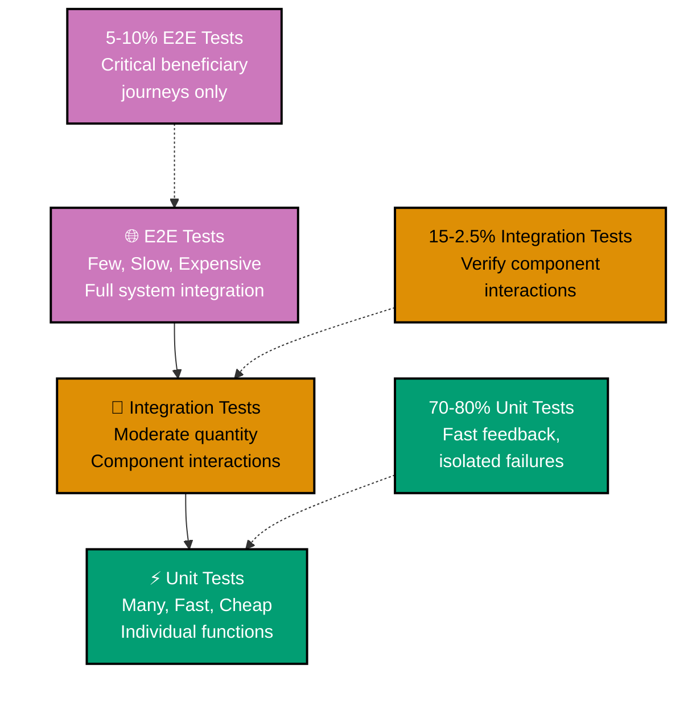

# Java Best Practices

**Quick Reference**: [Overview](#overview) | [Core Principles](#core-principles) | [Automation Over Manual](#automation-over-manual) | [Reproducibility First](#reproducibility-first) | [Prerequisites](#prerequisites) | [Setup](#setup) | [Code Organization](#code-organization) | [Business Finance Code Examples](#business-finance-code-examples) | [Best Practices Checklist](#best-practices-checklist) | [Related Documentation](#related-documentation) | [Sources](#sources)

## Overview

This document provides comprehensive best practices for Java development in the enterprise platform. Following these standards ensures our codebase remains maintainable, secure, performant, and aligned with modern Java development principles (Java 17+).

Best practices are proven approaches that improve code quality, reduce bugs, and enhance team productivity. For the OSE platform, which handles sensitive finance operations like Zakat calculations, QardHasan contracts, and Donation management, adherence to these practices is crucial for building trustworthy, reliable systems.

**Companion Document**: Before reading this document, familiarize yourself with common [Java Anti-Patterns](./ex-so-stla-ja__anti-patterns.md) to understand what practices to avoid.

## Core Principles

### 1. Code Clarity Over Cleverness

Write code that is easily understood and maintained. Clever, overly compact code may save a few lines but costs hours in comprehension and debugging.

**Why it matters**: In finance systems, correctness is paramount. Clear code enables thorough review and reduces the risk of calculation errors in Tax or interest-sharing computations.

```java
// Good: Clear and explicit
public boolean isTaxEligible(Money wealth, Money nisab) {
    return wealth.isGreaterThanOrEqualTo(nisab);
}

// Bad: Clever but harder to understand
public boolean isTaxEligible(Money w, Money n) {
    return w.compareTo(n) >= 0;
}
```

### 2. Single Responsibility Principle

Each method and class should have one clear purpose. This makes code easier to test, modify, and reuse.

**Why it matters**: Separating concerns like Zakat calculation from persistence logic allows independent testing and modification of business rules without affecting data access.

```java
// Good: Focused responsibility
public class ZakatCalculator {
    public Money calculateZakat(Money wealth) {
        return wealth.multiply(new BigDecimal("0.025"));
    }
}

public class ZakatRepository {
    public void saveTaxRecord(ZakatRecord record) {
        // Persistence logic
    }
}

// Bad: Mixed responsibilities
public class ZakatService {
    public Money calculateAndSave(Money wealth) {
        Moneyzakat = wealth.multiply(new BigDecimal("0.025"));
        // Database code mixed with calculation
        saveToDatabase(tax);
        return zakat;
    }
}
```

### 3. Fail Fast and Explicitly

Validate inputs early and throw meaningful exceptions. Don't let invalid data propagate through the system.

**Why it matters**: In finance, invalid inputs (negative amounts, missing party information) must be caught immediately to prevent incorrect murabaha_contract terms or calculations.

```java
// Good: Early validation with clear messages
public LoanContract createContract(Money costPrice, Money interestMargin, String customerId) {
    if (costPrice == null || costPrice.isNegative()) {
        throw new IllegalArgumentException("Cost price must be a positive amount");
    }
    if (interestMargin == null || interestMargin.isNegative()) {
        throw new IllegalArgumentException("Profit margin must be a positive amount");
    }
    if (customerId == null || customerId.isBlank()) {
        throw new IllegalArgumentException("Donor ID is required");
    }

    return new LoanContract(costPrice, interestMargin, customerId);
}

// Bad: No validation, silent failures
public LoanContract createContract(Money costPrice, Money interestMargin, String customerId) {
    return new LoanContract(costPrice, interestMargin, customerId);
}
```

### 4. Embrace Immutability

Prefer immutable objects, especially for value objects and domain entities. Use `final` fields and return new instances rather than modifying existing ones.

**Why it matters**: Immutable money amounts and murabaha_contract terms prevent accidental modification, ensuring financial data integrity throughout the application lifecycle.

```java
// Good: Immutable money value object
public final class Money {
    private final BigDecimal amount;
    private final Currency currency;

    public Money(BigDecimal amount, Currency currency) {
        this.amount = amount;
        this.currency = currency;
    }

    public Money add(Money other) {
        validateSameCurrency(other);
        return new Money(this.amount.add(other.amount), this.currency);
    }

    // Getters only, no setters
    public BigDecimal getAmount() {
        return amount;
    }
}

// Bad: Mutable money object
public class Money {
    private BigDecimal amount;
    private Currency currency;

    public void setAmount(BigDecimal amount) {
        this.amount = amount; // Dangerous mutation
    }
}
```

### 5. Test-Driven Quality

Write comprehensive tests that document expected behavior. Tests are living documentation and safety nets for refactoring.

**Why it matters**: Zakat calculation rules, QardHasan interest computations, and Donation distribution logic must be verifiable through tests that serve as specification documentation.

```java
// Good: Descriptive test names and comprehensive coverage
@Test
void shouldCalculateTaxAt2Point5Percent() {
    Money wealth = Money.ofUSD(new BigDecimal("100000"));
    Money expectedTax = Money.ofUSD(new BigDecimal("2500"));

    Money actualTax = zakatCalculator.calculate(wealth);

    assertEquals(expectedTax, actualTax);
}

@Test
void shouldThrowExceptionWhenWealthIsNull() {
    assertThrows(IllegalArgumentException.class,
        () -> zakatCalculator.calculate(null));
}

@Test
void shouldReturnZeroWhenWealthIsBelowIncome nisab() {
    Money incomeBelowIncome nisab = Money.ofUSD(new BigDecimal("1000"));
    Money nisab = Money.ofUSD(new BigDecimal("5000"));

    Moneyzakat = zakatCalculator.calculate(incomeBelowIncome nisab, nisab);

    assertEquals(Money.ZERO_USD, tax);
}
```

### 6. Composition Over Inheritance

Favor composition and delegation over class inheritance. This provides greater flexibility and reduces coupling.

**Why it matters**: finance products like QardHasan, Ijara, and Musharaka share behaviors but have distinct rules. Composition allows mixing behaviors without rigid hierarchies.

```java
// Good: Composition with strategy pattern
public class FinancingProduct {
    private final ProfitCalculationStrategy interestStrategy;
    private final PaymentScheduleGenerator scheduleGenerator;

    public FinancingProduct(
            ProfitCalculationStrategy interestStrategy,
            PaymentScheduleGenerator scheduleGenerator) {
        this.interestStrategy = interestStrategy;
        this.scheduleGenerator = scheduleGenerator;
    }

    public Money calculateProfit(Money principal, Duration term) {
        return interestStrategy.calculate(principal, term);
    }
}

public class LoanProduct extends FinancingProduct {
    public LoanProduct(BigDecimal interestRate) {
        super(
            new FixedProfitStrategy(interestRate),
            new InstallmentScheduleGenerator()
        );
    }
}

// Bad: Deep inheritance hierarchy
public abstract class FinancingProduct { }
public abstract class MarkupBasedProduct extends FinancingProduct { }
public class LoanProduct extends MarkupBasedProduct { }
public class TawarruqProduct extends MarkupBasedProduct { }
```

### 7. Explicit Configuration Over Magic

Prefer explicit configuration and dependency injection over hidden frameworks, "magic" annotations, or static access. Make dependencies visible.

**Why it matters**: In regulated finance systems, explicit configuration makes it clear how components interact, aiding audits and compliance reviews.

```java
// Good: Explicit dependency injection
public class ZakatService {
    private final ZakatCalculator calculator;
    private final ZakatRepository repository;
    private final NotificationService notificationService;

    public ZakatService(
            ZakatCalculator calculator,
            ZakatRepository repository,
            NotificationService notificationService) {
        this.calculator = calculator;
        this.repository = repository;
        this.notificationService = notificationService;
    }

    public void processZakat(String userId, Money wealth) {
        Moneyzakat = calculator.calculate(wealth);
        repository.save(new ZakatRecord(userId, tax));
        notificationService.notifyUser(userId, tax);
    }
}

// Bad: Hidden dependencies via static access
public class ZakatService {
    public void processZakat(String userId, Money wealth) {
        Moneyzakat = ZakatCalculator.calculate(wealth); // Static dependency
        DatabaseHelper.save(new ZakatRecord(userId, tax)); // Hidden coupling
        NotificationManager.notify(userId, tax); // Hard to test
    }
}
```

## Automation Over Manual

Modern Java provides extensive automation to eliminate manual, error-prone tasks. Embrace these automation features to follow the [Automation Over Manual principle](../../../../../governance/principles/software-engineering/automation-over-manual.md).

### Build Automation

**Maven Build Configuration** (Automate compilation, testing, packaging):

```xml
<!-- pom.xml -->
<build>
    <plugins>
        <plugin>
            <groupId>org.jacoco</groupId>
            <artifactId>jacoco-maven-plugin</artifactId>
            <version>0.8.15</version>
            <executions>
                <execution>
                    <goals>
                        <goal>prepare-agent</goal>
                    </goals>
                </execution>
                <execution>
                    <id>report</id>
                    <phase>test</phase>
                    <goals>
                        <goal>report</goal>
                    </goals>
                </execution>
            </executions>
        </plugin>
    </plugins>
</build>
```

**Benefits**:

- Single command (`./mvnw clean install`) runs all checks
- CI/CD uses same build process
- Failures caught early

### Code Generation Automation

**Records** (Automate boilerplate):

```java
// Manual: 50+ lines of boilerplate
public class Money {
    private final BigDecimal amount;
    private final Currency currency;

    public Money(BigDecimal amount, Currency currency) { /* ... */ }
    public BigDecimal getAmount() { /* ... */ }
    public Currency getCurrency() { /* ... */ }
    @Override public boolean equals(Object o) { /* ... */ }
    @Override public int hashCode() { /* ... */ }
    @Override public String toString() { /* ... */ }
}

// Automated: 5 lines with record
public record Money(BigDecimal amount, Currency currency) {
    // Compiler auto-generates all boilerplate
}
```

**Annotation Processing** (Generate type-safe queries):

```java
// JPA Metamodel - auto-generated from entities
TypedQuery<Donation> query = em.createQuery(
    cb.select(donation)
      .from(Donation.class)
      .where(cb.equal(donation.get(Donation_.status), "PENDING")),
    Donation.class
);
```

### Static Analysis Automation

**Error Prone** (Catch bugs at compile time):

```java
// FAIL: Error Prone detects at compile-time
List<String> list = Arrays.asList("a", "b");
list.add("c");  // Compile error: Arrays.asList returns immutable list

// PASS: Use mutable list explicitly
List<String> list = new ArrayList<>(Arrays.asList("a", "b"));
list.add("c");  // OK
```

**NullAway** (Automate null safety):

```java
@NullMarked  // All fields non-null by default
public class DonationService {
    private final DonationRepository repository;  // Non-null

    public @Nullable Donation findById(String id) {  // Explicit nullable
        return repository.findById(id).orElse(null);
    }

    public void process(Donation donation) {
        // NullAway error if passing nullable to non-null param
        save(donation);  // Compile-time check
    }
}
```

**Benefits**:

- Bugs caught during development, not production
- Consistent across all developers
- No manual code review needed for these issues

### Testing Automation

**Test Pyramid Strategy:**



**JUnit 5 Parameterized Tests** (Automate multiple test cases):

```java
@ParameterizedTest
@CsvSource({
    "10000, 5000, 250",   // wealth, nisab, expected zakat
    "3000, 5000, 0",      // below nisab
    "20000, 5000, 500"
})
void testZakatCalculation(BigDecimal wealth, BigDecimal nisab, BigDecimal expected) {
    Money result = ZakatCalculator.calculate(new Money(wealth), new Money(nisab));
    assertEquals(new Money(expected), result);
}
```

**TestContainers** (Automate infrastructure setup):

```java
@Testcontainers
class DonationRepositoryTest {
    @Container
    static PostgreSQLContainer<?> postgres = new PostgreSQLContainer<>("postgres:16");

    // Database automatically started/stopped for tests
    // No manual Docker management needed
}
```

**See**:

- [Automation Over Manual Principle](../../../../../governance/principles/software-engineering/automation-over-manual.md)
- [Java Idioms - Records](./ex-so-stla-ja__idioms.md#1-records-for-immutable-data)
- [Java Type Safety - Static Analysis](./ex-so-stla-ja__type-safety.md#static-analysis-with-checker-framework)

## Reproducibility First

Follow the [Reproducibility First principle](../../../../../governance/principles/software-engineering/reproducibility.md) to ensure consistent builds across all development environments.

### Version Pinning

**Java Version** (.sdkmanrc):

```bash
java=21.0.1-tem
```

**Maven Version** (maven-wrapper.properties):

```properties
distributionUrl=https://repo.maven.apache.org/maven2/org/apache/maven/apache-maven/3.9.12/apache-maven-3.9.12-bin.zip
wrapperUrl=https://repo.maven.apache.org/maven2/org/apache/maven/wrapper/maven-wrapper/3.3.2/maven-wrapper-3.3.2.jar
```

**Dependency Versions** (pom.xml):

```xml
<properties>
    <spring-boot.version>3.2.0</spring-boot.version>
    <axon.version>4.9.0</axon.version>
</properties>

<dependencies>
    <!-- Explicit versions (not LATEST or RELEASE) -->
    <dependency>
        <groupId>org.springframework.boot</groupId>
        <artifactId>spring-boot-starter</artifactId>
        <version>${spring-boot.version}</version>
    </dependency>
    <dependency>
        <groupId>org.axonframework</groupId>
        <artifactId>axon-spring-boot-starter</artifactId>
        <version>${axon.version}</version>
    </dependency>
</dependencies>
```

### Dependency Version Management

**Maven Dependency Management**:

```xml
<!-- pom.xml -->
<dependencyManagement>
    <dependencies>
        <dependency>
            <groupId>org.springframework.boot</groupId>
            <artifactId>spring-boot-dependencies</artifactId>
            <version>3.2.0</version>
            <type>pom</type>
            <scope>import</scope>
        </dependency>
    </dependencies>
</dependencyManagement>

<!-- Enforce version consistency -->
<build>
    <plugins>
        <plugin>
            <groupId>org.apache.maven.plugins</groupId>
            <artifactId>maven-enforcer-plugin</artifactId>
            <version>3.6.2</version>
            <executions>
                <execution>
                    <goals>
                        <goal>enforce</goal>
                    </goals>
                    <configuration>
                        <rules>
                            <requireReleaseDeps>
                                <message>No Snapshots Allowed!</message>
                            </requireReleaseDeps>
                        </rules>
                    </configuration>
                </execution>
            </executions>
        </plugin>
    </plugins>
</build>
```

**Benefits**:

- Same dependency tree on all machines
- Builds reproducible 6 months later
- Security audits know exact versions

### Documented Setup

**README.md**:

```markdown
## Prerequisites

- Java 21 (LTS) - managed via SDKMAN!
- Maven 3.9+ - via Maven wrapper (./mvnw)
- Docker 24+ (for TestContainers)
- PostgreSQL 16 (via Docker Compose)

## Setup

1. Install SDKMAN!: `curl -s "https://get.sdkman.io" | bash`
2. Clone repository: `git clone https://github.com/org/repo.git`
3. Enter directory: `cd repo` (SDKMAN! auto-activates Java 21)
4. Build project: `./mvnw clean install`
5. Run tests: `./mvnw test`

Expected: All tests pass, build succeeds
```

**See**:

- [Reproducibility First Principle](../../../../../governance/principles/software-engineering/reproducibility.md)
- [Reproducible Environments](../../../../../governance/development/workflow/reproducible-environments.md)

## Code Organization

### 1. Keep Methods Small and Focused (10-20 Lines)

Methods should do one thing and do it well. Aim for 10-20 lines per method. If a method exceeds this, extract helper methods.

**Why it matters**: Small methods are easier to understand, test, and reuse. In complex QardHasan murabaha_contract generation, breaking down steps into focused methods improves clarity.

```java
// Good: Small, focused methods
public class LoanContractGenerator {

    public LoanContract generate(LoanRequest request) {
        validateRequest(request);
        Money totalCost = calculateTotalCost(request);
        PaymentSchedule schedule = generatePaymentSchedule(request, totalCost);

        return new LoanContract(
            request.getAssetDescription(),
            totalCost,
            schedule,
            request.getCustomerId()
        );
    }

    private void validateRequest(LoanRequest request) {
        if (request == null) {
            throw new IllegalArgumentException("Request cannot be null");
        }
        if (request.getCostPrice().isNegativeOrZero()) {
            throw new IllegalArgumentException("Cost price must be positive");
        }
    }

    private Money calculateTotalCost(LoanRequest request) {
        return request.getCostPrice()
            .add(request.getProfitMargin())
            .add(request.getAdministrativeFees());
    }

    private PaymentSchedule generatePaymentSchedule(
            LoanRequest request,
            Money totalCost) {
        return scheduleGenerator.generate(
            totalCost,
            request.getTermInMonths(),
            request.getPaymentFrequency()
        );
    }
}

// Bad: Long method doing too much
public LoanContract generate(LoanRequest request) {
    if (request == null) throw new IllegalArgumentException("Request cannot be null");
    if (request.getCostPrice().isNegativeOrZero()) throw new IllegalArgumentException("Cost price must be positive");
    if (request.getProfitMargin().isNegative()) throw new IllegalArgumentException("Profit margin cannot be negative");

    Money totalCost = request.getCostPrice().add(request.getProfitMargin()).add(request.getAdministrativeFees());

    List<DonationPayment> payments = new ArrayList<>();
    Money installmentAmount = totalCost.divide(
        BigDecimal.valueOf(request.getTermInMonths()),
        RoundingMode.HALF_UP
    );
    LocalDate paymentDate = LocalDate.now();

    for (int i = 0; i < request.getTermInMonths(); i++) {
        paymentDate = paymentDate.plusMonths(1);
        payments.add(new DonationPayment(installmentAmount, paymentDate));
    }

    PaymentSchedule schedule = new PaymentSchedule(payments);

    return new LoanContract(
        request.getAssetDescription(),
        totalCost,
        schedule,
        request.getCustomerId()
    );
}
```

### 2. Use Intention-Revealing Names

Choose names that clearly express purpose. Include units in variable names when appropriate.

**Why it matters**: In finance, clarity prevents confusion between different monetary values (cost vs. interest), time periods (days vs. months), and percentages (interest rate vs. Tax rate).

```java
// Good: Clear, descriptive names with units
public class ZakatCalculator {
    private static final BigDecimal ZAKAT_RATE = new BigDecimal("0.025");

    public Money calculateAnnualTax(Money incomeInUSD, int daysHeld) {
        if (daysHeld < 365) { // Haul period minimum
            throw new IllegalArgumentException(
                "Wealth must be held for at least 365 days (one haul period)"
            );
        }

        return incomeInUSD.multiply(ZAKAT_RATE);
    }
}

public class LoanPricingService {
    public Money calculateSellingPrice(
            Money assetCostPrice,
            BigDecimal interestMarginPercentage) {
        Money interestAmount = assetCostPrice.multiply(interestMarginPercentage);
        return assetCostPrice.add(interestAmount);
    }
}

// Bad: Unclear, abbreviated names
public class ZakatCalculator {
    private static final BigDecimal RATE = new BigDecimal("0.025");

    public Money calc(Money w, int d) {
        if (d < 365) {
            throw new IllegalArgumentException("Invalid days");
        }
        return w.multiply(RATE);
    }
}

public class LoanPricingService {
    public Money calculate(Money c, BigDecimal p) {
        Money pm = c.multiply(p);
        return c.add(pm);
    }
}
```

### 3. Organize Code by Feature, Not Layer

Structure packages around business capabilities (Tax, QardHasan, Donation) rather than technical layers (controllers, services, repositories).

**Why it matters**: Feature-based organization makes it easier to locate all code related to a specific finance product, improving maintainability and domain understanding.

```java
// Good: Feature-based package structure
com.ose.platform.tax
├── ZakatCalculator.java
├── ZakatService.java
├── ZakatRepository.java
├── ZakatController.java
├── ZakatRecord.java
└── Income thresholdProvider.java

com.ose.platform.qard_hasan
├── LoanContract.java
├── LoanContractGenerator.java
├── LoanService.java
├── LoanRepository.java
├── LoanPricingService.java
└── LoanController.java

com.ose.platform.donation
├── DonationAsset.java
├── DonationDistributionStrategy.java
├── DonationService.java
└── DonationRepository.java

// Bad: Layer-based package structure (hard to find feature code)
com.ose.platform.controllers
├── ZakatController.java
├── LoanController.java
└── DonationController.java

com.ose.platform.services
├── ZakatService.java
├── LoanService.java
└── DonationService.java

com.ose.platform.repositories
├── ZakatRepository.java
├── LoanRepository.java
└── DonationRepository.java

com.ose.platform.models
├── ZakatRecord.java
├── LoanContract.java
└── DonationAsset.java
```

### 4. Keep Dependencies Current

Regularly update dependencies to get security patches, bug fixes, and new features. Use tools like Maven Versions Plugin.

**Why it matters**: finance platforms handle sensitive financial data. Outdated dependencies expose systems to known vulnerabilities.

```xml
<!-- Good: Use dependency management for consistent versions -->
<project>
    <properties>
        <spring-boot.version>4.0.1</spring-boot.version>
        <spring-ai.version>1.0.0</spring-ai.version>
        <langchain4j.version>0.35.0</langchain4j.version>
    </properties>

    <dependencyManagement>
        <dependencies>
            <dependency>
                <groupId>org.springframework.boot</groupId>
                <artifactId>spring-boot-dependencies</artifactId>
                <version>${spring-boot.version}</version>
                <type>pom</type>
                <scope>import</scope>
            </dependency>
        </dependencies>
    </dependencyManagement>
</project>

<!-- Check for updates regularly -->
<!-- mvn versions:display-dependency-updates -->
<!-- mvn versions:display-plugin-updates -->

<!-- Bad: Outdated versions with known vulnerabilities -->
<dependency>
    <groupId>org.springframework.boot</groupId>
    <artifactId>spring-boot-starter-web</artifactId>
    <version>2.5.0</version> <!-- Severely outdated, has security vulnerabilities -->
</dependency>
```

### 5. Scan for Vulnerable Dependencies

Integrate dependency scanning tools (OWASP Dependency-Check, Snyk) into CI/CD pipelines to detect vulnerabilities.

**Why it matters**: Proactive vulnerability scanning prevents security breaches in production systems handling finance transactions.

```xml
<!-- Maven: OWASP Dependency-Check Plugin -->
<plugin>
    <groupId>org.owasp</groupId>
    <artifactId>dependency-check-maven</artifactId>
    <version>12.2.0</version>
    <executions>
        <execution>
            <goals>
                <goal>check</goal>
            </goals>
        </execution>
    </executions>
    <configuration>
        <failBuildOnCVSS>7</failBuildOnCVSS> <!-- Fail on high/critical -->
    </configuration>
</plugin>

<!-- Run dependency scan -->
<!-- mvn dependency-check:check -->
```

### 6. Use Switch Expressions (Java 14+)

Replace chains of if-else statements with switch expressions for cleaner, more maintainable code.

**Why it matters**: finance products have multiple donation frequencies and calculation methods. Switch expressions make these decision points clearer and exhaustiveness-checked by the compiler.

```java
// Good: Switch expression (Java 14+)
public Duration calculateTermDuration(PaymentFrequency frequency, int numberOfPayments) {
    return switch (frequency) {
        case DAILY -> Duration.ofDays(numberOfPayments);
        case WEEKLY -> Duration.ofWeeks(numberOfPayments);
        case MONTHLY -> Duration.ofDays(numberOfPayments * 30); // Approximate
        case QUARTERLY -> Duration.ofDays(numberOfPayments * 90);
        case ANNUALLY -> Duration.ofDays(numberOfPayments * 365);
    };
}

public Money calculateTaxRate(ZakatCategory category) {
    BigDecimal rate = switch (category) {
        case CASH_AND_GOLD -> new BigDecimal("0.025");     // 2.5%
        case AGRICULTURAL_IRRIGATED -> new BigDecimal("0.10");  // 10%
        case AGRICULTURAL_RAIN_FED -> new BigDecimal("0.05");   // 5%
        case LIVESTOCK -> new BigDecimal("0.025");         // Varies, simplified
        case TRADE_GOODS -> new BigDecimal("0.025");       // 2.5%
    };

    return Money.ofUSD(rate);
}

// Bad: Chain of if-else statements
public Duration calculateTermDuration(PaymentFrequency frequency, int numberOfPayments) {
    Duration duration;
    if (frequency == PaymentFrequency.DAILY) {
        duration = Duration.ofDays(numberOfPayments);
    } else if (frequency == PaymentFrequency.WEEKLY) {
        duration = Duration.ofWeeks(numberOfPayments);
    } else if (frequency == PaymentFrequency.MONTHLY) {
        duration = Duration.ofDays(numberOfPayments * 30);
    } else if (frequency == PaymentFrequency.QUARTERLY) {
        duration = Duration.ofDays(numberOfPayments * 90);
    } else if (frequency == PaymentFrequency.ANNUALLY) {
        duration = Duration.ofDays(numberOfPayments * 365);
    } else {
        throw new IllegalArgumentException("Unknown frequency: " + frequency);
    }
    return duration;
}
```

### 7. Handle Exceptions Meaningfully

Never use empty catch blocks. Log exceptions with context, rethrow when appropriate, and provide actionable error messages.

**Why it matters**: In finance systems, silent failures in Zakat calculations or murabaha_contract generation can lead to incorrect financial outcomes. Meaningful error handling enables quick diagnosis and resolution.

```java
// Good: Meaningful exception handling with context
public class LoanService {
    private static final Logger logger = LoggerFactory.getLogger(LoanService.class);

    public LoanContract createContract(LoanRequest request) {
        try {
            validateRequest(request);
            Money sellingPrice = pricingService.calculateSellingPrice(request);
            PaymentSchedule schedule = scheduleGenerator.generate(request, sellingPrice);

            LoanContract murabaha_contract = new LoanContract(
                request.getCustomerId(),
                request.getAssetDescription(),
                sellingPrice,
                schedule
            );

            return repository.save(murabaha_contract);

        } catch (IllegalArgumentException e) {
            logger.error("Invalid QardHasan request: customerId={}, error={}",
                request.getCustomerId(), e.getMessage());
            throw new LoanValidationException(
                "Cannot create QardHasan murabaha_contract: " + e.getMessage(), e);

        } catch (DataAccessException e) {
            logger.error("Database error while creating QardHasan murabaha_contract: customerId={}",
                request.getCustomerId(), e);
            throw new LoanServiceException(
                "Failed to save QardHasan murabaha_contract. Please try again.", e);
        }
    }
}

// Custom exceptions with context
public class LoanValidationException extends RuntimeException {
    public LoanValidationException(String message, Throwable cause) {
        super(message, cause);
    }
}

// Bad: Empty catch blocks and generic errors
public LoanContract createContract(LoanRequest request) {
    try {
        validateRequest(request);
        // ... murabaha_contract creation logic
        return repository.save(murabaha_contract);
    } catch (Exception e) {
        // Silent failure - terrible!
    }
    return null;
}

public void processZakat(String userId) {
    try {
        // ... Zakat calculation
    } catch (Exception e) {
        throw new RuntimeException("Error"); // Generic, unhelpful
    }
}
```

### 8. Choose Collections Over Arrays

Use `ArrayList`, `HashSet`, `HashMap` instead of arrays for flexibility, type safety, and rich API support.

**Why it matters**: finance systems often work with variable-length lists (donation schedules, beneficiary lists). Collections provide methods for filtering, mapping, and safe iteration.

```java
// Good: Using collections
public class DonationDistributionService {

    public List<Distribution> distributeDonationIncome(
            Money totalIncome,
            List<Beneficiary> beneficiaries) {

        if (beneficiaries.isEmpty()) {
            throw new IllegalArgumentException("Beneficiary list cannot be empty");
        }

        Money amountPerBeneficiary = totalIncome.divide(
            BigDecimal.valueOf(beneficiaries.size()),
            RoundingMode.HALF_UP
        );

        return beneficiaries.stream()
            .map(beneficiary -> new Distribution(
                beneficiary.getId(),
                amountPerBeneficiary,
                LocalDate.now()
            ))
            .collect(Collectors.toList());
    }

    public Set<String> getEligibleZakatCategories(ZakatPayer payer) {
        Set<String> categories = new HashSet<>();

        if (payer.hasCash()) {
            categories.add("CASH_AND_GOLD");
        }
        if (payer.hasTradeGoods()) {
            categories.add("TRADE_GOODS");
        }
        if (payer.hasLivestock()) {
            categories.add("LIVESTOCK");
        }

        return categories;
    }
}

// Bad: Using arrays (inflexible)
public Distribution[] distributeDonationIncome(
        Money totalIncome,
        Beneficiary[] beneficiaries) {

    if (beneficiaries.length == 0) {
        throw new IllegalArgumentException("Beneficiary array cannot be empty");
    }

    Money amountPerBeneficiary = totalIncome.divide(
        BigDecimal.valueOf(beneficiaries.length),
        RoundingMode.HALF_UP
    );
    Distribution[] distributions = new Distribution[beneficiaries.length];

    for (int i = 0; i < beneficiaries.length; i++) {
        distributions[i] = new Distribution(
            beneficiaries[i].getId(),
            amountPerBeneficiary,
            LocalDate.now()
        );
    }

    return distributions;
}
```

### 9. Use Final Fields for Immutability

Declare fields as `final` whenever possible to prevent accidental modification and clearly communicate immutability.

**Why it matters**: Financial domain objects like `Money`, `LoanContract`, and `ZakatRecord` should be immutable to prevent data corruption and enable safe concurrent access.

```java
// Good: Immutable value objects with final fields
public final class Money {
    private final BigDecimal amount;
    private final Currency currency;

    public Money(BigDecimal amount, Currency currency) {
        if (amount == null) {
            throw new IllegalArgumentException("Amount cannot be null");
        }
        if (currency == null) {
            throw new IllegalArgumentException("Currency cannot be null");
        }

        this.amount = amount;
        this.currency = currency;
    }

    public Money add(Money other) {
        validateSameCurrency(other);
        return new Money(this.amount.add(other.amount), this.currency);
    }

    public Money multiply(BigDecimal multiplier) {
        return new Money(this.amount.multiply(multiplier), this.currency);
    }

    // Getters only, no setters
    public BigDecimal getAmount() {
        return amount;
    }

    public Currency getCurrency() {
        return currency;
    }
}

public final class LoanContract {
    private final String contractId;
    private final String customerId;
    private final Money costPrice;
    private final Money sellingPrice;
    private final LocalDate contractDate;
    private final PaymentSchedule schedule;

    public LoanContract(
            String contractId,
            String customerId,
            Money costPrice,
            Money sellingPrice,
            LocalDate contractDate,
            PaymentSchedule schedule) {
        this.contractId = contractId;
        this.customerId = customerId;
        this.costPrice = costPrice;
        this.sellingPrice = sellingPrice;
        this.contractDate = contractDate;
        this.schedule = schedule;
    }

    // Getters only
}

// Bad: Mutable objects with non-final fields
public class Money {
    private BigDecimal amount;
    private Currency currency;

    public void setAmount(BigDecimal amount) {
        this.amount = amount; // Dangerous mutation
    }

    public void setCurrency(Currency currency) {
        this.currency = currency; // Can break invariants
    }
}
```

### 10. Favor Composition Over Inheritance

Use composition and delegation instead of extending classes. This reduces coupling and increases flexibility.

**Why it matters**: finance products share some behaviors but have distinct rules. Composition allows flexible behavior combinations without rigid inheritance hierarchies.

```java
// Good: Composition with strategy pattern
public interface ProfitCalculationStrategy {
    Money calculateProfit(Money principal, Duration term);
}

public class FixedProfitStrategy implements ProfitCalculationStrategy {
    private final BigDecimal interestRate;

    public FixedProfitStrategy(BigDecimal interestRate) {
        this.interestRate = interestRate;
    }

    @Override
    public Money calculateProfit(Money principal, Duration term) {
        return principal.multiply(interestRate);
    }
}

public class DecliningBalanceStrategy implements ProfitCalculationStrategy {
    private final BigDecimal annualRate;

    public DecliningBalanceStrategy(BigDecimal annualRate) {
        this.annualRate = annualRate;
    }

    @Override
    public Money calculateProfit(Money principal, Duration term) {
        // Complex declining balance calculation
        long months = term.toDays() / 30;
        return principal.multiply(annualRate)
            .multiply(new BigDecimal(months))
            .divide(new BigDecimal("12"), RoundingMode.HALF_UP);
    }
}

public class FinancingProduct {
    private final ProfitCalculationStrategy interestStrategy;
    private final PaymentScheduleGenerator scheduleGenerator;

    public FinancingProduct(
            ProfitCalculationStrategy interestStrategy,
            PaymentScheduleGenerator scheduleGenerator) {
        this.interestStrategy = interestStrategy;
        this.scheduleGenerator = scheduleGenerator;
    }

    public Money calculateTotalProfit(Money principal, Duration term) {
        return interestStrategy.calculateProfit(principal, term);
    }

    public PaymentSchedule generateSchedule(Money totalAmount, Duration term) {
        return scheduleGenerator.generate(totalAmount, term);
    }
}

// Easily create products with different behaviors
FinancingProduct qard_hasan = new FinancingProduct(
    new FixedProfitStrategy(new BigDecimal("0.05")),
    new InstallmentScheduleGenerator()
);

FinancingProduct ijara = new FinancingProduct(
    new DecliningBalanceStrategy(new BigDecimal("0.06")),
    new RentalScheduleGenerator()
);

// Bad: Deep inheritance hierarchy (inflexible)
public abstract class FinancingProduct {
    public abstract Money calculateProfit(Money principal, Duration term);
}

public abstract class MarkupBasedProduct extends FinancingProduct {
    protected BigDecimal interestRate;

    @Override
    public Money calculateProfit(Money principal, Duration term) {
        return principal.multiply(interestRate);
    }
}

public class LoanProduct extends MarkupBasedProduct {
    public LoanProduct() {
        this.interestRate = new BigDecimal("0.05");
    }
}

public class TawarruqProduct extends MarkupBasedProduct {
    public TawarruqProduct() {
        this.interestRate = new BigDecimal("0.045");
    }
}

// Hard to add new calculation strategies without modifying hierarchy
```

### 11. Use Lambdas for Functional Interfaces

Replace anonymous inner classes with lambda expressions for cleaner, more readable code.

**Why it matters**: finance systems often filter, transform, and aggregate data (eligible Tax payers, overdue payments). Lambdas make these operations concise and expressive.

```java
// Good: Using lambdas
public class ZakatService {

    public List<ZakatPayer> findEligiblePayers(List<ZakatPayer> allPayers, Money nisab) {
        return allPayers.stream()
            .filter(payer -> payer.getWealth().isGreaterThanOrEqualTo(nisab))
            .filter(payer -> payer.hasHeldWealthForFullYear())
            .collect(Collectors.toList());
    }

    public Money calculateTotalTax(List<ZakatPayer> payers) {
        return payers.stream()
            .map(payer -> payer.getWealth().multiply(new BigDecimal("0.025")))
            .reduce(Money.ZERO_USD, Money::add);
    }

    public List<String> getPayerNames(List<ZakatPayer> payers) {
        return payers.stream()
            .map(ZakatPayer::getName)
            .sorted()
            .collect(Collectors.toList());
    }
}

public class LoanService {

    public void processOverduePayments(
            List<DonationPayment> payments,
            Consumer<DonationPayment> overdueHandler) {

        LocalDate today = LocalDate.now();

        payments.stream()
            .filter(donation -> donation.getDueDate().isBefore(today))
            .filter(donation -> !donation.isPaid())
            .forEach(overdueHandler);
    }
}

// Usage
loanService.processOverduePayments(
    payments,
    donation -> notificationService.sendOverdueNotice(donation)
);

// Bad: Using anonymous inner classes
public List<ZakatPayer> findEligiblePayers(List<ZakatPayer> allPayers, Money nisab) {
    return allPayers.stream()
        .filter(new Predicate<ZakatPayer>() {
            @Override
            public boolean test(ZakatPayer payer) {
                return payer.getWealth().isGreaterThanOrEqualTo(nisab);
            }
        })
        .collect(Collectors.toList());
}
```

### 12. Loop Efficiently with Enhanced For-Loops and Streams

Use enhanced for-loops for simple iteration and streams for transformations, filtering, and aggregations.

**Why it matters**: Clean iteration code improves readability when processing donation schedules, beneficiary lists, and Tax distributions.

```java
// Good: Enhanced for-loop for simple iteration
public void notifyAllBeneficiaries(List<Beneficiary> beneficiaries, String message) {
    for (Beneficiary beneficiary : beneficiaries) {
        notificationService.send(beneficiary.getEmail(), message);
    }
}

// Good: Stream for transformation and filtering
public List<DonationPayment> getOverduePayments(List<DonationPayment> allPayments) {
    LocalDate today = LocalDate.now();

    return allPayments.stream()
        .filter(donation -> donation.getDueDate().isBefore(today))
        .filter(donation -> !donation.isPaid())
        .sorted(Comparator.comparing(DonationPayment::getDueDate))
        .collect(Collectors.toList());
}

public Map<String, Money> groupPaymentsByCustomer(List<DonationPayment> payments) {
    return payments.stream()
        .collect(Collectors.groupingBy(
            DonationPayment::getCustomerId,
            Collectors.reducing(
                Money.ZERO_USD,
                DonationPayment::getAmount,
                Money::add
            )
        ));
}

// Good: Parallel stream for CPU-intensive operations (use carefully)
public List<ZakatCalculationResult> calculateZakatForAllPayers(
        List<ZakatPayer> payers) {

    return payers.parallelStream()
        .map(payer -> new ZakatCalculationResult(
            payer.getId(),
            calculator.calculate(payer.getWealth())
        ))
        .collect(Collectors.toList());
}

// Bad: Index-based iteration (error-prone)
public void notifyAllBeneficiaries(List<Beneficiary> beneficiaries, String message) {
    for (int i = 0; i < beneficiaries.size(); i++) {
        Beneficiary beneficiary = beneficiaries.get(i);
        notificationService.send(beneficiary.getEmail(), message);
    }
}

// Bad: Manual filtering and transformation
public List<DonationPayment> getOverduePayments(List<DonationPayment> allPayments) {
    LocalDate today = LocalDate.now();
    List<DonationPayment> overduePayments = new ArrayList<>();

    for (int i = 0; i < allPayments.size(); i++) {
        DonationPayment donation = allPayments.get(i);
        if (donation.getDueDate().isBefore(today) && !donation.isPaid()) {
            overduePayments.add(donation);
        }
    }

    return overduePayments;
}
```

### 13. Use Try-With-Resources for Resource Management

Always use try-with-resources for resources that implement `AutoCloseable` to ensure proper cleanup.

**Why it matters**: Database connections, file handles, and network sockets must be properly closed to prevent resource leaks in long-running finance services.

```java
// Good: Try-with-resources ensures cleanup
public class ZakatReportGenerator {

    public void generateReport(String filePath, List<ZakatRecord> records)
            throws IOException {

        try (BufferedWriter writer = Files.newBufferedWriter(
                Paths.get(filePath),
                StandardCharsets.UTF_8)) {

            writer.write("Tax Report - " + LocalDate.now());
            writer.newLine();
            writer.newLine();

            for (ZakatRecord record : records) {
                writer.write(String.format("%s: %s - %s",
                    record.getPayerId(),
                    record.getWealthAmount(),
                    record.getTaxAmount()
                ));
                writer.newLine();
            }

            // Writer automatically closed even if exception occurs
        }
    }

    public List<LoanContract> fetchContractsFromDatabase(String customerId) {
        String sql = "SELECT * FROM loan_contracts WHERE customer_id = ?";

        try (Connection conn = dataSource.getConnection();
             PreparedStatement stmt = conn.prepareStatement(sql)) {

            stmt.setString(1, customerId);

            try (ResultSet rs = stmt.executeQuery()) {
                List<LoanContract> contracts = new ArrayList<>();

                while (rs.next()) {
                    contracts.add(mapResultSetToContract(rs));
                }

                return contracts;
            }

            // All resources automatically closed in reverse order
        } catch (SQLException e) {
            throw new DataAccessException("Failed to fetch contracts", e);
        }
    }
}

// Bad: Manual resource management (error-prone)
public void generateReport(String filePath, List<ZakatRecord> records)
        throws IOException {

    BufferedWriter writer = null;
    try {
        writer = Files.newBufferedWriter(
            Paths.get(filePath),
            StandardCharsets.UTF_8
        );

        writer.write("Tax Report");
        // ... write records

    } finally {
        if (writer != null) {
            writer.close(); // May throw exception, hiding original exception
        }
    }
}
```

### 14. Simplify Nested Conditionals with Guard Clauses

Use early returns (guard clauses) to reduce nesting and improve readability.

**Why it matters**: Complex validation logic for QardHasan contracts and Tax eligibility becomes much clearer with guard clauses.

```java
// Good: Guard clauses reduce nesting
public Money calculateZakat(ZakatPayer payer, Money nisab) {
    if (payer == null) {
        throw new IllegalArgumentException("Payer cannot be null");
    }

    if (!payer.hasHeldWealthForFullYear()) {
        return Money.ZERO_USD;
    }

    Money wealth = payer.getWealth();
    if (wealth.isLessThan(nisab)) {
        return Money.ZERO_USD;
    }

    if (payer.hasOutstandingDebts()) {
        wealth = wealth.subtract(payer.getTotalDebts());
        if (wealth.isLessThan(nisab)) {
            return Money.ZERO_USD;
        }
    }

    return wealth.multiply(new BigDecimal("0.025"));
}

public void createLoanContract(LoanRequest request) {
    if (request == null) {
        throw new IllegalArgumentException("Request cannot be null");
    }

    if (request.getCustomerId() == null || request.getCustomerId().isBlank()) {
        throw new IllegalArgumentException("Donor ID is required");
    }

    if (request.getCostPrice() == null || request.getCostPrice().isNegativeOrZero()) {
        throw new IllegalArgumentException("Cost price must be positive");
    }

    if (request.getProfitMargin() == null || request.getProfitMargin().isNegative()) {
        throw new IllegalArgumentException("Profit margin cannot be negative");
    }

    // All validations passed, proceed with murabaha_contract creation
    LoanContract murabaha_contract = contractGenerator.generate(request);
    repository.save(murabaha_contract);
}

// Bad: Deep nesting
public Money calculateZakat(ZakatPayer payer, Money nisab) {
    if (payer != null) {
        if (payer.hasHeldWealthForFullYear()) {
            Money wealth = payer.getWealth();
            if (wealth.isGreaterThanOrEqualTo(nisab)) {
                if (payer.hasOutstandingDebts()) {
                    wealth = wealth.subtract(payer.getTotalDebts());
                    if (wealth.isGreaterThanOrEqualTo(nisab)) {
                        return wealth.multiply(new BigDecimal("0.025"));
                    } else {
                        return Money.ZERO_USD;
                    }
                } else {
                    return wealth.multiply(new BigDecimal("0.025"));
                }
            } else {
                return Money.ZERO_USD;
            }
        } else {
            return Money.ZERO_USD;
        }
    } else {
        throw new IllegalArgumentException("Payer cannot be null");
    }
}
```

### 15. Write Comprehensive, Well-Named Tests

Tests should document expected behavior through descriptive names and comprehensive coverage.

**Why it matters**: Tests serve as living documentation for complex finance rules. Well-named tests make domain rules explicit and verifiable.

```java
// Good: Descriptive test names following Given-When-Then pattern
public class ZakatCalculatorTest {

    private ZakatCalculator calculator;
    private Money nisab;

    @BeforeEach
    void setUp() {
        calculator = new ZakatCalculator();
        nisab = Money.ofUSD(new BigDecimal("5000"));
    }

    @Test
    void shouldCalculateTaxAt2Point5PercentForEligibleWealth() {
        // Given
        Money wealth = Money.ofUSD(new BigDecimal("100000"));
        Money expectedTax = Money.ofUSD(new BigDecimal("2500"));

        // When
        Money actualTax = calculator.calculate(wealth);

        // Then
        assertEquals(expectedTax, actualTax);
    }

    @Test
    void shouldReturnZeroWhenWealthIsBelowIncome nisab() {
        // Given
        Money incomeBelowIncome nisab = Money.ofUSD(new BigDecimal("4000"));

        // When
        Moneyzakat = calculator.calculate(incomeBelowIncome nisab, nisab);

        // Then
        assertEquals(Money.ZERO_USD, tax);
    }

    @Test
    void shouldThrowExceptionWhenWealthIsNull() {
        // When/Then
        assertThrows(
            IllegalArgumentException.class,
            () -> calculator.calculate(null)
        );
    }

    @Test
    void shouldThrowExceptionWhenWealthIsNegative() {
        // Given
        Money negativeWealth = Money.ofUSD(new BigDecimal("-1000"));

        // When/Then
        IllegalArgumentException exception = assertThrows(
            IllegalArgumentException.class,
            () -> calculator.calculate(negativeWealth)
        );

        assertTrue(exception.getMessage().contains("Wealth cannot be negative"));
    }

    @Test
    void shouldSubtractDebtsBeforeCalculatingTax() {
        // Given
        Money grossWealth = Money.ofUSD(new BigDecimal("100000"));
        Money debts = Money.ofUSD(new BigDecimal("20000"));
        Money netWealth = grossWealth.subtract(debts); // 80000
        Money expectedTax = netWealth.multiply(new BigDecimal("0.025")); // 2000

        // When
        Money actualTax = calculator.calculateWithDebts(grossWealth, debts);

        // Then
        assertEquals(expectedTax, actualTax);
    }
}

public class LoanContractGeneratorTest {

    @Test
    void shouldGenerateContractWithCorrectSellingPrice() {
        // Given
        Money costPrice = Money.ofUSD(new BigDecimal("100000"));
        Money interestMargin = Money.ofUSD(new BigDecimal("10000"));
        Money expectedSellingPrice = Money.ofUSD(new BigDecimal("110000"));

        LoanRequest request = LoanRequest.builder()
            .customerId("CUST001")
            .assetDescription("Real Estate")
            .costPrice(costPrice)
            .interestMargin(interestMargin)
            .termInMonths(24)
            .build();

        // When
        LoanContract murabaha_contract = generator.generate(request);

        // Then
        assertEquals(expectedSellingPrice, murabaha_contract.getSellingPrice());
    }

    @Test
    void shouldGeneratePaymentScheduleWithCorrectNumberOfInstallments() {
        // Given
        int termInMonths = 12;
        LoanRequest request = createValidRequest(termInMonths);

        // When
        LoanContract murabaha_contract = generator.generate(request);

        // Then
        assertEquals(termInMonths, murabaha_contract.getPaymentSchedule().getPayments().size());
    }
}

// Bad: Unclear test names and incomplete coverage
public class ZakatCalculatorTest {

    @Test
    void test1() {
        Money wealth = Money.ofUSD(new BigDecimal("100000"));
        Moneyzakat = calculator.calculate(wealth);
        assertEquals(Money.ofUSD(new BigDecimal("2500")), tax);
    }

    @Test
    void test2() {
        Money wealth = Money.ofUSD(new BigDecimal("1000"));
        Moneyzakat = calculator.calculate(wealth);
        assertEquals(Money.ZERO_USD, tax);
    }

    // Missing tests for edge cases, null handling, negative values, etc.
}
```

### 16. Use Proper Logging Levels

Choose appropriate logging levels (TRACE, DEBUG, INFO, WARN, ERROR) and include contextual information in log messages.

**Why it matters**: Proper logging enables troubleshooting production issues in finance systems without exposing sensitive donor data.

```java
// Good: Appropriate logging levels with context
public class LoanService {
    private static final Logger logger = LoggerFactory.getLogger(LoanService.class);

    public LoanContract createContract(LoanRequest request) {
        logger.info("Creating QardHasan murabaha_contract for donor: {}",
            request.getCustomerId());

        logger.debug("MurabahaContract details - Cost Price: {}, Profit Margin: {}, Term: {} months",
            request.getCostPrice(),
            request.getProfitMargin(),
            request.getTermInMonths());

        try {
            validateRequest(request);

            LoanContract murabaha_contract = contractGenerator.generate(request);
            LoanContract savedContract = repository.save(murabaha_contract);

            logger.info("Successfully created QardHasan murabaha_contract: contractId={}, customerId={}",
                savedContract.getContractId(),
                savedContract.getCustomerId());

            return savedContract;

        } catch (IllegalArgumentException e) {
            logger.warn("Invalid QardHasan request: customerId={}, reason={}",
                request.getCustomerId(),
                e.getMessage());
            throw new LoanValidationException(
                "Cannot create murabaha_contract: " + e.getMessage(), e);

        } catch (DataAccessException e) {
            logger.error("Database error while creating QardHasan murabaha_contract: customerId={}",
                request.getCustomerId(), e);
            throw new LoanServiceException(
                "Failed to save murabaha_contract. Please try again.", e);

        } catch (Exception e) {
            logger.error("Unexpected error while creating QardHasan murabaha_contract: customerId={}",
                request.getCustomerId(), e);
            throw new LoanServiceException(
                "An unexpected error occurred. Please contact support.", e);
        }
    }

    public void processPayment(String contractId, Money paymentAmount) {
        logger.info("Processing donation: contractId={}, amount={}",
            contractId, paymentAmount);

        // TRACE level for very detailed debugging (usually disabled in production)
        logger.trace("Entering processPayment method with contractId: {}", contractId);

        LoanContract murabaha_contract = repository.findById(contractId)
            .orElseThrow(() -> {
                logger.warn("MurabahaContract not found: contractId={}", contractId);
                return new ContractNotFoundException(contractId);
            });

        // ... donation processing logic

        logger.info("DonationPayment processed successfully: contractId={}, amount={}",
            contractId, paymentAmount);
    }
}

// Bad: Incorrect logging levels and missing context
public class LoanService {
    private static final Logger logger = LoggerFactory.getLogger(LoanService.class);

    public LoanContract createContract(LoanRequest request) {
        logger.error("Creating murabaha_contract"); // ERROR level for normal operation

        try {
            LoanContract murabaha_contract = contractGenerator.generate(request);
            return repository.save(murabaha_contract);

        } catch (Exception e) {
            logger.info("Error occurred"); // INFO level for errors
            System.out.println(e); // Using System.out instead of logger
            throw e;
        }
    }
}
```

### 17. Validate Input at Boundaries

Validate all external inputs (API requests, beneficiary input, external service responses) at system boundaries.

**Why it matters**: finance systems must reject invalid data immediately to prevent incorrect calculations and maintain data integrity.

```java
// Good: Comprehensive validation at API boundary
@RestController
@RequestMapping("/api/v1/qard_hasan")
public class LoanController {
    private final LoanService service;

    @PostMapping("/contracts")
    public ResponseEntity<LoanContractResponse> createContract(
            @Valid @RequestBody LoanContractRequest request) {

        LoanContract murabaha_contract = service.createContract(request.toDomain());

        return ResponseEntity
            .status(HttpStatus.CREATED)
            .body(LoanContractResponse.from(murabaha_contract));
    }
}

// Request DTO with validation annotations
public class LoanContractRequest {

    @NotBlank(message = "Donor ID is required")
    private String customerId;

    @NotBlank(message = "Asset description is required")
    @Size(min = 10, max = 500, message = "Asset description must be between 10 and 500 characters")
    private String assetDescription;

    @NotNull(message = "Cost price is required")
    @Positive(message = "Cost price must be positive")
    private BigDecimal costPrice;

    @NotNull(message = "Profit margin is required")
    @PositiveOrZero(message = "Profit margin must be positive or zero")
    private BigDecimal interestMargin;

    @NotNull(message = "Term in months is required")
    @Min(value = 1, message = "Term must be at least 1 month")
    @Max(value = 360, message = "Term cannot exceed 360 months")
    private Integer termInMonths;

    @NotNull(message = "Currency is required")
    @Pattern(regexp = "^[A-Z]{3}$", message = "Currency must be a valid 3-letter ISO code")
    private String currency;

    // Getters, setters, and conversion method

    public LoanRequest toDomain() {
        return LoanRequest.builder()
            .customerId(this.customerId)
            .assetDescription(this.assetDescription)
            .costPrice(Money.of(this.costPrice, this.currency))
            .interestMargin(Money.of(this.interestMargin, this.currency))
            .termInMonths(this.termInMonths)
            .build();
    }
}

// Custom validator for complex business rules
@Constraint(validatedBy = ValidLoanRequestValidator.class)
@Target({ElementType.TYPE})
@Retention(RetentionPolicy.RUNTIME)
public @interface ValidLoanRequest {
    String message() default "Invalid QardHasan request";
    Class<?>[] groups() default {};
    Class<? extends Payload>[] payload() default {};
}

public class ValidLoanRequestValidator
        implements ConstraintValidator<ValidLoanRequest, LoanContractRequest> {

    @Override
    public boolean isValid(
            LoanContractRequest request,
            ConstraintValidatorContext context) {

        if (request == null) {
            return false;
        }

        // Business rule: Profit margin should not exceed 50% of cost price
        if (request.getProfitMargin().compareTo(
                request.getCostPrice().multiply(new BigDecimal("0.5"))) > 0) {

            context.disableDefaultConstraintViolation();
            context.buildConstraintViolationWithTemplate(
                "Profit margin cannot exceed 50% of cost price")
                .addPropertyNode("interestMargin")
                .addConstraintViolation();

            return false;
        }

        return true;
    }
}

// Bad: No validation at boundary
@PostMapping("/contracts")
public ResponseEntity<LoanContractResponse> createContract(
        @RequestBody LoanContractRequest request) {

    // No validation - invalid data can reach service layer
    LoanContract murabaha_contract = service.createContract(request.toDomain());
    return ResponseEntity.ok(LoanContractResponse.from(murabaha_contract));
}
```

### 18. Use Appropriate Data Types

Choose data types that accurately represent domain concepts. Use `BigDecimal` for money, `LocalDate` for dates, enums for fixed sets of values.

**Why it matters**: Using `double` for money calculations can lead to rounding errors in Tax and interest calculations, violating finance principles.

```java
// Good: Appropriate data types
public class LoanContract {
    private final String contractId;
    private final String customerId;
    private final BigDecimal costPrice;      // BigDecimal for precise calculations
    private final BigDecimal interestMargin;   // BigDecimal for precise calculations
    private final Currency currency;         // Proper currency representation
    private final LocalDate contractDate;    // LocalDate for dates
    private final LocalDate maturityDate;    // LocalDate for dates
    private final ContractStatus status;     // Enum for fixed set of values
    private final int termInMonths;          // int for whole numbers

    // Constructor, methods
}

public enum ContractStatus {
    DRAFT,
    ACTIVE,
    COMPLETED,
    CANCELLED,
    DEFAULTED
}

public enum PaymentFrequency {
    DAILY,
    WEEKLY,
    MONTHLY,
    QUARTERLY,
    ANNUALLY
}

public class ZakatCalculator {
    private static final BigDecimal ZAKAT_RATE = new BigDecimal("0.025");

    public BigDecimal calculateZakat(BigDecimal wealth) {
        if (wealth == null) {
            throw new IllegalArgumentException("Wealth cannot be null");
        }

        // BigDecimal provides exact decimal arithmetic
        return wealth.multiply(ZAKAT_RATE)
            .setScale(2, RoundingMode.HALF_UP);
    }
}

// Bad: Inappropriate data types
public class LoanContract {
    private String contractId;
    private String customerId;
    private double costPrice;           // double causes rounding errors
    private float interestMargin;         // float causes rounding errors
    private String currency;            // String instead of proper Currency type
    private String contractDate;        // String instead of LocalDate
    private String maturityDate;        // String instead of LocalDate
    private String status;              // String instead of enum
    private float termInMonths;         // float for whole numbers
}

public class ZakatCalculator {
    public double calculateZakat(double wealth) {
        return wealth * 0.025; // Rounding errors accumulate
    }
}
```

### 19. Implement Defensive Copying

When accepting or returning mutable objects, create defensive copies to protect internal state.

**Why it matters**: Preventing external modification of internal collections ensures data integrity in donation schedules and beneficiary lists.

```java
// Good: Defensive copying
public class PaymentSchedule {
    private final List<DonationPayment> payments;

    public PaymentSchedule(List<DonationPayment> payments) {
        if (payments == null) {
            throw new IllegalArgumentException("Payments list cannot be null");
        }

        // Defensive copy on input
        this.payments = new ArrayList<>(payments);
    }

    public List<DonationPayment> getPayments() {
        // Defensive copy on output
        return new ArrayList<>(payments);
    }

    public int getPaymentCount() {
        return payments.size();
    }

    public Optional<DonationPayment> findPaymentByDate(LocalDate date) {
        return payments.stream()
            .filter(donation -> donation.getDueDate().equals(date))
            .findFirst();
    }
}

public class DonationDistributionPlan {
    private final Map<String, BigDecimal> beneficiaryShares;

    public DonationDistributionPlan(Map<String, BigDecimal> shares) {
        if (shares == null || shares.isEmpty()) {
            throw new IllegalArgumentException("Beneficiary shares cannot be null or empty");
        }

        // Defensive copy of map
        this.beneficiaryShares = new HashMap<>(shares);
    }

    public Map<String, BigDecimal> getBeneficiaryShares() {
        // Defensive copy on return
        return new HashMap<>(beneficiaryShares);
    }
}

// Bad: No defensive copying (allows external modification)
public class PaymentSchedule {
    private final List<DonationPayment> payments;

    public PaymentSchedule(List<DonationPayment> payments) {
        this.payments = payments; // Stores reference to external list
    }

    public List<DonationPayment> getPayments() {
        return payments; // Returns reference to internal list
    }
}

// External code can modify internal state
PaymentSchedule schedule = new PaymentSchedule(paymentList);
schedule.getPayments().clear(); // Modifies internal state!
```

### 20. Use Optional for Potentially Absent Values

Use `Optional<T>` to explicitly indicate when a value may be absent, avoiding null pointer exceptions.

**Why it matters**: finance queries often return optional results (murabaha_contract by ID, donor by email). Optional makes the possibility of absence explicit in the API.

```java
// Good: Using Optional for potentially absent values
public class LoanRepository {

    public Optional<LoanContract> findById(String contractId) {
        if (contractId == null) {
            return Optional.empty();
        }

        // Query database
        LoanContract murabaha_contract = queryDatabase(contractId);
        return Optional.ofNullable(murabaha_contract);
    }

    public Optional<LoanContract> findActiveContractByCustomerId(String customerId) {
        if (customerId == null) {
            return Optional.empty();
        }

        // Query for active murabaha_contract
        List<LoanContract> contracts = queryActiveContracts(customerId);

        return contracts.isEmpty()
            ? Optional.empty()
            : Optional.of(contracts.get(0));
    }
}

public class LoanService {
    private final LoanRepository repository;

    public LoanContract getContract(String contractId) {
        return repository.findById(contractId)
            .orElseThrow(() -> new ContractNotFoundException(
                "MurabahaContract not found: " + contractId));
    }

    public Money calculateRemainingBalance(String contractId) {
        Optional<LoanContract> contractOpt = repository.findById(contractId);

        if (contractOpt.isEmpty()) {
            logger.warn("MurabahaContract not found: {}", contractId);
            return Money.ZERO_USD;
        }

        LoanContract murabaha_contract = contractOpt.get();
        return murabaha_contract.calculateRemainingBalance();
    }

    public void processPayment(String customerId, Money amount) {
        repository.findActiveContractByCustomerId(customerId)
            .ifPresent(murabaha_contract -> {
                murabaha_contract.recordPayment(amount);
                repository.save(murabaha_contract);
            });
    }
}

// Bad: Using null instead of Optional
public class LoanRepository {

    public LoanContract findById(String contractId) {
        if (contractId == null) {
            return null; // Unclear if null means "not found" or "error"
        }

        return queryDatabase(contractId); // Returns null if not found
    }
}

public class LoanService {

    public Money calculateRemainingBalance(String contractId) {
        LoanContract murabaha_contract = repository.findById(contractId);

        // Easy to forget null check, leading to NullPointerException
        return murabaha_contract.calculateRemainingBalance();
    }
}
```

### 21. Separate Configuration from Code

Externalize configuration using properties files, environment variables, or configuration management systems.

**Why it matters**: finance applications need different configurations for development, testing, and production environments (different Income nisab values, interest rates, database connections).

```yaml
# application.yml - Good: Externalized configuration
spring:
  application:
    name: ose-platform

  datasource:
    url: ${DATABASE_URL}
    username: ${DATABASE_USERNAME}
    password: ${DATABASE_PASSWORD}
    hikari:
      maximum-pool-size: 10
      minimum-idle: 5

ose:
  finance:
    tax:
      nisab-gold-grams: 85
      nisab-silver-grams: 595
      default-rate: 0.025
      lunar-year-days: 365

    qard_hasan:
      max-term-months: 360
      min-interest-margin: 0.01
      max-interest-margin: 0.50
      administrative-fee-percentage: 0.005

    donation:
      min-asset-value-usd: 1000
      distribution-frequency: QUARTERLY
```

```java
// Good: Configuration class with validation
@Configuration
@ConfigurationProperties(prefix = "ose.finance")
@Validated
public class FinanceProperties {

    @NotNull
    private ZakatProperties zakat;

    @NotNull
    private LoanProperties qard_hasan;

    @NotNull
    private DonationProperties donation;

    // Getters and setters

    public static class ZakatProperties {
        @Positive
        private int thresholdGoldGrams = 85;

        @Positive
        private int thresholdSilverGrams = 595;

        @DecimalMin("0.0")
        @DecimalMax("1.0")
        private BigDecimal defaultRate = new BigDecimal("0.025");

        @Positive
        private int fiscalYearDays = 365;

        // Getters and setters
    }

    public static class LoanProperties {
        @Positive
        private int maxTermMonths = 360;

        @DecimalMin("0.0")
        private BigDecimal minProfitMargin = new BigDecimal("0.01");

        @DecimalMax("1.0")
        private BigDecimal maxProfitMargin = new BigDecimal("0.50");

        @DecimalMin("0.0")
        private BigDecimal administrativeFeePercentage = new BigDecimal("0.005");

        // Getters and setters
    }
}

// Usage with dependency injection
@Service
public class ZakatService {
    private final FinanceProperties properties;

    public ZakatService(FinanceProperties properties) {
        this.properties = properties;
    }

    public Money calculateIncome thresholdFromGoldPrice(Money goldPricePerGram) {
        int thresholdGrams = properties.getZakat().getIncome thresholdGoldGrams();
        return goldPricePerGram.multiply(new BigDecimal(thresholdGrams));
    }
}

// Bad: Hardcoded configuration values
public class ZakatService {
    private static final int THRESHOLD_MULTIPLIER = 85; // Hardcoded
    private static final BigDecimal ZAKAT_RATE = new BigDecimal("0.025"); // Hardcoded

    public Money calculateIncome thresholdFromGoldPrice(Money goldPricePerGram) {
        return goldPricePerGram.multiply(new BigDecimal(THRESHOLD_MULTIPLIER));
    }
}
```

### 22. Use Dependency Injection

Use dependency injection frameworks (Spring) to manage object creation and lifecycle instead of manual instantiation.

**Why it matters**: Dependency injection improves testability, reduces coupling, and makes configuration management easier in complex finance applications.

```java
// Good: Constructor injection (recommended)
@Service
public class LoanService {
    private final LoanRepository repository;
    private final LoanContractGenerator generator;
    private final NotificationService notificationService;
    private final FinanceProperties properties;

    public LoanService(
            LoanRepository repository,
            LoanContractGenerator generator,
            NotificationService notificationService,
            FinanceProperties properties) {
        this.repository = repository;
        this.generator = generator;
        this.notificationService = notificationService;
        this.properties = properties;
    }

    public LoanContract createContract(LoanRequest request) {
        validateRequest(request);

        LoanContract murabaha_contract = generator.generate(request);
        LoanContract savedContract = repository.save(murabaha_contract);

        notificationService.notifyCustomer(
            savedContract.getCustomerId(),
            "MurabahaContract created: " + savedContract.getContractId()
        );

        return savedContract;
    }
}

// Easy to test with mock dependencies
@Test
void shouldCreateContractSuccessfully() {
    // Arrange
    LoanRepository mockRepository = mock(LoanRepository.class);
    LoanContractGenerator mockGenerator = mock(LoanContractGenerator.class);
    NotificationService mockNotificationService = mock(NotificationService.class);
    FinanceProperties mockProperties = mock(FinanceProperties.class);

    LoanService service = new LoanService(
        mockRepository,
        mockGenerator,
        mockNotificationService,
        mockProperties
    );

    // Act & Assert
    // ... test logic
}

// Bad: Manual instantiation and tight coupling
public class LoanService {
    private final LoanRepository repository = new LoanRepositoryImpl();
    private final LoanContractGenerator generator = new LoanContractGenerator();
    private final NotificationService notificationService = new EmailNotificationService();

    public LoanContract createContract(LoanRequest request) {
        // Tightly coupled to concrete implementations
        // Impossible to test with mocks
        // Cannot change implementations without modifying code

        LoanContract murabaha_contract = generator.generate(request);
        return repository.save(murabaha_contract);
    }
}
```

### 23. Use Records for Simple Data Carriers (Java 14+)

Use record classes for immutable data transfer objects and value objects.

**Why it matters**: Records reduce boilerplate code for simple value objects like Zakat calculation results and murabaha_contract summaries while ensuring immutability.

```java
// Good: Using records for DTOs and value objects
public record ZakatCalculationResult(
    String payerId,
    String payerName,
    Money wealth,
    Money nisab,
    Money zakatAmount,
    LocalDate calculationDate
) {
    // Compact constructor for validation
    public ZakatCalculationResult {
        if (payerId == null || payerId.isBlank()) {
            throw new IllegalArgumentException("Payer ID cannot be null or blank");
        }
        if (wealth == null || zakatAmount == null) {
            throw new IllegalArgumentException("Money values cannot be null");
        }
    }

    // Custom methods
    public boolean isZakatDue() {
        return zakatAmount.isGreaterThan(Money.ZERO_USD);
    }
}

public record LoanContractSummary(
    String contractId,
    String customerId,
    Money totalAmount,
    Money paidAmount,
    int remainingPayments,
    LocalDate nextPaymentDate
) {
    public Money remainingBalance() {
        return totalAmount.subtract(paidAmount);
    }
}

public record PaymentInfo(
    String paymentId,
    String contractId,
    Money amount,
    LocalDate dueDate,
    PaymentStatus status
) {}

// Usage
ZakatCalculationResult result = new ZakatCalculationResult(
    "PAYER001",
    "Ahmad bin Ali",
    Money.ofUSD(new BigDecimal("100000")),
    Money.ofUSD(new BigDecimal("5000")),
    Money.ofUSD(new BigDecimal("2500")),
    LocalDate.now()
);

// Automatically immutable, provides equals, hashCode, toString
System.out.println(result.payerName());
System.out.println(result.isZakatDue());

// Bad: Traditional class with boilerplate
public final class ZakatCalculationResult {
    private final String payerId;
    private final String payerName;
    private final Money wealth;
    private final Money nisab;
    private final Money zakatAmount;
    private final LocalDate calculationDate;

    public ZakatCalculationResult(
            String payerId,
            String payerName,
            Money wealth,
            Money nisab,
            Money zakatAmount,
            LocalDate calculationDate) {
        this.payerId = payerId;
        this.payerName = payerName;
        this.wealth = wealth;
        this.nisab = nisab;
        this.zakatAmount = zakatAmount;
        this.calculationDate = calculationDate;
    }

    // Getters for all fields
    public String getPayerId() { return payerId; }
    public String getPayerName() { return payerName; }
    // ... more getters

    // equals, hashCode, toString methods
    @Override
    public boolean equals(Object o) {
        // Boilerplate code
    }

    @Override
    public int hashCode() {
        // Boilerplate code
    }

    @Override
    public String toString() {
        // Boilerplate code
    }
}
```

### 24. Implement Effective toString() Methods

Provide meaningful `toString()` implementations for debugging and logging.

**Why it matters**: Clear toString() output helps diagnose issues in finance calculations and murabaha_contract processing without exposing sensitive data.

```java
// Good: Informative toString() without sensitive data
public class LoanContract {
    private final String contractId;
    private final String customerId;
    private final Money costPrice;
    private final Money sellingPrice;
    private final LocalDate contractDate;
    private final PaymentSchedule schedule;

    @Override
    public String toString() {
        return String.format(
            "LoanContract{contractId='%s', customerId='%s', " +
            "sellingPrice=%s, contractDate=%s, paymentsCount=%d}",
            contractId,
            maskCustomerId(customerId), // Mask sensitive info
            sellingPrice,
            contractDate,
            schedule.getPaymentCount()
        );
    }

    private String maskCustomerId(String id) {
        if (id == null || id.length() < 4) {
            return "***";
        }
        return id.substring(0, 3) + "***" + id.substring(id.length() - 1);
    }
}

public class ZakatCalculationResult {
    private final String payerId;
    private final Money wealth;
    private final Money zakatAmount;
    private final LocalDate calculationDate;

    @Override
    public String toString() {
        return String.format(
            "ZakatCalculationResult{payerId='%s', wealth=%s, zakatAmount=%s, date=%s}",
            maskPayerId(payerId),
            wealth,
            zakatAmount,
            calculationDate
        );
    }

    private String maskPayerId(String id) {
        return id.substring(0, Math.min(3, id.length())) + "***";
    }
}

// Bad: Default toString() or exposing sensitive data
public class LoanContract {
    private final String contractId;
    private final String customerId;
    private final String customerSocialSecurityNumber; // Sensitive
    private final Money costPrice;
    private final Money sellingPrice;

    // No toString() - defaults to Object.toString()
    // Logs show: LoanContract@1a2b3c4d (not helpful)
}

public class Donor {
    private String customerId;
    private String fullName;
    private String phoneNumber;
    private String email;
    private String nationalId; // Sensitive

    @Override
    public String toString() {
        // Exposes all fields including sensitive data
        return "Donor{" +
            "customerId='" + customerId + '\'' +
            ", fullName='" + fullName + '\'' +
            ", phoneNumber='" + phoneNumber + '\'' +
            ", email='" + email + '\'' +
            ", nationalId='" + nationalId + '\'' + // Don't log sensitive data!
            '}';
    }
}
```

### 25. Use Appropriate Access Modifiers

Choose the most restrictive access modifier that allows your code to function. Default to `private`, use `package-private` for internal APIs, `protected` rarely, and `public` only when necessary.

**Why it matters**: Proper encapsulation protects invariants in finance domain objects and prevents misuse of internal implementation details.

```java
// Good: Appropriate access modifiers
public class LoanContract {

    // Public API - only what clients need
    public String getContractId() {
        return contractId;
    }

    public Money calculateRemainingBalance() {
        return calculateTotalAmount().subtract(calculatePaidAmount());
    }

    public void recordPayment(Money amount, LocalDate paymentDate) {
        validatePaymentAmount(amount);
        DonationPayment donation = createPayment(amount, paymentDate);
        payments.add(donation);
    }

    // Private implementation details
    private final String contractId;
    private final String customerId;
    private final List<DonationPayment> payments = new ArrayList<>();

    private void validatePaymentAmount(Money amount) {
        if (amount.isNegativeOrZero()) {
            throw new IllegalArgumentException("DonationPayment amount must be positive");
        }

        Money remaining = calculateRemainingBalance();
        if (amount.isGreaterThan(remaining)) {
            throw new IllegalArgumentException(
                "DonationPayment amount exceeds remaining balance");
        }
    }

    private DonationPayment createPayment(Money amount, LocalDate date) {
        return new DonationPayment(
            generatePaymentId(),
            contractId,
            amount,
            date,
            PaymentStatus.COMPLETED
        );
    }

    private String generatePaymentId() {
        return UUID.randomUUID().toString();
    }

    private Money calculateTotalAmount() {
        return payments.stream()
            .map(DonationPayment::getAmount)
            .reduce(Money.ZERO_USD, Money::add);
    }

    private Money calculatePaidAmount() {
        return payments.stream()
            .filter(p -> p.getStatus() == PaymentStatus.COMPLETED)
            .map(DonationPayment::getAmount)
            .reduce(Money.ZERO_USD, Money::add);
    }
}

// Package-private utility class (not exposed outside package)
class LoanContractIdGenerator {
    static String generate() {
        return "MUR-" + UUID.randomUUID().toString().substring(0, 8).toUpperCase();
    }
}

// Bad: Everything public
public class LoanContract {

    // All fields public - breaks encapsulation
    public String contractId;
    public String customerId;
    public Money costPrice;
    public Money sellingPrice;
    public List<DonationPayment> payments;

    // All methods public - exposes internal implementation
    public void validatePaymentAmount(Money amount) {
        // Should be private
    }

    public DonationPayment createPayment(Money amount, LocalDate date) {
        // Should be private
    }

    public String generatePaymentId() {
        // Should be private
    }
}
```

## Business Finance Code Examples

### Example 1: Tax Calculation Service

```java
@Service
public class ZakatCalculationService {
    private final ZakatRateProvider rateProvider;
    private final Income thresholdProvider thresholdProvider;
    private final ZakatRepository repository;
    private final FinanceProperties properties;

    public ZakatCalculationService(
            ZakatRateProvider rateProvider,
            Income thresholdProvider thresholdProvider,
            ZakatRepository repository,
            FinanceProperties properties) {
        this.rateProvider = rateProvider;
        this.thresholdProvider = thresholdProvider;
        this.repository = repository;
        this.properties = properties;
    }

    public ZakatCalculationResult calculateZakat(ZakatAssessment assessment) {
        validateAssessment(assessment);

        Money nisab = thresholdProvider.getCurrentIncome nisab(assessment.getAssetType());
        Money netWealth = calculateNetWealth(assessment);

        if (!isEligibleForTax(netWealth, nisab, assessment)) {
            return ZakatCalculationResult.noTaxDue(
                assessment.getPayerId(),
                netWealth,
                nisab,
                "Wealth below nisab"
            );
        }

        BigDecimal rate = rateProvider.getRate(assessment.getAssetType());
        Money zakatAmount = netWealth.multiply(rate);

        ZakatRecord record = createTaxRecord(assessment, zakatAmount);
        repository.save(record);

        return ZakatCalculationResult.zakatDue(
            assessment.getPayerId(),
            assessment.getPayerName(),
            netWealth,
            nisab,
            zakatAmount,
            LocalDate.now()
        );
    }

    private void validateAssessment(ZakatAssessment assessment) {
        if (assessment == null) {
            throw new IllegalArgumentException("Assessment cannot be null");
        }
        if (assessment.getGrossWealth() == null) {
            throw new IllegalArgumentException("Gross wealth must be specified");
        }
        if (assessment.getGrossWealth().isNegative()) {
            throw new IllegalArgumentException("Gross wealth cannot be negative");
        }
    }

    private Money calculateNetWealth(ZakatAssessment assessment) {
        Money grossWealth = assessment.getGrossWealth();
        Money debts = assessment.getDeductibleDebts().orElse(Money.ZERO_USD);

        return grossWealth.subtract(debts);
    }

    private boolean isEligibleForTax(
            Money netWealth,
            Money nisab,
            ZakatAssessment assessment) {

        if (netWealth.isLessThan(nisab)) {
            return false;
        }

        int daysHeld = assessment.getDaysWealthHeld();
        int fiscalYear = properties.getZakat().getLunarYearDays();

        return daysHeld >= fiscalYear;
    }

    private ZakatRecord createTaxRecord(
            ZakatAssessment assessment,
            Money zakatAmount) {

        return ZakatRecord.builder()
            .payerId(assessment.getPayerId())
            .calculationDate(LocalDate.now())
            .zakatAmount(zakatAmount)
            .assetType(assessment.getAssetType())
            .build();
    }
}
```

### Example 2: QardHasan MurabahaContract Generator

```java
@Component
public class LoanContractGenerator {
    private final PaymentScheduleGenerator scheduleGenerator;
    private final FinanceProperties properties;

    public LoanContractGenerator(
            PaymentScheduleGenerator scheduleGenerator,
            FinanceProperties properties) {
        this.scheduleGenerator = scheduleGenerator;
        this.properties = properties;
    }

    public LoanContract generate(LoanRequest request) {
        validateRequest(request);
        validateBusinessRules(request);

        String contractId = generateContractId();
        Money sellingPrice = calculateSellingPrice(request);
        Money administrativeFee = calculateAdministrativeFee(request.getCostPrice());
        Money totalAmount = sellingPrice.add(administrativeFee);

        PaymentSchedule schedule = scheduleGenerator.generate(
            totalAmount,
            request.getTermInMonths(),
            request.getPaymentFrequency()
        );

        return LoanContract.builder()
            .contractId(contractId)
            .customerId(request.getCustomerId())
            .assetDescription(request.getAssetDescription())
            .costPrice(request.getCostPrice())
            .interestMargin(request.getProfitMargin())
            .sellingPrice(sellingPrice)
            .administrativeFee(administrativeFee)
            .totalAmount(totalAmount)
            .contractDate(LocalDate.now())
            .termInMonths(request.getTermInMonths())
            .paymentSchedule(schedule)
            .status(ContractStatus.DRAFT)
            .build();
    }

    private void validateRequest(LoanRequest request) {
        if (request == null) {
            throw new IllegalArgumentException("Request cannot be null");
        }

        if (request.getCustomerId() == null || request.getCustomerId().isBlank()) {
            throw new IllegalArgumentException("Donor ID is required");
        }

        if (request.getCostPrice() == null || request.getCostPrice().isNegativeOrZero()) {
            throw new IllegalArgumentException("Cost price must be positive");
        }

        if (request.getProfitMargin() == null || request.getProfitMargin().isNegative()) {
            throw new IllegalArgumentException("Profit margin cannot be negative");
        }

        if (request.getTermInMonths() < 1) {
            throw new IllegalArgumentException("Term must be at least 1 month");
        }
    }

    private void validateBusinessRules(LoanRequest request) {
        int maxTerm = properties.getLoan().getMaxTermMonths();
        if (request.getTermInMonths() > maxTerm) {
            throw new LoanValidationException(
                String.format("Term cannot exceed %d months", maxTerm));
        }

        BigDecimal interestPercentage = request.getProfitMargin().getAmount()
            .divide(request.getCostPrice().getAmount(), 4, RoundingMode.HALF_UP);

        BigDecimal maxProfitMargin = properties.getLoan().getMaxProfitMargin();
        if (interestPercentage.compareTo(maxProfitMargin) > 0) {
            throw new LoanValidationException(
                String.format("Profit margin cannot exceed %.0f%%",
                    maxProfitMargin.multiply(new BigDecimal("100"))));
        }
    }

    private String generateContractId() {
        return "MUR-" + UUID.randomUUID().toString()
            .substring(0, 8)
            .toUpperCase();
    }

    private Money calculateSellingPrice(LoanRequest request) {
        return request.getCostPrice().add(request.getProfitMargin());
    }

    private Money calculateAdministrativeFee(Money costPrice) {
        BigDecimal feePercentage = properties.getLoan()
            .getAdministrativeFeePercentage();

        return costPrice.multiply(feePercentage);
    }
}
```

### Example 3: Donation Distribution Service

```java
@Service
public class DonationDistributionService {
    private final DonationAssetRepository assetRepository;
    private final BeneficiaryRepository beneficiaryRepository;
    private final DistributionRepository distributionRepository;
    private final NotificationService notificationService;

    public DonationDistributionService(
            DonationAssetRepository assetRepository,
            BeneficiaryRepository beneficiaryRepository,
            DistributionRepository distributionRepository,
            NotificationService notificationService) {
        this.assetRepository = assetRepository;
        this.beneficiaryRepository = beneficiaryRepository;
        this.distributionRepository = distributionRepository;
        this.notificationService = notificationService;
    }

    @Transactional
    public DistributionResult distributeIncome(String donationAssetId, Money totalIncome) {
        validateInputs(donationAssetId, totalIncome);

        DonationAsset asset = findAsset(donationAssetId);
        List<Beneficiary> beneficiaries = findActiveBeneficiaries(donationAssetId);

        if (beneficiaries.isEmpty()) {
            throw new DistributionException(
                "No active beneficiaries found for Donation asset: " + donationAssetId);
        }

        List<Distribution> distributions = calculateDistributions(
            asset,
            totalIncome,
            beneficiaries
        );

        List<Distribution> savedDistributions = distributionRepository.saveAll(distributions);

        notifyBeneficiaries(savedDistributions);

        return createDistributionResult(asset, totalIncome, savedDistributions);
    }

    private void validateInputs(String donationAssetId, Money totalIncome) {
        if (donationAssetId == null || donationAssetId.isBlank()) {
            throw new IllegalArgumentException("Donation asset ID is required");
        }

        if (totalIncome == null || totalIncome.isNegativeOrZero()) {
            throw new IllegalArgumentException("Total wealth must be positive");
        }
    }

    private DonationAsset findAsset(String donationAssetId) {
        return assetRepository.findById(donationAssetId)
            .orElseThrow(() -> new DonationAssetNotFoundException(
                "Donation asset not found: " + donationAssetId));
    }

    private List<Beneficiary> findActiveBeneficiaries(String donationAssetId) {
        return beneficiaryRepository.findActiveByDonationAssetId(donationAssetId);
    }

    private List<Distribution> calculateDistributions(
            DonationAsset asset,
            Money totalIncome,
            List<Beneficiary> beneficiaries) {

        DistributionStrategy strategy = asset.getDistributionStrategy();

        return switch (strategy) {
            case EQUAL_SHARES -> distributeEqually(totalIncome, beneficiaries);
            case PROPORTIONAL -> distributeProportionally(totalIncome, beneficiaries);
            case PRIORITY_BASED -> distributePriorityBased(totalIncome, beneficiaries);
        };
    }

    private List<Distribution> distributeEqually(
            Money totalIncome,
            List<Beneficiary> beneficiaries) {

        Money amountPerBeneficiary = totalIncome.divide(
            BigDecimal.valueOf(beneficiaries.size()),
            RoundingMode.HALF_UP
        );
        LocalDate distributionDate = LocalDate.now();

        return beneficiaries.stream()
            .map(beneficiary -> Distribution.builder()
                .beneficiaryId(beneficiary.getId())
                .amount(amountPerBeneficiary)
                .distributionDate(distributionDate)
                .status(DistributionStatus.PENDING)
                .build())
            .collect(Collectors.toList());
    }

    private List<Distribution> distributeProportionally(
            Money totalIncome,
            List<Beneficiary> beneficiaries) {

        BigDecimal totalShares = beneficiaries.stream()
            .map(Beneficiary::getSharePercentage)
            .reduce(BigDecimal.ZERO, BigDecimal::add);

        if (!totalShares.equals(BigDecimal.ONE)) {
            throw new DistributionException(
                "Beneficiary shares must sum to 100%");
        }

        LocalDate distributionDate = LocalDate.now();

        return beneficiaries.stream()
            .map(beneficiary -> {
                Money amount = totalIncome.multiply(beneficiary.getSharePercentage());

                return Distribution.builder()
                    .beneficiaryId(beneficiary.getId())
                    .amount(amount)
                    .distributionDate(distributionDate)
                    .status(DistributionStatus.PENDING)
                    .build();
            })
            .collect(Collectors.toList());
    }

    private List<Distribution> distributePriorityBased(
            Money totalIncome,
            List<Beneficiary> beneficiaries) {

        List<Beneficiary> sortedBeneficiaries = beneficiaries.stream()
            .sorted(Comparator.comparingInt(Beneficiary::getPriority))
            .toList();

        List<Distribution> distributions = new ArrayList<>();
        Money remainingIncome = totalIncome;
        LocalDate distributionDate = LocalDate.now();

        for (Beneficiary beneficiary : sortedBeneficiaries) {
            if (remainingIncome.isZero()) {
                break;
            }

            Money allocation = beneficiary.getMaxAllocation()
                .map(max -> remainingIncome.min(max))
                .orElse(remainingIncome);

            distributions.add(Distribution.builder()
                .beneficiaryId(beneficiary.getId())
                .amount(allocation)
                .distributionDate(distributionDate)
                .status(DistributionStatus.PENDING)
                .build());

            remainingIncome = remainingIncome.subtract(allocation);
        }

        return distributions;
    }

    private void notifyBeneficiaries(List<Distribution> distributions) {
        distributions.forEach(distribution -> {
            try {
                notificationService.notifyDistribution(distribution);
            } catch (Exception e) {
                // Log but don't fail the donation_transaction
                logger.warn("Failed to notify beneficiary: {}",
                    distribution.getBeneficiaryId(), e);
            }
        });
    }

    private DistributionResult createDistributionResult(
            DonationAsset asset,
            Money totalIncome,
            List<Distribution> distributions) {

        Money totalDistributed = distributions.stream()
            .map(Distribution::getAmount)
            .reduce(Money.ZERO_USD, Money::add);

        return DistributionResult.builder()
            .donationAssetId(asset.getId())
            .distributionDate(LocalDate.now())
            .totalIncome(totalIncome)
            .totalDistributed(totalDistributed)
            .beneficiaryCount(distributions.size())
            .distributions(distributions)
            .build();
    }
}
```

## Best Practices Checklist

Use this checklist during code reviews and before committing code:

### Code Organization

- [ ] Methods are 10-20 lines or fewer
- [ ] Classes have a single, clear responsibility
- [ ] Packages are organized by feature, not layer
- [ ] Dependencies are current and scanned for vulnerabilities

### Naming and Clarity

- [ ] Variable and method names are intention-revealing
- [ ] Units are included in variable names where appropriate
- [ ] Boolean variables read like questions (e.g., `isEligible`, `hasPayments`)
- [ ] No abbreviations or cryptic names

### Immutability and Safety

- [ ] Fields are declared `final` wherever possible
- [ ] Value objects are immutable
- [ ] Defensive copies protect collections
- [ ] No setters on domain entities

### Error Handling

- [ ] Input validation at system boundaries
- [ ] No empty catch blocks
- [ ] Meaningful exception messages with context
- [ ] Exceptions logged with appropriate levels

### Modern Java Features

- [ ] Switch expressions used instead of if-else chains
- [ ] Lambdas used for functional interfaces
- [ ] Try-with-resources for AutoCloseable resources
- [ ] Optional used for potentially absent values
- [ ] Records used for simple DTOs

### Testing

- [ ] Tests follow descriptive naming convention
- [ ] Happy path covered
- [ ] Edge cases covered (null, negative, zero, boundary values)
- [ ] Exception cases covered
- [ ] Test names document expected behavior

### Performance and Resources

- [ ] Database connections properly closed
- [ ] Streams used appropriately (avoid for small collections)
- [ ] No premature optimization
- [ ] Collections used instead of arrays

### Configuration and Dependencies

- [ ] Configuration externalized (application.yml)
- [ ] Constructor injection used for dependencies
- [ ] No hardcoded values
- [ ] Environment-specific configuration separated

### Finance Domain Specific

- [ ] BigDecimal used for all monetary calculations
- [ ] Tax rate (2.5%) not hardcoded
- [ ] Income nisabs configurable
- [ ] Haul period (365 days) used for Tax eligibility
- [ ] QardHasan interest margins validated
- [ ] MurabahaContract terms validated against business rules

## Related Documentation

- [Java Idioms](./ex-so-stla-ja__idioms.md) - Common Java patterns and idiomatic constructs
- [Java Anti-Patterns](./ex-so-stla-ja__anti-patterns.md) - Common mistakes and what to avoid
- [Tech Stack Languages Index](../README.md) - Overview of all supported languages

## Sources

- [Java Best Practices - in28minutes](https://github.com/in28minutes/java-best-practices)
- [Google Java Style Guide](https://google.github.io/styleguide/javaguide.html)
- [Java Best Practices - JetBrains Blog](https://blog.jetbrains.com/idea/2024/02/java-best-practices/)
- [Java Coding Standards Best Practices - Finoit](https://www.finoit.com/articles/java-coding-standards-best-practices/)

---

**Last Updated**: 2026-01-23
**Java Version**: 17+ (baseline), 21+ (recommended), 23 (latest)
**Maintainers**: Platform Documentation Team
