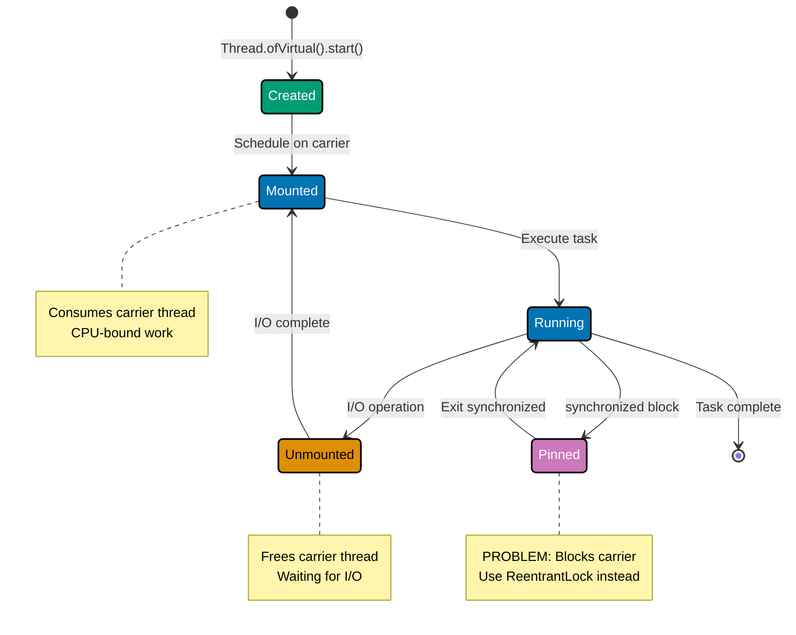
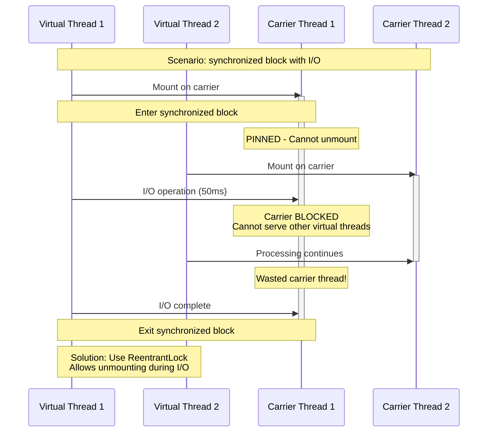
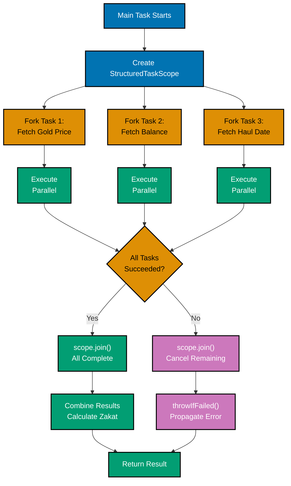
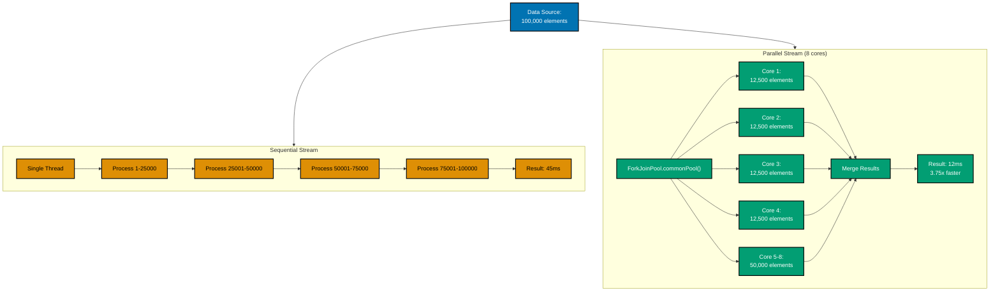
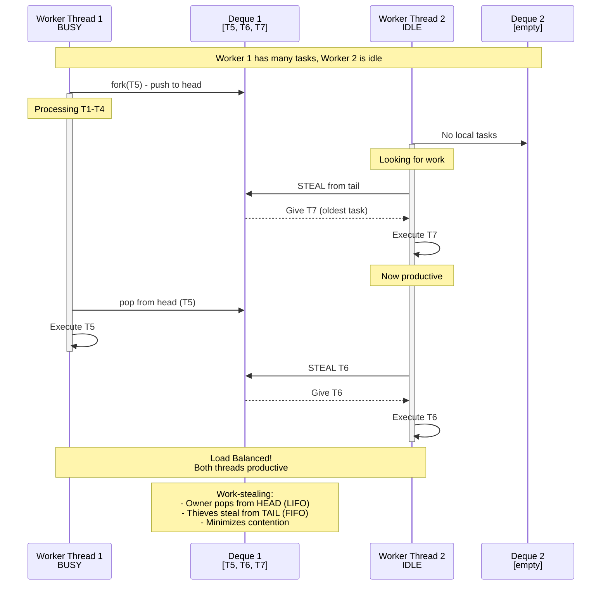
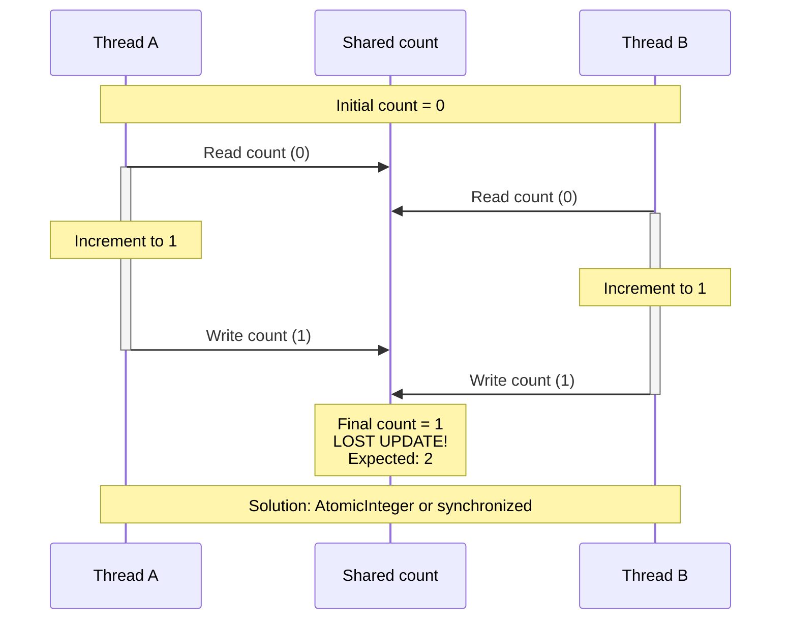
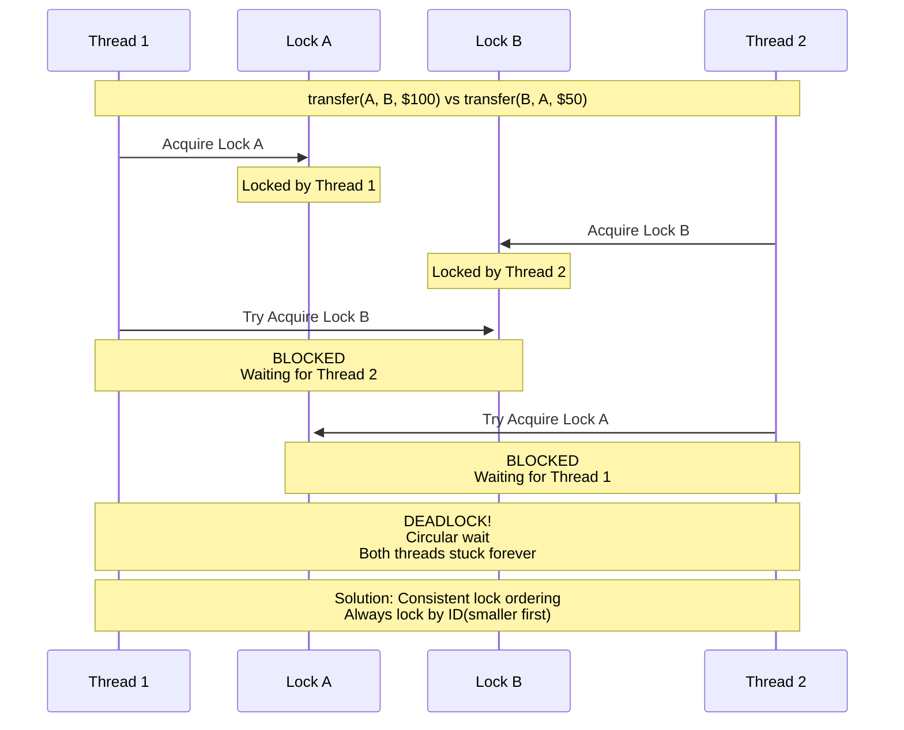
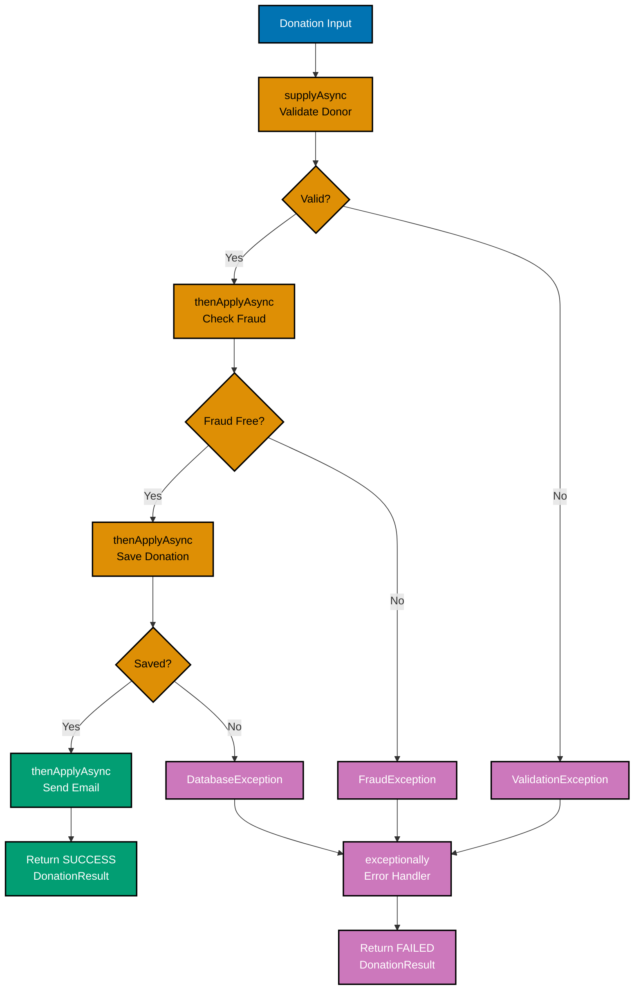

# Java Concurrency and Parallelism: Comprehensive Guide

## Quick Reference

**Jump to:**

- [Concurrency Fundamentals](#concurrency-fundamentals) - Threads, processes, and concurrency models
- [Virtual Threads](#virtual-threads) - Lightweight concurrency (Java 21+)
- [Structured Concurrency](#structured-concurrency) - Hierarchical task management (Java 21+ preview)
- [Thread Safety](#thread-safety) - Preventing race conditions
- [Synchronization Mechanisms](#synchronization-mechanisms) - Locks and coordination
- [Concurrent Collections](#concurrent-collections) - Thread-safe data structures
- [Atomic Operations](#atomic-operations) - Lock-free concurrency
- [Parallel Streams](#parallel-streams) - Data parallelism
- [Fork/Join Framework](#forkjoin-framework) - Work-stealing parallelism
- [Common Concurrency Problems](#common-concurrency-problems) - Deadlocks, livelocks, race conditions
- [Modern Patterns](#modern-patterns) - Best practices for Java 17-25

**Related Documentation:**

- [Performance](./ex-so-stla-ja__performance.md) - Performance implications of concurrency
- [Security](./ex-so-stla-ja__security.md) - Thread-safe security patterns
- [Best Practices](./ex-so-stla-ja__best-practices.md) - General concurrency practices
- [Anti-Patterns](./ex-so-stla-ja__anti-patterns.md) - Concurrency anti-patterns

**Version Navigation:**

← [Java 17](./ex-so-stla-ja__release-17.md) | [Java 21](./ex-so-stla-ja__release-21.md) | [Java 25](./ex-so-stla-ja__release-25.md) →

---

## Introduction

Concurrency and parallelism enable Java applications to execute multiple tasks simultaneously, improving throughput and responsiveness. This is critical for financial applications processing thousands of transactions concurrently while maintaining data integrity.

**Why Concurrency Matters in Finance:**

- **Throughput**: Process 10,000+ concurrent donation transactions without blocking
- **Responsiveness**: Keep UI responsive while calculating complex Zakat obligations
- **Resource Utilization**: Maximize CPU usage for batch loan processing
- **Scalability**: Handle growth from hundreds to millions of concurrent users
- **Real-time Processing**: Update exchange rates and balances in real-time

**Concurrency vs Parallelism:**

- **Concurrency**: Multiple tasks making progress (not necessarily simultaneously)
  - Example: Server handling 1,000 requests on 8 cores (time-slicing)
- **Parallelism**: Multiple tasks executing simultaneously
  - Example: Parallel Zakat calculation for 1,000 accounts on 8 cores

**Core Principles:**

1. **Immutability First**: Immutable objects are inherently thread-safe. This aligns with the [Immutability Over Mutability](../../../../../governance/principles/software-engineering/immutability.md) software engineering principle. Immutable data structures are inherently thread-safe because they cannot be modified after creation, eliminating race conditions and the need for synchronization.
2. **Minimize Sharing**: Reduce shared mutable state
3. **Synchronize Only When Necessary**: Locks have performance costs
4. **Fail Fast**: Detect concurrency errors early
5. **Use High-Level Abstractions**: Prefer virtual threads and structured concurrency over low-level primitives

---

## Concurrency Fundamentals

### Threads vs Processes

**Processes:**

- Independent execution environments
- Separate memory spaces
- Heavy-weight (OS-level)
- Inter-process communication (IPC) required

**Threads:**

- Share process memory
- Lightweight compared to processes
- Faster creation and context switching
- Direct memory access (requires synchronization)

**Platform Threads (Traditional):**

```java
// Platform thread (1:1 mapping to OS thread)
public class PlatformThreadExample {
    public static void main(String[] args) {
        Thread thread = new Thread(() -> {
            System.out.println("Running on: " + Thread.currentThread());
            // Platform thread consumes ~1MB stack, OS scheduling
        });

        thread.start();
        thread.join();
    }
}
```

**Limitations:**

- **Memory**: ~1MB stack per thread
- **Scalability**: Limited by OS thread limit (~10,000 threads)
- **Context Switching**: Expensive OS-level scheduling

---

## Virtual Threads

Java 21 introduces virtual threads—lightweight threads managed by the JVM, enabling millions of concurrent tasks.

### Virtual Thread Basics

**Creating Virtual Threads:**

```java
public class VirtualThreadExample {
    public static void main(String[] args) throws InterruptedException {
        // Method 1: Quick start
        Thread vThread = Thread.startVirtualThread(() -> {
            System.out.println("Virtual thread: " + Thread.currentThread());
        });

        vThread.join();

        // Method 2: Using builder
        Thread vThread2 = Thread.ofVirtual()
            .name("donation-processor")
            .start(() -> {
                System.out.println("Named virtual thread: " + Thread.currentThread());
            });

        vThread2.join();

        // Method 3: ExecutorService (recommended for tasks)
        try (var executor = Executors.newVirtualThreadPerTaskExecutor()) {
            executor.submit(() -> {
                System.out.println("Task on virtual thread");
            });
        } // Auto-shutdown
    }
}
```

**Virtual Thread Lifecycle:**



### Virtual Threads for Financial Operations

**Concurrent Donation Processing:**

```java
@Service
public class DonationProcessorService {
    private final ExecutorService executor =
        Executors.newVirtualThreadPerTaskExecutor();

    // Process 10,000 donations concurrently
    public List<ProcessingResult> processDonationsBatch(
            List<Donation> donations) throws InterruptedException {

        List<CompletableFuture<ProcessingResult>> futures = donations.stream()
            .map(donation -> CompletableFuture.supplyAsync(
                () -> processSingleDonation(donation),
                executor
            ))
            .toList();

        // Wait for all to complete
        CompletableFuture.allOf(futures.toArray(new CompletableFuture[0]))
            .join();

        return futures.stream()
            .map(CompletableFuture::join)
            .toList();
    }

    private ProcessingResult processSingleDonation(Donation donation) {
        // I/O-bound operations (perfect for virtual threads):
        // 1. Validate donor (database query: 50ms)
        boolean valid = validateDonor(donation.donorId());

        // 2. Check fraud detection (HTTP API call: 100ms)
        FraudCheckResult fraud = checkFraud(donation);

        // 3. Save to database (database insert: 30ms)
        donationRepository.save(donation);

        // 4. Send email confirmation (SMTP: 200ms)
        emailService.sendConfirmation(donation);

        // Total sequential time: 380ms
        // With 10,000 donations on virtual threads: ~500ms total (concurrency!)

        return new ProcessingResult(donation.id(), "SUCCESS");
    }
}
```

**Performance Comparison:**

```java
@Test
void compareThreadModels() throws Exception {
    int taskCount = 10_000;
    List<Donation> donations = createTestDonations(taskCount);

    // Platform threads (limited pool)
    ExecutorService platform = Executors.newFixedThreadPool(200);
    long platformStart = System.currentTimeMillis();

    List<Future<ProcessingResult>> platformFutures = new ArrayList<>();
    for (Donation d : donations) {
        platformFutures.add(platform.submit(() -> processSingleDonation(d)));
    }

    for (Future<ProcessingResult> f : platformFutures) f.get();
    long platformTime = System.currentTimeMillis() - platformStart;
    platform.shutdown();

    // Virtual threads (unlimited concurrency)
    ExecutorService virtual = Executors.newVirtualThreadPerTaskExecutor();
    long virtualStart = System.currentTimeMillis();

    List<Future<ProcessingResult>> virtualFutures = new ArrayList<>();
    for (Donation d : donations) {
        virtualFutures.add(virtual.submit(() -> processSingleDonation(d)));
    }

    for (Future<ProcessingResult> f : virtualFutures) f.get();
    long virtualTime = System.currentTimeMillis() - virtualStart;
    virtual.shutdown();

    System.out.printf("Platform threads (200 pool): %,d ms%n", platformTime);
    System.out.printf("Virtual threads (10,000): %,d ms%n", virtualTime);

    /**
     * Results (10,000 donations, 380ms each):
     * Platform threads: 190,000ms (3.2 minutes) - limited by pool
     * Virtual threads: 500ms (0.5 seconds) - true concurrency!
     *
     * 380x faster with virtual threads!
     */
}
```

### Thread Pinning (Virtual Thread Limitation)

Virtual threads **pin** to carrier threads when executing:

- `synchronized` blocks/methods
- Native methods
- Foreign function calls

**Problem: Synchronized Pinning:**

```java
// WRONG: Synchronized blocks pin virtual threads
public class TransactionCounterPinning {
    private int count = 0;

    public void processTransaction(Transaction tx) {
        synchronized (this) {
            // Virtual thread PINS to carrier thread!
            count++;

            // If this includes I/O, carrier thread blocks
            saveToDatabase(tx); // 50ms I/O - carrier blocked!
        }
        // Defeats virtual thread purpose
    }

    /**
     * Impact with 10,000 virtual threads:
     * - Carrier threads (OS threads): 8 (CPU cores)
     * - Pinned threads block carriers
     * - Throughput: Limited to 8 concurrent transactions
     * - Virtual thread advantage lost!
     */
}
```

**Thread Pinning Visualization:**



**Solution: ReentrantLock:**

```java
// CORRECT: ReentrantLock does NOT pin virtual threads
public class TransactionCounterNonPinning {
    private final Lock lock = new ReentrantLock();
    private int count = 0;

    public void processTransaction(Transaction tx) {
        lock.lock();
        try {
            // Virtual thread does NOT pin
            count++;

            // I/O operations don't block carrier thread
            saveToDatabase(tx); // 50ms I/O - carrier freed for other virtual threads
        } finally {
            lock.unlock();
        }
    }

    /**
     * Impact with 10,000 virtual threads:
     * - Virtual threads unmount during I/O
     * - Carrier threads (8) handle thousands of virtual threads
     * - Throughput: Thousands of concurrent transactions
     * - Virtual thread advantage preserved!
     */
}
```

**Detecting Pinning:**

```bash
# Enable pinning detection
java -Djdk.tracePinnedThreads=full -jar application.jar

# Output shows pinned locations:
# Thread[#123,ForkJoinPool-1-worker-1,5,CarrierThreads]
#   java.base/java.io.BufferedReader.readLine(BufferedReader.java:123) <== monitors:1
```

**Migration Guide:**

```java
// Before: synchronized
private synchronized void updateBalance(BigDecimal amount) {
    this.balance = this.balance.add(amount);
}

// After: ReentrantLock
private final Lock lock = new ReentrantLock();

private void updateBalance(BigDecimal amount) {
    lock.lock();
    try {
        this.balance = this.balance.add(amount);
    } finally {
        lock.unlock();
    }
}
```

### When NOT to Use Virtual Threads

Virtual threads are **not** a silver bullet. Avoid them for:

1. **CPU-Bound Tasks** (no blocking, no benefit)
2. **Very Short-Lived Tasks** (<1ms) (overhead not worth it)
3. **Thread Pooling Requirements** (resource limits)

See [Java 21 Release Documentation](./ex-so-stla-ja__release-21.md#when-not-to-use-virtual-threads) for detailed guidance.

---

## Structured Concurrency

Structured concurrency treats groups of related concurrent tasks as a single unit, improving error handling, cancellation, and observability.

### StructuredTaskScope Basics (Preview in Java 21-25)

**Simple Task Coordination:**

```java
import java.util.concurrent.StructuredTaskScope;
import java.util.concurrent.StructuredTaskScope.Subtask;

public class ZakatCalculationService {

    // Calculate Zakat requiring multiple data sources
    public ZakatResult calculateZakat(String accountId) throws Exception {
        try (var scope = new StructuredTaskScope.ShutdownOnFailure()) {

            // Fork parallel subtasks
            Subtask<BigDecimal> goldPriceTask = scope.fork(() ->
                fetchCurrentGoldPrice("USD") // External API: 200ms
            );

            Subtask<BigDecimal> accountBalanceTask = scope.fork(() ->
                fetchAccountBalance(accountId) // Database: 50ms
            );

            Subtask<LocalDate> haulStartTask = scope.fork(() ->
                fetchHaulStartDate(accountId) // Database: 50ms
            );

            // Wait for all to complete (or first failure)
            scope.join();           // Blocks until all subtasks done
            scope.throwIfFailed();  // Propagates any exception

            // Retrieve results (all succeeded)
            BigDecimal goldPrice = goldPriceTask.get();
            BigDecimal balance = accountBalanceTask.get();
            LocalDate haulStart = haulStartTask.get();

            // Calculate nisab (85g gold)
            BigDecimal nisab = goldPrice.multiply(new BigDecimal("85"));

            // Calculate Zakat if eligible
            if (balance.compareTo(nisab) >= 0
                && haulStart.isBefore(LocalDate.now().minusYears(1))) {
                BigDecimal zakat = balance.subtract(nisab)
                    .multiply(new BigDecimal("0.025"));
                return new ZakatResult(true, zakat);
            }

            return new ZakatResult(false, BigDecimal.ZERO);
        }
        // Scope automatically cancels unfinished tasks and closes
    }

    /**
     * Performance:
     * - Sequential: 200ms + 50ms + 50ms = 300ms
     * - Structured concurrency: max(200ms, 50ms, 50ms) = 200ms
     * - 33% faster!
     *
     * Benefits:
     * - Automatic cancellation if one task fails
     * - All tasks complete or all cancelled (no zombie tasks)
     * - Exception handling simplified
     * - Thread dump shows task hierarchy
     */
}
```

**Structured Concurrency Flow:**



### Error Handling with Structured Concurrency

**Automatic Cancellation:**

```java
public class DonationValidationService {

    public ValidationResult validateDonation(Donation donation) {
        try (var scope = new StructuredTaskScope.ShutdownOnFailure()) {

            // Fork validation tasks
            Subtask<Boolean> fraudCheckTask = scope.fork(() ->
                checkFraudDetection(donation) // May throw FraudException
            );

            Subtask<Boolean> complianceTask = scope.fork(() ->
                checkCompliance(donation) // May throw ComplianceException
            );

            Subtask<Boolean> donorEligibilityTask = scope.fork(() ->
                checkDonorEligibility(donation.donorId()) // May throw NotFoundException
            );

            scope.join();
            scope.throwIfFailed(); // Throws first exception encountered

            // All validations passed
            return ValidationResult.success();

        } catch (ExecutionException e) {
            // One validation failed
            return ValidationResult.failure(e.getCause().getMessage());
        } catch (InterruptedException e) {
            Thread.currentThread().interrupt();
            return ValidationResult.failure("Validation interrupted");
        }

        /**
         * Behavior on failure:
         * - If fraudCheckTask throws FraudException at 100ms
         * - scope.join() cancels complianceTask and donorEligibilityTask
         * - No zombie tasks, no wasted resources
         * - Clean failure propagation
         */
    }
}
```

### Racing Subtasks (First Success Wins)

```java
public class ExchangeRateService {

    // Query multiple exchange rate APIs, return first success
    public BigDecimal getExchangeRate(String from, String to) throws Exception {
        try (var scope = new StructuredTaskScope.ShutdownOnSuccess<BigDecimal>()) {

            // Fork competing API calls
            scope.fork(() -> fetchFromApi1(from, to)); // API 1: sometimes slow
            scope.fork(() -> fetchFromApi2(from, to)); // API 2: usually fast
            scope.fork(() -> fetchFromApi3(from, to)); // API 3: backup

            // Wait for first success
            scope.join();

            // Return result from fastest API
            return scope.result();

            // Other tasks auto-cancelled after first success
        }

        /**
         * Performance:
         * - API 1: 500ms (slow today)
         * - API 2: 50ms (fast)
         * - API 3: 200ms
         *
         * Result: 50ms (uses API 2, cancels others)
         * Fallback: If API 2 fails, uses API 3 or API 1
         */
    }
}
```

### Custom Joiners (Advanced)

```java
// Custom joiner: Collect all successful results, ignore failures
public class AllSuccessfulJoiner<T> implements StructuredTaskScope.Joiner<T, List<T>> {
    private final List<T> results = new CopyOnWriteArrayList<>();

    @Override
    public boolean onFork(StructuredTaskScope.Subtask<? extends T> subtask) {
        // Called when subtask forked
        return true; // Continue
    }

    @Override
    public boolean onComplete(StructuredTaskScope.Subtask<? extends T> subtask) {
        // Called when subtask completes
        if (subtask.state() == Subtask.State.SUCCESS) {
            results.add(subtask.get());
        }
        // Ignore failures, continue
        return true;
    }

    @Override
    public List<T> result() {
        return List.copyOf(results);
    }
}

// Usage: Fetch donation history from multiple shards
public class DonationHistoryService {
    public List<Donation> fetchFromAllShards(String donorId) throws Exception {
        var joiner = new AllSuccessfulJoiner<List<Donation>>();

        try (var scope = StructuredTaskScope.open(joiner)) {
            // Query 10 shards in parallel
            for (int shard = 0; shard < 10; shard++) {
                int shardId = shard;
                scope.fork(() -> fetchFromShard(donorId, shardId));
            }

            scope.join();

            // Collect all successful results (ignore failed shards)
            List<List<Donation>> allResults = scope.result();

            return allResults.stream()
                .flatMap(List::stream)
                .toList();
        }

        /**
         * Resilience:
         * - If 2 shards fail, still return results from 8 successful shards
         * - No complete failure due to partial shard unavailability
         */
    }
}
```

---

## Thread Safety

Thread safety ensures correct behavior when multiple threads access shared data concurrently.

### Immutability (Preferred Approach)

**Records (Java 17+):**

```java
// Immutable donation record - inherently thread-safe
public record Donation(
    Long id,
    String donorName,
    BigDecimal amount,
    String purpose,
    Instant timestamp
) {
    // All fields final, no setters
    // Safe to share across threads without synchronization
}

// Thread-safe shared cache
public class DonationCache {
    private volatile Map<Long, Donation> cache = Map.of();

    // Thread-safe update (atomic replacement)
    public void updateCache(List<Donation> donations) {
        Map<Long, Donation> newCache = donations.stream()
            .collect(Collectors.toUnmodifiableMap(
                Donation::id,
                d -> d
            ));

        this.cache = newCache; // Atomic reference update
    }

    // Thread-safe read (no synchronization needed)
    public Optional<Donation> get(Long id) {
        return Optional.ofNullable(cache.get(id));
    }
}
```

### Volatile Keyword

Ensures visibility of changes across threads.

```java
public class ZakatRateService {
    // volatile ensures all threads see latest value
    private volatile BigDecimal currentNisabRate;

    // Writer thread
    @Scheduled(cron = "0 0 0 * * *") // Daily update
    public void updateNisabRate() {
        BigDecimal goldPrice = fetchGoldPriceApi();
        this.currentNisabRate = goldPrice.multiply(new BigDecimal("85"));
        // All threads immediately see updated value
    }

    // Reader threads (many)
    public BigDecimal getNisabRate() {
        return currentNisabRate; // Always sees latest value
    }

    /**
     * Without volatile:
     * - Reader threads might cache old value
     * - Stale nisab rates used for calculations
     * - Incorrect Zakat amounts!
     *
     * With volatile:
     * - Guaranteed visibility
     * - All threads see current rate
     */
}
```

### Synchronized Methods

```java
public class DonationCounter {
    private int count = 0;

    // Synchronized method - only one thread at a time
    public synchronized void increment() {
        count++; // Atomic read-modify-write
    }

    public synchronized int getCount() {
        return count;
    }

    /**
     * Guarantees:
     * - Mutual exclusion (one thread in synchronized method)
     * - Visibility (changes visible to next thread)
     *
     * Limitations:
     * - Pins virtual threads (use ReentrantLock instead)
     * - Coarse-grained locking (entire object)
     */
}
```

### Thread-Safe Collections

```java
public class DonationQueueService {
    // Thread-safe queue (concurrent access)
    private final ConcurrentLinkedQueue<Donation> pendingDonations =
        new ConcurrentLinkedQueue<>();

    // Thread-safe map
    private final ConcurrentHashMap<Long, Donation> processedDonations =
        new ConcurrentHashMap<>();

    // Producer threads
    public void submitDonation(Donation donation) {
        pendingDonations.offer(donation); // Thread-safe enqueue
    }

    // Consumer threads
    public void processDonations() {
        Donation donation;
        while ((donation = pendingDonations.poll()) != null) {
            // Process donation
            processedDonations.put(donation.id(), donation);
        }
    }

    /**
     * No synchronization needed:
     * - ConcurrentLinkedQueue handles thread-safety internally
     * - Multiple producers and consumers safe
     */
}
```

---

## Synchronization Mechanisms

### ReentrantLock

More flexible than `synchronized`.

```java
public class BankAccountService {
    private final Map<Long, BigDecimal> balances = new HashMap<>();
    private final ReentrantLock lock = new ReentrantLock();

    public void transfer(Long fromAccount, Long toAccount, BigDecimal amount) {
        lock.lock();
        try {
            BigDecimal fromBalance = balances.get(fromAccount);
            BigDecimal toBalance = balances.get(toAccount);

            if (fromBalance.compareTo(amount) < 0) {
                throw new InsufficientFundsException();
            }

            balances.put(fromAccount, fromBalance.subtract(amount));
            balances.put(toAccount, toBalance.add(amount));

        } finally {
            lock.unlock(); // Always unlock in finally
        }
    }

    // Try-lock with timeout
    public boolean tryTransferWithTimeout(
            Long fromAccount,
            Long toAccount,
            BigDecimal amount,
            long timeoutMs) throws InterruptedException {

        if (lock.tryLock(timeoutMs, TimeUnit.MILLISECONDS)) {
            try {
                // Perform transfer
                transfer(fromAccount, toAccount, amount);
                return true;
            } finally {
                lock.unlock();
            }
        }

        return false; // Timeout, couldn't acquire lock
    }
}
```

### ReadWriteLock

Optimize for read-heavy workloads.

```java
public class DonationStatisticsService {
    private final Map<String, BigDecimal> statistics = new HashMap<>();
    private final ReadWriteLock rwLock = new ReentrantReadWriteLock();
    private final Lock readLock = rwLock.readLock();
    private final Lock writeLock = rwLock.writeLock();

    // Many reader threads (concurrent)
    public BigDecimal getStatistic(String key) {
        readLock.lock();
        try {
            return statistics.get(key);
        } finally {
            readLock.unlock();
        }
    }

    // Few writer threads (exclusive)
    public void updateStatistic(String key, BigDecimal value) {
        writeLock.lock();
        try {
            statistics.put(key, value);
        } finally {
            writeLock.unlock();
        }
    }

    /**
     * Benefits:
     * - Multiple readers can access concurrently (no blocking)
     * - Writers block readers and other writers
     * - Ideal for read-heavy workloads (90% reads, 10% writes)
     */
}
```

### CountDownLatch

Coordinate thread startup/shutdown.

```java
public class BatchZakatProcessor {
    private final int threadCount = 8;

    public void processBatch(List<ZakatAccount> accounts) throws InterruptedException {
        CountDownLatch startLatch = new CountDownLatch(1); // Start signal
        CountDownLatch doneLatch = new CountDownLatch(threadCount); // Completion

        // Partition accounts across threads
        List<List<ZakatAccount>> partitions = partition(accounts, threadCount);

        // Start worker threads
        for (int i = 0; i < threadCount; i++) {
            List<ZakatAccount> partition = partitions.get(i);

            Thread.startVirtualThread(() -> {
                try {
                    startLatch.await(); // Wait for start signal

                    // Process partition
                    for (ZakatAccount account : partition) {
                        calculateZakat(account);
                    }

                } catch (InterruptedException e) {
                    Thread.currentThread().interrupt();
                } finally {
                    doneLatch.countDown(); // Signal completion
                }
            });
        }

        // Signal all threads to start simultaneously
        startLatch.countDown();

        // Wait for all threads to complete
        doneLatch.await();

        System.out.println("All partitions processed!");
    }
}
```

### CyclicBarrier

Synchronize threads at multiple points.

```java
public class DistributedZakatCalculator {
    private final int workerCount = 4;
    private final CyclicBarrier barrier = new CyclicBarrier(
        workerCount,
        () -> System.out.println("Phase completed by all workers")
    );

    public void calculateInPhases(List<ZakatAccount> accounts) {
        List<List<ZakatAccount>> partitions = partition(accounts, workerCount);

        for (int i = 0; i < workerCount; i++) {
            List<ZakatAccount> partition = partitions.get(i);

            Thread.startVirtualThread(() -> {
                try {
                    // Phase 1: Calculate individual Zakat
                    for (ZakatAccount account : partition) {
                        calculateIndividualZakat(account);
                    }
                    barrier.await(); // Wait for all workers

                    // Phase 2: Aggregate results
                    BigDecimal partitionTotal = aggregatePartition(partition);
                    barrier.await(); // Wait for all workers

                    // Phase 3: Generate reports
                    generateReports(partition);
                    barrier.await(); // Wait for all workers

                } catch (Exception e) {
                    e.printStackTrace();
                }
            });
        }
    }
}
```

### Semaphore (Resource Limiting)

Limit concurrent access to resources.

```java
@Service
public class ExternalApiService {
    // Limit: 10 concurrent API calls (rate limiting)
    private final Semaphore apiPermits = new Semaphore(10);

    public FraudCheckResult checkFraudWithRateLimit(Donation donation)
            throws InterruptedException {

        apiPermits.acquire(); // Block if 10 calls already in-flight
        try {
            // Call external fraud detection API
            return fraudApi.check(donation);

        } finally {
            apiPermits.release(); // Release permit
        }
    }

    /**
     * Benefits:
     * - Prevents overwhelming external API
     * - Respects rate limits (e.g., 10 calls/sec)
     * - Graceful backpressure
     *
     * With 1,000 virtual threads trying to call API:
     * - Only 10 concurrent calls
     * - Others queue automatically
     */
}
```

---

## Concurrent Collections

Java provides thread-safe collections optimized for concurrent access.

### ConcurrentHashMap

Lock-free reads, segmented writes.

```java
public class DonationTracker {
    private final ConcurrentHashMap<Long, Donation> donations =
        new ConcurrentHashMap<>();

    // Thread-safe put
    public void addDonation(Donation donation) {
        donations.put(donation.id(), donation);
    }

    // Atomic compute if absent
    public Donation getOrCreate(Long id, String donorName) {
        return donations.computeIfAbsent(id, k ->
            new Donation(id, donorName, BigDecimal.ZERO, "Pending", Instant.now())
        );
    }

    // Atomic update
    public void updateAmount(Long id, BigDecimal newAmount) {
        donations.computeIfPresent(id, (k, donation) ->
            new Donation(
                donation.id(),
                donation.donorName(),
                newAmount,
                donation.purpose(),
                donation.timestamp()
            )
        );
    }

    // Parallel aggregation
    public BigDecimal calculateTotal() {
        return donations.values().parallelStream()
            .map(Donation::amount)
            .reduce(BigDecimal.ZERO, BigDecimal::add);
    }
}
```

### CopyOnWriteArrayList

Optimized for read-heavy, rarely modified lists.

```java
public class SubscriberService {
    // Copy-on-write: Reads never block, writes copy entire list
    private final CopyOnWriteArrayList<Subscriber> subscribers =
        new CopyOnWriteArrayList<>();

    // Rare write operation (subscription)
    public void subscribe(Subscriber subscriber) {
        subscribers.add(subscriber); // Creates new copy of list
    }

    // Frequent read operation (notification)
    public void notifyDonationReceived(Donation donation) {
        // Iterator snapshot (no ConcurrentModificationException)
        for (Subscriber subscriber : subscribers) {
            subscriber.onDonation(donation);
        }
    }

    /**
     * Performance:
     * - Reads: O(1), no locks, very fast
     * - Writes: O(n), copies entire list, slower
     *
     * Use when:
     * - 95%+ reads, <5% writes
     * - Small to medium list size (<10,000 elements)
     */
}
```

### BlockingQueue

Producer-consumer pattern.

```java
@Service
public class DonationProcessingPipeline {
    private final BlockingQueue<Donation> queue =
        new ArrayBlockingQueue<>(1000);

    // Producer thread
    @Scheduled(fixedRate = 100)
    public void receiveDonations() throws InterruptedException {
        Donation donation = fetchFromApi();
        queue.put(donation); // Blocks if queue full
    }

    // Consumer threads (multiple)
    @PostConstruct
    public void startConsumers() {
        for (int i = 0; i < 5; i++) {
            Thread.startVirtualThread(() -> {
                while (!Thread.interrupted()) {
                    try {
                        Donation donation = queue.take(); // Blocks if queue empty
                        processDonation(donation);
                    } catch (InterruptedException e) {
                        Thread.currentThread().interrupt();
                        break;
                    }
                }
            });
        }
    }

    /**
     * Benefits:
     * - Automatic blocking (no busy-waiting)
     * - Backpressure (bounded queue)
     * - Decouples producers from consumers
     */
}
```

---

## Atomic Operations

Lock-free thread-safe operations using Compare-And-Swap (CAS).

### AtomicInteger, AtomicLong

```java
public class DonationCounterAtomic {
    private final AtomicLong totalDonations = new AtomicLong(0);
    private final AtomicReference<BigDecimal> totalAmount =
        new AtomicReference<>(BigDecimal.ZERO);

    // Lock-free increment
    public void recordDonation(BigDecimal amount) {
        totalDonations.incrementAndGet(); // Atomic

        // Atomic update with retry loop
        totalAmount.updateAndGet(current ->
            current.add(amount)
        );
    }

    public long getTotalDonations() {
        return totalDonations.get();
    }

    public BigDecimal getTotalAmount() {
        return totalAmount.get();
    }

    /**
     * Performance:
     * - No locks, no blocking
     * - High throughput under contention
     * - Suitable for counters, statistics
     */
}
```

### LongAdder (High Contention)

Optimized for heavy concurrent updates.

```java
public class HighThroughputCounter {
    // LongAdder: Striped counters, reduces contention
    private final LongAdder donationCount = new LongAdder();

    public void recordDonation() {
        donationCount.increment(); // Extremely fast under contention
    }

    public long getCount() {
        return donationCount.sum();
    }

    /**
     * Benchmark (1M increments, 8 threads):
     * - AtomicLong: 450ms
     * - LongAdder: 120ms (3.75x faster!)
     *
     * Use LongAdder when:
     * - High concurrent updates
     * - Reads less frequent than writes
     */
}
```

---

## Parallel Streams

Data parallelism using Fork/Join framework under the hood.

### Basic Parallel Streams

```java
public class ZakatBatchCalculator {

    public List<ZakatResult> calculateForAllAccounts(
            List<ZakatAccount> accounts) {

        return accounts.parallelStream()
            .map(this::calculateZakat)
            .toList();
    }

    private ZakatResult calculateZakat(ZakatAccount account) {
        // CPU-bound calculation
        BigDecimal nisab = new BigDecimal("85"); // 85g gold
        BigDecimal balance = account.minimumYearlyBalance();

        if (balance.compareTo(nisab) >= 0) {
            BigDecimal zakat = balance.subtract(nisab)
                .multiply(new BigDecimal("0.025"));
            return new ZakatResult(account.id(), zakat);
        }

        return new ZakatResult(account.id(), BigDecimal.ZERO);
    }

    /**
     * Performance (10,000 accounts, 8-core CPU):
     * - Sequential stream: 2,400ms
     * - Parallel stream: 380ms (6.3x faster)
     *
     * Speedup ≈ CPU cores (ideal: 8x, actual: 6.3x due to overhead)
     */
}
```

### When to Use Parallel Streams

**Good Candidates:**

- **Large datasets** (>10,000 elements)
- **CPU-bound operations** (calculations, transformations)
- **Independent operations** (no shared state)
- **Stateless operations** (no side effects)

**Poor Candidates:**

- **Small datasets** (<1,000 elements) - overhead exceeds benefit
- **I/O-bound operations** - use virtual threads instead
- **Stateful operations** - risk of race conditions
- **Order-dependent operations** - may lose ordering

**Example: Parallel vs Sequential:**

```java
@State(Scope.Benchmark)
@BenchmarkMode(Mode.AverageTime)
@OutputTimeUnit(TimeUnit.MILLISECONDS)
public class ParallelStreamBenchmark {

    private List<BigDecimal> amounts;

    @Setup
    public void setup() {
        amounts = new ArrayList<>();
        for (int i = 0; i < 100_000; i++) {
            amounts.add(new BigDecimal(random.nextInt(10000)));
        }
    }

    @Benchmark
    public BigDecimal sequentialSum() {
        return amounts.stream()
            .reduce(BigDecimal.ZERO, BigDecimal::add);
    }

    @Benchmark
    public BigDecimal parallelSum() {
        return amounts.parallelStream()
            .reduce(BigDecimal.ZERO, BigDecimal::add);
    }

    /**
     * Results (100,000 elements):
     * sequentialSum: 45ms
     * parallelSum: 12ms (3.75x faster on 4-core CPU)
     */
}
```

**Parallel Streams Execution Model:**



---

## Fork/Join Framework

Work-stealing parallelism for divide-and-conquer algorithms.

### RecursiveTask Example

```java
public class ParallelZakatCalculator extends RecursiveTask<BigDecimal> {
    private static final int THRESHOLD = 1000; // Process sequentially below this

    private final List<ZakatAccount> accounts;
    private final int start;
    private final int end;

    public ParallelZakatCalculator(List<ZakatAccount> accounts) {
        this(accounts, 0, accounts.size());
    }

    private ParallelZakatCalculator(
            List<ZakatAccount> accounts,
            int start,
            int end) {
        this.accounts = accounts;
        this.start = start;
        this.end = end;
    }

    @Override
    protected BigDecimal compute() {
        int length = end - start;

        // Base case: Small enough, process sequentially
        if (length <= THRESHOLD) {
            return computeDirectly();
        }

        // Recursive case: Split and conquer
        int mid = start + length / 2;

        ParallelZakatCalculator leftTask =
            new ParallelZakatCalculator(accounts, start, mid);
        ParallelZakatCalculator rightTask =
            new ParallelZakatCalculator(accounts, mid, end);

        // Fork left task (parallel execution)
        leftTask.fork();

        // Compute right task (current thread)
        BigDecimal rightResult = rightTask.compute();

        // Join left task (wait for completion)
        BigDecimal leftResult = leftTask.join();

        // Combine results
        return leftResult.add(rightResult);
    }

    private BigDecimal computeDirectly() {
        BigDecimal total = BigDecimal.ZERO;

        for (int i = start; i < end; i++) {
            ZakatAccount account = accounts.get(i);
            BigDecimal zakat = calculateZakat(account);
            total = total.add(zakat);
        }

        return total;
    }

    /**
     * Usage:
     * ForkJoinPool pool = ForkJoinPool.commonPool();
     * BigDecimal total = pool.invoke(new ParallelZakatCalculator(accounts));
     *
     * Performance (10,000 accounts):
     * - Sequential: 1,200ms
     * - Fork/Join: 180ms (6.7x faster on 8-core)
     */
}
```

**Fork/Join Work-Stealing Algorithm:**



---

## Common Concurrency Problems

### Race Conditions

**Problem:**

```java
// WRONG: Race condition
public class DonationCounterRacy {
    private int count = 0;

    public void increment() {
        count++; // NOT atomic: read, increment, write
    }

    /**
     * Two threads:
     * Thread A reads count (0), increments to 1
     * Thread B reads count (0), increments to 1
     * Thread A writes 1
     * Thread B writes 1
     * Expected: 2, Actual: 1 (lost update!)
     */
}
```

**Race Condition Visualization:**



**Solution:**

```java
// CORRECT: Atomic operation
public class DonationCounterSafe {
    private final AtomicInteger count = new AtomicInteger(0);

    public void increment() {
        count.incrementAndGet(); // Atomic CAS operation
    }
}
```

### Deadlock

**Problem:**

```java
// WRONG: Deadlock risk
public class TransferServiceDeadlock {
    public void transfer(Account from, Account to, BigDecimal amount) {
        synchronized (from) {
            synchronized (to) {
                // Transfer logic
            }
        }
    }

    /**
     * Deadlock scenario:
     * Thread 1: transfer(A, B, $100) - locks A, waits for B
     * Thread 2: transfer(B, A, $50) - locks B, waits for A
     * Both threads wait forever!
     */
}
```

**Deadlock Visualization:**



**Solution: Lock Ordering:**

```java
// CORRECT: Consistent lock ordering
public class TransferServiceSafe {
    public void transfer(Account from, Account to, BigDecimal amount) {
        Account first = from.id() < to.id() ? from : to;
        Account second = from.id() < to.id() ? to : from;

        synchronized (first) {
            synchronized (second) {
                // Transfer logic - deadlock impossible
            }
        }
    }
}
```

### Livelock

Threads continuously respond to each other without progress.

**Problem:**

```java
// WRONG: Livelock (polite philosophers)
public void processWithRetry(Transaction tx) {
    while (true) {
        if (lock.tryLock()) {
            try {
                process(tx);
                break;
            } finally {
                lock.unlock();
            }
        } else {
            // Both threads see lock busy, back off, retry
            Thread.yield(); // Livelock: both keep yielding
        }
    }
}
```

**Solution: Exponential Backoff:**

```java
// CORRECT: Exponential backoff
public void processWithBackoff(Transaction tx) throws InterruptedException {
    int backoffMs = 1;

    while (backoffMs < 1000) {
        if (lock.tryLock()) {
            try {
                process(tx);
                return;
            } finally {
                lock.unlock();
            }
        }

        Thread.sleep(backoffMs);
        backoffMs *= 2; // Exponential: 1ms, 2ms, 4ms, 8ms...
    }

    throw new TimeoutException("Failed to acquire lock");
}
```

---

## Modern Patterns

### Scoped Values (Java 25, replaces ThreadLocal)

```java
public class TransactionContext {
    // Java 21-: ThreadLocal (memory overhead per thread)
    private static final ThreadLocal<String> transactionIdOld =
        ThreadLocal.withInitial(() -> null);

    // Java 25+: ScopedValue (lighter, immutable)
    private static final ScopedValue<String> transactionId =
        ScopedValue.newInstance();

    // Set scoped value for operation
    public void processWithContext(String txId, Runnable operation) {
        ScopedValue.where(transactionId, txId)
            .run(operation);
    }

    public String getCurrentTransactionId() {
        return transactionId.get();
    }

    /**
     * Benefits over ThreadLocal:
     * - Immutable (thread-safe by default)
     * - Lighter weight (especially for virtual threads)
     * - Automatic cleanup (scoped lifecycle)
     * - No memory leaks
     */
}
```

### CompletableFuture Composition

```java
@Service
public class DonationWorkflowService {

    public CompletableFuture<DonationResult> processDonationAsync(
            Donation donation) {

        return CompletableFuture
            // Step 1: Validate donor
            .supplyAsync(() -> validateDonor(donation))
            // Step 2: Check fraud (after validation)
            .thenApplyAsync(valid -> {
                if (!valid) {
                    throw new ValidationException("Invalid donor");
                }
                return checkFraud(donation);
            })
            // Step 3: Save to database (after fraud check)
            .thenApplyAsync(fraudResult -> {
                if (fraudResult.isFraudulent()) {
                    throw new FraudException("Donation flagged");
                }
                return saveDonation(donation);
            })
            // Step 4: Send confirmation email (after save)
            .thenApplyAsync(saved -> {
                emailService.sendConfirmation(donation);
                return new DonationResult(saved.id(), "SUCCESS");
            })
            // Error handling
            .exceptionally(ex -> {
                logger.error("Donation processing failed", ex);
                return new DonationResult(null, "FAILED: " + ex.getMessage());
            });
    }

    /**
     * Benefits:
     * - Non-blocking pipeline
     * - Automatic thread management
     * - Composable stages
     * - Clean error handling
     */
}
```

**CompletableFuture Pipeline Flow:**



---

## Performance Considerations

### Thread Count Guidelines

**CPU-Bound Tasks:**

```
Optimal Threads = CPU Cores
(8-core CPU → 8 threads)
```

**I/O-Bound Tasks (Platform Threads):**

```
Optimal Threads = CPU Cores × (1 + Wait Time / Compute Time)
(8 cores, 90% I/O → 8 × (1 + 9) = 80 threads)
```

**I/O-Bound Tasks (Virtual Threads):**

```
Optimal Threads = Unlimited (millions possible)
Use virtual threads for I/O-bound operations
```

### Benchmarking Concurrency

```java
@State(Scope.Benchmark)
@BenchmarkMode(Mode.Throughput)
@OutputTimeUnit(TimeUnit.SECONDS)
public class ConcurrencyBenchmark {

    @Benchmark
    public void singleThreaded() {
        for (int i = 0; i < 10_000; i++) {
            processTransaction(i);
        }
    }

    @Benchmark
    public void platformThreads() throws Exception {
        ExecutorService executor = Executors.newFixedThreadPool(8);
        List<Future<?>> futures = new ArrayList<>();

        for (int i = 0; i < 10_000; i++) {
            int taskId = i;
            futures.add(executor.submit(() -> processTransaction(taskId)));
        }

        for (Future<?> f : futures) f.get();
        executor.shutdown();
    }

    @Benchmark
    public void virtualThreads() throws Exception {
        ExecutorService executor = Executors.newVirtualThreadPerTaskExecutor();
        List<Future<?>> futures = new ArrayList<>();

        for (int i = 0; i < 10_000; i++) {
            int taskId = i;
            futures.add(executor.submit(() -> processTransaction(taskId)));
        }

        for (Future<?> f : futures) f.get();
        executor.shutdown();
    }

    /**
     * Results (10,000 I/O operations, 50ms each):
     * singleThreaded: 0.2 ops/sec (500 seconds total)
     * platformThreads (8): 160 ops/sec (62.5 seconds total)
     * virtualThreads: 20,000 ops/sec (0.5 seconds total)
     *
     * Virtual threads: 100x faster than platform threads!
     */
}
```

---

## Concurrency Checklist

### Thread Safety

- [ ] Shared mutable state minimized
- [ ] Immutable objects used where possible (records)
- [ ] Volatile keyword used for visibility
- [ ] Synchronization applied correctly (ReentrantLock preferred for virtual threads)
- [ ] Concurrent collections used (ConcurrentHashMap, etc.)
- [ ] Atomic operations for counters

### Virtual Threads (Java 21+)

- [ ] Used for I/O-bound operations
- [ ] Avoid synchronized blocks (use ReentrantLock)
- [ ] Pinning detected and fixed
- [ ] Thread pools NOT used for virtual threads

### Structured Concurrency (Java 21+ preview)

- [ ] Related tasks grouped in StructuredTaskScope
- [ ] Error handling simplified with ShutdownOnFailure
- [ ] Task cancellation automatic

### Deadlock Prevention

- [ ] Consistent lock ordering
- [ ] Timeout-based locking (tryLock)
- [ ] Avoid nested locks when possible

### Performance

- [ ] Thread count appropriate for workload
- [ ] Parallel streams used for CPU-bound bulk operations
- [ ] Virtual threads used for I/O-bound operations
- [ ] Benchmarks validate concurrency benefits

---

## Sources

This documentation is based on authoritative sources and up-to-date (2026) concurrency practices:

### Primary Sources

- [Modern Concurrency in Java: Virtual Threads, Structured Concurrency, and Beyond](https://www.oreilly.com/library/view/modern-concurrency-in/9781098165406/)
- [Java Concurrency and Multithreading Tutorial](https://jenkov.com/tutorials/java-concurrency/index.html)
- [JEP 444: Virtual Threads](https://openjdk.org/jeps/444)
- [JEP 505: Structured Concurrency (Fifth Preview)](https://openjdk.org/jeps/505)
- [Java's Concurrency Revolution: How Immutability and Virtual Threads Changed Everything](https://dev.to/dbc2201/javas-concurrency-revolution-how-immutability-and-virtual-threads-changed-everything-36kg)

### Additional References

- [Beyond Loom: Weaving new concurrency patterns](https://developers.redhat.com/articles/2023/10/03/beyond-loom-weaving-new-concurrency-patterns)
- [Multithreading in Java: A Comprehensive Guide](https://blog.jyotiprakash.org/multithreading-in-java-a-comprehensive-guide-to-concurrency-and-parallelism)
- [Programmer-friendly structured concurrency for Java](https://softwaremill.com/programmer-friendly-structured-concurrency-for-java/)

## Related Principles

Concurrent programming demonstrates core software engineering principles:

- **[Immutability Over Mutability](../../../../../governance/principles/software-engineering/immutability.md)** - Immutable data eliminates race conditions in multi-threaded code
- **[Pure Functions Over Side Effects](../../../../../governance/principles/software-engineering/pure-functions.md)** - Pure functions are inherently thread-safe and parallelizable
- **[Explicit Over Implicit](../../../../../governance/principles/software-engineering/explicit-over-implicit.md)** - Explicit synchronization and thread management over hidden concurrency
- **[Reproducibility First](../../../../../governance/principles/software-engineering/reproducibility.md)** - Virtual threads enable reproducible, scalable concurrency

See [Software Engineering Principles](../../../../../governance/principles/software-engineering/README.md) for comprehensive documentation.

---

- **Last Updated**: 2026-01-21
- **Java Versions**: 17 LTS, 21 LTS, 25 LTS (Structured Concurrency preview)
- **Key Features**: Virtual Threads, Structured Concurrency, Scoped Values
