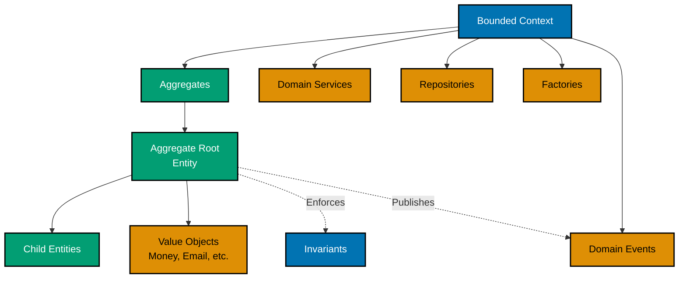
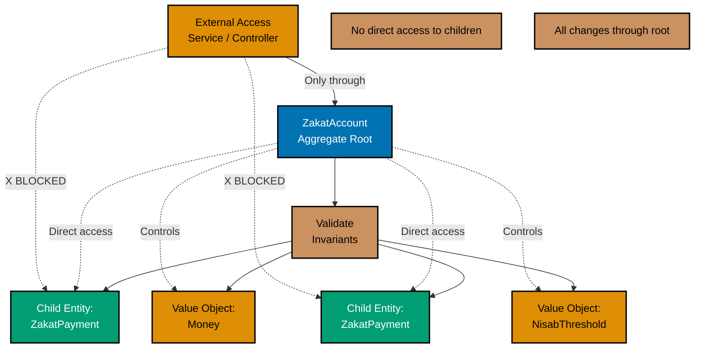
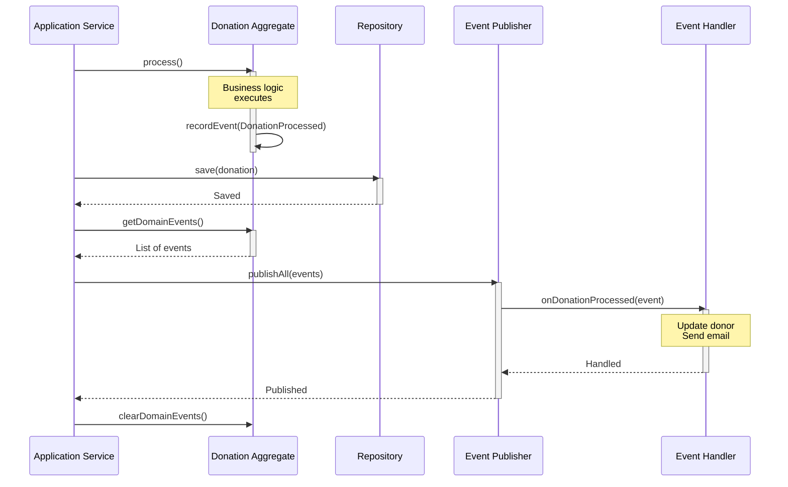
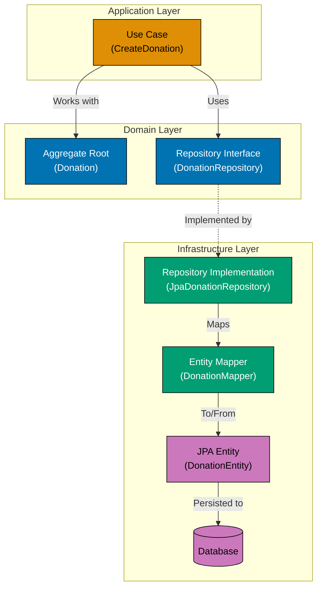
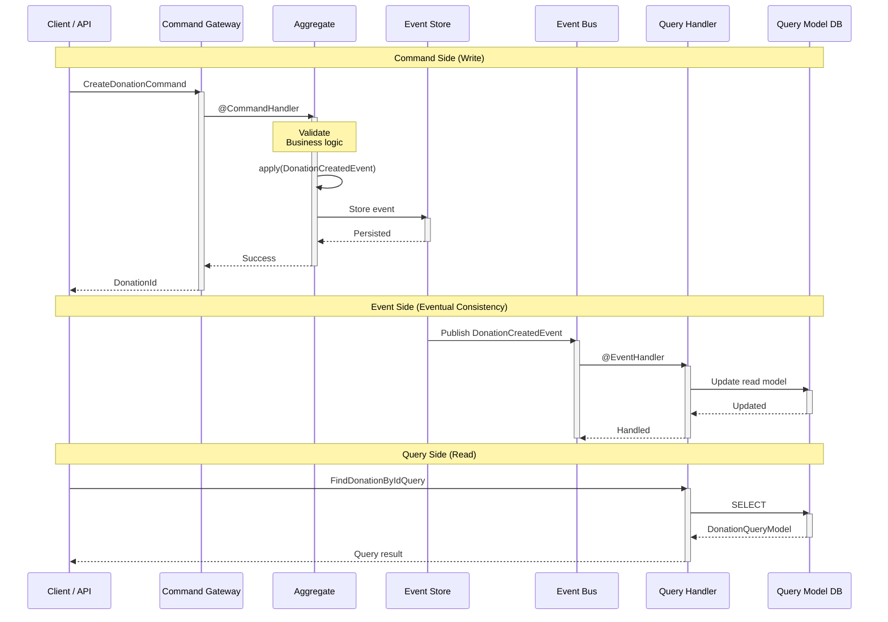

# Java Domain-Driven Design

**Quick Reference**: [Why DDD in Finance](#why-ddd-in-finance) | [Tactical DDD Patterns](#tactical-ddd-patterns) | [Value Objects](#value-objects) | [Entities](#entities) | [Aggregates](#aggregates) | [Domain Events](#domain-events) | [Repositories](#repositories) | [Domain Services](#domain-services) | [Axon Framework](#axon-framework) | [Spring Boot Integration](#spring-boot-integration) | [Testing DDD Code](#testing-ddd-code) | [DDD Checklist](#ddd-checklist) | [Sources](#sources) | [Related Documentation](#related-documentation) | [Related Principles](#related-principles)
**Understanding-oriented documentation** for implementing domain-driven design tactical patterns in Java applications.

## Quick Reference

**Jump to:**

- [Why DDD in Finance](#why-ddd-in-finance) - Domain context and benefits
- [Tactical DDD Patterns](#tactical-ddd-patterns) - Core building blocks
- [Value Objects](#value-objects) - Immutable domain primitives
- [Entities](#entities) - Objects with identity
- [Aggregates](#aggregates) - Consistency boundaries
- [Domain Events](#domain-events) - Significant domain occurrences
- [Repositories](#repositories) - Persistence abstraction
- [Domain Services](#domain-services) - Domain logic without entity home
- [Axon Framework](#axon-framework) - CQRS and event sourcing
- [Spring Boot Integration](#spring-boot-integration) - DDD with Spring

**Related Documentation:**

- [Java Idioms](./ex-so-stla-ja__idioms.md) - Records for value objects, sealed classes for aggregates
- [Java Type Safety](./ex-so-stla-ja__type-safety.md) - Type-safe domain models
- [Java Functional Programming](./ex-so-stla-ja__functional-programming.md) - Immutable domain models
- [Test-Driven Development](./ex-so-stla-ja__test-driven-development.md) - Testing domain models
- [Platform DDD Overview](../../architecture/domain-driven-design-ddd/README.md) - Strategic DDD

DDD tactical patterns in Java align with [software engineering principles](../../../../../governance/principles/software-engineering/README.md):

- **Value Objects** (records) embody [Immutability](../../../../../governance/principles/software-engineering/immutability.md)
- **Domain Services** implement [Pure Functions](../../../../../governance/principles/software-engineering/pure-functions.md) for business logic
- **Aggregates** enforce [Explicit Over Implicit](../../../../../governance/principles/software-engineering/explicit-over-implicit.md) boundaries
- **Factories** provide [Explicit Over Implicit](../../../../../governance/principles/software-engineering/explicit-over-implicit.md) object creation

## Why DDD in Finance

Domain-Driven Design is essential for financial systems because it:

- **Models complex business rules**: Zakat calculation, qard_hasan contracts, donation allocation
- **Ensures data consistency**: Aggregates maintain invariants
- **Provides clear audit trails**: Domain events capture all state changes
- **Enables regulatory compliance**: Explicit domain model matches legal requirements
- **Facilitates ubiquitous language**: Business and technical teams share vocabulary

**Example: Without DDD vs With DDD**

```java
// WITHOUT DDD: Anemic domain model
public class Donation {
    private String id;
    private BigDecimal amount;  // Just data!
    private String donorId;

    // Getters and setters only - no business logic
}

@Service
public class DonationService {
    // Business logic scattered in services
    public void processDonation(Donation donation) {
        // Validation here
        if (donation.getAmount().compareTo(BigDecimal.ZERO) <= 0) {
            throw new IllegalArgumentException("Amount must be positive");
        }

        // Business rules here
        BigDecimal fee = donation.getAmount().multiply(new BigDecimal("0.03"));
        BigDecimal netAmount = donation.getAmount().subtract(fee);

        // Persistence here
        donationRepository.save(donation);

        // Event publishing here
        eventPublisher.publish(new DonationProcessedEvent(donation.getId()));
    }
}

// WITH DDD: Rich domain model
public class Donation {  // Aggregate Root
    private final DonationId id;
    private Money amount;  // Value Object
    private final DonorId donorId;  // Value Object
    private DonationStatus status;
    private final List<DomainEvent> domainEvents = new ArrayList<>();

    // Factories enforce invariants
    public static Donation create(DonorId donorId, Money amount) {
        if (amount.isNegativeOrZero()) {
            throw new InvalidDonationException("Amount must be positive");
        }

        Donation donation = new Donation(
            DonationId.generate(),
            donorId,
            amount,
            DonationStatus.PENDING
        );

        donation.recordEvent(new DonationCreated(donation.getId(), donorId, amount));
        return donation;
    }

    // Business logic encapsulated
    public void process() {
        if (this.status != DonationStatus.PENDING) {
            throw new IllegalStateException("Can only process pending donations");
        }

        Money fee = this.amount.calculateFee(FeeRate.STANDARD);
        Money netAmount = this.amount.subtract(fee);

        this.status = DonationStatus.PROCESSED;

        recordEvent(new DonationProcessed(
            this.id,
            netAmount,
            fee,
            LocalDateTime.now()
        ));
    }

    // Aggregate protects invariants
    private Donation(DonationId id, DonorId donorId, Money amount, DonationStatus status) {
        this.id = id;
        this.donorId = donorId;
        this.amount = amount;
        this.status = status;
    }
}

@Service
public class DonationApplicationService {
    // Service orchestrates, domain model contains logic
    @Transactional
    public DonationId processDonation(ProcessDonationCommand command) {
        Donor donor = donorRepository.findById(command.donorId())
            .orElseThrow(() -> new DonorNotFoundException(command.donorId()));

        Donation donation = Donation.create(command.donorId(), command.amount());
        donation.process();

        donationRepository.save(donation);
        eventPublisher.publishAll(donation.getDomainEvents());

        return donation.getId();
    }
}
```

## Tactical DDD Patterns

Tactical DDD patterns provide building blocks for implementing domain models.

### Pattern Hierarchy



### Core Building Blocks

1. **Value Objects**: Immutable objects defined by their attributes (Money, Email, Address)
2. **Entities**: Objects with unique identity (Donor, Account, DonationTransaction)
3. **Aggregates**: Clusters of entities/value objects treated as a unit
4. **Aggregate Root**: Entry point to aggregate, enforces invariants
5. **Domain Events**: Immutable records of significant domain occurrences
6. **Repositories**: Abstract storage/retrieval of aggregates
7. **Domain Services**: Operations that don't belong to entities
8. **Factories**: Complex object creation logic

## Value Objects

Value objects are immutable, defined by their attributes, and have no identity.

### Characteristics

- **Immutable**: Cannot be modified after creation
- **Defined by attributes**: Two value objects with same values are equal
- **No identity**: No ID field, equality based on all attributes
- **Self-validating**: Validation in constructor
- **Side-effect free**: Operations return new instances

### Example: Money Value Object

```java
public record Money(BigDecimal amount, Currency currency) {
    // Compact constructor validates invariants
    public Money {
        if (amount == null) {
            throw new IllegalArgumentException("Amount cannot be null");
        }
        if (currency == null) {
            throw new IllegalArgumentException("Currency cannot be null");
        }
        // Ensure consistent scale
        amount = amount.setScale(2, RoundingMode.HALF_UP);
    }

    // Factory methods
    public static Money of(BigDecimal amount, String currencyCode) {
        return new Money(amount, Currency.getInstance(currencyCode));
    }

    public static Money of(BigDecimal amount, Currency currency) {
        return new Money(amount, currency);
    }

    public static Money zero(Currency currency) {
        return new Money(BigDecimal.ZERO, currency);
    }

    // Business operations return new instances
    public Money add(Money other) {
        if (!this.currency.equals(other.currency)) {
            throw new CurrencyMismatchException(this.currency, other.currency);
        }
        return new Money(this.amount.add(other.amount), this.currency);
    }

    public Money subtract(Money other) {
        if (!this.currency.equals(other.currency)) {
            throw new CurrencyMismatchException(this.currency, other.currency);
        }
        return new Money(this.amount.subtract(other.amount), this.currency);
    }

    public Money multiply(BigDecimal factor) {
        return new Money(this.amount.multiply(factor), this.currency);
    }

    public Money divide(BigDecimal divisor, RoundingMode roundingMode) {
        return new Money(this.amount.divide(divisor, 2, roundingMode), this.currency);
    }

    // Query methods
    public boolean isNegative() {
        return amount.compareTo(BigDecimal.ZERO) < 0;
    }

    public boolean isNegativeOrZero() {
        return amount.compareTo(BigDecimal.ZERO) <= 0;
    }

    public boolean isGreaterThan(Money other) {
        if (!this.currency.equals(other.currency)) {
            throw new CurrencyMismatchException(this.currency, other.currency);
        }
        return this.amount.compareTo(other.amount) > 0;
    }

    // Domain-specific operations
    public Money calculateZakat() {
        return this.multiply(new BigDecimal("0.025"));  // 2.5%
    }

    public Money calculateFee(FeeRate feeRate) {
        return this.multiply(feeRate.value());
    }
}
```

### Example: Email Value Object

```java
public record EmailAddress(String value) {
    private static final Pattern EMAIL_PATTERN = Pattern.compile(
        "^[a-zA-Z0-9._%+-]+@[a-zA-Z0-9.-]+\\.[a-zA-Z]{2,}$"
    );

    // Compact constructor validates and normalizes
    public EmailAddress {
        if (value == null || value.isBlank()) {
            throw new IllegalArgumentException("Email cannot be null or blank");
        }

        String normalized = value.toLowerCase().trim();

        if (!EMAIL_PATTERN.matcher(normalized).matches()) {
            throw new IllegalArgumentException("Invalid email format: " + value);
        }

        value = normalized;
    }

    // Factory methods
    public static EmailAddress of(String email) {
        return new EmailAddress(email);
    }

    public static Optional<EmailAddress> tryParse(String email) {
        try {
            return Optional.of(new EmailAddress(email));
        } catch (IllegalArgumentException e) {
            return Optional.empty();
        }
    }

    // Domain operations
    public String getDomain() {
        return value.substring(value.indexOf('@') + 1);
    }

    public String getLocalPart() {
        return value.substring(0, value.indexOf('@'));
    }
}
```

### Example: Nisab Threshold Value Object

```java
public record NisabThreshold(Money amount, NisabType type) {
    public NisabThreshold {
        if (amount == null || amount.isNegativeOrZero()) {
            throw new IllegalArgumentException("Nisab amount must be positive");
        }
        if (type == null) {
            throw new IllegalArgumentException("Nisab type is required");
        }
    }

    // Well-known nisabs
    public static final NisabThreshold GOLD_85_GRAMS =
        new NisabThreshold(Money.of(new BigDecimal("85"), "XAU"), NisabType.GOLD);

    public static final NisabThreshold SILVER_595_GRAMS =
        new NisabThreshold(Money.of(new BigDecimal("595"), "XAG"), NisabType.SILVER);

    // Domain logic
    public boolean isMetBy(Money balance) {
        return balance.isGreaterThan(amount);
    }
}

public enum NisabType {
    GOLD,
    SILVER,
    CASH,
    LIVESTOCK,
    AGRICULTURAL_PRODUCE
}
```

## Entities

Entities have unique identity and lifecycle.

### Characteristics

- **Unique identity**: ID that persists throughout lifecycle
- **Mutable**: State can change (unlike value objects)
- **Equality by ID**: Two entities with same ID are equal
- **Lifecycle**: Created, modified, deleted
- **Encapsulated behavior**: Business logic within entity

### Example: Donor Entity

```java
public class Donor {
    private final DonorId id;
    private PersonName name;  // Value Object
    private EmailAddress email;  // Value Object
    private PhoneNumber phoneNumber;  // Value Object (optional)
    private Address address;  // Value Object
    private DonorStatus status;
    private final LocalDateTime createdAt;
    private LocalDateTime lastDonationAt;

    // Private constructor - use factory methods
    private Donor(
            DonorId id,
            PersonName name,
            EmailAddress email,
            PhoneNumber phoneNumber,
            Address address,
            DonorStatus status,
            LocalDateTime createdAt) {
        this.id = id;
        this.name = name;
        this.email = email;
        this.phoneNumber = phoneNumber;
        this.address = address;
        this.status = status;
        this.createdAt = createdAt;
    }

    // Factory method enforces invariants
    public static Donor register(
            PersonName name,
            EmailAddress email,
            PhoneNumber phoneNumber,
            Address address) {

        DonorId id = DonorId.generate();
        LocalDateTime now = LocalDateTime.now();

        return new Donor(
            id,
            name,
            email,
            phoneNumber,
            address,
            DonorStatus.ACTIVE,
            now
        );
    }

    // Business methods express domain operations
    public void updateContactInfo(EmailAddress newEmail, PhoneNumber newPhoneNumber) {
        if (this.status == DonorStatus.SUSPENDED) {
            throw new IllegalStateException("Cannot update suspended donor");
        }
        this.email = newEmail;
        this.phoneNumber = newPhoneNumber;
    }

    public void recordDonation(LocalDateTime donationTime) {
        this.lastDonationAt = donationTime;
    }

    public void suspend(String reason) {
        if (this.status == DonorStatus.SUSPENDED) {
            throw new IllegalStateException("Donor already suspended");
        }
        this.status = DonorStatus.SUSPENDED;
    }

    public void reactivate() {
        if (this.status != DonorStatus.SUSPENDED) {
            throw new IllegalStateException("Only suspended donors can be reactivated");
        }
        this.status = DonorStatus.ACTIVE;
    }

    // Equality based on ID
    @Override
    public boolean equals(Object obj) {
        if (this == obj) return true;
        if (!(obj instanceof Donor other)) return false;
        return this.id.equals(other.id);
    }

    @Override
    public int hashCode() {
        return id.hashCode();
    }

    // Getters
    public DonorId getId() { return id; }
    public PersonName getName() { return name; }
    public EmailAddress getEmail() { return email; }
    public PhoneNumber getPhoneNumber() { return phoneNumber; }
    public Address getAddress() { return address; }
    public DonorStatus getStatus() { return status; }
    public LocalDateTime getCreatedAt() { return createdAt; }
    public Optional<LocalDateTime> getLastDonationAt() {
        return Optional.ofNullable(lastDonationAt);
    }
}

public enum DonorStatus {
    ACTIVE,
    SUSPENDED,
    INACTIVE
}
```

### Example: Strongly-Typed IDs

```java
// Base class for type-safe IDs
public abstract class TypedId {
    private final String value;

    protected TypedId(String value) {
        if (value == null || value.isBlank()) {
            throw new IllegalArgumentException("ID cannot be null or blank");
        }
        this.value = value;
    }

    public String getValue() {
        return value;
    }

    @Override
    public boolean equals(Object obj) {
        if (this == obj) return true;
        if (obj == null || getClass() != obj.getClass()) return false;
        TypedId other = (TypedId) obj;
        return value.equals(other.value);
    }

    @Override
    public int hashCode() {
        return value.hashCode();
    }

    @Override
    public String toString() {
        return value;
    }
}

// Specific ID types
public class DonorId extends TypedId {
    private DonorId(String value) {
        super(value);
    }

    public static DonorId of(String value) {
        return new DonorId(value);
    }

    public static DonorId generate() {
        return new DonorId("DONOR-" + UUID.randomUUID());
    }
}

public class DonationId extends TypedId {
    private DonationId(String value) {
        super(value);
    }

    public static DonationId of(String value) {
        return new DonationId(value);
    }

    public static DonationId generate() {
        return new DonationId("DON-" + UUID.randomUUID());
    }
}

// Benefit: Cannot mix up IDs at compile time
public void processDonation(DonationId donationId, DonorId donorId) {
    // Type-safe!
}

// COMPILE ERROR: Cannot swap IDs
// processDonation(donorId, donationId);
```

## Aggregates

Aggregates are clusters of entities and value objects treated as a unit for data changes.

### Characteristics

- **Consistency boundary**: Invariants enforced within aggregate
- **Single aggregate root**: External references go through root
- **Atomic persistence**: Saved/loaded as a unit
- **Small size**: Keep aggregates focused (avoid large object graphs)
- **Reference by ID**: Aggregates reference others by ID, not object reference

### Example: Zakat Account Aggregate

```java
public class ZakatAccount {  // Aggregate Root
    private final ZakatAccountId id;
    private final DonorId donorId;  // Reference by ID, not object
    private Money balance;
    private final NisabThreshold nisab;
    private final LocalDate haulStartDate;
    private final List<ZakatPayment> payments;  // Child entities
    private final List<DomainEvent> domainEvents;

    // Private constructor
    private ZakatAccount(
            ZakatAccountId id,
            DonorId donorId,
            Money initialBalance,
            NisabThreshold nisab,
            LocalDate haulStartDate) {

        this.id = id;
        this.donorId = donorId;
        this.balance = initialBalance;
        this.nisab = nisab;
        this.haulStartDate = haulStartDate;
        this.payments = new ArrayList<>();
        this.domainEvents = new ArrayList<>();
    }

    // Factory method enforces invariants
    public static ZakatAccount open(
            DonorId donorId,
            Money initialBalance,
            NisabThreshold nisab) {

        if (initialBalance.isNegative()) {
            throw new IllegalArgumentException("Initial balance cannot be negative");
        }

        LocalDate haulStart = LocalDate.now();
        ZakatAccountId id = ZakatAccountId.generate();

        ZakatAccount donation_account = new ZakatAccount(
            id,
            donorId,
            initialBalance,
            nisab,
            haulStart
        );

        donation_account.recordEvent(new ZakatAccountOpened(
            id,
            donorId,
            initialBalance,
            haulStart
        ));

        return donation_account;
    }

    // Business methods maintain invariants
    public void deposit(Money amount) {
        if (amount.isNegativeOrZero()) {
            throw new IllegalArgumentException("Deposit amount must be positive");
        }

        if (!amount.currency().equals(this.balance.currency())) {
            throw new CurrencyMismatchException(
                this.balance.currency(),
                amount.currency()
            );
        }

        this.balance = this.balance.add(amount);

        recordEvent(new BalanceIncreased(this.id, amount, this.balance));
    }

    public ZakatCalculationResult calculateZakat(LocalDate currentDate) {
        // Enforce invariant: haul must be complete
        LocalDate haulEnd = haulStartDate.plusYears(1);
        if (currentDate.isBefore(haulEnd)) {
            long daysRemaining = ChronoUnit.DAYS.between(currentDate, haulEnd);
            return new HaulIncomplete(haulStartDate, currentDate, daysRemaining);
        }

        // Check nisab
        if (!nisab.isMetBy(balance)) {
            return new BelowNisab(balance, nisab.amount());
        }

        // Calculate zakat
        Money zakatDue = balance.calculateZakat();
        return new ZakatDue(zakatDue, balance);
    }

    public void payZakat(Money amount, LocalDate paymentDate) {
        // Validate donation
        if (amount.isNegativeOrZero()) {
            throw new IllegalArgumentException("DonationPayment amount must be positive");
        }

        if (amount.isGreaterThan(balance)) {
            throw new InsufficientBalanceException(balance, amount);
        }

        // Create donation (child entity)
        ZakatPayment donation = new ZakatPayment(
            ZakatPaymentId.generate(),
            amount,
            paymentDate
        );

        // Update aggregate state
        this.payments.add(donation);
        this.balance = this.balance.subtract(amount);

        // Record domain event
        recordEvent(new ZakatPaid(this.id, amount, paymentDate));
    }

    // Aggregate root controls access to children
    public List<ZakatPayment> getPayments() {
        return Collections.unmodifiableList(payments);  // Defensive copy
    }

    // Aggregate root exposes domain events
    public List<DomainEvent> getDomainEvents() {
        return Collections.unmodifiableList(domainEvents);
    }

    public void clearDomainEvents() {
        this.domainEvents.clear();
    }

    private void recordEvent(DomainEvent event) {
        this.domainEvents.add(event);
    }

    // Getters
    public ZakatAccountId getId() { return id; }
    public DonorId getDonorId() { return donorId; }
    public Money getBalance() { return balance; }
    public NisabThreshold getNisab() { return nisab; }
    public LocalDate getHaulStartDate() { return haulStartDate; }
}

// Child entity (within aggregate)
class ZakatPayment {
    private final ZakatPaymentId id;
    private final Money amount;
    private final LocalDate paymentDate;

    ZakatPayment(ZakatPaymentId id, Money amount, LocalDate paymentDate) {
        this.id = id;
        this.amount = amount;
        this.paymentDate = paymentDate;
    }

    // Getters only - mutations go through aggregate root
    public ZakatPaymentId getId() { return id; }
    public Money getAmount() { return amount; }
    public LocalDate getPaymentDate() { return paymentDate; }
}
```

**Aggregate Boundary Pattern:**



### Aggregate Design Rules

**Rule 1: Model True Invariants in Consistency Boundaries**

```java
// GOOD: Zakat donation_account maintains consistency
public class ZakatAccount {
    public void payZakat(Money amount) {
        // Invariant: balance >= amount
        if (amount.isGreaterThan(balance)) {
            throw new InsufficientBalanceException(balance, amount);
        }
        this.balance = this.balance.subtract(amount);
        // Consistency maintained within donation_transaction
    }
}

// BAD: Splitting causes inconsistency
public class ZakatAccountBad {
    // Just stores balance
}

public class ZakatPaymentServiceBad {
    @Transactional
    public void payZakat(ZakatAccountId accountId, Money amount) {
        ZakatAccountBad donation_account = repository.findById(accountId);
        // Race condition! Another thread might withdraw between these lines
        if (amount.isGreaterThan(donation_account.getBalance())) {
            throw new InsufficientBalanceException();
        }
        donation_account.setBalance(donation_account.getBalance().subtract(amount));
        // Invariant could be violated!
    }
}
```

**Rule 2: Design Small Aggregates**

```java
// GOOD: Small aggregate focused on core invariants
public class Donation {
    private final DonationId id;
    private final DonorId donorId;  // Reference by ID
    private Money amount;
    private DonationStatus status;

    // Focused on donation lifecycle only
}

// BAD: Large aggregate with unnecessary data
public class DonationBad {
    private final DonationId id;
    private Donor donor;  // Entire donor object!
    private Fund fund;    // Entire fund object!
    private List<DonationTransaction> relatedTransactions;  // Unbounded!
    private List<AuditLog> auditLogs;  // Unbounded!
    // Too much data, performance problems
}
```

**Rule 3: Reference Other Aggregates by ID**

```java
// GOOD: Reference by ID
public class Donation {
    private final DonationId id;
    private final DonorId donorId;  // ID only
    private final FundId fundId;    // ID only
}

// Service loads aggregates separately
@Service
public class DonationService {
    public void allocateDonation(DonationId donationId, FundId fundId) {
        Donation donation = donationRepository.findById(donationId)
            .orElseThrow();
        Fund fund = fundRepository.findById(fundId)
            .orElseThrow();

        // Each aggregate in separate donation_transaction if needed
        donation.allocateTo(fundId);
        fund.receiveAllocation(donation.getAmount());

        donationRepository.save(donation);
        fundRepository.save(fund);
    }
}

// BAD: Direct object references
public class DonationBad {
    private Donor donor;  // Direct reference
    private Fund fund;    // Direct reference
    // Violates aggregate boundaries!
}
```

**Rule 4: Update One Aggregate Per DonationTransaction**

```java
// GOOD: Update one aggregate
@Transactional
public void processDonation(DonationId donationId) {
    Donation donation = donationRepository.findById(donationId)
        .orElseThrow();

    donation.process();  // Single aggregate modified

    donationRepository.save(donation);
    eventPublisher.publishAll(donation.getDomainEvents());
    // Domain events trigger eventual consistency for other aggregates
}

// ACCEPTABLE: Multiple aggregates if immediate consistency required
@Transactional
public void transferFunds(AccountId fromId, AccountId toId, Money amount) {
    Account from = accountRepository.findById(fromId).orElseThrow();
    Account to = accountRepository.findById(toId).orElseThrow();

    // Withdraw and deposit must be atomic
    from.withdraw(amount);
    to.deposit(amount);

    accountRepository.save(from);
    accountRepository.save(to);
}
```

## Domain Events

Domain events capture significant occurrences in the domain.

### Characteristics

- **Immutable**: Cannot be changed once created
- **Past tense naming**: DonationProcessed, ZakatPaid, AccountOpened
- **Timestamp**: When event occurred
- **Complete data**: Contains all relevant information
- **Aggregate ID**: Which aggregate produced the event

### Example: Domain Events

```java
// Base interface
public interface DomainEvent {
    String getEventId();
    LocalDateTime getOccurredAt();
}

// Concrete events
public record DonationCreated(
    String eventId,
    DonationId donationId,
    DonorId donorId,
    Money amount,
    LocalDateTime occurredAt
) implements DomainEvent {
    public DonationCreated(DonationId donationId, DonorId donorId, Money amount) {
        this(
            UUID.randomUUID().toString(),
            donationId,
            donorId,
            amount,
            LocalDateTime.now()
        );
    }

    @Override
    public String getEventId() { return eventId; }

    @Override
    public LocalDateTime getOccurredAt() { return occurredAt; }
}

public record DonationProcessed(
    String eventId,
    DonationId donationId,
    Money netAmount,
    Money fee,
    LocalDateTime occurredAt
) implements DomainEvent {
    public DonationProcessed(DonationId donationId, Money netAmount, Money fee) {
        this(
            UUID.randomUUID().toString(),
            donationId,
            netAmount,
            fee,
            LocalDateTime.now()
        );
    }

    @Override
    public String getEventId() { return eventId; }

    @Override
    public LocalDateTime getOccurredAt() { return occurredAt; }
}

public record ZakatPaid(
    String eventId,
    ZakatAccountId accountId,
    Money amount,
    LocalDate paymentDate,
    LocalDateTime occurredAt
) implements DomainEvent {
    public ZakatPaid(ZakatAccountId accountId, Money amount, LocalDate paymentDate) {
        this(
            UUID.randomUUID().toString(),
            accountId,
            amount,
            paymentDate,
            LocalDateTime.now()
        );
    }

    @Override
    public String getEventId() { return eventId; }

    @Override
    public LocalDateTime getOccurredAt() { return occurredAt; }
}
```

### Event Publishing

```java
public class Donation {
    private final List<DomainEvent> domainEvents = new ArrayList<>();

    // Business method records event
    public void process() {
        // ... business logic ...

        recordEvent(new DonationProcessed(
            this.id,
            this.netAmount,
            this.fee
        ));
    }

    private void recordEvent(DomainEvent event) {
        this.domainEvents.add(event);
    }

    public List<DomainEvent> getDomainEvents() {
        return Collections.unmodifiableList(domainEvents);
    }

    public void clearDomainEvents() {
        this.domainEvents.clear();
    }
}

// Service publishes events after save
@Service
public class DonationApplicationService {
    private final DonationRepository donationRepository;
    private final DomainEventPublisher eventPublisher;

    @Transactional
    public void processDonation(DonationId donationId) {
        Donation donation = donationRepository.findById(donationId)
            .orElseThrow();

        donation.process();

        donationRepository.save(donation);

        // Publish events after successful save
        eventPublisher.publishAll(donation.getDomainEvents());
        donation.clearDomainEvents();
    }
}
```

**Domain Event Flow:**



### Event Handlers

```java
@Component
public class DonationEventHandler {
    private final EmailService emailService;
    private final DonorRepository donorRepository;

    // Handle domain event
    @EventListener
    @Transactional
    public void onDonationProcessed(DonationProcessed event) {
        // Update donor last donation timestamp
        Donor donor = donorRepository.findByDonationId(event.donationId())
            .orElseThrow();

        donor.recordDonation(event.occurredAt());
        donorRepository.save(donor);

        // Send thank you email (side effect)
        emailService.sendDonationReceipt(
            donor.getEmail(),
            event.donationId(),
            event.netAmount()
        );
    }

    @EventListener
    public void onZakatPaid(ZakatPaid event) {
        // Update read model, send notifications, etc.
        logger.info("Zakat paid: {} for donation_account {}",
            event.amount(), event.accountId());
    }
}
```

## Repositories

Repositories abstract persistence and retrieval of aggregates.

### Characteristics

- **One repository per aggregate root**: Not per entity
- **Collection-like interface**: Add, remove, find methods
- **Persistence agnostic**: Domain doesn't know about database
- **Atomic operations**: Save/load entire aggregate

### Repository Pattern Architecture



**Key Points**:

- **Domain Layer**: Defines repository interface and aggregate - knows nothing about persistence
- **Infrastructure Layer**: Implements repository with JPA/JDBC - handles technical details
- **Dependency Inversion**: Domain doesn't depend on infrastructure
- **Mapper**: Converts between domain aggregates and persistence entities

### Example: Repository Interface

```java
// Domain layer - persistence-agnostic interface
public interface DonationRepository {
    // Save aggregate
    void save(Donation donation);

    // Find by ID
    Optional<Donation> findById(DonationId id);

    // Delete aggregate
    void remove(DonationId id);

    // Query methods (return aggregates or IDs)
    List<Donation> findByDonor(DonorId donorId);
    List<Donation> findByStatus(DonationStatus status);
    List<DonationId> findPendingDonationIds();

    // Existence check
    boolean exists(DonationId id);
}
```

### Example: JPA Repository Implementation

```java
// Infrastructure layer - JPA implementation
@Repository
public class JpaDonationRepository implements DonationRepository {
    private final DonationJpaRepository jpaRepository;

    public JpaDonationRepository(DonationJpaRepository jpaRepository) {
        this.jpaRepository = jpaRepository;
    }

    @Override
    public void save(Donation donation) {
        DonationEntity entity = DonationMapper.toEntity(donation);
        jpaRepository.save(entity);
    }

    @Override
    public Optional<Donation> findById(DonationId id) {
        return jpaRepository.findById(id.getValue())
            .map(DonationMapper::toDomain);
    }

    @Override
    public void remove(DonationId id) {
        jpaRepository.deleteById(id.getValue());
    }

    @Override
    public List<Donation> findByDonor(DonorId donorId) {
        return jpaRepository.findByDonorId(donorId.getValue())
            .stream()
            .map(DonationMapper::toDomain)
            .toList();
    }

    @Override
    public List<Donation> findByStatus(DonationStatus status) {
        return jpaRepository.findByStatus(status)
            .stream()
            .map(DonationMapper::toDomain)
            .toList();
    }

    @Override
    public List<DonationId> findPendingDonationIds() {
        return jpaRepository.findIdsByStatus(DonationStatus.PENDING)
            .stream()
            .map(DonationId::of)
            .toList();
    }

    @Override
    public boolean exists(DonationId id) {
        return jpaRepository.existsById(id.getValue());
    }
}

// Spring Data JPA interface
interface DonationJpaRepository extends JpaRepository<DonationEntity, String> {
    List<DonationEntity> findByDonorId(String donorId);
    List<DonationEntity> findByStatus(DonationStatus status);

    @Query("SELECT d.id FROM DonationEntity d WHERE d.status = :status")
    List<String> findIdsByStatus(@Param("status") DonationStatus status);
}
```

### Repository Anti-Patterns

**❌ Don't expose implementation details**:

```java
// BAD: Leaks JPA details
public interface DonationRepository {
    EntityManager getEntityManager();  // NO!
    void flush();  // NO!
    void refresh(Donation donation);  // NO!
}
```

**❌ Don't create repositories for non-aggregates**:

```java
// BAD: Repository for child entity
public interface ZakatPaymentRepository {  // NO!
    // ZakatPayment is part of ZakatAccount aggregate
    // Access through ZakatAccountRepository instead
}

// GOOD: Access through aggregate root
public interface ZakatAccountRepository {
    Optional<ZakatAccount> findById(ZakatAccountId id);
    // Returns entire aggregate including payments
}
```

**❌ Don't return DTOs from repositories**:

```java
// BAD: Returns DTO
public interface DonationRepository {
    List<DonationDTO> findAll();  // NO!
}

// GOOD: Returns domain objects
public interface DonationRepository {
    List<Donation> findAll();
}
```

## Domain Services

Domain services contain domain logic that doesn't naturally fit within entities or value objects.

### When to Use Domain Services

- **Multi-aggregate operations**: Logic spanning multiple aggregates
- **Complex calculations**: Algorithms that don't belong to one entity
- **External system integration**: Calling external services with domain logic
- **Policy enforcement**: Business rules that aren't entity-specific

### Example: Zakat Calculation Service

```java
@Service
public class ZakatCalculationService {
    // Domain logic that doesn't belong to any single entity

    public ZakatCalculationResult calculateZakatDue(
            Money balance,
            NisabThreshold nisab,
            LocalDate haulStartDate,
            LocalDate currentDate) {

        // Complex business rules
        LocalDate haulEndDate = haulStartDate.plusYears(1);

        if (currentDate.isBefore(haulEndDate)) {
            long daysRemaining = ChronoUnit.DAYS.between(currentDate, haulEndDate);
            return new HaulIncomplete(haulStartDate, currentDate, daysRemaining);
        }

        if (!nisab.isMetBy(balance)) {
            return new BelowNisab(balance, nisab.amount());
        }

        Money zakatDue = balance.calculateZakat();
        return new ZakatDue(zakatDue, balance);
    }

    public Money convertToLocalCurrency(Money amount, Currency targetCurrency) {
        // Currency conversion logic
        if (amount.currency().equals(targetCurrency)) {
            return amount;
        }

        ExchangeRate rate = exchangeRateService.getRate(
            amount.currency(),
            targetCurrency
        );

        return amount.convert(rate, targetCurrency);
    }
}
```

### Example: Donation Allocation Service

```java
@Service
public class DonationAllocationService {
    // Coordinates allocation across multiple aggregates

    @Transactional
    public AllocationResult allocate(
            DonationId donationId,
            List<AllocationRule> rules) {

        Donation donation = donationRepository.findById(donationId)
            .orElseThrow();

        List<FundAllocation> allocations = calculateAllocations(
            donation.getAmount(),
            rules
        );

        // Publish event for eventual consistency
        eventPublisher.publish(new DonationAllocated(
            donationId,
            allocations,
            LocalDateTime.now()
        ));

        return new AllocationResult(donationId, allocations);
    }

    private List<FundAllocation> calculateAllocations(
            Money totalAmount,
            List<AllocationRule> rules) {

        // Complex allocation algorithm
        BigDecimal totalPercentage = rules.stream()
            .map(AllocationRule::percentage)
            .reduce(BigDecimal.ZERO, BigDecimal::add);

        if (totalPercentage.compareTo(BigDecimal.ONE) != 0) {
            throw new InvalidAllocationException("Percentages must sum to 100%");
        }

        return rules.stream()
            .map(rule -> new FundAllocation(
                rule.fundId(),
                totalAmount.multiply(rule.percentage())
            ))
            .toList();
    }
}

public record AllocationRule(FundId fundId, BigDecimal percentage) {
    public AllocationRule {
        if (percentage.compareTo(BigDecimal.ZERO) <= 0 ||
            percentage.compareTo(BigDecimal.ONE) > 0) {
            throw new IllegalArgumentException("Percentage must be (0, 1]");
        }
    }
}
```

## Axon Framework

Axon Framework supports CQRS (Command Query Responsibility Segregation) and Event Sourcing.

### Installation

**Maven**:

```xml
<dependency>
    <groupId>org.axonframework</groupId>
    <artifactId>axon-spring-boot-starter</artifactId>
    <version>4.10.3</version>
</dependency>
```

### Example: Aggregate with Axon

```java
@Aggregate
public class Donation {
    @AggregateIdentifier
    private DonationId donationId;

    private DonorId donorId;
    private Money amount;
    private DonationStatus status;

    // Required no-arg constructor for Axon
    protected Donation() {}

    // Command handler: creates aggregate
    @CommandHandler
    public Donation(CreateDonationCommand command) {
        // Validate
        if (command.amount().isNegativeOrZero()) {
            throw new IllegalArgumentException("Amount must be positive");
        }

        // Apply event
        apply(new DonationCreatedEvent(
            command.donationId(),
            command.donorId(),
            command.amount()
        ));
    }

    // Event sourcing handler: rebuilds state
    @EventSourcingHandler
    public void on(DonationCreatedEvent event) {
        this.donationId = event.donationId();
        this.donorId = event.donorId();
        this.amount = event.amount();
        this.status = DonationStatus.PENDING;
    }

    // Command handler: modifies aggregate
    @CommandHandler
    public void handle(ProcessDonationCommand command) {
        // Guard
        if (this.status != DonationStatus.PENDING) {
            throw new IllegalStateException("Can only process pending donations");
        }

        // Calculate
        Money fee = this.amount.calculateFee(FeeRate.STANDARD);
        Money netAmount = this.amount.subtract(fee);

        // Apply event
        apply(new DonationProcessedEvent(
            this.donationId,
            netAmount,
            fee
        ));
    }

    @EventSourcingHandler
    public void on(DonationProcessedEvent event) {
        this.status = DonationStatus.PROCESSED;
    }
}

// Commands
public record CreateDonationCommand(
    @TargetAggregateIdentifier DonationId donationId,
    DonorId donorId,
    Money amount
) {}

public record ProcessDonationCommand(
    @TargetAggregateIdentifier DonationId donationId
) {}

// Events
public record DonationCreatedEvent(
    DonationId donationId,
    DonorId donorId,
    Money amount
) {}

public record DonationProcessedEvent(
    DonationId donationId,
    Money netAmount,
    Money fee
) {}
```

### Sending Commands

```java
@Service
public class DonationCommandService {
    private final CommandGateway commandGateway;

    // Send command
    public CompletableFuture<DonationId> createDonation(
            DonorId donorId,
            Money amount) {

        DonationId donationId = DonationId.generate();

        CreateDonationCommand command = new CreateDonationCommand(
            donationId,
            donorId,
            amount
        );

        return commandGateway.send(command);
    }

    public CompletableFuture<Void> processDonation(DonationId donationId) {
        ProcessDonationCommand command = new ProcessDonationCommand(donationId);
        return commandGateway.send(command);
    }
}
```

### Query Side (CQRS)

```java
// Query model (read-optimized)
@Entity
@Table(name = "donation_query")
public class DonationQueryModel {
    @Id
    private String donationId;
    private String donorId;
    private BigDecimal amount;
    private String currency;
    private String status;
    private LocalDateTime createdAt;
    private LocalDateTime processedAt;

    // Getters, setters, constructors
}

// Event handler updates query model
@Component
public class DonationQueryModelUpdater {
    @Autowired
    private DonationQueryRepository queryRepository;

    @EventHandler
    public void on(DonationCreatedEvent event) {
        DonationQueryModel model = new DonationQueryModel();
        model.setDonationId(event.donationId().getValue());
        model.setDonorId(event.donorId().getValue());
        model.setAmount(event.amount().getAmount());
        model.setCurrency(event.amount().currency().getCurrencyCode());
        model.setStatus("PENDING");
        model.setCreatedAt(LocalDateTime.now());

        queryRepository.save(model);
    }

    @EventHandler
    public void on(DonationProcessedEvent event) {
        queryRepository.findById(event.donationId().getValue())
            .ifPresent(model -> {
                model.setStatus("PROCESSED");
                model.setProcessedAt(LocalDateTime.now());
                queryRepository.save(model);
            });
    }
}

// Query handler
@Component
public class DonationQueryHandler {
    @Autowired
    private DonationQueryRepository queryRepository;

    @QueryHandler
    public List<DonationQueryModel> handle(FindDonationsByDonorQuery query) {
        return queryRepository.findByDonorId(query.donorId().getValue());
    }

    @QueryHandler
    public Optional<DonationQueryModel> handle(FindDonationByIdQuery query) {
        return queryRepository.findById(query.donationId().getValue());
    }
}

// Queries
public record FindDonationsByDonorQuery(DonorId donorId) {}
public record FindDonationByIdQuery(DonationId donationId) {}
```

**Axon Framework CQRS Flow:**



## Spring Boot Integration

### Configuration

```java
@Configuration
@EnableJpaRepositories(basePackages = "com.sharia.finance.finance.infrastructure.persistence")
@EntityScan(basePackages = "com.sharia.finance.finance.infrastructure.persistence")
public class PersistenceConfiguration {
    // JPA configuration
}

@Configuration
public class DomainConfiguration {
    @Bean
    public DomainEventPublisher domainEventPublisher(ApplicationEventPublisher publisher) {
        return new SpringDomainEventPublisher(publisher);
    }
}
```

### Application Service

```java
@Service
@Transactional
public class DonationApplicationService {
    private final DonationRepository donationRepository;
    private final DonorRepository donorRepository;
    private final DomainEventPublisher eventPublisher;

    public DonationApplicationService(
            DonationRepository donationRepository,
            DonorRepository donorRepository,
            DomainEventPublisher eventPublisher) {
        this.donationRepository = donationRepository;
        this.donorRepository = donorRepository;
        this.eventPublisher = eventPublisher;
    }

    public DonationId createDonation(CreateDonationCommand command) {
        // Validate donor exists
        Donor donor = donorRepository.findById(command.donorId())
            .orElseThrow(() -> new DonorNotFoundException(command.donorId()));

        // Create aggregate
        Donation donation = Donation.create(
            command.donorId(),
            command.amount()
        );

        // Persist
        donationRepository.save(donation);

        // Publish events
        eventPublisher.publishAll(donation.getDomainEvents());
        donation.clearDomainEvents();

        return donation.getId();
    }

    public void processDonation(ProcessDonationCommand command) {
        Donation donation = donationRepository.findById(command.donationId())
            .orElseThrow(() -> new DonationNotFoundException(command.donationId()));

        donation.process();

        donationRepository.save(donation);

        eventPublisher.publishAll(donation.getDomainEvents());
        donation.clearDomainEvents();
    }
}
```

### REST Controller

```java
@RestController
@RequestMapping("/api/donations")
public class DonationController {
    private final DonationApplicationService donationService;
    private final DonationQueryService queryService;

    @PostMapping
    public ResponseEntity<DonationResponse> createDonation(
            @RequestBody @Valid CreateDonationRequest request) {

        CreateDonationCommand command = new CreateDonationCommand(
            DonorId.of(request.donorId()),
            Money.of(request.amount(), request.currency())
        );

        DonationId donationId = donationService.createDonation(command);

        DonationResponse response = queryService.findById(donationId)
            .map(DonationResponse::from)
            .orElseThrow();

        return ResponseEntity.ok(response);
    }

    @PostMapping("/{id}/process")
    public ResponseEntity<Void> processDonation(@PathVariable String id) {
        DonationId donationId = DonationId.of(id);

        ProcessDonationCommand command = new ProcessDonationCommand(donationId);
        donationService.processDonation(command);

        return ResponseEntity.accepted().build();
    }

    @GetMapping("/{id}")
    public ResponseEntity<DonationResponse> getDonation(@PathVariable String id) {
        DonationId donationId = DonationId.of(id);

        return queryService.findById(donationId)
            .map(DonationResponse::from)
            .map(ResponseEntity::ok)
            .orElse(ResponseEntity.notFound().build());
    }
}
```

## Testing DDD Code

### Testing Value Objects

```java
@Test
void testMoneyAddition() {
    Money a = Money.of(new BigDecimal("100"), "USD");
    Money b = Money.of(new BigDecimal("50"), "USD");

    Money sum = a.add(b);

    assertThat(sum.getAmount()).isEqualByComparingTo(new BigDecimal("150"));
}

@Test
void testCannotAddDifferentCurrencies() {
    Money usd = Money.of(new BigDecimal("100"), "USD");
    Money eur = Money.of(new BigDecimal("50"), "EUR");

    assertThrows(CurrencyMismatchException.class, () -> usd.add(eur));
}
```

### Testing Aggregates

```java
@Test
void testCreateDonation() {
    DonorId donorId = DonorId.of("DONOR-123");
    Money amount = Money.of(new BigDecimal("1000"), "USD");

    Donation donation = Donation.create(donorId, amount);

    assertThat(donation.getId()).isNotNull();
    assertThat(donation.getAmount()).isEqualTo(amount);
    assertThat(donation.getStatus()).isEqualTo(DonationStatus.PENDING);

    // Verify event recorded
    assertThat(donation.getDomainEvents())
        .hasSize(1)
        .first()
        .isInstanceOf(DonationCreated.class);
}

@Test
void testProcessDonation() {
    Donation donation = createTestDonation();

    donation.process();

    assertThat(donation.getStatus()).isEqualTo(DonationStatus.PROCESSED);

    // Verify event
    List<DomainEvent> events = donation.getDomainEvents();
    DonationProcessed processedEvent = (DonationProcessed) events.get(1);
    assertThat(processedEvent.donationId()).isEqualTo(donation.getId());
}

@Test
void testCannotProcessNonPendingDonation() {
    Donation donation = createTestDonation();
    donation.process();  // Process once
    donation.clearDomainEvents();

    // Try to process again
    assertThrows(IllegalStateException.class, () -> donation.process());
}
```

### Testing Domain Services

```java
@Test
void testZakatCalculationBelowNisab() {
    Money balance = Money.of(new BigDecimal("4000"), "USD");
    NisabThreshold nisab = new NisabThreshold(
        Money.of(new BigDecimal("5000"), "USD"),
        NisabType.CASH
    );
    LocalDate haulStart = LocalDate.of(2025, 1, 1);
    LocalDate current = LocalDate.of(2026, 2, 1);

    ZakatCalculationResult result = zakatService.calculateZakatDue(
        balance,
        nisab,
        haulStart,
        current
    );

    assertThat(result).isInstanceOf(BelowNisab.class);
}
```

## DDD Checklist

### Design Phase

- [ ] Identify aggregates and their boundaries
- [ ] Design value objects for domain concepts (Money, Email, etc.)
- [ ] Determine aggregate roots and consistency boundaries
- [ ] Define domain events for significant occurrences
- [ ] Model entities with unique identity
- [ ] Identify domain services for multi-aggregate logic

### Implementation Phase

- [ ] Use records for value objects (immutable)
- [ ] Enforce invariants in aggregate roots
- [ ] Reference other aggregates by ID, not object
- [ ] Keep aggregates small and focused
- [ ] Use factories for complex creation
- [ ] Repositories return aggregates, not DTOs
- [ ] Domain events are immutable and past-tense
- [ ] One repository per aggregate root

### Testing Phase

- [ ] Test value object immutability
- [ ] Test aggregate invariants
- [ ] Test domain event recording
- [ ] Test domain service logic
- [ ] Integration tests for repositories

### Code Review Phase

- [ ] Aggregates maintain invariants
- [ ] Business logic in domain, not services
- [ ] Domain model is persistence-ignorant
- [ ] Ubiquitous language used in code
- [ ] Events capture all state changes

## Sources

### DDD Patterns and Practices

- [Domain-Driven Design with Java Frameworks: Implementing DDD with Spring Boot and Axon](https://softwarepatternslexicon.com/patterns-java/13/4/1/)
- [Using DDD with Java Frameworks](https://softwarepatternslexicon.com/java/domain-driven-design-ddd-patterns/applying-ddd-in-java/using-ddd-with-java-frameworks/)
- [Mastering the Basics of Domain-Driven Design with Java](https://javapro.io/2025/07/01/mastering-the-basics-of-domain-driven-design-with-java/)

### Tactical DDD Patterns

- [DDD Part 2: Tactical Domain-Driven Design](https://vaadin.com/blog/ddd-part-2-tactical-domain-driven-design)
- [Domain-Driven Design (DDD) - GeeksforGeeks](https://www.geeksforgeeks.org/system-design/domain-driven-design-ddd/)
- [Domain-Driven Design (DDD) and Hexagonal Architecture in Java](https://vaadin.com/blog/ddd-part-3-domain-driven-design-and-the-hexagonal-architecture)

### Axon Framework and CQRS

- [Building Microservices by applying DDD, CQRS and Event Sourcing on AXON, Java, Spring Boot platform](https://bawa-simar.medium.com/building-microservices-by-applying-ddd-cqrs-and-event-sourcing-on-axon-java-sprint-boot-platform-2e12289b8a2b)
- [Domain-Driven Design in Java](https://ddd.academy/domain-driven-design-in-java/)

## Related Documentation

### Core Java Documentation

- **[Java Idioms](./ex-so-stla-ja__idioms.md)** - Records for value objects, sealed classes for aggregates
- **[Java Type Safety](./ex-so-stla-ja__type-safety.md)** - Type-safe domain models
- **[Java Functional Programming](./ex-so-stla-ja__functional-programming.md)** - Immutable domain models

### Specialized Topics

- **[Test-Driven Development](./ex-so-stla-ja__test-driven-development.md)** - TDD for domain models
- **[Java Security](./ex-so-stla-ja__security.md)** - Secure domain models
- **[Java Concurrency](./ex-so-stla-ja__concurrency-and-parallelism.md)** - Thread-safe aggregates

### Platform Documentation

- **[Platform DDD Overview](../../architecture/domain-driven-design-ddd/README.md)** - Strategic DDD
- **[Tech Stack Languages Index](../README.md)** - Parent language documentation
- **[Software Design Index](../../README.md)** - Software documentation root

## Related Principles

Domain-Driven Design demonstrates core software engineering principles:

- **[Immutability Over Mutability](../../../../../governance/principles/software-engineering/immutability.md)** - Value objects as immutable domain primitives
- **[Pure Functions Over Side Effects](../../../../../governance/principles/software-engineering/pure-functions.md)** - Domain services with pure business logic
- **[Explicit Over Implicit](../../../../../governance/principles/software-engineering/explicit-over-implicit.md)** - Explicit aggregate boundaries, explicit invariants
- **[Automation Over Manual](../../../../../governance/principles/software-engineering/automation-over-manual.md)** - Axon Framework automates CQRS and event sourcing

See [Software Engineering Principles](../../../../../governance/principles/software-engineering/README.md) for comprehensive documentation.

---

- **Last Updated**: 2026-01-21
- **Java Version**: 17+ (records for value objects, sealed classes for aggregates)
- **Blessed Frameworks**: Axon Framework 4.10.3 (CQRS, Event Sourcing), Spring Boot 4 (DI, donation_transaction management, event publishing)

---

**Last Updated**: 2026-01-23
**Java Version**: 17+ (baseline), 21+ (recommended), 23 (latest)
**Maintainers**: Platform Documentation Team
