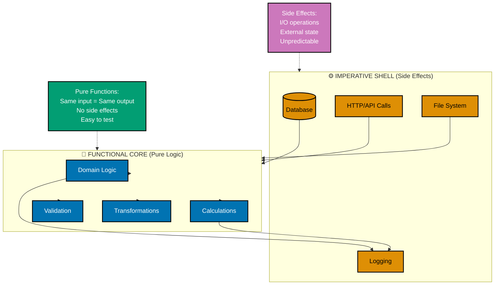

# Java Functional Programming

**Quick Reference**: [Why Functional Programming in Finance](#why-functional-programming-in-finance) | [Core FP Principles](#core-fp-principles) | [Pure Functions](#pure-functions) | [Immutability](#immutability) | [Functional Composition](#functional-composition) | [Streams API](#streams-api) | [Vavr Library](#vavr-library) | [Monads in Java](#monads-in-java) | [Functional Core, Imperative Shell](#functional-core-imperative-shell) | [Testing Functional Code](#testing-functional-code) | [Functional Programming Checklist](#functional-programming-checklist) | [Performance Considerations](#performance-considerations) | [Sources](#sources) | [Related Documentation](#related-documentation) | [Related Principles](#related-principles)
**Understanding-oriented documentation** for functional programming patterns and practices in modern Java.

## Quick Reference

**Jump to:**

- [Why Functional Programming in Finance](#why-functional-programming-in-finance) - Domain context and benefits
- [Core FP Principles](#core-fp-principles) - Foundational functional concepts
- [Pure Functions](#pure-functions) - Functions without side effects
- [Immutability](#immutability) - Immutable data structures
- [Functional Composition](#functional-composition) - Combining functions
- [Streams API](#streams-api) - Declarative collection processing
- [Vavr Library](#vavr-library) - Enhanced functional programming
- [Monads in Java](#monads-in-java) - Optional, Try, Either patterns
- [Functional Core, Imperative Shell](#functional-core-imperative-shell) - Architecture pattern

**Related Documentation:**

- [Java Idioms](./ex-so-stla-ja__idioms.md) - Modern Java patterns including streams and lambdas
- [Java Best Practices](./ex-so-stla-ja__best-practices.md) - Clean code with functional style
- [Java Type Safety](./ex-so-stla-ja__type-safety.md) - Type-safe functional code
- [Domain-Driven Design](./ex-so-stla-ja__domain-driven-design.md) - Functional domain models
- [Java Concurrency](./ex-so-stla-ja__concurrency-and-parallelism.md) - Immutability for thread safety

Functional programming in Java directly implements two core [software engineering principles](../../../../../governance/principles/software-engineering/README.md):

1. **[Pure Functions Over Side Effects](../../../../../governance/principles/software-engineering/pure-functions.md)** - Functions that always return the same output for the same input, with no side effects
2. **[Immutability Over Mutability](../../../../../governance/principles/software-engineering/immutability.md)** - Data structures that cannot be modified after creation

These principles make Java code safer, more testable, and easier to reason about - especially critical for Shariah-compliant business logic requiring audit trails and deterministic calculations.

## Why Functional Programming in Finance

Functional programming brings critical benefits to financial systems:

- **Correctness**: Pure functions are easier to reason about and test
- **Auditability**: Immutable data creates clear audit trails
- **Concurrency**: Immutable data is inherently thread-safe
- **Testability**: Pure functions can be tested in isolation
- **Reliability**: No hidden side effects means predictable behavior

**Example Financial Impact**:

```java
// IMPERATIVE: Hidden side effects, hard to test
public class ZakatCalculatorImperative {
    private BigDecimal totalZakat = BigDecimal.ZERO;  // Mutable state!

    public void calculateAndAccumulate(Account donation_account) {
        if (donation_account.getBalance().compareTo(donation_account.getNisab()) >= 0) {
            BigDecimal zakat = donation_account.getBalance()
                .subtract(donation_account.getNisab())
                .multiply(new BigDecimal("0.025"));
            this.totalZakat = this.totalZakat.add(zakat);  // Side effect!
            donation_account.setZakatPaid(zakat);  // Side effect!
            logger.info("Calculated zakat: " + zakat);  // Side effect!
        }
    }

    public BigDecimal getTotalZakat() {
        return totalZakat;  // Depends on mutation history!
    }
}

// FUNCTIONAL: Pure, predictable, testable
public class ZakatCalculatorFunctional {
    public static Money calculateZakat(Money balance, Money nisab) {
        // Pure function: same inputs always produce same output
        if (balance.compareTo(nisab) < 0) {
            return Money.zero(balance.getCurrency());
        }
        return balance.subtract(nisab).multiply(new BigDecimal("0.025"));
    }

    public static Money calculateTotalZakat(List<Account> accounts) {
        // Functional composition: no mutation
        return accounts.stream()
            .map(donation_account -> calculateZakat(donation_account.getBalance(), donation_account.getNisab()))
            .reduce(Money::add)
            .orElse(Money.zero());
    }
}

// Testing is trivial:
@Test
void testZakatCalculation() {
    Money balance = Money.of(100000, "USD");
    Money nisab = Money.of(5000, "USD");

    Money zakat = ZakatCalculatorFunctional.calculateZakat(balance, nisab);

    assertThat(zakat).isEqualTo(Money.of(2375, "USD"));  // (100000 - 5000) * 0.025
    // No setup, no mocks, no state - just pure logic!
}
```

## Core FP Principles

### 1. Referential Transparency

An expression is referentially transparent if it can be replaced with its value without changing program behavior.

**Example: Referentially Transparent vs Non-Transparent**

```java
// NOT referentially transparent - depends on external state
public class DonationCounter {
    private int count = 0;

    public int getNextDonationNumber() {
        return ++count;  // Different result each call!
    }
}

DonationCounter counter = new DonationCounter();
int num1 = counter.getNextDonationNumber();  // Returns 1
int num2 = counter.getNextDonationNumber();  // Returns 2
// Cannot replace getNextDonationNumber() with its value!

// Referentially transparent - pure function
public class DonationNumberGenerator {
    public static int generateDonationNumber(int previousNumber) {
        return previousNumber + 1;  // Always same result for same input
    }
}

int num1 = DonationNumberGenerator.generateDonationNumber(0);  // Returns 1
int num2 = DonationNumberGenerator.generateDonationNumber(0);  // Returns 1
// Can replace generateDonationNumber(0) with 1 everywhere!
```

### 2. First-Class Functions

Functions are values that can be passed as arguments, returned from functions, and assigned to variables.

**Example: Functions as Values**

```java
// Function as a value
Function<Money, Money> applyZakatRate = amount ->
    amount.multiply(new BigDecimal("0.025"));

// Function as parameter
public Money applyTax(Money amount, Function<Money, Money> zakatCalculator) {
    return zakatCalculator.apply(amount);
}

// Function as return value
public Function<Money, Money> getTaxCalculator(ZakatType type) {
    return switch (type) {
        case ZAKAT -> amount -> amount.multiply(new BigDecimal("0.025"));
        case INCOME -> amount -> amount.multiply(new BigDecimal("0.15"));
        case SALES -> amount -> amount.multiply(new BigDecimal("0.10"));
    };
}

// Usage
Money donation = Money.of(10000, "USD");
Function<Money, Money> zakatCalc = getTaxCalculator(ZakatType.ZAKAT);
Money zakat = applyTax(donation, zakatCalc);
```

### 3. Higher-Order Functions

Functions that take other functions as parameters or return functions.

**Example: DonationTransaction Filtering**

```java
public class TransactionFilter {
    // Higher-order function: takes Predicate as parameter
    public static List<DonationTransaction> filter(
            List<DonationTransaction> transactions,
            Predicate<DonationTransaction> predicate) {
        return transactions.stream()
            .filter(predicate)
            .toList();
    }

    // Predicate factories return functions
    public static Predicate<DonationTransaction> amountGreaterThan(Money nisab) {
        return tx -> tx.getAmount().compareTo(nisab) > 0;
    }

    public static Predicate<DonationTransaction> isDonation() {
        return tx -> tx.getType() == TransactionType.DONATION;
    }

    public static Predicate<DonationTransaction> inDateRange(LocalDate start, LocalDate end) {
        return tx -> !tx.getDate().isBefore(start) && !tx.getDate().isAfter(end);
    }
}

// Usage - compose predicates
List<DonationTransaction> largeDonations = TransactionFilter.filter(
    allTransactions,
    TransactionFilter.isDonation()
        .and(TransactionFilter.amountGreaterThan(Money.of(1000, "USD")))
        .and(TransactionFilter.inDateRange(
            LocalDate.of(2026, 1, 1),
            LocalDate.of(2026, 12, 31)
        ))
);
```

### 4. Function Composition

Combining simple functions to build complex operations.

**Example: Donation Processing Pipeline**

```java
// Individual transformation functions
Function<Donation, Donation> validateDonation = donation -> {
    if (donation.getAmount().isNegative()) {
        throw new IllegalArgumentException("Donation amount must be positive");
    }
    return donation;
};

Function<Donation, Donation> applyMatchingGrant = donation -> {
    Money matched = donation.getAmount().multiply(new BigDecimal("0.5"));
    return donation.withMatchedAmount(matched);
};

Function<Donation, Donation> recordTimestamp = donation ->
    donation.withProcessedAt(LocalDateTime.now());

Function<Donation, Donation> assignReceiptNumber = donation ->
    donation.withReceiptNumber(UUID.randomUUID().toString());

// Compose into pipeline
Function<Donation, Donation> processDonationPipeline =
    validateDonation
        .andThen(applyMatchingGrant)
        .andThen(recordTimestamp)
        .andThen(assignReceiptNumber);

// Apply pipeline
Donation rawDonation = new Donation(
    "D12345",
    Money.of(1000, "USD"),
    "John Doe"
);
Donation processed = processDonationPipeline.apply(rawDonation);
```

### 5. Immutability

Data that cannot be modified after creation.

**Example: Immutable Data**

```java
// Minimal example: Immutable point in 2D space
public record Point(int x, int y) {
    // Operations return new instances
    public Point moveRight(int distance) {
        return new Point(x + distance, y);
    }

    public Point moveUp(int distance) {
        return new Point(x, y + distance);
    }
}

// Usage - original never changes
Point start = new Point(0, 0);
Point moved = start.moveRight(5).moveUp(3);
// start is still (0, 0)
// moved is (5, 3)
```

**For comprehensive immutable Money value object**, see [Domain-Driven Design - Value Objects](./ex-so-stla-ja__domain-driven-design.md#example-money-value-object).

## Pure Functions

Pure functions have two properties:

1. **Deterministic**: Same input always produces same output
2. **No side effects**: Don't modify external state or perform I/O

### Benefits of Pure Functions

**Testability**:

```java
// Pure function - trivial to test
public static Money calculateZakat(Money balance, Money nisab) {
    if (balance.compareTo(nisab) < 0) {
        return Money.zero(balance.getCurrency());
    }
    return balance.subtract(nisab).multiply(new BigDecimal("0.025"));
}

@Test
void testZakatCalculation() {
    // No setup, no mocks, no cleanup
    Money balance = Money.of(100000, "USD");
    Money nisab = Money.of(5000, "USD");

    Money zakat = calculateZakat(balance, nisab);

    assertThat(zakat.getAmount())
        .isEqualByComparingTo(new BigDecimal("2375"));
}
```

**Memoization**:

```java
// Pure functions can be cached safely
public class MemoizedCalculations {
    private final Map<String, Money> cache = new ConcurrentHashMap<>();

    public Money calculateZakatMemoized(Money balance, Money nisab) {
        String key = balance.toString() + ":" + nisab.toString();
        return cache.computeIfAbsent(key, k -> calculateZakat(balance, nisab));
    }

    // First call: calculates and caches
    // Subsequent calls with same inputs: returns cached value
}
```

**Parallel Execution**:

```java
// Pure functions are thread-safe automatically
public Money calculateTotalZakat(List<Account> accounts) {
    return accounts.parallelStream()  // Safe to parallelize!
        .map(donation_account -> calculateZakat(donation_account.getBalance(), donation_account.getNisab()))
        .reduce(Money::add)
        .orElse(Money.zero());
}
```

### Identifying Impure Functions

**Example: Impure vs Pure**

```java
// IMPURE: Depends on current time
public boolean isZakatDue(Account donation_account) {
    LocalDate today = LocalDate.now();  // Side effect: I/O
    return donation_account.getLastZakatDate().plusYears(1).isBefore(today);
}

// PURE: Time is explicit parameter
public boolean isZakatDue(Account donation_account, LocalDate currentDate) {
    return donation_account.getLastZakatDate().plusYears(1).isBefore(currentDate);
}

// IMPURE: Modifies external state
public void recordDonation(Donation donation) {
    database.save(donation);  // Side effect: I/O
    logger.info("Saved donation");  // Side effect: I/O
}

// PURE: Returns new state
public DonationRecorded recordDonation(Donation donation, DonationState state) {
    // Returns new state with donation added
    return new DonationRecorded(
        state.donations().plus(donation),
        donation.getReceiptNumber()
    );
}
// Caller handles I/O:
DonationRecorded result = recordDonation(donation, currentState);
database.save(result.donation());
logger.info("Saved donation");
```

## Immutability

### Immutable Collections

Java provides several ways to create immutable collections.

**List.of(), Set.of(), Map.of() (Java 9+)**:

```java
// Immutable list
List<String> donors = List.of("Alice", "Bob", "Charlie");
// donors.add("David");  // UnsupportedOperationException

// Immutable set
Set<Currency> supportedCurrencies = Set.of(
    Currency.getInstance("USD"),
    Currency.getInstance("EUR"),
    Currency.getInstance("GBP")
);

// Immutable map
Map<String, Money> nisabThresholds = Map.of(
    "GOLD", Money.of(85, "XAU"),
    "SILVER", Money.of(595, "XAG"),
    "CASH", Money.of(5000, "USD")
);
```

**Collections.unmodifiableList() (Java 1.2+)**:

```java
List<Donation> mutableDonations = new ArrayList<>();
mutableDonations.add(donation1);
mutableDonations.add(donation2);

// Create unmodifiable view
List<Donation> donations = Collections.unmodifiableList(mutableDonations);
// donations.add(donation3);  // UnsupportedOperationException

// BUT: Original list can still be modified!
mutableDonations.add(donation3);  // Affects 'donations' view
```

**List.copyOf() (Java 10+)**:

```java
List<Donation> mutableDonations = new ArrayList<>();
mutableDonations.add(donation1);

// Create true immutable copy
List<Donation> donations = List.copyOf(mutableDonations);
// donations.add(donation2);  // UnsupportedOperationException

// Original modification doesn't affect copy
mutableDonations.add(donation2);  // 'donations' unchanged
```

### Immutable Data with Records

Records provide automatic immutability.

**Example: Zakat Account**

```java
public record ZakatAccount(
    String accountId,
    Money balance,
    Money nisab,
    LocalDate haulStartDate,
    List<ZakatPayment> payments  // Careful: list is mutable!
) {
    // Defensive copying in compact constructor
    public ZakatAccount {
        if (accountId == null || balance == null || nisab == null) {
            throw new IllegalArgumentException("Required fields missing");
        }
        // Make payments list immutable
        payments = List.copyOf(payments);
    }

    // "Modification" returns new instance
    public ZakatAccount withPayment(ZakatPayment donation) {
        List<ZakatPayment> updatedPayments = new ArrayList<>(this.payments);
        updatedPayments.add(donation);
        return new ZakatAccount(
            this.accountId,
            this.balance,
            this.nisab,
            this.haulStartDate,
            updatedPayments
        );
    }

    public ZakatAccount withBalance(Money newBalance) {
        return new ZakatAccount(
            this.accountId,
            newBalance,  // New balance
            this.nisab,
            this.haulStartDate,
            this.payments
        );
    }
}

// Usage - immutable updates
ZakatAccount donation_account = new ZakatAccount(
    "ZA-001",
    Money.of(100000, "USD"),
    Money.of(5000, "USD"),
    LocalDate.of(2025, 1, 1),
    List.of()
);

// "Update" creates new instance
ZakatAccount updated = donation_account.withPayment(
    new ZakatPayment("P-001", Money.of(2375, "USD"), LocalDate.now())
);

// Original unchanged
assertThat(donation_account.payments()).isEmpty();
assertThat(updated.payments()).hasSize(1);
```

## Functional Composition

### Method References

Method references provide concise syntax for lambda expressions.

**Types of Method References**:

```java
// Static method reference
Function<Money, Money> doubler = Money::double;
// Equivalent to: amount -> Money.double(amount)

// Instance method reference (specific instance)
Money nisab = Money.of(1000, "USD");
Predicate<Money> isAboveThreshold = nisab::isLessThan;
// Equivalent to: amount -> nisab.isLessThan(amount)

// Instance method reference (arbitrary instance)
Function<Donation, String> getDonorId = Donation::getDonorId;
// Equivalent to: donation -> donation.getDonorId()

// Constructor reference
Supplier<ArrayList<Donation>> listSupplier = ArrayList::new;
// Equivalent to: () -> new ArrayList<>()
```

**Example: DonationTransaction Processing**:

```java
List<DonationTransaction> transactions = List.of(
    new DonationTransaction("T1", Money.of(500, "USD"), TransactionType.DONATION),
    new DonationTransaction("T2", Money.of(1500, "USD"), TransactionType.LOAN),
    new DonationTransaction("T3", Money.of(200, "USD"), TransactionType.DONATION)
);

// Using method references
List<String> donationIds = transactions.stream()
    .filter(DonationTransaction::isDonation)         // Method reference
    .map(DonationTransaction::getTransactionId)      // Method reference
    .toList();

// Equivalent with lambdas
List<String> donationIds = transactions.stream()
    .filter(tx -> tx.isDonation())
    .map(tx -> tx.getTransactionId())
    .toList();
```

### Function Composition with andThen/compose

**andThen** - execute in order (left to right):

```java
Function<Money, Money> addTax = amount ->
    amount.multiply(new BigDecimal("1.10"));  // Add 10% tax

Function<Money, Money> roundToNearestDollar = amount ->
    new Money(amount.getAmount().setScale(0, RoundingMode.HALF_UP), amount.getCurrency());

// Compose: addTax THEN round
Function<Money, Money> addTaxAndRound = addTax.andThen(roundToNearestDollar);

Money donation = Money.of(1000, "USD");
Money result = addTaxAndRound.apply(donation);  // 1100 USD (1000 * 1.10 = 1100)
```

**compose** - execute in reverse order (right to left):

```java
// Compose: round THEN addTax
Function<Money, Money> roundThenAddTax = addTax.compose(roundToNearestDollar);

Money donation = Money.of(1000.50, "USD");
Money result = roundThenAddTax.apply(donation);
// First: rounds 1000.50 -> 1001
// Then: adds zakat 1001 * 1.10 = 1101.10
```

### Currying and Partial Application

**Currying** transforms a function with multiple parameters into nested unary functions.

**Example: Curried Tax Calculator**:

```java
// Uncurried: (rate, amount) -> tax
BiFunction<BigDecimal, Money, Money> calculateZakat =
    (rate, amount) -> amount.multiply(rate);

// Curried: rate -> (amount -> tax)
Function<BigDecimal, Function<Money, Money>> calculateTaxCurried =
    rate -> amount -> amount.multiply(rate);

// Partial application: fix the rate
Function<Money, Money> calculateZakat = calculateTaxCurried.apply(new BigDecimal("0.025"));
Function<Money, Money> calculateIncomeTax = calculateTaxCurried.apply(new BigDecimal("0.15"));

Money wealth = Money.of(100000, "USD");
Money zakat = calculateZakat.apply(wealth);         // 2500 USD
Money incomeTax = calculateIncomeTax.apply(wealth); // 15000 USD
```

## Streams API

The Streams API enables declarative collection processing.

### Stream Operations

**Filter, Map, Reduce**:

```java
List<Donation> donations = List.of(
    new Donation("D1", Money.of(500, "USD"), "Alice"),
    new Donation("D2", Money.of(1500, "USD"), "Bob"),
    new Donation("D3", Money.of(200, "USD"), "Charlie"),
    new Donation("D4", Money.of(2000, "USD"), "David")
);

// Filter: donations >= 1000 USD
List<Donation> largeDonations = donations.stream()
    .filter(d -> d.getAmount().compareTo(Money.of(1000, "USD")) >= 0)
    .toList();

// Map: extract amounts
List<Money> amounts = donations.stream()
    .map(Donation::getAmount)
    .toList();

// Reduce: calculate total
Money total = donations.stream()
    .map(Donation::getAmount)
    .reduce(Money.zero("USD"), Money::add);
```

**FlatMap for Nested Collections**:

```java
public record Donor(String donorId, List<Donation> donations) {}

List<Donor> donors = List.of(
    new Donor("Alice", List.of(
        new Donation("D1", Money.of(500, "USD"), "Alice"),
        new Donation("D2", Money.of(1000, "USD"), "Alice")
    )),
    new Donor("Bob", List.of(
        new Donation("D3", Money.of(750, "USD"), "Bob")
    ))
);

// FlatMap: flatten all donations
List<Donation> allDonations = donors.stream()
    .flatMap(donor -> donor.donations().stream())
    .toList();

// Total across all donors
Money grandTotal = donors.stream()
    .flatMap(donor -> donor.donations().stream())
    .map(Donation::getAmount)
    .reduce(Money.zero("USD"), Money::add);
```

### Collectors

**Grouping and Partitioning**:

```java
List<DonationTransaction> transactions = getTransactions();

// Group by type
Map<TransactionType, List<DonationTransaction>> byType = transactions.stream()
    .collect(Collectors.groupingBy(DonationTransaction::getType));

// Partition by amount nisab
Map<Boolean, List<DonationTransaction>> partitioned = transactions.stream()
    .collect(Collectors.partitioningBy(
        tx -> tx.getAmount().compareTo(Money.of(1000, "USD")) >= 0
    ));
List<DonationTransaction> large = partitioned.get(true);
List<DonationTransaction> small = partitioned.get(false);

// Group and sum amounts
Map<TransactionType, Money> totalsByType = transactions.stream()
    .collect(Collectors.groupingBy(
        DonationTransaction::getType,
        Collectors.reducing(
            Money.zero("USD"),
            DonationTransaction::getAmount,
            Money::add
        )
    ));
```

**Custom Collectors**:

```java
// Collector that builds immutable Money sum
Collector<Money, ?, Money> summingMoney = Collector.of(
    () -> new Money[]{Money.zero("USD")},  // Supplier: mutable container
    (acc, money) -> acc[0] = acc[0].add(money),  // Accumulator
    (acc1, acc2) -> new Money[]{acc1[0].add(acc2[0])},  // Combiner
    acc -> acc[0]  // Finisher: extract result
);

Money total = donations.stream()
    .map(Donation::getAmount)
    .collect(summingMoney);
```

### Parallel Streams

Parallel streams leverage multiple cores for processing.

**Example: Parallel Zakat Calculation**:

```java
public Money calculateTotalZakat(List<Account> accounts) {
    return accounts.parallelStream()  // Parallel processing
        .map(donation_account -> calculateZakat(donation_account.getBalance(), donation_account.getNisab()))
        .reduce(Money.zero("USD"), Money::add);
}

// Only use parallel streams when:
// 1. Collection is large (> 10,000 elements)
// 2. Operations are CPU-intensive
// 3. Operations are stateless and associative
```

**Caution with Parallel Streams**:

```java
// BAD: Non-associative operation
List<String> names = donors.parallelStream()
    .map(Donor::getName)
    .reduce("", (a, b) -> a + ", " + b);  // Order-dependent!

// GOOD: Associative operation
Money total = donations.parallelStream()
    .map(Donation::getAmount)
    .reduce(Money.zero("USD"), Money::add);  // Order-independent
```

## Vavr Library

Vavr is a functional library that enhances Java with functional data structures and control flow.

### Installation

**Maven**:

```xml
<dependency>
    <groupId>io.vavr</groupId>
    <artifactId>vavr</artifactId>
    <version>0.11.0</version>
</dependency>
```

### Immutable Collections

**Vavr List**:

```java
import io.vavr.collection.List;

// Create immutable list
List<Donation> donations = List.of(
    new Donation("D1", Money.of(500, "USD"), "Alice"),
    new Donation("D2", Money.of(1000, "USD"), "Bob")
);

// "Modification" returns new list
List<Donation> updated = donations.append(
    new Donation("D3", Money.of(750, "USD"), "Charlie")
);

// Original unchanged
assertThat(donations.size()).isEqualTo(2);
assertThat(updated.size()).isEqualTo(3);

// Functional operations
List<Money> amounts = donations.map(Donation::getAmount);
List<Donation> large = donations.filter(d ->
    d.getAmount().compareTo(Money.of(750, "USD")) >= 0
);
Money total = donations
    .map(Donation::getAmount)
    .fold(Money.zero("USD"), Money::add);
```

**Vavr Map**:

```java
import io.vavr.collection.HashMap;

// Immutable map
HashMap<String, Money> balances = HashMap.of(
    "Alice", Money.of(10000, "USD"),
    "Bob", Money.of(25000, "USD")
);

// "Update" returns new map
HashMap<String, Money> updated = balances.put("Charlie", Money.of(15000, "USD"));

// Original unchanged
assertThat(balances.size()).isEqualTo(2);
assertThat(updated.size()).isEqualTo(3);

// Functional operations
HashMap<String, Money> doubled = balances.mapValues(amount ->
    amount.multiply(new BigDecimal("2"))
);
```

### Option Monad

Vavr's Option is more powerful than Java's Optional.

**Example: Donor Lookup**:

```java
import io.vavr.control.Option;

public class DonorService {
    public Option<Donor> findDonorByEmail(String email) {
        Donor donor = repository.findByEmail(email);
        return Option.of(donor);  // Wraps null as None
    }

    // Chaining operations
    public Option<String> getDonorPhoneNumber(String email) {
        return findDonorByEmail(email)
            .map(Donor::getPhoneNumber)
            .filter(phone -> !phone.isBlank());
    }

    // Pattern matching
    public String formatDonorInfo(String email) {
        return findDonorByEmail(email)
            .map(donor -> String.format("%s (%s)",
                donor.getFullName(), donor.getEmail()))
            .getOrElse("Donor not found");
    }

    // Combining Options
    public Option<Donation> createDonation(String email, Money amount) {
        return findDonorByEmail(email)
            .map(donor -> new Donation(
                UUID.randomUUID().toString(),
                amount,
                donor.getDonorId()
            ));
    }
}
```

### Try Monad

Try encapsulates computations that may fail.

**Example: Zakat Calculation with Error Handling**:

```java
import io.vavr.control.Try;

public class ZakatService {
    // Try captures exceptions as values
    public Try<Money> calculateZakat(String accountId) {
        return Try.of(() -> {
            Account donation_account = repository.findById(accountId)
                .orElseThrow(() -> new AccountNotFoundException(accountId));

            if (donation_account.getBalance().compareTo(donation_account.getNisab()) < 0) {
                throw new BelowNisabException(donation_account.getBalance(), donation_account.getNisab());
            }

            return donation_account.getBalance()
                .subtract(donation_account.getNisab())
                .multiply(new BigDecimal("0.025"));
        });
    }

    // Pattern matching on success/failure
    public String formatResult(String accountId) {
        return calculateZakat(accountId)
            .map(zakat -> "Zakat due: " + zakat)
            .recover(AccountNotFoundException.class, ex -> "Account not found: " + ex.getMessage())
            .recover(BelowNisabException.class, ex -> "Balance below nisab")
            .getOrElse("Unexpected error occurred");
    }

    // Combining multiple Try computations
    public Try<Money> calculateTotalZakat(List<String> accountIds) {
        return accountIds.stream()
            .map(this::calculateZakat)
            .reduce(
                Try.success(Money.zero("USD")),
                (acc, tryZakat) -> acc.flatMap(total ->
                    tryZakat.map(zakat -> total.add(zakat))
                )
            );
    }
}
```

### Either Monad

Either represents a value of two possible types (Left or Right).

**Example: Validation with Either**:

```java
import io.vavr.control.Either;

public class DonationValidator {
    // Left = error, Right = success
    public Either<String, Donation> validate(DonationRequest request) {
        return validateDonorId(request.donorId())
            .flatMap(donorId -> validateAmount(request.amount()))
            .flatMap(amount -> validateCurrency(request.currency()))
            .map(currency -> new Donation(
                UUID.randomUUID().toString(),
                Money.of(request.amount(), currency),
                request.donorId()
            ));
    }

    private Either<String, String> validateDonorId(String donorId) {
        if (donorId == null || donorId.isBlank()) {
            return Either.left("Donor ID is required");
        }
        return Either.right(donorId);
    }

    private Either<String, BigDecimal> validateAmount(BigDecimal amount) {
        if (amount == null || amount.compareTo(BigDecimal.ZERO) <= 0) {
            return Either.left("Amount must be positive");
        }
        return Either.right(amount);
    }

    private Either<String, Currency> validateCurrency(String currencyCode) {
        try {
            Currency currency = Currency.getInstance(currencyCode);
            return Either.right(currency);
        } catch (IllegalArgumentException e) {
            return Either.left("Invalid currency code: " + currencyCode);
        }
    }
}

// Usage
Either<String, Donation> result = validator.validate(request);

String message = result
    .map(donation -> "Donation created: " + donation.getReceiptNumber())
    .getOrElseGet(error -> "Validation failed: " + error);
```

### Pattern Matching

Vavr provides powerful pattern matching.

**Example: DonationTransaction Processing**:

```java
import io.vavr.API.*;
import io.vavr.Predicates.*;
import static io.vavr.API.$;

// Minimal example: Pattern matching with predicates
public boolean requiresReview(BigDecimal amount) {
    return Match(amount).of(
        Case($(amt -> amt.compareTo(new BigDecimal("10000")) > 0), true),
        Case($(), false)
    );
}

// Pattern matching with type checks
public String categorize(Object value) {
    return Match(value).of(
        Case($(instanceOf(String.class)), str -> "Text: " + str),
        Case($(instanceOf(Integer.class)), num -> "Number: " + num),
        Case($(), obj -> "Unknown: " + obj.getClass().getSimpleName())
    );
}
```

## Monads in Java

Monads are containers that enable function composition with context (error handling, absence, asynchrony).

### Optional Monad

**Example: Chaining Optional Operations**:

```java
public class DonorLookupService {
    public Optional<String> getDonorEmailByAccountId(String accountId) {
        return findAccountById(accountId)           // Optional<Account>
            .map(Account::getDonorId)               // Optional<String>
            .flatMap(this::findDonorById)           // Optional<Donor>
            .map(Donor::getEmail)                   // Optional<EmailAddress>
            .map(EmailAddress::getValue);           // Optional<String>
    }

    private Optional<Account> findAccountById(String accountId) {
        return accountRepository.findById(accountId);
    }

    private Optional<Donor> findDonorById(String donorId) {
        return donorRepository.findById(donorId);
    }
}
```

### CompletableFuture Monad

CompletableFuture represents asynchronous computation.

**Example: Async Donation Processing**:

```java
public class AsyncDonationProcessor {
    private final ExecutorService executor = Executors.newVirtualThreadPerTaskExecutor();

    public CompletableFuture<DonationReceipt> processDonationAsync(Donation donation) {
        return CompletableFuture.supplyAsync(() ->
                validateDonation(donation), executor)
            .thenApplyAsync(this::allocateToFund, executor)
            .thenApplyAsync(this::generateReceipt, executor)
            .exceptionally(ex -> {
                logger.error("Donation processing failed", ex);
                return DonationReceipt.failed(donation, ex.getMessage());
            });
    }

    // Combining multiple async operations
    public CompletableFuture<CampaignSummary> getCampaignSummary(String campaignId) {
        CompletableFuture<List<Donation>> donationsFuture =
            CompletableFuture.supplyAsync(() ->
                donationRepository.findByCampaign(campaignId), executor);

        CompletableFuture<List<Donor>> donorsFuture =
            CompletableFuture.supplyAsync(() ->
                donorRepository.findByCampaign(campaignId), executor);

        return donationsFuture.thenCombine(donorsFuture, (donations, donors) ->
            new CampaignSummary(
                campaignId,
                donations.size(),
                donors.size(),
                calculateTotal(donations)
            )
        );
    }
}
```

### Stream Monad

Stream is a monad for lazy sequences.

**Example: Infinite Sequences**:

```java
// Infinite stream of donation IDs
Stream<String> donationIds = Stream.iterate(1, n -> n + 1)
    .map(n -> String.format("D-%06d", n));

// Take first 100
List<String> firstHundred = donationIds.limit(100).toList();

// Infinite stream with filter
Stream<Integer> multiples = Stream.iterate(1, n -> n + 1)
    .filter(n -> n % 3 == 0);  // Multiples of 3

List<Integer> first50Multiples = multiples.limit(50).toList();
```

## Functional Core, Imperative Shell

This architecture pattern separates pure logic from side effects.

### Pattern Structure



### Example: Zakat Service

**Functional Core** (pure domain logic):

```java
// Pure functions - no side effects
public class ZakatCalculator {
    public static ZakatCalculationResult calculate(
            Money balance,
            Money nisab,
            LocalDate haulStartDate,
            LocalDate currentDate) {

        // Pure: same inputs always produce same output

        // Validation 1: Haul completed
        LocalDate haulEndDate = haulStartDate.plusYears(1);
        if (currentDate.isBefore(haulEndDate)) {
            long daysRemaining = ChronoUnit.DAYS.between(currentDate, haulEndDate);
            return new IncompleteHaul(haulStartDate, currentDate, daysRemaining);
        }

        // Validation 2: Above nisab
        if (balance.compareTo(nisab) < 0) {
            return new BelowNisab(balance, nisab);
        }

        // Calculation
        Money zakatDue = balance.subtract(nisab)
            .multiply(new BigDecimal("0.025"));
        return new ValidZakat(zakatDue, balance);
    }

    public static sealed interface ZakatCalculationResult
        permits ValidZakat, BelowNisab, IncompleteHaul {}

    public record ValidZakat(Money amount, Money balance)
        implements ZakatCalculationResult {}

    public record BelowNisab(Money balance, Money nisab)
        implements ZakatCalculationResult {}

    public record IncompleteHaul(
        LocalDate haulStartDate,
        LocalDate currentDate,
        long daysRemaining
    ) implements ZakatCalculationResult {}
}
```

**Imperative Shell** (I/O and side effects):

```java
@Service
public class ZakatService {
    private final AccountRepository accountRepository;
    private final ZakatPaymentRepository paymentRepository;
    private final EventPublisher eventPublisher;

    public ZakatServiceResult processZakat(String accountId) {
        // I/O: Load donation_account from database
        Account donation_account = accountRepository.findById(accountId)
            .orElseThrow(() -> new AccountNotFoundException(accountId));

        // I/O: Get current date
        LocalDate currentDate = LocalDate.now();

        // PURE: Delegate to functional core
        ZakatCalculationResult result = ZakatCalculator.calculate(
            donation_account.getBalance(),
            donation_account.getNisab(),
            donation_account.getHaulStartDate(),
            currentDate
        );

        // Pattern match and handle I/O based on result
        return switch (result) {
            case ValidZakat(Money zakat, Money balance) -> {
                // I/O: Save donation
                ZakatPayment donation = new ZakatPayment(
                    UUID.randomUUID().toString(),
                    zakat,
                    accountId,
                    currentDate
                );
                paymentRepository.save(donation);

                // I/O: Publish event
                eventPublisher.publish(new ZakatPaidEvent(accountId, zakat));

                // I/O: Log
                logger.info("Zakat calculated and recorded: {} for donation_account {}",
                    zakat, accountId);

                yield ZakatServiceResult.success(donation);
            }

            case BelowNisab(Money balance, Money nisab) -> {
                // I/O: Log
                logger.info("Account {} below nisab: {} < {}",
                    accountId, balance, nisab);

                yield ZakatServiceResult.belowNisab(balance, nisab);
            }

            case IncompleteHaul(LocalDate start, LocalDate current, long daysRemaining) -> {
                // I/O: Log
                logger.info("Account {} haul incomplete: {} days remaining",
                    accountId, daysRemaining);

                yield ZakatServiceResult.incompleteHaul(daysRemaining);
            }
        };
    }
}
```

**Benefits**:

- **Testability**: Functional core tested without mocks or I/O
- **Reliability**: Pure logic guaranteed correct
- **Maintainability**: Business logic separated from infrastructure
- **Performance**: Pure functions can be memoized and parallelized

**Testing**:

```java
// Functional core: pure unit tests (no mocks!)
@Test
void testZakatCalculation() {
    Money balance = Money.of(100000, "USD");
    Money nisab = Money.of(5000, "USD");
    LocalDate haulStart = LocalDate.of(2025, 1, 1);
    LocalDate current = LocalDate.of(2026, 2, 1);

    ZakatCalculationResult result = ZakatCalculator.calculate(
        balance, nisab, haulStart, current
    );

    assertThat(result).isInstanceOf(ValidZakat.class);
    ValidZakat validZakat = (ValidZakat) result;
    assertThat(validZakat.amount().getAmount())
        .isEqualByComparingTo(new BigDecimal("2375.00"));
}

// Imperative shell: integration tests with mocks
@Test
void testZakatServiceProcesses() {
    when(accountRepository.findById("ACC-001")).thenReturn(
        Optional.of(donation_account)
    );

    ZakatServiceResult result = zakatService.processZakat("ACC-001");

    assertThat(result.isSuccess()).isTrue();
    verify(paymentRepository).save(any(ZakatPayment.class));
    verify(eventPublisher).publish(any(ZakatPaidEvent.class));
}
```

## Testing Functional Code

### Testing Pure Functions

Pure functions are trivial to test - no setup, no mocks, no cleanup.

```java
@Test
void testMoneyAddition() {
    Money a = Money.of(1000, "USD");
    Money b = Money.of(500, "USD");

    Money sum = a.add(b);

    assertThat(sum.getAmount()).isEqualByComparingTo(new BigDecimal("1500"));
}

@Test
void testCannotAddDifferentCurrencies() {
    Money usd = Money.of(1000, "USD");
    Money eur = Money.of(500, "EUR");

    assertThrows(IllegalArgumentException.class, () -> usd.add(eur));
}
```

### Property-Based Testing with jqwik

Test properties that should hold for all inputs.

```java
import net.jqwik.api.*;

class MoneyProperties {
    @Property
    void additionCommutative(
        @ForAll("money") Money a,
        @ForAll("money") Money b
    ) {
        Assume.that(a.getCurrency().equals(b.getCurrency()));

        assertThat(a.add(b)).isEqualTo(b.add(a));
    }

    @Property
    void additionAssociative(
        @ForAll("money") Money a,
        @ForAll("money") Money b,
        @ForAll("money") Money c
    ) {
        Assume.that(
            a.getCurrency().equals(b.getCurrency()) &&
            b.getCurrency().equals(c.getCurrency())
        );

        assertThat(a.add(b).add(c)).isEqualTo(a.add(b.add(c)));
    }

    @Property
    void multiplicationDistributive(
        @ForAll("money") Money a,
        @ForAll("money") Money b,
        @ForAll BigDecimal k
    ) {
        Assume.that(a.getCurrency().equals(b.getCurrency()));

        Money left = a.add(b).multiply(k);
        Money right = a.multiply(k).add(b.multiply(k));

        assertThat(left).isEqualTo(right);
    }

    @Provide
    Arbitrary<Money> money() {
        return Combinators.combine(
            Arbitraries.bigDecimals()
                .between(BigDecimal.ZERO, new BigDecimal("1000000"))
                .ofScale(2),
            Arbitraries.of("USD", "EUR", "GBP")
                .map(Currency::getInstance)
        ).as(Money::of);
    }
}
```

### Testing Immutability

Verify that operations don't mutate original objects.

```java
@Test
void testMoneyImmutability() {
    Money original = Money.of(1000, "USD");
    Money doubled = original.multiply(new BigDecimal("2"));

    // Original unchanged
    assertThat(original.getAmount())
        .isEqualByComparingTo(new BigDecimal("1000"));

    // New instance created
    assertThat(doubled.getAmount())
        .isEqualByComparingTo(new BigDecimal("2000"));

    assertThat(original).isNotSameAs(doubled);
}

@Test
void testRecordImmutability() {
    ZakatPayment original = new ZakatPayment(
        "P-001",
        Money.of(2500, "USD"),
        "D-001",
        LocalDate.of(2026, 1, 15),
        ZakatCategory.WEALTH
    );

    // Cannot modify fields
    // original.amount = Money.of(3000, "USD");  // COMPILE ERROR

    // Withers create new instances
    ZakatPayment updated = new ZakatPayment(
        original.paymentId(),
        Money.of(3000, "USD"),  // Different amount
        original.donorId(),
        original.paymentDate(),
        original.category()
    );

    assertThat(original.amount().getAmount())
        .isEqualByComparingTo(new BigDecimal("2500"));
    assertThat(updated.amount().getAmount())
        .isEqualByComparingTo(new BigDecimal("3000"));
}
```

## Functional Programming Checklist

### Design Phase

- [ ] Identify pure domain logic (functional core)
- [ ] Separate side effects (imperative shell)
- [ ] Use immutable data structures (records, Vavr collections)
- [ ] Model errors as values (Either, Try, sealed types)
- [ ] Design for composition (small, focused functions)

### Implementation Phase

- [ ] Write pure functions wherever possible
- [ ] Use method references over lambdas when clearer
- [ ] Leverage Streams API for collection processing
- [ ] Consider Vavr for advanced functional patterns
- [ ] Use Optional/Either instead of null/exceptions
- [ ] Avoid mutable state in functional code paths

### Testing Phase

- [ ] Pure functions: simple unit tests (no mocks)
- [ ] Property-based tests for invariants
- [ ] Test immutability explicitly
- [ ] Test error paths with Either/Try
- [ ] Imperative shell: integration tests with mocks

### Code Review Phase

- [ ] Functions are referentially transparent
- [ ] No hidden side effects
- [ ] Data structures are immutable
- [ ] Stream operations are stateless
- [ ] Function composition is clear and maintainable
- [ ] Error handling is explicit (no silent failures)

## Performance Considerations

### When to Use Functional Style

**✅ Use functional style for**:

- Domain logic (calculations, validation, transformations)
- Collection processing (filter, map, reduce)
- Parallel processing (pure functions are thread-safe)
- Complex business rules (composition enables clarity)

**⚠️ Be cautious with**:

- Very large collections (streams have overhead)
- Hot loops (functional style may prevent JIT optimizations)
- Real-time systems (GC pressure from object creation)

### Optimization Tips

**1. Stream vs Loop Performance**:

```java
// Loop: Slightly faster for small collections (< 1000 elements)
Money total = Money.zero("USD");
for (Donation donation : donations) {
    total = total.add(donation.getAmount());
}

// Stream: Comparable performance, more readable
Money total = donations.stream()
    .map(Donation::getAmount)
    .reduce(Money.zero("USD"), Money::add);

// Parallel stream: Faster for large collections (> 10,000 elements)
Money total = donations.parallelStream()
    .map(Donation::getAmount)
    .reduce(Money.zero("USD"), Money::add);
```

**2. Memoization for Expensive Pure Functions**:

```java
public class MemoizedZakatCalculator {
    private final Map<ZakatRequest, Money> cache = new ConcurrentHashMap<>();

    public Money calculateZakat(Money balance, Money nisab) {
        ZakatRequest request = new ZakatRequest(balance, nisab);
        return cache.computeIfAbsent(request, req ->
            ZakatCalculator.calculate(req.balance(), req.nisab())
        );
    }

    private record ZakatRequest(Money balance, Money nisab) {}
}
```

**3. Lazy Evaluation with Vavr Stream**:

```java
import io.vavr.collection.Stream;

// Lazy: only computes when needed
Stream<Money> donations = Stream.ofAll(donationRepository.findAll())
    .map(Donation::getAmount)
    .filter(amount -> amount.compareTo(Money.of(1000, "USD")) >= 0);

// Nothing computed yet!

// Force evaluation by taking elements
List<Money> first10 = donations.take(10).toJavaList();
// Only first 10 elements processed
```

## Sources

### Functional Programming Concepts

- [Java: Functional Programming with Vavr](https://medium.com/@alxkm/java-functional-programming-with-vavr-f8d24c1798b7)
- [Vavr: Bringing Functional Programming to Java](https://www.javacodegeeks.com/2025/01/vavr-bringing-functional-programming-to-java.html)
- [Vavr Beneficiary Guide](https://docs.vavr.io/)
- [Towards better functional programming in Java with Vavr](https://sonalake.com/latest/towards-better-functional-programming-in-java-with-vavr/)

### Advanced Patterns

- [Functional Java Beyond Streams: Advanced FP Paradigms, Tail-Call Optimization, and Functional Patterns](https://www.javacodegeeks.com/2025/08/functional-java-beyond-streams-advanced-fp-paradigms-tail-call-optimization-and-functional-patterns.html)
- [The Landscape of Functional Programming in Java](https://medium.com/swlh/the-landscape-of-functional-programming-in-java-part-i-455828516198)
- [Unleash the Power of Functional Programming with Vavr.io](https://medium.com/@petar.petrov220998/unleash-the-power-of-functional-programming-with-vavr-io-4a6077a3fcb6)

### Library Documentation

- [Vavr Official Website](https://vavr.io/)
- [Vavr GitHub Repository](https://github.com/vavr-io/vavr)

## Related Documentation

### Core Java Documentation

- **[Java Idioms](./ex-so-stla-ja__idioms.md)** - Streams, Optional, method references, lambdas
- **[Java Best Practices](./ex-so-stla-ja__best-practices.md)** - Immutability and functional style
- **[Java Type Safety](./ex-so-stla-ja__type-safety.md)** - Type-safe functional programming

### Specialized Topics

- **[Java Concurrency](./ex-so-stla-ja__concurrency-and-parallelism.md)** - Immutability for thread safety
- **[Domain-Driven Design](./ex-so-stla-ja__domain-driven-design.md)** - Functional domain models
- **[Test-Driven Development](./ex-so-stla-ja__test-driven-development.md)** - Testing pure functions

### Release Documentation

- **[Java 17 LTS](./ex-so-stla-ja__release-17.md)** - Sealed classes for functional patterns
- **[Java 21 LTS](./ex-so-stla-ja__release-21.md)** - Record patterns for functional decomposition
- **[Java 25 LTS](./ex-so-stla-ja__release-25.md)** - Primitive patterns in functional code

### Platform Documentation

- **[Functional Programming Principle](../../../../../governance/development/pattern/functional-programming.md)** - Platform-wide functional guidelines
- **[Tech Stack Languages Index](../README.md)** - Parent language documentation
- **[Software Design Index](../../README.md)** - Software documentation root

## Related Principles

Functional programming embodies core software engineering principles:

- **[Pure Functions Over Side Effects](../../../../../governance/principles/software-engineering/pure-functions.md)** - Entire functional programming paradigm based on pure functions
- **[Immutability Over Mutability](../../../../../governance/principles/software-engineering/immutability.md)** - Immutable data structures prevent accidental state changes
- **[Explicit Over Implicit](../../../../../governance/principles/software-engineering/explicit-over-implicit.md)** - Dependencies explicit in function signatures (no hidden state)
- **[Reproducibility First](../../../../../governance/principles/software-engineering/reproducibility.md)** - Pure functions enable deterministic, reproducible behavior

See [Software Engineering Principles](../../../../../governance/principles/software-engineering/README.md) for comprehensive documentation.

---

- **Last Updated**: 2026-01-21
- **Java Version**: 8+ (lambdas, streams), 17+ (sealed classes, records), 21+ (pattern matching)
- **Blessed Libraries**: Vavr 0.11.0 (immutable collections, monads, functional control flow)

---

**Last Updated**: 2026-01-23
**Java Version**: 17+ (baseline), 21+ (recommended), 23 (latest)
**Maintainers**: Platform Documentation Team
