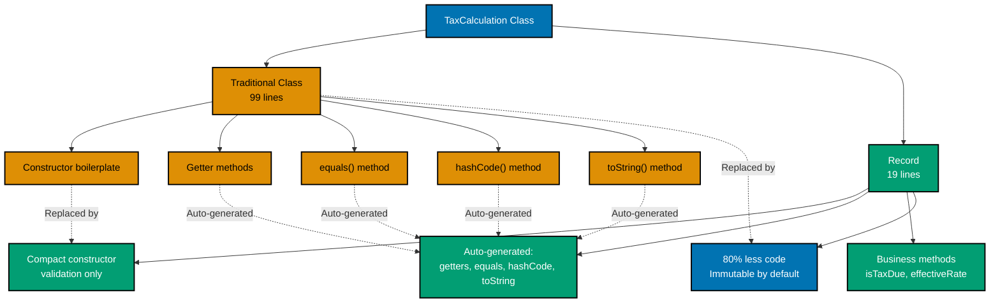
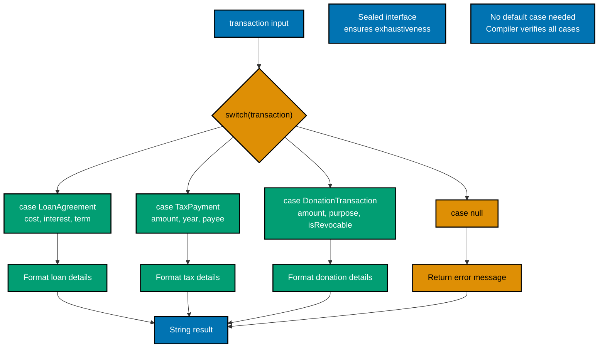
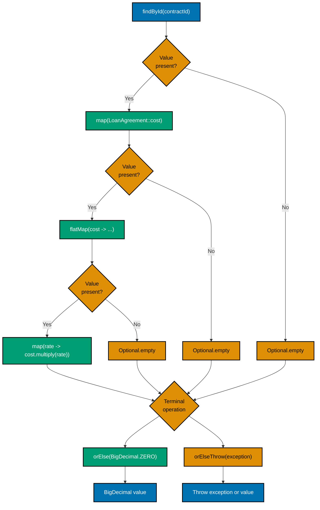
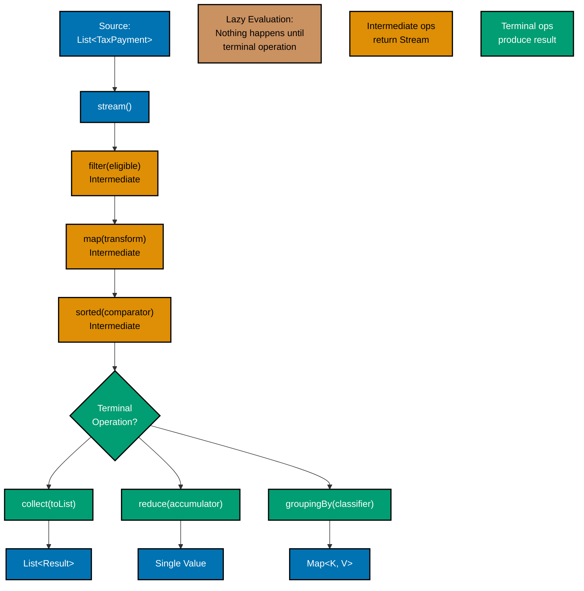
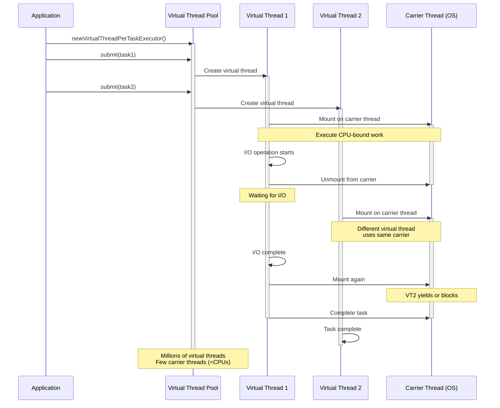
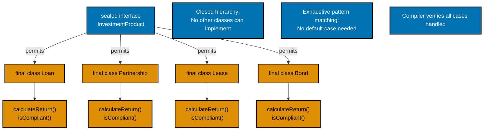

# Java Idioms

## Overview

Java idioms are established patterns and practices that leverage the language's features to write clear, efficient, and maintainable code. With the evolution from Java 8 through Java 21 and beyond, the language has introduced transformative features that fundamentally change how we write idiomatic Java code.

This guide focuses on **modern Java idioms** (Java 17+) that are particularly relevant for enterprise platforms, incorporating examples from business domains including tax calculation, loan agreements, fund management, and financial transactions.

### Why Java Idioms Matter

- **Readability**: Idiomatic code is easier for team members to understand
- **Maintainability**: Following established patterns reduces cognitive load
- **Performance**: Modern idioms often leverage JVM optimizations
- **Safety**: Modern features provide compile-time guarantees
- **Expressiveness**: Newer features allow more direct expression of intent

### Target Audience

This document assumes familiarity with Java fundamentals and targets developers working on enterprise applications, particularly those building financial systems.

## Modern Java Features Baseline

As of 2025-2026, these features form the baseline for modern Java development:

- **Java 17 LTS** (September 2021): Records, sealed classes, pattern matching for instanceof, text blocks
- **Java 21 LTS** (September 2023): Virtual threads, sequenced collections, pattern matching for switch, record patterns
- **Java 25 LTS** (September 2025): Stream gatherers (finalized), scoped values, flexible constructor bodies, compact source files, instance main methods

## Core Modern Idioms

Modern Java idioms align strongly with [software engineering principles](../../../../../governance/principles/software-engineering/README.md):

- **Records** embody [Immutability](../../../../../governance/principles/software-engineering/immutability.md) and [Explicit Over Implicit](../../../../../governance/principles/software-engineering/explicit-over-implicit.md)
- **Pattern Matching** enforces [Explicit Over Implicit](../../../../../governance/principles/software-engineering/explicit-over-implicit.md) with exhaustive type handling
- **Optional** supports [Pure Functions](../../../../../governance/principles/software-engineering/pure-functions.md) by eliminating null-based side effects
- **Streams** enable [Automation Over Manual](../../../../../governance/principles/software-engineering/automation-over-manual.md) through functional transformations
- **Try-with-resources** automates resource management ([Automation Over Manual](../../../../../governance/principles/software-engineering/automation-over-manual.md))

### 1. Records for Immutable Data

**Pattern**: Use records for data carrier classes that should be immutable, transparent, and concise.

**Before (Pre-Java 14)**:

```java
public final class TaxCalculation {
    private final BigDecimal income;
    private final BigDecimal threshold;
    private final BigDecimal taxAmount;
    private final LocalDate calculationDate;

    public TaxCalculation(BigDecimal income, BigDecimal threshold,
                           BigDecimal taxAmount, LocalDate calculationDate) {
        this.income = income;
        this.threshold = threshold;
        this.taxAmount = taxAmount;
        this.calculationDate = calculationDate;
    }

    public BigDecimal income() { return income; }
    public BigDecimal threshold() { return threshold; }
    public BigDecimal taxAmount() { return taxAmount; }
    public LocalDate calculationDate() { return calculationDate; }

    @Override
    public boolean equals(Object o) {
        if (this == o) return true;
        if (o == null || getClass() != o.getClass()) return false;
        TaxCalculation that = (TaxCalculation) o;
        return Objects.equals(income, that.income) &&
               Objects.equals(threshold, that.threshold) &&
               Objects.equals(taxAmount, that.taxAmount) &&
               Objects.equals(calculationDate, that.calculationDate);
    }

    @Override
    public int hashCode() {
        return Objects.hash(income, threshold, taxAmount, calculationDate);
    }

    @Override
    public String toString() {
        return "TaxCalculation{" +
               "income=" + income +
               ", threshold=" + threshold +
               ", taxAmount=" + taxAmount +
               ", calculationDate=" + calculationDate +
               '}';
    }
}
```

**After (Java 17+)**:

```java
public record TaxCalculation(
    BigDecimal income,
    BigDecimal threshold,
    BigDecimal taxAmount,
    LocalDate calculationDate
) {
    // Compact constructor for validation
    public TaxCalculation {
        if (income.compareTo(BigDecimal.ZERO) < 0) {
            throw new IllegalArgumentException("Income cannot be negative");
        }
        if (threshold.compareTo(BigDecimal.ZERO) <= 0) {
            throw new IllegalArgumentException("Threshold must be positive");
        }
        if (taxAmount.compareTo(BigDecimal.ZERO) < 0) {
            throw new IllegalArgumentException("Tax amount cannot be negative");
        }
        Objects.requireNonNull(calculationDate, "Calculation date is required");
    }

    // Derived methods
    public boolean isTaxDue() {
        return income.compareTo(threshold) >= 0;
    }

    public BigDecimal effectiveRate() {
        return income.compareTo(BigDecimal.ZERO) == 0
            ? BigDecimal.ZERO
            : taxAmount.divide(income, 4, RoundingMode.HALF_UP);
    }
}
```

**Records vs Traditional Classes:**



**Key Benefits**:

- 80% less boilerplate code
- Automatic equals(), hashCode(), toString()
- Immutability by default
- Clear intent: this is data, not behavior

### 2. Pattern Matching for Switch (Java 21+)

**Pattern**: Replace type-checking cascades with pattern-matching switch expressions.

**Before**:

```java
public String formatTransaction(Object transaction) {
    if (transaction instanceof LoanAgreement) {
        LoanAgreement loan = (LoanAgreement) transaction;
        return String.format("Loan: Cost=%s, Profit=%s",
                           loan.getCost(), loan.getProfit());
    } else if (transaction instanceof TaxPayment) {
        TaxPayment tax = (TaxPayment) transaction;
        return String.format("Tax: Amount=%s, Year=%d",
                           tax.getAmount(), tax.getYear());
    } else if (transaction instanceof DonationTransaction) {
        DonationTransaction donation = (DonationTransaction) transaction;
        return String.format("Donation: Amount=%s, Purpose=%s",
                           donation.getAmount(), donation.getPurpose());
    } else {
        return "Unknown transaction";
    }
}
```

**After (Java 21+)**:

```java
public String formatTransaction(Transaction transaction) {
    return switch (transaction) {
        case LoanAgreement(var cost, var interest, var term) ->
            "Loan: Cost=%s, Profit=%s, Term=%d months"
                .formatted(cost, interest, term);

        case TaxPayment(var amount, var year, var payee) ->
            "Tax: Amount=%s, Year=%d, Recipient=%s"
                .formatted(amount, year, payee);

        case DonationTransaction(var amount, var purpose, var isRevocable) ->
            "Donation: Amount=%s, Purpose=%s, %s"
                .formatted(amount, purpose,
                          isRevocable ? "Revocable" : "Perpetual");

        case null -> "No transaction provided";
    };
}

// Sealed interface ensures exhaustiveness
sealed interface Transaction
    permits LoanAgreement, TaxPayment, DonationTransaction {}

record LoanAgreement(BigDecimal cost, BigDecimal interest, int term)
    implements Transaction {}
record TaxPayment(BigDecimal amount, int year, String payee)
    implements Transaction {}
record DonationTransaction(BigDecimal amount, String purpose, boolean isRevocable)
    implements Transaction {}
```

**Pattern Matching Switch Flow:**



**Key Benefits**:

- No explicit casting needed
- Pattern variables scoped to case
- Exhaustiveness checking with sealed types
- More readable and maintainable

### 3. Enhanced Pattern Matching with Guards

**Pattern**: Use when clauses to combine type checking with conditional logic.

```java
public record AccountBalance(BigDecimal amount, Currency currency, boolean isFrozen) {}

public String analyzeBalance(AccountBalance balance) {
    return switch (balance) {
        case AccountBalance(var amt, var curr, true) ->
            "Account frozen with %s %s".formatted(amt, curr);

        case AccountBalance(var amt, Currency.USD, false)
            when amt.compareTo(new BigDecimal("50000")) >= 0 ->
            "Threshold reached: Tax may be due on %s USD".formatted(amt);

        case AccountBalance(var amt, Currency.USD, false) ->
            "Active USD account: %s (below threshold)".formatted(amt);

        case AccountBalance(var amt, var curr, false)
            when curr != Currency.USD ->
            "Convert %s %s to USD for Tax calculation".formatted(amt, curr);
    };
}
```

**Key Benefits**:

- Combines pattern matching with boolean conditions
- Reduces nested if statements
- Clearer expression of business rules

### 4. Optional for Null Safety

**Pattern**: Use Optional to explicitly model the presence or absence of a value, avoiding null pointer exceptions.

**Before**:

```java
public class LoanService {
    public BigDecimal calculateProfit(String contractId) {
        LoanAgreement contract = repository.findById(contractId);
        if (contract == null) {
            return null;
        }

        BigDecimal cost = contract.getCost();
        if (cost == null) {
            return null;
        }

        BigDecimal interestRate = contract.getProfitRate();
        if (interestRate == null) {
            return BigDecimal.ZERO;
        }

        return cost.multiply(interestRate);
    }
}
```

**After (Modern Java)**:

```java
public class LoanService {
    public Optional<BigDecimal> calculateProfit(String contractId) {
        return repository.findById(contractId)
            .map(LoanAgreement::cost)
            .flatMap(cost -> repository.findById(contractId)
                .map(LoanAgreement::interestRate)
                .map(rate -> cost.multiply(rate)));
    }

    // Alternative: provide default handling
    public BigDecimal calculateProfitOrZero(String contractId) {
        return calculateProfit(contractId)
            .orElse(BigDecimal.ZERO);
    }

    // Alternative: throw domain exception
    public BigDecimal calculateProfitOrThrow(String contractId) {
        return calculateProfit(contractId)
            .orElseThrow(() ->
                new ContractNotFoundException("Contract not found: " + contractId));
    }
}
```

**Optional Transformation Chain:**



**Key Benefits**:

- Explicit handling of missing values
- Fluent API for transformations
- Forces caller to handle absence
- Self-documenting code

### 5. Stream API for Collection Processing

**Pattern**: Use streams for declarative collection processing with functional operations.

```java
public class TaxDistributionService {
    public record Recipient(String name, String category, boolean isEligible) {}

    public record Distribution(String payeeName, BigDecimal amount) {}

    // Calculate per-category distribution
    public Map<String, BigDecimal> distributeByCategory(
            BigDecimal totalTax,
            List<Recipient> payees) {

        return payees.stream()
            .filter(Recipient::isEligible)
            .collect(Collectors.groupingBy(
                Recipient::category,
                Collectors.collectingAndThen(
                    Collectors.counting(),
                    count -> totalTax.divide(
                        BigDecimal.valueOf(count),
                        2,
                        RoundingMode.HALF_UP
                    )
                )
            ));
    }

    // Find eligible payees with highest priority
    public List<Distribution> prioritizeDistribution(
            BigDecimal totalTax,
            List<Recipient> payees,
            Map<String, Integer> categoryPriority) {

        var eligibleByPriority = payees.stream()
            .filter(Recipient::isEligible)
            .sorted(Comparator.comparingInt(r ->
                categoryPriority.getOrDefault(r.category(), 999)))
            .toList();

        if (eligibleByPriority.isEmpty()) {
            return List.of();
        }

        var amountPerRecipient = totalTax.divide(
            BigDecimal.valueOf(eligibleByPriority.size()),
            2,
            RoundingMode.HALF_UP
        );

        return eligibleByPriority.stream()
            .map(r -> new Distribution(r.name(), amountPerRecipient))
            .toList();
    }

    // Find total Tax collected by year
    public Map<Integer, BigDecimal> aggregateByYear(
            List<TaxPayment> payments) {

        return payments.stream()
            .collect(Collectors.groupingBy(
                TaxPayment::year,
                Collectors.reducing(
                    BigDecimal.ZERO,
                    TaxPayment::amount,
                    BigDecimal::add
                )
            ));
    }
}
```

**Stream API Pipeline Flow:**



**Key Benefits**:

- Declarative style expresses intent clearly
- Lazy evaluation for performance
- Easy parallelization with .parallel()
- Composable operations

### 6. Virtual Threads for Concurrency (Java 21+)

**Pattern**: Use virtual threads for lightweight, scalable concurrent operations.

**Before (Platform Threads)**:

```java
public class DonationReportGenerator {
    private final ExecutorService executor =
        Executors.newFixedThreadPool(10); // Limited threads

    public List<DonationReport> generateReports(List<String> donationIds)
            throws InterruptedException, ExecutionException {

        List<Future<DonationReport>> futures = donationIds.stream()
            .map(id -> executor.submit(() -> generateReport(id)))
            .toList();

        List<DonationReport> reports = new ArrayList<>();
        for (Future<DonationReport> future : futures) {
            reports.add(future.get()); // Blocking
        }
        return reports;
    }

    private DonationReport generateReport(String donationId) {
        // Long-running I/O operation
        return fetchFundData(donationId);
    }
}
```

**After (Virtual Threads - Java 21+)**:

```java
public class DonationReportGenerator {
    public List<DonationReport> generateReports(List<String> donationIds)
            throws InterruptedException {

        try (var executor = Executors.newVirtualThreadPerTaskExecutor()) {
            var futures = donationIds.stream()
                .map(id -> executor.submit(() -> generateReport(id)))
                .toList();

            return futures.stream()
                .map(future -> {
                    try {
                        return future.get();
                    } catch (Exception e) {
                        throw new RuntimeException(e);
                    }
                })
                .toList();
        }
    }

    // Alternative: Direct virtual thread creation
    public DonationReport generateReportAsync(String donationId)
            throws InterruptedException {

        var thread = Thread.ofVirtual().start(() -> {
            return generateReport(donationId);
        });

        return thread.join(); // Wait for completion
    }

    // Structured concurrency (Preview)
    public List<DonationReport> generateReportsStructured(List<String> donationIds)
            throws InterruptedException {

        try (var scope = new StructuredTaskScope.ShutdownOnFailure()) {
            var subtasks = donationIds.stream()
                .map(id -> scope.fork(() -> generateReport(id)))
                .toList();

            scope.join();           // Wait for all
            scope.throwIfFailed();  // Propagate errors

            return subtasks.stream()
                .map(StructuredTaskScope.Subtask::get)
                .toList();
        }
    }

    private DonationReport generateReport(String donationId) {
        // Can now handle millions of concurrent operations
        return fetchFundData(donationId);
    }
}
```

**Virtual Thread Architecture:**



**Key Benefits**:

- Millions of threads without resource exhaustion
- Natural blocking code style (no reactive complexity)
- Better observability and debugging
- Ideal for I/O-bound operations

### 7. Try-With-Resources for Resource Management

**Pattern**: Always use try-with-resources for automatic resource cleanup.

```java
public class LoanAgreementRepository {
    // Bad: Manual resource management
    public List<LoanAgreement> loadContractsOldWay(String filePath)
            throws IOException {

        BufferedReader reader = null;
        try {
            reader = new BufferedReader(new FileReader(filePath));
            List<LoanAgreement> contracts = new ArrayList<>();
            String line;
            while ((line = reader.readLine()) != null) {
                contracts.add(parseContract(line));
            }
            return contracts;
        } finally {
            if (reader != null) {
                try {
                    reader.close();
                } catch (IOException e) {
                    // Log or ignore
                }
            }
        }
    }

    // Good: Try-with-resources
    public List<LoanAgreement> loadContracts(String filePath)
            throws IOException {

        try (var reader = new BufferedReader(new FileReader(filePath))) {
            return reader.lines()
                .map(this::parseContract)
                .toList();
        }
    }

    // Multiple resources
    public void transferContractData(String sourcePath, String destPath)
            throws IOException {

        try (var reader = new BufferedReader(new FileReader(sourcePath));
             var writer = new BufferedWriter(new FileWriter(destPath))) {

            reader.lines()
                .map(this::transformContract)
                .forEach(line -> {
                    try {
                        writer.write(line);
                        writer.newLine();
                    } catch (IOException e) {
                        throw new UncheckedIOException(e);
                    }
                });
        }
    }

    private LoanAgreement parseContract(String line) {
        // Parsing logic
        return null;
    }

    private String transformContract(String line) {
        // Transform logic
        return line;
    }
}
```

**Try-With-Resources Lifecycle:**

```mermaid
%% Color Palette: Blue #0173B2, Orange #DE8F05, Teal #029E73, Purple #CC78BC, Brown #CA9161
%% All colors are color-blind friendly and meet WCAG AA contrast standards

stateDiagram-v2
    [*] --> Opening: try#40;resource#41;

    state Opening {
        note right of Opening
            Create AutoCloseable resource
            BufferedReader, FileWriter, etc.
        end note
    }

    Opening --> Opened: Resource acquired

    state Opened {
        note right of Opened
            Execute try block
            Use resource normally
        end note
    }

    Opened --> Success: No exception
    Opened --> Exception: Exception thrown

    state Success {
        [*] --> Closing
        state Closing {
            note right of Closing
                Automatic close#40;#41; called
                Reverse order for multiple resources
            end note
        }
    }

    state Exception {
        [*] --> SaveException
        state SaveException {
            note right of SaveException
                Save original exception
            end note
        }
        SaveException --> CloseWithException
        state CloseWithException {
            note right of CloseWithException
                Still calls close#40;#41;<br/>If close throws: suppressed exception
            end note
        }
        CloseWithException --> RethrowOriginal
        state RethrowOriginal {
            note right of RethrowOriginal
                Original exception propagated
                Suppressed exceptions attached
            end note
        }
    }

    Success --> [*]: Resources cleaned up
    Exception --> [*]: Exception thrown<br/>Resources cleaned up

    note left of Opening
        GUARANTEED CLEANUP
        Even if exception occurs
        Even if close#40;#41; throws
    end note

classDef openState fill:#0173B2,stroke:#000000,color:#FFFFFF,stroke-width:2px
classDef processState fill:#DE8F05,stroke:#000000,color:#000000,stroke-width:2px
classDef successState fill:#029E73,stroke:#000000,color:#FFFFFF,stroke-width:2px
classDef errorState fill:#CC78BC,stroke:#000000,color:#FFFFFF,stroke-width:2px

class Opening openState
class Opened processState
class Success successState
class Exception errorState
```

**Key Benefits**:

- Guaranteed resource cleanup
- Handles exceptions properly
- Less boilerplate
- Works with any AutoCloseable

### 8. Text Blocks for Multi-Line Strings

**Pattern**: Use text blocks for SQL queries, JSON templates, and multi-line text.

**Before**:

```java
public class TaxReportGenerator {
    public String generateSqlQuery(int year) {
        return "SELECT \n" +
               "    z.payer_name,\n" +
               "    z.amount,\n" +
               "    z.payment_date,\n" +
               "    r.payee_name,\n" +
               "    r.category\n" +
               "FROM tax_payments z\n" +
               "JOIN tax_payees r ON z.payee_id = r.id\n" +
               "WHERE YEAR(z.payment_date) = " + year + "\n" +
               "ORDER BY z.payment_date DESC";
    }

    public String generateJsonTemplate() {
        return "{\n" +
               "  \"report\": {\n" +
               "    \"type\": \"tax_distribution\",\n" +
               "    \"year\": %d,\n" +
               "    \"total_collected\": \"%s\",\n" +
               "    \"total_distributed\": \"%s\"\n" +
               "  }\n" +
               "}";
    }
}
```

**After (Java 17+)**:

```java
public class TaxReportGenerator {
    public String generateSqlQuery(int year) {
        return """
            SELECT
                z.payer_name,
                z.amount,
                z.payment_date,
                r.payee_name,
                r.category
            FROM tax_payments z
            JOIN tax_payees r ON z.payee_id = r.id
            WHERE YEAR(z.payment_date) = %d
            ORDER BY z.payment_date DESC
            """.formatted(year);
    }

    public String generateJsonReport(int year,
                                    BigDecimal collected,
                                    BigDecimal distributed) {
        return """
            {
              "report": {
                "type": "tax_distribution",
                "year": %d,
                "total_collected": "%s",
                "total_distributed": "%s",
                "distribution_rate": "%.2f%%"
              }
            }
            """.formatted(
                year,
                collected,
                distributed,
                distributed.divide(collected, 4, RoundingMode.HALF_UP)
                    .multiply(new BigDecimal("100"))
            );
    }

    // Agreement template with escaped characters
    public String generateAgreementTemplate(String borrower, String lender) {
        return """
            LOAN AGREEMENT

            This agreement is made between:
            Borrower: %s
            Lender: %s

            Terms:
            - The Lender agrees to provide the loan amount to the Borrower
            - The Borrower will repay the principal plus agreed interest
            - Payment terms: \"Installment payments\" over agreed period

            Signed on: ${date}
            """.formatted(borrower, lender);
    }
}
```

**Key Benefits**:

- No escape characters needed
- Natural indentation
- Formatted() method for interpolation
- Readable multi-line strings

### 9. Sealed Classes for Closed Hierarchies

**Pattern**: Use sealed classes to restrict inheritance and enable exhaustive pattern matching.

```java
// Define closed hierarchy of investment products
public sealed interface InvestmentProduct
    permits Loan, Partnership, Lease, Bond {

    BigDecimal calculateReturn(int months);
    boolean isCompliant();
}

public final class Loan implements InvestmentProduct {
    private final BigDecimal cost;
    private final BigDecimal interestRate;

    public Loan(BigDecimal cost, BigDecimal interestRate) {
        this.cost = cost;
        this.interestRate = interestRate;
    }

    @Override
    public BigDecimal calculateReturn(int months) {
        return cost.multiply(interestRate)
            .multiply(BigDecimal.valueOf(months))
            .divide(BigDecimal.valueOf(12), 2, RoundingMode.HALF_UP);
    }

    @Override
    public boolean isCompliant() {
        return true; // Meets regulatory requirements
    }
}

public final class Partnership implements InvestmentProduct {
    private final BigDecimal capital;
    private final BigDecimal interestShareRatio;

    public Partnership(BigDecimal capital, BigDecimal interestShareRatio) {
        this.capital = capital;
        this.interestShareRatio = interestShareRatio;
    }

    @Override
    public BigDecimal calculateReturn(int months) {
        // Actual interest depends on business performance
        return BigDecimal.ZERO; // Placeholder
    }

    @Override
    public boolean isCompliant() {
        return interestShareRatio.compareTo(BigDecimal.ZERO) > 0 &&
               interestShareRatio.compareTo(BigDecimal.ONE) <= 0;
    }
}

public final class Lease implements InvestmentProduct {
    private final BigDecimal rentalAmount;

    public Lease(BigDecimal rentalAmount) {
        this.rentalAmount = rentalAmount;
    }

    @Override
    public BigDecimal calculateReturn(int months) {
        return rentalAmount.multiply(BigDecimal.valueOf(months));
    }

    @Override
    public boolean isCompliant() {
        return true; // Leasing is compliant
    }
}

public final class Bond implements InvestmentProduct {
    private final BigDecimal faceValue;
    private final BigDecimal couponRate;

    public Bond(BigDecimal faceValue, BigDecimal couponRate) {
        this.faceValue = faceValue;
        this.couponRate = couponRate;
    }

    @Override
    public BigDecimal calculateReturn(int months) {
        return faceValue.multiply(couponRate)
            .multiply(BigDecimal.valueOf(months))
            .divide(BigDecimal.valueOf(12), 2, RoundingMode.HALF_UP);
    }

    @Override
    public boolean isCompliant() {
        return true; // Asset-backed bonds
    }
}

// Exhaustive pattern matching guaranteed by compiler
public class ProductAnalyzer {
    public String analyzeProduct(InvestmentProduct product) {
        return switch (product) {
            case Loan l ->
                "Installment loan: %s return".formatted(
                    l.calculateReturn(12));
            case Partnership p ->
                "Profit-sharing partnership";
            case Lease l ->
                "Lease with %s monthly payment".formatted(
                    l.calculateReturn(1));
            case Bond b ->
                "Bond with %s annual return".formatted(
                    b.calculateReturn(12));
            // No default needed - compiler ensures exhaustiveness
        };
    }
}
```

**Sealed Class Hierarchy:**



**Key Benefits**:

- Compiler-enforced exhaustiveness
- Clear domain modeling
- No unexpected subclasses
- Better documentation of intent

### 10. Local Variable Type Inference (var)

**Pattern**: Use var for local variables when the type is obvious from context.

```java
public class TaxCalculationService {
    // Good: Type obvious from right-hand side
    public void calculateTax(String accountId) {
        var account = accountRepository.findById(accountId);
        var balance = account.getBalance();
        var threshold = taxThresholdService.getCurrentThreshold();
        var calculator = new TaxCalculator(threshold);
        var result = calculator.calculate(balance);

        taxRepository.save(result);
    }

    // Good: Diamond operator with var
    public void processPayments(List<TaxPayment> payments) {
        var paymentsByYear = new HashMap<Integer, List<TaxPayment>>();

        for (var payment : payments) {
            paymentsByYear
                .computeIfAbsent(payment.year(), k -> new ArrayList<>())
                .add(payment);
        }
    }

    // Bad: Type not obvious
    public void processContract() {
        var contract = getContract(); // What type is this?
        var result = process(contract); // What type is result?
    }

    // Good: Keep explicit type when clarity needed
    public void processContractBetter() {
        LoanAgreement contract = getContract();
        ContractResult result = process(contract);
    }

    // Good: Streams and lambdas
    public void analyzeContracts(List<LoanAgreement> contracts) {
        var activeContracts = contracts.stream()
            .filter(LoanAgreement::isActive)
            .toList();

        var totalValue = activeContracts.stream()
            .map(LoanAgreement::totalAmount)
            .reduce(BigDecimal.ZERO, BigDecimal::add);

        var averageProfit = activeContracts.stream()
            .map(LoanAgreement::interestRate)
            .reduce(BigDecimal.ZERO, BigDecimal::add)
            .divide(
                BigDecimal.valueOf(activeContracts.size()),
                4,
                RoundingMode.HALF_UP
            );
    }
}
```

**Guidelines**:

- Use var when type is obvious from initialization
- Avoid var when type is not clear
- Use var with diamond operator
- Use var in loops and try-with-resources
- Keep explicit types for API boundaries

### 11. Switch Expressions

**Pattern**: Use switch expressions instead of switch statements for conciseness.

**Before (Switch Statement)**:

```java
public BigDecimal calculateTaxRate(IncomeType incomeType) {
    BigDecimal rate;
    switch (incomeType) {
        case SALARY:
        case BUSINESS:
        case INVESTMENT:
            rate = new BigDecimal("0.20"); // 20%
            break;
        case RENTAL:
            rate = new BigDecimal("0.15"); // 15%
            break;
        case CAPITAL_GAINS:
            rate = new BigDecimal("0.25"); // 25%
            break;
        case DIVIDENDS:
            rate = new BigDecimal("0.10"); // 10%
            break;
        default:
            throw new IllegalArgumentException("Unknown income type");
    }
    return rate;
}
```

**After (Switch Expression)**:

```java
public BigDecimal calculateTaxRate(IncomeType incomeType) {
    return switch (incomeType) {
        case SALARY, BUSINESS, INVESTMENT -> new BigDecimal("0.20");
        case RENTAL -> new BigDecimal("0.15");
        case CAPITAL_GAINS -> new BigDecimal("0.25");
        case DIVIDENDS -> new BigDecimal("0.10");
        // No default needed if all enum cases covered
    };
}

// With yield for complex logic
public String formatDonationType(DonationType type, boolean isRevocable) {
    return switch (type) {
        case CHARITY -> {
            if (isRevocable) {
                yield "Revocable Charitable Donation";
            } else {
                yield "Perpetual Charitable Donation";
            }
        }
        case EDUCATION -> "Educational Endowment";
        case MIXED -> "Mixed Purpose Donation";
        case PUBLIC_UTILITY -> "Public Utility Donation";
    };
}
```

**Key Benefits**:

- Expression-based (returns value)
- No fall-through bugs
- Exhaustiveness checking
- More concise

### 12. Enhanced Instanceof

**Pattern**: Combine instanceof check with variable declaration.

**Before**:

```java
public BigDecimal calculateTotalValue(Object financial) {
    if (financial instanceof LoanAgreement) {
        LoanAgreement contract = (LoanAgreement) financial;
        return contract.getCost().add(contract.getProfit());
    } else if (financial instanceof DonationTransaction) {
        DonationTransaction donation = (DonationTransaction) financial;
        return donation.getAmount();
    } else if (financial instanceof TaxPayment) {
        TaxPayment tax = (TaxPayment) financial;
        return tax.getAmount();
    }
    return BigDecimal.ZERO;
}
```

**After (Java 17+)**:

```java
public BigDecimal calculateTotalValue(Object financial) {
    if (financial instanceof LoanAgreement contract) {
        return contract.cost().add(contract.interest());
    } else if (financial instanceof DonationTransaction donation) {
        return donation.amount();
    } else if (financial instanceof TaxPayment tax) {
        return tax.amount();
    }
    return BigDecimal.ZERO;
}

// With logic combination
public boolean isEligibleForTaxExemption(Object financial) {
    return financial instanceof TaxPayment tax
        && tax.amount().compareTo(new BigDecimal("1000")) > 0
        && tax.isVerified();
}

// Pattern matching in switch is even better
public BigDecimal calculateTotalValueSwitch(Object financial) {
    return switch (financial) {
        case LoanAgreement contract ->
            contract.cost().add(contract.interest());
        case DonationTransaction donation -> donation.amount();
        case TaxPayment tax -> tax.amount();
        case null, default -> BigDecimal.ZERO;
    };
}
```

**Key Benefits**:

- No manual casting
- Scoped pattern variable
- More readable
- Fewer lines

### 13. Collection Factory Methods

**Pattern**: Use factory methods for immutable collections.

**Before**:

```java
public class TaxCategories {
    public static final List<String> PAYEES;
    public static final Set<String> TAXABLE_INCOME_TYPES;
    public static final Map<String, BigDecimal> THRESHOLD_VALUES;

    static {
        List<String> payees = new ArrayList<>();
        payees.add("Federal Government");
        payees.add("State Government");
        payees.add("Local Municipality");
        payees.add("Tax Authority");
        payees.add("Social Security");
        payees.add("Healthcare Fund");
        payees.add("Pension Fund");
        payees.add("Infrastructure Fund");
        PAYEES = Collections.unmodifiableList(payees);

        Set<String> incomeTypes = new HashSet<>();
        incomeTypes.add("SALARY");
        incomeTypes.add("BUSINESS");
        incomeTypes.add("INVESTMENT");
        incomeTypes.add("RENTAL");
        TAXABLE_INCOME_TYPES = Collections.unmodifiableSet(incomeTypes);

        Map<String, BigDecimal> threshold = new HashMap<>();
        threshold.put("SALARY", new BigDecimal("50000"));
        threshold.put("BUSINESS", new BigDecimal("75000"));
        THRESHOLD_VALUES = Collections.unmodifiableMap(threshold);
    }
}
```

**After (Java 9+)**:

```java
public class TaxCategories {
    public static final List<String> PAYEES = List.of(
        "Federal Government",
        "State Government",
        "Local Municipality",
        "Tax Authority",
        "Social Security",
        "Healthcare Fund",
        "Pension Fund",
        "Infrastructure Fund"
    );

    public static final Set<String> TAXABLE_INCOME_TYPES = Set.of(
        "SALARY",
        "BUSINESS",
        "INVESTMENT",
        "RENTAL"
    );

    public static final Map<String, BigDecimal> THRESHOLD_VALUES = Map.of(
        "SALARY", new BigDecimal("50000"),
        "BUSINESS", new BigDecimal("75000")
    );

    // For maps with more than 10 entries, use Map.ofEntries
    public static final Map<String, String> INCOME_DESCRIPTIONS = Map.ofEntries(
        Map.entry("SALARY", "Employment income and wages"),
        Map.entry("BUSINESS", "Business revenue and profits"),
        Map.entry("INVESTMENT", "Investment returns and dividends"),
        Map.entry("RENTAL", "Rental property income"),
        Map.entry("CAPITAL_GAINS", "Asset sale profits"),
        Map.entry("DIVIDENDS", "Stock dividends"),
        Map.entry("REAL_ESTATE", "Property income"),
        Map.entry("ROYALTIES", "Intellectual property royalties"),
        Map.entry("FREELANCE", "Freelance and contract work"),
        Map.entry("PENSION", "Retirement income"),
        Map.entry("INTEREST", "Interest from savings and bonds")
    );
}
```

**Key Benefits**:

- Immutable by default
- More concise syntax
- Null-hostile (no nulls allowed)
- Optimized implementations

### 14. Immutability with Final Fields

**Pattern**: Make fields final by default for thread safety and clarity.

```java
// Domain model with immutable value objects
public final class Money {
    private final BigDecimal amount;
    private final Currency currency;

    public Money(BigDecimal amount, Currency currency) {
        this.amount = Objects.requireNonNull(amount, "Amount required");
        this.currency = Objects.requireNonNull(currency, "Currency required");

        if (amount.scale() > currency.getDefaultFractionDigits()) {
            throw new IllegalArgumentException(
                "Amount scale exceeds currency precision");
        }
    }

    public Money add(Money other) {
        if (!this.currency.equals(other.currency)) {
            throw new IllegalArgumentException("Currency mismatch");
        }
        return new Money(this.amount.add(other.amount), this.currency);
    }

    public Money subtract(Money other) {
        if (!this.currency.equals(other.currency)) {
            throw new IllegalArgumentException("Currency mismatch");
        }
        return new Money(this.amount.subtract(other.amount), this.currency);
    }

    public Money multiply(BigDecimal multiplier) {
        return new Money(
            this.amount.multiply(multiplier),
            this.currency
        );
    }

    public boolean isPositive() {
        return amount.compareTo(BigDecimal.ZERO) > 0;
    }

    public boolean isNegative() {
        return amount.compareTo(BigDecimal.ZERO) < 0;
    }

    public BigDecimal amount() { return amount; }
    public Currency currency() { return currency; }
}

// Service with immutable configuration
public final class TaxCalculationService {
    private final ThresholdProvider thresholdProvider;
    private final TaxRateRepository rateRepository;
    private final AuditLogger auditLogger;

    public TaxCalculationService(
            ThresholdProvider thresholdProvider,
            TaxRateRepository rateRepository,
            AuditLogger auditLogger) {
        this.thresholdProvider = thresholdProvider;
        this.rateRepository = rateRepository;
        this.auditLogger = auditLogger;
    }

    public TaxCalculation calculate(Money income, IncomeType assetType) {
        var threshold = thresholdProvider.getThreshold(assetType);
        var rate = rateRepository.getRate(assetType);

        if (income.amount().compareTo(threshold) < 0) {
            auditLogger.log("Wealth below threshold", income);
            return new TaxCalculation(
                income.amount(),
                threshold,
                BigDecimal.ZERO,
                LocalDate.now()
            );
        }

        var taxAmount = income.amount().multiply(rate);
        auditLogger.log("Tax calculated", taxAmount);

        return new TaxCalculation(
            income.amount(),
            threshold,
            taxAmount,
            LocalDate.now()
        );
    }
}
```

**Key Benefits**:

- Thread-safe by default
- Clear immutability intent
- Prevents accidental modification
- Easier to reason about

### 15. Module System Best Practices

**Pattern**: Use Java modules for encapsulation and explicit dependencies.

```java
// module-info.java for tax module
module com.ose.finance.tax {
    // Required modules
    requires java.base;
    requires java.logging;
    requires com.ose.finance.core;
    requires com.ose.common.money;

    // Exported packages (public API)
    exports com.ose.finance.tax.api;
    exports com.ose.finance.tax.model;

    // Exported only to specific modules
    exports com.ose.finance.tax.internal
        to com.ose.finance.reporting;

    // Service provider interface
    uses com.ose.finance.tax.spi.TaxCalculatorProvider;

    // Service implementation
    provides com.ose.finance.tax.spi.TaxCalculatorProvider
        with com.ose.finance.tax.impl.StandardTaxCalculator;

    // Reflection access for frameworks
    opens com.ose.finance.tax.model
        to com.fasterxml.jackson.databind;
}

// Public API package structure
package com.ose.finance.tax.api;

public interface TaxCalculator {
    TaxCalculation calculate(Money income, IncomeType assetType);
}

// Internal implementation (not exported)
package com.ose.finance.tax.impl;

import com.ose.finance.tax.api.TaxCalculator;

public class StandardTaxCalculator implements TaxCalculator {
    // Implementation details hidden
}

// module-info.java for loan module
module com.ose.finance.loan {
    requires java.base;
    requires com.ose.finance.core;
    requires com.ose.common.money;

    exports com.ose.finance.loan.api;
    exports com.ose.finance.loan.model;

    uses com.ose.finance.loan.spi.LoanValidator;
}

// module-info.java for donation module
module com.ose.finance.donation {
    requires java.base;
    requires java.logging;
    requires com.ose.finance.core;
    requires com.ose.common.money;

    exports com.ose.finance.donation.api;
    exports com.ose.finance.donation.model;

    provides com.ose.finance.donation.spi.DonationManager
        with com.ose.finance.donation.impl.DefaultDonationManager;
}
```

**Key Benefits**:

- Strong encapsulation
- Explicit dependencies
- Reliable configuration
- Improved security

### 16. Defensive Copying for Mutable Collections

**Pattern**: Protect against external mutation by copying collections at boundaries.

```java
public class DonationRegistry {
    private final List<DonationTransaction> donations;

    // Bad: Exposes internal mutable state
    public DonationRegistry(List<DonationTransaction> donations) {
        this.donations = donations; // Caller can modify!
    }

    // Good: Defensive copy on construction
    public DonationRegistry(List<DonationTransaction> donations) {
        this.donations = new ArrayList<>(donations);
    }

    // Bad: Returns mutable reference
    public List<DonationTransaction> getDonations() {
        return donations; // Caller can modify!
    }

    // Good: Return unmodifiable view
    public List<DonationTransaction> getDonations() {
        return Collections.unmodifiableList(donations);
    }

    // Better: Return copy
    public List<DonationTransaction> getDonationsCopy() {
        return new ArrayList<>(donations);
    }

    // Best: Return immutable copy (Java 10+)
    public List<DonationTransaction> getDonationsImmutable() {
        return List.copyOf(donations);
    }
}

// Modern approach with records
public record DonationRegistry(List<DonationTransaction> donations) {
    // Defensive copy in compact constructor
    public DonationRegistry {
        donations = List.copyOf(donations); // Immutable copy
    }

    // Accessor returns immutable list
    @Override
    public List<DonationTransaction> donations() {
        return donations; // Already immutable
    }
}
```

**Key Benefits**:

- Prevents external mutation
- Thread-safe
- Clearer API contracts
- Fewer bugs

### 17. Prefer Composition Over Inheritance

**Pattern**: Use composition and interfaces rather than concrete inheritance.

```java
// Bad: Inheritance-based design
public abstract class FinancialTransaction {
    protected BigDecimal amount;
    protected LocalDate date;

    public abstract boolean isValid();
    public abstract String getType();
}

public class TaxPayment extends FinancialTransaction {
    private String payeeCategory;

    @Override
    public boolean isValid() {
        return amount.compareTo(BigDecimal.ZERO) > 0;
    }

    @Override
    public String getType() {
        return "TAX";
    }
}

// Good: Composition-based design
public interface Transaction {
    BigDecimal amount();
    LocalDate date();
    boolean isValid();
    String type();
}

public interface Validatable {
    boolean isValid();
    List<String> validationErrors();
}

public interface Auditable {
    String auditTrail();
    LocalDateTime lastModified();
}

public record TaxPayment(
    BigDecimal amount,
    LocalDate date,
    String payeeCategory,
    boolean verified
) implements Transaction, Validatable, Auditable {

    @Override
    public boolean isValid() {
        return amount.compareTo(BigDecimal.ZERO) > 0
            && date != null
            && payeeCategory != null;
    }

    @Override
    public List<String> validationErrors() {
        var errors = new ArrayList<String>();
        if (amount.compareTo(BigDecimal.ZERO) <= 0) {
            errors.add("Amount must be positive");
        }
        if (date == null) {
            errors.add("Date is required");
        }
        if (payeeCategory == null) {
            errors.add("Recipient category is required");
        }
        return errors;
    }

    @Override
    public String type() {
        return "TAX";
    }

    @Override
    public String auditTrail() {
        return "Tax payment of %s on %s to %s"
            .formatted(amount, date, payeeCategory);
    }

    @Override
    public LocalDateTime lastModified() {
        return LocalDateTime.now(); // In real code, track this
    }
}

// Compose behaviors
public class TransactionProcessor {
    private final TransactionValidator validator;
    private final AuditLogger auditor;
    private final TransactionRepository repository;

    public TransactionProcessor(
            TransactionValidator validator,
            AuditLogger auditor,
            TransactionRepository repository) {
        this.validator = validator;
        this.auditor = auditor;
        this.repository = repository;
    }

    public void process(Transaction transaction) {
        if (transaction instanceof Validatable validatable) {
            if (!validatable.isValid()) {
                throw new ValidationException(
                    "Invalid transaction: " +
                    String.join(", ", validatable.validationErrors())
                );
            }
        }

        if (transaction instanceof Auditable auditable) {
            auditor.log(auditable.auditTrail());
        }

        repository.save(transaction);
    }
}
```

**Key Benefits**:

- More flexible
- Easier to test
- Better separation of concerns
- Avoids fragile base class problem

### 18. Builder Pattern for Complex Objects

**Pattern**: Use builder pattern for objects with many optional parameters.

```java
// Complex loan agreement with many fields
public final class LoanAgreement {
    private final String id;
    private final String borrowerName;
    private final String lenderName;
    private final BigDecimal principal;
    private final BigDecimal interestAmount;
    private final BigDecimal interestRate;
    private final int termMonths;
    private final LocalDate startDate;
    private final LocalDate endDate;
    private final PaymentSchedule paymentSchedule;
    private final String purpose;
    private final boolean isDeferred;
    private final List<String> attachments;
    private final String notes;

    // Private constructor
    private LoanAgreement(Builder builder) {
        this.id = builder.id;
        this.borrowerName = builder.borrowerName;
        this.lenderName = builder.lenderName;
        this.principal = builder.principal;
        this.interestAmount = builder.interestAmount;
        this.interestRate = builder.interestRate;
        this.termMonths = builder.termMonths;
        this.startDate = builder.startDate;
        this.endDate = builder.endDate;
        this.paymentSchedule = builder.paymentSchedule;
        this.purpose = builder.purpose;
        this.isDeferred = builder.isDeferred;
        this.attachments = List.copyOf(builder.attachments);
        this.notes = builder.notes;

        validate();
    }

    private void validate() {
        if (borrowerName == null || borrowerName.isBlank()) {
            throw new IllegalArgumentException("Borrower name required");
        }
        if (principal.compareTo(BigDecimal.ZERO) <= 0) {
            throw new IllegalArgumentException("Principal must be positive");
        }
        if (termMonths <= 0) {
            throw new IllegalArgumentException("Term must be positive");
        }
    }

    // Getters
    public String id() { return id; }
    public String borrowerName() { return borrowerName; }
    public BigDecimal totalAmount() {
        return principal.add(interestAmount);
    }
    // ... other getters

    // Builder class
    public static class Builder {
        private String id;
        private String borrowerName;
        private String lenderName;
        private BigDecimal principal;
        private BigDecimal interestAmount;
        private BigDecimal interestRate;
        private int termMonths;
        private LocalDate startDate;
        private LocalDate endDate;
        private PaymentSchedule paymentSchedule;
        private String purpose;
        private boolean isDeferred;
        private List<String> attachments = new ArrayList<>();
        private String notes;

        public Builder id(String id) {
            this.id = id;
            return this;
        }

        public Builder borrowerName(String borrowerName) {
            this.borrowerName = borrowerName;
            return this;
        }

        public Builder lenderName(String lenderName) {
            this.lenderName = lenderName;
            return this;
        }

        public Builder principal(BigDecimal principal) {
            this.principal = principal;
            return this;
        }

        public Builder interestRate(BigDecimal interestRate) {
            this.interestRate = interestRate;
            this.interestAmount = principal.multiply(interestRate);
            return this;
        }

        public Builder termMonths(int termMonths) {
            this.termMonths = termMonths;
            return this;
        }

        public Builder startDate(LocalDate startDate) {
            this.startDate = startDate;
            this.endDate = startDate.plusMonths(termMonths);
            return this;
        }

        public Builder paymentSchedule(PaymentSchedule schedule) {
            this.paymentSchedule = schedule;
            return this;
        }

        public Builder purpose(String purpose) {
            this.purpose = purpose;
            return this;
        }

        public Builder deferred(boolean isDeferred) {
            this.isDeferred = isDeferred;
            return this;
        }

        public Builder addAttachment(String attachment) {
            this.attachments.add(attachment);
            return this;
        }

        public Builder notes(String notes) {
            this.notes = notes;
            return this;
        }

        public LoanAgreement build() {
            return new LoanAgreement(this);
        }
    }

    public static Builder builder() {
        return new Builder();
    }
}

// Usage
var agreement = LoanAgreement.builder()
    .id("LOAN-2024-001")
    .borrowerName("John Smith")
    .lenderName("National Bank")
    .principal(new BigDecimal("100000"))
    .interestRate(new BigDecimal("0.065"))
    .termMonths(36)
    .startDate(LocalDate.now())
    .purpose("Business expansion")
    .deferred(false)
    .addAttachment("credit-report.pdf")
    .addAttachment("business-plan.pdf")
    .notes("Approved by senior underwriter")
    .build();
```

**Key Benefits**:

- Readable object construction
- Optional parameters
- Immutability
- Validation at build time

### 19. Functional Interface and Lambda Usage

**Pattern**: Use functional interfaces and lambdas for behavior parameterization.

```java
@FunctionalInterface
public interface TaxEligibilityRule {
    boolean test(Money income, IncomeType assetType);

    default TaxEligibilityRule and(TaxEligibilityRule other) {
        return (income, assetType) ->
            this.test(income, assetType) && other.test(income, assetType);
    }

    default TaxEligibilityRule or(TaxEligibilityRule other) {
        return (income, assetType) ->
            this.test(income, assetType) || other.test(income, assetType);
    }
}

public class TaxEligibilityService {
    private final ThresholdProvider thresholdProvider;

    public TaxEligibilityService(ThresholdProvider thresholdProvider) {
        this.thresholdProvider = thresholdProvider;
    }

    // Standard rules
    public TaxEligibilityRule thresholdRule() {
        return (income, assetType) -> {
            var threshold = thresholdProvider.getThreshold(assetType);
            return income.amount().compareTo(threshold) >= 0;
        };
    }

    public TaxEligibilityRule fiscalYearRule(Map<IncomeType, LocalDate> acquisitionDates) {
        return (income, assetType) -> {
            var acquisitionDate = acquisitionDates.get(assetType);
            if (acquisitionDate == null) return false;

            var fiscalYearPeriod = Period.between(acquisitionDate, LocalDate.now());
            return fiscalYearPeriod.getYears() >= 1 ||
                   (fiscalYearPeriod.getYears() == 0 && fiscalYearPeriod.getMonths() >= 12);
        };
    }

    public TaxEligibilityRule positiveWealthRule() {
        return (income, assetType) -> income.isPositive();
    }

    // Compose rules
    public boolean isEligible(
            Money income,
            IncomeType assetType,
            Map<IncomeType, LocalDate> acquisitionDates) {

        var eligibilityRule = positiveWealthRule()
            .and(thresholdRule())
            .and(fiscalYearRule(acquisitionDates));

        return eligibilityRule.test(income, assetType);
    }

    // Custom rule application
    public List<IncomeType> findEligibleAssets(
            Map<IncomeType, Money> portfolio,
            TaxEligibilityRule customRule) {

        return portfolio.entrySet().stream()
            .filter(entry -> customRule.test(entry.getValue(), entry.getKey()))
            .map(Map.Entry::getKey)
            .toList();
    }
}

// Usage with method references
public class TaxCalculator {
    public void processPayments(
            List<TaxPayment> payments,
            Consumer<TaxPayment> processor) {

        payments.forEach(processor);
    }

    public void logPayments(List<TaxPayment> payments, Logger logger) {
        processPayments(payments, logger::info); // Method reference
    }

    public void savePayments(
            List<TaxPayment> payments,
            PaymentRepository repository) {

        processPayments(payments, repository::save);
    }
}
```

**Key Benefits**:

- Behavior as parameter
- Composable functions
- Concise code
- Testable logic

### 20. CompletableFuture for Async Operations

**Pattern**: Use CompletableFuture for asynchronous and parallel operations.

```java
public class DonationReportService {
    private final DonationRepository donationRepository;
    private final DonationRepository donationRepository;
    private final BeneficiaryRepository beneficiaryRepository;
    private final ExecutorService executor;

    public DonationReportService(
            DonationRepository donationRepository,
            DonationRepository donationRepository,
            BeneficiaryRepository beneficiaryRepository) {
        this.donationRepository = donationRepository;
        this.donationRepository = donationRepository;
        this.beneficiaryRepository = beneficiaryRepository;
        // In Java 21+, consider virtual thread executor
        this.executor = Executors.newVirtualThreadPerTaskExecutor();
    }

    public CompletableFuture<DonationReport> generateReport(String donationId) {
        // Parallel data fetching
        var donationFuture = CompletableFuture.supplyAsync(
            () -> donationRepository.findById(donationId),
            executor
        );

        var donationsFuture = CompletableFuture.supplyAsync(
            () -> donationRepository.findByDonationId(donationId),
            executor
        );

        var beneficiariesFuture = CompletableFuture.supplyAsync(
            () -> beneficiaryRepository.findByDonationId(donationId),
            executor
        );

        // Combine results
        return donationFuture.thenCombine(donationsFuture, (donation, donations) -> {
            return new DonationData(donation, donations);
        }).thenCombine(beneficiariesFuture, (data, beneficiaries) -> {
            return new DonationReport(
                data.donation(),
                data.donations(),
                beneficiaries,
                calculateMetrics(data.donations(), beneficiaries)
            );
        });
    }

    // Error handling
    public CompletableFuture<DonationReport> generateReportWithErrorHandling(
            String donationId) {

        return generateReport(donationId)
            .exceptionally(ex -> {
                // Log error
                System.err.println("Error generating report: " + ex.getMessage());
                return DonationReport.empty(); // Fallback
            })
            .orTimeout(5, TimeUnit.SECONDS)
            .completeOnTimeout(DonationReport.empty());
    }

    // Process multiple reports
    public CompletableFuture<List<DonationReport>> generateReports(
            List<String> donationIds) {

        var reportFutures = donationIds.stream()
            .map(this::generateReport)
            .toList();

        return CompletableFuture.allOf(
                reportFutures.toArray(new CompletableFuture[0]))
            .thenApply(v -> reportFutures.stream()
                .map(CompletableFuture::join)
                .toList());
    }

    private record DonationData(Donation donation, List<Donation> donations) {}

    private DonationMetrics calculateMetrics(
            List<Donation> donations,
            List<Beneficiary> beneficiaries) {
        // Calculate metrics
        return new DonationMetrics();
    }
}
```

**Key Benefits**:

- Non-blocking operations
- Composable async operations
- Built-in error handling
- Timeout support

## Business Domain Examples

### Tax Calculation System

Complete example showing modern Java idioms in action:

```java
// Domain models
public record IncomeAccount(
    String id,
    String ownerId,
    Money balance,
    IncomeType assetType,
    LocalDate acquisitionDate,
    boolean isActive
) {
    public IncomeAccount {
        Objects.requireNonNull(id, "ID required");
        Objects.requireNonNull(ownerId, "Owner ID required");
        Objects.requireNonNull(balance, "Balance required");
        Objects.requireNonNull(assetType, "Asset type required");
        Objects.requireNonNull(acquisitionDate, "Acquisition date required");
    }

    public boolean hasReachedHawl() {
        var period = Period.between(acquisitionDate, LocalDate.now());
        return period.getYears() >= 1;
    }
}

public enum IncomeType {
    SALARY("Salary", new BigDecimal("50000")),
    BUSINESS("Business Income", new BigDecimal("75000")),
    INVESTMENT("Investment Income", new BigDecimal("10000")),
    RENTAL("Rental Income", new BigDecimal("25000"));

    private final String displayName;
    private final BigDecimal annualThreshold;

    IncomeType(String displayName, BigDecimal annualThreshold) {
        this.displayName = displayName;
        this.annualThreshold = annualThreshold;
    }

    public String displayName() { return displayName; }
    public BigDecimal annualThreshold() { return annualThreshold; }
}

// Service implementation
public final class TaxService {
    private static final BigDecimal TAX_RATE = new BigDecimal("0.025");

    private final IncomeAccountRepository accountRepository;
    private final ThresholdProvider thresholdProvider;
    private final AuditLogger auditLogger;

    public TaxService(
            IncomeAccountRepository accountRepository,
            ThresholdProvider thresholdProvider,
            AuditLogger auditLogger) {
        this.accountRepository = Objects.requireNonNull(accountRepository);
        this.thresholdProvider = Objects.requireNonNull(thresholdProvider);
        this.auditLogger = Objects.requireNonNull(auditLogger);
    }

    public Optional<TaxCalculation> calculateTax(String accountId) {
        return accountRepository.findById(accountId)
            .filter(IncomeAccount::isActive)
            .filter(IncomeAccount::hasReachedHawl)
            .flatMap(this::performCalculation);
    }

    private Optional<TaxCalculation> performCalculation(IncomeAccount account) {
        var threshold = thresholdProvider.getThreshold(account.assetType());

        if (account.balance().amount().compareTo(threshold) < 0) {
            auditLogger.log("Below tax threshold", account);
            return Optional.empty();
        }

        var taxAmount = account.balance()
            .amount()
            .multiply(TAX_RATE)
            .setScale(2, RoundingMode.HALF_UP);

        var calculation = new TaxCalculation(
            account.balance().amount(),
            threshold,
            taxAmount,
            LocalDate.now()
        );

        auditLogger.log("Tax amount calculated", calculation);
        return Optional.of(calculation);
    }

    public Map<String, TaxCalculation> calculateForAllAccounts(String ownerId) {
        return accountRepository.findByOwnerId(ownerId)
            .stream()
            .collect(Collectors.toMap(
                IncomeAccount::id,
                account -> calculateTax(account.id())
                    .orElse(TaxCalculation.zero())
            ));
    }
}
```

### Loan Agreement Management

```java
public sealed interface ContractState
    permits Draft, UnderReview, Approved, Active, Completed, Cancelled {

    String statusName();
    boolean canTransitionTo(ContractState newState);
}

public record Draft() implements ContractState {
    @Override
    public String statusName() { return "Draft"; }

    @Override
    public boolean canTransitionTo(ContractState newState) {
        return newState instanceof UnderReview || newState instanceof Cancelled;
    }
}

public record UnderReview(String reviewerId) implements ContractState {
    @Override
    public String statusName() { return "Under Review"; }

    @Override
    public boolean canTransitionTo(ContractState newState) {
        return newState instanceof Approved ||
               newState instanceof Draft ||
               newState instanceof Cancelled;
    }
}

public record Approved(String approvedBy, LocalDateTime approvalDate)
    implements ContractState {

    @Override
    public String statusName() { return "Approved"; }

    @Override
    public boolean canTransitionTo(ContractState newState) {
        return newState instanceof Active || newState instanceof Cancelled;
    }
}

public record Active(LocalDate startDate) implements ContractState {
    @Override
    public String statusName() { return "Active"; }

    @Override
    public boolean canTransitionTo(ContractState newState) {
        return newState instanceof Completed || newState instanceof Cancelled;
    }
}

public record Completed(LocalDate completionDate) implements ContractState {
    @Override
    public String statusName() { return "Completed"; }

    @Override
    public boolean canTransitionTo(ContractState newState) {
        return false; // Terminal state
    }
}

public record Cancelled(String reason, LocalDateTime cancelledAt)
    implements ContractState {

    @Override
    public String statusName() { return "Cancelled"; }

    @Override
    public boolean canTransitionTo(ContractState newState) {
        return false; // Terminal state
    }
}

// Contract state machine
public final class LoanAgreementStateMachine {
    public String describeState(ContractState state) {
        return switch (state) {
            case Draft() ->
                "Contract is in draft and can be edited";
            case UnderReview(var reviewerId) ->
                "Contract is under review by " + reviewerId;
            case Approved(var approvedBy, var approvalDate) ->
                "Contract approved by %s on %s"
                    .formatted(approvedBy, approvalDate);
            case Active(var startDate) ->
                "Contract active since " + startDate;
            case Completed(var completionDate) ->
                "Contract completed on " + completionDate;
            case Cancelled(var reason, var cancelledAt) ->
                "Contract cancelled: %s at %s"
                    .formatted(reason, cancelledAt);
        };
    }

    public void transitionTo(
            LoanAgreement contract,
            ContractState newState) {

        if (!contract.state().canTransitionTo(newState)) {
            throw new IllegalStateException(
                "Cannot transition from %s to %s"
                    .formatted(
                        contract.state().statusName(),
                        newState.statusName()
                    )
            );
        }

        // Perform state transition
        contract.setState(newState);
    }
}
```

## Adoption Checklist

Use this checklist when adopting modern Java idioms:

**Project Setup**

- [ ] Use Java 17 or later (preferably Java 21 LTS)
- [ ] Enable preview features if needed
- [ ] Configure build tool (Maven) for modern Java
- [ ] Set up IDE for modern Java syntax

**Code Transformation**

- [ ] Replace data classes with records
- [ ] Convert if-instanceof chains to pattern matching
- [ ] Use switch expressions instead of statements
- [ ] Adopt Optional for null safety
- [ ] Convert collection processing to streams
- [ ] Replace try-catch-finally with try-with-resources
- [ ] Use text blocks for multi-line strings
- [ ] Implement sealed classes for closed hierarchies

**Advanced Features**

- [ ] Evaluate virtual threads for concurrency
- [ ] Consider module system for large applications
- [ ] Use var for local variables where appropriate
- [ ] Apply immutability patterns
- [ ] Implement functional interfaces
- [ ] Use CompletableFuture for async operations

**Team Education**

- [ ] Train team on modern Java features
- [ ] Update coding standards
- [ ] Review and update existing code gradually
- [ ] Document idiom usage in team wiki

## Related Principles

Java idioms demonstrate alignment with core software engineering principles:

- **[Immutability Over Mutability](../../../../../governance/principles/software-engineering/immutability.md)** - Records, final fields, immutable collections
- **[Pure Functions Over Side Effects](../../../../../governance/principles/software-engineering/pure-functions.md)** - Optional, streams, functional interfaces
- **[Explicit Over Implicit](../../../../../governance/principles/software-engineering/explicit-over-implicit.md)** - Sealed types, pattern matching, module system
- **[Automation Over Manual](../../../../../governance/principles/software-engineering/automation-over-manual.md)** - Records, try-with-resources, static analysis

See [Software Engineering Principles](../../../../../governance/principles/software-engineering/README.md) for comprehensive principle documentation.

## Related Documentation

- [Java Best Practices](./ex-so-stla-ja__best-practices.md) - Recommended coding standards
- [Java Anti-Patterns](./ex-so-stla-ja__anti-patterns.md) - Common mistakes to avoid
- [Functional Programming Patterns](../../../../../governance/development/pattern/functional-programming.md) - OSE functional programming conventions
- [Code Quality Standards](../../../../../governance/development/quality/code.md)

## Sources

- [JEP 395: Records](https://openjdk.org/jeps/395)
- [JEP 441: Pattern Matching for switch](https://openjdk.org/jeps/441)
- [JEP 440: Record Patterns](https://openjdk.org/jeps/440)
- [JEP 444: Virtual Threads](https://openjdk.org/jeps/444)
- [JEP 409: Sealed Classes](https://openjdk.org/jeps/409)
- [Effective Java (3rd Edition) by Joshua Bloch](https://www.oreilly.com/library/view/effective-java-3rd/9780134686097/)
- [Modern Java in Action by Raoul-Gabriel Urma, Mario Fusco, Alan Mycroft](https://www.manning.com/books/modern-java-in-action)
- [Java Language Specification](https://docs.oracle.com/javase/specs/)
