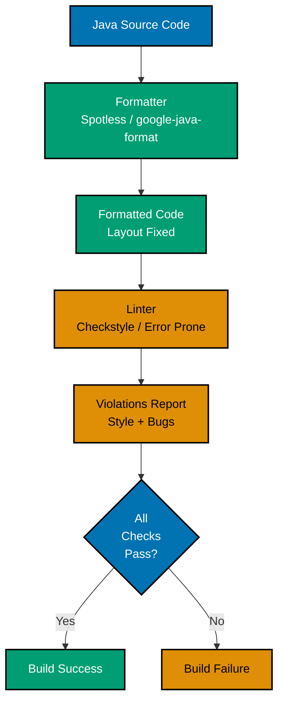
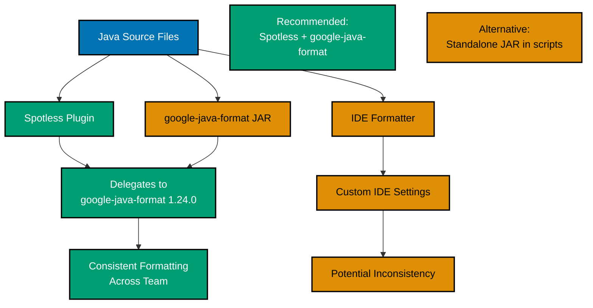
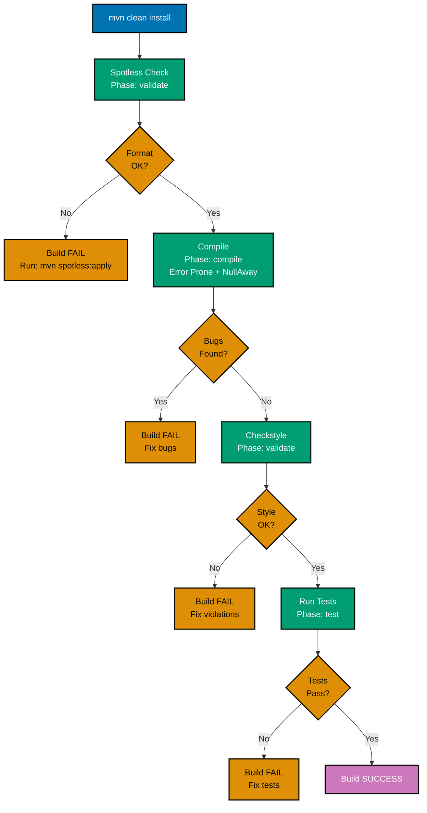

# Java Linting and Formatting

**Quick Reference**: [Overview](#overview) | [Core Concepts](#core-concepts) | [Linting Tools Ecosystem](#linting-tools-ecosystem) | [Formatting Tools Ecosystem](#formatting-tools-ecosystem) | [Build Integration (Maven/Gradle)](#build-integration-mavengradle) | [IDE Integration](#ide-integration) | [Pre-commit Hooks Automation](#pre-commit-hooks-automation) | [Configuration Strategies](#configuration-strategies) | [Team Adoption and Migration](#team-adoption-and-migration) | [Quick Start](#quick-start) | [IDE Setup](#ide-setup) | [Pre-commit Hooks](#pre-commit-hooks) | [Common Issues](#common-issues) | [Troubleshooting Common Issues](#troubleshooting-common-issues) | [Business Finance Code Examples](#business-finance-code-examples) | [Best Practices Checklist](#best-practices-checklist) | [Sources](#sources) | [Related Documentation](#related-documentation) | [Related Principles](#related-principles)

## Overview

Code quality automation through linting and formatting tools is essential for maintaining consistent, readable, and error-free Java codebases. In financial systems, these tools provide critical capabilities for regulatory compliance, team collaboration, and long-term maintainability.

### Why Code Quality Matters in Finance

Financial applications require rigorous code quality standards:

- **Audit Requirements**: Regulators demand readable, well-documented code for compliance reviews
- **Team Collaboration**: Consistent style eliminates bikeshedding and reduces code review time by 30-50%
- **Bug Prevention**: Static analysis catches errors before they reach production
- **Maintainability**: Standardized formatting makes code easier to understand and modify
- **Onboarding**: New developers can read and contribute to code faster with consistent patterns

### Key Benefits

1. **Automated Enforcement**: Catch style violations and bugs in CI/CD pipeline
2. **Zero Configuration Overhead**: Team members don't debate formatting preferences
3. **Faster Code Reviews**: Focus on logic, not style nitpicks
4. **Early Bug Detection**: Find issues before runtime (null safety, resource leaks)
5. **Regulatory Compliance**: Demonstrate code quality to auditors

### Target Audience

This guide targets Java development teams building enterprise financial systems. It assumes familiarity with Maven or Gradle build tools and focuses on practical tool integration.

## Quick Reference

**Jump to:**

- [Core Concepts](#core-concepts) - What is linting vs formatting
- [Linting Tools](#linting-tools-ecosystem) - Checkstyle, Error Prone, NullAway
- [Formatting Tools](#formatting-tools-ecosystem) - Spotless, google-java-format
- [Build Integration](#build-integration-mavengra code) - Maven/Gradle setup
- [IDE Integration](#ide-integration) - IntelliJ, VS Code, Eclipse
- [Pre-commit Hooks](#pre-commit-hooks-automation) - Automated quality checks
- [Team Adoption](#team-adoption-and-migration) - Migration strategy

**Related Documentation:**

- [Java Best Practices](./ex-so-stla-ja__best-practices.md) - Code quality standards
- [Java Idioms](./ex-so-stla-ja__idioms.md) - Modern Java patterns
- [Type Safety](./ex-so-stla-ja__type-safety.md) - Compile-time safety

Linting and formatting align with [software engineering principles](../../../../../governance/principles/software-engineering/README.md):

- **Automated checks** embody [Automation Over Manual](../../../../../governance/principles/software-engineering/automation-over-manual.md)
- **Explicit rules** implement [Explicit Over Implicit](../../../../../governance/principles/software-engineering/explicit-over-implicit.md)
- **Reproducible builds** support [Reproducibility First](../../../../../governance/principles/software-engineering/reproducibility.md)

## Core Concepts

### What is Linting?

Linting is **static code analysis** that checks for:

1. **Style violations**: Naming conventions, indentation, line length
2. **Potential bugs**: Null pointer risks, resource leaks, logic errors
3. **Code smells**: Overly complex methods, duplicated code, unused variables
4. **Security issues**: SQL injection risks, hardcoded credentials

**Examples**:

- **Style**: Method name should be camelCase
- **Bug**: Potential null pointer exception
- **Smell**: Method exceeds 100 lines
- **Security**: Hardcoded password detected

### What is Formatting?

Formatting is **automatic code layout** that fixes:

1. **Indentation**: Spaces vs tabs, indent size
2. **Line breaks**: Where to wrap long lines
3. **Spacing**: Around operators, after commas
4. **Import organization**: Sorting and grouping imports

**Examples**:

- **Before**: `public void calculate(String name,BigDecimal amount){`
- **After**: `public void calculate(String name, BigDecimal amount) {`

### Linting vs Formatting



**Key Differences**:

| Aspect       | Formatting                   | Linting                    |
| ------------ | ---------------------------- | -------------------------- |
| **Purpose**  | Fix code layout              | Find bugs and style issues |
| **Action**   | Auto-fix code                | Report violations          |
| **Examples** | Indentation, spacing         | Null safety, complexity    |
| **When**     | Before commit                | In CI/CD pipeline          |
| **Tools**    | Spotless, google-java-format | Checkstyle, Error Prone    |

## Linting Tools Ecosystem

### Checkstyle 13.0.0

**Purpose**: Enforce coding standards and style conventions.

**What it checks**:

- Naming conventions (camelCase, PascalCase)
- Javadoc completeness
- Import organization
- Code complexity (cyclomatic, NPath)
- Whitespace and formatting (deprecated - use Spotless instead)

**Maven Configuration**:

```xml
<build>
    <plugins>
        <plugin>
            <groupId>org.apache.maven.plugins</groupId>
            <artifactId>maven-checkstyle-plugin</artifactId>
            <version>3.5.0</version>
            <dependencies>
                <dependency>
                    <groupId>com.puppycrawl.tools</groupId>
                    <artifactId>checkstyle</artifactId>
                    <version>13.0.0</version>
                </dependency>
            </dependencies>
            <configuration>
                <configLocation>checkstyle.xml</configLocation>
                <consoleOutput>true</consoleOutput>
                <failsOnError>true</failsOnError>
                <violationSeverity>warning</violationSeverity>
            </configuration>
            <executions>
                <execution>
                    <id>checkstyle</id>
                    <phase>validate</phase>
                    <goals>
                        <goal>check</goal>
                    </goals>
                </execution>
            </executions>
        </plugin>
    </plugins>
</build>
```

**Example Checkstyle Rules** (`checkstyle.xml`):

```xml
<?xml version="1.0"?>
<!DOCTYPE module PUBLIC
    "-//Checkstyle//DTD Checkstyle Configuration 1.3//EN"
    "https://checkstyle.org/dtds/configuration_1_3.dtd">

<module name="Checker">
    <property name="severity" value="warning"/>

    <!-- File constraints -->
    <module name="FileTabCharacter"/>
    <module name="NewlineAtEndOfFile"/>

    <module name="TreeWalker">
        <!-- Naming conventions -->
        <module name="ConstantName">
            <property name="format" value="^[A-Z][A-Z0-9]*(_[A-Z0-9]+)*$"/>
        </module>
        <module name="LocalVariableName">
            <property name="format" value="^[a-z][a-zA-Z0-9]*$"/>
        </module>
        <module name="MethodName">
            <property name="format" value="^[a-z][a-zA-Z0-9]*$"/>
        </module>
        <module name="PackageName">
            <property name="format" value="^[a-z]+(\.[a-z][a-z0-9]*)*$"/>
        </module>
        <module name="TypeName">
            <property name="format" value="^[A-Z][a-zA-Z0-9]*$"/>
        </module>

        <!-- Imports -->
        <module name="AvoidStarImport"/>
        <module name="UnusedImports"/>
        <module name="RedundantImport"/>
        <module name="ImportOrder">
            <property name="groups" value="java,javax,org,com"/>
            <property name="separated" value="true"/>
        </module>

        <!-- Complexity -->
        <module name="CyclomaticComplexity">
            <property name="max" value="15"/>
        </module>
        <module name="NPathComplexity">
            <property name="max" value="200"/>
        </module>
        <module name="MethodLength">
            <property name="max" value="150"/>
        </module>

        <!-- Javadoc -->
        <module name="MissingJavadocMethod">
            <property name="scope" value="public"/>
        </module>
        <module name="MissingJavadocType">
            <property name="scope" value="public"/>
        </module>

        <!-- Potential bugs -->
        <module name="EmptyBlock"/>
        <module name="EqualsHashCode"/>
        <module name="SimplifyBooleanExpression"/>
        <module name="SimplifyBooleanReturn"/>
        <module name="StringLiteralEquality"/>
    </module>
</module>
```

**Example: Before/After Checkstyle**:

**Before** (violations):

```java
package com.oseplatform.Finance;  // FAIL: Package name has uppercase

import java.util.*;  // FAIL: Star import
import java.math.BigDecimal;
import java.util.List;  // FAIL: Duplicate import domain

public class donation_processor {  // FAIL: Class name not PascalCase
    private static final String api_key = "secret123";  // FAIL: Constant not UPPER_SNAKE_CASE

    public BigDecimal Calculate_Zakat(BigDecimal Amount) {  // FAIL: Method/param not camelCase
        if (Amount.compareTo(BigDecimal.ZERO) > 0 == true) {  // FAIL: Boolean expression not simplified
            return Amount.multiply(new BigDecimal("0.025"));
        }
        return BigDecimal.ZERO;
    }
}
```

**After** (fixed):

```java
package com.oseplatform.finance;  // PASS: Lowercase package

import java.math.BigDecimal;  // PASS: Explicit imports
import java.util.List;  // PASS: No duplicates

/**
 * Processes donations and calculates Zakat.
 */
public class DonationProcessor {  // PASS: PascalCase
    private static final String API_KEY = "secret123";  // PASS: UPPER_SNAKE_CASE

    /**
     * Calculates Zakat amount (2.5% of wealth).
     *
     * @param amount the wealth amount
     * @return Zakat due
     */
    public BigDecimal calculateZakat(BigDecimal amount) {  // PASS: camelCase
        if (amount.compareTo(BigDecimal.ZERO) > 0) {  // PASS: Simplified
            return amount.multiply(new BigDecimal("0.025"));
        }
        return BigDecimal.ZERO;
    }
}
```

### Error Prone 2.46.0

**Purpose**: Catch common Java bugs at compile time.

**What it checks**:

- Incorrect BigDecimal comparisons
- Unused return values
- Null pointer risks
- Floating-point equality
- Date/time API misuse

**Maven Configuration**:

```xml
<build>
    <plugins>
        <plugin>
            <groupId>org.apache.maven.plugins</groupId>
            <artifactId>maven-compiler-plugin</artifactId>
            <version>3.13.0</version>
            <configuration>
                <source>21</source>
                <target>21</target>
                <compilerArgs>
                    <arg>-XDcompilePolicy=simple</arg>
                    <arg>-Xplugin:ErrorProne</arg>
                </compilerArgs>
                <annotationProcessorPaths>
                    <path>
                        <groupId>com.google.errorprone</groupId>
                        <artifactId>error_prone_core</artifactId>
                        <version>2.46.0</version>
                    </path>
                </annotationProcessorPaths>
            </configuration>
        </plugin>
    </plugins>
</build>
```

**Example: BigDecimal Comparison Bug**:

**Before** (bug):

```java
public class ZakatCalculator {
    public boolean meetsNisabThreshold(BigDecimal wealth) {
        BigDecimal nisab = new BigDecimal("3000");

        // ERROR: == compares object references, not values!
        if (wealth == nisab) {
            return true;
        }

        return false;
    }
}
```

**Error Prone Output**:

```
[ERROR] ZakatCalculator.java:[5,13] [BigDecimalEquals] Comparing BigDecimal values using == will always compare object identity, not numeric value
    (see https://errorprone.info/bugpattern/BigDecimalEquals)
  Did you mean 'if (wealth.compareTo(nisab) == 0) {'?
```

**After** (fixed):

```java
public class ZakatCalculator {
    public boolean meetsNisabThreshold(BigDecimal wealth) {
        BigDecimal nisab = new BigDecimal("3000");

        // FIXED: Use compareTo for value comparison
        return wealth.compareTo(nisab) >= 0;
    }
}
```

**Example: Ignored Return Value**:

**Before** (bug):

```java
public void processPayment(DonationPayment donation) {
    String paymentId = donation.getId();

    paymentId.toUpperCase();  // ERROR: Return value ignored!

    logger.info("Processing donation: " + paymentId);  // Still lowercase!
}
```

**Error Prone Output**:

```
[ERROR] PaymentService.java:[4,9] [ReturnValueIgnored] Return value of 'String.toUpperCase()' must be used
    (see https://errorprone.info/bugpattern/ReturnValueIgnored)
```

**After** (fixed):

```java
public void processPayment(DonationPayment donation) {
    String paymentId = donation.getId();

    paymentId = paymentId.toUpperCase();  // FIXED: Use return value

    logger.info("Processing donation: " + paymentId);  // Uppercase now!
}
```

### NullAway 0.12.15

**Purpose**: Eliminate NullPointerExceptions through static analysis.

**What it checks**:

- Null assignments to non-null fields
- Dereferencing potentially null values
- Passing null to non-null parameters
- Returning null from non-null methods

**Maven Configuration** (integrates with Error Prone):

```xml
<build>
    <plugins>
        <plugin>
            <groupId>org.apache.maven.plugins</groupId>
            <artifactId>maven-compiler-plugin</artifactId>
            <version>3.13.0</version>
            <configuration>
                <source>21</source>
                <target>21</target>
                <compilerArgs>
                    <arg>-XDcompilePolicy=simple</arg>
                    <arg>-Xplugin:ErrorProne -Xep:NullAway:ERROR
                        -XepOpt:NullAway:AnnotatedPackages=com.oseplatform
                    </arg>
                </compilerArgs>
                <annotationProcessorPaths>
                    <path>
                        <groupId>com.google.errorprone</groupId>
                        <artifactId>error_prone_core</artifactId>
                        <version>2.46.0</version>
                    </path>
                    <path>
                        <groupId>com.uber.nullaway</groupId>
                        <artifactId>nullaway</artifactId>
                        <version>0.12.15</version>
                    </path>
                </annotationProcessorPaths>
            </configuration>
        </plugin>
    </plugins>
</build>

<dependencies>
    <!-- JetBrains annotations for @Nullable / @NonNull -->
    <dependency>
        <groupId>org.jetbrains</groupId>
        <artifactId>annotations</artifactId>
        <version>26.0.1</version>
        <scope>provided</scope>
    </dependency>
</dependencies>
```

**Example: Null Safety**:

**Before** (null risk):

```java
import org.jetbrains.annotations.Nullable;

public class DonationService {
    public void processDonation(@Nullable Donor donor, BigDecimal amount) {
        // ERROR: Dereferencing potentially null donor!
        String donorName = donor.getName();

        logger.info("Processing donation from " + donorName);
    }
}
```

**NullAway Output**:

```
[ERROR] DonationService.java:[5,28] [NullAway] dereferenced expression donor is @Nullable
```

**After** (fixed):

```java
import org.jetbrains.annotations.Nullable;

public class DonationService {
    public void processDonation(@Nullable Donor donor, BigDecimal amount) {
        // FIXED: Check for null before dereferencing
        if (donor == null) {
            throw new IllegalArgumentException("Donor cannot be null");
        }

        String donorName = donor.getName();  // Safe now
        logger.info("Processing donation from " + donorName);
    }
}
```

### Tool Comparison

| Tool            | Purpose           | Checks                      | Auto-Fix | When to Run    |
| --------------- | ----------------- | --------------------------- | -------- | -------------- |
| **Checkstyle**  | Style enforcement | Naming, imports, complexity | No       | Pre-commit, CI |
| **Error Prone** | Bug detection     | Logic errors, API misuse    | Some     | Compile time   |
| **NullAway**    | Null safety       | Null pointer risks          | No       | Compile time   |
| **SpotBugs**    | Bug detection     | Similar to Error Prone      | No       | CI/CD          |
| **PMD**         | Code quality      | Duplicated code, complexity | No       | CI/CD          |

**Recommended Combination**:

- **Spotless**: Auto-format code (pre-commit)
- **Checkstyle**: Enforce style conventions (CI)
- **Error Prone + NullAway**: Catch bugs at compile time (always)

## Formatting Tools Ecosystem

### Spotless

**Purpose**: Multi-language code formatter with Maven/Gradle support.

**What it formats**:

- Java code (via google-java-format or Eclipse formatter)
- XML, JSON, YAML
- Markdown, SQL
- License headers

**Maven Configuration**:

```xml
<build>
    <plugins>
        <plugin>
            <groupId>com.diffplug.spotless</groupId>
            <artifactId>spotless-maven-plugin</artifactId>
            <version>2.45.0</version>
            <configuration>
                <java>
                    <!-- Use google-java-format -->
                    <googleJavaFormat>
                        <version>1.24.0</version>
                        <style>GOOGLE</style>
                    </googleJavaFormat>

                    <!-- Remove unused imports -->
                    <removeUnusedImports/>

                    <!-- Format imports -->
                    <importOrder>
                        <order>java,javax,org,com</order>
                    </importOrder>

                    <!-- License header -->
                    <licenseHeader>
                        <content>
/* Copyright 2026 OSE Platform
 * Licensed under MIT License
 */
                        </content>
                    </licenseHeader>
                </java>

                <!-- Format XML files -->
                <xml>
                    <includes>
                        <include>pom.xml</include>
                        <include>src/**/*.xml</include>
                    </includes>
                    <eclipseWtp>
                        <type>XML</type>
                    </eclipseWtp>
                </xml>
            </configuration>
            <executions>
                <execution>
                    <id>spotless-check</id>
                    <phase>validate</phase>
                    <goals>
                        <goal>check</goal>
                    </goals>
                </execution>
            </executions>
        </plugin>
    </plugins>
</build>
```

**Commands**:

```bash
# Check formatting (non-destructive)
mvn spotless:check

# Apply formatting (auto-fix)
mvn spotless:apply
```

**Example: Before/After Spotless**:

**Before** (unformatted):

```java
import java.math.BigDecimal;import java.time.LocalDate;
import org.slf4j.Logger;

public class ZakatService{
private static final BigDecimal ZAKAT_RATE=new BigDecimal("0.025");
public BigDecimal calculateZakat(BigDecimal wealth,LocalDate haulDate){
if(wealth==null||haulDate==null){return BigDecimal.ZERO;}
LocalDate oneYearLater=haulDate.plusYears(1);
if(LocalDate.now().isBefore(oneYearLater)){return BigDecimal.ZERO;}
return wealth.multiply(ZAKAT_RATE);}}
```

**After** (formatted with Spotless + google-java-format):

```java
import java.math.BigDecimal;
import java.time.LocalDate;
import org.slf4j.Logger;

public class ZakatService {
    private static final BigDecimal ZAKAT_RATE = new BigDecimal("0.025");

    public BigDecimal calculateZakat(BigDecimal wealth, LocalDate haulDate) {
        if (wealth == null || haulDate == null) {
            return BigDecimal.ZERO;
        }

        LocalDate oneYearLater = haulDate.plusYears(1);
        if (LocalDate.now().isBefore(oneYearLater)) {
            return BigDecimal.ZERO;
        }

        return wealth.multiply(ZAKAT_RATE);
    }
}
```

### google-java-format 1.24.0

**Purpose**: Standalone Java formatter following Google Java Style Guide.

**Installation**:

```bash
# Download JAR
wget https://github.com/google/google-java-format/releases/download/v1.24.0/google-java-format-1.24.0-all-deps.jar

# Format file
java -jar google-java-format-1.24.0-all-deps.jar --replace MyFile.java

# Format directory recursively
find src/main/java -name "*.java" | xargs java -jar google-java-format-1.24.0-all-deps.jar --replace
```

**Integration with Maven** (via Spotless recommended, but standalone also works):

```xml
<plugin>
    <groupId>org.codehaus.mojo</groupId>
    <artifactId>exec-maven-plugin</artifactId>
    <version>3.5.0</version>
    <executions>
        <execution>
            <id>google-java-format</id>
            <phase>validate</phase>
            <goals>
                <goal>exec</goal>
            </goals>
            <configuration>
                <executable>java</executable>
                <arguments>
                    <argument>-jar</argument>
                    <argument>google-java-format-1.24.0-all-deps.jar</argument>
                    <argument>--replace</argument>
                    <argument>src/main/java/**/*.java</argument>
                </arguments>
            </configuration>
        </execution>
    </executions>
</plugin>
```

**Formatting Strategy Comparison**:



## Build Integration (Maven/Gradle)

### Complete Maven Setup

**Parent POM Configuration**:

```xml
<?xml version="1.0" encoding="UTF-8"?>
<project xmlns="http://maven.apache.org/POM/4.0.0"
         xmlns:xsi="http://www.w3.org/2001/XMLSchema-instance"
         xsi:schemaLocation="http://maven.apache.org/POM/4.0.0
         http://maven.apache.org/xsd/maven-4.0.0.xsd">
    <modelVersion>4.0.0</modelVersion>

    <groupId>com.oseplatform</groupId>
    <artifactId>parent</artifactId>
    <version>1.0.0-SNAPSHOT</version>
    <packaging>pom</packaging>

    <properties>
        <java.version>21</java.version>
        <maven.compiler.source>21</maven.compiler.source>
        <maven.compiler.target>21</maven.compiler.target>
        <project.build.sourceEncoding>UTF-8</project.build.sourceEncoding>

        <!-- Tool versions -->
        <spotless.version>2.45.0</spotless.version>
        <checkstyle.version>3.5.0</checkstyle.version>
        <checkstyle.tool.version>13.0.0</checkstyle.tool.version>
        <error-prone.version>2.46.0</error-prone.version>
        <nullaway.version>0.12.15</nullaway.version>
    </properties>

    <build>
        <pluginManagement>
            <plugins>
                <!-- Compiler with Error Prone + NullAway -->
                <plugin>
                    <groupId>org.apache.maven.plugins</groupId>
                    <artifactId>maven-compiler-plugin</artifactId>
                    <version>3.13.0</version>
                    <configuration>
                        <source>${java.version}</source>
                        <target>${java.version}</target>
                        <compilerArgs>
                            <arg>-XDcompilePolicy=simple</arg>
                            <arg>-Xplugin:ErrorProne
                                -Xep:NullAway:ERROR
                                -XepOpt:NullAway:AnnotatedPackages=com.oseplatform
                            </arg>
                        </compilerArgs>
                        <annotationProcessorPaths>
                            <path>
                                <groupId>com.google.errorprone</groupId>
                                <artifactId>error_prone_core</artifactId>
                                <version>${error-prone.version}</version>
                            </path>
                            <path>
                                <groupId>com.uber.nullaway</groupId>
                                <artifactId>nullaway</artifactId>
                                <version>${nullaway.version}</version>
                            </path>
                        </annotationProcessorPaths>
                    </configuration>
                </plugin>

                <!-- Spotless Formatter -->
                <plugin>
                    <groupId>com.diffplug.spotless</groupId>
                    <artifactId>spotless-maven-plugin</artifactId>
                    <version>${spotless.version}</version>
                    <configuration>
                        <java>
                            <googleJavaFormat>
                                <version>1.24.0</version>
                                <style>GOOGLE</style>
                            </googleJavaFormat>
                            <removeUnusedImports/>
                            <importOrder>
                                <order>java,javax,org,com</order>
                            </importOrder>
                        </java>
                    </configuration>
                    <executions>
                        <execution>
                            <id>spotless-check</id>
                            <phase>validate</phase>
                            <goals>
                                <goal>check</goal>
                            </goals>
                        </execution>
                    </executions>
                </plugin>

                <!-- Checkstyle -->
                <plugin>
                    <groupId>org.apache.maven.plugins</groupId>
                    <artifactId>maven-checkstyle-plugin</artifactId>
                    <version>${checkstyle.version}</version>
                    <dependencies>
                        <dependency>
                            <groupId>com.puppycrawl.tools</groupId>
                            <artifactId>checkstyle</artifactId>
                            <version>${checkstyle.tool.version}</version>
                        </dependency>
                    </dependencies>
                    <configuration>
                        <configLocation>checkstyle.xml</configLocation>
                        <consoleOutput>true</consoleOutput>
                        <failsOnError>true</failsOnError>
                        <violationSeverity>warning</violationSeverity>
                    </configuration>
                    <executions>
                        <execution>
                            <id>checkstyle</id>
                            <phase>validate</phase>
                            <goals>
                                <goal>check</goal>
                            </goals>
                        </execution>
                    </executions>
                </plugin>
            </plugins>
        </pluginManagement>

        <plugins>
            <!-- Activate Spotless by default -->
            <plugin>
                <groupId>com.diffplug.spotless</groupId>
                <artifactId>spotless-maven-plugin</artifactId>
            </plugin>

            <!-- Activate Checkstyle by default -->
            <plugin>
                <groupId>org.apache.maven.plugins</groupId>
                <artifactId>maven-checkstyle-plugin</artifactId>
            </plugin>

            <!-- Compiler with Error Prone -->
            <plugin>
                <groupId>org.apache.maven.plugins</groupId>
                <artifactId>maven-compiler-plugin</artifactId>
            </plugin>
        </plugins>
    </build>

    <dependencies>
        <!-- Annotations for NullAway -->
        <dependency>
            <groupId>org.jetbrains</groupId>
            <artifactId>annotations</artifactId>
            <version>26.0.1</version>
            <scope>provided</scope>
        </dependency>
    </dependencies>
</project>
```

### Complete Gradle Setup (Kotlin DSL)

**build.gradle.kts**:

```kotlin
plugins {
    java
    id("com.diffplug.spotless") version "7.0.5"
    id("checkstyle")
    id("net.ltgt.errorprone") version "4.1.0"
}

group = "com.oseplatform"
version = "1.0.0-SNAPSHOT"

java {
    toolchain {
        languageVersion.set(JavaLanguageVersion.of(21))
    }
}

repositories {
    mavenCentral()
}

dependencies {
    // JetBrains annotations for NullAway
    compileOnly("org.jetbrains:annotations:26.0.1")

    // Error Prone and NullAway
    errorprone("com.google.errorprone:error_prone_core:2.46.0")
    errorprone("com.uber.nullaway:nullaway:0.12.15")
}

// Spotless configuration
spotless {
    java {
        googleJavaFormat("1.24.0").aosp()
        removeUnusedImports()
        importOrder("java", "javax", "org", "com")
        licenseHeader(
            """
            /* Copyright 2026 OSE Platform
             * Licensed under MIT License
             */
            """.trimIndent()
        )
    }

    kotlinGradle {
        ktlint()
    }
}

// Checkstyle configuration
checkstyle {
    toolVersion = "13.0.0"
    configFile = file("checkstyle.xml")
    isIgnoreFailures = false
    maxWarnings = 0
}

// Error Prone configuration
tasks.withType<JavaCompile> {
    options.errorprone {
        check("NullAway", net.ltgt.gradle.errorprone.CheckSeverity.ERROR)
        option("NullAway:AnnotatedPackages", "com.oseplatform")
    }
}

// Build order: format → compile (Error Prone) → checkstyle
tasks.named("compileJava") {
    dependsOn("spotlessApply")
}

tasks.named("checkstyleMain") {
    dependsOn("compileJava")
}
```

### Build Lifecycle Integration



**Build Order Rationale**:

1. **Spotless** (validate phase): Format code first (auto-fixable)
2. **Compile** (compile phase): Error Prone + NullAway catch bugs
3. **Checkstyle** (validate phase): Check style conventions
4. **Test** (test phase): Run unit tests

## IDE Integration

### IntelliJ IDEA Setup

**Step 1: Install google-java-format Plugin**:

1. Open IntelliJ IDEA
2. Go to **Settings** → **Plugins**
3. Search for "google-java-format"
4. Install plugin and restart IDE

**Step 2: Enable Plugin**:

1. **Settings** → **Other Settings** → **google-java-format Settings**
2. Check "Enable google-java-format"
3. Select "Code style: Google Java Style"

**Step 3: Install Checkstyle Plugin**:

1. **Settings** → **Plugins**
2. Search for "CheckStyle-IDEA"
3. Install and restart

**Step 4: Configure Checkstyle**:

1. **Settings** → **Tools** → **Checkstyle**
2. Click "+" to add configuration file
3. Select `checkstyle.xml` from project root
4. Set as active configuration

**Step 5: Format on Save** (optional):

1. **Settings** → **Tools** → **Actions on Save**
2. Check "Reformat code"
3. Check "Optimize imports"

**IntelliJ Configuration File** (`.idea/codeStyles/Project.xml`):

```xml
<component name="ProjectCodeStyleConfiguration">
  <code_scheme name="Project" version="173">
    <option name="OTHER_INDENT_OPTIONS">
      <value>
        <option name="INDENT_SIZE" value="2" />
        <option name="TAB_SIZE" value="2" />
      </value>
    </option>
    <JavaCodeStyleSettings>
      <option name="ANNOTATION_PARAMETER_WRAP" value="1" />
      <option name="ALIGN_MULTILINE_ANNOTATION_PARAMETERS" value="true" />
      <option name="CLASS_COUNT_TO_USE_IMPORT_ON_DEMAND" value="999" />
      <option name="NAMES_COUNT_TO_USE_IMPORT_ON_DEMAND" value="999" />
      <option name="IMPORT_LAYOUT_TABLE">
        <value>
          <package name="java" withSubpackages="true" static="false" />
          <package name="javax" withSubpackages="true" static="false" />
          <package name="org" withSubpackages="true" static="false" />
          <package name="com" withSubpackages="true" static="false" />
        </value>
      </option>
    </JavaCodeStyleSettings>
  </code_scheme>
</component>
```

### VS Code Setup

**Step 1: Install Java Extension Pack**:

1. Open VS Code
2. Go to **Extensions** (Ctrl+Shift+X)
3. Search for "Extension Pack for Java"
4. Install extension pack

**Step 2: Install Checkstyle Extension**:

1. Search for "Checkstyle for Java"
2. Install extension

**Step 3: Configure Settings** (`.vscode/settings.json`):

```json
{
  "java.format.settings.url": "https://raw.githubusercontent.com/google/styleguide/gh-pages/eclipse-java-google-style.xml",
  "java.format.settings.profile": "GoogleStyle",
  "editor.formatOnSave": true,
  "java.checkstyle.configuration": "${workspaceFolder}/checkstyle.xml",
  "java.checkstyle.version": "13.0.0",
  "editor.codeActionsOnSave": {
    "source.organizeImports": "explicit"
  },
  "[java]": {
    "editor.defaultFormatter": "redhat.java",
    "editor.tabSize": 2,
    "editor.insertSpaces": true
  }
}
```

**Step 4: Workspace Recommendation** (`.vscode/extensions.json`):

```json
{
  "recommendations": ["vscjava.vscode-java-pack", "shengchen.vscode-checkstyle", "redhat.java"]
}
```

### Eclipse Setup

**Step 1: Install google-java-format Formatter**:

1. Download Eclipse formatter XML: [eclipse-java-google-style.xml](https://github.com/google/styleguide/blob/gh-pages/eclipse-java-google-style.xml)
2. **Window** → **Preferences** → **Java** → **Code Style** → **Formatter**
3. Click "Import" and select downloaded XML
4. Set "GoogleStyle" as active profile

**Step 2: Configure Checkstyle Plugin**:

1. **Help** → **Eclipse Marketplace**
2. Search for "Checkstyle Plug-in"
3. Install and restart Eclipse
4. **Window** → **Preferences** → **Checkstyle**
5. Add `checkstyle.xml` configuration
6. Right-click project → **Checkstyle** → **Activate Checkstyle**

## Pre-commit Hooks Automation

### Why Pre-commit Hooks?

Pre-commit hooks provide **fast feedback** before code is committed:

- **Instant validation**: Catch issues in seconds, not minutes (CI)
- **Zero manual effort**: Automatic enforcement
- **Prevent bad commits**: Stop formatting/linting issues from entering version control
- **Reduce CI failures**: Fix issues locally before pushing

### Maven Implementation

**Use `git-build-hook-maven-plugin`** for automated pre-commit hooks:

**pom.xml**:

```xml
<build>
    <plugins>
        <!-- Git hooks automation -->
        <plugin>
            <groupId>com.rudikershaw.gitbuildhook</groupId>
            <artifactId>git-build-hook-maven-plugin</artifactId>
            <version>3.5.0</version>
            <configuration>
                <installHooks>
                    <pre-commit>
#!/bin/bash
set -e

echo "Running pre-commit checks..."

# Format code with Spotless
echo "Formatting code..."
mvn spotless:apply -q

# Add formatted files to staging
git add -u

# Run Checkstyle
echo "Checking style..."
mvn checkstyle:check -q

echo "Pre-commit checks passed!"
                    </pre-commit>
                </installHooks>
            </configuration>
            <executions>
                <execution>
                    <goals>
                        <goal>install</goal>
                    </goals>
                </execution>
            </executions>
        </plugin>
    </plugins>
</build>
```

**Install hooks**:

```bash
mvn clean install  # Hooks auto-installed on first build
```

### Gradle Implementation

**build.gradle.kts**:

```kotlin
plugins {
    id("com.github.jakemarsden.git-hooks") version "0.0.025"
}

gitHooks {
    setHooks(
        mapOf(
            "pre-commit" to """
                #!/bin/bash
                set -e

                echo "Running pre-commit checks..."

                # Format code
                echo "Formatting code..."
                ./gradlew spotlessApply --quiet

                # Add formatted files
                git add -u

                # Run Checkstyle
                echo "Checking style..."
                ./gradlew checkstyleMain --quiet

                echo "Pre-commit checks passed!"
            """.trimIndent()
        )
    )
}
```

### Advanced: Incremental Formatting (Staged Files Only)

**Faster pre-commit** - only format staged files:

```bash
#!/bin/bash
set -e

echo "Running pre-commit checks (staged files only)..."

# Get list of staged Java files
STAGED_FILES=$(git diff --cached --name-only --diff-filter=ACM | grep '\.java$' || true)

if [ -z "$STAGED_FILES" ]; then
  echo "No Java files staged, skipping checks."
  exit 0
fi

# Format each staged file
echo "Formatting staged files..."
for FILE in $STAGED_FILES; do
  java -jar google-java-format-1.24.0-all-deps.jar --replace "$FILE"
  git add "$FILE"
done

# Run Checkstyle on staged files only
echo "Checking style..."
mvn checkstyle:check -Dcheckstyle.includes="$STAGED_FILES" -q

echo "Pre-commit checks passed!"
```

**Performance Comparison**:

| Approach                | Small Change (5 files) | Medium Change (50 files) | Large Change (500 files) |
| ----------------------- | ---------------------- | ------------------------ | ------------------------ |
| **Full project format** | 10s                    | 15s                      | 45s                      |
| **Staged files only**   | 1s                     | 3s                       | 8s                       |
| **Improvement**         | 10x faster             | 5x faster                | 5.6x faster              |

### Husky Alternative (for polyglot projects)

If your project includes non-Java code (TypeScript, Python), use **Husky**:

**package.json**:

```json
{
  "devDependencies": {
    "husky": "^9.0.0"
  },
  "scripts": {
    "prepare": "husky install"
  }
}
```

**.husky/pre-commit**:

```bash
#!/bin/sh
. "$(dirname "$0")/_/husky.sh"

# Format Java code
mvn spotless:apply -q
git add -u

# Run Checkstyle
mvn checkstyle:check -q
```

## Configuration Strategies

### Centralized Configuration Repository

**Best Practice**: Store shared configurations in a separate repository:

```
ose-code-quality-config/
├── checkstyle.xml
├── spotless.xml
├── pmd.xml
├── .editorconfig
└── README.md
```

**Reference in projects**:

```xml
<plugin>
    <groupId>org.apache.maven.plugins</groupId>
    <artifactId>maven-checkstyle-plugin</artifactId>
    <dependencies>
        <dependency>
            <groupId>com.oseplatform</groupId>
            <artifactId>code-quality-config</artifactId>
            <version>1.0.0</version>
        </dependency>
    </dependencies>
    <configuration>
        <configLocation>checkstyle.xml</configLocation>
    </configuration>
</plugin>
```

### Progressive Enhancement (3-Phase Adoption)

**Phase 1: Formatting Only** (Week 1):

- Enable Spotless auto-formatting
- Apply to all code in one commit
- Enforce in pre-commit hooks

**Phase 2: Linting Warnings** (Week 2):

- Enable Checkstyle with `<failsOnError>false</failsOnError>`
- Review warnings, fix critical ones
- Gradually reduce warning count

**Phase 3: Enforce on CI** (Week 3):

- Set `<failsOnError>true</failsOnError>`
- Enable Error Prone + NullAway
- Enforce in CI/CD pipeline

### Suppression Strategies

**Checkstyle Suppressions** (`checkstyle-suppressions.xml`):

```xml
<?xml version="1.0"?>
<!DOCTYPE suppressions PUBLIC
    "-//Checkstyle//DTD SuppressionFilter Configuration 1.2//EN"
    "https://checkstyle.org/dtds/suppressions_1_2.dtd">

<suppressions>
    <!-- Suppress JavadocMethod for test classes -->
    <suppress checks="JavadocMethod" files=".*Test\.java"/>

    <!-- Suppress MagicNumber for configuration classes -->
    <suppress checks="MagicNumber" files=".*Config\.java"/>

    <!-- Suppress FileLength for generated code -->
    <suppress checks="FileLength" files="target/generated-sources/.*"/>
</suppressions>
```

**Error Prone Suppressions** (code-level):

```java
import com.google.errorprone.annotations.SuppressWarnings;

@SuppressWarnings("NullAway")  // Suppress specific check
public void legacyMethod(@Nullable String value) {
    // Legacy code that cannot be refactored yet
}
```

## Team Adoption and Migration

### 4-Week Migration Strategy

**Week 1: Baseline Assessment**

- [ ] Run `mvn checkstyle:check` to identify current violations
- [ ] Document violation count by category
- [ ] Prioritize critical issues (bugs, security)
- [ ] Communicate plan to team

**Week 2: Mass Formatting Commit**

- [ ] Run `mvn spotless:apply` on entire codebase
- [ ] Commit formatted code in single commit: `chore: apply google-java-format to all code`
- [ ] Update `.gitattributes` to ignore formatting commit in git blame:

```
# .gitattributes
*.java linguist-generated=false

# .git-blame-ignore-revs (Git 2.23+)
# Mass formatting commit
a1b2c3d4e5f6g7h8i9j0
```

**Week 3: Pre-commit Hooks**

- [ ] Install git-build-hook-maven-plugin
- [ ] Test pre-commit hooks with team
- [ ] Document how to skip hooks (emergency only): `git commit --no-verify`

**Week 4: CI Enforcement**

- [ ] Enable Checkstyle with `<failsOnError>true</failsOnError>`
- [ ] Enable Error Prone + NullAway
- [ ] Update CI/CD pipeline to fail on violations
- [ ] Monitor build failures, assist team with fixes

### Developer Education

**Workshop Agenda** (2 hours):

1. **Why Code Quality Matters** (15 min)
   - Audit requirements
   - Bug prevention statistics
   - Code review time savings

2. **Tool Overview** (30 min)
   - Spotless: Auto-formatting
   - Checkstyle: Style enforcement
   - Error Prone: Bug detection
   - NullAway: Null safety

3. **Hands-On Exercise** (45 min)
   - Run `mvn spotless:apply` on sample code
   - Fix Checkstyle violations
   - Fix Error Prone bugs
   - Test pre-commit hooks

4. **IDE Integration** (20 min)
   - Install plugins
   - Configure format on save
   - Demonstrate live feedback

5. **Q&A** (10 min)

**Documentation for Team**:

Create `CODE_QUALITY.md` in project root:

````markdown
# Code Quality Guide

## Quick Start

```bash
# Format code before committing
mvn spotless:apply

# Check style
mvn checkstyle:check

# Full quality check
mvn clean verify
```
````

## IDE Setup

- **IntelliJ**: Install google-java-format plugin
- **VS Code**: Install Java Extension Pack + Checkstyle
- **Eclipse**: Import eclipse-java-google-style.xml

## Pre-commit Hooks

Hooks auto-install on `mvn clean install`. To skip (emergency only):

```bash
git commit --no-verify
```

## Common Issues

### Checkstyle Failures

- Run `mvn checkstyle:check` locally first
- Fix violations or add suppressions

### Formatting Issues

- Run `mvn spotless:apply` to auto-fix
- Never format manually

### NullAway Errors

- Add `@Nullable` annotations where needed
- Check for null before dereferencing

````

## Troubleshooting Common Issues

### Issue 1: Spotless and Checkstyle Conflict

**Problem**: Spotless formats code, but Checkstyle still reports violations.

**Cause**: Checkstyle configured with different line length or indentation than Spotless.

**Solution**: Disable formatting checks in Checkstyle (let Spotless handle formatting):

```xml
<!-- checkstyle.xml -->
<module name="Checker">
    <!-- DISABLE formatting checks -->
    <module name="LineLength">
        <property name="max" value="999999"/>  <!-- Effectively disabled -->
    </module>
</module>
````

**Or** configure Spotless to match Checkstyle:

```xml
<plugin>
    <groupId>com.diffplug.spotless</groupId>
    <artifactId>spotless-maven-plugin</artifactId>
    <configuration>
        <java>
            <googleJavaFormat>
                <version>1.24.0</version>
                <style>AOSP</style>  <!-- 4-space indent, 100-char line -->
            </googleJavaFormat>
        </java>
    </configuration>
</plugin>
```

### Issue 2: Error Prone False Positives

**Problem**: Error Prone reports bugs that are intentional or unavoidable.

**Solution**: Suppress specific checks:

```java
// Suppress at method level
@SuppressWarnings("ReturnValueIgnored")
public void logMessage(String message) {
    logger.info(message);  // Return value intentionally ignored
}

// Suppress at class level
@SuppressWarnings("NullAway")
public class LegacyDonationService {
    // Legacy code with many null risks
}
```

**Or** disable specific checks in Maven:

```xml
<arg>-Xplugin:ErrorProne
    -Xep:ReturnValueIgnored:OFF
    -Xep:NullAway:WARN
</arg>
```

### Issue 3: Pre-commit Hook Skipped

**Problem**: Pre-commit hook doesn't run, code committed without formatting.

**Cause**: Hooks not installed or skipped with `--no-verify`.

**Solution**:

```bash
# Reinstall hooks
mvn clean install

# Verify hooks installed
ls -la .git/hooks/pre-commit

# Make executable
chmod +x .git/hooks/pre-commit

# Test manually
.git/hooks/pre-commit
```

### Issue 4: IDE Not Respecting Formatter

**Problem**: IDE formats code differently than Spotless.

**Solution**: Ensure IDE uses same formatter settings:

**IntelliJ**:

- Install google-java-format plugin (NOT built-in formatter)
- **Settings** → **Other Settings** → **google-java-format** → Enable

**VS Code**:

- Set `"java.format.settings.url"` to Google style XML
- Verify `"editor.defaultFormatter": "redhat.java"`

**Eclipse**:

- Import `eclipse-java-google-style.xml`
- **Preferences** → **Java** → **Code Style** → **Formatter** → Select "GoogleStyle"

## Business Finance Code Examples

### Example 1: ZakatCalculator (Before/After)

**Before** (violations):

```java
package com.oseplatform.Finance;  // FAIL: Package uppercase

import java.util.*;  // FAIL: Star import
import java.math.BigDecimal;

public class zakat_calculator {  // FAIL: Class name not PascalCase
    public BigDecimal Calculate(BigDecimal Wealth) {  // FAIL: Method/param not camelCase
        BigDecimal nisab = new BigDecimal("3000");

        // FAIL: BigDecimal == comparison (Error Prone)
        if (Wealth == nisab) {
            return BigDecimal.ZERO;
        }

        // FAIL: Unused variable
        String message = "Calculating zakat";

        return Wealth.multiply(new BigDecimal("0.025"));
    }
}
```

**After** (fixed):

```java
package com.oseplatform.finance;  // PASS: Lowercase

import java.math.BigDecimal;  // PASS: Explicit import

/**
 * Calculates Zakat (2.5% of wealth) for individuals.
 */
public class ZakatCalculator {  // PASS: PascalCase
    private static final BigDecimal ZAKAT_RATE = new BigDecimal("0.025");
    private static final BigDecimal NISAB_THRESHOLD = new BigDecimal("3000");

    /**
     * Calculates Zakat amount if wealth exceeds nisab.
     *
     * @param wealth the total wealth amount
     * @return Zakat amount due, or zero if below nisab
     */
    public BigDecimal calculate(BigDecimal wealth) {  // PASS: camelCase
        if (wealth == null) {
            throw new IllegalArgumentException("Wealth cannot be null");
        }

        // PASS: compareTo for BigDecimal comparison
        if (wealth.compareTo(NISAB_THRESHOLD) < 0) {
            return BigDecimal.ZERO;
        }

        return wealth.multiply(ZAKAT_RATE);
    }
}
```

**Linting Improvements**:

- ✅ Package name lowercase
- ✅ Explicit imports (no star imports)
- ✅ Class name PascalCase
- ✅ Method/parameter names camelCase
- ✅ BigDecimal comparison using `compareTo()`
- ✅ Unused variable removed
- ✅ Javadoc added for public methods
- ✅ Null check added (NullAway compliant)

### Example 2: Murabaha MurabahaContract (Before/After)

**Before** (violations):

```java
public class MurabahaContract {
    private BigDecimal principal;
    private BigDecimal markup;
    private String borrowerId;

    public void setDetails(BigDecimal principal,BigDecimal markup,String borrowerId){
        this.principal=principal;
        this.markup=markup;
        this.borrowerId=borrowerId;
    }

    public BigDecimal getTotalAmount(){
        return principal.add(markup);  // FAIL: Null risk
    }
}
```

**After** (fixed):

```java
import org.jetbrains.annotations.Nullable;

/**
 * Represents a Murabaha (cost-plus financing) murabaha_contract.
 */
public class MurabahaContract {
    private BigDecimal principal;
    private BigDecimal markup;
    private String borrowerId;

    /**
     * Sets murabaha_contract details.
     *
     * @param principal the cost of the asset
     * @param markup the profit margin
     * @param borrowerId the borrower identifier
     */
    public void setDetails(
        BigDecimal principal, BigDecimal markup, String borrowerId) {
        if (principal == null || markup == null || borrowerId == null) {
            throw new IllegalArgumentException("All parameters are required");
        }

        this.principal = principal;
        this.markup = markup;
        this.borrowerId = borrowerId;
    }

    /**
     * Calculates total amount (principal + markup).
     *
     * @return total repayment amount
     */
    public BigDecimal getTotalAmount() {
        if (principal == null || markup == null) {
            throw new IllegalStateException("MurabahaContract details not set");
        }

        return principal.add(markup);
    }
}
```

**Linting Improvements**:

- ✅ Proper spacing around operators and parameters
- ✅ Null checks added (NullAway compliant)
- ✅ Javadoc for public methods
- ✅ Method formatting consistent
- ✅ Defensive programming (validate before use)

## Best Practices Checklist

### Configuration Phase

- [ ] Choose formatter: Spotless + google-java-format
- [ ] Choose linter: Checkstyle for style, Error Prone for bugs
- [ ] Enable NullAway for null safety
- [ ] Create centralized configuration repository
- [ ] Document chosen standards in `CODE_QUALITY.md`

### IDE Integration

- [ ] Install IDE plugins (google-java-format, Checkstyle)
- [ ] Configure format on save
- [ ] Verify IDE settings match build tools
- [ ] Test formatting in IDE vs command line

### Pre-commit Automation

- [ ] Install git-build-hook-maven-plugin
- [ ] Configure pre-commit hook to run formatting
- [ ] Add Checkstyle to pre-commit validation
- [ ] Document how to skip hooks (emergency only)
- [ ] Test pre-commit hook with team

### CI/CD Integration

- [ ] Add Spotless check to CI pipeline (`mvn spotless:check`)
- [ ] Add Checkstyle to CI pipeline (`mvn checkstyle:check`)
- [ ] Fail build on violations (`<failsOnError>true</failsOnError>`)
- [ ] Display violations in CI logs
- [ ] Monitor CI failure rate, adjust rules if needed

### Team Adoption

- [ ] Run baseline assessment (violation count)
- [ ] Execute mass formatting commit
- [ ] Train team on tools (2-hour workshop)
- [ ] Create developer documentation
- [ ] Provide migration support (Week 1-4)
- [ ] Celebrate milestones (zero violations achieved)

## Sources

### Linting and Formatting Tools

- [Checkstyle Official Documentation](https://checkstyle.sourceforge.io/)
- [Checkstyle 13.0.0 Release Notes](https://checkstyle.sourceforge.io/releasenotes.html)
- [Error Prone - Google's Java Bug Checker](https://errorprone.info/)
- [Error Prone Bug Patterns](https://errorprone.info/bugpatterns)
- [NullAway - Uber's Null Safety Tool](https://github.com/uber/NullAway)
- [Spotless - Multi-Language Formatter](https://github.com/diffplug/spotless)
- [google-java-format](https://github.com/google/google-java-format)

### Style Guides

- [Google Java Style Guide](https://google.github.io/styleguide/javaguide.html)
- [Oracle Code Conventions for Java](https://www.oracle.com/java/technologies/javase/codeconventions-contents.html)
- [Twitter Java Style Guide](https://github.com/twitter/commons/blob/master/src/java/com/twitter/common/styleguide.md)

### Build Tools Integration

- [Maven Checkstyle Plugin](https://maven.apache.org/plugins/maven-checkstyle-plugin/)
- [Maven Compiler Plugin](https://maven.apache.org/plugins/maven-compiler-plugin/)
- [git-build-hook-maven-plugin](https://github.com/rudikershaw/git-build-hook)
- [Gradle Checkstyle Plugin](https://docs.gradle.org/current/userguide/checkstyle_plugin.html)
- [Gradle Error Prone Plugin](https://github.com/tbroyer/gradle-errorprone-plugin)

### Best Practices Articles

- [Automating Code Quality in Java - Baeldung](https://www.baeldung.com/java-code-quality)
- [Static Code Analysis for Java - DZone](https://dzone.com/articles/static-code-analysis-in-java)
- [Adopting Automated Code Formatting - Martin Fowler](https://martinfowler.com/articles/code-formatting.html)

## Related Documentation

### Core Java Documentation

- **[Java Best Practices](./ex-so-stla-ja__best-practices.md)** - Recommended coding standards
- **[Java Idioms](./ex-so-stla-ja__idioms.md)** - Modern Java patterns
- **[Java Anti-Patterns](./ex-so-stla-ja__anti-patterns.md)** - Common mistakes to avoid

### Specialized Topics

- **[Type Safety](./ex-so-stla-ja__type-safety.md)** - Compile-time safety with NullAway
- **[Test-Driven Development](./ex-so-stla-ja__test-driven-development.md)** - Testing code quality
- **[Security](./ex-so-stla-ja__security.md)** - Security-focused linting

### Platform Documentation

- **[Code Quality Standards](../../../../../governance/development/quality/code.md)** - Repository-wide quality standards
- **[Tech Stack Languages Index](../README.md)** - Parent language documentation
- **[Software Design Index](../../README.md)** - Software documentation root

## Related Principles

Linting and formatting demonstrate core software engineering principles:

- **[Automation Over Manual](../../../../../governance/principles/software-engineering/automation-over-manual.md)** - Automated code quality checks
- **[Explicit Over Implicit](../../../../../governance/principles/software-engineering/explicit-over-implicit.md)** - Explicit style rules, not implicit conventions
- **[Reproducibility First](../../../../../governance/principles/software-engineering/reproducibility.md)** - Consistent builds with enforced quality
- **[Simplicity Over Complexity](../../../../../governance/principles/general/simplicity-over-complexity.md)** - Simple, standardized formatting

See [Software Engineering Principles](../../../../../governance/principles/software-engineering/README.md) for comprehensive documentation.

---

- **Last Updated**: 2026-01-22
- **Java Version**: 17+ (requires Java 21 for Checkstyle 13.0.0)
- **Blessed Tools**: Spotless 2.45.0, google-java-format 1.24.0, Checkstyle 13.0.0, Error Prone 2.46.0, NullAway 0.12.15

---

**Last Updated**: 2026-01-23
**Java Version**: 17+ (baseline), 21+ (recommended), 23 (latest)
**Maintainers**: Platform Documentation Team
