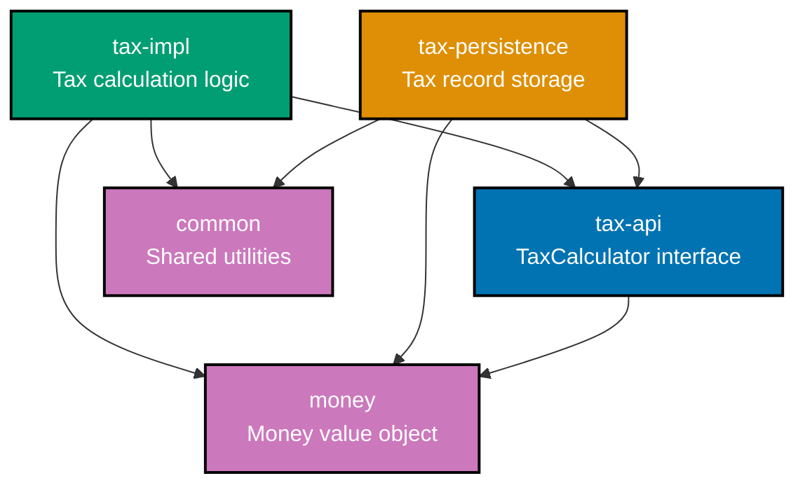
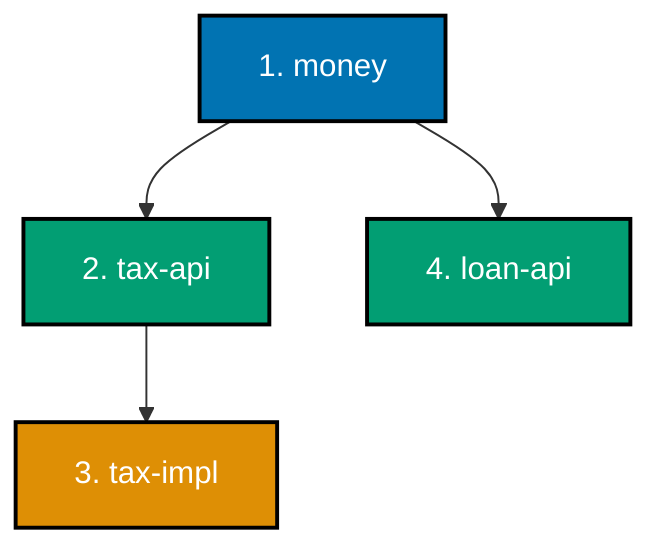

# Java Modules and Dependency Management

## Overview

Java's module system (JPMS - Java Platform Module System) and dependency management tools (Maven, Gradle) form the foundation of modern Java application structure. Understanding these systems is essential for building maintainable, secure, and reproducible enterprise applications.

This document explains:

- **Java Platform Module System (JPMS)** - Why modules matter, how they work, and when to use them
- **Maven Dependency Management** - How Maven resolves dependencies, manages versions, and ensures reproducibility
- **Gradle Alternative** - Modern build tool with performance benefits
- **Reproducible Builds** - Version locking, Maven Wrapper, deterministic builds
- **Multi-Module Projects** - Organizing large codebases into manageable modules
- **Private Repositories** - Hosting internal dependencies
- **Security Scanning** - Detecting vulnerable dependencies
- **Best Practices** - Proven approaches for dependency management

**Why This Matters for Finance Applications:**

In Islamic finance systems handling Tax calculations, Loan contracts, and Donation distributions, proper module and dependency management ensures:

- **Security**: Scoped module access prevents unauthorized access to sensitive financial data
- **Maintainability**: Clear module boundaries separate Tax calculation logic from Loan processing
- **Reproducibility**: Deterministic builds ensure identical Tax calculations across all environments
- **Auditability**: Explicit dependencies document all third-party code used in financial computations

**Comparison with Go:**

While Go's module system (go.mod) emphasizes simplicity with automatic dependency resolution and minimal configuration, Java's approach provides:

- **Explicit Module Boundaries**: JPMS requires explicit `exports`/`requires` declarations (Go relies on package visibility)
- **Mature Tooling Ecosystem**: Maven/Gradle offer extensive plugin ecosystems (Go prefers built-in tools)
- **Fine-Grained Access Control**: JPMS supports qualified exports and service encapsulation (Go has simpler internal/ convention)
- **Transitive Dependency Management**: Maven/Gradle provide sophisticated conflict resolution (Go uses minimal version selection)

Both systems aim for reproducibility, but Java's approach offers more control at the cost of additional configuration complexity.

## Quick Reference

**Jump to:**

- [Java Platform Module System JPMS](#java-platform-module-system-jpms) - module-info.java, exports, requires
- [Maven Dependency Management](#maven-dependency-management) - POM structure, scopes, conflicts
- [Gradle Alternative](#gradle-alternative) - build.gradle, version catalogs
- [Reproducible Builds](#reproducible-builds) - Maven Wrapper, version locking
- [Multi-Module Projects](#multi-module-projects) - Parent POM, reactor builds
- [Private Repositories](#private-repositories) - Nexus, Artifactory
- [Security Scanning](#security-scanning) - OWASP, Snyk, Dependabot
- [Best Practices](#best-practices) - Version management, minimal trees
- [Checklist](#verification-checklist) - Quality verification

**Related Documentation:**

- [Java Best Practices](./ex-so-stla-ja__best-practices.md) - Code organization, build automation, reproducibility
- [Java Security](./ex-so-stla-ja__security.md) - Secure dependency management
- [Java Type Safety](./ex-so-stla-ja__type-safety.md) - Module boundary enforcement
- [Golang Modules and Dependencies](../golang/ex-so-stla-go__modules-and-dependencies.md) - Simpler approach for comparison

## Principles Implemented

This document implements the following [software engineering principles](../../../../../governance/principles/software-engineering/README.md):

| Principle                                                                                                         | How This Document Applies It                                                                                                                 |
| ----------------------------------------------------------------------------------------------------------------- | -------------------------------------------------------------------------------------------------------------------------------------------- |
| **[Reproducibility First](../../../../../governance/principles/software-engineering/reproducibility.md)**         | Maven Wrapper for deterministic builds, version locking with dependency:lock, .sdkmanrc for Java version pinning                             |
| **[Explicit Over Implicit](../../../../../governance/principles/software-engineering/explicit-over-implicit.md)** | Explicit module declarations (module-info.java), explicit dependency versions (no version ranges), explicit transitive dependency exclusions |
| **[Automation Over Manual](../../../../../governance/principles/software-engineering/automation-over-manual.md)** | Automated dependency updates (Dependabot), automated security scanning (OWASP, Snyk), automated build verification (Maven Enforcer Plugin)   |
| **[Simplicity Over Complexity](../../../../../governance/principles/general/simplicity-over-complexity.md)**      | Minimal dependency trees, avoid unnecessary transitive dependencies, use BOM for version management instead of manual conflict resolution    |

**Principle-to-Feature Mapping:**

Each Java module/dependency feature directly serves specific principles:

- **module-info.java** → Explicit Over Implicit (explicit API contracts)
- **Maven Wrapper** → Reproducibility First (identical Maven versions)
- **dependency:lock** → Reproducibility First (checksums for all dependencies)
- **OWASP Dependency-Check** → Security First (automated vulnerability detection)
- **BOM (Bill of Materials)** → Simplicity Over Complexity (centralized version management)

## Java Platform Module System (JPMS)

### What are Java Modules?

The Java Platform Module System (JPMS), introduced in Java 9, provides a higher level of encapsulation than packages. Modules explicitly declare dependencies and define which packages are accessible to other modules.

**Key Concepts:**

- **Module**: A named collection of packages with explicit dependencies
- **module-info.java**: Module descriptor declaring exports and requirements
- **Readability**: Modules can only access packages explicitly exported by their dependencies
- **Strong Encapsulation**: Internal implementation packages remain inaccessible

**Why Modules Matter:**

1. **Security**: Restrict access to internal financial calculation logic
2. **Maintainability**: Clear boundaries between Tax, Loan, and Donation modules
3. **Reliability**: Compile-time verification of dependencies
4. **Performance**: JVM optimizations based on module graph

### Module Declaration (module-info.java)

A module descriptor defines the module's name, exported packages, and required dependencies.

**Basic Structure:**

```java
module com.oseplatform.tax {
  // Export packages (public API)
  exports com.oseplatform.tax.api;
  exports com.oseplatform.tax.model;

  // Require dependencies
  requires com.oseplatform.money;
  requires java.logging;

  // Optional: qualified exports
  exports com.oseplatform.tax.internal to com.oseplatform.tax.impl;
}
```

**Financial Example: Tax Calculation Module**

```java
// src/main/java/module-info.java
module com.oseplatform.tax {
  // Public API for Tax calculation
  exports com.oseplatform.tax.api;           // TaxCalculator interface
  exports com.oseplatform.tax.model;         // TaxRecord, TaxRate classes

  // Dependencies
  requires com.oseplatform.money;            // Money value object
  requires com.oseplatform.common;           // Shared utilities
  requires java.logging;                     // JDK logging

  // Internal packages (not exported)
  // - com.oseplatform.tax.internal         // Implementation details
  // - com.oseplatform.tax.strategy         // Calculation strategies
}
```

**Usage from Another Module:**

```java
// src/main/java/module-info.java (loan module)
module com.oseplatform.loan {
  requires com.oseplatform.tax;        // Can access exported packages only
  requires com.oseplatform.money;
}

// src/main/java/com/oseplatform/loan/LoanService.java
package com.oseplatform.loan;

import com.oseplatform.tax.api.TaxCalculator;           // PASS: exported
import com.oseplatform.tax.model.TaxRecord;             // PASS: exported
// import com.oseplatform.tax.internal.TaxEngine;       // FAIL: not exported

public class LoanService {
  private final TaxCalculator taxCalculator;

  public void calculateLoanTax(Money loanAmount) {
    TaxRecord tax = taxCalculator.calculate(loanAmount);
  }
}
```

### Exports and Requires

**exports** - Declares packages accessible to other modules.

```java
module com.oseplatform.donation {
  exports com.oseplatform.donation.api;           // Public API
  exports com.oseplatform.donation.model;         // Domain models
  // Internal packages not exported:
  // - com.oseplatform.donation.persistence
  // - com.oseplatform.donation.validation
}
```

**requires** - Declares module dependencies.

```java
module com.oseplatform.loan {
  requires com.oseplatform.money;                 // Direct dependency
  requires com.oseplatform.tax;                   // Direct dependency
  requires transitive com.oseplatform.common;     // Transitive (consumers get access)
  requires static com.oseplatform.analytics;      // Optional (compile-time only)
}
```

**Transitive Dependencies:**

When a module exports types from another module, use `requires transitive`:

```java
module com.oseplatform.tax.api {
  // TaxResult class uses Money in public API
  exports com.oseplatform.tax.api;

  // Consumers of tax.api need Money types
  requires transitive com.oseplatform.money;      // Transitive: consumers get Money
}

// Consumer module
module com.oseplatform.client {
  requires com.oseplatform.tax.api;
  // Automatically gets com.oseplatform.money (transitive)
}
```

**Static Dependencies (Compile-Only):**

For optional features or annotation processors:

```java
module com.oseplatform.tax {
  requires static lombok;                         // Compile-time only
  requires static org.checkerframework.checker.qual;  // Annotations only
}
```

### Modularizing an Application

**Before: Monolithic JAR (Pre-Java 9)**

```
tax-calculator.jar
├── com/oseplatform/tax/
│   ├── api/
│   │   └── TaxCalculator.java          (public)
│   ├── model/
│   │   └── TaxRecord.java              (public)
│   └── internal/
│       └── TaxEngine.java              (public - unintentionally!)
```

**Problem**: All classes are public. Internal implementation (`TaxEngine`) can be accessed by consumers.

**After: Modularized (Java 9+)**

```
tax-calculator-api.jar
├── module-info.java
│   module com.oseplatform.tax.api {
│     exports com.oseplatform.tax.api;
│     exports com.oseplatform.tax.model;
│     requires transitive com.oseplatform.money;
│   }
├── com/oseplatform/tax/
│   ├── api/
│   │   └── TaxCalculator.java          (exported)
│   ├── model/
│   │   └── TaxRecord.java              (exported)
│   └── internal/
│       └── TaxEngine.java              (encapsulated - not accessible)
```

**Benefit**: `TaxEngine` is truly internal. Compile-time enforcement prevents accidental usage.

### Financial Domain Example: Tax System Modules

**Module Dependency Graph:**



**Module Definitions:**

**1. money module (Foundation)**

```java
// money/src/main/java/module-info.java
module com.oseplatform.money {
  exports com.oseplatform.money;

  requires java.base;  // Implicit, can omit
}
```

**2. tax-api module (Public API)**

```java
// tax-api/src/main/java/module-info.java
module com.oseplatform.tax.api {
  exports com.oseplatform.tax.api;
  exports com.oseplatform.tax.model;

  requires transitive com.oseplatform.money;  // API uses Money
}
```

**3. tax-impl module (Implementation)**

```java
// tax-impl/src/main/java/module-info.java
module com.oseplatform.tax.impl {
  requires com.oseplatform.tax.api;
  requires com.oseplatform.money;
  requires com.oseplatform.common;

  // Provide service implementation
  provides com.oseplatform.tax.api.TaxCalculator
    with com.oseplatform.tax.impl.DefaultTaxCalculator;
}
```

**4. tax-persistence module (Data Access)**

```java
// tax-persistence/src/main/java/module-info.java
module com.oseplatform.tax.persistence {
  requires com.oseplatform.tax.api;
  requires com.oseplatform.money;
  requires java.sql;
  requires com.zaxxer.hikari;  // Connection pool

  exports com.oseplatform.tax.persistence;
}
```

**Benefits of This Structure:**

- **tax-api** defines contracts without implementation details
- **tax-impl** can change algorithms without affecting consumers
- **tax-persistence** separates data access from business logic
- Consumers depend only on **tax-api** (loose coupling)

### Service Loading (Advanced)

Modules can define service providers and consumers:

**Service Interface (tax-api):**

```java
// tax-api/src/main/java/module-info.java
module com.oseplatform.tax.api {
  exports com.oseplatform.tax.api;

  uses com.oseplatform.tax.api.TaxCalculator;  // Service consumer
}

// Service interface
package com.oseplatform.tax.api;
public interface TaxCalculator {
  TaxRecord calculate(Money income);
}
```

**Service Implementation (tax-impl):**

```java
// tax-impl/src/main/java/module-info.java
module com.oseplatform.tax.impl {
  requires com.oseplatform.tax.api;

  provides com.oseplatform.tax.api.TaxCalculator
    with com.oseplatform.tax.impl.DefaultTaxCalculator;  // Service provider
}

// Service implementation
package com.oseplatform.tax.impl;
public class DefaultTaxCalculator implements TaxCalculator {
  @Override
  public TaxRecord calculate(Money income) {
    // Implementation
  }
}
```

**Service Loading at Runtime:**

```java
import java.util.ServiceLoader;
import com.oseplatform.tax.api.TaxCalculator;

public class TaxService {
  public void processTax() {
    ServiceLoader<TaxCalculator> loader = ServiceLoader.load(TaxCalculator.class);
    TaxCalculator calculator = loader.findFirst()
      .orElseThrow(() -> new IllegalStateException("No TaxCalculator implementation found"));

    TaxRecord tax = calculator.calculate(income);
  }
}
```

**Benefits:**

- **Decoupling**: API and implementation in separate modules
- **Extensibility**: Multiple implementations can coexist
- **Discovery**: Runtime service discovery without explicit wiring

## Maven Dependency Management

Maven is the standard build tool for Java projects, providing dependency management, build lifecycle, and plugin ecosystem.

### POM Structure (pom.xml)

The Project Object Model (POM) file defines the project's configuration, dependencies, and build instructions.

**Minimal POM:**

```xml
<?xml version="1.0" encoding="UTF-8"?>
<project xmlns="http://maven.apache.org/POM/4.0.0"
         xmlns:xsi="http://www.w3.org/2001/XMLSchema-instance"
         xsi:schemaLocation="http://maven.apache.org/POM/4.0.0
                             http://maven.apache.org/xsd/maven-4.0.0.xsd">
  <modelVersion>4.0.0</modelVersion>

  <!-- Project Coordinates -->
  <groupId>com.oseplatform</groupId>
  <artifactId>tax-calculator</artifactId>
  <version>1.0.0</version>
  <packaging>jar</packaging>

  <!-- Properties -->
  <properties>
    <maven.compiler.source>21</maven.compiler.source>
    <maven.compiler.target>21</maven.compiler.target>
    <project.build.sourceEncoding>UTF-8</project.build.sourceEncoding>
  </properties>

  <!-- Dependencies -->
  <dependencies>
    <dependency>
      <groupId>com.oseplatform</groupId>
      <artifactId>money</artifactId>
      <version>1.0.0</version>
    </dependency>
  </dependencies>
</project>
```

### Dependency Scopes

Maven provides dependency scopes to control when dependencies are available:

| Scope                 | Compile | Test | Runtime | Packaging | Example Use Case                     |
| --------------------- | ------- | ---- | ------- | --------- | ------------------------------------ |
| **compile** (default) | ✅      | ✅   | ✅      | ✅        | Money, Tax API - needed everywhere   |
| **provided**          | ✅      | ✅   | ❌      | ❌        | Servlet API - container provides     |
| **runtime**           | ❌      | ✅   | ✅      | ✅        | JDBC driver - only needed at runtime |
| **test**              | ❌      | ✅   | ❌      | ❌        | JUnit, Mockito - testing only        |
| **system**            | ✅      | ✅   | ❌      | ❌        | Local JAR - avoid if possible        |

**Financial Example:**

```xml
<dependencies>
  <!-- Compile: API and domain models -->
  <dependency>
    <groupId>com.oseplatform</groupId>
    <artifactId>tax-api</artifactId>
    <version>1.0.0</version>
    <scope>compile</scope>  <!-- Default, can omit -->
  </dependency>

  <!-- Provided: Application server provides -->
  <dependency>
    <groupId>jakarta.servlet</groupId>
    <artifactId>jakarta.servlet-api</artifactId>
    <version>6.0.0</version>
    <scope>provided</scope>
  </dependency>

  <!-- Runtime: Database driver -->
  <dependency>
    <groupId>org.postgresql</groupId>
    <artifactId>postgresql</artifactId>
    <version>42.7.1</version>
    <scope>runtime</scope>
  </dependency>

  <!-- Test: Testing frameworks -->
  <dependency>
    <groupId>org.junit.jupiter</groupId>
    <artifactId>junit-jupiter</artifactId>
    <version>5.10.1</version>
    <scope>test</scope>
  </dependency>
</dependencies>
```

### Transitive Dependencies

Maven automatically resolves transitive dependencies (dependencies of your dependencies).

**Dependency Tree Example:**

```
com.oseplatform:tax-calculator:1.0.0
├── com.oseplatform:money:1.0.0               (direct)
│   └── com.fasterxml.jackson.core:jackson-databind:2.16.0  (transitive)
│       ├── com.fasterxml.jackson.core:jackson-annotations:2.16.0
│       └── com.fasterxml.jackson.core:jackson-core:2.16.0
└── org.slf4j:slf4j-api:2.0.9                (direct)
```

**View Dependency Tree:**

```bash
./mvnw dependency:tree
```

**Problem: Dependency Conflicts**

When two dependencies require different versions of the same library:

```
tax-calculator
├── library-a:1.0.0
│   └── commons-lang3:3.12.0  (transitive)
└── library-b:2.0.0
    └── commons-lang3:3.14.0  (transitive)
```

**Maven Resolution Strategy: Nearest Definition**

Maven chooses the version closest to the root in the dependency tree:

1. Direct dependency wins over transitive
2. If both transitive, first declared wins

**Solution 1: Exclude Transitive Dependency**

```xml
<dependency>
  <groupId>com.example</groupId>
  <artifactId>library-a</artifactId>
  <version>1.0.0</version>
  <exclusions>
    <exclusion>
      <groupId>org.apache.commons</groupId>
      <artifactId>commons-lang3</artifactId>
    </exclusion>
  </exclusions>
</dependency>
```

**Solution 2: Declare Explicit Version**

```xml
<!-- Explicitly declare preferred version -->
<dependency>
  <groupId>org.apache.commons</groupId>
  <artifactId>commons-lang3</artifactId>
  <version>3.14.0</version>
</dependency>
```

### Version Conflicts and Resolution

**Example: Logging Conflicts**

Multiple logging frameworks can conflict:

```xml
<!-- Problem: Multiple logging implementations -->
<dependencies>
  <dependency>
    <groupId>org.springframework.boot</groupId>
    <artifactId>spring-boot-starter-web</artifactId>
    <!-- Brings logback via spring-boot-starter-logging -->
  </dependency>

  <dependency>
    <groupId>some.library</groupId>
    <artifactId>legacy-lib</artifactId>
    <!-- Brings log4j 1.x (outdated, vulnerable) -->
  </dependency>
</dependencies>
```

**Solution: Exclude and Bridge**

```xml
<dependency>
  <groupId>some.library</groupId>
  <artifactId>legacy-lib</artifactId>
  <version>1.0.0</version>
  <exclusions>
    <!-- Exclude log4j -->
    <exclusion>
      <groupId>log4j</groupId>
      <artifactId>log4j</artifactId>
    </exclusion>
  </exclusions>
</dependency>

<!-- Add SLF4J bridge for log4j calls -->
<dependency>
  <groupId>org.slf4j</groupId>
  <artifactId>log4j-over-slf4j</artifactId>
  <version>2.0.9</version>
</dependency>
```

### Bill of Materials (BOM)

A BOM provides centralized version management for related dependencies.

**Using Spring Boot BOM:**

```xml
<dependencyManagement>
  <dependencies>
    <dependency>
      <groupId>org.springframework.boot</groupId>
      <artifactId>spring-boot-dependencies</artifactId>
      <version>3.2.0</version>
      <type>pom</type>
      <scope>import</scope>
    </dependency>
  </dependencies>
</dependencyManagement>

<!-- Dependencies without version (managed by BOM) -->
<dependencies>
  <dependency>
    <groupId>org.springframework.boot</groupId>
    <artifactId>spring-boot-starter-web</artifactId>
    <!-- Version inherited from BOM -->
  </dependency>

  <dependency>
    <groupId>com.fasterxml.jackson.core</groupId>
    <artifactId>jackson-databind</artifactId>
    <!-- Version inherited from BOM -->
  </dependency>
</dependencies>
```

**Creating Custom BOM:**

```xml
<!-- ose-platform-bom/pom.xml -->
<project>
  <modelVersion>4.0.0</modelVersion>
  <groupId>com.oseplatform</groupId>
  <artifactId>ose-platform-bom</artifactId>
  <version>1.0.0</version>
  <packaging>pom</packaging>

  <dependencyManagement>
    <dependencies>
      <!-- Internal modules -->
      <dependency>
        <groupId>com.oseplatform</groupId>
        <artifactId>tax-api</artifactId>
        <version>1.0.0</version>
      </dependency>

      <dependency>
        <groupId>com.oseplatform</groupId>
        <artifactId>loan-api</artifactId>
        <version>1.0.0</version>
      </dependency>

      <!-- Third-party versions -->
      <dependency>
        <groupId>org.postgresql</groupId>
        <artifactId>postgresql</artifactId>
        <version>42.7.1</version>
      </dependency>
    </dependencies>
  </dependencyManagement>
</project>
```

**Using Custom BOM:**

```xml
<dependencyManagement>
  <dependencies>
    <dependency>
      <groupId>com.oseplatform</groupId>
      <artifactId>ose-platform-bom</artifactId>
      <version>1.0.0</version>
      <type>pom</type>
      <scope>import</scope>
    </dependency>
  </dependencies>
</dependencyManagement>
```

**Benefits:**

- **Consistency**: All modules use same versions
- **Simplicity**: No version numbers in individual POMs
- **Maintenance**: Update versions in one place

## Gradle Alternative

Gradle is a modern build tool offering better performance and flexibility than Maven.

### build.gradle (Groovy DSL)

```groovy
plugins {
  id 'java'
  id 'application'
}

group = 'com.oseplatform'
version = '1.0.0'

java {
  sourceCompatibility = JavaVersion.VERSION_21
  targetCompatibility = JavaVersion.VERSION_21
}

repositories {
  mavenCentral()
}

dependencies {
  // Compile dependencies
  implementation 'com.oseplatform:money:1.0.0'
  implementation 'com.oseplatform:tax-api:1.0.0'

  // Runtime dependencies
  runtimeOnly 'org.postgresql:postgresql:42.7.1'

  // Test dependencies
  testImplementation 'org.junit.jupiter:junit-jupiter:5.10.1'
}

test {
  useJUnitPlatform()
}
```

### build.gradle.kts (Kotlin DSL)

Modern Gradle projects prefer Kotlin DSL for type safety:

```kotlin
plugins {
  java
  application
}

group = "com.oseplatform"
version = "1.0.0"

java {
  sourceCompatibility = JavaVersion.VERSION_21
  targetCompatibility = JavaVersion.VERSION_21
}

repositories {
  mavenCentral()
}

dependencies {
  implementation("com.oseplatform:money:1.0.0")
  implementation("com.oseplatform:tax-api:1.0.0")

  runtimeOnly("org.postgresql:postgresql:42.7.1")

  testImplementation("org.junit.jupiter:junit-jupiter:5.10.1")
}

tasks.test {
  useJUnitPlatform()
}
```

### Version Catalogs (Gradle 7+)

Centralized version management similar to Maven BOM:

**gradle/libs.versions.toml:**

```toml
[versions]
postgresql = "42.7.1"
junit = "5.10.1"
jackson = "2.16.0"

[libraries]
postgresql = { module = "org.postgresql:postgresql", version.ref = "postgresql" }
junit-jupiter = { module = "org.junit.jupiter:junit-jupiter", version.ref = "junit" }
jackson-databind = { module = "com.fasterxml.jackson.core:jackson-databind", version.ref = "jackson" }

[bundles]
testing = ["junit-jupiter"]
```

**build.gradle.kts (using version catalog):**

```kotlin
dependencies {
  implementation(libs.jackson.databind)
  runtimeOnly(libs.postgresql)
  testImplementation(libs.bundles.testing)
}
```

**Benefits:**

- Type-safe dependency references
- Centralized version management
- IDE autocomplete support
- Shared across multi-module projects

### Performance Advantages

**Build Cache:**

```kotlin
// settings.gradle.kts
buildCache {
  local {
    isEnabled = true
  }
}
```

**Incremental Compilation:**

Gradle only recompiles changed classes, significantly faster than Maven.

**Parallel Execution:**

```bash
./gradlew build --parallel
```

**Daemon:**

Gradle daemon keeps JVM warm, reducing build startup time.

## Reproducible Builds

Reproducibility ensures identical builds from the same source code across all environments.

### Maven Wrapper (.mvn/wrapper)

Maven Wrapper ensures all developers use the same Maven version.

**Setup:**

```bash
mvn wrapper:wrapper -Dmaven=3.9.12
```

**Generated Files:**

```
project/
├── .mvn/
│   └── wrapper/
│       ├── maven-wrapper.jar
│       ├── maven-wrapper.properties
│       └── MavenWrapperDownloader.java
├── mvnw          (Unix wrapper script)
└── mvnw.cmd      (Windows wrapper script)
```

**maven-wrapper.properties:**

```properties
distributionUrl=https://repo.maven.apache.org/maven2/org/apache/maven/apache-maven/3.9.12/apache-maven-3.9.12-bin.zip
wrapperUrl=https://repo.maven.apache.org/maven2/org/apache/maven/wrapper/maven-wrapper/3.3.2/maven-wrapper-3.3.2.jar
```

**Usage:**

```bash
# Use wrapper instead of system Maven
./mvnw clean install

# All developers get Maven 3.9.12 automatically
```

**Benefits:**

- **Version Consistency**: Everyone uses Maven 3.9.12
- **No Installation Required**: Maven downloads automatically
- **CI/CD Integration**: Same Maven version in CI as local

### Version Locking (Maven Lock Plugin)

Lock dependency versions with checksums for reproducibility.

**pom.xml:**

```xml
<build>
  <plugins>
    <plugin>
      <groupId>io.github.chains-project</groupId>
      <artifactId>maven-lockfile</artifactId>
      <version>5.1.0</version>
      <executions>
        <execution>
          <id>validate</id>
          <goals>
            <goal>validate</goal>
          </goals>
        </execution>
      </executions>
    </plugin>
  </plugins>
</build>
```

**Generate Lockfile:**

```bash
./mvnw io.github.chains-project:maven-lockfile:5.1.0:generate
```

**Generated lockfile.json:**

```json
{
  "dependencies": [
    {
      "groupId": "com.oseplatform",
      "artifactId": "money",
      "version": "1.0.0",
      "sha256": "abc123...",
      "type": "jar"
    }
  ]
}
```

**Validation:**

```bash
./mvnw verify
# Fails if dependencies don't match lockfile checksums
```

### Maven Enforcer Plugin

Enforce build environment consistency:

```xml
<plugin>
  <groupId>org.apache.maven.plugins</groupId>
  <artifactId>maven-enforcer-plugin</artifactId>
  <version>3.4.1</version>
  <executions>
    <execution>
      <id>enforce-versions</id>
      <goals>
        <goal>enforce</goal>
      </goals>
      <configuration>
        <rules>
          <!-- Require Java 21 -->
          <requireJavaVersion>
            <version>[21,22)</version>
          </requireJavaVersion>

          <!-- Require Maven 3.9+ -->
          <requireMavenVersion>
            <version>[3.9,)</version>
          </requireMavenVersion>

          <!-- No duplicate dependencies -->
          <banDuplicatePomDependencyVersions/>

          <!-- Require dependency convergence -->
          <dependencyConvergence/>

          <!-- Ban vulnerable dependencies -->
          <bannedDependencies>
            <excludes>
              <exclude>log4j:log4j:*:*:compile</exclude>  <!-- CVE-2021-44228 -->
              <exclude>commons-collections:commons-collections:[3.0,3.2.2]</exclude>
            </excludes>
          </bannedDependencies>
        </rules>
      </configuration>
    </execution>
  </executions>
</plugin>
```

### .sdkmanrc for Java Version

Pin Java version using SDKMAN:

**.sdkmanrc:**

```bash
java=21.0.1-tem
```

**Usage:**

```bash
# Install SDKMAN
curl -s "https://get.sdkman.io" | bash

# Auto-use Java version when entering directory
sdk env install
```

**Benefits:**

- **Version Consistency**: All developers use Java 21.0.1
- **Auto-Switching**: SDKMAN switches versions automatically
- **CI/CD Integration**: Use same Java version in CI

## Multi-Module Projects

Large projects are organized into multiple Maven modules (subprojects).

### Parent POM

**Structure:**

```
ose-platform/
├── pom.xml                    (parent)
├── money/
│   └── pom.xml                (module)
├── tax-api/
│   └── pom.xml                (module)
├── tax-impl/
│   └── pom.xml                (module)
└── loan-api/
    └── pom.xml                (module)
```

**Parent pom.xml:**

```xml
<?xml version="1.0" encoding="UTF-8"?>
<project>
  <modelVersion>4.0.0</modelVersion>

  <groupId>com.oseplatform</groupId>
  <artifactId>ose-platform-parent</artifactId>
  <version>1.0.0</version>
  <packaging>pom</packaging>

  <!-- Modules -->
  <modules>
    <module>money</module>
    <module>tax-api</module>
    <module>tax-impl</module>
    <module>loan-api</module>
  </modules>

  <!-- Shared properties -->
  <properties>
    <maven.compiler.source>21</maven.compiler.source>
    <maven.compiler.target>21</maven.compiler.target>
    <project.build.sourceEncoding>UTF-8</project.build.sourceEncoding>
  </properties>

  <!-- Dependency management (BOM) -->
  <dependencyManagement>
    <dependencies>
      <dependency>
        <groupId>org.junit.jupiter</groupId>
        <artifactId>junit-jupiter</artifactId>
        <version>5.10.1</version>
        <scope>test</scope>
      </dependency>
    </dependencies>
  </dependencyManagement>

  <!-- Build configuration -->
  <build>
    <pluginManagement>
      <plugins>
        <plugin>
          <groupId>org.apache.maven.plugins</groupId>
          <artifactId>maven-compiler-plugin</artifactId>
          <version>3.12.1</version>
        </plugin>
      </plugins>
    </pluginManagement>
  </build>
</project>
```

### Module POM

**money/pom.xml:**

```xml
<?xml version="1.0" encoding="UTF-8"?>
<project>
  <modelVersion>4.0.0</modelVersion>

  <!-- Parent reference -->
  <parent>
    <groupId>com.oseplatform</groupId>
    <artifactId>ose-platform-parent</artifactId>
    <version>1.0.0</version>
  </parent>

  <!-- Module coordinates -->
  <artifactId>money</artifactId>

  <!-- Dependencies (versions from parent) -->
  <dependencies>
    <dependency>
      <groupId>org.junit.jupiter</groupId>
      <artifactId>junit-jupiter</artifactId>
      <!-- Version inherited from parent -->
      <scope>test</scope>
    </dependency>
  </dependencies>
</project>
```

### Module Inheritance

Child modules inherit from parent:

- **Properties**: compiler versions, encoding
- **Dependency versions**: via `<dependencyManagement>`
- **Plugin versions**: via `<pluginManagement>`
- **Build configuration**: shared plugin config

**Override in Child:**

```xml
<!-- money/pom.xml -->
<properties>
  <!-- Override parent property -->
  <maven.compiler.target>17</maven.compiler.target>
</properties>
```

### Reactor Build Order

Maven builds modules in dependency order:



**Build All Modules:**

```bash
# From parent directory
./mvnw clean install
```

**Build Specific Module and Dependencies:**

```bash
./mvnw clean install -pl tax-impl -am
# -pl: project list (tax-impl)
# -am: also make (build dependencies)
```

### Financial Platform Example

**Complete Multi-Module Structure:**

```
ose-platform/
├── pom.xml                          (parent)
├── ose-platform-bom/
│   └── pom.xml                      (BOM for version management)
├── common/
│   └── pom.xml                      (shared utilities)
├── money/
│   └── pom.xml                      (Money value object)
├── tax/
│   ├── tax-api/
│   │   └── pom.xml                  (Tax API)
│   ├── tax-impl/
│   │   └── pom.xml                  (Tax implementation)
│   └── tax-persistence/
│       └── pom.xml                  (Tax data access)
├── loan/
│   ├── loan-api/
│   │   └── pom.xml                  (Loan API)
│   └── loan-impl/
│       └── pom.xml                  (Loan implementation)
└── donation/
    ├── donation-api/
    │   └── pom.xml                  (Donation API)
    └── donation-impl/
        └── pom.xml                  (Donation implementation)
```

**Parent pom.xml:**

```xml
<modules>
  <module>ose-platform-bom</module>
  <module>common</module>
  <module>money</module>
  <module>tax/tax-api</module>
  <module>tax/tax-impl</module>
  <module>tax/tax-persistence</module>
  <module>loan/loan-api</module>
  <module>loan/loan-impl</module>
  <module>donation/donation-api</module>
  <module>donation/donation-impl</module>
</modules>
```

**Benefits:**

- **Separation of Concerns**: Tax, Loan, Donation are independent
- **Reusability**: `money` module used by all financial modules
- **API Stability**: `-api` modules define contracts, `-impl` can change
- **Parallel Development**: Teams can work on different modules independently

## Private Repositories

Host internal dependencies in private Maven repositories.

### Nexus Repository Manager

**Setup Repository in pom.xml:**

```xml
<repositories>
  <repository>
    <id>ose-private-releases</id>
    <name>OSE Private Releases</name>
    <url>https://nexus.oseplatform.com/repository/maven-releases/</url>
    <releases>
      <enabled>true</enabled>
    </releases>
    <snapshots>
      <enabled>false</enabled>
    </snapshots>
  </repository>

  <repository>
    <id>ose-private-snapshots</id>
    <name>OSE Private Snapshots</name>
    <url>https://nexus.oseplatform.com/repository/maven-snapshots/</url>
    <releases>
      <enabled>false</enabled>
    </releases>
    <snapshots>
      <enabled>true</enabled>
    </snapshots>
  </repository>
</repositories>
```

### Credentials in settings.xml

Store credentials in `~/.m2/settings.xml` (not in POM):

```xml
<settings>
  <servers>
    <server>
      <id>ose-private-releases</id>
      <username>${env.NEXUS_USERNAME}</username>
      <password>${env.NEXUS_PASSWORD}</password>
    </server>

    <server>
      <id>ose-private-snapshots</id>
      <username>${env.NEXUS_USERNAME}</username>
      <password>${env.NEXUS_PASSWORD}</password>
    </server>
  </servers>
</settings>
```

**Environment Variables:**

```bash
export NEXUS_USERNAME=your-username
export NEXUS_PASSWORD=your-password
```

### Publishing Artifacts

**Configure Distribution in pom.xml:**

```xml
<distributionManagement>
  <repository>
    <id>ose-private-releases</id>
    <name>OSE Private Releases</name>
    <url>https://nexus.oseplatform.com/repository/maven-releases/</url>
  </repository>

  <snapshotRepository>
    <id>ose-private-snapshots</id>
    <name>OSE Private Snapshots</name>
    <url>https://nexus.oseplatform.com/repository/maven-snapshots/</url>
  </snapshotRepository>
</distributionManagement>
```

**Deploy Artifact:**

```bash
# Release
./mvnw clean deploy

# Snapshot (version ends with -SNAPSHOT)
./mvnw clean deploy
```

### Artifactory Alternative

JFrog Artifactory is another popular option:

```xml
<repositories>
  <repository>
    <id>artifactory-releases</id>
    <url>https://artifactory.oseplatform.com/artifactory/libs-release</url>
  </repository>
</repositories>
```

## Security Scanning

Detect vulnerable dependencies automatically.

### OWASP Dependency-Check

**pom.xml:**

```xml
<plugin>
  <groupId>org.owasp</groupId>
  <artifactId>dependency-check-maven</artifactId>
  <version>9.0.9</version>
  <executions>
    <execution>
      <goals>
        <goal>check</goal>
      </goals>
    </execution>
  </executions>
  <configuration>
    <!-- Fail build if CVSS score >= 7 (high severity) -->
    <failBuildOnCVSS>7</failBuildOnCVSS>

    <!-- Suppress false positives -->
    <suppressionFiles>
      <suppressionFile>owasp-suppressions.xml</suppressionFile>
    </suppressionFiles>
  </configuration>
</plugin>
```

**Run Scan:**

```bash
./mvnw dependency-check:check
```

**Generated Report:**

```
target/dependency-check-report.html
```

**Example Vulnerability Report:**

```
log4j-core-2.14.1.jar
  CVE-2021-44228 (CVSS: 10.0) - CRITICAL
  Description: Remote code execution via JNDI lookup
  Solution: Upgrade to log4j-core 2.17.1 or higher
```

### Snyk Integration

**pom.xml:**

```xml
<plugin>
  <groupId>io.snyk</groupId>
  <artifactId>snyk-maven-plugin</artifactId>
  <version>2.2.0</version>
  <executions>
    <execution>
      <id>snyk-test</id>
      <goals>
        <goal>test</goal>
      </goals>
    </execution>
  </executions>
</plugin>
```

**Run Scan:**

```bash
./mvnw snyk:test
```

### Dependabot (GitHub)

Automated dependency updates:

**.github/dependabot.yml:**

```yaml
version: 2
updates:
  - package-ecosystem: "maven"
    directory: "/"
    schedule:
      interval: "weekly"
    open-pull-requests-limit: 5
    labels:
      - "dependencies"
      - "security"
    reviewers:
      - "security-team"
```

**Benefits:**

- Automatic pull requests for dependency updates
- Security vulnerability alerts
- Configurable update schedule

### Trivy (Container Scanning)

Scan dependencies in Docker images:

```bash
# Scan Maven project
trivy fs .

# Scan Docker image
trivy image ose-platform:latest
```

**Output:**

```
ose-platform (maven)
====================
Total: 3 (CRITICAL: 1, HIGH: 2)

┌─────────────────────┬───────────────┬──────────┬───────────────────┐
│       Library       │ Vulnerability │ Severity │  Installed Ver.   │
├─────────────────────┼───────────────┼──────────┼───────────────────┤
│ jackson-databind    │ CVE-2023-XXXX │ CRITICAL │ 2.14.0            │
│ spring-core         │ CVE-2023-YYYY │ HIGH     │ 6.0.0             │
└─────────────────────┴───────────────┴──────────┴───────────────────┘
```

## Best Practices

### 1. Keep Dependencies Updated

**Regular Updates:**

```bash
# Check for updates
./mvnw versions:display-dependency-updates

# Update to latest versions
./mvnw versions:use-latest-versions

# Update parent
./mvnw versions:update-parent
```

**Automate with Dependabot** (see Security Scanning section).

### 2. Minimize Dependency Trees

**Prefer libraries with few transitive dependencies:**

**Bad: Heavy Dependency Tree**

```xml
<dependency>
  <groupId>org.springframework.boot</groupId>
  <artifactId>spring-boot-starter-web</artifactId>
  <!-- Pulls 40+ transitive dependencies -->
</dependency>
```

**Good: Minimal Dependencies**

```xml
<dependency>
  <groupId>com.sparkjava</groupId>
  <artifactId>spark-core</artifactId>
  <!-- Pulls 5 transitive dependencies -->
</dependency>
```

**View Dependency Size:**

```bash
./mvnw dependency:tree -Dverbose
```

### 3. Avoid Version Ranges

**Bad: Version Ranges**

```xml
<dependency>
  <groupId>com.example</groupId>
  <artifactId>library</artifactId>
  <version>[1.0,2.0)</version>  <!-- FAIL: Non-deterministic -->
</dependency>
```

**Good: Exact Versions**

```xml
<dependency>
  <groupId>com.example</groupId>
  <artifactId>library</artifactId>
  <version>1.5.0</version>  <!-- PASS: Deterministic -->
</dependency>
```

### 4. Use BOM for Version Management

**Instead of:**

```xml
<dependency>
  <groupId>com.fasterxml.jackson.core</groupId>
  <artifactId>jackson-databind</artifactId>
  <version>2.16.0</version>
</dependency>

<dependency>
  <groupId>com.fasterxml.jackson.dataformat</groupId>
  <artifactId>jackson-dataformat-yaml</artifactId>
  <version>2.16.0</version>  <!-- Manual version sync -->
</dependency>
```

**Use BOM:**

```xml
<dependencyManagement>
  <dependencies>
    <dependency>
      <groupId>com.fasterxml.jackson</groupId>
      <artifactId>jackson-bom</artifactId>
      <version>2.16.0</version>
      <type>pom</type>
      <scope>import</scope>
    </dependency>
  </dependencies>
</dependencyManagement>

<dependencies>
  <dependency>
    <groupId>com.fasterxml.jackson.core</groupId>
    <artifactId>jackson-databind</artifactId>
    <!-- Version from BOM -->
  </dependency>

  <dependency>
    <groupId>com.fasterxml.jackson.dataformat</groupId>
    <artifactId>jackson-dataformat-yaml</artifactId>
    <!-- Version from BOM -->
  </dependency>
</dependencies>
```

### 5. Document Dependency Rationale

**pom.xml with Comments:**

```xml
<dependencies>
  <!-- Tax calculation precision -->
  <dependency>
    <groupId>org.javamoney</groupId>
    <artifactId>moneta</artifactId>
    <version>1.4.2</version>
    <!-- JSR 354 Money API for accurate financial calculations -->
  </dependency>

  <!-- Database connectivity -->
  <dependency>
    <groupId>org.postgresql</groupId>
    <artifactId>postgresql</artifactId>
    <version>42.7.1</version>
    <!-- PostgreSQL JDBC driver for Tax record persistence -->
    <scope>runtime</scope>
  </dependency>
</dependencies>
```

### 6. Separate Test Dependencies

**Clear Scope Separation:**

```xml
<dependencies>
  <!-- Production dependencies -->
  <dependency>
    <groupId>com.oseplatform</groupId>
    <artifactId>tax-api</artifactId>
    <version>1.0.0</version>
  </dependency>

  <!-- Test dependencies -->
  <dependency>
    <groupId>org.junit.jupiter</groupId>
    <artifactId>junit-jupiter</artifactId>
    <version>5.10.1</version>
    <scope>test</scope>
  </dependency>

  <dependency>
    <groupId>org.mockito</groupId>
    <artifactId>mockito-core</artifactId>
    <version>5.8.0</version>
    <scope>test</scope>
  </dependency>
</dependencies>
```

### 7. Exclude Unused Transitive Dependencies

**Example: Exclude Logging**

```xml
<dependency>
  <groupId>com.example</groupId>
  <artifactId>library</artifactId>
  <version>1.0.0</version>
  <exclusions>
    <!-- Exclude transitive logging (we use SLF4J) -->
    <exclusion>
      <groupId>commons-logging</groupId>
      <artifactId>commons-logging</artifactId>
    </exclusion>
    <exclusion>
      <groupId>log4j</groupId>
      <artifactId>log4j</artifactId>
    </exclusion>
  </exclusions>
</dependency>
```

### 8. Use Maven Wrapper

**Always commit Maven Wrapper:**

```bash
./mvnw wrapper:wrapper -Dmaven=3.9.12
git add .mvn mvnw mvnw.cmd
git commit -m "chore: add Maven Wrapper"
```

### 9. Enforce Build Standards

**Maven Enforcer Plugin:**

```xml
<plugin>
  <groupId>org.apache.maven.plugins</groupId>
  <artifactId>maven-enforcer-plugin</artifactId>
  <version>3.4.1</version>
  <executions>
    <execution>
      <id>enforce-standards</id>
      <goals>
        <goal>enforce</goal>
      </goals>
      <configuration>
        <rules>
          <requireJavaVersion>
            <version>[21,22)</version>
          </requireJavaVersion>
          <requireMavenVersion>
            <version>[3.9,)</version>
          </requireMavenVersion>
          <dependencyConvergence/>
          <banDuplicatePomDependencyVersions/>
        </rules>
      </configuration>
    </execution>
  </executions>
</plugin>
```

### 10. Comparison with Go

**Java vs Go Dependency Management:**

| Aspect                      | Java (Maven)                       | Go (go.mod)                    |
| --------------------------- | ---------------------------------- | ------------------------------ |
| **Configuration**           | XML (pom.xml)                      | Text (go.mod)                  |
| **Dependency Resolution**   | Nearest definition                 | Minimal version selection      |
| **Transitive Dependencies** | Automatic with conflict resolution | Automatic with MVS             |
| **Version Locking**         | Optional (lockfile plugin)         | Built-in (go.sum)              |
| **Build Tool**              | External (Maven/Gradle)            | Built-in (go build)            |
| **Module System**           | JPMS (explicit exports/requires)   | Package visibility (internal/) |
| **Performance**             | Slower (plugin-based)              | Faster (built-in)              |
| **Ecosystem**               | Vast plugin ecosystem              | Minimal, focused tools         |

**Java Advantages:**

- Mature plugin ecosystem (code generation, analysis)
- Fine-grained module access control (JPMS)
- Sophisticated conflict resolution

**Go Advantages:**

- Simpler configuration (go.mod vs pom.xml)
- Built-in version locking (go.sum)
- Faster builds (no external tool)
- Minimal Version Selection (predictable upgrades)

## Verification Checklist

Before releasing Java modules:

- [ ] **Module Descriptor**: module-info.java defines clear API boundaries
- [ ] **Dependency Scopes**: Correct scopes (compile, provided, runtime, test)
- [ ] **Version Pinning**: Exact versions (no ranges)
- [ ] **BOM Usage**: Version management via Bill of Materials
- [ ] **Transitive Dependencies**: Unnecessary transitives excluded
- [ ] **Maven Wrapper**: Committed (.mvn/wrapper)
- [ ] **Java Version**: Pinned in .sdkmanrc
- [ ] **Enforcer Plugin**: Build standards enforced
- [ ] **Security Scanning**: OWASP Dependency-Check or Snyk configured
- [ ] **Lockfile**: dependency-lock plugin configured (optional but recommended)
- [ ] **Dependency Tree**: Minimal and justified (`mvn dependency:tree`)
- [ ] **Documentation**: Dependency rationale documented
- [ ] **Multi-Module**: Parent POM structure if needed
- [ ] **Private Repo**: Configured if using internal dependencies
- [ ] **Reproducible**: Same build on all machines (`mvn clean install`)

## Related Documentation

- [Java Best Practices](./ex-so-stla-ja__best-practices.md) - Build automation, reproducibility, code organization
- [Java Security](./ex-so-stla-ja__security.md) - Secure dependency management
- [Java Type Safety](./ex-so-stla-ja__type-safety.md) - Module boundary enforcement
- [Java Anti-Patterns](./ex-so-stla-ja__anti-patterns.md) - Dependency anti-patterns to avoid
- [Golang Modules and Dependencies](../golang/ex-so-stla-go__modules-and-dependencies.md) - Simpler approach for comparison
- [Reproducibility First Principle](../../../../../governance/principles/software-engineering/reproducibility.md) - Foundational reproducibility principle

## Sources

**Java Platform Module System (JPMS):**

- [JEP 261: Module System](https://openjdk.org/jeps/261) - Official JPMS specification
- [Java Module System Guide](https://dev.java/learn/modules/) - Oracle's comprehensive module guide
- [The Java Module System (Book)](https://www.manning.com/books/the-java-module-system) - Nicolai Parlog, Manning Publications

**Maven:**

- [Maven Official Documentation](https://maven.apache.org/guides/) - Build lifecycle, POM reference, plugins
- [Maven Dependency Mechanism](https://maven.apache.org/guides/introduction/introduction-to-dependency-mechanism.html) - Transitive dependencies, conflict resolution
- [Maven Enforcer Plugin](https://maven.apache.org/enforcer/maven-enforcer-plugin/) - Build standard enforcement

**Gradle:**

- [Gradle User Manual](https://docs.gradle.org/current/userguide/userguide.html) - Build configuration, dependency management
- [Gradle Version Catalogs](https://docs.gradle.org/current/userguide/platforms.html) - Centralized version management

**Reproducible Builds:**

- [Reproducible Builds Project](https://reproducible-builds.org/) - Best practices for deterministic builds
- [Maven Lockfile Plugin](https://github.com/chains-project/maven-lockfile) - Dependency checksums for reproducibility

**Security:**

- [OWASP Dependency-Check](https://owasp.org/www-project-dependency-check/) - Vulnerability scanning for dependencies
- [Snyk](https://snyk.io/product/open-source-security-management/) - Automated security scanning
- [National Vulnerability Database](https://nvd.nist.gov/) - CVE database for Java libraries

---

**Last Updated**: 2026-01-22
