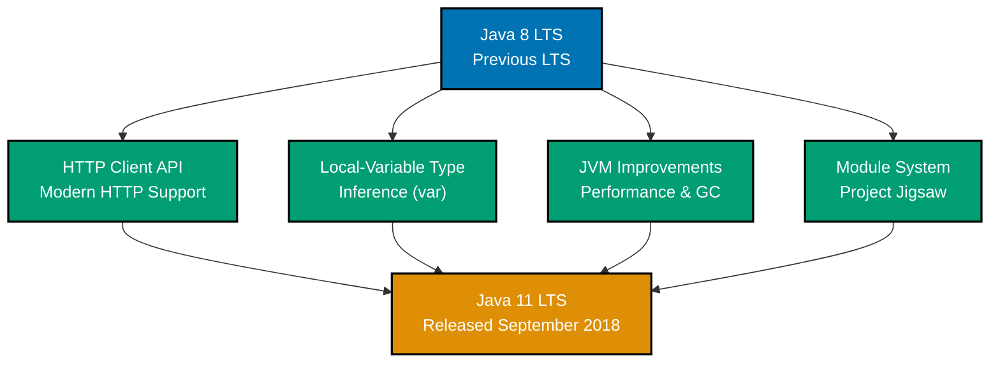
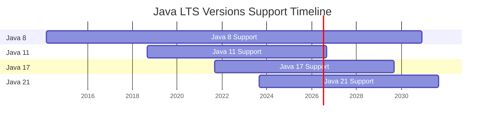
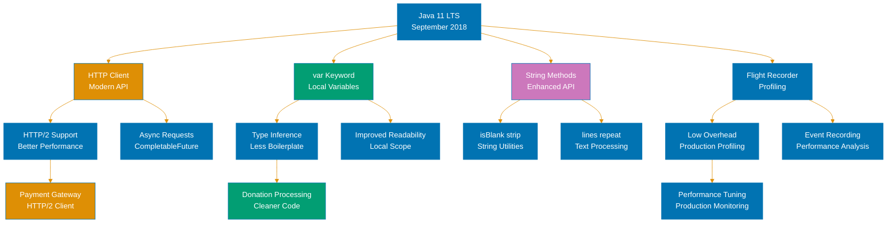

# Java 11 Release

## Overview

Java 11 introduces new features, JVM performance improvements, and language enhancements. This release continues Java's evolution toward better performance and developer productivity.

## Key Features

This release includes improvements to the JVM, language features, and standard library.

### Feature Timeline

### LTS Support Timeline

## Breaking Changes

Consult the official Java 11 documentation for detailed breaking changes and migration guidance.

## References

- [Java 11 Release Notes](https://www.oracle.com/java/technologies/javase/11-relnotes.html)
- [Java Documentation](https://docs.oracle.com/en/java/)

---

**Last Updated**: 2026-01-24
**Java Version**: 17+ (baseline LTS), 21+ (latest LTS), 25 (latest stable)
**Maintainers**: OSE Platform Documentation Team

